# Building Blocks

## Key Concepts
- **Load Balancer**: Distributes traffic across servers (L4 vs L7, algorithms)
- **Cache**: Fast storage layer in front of slow source of truth
- **Message Queue**: Async decoupling of producers and consumers
- **Rate Limiter**: Protects services from overload and abuse
- **Consistent Hashing**: Minimal data movement when nodes change
- **CDN**: Geographically distributed cache for static/dynamic content
- **API Gateway**: Single entry point for microservices (auth, routing, rate limit)
- **Service Discovery**: How services find each other dynamically
- **Circuit Breaker**: Prevents cascading failures by failing fast
- **Idempotency**: Safe-to-retry writes via idempotency keys

## Why It Matters
- These are the Lego blocks of every large-scale system
- Design problems reuse these patterns constantly
- Understanding trade-offs lets you compose the right architecture
- Most interview questions are combinations of these blocks

## Common Problems
- Design a load balancer
- Design a caching layer
- Design a message queue
- Design a rate limiter
- Design a consistent hashing ring
- Design a CDN
- Design an API gateway

## Techniques / Patterns
- Load balancing algorithms (round robin, least conn, IP hash, consistent hash)
- Caching strategies (cache-aside, read-through, write-through, write-back, write-around)
- Cache eviction policies (LRU, LFU, FIFO, TTL)
- Queue patterns (at-most-once, at-least-once, exactly-once)
- Rate limiting (token bucket, leaky bucket, sliding window)
- Consistent hashing with virtual nodes
- Circuit breaker states (closed, open, half-open)

---

## 🔹 1. Load Balancer

### What It Does
Distributes incoming requests across a pool of servers to:
- Prevent any single server from being overwhelmed
- Provide high availability (route around failed servers)
- Enable horizontal scaling (add/remove servers transparently)
- Terminate SSL, compress, cache at the edge

### L4 vs L7

| Layer | What It Sees | Routing Based On | Examples |
|---|---|---|---|
| L4 (Transport) | TCP/UDP packets | IP + port | AWS NLB, HAProxy (TCP mode) |
| L7 (Application) | HTTP requests | URL, headers, cookies | Nginx, Envoy, AWS ALB |

**L4:** Faster, less CPU, protocol-agnostic
**L7:** Smarter (path-based routing, sticky sessions), more CPU

### Algorithms

| Algorithm | How It Works | Best For | Drawbacks |
|---|---|---|---|
| Round Robin | Rotate through servers | Homogeneous servers, stateless | Ignores load |
| Weighted Round Robin | Rotate with weights | Heterogeneous servers | Manual weights |
| Least Connections | Route to least busy | Long-lived connections | Connection state needed |
| Least Response Time | Route to fastest | Latency-sensitive | Sampling overhead |
| IP Hash | hash(client IP) % N | Sticky sessions | Hot clients |
| Consistent Hash | Ring-based | Cache-friendly | Complexity |
| Random | Pick random | Simple, stateless | Imbalance possible |

### Load Balancer Flow

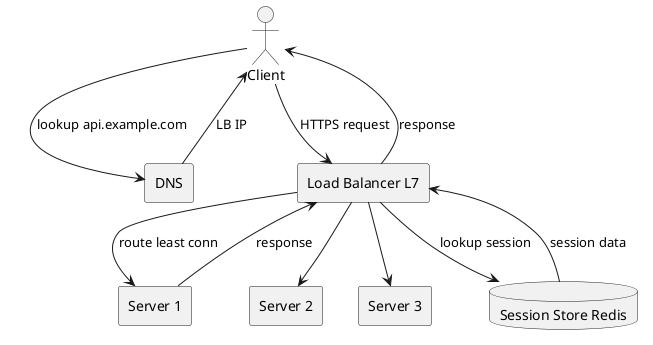

### Health Checks
- **Active**: LB pings `/health` every N seconds
- **Passive**: LB monitors real traffic for errors, ejects unhealthy servers
- **Graceful drain**: Remove from pool, wait for in-flight requests to complete

### Sticky Sessions
- **Problem**: User's session stored on one server; subsequent requests must go to same server
- **Solution 1**: IP hash (breaks with mobile clients)
- **Solution 2**: Cookie-based stickiness (LB sets a cookie)
- **Better Solution**: Store sessions in Redis (stateless servers, no stickiness needed)

### Key Tips
- Prefer **stateless servers** with external session store
- Use **least connections** for long-lived connections
- Use **consistent hashing** when servers have local caches
- **Always health-check** with both active and passive checks
- Place LBs in **multiple AZs** for HA
- Use **DNS round-robin** for global load balancing, then regional LBs

---

## 🔹 2. Caching

### Why Cache
- Memory is 100x faster than SSD, 1000x faster than HDD
- Database can only handle ~10K QPS per node; cache handles 100K+
- 80/20 rule: 20% of data serves 80% of requests
- Reduces load on downstream services

### Cache Strategies

| Strategy | How It Works | Pros | Cons |
|---|---|---|---|
| **Cache-Aside** | App checks cache, miss -> DB -> populate cache | Simple, flexible | App manages cache |
| **Read-Through** | Cache sits in front of DB, handles misses | App code simple | Cache vendor lock-in |
| **Write-Through** | Write to cache + DB together | Strong consistency | Slower writes |
| **Write-Back** | Write to cache, async flush to DB | Fast writes | Data loss risk on crash |
| **Write-Around** | Write to DB, bypass cache | No cache pollution | Cache miss on next read |

### Cache-Aside Flow

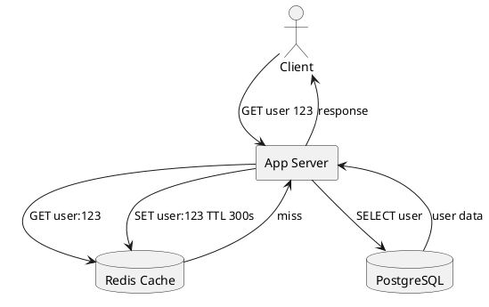

### Cache Eviction Policies

| Policy | Evicts | Best For |
|---|---|---|
| **LRU** | Least recently used | General purpose, most common |
| **LFU** | Least frequently used | Stable hot set |
| **FIFO** | Oldest inserted | Simple, streaming |
| **TTL** | After time expiry | Data with predictable freshness |
| **Random** | Random entry | Simple, uniform access |

### Cache Invalidation

> "There are only two hard things in Computer Science: cache invalidation and naming things." -- Phil Karlton

**Strategies:**
1. **TTL-based**: Simple, eventual consistency (most common)
2. **Event-based**: Publish invalidation events on write (Kafka, Redis pub/sub)
3. **Version-based**: Include version in cache key (`user:123:v5`)
4. **Write-through**: Update cache on write (strong consistency, slower)
5. **Tag-based**: Tag cache entries, invalidate by tag (e.g., all posts by user 123)

### Multi-Level Cache

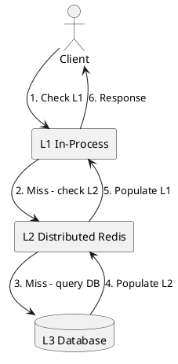

**L1 (in-process)**: Nanoseconds, per-server, small (MBs), invalidation hard
**L2 (distributed)**: Milliseconds, shared, large (GBs-TBs), easy invalidation
**L3 (database)**: Tens of ms, source of truth, always consistent

### Cache Stampede (Thundering Herd)
- **Problem**: Cache expires, 1000s of requests hit DB simultaneously
- **Solutions**:
  - **Mutex/Lock**: First request acquires lock, others wait
  - **Probabilistic early expiration**: Refresh before TTL randomly
  - **Background refresh**: Refresh asynchronously before expiry
  - **Never expire**: Use TTL only as a safety net, refresh via events

### Hot Key Problem
- **Problem**: One key gets 90% of traffic, overwhelms single shard
- **Solutions**:
  - **Local cache**: Each server caches hot key locally
  - **Key sharding**: `hotkey:1`, `hotkey:2`, ... split across shards
  - **Read replicas**: Multiple Redis replicas for hot keys

### Key Tips
- **Cache-aside is the default** for most systems
- **Always set TTL** even if you invalidate explicitly
- **Cache at multiple levels**: CDN, app, DB query cache
- **Cache the result, not the query** (denormalize)
- **Monitor hit ratio**: Aim for > 80%
- **Warm the cache** after deploys (avoid cold start)
- **Use consistent hashing** for distributed cache (minimal rebalancing)

---

## 🔹 3. Message Queues

### Why Message Queues
- **Decouple** producers from consumers
- **Buffer** traffic spikes (smooth load)
- **Async** long-running tasks (return to user fast)
- **Retry** with backoff on failure
- **Fan-out** one event to many consumers
- **Order** events within a partition

### Queue vs Pub/Sub

| Model | Behavior | Use Case |
|---|---|---|
| **Queue (Point-to-Point)** | One message consumed by one consumer | Task distribution |
| **Pub/Sub (Topic)** | One message consumed by all subscribers | Event broadcasting |

### Delivery Guarantees

| Guarantee | Meaning | Trade-off |
|---|---|---|
| **At-most-once** | May lose messages, never duplicate | Fastest, lossy |
| **At-least-once** | Never lose, may duplicate | Requires idempotent consumers |
| **Exactly-once** | Never lose, never duplicate | Hardest, requires transactions |

**Reality:** At-least-once + idempotent consumers = effectively exactly-once

### Kafka Architecture

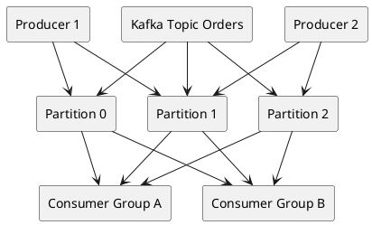

**Key concepts:**
- **Topic**: Named stream of events
- **Partition**: Ordered, append-only log
- **Offset**: Position in partition (consumer tracks)
- **Consumer Group**: Parallel consumption, one partition per consumer
- **Retention**: Time-based (7 days) or size-based (1 TB)

### Kafka vs RabbitMQ

| Feature | Kafka | RabbitMQ |
|---|---|---|
| Model | Distributed log | Message broker |
| Throughput | Millions/sec | Tens of thousands/sec |
| Ordering | Per partition | Per queue |
| Retention | Configurable (days/weeks) | Until consumed |
| Replay | Yes (seek to offset) | No |
| Use Case | Event streaming, logs, CDC | Task queues, RPC, work distribution |
| Protocol | Custom (binary) | AMQP, MQTT, STOMP |

### When to Use What

| Need | Use |
|---|---|
| Task queue (jobs) | RabbitMQ, SQS, Redis Queue |
| Event streaming (logs, CDC) | Kafka, Kinesis, Pulsar |
| Fan-out to many services | Kafka, SNS + SQS |
| Request-reply RPC | RabbitMQ, gRPC |
| Simple, managed | AWS SQS / SNS |
| High throughput, replay | Kafka, Pulsar |

### Common Patterns

**1. Work Queue (Competing Consumers)**
```
Producer -> Queue -> [Consumer 1, Consumer 2, Consumer 3]
Each message processed by exactly one consumer
```

**2. Publish-Subscribe**
```
Producer -> Topic -> [Subscriber A, Subscriber B, Subscriber C]
Each message delivered to all subscribers
```

**3. Dead Letter Queue (DLQ)**
```
Queue -> [Success] -> Consumer
      -> [Failure N times] -> DLQ -> Manual review / Alert
```

**4. Saga Pattern**
```
Orchestrator -> Service A -> Service B -> Service C
On failure: compensating transactions in reverse order
```

### Key Tips
- **Always use at-least-once** with idempotent consumers
- **Set up DLQ** for poison messages
- **Monitor consumer lag** (Kafka: consumer group offset vs latest)
- **Partition key matters**: Same key -> same partition -> ordered
- **Backpressure**: If consumers lag, producers should slow down
- **Idempotency key**: Every message should have a unique ID
- **Retention policy**: Don't keep messages forever (cost, compliance)

---

## 🔹 4. Rate Limiter

### Why Rate Limit
- **Protect** services from overload (DoS, accidental)
- **Fairness**: Prevent one client from monopolizing
- **Cost control**: Limit expensive API calls
- **Compliance**: SLA enforcement (e.g., 1000 req/min)
- **Security**: Slow down brute-force attacks

### Algorithms

#### 1. Token Bucket

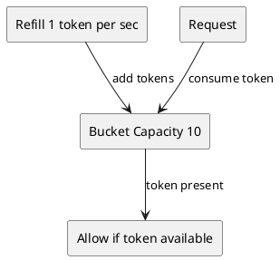

- **Capacity** = max burst size
- **Refill rate** = steady-state throughput
- Allows bursts up to capacity
- **Best for**: APIs with bursty traffic

#### 2. Leaky Bucket

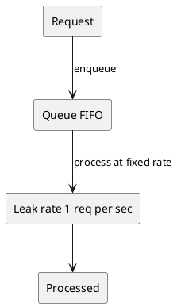

- Queue requests, process at fixed rate
- Smooths bursty traffic into steady stream
- **Best for**: Traffic shaping (network)

#### 3. Fixed Window Counter

```
Window: 1 minute
Counter: increments per request
Reset at each minute boundary

Problem: Burst at boundary (2x rate possible)
```

#### 4. Sliding Window Log

```
Store timestamp of every request
On new request:
  - Remove timestamps older than window
  - Count remaining
  - If count < limit, allow

Accurate, but memory-heavy O(requests)
```

#### 5. Sliding Window Counter (Hybrid)

```
Approximate using two fixed windows
Current window count + weighted previous window count

Accurate enough, memory-efficient
Used by Cloudflare, many CDNs
```

### Distributed Rate Limiting with Redis

**Token Bucket with Redis:**

```lua
-- KEYS[1] = bucket key
-- ARGV[1] = capacity
-- ARGV[2] = refill rate (tokens/sec)
-- ARGV[3] = current timestamp (ms)
-- ARGV[4] = tokens requested

local key = KEYS[1]
local capacity = tonumber(ARGV[1])
local refill = tonumber(ARGV[2])
local now = tonumber(ARGV[3])
local requested = tonumber(ARGV[4])

local bucket = redis.call('HMGET', key, 'tokens', 'lastRefill')
local tokens = tonumber(bucket[1]) or capacity
local lastRefill = tonumber(bucket[2]) or now

local elapsed = (now - lastRefill) / 1000
local refilled = math.min(capacity, tokens + elapsed * refill)

if refilled >= requested then
    redis.call('HMSET', key, 'tokens', refilled - requested, 'lastRefill', now)
    redis.call('EXPIRE', key, 3600)
    return 1
else
    return 0
end
```

**Why Lua?** Atomic execution -- no race conditions between read and write.

### Rate Limit Headers (RFC 6585)

```http
HTTP/1.1 200 OK
X-RateLimit-Limit: 1000
X-RateLimit-Remaining: 999
X-RateLimit-Reset: 1633024800

HTTP/1.1 429 Too Many Requests
Retry-After: 60
X-RateLimit-Limit: 1000
X-RateLimit-Remaining: 0
X-RateLimit-Reset: 1633024860
```

### Where to Rate Limit

| Layer | What It Limits | Example |
|---|---|---|
| CDN/Edge | IP-based, DDoS | Cloudflare |
| API Gateway | Per API key, per user | Kong, AWS API Gateway |
| Service | Per endpoint, per tenant | Istio, Envoy |
| Database | Connection pool | HikariCP |

### Key Tips
- **Return 429** with `Retry-After` header
- **Use Redis** for distributed rate limiting
- **Sliding window** is more accurate than fixed window
- **Token bucket** for bursty APIs; **leaky bucket** for smoothing
- **Rate limit by user ID**, not just IP (NAT breaks IP-based)
- **Graceful degradation**: Serve cached response instead of 429 when possible
- **Tiered limits**: Free tier 100/min, Pro 10K/min, Enterprise custom

---

## 🔹 5. Consistent Hashing

### The Problem
With `hash(key) % N` (N = number of servers):
- Add a server: almost all keys remap (cache misses everywhere)
- Remove a server: same problem

### The Solution
Place both servers and keys on a hash ring (0 to 2^32-1). Each key is assigned to the next server clockwise.

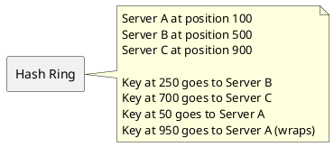

**Adding a server (Server D at position 300):**
- Only keys in range (100, 300] move from B to D
- All other keys unchanged
- Only 1/N of keys remapped (vs all keys with modulo)

### Virtual Nodes
**Problem**: With few servers, distribution is uneven (Server A might own 60% of ring).

**Solution**: Each server has multiple virtual nodes (100-200 typically) spread across the ring.

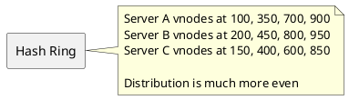

### Used By
- **Cassandra**: Data distribution across nodes
- **DynamoDB**: Partition management
- **Redis Cluster**: 16,384 hash slots
- **Memcached clients**: Consistent hashing libraries
- **CDNs**: Content routing to edge servers
- **Load balancers**: Session affinity

### Consistent Hashing Flow

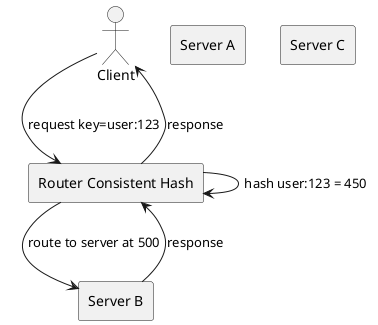

### Key Tips
- Use **100-200 virtual nodes** per physical server for even distribution
- Combine with **replication** (each key on N consecutive servers) for HA
- **Monitor distribution** -- uneven ring = hotspots
- Use a **good hash function** (MurmurHash, xxHash) -- not MD5/SHA (too slow)
- For **weighted servers**, give more vnodes to more powerful servers

---

## 🔹 6. CDN (Content Delivery Network)

### What It Does
Geographically distributed cache that serves content from the edge (closest to user), reducing latency.

### Push vs Pull

| Model | How It Works | Use Case |
|---|---|---|
| **Pull** | Edge fetches from origin on first miss | Dynamic sites, infrequent updates |
| **Push** | Origin pushes content to edge proactively | Large files, predictable traffic |

### CDN Architecture

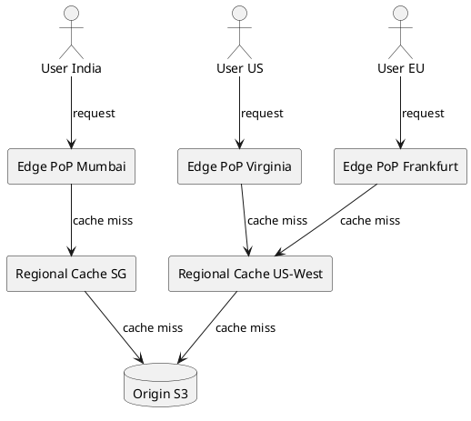

**Hierarchy:**
1. **Edge PoP** (100s worldwide): Closest to user, small cache
2. **Regional Cache** (10s): Mid-tier, larger cache
3. **Origin** (1-few): Source of truth

### Cache-Control Headers

```http
Cache-Control: public, max-age=31536000, immutable
Cache-Control: private, max-age=0, no-cache
Cache-Control: public, max-age=300, s-maxage=3600, stale-while-revalidate=60
```

| Directive | Meaning |
|---|---|
| `public` | Can be cached by CDN + browser |
| `private` | Only browser can cache |
| `max-age` | TTL in seconds (browser) |
| `s-maxage` | TTL in seconds (CDN) |
| `no-cache` | Revalidate every time |
| `no-store` | Never cache |
| `immutable` | Never revalidate (versioned URLs) |
| `stale-while-revalidate` | Serve stale while refreshing |

### Cache Invalidation

| Method | Speed | Cost | Use Case |
|---|---|---|---|
| **Purge by URL** | Fast | Low | Specific file updates |
| **Purge by tag** | Medium | Medium | Category updates |
| **Purge all** | Slow | High | Emergency |
| **Versioned URLs** | Instant | Zero | Static assets (app.js?v=123) |
| **Short TTL** | Eventual | Low | Dynamic content |

**Best practice**: Use **versioned URLs** for static assets (immutable, 1-year TTL), short TTL for dynamic content.

### Dynamic Content at Edge
- **Edge computing** (Cloudflare Workers, Lambda@Edge): Run code at edge
- **ESI** (Edge Side Includes): Compose pages from cached fragments
- **Signed URLs**: Time-limited access to private content

### Key Tips
- **Version your static assets** (`app.a1b2c3.js`) for infinite cache
- **Use CDN for all static content** (images, JS, CSS, video)
- **Purge by tag** for coordinated invalidation
- **Monitor cache hit ratio** (aim for > 90%)
- **Use multiple CDN providers** for redundancy (multi-CDN)
- **Enable Brotli/gzip** compression at edge
- **Use HTTP/2 and HTTP/3** for multiplexing
- **Consider cost**: egress from CDN can be expensive at scale

---

## 🔹 7. API Gateway

### What It Does
Single entry point for all client requests to backend microservices.

### Responsibilities
- **Routing**: Path-based, header-based, version-based
- **Authentication**: JWT validation, API key check, OAuth
- **Rate limiting**: Per user, per endpoint, per IP
- **Load balancing**: Across service instances
- **SSL termination**: Handle HTTPS at gateway
- **Request/response transformation**: Protocol translation (REST <-> gRPC)
- **Caching**: Response cache
- **Observability**: Logging, metrics, tracing
- **Circuit breaking**: Fail fast on unhealthy services

### API Gateway Flow

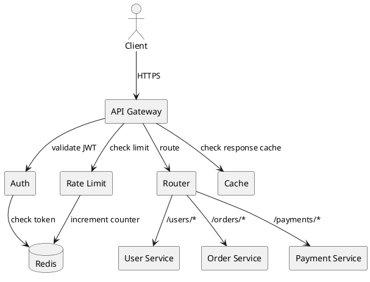

### Popular API Gateways

| Gateway | Type | Best For |
|---|---|---|
| **Kong** | Open source, Lua | Self-hosted, plugin ecosystem |
| **Envoy** | Open source, C++ | Service mesh sidecar |
| **AWS API Gateway** | Managed | AWS-native |
| **Apigee** | Managed (Google) | Enterprise, analytics |
| **Nginx** | Open source | Simple, high-performance |
| **Traefik** | Open source, Go | Kubernetes-native |

### BFF (Backend for Frontend)
Different clients (mobile, web, TV) have different needs:
- **Mobile BFF**: Aggressive payload compression, fewer round trips
- **Web BFF**: More verbose responses, better caching
- **TV BFF**: Large images, different auth flow

### Key Tips
- **Don't make it a bottleneck** -- scale horizontally
- **Keep it stateless** -- session in Redis, config in etcd
- **Use declarative config** (YAML) for routes
- **Implement circuit breakers** to fail fast
- **Log every request** for debugging (but beware PII)
- **Version your APIs** (`/v1/`, `/v2/`) for backward compatibility
- **Use BFF** for multi-client products

---

## 🔹 8. Service Discovery

### The Problem
In dynamic environments (K8s, autoscaling), service instances come and go. How does Service A find Service B's current IPs?

### Patterns

| Pattern | How It Works | Example |
|---|---|---|
| **Client-side** | Client queries registry, picks instance | Eureka, Consul |
| **Server-side** | Load balancer queries registry | AWS ALB, K8s Service |
| **DNS-based** | DNS returns service IPs | Consul DNS, Route53 |
| **Service Mesh** | Sidecar proxy handles it | Istio, Linkerd |

### Service Discovery Flow

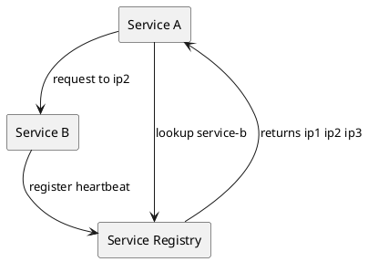

### Health Checks
- **Active**: Registry pings `/health` every N sec
- **Passive**: Instances send heartbeat every N sec
- **TTL-based**: If no heartbeat within TTL, evict

### Key Tips
- **Use DNS + SRV records** for simple cases
- **Use Consul/etcd** for complex routing
- **Always health-check** -- remove unhealthy instances fast
- **Cache discovery results** on the client (avoid registry on every request)
- **Kubernetes**: Use built-in Service + Endpoints (no extra tooling)

---

## 🔹 9. Circuit Breaker

### The Problem
If Service B is slow/down, Service A's threads pile up waiting for responses. Cascade failure kills the whole system.

### States

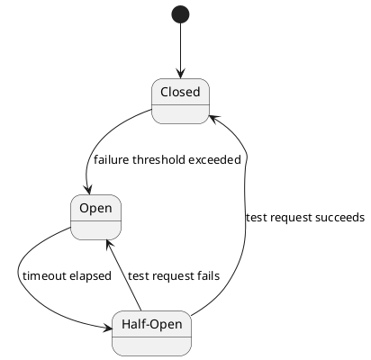

| State | Behavior |
|---|---|
| **Closed** | Normal -- all requests pass through |
| **Open** | Fail fast -- no requests sent to downstream |
| **Half-Open** | Test -- allow limited requests to check recovery |

### Configuration
- **Failure threshold**: e.g., 50% errors in 10 sec
- **Volume threshold**: Minimum requests before tripping (avoid tripping on low traffic)
- **Timeout**: How long to stay open before half-open
- **Success threshold**: Requests in half-open to close again

### Circuit Breaker Flow

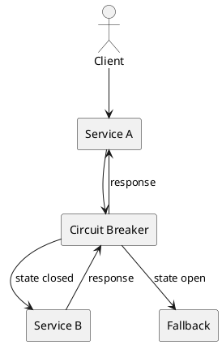

### Key Tips
- **Always have a fallback** (cached response, default value, error page)
- **Per-dependency circuit breaker** (one for Service B, one for Service C)
- **Monitor state transitions** (alert when open)
- **Combine with retries** (but only on idempotent operations)
- **Use bulkheads** (separate thread pools per dependency)

---

## 🔹 10. Idempotency

### The Problem
Networks fail, clients retry. Without idempotency, retries create duplicates (double charges, duplicate posts).

### The Solution
Every write API accepts an **idempotency key** (UUID). Server stores key -> result mapping for a window (e.g., 24h). On retry, return cached result.

### Idempotency Flow

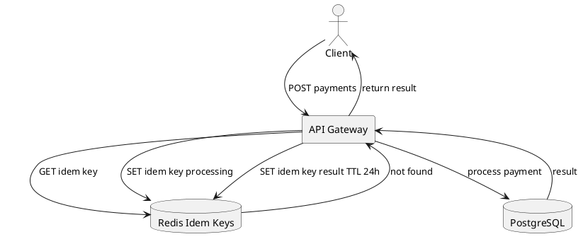

### Key Tips
- **Client generates UUID** per logical operation
- **Server stores key -> response** for 24h-7d
- **Return same response** on duplicate key (including errors)
- **Handle concurrent requests** with same key (lock or return 409)
- **Use for**: payments, orders, emails, any non-idempotent write

---

## 📌 Key Tips & Tricks

### 1. **Compose Blocks, Don't Reinvent**
Every large system is a combination of these building blocks. Learn them, then compose.

### 2. **Start Simple, Add Complexity When Needed**
- Single server -> add LB
- Slow reads -> add cache
- Slow writes -> add queue
- Global users -> add CDN
- Cascade failures -> add circuit breaker

### 3. **Failure Modes First**
For every component, ask: "What happens when this fails?"
- LB fails -> DNS failover
- Cache fails -> fall back to DB (with rate limit)
- Queue fails -> sync write (degraded)
- DB fails -> read replica promotion

### 4. **Idempotency Everywhere**
Any write that can be retried needs an idempotency key. This is non-negotiable at scale.

### 5. **Observability Is a Building Block**
Logs, metrics, traces. Without them, you can't debug distributed systems.

### 6. **Cost Matters**
Egress, cross-region, storage, compute. Design with cost in mind, not just correctness.

### 7. **Backpressure**
When downstream is slow, slow down upstream. Queue depth limits, rate limits, load shedding.

### 8. **Prefer Managed Services**
Managed Kafka, managed Redis, managed Postgres. Unless you have a dedicated infra team, managed is almost always cheaper TCO.

---

## 🎯 Common Pitfalls to Avoid

- Adding cache without an invalidation strategy
- No circuit breaker -> cascading failures
- No idempotency -> duplicate charges on retry
- Single LB -> SPOF
- Single Redis -> SPOF
- Cache without TTL -> stale data forever
- Queue without DLQ -> poison messages block the queue
- Rate limiter without Redis -> per-server limits (inconsistent)
- Consistent hashing without vnodes -> uneven distribution
- CDN without cache purge -> stale content
- API gateway as monolith -> new bottleneck
- Service discovery without health checks -> route to dead instances
- Ignoring retry storms -> thundering herd
- No bulkheads -> one slow dependency kills everything
- No timeout on outbound calls -> thread pool exhaustion

---

## 🔹 Building Blocks Cheat Sheet

| Block | Purpose | Key Trade-off |
|---|---|---|
| Load Balancer | Distribute traffic | L4 speed vs L7 smartness |
| Cache | Speed up reads | Freshness vs speed |
| Message Queue | Decouple + buffer | Latency vs reliability |
| Rate Limiter | Protect services | Strictness vs UX |
| Consistent Hashing | Distribute data | Simplicity vs balance |
| CDN | Reduce latency | Cost vs performance |
| API Gateway | Single entry point | Features vs bottleneck |
| Service Discovery | Dynamic routing | Freshness vs overhead |
| Circuit Breaker | Prevent cascade failures | Availability vs correctness |
| Idempotency | Safe retries | Storage cost vs safety |

---

## 🔹 Composition Example: E-Commerce Request Path

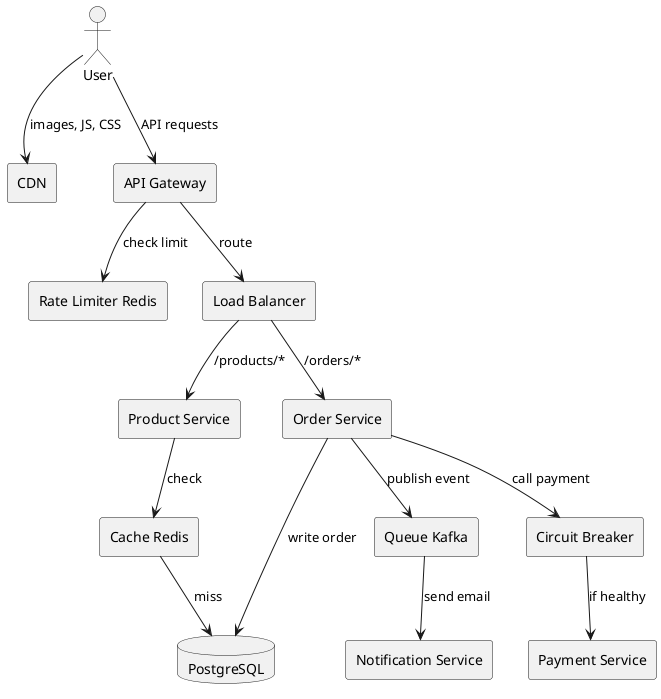

Every block in this diagram is one of the ten building blocks above. That's the power of composing primitives.