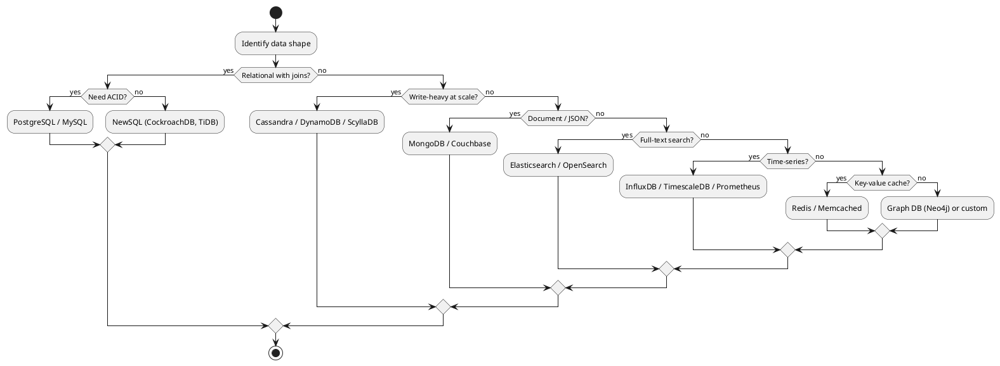
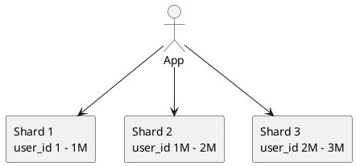
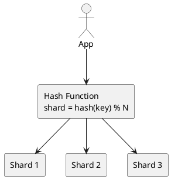
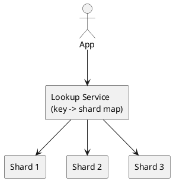
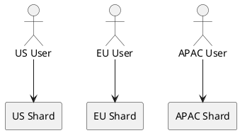
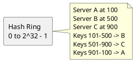
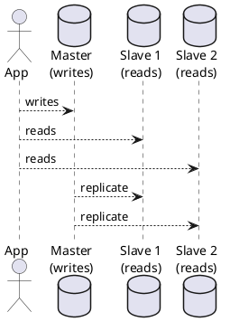
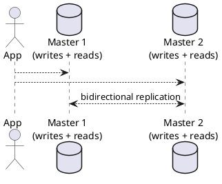
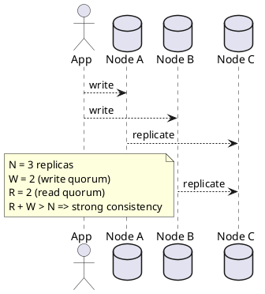

# Database Design

## Key Concepts
- **ACID vs BASE**: Strong transactional guarantees vs eventual consistency with availability
- **CAP Theorem**: In a partition, choose Consistency OR Availability (not both)
- **PACELC**: Even without partitions, choose Latency OR Consistency
- **Normalization**: Reduce redundancy (1NF, 2NF, 3NF, BCNF)
- **Denormalization**: Add redundancy for read speed (common in read-heavy systems)
- **Indexing**: Speed up reads at the cost of write throughput and storage
- **Sharding**: Horizontal partitioning of data across multiple machines
- **Replication**: Copy data across nodes for durability and read scaling
- **Consistent Hashing**: Minimal data movement when nodes join/leave
- **Quorum**: R + W > N ensures strong consistency in leaderless systems

## Why It Matters
- Database choice is the single biggest architectural decision
- Wrong choice = painful migrations later (or worse, data loss)
- Read:Write ratio directly shapes DB architecture
- Consistency requirements dictate what's possible
- Sharding too early = complexity; too late = outages

## Common Problems
- Design a user database for a social app
- Design a chat message store
- Design an e-commerce order database
- Design a time-series metrics database
- Design a URL shortener database
- Design a feed/timeline store
- Design a distributed counter (likes, views)

## Techniques / Patterns
- SQL vs NoSQL decision matrix
- Sharding strategies (range, hash, directory, geo)
- Replication topologies (master-slave, master-master, leaderless)
- Indexing strategies (B-tree, hash, composite, covering, partial)
- Denormalization for read-heavy workloads
- CQRS (Command Query Responsibility Segregation)
- Event Sourcing
- Saga pattern for distributed transactions
- Two-phase commit (2PC) and its alternatives

---

## 🔹 Basic Template

### Database Selection Flow


### The 5 Questions Before Picking a DB
```text
1. What is the read:write ratio?
2. What are the consistency requirements?
3. What is the expected data volume (now and in 5 years)?
4. What are the access patterns (point lookups, range scans, joins, aggregations)?
5. What is the team's operational expertise?
```

---

## 🔹 SQL vs NoSQL Decision Matrix

| Factor | SQL (PostgreSQL, MySQL) | NoSQL (MongoDB, Cassandra, DynamoDB) |
|---|---|---|
| Schema | Fixed, enforced | Flexible, schema-less |
| Scaling | Vertical (primary), horizontal via sharding | Horizontal (built-in) |
| Transactions | Full ACID | Limited (varies by DB) |
| Joins | Native, efficient | Limited or application-side |
| Consistency | Strong | Tunable (eventual to strong) |
| Query flexibility | Ad-hoc queries | Pattern-based access |
| Write throughput | Moderate | Very high (Cassandra) |
| Read throughput | High with indexes | Very high with sharding |
| Use case | Financial, relational | High-scale, flexible, logs |
| Examples | Banking, ERP, CRM | Social feeds, IoT, logs |

### When to Use What

| Requirement | Recommended DB |
|---|---|
| ACID + complex joins | PostgreSQL, MySQL |
| Global ACID + horizontal scale | CockroachDB, Spanner, TiDB |
| Write-heavy + time-series | Cassandra, ScyllaDB, TimescaleDB |
| Document / JSON | MongoDB, Couchbase |
| Key-value cache | Redis, Memcached |
| Full-text search | Elasticsearch, OpenSearch, Meilisearch |
| Graph relationships | Neo4j, Neptune |
| Wide-column at scale | HBase, Cassandra |
| Analytics / OLAP | ClickHouse, BigQuery, Snowflake |
| Metrics | Prometheus, InfluxDB, VictoriaMetrics |

---

## 🔹 Normalization vs Denormalization

### Normalization (OLTP)

**Goal**: Eliminate redundancy, ensure consistency.

| Normal Form | Rule |
|---|---|
| 1NF | Atomic values, no repeating groups |
| 2NF | 1NF + no partial dependencies on composite keys |
| 3NF | 2NF + no transitive dependencies |
| BCNF | 3NF + every determinant is a candidate key |

**Example:**
```sql
-- Not normalized (repeating groups, redundancy)
CREATE TABLE orders_bad (
    order_id INT,
    customer_name VARCHAR(100),
    customer_email VARCHAR(100),
    product1 VARCHAR(100),
    product2 VARCHAR(100),
    product3 VARCHAR(100)
);

-- Normalized (3NF)
CREATE TABLE customers (
    customer_id INT PRIMARY KEY,
    name VARCHAR(100),
    email VARCHAR(100) UNIQUE
);

CREATE TABLE orders (
    order_id INT PRIMARY KEY,
    customer_id INT REFERENCES customers(customer_id),
    created_at TIMESTAMP
);

CREATE TABLE order_items (
    order_id INT REFERENCES orders(order_id),
    product_id INT REFERENCES products(product_id),
    quantity INT,
    PRIMARY KEY (order_id, product_id)
);
```

### Denormalization (OLAP / Read-Heavy)

**Goal**: Reduce joins, speed up reads at the cost of redundancy.

**When to denormalize:**
- Read:Write ratio > 100:1
- Joins are slow or span shards
- Data is not frequently updated
- Eventual consistency is acceptable

**Example:**
```sql
-- Denormalized feed table (no joins needed)
CREATE TABLE user_feed (
    user_id BIGINT,
    post_id BIGINT,
    author_id BIGINT,
    author_name VARCHAR(100),    -- denormalized
    post_text TEXT,
    like_count INT,              -- precomputed
    comment_count INT,           -- precomputed
    created_at TIMESTAMP,
    PRIMARY KEY (user_id, created_at, post_id)
);
```

**Trade-off:** Faster reads, but updates require fan-out to all denormalized copies.

---

## 🔹 Indexing Essentials

### Index Types

| Type | Structure | Best For | Not Good For |
|---|---|---|---|
| B-Tree | Balanced tree | Range queries, sorting, equality | Full-text, geospatial |
| Hash | Hash table | Equality lookups | Range queries, sorting |
| Composite | Multi-column B-tree | Multi-column WHERE | Skipping leading columns |
| Covering | Includes all needed columns | Eliminating table lookups | Large column payloads |
| Partial | Index on subset | Filtered queries | General queries |
| Full-text | Inverted index | Text search | Structured data |
| Geospatial | R-tree / Geohash | Location queries | Non-spatial data |

### Composite Index Rules

**Leftmost prefix rule**: An index on `(a, b, c)` can be used for:
- `WHERE a = ?`
- `WHERE a = ? AND b = ?`
- `WHERE a = ? AND b = ? AND c = ?`
- `WHERE a = ? ORDER BY b, c`

But NOT for:
- `WHERE b = ?` (skips leading column)
- `WHERE c = ?` (skips leading columns)

### Index Trade-offs

| Benefit | Cost |
|---|---|
| Faster reads (SELECT) | Slower writes (INSERT, UPDATE, DELETE) |
| Faster sorting | Extra storage |
| Faster joins | Index maintenance overhead |
| Uniqueness enforcement | Write amplification |

**Rule of thumb**: Index columns in `WHERE`, `JOIN`, `ORDER BY`, `GROUP BY`. Don't over-index — each index slows writes.

---

## 🔹 Sharding Strategies

### 1. Range-Based Sharding



**Pros:** Simple, range queries efficient within a shard
**Cons:** Hotspots (e.g., new users all go to last shard)

### 2. Hash-Based Sharding



**Pros:** Even distribution, no hotspots
**Cons:** Range queries require fan-out; resharding is expensive

### 3. Directory-Based Sharding



**Pros:** Flexible (move keys without rehashing)
**Cons:** Lookup service is SPOF and adds latency

### 4. Geo-Based Sharding



**Pros:** Low latency, compliance (GDPR)
**Cons:** Cross-region queries are hard

### 5. Consistent Hashing



**Pros:** Minimal rebalancing on scale events (only 1/N keys move)
**Cons:** Needs virtual nodes for even distribution

### Sharding Comparison

| Strategy | Even Distribution | Range Queries | Resharding | Complexity |
|---|---|---|---|---|
| Range | No (hotspots) | Easy | Medium | Low |
| Hash | Yes | Hard | Hard | Low |
| Directory | Yes | Medium | Easy | Medium |
| Geo | Yes | Hard (cross-region) | Medium | High |
| Consistent Hash | Yes (with vnodes) | Hard | Easy | High |

---

## 🔹 Replication Patterns

### 1. Master-Slave (Primary-Replica)



**Pros:** Simple, read scaling, HA with failover
**Cons:** Master is write SPOF; replication lag

### 2. Master-Master (Multi-Primary)



**Pros:** Write scaling, no single write SPOF
**Cons:** Conflict resolution needed; complex

### 3. Leaderless (Quorum)



**Pros:** No leader election, always available, tunable consistency
**Cons:** Read/write amplification; complex conflict handling

### Replication Comparison

| Pattern | Write Scale | Read Scale | HA | Consistency |
|---|---|---|---|---|
| Master-Slave | No | Yes | Yes (failover) | Strong (on master) |
| Master-Master | Yes | Yes | Yes | Eventual (conflicts) |
| Leaderless | Yes | Yes | Yes | Tunable (R+W>N) |

---

## 🔹 Practice Problems by Topic

### Easy

#### 1. **Design a User Database for a Social App**

**Problem Description:**
Design a database schema for a social app with users, posts, follows, and likes. Assume 100M users.

**Step-by-step:**

```text
Step 1 - Identify entities:
  - User (id, name, email, created_at, bio)
  - Post (id, user_id, text, created_at, like_count, comment_count)
  - Follow (follower_id, followee_id, created_at)
  - Like (user_id, post_id, created_at)

Step 2 - Choose DB:
  - Users: PostgreSQL (ACID, unique email)
  - Posts: PostgreSQL + shard by user_id
  - Follows: Cassandra (write-heavy, adjacency list)
  - Likes: Redis for counts, Cassandra for persistence

Step 3 - Estimate storage (5 years):
  - Users: 100M x 500 B = 50 GB
  - Posts: 100M x 2 posts/day x 1825 days x 1 KB = ~365 TB
  - Follows: 100M x 200 followers x 50 B = ~1 TB
  - Likes: 100M x 1000 likes x 50 B = ~5 TB
  Total: ~400 TB raw, ~1.2 PB with replication
```

**Schema:**

```sql
-- Users (PostgreSQL, single shard or sharded by user_id)
CREATE TABLE users (
    user_id BIGINT PRIMARY KEY,
    name VARCHAR(100) NOT NULL,
    email VARCHAR(255) UNIQUE NOT NULL,
    bio TEXT,
    created_at TIMESTAMP DEFAULT NOW()
);

-- Posts (PostgreSQL, sharded by user_id)
CREATE TABLE posts (
    post_id BIGINT PRIMARY KEY,
    user_id BIGINT NOT NULL,
    text TEXT,
    like_count INT DEFAULT 0,
    comment_count INT DEFAULT 0,
    created_at TIMESTAMP DEFAULT NOW()
);
CREATE INDEX idx_posts_user_created ON posts(user_id, created_at DESC);

-- Follows (Cassandra, partition by follower_id)
CREATE TABLE follows (
    follower_id BIGINT,
    followee_id BIGINT,
    created_at TIMESTAMP,
    PRIMARY KEY (follower_id, followee_id)
);

-- Followers lookup (reverse index)
CREATE TABLE followers (
    followee_id BIGINT,
    follower_id BIGINT,
    created_at TIMESTAMP,
    PRIMARY KEY (followee_id, follower_id)
);

-- Likes (Cassandra, partition by post_id)
CREATE TABLE likes (
    post_id BIGINT,
    user_id BIGINT,
    created_at TIMESTAMP,
    PRIMARY KEY (post_id, user_id)
);
```

**Why It Works:**
- Users need ACID (email uniqueness) -> PostgreSQL
- Posts are read-heavy with range queries -> PostgreSQL + index
- Follows are write-heavy, no joins needed -> Cassandra
- Likes are high-volume writes, counter updates -> Cassandra + Redis cache

**Key Takeaway**: Polyglot persistence — use the right DB for each entity's access pattern

**Follow-up Questions:**
- How would you shard the posts table?
- How do you handle a celebrity with 100M followers (fan-out)?

---

#### 2. **Design a Chat Message Store**

**Problem Description:**
Design a database for WhatsApp-like messaging. 1B DAU, 40 messages/user/day. Need fast writes, ordered reads per conversation.

**Step-by-step:**

```text
Step 1 - Access patterns:
  - Write: append message to conversation
  - Read: fetch last N messages in a conversation
  - Read: fetch messages since timestamp T
  - Delete: rarely (maybe message recall)

Step 2 - Choose DB:
  - Cassandra (write-optimized, time-series per partition)
  - Partition key: conversation_id
  - Clustering key: message_id (time-ordered, Snowflake)

Step 3 - Estimate storage:
  - Messages/day: 1B x 40 = 4 x 10^10
  - Message size: 100 B body + 100 B metadata = 200 B
  - Storage/day: 4 x 10^10 x 200 B = 8 TB
  - 5 years: 8 TB x 1825 = ~14.6 PB
  - With replication 3x: ~44 PB
```

**Schema (Cassandra):**

```sql
CREATE TABLE messages (
    conversation_id UUID,
    message_id TIMEUUID,         -- time-ordered
    sender_id BIGINT,
    content TEXT,
    media_url TEXT,
    status TEXT,                 -- sent, delivered, read
    created_at TIMESTAMP,
    PRIMARY KEY (conversation_id, message_id)
) WITH CLUSTERING ORDER BY (message_id DESC);

-- Conversation metadata (PostgreSQL for ACID)
CREATE TABLE conversations (
    conversation_id UUID PRIMARY KEY,
    type VARCHAR(20),            -- 1:1, group
    created_at TIMESTAMP,
    last_message_at TIMESTAMP
);

CREATE TABLE conversation_members (
    conversation_id UUID,
    user_id BIGINT,
    joined_at TIMESTAMP,
    PRIMARY KEY (conversation_id, user_id)
);

-- User's conversation list (Cassandra, partition by user_id)
CREATE TABLE user_conversations (
    user_id BIGINT,
    conversation_id UUID,
    last_message_at TIMESTAMP,
    unread_count INT,
    PRIMARY KEY (user_id, last_message_at, conversation_id)
) WITH CLUSTERING ORDER BY (last_message_at DESC);
```

**Why It Works:**
- Cassandra's partition + clustering key design is perfect for "messages in a conversation, ordered by time"
- `TIMEUUID` gives monotonic ordering with uniqueness
- `user_conversations` gives fast "inbox" queries without scanning all messages

**Key Takeaway**: Time-series-per-partition is the standard pattern for messaging

**Follow-up Questions:**
- How do you handle group chats with 1000 members?
- How do you ensure read receipts are consistent?

---

### Medium

#### 3. **Design an E-Commerce Order Database**

**Problem Description:**
Design the database for an e-commerce platform. Need strong consistency for orders and inventory, but high read throughput for product catalog.

**Step-by-step:**

```text
Step 1 - Split by consistency needs:
  - Orders, inventory, payments -> ACID (PostgreSQL)
  - Product catalog, reviews -> eventual consistency OK (search + cache)
  - Sessions, carts -> Redis

Step 2 - Schema design (PostgreSQL for orders):

Step 3 - Sharding:
  - Orders: shard by user_id (users see their own orders)
  - Inventory: shard by product_id (hot products need care)
  - Use 2PC or Saga for cross-shard transactions

Step 4 - Estimate:
  - Orders/day: 10M
  - Order rows: 10M x 500 B = 5 GB/day
  - Order items: 10M x 3 items x 200 B = 6 GB/day
  - 5 years: ~20 TB raw, ~60 TB replicated
```

**Schema:**

```sql
-- Products (PostgreSQL + Elasticsearch mirror)
CREATE TABLE products (
    product_id BIGINT PRIMARY KEY,
    name VARCHAR(255),
    description TEXT,
    price_cents INT,
    category_id INT,
    stock INT,
    created_at TIMESTAMP,
    updated_at TIMESTAMP
);
CREATE INDEX idx_products_category ON products(category_id);
CREATE INDEX idx_products_price ON products(price_cents);

-- Inventory (PostgreSQL, separate table for row-level locking)
CREATE TABLE inventory (
    product_id BIGINT PRIMARY KEY REFERENCES products(product_id),
    quantity INT NOT NULL CHECK (quantity >= 0),
    reserved INT DEFAULT 0,
    version INT DEFAULT 0,          -- optimistic locking
    updated_at TIMESTAMP
);

-- Orders (PostgreSQL, sharded by user_id)
CREATE TABLE orders (
    order_id BIGINT PRIMARY KEY,
    user_id BIGINT NOT NULL,
    status VARCHAR(20),             -- pending, paid, shipped, delivered, cancelled
    total_cents INT,
    created_at TIMESTAMP,
    updated_at TIMESTAMP
);
CREATE INDEX idx_orders_user ON orders(user_id, created_at DESC);
CREATE INDEX idx_orders_status ON orders(status) WHERE status IN ('pending', 'paid');

-- Order items
CREATE TABLE order_items (
    order_id BIGINT REFERENCES orders(order_id),
    product_id BIGINT REFERENCES products(product_id),
    quantity INT,
    unit_price_cents INT,
    PRIMARY KEY (order_id, product_id)
);

-- Payments (PostgreSQL, strong ACID)
CREATE TABLE payments (
    payment_id BIGINT PRIMARY KEY,
    order_id BIGINT UNIQUE REFERENCES orders(order_id),
    amount_cents INT,
    status VARCHAR(20),             -- pending, success, failed, refunded
    provider VARCHAR(50),           -- stripe, razorpay
    provider_txn_id VARCHAR(255),
    idempotency_key VARCHAR(255) UNIQUE,
    created_at TIMESTAMP
);
```

**Why It Works:**
- Orders require ACID -> PostgreSQL
- Inventory uses optimistic locking (`version` column) to prevent oversell
- Idempotency keys on payments prevent double-charging on retries
- Product catalog reads served by Elasticsearch + Redis

**Key Takeaway**: Split the system by consistency requirements — don't force ACID everywhere

**Follow-up Questions:**
- How do you prevent overselling when 1000 users buy the last item?
- How do you handle a payment that succeeds but the order write fails?

---

#### 4. **Design a Time-Series Metrics Database**

**Problem Description:**
Design a metrics store for a monitoring system. 10,000 servers, each emits 100 metrics/sec. Retain 30 days raw, 1 year aggregated.

**Step-by-step:**

```text
Step 1 - Volume:
  Writes/sec = 10,000 x 100 = 1,000,000 metrics/sec
  Sample size = ~50 B (metric name + labels + value + timestamp)
  Storage/day = 10^6 x 86,400 x 50 B = 4.32 TB/day
  30-day raw = 130 TB
  1-year aggregated (1-min rollup, 1/60 of data) = ~26 TB

Step 2 - Choose DB:
  - Prometheus for short-term (local, 30 days)
  - VictoriaMetrics / Thanos for long-term
  - Or InfluxDB / TimescaleDB for unified

Step 3 - Schema:
  - Measurement: metric name
  - Tags: indexed dimensions (host, region, service)
  - Fields: values (not indexed)
  - Time: partitioning key

Step 4 - Retention:
  - Raw: 30 days
  - 1-min rollup: 1 year
  - 1-hour rollup: 5 years
```

**Schema (InfluxDB-style line protocol):**

```text
cpu_usage,host=server01,region=us-east,service=api value=45.2 1633024800000000000
cpu_usage,host=server02,region=us-east,service=api value=52.1 1633024800000000000
memory_usage,host=server01,region=us-east,service=api value=78.5 1633024800000000000
```

**Schema (TimescaleDB / PostgreSQL):**

```sql
CREATE TABLE metrics (
    time TIMESTAMPTZ NOT NULL,
    host TEXT NOT NULL,
    region TEXT NOT NULL,
    service TEXT NOT NULL,
    metric_name TEXT NOT NULL,
    value DOUBLE PRECISION
);

SELECT create_hypertable('metrics', 'time', chunk_time_interval => INTERVAL '1 day');

CREATE INDEX idx_metrics_lookup ON metrics(metric_name, host, time DESC);

-- Continuous aggregate for rollups
CREATE MATERIALIZED VIEW metrics_1min
WITH (timescaledb.continuous) AS
SELECT time_bucket('1 minute', time) AS bucket,
       metric_name, host, region, service,
       avg(value) AS avg_value,
       max(value) AS max_value
FROM metrics
GROUP BY bucket, metric_name, host, region, service;
```

**Why It Works:**
- Time is always the partition key in time-series DBs
- Tags (host, region) are indexed; fields (value) are not
- Automatic rollups via continuous aggregates reduce storage
- Compression on older chunks (10x typical)

**Key Takeaway**: Time-series data needs specialized DBs — don't put them in a general SQL table

**Follow-up Questions:**
- How do you handle cardinality explosion (too many unique tag combinations)?
- How do you query "top 10 hosts by CPU usage in the last hour"?

---

### Hard

#### 5. **Design a Feed/Timeline Store (Fan-out on Write vs Read)**

**Problem Description:**
Design the storage for a Twitter-like feed. 500M DAU, 100 reads/user/day, 2 posts/user/day. Discuss fan-out on write vs read.

**Step-by-step:**

```text
Step 1 - Volumes:
  Posts/day = 500M x 2 = 10^9 posts
  Reads/day = 500M x 100 = 5 x 10^10
  Read:Write = 50:1

Step 2 - Two approaches:

  A) Fan-out on Write:
     - When user posts, write to all followers' feeds
     - Pros: Fast reads (just fetch user's feed)
     - Cons: Slow writes for celebrities; massive storage

  B) Fan-out on Read:
     - Fetch posts from all followees at read time, merge
     - Pros: Fast writes (only store once)
     - Cons: Slow reads (merge many lists); hard at scale

  C) Hybrid (Twitter's approach):
     - Fan-out on write for normal users (< 10K followers)
     - Fan-out on read for celebrities (> 10K followers)
     - Merge at read time

Step 3 - Storage (fan-out on write):
  - Avg followers: 200
  - Feed entries/day = 10^9 posts x 200 followers = 2 x 10^11
  - Entry size = 50 B (post_id + author_id + timestamp)
  - Storage/day = 10^13 B = 10 TB/day
  - 30-day retention: 300 TB
  - With replication 3x: 900 TB
```

**Schema (Hybrid approach):**

```sql
-- Posts (PostgreSQL, sharded by author_id)
CREATE TABLE posts (
    post_id BIGINT PRIMARY KEY,
    author_id BIGINT NOT NULL,
    text TEXT,
    created_at TIMESTAMP
);
CREATE INDEX idx_posts_author_created ON posts(author_id, created_at DESC);

-- Feed cache (Redis sorted sets, per user)
-- Key: feed:{user_id}
-- Score: timestamp
-- Value: post_id
ZADD feed:12345 1633024800 "post:98765"
ZADD feed:12345 1633024801 "post:98766"
ZREVRANGE feed:12345 0 99    -- last 100 posts

-- Persistent feed (Cassandra, for durability)
CREATE TABLE user_feed (
    user_id BIGINT,
    post_id BIGINT,
    author_id BIGINT,
    created_at TIMESTAMP,
    PRIMARY KEY (user_id, created_at, post_id)
) WITH CLUSTERING ORDER BY (created_at DESC);

-- Celebrity posts (fetched on read)
CREATE TABLE celebrity_posts (
    author_id BIGINT,
    post_id BIGINT,
    created_at TIMESTAMP,
    PRIMARY KEY (author_id, created_at, post_id)
) WITH CLUSTERING ORDER BY (created_at DESC);
```

**Feed read algorithm (hybrid):**

```text
1. Fetch precomputed feed from Redis (fan-out-on-write entries)
2. Fetch recent posts from each celebrity the user follows
3. Merge the two lists by timestamp
4. Return top N
```

**Why It Works:**
- Fan-out on write for normal users: fast reads, manageable storage
- Fan-out on read for celebrities: avoids writing to 50M feeds per post
- Redis for hot feed cache, Cassandra for durability
- Hybrid gives best of both worlds

**Key Takeaway**: Feed systems need hybrid fan-out — no single strategy handles all cases

**Follow-up Questions:**
- How do you handle a celebrity with 200M followers?
- How do you rank feed entries (chronological vs algorithmic)?
- How do you handle deleted posts in fan-out-on-write feeds?

---

## 📌 Key Tips & Tricks

### 1. **Pick the DB for Access Patterns, Not Features**
Don't pick a DB because it has a cool feature — pick it because it matches your access pattern (read-heavy? write-heavy? range scans? joins?).

### 2. **Start with PostgreSQL Until It Hurts**
PostgreSQL handles far more scale than most engineers assume. Sharding or switching to NoSQL prematurely adds complexity.

### 3. **Denormalize for Reads, Normalize for Writes**
Read-heavy -> denormalize (duplicate data). Write-heavy -> normalize (single source of truth).

### 4. **Shard by Access Pattern, Not by Convenience**
Shard key should be the most common filter in queries (e.g., `user_id` for user-scoped data).

### 5. **Replication Factor 3 Is Standard**
3 replicas = 1 primary + 2 secondaries. Tolerates 1 node failure while maintaining quorum.

### 6. **R + W > N for Strong Consistency**
In leaderless systems: read quorum + write quorum > replica count ensures overlap.

### 7. **Idempotency for All Writes**
Use idempotency keys on all write APIs. Retries are inevitable — writes must be safe to repeat.

### 8. **Index Sparingly**
Every index slows writes. Index only columns in WHERE, JOIN, ORDER BY.

### 9. **Plan for Growth**
Design for 10x current scale. Moving to a new DB later is 10x harder than designing right.

### 10. **Use CQRS for Read/Write Imbalance**
Separate read model (denormalized, cached) from write model (normalized, ACID).

---

## 🎯 Common Pitfalls to Avoid

- Choosing NoSQL because "it scales" without checking if it matches access patterns
- Sharding too early (premature optimization)
- Sharding too late (emergency migration under load)
- Forgetting to shard the index too
- Ignoring replication lag (eventual consistency surprises)
- Not planning for hot partitions (celebrity problem)
- Forgetting idempotency on writes (double-charges, duplicate posts)
- Over-indexing (write amplification)
- Under-indexing (slow queries)
- Not testing with production-scale data volumes
- Ignoring cross-shard queries (they get expensive fast)
- Forgetting about data retention and archival
- Not having a plan for schema migrations
- Assuming a single DB can handle everything
- Forgetting that backups and restores are part of the design

---

## 🔹 Database Selection Cheat Sheet

| Need | DB | Why |
|---|---|---|
| ACID + joins | PostgreSQL | Mature, feature-rich |
| Global ACID + scale | CockroachDB, Spanner | Distributed SQL |
| Write-heavy + time-series | Cassandra, ScyllaDB | LSM-tree, tunable consistency |
| Document / JSON | MongoDB, Couchbase | Flexible schema |
| Key-value cache | Redis, Memcached | Sub-ms latency |
| Full-text search | Elasticsearch, OpenSearch | Inverted index |
| Time-series metrics | Prometheus, InfluxDB, TimescaleDB | Optimized for time queries |
| Graph relationships | Neo4j, Neptune | Native graph traversal |
| Wide-column | HBase, Cassandra | Sparse, sorted maps |
| Analytics / OLAP | ClickHouse, BigQuery | Columnar, vectorized |
| Vector search (AI) | Pinecone, Weaviate, pgvector | Embedding similarity |
| Embedded / edge | SQLite, DuckDB | Zero-config, in-process |

---

## 🔹 Read:Write Ratio -> Architecture Cheat Sheet

| Ratio | Architecture | Example |
|---|---|---|
| 1:1 | Single primary, basic replication | Internal tools, CRUD apps |
| 10:1 | Primary + read replicas | SaaS dashboards |
| 100:1 | Read replicas + cache | Social feeds, product pages |
| 1000:1 | Cache-first, CDN, denormalized | Twitter feed, YouTube |
| 10000:1 | Static edge cache, eventual consistency | Static content, CDN |