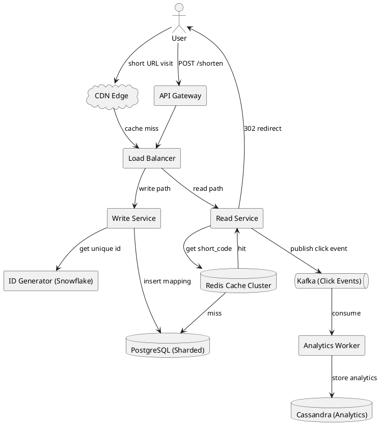
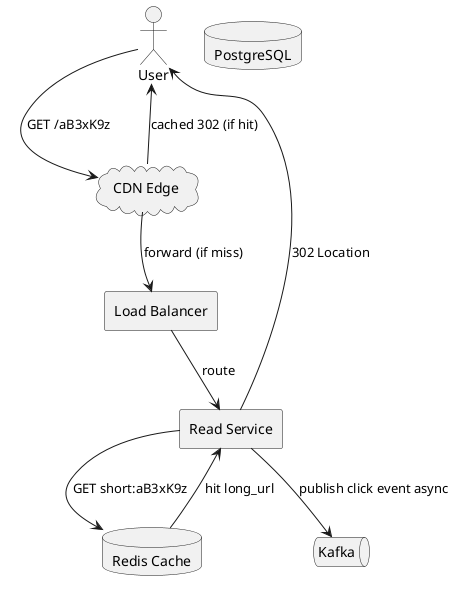
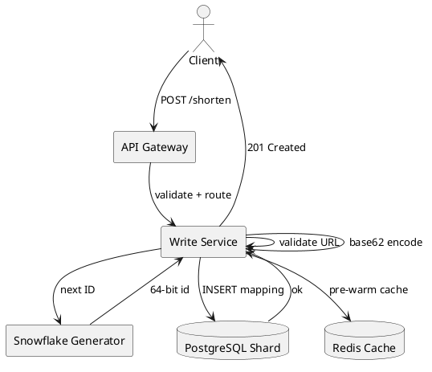
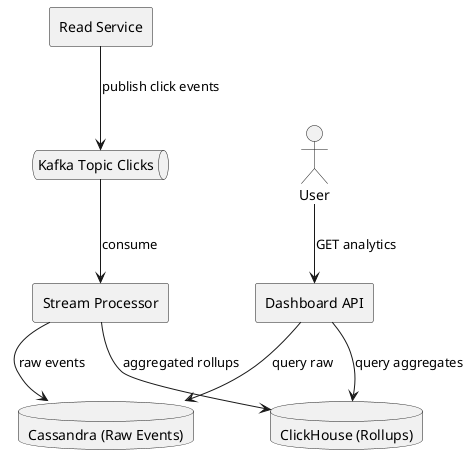
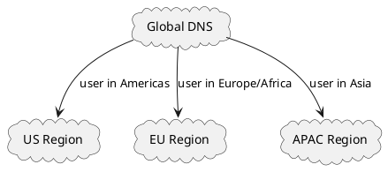

# URL Shortener (Bitly)

## Problem Statement

Design a URL shortening service like Bitly. Given a long URL, the system returns a much shorter alias. When users visit the short URL, they are redirected to the original long URL.

**Example:**
```
Input:  https://www.example.com/very/long/path/to/article?id=12345&ref=newsletter
Output: https://short.ly/aB3xK9z
```

---

## 1. Requirements Clarification

### Functional Requirements
- Given a long URL, generate a unique short URL
- Redirect short URL to the original long URL
- Optional: custom aliases (e.g., `short.ly/my-brand`)
- Optional: expiration (default never, or after N days)
- Optional: click analytics (count, referrer, geo, device)
- Optional: user accounts and dashboard

### Non-Functional Requirements
- **Scale**: 100M new URLs per day, 10B redirects per day (100:1 read:write)
- **Latency**: Redirect under 100ms at p99
- **Availability**: 99.99% uptime
- **Durability**: URLs must not be lost (5-year retention minimum)
- **Short length**: As short as possible (7 characters ideal)
- **Uniqueness**: No two long URLs should collide on the same short code

### Out of Scope
- User authentication and dashboards (mention but don't design)
- Malware scanning and abuse detection
- Advanced analytics (mentioned briefly)

---

## 2. Back-of-Envelope Estimation

### Traffic

```
Given:
  Write QPS (new URLs) = 100M / day
  Read QPS (redirects) = 10B / day
  Read:Write ratio      = 100:1

Average QPS:
  Write = 100,000,000 / 86,400   = ~1,157 writes/sec
  Read  = 10,000,000,000 / 86,400 = ~115,740 reads/sec

Peak QPS (3x factor):
  Write peak = ~3,500 writes/sec
  Read peak  = ~350,000 reads/sec
```

### Storage

```
Assume 5-year retention.

Rows over 5 years:
  Writes/day = 100M
  Days       = 365 x 5 = 1,825
  Total rows = 100M x 1,825 = ~182 billion rows

Row size (raw):
  short_code      ~10 bytes
  long_url        ~100 bytes
  user_id         ~8 bytes
  created_at      ~8 bytes
  expires_at      ~8 bytes
  click_count     ~8 bytes
  Total           ~142 bytes

With indexes (~2x overhead):
  Effective row size = ~285 bytes

Raw storage:
  182B rows x 285 bytes = ~52 TB

With replication factor 3:
  Total = 52 TB x 3 = ~156 TB

With backups (~2x):
  Grand total = ~312 TB
```

### Bandwidth

```
Write bandwidth:
  3,500 writes/sec x 150 bytes = ~525 KB/sec (small)

Read bandwidth:
  350,000 reads/sec x 500 bytes (redirect response) = ~175 MB/sec
  = ~1.4 Gbps

Redirect responses are small (302 with Location header), so bandwidth is modest.
```

### Cache (80/20 rule)

```
20% of daily reads serve 80% of traffic:
  20% of 10B reads/day = 2B reads/day
  2B x 150 bytes (short_code -> long_url entry) = ~300 GB

With overhead (~2x):
  Cache size = ~600 GB

Use Redis Cluster with ~10 shards (60 GB each)
```

### Short Code Length

```
Need to support 182B URLs over 5 years.

Base62 alphabet: a-z (26) + A-Z (26) + 0-9 (10) = 62 characters

62^6 = 56.8 billion     (not enough)
62^7 = 3.5 trillion     (plenty of headroom)

Decision: 7-character base62 codes
```

---

## 3. High-Level Design



### Component Responsibilities

| Component | Role |
|---|---|
| CDN | Cache popular redirects at edge, reduce origin load |
| Load Balancer | Distribute traffic across API servers |
| API Gateway | Auth, rate limiting, routing |
| Write Service | Validate, generate short code, persist |
| Read Service | Lookup short code, return redirect |
| ID Generator | Snowflake-based unique ID generation |
| Redis Cluster | Cache short_code -> long_url mapping |
| PostgreSQL | Durable, sharded storage of all mappings |
| Kafka | Buffer click events for async analytics |
| Analytics Worker | Aggregate click data |
| Cassandra | Store analytics events at scale |

---

## 4. API Design

### Shorten a URL

```http
POST /api/v1/shorten
Content-Type: application/json
Authorization: Bearer <token>

{
  "long_url": "https://www.example.com/very/long/path",
  "custom_code": "mylink",
  "expires_in": 86400
}
```

**Response 201:**
```json
{
  "short_url": "https://short.ly/aB3xK9z",
  "short_code": "aB3xK9z",
  "long_url": "https://www.example.com/very/long/path",
  "created_at": "2026-09-17T10:00:00Z",
  "expires_at": "2026-09-18T10:00:00Z"
}
```

### Redirect

```http
GET /{short_code}
```

**Response 302:**
```http
HTTP/1.1 302 Found
Location: https://www.example.com/very/long/path
Cache-Control: private, max-age=90
```

### Analytics (optional)

```http
GET /api/v1/analytics/{short_code}

Response 200:
{
  "short_code": "aB3xK9z",
  "total_clicks": 12345,
  "clicks_by_day": [...],
  "top_referrers": [...],
  "top_countries": [...]
}
```

### Why 302 (Not 301)

| Code | Behavior | Analytics |
|---|---|---|
| 301 Permanent | Browser caches forever | No tracking possible |
| 302 Temporary | Not cached (or short cache) | Every click hits server |

**Decision**: 302 with `Cache-Control: private, max-age=90` — balances load with analytics.

---

## 5. Database Design

### Primary Table

```sql
CREATE TABLE url_mapping (
    short_code VARCHAR(10) PRIMARY KEY,
    long_url   TEXT NOT NULL,
    user_id    BIGINT,
    created_at TIMESTAMP DEFAULT CURRENT_TIMESTAMP,
    expires_at TIMESTAMP,
    click_count BIGINT DEFAULT 0,
    is_active  BOOLEAN DEFAULT TRUE
);

CREATE INDEX idx_long_url_hash ON url_mapping(MD5(long_url));
CREATE INDEX idx_user_created ON url_mapping(user_id, created_at DESC);
CREATE INDEX idx_expires ON url_mapping(expires_at) WHERE expires_at IS NOT NULL;
```

### Sharding Strategy

**Shard key**: `short_code` (hash-based)

```
shard_id = hash(short_code) % NUM_SHARDS
```

**Why short_code?**
- Redirects are the dominant read pattern, and they look up by short_code
- Even distribution (short codes are random)
- No hotspots

**Why not user_id?**
- Anonymous URLs have no user_id
- Celebrity users could create hot shards

### Shard Count

```
Peak writes: 3,500/sec
Peak reads:  350,000/sec

Assume PostgreSQL shard handles:
  5,000 writes/sec
  50,000 reads/sec (with indexes)

Shards needed (writes): 3,500 / 5,000 = 1 (but plan for growth)
Shards needed (reads):  350,000 / 50,000 = 7

With replication and headroom:
  Start with 16 shards, each with 1 primary + 2 replicas
  Can scale to 256 shards without rehashing (power of 2)
```

### Analytics Table (Cassandra)

```sql
CREATE TABLE click_events (
    short_code VARCHAR(10),
    click_time TIMESTAMP,
    ip_address TEXT,
    user_agent TEXT,
    referrer TEXT,
    country TEXT,
    device_type TEXT,
    PRIMARY KEY ((short_code), click_time)
) WITH CLUSTERING ORDER BY (click_time DESC);
```

Partition by `short_code` for fast lookups per URL. Clustering by time for recent-first queries.

---

## 6. Short Code Generation Strategies

### Option A: MD5 Hash + Base62

```java
String shortCode = base62(md5(longUrl)).substring(0, 7);
```

| Pros | Cons |
|---|---|
| Same URL -> same code (dedup) | Collision handling needed |
| Simple | Long URLs are slow to hash at scale |
| No coordination | Hard to scale across regions |

**Verdict**: Not ideal for high write throughput.

### Option B: Counter-Based

```java
long counter = atomicCounter.incrementAndGet();
String shortCode = base62(counter);
```

| Pros | Cons |
|---|---|
| No collisions | Single point of failure |
| Simple | Predictable (enumerable) |
| Fast | Hard to distribute |

**Verdict**: Fine for single-node, not for distributed.

### Option C: Snowflake ID (Recommended)

```java
long id = snowflake.nextId();
String shortCode = base62(id);
```

**Snowflake ID structure:**
```
64 bits:
  41 bits timestamp (ms since custom epoch) -> ~69 years
  10 bits machine ID (up to 1024 machines)
  12 bits sequence (up to 4096 IDs per ms per machine)

Theoretical max: 4 million IDs/sec across all machines
```

| Pros | Cons |
|---|---|
| Distributed, no coordination | Slightly more complex |
| Time-sortable | Clock skew sensitive |
| No collisions | Requires machine ID management |
| Scales horizontally | |

**Verdict**: Best choice for this scale.

### Option D: Pre-Generated Key Service

```
Key Generation Service (KGS):
  - Pre-generates random 7-char codes
  - Stores in a key DB (unused keys)
  - App servers fetch batches of 1000 keys
  - Mark as used when assigned
```

| Pros | Cons |
|---|---|
| Very fast (no runtime generation) | Key DB is SPOF |
| No collisions at runtime | Unused keys wasted on crash |
| Simple app logic | Need to refill key DB |

**Verdict**: Good for very high write scale.

### Comparison

| Strategy | Collision Risk | Distributed | Complexity | Best For |
|---|---|---|---|---|
| MD5 Hash | Medium | No coordination | Low | Dedup use cases |
| Counter | None | Hard | Low | Single node |
| Snowflake | None | Yes | Medium | **High scale (chosen)** |
| Pre-generated | None | Depends on KGS | Medium | Extreme write scale |

**Decision**: Snowflake ID + Base62 encoding.

---

## 7. Deep Dive: Redirect Flow



**Step-by-step:**

1. **CDN check** — if short code is popular, CDN serves 302 directly (edge cache)
2. **Load balancer** — routes to a Read Service instance
3. **Redis lookup** — `GET short:aB3xK9z`
   - Hit: return long_url (99% of cases)
   - Miss: query PostgreSQL
4. **Database lookup** — `SELECT long_url FROM url_mapping WHERE short_code = ?`
   - If found: populate Redis with TTL, return
   - If expired: return 410 Gone
   - If not found: return 404
5. **Async click** — publish to Kafka (non-blocking)
6. **Respond** — 302 with `Location` header

### Latency Budget

| Step | Budget |
|---|---|
| CDN edge | 10-20 ms |
| LB hop | 1-2 ms |
| Redis lookup | 1-2 ms |
| DB lookup (miss) | 5-10 ms |
| Kafka publish | async (not on critical path) |
| Total (cache hit) | ~15-25 ms |
| Total (cache miss) | ~25-35 ms |

Well under the 100ms p99 target.

---

## 8. Deep Dive: Write Flow



**Step-by-step:**

1. **Validate URL** — scheme (http/https), length, blocklist
2. **Check dedup** (optional) — if user has shortened this URL before, return existing
3. **Generate ID** — Snowflake ID
4. **Encode** — base62 -> 7-char code
5. **Check collision** (rare) — if exists, regenerate
6. **Insert** — write to shard based on hash(short_code)
7. **Pre-warm cache** — set Redis entry with TTL
8. **Return** — 201 with short URL

### Handling Collisions

With Snowflake, collisions are essentially impossible (unique IDs). But if using hash-based codes:

```java
for (int attempt = 0; attempt < 3; attempt++) {
    String code = generateCode(longUrl, attempt);
    if (!db.exists(code)) {
        db.insert(code, longUrl);
        return code;
    }
}
throw new RuntimeException("Collision limit exceeded");
```

---

## 9. Deep Dive: Analytics Pipeline



### Event Schema (Kafka)

```json
{
  "short_code": "aB3xK9z",
  "timestamp": "2026-09-17T10:00:00.123Z",
  "ip": "203.0.113.42",
  "user_agent": "Mozilla/5.0...",
  "referrer": "https://twitter.com/...",
  "country": "IN",
  "device_type": "mobile"
}
```

### Aggregations

Two-tier storage:
- **Raw events** (Cassandra): 30-day retention, per-click detail
- **Rollups** (ClickHouse): daily/hourly aggregates, 1-year retention

**Rollup tables:**
- `clicks_by_hour(short_code, hour, count)`
- `clicks_by_country(short_code, country, count)`
- `top_referrers(short_code, referrer, count)`

This keeps analytics queries fast (aggregates) while retaining detail (raw events).

---

## 10. Scaling Considerations

### Read Scaling
- Add read replicas per shard
- Expand Redis cluster (consistent hashing)
- Multi-region CDN for hot URLs
- Edge caching with short TTL (60-90s)

### Write Scaling
- Add more shards (pre-provision for power-of-2)
- Snowflake ID generator per region
- Batch inserts if bulk shortening
- Async analytics (already done via Kafka)

### Global Deployment



Each region has:
- Full Redis cluster
- Full PostgreSQL shards (replicated)
- Local Snowflake generators
- Cross-region replication for durability

### Cross-Region Replication

- **Active-active**: All regions accept writes, replicate async
- **Conflict resolution**: Snowflake IDs are globally unique (no conflicts)
- **Replication lag**: Acceptable for reads (eventual consistency)

---

## 11. Bottlenecks and Trade-offs

| Concern | Solution | Trade-off |
|---|---|---|
| Read hotspot | Multi-level cache (CDN + Redis) | Cache invalidation complexity |
| Write hotspot | Snowflake + sharded DB | Machine ID management |
| DB size growth | TTL expiry + cold storage | Users lose old URLs |
| Analytics overload | Async Kafka pipeline | Slight delay in analytics |
| Cache stampede | Mutex on miss, probabilistic early refresh | Slight latency on miss |
| Hot key in Redis | Local cache + key sharding | Inconsistency window |
| Region latency | Multi-region active-active | Cross-region replication cost |
| SPOF in Redis | Redis Sentinel / Cluster | Complexity |
| SPOF in ID gen | Multiple Snowflake generators | Clock skew handling |
| Malicious URLs | Blocklist + scanning | Latency on writes |

### Design Decisions Summary

| Decision | Choice | Rationale |
|---|---|---|
| Short code length | 7 chars | Fits 5-year scale with headroom |
| Encoding | Base62 | URL-safe, dense |
| ID generation | Snowflake | Distributed, no collision |
| Primary DB | PostgreSQL | ACID, mature, shardable |
| Cache | Redis Cluster | Sub-ms latency, consistent hashing |
| Analytics DB | Cassandra + ClickHouse | Write-heavy + fast aggregations |
| Read path | 302 + CDN | Balance load vs analytics |
| Sharding | Hash(short_code) | Even distribution, read-optimized |

---

## 12. Failure Scenarios

### Redis Cluster Down
- Fallback: read directly from PostgreSQL
- Degradation: latency increases from ~15ms to ~50ms
- Rate limit fallback reads to protect DB
- Alert immediately

### PostgreSQL Shard Down
- Replica promotion via orchestrator (Patroni, RDS Multi-AZ)
- Downtime: ~30 seconds for failover
- During failover: reads served from cache (short TTL)
- Writes buffered or fail fast

### Kafka Down
- Redirects still work (analytics is async)
- Click events buffered in memory (bounded queue)
- If buffer overflows: drop oldest events (acceptable loss)
- Alternative: write to local log file, ship later

### Snowflake Generator Down
- Multiple generators per region (active-active)
- Zookeeper/etcd coordinates machine IDs
- Fallback: use hash-based code with collision retry

### Cache Stampede on Popular URL
- Mutex lock on first miss
- Other requests wait up to 50ms
- Alternatively: probabilistic early refresh (refresh at 80% TTL)

---

## 13. Monitoring and Alerts

### Key Metrics

| Metric | Target | Alert Threshold |
|---|---|---|
| Redirect p50 latency | < 20 ms | > 50 ms |
| Redirect p99 latency | < 100 ms | > 200 ms |
| Cache hit ratio | > 95% | < 85% |
| Error rate (5xx) | < 0.01% | > 0.1% |
| Write success rate | > 99.9% | < 99% |
| Kafka consumer lag | < 1 min | > 5 min |
| Redis memory usage | < 70% | > 85% |
| DB replica lag | < 100 ms | > 1 sec |
| Snowflake clock skew | < 10 ms | > 50 ms |

### Dashboards

- **Traffic**: QPS (read/write), by region
- **Latency**: p50/p95/p99 for read and write paths
- **Errors**: 4xx, 5xx breakdown by endpoint
- **Infrastructure**: CPU, memory, disk, network per service
- **Business**: URLs shortened, redirects, unique users

---

## 14. Cost Estimation

Rough monthly cost (AWS, us-east-1):

| Component | Spec | Cost/month |
|---|---|---|
| Compute (API servers) | 150 x c6g.large | ~$8,000 |
| Redis Cluster | 10 x r6g.xlarge | ~$3,500 |
| PostgreSQL | 16 shards x db.r6g.2xlarge | ~$25,000 |
| S3 (cold storage) | 300 TB | ~$7,000 |
| Kafka (MSK) | 3 brokers x kafka.m5.large | ~$1,200 |
| Cassandra | 10 x i3.2xlarge | ~$12,000 |
| CDN | 100 TB egress | ~$8,500 |
| Data transfer | Cross-region + egress | ~$5,000 |
| **Total** | | **~$70,000/month** |

**Cost optimization:**
- Reserved instances for steady-state (save 30-40%)
- S3 Glacier for cold URLs (save 80%)
- Spot instances for batch analytics
- Shorter TTLs in Redis (reduce memory)

---

## 15. Extensions and Follow-ups

### Custom Aliases
- User picks code (e.g., `short.ly/my-brand`)
- Check availability against DB (reserved + user-owned)
- Namespace: `custom:{code}` in DB

### Expiration
- Store `expires_at` in DB
- Redis TTL matches `expires_at`
- On redirect: if expired, return `410 Gone`
- Background job purges expired rows

### Bulk Shortening
- Batch API: accept up to 1000 URLs per request
- Return array of short codes
- Async processing if > 1000

### Link Preview
- Fetch URL metadata (title, description, image)
- Cache in separate table
- Serve on hover or preview API

### QR Code Generation
- Generate on the fly from short URL
- Cache QR images in CDN
- No extra storage needed

### Malware / Abuse Protection
- Integrate with Google Safe Browsing API
- Blocklist by domain and hash
- Rate limit by IP and account
- Manual review queue for flagged URLs

### Enterprise Features
- Custom domains (`go.company.com/xyz`)
- SSO integration
- Audit logs
- SLA guarantees

---

## 16. Summary

| Aspect | Decision |
|---|---|
| Short code | 7-char base62 |
| ID generation | Snowflake (distributed, collision-free) |
| Primary DB | PostgreSQL (sharded by short_code) |
| Cache | Redis Cluster (95%+ hit ratio) |
| Read path | 302 redirect + CDN edge cache |
| Analytics | Kafka + Cassandra + ClickHouse |
| Scale | 350K peak read QPS, 3.5K peak write QPS |
| Latency | < 30 ms p99 for redirects |
| Availability | 99.99% (multi-region, multi-AZ) |
| Storage | ~312 TB over 5 years |

**Key takeaways:**
- Read:write ratio of 100:1 drives cache-first design
- Snowflake IDs avoid collisions without coordination
- Async analytics keeps redirects fast
- Multi-level caching (CDN + Redis) is essential at this scale
- Sharding by `short_code` naturally distributes load evenly