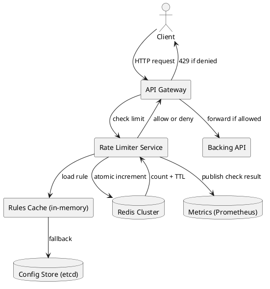
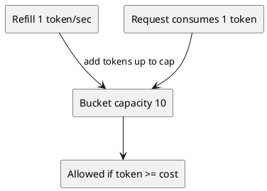
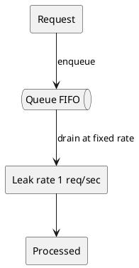
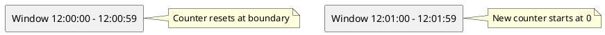
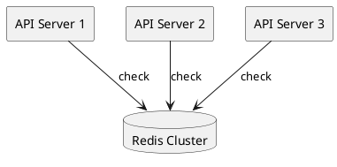
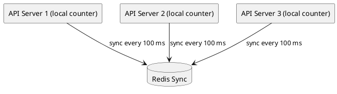
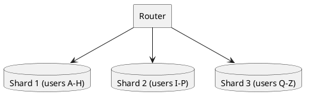
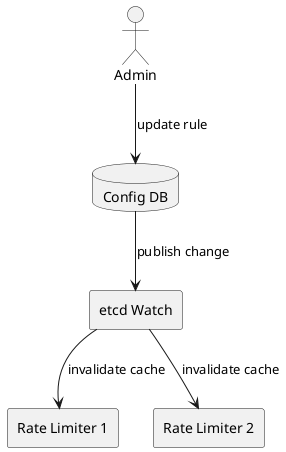
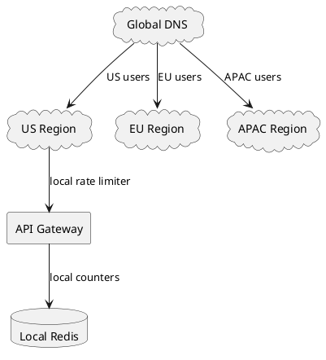

# Rate Limiter

## Problem Statement

Design a rate limiter that controls the rate of requests a client can send to an API. If the request count exceeds a configured threshold within a time window, the server returns HTTP 429 (Too Many Requests) with a `Retry-After` header.

**Example:**
```
Client: GET /api/v1/search?q=hello
Server: 200 OK (first 100 requests this minute)

Client: GET /api/v1/search?q=hello  (101st request)
Server: 429 Too Many Requests
        Retry-After: 42
        X-RateLimit-Limit: 100
        X-RateLimit-Remaining: 0
        X-RateLimit-Reset: 1633024860
```

---

## 1. Requirements Clarification

### Functional Requirements
- Limit requests per client (user, IP, API key, endpoint)
- Return 429 when limit exceeded with `Retry-After`
- Support configurable rules: N requests per time window
- Different limits per tier (free, pro, enterprise)
- Different limits per endpoint
- Optional: allow bursts up to a cap

### Non-Functional Requirements
- **Scale**: 1M+ QPS across all clients
- **Latency**: Rate limit check < 5ms at p99 (on critical path)
- **Accuracy**: Small over-admission acceptable (e.g., 5% error under load)
- **Availability**: 99.99% — must not become a SPOF
- **Consistency**: Distributed limiter must be globally accurate (or near-accurate)
- **Configurability**: Rules updated without redeploy

### Out of Scope
- Billing (though rate limits often tie into pricing)
- Advanced analytics dashboards
- Machine learning-based abuse detection

---

## 2. Back-of-Envelope Estimation

### Traffic

```
Given:
  Total API QPS           = 1,000,000
  Unique API keys/users   = 10,000,000
  Avg requests per user   = 0.1/sec
  Peak multiplier         = 3x

Rate limit checks/sec:
  Every request triggers one check -> 1,000,000 checks/sec
  Peak -> 3,000,000 checks/sec
```

### Storage

```
Counter storage (Redis):
  Each key -> one counter (or a small hash)
  Key format: rl:{user_id}:{endpoint}:{window}
  Key size: ~64 bytes
  Value (counter): ~8 bytes
  TTL metadata: ~16 bytes
  Total per key: ~90 bytes

Active keys:
  Users x endpoints x windows
  = 10M x 5 endpoints x 2 windows = 100M keys

Storage:
  100M x 90 bytes = ~9 GB (fits in a small Redis cluster)

With 3 replicas:
  ~27 GB total
```

### Bandwidth

```
Request/response overhead per check:
  Redis round-trip: ~2 ms
  Payload: ~200 bytes (key + value + response)

Bandwidth:
  1M QPS x 200 bytes = ~200 MB/sec
  Peak: ~600 MB/sec
  Small — negligible compared to API traffic
```

### Latency Budget

```
Target: < 5 ms p99 for rate limit check.

Breakdown:
  Network to Redis:    ~1 ms
  Redis operation:     < 1 ms
  Response parsing:    < 1 ms
  Total:               ~2-3 ms

Headroom for retries: ~2 ms
```

---

## 3. High-Level Design



### Component Responsibilities

| Component | Role |
|---|---|
| API Gateway | Entry point — calls rate limiter before forwarding |
| Rate Limiter Service | Evaluates the rule, checks Redis, decides allow/deny |
| Rules Cache | In-memory cache of rules (updated from config store) |
| Config Store | Source of truth for rate limit rules (etcd, DB) |
| Redis Cluster | Stores counters and token buckets |
| Metrics | Publishes check results for observability |

### Why a Separate Service?

- **Polyglot**: Multiple services (Java, Go, Python) can call it
- **Centralized rules**: One place to update
- **Independent scaling**: Rate limiter scales separately from API
- **Alternative**: Embed as a library (faster, but rules scattered)

For very high QPS, consider **sidecar** (Envoy, Istio) or **library** + **Redis** — keeps it local but centralized state.

---

## 4. API Design

### Internal API (Rate Limiter Service)

```http
POST /v1/check
Content-Type: application/json

{
  "key": "user:12345:endpoint:/search",
  "rule_id": "search_default",
  "cost": 1,
  "timestamp": 1633024800123
}
```

**Response 200 (allowed):**
```json
{
  "allowed": true,
  "remaining": 87,
  "reset_at": 1633024860000,
  "limit": 100
}
```

**Response 200 (denied):**
```json
{
  "allowed": false,
  "remaining": 0,
  "reset_at": 1633024860000,
  "limit": 100,
  "retry_after": 42
}
```

**Note:** The limiter returns 200 with `allowed: false` — the **gateway** translates this to 429 to the client.

### Client-Facing Response

```http
HTTP/1.1 429 Too Many Requests
Retry-After: 42
X-RateLimit-Limit: 100
X-RateLimit-Remaining: 0
X-RateLimit-Reset: 1633024860
Content-Type: application/json

{
  "error": "rate_limit_exceeded",
  "message": "Too many requests. Retry after 42 seconds.",
  "documentation_url": "https://api.example.com/docs/rate-limits"
}
```

### Rule Configuration

```json
{
  "rule_id": "search_default",
  "algorithm": "sliding_window",
  "limit": 100,
  "window_seconds": 60,
  "scope": "user",
  "endpoint_pattern": "/api/v1/search",
  "burst_allowance": 20,
  "tiers": {
    "free": 100,
    "pro": 10000,
    "enterprise": 1000000
  }
}
```

---

## 5. Algorithms — Deep Dive

### 5.1 Token Bucket



**How it works:**
- Bucket has capacity C (max burst)
- Refill rate R tokens per second
- Each request consumes K tokens (usually 1)
- If tokens >= K: allow, subtract K
- If tokens < K: deny

**Pros:**
- Allows bursts up to C
- Smooth steady-state at R
- Simple to implement and reason about

**Cons:**
- Two parameters to tune (C, R)
- Slightly more complex than fixed window

**Implementation (Redis + Lua):**

```lua
-- KEYS[1] = bucket key
-- ARGV[1] = capacity
-- ARGV[2] = refill rate (tokens/sec)
-- ARGV[3] = current timestamp (ms)
-- ARGV[4] = tokens requested

local key       = KEYS[1]
local capacity  = tonumber(ARGV[1])
local refill    = tonumber(ARGV[2])
local now       = tonumber(ARGV[3])
local requested = tonumber(ARGV[4])

local data        = redis.call('HMGET', key, 'tokens', 'lastRefill')
local tokens      = tonumber(data[1]) or capacity
local lastRefill  = tonumber(data[2]) or now

local elapsed = math.max(0, now - lastRefill) / 1000
local refilled = math.min(capacity, tokens + elapsed * refill)

if refilled >= requested then
    redis.call('HMSET', key, 'tokens', refilled - requested, 'lastRefill', now)
    redis.call('EXPIRE', key, 3600)
    return {1, math.floor(refilled - requested)}
else
    redis.call('HMSET', key, 'tokens', refilled, 'lastRefill', now)
    redis.call('EXPIRE', key, 3600)
    return {0, 0}
end
```

The Lua script runs atomically in Redis — no race conditions between read and write.

### 5.2 Leaky Bucket



**How it works:**
- Requests enter a FIFO queue
- Queue drains at a fixed rate R
- If queue full: deny request
- Requests never burst — output is smooth

**Pros:**
- Perfectly smooth output rate
- Good for downstream services that can't handle bursts

**Cons:**
- Bursts are penalized even if capacity exists
- Queue adds latency to allowed requests

### 5.3 Fixed Window Counter



**How it works:**
- Counter per time window (e.g., 1 minute)
- Increment on each request
- If count > limit: deny
- Reset counter at window boundary

**Pros:**
- Simplest to implement
- Minimal memory (one counter per window)
- Fast (single INCR)

**Cons:**
- **Boundary problem**: Client can send 2x the limit across a boundary
  - Example: 100 requests at 12:00:59, then 100 at 12:01:00 = 200 in ~1 sec
- Not suitable for strict limits

### 5.4 Sliding Window Log

**How it works:**
- Store timestamp of every request
- On new request:
  - Remove timestamps older than window
  - Count remaining
  - If count < limit: allow, add timestamp
  - Else: deny

**Pros:**
- Most accurate — no boundary problem
- Exact count in any window

**Cons:**
- Memory-heavy: O(requests) per client
- Sorted set operations are O(log N)

**Redis Implementation:**

```
ZREMRANGEBYSCORE key 0 (now - window_ms)   # remove old
ZCARD key                                   # count remaining
ZADD key now now                            # add current
EXPIRE key (window_seconds + 1)
```

### 5.5 Sliding Window Counter (Hybrid)

**How it works:**
- Combine current + previous window
- Weight previous window by overlap

```
current_count + previous_count * (1 - elapsed_in_window / window_size)
```

**Example:**
- Previous window (12:00:00-12:00:59): 80 requests
- Current window (12:01:00-12:01:59): 20 requests so far at 12:01:15 (25% elapsed)
- Weighted count = 20 + 80 * (1 - 0.25) = 20 + 60 = 80

**Pros:**
- ~Exact, low memory
- Used by Cloudflare, many CDNs

**Cons:**
- Approximate (small error at boundaries)

### Algorithm Comparison

| Algorithm | Accuracy | Memory | Burst | Complexity |
|---|---|---|---|---|
| Token Bucket | High | O(1) | Yes (up to cap) | Medium |
| Leaky Bucket | High | O(queue) | No (smooth) | Medium |
| Fixed Window | Low | O(1) | Boundary bug | Low |
| Sliding Log | Exact | O(N) | No | Medium |
| Sliding Counter | High | O(1) | Yes (weighted) | Medium |

**Recommendation:**
- **Token Bucket** for most APIs (allows bursts, smooth steady-state)
- **Sliding Window Counter** when memory is tight and accuracy matters
- **Avoid Fixed Window** for strict SLAs

---

## 6. Database / Storage Design

### Redis Data Structures

| Algorithm | Redis Type | Key Format |
|---|---|---|
| Token Bucket | Hash | `rl:tb:{user}:{endpoint}` |
| Sliding Log | Sorted Set | `rl:sl:{user}:{endpoint}` |
| Sliding Counter | Two Hashes | `rl:sw:{user}:{endpoint}:{window}` |
| Fixed Window | String (INCR) | `rl:fw:{user}:{endpoint}:{window_start}` |

### Key Design

```
Format: rl:{algorithm}:{scope}:{scope_id}:{endpoint}

Examples:
  rl:tb:user:12345:/api/v1/search
  rl:sl:apikey:abc-xyz:*
  rl:sw:ip:203.0.113.42:/api/v1/login
```

### TTL Strategy

```
TTL = window_size * 2 (safety margin)

Examples:
  1-minute window -> TTL 120 seconds
  1-hour window   -> TTL 2 hours
  1-day window    -> TTL 2 days
```

**Why 2x?**
- For sliding window, need previous window data
- For token bucket, refill calculation needs `lastRefill`
- Safety against clock skew

### Redis Cluster Sharding

```
Shard by hash(key) % NUM_SHARDS

With 100M keys and 10 shards:
  ~10M keys per shard
  ~900 MB per shard (well within Redis limits)
```

**Hot shard risk**: A single user with 1M QPS would concentrate all keys on one shard. Mitigate with:
- Per-user rate limits enforced client-side as a first line
- Sharding by user with consistent hashing
- Multiple Redis clusters per region

---

## 7. Deep Dive: Distributed Rate Limiting

### The Challenge

Rate limits must be **globally accurate**, but Redis itself is distributed. Three approaches:

### Approach 1: Central Redis Cluster (Simplest)



- All servers check the same Redis cluster
- **Accurate** because state is centralized
- **Latency**: 1-2 ms round-trip
- **Scale limit**: Redis cluster handles ~1M ops/sec per shard

**When to use:** Most systems. Simplicity wins.

### Approach 2: Local Counters with Periodic Sync



- Each server has a local counter
- Periodically syncs with Redis
- **Fast** (local check, no round-trip)
- **Approximate** (may over-admit by up to N-1 servers x local limit)

**When to use:** Extremely high QPS where 5ms matters, and slight over-admission is OK.

### Approach 3: Sharded Counters by User



- Shard by user_id
- Each user's counter lives on one shard
- **Accurate** per user
- **Scales** linearly with shards

**When to use:** Very high QPS, and per-user accuracy is essential.

### Race Conditions

**Problem:** Two concurrent requests read the same counter, both increment, both exceed limit.

**Solution:** Atomic operations in Redis

- **INCR** — atomic increment
- **Lua scripts** — multiple operations atomically
- **WATCH/MULTI/EXEC** — optimistic transactions

**Example race:**
```
Thread A: GET counter = 99
Thread B: GET counter = 99
Thread A: SET counter = 100 (allow)
Thread B: SET counter = 100 (allow)  <- both allowed, but limit was 100
```

**Fixed with INCR:**
```
Thread A: INCR counter -> 100 (allow)
Thread B: INCR counter -> 101 (deny)  <- correct
```

**Fixed with Lua for complex logic:**
Use a single Lua script that reads, checks, and increments in one atomic block.

---

## 8. Deep Dive: Rules Engine

### Rule Hierarchy

```
Global default
  |-- Tier override (free, pro, enterprise)
      |-- Endpoint override
          |-- User-specific override
```

Evaluation order: most specific wins.

### Rule Storage

- **Source of truth**: etcd / PostgreSQL
- **Cache**: in-memory (Caffeine, Guava) with 5-min TTL
- **Push updates**: Redis pub/sub or etcd watch for instant invalidation

### Rule Update Flow



Rules are cached locally; changes propagate within 100 ms.

### Hierarchical Evaluation Example

```
Request: user=12345, tier=pro, endpoint=/api/v1/search

1. Look up endpoint override -> none
2. Look up tier rule -> pro tier: 1000 req/min
3. Look up global default -> ignored (tier rule exists)

Effective limit: 1000 req/min
```

---

## 9. Deep Dive: Client-Side Hints

### Rate Limit Headers

```http
X-RateLimit-Limit: 1000
X-RateLimit-Remaining: 847
X-RateLimit-Reset: 1633024860
X-RateLimit-Policy: 1000;w=60
Retry-After: 42
```

- **Limit**: Total quota
- **Remaining**: Quota left in current window
- **Reset**: Unix timestamp when quota resets
- **Retry-After**: Seconds until client can retry (only on 429)

### Why Headers Matter

- Well-behaved clients can back off **before** hitting 429
- Reduces unnecessary traffic
- Enables exponential backoff with jitter

### Exponential Backoff with Jitter

```
Wait time = min(cap, base * 2^attempt) * random(0.5, 1.0)

Example:
  attempt 1: ~1 sec
  attempt 2: ~2 sec
  attempt 3: ~4 sec
  attempt 4: ~8 sec
  (jitter prevents thundering herd)
```

---

## 10. Scaling Considerations

### Read Scaling
- Rate limit checks are **read-heavy** (1 check per API request)
- Redis is already fast; scale by adding shards
- Rules cache is in-process (no Redis lookup for rules)

### Write Scaling
- Every check writes to Redis (counter increment)
- Redis can handle ~100K-1M writes/sec per shard
- Shard by user_id for linear scaling

### Multi-Region



- **Per-region rate limits**: Each region has its own Redis
- **Cross-region consistency**: Eventual (acceptable for rate limits)
- **Global rate limits**: Central Redis with cross-region sync (rare, expensive)

**Recommendation**: Per-region limits for most cases. Global limits only for abuse prevention.

### Caching Rules Locally

```
Rules change infrequently (minutes to hours).
Cache in-process with 5-min TTL.
Invalidate via pub/sub on change.
```

Reduces Redis load by 99% (rules not read per request).

---

## 11. Bottlenecks and Trade-offs

| Concern | Solution | Trade-off |
|---|---|---|
| Redis SPOF | Redis Sentinel / Cluster | Complexity |
| Redis latency on critical path | Local counters + periodic sync | Approximate |
| Hot shard | Shard by user with consistent hashing | More shards to manage |
| Clock skew across servers | Use Redis server time | Slight drift |
| Rule update latency | Local cache + pub/sub | Stale rules for ms |
| Thundering herd on retry | Exponential backoff + jitter | Client must implement |
| Stolen API keys | Rate limit by multiple keys (IP + user) | More Redis ops |
| Distributed accurate counting | Lua scripts + atomic ops | Redis CPU usage |

### Design Decisions Summary

| Decision | Choice | Rationale |
|---|---|---|
| Algorithm | Token Bucket | Allows bursts, simple to reason about |
| Storage | Redis Cluster | Sub-ms, atomic, scales horizontally |
| Sharding | By user_id | Even distribution, no hot shards |
| Rules cache | In-process (Caffeine) | 99% reduction in Redis reads |
| Rule updates | Pub/sub invalidation | < 100 ms propagation |
| Multi-region | Per-region limits | Simpler, low latency, acceptable eventual consistency |
| Failure mode | Fail open (allow) | Prefer availability over strictness |
| Client hints | Standard headers | Reduces 429s |

---

## 12. Failure Scenarios

### Redis Down

**Behavior:** Fail open (allow all requests).

**Why:** Rate limiter is a protection mechanism, not a business requirement. Blocking all traffic is worse than allowing some abuse.

**Mitigations:**
- Local fallback counter (per-server)
- Alert immediately
- Circuit breaker to stop calling Redis after N failures

### Redis Slow (> 10 ms)

**Behavior:** Timeout after 5 ms, fall back to local counter.

**Why:** Rate limiter must not dominate request latency.

**Mitigations:**
- Per-endpoint timeout budgets
- Metric on Redis latency; alert at p99 > 5 ms

### Rules Cache Miss

**Behavior:** Fall back to Redis or DB for rules.

**Why:** Rules are cached, but cache can be cold after deploy.

**Mitigations:**
- Warm cache on startup
- Fall back to global default if rules unavailable

### Hot User (Single user sends 1M QPS)

**Behavior:** User's shard gets hammered.

**Mitigations:**
- Shard by user, so hot user's shard is isolated (doesn't affect others)
- Aggressive client-side rate limit for authenticated users
- Ban / throttle at CDN layer for abusive IPs

### Clock Skew

**Behavior:** Different servers disagree on window boundaries.

**Mitigations:**
- Use Redis `TIME` command as authoritative timestamp
- Never trust local clock for distributed rate limiting

### Thundering Herd on Retry

**Behavior:** Many clients retry at the same instant after 429.

**Mitigations:**
- `Retry-After` header with jittered value
- Exponential backoff in clients
- Per-user 429 response staggering

---

## 13. Monitoring and Alerts

### Key Metrics

| Metric | Target | Alert Threshold |
|---|---|---|
| Rate limit check p99 latency | < 5 ms | > 10 ms |
| Redis check p99 latency | < 2 ms | > 5 ms |
| 429 rate | < 5% | > 10% |
| Rule cache hit ratio | > 99% | < 95% |
| Redis CPU usage | < 60% | > 80% |
| Redis memory usage | < 70% | > 85% |
| Fail-open events | 0 | > 0 |
| Rule propagation time | < 100 ms | > 1 sec |

### Dashboards

- **Traffic**: Total checks/sec, allowed vs denied
- **Latency**: p50/p95/p99 for checks
- **Errors**: Redis timeouts, rule load failures
- **Business**: 429 rate by endpoint, by tier, by region
- **Infrastructure**: Redis CPU, memory, network

### Alerts

- **P0**: Redis cluster down, fail-open triggered
- **P1**: 429 rate > 10% for 5+ minutes
- **P2**: Rate limit p99 > 10 ms
- **P3**: Rule cache hit ratio < 95%

---

## 14. Cost Estimation

Rough monthly cost (AWS, us-east-1):

| Component | Spec | Cost/month |
|---|---|---|
| Redis Cluster | 6 x cache.r6g.xlarge (3 shards, 2 replicas) | ~$2,500 |
| Rate Limiter Service | 20 x c6g.large | ~$1,200 |
| Config DB (etcd) | 3 small instances | ~$300 |
| Monitoring (Datadog) | 20 hosts | ~$1,500 |
| **Total** | | **~$5,500/month** |

**Cost optimization:**
- Use Redis Cluster with fewer shards (start small)
- Reserved instances for steady state
- Self-hosted Prometheus + Grafana instead of Datadog

---

## 15. Extensions and Follow-ups

### Multi-Tier Limits

```
Free tier:       100 req/min
Pro tier:        10,000 req/min
Enterprise:      1,000,000 req/min
Internal:        No limit

Rules engine picks tier based on API key or user account.
```

### Weighted Requests

Different endpoints have different costs:
```
GET /search:      cost = 1
POST /upload:     cost = 10
POST /ai/generate: cost = 100
```

Rate limiter checks `cost` in the request.

### DDoS Protection Integration

Layer with CDN-level IP rate limiting:
- CDN blocks obvious DDoS at edge
- API rate limiter handles legitimate but abusive clients
- Both feed into a central abuse dashboard

### Adaptive Rate Limiting

Dynamically adjust limits based on:
- Server load (reduce limits when overloaded)
- Client behavior (good citizens get higher limits)
- Time of day (higher limits off-peak)

### Distributed Rate Limiting with Quorum

For globally consistent rate limits:
- **R + W > N** quorum reads/writes
- More expensive but strictly accurate
- Used by few systems (most accept eventual consistency)

### Rate Limiting by Cost

Instead of request count, limit by:
- **Bandwidth** (bytes/sec)
- **CPU time** (for expensive operations)
- **Storage** (for upload endpoints)

Useful for cost-based abuse prevention.

---

## 16. Summary

| Aspect | Decision |
|---|---|
| Algorithm | Token Bucket (allows bursts) |
| Storage | Redis Cluster (sub-ms, atomic) |
| Sharding | By user_id (no hot shards) |
| Rules cache | In-process (99% hit ratio) |
| Rule updates | Pub/sub invalidation |
| Multi-region | Per-region limits |
| Failure mode | Fail open (allow) |
| Check latency | < 5 ms p99 |
| Scale | 3M peak checks/sec |
| Client hints | Standard `X-RateLimit-*` headers |

**Key takeaways:**
- Rate limiter must be **fast** — on the critical path of every request
- **Token bucket** is the industry standard for good reason
- **Atomic Redis operations** prevent race conditions
- **Fail open** — availability over strictness
- **Client hints** (`X-RateLimit-*`, `Retry-After`) reduce 429s
- **Local caching of rules** reduces Redis load by 99%
- **Shard by user** for even distribution
- **Per-region limits** beat global consistency for most cases

**Similar Pattern Problems:**
- Distributed Cache (Redis internals)
- API Gateway (rate limiter is often part of the gateway)
- Distributed Lock (uses similar atomic Redis ops)