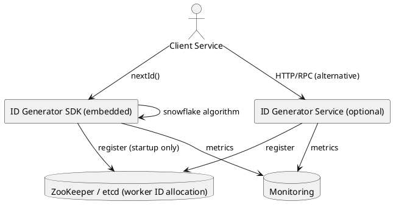
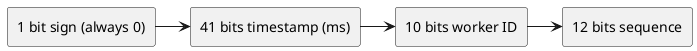
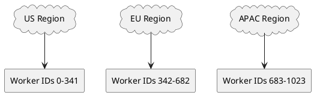

# Distributed Unique ID Generator

## Problem Statement

Design a service that generates **globally unique IDs** across a distributed system. IDs must be unique, roughly time-sortable, and generated at high throughput (millions per second) without coordination between generators.

**Example:**
```
Service A (US region)  -> generates ID 1234567890123456789
Service B (EU region)  -> generates ID 1234567890123456790
Service C (APAC region)-> generates ID 1234567890123456791

All IDs are:
  - Globally unique
  - Monotonically increasing (roughly time-sortable)
  - Generated without any cross-region coordination
```

---

## 1. Requirements Clarification

### Functional Requirements
- Generate unique 64-bit IDs
- IDs must be **globally unique** across all nodes
- IDs should be **roughly time-ordered** (sortable by creation time)
- Support **millions of IDs per second** per region
- IDs should be usable as **database primary keys** (numeric, indexable)
- Optional: human-readable short IDs (base62 encoding for URLs)

### Non-Functional Requirements
- **Latency**: ID generation < 1 ms at p99
- **Availability**: 99.999% (5 nines — every write depends on this)
- **Scalability**: 10M+ IDs/sec globally
- **No coordination**: Nodes should not need to talk to each other
- **Clock tolerance**: Should tolerate small clock skew (milliseconds)

### Out of Scope
- ID recycling (IDs are never reused)
- Meaningful IDs (like `ORDER-2026-0001` — this is about opaque IDs)
- Sequential without gaps (gaps are acceptable)

---

## 2. Back-of-Envelope Estimation

### Traffic

```
Given:
  Global write QPS         = 10,000,000 IDs/sec
  Number of regions        = 3
  Number of nodes/region   = 100

Per region:
  IDs/sec = 10,000,000 / 3 = ~3,300,000

Per node:
  IDs/sec = 3,300,000 / 100 = 33,000 IDs/sec per node

Well within single-node capacity (Snowflake handles 4M/sec per node).
```

### ID Space (64 bits)

```
Total possible IDs = 2^64 = ~18.4 quintillion

At 10M IDs/sec:
  18.4 x 10^18 / 10^7 = 1.84 x 10^12 seconds
                      = ~58,000 years

Plenty of room.
```

### Storage (if IDs are persisted)

```
IDs are typically not stored by the generator itself — they are
generated and handed off to the requesting service.

If we did log them for audit:
  Row size    = ~16 bytes (ID + timestamp)
  Log rate    = 10M/sec
  Storage/day = 10M x 86,400 x 16 = ~13.8 TB/day
  (Impractical to log all IDs — do not persist in ID service)

The ID service is stateless in terms of storage.
```

### Latency Budget

```
Target: < 1 ms p99

Breakdown (all in-process, no network):
  Clock read:         ~10 ns
  Bit manipulation:   ~5 ns
  Return:             ~5 ns
  Total:              < 1 us

The ID generator is essentially in-memory, so latency is negligible.
Network latency (client -> ID service) dominates at ~1 ms.
```

---

## 3. High-Level Design



### Component Responsibilities

| Component | Role |
|---|---|
| ID Generator SDK | Embedded library that generates IDs in-process |
| ID Generator Service | Optional HTTP/RPC service if SDK not feasible |
| ZooKeeper / etcd | Assigns worker IDs to nodes at startup |
| Monitoring | Tracks ID generation rate, clock skew, errors |

### Why Embedded SDK (Preferred)

- **Latency**: No network hop (in-process, nanoseconds)
- **Availability**: No dependency on external service
- **Throughput**: No bottleneck at a central service
- **Simplicity**: Each service includes the library

### Why a Central Service (Sometimes)

- **Polyglot**: Services in Go, Python, Ruby all call one endpoint
- **Central config**: Worker IDs, epoch, clock skew managed centrally
- **Trade-off**: Adds ~1 ms latency, potential bottleneck

**Recommendation**: SDK embedded in each service. Fall back to service only if polyglot constraints are severe.

---

## 4. API Design

### SDK Interface

```java
public interface IdGenerator {
    long nextId();
    String nextIdBase62();
    long[] nextIds(int count);
}
```

**Usage:**
```java
IdGenerator gen = IdGeneratorFactory.get();
long orderId = gen.nextId();
String shortId = gen.nextIdBase62();
```

### HTTP API (if using central service)

```http
POST /v1/ids
Content-Type: application/json

{
  "count": 10
}
```

**Response 200:**
```json
{
  "ids": [
    1234567890123456789,
    1234567890123456790,
    1234567890123456791
  ]
}
```

### Base62 Encoding (for URLs)

```
Long ID: 1234567890123456789
Base62:  1aZ9xK3LmNpQrS

7-character base62 gives 62^7 = 3.5 trillion unique values.
```

---

## 5. Algorithm Comparison

### Option A: UUID v4 (Random)

```
Format: 128-bit random, formatted as 8-4-4-4-12 hex
Example: 550e8400-e29b-41d4-a716-446655440000

Pros:
  - No coordination needed
  - Globally unique (practically)
  - Simple

Cons:
  - 128 bits (2x size)
  - Not sortable (random)
  - Poor database index performance (random inserts)
  - Larger storage footprint
```

**Verdict**: Good for correlation IDs. Bad for database primary keys.

### Option B: Auto-Increment (Single DB)

```
Pros:
  - Simple
  - Sequential, no gaps
  - Compact (64-bit or less)

Cons:
  - Single point of failure
  - Bottleneck (one writer)
  - Hard to shard
  - Exposes business volume (enumerable)
```

**Verdict**: Fine for small apps. Fails at scale.

### Option C: Database Sequence with Step

```
Each node gets a range:
  Node 1: 1, 11, 21, 31, ...
  Node 2: 2, 12, 22, 32, ...
  Node 3: 3, 13, 23, 33, ...

Pros:
  - Simple
  - No coordination after setup

Cons:
  - Requires DB (adds latency)
  - Difficult to add/remove nodes
  - Not sortable by time
```

**Verdict**: Legacy. Superseded by Snowflake.

### Option D: Snowflake (Recommended)

```
64-bit structure:
  [1 bit unused] [41 bits timestamp] [10 bits worker ID] [12 bits sequence]

  - 1 bit: always 0 (keeps ID positive)
  - 41 bits: milliseconds since custom epoch (~69 years)
  - 10 bits: worker/machine ID (up to 1024 nodes)
  - 12 bits: sequence (up to 4096 IDs per ms per node)

Capacity per node: 4096 IDs/ms = 4,096,000 IDs/sec
Total capacity: 1024 nodes x 4M = ~4 billion IDs/sec
```

**Pros:**
- 64-bit (fits in a `long`)
- Sortable by time
- No coordination between nodes
- High throughput per node

**Cons:**
- Clock skew sensitive
- Worker ID management needed
- 69-year limit (easily extendable with new epoch)

### Option E: Sonyflake

```
64-bit structure:
  [1 bit unused] [39 bits timestamp] [8 bits sequence] [16 bits machine ID]

  - 39 bits: 10 ms ticks -> ~174 years
  - 8 bits: sequence (256 per tick)
  - 16 bits: 65,536 machines

Capacity per node: 256 IDs / 10 ms = 25,600 IDs/sec
Total capacity: 65,536 x 25,600 = ~1.7 billion IDs/sec
```

**Pros:**
- Smaller per-node rate but more nodes
- Longer lifetime

**Cons:**
- Slower per node
- Less common than Snowflake

### Option F: ULID (Universally Unique Lexicographically Sortable ID)

```
Format: 128-bit total
  - 48 bits: timestamp (ms)
  - 80 bits: randomness

Example: 01ARZ3NDEKTSV4RRFFQ69G5FAV (Crockford base32)

Pros:
  - Lexicographically sortable
  - No coordination
  - Collision-resistant

Cons:
  - 128-bit (larger than Snowflake)
  - Not as compact as Snowflake
```

**Verdict**: Good when you need UUID-like uniqueness with sortability.

### Algorithm Comparison

| Algorithm | Bits | Sortable | Distributed | Throughput/Node | Complexity |
|---|---|---|---|---|---|
| UUID v4 | 128 | No | Yes (no coord) | Unlimited | Low |
| Auto-Increment | 64 | Yes | No | Low | Low |
| DB Sequence Step | 64 | No | Semi | Medium | Low |
| Snowflake | 64 | Yes (ms) | Yes | 4M/sec | Medium |
| Sonyflake | 64 | Yes (10ms) | Yes | 25K/sec | Medium |
| ULID | 128 | Yes (ms) | Yes | Unlimited | Low |

**Recommendation**: **Snowflake** for most use cases. **ULID** if you need UUID compatibility. **UUID v4** only for correlation IDs.

---

## 6. Snowflake Deep Dive

### Bit Layout



```
Bit position:
  63          62                    22         12         0
  |            |                     |          |          |
  v            v                     v          v          v
  [0][timestamp 41 bits][worker 10][sequence 12]
```

### ID Composition

```java
long id = ((timestamp - epoch) << 22)
        | (workerId << 12)
        | sequence;
```

### Generation Algorithm

```java
public synchronized long nextId() {
    long now = System.currentTimeMillis();

    if (now < lastTimestamp) {
        // Clock moved backwards
        long drift = lastTimestamp - now;
        if (drift <= MAX_CLOCK_DRIFT_MS) {
            // Wait it out
            sleep(drift);
        } else {
            throw new ClockMovedBackwardsException(drift);
        }
    }

    if (now == lastTimestamp) {
        // Same millisecond, increment sequence
        sequence = (sequence + 1) & 0xFFF;  // 12 bits, wraps at 4096
        if (sequence == 0) {
            // Sequence overflowed, wait for next ms
            now = waitNextMillis(lastTimestamp);
        }
    } else {
        // New millisecond, reset sequence
        sequence = 0;
    }

    lastTimestamp = now;

    return ((now - epoch) << 22)
         | (workerId << 12)
         | sequence;
}
```

### Handling Clock Skew

**Problem**: NTP adjustments or VM migrations can move the clock backwards.

**Solutions:**

1. **Small drift (< 100 ms)**: Wait it out (sleep until clock catches up)
2. **Large drift (> 100 ms)**: Throw exception, alert ops
3. **Refuse to generate**: Return error until clock recovers
4. **Alternative**: Use a monotonic clock for sequence, wall clock for timestamp

**Why this matters:** If clock goes backward and we don't handle it, we could generate duplicate IDs.

### Worker ID Allocation

**Options:**

1. **Manual**: Configure each node's worker ID in a config file
   - Simple, but error-prone (duplicates cause collisions)
2. **ZooKeeper/etcd**: Nodes register, get assigned an ID
   - Central coordination, but only at startup
3. **From IP address**: Worker ID = last 10 bits of node's IP
   - No coordination, but IP reuse causes collision
4. **From MAC address**: Worker ID = hash(MAC) % 1024
   - Similar to IP approach
5. **Kubernetes StatefulSet**: Pod ordinal used as worker ID
   - Clean in K8s; each pod has a stable ordinal

**Recommendation**: ZooKeeper/etcd or K8s StatefulSet for reliable uniqueness.

---

## 7. Deep Dive: Distributed Deployment

### Multi-Region Layout



**Partition the worker ID space** across regions to guarantee global uniqueness:
- US: worker IDs 0-341
- EU: worker IDs 342-682
- APAC: worker IDs 683-1023

Each region uses its own range, so no coordination is needed between regions.

### Custom Epoch

```
Default (Twitter): November 4, 2010, 01:42:54 UTC
  -> 41 bits gives ~69 years -> expires ~2079

Custom (chosen by you):
  Choose a recent epoch (e.g., Jan 1, 2024)
  -> extends lifetime to ~2093

Why it matters:
  41 bits is fixed. If you use 1970 epoch, you waste 40+ years.
  Custom epoch means more usable lifetime.
```

### Multiple Timestamps Handling

```
Same worker, same ms, multiple calls:
  Sequence: 0, 1, 2, ..., 4095 -> 4096 IDs
  Next call in same ms: wait for next ms
  (Or: allow sequence to wrap and wait until next ms)

Max throughput per worker per ms: 4096 IDs
= 4.096 million IDs/sec per worker
= 4.19 billion IDs/sec if all 1024 workers maxed out

Far exceeds realistic needs.
```

### Time-Sortability Guarantee

```
Because timestamp is in the high bits:
  ID_A < ID_B  <=>  A was generated before B
  (as long as they're on different ms, or same ms with different sequence)

This makes Snowflake IDs ideal for:
  - Primary keys in databases (B-tree friendly)
  - Time-ordered feeds (posts, tweets)
  - Event streaming (Kafka, Kinesis)
  - Log correlation (sortable by creation)
```

---

## 8. Deep Dive: Handling Edge Cases

### Clock Moves Backward

```java
if (now < lastTimestamp) {
    long drift = lastTimestamp - now;

    if (drift <= 5) {
        // Small drift, wait it out
        sleep(drift);
        now = System.currentTimeMillis();
    } else if (drift <= 100) {
        // Medium drift, log warning, wait
        log.warn("Clock drift: {} ms", drift);
        sleep(drift);
        now = System.currentTimeMillis();
    } else {
        // Large drift, refuse to generate
        throw new ClockMovedBackwardsException(drift);
    }
}
```

**Monitoring:** Alert on any drift > 10 ms. Long-term drift means NTP is failing.

### Sequence Overflow in Same Millisecond

```java
if (now == lastTimestamp) {
    sequence++;
    if (sequence > 4095) {
        // Sequence exhausted in this ms
        now = waitNextMillis(lastTimestamp);
        sequence = 0;
    }
}
```

**Impact:** Throughput drops to 4096 IDs/ms (still ~4M/sec) if sequence overflows, but no correctness issue.

### Worker ID Collision

**Problem**: Two nodes accidentally use the same worker ID -> duplicate IDs.

**Detection:**
- Startup: verify worker ID not already in use (via ZooKeeper)
- Runtime: periodically check for duplicate IDs in monitoring (rare but possible)

**Prevention:**
- Use ZooKeeper/etcd with ephemeral nodes (auto-release on crash)
- Use K8s StatefulSet with ordinal-based IDs
- Use MAC address hash as fallback (weak but better than random)

### Multi-Data-Center Clock Skew

**Problem**: Nodes in different data centers have slightly different clocks.

**Solution**: Since worker IDs are partitioned per region, cross-region drift doesn't cause collisions.

**Within a region:** NTP keeps clocks within a few ms of each other. Snowflake tolerates this.

---

## 9. Deep Dive: Database Integration

### As Primary Key

```sql
CREATE TABLE orders (
    order_id BIGINT PRIMARY KEY,     -- Snowflake ID
    user_id BIGINT NOT NULL,
    total_cents INT,
    created_at TIMESTAMP DEFAULT CURRENT_TIMESTAMP
);

-- Index-friendly: B-tree stores IDs in time order
-- Range queries work: "orders between X and Y"
```

**Benefits of Snowflake as PK:**
- No separate index on `created_at` needed (ID encodes time)
- Fast range scans by time
- Compact (8 bytes vs 16 bytes for UUID)
- Sharding-friendly (no coordination)

### In Distributed Databases

**Cassandra**: Snowflake IDs work great as clustering keys
```
PRIMARY KEY ((user_id), order_id)
```
- `order_id` is time-sortable, so per-user reads are ordered by time.

**DynamoDB**: Partition key + sort key pattern
```
PK: user_id
SK: order_id (Snowflake)
```
- Enables efficient "recent items for user" queries.

**MySQL/PostgreSQL**: Snowflake is B-tree friendly (sequential inserts).

### Avoiding Hot Partitions

**Problem**: If all new IDs go to the same shard, that shard becomes a hotspot.

**Solution**: Use Snowflake IDs but **prepend** a hash or use composite keys:
```
Shard key = hash(user_id)   -- not the ID itself
```
IDs remain unique, but writes are spread across shards.

---

## 10. Scaling Considerations

### Horizontal Scaling

```
Per-node capacity: 4M IDs/sec
Global capacity: 1024 workers x 4M = 4 billion IDs/sec

Practical limit: bottleneck is not ID generation,
but network, storage, or application logic.

To scale beyond 1024 nodes:
  - Extend worker ID bits (e.g., 12 bits = 4096 nodes)
  - But this shrinks timestamp or sequence bits
  - Trade-off: fewer years or lower per-node throughput
```

### Multi-Region

```
Region-local generation:
  Each region has its own worker ID range
  No cross-region coordination needed
  Latency is local (~1 us)

Cross-region ID monotonicity:
  NOT guaranteed (region A's clock may differ from B's)
  For time-ordering across regions, use a central clock
  (rare requirement — usually eventual ordering is fine)
```

### High Availability

```
No central service -> no SPOF
Each node is independent
If a node crashes:
  Its worker ID is released (via ZooKeeper ephemeral node)
  Next node picks up the freed ID
  No impact on other nodes

If the clock drifts too much:
  Node refuses to generate (fail closed)
  Alert triggers, ops investigates
```

### Graceful Shutdown

```
1. Stop accepting new requests
2. Flush in-flight requests
3. Release worker ID (ZooKeeper)
4. Shutdown

If worker ID not released:
  Next node to start may fail to register
  (with manual ID assignment, this is a permanent leak)
```

---

## 11. Bottlenecks and Trade-offs

| Concern | Solution | Trade-off |
|---|---|---|
| Clock skew | Wait or fail | Availability vs correctness |
| Worker ID collision | ZooKeeper | Complexity |
| 1024 worker limit | Add more bits | Fewer years or lower throughput |
| Cross-region monotonicity | Central clock | Latency, SPOF |
| Sequence overflow | Wait for next ms | Throughput drop (temporary) |
| Time-sortability | Timestamp in high bits | Weaker randomness |
| ID secrecy (enumerability) | Random suffix or hash | Loses time-sortability |

### Design Decisions Summary

| Decision | Choice | Rationale |
|---|---|---|
| Algorithm | Snowflake | Best balance of size, speed, sortability |
| Bits | 64 | Fits `long`, standard for databases |
| Epoch | Custom (recent) | Extends usable lifetime |
| Worker ID source | ZooKeeper / K8s StatefulSet | Reliable uniqueness |
| Clock handling | Wait for small drift, fail for large | Correctness + availability |
| Deployment | Embedded SDK | Lowest latency |
| Multi-region | Worker ID partitioning | No cross-region coordination |
| Sequence | 12 bits (4096/ms) | 4M IDs/sec per node |

---

## 12. Failure Scenarios

### Node Crash

**Impact:** None on other nodes. The crashed node's worker ID is released via ephemeral node in ZooKeeper.

**Recovery:** New node registers, gets the freed worker ID, resumes generation.

### ZooKeeper Down (at startup)

**Impact:** New nodes can't register, can't generate IDs.

**Mitigation:**
- Existing nodes continue working (no runtime dependency)
- Use a highly available ZooKeeper cluster (3+ nodes)
- Fallback: use MAC-address-based worker ID (risky but works)

### Clock Skew > 100 ms

**Impact:** Node throws exceptions, stops generating IDs.

**Mitigation:**
- Alert ops immediately
- Restart NTP sync
- If skew persists, replace the node

### Worker ID Collision (rare)

**Impact:** Duplicate IDs generated across two nodes.

**Mitigation:**
- Startup verification via ZooKeeper (prevents most cases)
- Monitoring for duplicate IDs (catches remaining cases)
- Manual intervention to reassign IDs

### Network Partition (multi-region)

**Impact:** Regions continue generating IDs independently. No impact because worker IDs are region-partitioned.

**Recovery:** Nothing to do — system is designed for this.

### K8s Pod Restart

**Impact:** StatefulSet preserves pod ordinal, so worker ID is preserved. No collision.

**Note:** In-flight IDs are lost, but IDs are not buffered — each request generates on-demand.

---

## 13. Monitoring and Alerts

### Key Metrics

| Metric | Target | Alert Threshold |
|---|---|---|
| ID generation p99 latency | < 1 us | > 100 us |
| Clock drift | < 5 ms | > 50 ms |
| Sequence overflow rate | < 0.01% | > 1% |
| Worker ID registration failures | 0 | > 0 |
| Duplicate IDs detected | 0 | > 0 |
| IDs generated/sec per node | < 4M | > 3.5M |
| ZooKeeper latency (startup) | < 100 ms | > 500 ms |

### Dashboards

- **Throughput**: IDs/sec per region, per node
- **Clock health**: Drift over time, NTP status
- **Worker IDs**: Active workers, allocated ranges
- **Errors**: Registration failures, clock-drift exceptions

### Alerts

- **P0**: Duplicate IDs detected, clock drift > 100 ms
- **P1**: Clock drift > 50 ms for 5+ min
- **P2**: Worker registration failures
- **P3**: High sequence overflow rate (investigate load)

---

## 14. Cost Estimation

ID generation is **extremely cheap** — no persistent storage, minimal compute.

Rough monthly cost (AWS, us-east-1):

| Component | Spec | Cost/month |
|---|---|---|
| ID generation compute | 0 extra (embedded in services) | ~$0 |
| ZooKeeper (if used) | 3 x t3.medium (HA cluster) | ~$150 |
| Monitoring | Included in existing stack | ~$0 |
| **Total** | | **~$150/month** |

The ID service itself is nearly free. Cost is dominated by ZooKeeper for coordination (if used).

**Optimization:**
- Skip ZooKeeper entirely by using K8s StatefulSet ordinals
- Use embedded SDK (no service) to eliminate all ID-service infra

---

## 15. Extensions and Follow-ups

### Base62 Encoding for Short IDs

```java
String shortId = Base62.encode(snowflakeId);
// 19-digit number -> 11-character string

Used by: URL shorteners, invite codes, order references
```

### Bounded Lifetime IDs

```
If IDs should expire (e.g., session tokens):
  Include expiration timestamp in unused bits
  Or use signed tokens (JWT) with expiration claim
```

### Meaningful Prefixes

```
Order IDs:      1_234567890123456789
User IDs:       2_234567890123456789
Session IDs:    3_234567890123456789

Top 2 bits encode entity type. Reduces ID space but adds clarity.
```

### Monotonic Across Regions

```
Problem: Region A's clock differs from Region B's
Solution: Use a central "time oracle" service
  - All regions query it for a timestamp
  - Adds latency (10-100 ms per ID)
  - Only for rare use cases (financial ledgers needing strict ordering)
```

### Snowflake Alternatives

- **Sonyflake**: Smaller sequence, more machines
- **Instagram's Sharded IDs**: Snowflake variant with 13-bit shard
- **ULID**: 128-bit, sortable, UUID-compatible
- **KSUID**: 160-bit, sortable, for Kafka-style IDs
- **Firebase Push IDs**: Timestamp + randomness, 120-bit base64

### Hosting as a Service

```
For external clients:
  Expose Snowflake via API (with rate limits)
  Provide SDKs in Java, Go, Python, Node
  Charge per million IDs (rare, but a real product)
```

### Hardware Clock (PTP)

```
For ultra-high precision:
  Use PTP (Precision Time Protocol) instead of NTP
  Sub-microsecond accuracy across datacenter
  Overkill for most use cases
```

---

## 16. Summary

| Aspect | Decision |
|---|---|
| Algorithm | Snowflake (64-bit) |
| Bit layout | 1 sign + 41 timestamp + 10 worker + 12 sequence |
| Epoch | Custom (recent, e.g., Jan 1, 2024) |
| Worker ID | ZooKeeper / K8s StatefulSet |
| Deployment | Embedded SDK (no central service) |
| Clock handling | Wait for small drift, fail for large |
| Multi-region | Worker ID partitioned by region |
| Throughput | 4M IDs/sec per node, 4B/sec global |
| Latency | < 1 us per ID |
| Cost | Nearly free (~$150/month for ZooKeeper) |
| Sortability | Roughly time-ordered (millisecond precision) |

**Key takeaways:**

- **Snowflake** is the industry standard for distributed unique IDs
- **64 bits** fits in a `long` — database-friendly
- **Time-sortable** IDs make B-tree indexes efficient
- **No coordination** at runtime — each node generates independently
- **Worker ID partitioning** across regions eliminates cross-region sync
- **Clock skew handling** is critical — wait for small, fail for large
- **Embedded SDK** beats central service for latency and availability
- IDs are **enumerable** — if that's a concern, add a random suffix

**Similar Pattern Problems:**

- URL Shortener (uses Snowflake for short codes)
- Twitter / Social Feed (uses Snowflake for post IDs)
- Payment System (uses Snowflake for transaction IDs)
- Log Ingestion (uses Snowflake for log entry IDs)
- Collaborative Editor (uses monotonic IDs for operations)