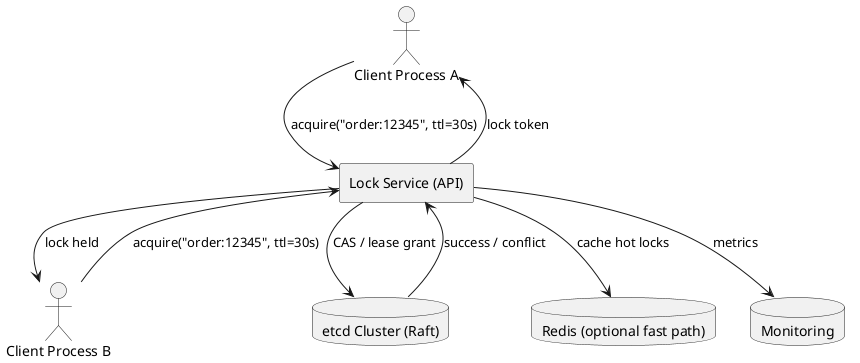
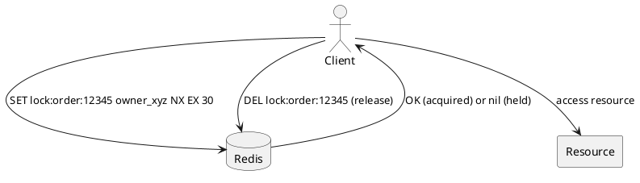
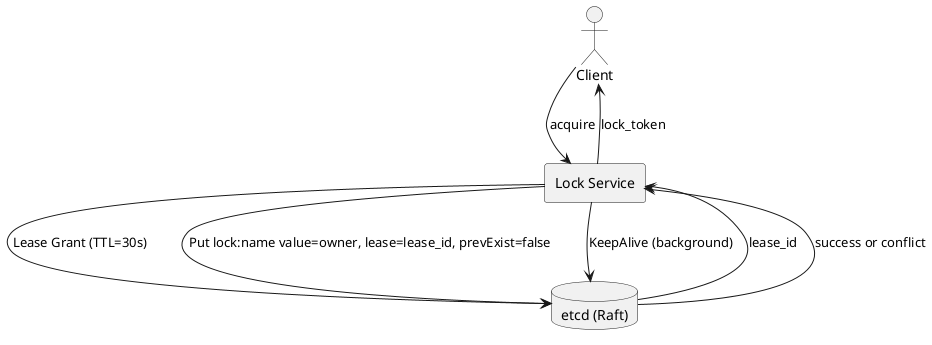
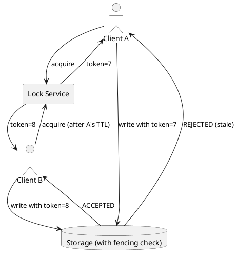
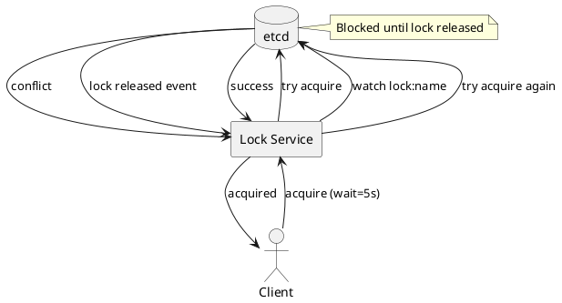
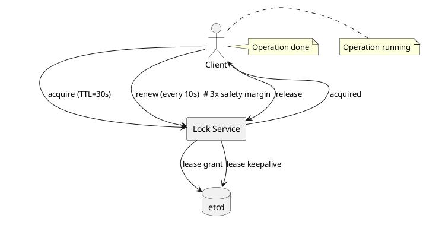
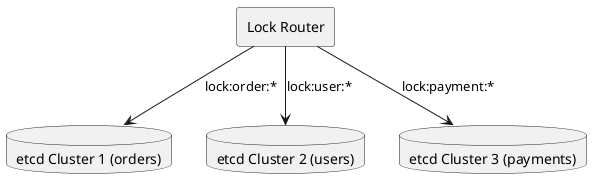
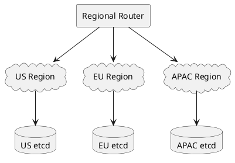

# Distributed Lock

## Problem Statement

Design a distributed lock service that allows multiple processes across different machines to coordinate access to a shared resource. Only one process can hold the lock at any time, and locks must be released even if the holder crashes.

**Example:**
```
Process A (server 1) acquires lock "order:12345"  -> success
Process B (server 2) tries to acquire "order:12345" -> blocked (lock held)
Process A crashes                                     -> lock auto-released after TTL
Process B retries                                     -> success
```

**Real-world uses:**
- Prevent double-processing of a payment
- Elect a leader in a cluster (only one primary)
- Serialize writes to a shared file
- Rate limit a specific resource (e.g., 1 job at a time per user)

---

## 1. Requirements Clarification

### Functional Requirements
- **Acquire**: Atomically acquire a named lock, with timeout
- **Release**: Release the lock (only by the owner)
- **TTL**: Lock auto-expires if holder crashes
- **Try-lock**: Non-blocking acquire (fail fast)
- **Blocking acquire**: Wait with timeout for lock availability
- **Reentrancy** (optional): Same process can re-acquire
- **Fairness** (optional): FIFO ordering of waiters

### Non-Functional Requirements
- **Latency**: Acquire/release < 10 ms at p99
- **Availability**: 99.99% — must not block the whole system
- **Safety**: Never two holders simultaneously (mutual exclusion)
- **Liveness**: Lock eventually available (no deadlock)
- **Fault tolerance**: Survives node failures
- **Scale**: 100K+ lock operations/sec

### Out of Scope
- Distributed transactions (2PC, Saga)
- Consensus for state machine replication (Raft, Paxos) — though the lock service uses it internally
- Nested/composite locks

---

## 2. Back-of-Envelope Estimation

### Traffic

```
Given:
  Lock operations/sec     = 100,000
  Read:Write ratio        = 1:1 (acquire + release = 2 ops)
  Peak multiplier         = 3x

Peak lock ops/sec:
  100,000 x 3 = 300,000
```

### Storage

```
Lock state storage (etcd/Redis/ZooKeeper):
  Active locks              = ~10,000 (concurrent)
  Key size                  = ~64 bytes (lock name)
  Value size                = ~128 bytes (owner, TTL, metadata)
  Total per lock            = ~200 bytes

Storage:
  10,000 x 200 bytes = ~2 MB (trivial)

Even 1M concurrent locks = ~200 MB. Well within any store.
```

### Bandwidth

```
Per acquire operation:
  Request:  ~200 bytes
  Response: ~100 bytes
  Total:    ~300 bytes

Peak bandwidth:
  300,000 x 300 bytes = ~90 MB/sec
  Small — negligible compared to application traffic.
```

### Latency Budget

```
Target: < 10 ms p99 for acquire/release

Breakdown:
  Client -> Lock Service:    ~1 ms
  Consensus (Raft round):    ~2-4 ms
  Persist to disk (fsync):   ~1-2 ms
  Response to client:        ~1 ms
  Total:                     ~5-8 ms

Headroom for retries and clock skew.
```

---

## 3. High-Level Design



### Component Responsibilities

| Component | Role |
|---|---|
| Lock Service API | Exposes acquire/release/try-lock endpoints |
| etcd Cluster | Backing store with Raft consensus + lease API |
| Redis (optional) | Faster hot-path for low-value locks |
| Monitoring | Tracks lock acquisition, contention, failures |

### Why etcd / ZooKeeper Instead of Redis?

| Store | Consensus | Lease TTL | Watch API | Best For |
|---|---|---|---|---|
| etcd | Raft (CP) | Yes (leases) | Yes | Correctness-critical locks |
| ZooKeeper | ZAB (CP) | Yes (ephemeral) | Yes | Legacy systems |
| Redis | None (AP) | Yes (TTL) | Pub/sub | High-throughput, best-effort |
| Consul | Raft (CP) | Yes (sessions) | Yes | Service mesh integration |

**Recommendation**: **etcd** for correctness-critical locks. **Redis** for high-throughput, best-effort locks.

---

## 4. API Design

### Acquire

```http
POST /v1/locks/{name}/acquire
Content-Type: application/json

{
  "owner_id": "server-1:proc-42",
  "ttl_seconds": 30,
  "wait_seconds": 5
}
```

**Response 200 (acquired):**
```json
{
  "lock_token": "eyJhbGc...",
  "fencing_token": 7,
  "expires_at": "2026-09-17T10:00:30Z"
}
```

**Response 409 (held by another):**
```json
{
  "error": "lock_held",
  "holder": "server-2:proc-17",
  "expires_at": "2026-09-17T10:00:25Z"
}
```

**Response 408 (timeout waiting):**
```json
{
  "error": "wait_timeout",
  "waited_seconds": 5
}
```

### Release

```http
POST /v1/locks/{name}/release
Content-Type: application/json

{
  "lock_token": "eyJhbGc...",
  "fencing_token": 7
}
```

**Response 200:**
```json
{
  "released": true
}
```

**Response 403 (not the owner):**
```json
{
  "error": "not_owner",
  "message": "Lock token does not match current holder"
}
```

### Try-Lock (Non-Blocking)

```http
POST /v1/locks/{name}/try-lock
Content-Type: application/json

{
  "owner_id": "server-1:proc-42",
  "ttl_seconds": 30
}
```

**Response 200** (acquired) or **409** (held) — never waits.

### Renewal (Extend TTL)

```http
POST /v1/locks/{name}/renew
Content-Type: application/json

{
  "lock_token": "eyJhbGc...",
  "additional_seconds": 30
}
```

**Use case**: Long-running operation needs more time.

---

## 5. Algorithm Deep Dive

### 5.1 Redis SET NX EX (Simple)



**Implementation:**
```
SET lock:order:12345 "owner_id" NX EX 30
```

**Release (must be atomic Lua script — never `DEL` directly):**
```lua
if redis.call("GET", KEYS[1]) == ARGV[1] then
    return redis.call("DEL", KEYS[1])
else
    return 0
end
```

**Pros:**
- Simple, fast (< 1 ms)
- Atomic

**Cons:**
- **No fencing token** — the biggest issue
- Redis failover can lose the lock (not CP)
- Race conditions on TTL expiry
- No fairness

**Verdict**: Use only for **best-effort** locks where occasional double-execution is acceptable.

### 5.2 Redlock (Multi-Redis)

**Algorithm (simplified):**
1. Client generates a random token
2. Client tries to acquire lock on **N/2 + 1** Redis nodes within a short timeout
3. If majority acquired within timeout: lock is held
4. If not: release on all nodes, retry later

**Pros:**
- Fault tolerant (majority quorum)
- Fast (parallel acquisition)

**Cons:**
- **Disputed correctness** (see Martin Kleppmann vs antirez debate)
- Sensitive to clock skew and GC pauses
- Complex to implement correctly

**Verdict**: Do NOT use Redlock for correctness-critical locks. Use etcd/ZooKeeper.

### 5.3 etcd Lease + Compare-and-Swap (Recommended)



**Implementation:**
```
1. Grant a lease with TTL=30s        -> lease_id
2. Put lock:name = owner_id, lease=lease_id, prevExist=false
3. If success: lock acquired
4. Start background keepalive to renew lease
5. To release: Revoke lease (or Delete key)
```

**Pros:**
- **Strong consistency** (Raft)
- **Lease-based TTL** (auto-release on crash)
- **Watch API** for waiters (efficient blocking)
- **Fencing token** (revision number from etcd)
- Survives node failures (majority quorum)

**Cons:**
- Higher latency than Redis (~5 ms vs ~1 ms)
- More complex to deploy (etcd cluster)

**Verdict**: **Best for correctness-critical locks.**

### 5.4 ZooKeeper Sequential Ephemeral Nodes (Fair Lock)

**Algorithm:**
1. Create ephemeral sequential node: `/locks/order-12345/lock-0000000001`
2. Get children of `/locks/order-12345/`
3. If your node has the lowest sequence number: **acquired**
4. Else: watch the node with the next-lower sequence
5. When watched node is deleted: you're next
6. On release: delete your node (or let it auto-delete on session close)

**Pros:**
- **Fair** (FIFO ordering by sequence number)
- Auto-release on session timeout
- Watch API avoids polling

**Cons:**
- More complex than etcd lease
- ZooKeeper is a heavier dependency

**Verdict**: Use when **fairness** matters (e.g., job queues).

### Algorithm Comparison

| Algorithm | Consistency | Fencing | Fairness | Latency | Complexity |
|---|---|---|---|---|---|
| Redis SET NX | AP (unsafe) | No | No | ~1 ms | Low |
| Redlock | Disputed | No | No | ~5 ms | Medium |
| etcd Lease + CAS | CP (safe) | Yes | No | ~5 ms | Medium |
| ZK Sequential | CP (safe) | Yes | Yes | ~5 ms | High |

**Recommendation**: **etcd Lease + CAS** for most cases. **ZooKeeper** when fairness matters.

---

## 6. Deep Dive: The Fencing Token Pattern

### The Problem

Even with TTL-based locks, a client might pause (GC, network delay) for longer than TTL. When it resumes, it thinks it still holds the lock, but someone else may have acquired it.

**Scenario:**
```
T=0:   Client A acquires lock (TTL=10s)
T=5:   Client A pauses (long GC)
T=10:  Lock expires
T=11:  Client B acquires lock
T=12:  Client A wakes up, writes to shared resource
T=13:  Client B writes to shared resource
       -> DATA CORRUPTION (both wrote)
```

### The Fix: Fencing Tokens

Every lock acquisition returns a **monotonically increasing token** (etcd revision, ZK zxid). The client includes this token in every write to the shared resource. The resource **rejects writes with stale tokens**.



**Implementation on storage side:**
```sql
UPDATE orders
SET status = 'shipped', last_fencing_token = ?
WHERE id = ? AND last_fencing_token < ?
```

If the UPDATE affects 0 rows, the token was stale — abort.

### Why This Matters

Without fencing tokens, **no TTL-based lock is safe** under process pauses. With fencing tokens, the storage layer is the final arbiter of correctness.

**Rule**: Any lock-based system that writes to external storage MUST use fencing tokens.

---

## 7. Deep Dive: Blocking Acquire (Waiting for Lock)

### Naive Approach: Polling

```
while not acquired:
    try to acquire
    if acquired: break
    sleep(100 ms)
```

**Pros:** Simple.
**Cons:** Latency up to 100 ms; wasted requests.

### Better Approach: Watch API (etcd/ZK)



**Pros:**
- Low latency (event-driven)
- No wasted requests
- Fair (with ZK sequential nodes)

**Cons:**
- Requires watch-capable store (etcd, ZK, Consul)
- Redis has no native watch for keys

### Hybrid: Fair Queue via Sequential Nodes

ZooKeeper's sequential ephemeral nodes implement fair FIFO:

```
1. Client creates /locks/order-12345/lock-0000000017
2. Client reads all children of /locks/order-12345/
3. If it has the lowest number: acquired
4. Else: watch the node just below it
5. When that node is deleted: repeat
```

**Why fair:** First-come, first-served by sequence number. No starvation.

---

## 8. Deep Dive: Handling Failures

### Client Crashes While Holding Lock

**Mitigation:** TTL-based auto-release.

```
1. Client acquires lock with TTL=30s
2. Client crashes (no release call)
3. After 30s, lease expires automatically
4. Next waiter acquires the lock
```

**Trade-off:** If client legitimately needs more than 30s, must **renew** the lease (keepalive).

### Lock Service Crashes

**etcd cluster:**
- 3-node cluster survives 1 node failure (quorum = 2)
- 5-node cluster survives 2 node failures
- Leader election in < 1 sec
- Locks preserved across leader change (Raft log)

**Redis:**
- Single Redis = SPOF
- Redis Sentinel = failover in ~10 sec (locks lost in-flight)
- Redis Cluster = sharded, but no consensus

### Network Partition

**etcd (CP):**
- Minority partition: cannot acquire new locks (correct)
- Majority partition: continues working
- When partition heals: state converges via Raft

**Redis (AP):**
- All partitions can acquire locks
- **Split-brain**: two clients hold the same lock (unsafe)

**Why CP matters:** Locks are a **safety** mechanism — availability is secondary.

### Split-Brain Scenario (Redis)

```
Two datacenters, network partition between them:
  DC1: Redis master   -> Client A acquires lock
  DC2: Redis replica  -> promoted to master (failover)
                     -> Client B acquires same lock
  -> BOTH clients hold the lock (correctness violation)
```

**Prevention:** Use etcd/ZooKeeper, or Redlock (with caveats).

---

## 9. Deep Dive: Lock Renewal (Keepalive)

### The Problem

A long-running operation may need more time than the initial TTL. If the operation takes 60s but TTL is 30s, the lock expires mid-operation.

### The Solution: Background Keepalive



**Best practice:**
- Renew at **1/3 of TTL** (10s renewal for 30s TTL)
- Use a background thread
- If renewal fails N times consecutively, **abandon the operation**

### Fencing on Renewal Failure

```
T=0:   Client acquires, TTL=30s
T=10:  Renewal 1 OK
T=20:  Renewal 2 OK
T=30:  Renewal 3 FAILS (etcd unreachable)
T=40:  Lock expires; another client acquires
T=41:  Old client finishes and tries to write
       -> Storage rejects (fencing token stale)
```

**Key point:** Fencing tokens make renewal failures **safe** — the operation may be wasted, but data won't corrupt.

---

## 10. Deep Dive: Reentrancy

### Why Reentrancy Matters

```
Thread A acquires lock "order:12345"
  -> calls function that also wants "order:12345" lock
  -> would deadlock if not reentrant
```

### Implementation Options

**Option 1: No reentrancy (simplest)**
- Document that callers must not re-enter
- Risk: subtle deadlocks

**Option 2: Owner-based reentrancy**
- Store `(owner_id, count)` in lock value
- Same `owner_id` acquiring again: increment count
- Release: decrement count; delete only when 0

```json
{
  "owner_id": "server-1:proc-42",
  "reentrant_count": 3,
  "fencing_token": 7
}
```

**Option 3: Thread-local tracking**
- Client-side: track locks held by current thread
- Reentrant acquire returns immediately without server call

**Recommendation**: Option 2 for cross-process reentrancy; Option 3 for in-process.

---

## 11. Scaling Considerations

### Read Scaling
- Lock state is small (~MBs); no read scaling issue
- etcd reads are fast (< 1 ms)
- Cache lock ownership in client memory (with TTL)

### Write Scaling
- Each acquire/release is a write to etcd
- etcd handles ~10K writes/sec per node
- For higher throughput: shard locks across multiple etcd clusters

### Sharding



**Shard by lock name prefix** (e.g., all `order:*` locks go to one cluster).

**Trade-off:**
- Even distribution (10K ops/sec x N clusters)
- No cross-shard transactions (locks are independent anyway)
- More infrastructure

### Multi-Region



**Options:**
- **Region-local locks**: Each region has its own etcd, no cross-region coordination
  - Good for locks on region-specific resources
  - Bad for global resources (e.g., global user ID sequences)
- **Global locks**: Single global etcd cluster (high latency for remote regions)
- **Federated locks**: Route based on resource location

**Recommendation**: Region-local for 99% of cases. Global only when truly necessary.

---

## 12. Bottlenecks and Trade-offs

| Concern | Solution | Trade-off |
|---|---|---|
| TTL too short | Increase TTL, use keepalive | Slower recovery on crash |
| TTL too long | Decrease TTL | More renewals, more risk |
| Client pauses (GC) | Fencing tokens | Storage must enforce tokens |
| Lock service SPOF | etcd 3-node cluster | Higher latency, more infra |
| High lock throughput | Shard by prefix | More etcd clusters |
| Network partition | Use CP store (etcd) | Some requests fail during partition |
| Fairness | ZK sequential nodes | Higher complexity |
| Reentrancy | Owner + counter | Slightly more state |

### Design Decisions Summary

| Decision | Choice | Rationale |
|---|---|---|
| Store | etcd | CP, lease API, watch, fencing |
| Algorithm | Lease + CAS | Correctness + fault tolerance |
| TTL | 30s default, configurable | Balance recovery vs renewals |
| Keepalive | Every TTL/3 | 3x safety margin |
| Fencing | etcd revision number | Monotonic, globally unique |
| Fairness | Optional (ZK) | Only when needed |
| Blocking | Watch API | Event-driven, efficient |
| Reentrancy | Owner + counter | Standard behavior |

---

## 13. Failure Scenarios

### Lock Service Down (etcd cluster loses quorum)

**Impact:** Cannot acquire new locks. Existing locks remain until TTL expires.

**Mitigation:**
- 3-node or 5-node etcd cluster (survives 1-2 failures)
- Alert immediately
- Clients should fail-fast on lock acquisition

### Client Crashes Holding Lock

**Impact:** Lock remains until TTL expires (up to 30s).

**Mitigation:**
- Use short TTL (10-30s)
- Background keepalive so healthy clients don't lose locks

### Client GC Pause > TTL

**Impact:** Lock expires, another client acquires, original client resumes.

**Mitigation:** Fencing tokens at the storage layer (rejects stale writes).

### Network Partition (Majority/Minority)

**Impact:** Minority side loses ability to acquire locks. Majority continues.

**Mitigation:** Designed behavior for CP systems. Clients in minority should fail-fast.

### Clock Skew Between etcd Nodes

**Impact:** etcd uses logical clocks (Raft terms), so physical clock skew doesn't affect correctness.

**Mitigation:** None needed. etcd handles this internally.

### Thundering Herd on Lock Release

**Impact:** 1000 waiters wake up simultaneously and hammer etcd.

**Mitigation:**
- ZooKeeper sequential nodes give FIFO (only next-in-line wakes)
- etcd watch: only the watch owner gets the event
- Add jitter to retry delays

---

## 14. Monitoring and Alerts

### Key Metrics

| Metric | Target | Alert Threshold |
|---|---|---|
| Acquire p99 latency | < 10 ms | > 50 ms |
| Release p99 latency | < 10 ms | > 50 ms |
| Lock contention rate | < 10% | > 30% |
| Lock acquisition failures | < 0.1% | > 1% |
| Average lock hold time | varies | outlier detection |
| etcd leader changes | 0/day | > 1/hour |
| Fencing token rejections | 0 | > 0 |
| Reentrant lock count | varies | > 10 (possible leak) |

### Dashboards

- **Traffic**: Acquire/release rates, contention
- **Latency**: p50/p95/p99 for acquire/release
- **Errors**: Timeouts, rejections, conflicts
- **Contention**: Locks with most waiters
- **etcd health**: Leader, lag, disk fsync time
- **Fencing**: Rejected writes, stale token usage

### Alerts

- **P0**: etcd cluster down, fencing token rejected
- **P1**: Acquire p99 > 50 ms for 5+ min
- **P2**: Lock contention > 30%
- **P3**: High reentrant count (potential leak)

---

## 15. Cost Estimation

Rough monthly cost (AWS, us-east-1):

| Component | Spec | Cost/month |
|---|---|---|
| etcd cluster | 3 x m6i.large (HA) | ~$450 |
| Lock Service API | 6 x c6g.large | ~$350 |
| Monitoring | Included | ~$0 |
| **Total** | | **~$800/month** |

**Cost optimization:**
- etcd on smaller instances (c5.large) if throughput is low
- Consolidate with other etcd users in the org
- Self-hosted monitoring (Prometheus + Grafana)

---

## 16. Extensions and Follow-ups

### Read-Write Locks

Allow multiple readers OR one writer:
```
Acquire-read("order:12345")  -> many allowed
Acquire-write("order:12345") -> exclusive
```

Implementation: Store a set of readers, with a flag for writer.

### Semaphores (N Concurrent Holders)

Instead of 1 holder, allow N:
```
Acquire("db-connection", max=10)
```

Implementation: Store a counter; decrement on acquire, increment on release.

### Lease-Based Locking for Rate Limiting

Rate limiters use leases with sliding windows:
```
A "lock" that auto-expires after N seconds naturally limits rate.
```

### Hierarchical Locks

For nested resources:
```
Lock "order:12345"
  then Lock "order:12345:items"
```

Deadlock risk if acquired in different orders. Always acquire in consistent order.

### Distributed Barrier

Wait for all N processes to reach a point, then proceed:
```
Barrier("checkout-phase-1", participants=N)
```

Similar to locks but "everyone waits for everyone."

### Election (Leader Lock)

Special case: one leader elected from N nodes. Use `Acquire("leader")` with a long TTL and keepalive.

**Libraries**: etcd's `concurrency.Election`, ZooKeeper's `LeaderLatch`.

### Optimistic Locking Alternative

For some use cases, version-based optimistic locking avoids distributed locks:
```sql
UPDATE items SET qty = ? WHERE id = ? AND version = ?
```
- If 0 rows updated: someone else changed it, retry
- No lock required
- Better throughput for low-contention cases

**Rule:** Prefer optimistic locking when contention is low; use distributed locks when contention is high or operations span multiple systems.

---

## 17. Summary

| Aspect | Decision |
|---|---|
| Store | etcd (CP, Raft consensus) |
| Algorithm | Lease + Compare-and-Swap |
| TTL | 30s default, configurable |
| Keepalive | Background renewal every TTL/3 |
| Fencing | etcd revision number (monotonic) |
| Blocking | Watch API (event-driven) |
| Fairness | Optional (ZooKeeper sequential) |
| Reentrancy | Owner + counter |
| Sharding | By lock name prefix |
| Multi-region | Region-local (for most cases) |
| Failure mode | Fail-fast (CP correctness) |
| Latency | < 10 ms p99 |

**Key takeaways:**

- **Redis SET NX is unsafe** for correctness-critical locks (AP, no consensus)
- **Fencing tokens are mandatory** — TTL alone can't prevent stale writes
- **etcd lease + CAS** is the modern standard for distributed locks
- **Watch API** beats polling for blocking acquire
- **Keepalive every TTL/3** prevents premature expiry on long operations
- **Shard by lock name prefix** for horizontal scaling
- **Prefer optimistic locking** when contention is low
- **CP over AP** — locks are a safety mechanism; availability is secondary

**Similar Pattern Problems:**

- Distributed Task Scheduler (uses leader locks for worker election)
- Distributed Cache (uses locks for cache invalidation)
- Payment System (uses locks for idempotency keys)
- Rate Limiter (uses leases for sliding windows)
- Service Discovery (uses leader election)