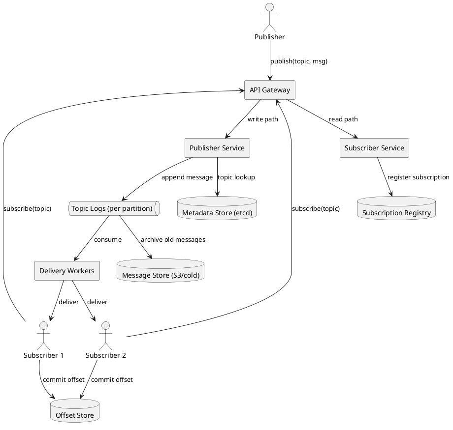
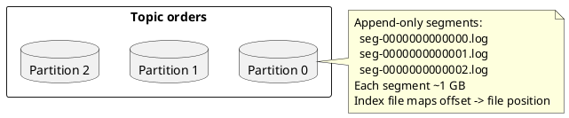
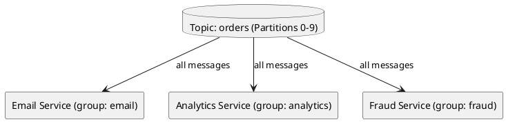
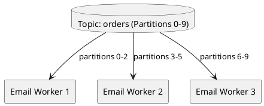
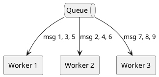
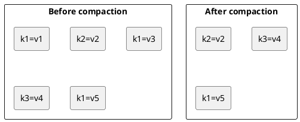
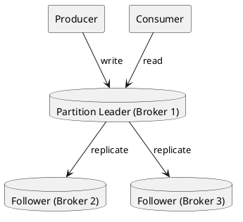
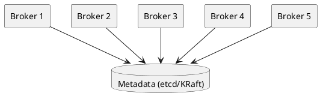
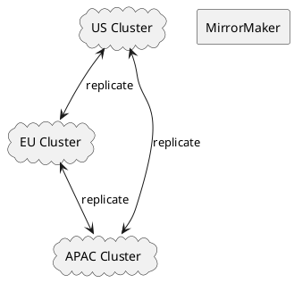

# Pub/Sub System

## Problem Statement

Design a publish-subscribe (pub/sub) messaging system where publishers send messages to **topics**, and subscribers receive messages from topics they've subscribed to. Publishers don't know who the subscribers are, and subscribers don't know who the publishers are — complete decoupling.

**Example:**
```
Publisher A -> topic "orders" -> [Subscriber 1, Subscriber 2, Subscriber 3]
Publisher B -> topic "orders" -> (same subscribers receive)
Publisher C -> topic "payments" -> [Subscriber 2, Subscriber 4]

Each subscriber receives EVERY message on topics they subscribe to.
```

**Real-world uses:**
- Event-driven microservices
- Real-time analytics (events -> multiple consumers)
- Notification fan-out (one event -> email + push + SMS)
- IoT telemetry (device -> multiple processors)
- Cache invalidation (invalidate across services)

**Similar systems:** Kafka, Google Pub/Sub, AWS SNS, Redis Pub/Sub, RabbitMQ (fanout exchange), NATS, Pulsar.

---

## 1. Requirements Clarification

### Functional Requirements
- **Publish**: Publishers send messages to a named topic
- **Subscribe**: Consumers register interest in a topic
- **Delivery**: All subscribers of a topic receive every message
- **Multiple topics**: Support thousands to millions of topics
- **Consumer groups** (optional): Load-balance messages across consumers in a group
- **Ordering**: Preserve order per topic per publisher
- **At-least-once delivery**: Messages are never lost
- **Durable**: Messages persist even if subscribers are offline

### Non-Functional Requirements
- **Scale**: 10M messages/sec across all topics
- **Latency**: Publish -> subscriber delivery under 100 ms at p99
- **Availability**: 99.99% — must not lose messages
- **Durability**: Replicated 3x, persist to disk
- **Throughput per topic**: Up to 1M messages/sec on hot topics
- **Consumer count**: Millions of subscribers across all topics
- **Retention**: Configurable (hours to weeks)

### Out of Scope
- Message transformation / ETL (that's a stream processor)
- Exactly-once delivery semantics (in this problem — see Kafka-like design for that)
- Request-reply RPC (that's a queue, not pub/sub)

---

## 2. Back-of-Envelope Estimation

### Traffic

```
Given:
  Total publish rate     = 10,000,000 msg/sec
  Average subscribers    = 5 per topic
  Average message size   = 1 KB
  Peak multiplier        = 3x

Deliveries:
  Deliveries/sec = 10M x 5 = 50M deliveries/sec (average)
  Peak = 150M deliveries/sec

This is the KEY number — fan-out multiplies load.
```

### Storage

```
Retention: 7 days (Kafka default)

Storage per day:
  Messages/day = 10M x 86,400 = 8.64 x 10^11
  Bytes/day    = 8.64 x 10^11 x 1 KB = 864 TB/day

Total (7 days):
  864 TB x 7 = ~6 PB

With replication factor 3:
  ~18 PB

With compression (~3x):
  ~6 PB
```

### Bandwidth

```
Publish bandwidth:
  10M msg/sec x 1 KB = ~10 GB/sec = ~80 Gbps

Delivery bandwidth (fan-out x5):
  50M msg/sec x 1 KB = ~50 GB/sec = ~400 Gbps

With replication (x3):
  ~1.2 Tbps internal network traffic
```

### Consumer State

```
Number of subscriptions:
  Average 5 subs per topic
  1M topics x 5 = 5M subscriptions

Each subscription needs:
  - Consumer offset (~8 bytes)
  - Consumer group metadata (~100 bytes)
  Total: ~600 MB (small)
```

### Partition Count

```
Hot topic handling:
  1M msg/sec per topic
  100 MB/sec per partition (Kafka practical limit)
  1M msg/sec x 1 KB = 1 GB/sec per topic
  -> ~10 partitions per hot topic

Default topic:
  100 msg/sec
  -> 1 partition

Total partitions (rough estimate):
  1M topics x average 1-2 partitions = 1-2M partitions
  Distributed across brokers
```

---

## 3. High-Level Design



### Component Responsibilities

| Component | Role |
|---|---|
| API Gateway | Entry point for publishers and subscribers |
| Publisher Service | Validates, routes, appends messages to topic log |
| Subscriber Service | Registers subscriptions, manages consumer groups |
| Topic Logs | Append-only partitioned log per topic |
| Metadata Store | Topic configs, partition assignments, schemas |
| Offset Store | Tracks consumer progress per subscription |
| Delivery Workers | Consume from topics, deliver to subscribers |
| Subscription Registry | Maps topics to subscribers |
| Cold Storage | Long-term archive for old messages |

### Why a Log (Kafka-style) Instead of a Queue

| Aspect | Queue (RabbitMQ) | Log (Kafka) |
|---|---|---|
| Consumption | Message removed on read | Message persists |
| Replay | Impossible | Seek to any offset |
| Ordering | Per queue | Per partition |
| Fan-out | Exchange routes copies | Consumers read same log |
| Retention | Until consumed | Time/size based |

**Why log wins for pub/sub:**
- Multiple subscribers can read the same log independently
- Replay for debugging/reprocessing
- Ordering guaranteed per partition
- Horizontal scaling via partitions

---

## 4. API Design

### Publish

```http
POST /v1/topics/{topic}/publish
Content-Type: application/json

{
  "messages": [
    {
      "key": "user-12345",
      "payload": {"event": "order_placed", "order_id": "..."},
      "headers": {"source": "checkout-service"},
      "timestamp": "2026-09-17T10:00:00Z"
    }
  ]
}
```

**Response 200:**
```json
{
  "offsets": [
    {"partition": 3, "offset": 98765432}
  ]
}
```

### Subscribe

```http
POST /v1/subscriptions
Content-Type: application/json

{
  "topic": "orders",
  "consumer_group": "email-service",
  "start_from": "latest",
  "delivery": "at_least_once"
}
```

**Response 201:**
```json
{
  "subscription_id": "sub-a1b2c3",
  "topic": "orders",
  "consumer_group": "email-service"
}
```

### Consume (Pull)

```http
GET /v1/subscriptions/{subscription_id}/messages?max=100&timeout=30s
```

**Response 200:**
```json
{
  "messages": [
    {
      "partition": 3,
      "offset": 98765432,
      "key": "user-12345",
      "payload": {"event": "order_placed"},
      "timestamp": "2026-09-17T10:00:00Z"
    }
  ],
  "next_offset": 98765433
}
```

### Commit Offset (for at-least-once)

```http
POST /v1/subscriptions/{subscription_id}/commit
Content-Type: application/json

{
  "partition": 3,
  "offset": 98765433
}
```

### Push-Based Delivery (alternative)

For low-latency use cases, subscribers can register a webhook:

```http
POST /v1/subscriptions
{
  "topic": "orders",
  "webhook_url": "https://email-service.example.com/webhook",
  "delivery": "at_least_once"
}
```

The system **pushes** messages to the webhook. Retries on failure.

### Streaming (gRPC)

For high-throughput consumers, gRPC streaming:

```protobuf
service PubSub {
  rpc Subscribe(SubscriptionRequest) returns (stream Message);
  rpc Publish(PublishRequest) returns (PublishResponse);
}
```

---

## 5. Storage Design

### Topic Log Structure



**Partition**:
- Ordered, append-only log
- Each partition is a directory of segment files
- Segments are ~1 GB each
- Index file maps offset -> byte position

### Message Format

```
| offset (8B) | timestamp (8B) | key_len (4B) | key | value_len (4B) | value | headers_len (4B) | headers |
```

Compact binary format for throughput.

### Partition Assignment

```
partition = hash(key) % num_partitions    if key is set
partition = round_robin                    if key is null
```

**Why hash by key?** Messages with the same key go to the same partition, preserving order.

Example: All `user-12345` events go to partition `hash("user-12345") % N`.

### Metadata Store (etcd)

```json
{
  "topic": "orders",
  "partitions": 10,
  "replication_factor": 3,
  "retention_hours": 168,
  "created_at": "2026-09-17T10:00:00Z",
  "schema": {
    "type": "avro",
    "version": 3
  }
}
```

### Offset Store

```
Key: {consumer_group}:{topic}:{partition}
Value: {
  "offset": 98765433,
  "committed_at": "2026-09-17T10:00:05Z"
}
```

**Storage options:**
- Kafka: internal `__consumer_offsets` topic
- etcd: for small numbers of consumer groups
- Redis: for high-throughput offset commits

### Cold Storage

```
Messages older than retention period -> S3 / GCS in Parquet format
Queryable via Athena / BigQuery for analytics
```

---

## 6. Algorithm Deep Dive: Delivery Guarantees

### At-Most-Once

```
1. Consumer fetches message
2. Consumer commits offset BEFORE processing
3. Consumer processes message

Risk: If consumer crashes after commit but before processing,
      message is lost.
```

**Use case:** Metrics, logs where occasional loss is fine.

### At-Least-Once (Default)

```
1. Consumer fetches message
2. Consumer processes message
3. Consumer commits offset AFTER processing

Risk: If consumer crashes after processing but before commit,
      message is processed twice (duplicate).
```

**Use case:** Most applications. Requires **idempotent** consumers.

### Exactly-Once

```
Requires:
  1. Idempotent consumer (dedup by message_id)
  OR
  2. Transactional consumer (commit offset + output atomically)
  OR
  3. Kafka transactions with idempotent producer
```

**Use case:** Financial systems, payment processing. Expensive to implement.

**Reality:** At-least-once + idempotent consumers = effectively exactly-once.

### Idempotency Pattern

```java
public void process(Message msg) {
    if (processedSet.contains(msg.id)) {
        return;  // Already processed, skip
    }
    doWork(msg);
    processedSet.add(msg.id);
    commitOffset(msg.offset);
}
```

The `processedSet` must be durable (DB table with unique constraint on message_id).

---

## 7. Deep Dive: Delivery Patterns

### 7.1 Fan-Out to Multiple Consumer Groups



Each consumer **group** maintains its own offset. All groups receive all messages.

### 7.2 Load Balancing Within a Group



Within a group, partitions are split across workers. Adding a worker rebalances partitions.

### 7.3 Push vs Pull

| Aspect | Push | Pull |
|---|---|---|
| Subscriber controls rate | No | Yes |
| Subscriber backpressure | Hard | Natural |
| Latency | Lower | Slightly higher |
| Efficiency | Good for low-latency | Good for batch |
| Complexity | Higher (retry logic on server) | Lower (client polls) |

**Kafka uses pull** (consumers control their rate).
**SNS uses push** (server pushes to endpoints).
**Google Pub/Sub uses push or pull** (subscriber chooses).

### 7.4 Competing Consumers



Multiple workers in the same **queue** compete for messages — each message goes to one worker.

Contrast with pub/sub: pub/sub delivers to all; competing consumers deliver to one.

### 7.5 Hybrid: Consumer Groups + Competing Consumers

Kafka combines both:
- **Consumer groups** = pub/sub (each group gets all messages)
- **Multiple consumers in a group** = competing consumers (partitions split)

This is why Kafka is so versatile for both use cases.

---

## 8. Deep Dive: Ordering Guarantees

### Per-Partition Ordering

Kafka guarantees order **within a partition**, not across partitions.

```
Partition 0: msg1, msg2, msg3  (ordered)
Partition 1: msg4, msg5        (ordered, but no relation to P0)
```

### Global Ordering (Expensive)

To guarantee global order:
- Use **one partition** per topic (no parallelism)
- Or use **sequence numbers** at the consumer side
- Or use a **single broker** (not scalable)

**Trade-off:** Global ordering kills throughput. Most systems only need per-key ordering.

### Per-Key Ordering

By hashing keys to partitions, all events for a given key land in the same partition:

```
key=user-12345 -> always partition 3
key=user-67890 -> always partition 7
```

Result: All events for `user-12345` are in order, even though `user-67890` events are on a different partition.

**This is the sweet spot for most applications.**

### Out-of-Order Handling

If order is violated (e.g., cross-partition), use:
- **Event time** vs **processing time** semantics
- **Watermarks** for late events
- **Event-time windowing** in stream processors (Flink, Kafka Streams)

---

## 9. Deep Dive: Retention and Compaction

### Time-Based Retention

```
Default: 7 days
Configurable: 1 hour to 30 days

After retention period:
  Segments are deleted
  Consumers who fall behind lose messages
```

### Size-Based Retention

```
Default: 1 TB per partition
After exceeding:
  Oldest segments are deleted
```

### Log Compaction

Special mode for "latest value per key":



**Use case:** Change Data Capture (CDC), config stores, user profiles.

Every key has exactly one (latest) value. Historical versions are removed.

**Trade-off:** Compaction takes CPU and disk I/O. Only enable on topics that need it.

---

## 10. Deep Dive: Replication

### Leader-Follower Replication



**How it works:**
- One broker is leader per partition
- Producers write to leader
- Followers replicate (async or sync)
- Consumers read from leader (default) or follower (rack-aware)

### In-Sync Replicas (ISR)

```json
{
  "partition": 3,
  "leader": "broker-1",
  "isr": ["broker-1", "broker-2"],  // broker-3 is lagging
  "replicas": ["broker-1", "broker-2", "broker-3"]
}
```

- ISR = replicas that are caught up
- Only ISR members can become leader
- `acks=all` waits for all ISR to ack

### Acknowledgment Levels (Producer)

| `acks` | Behavior | Durability | Latency |
|---|---|---|---|
| `0` | Fire and forget | Worst | Lowest |
| `1` | Wait for leader | Medium | Low |
| `all` | Wait for all ISR | Best | Highest |

**Recommendation:** `acks=all` for critical data; `acks=1` for logs.

### Leader Failover

```
1. Leader broker fails
2. Controller detects failure (heartbeat timeout)
3. Controller picks a new leader from ISR
4. Followers switch to new leader
5. Producers/consumers reconnect (via metadata refresh)
```

**Downtime:** ~seconds for detection + failover.

**Data loss:** Possible if `acks=1` and leader failed before replicating.

---

## 11. Scaling Considerations

### Horizontal Scaling (Brokers)



Add brokers -> partitions can be reassigned -> throughput scales linearly.

### Partition Rebalancing

```
Trigger: broker added, broker removed, or manual

Rebalancing:
  1. Compute new assignment
  2. Move partitions (data copy) between brokers
  3. Update metadata
  4. Notify consumers to rebalance

Cost: network + disk I/O during move
```

**Best practice:** Over-partition (e.g., 2x expected peak) so rebalancing is less frequent.

### Scaling Hot Topics

**Problem:** One topic gets 80% of traffic.

**Solutions:**
- More partitions on the hot topic
- Dedicated brokers for hot topics
- Producer-side sharding (spread across topics by key)
- Tiered storage (offload old data to S3)

### Scaling Consumers

**Problem:** Consumers can't keep up with producers.

**Solutions:**
- Add more consumers (up to partition count)
- Increase partition count (requires re-partitioning)
- Batch processing
- Async processing (consume fast, process in background pool)

**Rule:** Consumer parallelism is limited by partition count. To scale consumers, you must scale partitions.

### Multi-Region Replication



**Tools:** Kafka MirrorMaker 2, Confluent Replicator, cluster linking.

**Use cases:**
- Disaster recovery
- Regional proximity (reduce latency)
- Data residency compliance (GDPR)

**Trade-off:** Replication bandwidth + storage cost.

---

## 12. Bottlenecks and Trade-offs

| Concern | Solution | Trade-off |
|---|---|---|
| Hot partition | More partitions, sharding | Rebalance cost |
| Consumer lag | More consumers, batch | Partition limit |
| Delivery guarantees | At-least-once + idempotency | Consumer complexity |
| Storage cost | Tiered storage, compaction | Reprocessing complexity |
| Producer backpressure | Batching, async sends | Latency |
| Consumer rebalance | Static membership, cooperative | Slower membership |
| Ordering | Per-key hashing | No global ordering |
| Durability | acks=all, replication=3 | Latency + cost |
| Metadata scale | KRaft (no ZK) | Migration effort |

### Design Decisions Summary

| Decision | Choice | Rationale |
|---|---|---|
| Model | Log-based (Kafka-style) | Replay, ordering, fan-out |
| Partitioning | Hash by key | Per-key ordering |
| Delivery | At-least-once | Simple, standard |
| Replication | ISR, acks=all | Durability |
| Retention | 7 days + tiered | Balance cost/replay |
| Ordering | Per-partition | Scalability |
| Push/pull | Pull (default) | Consumer backpressure |
| Offsets | Consumer commits | At-least-once |
| Metadata | etcd or KRaft | Consensus for config |
| Cold storage | S3 in Parquet | Cheap, queryable |

---

## 13. Failure Scenarios

### Broker Failure

**Impact:** Partition leaders on that broker become unavailable.

**Recovery:**
- Controller detects failure (~10s heartbeat)
- New leader elected from ISR
- Producers/consumers reconnect
- Downtime: ~10-30s

**Data loss:** Only if `acks=1` and leader failed before replicating.

### Consumer Failure

**Impact:** Partitions assigned to it stop being consumed.

**Recovery:**
- Group coordinator detects missing heartbeat (~10s)
- Rebalance: partitions reassigned to surviving consumers
- Processing resumes from last committed offset
- Possible duplicate processing if commit happened after processing

### Network Partition

**Impact:** Brokers isolated from each other or from producers/consumers.

**Recovery:**
- Minority partition brokers become unavailable
- Majority partition continues
- When partition heals: brokers resync (may take minutes)

**Data loss:** Possible if leader was in minority and had unreplicated writes.

### Metadata Store Down

**Impact:** No new topics, no partition reassignment.

**Mitigation:**
- Existing topics continue working (metadata cached)
- etcd or KRaft with 3-5 nodes
- Alert immediately

### Slow Consumer

**Impact:** Consumer lag grows; retention may expire before consumption.

**Mitigation:**
- Monitor consumer lag (alerts)
- Add more consumers or partitions
- Increase retention temporarily
- Dead-letter queue for poison messages

### Thundering Herd on Rebalance

**Impact:** All consumers reconnect at once, controller overwhelmed.

**Mitigation:**
- Cooperative rebalancing (incremental)
- Static membership (skip rebalance on restart)
- Backoff with jitter on reconnect

---

## 14. Monitoring and Alerts

### Key Metrics

| Metric | Target | Alert Threshold |
|---|---|---|
| Publish p99 latency | < 20 ms | > 100 ms |
| Delivery p99 latency | < 100 ms | > 500 ms |
| Consumer lag | < 10 sec | > 5 min |
| Under-replicated partitions | 0 | > 0 for 5 min |
| Offline partitions | 0 | > 0 |
| Broker disk usage | < 70% | > 85% |
| ISR shrink rate | 0 | > 0/sec |
| Message drop rate | 0 | > 0 |

### Dashboards

- **Throughput**: Messages/sec in/out per topic
- **Latency**: p50/p95/p99 for publish and delivery
- **Lag**: Consumer lag per group
- **Brokers**: CPU, memory, disk, network per broker
- **Partitions**: Under-replicated, offline, leader distribution
- **Topics**: Message rate, size, retention usage

### Alerts

- **P0**: Offline partitions, ISR shrinking, message loss
- **P1**: Consumer lag > 5 min, under-replicated partitions
- **P2**: Broker disk > 85%, publish p99 > 100 ms
- **P3**: Rebalance storm, high reconnection rate

---

## 15. Cost Estimation

Rough monthly cost (AWS, us-east-1) for 10M msg/sec:

| Component | Spec | Cost/month |
|---|---|---|
| Kafka brokers (MSK) | 30 x kafka.m5.4xlarge | ~$90,000 |
| Storage (EBS) | 500 TB gp3 | ~$40,000 |
| Cold storage (S3) | 5 PB | ~$115,000 |
| Networking (inter-AZ) | 1 Tbps peak | ~$30,000 |
| Metadata (etcd) | 3 small nodes | ~$500 |
| Monitoring | Datadog / Prometheus | ~$5,000 |
| **Total** | | **~$280,000/month** |

**Cost optimization:**
- Tiered storage (offload to S3 faster)
- Compression (3x savings on storage)
- Reserved instances (30-40% savings)
- Right-size partitions (avoid over-partitioning)
- Self-managed Kafka for cost-sensitive workloads

---

## 16. Extensions and Follow-ups

### Schema Registry

Enforce message schemas (Avro, Protobuf, JSON Schema):
- Producers register schemas
- Schema IDs are embedded in messages
- Consumers validate against schema
- Evolution rules (backward/forward compatible)

### Dead Letter Queue (DLQ)

Messages that fail processing N times go to a DLQ:
```
Topic -> Consumer -> [success]
                  -> [failure x3] -> DLQ topic -> manual review
```

### Stream Processing (Kafka Streams, Flink)

Built-in stateful processing on top of pub/sub:
- Windowing (tumbling, sliding)
- Joins across topics
- Aggregations (count, sum, avg)
- State stores (RocksDB)

### Exactly-Once Semantics

Kafka supports this via:
- Idempotent producer (dedup on retry)
- Transactions (atomic across partitions)
- Consumer `read_committed` isolation

**Cost:** Higher latency, more complex broker state.

### Tiered Storage

Keep recent data on broker SSDs, offload old data to S3:
- Cheaper storage
- Longer retention
- Slightly higher latency for old data

### Multi-Tenancy

For SaaS platforms:
- Quotas per tenant (messages/sec, storage)
- Isolation (separate clusters for VIPs)
- Billing based on usage

### Protocol Support

Beyond HTTP/gRPC:
- **MQTT** for IoT devices
- **AMQP** for legacy integration
- **WebSocket** for browser clients
- **Kafka protocol** for native clients

### Consumer Groups Rebalancing Protocol

Modern approaches:
- **Cooperative sticky** (Kafka 2.4+): incremental rebalance
- **Static membership**: skip rebalance on restart
- **KIP-848** (Kafka 3.7+): server-side rebalance

These reduce rebalance time and disruption.

### Comparison to Other Systems

| System | Model | Strength | Weakness |
|---|---|---|---|
| Kafka | Log | Throughput, replay | Complex ops |
| RabbitMQ | Queue | Routing flexibility | Lower throughput |
| Pulsar | Log + Queue | Multi-tenancy, geo | Newer, less mature |
| NATS | Pub/sub | Low latency, simple | Limited persistence |
| Redis Pub/Sub | Fire-and-forget | Simple | No persistence, no replay |
| Google Pub/Sub | Managed | Fully managed | Vendor lock-in |
| AWS SNS | Fan-out | Integration | Limited retention |

---

## 17. Summary

| Aspect | Decision |
|---|---|
| Model | Log-based pub/sub (Kafka-style) |
| Partitioning | Hash by key |
| Delivery | At-least-once + idempotent consumers |
| Ordering | Per-partition (per-key) |
| Replication | ISR, replication factor 3, `acks=all` |
| Retention | 7 days hot, tiered to S3 |
| Consumption | Pull-based (consumer controls rate) |
| Offset management | Consumer commits |
| Scaling | Add partitions/brokers |
| Multi-region | MirrorMaker 2 |
| Scale | 10M msg/sec, 50M deliveries/sec |
| Latency | Publish < 20 ms, delivery < 100 ms |

**Key takeaways:**

- **Log-based design** (not queue-based) enables replay, ordering, and multi-subscriber fan-out
- **Partition by key** preserves per-key ordering while allowing parallelism
- **At-least-once delivery** + **idempotent consumers** is the pragmatic standard
- **ISR + acks=all** is required for durability
- **Pull-based consumption** gives consumers natural backpressure
- **Fan-out is the scaling challenge** — 10M messages becomes 50M deliveries
- **Tiered storage** keeps retention affordable
- **Multi-region replication** enables disaster recovery and compliance
- **Kafka semantics** are the industry standard for good reason

**Similar Pattern Problems:**

- Log Ingestion System (uses Kafka for collection)
- Real-Time Notification System (uses pub/sub for fan-out)
- Distributed Message Queue (queue vs log — complementary)
- Collaborative Document Editor (uses pub/sub for change propagation)
- Metrics / Monitoring (uses pub/sub for metrics collection)
- Social Feed / Timeline (uses pub/sub for fan-out)