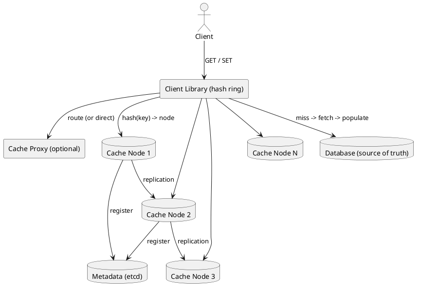
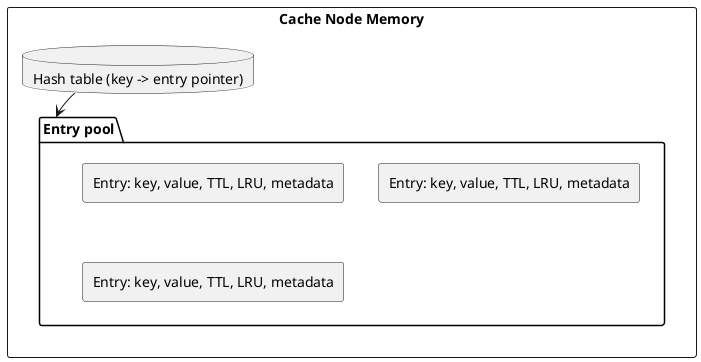
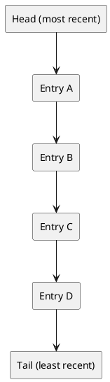
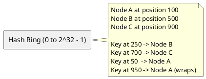
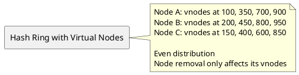
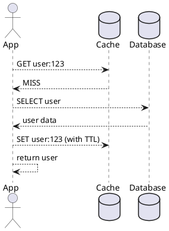
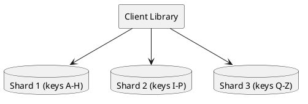
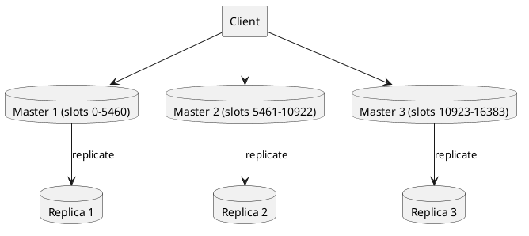
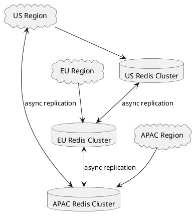

# Distributed Cache

## Problem Statement

Design a distributed in-memory cache that sits in front of slow storage (databases, APIs) to reduce latency and load. The cache must scale horizontally, handle node failures gracefully, and provide predictable performance under high read throughput.

**Example:**
```
Client -> Cache lookup "user:12345" -> HIT (0.5 ms)
                                    -> MISS (fall through to DB, populate cache)
```

**Real-world systems:** Redis, Memcached, Hazelcast, Aerospike, Couchbase, Dragonfly.

**Why it matters:**
- Database can handle ~10K QPS per node; cache handles 100K+ QPS
- Latency drops from 10-50 ms (DB) to 0.5-2 ms (cache)
- 80/20 rule: 20% of data serves 80% of requests

---

## 1. Requirements Clarification

### Functional Requirements
- **GET / SET / DELETE** operations on key-value pairs
- **TTL**: Auto-expire keys after a duration
- **Atomic operations**: INCR, DECR, CAS
- **Data structures**: Strings, hashes, lists, sets, sorted sets
- **Eviction**: Remove old entries when memory is full
- **Replication**: Survive node failures
- **Consistent hashing**: Minimal reshuffling when nodes change
- **Persistence** (optional): Survive restarts (RDB, AOF)

### Non-Functional Requirements
- **Scale**: 1M+ QPS per cluster, 100+ nodes
- **Latency**: < 1 ms p99 for GET, < 2 ms for SET
- **Availability**: 99.99% — cache failure shouldn't kill the app
- **Consistency**: Eventual — cache may serve stale data briefly
- **Memory efficiency**: Store ~100 GB per node
- **Cost**: Cheaper than scaling the database

### Out of Scope
- Full database replacement
- Complex queries (joins, aggregations)
- Strong consistency across all replicas

---

## 2. Back-of-Envelope Estimation

### Traffic

```
Given:
  Read QPS              = 1,000,000
  Write QPS             = 100,000
  Read:Write ratio      = 10:1
  Average key size      = 50 bytes
  Average value size    = 500 bytes
  Peak multiplier       = 3x

Peak operations:
  Reads  = 3,000,000/sec
  Writes = 300,000/sec
```

### Storage

```
Total cache size:
  Working set size      = 10 TB (hot data)
  Overhead (~20%)       = 12 TB
  Replication factor 2  = 24 TB

Per-node:
  Nodes                 = 100
  Memory per node       = 240 GB

Modern servers can easily provide 256-512 GB RAM per node.
```

### Bandwidth

```
Read bandwidth:
  1M QPS x 550 bytes = ~550 MB/sec = ~4.4 Gbps

Write bandwidth:
  100K QPS x 550 bytes = ~55 MB/sec = ~440 Mbps

Peak (3x):
  ~13 Gbps total
```

### Latency Budget

```
Target: < 1 ms p99 for GET

Breakdown:
  Client -> Cache node:   ~0.2 ms (same DC)
  Cache lookup:           ~0.1 ms
  Response:               ~0.2 ms
  Total:                  ~0.5 ms

With one network hop and no disk I/O.
```

---

## 3. High-Level Design



### Component Responsibilities

| Component | Role |
|---|---|
| Client Library | Consistent hashing, retries, connection pooling |
| Cache Proxy (optional) | Centralizes routing, adds auth/rate limiting |
| Cache Nodes | Store key-value pairs in memory |
| Metadata Store | Node registry, cluster topology |
| Database | Source of truth (fallback on miss) |

### Direct Client vs Proxy

| Aspect | Direct Client | Proxy |
|---|---|---|
| Latency | Lowest | +0.2 ms |
| Client complexity | High (routing logic) | Low |
| Central control | No | Yes |
| Failure isolation | Client-side | Proxy-side |
| Recommended | Large scale | Small/medium scale |

**Recommendation:** Start with proxy. Move to direct client at very high scale.

---

## 4. API Design

### Basic Operations

```http
GET /v1/cache/{key}
SET /v1/cache/{key}  (with body: value, ttl)
DEL /v1/cache/{key}
```

**SET Example:**
```http
POST /v1/cache/user:12345
Content-Type: application/json

{
  "value": {"name": "Alice", "email": "alice@example.com"},
  "ttl_seconds": 3600
}
```

**GET Response (hit):**
```json
{
  "key": "user:12345",
  "value": {"name": "Alice", "email": "alice@example.com"},
  "ttl_remaining": 3542
}
```

**GET Response (miss):**
```json
{
  "key": "user:12345",
  "found": false
}
```

### Atomic Operations

```http
POST /v1/cache/{key}/incr   (body: delta)
POST /v1/cache/{key}/cas    (body: expected_value, new_value)
```

### Batch Operations

```http
POST /v1/cache/mget
{
  "keys": ["user:1", "user:2", "user:3"]
}

POST /v1/cache/mset
{
  "entries": [
    {"key": "user:1", "value": "..."},
    {"key": "user:2", "value": "..."}
  ]
}
```

Batch reduces network round-trips.

### Redis-Compatible Protocol (RESP)

For drop-in Redis compatibility:
```
*3\r\n$3\r\nSET\r\n$5\r\nmykey\r\n$7\r\nmyvalue\r\n
```

Many clients already speak RESP. Supporting it accelerates adoption.

---

## 5. Data Structures

### Supported Types

| Type | Operations | Use Case |
|---|---|---|
| String | GET, SET, INCR, DECR | Simple values, counters |
| Hash | HGET, HSET, HDEL | Objects (user, product) |
| List | LPUSH, RPUSH, LPOP, RPOP | Queues, timelines |
| Set | SADD, SREM, SMEMBERS | Tags, unique visitors |
| Sorted Set | ZADD, ZRANGE, ZRANK | Leaderboards, ranking |
| Bitmap | SETBIT, GETBIT, BITCOUNT | Analytics, feature flags |
| HyperLogLog | PFADD, PFCOUNT | Cardinality estimation (UV) |
| Stream | XADD, XREAD | Event log, lightweight pub/sub |
| Geo | GEOADD, GEORADIUS | Location queries |

### Memory Layout



**Key design points:**
- Global hash table maps key → entry
- Entries stored in memory pool (contiguous, cache-friendly)
- LRU metadata tracked via intrusive linked list
- TTL stored with each entry; lazy + active expiry

---

## 6. Eviction Policies

When memory is full, new writes must evict old entries. Choosing the right policy is critical.

### Policies Comparison

| Policy | Evicts | Best For | Weakness |
|---|---|---|---|
| **LRU** | Least recently used | General purpose | Scan pollution |
| **LFU** | Least frequently used | Stable hot set | Slow adaptation |
| **FIFO** | Oldest inserted | Simple, streaming | Ignores usage |
| **TTL** | Nearest expiry | Time-bounded data | May evict hot soon-to-expire |
| **Random** | Random entry | Simple, uniform | Poor hit ratio |
| **LRU-K** | K-th recent use | Reduces scan pollution | More memory |
| **W-TinyLFU** | Frequency + recency | Modern best-in-class | Complex |

### LRU Deep Dive



**On GET:**
- Move accessed entry to head (O(1) with linked list + hash map)

**On SET (full):**
- Evict tail entry
- Insert new entry at head

**Pros:** Simple, effective for most workloads.
**Cons:** Scan pollution (one-time scans evict hot data).

### LFU Deep Dive

Each entry tracks access frequency (counter). On eviction, remove the lowest frequency.

**Pros:** Retains frequently accessed data.
**Cons:** New entries with 0 frequency evict quickly; hard to adapt to changing patterns.

**Optimization:** Decay frequency counters periodically (aging).

### W-TinyLFU (Modern Best Practice)

Combines LRU and LFU:
- **Window LRU**: Small LRU for recent entries (handles bursts)
- **Segmented LRU**: Main cache split into probation + protected segments
- **TinyLFU filter**: Count-Min Sketch tracks frequencies; admission filter compares window vs main

**Result:** > 90% hit ratio on most workloads (vs ~70% for plain LRU).

**Used by:** Caffeine (Java), Ristretto (Go), Redis (LFU mode).

### Redis Eviction Policies (Maxmemory-Policy)

| Policy | Behavior |
|---|---|
| `noeviction` | Return error on OOM |
| `allkeys-lru` | LRU across all keys |
| `allkeys-lfu` | LFU across all keys |
| `allkeys-random` | Random eviction |
| `volatile-lru` | LRU among keys with TTL |
| `volatile-ttl` | Evict nearest-to-expiry |
| `volatile-random` | Random among keys with TTL |

**Recommendation:** `allkeys-lru` for cache; `volatile-lru` when mixing cache + persistent data.

---

## 7. Deep Dive: Consistent Hashing

### The Problem with Modulo Hashing

```
node = hash(key) % N

Add a node (N=4 -> N=5):
  Almost every key's node changes
  Cache hit ratio drops to ~0%
  DB gets slammed
```

### The Solution: Consistent Hashing Ring



**Adding a node D at position 300:**
- Only keys in range (100, 300] move from B to D
- All other keys stay put
- Only 1/N of keys remapped

### Virtual Nodes

**Problem:** With few nodes, distribution is uneven.

**Solution:** Each physical node gets 100-200 virtual nodes on the ring.



**Benefits:**
- Even distribution (load spread across ring)
- Weighted nodes (more vnodes = more traffic)
- Graceful scaling (add/remove only affects nearby keys)

### Replication on the Ring

For fault tolerance, replicate each key to the next N-1 nodes clockwise:

```
Key at 250 -> Primary: Node B (500)
           -> Replica: Node C (900)
           -> Replica: Node A (100)
```

**Replication factor 3** = survives 2 node failures.

**Write path:** Write to primary, replicate async to secondaries.
**Read path:** Read from primary; on failure, read from replica.

---

## 8. Deep Dive: Cache Patterns

### 8.1 Cache-Aside (Lazy Loading)



**Pros:** Simple, only caches what's requested.
**Cons:** First request is slow; app manages cache.

### 8.2 Read-Through

```
App -> Cache (cache handles miss)
Cache -> DB on miss
Cache stores result, returns to app
```

**Pros:** App code simpler.
**Cons:** Cache needs DB integration.

### 8.3 Write-Through

```
App -> Cache + DB (write both)
```

**Pros:** Strong consistency.
**Cons:** Writes are slower (wait for both).

### 8.4 Write-Back (Write-Behind)

```
App -> Cache (async write to DB)
```

**Pros:** Fast writes.
**Cons:** Data loss risk on cache crash.

### 8.5 Write-Around

```
App -> DB (bypass cache)
```

**Pros:** No cache pollution from writes.
**Cons:** Reads after writes miss cache.

### 8.6 Refresh-Ahead

```
Cache predicts hot keys and refreshes them before expiry
```

**Pros:** No miss latency for predicted keys.
**Cons:** Wasted work if prediction is wrong.

### Pattern Comparison

| Pattern | Consistency | Read Latency | Write Latency | Complexity |
|---|---|---|---|---|
| Cache-Aside | Eventual | Miss penalty | Fast | Low |
| Read-Through | Eventual | Miss penalty | Fast | Medium |
| Write-Through | Strong | Fast | Slow | Medium |
| Write-Back | Eventual | Fast | Very fast | High |
| Write-Around | Eventual | Miss penalty | Fast | Low |

**Recommendation:** Cache-Aside for most cases; Write-Back for write-heavy; Write-Through for critical data.

---

## 9. Deep Dive: Cache Invalidation

> "There are only two hard things in Computer Science: cache invalidation and naming things." — Phil Karlton

### Invalidation Strategies

**1. TTL-based (simplest)**
```
SET user:123 <value> EX 300
```
After 300s, key auto-deletes. Next read re-fetches.

**Pros:** Simple, self-healing.
**Cons:** Stale data up to TTL.

**2. Event-based invalidation**
```
On DB write -> publish "invalidate user:123" -> cache deletes
```

**Pros:** Near-real-time.
**Cons:** Requires pub/sub infrastructure.

**3. Version-based keys**
```
SET user:123:v5 <value>
```
On update, increment version. Old keys become orphans (GC by TTL).

**Pros:** No explicit invalidation.
**Cons:** Key bloat; GC required.

**4. Tag-based invalidation**
```
SET user:123 <value> TAG user:123
On update -> invalidate tag user:123 (deletes all with tag)
```

**Pros:** Bulk invalidation.
**Cons:** Requires tag index.

### Cache Stampede (Thundering Herd)

**Problem:**
```
Cache expires for hot key
1000 concurrent requests miss
All 1000 hit DB simultaneously
DB overloaded
```

**Solutions:**

**Mutex/Lock:**
```
1. Miss -> acquire lock on key
2. First request fetches from DB, populates cache
3. Other requests wait for lock, then read cache
```

**Probabilistic early expiration:**
```
Refresh key X seconds before expiry with probability P(t)
Higher P as TTL approaches
```

**Background refresh:**
```
Cache serves stale value while refreshing in background
Prevents any request from hitting DB
```

**Never expire + event-driven:**
```
Hot keys never expire; explicit invalidation on write
```

### Hot Key Problem

**Problem:** One key gets 90% of traffic; its node is overwhelmed.

**Solutions:**
- **Local cache** on each app server (L1 + L2 pattern)
- **Key sharding**: `hotkey:1`, `hotkey:2`, ..., distribute across nodes
- **Read replicas**: Multiple replicas for hot keys
- **Client-side caching**: App caches hot key in-process with short TTL

### Cold Start

**Problem:** After cache restart, all requests miss; DB gets slammed.

**Solutions:**
- **Warm cache** on startup: preload hot keys from DB
- **Gradual rollout**: Ramp up traffic to new cache
- **Persistence**: Reload from RDB/AOF snapshot

---

## 10. Deep Dive: Persistence

Caches typically don't persist, but some use cases require it.

### Redis Persistence Options

**RDB (Snapshot):**
```
Periodic point-in-time snapshots to disk
Good for backups
Loses recent writes on crash
```

**AOF (Append-Only File):**
```
Log every write operation
Replay log on restart
Durable, but larger files
```

**Hybrid (Redis 4+):**
```
RDB for base snapshot + AOF for recent writes
Fastest recovery + durability
```

### When to Persist

| Use Case | Persist? |
|---|---|
| Pure cache | No |
| Session store | Yes (sessions lost on restart = users logged out) |
| Rate limiter counters | Optional (rebuild on restart) |
| Leaderboard | Yes (expensive to rebuild) |
| Pub/sub | No |

**Rule:** Persist only if rebuilding is expensive.

---

## 11. Scaling Considerations

### Vertical Scaling

- More RAM per node (up to 1-2 TB with modern servers)
- Simpler (no sharding)
- Limited by single-node memory bandwidth

### Horizontal Scaling (Sharding)



**Sharding strategies:**
- Consistent hashing (recommended)
- Range-based (rare for caches)
- Hash slot (Redis Cluster: 16384 slots)

### Redis Cluster



- 16384 hash slots distributed across masters
- Each master has N replicas
- Client library routes by `CRC16(key) % 16384`
- Automatic failover (promote replica if master fails)

### Multi-Region



**Options:**
- **Region-local caches**: Each region caches its own data (recommended)
- **Global cache**: Replicated across regions (high latency, consistency issues)

**Recommendation:** Region-local. Reads go to nearest region's cache.

---

## 12. Bottlenecks and Trade-offs

| Concern | Solution | Trade-off |
|---|---|---|
| Cache stampede | Mutex, early refresh | Complexity |
| Hot key | Local cache, sharding | Inconsistency |
| Eviction accuracy | W-TinyLFU | Complexity |
| Memory pressure | Compression, smaller TTL | CPU cost |
| Network bandwidth | Pipelining, batching | Latency |
| Client complexity | Proxy layer | +0.2 ms latency |
| Consistency | Write-through, invalidation | Slower writes |
| Durability | AOF + fsync | Latency, disk I/O |
| Multi-region | Region-local | Data locality issues |

### Design Decisions Summary

| Decision | Choice | Rationale |
|---|---|---|
| Eviction | LRU (W-TinyLFU in modern systems) | Best general-purpose |
| Sharding | Consistent hashing with vnodes | Even distribution |
| Replication | Async, factor 3 | Durability without latency |
| Protocol | Redis RESP | Client compatibility |
| Persistence | Optional (AOF for session store) | Cache is ephemeral |
| Invalidation | TTL + event-based | Simplicity + freshness |
| Multi-region | Region-local | Latency |
| Client | Proxy for small, direct for large | Scalability |

---

## 13. Failure Scenarios

### Cache Node Down

**Impact:**
- Keys on that node miss until replicas promote
- DB sees increased load (backup)

**Mitigation:**
- Replica promotion (Redis Cluster, Sentinel)
- Circuit breaker on cache client
- Rate limit fallback DB reads

**Downtime:** ~10s for failover.

### Cache Cluster Split-Brain

**Impact:** Two nodes think they're primary for the same slots.

**Mitigation:**
- Majority quorum for elections
- Gossip protocol for health
- Split-brain heals when partition resolves (data from minority discarded)

### Cache Stampede

**Impact:** DB overload after cache miss storm.

**Mitigation:**
- Mutex on miss
- Probabilistic early refresh
- DB connection pool limits

### Hot Key Overload

**Impact:** Single node saturated.

**Mitigation:**
- Local L1 cache (in-process)
- Key sharding
- Read replicas for hot keys

### Network Partition

**Impact:** Client can't reach some nodes.

**Mitigation:**
- Client retries to next replica
- Timeout budget on each call
- Fallback to DB after N failures

### Cold Start

**Impact:** Cache empty after restart; DB overwhelmed.

**Mitigation:**
- Warm cache on startup
- Gradual traffic ramp
- Persistence (AOF) to reload quickly

---

## 14. Monitoring and Alerts

### Key Metrics

| Metric | Target | Alert Threshold |
|---|---|---|
| GET p99 latency | < 1 ms | > 5 ms |
| SET p99 latency | < 2 ms | > 10 ms |
| Cache hit ratio | > 90% | < 80% |
| Eviction rate | low | sudden spike |
| Memory usage | < 70% | > 85% |
| Network throughput | < 70% | > 85% |
| Replication lag | < 100 ms | > 1 sec |
| Client error rate | < 0.01% | > 0.1% |
| Connection count | stable | spike > 2x |

### Dashboards

- **Throughput**: GET, SET, DEL ops/sec
- **Latency**: p50/p95/p99 for each operation
- **Hit ratio**: By key prefix, by client
- **Memory**: Used vs available, eviction rate
- **Replication**: Lag, sync status
- **Topology**: Node health, slot distribution
- **Hot keys**: Top accessed keys (if tracking enabled)

### Alerts

- **P0**: Cache cluster down, hit ratio < 50%
- **P1**: Hit ratio < 80%, replication lag > 1s
- **P2**: Memory > 85%, p99 latency > 5 ms
- **P3**: Connection spike, high eviction rate

---

## 15. Cost Estimation

Rough monthly cost (AWS, us-east-1) for 12 TB cluster:

| Component | Spec | Cost/month |
|---|---|---|
| Cache nodes (ElastiCache) | 30 x cache.r6g.4xlarge (128 GB each) | ~$30,000 |
| Backups (optional) | S3 for snapshots | ~$500 |
| Networking | Inter-AZ traffic | ~$3,000 |
| Monitoring | CloudWatch / Datadog | ~$1,500 |
| **Total** | | **~$35,000/month** |

**Cost optimization:**
- Reserved instances (30-40% savings)
- Right-size memory (avoid over-provisioning)
- Shorter TTLs (smaller working set)
- Compression (2x memory savings for text data)
- Self-hosted Redis on EC2 for cost-sensitive workloads

---

## 16. Extensions and Follow-ups

### Client-Side Caching (L1 + L2)

```
L1: In-process (Caffeine, Guava) - nanoseconds
L2: Distributed (Redis) - milliseconds
L3: Database - tens of ms
```

**Benefits:** L1 absorbs most traffic; L2 catches L1 misses; L3 is last resort.

**Trade-off:** L1 invalidation is hard (each server has its own cache).

### Cache Warming

Pre-populate cache with predicted hot keys:
- Based on historical access patterns
- On service startup before taking traffic
- Scheduled refreshes for known hot sets

### Multi-Tier Storage (RAM + SSD)

- Hot data in RAM (fast, expensive)
- Warm data on NVMe SSD (fast, cheap)
- Cold data in DB

**Systems:** Redis on Flash, Aerospike, RocksDB-backed caches.

### Cache-Aware Data Modeling

Design keys to maximize hit ratio:
- **Denormalize** — cache the shape you serve
- **Version keys** — avoid explicit invalidation
- **Batch keys** — reduce round-trips
- **Prefix keys** — enables tag-based invalidation

### CRDT-Based Caches

For multi-region active-active:
- Use CRDTs (conflict-free replicated data types)
- Each region has its own cache; replicas merge automatically
- Trade-off: eventual consistency, higher memory

### Probabilistic Data Structures

For memory-efficient caching:
- **Bloom filters** — membership check (no false negatives)
- **Count-Min Sketch** — frequency estimation
- **HyperLogLog** — cardinality estimation

Redis modules (RedisBloom) support these natively.

### Adaptive TTL

Adjust TTL based on access pattern:
- Hot keys: longer TTL
- Cold keys: shorter TTL
- Reduces churn for frequently accessed data

### Caching with Predictable Invalidation

For known invalidation points:
- Use content-addressed keys (`user:123:hash`)
- Update invalidates by key change
- No explicit invalidation needed

### Write-Buffering

For very high write throughput:
- Buffer writes in memory
- Batch to backing store every N ms
- Trade-off: durability (recent writes may be lost)

---

## 17. Summary

| Aspect | Decision |
|---|---|
| Architecture | Distributed in-memory key-value store |
| Protocol | Redis RESP (compatible) |
| Sharding | Consistent hashing (16384 slots) |
| Replication | Async, factor 3 |
| Eviction | LRU (W-TinyLFU in modern) |
| Persistence | Optional (AOF for sessions) |
| Latency | < 1 ms p99 for GET |
| Scale | 3M peak ops/sec |
| Memory | 240 GB per node, 12 TB cluster |
| Consistency | Eventual (event-driven invalidation) |
| Multi-region | Region-local caches |
| Failure mode | Fallback to DB with rate limit |

**Key takeaways:**

- **Consistent hashing with virtual nodes** minimizes disruption during scale events
- **LRU or W-TinyLFU** eviction is best general-purpose
- **Cache-aside** is the default pattern; write-through for critical data
- **TTL + event-based invalidation** prevents stale data
- **Mutex/lock on miss** prevents cache stampede
- **Local L1 + distributed L2** absorbs hot keys
- **Replication factor 3** survives node failures
- **Region-local caches** beat global for latency
- **Redis RESP protocol** maximizes client compatibility
- **Monitoring hit ratio** is the top cache health signal

**Similar Pattern Problems:**

- Rate Limiter (uses Redis for counters)
- Distributed Lock (uses Redis/etcd for coordination)
- URL Shortener (uses Redis for redirect cache)
- Social Feed (caches timeline per user)
- Product Catalog (caches product pages)
- Metrics / Monitoring (uses time-series caches)