# API Gateway

## Problem Statement

Design an API Gateway that serves as the single entry point for all client requests into a microservices backend. The gateway handles routing, authentication, rate limiting, request/response transformation, caching, and observability — so individual services don't have to.

**Example:**
```
Client -> api.example.com/users/123        -> User Service
       -> api.example.com/orders/456       -> Order Service
       -> api.example.com/payments/789     -> Payment Service
       -> api.example.com/graphql          -> GraphQL Gateway -> multiple services

Client doesn't know:
  - Which service handles what
  - How many instances of each service exist
  - Where services live (IPs, ports)
  - How to authenticate
  - Rate limits
```

**Real-world systems:** Kong, Envoy, Nginx, AWS API Gateway, Apigee, Traefik, Tyk, KrakenD.

**Why it matters:**
- Single entry point (one URL, one SSL cert)
- Centralized cross-cutting concerns (auth, rate limit, logs)
- Decouples clients from service topology
- Protocol translation (REST <-> gRPC, HTTP <-> WebSocket)

---

## 1. Requirements Clarification

### Functional Requirements
- **Routing**: Path-based, header-based, method-based, version-based
- **Authentication**: JWT validation, API keys, OAuth2
- **Authorization**: RBAC, scopes, policy enforcement
- **Rate limiting**: Per user, per endpoint, per IP
- **Load balancing**: Across service instances
- **Request/response transformation**: Header rewrite, body transform, protocol translation
- **Caching**: Response caching with TTL
- **Circuit breaking**: Fail fast on unhealthy services
- **Retries**: With backoff and idempotency
- **Timeouts**: Per-route and per-request
- **Observability**: Structured logs, metrics, distributed tracing
- **WebSocket / SSE support**: Long-lived connections
- **Request/response validation**: Schema, size limits
- **CORS**: Preflight handling, headers

### Non-Functional Requirements
- **Latency**: Added latency < 5 ms p99 (overhead beyond backend)
- **Scale**: 1M+ QPS across all routes
- **Availability**: 99.99% — single entry point can't be a SPOF
- **Throughput**: 10+ Gbps per node
- **Configurability**: Rule changes without redeploy
- **Multi-region**: Regional gateways
- **Language support**: Polyglot clients (HTTP/1.1, HTTP/2, gRPC, WebSocket)

### Out of Scope
- Service mesh (sidecar-based, different concern)
- Business logic (belongs in services)
- Long-running batch jobs (belongs in workers)

---

## 2. Back-of-Envelope Estimation

### Traffic

```
Given:
  Total API QPS            = 1,000,000
  Peak multiplier          = 3x
  Average request size     = 2 KB
  Average response size    = 10 KB
  Active connections       = 500,000 (keep-alive)
  WebSocket connections    = 100,000

Peak QPS:
  3,000,000 req/sec across all gateways

Per-gateway node (16 cores):
  Realistic capacity: ~100,000 QPS (with SSL)
  Nodes needed: 3M / 100K = 30 nodes (plus HA headroom)
```

### Storage

```
Gateway is mostly stateless.

Configuration:
  Routes, policies, auth keys, rate limits
  ~10 MB in memory per node
  Stored in etcd/DB for durability

Logs:
  Request logs: 1M/sec x 500 bytes = 500 MB/sec
  Sampled traces: 1% of requests
  Metrics: aggregated, small

Cached responses (optional):
  10% of GET responses cached
  Cache size: ~100 GB across cluster
```

### Bandwidth

```
Ingress:
  3M req/sec x 2 KB = 6 GB/sec = 48 Gbps

Egress:
  3M req/sec x 10 KB = 30 GB/sec = 240 Gbps

Total per region:
  ~290 Gbps peak

Per gateway node (25 Gbps NIC):
  ~12 nodes minimum for bandwidth alone
  Usually CPU-bound before network-bound
```

### Latency Budget

```
Target: < 5 ms p99 overhead added by gateway

Breakdown:
  TLS termination:     ~0.5 ms
  Auth (JWT verify):   ~0.3 ms
  Rate limit check:    ~0.5 ms
  Routing decision:    ~0.1 ms
  Transform:           ~0.5 ms
  Logging (async):     ~0.1 ms
  Total:               ~2 ms

Headroom for retries, backend connection setup.
```

---

## 3. High-Level Design

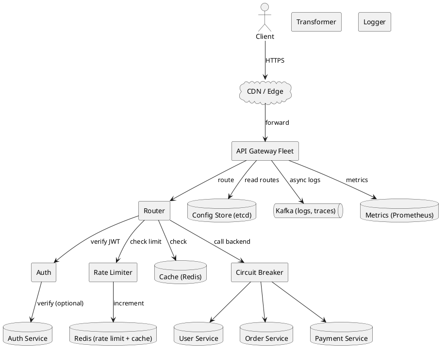

### Component Responsibilities

| Component | Role |
|---|---|
| Router | Match request to route, select backend |
| Auth | Validate JWT/API key, extract identity |
| Rate Limiter | Check quotas (uses Redis) |
| Transformer | Header/body rewrite, protocol translation |
| Cache | Response cache for cacheable GETs |
| Circuit Breaker | Fail-fast on unhealthy backends |
| Logger | Structured request/response logs (async) |
| Config Store | Routes, policies, auth keys (etcd/DB) |
| Metrics | Latency, error rate, throughput |

### Gateway vs Load Balancer vs Service Mesh

| Aspect | Load Balancer | API Gateway | Service Mesh |
|---|---|---|---|
| Layer | L4/L7 | L7 | L7 + sidecars |
| Focus | Distribute traffic | Cross-cutting concerns | Service-to-service |
| East-west | No | No | Yes |
| North-south | Yes | Yes | Partial |
| Auth | No | Yes | mTLS |
| Rate limit | Basic | Advanced | Advanced |

**Note:** Modern gateways (Envoy, Kong) blur the line with LBs. Choose based on features needed.

---

## 4. API Design

### Client-Facing Endpoints

Clients interact with a single URL. Routes are defined by path:

```http
GET    https://api.example.com/v1/users/123
POST   https://api.example.com/v1/orders
GET    https://api.example.com/v1/payments/789
WS     wss://api.example.com/v1/notifications
```

### Admin API (for managing routes)

```http
POST /admin/v1/routes
Content-Type: application/json

{
  "name": "user-service",
  "match": {
    "path_prefix": "/v1/users",
    "methods": ["GET", "POST", "PUT", "DELETE"]
  },
  "backend": {
    "service_name": "user-service",
    "load_balancer": "round_robin",
    "timeout_ms": 5000
  },
  "auth": {
    "type": "jwt",
    "required": true
  },
  "rate_limit": {
    "rule_id": "user-default"
  },
  "transform": {
    "request_headers_add": {"X-Request-ID": "{{uuid}}"},
    "response_headers_remove": ["X-Internal-Id"]
  }
}
```

**Response 201:**
```json
{
  "route_id": "rt-a1b2c3",
  "version": 42,
  "created_at": "2026-09-17T10:00:00Z"
}
```

### Route Config Propagation

```http
POST /admin/v1/routes/{route_id}/publish
```

Publishes to all gateway nodes via etcd watch. Propagation < 100 ms.

### Request Headers (Client to Gateway)

```http
GET /v1/users/123 HTTP/2
Host: api.example.com
Authorization: Bearer eyJhbGc...
X-Request-ID: 550e8400-e29b-41d4-a716-446655440000
User-Agent: MyApp/1.0
Accept: application/json
```

### Request Headers (Gateway to Backend)

```http
GET /users/123 HTTP/2
Host: user-service
X-Request-ID: 550e8400-e29b-41d4-a716-446655440000
X-User-ID: user-12345
X-User-Tier: pro
X-Forwarded-For: 203.0.113.42
X-Forwarded-Proto: https
X-Gateway-Version: 1.4.2
```

### Response Headers (Gateway to Client)

```http
HTTP/2 200 OK
Content-Type: application/json
X-RateLimit-Limit: 1000
X-RateLimit-Remaining: 847
X-RateLimit-Reset: 1633024860
X-Request-ID: 550e8400-e29b-41d4-a716-446655440000
Cache-Control: public, max-age=60
```

---

## 5. Routing Deep Dive

### Route Matching Precedence

Most specific match wins. Common order:

1. **Exact path** (`/v1/users/me`)
2. **Path prefix** (`/v1/users/*`)
3. **Regex pattern** (`/v1/users/{id:[0-9]+}`)
4. **Host-based** (`api.example.com` vs `admin.example.com`)
5. **Header-based** (`X-Version: beta`)
6. **Method-based** (GET vs POST)
7. **Default catch-all** (`/*`)

### Path Parameters

```
Route: /v1/users/{user_id}/orders/{order_id}
Request: /v1/users/123/orders/456

Extracted: {user_id: "123", order_id: "456"}
Forwarded: /users/123/orders/456   (path rewritten if needed)
```

### Path Rewriting

```yaml
match:
  path_prefix: /v1/users
backend:
  service_name: user-service
  path_rewrite:
    strip_prefix: /v1
    add_prefix: /api
```

Request `/v1/users/123` -> Backend `/api/users/123`.

### Versioning Strategies

| Strategy | Example | Pros | Cons |
|---|---|---|---|
| URL path | `/v1/users` | Explicit, cacheable | URL clutter |
| Header | `Accept: application/vnd.api.v1+json` | Clean URLs | Hard to test in browser |
| Query | `/users?version=1` | Simple | Caching issues |
| Subdomain | `v1.api.example.com` | Clean separation | DNS overhead |

**Recommendation:** URL path for public APIs; header for internal.

### Canary Routing

```yaml
route: user-service
backends:
  - service: user-service-v1
    weight: 95
  - service: user-service-v2
    weight: 5
```

5% of traffic to v2. Increase gradually. Rollback instantly if metrics degrade.

### A/B Testing

Route by user cohort:

```yaml
condition:
  user_id_hash_mod:
    mod: 100
    in: [0, 49]     # 50% of users
backend:
  service: user-service-experiment
```

### Blue-Green Deployment

```yaml
route: user-service
active_backend: user-service-blue    # flip to green on deploy
```

Instant switch; instant rollback. Requires 2x infrastructure.

### Multi-Region Routing

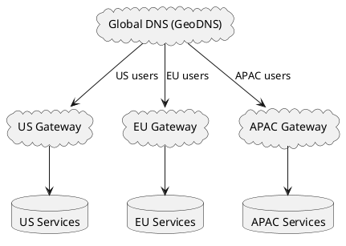

GeoDNS routes to nearest region. Each region has its own gateway fleet.

---

## 6. Deep Dive: Authentication and Authorization

### Authentication Methods

| Method | Use Case | Pros | Cons |
|---|---|---|---|
| JWT | Stateless API auth | No DB lookup | Revocation is hard |
| API Key | Server-to-server | Simple | No expiry by default |
| OAuth2 | Third-party auth | Standard, delegated | Complex |
| mTLS | Service-to-service | Strong crypto | Cert management |
| Session Cookie | Browser apps | Familiar | Stateful |

### JWT Validation Flow

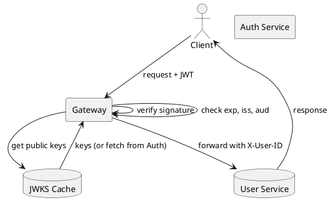

**Steps:**
1. Extract JWT from `Authorization` header
2. Fetch public keys from JWKS endpoint (cached)
3. Verify signature (RS256, ES256)
4. Check `exp`, `nbf`, `iss`, `aud`
5. Extract claims (`sub`, `role`, `scopes`)
6. Inject into downstream headers (`X-User-ID`, `X-Roles`)
7. Forward request

**Optimization:** Cache JWKS for 1 hour. Rotate keys gracefully (support 2 keys during rollover).

### Rate Limiting Integration

```
1. Extract identity (user_id, api_key, IP)
2. Check rate limit rule for this route + identity
3. Increment counter in Redis
4. If over limit: 429 with Retry-After
5. Else: forward
```

See [Rate Limiter](../02-rate-limiter.md) for algorithm details.

### Authorization (RBAC/ABAC)

```yaml
route: /admin/v1/users
auth:
  required: true
  scopes: ["admin:users:read"]
```

Gateway checks scopes from JWT against route requirements.

**Complex policies:** Delegate to a policy engine (OPA, Cedar).

### Token Propagation

After auth, the gateway injects the user context:

```http
X-User-ID: user-12345
X-User-Roles: admin,editor
X-User-Scopes: read:users,write:orders
```

Backend services trust the gateway (internal network) and don't re-verify.

**Security note:** Gateway and services must be on a trusted network (VPC, mTLS). Otherwise, a malicious actor could forge headers.

---

## 7. Deep Dive: Request/Response Transformation

### Header Transformation

```yaml
transform:
  request:
    add:
      X-Request-ID: "{{uuid}}"
      X-Gateway-Timestamp: "{{now}}"
    remove:
      - X-Internal-Debug
      - Cookie
    rename:
      X-Old-Header: X-New-Header
  response:
    add:
      X-Request-ID: "{{request.id}}"
    remove:
      - X-Backend-IP
      - Server
```

### Body Transformation

**JSON field mapping:**
```yaml
transform:
  request_body:
    rename_fields:
      user_name: username
      user_email: email
    add_fields:
      source: "gateway"
    remove_fields:
      - internal_flag
```

**Body size limit:**
```yaml
max_request_size_bytes: 10485760   # 10 MB
max_response_size_bytes: 104857600 # 100 MB
```

### Protocol Translation

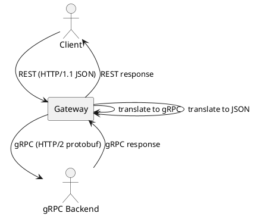

**Use case:** Expose gRPC services via REST for browser clients.

**Tools:** Envoy's gRPC-JSON transcoder, grpc-gateway.

### Response Aggregation (BFF Pattern)

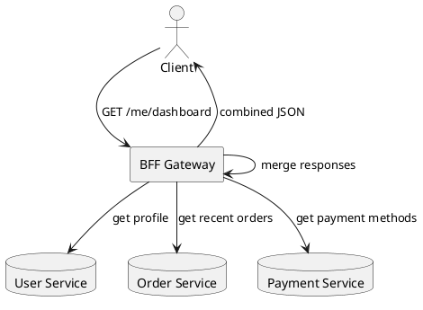

**Pros:** Fewer round-trips; optimized payloads per client.
**Cons:** Gateway becomes stateful; coupling.

**Recommendation:** Use separate BFF per client type (mobile, web, TV).

### WebSocket Support

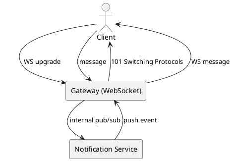

Gateway maintains long-lived connections; backend uses pub/sub internally.

---

## 8. Deep Dive: Caching

### Response Caching

```yaml
route: /v1/products/*
cache:
  enabled: true
  ttl_seconds: 60
  cache_key: "{{method}}:{{path}}:{{query}}:{{user_tier}}"
  vary_headers: ["Accept-Language", "Accept-Encoding"]
```

**Cache-Aside Flow:**
```
1. Request arrives
2. Compute cache key
3. Lookup in Redis
4. HIT: return cached response
5. MISS: forward to backend, cache response, return
```

**Cache-Control headers:**
- Respect backend `Cache-Control: no-store, private, max-age=N`
- Override with route config if needed

### Cache Invalidation

- **TTL-based**: Simple, eventual consistency
- **Purge API**: `POST /admin/v1/cache/purge?path=/v1/products/*`
- **Tag-based**: Invalidate by tag (requires backend to emit tags)

### Cache Stampede Prevention

```
Mutex lock on cache miss:
  First request fetches, others wait
  Prevents DB overload
```

### Per-User Caching

```yaml
cache:
  key_by: "user_id"   # cache per user
```

Useful for personalized responses. Increases cache size.

### Cache Coherence

For distributed gateways, all nodes share the same Redis cache. This ensures coherent responses across the fleet.

---

## 9. Deep Dive: Reliability Patterns

### Timeouts

```yaml
route:
  backend:
    timeout_ms: 5000           # total timeout
    connect_timeout_ms: 500    # TCP connect
    read_timeout_ms: 4500      # response read
```

On timeout: return 504 Gateway Timeout.

### Retries

```yaml
retries:
  max_attempts: 3
  backoff:
    base_ms: 100
    max_ms: 2000
    jitter: true
  retry_on:
    status_codes: [502, 503, 504]
    methods: [GET, HEAD, OPTIONS]   # idempotent only
```

**Rules:**
- Only retry idempotent methods (GET, HEAD) by default
- POST/PUT need explicit idempotency keys to be retryable
- Exponential backoff with jitter prevents thundering herd

### Circuit Breaker

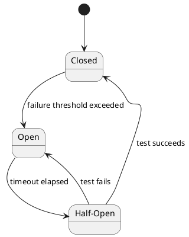

**Configuration:**
- **Failure threshold**: 50% in 10 sec
- **Volume threshold**: min 20 requests
- **Timeout**: 30s open before half-open

When open: gateway returns 503 immediately without calling backend.

### Bulkheads

Separate thread pools / connection pools per backend:
- Slow backend doesn't starve others
- Limits blast radius of failures

### Health Checks (Backend)

Gateway periodically checks backend health:
- Active: HTTP GET `/health` every 10s
- Passive: eject on consecutive errors

Unhealthy backends removed from rotation.

### Graceful Degradation

```yaml
fallback:
  on_error:
    static_response:
      status: 200
      body: {"products": [], "stale": true}
```

Return a degraded response instead of an error. Useful for non-critical data.

### Rate Limiting as Protection

Rate limit protects both:
- **Backend**: From being overwhelmed
- **Gateway**: From DDoS

See [Rate Limiter](../02-rate-limiter.md).

---

## 10. Deep Dive: Observability

### Structured Logging

```json
{
  "timestamp": "2026-09-17T10:00:00.123Z",
  "request_id": "550e8400-e29b-41d4-a716-446655440000",
  "method": "GET",
  "path": "/v1/users/123",
  "route": "user-service",
  "backend": "user-service-v2",
  "user_id": "user-12345",
  "status": 200,
  "latency_ms": 45,
  "backend_latency_ms": 40,
  "gateway_overhead_ms": 5,
  "bytes_in": 512,
  "bytes_out": 2048,
  "client_ip": "203.0.113.42",
  "user_agent": "MyApp/1.0",
  "trace_id": "abc123",
  "span_id": "def456"
}
```

Async: publish to Kafka, don't block the request.

### Distributed Tracing

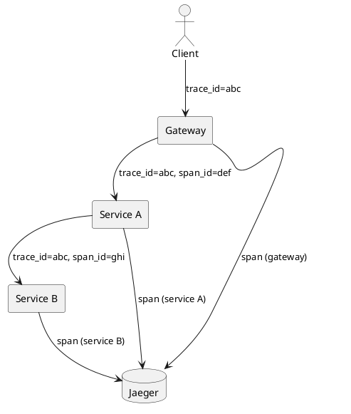

Gateway propagates `trace_id` (and `span_id`) to backends. Backends continue the trace.

**Standards:** W3C Trace Context (`traceparent` header), OpenTelemetry.

### Metrics

| Metric | Type | Purpose |
|---|---|---|
| `gateway_requests_total` | Counter | Rate by route, status |
| `gateway_request_duration_seconds` | Histogram | Latency percentiles |
| `gateway_active_connections` | Gauge | Current connections |
| `gateway_backend_errors_total` | Counter | Backend failures |
| `gateway_circuit_breaker_state` | Gauge | 0=closed, 1=open, 2=half-open |
| `gateway_rate_limit_exceeded_total` | Counter | 429s |
| `gateway_cache_hits_total` | Counter | Cache effectiveness |
| `gateway_config_version` | Gauge | Config propagation |

### Alerting Rules

- **P0**: Gateway error rate > 1%, p99 latency > 500ms
- **P1**: Circuit breaker open for > 1 min, rate limit exceeded > 5%
- **P2**: Backend errors > 5%, cache hit ratio < 50%
- **P3**: Config propagation delay > 1 sec

---

## 11. Scaling Considerations

### Horizontal Scaling

- Gateway is **stateless** — scale freely
- Add nodes behind DNS or anycast
- Target: 100K+ QPS per node (with SSL)
- 30+ nodes for 3M peak QPS

### Load Balancing the Gateway

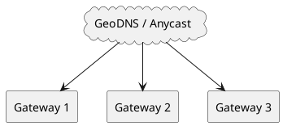

- **Anycast**: Same IP advertised from multiple PoPs; BGP routes to nearest
- **GeoDNS**: Different IPs per region based on client location
- **External LB**: Cloud LB (ALB, NLB) in front of gateway fleet

### Config Propagation at Scale

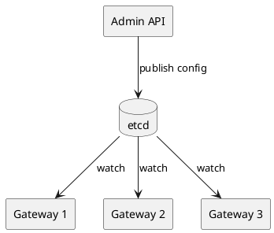

etcd watch delivers updates to all nodes in < 100 ms.

### Multi-Region Deployment

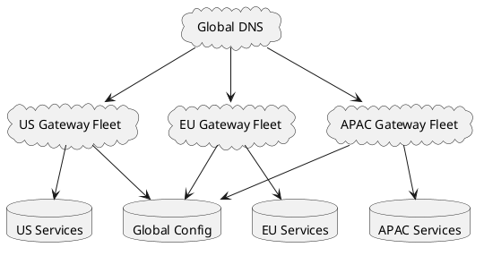

**Each region is independent** for data plane. Config is global (replicated).

**Failover:** If US region fails, DNS routes to EU (higher latency but available).

### WebSocket Scaling

WebSockets are stateful (long-lived connections):
- Use **sticky sessions** or **consistent hashing**
- Gateway cluster must handle 100K+ concurrent connections per node
- Redis pub/sub for cross-node broadcast

### Connection Draining (Graceful Shutdown)

```
1. Receive SIGTERM
2. Stop accepting new connections
3. Wait for in-flight requests to complete (up to 30s)
4. Close idle keep-alive connections
5. Exit
```

Configured with `terminationGracePeriodSeconds` in Kubernetes.

---

## 12. Bottlenecks and Trade-offs

| Concern | Solution | Trade-off |
|---|---|---|
| Single entry point SPOF | Multi-region, HA fleet | Complexity |
| Gateway latency | Efficient routing, caching | Feature trade-off |
| Config propagation | etcd watch | etcd SPOF |
| Auth verification | JWT (stateless) | Revocation hard |
| Rate limit checks | Redis-backed | +1 network hop |
| Backend failures | Circuit breaker, retries | Retry storms |
| WebSocket state | Sticky routing | Uneven load |
| Large request bodies | Streaming, size limits | Complexity |
| Caching incoherence | Central Redis | Latency |
| Observability cost | Sampling | Missing rare issues |

### Design Decisions Summary

| Decision | Choice | Rationale |
|---|---|---|
| Architecture | Stateless fleet | Horizontal scaling |
| Config | etcd + watch | Fast propagation, consistency |
| Auth | JWT with JWKS | Stateless, standard |
| Rate limit | Redis + Lua | Atomic, distributed |
| Cache | Redis | Shared across fleet |
| Circuit breaker | Per backend | Blast radius control |
| Logging | Async to Kafka | No blocking |
| Tracing | W3C context propagation | Standard |
| Multi-region | Independent regional fleets | Low latency, resilience |
| Versioning | URL path + header | Public vs internal |

---

## 13. Failure Scenarios

### Gateway Node Fails

**Impact:** Connections to that node drop.

**Mitigation:**
- Health check removes node from LB pool
- Clients retry (with idempotency)
- Other nodes absorb traffic

**Downtime:** ~10 sec for health check detection.

### All Gateway Nodes Fail (Region)

**Impact:** Region unreachable.

**Mitigation:**
- GeoDNS failover to other region (30-60 sec TTL)
- Client retries with backoff
- Alert ops immediately

### etcd Down (Config Store)

**Impact:** No new config changes.

**Mitigation:**
- Existing config cached in-memory on gateway nodes
- 3-5 node etcd cluster (survives 1-2 failures)
- Alert immediately

### Redis Down (Rate Limit, Cache)

**Impact:** Rate limiting fails, cache misses.

**Mitigation:**
- Fail open for rate limit (allow traffic, log alert)
- Cache: fall through to backend
- Circuit breaker on Redis calls

### Auth Service Down

**Impact:** JWT validation fails.

**Mitigation:**
- Cache JWKS (public keys) for 1 hour
- Verify signatures locally (no Auth service call needed)
- Only fall back to Auth service for introspective checks

### Backend Service Down

**Impact:** Specific routes return errors.

**Mitigation:**
- Circuit breaker opens; fail fast
- Fallback responses (if configured)
- Route to healthy instances

### Slow Backend

**Impact:** Gateway threads pile up.

**Mitigation:**
- Per-route timeouts
- Bulkheads (separate pools per backend)
- Backpressure (reject when queue full)

### DDoS Attack

**Impact:** Gateway overwhelmed.

**Mitigation:**
- CDN/scrubbing center in front (Cloudflare, Akamai)
- IP-based rate limiting at edge
- WAF rules for known attack patterns
- Auto-scaling gateway fleet

### Certificate Expiry

**Impact:** TLS handshakes fail.

**Mitigation:**
- Automated cert rotation (Let's Encrypt, ACME)
- Monitor cert expiry (alert 30 days before)
- Support multiple certs during rotation

---

## 14. Monitoring and Alerts

### Key Metrics

| Metric | Target | Alert Threshold |
|---|---|---|
| Gateway p99 latency | < 5 ms overhead | > 20 ms |
| Request throughput | steady | sudden drop > 30% |
| Error rate (5xx) | < 0.1% | > 1% |
| 429 rate | < 5% | > 10% |
| Circuit breaker opens | 0 | > 0 for 5 min |
| Config propagation | < 100 ms | > 1 sec |
| Cache hit ratio | > 80% | < 50% |
| Active connections | baseline | > 2x normal |
| TLS handshake p99 | < 20 ms | > 100 ms |
| Backend connection errors | < 0.01% | > 0.1% |

### Dashboards

- **Traffic**: QPS by route, method, status
- **Latency**: p50/p95/p99 for total and backend
- **Errors**: 4xx/5xx by route and backend
- **Auth**: JWT validation failures, API key auth
- **Rate limiting**: 429s, top throttled users
- **Cache**: Hit ratio, evictions
- **Circuit breaker**: State per backend
- **Infrastructure**: CPU, memory, connections

### Alerts

- **P0**: Gateway fleet error rate > 1%, region unreachable
- **P1**: Circuit breaker open > 1 min, 429 > 10%
- **P2**: p99 latency > 20 ms, cache hit ratio < 50%
- **P3**: Config propagation delay, cert expiry < 30 days

---

## 15. Cost Estimation

Rough monthly cost (AWS, us-east-1) for 1M QPS:

| Component | Spec | Cost/month |
|---|---|---|
| Gateway fleet | 30 x c6g.2xlarge | ~$3,600 |
| Load balancer | NLB + ALB | ~$500 |
| Redis (rate limit + cache) | 6 x cache.r6g.xlarge | ~$1,500 |
| etcd cluster | 3 x m6i.large | ~$300 |
| Logging (Kafka + storage) | MSK + S3 | ~$2,000 |
| Tracing (Jaeger) | Managed or self-hosted | ~$500 |
| Monitoring (Datadog) | 30 hosts | ~$2,000 |
| CDN/WAF | Cloudflare Enterprise | ~$5,000 |
| Data transfer | Cross-region + egress | ~$5,000 |
| **Total** | | **~$20,400/month** |

**Cost optimization:**
- Reserved instances (30-40% savings)
- Smaller instance types (c6g.large enough for many)
- Self-hosted observability (Prometheus + Grafana + Jaeger)
- Sample logs (only 10% of requests)
- Free-tier CDN (Cloudflare free)

---

## 16. Extensions and Follow-ups

### API Versioning Strategies

- **URL versioning**: `/v1/`, `/v2/` — explicit, cacheable
- **Header versioning**: `Accept: application/vnd.api.v2+json`
- **Content negotiation**: Different responses for same URL

**Gateway role:** Route each version to the appropriate backend.

### Schema Validation

Validate request/response bodies against OpenAPI/JSON Schema at the gateway:
- Reject malformed requests early
- Prevent invalid data from reaching backends
- **Cost:** CPU overhead per request (5-10%)

**Tools:** Envoy + OpenAPI, Kong + schema plugin.

### GraphQL Gateway

Merge multiple GraphQL schemas into one:
- Client queries unified schema
- Gateway resolves fields across backends
- **Tools:** Apollo Federation, Hasura

### Webhook Delivery

Gateway as webhook dispatcher:
- Accept webhook registrations
- Deliver events with retries
- Sign payloads (HMAC)
- Dead letter queue for failures

### API Analytics

Track usage per API, per consumer:
- Top endpoints, slow endpoints
- Error rates per client
- Traffic patterns over time
- **Tools:** Moesif, Kong Analytics, custom (Kafka + ClickHouse)

### Developer Portal

Self-service for API consumers:
- Browse APIs, try them out
- Manage API keys
- View usage and quotas
- Read docs (auto-generated from OpenAPI)

### API Monetization

Charge per request:
- Free tier, paid tiers
- Usage-based billing
- Overage charges
- **Gateway role:** Meter usage, emit billing events

### mTLS Between Gateway and Backends

For zero-trust security:
- Gateway presents client cert to backends
- Backends verify gateway identity
- Prevents forged headers from compromised pods

**Tools:** Istio, Linkerd, SPIFFE/SPIRE.

### AI/ML Gateway

For LLM APIs:
- Token counting and rate limiting (per token, not per request)
- Prompt caching
- Model routing (GPT-4 vs Claude based on prompt)
- Cost tracking per request

**Emerging area:** LangChain, LiteLLM, Portkey.

### Federated Gateway

Multiple teams own different route groups:
- Team A owns `/v1/users/*`
- Team B owns `/v1/orders/*`
- Central gateway federates configs- Each team manages their own routes

**Tools:** Kong Mesh, Envoy xDS federation.

---

## 17. Summary

| Aspect | Decision |
|---|---|
| Architecture | Stateless fleet, horizontal scaling |
| Config | etcd + watch (< 100 ms propagation) |
| Auth | JWT with cached JWKS |
| Rate limiting | Redis + Lua (atomic) |
| Caching | Redis (shared across fleet) |
| Circuit breaker | Per backend, fail-fast |
| Retries | Idempotent methods only, exponential backoff |
| Timeouts | Per-route, connect + read |
| Observability | Structured logs (Kafka), traces (OTel), metrics (Prometheus) |
| WebSockets | Sticky sessions or consistent hashing |
| Multi-region | Independent fleets, GeoDNS routing |
| Scale | 3M peak QPS, 30+ nodes |
| Latency | < 5 ms p99 overhead |
| Cost | ~$20K/month for 1M QPS |

**Key takeaways:**

- **Stateless gateways** scale horizontally with ease
- **etcd watch** propagates config in < 100 ms across the fleet
- **JWT with cached JWKS** avoids per-request auth service calls
- **Redis + Lua** gives atomic distributed rate limiting
- **Circuit breakers per backend** prevent cascading failures
- **Async logging** (Kafka) keeps the request path fast
- **W3C trace context** propagation enables distributed tracing
- **Multi-region fleets** beat a single global gateway for latency
- **BFF pattern** lets each client type get optimized responses
- **API gateway is the single entry point** — must be highly available

**Similar Pattern Problems:**

- Service Discovery (gateway uses discovery to find backends)
- Rate Limiter (rate limit runs at the gateway)
- Distributed Cache (gateway caches responses)
- CDN (edge layer often includes API gateway features)
- Load Balancer (L7 LB is often part of a gateway)
- Pub/Sub System (gateway may translate to pub/sub)