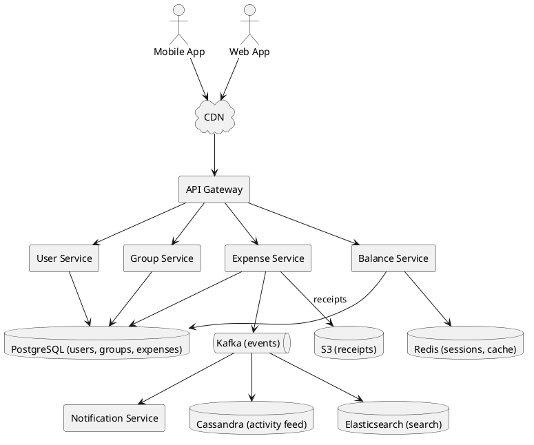
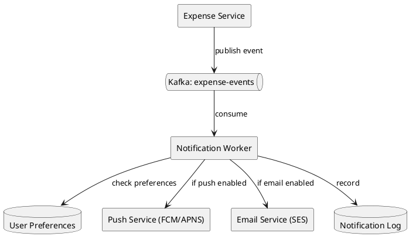
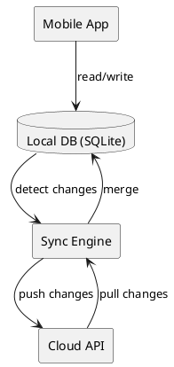
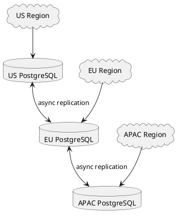

# Cash Split (Splitwise)

## Problem Statement

Design a shared-expense tracking app like Splitwise. Users create groups (trips, roommates, couples), add expenses paid by one person but shared by many, and the system tracks who owes whom. The system minimizes the number of transactions needed to settle all debts.

**Example:**
```
Trip to Goa — Group members: Alice, Bob, Carol

Expense 1: Alice paid ₹3000 for hotel (split equally)
Expense 2: Bob paid ₹1500 for food (split equally)
Expense 3: Carol paid ₹600 for cab (split equally)

Net balances:
  Alice: +3000 - 1000 - 500 - 200 = +1300 (is owed)
  Bob:   -1000 + 1500 - 500 - 200 = -200  (owes)
  Carol: -1000 - 500 + 600 - 200 = -1100 (owes)

Simplified settlement:
  Carol pays Alice ₹1100
  Bob pays Alice ₹200
  (2 transactions instead of 6)
```

**Real-world apps:** Splitwise, Settle Up, Tricount, Venmo, Google Pay (split feature).

**Why it's interesting:**
- Deceptively simple — looks like CRUD, but has:
  - Debt simplification algorithm (graph problem)
  - Multi-currency handling
  - Idempotency for money
  - Offline support (mobile)
  - Group-scoped vs friend-scoped expenses

---

## 1. Requirements Clarification

### Functional Requirements
- **Users**: Register, login, profile
- **Groups**: Create, invite, leave
- **Expenses**: Add expense with payer, amount, split type, participants
- **Split types**: Equal, exact amounts, percentages, shares
- **Balances**: Show who owes whom (per group, overall)
- **Settle up**: Mark a payment as settled
- **Simplify debts**: Minimize transaction count
- **Multi-currency**: Store expenses in different currencies
- **Activity feed**: Recent activity in group
- **Comments**: On expenses
- **Receipts**: Attach photos
- **Notifications**: Email, push for new expenses/settlements
- **Offline support**: Mobile app works offline, syncs later

### Non-Functional Requirements
- **Scale**: 50M users, 100M groups, 1B expenses
- **Latency**: Expense creation < 500 ms p99 (write path)
- **Balance query**: < 200 ms p99
- **Availability**: 99.99% — money is sensitive
- **Consistency**: Strong for balances (money must not disappear)
- **Durability**: Never lose a transaction (replicated, backups)
- **Idempotency**: Retries must not create duplicate expenses

### Out of Scope
- Payment processing (that's a separate system — Venmo, UPI, etc.)
- Bank account integration
- Tax calculation
- Advanced analytics (charts, forecasts)

---

## 2. Back-of-Envelope Estimation

### Traffic

```
Given:
  Users                = 50,000,000
  DAU                  = 10,000,000
  Groups               = 100,000,000
  Expenses/day         = 5,000,000
  Reads per expense    = 20 (viewing, balance queries)
  Peak multiplier      = 3x

Average QPS:
  Writes (expenses) = 5M / 86,400 = ~58 writes/sec
  Reads             = 5M x 20 / 86,400 = ~1,157 reads/sec

Peak QPS:
  Writes = ~175/sec
  Reads  = ~3,500/sec

This is a LOW-throughput system. Optimize for correctness, not scale.
```

### Storage

```
Users table:
  50M users x 500 bytes = ~25 GB

Groups table:
  100M groups x 300 bytes = ~30 GB

Group members:
  100M groups x 5 members x 100 bytes = ~50 GB

Expenses:
  5M/day x 365 x 5 years = 9.125B rows
  Per row: ~500 bytes
  Total: ~4.5 TB

Expense splits:
  9.125B expenses x 3 participants x 100 bytes = ~2.7 TB

Balances (materialized):
  100M groups x 5 members x 100 bytes = ~50 GB

Activity feed:
  5M/day x 365 x 1 year = 1.825B rows
  Per row: ~200 bytes
  Total: ~365 GB

Total storage: ~8 TB (raw), ~24 TB (with replication)
```

### Bandwidth

```
Read bandwidth:
  3,500 reads/sec x 2 KB = ~7 MB/sec = ~56 Mbps

Write bandwidth:
  175 writes/sec x 3 KB = ~525 KB/sec

Peak: ~60 Mbps
Very small — no bandwidth concerns.
```

### Latency Budget

```
Target: < 500 ms p99 for expense creation

Breakdown:
  Client -> API:            ~50 ms
  Auth check:               ~20 ms
  Validate input:           ~10 ms
  Write expense + splits:   ~30 ms (transaction)
  Update balances:          ~20 ms
  Publish event (Kafka):    ~5 ms (async)
  Return:                   ~50 ms
  Total:                    ~185 ms

Headroom for retries, network jitter.
```

---

## 3. High-Level Design



### Component Responsibilities

| Component | Role |
|---|---|
| API Gateway | Entry point, auth, rate limiting |
| User Service | Registration, login, profile |
| Group Service | Create/manage groups, members |
| Expense Service | Add/edit/delete expenses, splits |
| Balance Service | Compute and cache balances |
| Notification Service | Email, push for activity |
| PostgreSQL | Primary store (users, groups, expenses) |
| Redis | Session cache, balance cache |
| Kafka | Event stream for async processing |
| Cassandra | Activity feed (time-series) |
| Elasticsearch | Full-text search (expenses, comments) |
| S3 | Receipt images |

### Why This Architecture

- **PostgreSQL** for money-related data (ACID, transactional integrity)
- **Redis** for balance cache (hot reads)
- **Kafka** for async fan-out (notifications, activity feed)
- **Cassandra** for activity feed (write-heavy, time-ordered)
- **Elasticsearch** for search (comments, receipts OCR, filter)

---

## 4. API Design

### Users

```http
POST   /v1/users                # register
POST   /v1/users/login          # login
GET    /v1/users/me             # profile
PATCH  /v1/users/me             # update profile
```

### Groups

```http
POST   /v1/groups               # create group
GET    /v1/groups               # list my groups
GET    /v1/groups/{id}          # group details
PATCH  /v1/groups/{id}          # update group
DELETE /v1/groups/{id}          # delete group (soft)
POST   /v1/groups/{id}/members  # add member
DELETE /v1/groups/{id}/members/{user_id}
```

### Expenses

```http
POST   /v1/groups/{id}/expenses         # add expense
GET    /v1/groups/{id}/expenses         # list expenses
GET    /v1/expenses/{id}                # expense details
PATCH  /v1/expenses/{id}                # edit expense
DELETE /v1/expenses/{id}                # delete expense
POST   /v1/expenses/{id}/comments       # add comment
```

### Balances

```http
GET /v1/groups/{id}/balances        # per-group balances
GET /v1/balances                     # overall balances
GET /v1/groups/{id}/simplify        # simplified settlements
```

### Settlements

```http
POST /v1/groups/{id}/settlements    # record settlement
GET  /v1/groups/{id}/settlements    # list settlements
```

### Expense Creation Example

```http
POST /v1/groups/g-123/expenses
Content-Type: application/json
Idempotency-Key: 550e8400-e29b-41d4-a716-446655440000

{
  "description": "Dinner at Britto's",
  "amount": 2400,
  "currency": "INR",
  "paid_by": "user-alice",
  "category": "food",
  "split_type": "equal",
  "participants": ["user-alice", "user-bob", "user-carol"],
  "receipt_url": "s3://receipts/abc123.jpg",
  "expense_date": "2026-09-17"
}
```

**Response 201:**
```json
{
  "expense_id": "exp-456",
  "description": "Dinner at Britto's",
  "amount": 2400,
  "currency": "INR",
  "paid_by": "user-alice",
  "splits": [
    {"user_id": "user-alice", "amount": 800},
    {"user_id": "user-bob", "amount": 800},
    {"user_id": "user-carol", "amount": 800}
  ],
  "created_at": "2026-09-17T20:00:00Z"
}
```

**Response 409 (duplicate idempotency key):**
```json
{
  "error": "duplicate",
  "expense_id": "exp-456",
  "message": "Expense already created"
}
```

### Split Types Example

**Equal split** (2400 among 3):
```json
{
  "split_type": "equal",
  "participants": ["alice", "bob", "carol"],
  "amount": 2400
}
// Each: 800
```

**Exact amounts:**
```json
{
  "split_type": "exact",
  "splits": {
    "alice": 1000,
    "bob": 800,
    "carol": 600
  },
  "amount": 2400
}
```

**Percentages:**
```json
{
  "split_type": "percentage",
  "splits": {
    "alice": 50,
    "bob": 30,
    "carol": 20
  },
  "amount": 2400
}
```

**Shares:**
```json
{
  "split_type": "shares",
  "splits": {
    "alice": 2,
    "bob": 1,
    "carol": 1
  },
  "amount": 2400
}
// Alice: 1200, Bob: 600, Carol: 600
```

---

## 5. Database Design

### Schema (PostgreSQL)

```sql
-- Users
CREATE TABLE users (
    user_id BIGINT PRIMARY KEY,
    email VARCHAR(255) UNIQUE NOT NULL,
    name VARCHAR(100) NOT NULL,
    phone VARCHAR(20),
    default_currency VARCHAR(3) DEFAULT 'INR',
    created_at TIMESTAMP DEFAULT NOW(),
    updated_at TIMESTAMP DEFAULT NOW()
);

-- Groups
CREATE TABLE groups (
    group_id BIGINT PRIMARY KEY,
    name VARCHAR(100) NOT NULL,
    description TEXT,
    created_by BIGINT REFERENCES users(user_id),
    default_currency VARCHAR(3) DEFAULT 'INR',
    is_deleted BOOLEAN DEFAULT FALSE,
    created_at TIMESTAMP DEFAULT NOW()
);
CREATE INDEX idx_groups_created_by ON groups(created_by);

-- Group members
CREATE TABLE group_members (
    group_id BIGINT REFERENCES groups(group_id),
    user_id BIGINT REFERENCES users(user_id),
    role VARCHAR(20) DEFAULT 'member',  -- owner, admin, member
    joined_at TIMESTAMP DEFAULT NOW(),
    left_at TIMESTAMP,
    PRIMARY KEY (group_id, user_id)
);
CREATE INDEX idx_group_members_user ON group_members(user_id);

-- Expenses
CREATE TABLE expenses (
    expense_id BIGINT PRIMARY KEY,
    group_id BIGINT REFERENCES groups(group_id),
    description TEXT NOT NULL,
    amount_cents BIGINT NOT NULL,        -- store as smallest unit
    currency VARCHAR(3) NOT NULL,
    paid_by BIGINT REFERENCES users(user_id),
    split_type VARCHAR(20) NOT NULL,
    category VARCHAR(50),
    receipt_url TEXT,
    idempotency_key VARCHAR(255) UNIQUE,
    expense_date DATE NOT NULL,
    is_deleted BOOLEAN DEFAULT FALSE,
    created_by BIGINT REFERENCES users(user_id),
    created_at TIMESTAMP DEFAULT NOW(),
    updated_at TIMESTAMP DEFAULT NOW()
);
CREATE INDEX idx_expenses_group ON expenses(group_id, expense_date DESC);
CREATE INDEX idx_expenses_paid_by ON expenses(paid_by);
CREATE UNIQUE INDEX idx_expenses_idem ON expenses(idempotency_key) WHERE idempotency_key IS NOT NULL;

-- Expense splits (who owes how much for this expense)
CREATE TABLE expense_splits (
    expense_id BIGINT REFERENCES expenses(expense_id),
    user_id BIGINT REFERENCES users(user_id),
    amount_cents BIGINT NOT NULL,
    PRIMARY KEY (expense_id, user_id)
);
CREATE INDEX idx_splits_user ON expense_splits(user_id);

-- Settlements (manual "settle up" transactions)
CREATE TABLE settlements (
    settlement_id BIGINT PRIMARY KEY,
    group_id BIGINT REFERENCES groups(group_id),
    from_user BIGINT REFERENCES users(user_id),
    to_user BIGINT REFERENCES users(user_id),
    amount_cents BIGINT NOT NULL,
    currency VARCHAR(3) NOT NULL,
    note TEXT,
    idempotency_key VARCHAR(255) UNIQUE,
    settled_at TIMESTAMP DEFAULT NOW()
);
CREATE INDEX idx_settlements_group ON settlements(group_id, settled_at DESC);

-- Comments
CREATE TABLE expense_comments (
    comment_id BIGINT PRIMARY KEY,
    expense_id BIGINT REFERENCES expenses(expense_id),
    user_id BIGINT REFERENCES users(user_id),
    text TEXT NOT NULL,
    created_at TIMESTAMP DEFAULT NOW()
);
CREATE INDEX idx_comments_expense ON expense_comments(expense_id, created_at);

-- Activity feed (denormalized, for group feed)
CREATE TABLE activity_events (
    event_id BIGINT PRIMARY KEY,
    group_id BIGINT,
    user_id BIGINT,
    event_type VARCHAR(50),             -- expense_added, settled, member_joined, comment_added
    payload JSONB,
    created_at TIMESTAMP DEFAULT NOW()
);
CREATE INDEX idx_activity_group ON activity_events(group_id, created_at DESC);
```

### Balance Calculation — The Critical Part

Balances are NOT stored as a single number. Instead:

**Option A: Compute on Read (simple, but slow at scale)**
```sql
-- For each user in group, compute net balance
SELECT user_id,
       SUM(paid) AS total_paid,
       SUM(owed) AS total_owed,
       SUM(paid) - SUM(owed) AS net_balance
FROM (
    -- What each user paid
    SELECT paid_by AS user_id, amount_cents AS paid, 0 AS owed
    FROM expenses WHERE group_id = ? AND is_deleted = FALSE
    UNION ALL
    -- What each user owes (their share)
    SELECT s.user_id, 0 AS paid, s.amount_cents AS owed
    FROM expense_splits s
    JOIN expenses e ON e.expense_id = s.expense_id
    WHERE e.group_id = ? AND e.is_deleted = FALSE
) t
GROUP BY user_id;
```

**Option B: Maintain Materialized Balances (fast reads)**

Balances are updated transactionally when expenses change.

```sql
CREATE TABLE group_balances (
    group_id BIGINT,
    user_id BIGINT,
    net_balance_cents BIGINT NOT NULL DEFAULT 0,
    updated_at TIMESTAMP DEFAULT NOW(),
    PRIMARY KEY (group_id, user_id)
);
```

**On expense creation:**
```sql
BEGIN;
  INSERT INTO expenses (...) VALUES (...);
  INSERT INTO expense_splits (...) VALUES (...);
  
  -- Update payer balance (+ amount they paid)
  UPDATE group_balances
  SET net_balance_cents = net_balance_cents + ?,
      updated_at = NOW()
  WHERE group_id = ? AND user_id = ?;   -- payer
  
  -- Update each participant balance (- amount they owe)
  UPDATE group_balances
  SET net_balance_cents = net_balance_cents - ?,
      updated_at = NOW()
  WHERE group_id = ? AND user_id = ?;   -- each participant
COMMIT;
```

**Result:** Balance queries are O(1) reads from `group_balances`.

**Trade-off:** Writes are heavier (transaction with multiple updates), but reads are fast. Since read:write is 20:1, this is a good trade.

### Redis Cache

```
Key: balance:group:{group_id}:user:{user_id}
Value: net_balance_cents
TTL: 5 minutes (invalidate on expense change)

Key: group:{group_id}:summary
Value: JSON with all member balances
TTL: 1 minute
```

---

## 6. Deep Dive: Debt Simplification Algorithm

### The Problem

In a group with N members, there can be up to N*(N-1)/2 possible debts. But the minimum number of transactions to settle is at most N-1.

**Example:**
```
3 people: A owes B ₹100, B owes C ₹100
Naive: 2 transactions (A→B, B→C)
Simplified: 1 transaction (A→C directly)
```

### Algorithm 1: Greedy (Simple, Good Enough)

**Steps:**
1. Compute net balance for each person
2. Separate into creditors (positive) and debtors (negative)
3. Repeatedly match the largest debtor with the largest creditor
4. Record a transaction for the minimum of the two amounts
5. Update balances; repeat until all zero

**Complexity:** O(N log N) with heaps.

**Example:**
```
Balances:
  Alice: +1300
  Bob:   -200
  Carol: -1100

Step 1: Sort debtors by magnitude: [Carol (-1100), Bob (-200)]
        Sort creditors by magnitude: [Alice (+1300)]

Step 2: Match Carol with Alice: min(1100, 1300) = 1100
        Carol pays Alice ₹1100
        Update: Carol=0, Alice=+200

Step 3: Match Bob with Alice: min(200, 200) = 200
        Bob pays Alice ₹200
        Update: Bob=0, Alice=0

Result: 2 transactions
```

### Algorithm 2: Optimal (NP-Hard in General)

Finding the truly minimal number of transactions is **NP-hard** (equivalent to finding minimum number of edges to make a graph balanced).

**Approaches for exact optimum:**
- Backtracking (feasible for N ≤ 10)
- Integer Linear Programming (feasible for N ≤ 20)
- Approximation algorithms

**Splitwise uses greedy** — it's fast, good enough, and predictable.

### Why Greedy Is Fine

- Produces at most N-1 transactions (proven)
- Fast (O(N log N))
- Predictable (users understand it)
- Actual optimal rarely beats greedy by more than 1-2 transactions

### Implementation

```java
public List<Transaction> simplifyDebts(Map<Long, Long> balances) {
    // Separate into creditors (positive) and debtors (negative)
    PriorityQueue<Map.Entry<Long, Long>> creditors = 
        new PriorityQueue<>((a, b) -> Long.compare(b.getValue(), a.getValue()));
    PriorityQueue<Map.Entry<Long, Long>> debtors = 
        new PriorityQueue<>((a, b) -> Long.compare(a.getValue(), b.getValue()));
    
    for (Map.Entry<Long, Long> e : balances.entrySet()) {
        if (e.getValue() > 0) creditors.offer(e);
        else if (e.getValue() < 0) debtors.offer(e);
    }
    
    List<Transaction> result = new ArrayList<>();
    
    while (!creditors.isEmpty() && !debtors.isEmpty()) {
        var creditor = creditors.poll();
        var debtor = debtors.poll();
        
        long amount = Math.min(creditor.getValue(), -debtor.getValue());
        result.add(new Transaction(debtor.getKey(), creditor.getKey(), amount));
        
        long newCreditorBalance = creditor.getValue() - amount;
        long newDebtorBalance = debtor.getValue() + amount;
        
        if (newCreditorBalance > 0) {
            creditors.offer(Map.entry(creditor.getKey(), newCreditorBalance));
        }
        if (newDebtorBalance < 0) {
            debtors.offer(Map.entry(debtor.getKey(), newDebtorBalance));
        }
    }
    
    return result;
}
```

### Multi-Currency Simplification

Balances in different currencies **cannot be directly summed**. Options:

1. **Per-currency balances**: Track balances per currency; simplify each separately
2. **Convert to base currency**: Use current exchange rate (loses precision)
3. **Ask user**: Which currency to settle in

**Recommendation:** Track per-currency balances, simplify per currency. Display total after conversion for UX.

```
Alice: +1000 INR, +50 USD
Bob:   -1000 INR, -50 USD

Simplify INR: Bob pays Alice ₹1000
Simplify USD: Bob pays Alice $50
```

---

## 7. Deep Dive: Idempotency

### Why Idempotency Matters

Mobile apps retry on network failure. Without idempotency:
```
User taps "Add expense" -> network timeout
App retries -> duplicate expense created
User pays twice
```

### Implementation

**Client generates a UUID per logical operation**:
```
Idempotency-Key: 550e8400-e29b-41d4-a716-446655440000
```

**Server checks before processing:**
```sql
INSERT INTO expenses (..., idempotency_key)
VALUES (..., ?)
ON CONFLICT (idempotency_key) DO NOTHING
RETURNING expense_id;
```

If 0 rows inserted (duplicate), fetch the existing expense and return it.

**Response for duplicate:**
```json
{
  "error": "duplicate",
  "expense_id": "exp-456",
  "message": "Expense already created",
  "original_response": { ... }
}
```

### Idempotency Key Scope

- **Per-user**: Different users can reuse the same UUID
- **Per-endpoint**: `POST /expenses` and `POST /settlements` use separate namespaces
- **TTL**: Store idempotency keys for 24-48 hours (enough for retries)

### Similar to Payment Systems

This is the same pattern Stripe, PayPal, and Razorpay use. Money must never be double-charged.

---

## 8. Deep Dive: Concurrency and Consistency

### Race Condition: Two Users Add Expenses Simultaneously

```
T=0: Alice adds expense (paid by Alice, ₹1000)
T=0: Bob adds expense (paid by Bob, ₹500)
T=1: Both update balance of Alice
     Alice's balance: +1000 or +500? Depends on order.
```

**Solution: Row-level locks on `group_balances`**

```sql
BEGIN;
  -- Lock the row before updating
  SELECT * FROM group_balances
  WHERE group_id = ? AND user_id = ?
  FOR UPDATE;
  
  UPDATE group_balances SET net_balance_cents = net_balance_cents + ?;
COMMIT;
```

This serializes updates to the same user's balance.

### Isolation Level

**Use `READ COMMITTED`** (PostgreSQL default):
- Prevents dirty reads
- Allows high concurrency
- Row-level locks handle updates

**Avoid `SERIALIZABLE`** — overkill and slow for most cases.

### Eventual Consistency for Activity Feed

Activity feed is async via Kafka:
```
Expense created -> Kafka event -> Activity service -> Cassandra
```

Users may see the expense but not the feed entry for ~100 ms. Acceptable.

### Cross-Region Consistency

Balances are **region-local** (like a user's data is in their home region).

**Multi-region writes:** If a user travels, they hit the nearest region. Writes forward to the home region (source of truth).

**Reads:** Served from local region cache (may be slightly stale).

---

## 9. Deep Dive: Notifications

### Events That Trigger Notifications

| Event | Notify | Channel |
|---|---|---|
| Expense added | All participants | Push + Email |
| Expense updated | All participants | Push |
| Expense deleted | All participants | Push |
| Settlement recorded | Counterparty | Push + Email |
| Comment added | Expense participants | Push |
| Member joined group | All group members | Push |
| Reminder (weekly) | Users with pending balances | Email |

### Notification Pipeline



### Batching Notifications

Avoid spamming users:
- **Immediate**: 1 notification per event (if rate < 3/hour)
- **Digest**: Batch if > 3 events in 5 min → send one summary
- **Daily digest**: If user prefers

### User Preferences

```json
{
  "user_id": "alice",
  "push_enabled": true,
  "email_enabled": true,
  "digest_frequency": "daily",
  "quiet_hours": {
    "start": "22:00",
    "end": "08:00",
    "timezone": "Asia/Kolkata"
  },
  "per_group_overrides": {
    "group-vacation": {"mute": true}
  }
}
```

### Reminders

Weekly cron job:
- Find users with unsettled balances
- Send reminder email
- Optional: SMS for high-value balances

---

## 10. Deep Dive: Offline Support (Mobile)

### Why Offline Matters

Users travel, have spotty connectivity, or open the app in a metro. The app must work offline.

### Local-First Architecture



**Approach:**
- All reads/writes go to local SQLite
- Sync engine pushes local changes when online
- Server sends deltas to pull

### Conflict Resolution

**Scenario:** Alice edits expense on phone (offline), Bob edits same expense on phone (offline). Both come online.

**Resolution strategies:**
1. **Last-Write-Wins** (simple, but loses data)
2. **Merge fields**: Different fields edited? Merge both.
3. **User prompt**: Show conflict, ask user to pick
4. **Server wins**: Reject local change, re-sync (simple but frustrating)

**Splitwise approach:** Last-Write-Wins with field-level merge. Deletions win over edits.

### Sync Protocol

```
1. Client sends: "I have changes since cursor=42"
2. Server returns: [changes 43-50]
3. Client applies changes locally
4. Client sends: "My local changes: [...]"
5. Server validates, applies, returns new cursor
6. Client updates local cursor to 51
```

### Idempotent Sync

All sync operations use idempotency keys. Retrying sync doesn't duplicate expenses.

---

## 11. Scaling Considerations

### Read Scaling

- **Redis cache** for balances (most common read)
- **Read replicas** for PostgreSQL
- **CDN** for static assets, images
- **Elasticsearch** for search queries

### Write Scaling

**Writes are low (~175/sec peak).** PostgreSQL handles this easily.

If scale demands:
- **Shard by `group_id`** (all data for a group on one shard)
- **Partition `expenses` table by `created_at`** (monthly partitions)
- **Archive old expenses** to cold storage

### Hot Paths

**Hot group:** One group with 1M expenses (large company, event).

**Mitigation:**
- Cache aggregates (total, per-member)
- Paginate expense list
- Archive old expenses to separate table

### Balance Calculation at Scale

**For a group with 10K expenses:**
- Full recompute: 10K rows to scan
- Materialized balance: O(1) read

**For overall balances (across all groups):**
- Cache per-user overall balance in Redis
- Invalidate on any expense change

### Multi-Region



**Approach:**
- **Data residency**: Users in India, data in India (DPDP Act compliance)
- **Home region**: Each user has a home region
- **Cross-region groups**: If group members span regions, pick a primary region
- **Replication**: Async for cross-region reads

**Trade-off:** Cross-region groups have higher latency for balance reads.

---

## 12. Bottlenecks and Trade-offs

| Concern | Solution | Trade-off |
|---|---|---|
| Balance compute slow | Materialized balances | Write amplification |
| Idempotency | Client UUID + unique index | Storage cost |
| Multi-currency | Per-currency balances | UI complexity |
| Offline sync | Local-first + cursor sync | Conflict resolution |
| Cross-region groups | Home region + async replication | Latency |
| Large groups | Pagination, caching | UX complexity |
| Concurrency | Row-level locks | Slight write slowdown |
| Audit trail | Immutable expense log | Storage cost |
| Notifications | Async via Kafka | Slight delivery lag |
| Activity feed | Cassandra (denormalized) | Eventual consistency |

### Design Decisions Summary

| Decision | Choice | Rationale |
|---|---|---|
| Primary DB | PostgreSQL | ACID for money |
| Balance storage | Materialized | Fast reads |
| Simplification | Greedy algorithm | Good enough, fast |
| Idempotency | Client UUID + unique index | Prevents duplicates |
| Cache | Redis | Hot balance reads |
| Async processing | Kafka | Notifications, feeds |
| Activity feed | Cassandra | Write-heavy, time-ordered |
| Search | Elasticsearch | Full-text |
| Offline | Local SQLite + sync | Mobile-first |
| Multi-currency | Per-currency balances | Precision |

---

## 13. Failure Scenarios

### PostgreSQL Primary Down

**Impact:** Writes fail.

**Mitigation:**
- Automatic failover to replica (Patroni, RDS Multi-AZ)
- Downtime: ~30 sec
- Reads continue from replicas

### Redis Down

**Impact:** Cache misses; balance reads hit DB.

**Mitigation:**
- Circuit breaker on Redis
- Fallback to DB (slower but works)
- Cache rebuilds automatically

### Kafka Down

**Impact:** Notifications delayed; activity feed stops updating.

**Mitigation:**
- Buffer events locally
- Retry with backoff
- Critical operations (expense write) unaffected

### Duplicate Expense Submission

**Impact:** User double-charged (if payment linked).

**Mitigation:**
- Idempotency keys (mandatory)
- Unique index on `idempotency_key`
- Client generates UUID per logical operation

### Concurrent Balance Update Race

**Impact:** Balance corruption (wrong amount).

**Mitigation:**
- Row-level locks (`SELECT FOR UPDATE`)
- Transactional updates
- Reconciliation job (nightly): recompute balances, compare, alert on mismatch

### Offline Sync Conflict

**Impact:** Two users edited same expense; one loses changes.

**Mitigation:**
- Field-level merge (different fields → both preserved)
- Last-Write-Wins for same field
- User notification of conflict

### Multi-Currency Exchange Rate Fluctuation

**Impact:** Total balances drift from actual value.

**Mitigation:**
- Store balances in original currency
- Convert only for display (with timestamp)
- Settlement in original currency when possible

### Large Group Performance

**Impact:** Group with 10K members has slow balance queries.

**Mitigation:**
- Materialized balances (O(1) reads)
- Paginate member lists
- Cache group summary in Redis

---

## 14. Monitoring and Alerts

### Key Metrics

| Metric | Target | Alert Threshold |
|---|---|---|
| Expense creation p99 | < 500 ms | > 1 sec |
| Balance query p99 | < 200 ms | > 500 ms |
| Idempotency duplicate rate | < 1% | > 5% |
| Balance reconciliation errors | 0 | > 0 |
| Kafka consumer lag | < 10 sec | > 5 min |
| Cache hit ratio (balances) | > 90% | < 80% |
| DB replication lag | < 1 sec | > 5 sec |
| Notification delivery rate | > 99% | < 95% |
| API error rate (5xx) | < 0.1% | > 1% |
| Concurrent balance conflicts | 0 | > 0 |

### Dashboards

- **Business**: Expenses/day, active groups, settlements
- **Latency**: p50/p95/p99 for key endpoints
- **Errors**: 4xx/5xx by endpoint
- **Data integrity**: Balance reconciliation results
- **Infrastructure**: DB CPU, Redis memory, Kafka lag
- **Notifications**: Delivery rate, bounce rate

### Alerts

- **P0**: Balance reconciliation mismatch, DB primary down
- **P1**: p99 latency > 1 sec, replication lag > 5 sec
- **P2**: Cache hit ratio < 80%, Kafka lag > 5 min
- **P3**: Notification delivery < 95%, high idempotency duplicate rate

### Reconciliation Job (Nightly)

```
For each group (sampled 1%):
  expected = compute from scratch
  actual   = group_balances table
  if expected != actual:
    log ERROR
    alert ops
    auto-correct (with audit)
```

This catches balance drift from bugs or race conditions.

---

## 15. Cost Estimation

Rough monthly cost (AWS, us-east-1) for 50M users:

| Component | Spec | Cost/month |
|---|---|---|
| PostgreSQL | 3 x db.r6g.4xlarge (Multi-AZ) | ~$6,000 |
| Read replicas | 4 x db.r6g.2xlarge | ~$3,000 |
| Redis | 3 x cache.r6g.2xlarge | ~$1,500 |
| API servers | 20 x c6g.large | ~$1,200 |
| Kafka (MSK) | 3 brokers | ~$1,200 |
| Cassandra | 6 x i3.xlarge | ~$3,000 |
| Elasticsearch | 3 x r6g.large | ~$900 |
| S3 (receipts) | 1 TB | ~$25 |
| CDN | 500 GB/month | ~$50 |
| Monitoring | Datadog | ~$2,000 |
| **Total** | | **~$19,000/month** |

**Cost optimization:**
- Reserved instances (30-40% savings)
- Smaller instance types for staging
- S3 Intelligent-Tiering for old receipts
- Compress activity feed (Parquet)

**Per user:** ~$0.0004/month/user. Very cheap to operate.

---

## 16. Extensions and Follow-ups

### Recurring Expenses

For recurring bills (rent, subscriptions):
```json
{
  "recurrence": "monthly",
  "next_occurrence": "2026-10-01",
  "end_date": "2027-09-01"
}
```

**Implementation:**
- Cron job scans due recurrences
- Creates expense automatically
- Notifies participants

### Receipt OCR

Extract amount, merchant, date from receipt images:
- Use Tesseract or Google Vision API
- Pre-fill expense form
- User confirms

### Analytics Dashboard

Per-user spending insights:
- Total spent by category
- Trends over time
- Top group expenses
- Comparison with friends

**Implementation:** ClickHouse for OLAP queries.

### Payment Integration

Link to UPI, Venmo, PayPal:
- "Settle up" button -> deep link to payment app
- After payment, auto-record settlement
- Webhook from payment provider

**Trade-off:** Payment processing is a separate regulated system.

### Smart Notifications

ML-based notification timing:
- Learn when each user opens app
- Send notifications at their preferred time
- Reduce notification fatigue

### Group Templates

Pre-defined group types:
- **Trip**: Expenses by category (food, hotel, transport)
- **Roommates**: Recurring (rent, utilities)
- **Couple**: Simplified view, no "paid by" concept

### Multi-Currency UI

Smart conversion display:
- "₹1000 (~$12)"
- Tap to see exchange rate history
- Settle in original currency

### Voice Input

"Alexa, add ₹500 for dinner to Goa trip paid by Alice"
- Speech-to-text
- NLU extracts: amount, category, group, payer
- Confirms before creating

### Splitwise "Simplify Debts" Feature

Explicit "simplify debts" button:
- Uses the greedy algorithm
- Shows minimal transactions
- User can execute all at once

### Privacy and Data Export

- GDPR/DPDP compliance
- User can export all data
- User can request deletion
- Data retention policies

### Ledger Mode

For groups that want full transparency:
- Show every transaction (not simplified)
- Show who paid what when
- Audit trail for disputes

---

## 17. Summary

| Aspect | Decision |
|---|---|
| Primary DB | PostgreSQL (ACID) |
| Balance storage | Materialized in `group_balances` |
| Simplification | Greedy algorithm (O(N log N)) |
| Idempotency | Client UUID + unique index |
| Cache | Redis for balances |
| Async | Kafka for notifications, feed |
| Activity feed | Cassandra (time-series) |
| Search | Elasticsearch |
| Offline | Local SQLite + sync engine |
| Multi-currency | Per-currency balances |
| Multi-region | Home region + async replication |
| Scale | 50M users, 5M expenses/day |
| Latency | < 500 ms p99 write, < 200 ms read |
| Availability | 99.99% |
| Cost | ~$19K/month |

**Key takeaways:**
- **This is a correctness problem, not a scale problem** — 175 writes/sec is trivial, but money must never be wrong
- **Materialized balances** trade write complexity for read speed — worth it because reads are 20x writes
- **Greedy debt simplification** is fast, good enough, and predictable; optimal is NP-hard
- **Idempotency keys are mandatory** — retries must not create duplicate expenses
- **Row-level locks** on balances prevent race conditions
- **Nightly reconciliation** catches silent corruption — money systems need this
- **Multi-currency** needs per-currency balances, not conversion
- **Offline support** is a mobile-first necessity — local DB + sync engine
- **Notifications** must be batched to avoid spam
- **Costs are tiny** — $0.0004 per user per month; correctness is the focus

**Similar Pattern Problems:**
- Payment System (same idempotency, ACID, consistency requirements)
- Digital Wallet (double-entry ledger)
- E-Commerce Checkout (multi-party settlement)
- Insurance Platform (multi-party claims)
- Trading Platform (ledger with concurrency)