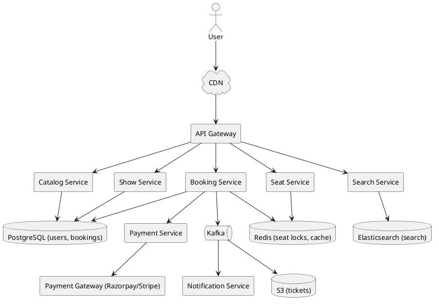
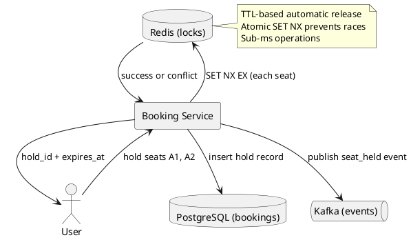
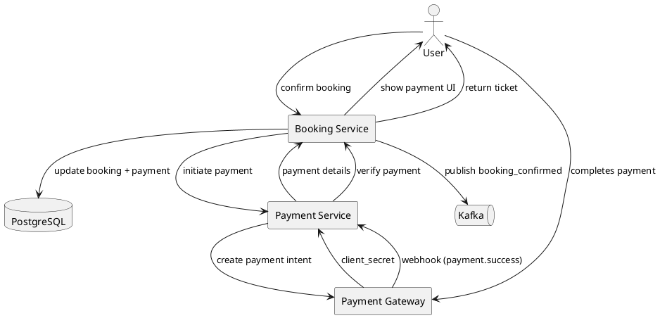
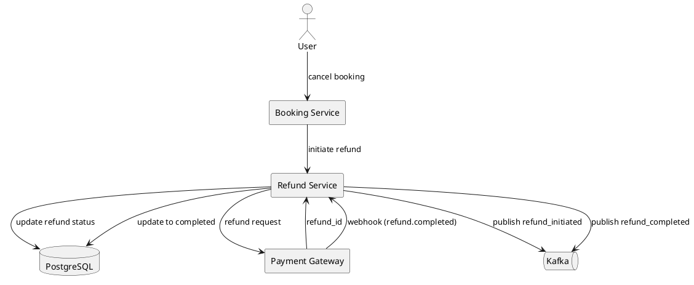
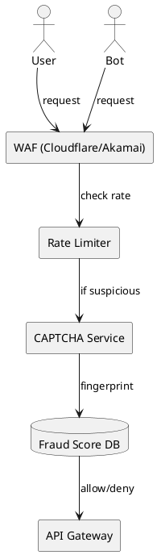
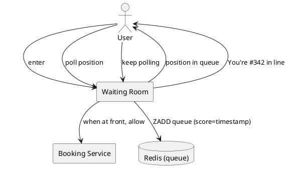

# Show / Ticket Booking

## Problem Statement

Design a ticket booking system like BookMyShow, Ticketmaster, or Fandango. Users browse shows (movies, concerts, plays), see seat availability, select seats, pay, and receive tickets. The system must prevent double-booking, handle high-concurrency on popular shows, and support cancellations and refunds.

**Example:**
```
Movie: "Oppenheimer" at PVR Mumbai, Screen 3
Showtime: Sept 18, 2026, 7:30 PM

User flow:
  1. Browse shows by city, movie, date
  2. Select a show
  3. View seat map (available/booked/held)
  4. Select 2 seats
  5. Seats held for 10 minutes
  6. Pay (UPI/Card/Netbanking)
  7. Booking confirmed, e-ticket emailed

Challenges:
  - 100 users may click the same seat simultaneously
  - Payment may fail after seat selection
  - Users may abandon at payment
  - Cancellations must free seats
  - Premium seats, group discounts, dynamic pricing
```

**Real-world apps:** BookMyShow, Ticketmaster, Fandango, Paytm Insider, PVR Cinemas.

**Why it's interesting:**

- **Seat locking** at scale (high concurrency on popular shows)
- **Payment integration** with retries and idempotency
- **Search** across movies, cities, dates, languages
- **Dynamic pricing** (weekday vs weekend, premium seats)
- **Cancellations and refunds** with money reconciliation
- **Anti-fraud** (scalping prevention, bot detection)

---

## 1. Requirements Clarification

### Functional Requirements
- **Browse**: Movies/shows by city, date, language, genre
- **Theaters**: Multiple screens per theater, seat layouts
- **Showtimes**: Multiple shows per screen per day
- **Seat map**: Visual layout with availability (available/booked/held)
- **Seat selection**: Pick N seats, group them
- **Seat hold**: Reserve seats for a short time (10 min) during payment
- **Booking**: Create booking after payment
- **Payment**: Integration with UPI, cards, netbanking, wallets
- **Ticket**: E-ticket with QR code, PDF
- **Cancellation**: Refund per policy
- **User account**: Bookings history, saved payment methods
- **Search**: By movie name, theater, location
- **Recommendations**: Similar movies, trending

### Non-Functional Requirements
- **Scale**: 50M DAU, 500K shows/day, 5M bookings/day
- **Latency**: Seat map load < 500 ms p99; booking < 2 sec p99
- **Availability**: 99.99% — money and tickets are critical
- **Consistency**: Strong for seat availability (never double-book)
- **Durability**: Never lose a booking (replicated, backed up)
- **Idempotency**: Payment retries must not double-book
- **Fairness**: No seat stolen from another user mid-flow

### Out of Scope
- Movie streaming (that's OTT)
- Theater inventory management (proprietary systems)
- Physical ticket printing (POS terminals)

---

## 2. Back-of-Envelope Estimation

### Traffic

```
Given:
  Movies in catalog         = 10,000 (active)
  Theaters                  = 5,000
  Screens per theater       = 5 (avg)
  Shows per screen per day  = 6
  Total shows/day           = 5,000 x 5 x 6 = 150,000
  Bookings/day              = 5,000,000
  Users browsing/day        = 50,000,000
  
Read:Write ratio:
  Browsing (search + seat map): 50M/day
  Bookings (write):             5M/day
  Ratio: 10:1

Average QPS:
  Reads  = 50M / 86,400 = ~580/sec
  Writes = 5M / 86,400 = ~58/sec

Peak QPS (10x for popular shows - Friday evening):
  Reads  = ~5,800/sec
  Writes = ~580/sec

Seat locking (only during payment):
  Concurrent holds = ~10,000 at peak
  Lock ops/sec = ~500/sec
```

### Storage

```
Catalog:
  Movies: 10K x 5 KB = 50 MB
  Theaters: 5K x 2 KB = 10 MB
  Screens: 25K x 1 KB = 25 MB

Shows:
  150K shows/day x 365 days x 5 years = 273M shows
  Per show: ~500 bytes
  Total: ~137 GB

Seats:
  Seats per screen: ~200
  Total seats: 25K screens x 200 = 5M seats
  Per seat: ~100 bytes
  Total: ~500 MB

Bookings:
  5M/day x 365 x 5 years = 9.125B bookings
  Per booking: ~500 bytes
  Total: ~4.5 TB

Seat reservations (per show):
  150K shows/day x 200 seats = 30M rows
  Row size: ~100 bytes
  Total (30 days): ~90 GB

Payments:
  5M/day x 365 x 5 = 9.125B rows
  Per row: ~300 bytes
  Total: ~2.7 TB

Tickets:
  5M/day x 365 x 5 = 9.125B
  Per ticket: ~1 KB (PDF in S3)
  Total metadata: ~9 TB, files in S3

Total DB: ~20 TB, S3: ~50 TB
```

### Bandwidth

```
Search/browse:
  5,800 reads/sec x 50 KB (page + images) = ~290 MB/sec

Seat map:
  100 reads/sec x 200 KB (large seat map JSON) = ~20 MB/sec

Booking + payment:
  580 writes/sec x 5 KB = ~3 MB/sec

Peak total: ~350 MB/sec = ~2.8 Gbps
Moderate.
```

### Latency Budget

```
Target: < 500 ms p99 for seat map; < 2 sec p99 for booking

Seat map:
  Query:      ~30 ms
  Cache hit:  ~5 ms
  Serialize:  ~20 ms
  Network:    ~50 ms
  Total:      ~100 ms

Booking:
  Auth:            ~20 ms
  Validate seats:  ~30 ms
  Lock seats:      ~50 ms
  Create booking:  ~50 ms
  Payment:         ~500-1500 ms (external)
  Confirm:         ~50 ms
  Return:          ~50 ms
  Total:           ~750-1750 ms

Payment dominates. Can't be reduced below processor latency.
```

### Concurrency Hot Spots

```
Popular show (e.g., "Avengers" opening night):
  Seats: 200
  Concurrent users wanting seats: 10,000
  Contention: 50:1 per seat

Seat locking must handle 500+ lock attempts/sec on hot shows.
```

---

## 3. High-Level Design



### Component Responsibilities

| Component | Role |
|---|---|
| API Gateway | Entry, auth, rate limiting |
| Catalog Service | Movies, theaters, screens |
| Search Service | Full-text + filters |
| Show Service | Showtimes, seat layout templates |
| Seat Service | Seat map, availability, holds |
| Booking Service | Create bookings, orchestrate payment |
| Payment Service | Integrate with payment gateways |
| Notification Service | Email/SMS tickets, reminders |
| PostgreSQL | Bookings, users, shows |
| Redis | Seat locks, hot seat maps, session |
| Elasticsearch | Search index |
| Kafka | Events for async processing |
| S3 | Ticket PDFs, QR codes |

### Why This Architecture

- **Redis** for seat locks (atomic, fast, TTL-based)
- **PostgreSQL** for bookings (ACID, money)
- **Elasticsearch** for search (filters, ranking)
- **Kafka** for async (notifications, analytics, reconciliation)
- **S3** for immutable ticket PDFs (long-term storage)

---

## 4. API Design

### Browse & Search

```http
GET /v1/movies?city=mumbai&language=hindi&genre=action&page=1
GET /v1/movies/{movie_id}
GET /v1/movies/{movie_id}/shows?city=mumbai&date=2026-09-18
GET /v1/theaters/{theater_id}/shows?date=2026-09-18
GET /v1/search?q=oppenheimer&city=mumbai
```

**Response (shows for a movie):**
```json
{
  "movie_id": "mv-123",
  "title": "Oppenheimer",
  "poster_url": "...",
  "language": "English",
  "duration_minutes": 180,
  "shows": [
    {
      "show_id": "sh-456",
      "theater": {
        "theater_id": "th-789",
        "name": "PVR Phoenix Mall",
        "area": "Lower Parel",
        "city": "Mumbai"
      },
      "screen": "Screen 3",
      "start_time": "2026-09-18T19:30:00+05:30",
      "format": "IMAX 2D",
      "language": "English",
      "price_range": {"min": 300, "max": 800},
      "seats_available": 87,
      "total_seats": 200
    }
  ]
}
```

### Seat Map

```http
GET /v1/shows/{show_id}/seats
```

**Response:**
```json
{
  "show_id": "sh-456",
  "screen": "Screen 3",
  "rows": 10,
  "cols": 20,
  "seat_categories": [
    {"name": "Premium", "rows": ["A", "B"], "price": 800},
    {"name": "Gold", "rows": ["C", "D", "E", "F"], "price": 500},
    {"name": "Silver", "rows": ["G", "H", "I", "J"], "price": 300}
  ],
  "seats": [
    {"seat_id": "A1", "status": "available"},
    {"seat_id": "A2", "status": "booked"},
    {"seat_id": "A3", "status": "held", "held_until": "2026-09-17T10:12:00Z"},
    {"seat_id": "A4", "status": "available"}
  ],
  "version": 42
}
```

**Note:** `version` helps clients avoid stale renders.

### Seat Lock (Hold)

```http
POST /v1/shows/{show_id}/seats/hold
Content-Type: application/json
Idempotency-Key: hold-uuid-123

{
  "seat_ids": ["A1", "A2"],
  "session_id": "sess-abc",
  "ttl_seconds": 600
}
```

**Response 200 (locked):**
```json
{
  "hold_id": "hold-xyz",
  "seat_ids": ["A1", "A2"],
  "expires_at": "2026-09-17T10:20:00Z",
  "total_amount_cents": 160000
}
```

**Response 409 (seats unavailable):**
```json
{
  "error": "seats_unavailable",
  "conflicts": [
    {"seat_id": "A2", "status": "booked"}
  ]
}
```

### Confirm Booking (after payment)

```http
POST /v1/bookings
Content-Type: application/json
Idempotency-Key: booking-uuid-456

{
  "hold_id": "hold-xyz",
  "payment_method": "upi",
  "payment_token": "tok_visa_xyz"
}
```

**Response 201:**
```json
{
  "booking_id": "bk-789",
  "show_id": "sh-456",
  "seats": ["A1", "A2"],
  "total_amount_cents": 160000,
  "status": "confirmed",
  "ticket_url": "https://tickets.example.com/bk-789.pdf",
  "qr_code_url": "https://cdn.example.com/qr/bk-789.png",
  "created_at": "2026-09-17T10:15:00Z"
}
```

### Cancel Booking

```http
POST /v1/bookings/{booking_id}/cancel
{
  "reason": "change_of_plan"
}
```

**Response 200:**
```json
{
  "booking_id": "bk-789",
  "status": "cancelled",
  "refund_amount_cents": 128000,
  "refund_status": "processing",
  "refund_eta_days": 5
}
```

---

## 5. Database Design

### Schema (PostgreSQL)

```sql
-- Users
CREATE TABLE users (
    user_id BIGINT PRIMARY KEY,
    email VARCHAR(255) UNIQUE NOT NULL,
    phone VARCHAR(20) UNIQUE,
    name VARCHAR(100),
    created_at TIMESTAMP DEFAULT NOW()
);

-- Movies
CREATE TABLE movies (
    movie_id BIGINT PRIMARY KEY,
    title VARCHAR(500) NOT NULL,
    description TEXT,
    duration_minutes INT,
    language VARCHAR(50),
    genre VARCHAR(100),
    release_date DATE,
    poster_url TEXT,
    trailer_url TEXT,
    rating DECIMAL(3,1),
    status VARCHAR(20) DEFAULT 'active',  -- active, archived
    created_at TIMESTAMP DEFAULT NOW()
);

-- Theaters
CREATE TABLE theaters (
    theater_id BIGINT PRIMARY KEY,
    name VARCHAR(200) NOT NULL,
    chain VARCHAR(100),                  -- PVR, INOX, Cinepolis
    address TEXT,
    city VARCHAR(100) NOT NULL,
    state VARCHAR(100),
    latitude DECIMAL(10, 8),
    longitude DECIMAL(11, 8),
    created_at TIMESTAMP DEFAULT NOW()
);
CREATE INDEX idx_theaters_city ON theaters(city);

-- Screens
CREATE TABLE screens (
    screen_id BIGINT PRIMARY KEY,
    theater_id BIGINT REFERENCES theaters(theater_id),
    name VARCHAR(50),                    -- "Screen 3", "Audi 2"
    rows_count INT,
    cols_count INT,
    seat_layout JSONB,                   -- row-wise seat definitions
    created_at TIMESTAMP DEFAULT NOW()
);
CREATE INDEX idx_screens_theater ON screens(theater_id);

-- Shows
CREATE TABLE shows (
    show_id BIGINT PRIMARY KEY,
    movie_id BIGINT REFERENCES movies(movie_id),
    screen_id BIGINT REFERENCES screens(screen_id),
    theater_id BIGINT REFERENCES theaters(theater_id),   -- denormalized
    start_time TIMESTAMPTZ NOT NULL,
    end_time TIMESTAMPTZ NOT NULL,
    format VARCHAR(50),                  -- 2D, 3D, IMAX
    language VARCHAR(50),
    base_price_cents INT NOT NULL,
    total_seats INT NOT NULL,
    seats_booked INT DEFAULT 0,
    seats_held INT DEFAULT 0,
    status VARCHAR(20) DEFAULT 'active',
    created_at TIMESTAMP DEFAULT NOW()
);
CREATE INDEX idx_shows_movie_time ON shows(movie_id, start_time);
CREATE INDEX idx_shows_theater_time ON shows(theater_id, start_time);
CREATE INDEX idx_shows_time ON shows(start_time);

-- Seat categories per show (dynamic pricing)
CREATE TABLE show_seat_pricing (
    show_id BIGINT REFERENCES shows(show_id),
    category VARCHAR(50),                -- Premium, Gold, Silver
    row_prefix VARCHAR(5),
    price_cents INT NOT NULL,
    PRIMARY KEY (show_id, category)
);

-- Bookings
CREATE TABLE bookings (
    booking_id BIGINT PRIMARY KEY,
    user_id BIGINT NOT NULL,
    show_id BIGINT REFERENCES shows(show_id),
    seats TEXT[] NOT NULL,               -- seat_ids
    total_amount_cents BIGINT NOT NULL,
    status VARCHAR(20) NOT NULL,         -- pending, confirmed, cancelled, refunded
    payment_id VARCHAR(255),
    idempotency_key VARCHAR(255) UNIQUE,
    created_at TIMESTAMP DEFAULT NOW(),
    updated_at TIMESTAMP DEFAULT NOW()
);
CREATE INDEX idx_bookings_user ON bookings(user_id, created_at DESC);
CREATE INDEX idx_bookings_show ON bookings(show_id);
CREATE UNIQUE INDEX idx_bookings_idem ON bookings(idempotency_key);

-- Payments
CREATE TABLE payments (
    payment_id BIGINT PRIMARY KEY,
    booking_id BIGINT REFERENCES bookings(booking_id),
    amount_cents BIGINT NOT NULL,
    currency VARCHAR(3) DEFAULT 'INR',
    gateway VARCHAR(50),                 -- razorpay, stripe, payu
    gateway_txn_id VARCHAR(255),
    method VARCHAR(50),                  -- upi, card, netbanking, wallet
    status VARCHAR(20) NOT NULL,         -- pending, success, failed, refunded
    idempotency_key VARCHAR(255) UNIQUE,
    error_message TEXT,
    created_at TIMESTAMP DEFAULT NOW(),
    completed_at TIMESTAMP
);
CREATE INDEX idx_payments_booking ON payments(booking_id);
CREATE INDEX idx_payments_status ON payments(status);

-- Refunds
CREATE TABLE refunds (
    refund_id BIGINT PRIMARY KEY,
    payment_id BIGINT REFERENCES payments(payment_id),
    amount_cents BIGINT NOT NULL,
    reason VARCHAR(100),
    status VARCHAR(20) NOT NULL,         -- pending, processing, completed, failed
    gateway_refund_id VARCHAR(255),
    created_at TIMESTAMP DEFAULT NOW(),
    completed_at TIMESTAMP
);
CREATE INDEX idx_refunds_payment ON refunds(payment_id);

-- Seat reservations (audit log of locks)
CREATE TABLE seat_reservations (
    reservation_id BIGINT PRIMARY KEY,
    show_id BIGINT REFERENCES shows(show_id),
    seat_id VARCHAR(20) NOT NULL,
    user_id BIGINT NOT NULL,
    booking_id BIGINT,                   -- null until confirmed
    status VARCHAR(20) NOT NULL,         -- held, confirmed, released, expired
    held_until TIMESTAMPTZ,
    created_at TIMESTAMP DEFAULT NOW()
);
CREATE INDEX idx_reservations_show_seat ON seat_reservations(show_id, seat_id);
CREATE INDEX idx_reservations_user ON seat_reservations(user_id);
```

### Redis Data Structures (Seat Locks)

```
Key: show:{show_id}:seats:available    # Set of available seat IDs
Key: show:{show_id}:seats:booked       # Set of booked seat IDs
Key: seat:{show_id}:{seat_id}          # Lock with TTL

For each lock:
  SET seat:sh-456:A1 "user-12345:hold-xyz" EX 600 NX
```

**Seat locking algorithm:**
```
For each seat_id in requested_seats:
  result = SET seat:{show_id}:{seat_id} {holder} NX EX 600
  If any result == nil:
    → Conflict (already held/booked)
    → Rollback: DEL all previously acquired locks
    → Return 409 to user
  Else:
    → Lock acquired

After all seats locked:
  → Create hold record in DB (audit)
  → Return hold_id + expires_at
```

**Atomicity:** Redis SET NX is atomic per key. Multi-seat locks are not atomic across keys — we roll back on partial failure.

### Redis Optimization: Lua Script

To make multi-seat locks atomic:

```lua
-- KEYS = [seat keys]
-- ARGV = [holder, ttl_seconds]

local holder = ARGV[1]
local ttl = tonumber(ARGV[2])

-- First pass: check all are available
for i, key in ipairs(KEYS) do
    if redis.call('EXISTS', key) == 1 then
        return {err = 'SEAT_TAKEN', seat = key}
    end
end

-- Second pass: acquire all
for i, key in ipairs(KEYS) do
    redis.call('SET', key, holder, 'EX', ttl)
end

return {ok = 'LOCKED'}
```

Call with `EVAL script numkeys seat1 seat2 seat3 holder ttl`.

This makes the whole multi-seat lock atomic.

---

## 6. Deep Dive: Seat Locking (The Core Problem)

### Why This Is Hard

**Problem 1: Double-booking**
100 users try to book the same seat at the same time. Only one should succeed.

**Problem 2: Payment failures**
User holds seats, payment fails, seats must be released.

**Problem 3: Abandonment**
User holds seats, closes app, seats must be released eventually.

**Problem 4: Race conditions in distributed systems**
Multiple API servers → need a shared source of truth.

### Solution: Redis-Based Distributed Lock with TTL



**Lock lifecycle:**
1. **Acquire**: User selects seats → Redis SET NX
2. **Extend**: Optional; user can extend hold by 5 min
3. **Confirm**: After payment → migrate lock to booking (permanent)
4. **Release**: On payment failure, user cancel, or TTL expiry

### TTL Strategy

- **Default TTL**: 10 minutes
- **Why 10 min?** Enough for payment flow (UPI, card, netbanking)
- **Too short**: Users lose seats during slow payments
- **Too long**: Seats locked unnecessarily, reducing availability

**Best practice:**
- Initial hold: 10 min
- After user enters payment details: extend to 15 min
- After payment initiated: extend to 20 min (allow network delays)

### Auto-Release Mechanism

Redis TTL handles this automatically. Additional safeguards:
- **Background worker**: Scans for expired holds, cleans up DB records
- **Lazy cleanup**: On seat map read, filter out expired locks
- **Kafka event**: When hold expires, publish event for reconciliation

### Handling Concurrent Holds

```
User A clicks A1 at T=0.000
User B clicks A1 at T=0.001

Redis receives both commands.
  First SET NX -> success (A)
  Second SET NX -> nil (B)
  
B gets 409 Conflict immediately.
```

**Response time:** < 1 ms for the lock attempt.

### Reservation vs Booking

- **Reservation (hold)**: Temporary lock, TTL-based, in Redis + DB
- **Booking**: Permanent, in PostgreSQL, after successful payment

**Migration:**
```
On payment success:
  1. Update seat_reservations: status = 'confirmed'
  2. Insert into bookings
  3. Delete Redis lock (or set to 'booked' with long TTL)
  4. Publish booking_confirmed event
```

### Handling Redis Failure

**If Redis goes down:**
- **During normal operation**: Booking service falls back to PostgreSQL-based locking (slower but works)
- **Locks lost**: All holds vanish; users must re-select
- **Mitigation**: Redis Sentinel with automatic failover (~10 sec)

**If Redis is slow:**
- Timeout after 100 ms
- Fall back to PostgreSQL `SELECT FOR UPDATE` (slower but reliable)
- Alert ops

### Concurrency Test

```
10,000 concurrent users try to book 100 seats:
  Redis handles 10,000 SET NX ops/sec easily
  100 users succeed, 9,900 fail fast
  Time: ~100 ms total
```

**Redis SET NX is ~100K ops/sec per shard.** Even a hot show is trivial.

---

## 7. Deep Dive: Payment Integration

### Why Payment Is Tricky

- **External dependency**: Payment gateway can fail, timeout, or behave unexpectedly
- **Money is involved**: Cannot double-charge or lose money
- **Idempotency**: Retries must not double-charge
- **Reconciliation**: DB and gateway must eventually agree
- **Timeouts**: User may pay but not receive confirmation

### Payment Flow



### Payment States

```
PENDING      → User initiated, waiting for completion
PROCESSING   → Gateway received, awaiting confirmation
SUCCESS      → Payment confirmed, booking confirmed
FAILED       → Gateway rejected (insufficient funds, etc.)
CANCELLED    → User cancelled before completion
REFUNDED     → Money returned after cancellation
```

### Idempotency in Payment

**Client sends idempotency key** with each payment request:
```
Idempotency-Key: pay-uuid-abc-123
```

**Server behavior:**
- First request: process payment
- Retry with same key: return cached response
- Different key for same booking: create second payment (rare)

**Storage:**
```sql
CREATE TABLE idempotency_keys (
    key VARCHAR(255) PRIMARY KEY,
    request_hash VARCHAR(64),   -- SHA-256 of request body
    response TEXT,              -- cached response
    created_at TIMESTAMP DEFAULT NOW()
);
CREATE INDEX idx_idem_created ON idempotency_keys(created_at);
```

Expire keys after 24 hours.

### Webhook Handling

Payment gateways send webhooks for async confirmation:

```http
POST /webhooks/payment
Content-Type: application/json
X-Razorpay-Signature: abc123...

{
  "event": "payment.captured",
  "payload": {
    "payment": {
      "id": "pay_xyz",
      "order_id": "order_abc",
      "amount": 160000,
      "status": "captured"
    }
  }
}
```

**Steps:**
1. Verify signature (HMAC-SHA256 with gateway secret)
2. Look up payment by gateway order ID
3. If status is `captured` and local status is `pending`:
   - Update payment to `success`
   - Confirm booking
   - Release seat locks (permanent)
   - Send ticket
4. Return 200 to acknowledge

**Idempotency:** Webhooks may be sent multiple times. Use `payment_id` from gateway to dedupe.

### Handling Payment Timeout

```
T=0:   User initiates payment
T=30s: No response from gateway
       Booking Service marks payment as 'processing'
       User sees "Payment is being verified..."
T=60s: User refreshes page
       System shows booking as 'processing'
T=90s: Webhook arrives with success
       Booking confirmed, ticket sent
```

**User experience:** Show "processing" state; don't fail immediately.

**Fallback:** If no webhook in 5 min, query gateway for status.

### Refunds



**Refund policy:**
- > 24 hours before show: full refund
- 2-24 hours before: 50% refund
- < 2 hours: no refund

**Refund processing:**
- Refunds take 5-7 business days (banking system)
- Show estimated refund date to user
- Async — don't block user

### Handling Payment Failures

- **Gateway says failed**: Update payment, release seat locks, notify user
- **Gateway says pending but no webhook**: Query gateway after 5 min
- **Gateway unreachable**: Retry with exponential backoff (3 attempts)
- **User cancelled**: Release locks

**Reconciliation job:**
- Every 5 min, find payments stuck in `processing` > 10 min
- Query gateway for actual status
- Update local state accordingly

---

## 8. Deep Dive: Dynamic Pricing

### Why Dynamic Pricing

- **Peak demand**: Weekend evenings, holidays, blockbuster releases
- **Off-peak**: Weekday mornings, older movies
- **Premium seats**: Recliner, IMAX, 4DX
- **Early bird**: Advance booking discounts

### Pricing Structure

```json
{
  "show_id": "sh-456",
  "base_price_cents": 30000,
  "categories": [
    {"name": "Premium", "rows": ["A", "B"], "multiplier": 2.5},
    {"name": "Gold",    "rows": ["C", "D"], "multiplier": 1.6},
    {"name": "Silver",  "rows": ["E", "F"], "multiplier": 1.0}
  ],
  "time_multiplier": 1.2,       // weekday evening
  "demand_multiplier": 1.1,     // moderate demand
  "discounts": [
    {"type": "student", "percent": 10},
    {"type": "senior", "percent": 15}
  ]
}
```

**Final price** = base × category × time × demand × (1 - discount).

### Demand-Based Pricing

Real-time demand tracking:
```
Demand score = (seats_booked + 2 × seats_held) / total_seats

If demand_score > 0.8: multiplier = 1.5
If demand_score > 0.5: multiplier = 1.2
If demand_score < 0.2: multiplier = 0.9 (discount)
```

**Caution:** Avoid pricing that scares users away. Cap the multiplier.

### Anti-Gouging Rules

- **Max multiplier**: 2.5x base (transparent to users)
- **Minimum multiplier**: 0.7x base
- **No change after hold**: Price locked when user selects seat
- **Regulatory compliance**: Some regions ban surge pricing

### Group Discounts

```
3-5 tickets: 5% off
6-10 tickets: 10% off
11+ tickets: 15% off
```

Applied at checkout, per booking.

### Loyalty Pricing

```
Bronze: 1x base
Silver: 5% off
Gold:   10% off
Platinum: 15% off + free upgrade
```

Tied to user loyalty tier.

---

## 9. Deep Dive: Search

### Search Requirements

- **By movie**: "Oppenheimer"
- **By city**: "mumbai"
- **By date**: "today", "tomorrow", "this weekend"
- **By theater**: "PVR Phoenix"
- **By language**: "hindi", "english"
- **By genre**: "action", "comedy"
- **Filters**: price range, format (2D/3D/IMAX), rating

### Elasticsearch Index

```json
{
  "mappings": {
    "properties": {
      "movie_id": {"type": "keyword"},
      "title": {"type": "text", "analyzer": "standard"},
      "description": {"type": "text"},
      "genres": {"type": "keyword"},
      "language": {"type": "keyword"},
      "release_date": {"type": "date"},
      "rating": {"type": "float"},
      "poster_url": {"type": "keyword"},
      "theaters": {
        "type": "nested",
        "properties": {
          "theater_id": {"type": "keyword"},
          "name": {"type": "text"},
          "city": {"type": "keyword"},
          "area": {"type": "keyword"},
          "location": {"type": "geo_point"},
          "shows": {
            "type": "nested",
            "properties": {
              "show_id": {"type": "keyword"},
              "start_time": {"type": "date"},
              "format": {"type": "keyword"},
              "min_price": {"type": "integer"},
              "seats_available": {"type": "integer"}
            }
          }
        }
      }
    }
  }
}
```

### Query Examples

**Find shows for a movie in a city today:**
```json
{
  "query": {
    "bool": {
      "must": [
        {"match": {"title": "Oppenheimer"}},
        {"term": {"theaters.city": "mumbai"}},
        {"range": {"theaters.shows.start_time": {
          "gte": "2026-09-18T00:00:00+05:30",
          "lte": "2026-09-18T23:59:59+05:30"
        }}}
      ]
    }
  }
}
```

**Find nearby theaters:**
```json
{
  "query": {
    "geo_distance": {
      "distance": "5km",
      "theaters.location": {
        "lat": 19.0760,
        "lon": 72.8777
      }
    }
  }
}
```

### Ranking

**Default ranking:**
1. Exact title matches first
2. Then by rating (higher first)
3. Then by popularity (booking count)
4. Then by release date (newer first)

**Personalized ranking:**
- User's past preferences (genre, language, theater)
- Collaborative filtering (similar users)
- Location relevance (nearby theaters)

### Search Suggestions

As user types:
- Autocomplete movie titles
- Suggest theaters
- Suggest genres
- Suggest cities

**Implementation:** Elasticsearch completion suggester (edge-n-gram analyzer).

### Search Cache

Popular searches cached in Redis:
```
Key: search:{hash of query+user+city}
Value: JSON results
TTL: 5 minutes
```

**Why:** Popular searches (same movie, same city) benefit from caching.

### Indexing Strategy

- **Movies**: Index when added/updated
- **Shows**: Index per day; add shows in rolling window (next 7 days)
- **Theaters**: Index when added/updated
- **Reindexing**: Blue-green index swap for schema changes

### Index Size

```
10K movies x ~10 theaters each x 6 shows/day x 30 days
= 18M documents
Per document: ~2 KB
Total: ~36 GB (fits in a small cluster)
```

---

## 10. Deep Dive: Anti-Fraud and Scalping Prevention### The Problem

Scalpers buy up all tickets, resell at 10x. Users can't get seats.

### Prevention Strategies

**1. Rate Limiting**
- Max 6 tickets per user per show
- Max 10 bookings per hour per user
- Max 20 per day per user

**2. CAPTCHA**
- Challenge suspicious traffic
- Invisible CAPTCHA (reCAPTCHA v3)
- Trigger on rapid actions

**3. Device Fingerprinting**
- Track device ID
- Detect multiple accounts on one device
- Flag suspicious patterns

**4. Payment Method Limits**
- Same card can't be used for > N bookings
- Reject virtual/disposable cards (if policy)

**5. Behavior Analysis**
- Bots book in seconds; humans take 30+ sec
- Bots always pick same seats
- Bots don't view pages before booking

**6. Verified Identity**
- Phone verification (OTP)
- Aadhaar/KYC for high-demand shows
- Limit to verified accounts

**7. Lottery System**
- For ultra-high-demand shows (concerts)
- Register intent, random draw
- Fair to real fans

**8. Seat Binding**
- Tickets tied to user identity
- Name printed on ticket
- ID check at entry (prevents resale)

### Bot Detection



**Risk score:** Combination of IP reputation, device, behavior, velocity.

### Handling Scalping on Secondary Market

**Approach 1: Ignore** (not our problem)
**Approach 2: Compete** (official resale platform)
**Approach 3: Prevent** (name-bound tickets, no transfer)

**Recommendation:** Name-bound tickets for high-demand shows. Official resale at face value for others.

---

## 11. Scaling Considerations

### Read Scaling

- **CDN**: Movie posters, static content
- **Redis**: Seat maps, search cache, session
- **Read replicas**: PostgreSQL for show queries
- **Elasticsearch**: Search (naturally distributed)

### Write Scaling

**Writes are moderate (58/sec average, ~580/sec peak)** — PostgreSQL handles this.

If scale demands:
- **Shard by `show_id`**: All data for a show on one shard
- **Shard bookings by `user_id`**: User's history is local
- **Time-based partitioning**: Bookings partitioned by month

### Hot Show Handling

**Problem:** "Avengers" opening day — 100K concurrent users, 200 seats per show.

**Mitigations:**
1. **Virtual waiting room**: Queue users before allowing access
2. **Rate limiting**: Strict per-IP, per-user limits
3. **Redis sharding**: Seat locks on multiple Redis nodes
4. **Read-only fallback**: Cache seat maps; serve stale
5. **Queue system**: FIFO queue for booking entry

### Virtual Waiting Room (VWR)



**How it works:**
- All users enter the waiting room
- Served in batches (e.g., 100 users every 30 sec)
- When it's your turn, you get a token to access booking
- Token valid for 10 min; then you go back to end of queue

**Benefits:**
- Protects backend from thundering herd
- Fairness (first come, first served)
- Transparent (users see their position)

### Multi-Region

**Data residency:** Users' bookings in their region.

**Challenge:** Show is physical (theater in Mumbai); bookings from anywhere.

**Approach:** Theater's region owns the show. Bookings from other regions query the theater's region.

**Trade-off:** Higher latency for cross-region booking. Usually acceptable (booking is not latency-critical).

### Caching Strategy

| Data | Cache | TTL | Invalidation |
|---|---|---|---|
| Movie catalog | Redis | 1 hour | On movie update |
| Show list | Redis | 5 min | On show update |
| Seat map | Redis | 30 sec | On seat lock/book |
| Search results | Redis | 5 min | TTL only |
| User profile | Redis | 15 min | On profile update |
| Theater info | Redis | 1 hour | On theater update |

**Seat map cache is tricky:** Must be near-real-time. Invalidate on any seat change.

**Better approach:** Don't cache full seat map. Cache per-seat status with short TTL.

---

## 12. Bottlenecks and Trade-offs

| Concern | Solution | Trade-off |
|---|---|---|
| Seat locking | Redis SET NX + TTL | Redis SPOF |
| Double booking | Atomic locks + DB constraint | Complexity |
| Payment failure | Idempotency + reconciliation | Extra state |
| Hot shows | Virtual waiting room | UX complexity |
| Search | Elasticsearch | Index sync lag |
| Dynamic pricing | Real-time demand score | Complexity, UX risk |
| Cancellations | Refund pipeline | 5-7 day delay |
| Scalping | Rate limit + CAPTCHA | Can hurt legit users |
| Multi-region | Region-owns-show | Cross-region latency |
| Seat map freshness | Short cache + event invalidation | Cache misses |

### Design Decisions Summary

| Decision | Choice | Rationale |
|---|---|---|
| Seat locking | Redis SET NX + TTL + Lua | Atomic, fast, auto-release |
| Primary DB | PostgreSQL | ACID for bookings |
| Search | Elasticsearch | Full-text + geo |
| Payment | Gateway webhooks + idempotency | Reliable, retriable |
| Refund | Async pipeline | User-friendly |
| Pricing | Base × category × time × demand | Dynamic |
| Hot shows | Virtual waiting room | Protects backend |
| Scalping | Rate limit + CAPTCHA + name-bound | Multi-layered |
| Multi-region | Region-owns-show | Data locality |
| Caching | Redis with short TTL | Fresh seat maps |

---

## 13. Failure Scenarios

### Redis Down (Seat Locks Unavailable)

**Impact:** Users can't hold seats.

**Mitigation:**
- Fall back to PostgreSQL `SELECT FOR UPDATE` (slower)
- Redis Sentinel for fast failover (~10 sec)
- Alert ops immediately

### Payment Gateway Down

**Impact:** Users can't complete bookings.

**Mitigation:**
- Switch to backup gateway (Razorpay + PayU)
- Users retain holds during incident
- Extend hold TTL during outage
- Notify users via banner

### Database Primary Down

**Impact:** All writes fail.

**Mitigation:**
- Multi-AZ failover (~30 sec)
- Reads served from replicas
- Booking service queues writes
- Alert ops

### Show Overbooking

**Impact:** More bookings than seats (bug or concurrency).

**Mitigation:**
- DB constraint: bookings per show ≤ total_seats
- Reconciliation job detects overbooking
- Refund + apology to affected users
- Post-mortem

### Payment Succeeds But Booking Fails

**Impact:** User charged but no ticket.

**Mitigation:**
- Idempotency: retry booking with same key
- Kafka event replayed
- Reconciliation job matches payments to bookings
- Auto-refund if not resolvable

### Seat Map Stale

**Impact:** User selects a seat that's already booked.

**Mitigation:**
- Short cache TTL (30 sec)
- Real-time seat status via WebSocket
- Optimistic UI with confirm on booking

### Virtual Waiting Room Bug

**Impact:** Users stuck in queue, can't book.

**Mitigation:**
- Bypass queue for emergency
- Monitor queue depth
- Kill switch to disable VWR
- Fallback to rate limiting only

### Refund Processing Stuck

**Impact:** Users don't get money back.

**Mitigation:**
- Reconciliation job queries gateway
- Escalate to manual processing after 7 days
- Customer support visibility

### Search Index Out of Sync

**Impact:** Users see outdated results.

**Mitigation:**
- CDC (change data capture) from PostgreSQL to Elasticsearch
- Full reindex weekly
- Detect drift; alert if > 1% mismatch

---

## 14. Monitoring and Alerts

### Key Metrics

| Metric | Target | Alert Threshold |
|---|---|---|
| Seat map p99 | < 500 ms | > 1.5 sec |
| Booking p99 | < 2 sec | > 5 sec |
| Seat lock success rate | > 99% | < 95% |
| Payment success rate | > 95% | < 90% |
| Refund completion rate | > 99% | < 95% |
| Redis lock latency p99 | < 5 ms | > 20 ms |
| Search p99 | < 300 ms | > 1 sec |
| Cache hit ratio (seats) | > 90% | < 80% |
| Overbooking incidents | 0 | > 0 |
| Payment reconciliation errors | 0 | > 0 |

### Dashboards

- **Traffic**: Searches, seat views, holds, bookings
- **Latency**: p50/p95/p99 per endpoint
- **Conversion**: View → hold → book funnel
- **Revenue**: Bookings, cancellations, refunds
- **Inventory**: Seats available per show, occupancy rate
- **Payments**: Success rate by gateway, failures by reason
- **Fraud**: Blocked attempts, scalper detections
- **Infrastructure**: Redis, PostgreSQL, Elasticsearch health

### Alerts

- **P0**: Overbooking detected, payment reconciliation mismatch, Redis down
- **P1**: Payment success rate < 90%, p99 latency > 5 sec
- **P2**: Cache hit ratio < 80%, search index out of sync
- **P3**: Refund processing delayed, high fraud rate

### Business Metrics

- **Occupancy rate** per show, per theater
- **Average booking value** per user
- **Cancellation rate** (unusually high = fraud signal)
- **Repeat customers** (loyalty)
- **Abandoned holds** (funnel drop-off)

---

## 15. Cost Estimation

Rough monthly cost (AWS, us-east-1) for 50M DAU:

| Component | Spec | Cost/month |
|---|---|---|
| API servers | 50 x c6g.large | ~$3,000 |
| PostgreSQL | 8 shards x db.r6g.4xlarge | ~$35,000 |
| Read replicas | 16 x db.r6g.2xlarge | ~$35,000 |
| Redis cluster | 20 x cache.r6g.2xlarge | ~$10,000 |
| Elasticsearch | 6 x r6g.xlarge | ~$1,800 |
| Kafka (MSK) | 3 brokers | ~$1,200 |
| S3 (tickets, posters) | 100 TB | ~$2,500 |
| CDN | 20 TB/month | ~$2,000 |
| Monitoring | Datadog | ~$10,000 |
| Payment gateway fees | ~1.8% of GMV | ~$10,000+ |
| **Total** | | **~$110,000/month** |

**Cost optimization:**
- Reserved instances (30-40% savings)
- Right-size shards
- Tiered storage (S3 Glacier for old tickets)
- Negotiate payment gateway rates at scale

**Revenue note:** Payment gateway fees dominate variable costs. Negotiating these is critical at scale.

---

## 16. Extensions and Follow-ups

### Group Booking

- Book multiple seats in one transaction
- Group discounts (5-15%)
- Split payment across group members
- Shared itinerary

### Seat Selection UI

- Interactive seat map (WebGL for large screens)
- 3D seat preview (premium experience)
- Filter by category (recliner, aisle, etc.)
- Real-time availability via WebSocket

### Recommendations

- "You might also like" (based on history)
- "Popular in Mumbai"
- "Coming soon"
- "Because you liked X"

**Implementation:** Collaborative filtering + content-based.

### Loyalty Program

- Points per booking
- Tier upgrades (Bronze → Platinum)
- Free upgrades
- Priority booking for popular shows

### Subscription

- Monthly pass for N movies
- A-List, MoviePass-style
- Recurring payment
- Usage tracking

### Food & Beverage Pre-order

- Order snacks when booking
- Skip the line at theater
- Combined payment

### Cancellation & Exchange

- Exchange ticket for another showtime
- Partial refund on exchange
- Waitlist for sold-out shows

### Theater Integration

- Real-time seat availability from theaters
- POS integration
- Sync with theater management systems

### Cross-Sell

- Book cab to theater (Uber integration)
- Nearby restaurants
- Post-movie dining deals

### Analytics for Theaters

- Demand forecasting
- Optimal pricing recommendations
- Show scheduling optimization
- Seat category mix

### Accessibility

- Wheelchair-accessible seats
- Companion seats
- Audio-described shows
- Closed captioning

### COVID-Era Features (Legacy)

- Seat spacing (alternate seats blocked)
- Capacity limits (50% max)
- Health check
- Contact tracing

Most have been removed but infrastructure may remain.

---

## 17. Summary

| Aspect | Decision |
|---|---|
| Seat locking | Redis SET NX + TTL + Lua atomicity |
| Primary DB | PostgreSQL (sharded by show_id) |
| Search | Elasticsearch (geo + full-text) |
| Payment | Gateway webhooks + idempotency |
| Refund | Async pipeline (5-7 days) |
| Pricing | Base × category × time × demand |
| Hot shows | Virtual waiting room |
| Scalping | Rate limit + CAPTCHA + name-bound |
| Multi-region | Region-owns-show |
| Scale | 5M bookings/day, 500K shows/day |
| Latency | < 500 ms seat map, < 2 sec booking |
| Availability | 99.99% |
| Cost | ~$110K/month for 50M DAU |

**Key takeaways:**

- **Seat locking is the core problem** — Redis SET NX + TTL solves it elegantly
- **Atomic multi-seat locks via Lua** prevent partial failures
- **TTL-based auto-release** prevents deadlocks from abandonment
- **Idempotency keys are mandatory** for payment retries
- **Webhook + reconciliation** handles async payment confirmation
- **Virtual waiting room** protects against thundering herds on hot shows
- **Dynamic pricing** with caps avoids user backlash
- **Anti-scalping** requires multiple layers (rate limit, CAPTCHA, name-bound)
- **Refunds are async** — don't block the user
- **Multi-region by show** keeps booking data close to the theater

**Similar Pattern Problems:**

- Hospital Appointment Booking (time-based resource locking)
- Calendar / Scheduling (time-based availability)
- Flight / Railway Booking (inventory + seat locking)
- E-Commerce Checkout (payment + inventory)
- Ride Booking (real-time resource allocation)
- Hotel Booking (room inventory, similar to seats)