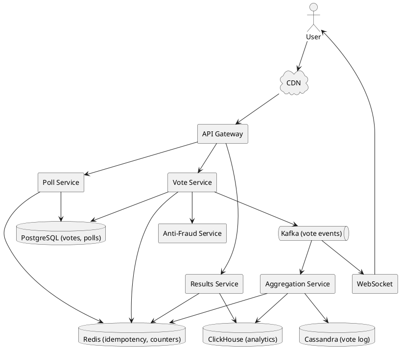
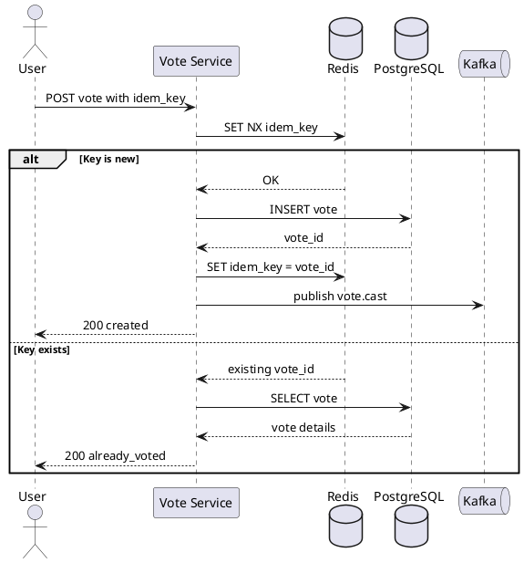
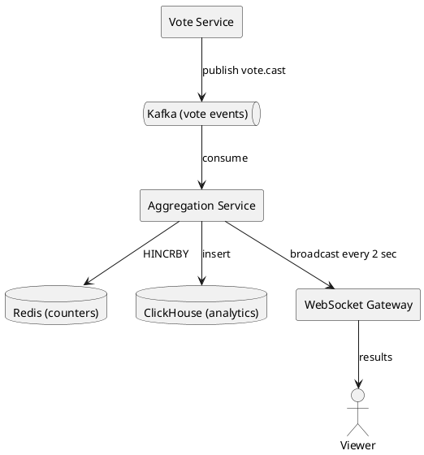

# Voting / Polling System

## Problem Statement

Design a voting and polling system like Reddit upvotes, Twitter polls, or election platforms. Users cast votes on posts, comments, polls, or candidates. The system must prevent duplicate votes, prevent fraud, scale to millions of concurrent votes, and provide real-time or near-real-time results.

**Example:**
```
Reddit-style voting:
  Post: "What's your favorite language?"
  Alice upvotes -> count: 1
  Bob upvotes   -> count: 2
  Alice downvotes (changes her mind) -> count: 1
  Alice tries to upvote again -> ignored (already voted)

Twitter poll:
  "Which framework should we use?" [React / Vue / Svelte]
  Alice votes "React" -> 1
  Alice tries to vote "Vue" -> rejected (one vote per poll)

Election:
  Presidential election — 100M voters
  Each can vote once
  Results must be accurate, auditable, tamper-proof
  Real-time dashboards for news networks
```

**Real-world systems:** Reddit, Twitter polls, Stack Overflow, Hacker News, Election systems, Doodle.

**Why it's interesting:**
- **Idempotency** — same user voting twice should not double-count
- **Fraud prevention** — bot voting, Sybil attacks, double voting
- **Eventual consistency** — vote counts can lag slightly
- **Auditability** — every vote must be traceable (elections)
- **Real-time aggregation** — dashboards update every few seconds
- **Hot content** — viral posts get 100K+ votes/min
- **Vote changing** — user changes mind; system must handle

---

## 1. Requirements Clarification

### Functional Requirements
- **Vote**: Upvote/downvote (Reddit), single-choice poll, multi-choice poll
- **Unvote**: Remove a vote
- **Change vote**: Switch from up to down (or vice versa)
- **View results**: Aggregate count per option
- **Poll creation**: User creates poll with options, duration
- **Results visibility**: Show counts immediately, or after poll ends (blind polls)
- **Comments**: On Reddit-style voting, comments have votes too
- **History**: User's vote history
- **Notifications**: Notify creator when vote milestones reached
- **Anti-fraud**: Prevent duplicate voting, bot voting

### Non-Functional Requirements
- **Scale**: 500M users, 10B votes total, 50M polls, 100K votes/sec peak
- **Latency**: Vote < 100 ms p99; results < 200 ms p99
- **Availability**: 99.99% — voting must always work
- **Consistency**: Eventual for counts (5-10 sec lag acceptable); strong for idempotency
- **Accuracy**: Vote count must never decrease (except unvote)
- **Idempotency**: Same user + same poll = one vote
- **Fraud resistance**: Rate limiting, CAPTCHA, account verification
- **Auditability** (elections): Every vote is verifiable

### Out of Scope
- Blockchain-based voting (overkill for most cases)
- Physical voting infrastructure
- Voter registration systems (elections)
- Election law compliance (jurisdiction-specific)

---

## 2. Back-of-Envelope Estimation

### Traffic

```
Given:
  Users                = 500,000,000
  DAU                  = 100,000,000
  Votes/day            = 200,000,000
  Polls/day            = 5,000,000
  Reads (view results) = 2,000,000,000/day
  Peak multiplier      = 5x

Average QPS:
  Votes  = 200M / 86,400 = ~2,315/sec
  Reads  = 2B / 86,400 = ~23,148/sec
  Polls  = 5M / 86,400 = ~58/sec

Peak QPS (major event, viral post):
  Votes  = ~11,500/sec (average case)
  Votes  = ~100,000/sec (extreme case: election night, viral moment)
  Reads  = ~115,000/sec

Read:Write ratio = 10:1 (but with hot spots on viral content)
```

### Storage

```
Votes table:
  10B votes x 100 bytes = ~1 TB

Poll metadata:
  50M polls x 2 KB = ~100 GB

Poll options:
  50M polls x 5 options x 200 bytes = ~50 GB

Comments (if Reddit-style):
  10B comments x 500 bytes = ~5 TB

User vote history:
  500M users x 1000 votes each x 50 bytes = ~25 TB
  (Usually a subset of votes table, indexed by user_id)

Aggregates (materialized counts):
  10B posts x 50 bytes = ~500 GB

Total DB: ~7 TB raw, ~21 TB with replication
```

### Bandwidth

```
Write bandwidth (votes):
  11,500 x 100 bytes = ~1 MB/sec
  Peak (100K/sec) = ~10 MB/sec

Read bandwidth (results):
  115,000 x 1 KB = ~115 MB/sec = ~920 Mbps

Peak: ~1 Gbps
Small.
```

### Latency Budget

```
Vote:
  Client -> API:       ~30 ms
  Auth:                ~20 ms
  Idempotency check:   ~10 ms (Redis)
  Write vote:          ~20 ms
  Publish event:       ~5 ms (Kafka)
  Return:              ~30 ms
  Total:               ~115 ms

Results:
  Read cache:          ~5 ms
  Read DB (miss):      ~30 ms
  Serialize:           ~10 ms
  Return:              ~50 ms
  Total:               ~65 ms
```

### Hot Spot Analysis

```
A viral post may get 100,000 votes/min.
That's ~1,667 votes/sec on a single poll_id.

If all writes go to the same DB row -> contention.

Solution: Shard counters or use CRDT-like approach.
```

---

## 3. High-Level Design



### Component Responsibilities

| Component | Role |
|---|---|
| API Gateway | Entry, auth, rate limit |
| Vote Service | Handle cast/uncast/change vote |
| Poll Service | Create/manage polls |
| Aggregation Service | Consume vote events, update counts |
| Results Service | Read aggregated counts |
| Anti-Fraud Service | Detect bots, Sybil attacks |
| PostgreSQL | Durable vote storage |
| Redis | Idempotency, hot counters, cache |
| Kafka | Event stream for aggregation |
| Cassandra | Append-only vote log (audit) |
| ClickHouse | Analytics, historical aggregates |
| WebSocket | Real-time result updates |

### Why This Architecture

- **Redis** for idempotency (fast SET NX) and hot counters (INCR)
- **PostgreSQL** for durable vote records (ACID)
- **Kafka** decouples write from aggregation (async)
- **Cassandra** for append-only audit log (high write throughput)
- **ClickHouse** for analytical queries (aggregations over billions)
- **WebSocket** for live results (elections, viral polls)

---

## 4. API Design

### Cast Vote

```http
POST /v1/polls/{poll_id}/votes
Content-Type: application/json
Idempotency-Key: 550e8400-e29b-41d4-a716-446655440000

{
  "option_id": "opt-2",
  "vote_type": "single"      // or "upvote"/"downvote" for Reddit-style
}
```

**Response 200 (new vote):**
```json
{
  "vote_id": "v-789",
  "poll_id": "poll-123",
  "option_id": "opt-2",
  "status": "recorded",
  "counts": {"opt-1": 42, "opt-2": 57, "opt-3": 12}
}
```

**Response 200 (already voted, idempotent):**
```json
{
  "vote_id": "v-789",
  "status": "already_voted",
  "option_id": "opt-2",
  "counts": {"opt-1": 42, "opt-2": 57, "opt-3": 12}
}
```

**Response 409 (different option, needs change):**
```json
{
  "error": "vote_conflict",
  "message": "Already voted for opt-1. Use PUT to change.",
  "current_option": "opt-1"
}
```

### Change Vote

```http
PUT /v1/polls/{poll_id}/votes
Content-Type: application/json

{
  "option_id": "opt-3"
}
```

**Response 200:**
```json
{
  "poll_id": "poll-123",
  "option_id": "opt-3",
  "previous_option": "opt-2",
  "status": "changed",
  "counts": {"opt-1": 42, "opt-2": 56, "opt-3": 13}
}
```

### Retract Vote

```http
DELETE /v1/polls/{poll_id}/votes
```

**Response 200:**
```json
{
  "poll_id": "poll-123",
  "status": "retracted",
  "counts": {"opt-1": 42, "opt-2": 55, "opt-3": 12}
}
```

### Create Poll

```http
POST /v1/polls
Content-Type: application/json

{
  "question": "Which framework should we use?",
  "options": [
    {"id": "opt-1", "text": "React"},
    {"id": "opt-2", "text": "Vue"},
    {"id": "opt-3", "text": "Svelte"}
  ],
  "poll_type": "single",
  "max_choices": 1,
  "results_visibility": "immediate",
  "starts_at": "2026-09-17T10:00:00Z",
  "ends_at": "2026-09-24T10:00:00Z"
}
```

**Response 201:**
```json
{
  "poll_id": "poll-123",
  "question": "Which framework should we use?",
  "options": [...],
  "created_at": "2026-09-17T10:00:00Z",
  "status": "active"
}
```

### Get Results

```http
GET /v1/polls/{poll_id}/results
```

**Response 200:**
```json
{
  "poll_id": "poll-123",
  "total_votes": 111,
  "options": [
    {"option_id": "opt-1", "text": "React", "votes": 42, "percentage": 37.8},
    {"option_id": "opt-2", "text": "Vue",   "votes": 57, "percentage": 51.4},
    {"option_id": "opt-3", "text": "Svelte","votes": 12, "percentage": 10.8}
  ],
  "updated_at": "2026-09-17T10:15:00Z"
}
```

### Get User's Vote

```http
GET /v1/polls/{poll_id}/my-vote
```

**Response 200:**
```json
{
  "poll_id": "poll-123",
  "option_id": "opt-2",
  "voted_at": "2026-09-17T10:05:00Z"
}
```

### Real-Time Results (WebSocket)

```
CLIENT -> SERVER:
  {"type": "subscribe", "poll_id": "poll-123"}

SERVER -> CLIENT (every 2 sec):
  {"type": "results", "poll_id": "poll-123", "counts": {...}, "total": 111}
```

---

## 5. Database Design

### Schema (PostgreSQL)

```sql
-- Polls
CREATE TABLE polls (
    poll_id BIGINT PRIMARY KEY,
    creator_id BIGINT NOT NULL,
    question VARCHAR(500) NOT NULL,
    description TEXT,
    poll_type VARCHAR(20) NOT NULL,
    max_choices INT DEFAULT 1,
    results_visibility VARCHAR(20) DEFAULT 'immediate',
    starts_at TIMESTAMPTZ,
    ends_at TIMESTAMPTZ,
    status VARCHAR(20) DEFAULT 'active',
    is_anonymous BOOLEAN DEFAULT FALSE,
    created_at TIMESTAMP DEFAULT NOW(),
    updated_at TIMESTAMP DEFAULT NOW()
);
CREATE INDEX idx_polls_creator ON polls(creator_id, created_at DESC);
CREATE INDEX idx_polls_status_ends ON polls(status, ends_at) WHERE status = 'active';

-- Poll options
CREATE TABLE poll_options (
    option_id BIGINT PRIMARY KEY,
    poll_id BIGINT REFERENCES polls(poll_id) ON DELETE CASCADE,
    text VARCHAR(200) NOT NULL,
    display_order INT NOT NULL,
    created_at TIMESTAMP DEFAULT NOW()
);
CREATE INDEX idx_poll_options_poll ON poll_options(poll_id, display_order);

-- Votes (durable record)
CREATE TABLE votes (
    vote_id BIGINT PRIMARY KEY,
    poll_id BIGINT NOT NULL,
    option_id BIGINT NOT NULL,
    user_id BIGINT NOT NULL,
    vote_type VARCHAR(20) DEFAULT 'choice',
    idempotency_key VARCHAR(255),
    ip_hash VARCHAR(64),
    device_id_hash VARCHAR(64),
    created_at TIMESTAMP DEFAULT NOW(),
    updated_at TIMESTAMP DEFAULT NOW(),
    UNIQUE (poll_id, user_id)
);
CREATE INDEX idx_votes_user ON votes(user_id, created_at DESC);
CREATE INDEX idx_votes_poll_option ON votes(poll_id, option_id);
CREATE INDEX idx_votes_poll_user ON votes(poll_id, user_id);
CREATE UNIQUE INDEX idx_votes_idem ON votes(idempotency_key) WHERE idempotency_key IS NOT NULL;

-- For Reddit-style: votes on posts/comments
CREATE TABLE content_votes (
    content_type VARCHAR(20) NOT NULL,
    content_id BIGINT NOT NULL,
    user_id BIGINT NOT NULL,
    vote_type SMALLINT NOT NULL,
    created_at TIMESTAMP DEFAULT NOW(),
    updated_at TIMESTAMP DEFAULT NOW(),
    PRIMARY KEY (content_type, content_id, user_id)
);
CREATE INDEX idx_content_votes_content ON content_votes(content_type, content_id);

-- Vote audit log (immutable append-only)
CREATE TABLE vote_audit (
    audit_id BIGINT PRIMARY KEY,
    vote_id BIGINT NOT NULL,
    poll_id BIGINT NOT NULL,
    user_id BIGINT NOT NULL,
    action VARCHAR(20) NOT NULL,
    old_option_id BIGINT,
    new_option_id BIGINT,
    ip_hash VARCHAR(64),
    user_agent_hash VARCHAR(64),
    created_at TIMESTAMP DEFAULT NOW()
);
CREATE INDEX idx_vote_audit_poll ON vote_audit(poll_id, created_at);
CREATE INDEX idx_vote_audit_user ON vote_audit(user_id, created_at);

-- Fraud signals
CREATE TABLE fraud_signals (
    signal_id BIGINT PRIMARY KEY,
    user_id BIGINT,
    ip_hash VARCHAR(64),
    device_id_hash VARCHAR(64),
    signal_type VARCHAR(50) NOT NULL,
    severity INT NOT NULL,
    details JSONB,
    created_at TIMESTAMP DEFAULT NOW()
);
CREATE INDEX idx_fraud_user ON fraud_signals(user_id, created_at DESC);
CREATE INDEX idx_fraud_ip ON fraud_signals(ip_hash, created_at DESC);
```

### Cassandra Schema (Vote Log for Audit)

```sql
CREATE TABLE vote_events (
    poll_id BIGINT,
    vote_timestamp TIMESTAMP,
    vote_id BIGINT,
    user_id BIGINT,
    option_id BIGINT,
    action TEXT,
    metadata MAP<TEXT, TEXT>,
    PRIMARY KEY ((poll_id), vote_timestamp, vote_id)
) WITH CLUSTERING ORDER BY (vote_timestamp DESC)
  AND compaction = {'class': 'TimeWindowCompactionStrategy', 'compaction_window_size': 1, 'compaction_window_unit': 'DAYS'};
```

**Use case:** Full audit trail for a poll, time-ordered.

### Redis Data Structures

```
-- Idempotency keys (per vote)
Key: idem:vote:{idempotency_key}
Value: vote_id
TTL: 24 hours
Operation: SET NX

-- User's vote on a poll (fast lookup)
Key: vote:poll:{poll_id}:user:{user_id}
Value: option_id
TTL: poll duration + 7 days
Operation: HSET

-- Hot counters (aggregated in Redis, flushed to DB)
Key: poll:{poll_id}:counts
Type: Hash (option_id -> count)
Operation: HINCRBY
TTL: 24 hours after poll ends

-- Vote rate limiting
Key: ratelimit:user:{user_id}:votes
Value: count
TTL: 1 minute
```

### ClickHouse Schema (Analytics)

```sql
CREATE TABLE vote_events (
    poll_id UInt64,
    option_id UInt64,
    user_id UInt64,
    vote_type String,
    event_time DateTime,
    country String,
    device_type String
) ENGINE = MergeTree()
PARTITION BY toYYYYMM(event_time)
ORDER BY (poll_id, event_time)
TTL event_time + INTERVAL 5 YEAR;
```

**Use case:** Historical aggregations, analytics dashboards.

---

## 6. Deep Dive: Idempotency and Vote Counting

### The Core Challenge

**Problem:** User's vote must be counted exactly once, even with retries, network issues, or double-clicks.

**Solution:** Use idempotency keys + unique constraints.

### Idempotency Flow



### Idempotency Key Sources

**Client generates:**
```javascript
const idempotencyKey = crypto.randomUUID();
// Or use a hash of (user_id, poll_id, option_id, timestamp)
```

**Server fallback:**
If client doesn't send one, use `hash(user_id + poll_id + option_id)`.

### Counting Votes: Three Approaches

**Approach 1: Count on Read**
```sql
SELECT option_id, COUNT(*) FROM votes
WHERE poll_id = ?
GROUP BY option_id;
```

**Pros:** Always accurate.
**Cons:** Slow for popular polls (millions of votes).

**Approach 2: Materialized Counters**
```sql
UPDATE poll_counts
SET count = count + 1
WHERE poll_id = ? AND option_id = ?;
```

**Pros:** Fast reads.
**Cons:** Contention on hot polls, update cost per vote.

**Approach 3: Count-Min Sketch / HyperLogLog**
- Probabilistic data structure
- Approximate count with bounded error
- Very fast, constant memory

**Pros:** Extremely fast, no contention.
**Cons:** Approximate (error ~1%).

**Recommendation for most polls:** Materialized counters with sharding for hot polls.

### Sharded Counters (Hot Poll Problem)

**Problem:** Viral poll gets 100K votes/min. All writes go to one row -> contention.

**Solution:** Shard the counter.

```
Instead of:
  UPDATE poll_counts SET count = count + 1 WHERE poll_id = 1;

Do:
  INSERT INTO poll_counts_sharded (poll_id, shard_id, count)
  VALUES (1, random() % 10, 1)
  ON CONFLICT (poll_id, shard_id)
  DO UPDATE SET count = poll_counts_sharded.count + 1;
```

**Read:**
```sql
SELECT SUM(count) FROM poll_counts_sharded WHERE poll_id = 1;
```

**Benefits:**
- 10x more write throughput
- No single-row contention
- Sum is fast (10 rows)

**Trade-off:** Read requires aggregation (still fast with 10-100 shards).

### Redis-Based Counting (Fastest)

```
HINCRBY poll:{poll_id}:counts {option_id} 1
```

- Atomic
- Sub-millisecond
- No DB contention

**Durability:** Persist to DB periodically (every second) or on-demand.

```
Every 1 second:
  Read all poll counters from Redis
  Batch update PostgreSQL
```

**Trade-off:** If Redis crashes, up to 1 second of votes lost. For elections, this is unacceptable — use synchronous DB writes.

### Handling Vote Changes

```
Original: User voted for option 1
New: User changes to option 2

Steps:
1. Decrement count for option 1
2. Increment count for option 2
3. Update vote record (option_id = 2)
4. Publish vote.changed event
```

**Atomicity:** Must be transactional in DB or atomic in Redis.

**Lua script for Redis:**
```lua
-- KEYS[1] = poll:{poll_id}:counts
-- ARGV[1] = old_option_id
-- ARGV[2] = new_option_id

redis.call('HINCRBY', KEYS[1], ARGV[1], -1)
redis.call('HINCRBY', KEYS[1], ARGV[2], 1)
return 'ok'
```

### Reddit-Style Upvotes (Special Case)

Reddit doesn't just count votes — it computes a **score** using upvotes and time:

```
score = (upvotes - downvotes) / (age_hours + 2) ^ 1.8
```

**Why:** Ranks posts by hotness, not just total votes.

**Implementation:**
- Store upvote/downvote counts per post
- Compute score on write (or periodically)
- Sort feed by score

**Trade-off:** Score changes as time passes, even without new votes.

---

## 7. Deep Dive: Real-Time Aggregation

### The Problem

Viral polls need near-real-time results (e.g., election night, product launches).

**Requirements:**
- Update every 1-5 seconds
- Show millions of viewers
- Handle burst traffic

### Architecture



### Aggregation Worker

```java
@KafkaListener(topics = "vote-events")
public void processVote(VoteEvent event) {
    redis.hincrby("poll:" + event.pollId + ":counts", event.optionId, 1);
    clickHouseBuffer.add(event);
    if (shouldPublish(event.pollId)) {
        resultsPublisher.publish(event.pollId);
    }
}
```

### WebSocket Fan-Out

**Problem:** 1M viewers watching election results. Can't send each an individual message.

**Solution:** Publish to a topic; WebSocket gateways subscribe and broadcast.

```
Kafka topic "poll-results-{poll_id}":
  Aggregation Service publishes every 2 sec
  WebSocket Gateways consume
  Each gateway broadcasts to its connected clients
```

**Scale:** 1M viewers / 100 WS gateways = 10K viewers per gateway.

### Throttling

Not every vote triggers an update. Aggregate for a window:

```
Every 2 seconds:
  Read all counters for poll from Redis
  Publish aggregated snapshot to Kafka
  WebSocket broadcasts
```

### Results Cache

```
Key: poll:{poll_id}:results
Value: {counts: {...}, total: N, updated_at: T}
TTL: 30 seconds

If cache miss, query Redis counters and rebuild.
```

---

## 8. Deep Dive: Anti-Fraud and Sybil Resistance

### Threat Model

| Threat | Description | Impact |
|---|---|---|
| Duplicate voting | Same user votes multiple times | Inflated counts |
| Bot voting | Automated voting | Coordinated manipulation |
| Sybil attack | Many fake accounts | Large-scale manipulation |
| IP spoofing | Different IPs, same actor | Bypass IP-based limits |
| Click farms | Paid humans voting | Hard to detect |
| Vote buying | Bribing users | Ethical issue |

### Defense Layers

**Layer 1: Authentication**
- Require account (email, phone) to vote
- Verified accounts have higher weight (optional)
- Rate limit per account

**Layer 2: Idempotency**
- One vote per user per poll (unique constraint)
- Prevents duplicate votes from same account

**Layer 3: Rate Limiting**
- Max votes/minute per user: 10
- Max votes/hour per user: 100
- Max votes/day per user: 1000

**Layer 4: Device Fingerprinting**
- Hash of device ID (mobile) or browser fingerprint
- Limit votes per device
- Detect same device with multiple accounts

**Layer 5: Behavioral Analysis**
- Vote timing patterns
- Vote distribution (bot votes clustered)
- Session duration (bots vote instantly)
- Mouse movements (bots don't have natural patterns)

**Layer 6: Graph Analysis**
- Follow graph clustering
- Account age and activity
- Suspicious patterns (accounts created in bulk)

**Layer 7: ML Models**
- Train on labeled fraud
- Real-time scoring
- Flag suspicious votes for review

**Layer 8: CAPTCHA**
- Trigger on suspicious activity
- Invisible CAPTCHA (reCAPTCHA v3)
- Progressive challenge

### Fraud Signal Collection

```java
public class FraudDetector {
    public RiskScore assess(VoteRequest request) {
        int score = 0;
        if (user.createdAt.after(now().minusDays(1))) score += 20;
        if (voteRateLastMinute(user.id) > 10) score += 30;
        if (devicesLastHour(user.id) > 5) score += 20;
        if (timeSinceAccountCreation < 60) score += 15;
        if (pageViewCount < 2) score += 15;
        if (user.reputationScore < 0) score += 20;
        return new RiskScore(score);
    }
}
```

### Election-Specific Requirements

For real elections:
- **Voter ID verification** — government-issued
- **One person, one vote** — enforced by voter rolls
- **Ballot secrecy** — no one knows how you voted
- **Audit trail** — every vote is verifiable
- **Paper trail** — for recounts
- **Physical presence** or secure digital ID

**Digital voting is politically contentious.** Most countries use paper for national elections.

**Estonia** uses online voting with national ID cards — the most advanced case.

### Preventing Vote Buying

- **Ballot secrecy**: Can't prove how you voted
- **Anonymized receipt**: Verify your vote without revealing it
- **Delayed publication**: Results after poll ends
- **Whistleblower mechanisms**

### Content Moderation for Polls

- **Report abuse**: Users can report polls
- **Policy violations**: Ban polls with illegal content
- **Manipulation detection**: Coordinated voting patterns
- **Vote-weighted moderation**: High-reputation users' reports weigh more

---

## 9. Deep Dive: Consistency and Correctness

### Consistency Models

| Requirement | Consistency |
|---|---|
| Vote idempotency | Strong (Redis + DB unique constraint) |
| Vote count | Eventual (Kafka -> aggregation) |
| Real-time results | Eventually consistent (2 sec lag) |
| User's own vote | Strong (read-after-write) |
| Audit log | Strong append-only |

### Read-After-Write for User's Vote

**Problem:** User votes, then immediately refreshes page. Must see their vote.

**Solution:** Primary read for "my vote" comes from PostgreSQL (strong consistency).

```
GET /polls/{poll_id}/my-vote
  -> Query PostgreSQL (user_id, poll_id) unique index
  -> Fast, always consistent
```

**Counts** come from Redis (fast, may lag by 1-2 sec). Acceptable.

### Handling Vote Ordering

**Scenario:** User quickly clicks vote, unvote, vote for different option.

**Without ordering:** Events might arrive out of order -> final state wrong.

**Solution:** Version each vote action per user.

```sql
CREATE TABLE user_vote_version (
    user_id BIGINT,
    poll_id BIGINT,
    version BIGINT NOT NULL,
    last_action VARCHAR(20),
    last_updated TIMESTAMP,
    PRIMARY KEY (user_id, poll_id)
);
```

On each action, increment version. Reject out-of-order events.

### Reconciliation Job

**Problem:** Redis counters may drift from actual vote counts (bugs, crashes).

**Solution:** Nightly reconciliation.

```
For each active poll (sampled 10%):
  redis_count = Redis HGETALL poll:{id}:counts
  db_count = SELECT option_id, COUNT(*) FROM votes WHERE poll_id = ?

  if redis_count != db_count:
    log ERROR
    alert ops
    auto-correct Redis (DB is source of truth)
```

### Election-Specific: Verification

For elections, an additional **verification** step:

1. Each vote generates a **receipt** (encrypted)
2. Voter can later verify their vote was counted
3. Receipt doesn't reveal vote to others
4. Cryptographic proofs (Zero-Knowledge) allow public verification

**Complexity:** Very high. Only use if legally required.

**Real-world:** Estonia's i-Voting uses this.

### Handling Network Partitions

**During partition:**
- Each partition continues accepting votes
- Votes stored locally
- On heal: reconcile (dedupe by idempotency key)

**For elections:**
- Refuse to accept votes during partition (CP system)
- Better to be unavailable than to risk double-counting

**For social polls:**
- AP system — accept votes, reconcile later
- Small inaccuracy acceptable

---

## 10. Scaling Considerations

### Read Scaling

- **Redis** for hot poll counts (millions of reads/sec)
- **CDN** for results pages
- **Read replicas** for PostgreSQL
- **ClickHouse** for analytical queries

### Write Scaling

- **Redis INCR** for hot counters (100K+ writes/sec per shard)
- **PostgreSQL sharding** by poll_id for durable storage
- **Kafka partitioning** by poll_id for ordered processing

### Sharding Strategy

**Vote Service:** Stateless — scale horizontally.

**PostgreSQL:** Shard by `poll_id` hash.

```
shard_id = hash(poll_id) % 16
```

**Cross-poll queries:** "All my votes" -> fan-out to shards or maintain a user-indexed view.

**Kafka:** Partition by `poll_id` so all votes for a poll go to the same consumer (ordered).

**Redis:** Shard by `poll_id` for counters. Each poll's counters on one shard.

### Hot Poll Handling

**Viral poll** gets 100K votes/min.

**Mitigations:**
1. **Sharded counters** in Redis (10 shards per poll)
2. **Kafka buffering** — vote writes are fast, aggregation is throttled
3. **Async processing** — user gets immediate response; count updates in background
4. **CDN caching** — results served from edge

### Multi-Region

**Social polls:**
- Region-local writes accepted
- Async replication of vote events
- Convergence via idempotency keys

**Elections:**
- Single global coordinator (or per-country)
- Strong consistency required
- May involve a central counting authority

### Data Retention

- **Active polls**: Full data
- **Ended polls (6 months)**: Aggregates only, raw votes archived
- **Ended polls (5 years)**: Aggregates only, in ClickHouse

**Elections:** Longer retention (10+ years), immutable.

---

## 11. Bottlenecks and Trade-offs

| Concern | Solution | Trade-off |
|---|---|---|
| Hot poll writes | Sharded counters in Redis | Read aggregation |
| Idempotency | Redis SET NX + DB unique | Extra storage |
| Real-time results | Kafka + WebSocket | Infra complexity |
| Fraud detection | Multi-layer signals | False positives |
| Eventual consistency | Acceptable for counts | User may see stale |
| Vote change | Atomic in Redis + DB | Complexity |
| Audit | Append-only log | Storage cost |
| Elections | Synchronous writes | Slower |
| Multi-region | Region-local | Cross-region lag |
| Scalability | Sharding by poll_id | Cross-shard queries |

### Design Decisions Summary

| Decision | Choice | Rationale |
|---|---|---|
| Primary DB | PostgreSQL | ACID for votes |
| Idempotency | Redis SET NX + DB unique | Fast + durable |
| Hot counters | Redis HINCRBY (sharded) | 100K+ writes/sec |
| Durability | PostgreSQL + Cassandra | Audit + analytics |
| Aggregation | Kafka consumers | Decoupled |
| Real-time | WebSocket + Kafka | Low-latency broadcast |
| Analytics | ClickHouse | Fast OLAP |
| Fraud | Multi-signal scoring | Robust |
| Elections | Synchronous writes | Correctness |
| Retention | Tiered (hot/warm/cold) | Cost |

---

## 12. Failure Scenarios

### Redis Down (Idempotency)

**Impact:** Can't dedupe quickly; falls back to DB.

**Mitigation:**
- DB unique constraint on `(poll_id, user_id)` catches duplicates
- Slower but works
- Redis Sentinel for HA failover (~10 sec)

### Kafka Down (Aggregation Lag)

**Impact:** Counts stop updating; votes still recorded in DB.

**Mitigation:**
- Buffer events in Vote Service memory (bounded queue)
- Fall back to direct DB counter updates
- When Kafka recovers, backfill from DB

### PostgreSQL Primary Down

**Impact:** Votes fail.

**Mitigation:**
- Multi-AZ automatic failover (~30 sec)
- Queue votes in Kafka during outage
- Replay after recovery

### Duplicate Vote Storm

**Impact:** A user or bot sends 1000s of duplicate votes.

**Mitigation:**
- Idempotency key dedup at Redis
- Rate limiting per user/IP
- Flag account for review
- Alert on abnormal vote rate

### Count Discrepancy

**Impact:** Redis count != DB count.

**Mitigation:**
- Nightly reconciliation
- Alert on mismatch > 0.1%
- Auto-correct Redis from DB

### WebSocket Overload

**Impact:** Real-time results unavailable.

**Mitigation:**
- Rate limit subscriptions per user
- Fall back to polling (every 10 sec)
- Auto-scale WebSocket nodes

### Election Tampering

**Impact:** Votes altered.

**Mitigation:**
- Immutable audit log (append-only)
- Cryptographic hashing of vote records
- Independent observers
- Paper trail for recount

### DDoS on Poll

**Impact:** Poll unavailable.

**Mitigation:**
- CDN/WAF in front
- Rate limiting at edge
- Vote endpoints protected by CAPTCHA

### Fraud Ring Detection

**Impact:** Coordinated manipulation.

**Mitigation:**
- Graph analysis (accounts created together, vote together)
- Flag rings; exclude or nullify their votes
- Public disclosure

### User Deletes Account

**Impact:** Their votes remain; user identity lost.

**Mitigation:**
- Anonymize votes (replace user_id with hash)
- Or delete votes (per privacy policy)
- Keep aggregate counts

---

## 13. Monitoring and Alerts

### Key Metrics

| Metric | Target | Alert Threshold |
|---|---|---|
| Vote p99 latency | < 100 ms | > 500 ms |
| Results p99 latency | < 200 ms | > 500 ms |
| Idempotency hit rate | baseline | sudden spike |
| Redis counter lag | < 2 sec | > 10 sec |
| Kafka consumer lag | < 1 sec | > 30 sec |
| Vote rate per user | < 10/min | > 100/min |
| Fraud score alerts | baseline | sudden spike |
| Count discrepancy | 0 | > 0.01% |
| WebSocket connections | baseline | spike > 3x |
| Error rate (5xx) | < 0.1% | > 1% |

### Dashboards

- **Vote Traffic**: Votes/sec by poll, user, country
- **Latency**: p50/p95/p99 for vote, results
- **Real-time**: Active WebSocket connections, events/sec
- **Fraud**: Flagged votes, confirmed fraud, blocked IPs
- **Counts**: Total votes per poll, top polls
- **Infrastructure**: Redis, Kafka, PostgreSQL, WebSocket health
- **Reconciliation**: Count matches, corrections

### Alerts

- **P0**: Count discrepancy > 1%, Redis cluster down, Kafka down
- **P1**: Vote p99 > 500 ms, WebSocket flood
- **P2**: Fraud spike, high rate of rate-limit hits
- **P3**: High duplicate vote attempts, abnormal traffic patterns

### Business Metrics

- **Votes per active user** (engagement)
- **Poll completion rate** (viewers -> voters)
- **Poll virality** (shares, views)
- **Fraud rate** (flagged votes / total)
- **Time to first vote** (onboarding)

---

## 14. Cost Estimation

Rough monthly cost (AWS, us-east-1) for 500M users:

| Component | Spec | Cost/month |
|---|---|---|
| API servers | 60 x c6g.large | ~$3,600 |
| WebSocket gateways | 20 x c6g.large | ~$1,200 |
| PostgreSQL | 12 shards x db.r6g.2xlarge | ~$28,000 |
| Read replicas | 12 x db.r6g.xlarge | ~$14,000 |
| Redis cluster | 15 x cache.r6g.2xlarge | ~$8,000 |
| Kafka (MSK) | 6 brokers | ~$2,500 |
| Cassandra | 10 x i3.xlarge | ~$5,000 |
| ClickHouse | 5 x c6g.2xlarge | ~$2,000 |
| S3 (audit archive) | 5 TB | ~$125 |
| CDN | 50 TB/month | ~$4,000 |
| Monitoring | Datadog | ~$10,000 |
| **Total** | | **~$78,425/month** |

**Per user:** ~$0.00016/month/user.

**Cost optimization:**
- Reserved instances (30-40% savings)
- Right-size shards
- Tiered storage (Glacier for old votes)
- Self-hosted observability

---

## 15. Extensions and Follow-ups

### Ranked Choice Voting

Users rank options instead of picking one. Tallying via instant runoff or Borda count. Complex but increasingly common.

### Weighted Voting

Different users have different vote weights (reputation, tokens, stake). Can be gamed; use with care.

### Quadratic Voting

Users allocate credits; cost is quadratic (1 vote = 1 credit, 2 votes = 4 credits, 3 votes = 9 credits). Encourages moderate preferences.

### Delegated Voting

Users delegate their vote to a trusted representative. Representative votes on their behalf. Can override by voting directly.

### Anonymous Voting

Hide voter identity from everyone:
- **Zero-knowledge proofs**: Prove you voted without revealing choice
- **Mixnets**: Route votes through anonymizing network
- **Homomorphic encryption**: Tally encrypted votes

### Poll Comments and Discussion

Reddit-style threaded comments on polls. Upvote/downvote comments; sort by score.

### Cross-Poll Analytics

Insights across polls: user's voting patterns, correlation between polls, trending topics.

### Scheduled Polls

Auto-start and end polls at scheduled times.

### Conditional Polls

Poll logic based on previous answers (DAG of questions).

### Vote Verification (Receipts)

Users receive a receipt; can verify their vote was counted. Useful for high-trust scenarios.

### Election-Specific Features

- Voter roll management
- Polling stations
- Provisional ballots
- Recounts
- Certification
- Third-party observation

### Live Events Integration

Integrate with live events (sports, TV): real-time polls during events, voting by SMS or app.

### Poll Monetization

- Sponsored polls
- Premium analytics
- API access
- White-label

---

## 16. Comparison: Social Polls vs Elections

| Aspect | Social Poll | Election |
|---|---|---|
| Scale | 500M users | 100M voters per election |
| Frequency | Continuous | Every few years |
| Correctness | Eventual | Absolute |
| Fraud tolerance | Low | Zero |
| Audit | Optional | Required |
| Privacy | Depends | Ballot secrecy |
| Vote change | Allowed | Usually not |
| Verification | Self | Public/independent |
| Cost | Low | High |
| Technology | Modern stack | Often legacy (paper) |

**Key insight:** Elections are NOT just "social polls at scale." They require legal compliance, physical infrastructure, independent oversight, and cryptographic guarantees.

**For interviews:** If asked "design a voting system," clarify whether it's social polls, corporate governance, or public elections.

---

## 17. Summary

| Aspect | Decision |
|---|---|
| Primary DB | PostgreSQL (sharded by poll_id) |
| Idempotency | Redis SET NX + DB unique constraint |
| Hot counters | Redis HINCRBY (sharded for hot polls) |
| Durability | PostgreSQL (votes) + Cassandra (audit log) |
| Aggregation | Kafka consumers -> Redis counters |
| Real-time | WebSocket + Kafka fan-out |
| Analytics | ClickHouse |
| Fraud detection | Multi-signal scoring + ML |
| Elections | Synchronous writes, cryptographic proofs |
| Consistency | Eventual for counts, strong for user's vote |
| Scale | 100K votes/sec peak, 10B votes total |
| Latency | < 100 ms vote, < 200 ms results |
| Availability | 99.99% |
| Cost | ~$78K/month for 500M users |

**Key takeaways:**
- **Idempotency is non-negotiable** — Redis SET NX + DB unique constraint
- **Sharded counters** solve the hot poll problem (100K+ votes/min on one poll)
- **Async aggregation via Kafka** decouples vote writes from count updates
- **Eventual consistency** is acceptable for social polls; **strong consistency** for elections
- **Redis + PostgreSQL** is the standard stack: fast + durable
- **Multi-signal fraud detection** beats any single check (IP, device, behavior)
- **Real-time results** require Kafka + WebSocket fan-out
- **Elections are fundamentally different** — legal, physical, cryptographic requirements
- **Reconciliation** catches silent bugs in distributed counting
- **Vote changes and retractions** must be atomic (Redis Lua or DB transaction)

**Similar Pattern Problems:**
- Reddit-style Forum (content voting, ranking)
- Social Feed (upvotes/downvotes affect ranking)
- News Feed Ranking (vote score as input)
- Content Moderation (report/flag system)
- Election Systems (high-integrity voting)
- Polls in Chat/Messaging (real-time feedback)