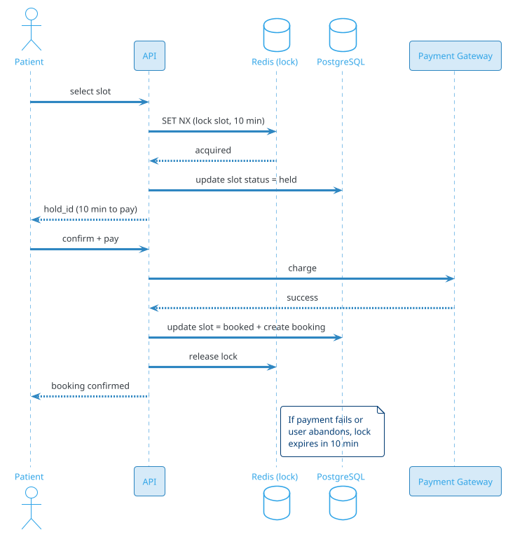
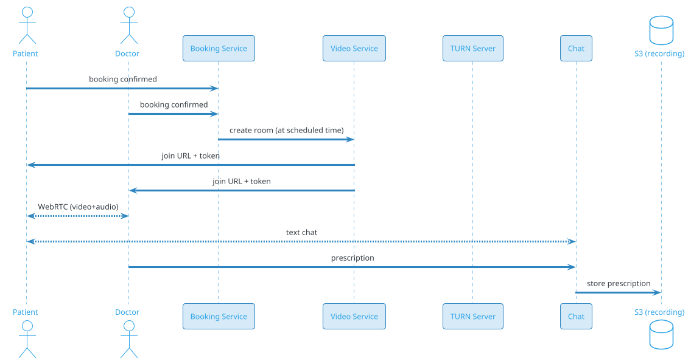
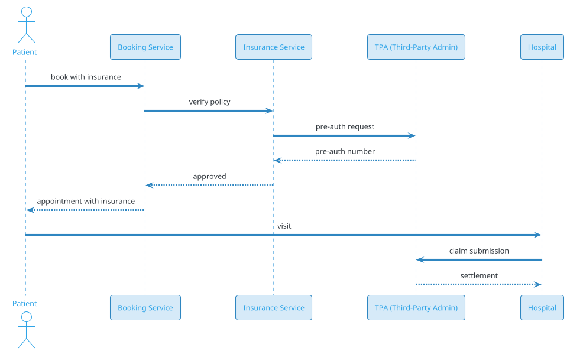

# Hospital Appointment Booking

## Problem Statement

Design a hospital appointment booking system like Practo, Apollo 24/7, or Zocdoc. Patients search for doctors by specialty, location, and availability; book time slots; receive confirmations; and manage appointments. Doctors manage their schedules, patient records, and prescriptions. The system must handle high concurrency for popular doctors, prevent double-booking, and integrate with hospital workflows.

**Example:**
```
Patient Priya in Mumbai needs a cardiologist.

Flow:
  1. Search "cardiologist in Mumbai"
  2. Filter by: Apollo Hospital, < 5 km, available today
  3. View Dr. Sharma's profile: 4.8★, 20 years exp, ₹800/session
  4. Select today 5:30 PM slot
  5. Slot held for 10 min
  6. Pay ₹800 via UPI
  7. Appointment confirmed; SMS + email + WhatsApp
  8. Reminder 24h before, 1h before
  9. Video consult link sent 15 min before (if teleconsult)
 10. Post-consult: digital prescription, follow-up booking

System must handle:
  - Popular doctors (Dr. Sharma) — 100s of concurrent bookings
  - Emergency overflow (walk-ins at hospital)
  - No-show tracking
  - Rescheduling and cancellations
  - Insurance/TPA integration
```

**Real-world apps:** Practo, Apollo 24/7, Zocdoc, 1mg, DoctorOnCall, Lybrate.

**Why it's interesting:**

- **Time slot locking** at scale (like ticket booking, but per-doctor)
- **Recurring availability** (doctor's weekly schedule)
- **Teleconsult vs in-person** (different resource requirements)
- **Healthcare compliance** (HIPAA, DPDP)
- **Integration complexity** (hospitals, labs, insurance, pharmacies)
- **Multi-party workflow** (patient + doctor + hospital + insurance)

---

## 1. Requirements Clarification

### Functional Requirements
- **Search**: Doctors by specialty, location, availability, rating, insurance
- **Doctor profiles**: Qualifications, experience, reviews, fees
- **Availability**: Weekly schedule, exceptions (leave, conferences)
- **Booking**: Select slot, hold for 10 min, pay, confirm
- **Teleconsult**: Video call at scheduled time
- **In-person**: Directions, check-in, wait time
- **Rescheduling**: Move to another slot
- **Cancellation**: With refund per policy
- **Medical records**: Prescriptions, lab reports, visit history
- **Reviews**: Rate doctors after visit
- **Reminders**: SMS, email, WhatsApp, push
- **Insurance**: TPA integration, pre-auth, claim tracking
- **Doctor dashboard**: View schedule, patient list, prescribe
- **Emergency**: Walk-in queue at hospital
- **Follow-up**: Book next appointment during consultation

### Non-Functional Requirements
- **Scale**: 100M users, 500K doctors, 10M bookings/day
- **Latency**: Search < 500 ms p99; booking < 2 sec p99
- **Availability**: 99.99% — healthcare is critical
- **Consistency**: Strong for slot booking (never double-book)
- **Privacy**: HIPAA/DPDP compliance for medical data
- **Security**: Encrypted at rest and in transit
- **Audit**: Every access to medical records logged
- **Durability**: Never lose a booking or prescription

### Out of Scope
- EHR/EMR systems (deep integration, separate domain)
- Hospital ERP, billing, payroll
- Pharmaceutical delivery
- Clinical decision support systems

---

## 2. Back-of-Envelope Estimation

### Traffic

```
Given:
  Users                = 100,000,000
  DAU                  = 5,000,000
  Doctors              = 500,000
  Bookings/day         = 10,000,000
  Searches/user/day    = 5
  Slots viewed/day     = 50,000,000
  Peak multiplier      = 3x

Average QPS:
  Searches = 5M x 5 / 86,400 = ~289/sec
  Views    = 50M / 86,400 = ~579/sec
  Bookings = 10M / 86,400 = ~116/sec

Peak QPS (Monday morning, festival season):
  Searches = ~870/sec
  Views    = ~1,737/sec
  Bookings = ~348/sec

Slot contention:
  Popular doctor (Dr. Sharma): 100 bookings/sec attempted
  Actual slots available: 40/day
  Contention: very high on popular doctors
```

### Storage

```
Users:
  100M x 1 KB = ~100 GB

Doctors:
  500K x 10 KB (profile + qualifications) = ~5 GB

Doctor schedules:
  500K doctors x 52 weeks x 40 slots/week = ~1B slots/year
  Per slot: ~200 bytes
  Total: ~200 GB/year

Appointments:
  10M/day x 365 x 5 years = 18.25B bookings
  Per booking: ~2 KB
  Total: ~36 TB

Medical records:
  10M visits/day x 5 years = 18.25B records
  Per record: ~5 KB (prescription, notes)
  Total: ~90 TB

Reviews:
  10M bookings x 30% reviewed = 3M reviews/day
  x 365 x 5 years = 5.5B reviews
  Per review: ~500 bytes
  Total: ~2.7 TB

Payments:
  10M/day x 365 x 5 = 18.25B rows
  Per row: ~500 bytes
  Total: ~9 TB

Total DB: ~140 TB
Attachments (reports, images): 500 TB+ in S3
```

### Bandwidth

```
Search/View:
  1,737 reads/sec x 50 KB = ~87 MB/sec

Booking:
  348 writes/sec x 2 KB = ~700 KB/sec

Teleconsult video:
  100K concurrent calls x 1.5 Mbps = ~150 Gbps
  Handled by WebRTC SFU / external service

Peak: ~150 Gbps (video dominates)
```

### Latency Budget

```
Search:
  Query:       ~50 ms
  Rank:        ~30 ms
  Serialize:   ~20 ms
  Network:     ~50 ms
  Total:       ~150 ms

Booking:
  Auth:              ~20 ms
  Validate slot:     ~30 ms
  Lock slot:         ~50 ms
  Create booking:    ~50 ms
  Payment:           ~800-1500 ms (external)
  Confirm:           ~50 ms
  Total:             ~1000-1700 ms

Payment dominates.
```

---

## 3. High-Level Design

```d2
direction: down

patient: Patient {shape: person}
doctor: Doctor {shape: person}
hospital: Hospital {shape: person}

cdn: CDN {shape: cloud}
gw: "API Gateway" {shape: hexagon}

search: "Search Service" {shape: rectangle}
sched: "Schedule Service" {shape: rectangle}
booking: "Booking Service" {shape: rectangle}
lock: "Slot Lock Service" {shape: rectangle}
pay: "Payment Service" {shape: rectangle}
notif: "Notification Service" {shape: rectangle}
video: "Video Consult Service" {shape: rectangle}
records: "Records Service" {shape: rectangle}
ins: "Insurance Service" {shape: rectangle}

pg: "PostgreSQL (bookings)" {shape: cylinder}
es: "Elasticsearch (search)" {shape: cylinder}
redis: "Redis (slot locks)" {shape: cylinder}
s3: "S3 (records)" {shape: cylinder}
kafka: "Kafka (events)" {shape: queue}
ext: "External APIs" {shape: rectangle}

patient -> cdn
doctor -> cdn
hospital -> cdn
cdn -> gw

gw -> search
gw -> sched
gw -> booking
gw -> records
gw -> ins

search -> es
sched -> pg
booking -> lock
booking -> pg
booking -> pay
booking -> kafka
lock -> redis
pay -> ext
kafka -> notif
kafka -> video
records -> s3
ins -> ext
```

### Component Responsibilities

| Component | Role |
|---|---|
| API Gateway | Entry, auth, rate limit |
| Search Service | Find doctors by filters |
| Schedule Service | Doctor availability, slots |
| Booking Service | Create/modify/cancel bookings |
| Slot Lock Service | Redis-based locks on slots |
| Payment Service | Integrate with payment gateways |
| Notification Service | SMS, email, push, WhatsApp |
| Video Consult Service | WebRTC/SFU for teleconsults |
| Records Service | Medical records, prescriptions |
| Insurance Service | TPA integration |
| PostgreSQL | Bookings, users, doctors |
| Elasticsearch | Search index |
| Redis | Slot locks, cache |
| S3 | Documents, reports |
| Kafka | Event bus |

### Why This Architecture

- **Redis** for slot locks (atomic, TTL-based)
- **PostgreSQL** for bookings (ACID, money + health)
- **Elasticsearch** for search (geo + filters)
- **Kafka** for async notifications, analytics
- **S3** for medical records (immutable, encrypted)
- **Separate Video Consult** (specialized infrastructure)

---

## 4. API Design

### Search Doctors

```http
GET /v1/doctors/search?specialty=cardiologist&city=mumbai&available_date=2026-09-18&min_rating=4&insurance=star_health&page=1
```

**Response:**
```json
{
  "doctors": [
    {
      "doctor_id": "doc-123",
      "name": "Dr. Anita Sharma",
      "specialty": "Cardiology",
      "qualifications": "MBBS, MD (Cardiology), DM",
      "experience_years": 20,
      "rating": 4.8,
      "review_count": 1245,
      "consultation_fee_cents": 80000,
      "languages": ["English", "Hindi", "Marathi"],
      "clinic": {
        "name": "Apollo Hospital",
        "address": "Bandra West, Mumbai",
        "location": {"lat": 19.0596, "lng": 72.8295},
        "distance_km": 2.3
      },
      "next_available_slot": "2026-09-18T17:30:00+05:30",
      "consultation_types": ["in_person", "video"],
      "insurance_accepted": ["star_health", "icici_lombard"]
    }
  ],
  "total": 47,
  "page": 1,
  "page_size": 20
}
```

### Get Doctor Availability

```http
GET /v1/doctors/doc-123/slots?from=2026-09-18&to=2026-09-22&type=in_person
```

**Response:**
```json
{
  "doctor_id": "doc-123",
  "slots": [
    {"slot_id": "slot-1", "start": "2026-09-18T09:00:00+05:30", "end": "2026-09-18T09:15:00+05:30", "status": "available"},
    {"slot_id": "slot-2", "start": "2026-09-18T09:15:00+05:30", "end": "2026-09-18T09:30:00+05:30", "status": "booked"},
    {"slot_id": "slot-3", "start": "2026-09-18T09:30:00+05:30", "end": "2026-09-18T09:45:00+05:30", "status": "held", "held_until": "2026-09-17T10:12:00Z"},
    {"slot_id": "slot-4", "start": "2026-09-18T09:45:00+05:30", "end": "2026-09-18T10:00:00+05:30", "status": "available"}
  ]
}
```

### Hold Slot

```http
POST /v1/slots/slot-1/hold
Content-Type: application/json
Idempotency-Key: hold-uuid-abc

{
  "patient_id": "pat-456",
  "consultation_type": "in_person",
  "ttl_seconds": 600
}
```

**Response 200:**
```json
{
  "hold_id": "hold-xyz",
  "slot_id": "slot-1",
  "expires_at": "2026-09-17T10:20:00Z",
  "amount_cents": 80000
}
```

**Response 409:**
```json
{
  "error": "slot_unavailable",
  "reason": "booked_by_another_user"
}
```

### Confirm Booking

```http
POST /v1/bookings
Content-Type: application/json
Idempotency-Key: booking-uuid-def

{
  "hold_id": "hold-xyz",
  "patient": {
    "name": "Priya Patel",
    "age": 32,
    "gender": "female",
    "phone": "+91-9876543210"
  },
  "consultation_type": "in_person",
  "payment_method": "upi",
  "payment_token": "tok_upi_xyz"
}
```

**Response 201:**
```json
{
  "booking_id": "bk-789",
  "doctor_id": "doc-123",
  "doctor_name": "Dr. Anita Sharma",
  "slot_start": "2026-09-18T09:00:00+05:30",
  "slot_end": "2026-09-18T09:15:00+05:30",
  "consultation_type": "in_person",
  "clinic": {"name": "Apollo Hospital", "address": "..."},
  "amount_cents": 80000,
  "status": "confirmed",
  "confirmation_code": "APT-2026-09-18-789"
}
```

### Cancel / Reschedule

```http
POST /v1/bookings/bk-789/cancel
{
  "reason": "personal_emergency"
}

POST /v1/bookings/bk-789/reschedule
{
  "new_slot_id": "slot-2"
}
```

### Doctor Schedule Management

```http
PUT /v1/doctors/doc-123/schedule
{
  "weekly_template": [
    {"day": "mon", "start": "09:00", "end": "13:00", "slot_minutes": 15},
    {"day": "mon", "start": "16:00", "end": "19:00", "slot_minutes": 15},
    {"day": "tue", "start": "09:00", "end": "13:00", "slot_minutes": 15},
    ...
  ],
  "exceptions": [
    {"date": "2026-10-02", "reason": "conference", "all_day": true},
    {"date": "2026-10-15", "start": "10:00", "end": "12:00", "reason": "surgery"}
  ]
}
```

### Teleconsult

```http
POST /v1/bookings/bk-789/start-video
```

**Response:**
```json
{
  "room_id": "room-xyz",
  "join_url": "https://video.example.com/room-xyz?token=...",
  "expires_at": "2026-09-18T09:30:00+05:30"
}
```

### Medical Records

```http
GET /v1/patients/pat-456/records
Authorization: Bearer <patient-token>
```

**Response:**
```json
{
  "records": [
    {
      "record_id": "rec-1",
      "type": "prescription",
      "doctor_name": "Dr. Sharma",
      "date": "2026-09-18",
      "diagnosis": "Hypertension",
      "medications": [
        {"name": "Amlodipine 5mg", "dosage": "Once daily", "duration_days": 30}
      ],
      "notes": "Follow up in 2 weeks",
      "attachments": ["s3://records/rec-1.pdf"]
    }
  ]
}
```

### Doctor's Patient View

```http
GET /v1/doctors/doc-123/appointments?date=2026-09-18
Authorization: Bearer <doctor-token>
```

**Response:**
```json
{
  "appointments": [
    {
      "booking_id": "bk-789",
      "patient": {"id": "pat-456", "name": "Priya Patel", "age": 32},
      "slot_start": "2026-09-18T09:00:00+05:30",
      "status": "confirmed",
      "reason": "Chest pain",
      "previous_visits": 3
    }
  ]
}
```

---

## 5. Database Design

### Schema (PostgreSQL)

```sql
-- Users (patients)
CREATE TABLE patients (
    patient_id BIGINT PRIMARY KEY,
    email VARCHAR(255) UNIQUE,
    phone VARCHAR(20) UNIQUE NOT NULL,
    name VARCHAR(200),
    date_of_birth DATE,
    gender VARCHAR(20),
    blood_group VARCHAR(5),
    emergency_contact VARCHAR(20),
    created_at TIMESTAMP DEFAULT NOW()
);

-- Doctors
CREATE TABLE doctors (
    doctor_id BIGINT PRIMARY KEY,
    user_id BIGINT,                                -- optional login
    name VARCHAR(200) NOT NULL,
    specialty VARCHAR(100) NOT NULL,
    sub_specialty VARCHAR(100),
    qualifications TEXT,
    experience_years INT,
    registration_number VARCHAR(50) UNIQUE,        -- medical council
    bio TEXT,
    languages TEXT[],
    rating DECIMAL(3,2) DEFAULT 0,
    review_count INT DEFAULT 0,
    consultation_fee_in_person_cents INT,
    consultation_fee_video_cents INT,
    is_active BOOLEAN DEFAULT TRUE,
    created_at TIMESTAMP DEFAULT NOW()
);
CREATE INDEX idx_doctors_specialty ON doctors(specialty) WHERE is_active = TRUE;

-- Clinics / Hospitals
CREATE TABLE clinics (
    clinic_id BIGINT PRIMARY KEY,
    name VARCHAR(300) NOT NULL,
    address TEXT,
    city VARCHAR(100) NOT NULL,
    state VARCHAR(100),
    pincode VARCHAR(10),
    latitude DECIMAL(10, 8),
    longitude DECIMAL(11, 8),
    phone VARCHAR(20),
    is_verified BOOLEAN DEFAULT FALSE,
    created_at TIMESTAMP DEFAULT NOW()
);
CREATE INDEX idx_clinics_city ON clinics(city);

-- Doctor-Clinic associations
CREATE TABLE doctor_clinics (
    doctor_id BIGINT REFERENCES doctors(doctor_id),
    clinic_id BIGINT REFERENCES clinics(clinic_id),
    consultation_fee_cents INT,
    slot_duration_minutes INT DEFAULT 15,
    PRIMARY KEY (doctor_id, clinic_id)
);

-- Recurring weekly schedule (template)
CREATE TABLE doctor_schedules (
    schedule_id BIGINT PRIMARY KEY,
    doctor_id BIGINT REFERENCES doctors(doctor_id),
    clinic_id BIGINT REFERENCES clinics(clinic_id),
    day_of_week SMALLINT NOT NULL,                 -- 0=Sun, 1=Mon, ...
    start_time TIME NOT NULL,
    end_time TIME NOT NULL,
    slot_duration_minutes INT DEFAULT 15,
    consultation_type VARCHAR(20),                 -- in_person, video, both
    max_patients_per_slot INT DEFAULT 1,
    is_active BOOLEAN DEFAULT TRUE,
    created_at TIMESTAMP DEFAULT NOW()
);
CREATE INDEX idx_schedules_doctor ON doctor_schedules(doctor_id, day_of_week);

-- Schedule exceptions (leave, surgery, etc.)
CREATE TABLE schedule_exceptions (
    exception_id BIGINT PRIMARY KEY,
    doctor_id BIGINT REFERENCES doctors(doctor_id),
    exception_date DATE NOT NULL,
    start_time TIME,                               -- null = all day
    end_time TIME,
    reason VARCHAR(200),
    created_at TIMESTAMP DEFAULT NOW()
);
CREATE INDEX idx_exceptions_doctor_date ON schedule_exceptions(doctor_id, exception_date);

-- Individual time slots (generated from schedule)
CREATE TABLE slots (
    slot_id BIGINT PRIMARY KEY,
    doctor_id BIGINT NOT NULL,
    clinic_id BIGINT,
    start_time TIMESTAMPTZ NOT NULL,
    end_time TIMESTAMPTZ NOT NULL,
    consultation_type VARCHAR(20) NOT NULL,
    fee_cents INT NOT NULL,
    status VARCHAR(20) DEFAULT 'available',        -- available, held, booked, blocked
    patient_id BIGINT,
    booking_id BIGINT,
    version INT DEFAULT 0,
    created_at TIMESTAMP DEFAULT NOW(),
    updated_at TIMESTAMP DEFAULT NOW(),
    UNIQUE (doctor_id, start_time, consultation_type)
);
CREATE INDEX idx_slots_doctor_time ON slots(doctor_id, start_time);
CREATE INDEX idx_slots_status ON slots(doctor_id, status, start_time);
CREATE INDEX idx_slots_patient ON slots(patient_id) WHERE patient_id IS NOT NULL;

-- Bookings
CREATE TABLE bookings (
    booking_id BIGINT PRIMARY KEY,
    patient_id BIGINT REFERENCES patients(patient_id),
    doctor_id BIGINT REFERENCES doctors(doctor_id),
    slot_id BIGINT REFERENCES slots(slot_id),
    clinic_id BIGINT REFERENCES clinics(clinic_id),
    consultation_type VARCHAR(20) NOT NULL,
    status VARCHAR(20) NOT NULL,                   -- pending, confirmed, completed, cancelled, no_show
    reason_for_visit TEXT,
    amount_cents BIGINT NOT NULL,
    payment_id BIGINT,
    confirmation_code VARCHAR(50) UNIQUE,
    booking_metadata JSONB,                        -- flexible for extensions
    idempotency_key VARCHAR(255) UNIQUE,
    booked_at TIMESTAMP DEFAULT NOW(),
    cancelled_at TIMESTAMP,
    cancellation_reason VARCHAR(200),
    completed_at TIMESTAMP
);
CREATE INDEX idx_bookings_patient ON bookings(patient_id, booked_at DESC);
CREATE INDEX idx_bookings_doctor_date ON bookings(doctor_id, booked_at DESC);
CREATE INDEX idx_bookings_status ON bookings(status);
CREATE UNIQUE INDEX idx_bookings_idem ON bookings(idempotency_key) WHERE idempotency_key IS NOT NULL;

-- Payments
CREATE TABLE payments (
    payment_id BIGINT PRIMARY KEY,
    booking_id BIGINT REFERENCES bookings(booking_id),
    amount_cents BIGINT NOT NULL,
    currency VARCHAR(3) DEFAULT 'INR',
    gateway VARCHAR(50),                           -- razorpay, payu, stripe
    gateway_txn_id VARCHAR(255),
    gateway_order_id VARCHAR(255),
    method VARCHAR(50),                            -- upi, card, netbanking, wallet
    status VARCHAR(20) NOT NULL,                   -- pending, success, failed, refunded
    idempotency_key VARCHAR(255) UNIQUE,
    error_message TEXT,
    created_at TIMESTAMP DEFAULT NOW(),
    completed_at TIMESTAMP
);
CREATE INDEX idx_payments_booking ON payments(booking_id);
CREATE INDEX idx_payments_status ON payments(status);

-- Refunds
CREATE TABLE refunds (
    refund_id BIGINT PRIMARY KEY,
    payment_id BIGINT REFERENCES payments(payment_id),
    amount_cents BIGINT NOT NULL,
    reason VARCHAR(200),
    status VARCHAR(20) NOT NULL,                   -- pending, processing, completed, failed
    gateway_refund_id VARCHAR(255),
    created_at TIMESTAMP DEFAULT NOW(),
    completed_at TIMESTAMP
);
CREATE INDEX idx_refunds_payment ON refunds(payment_id);

-- Medical records (prescriptions, notes)
CREATE TABLE medical_records (
    record_id BIGINT PRIMARY KEY,
    patient_id BIGINT NOT NULL,
    doctor_id BIGINT NOT NULL,
    booking_id BIGINT REFERENCES bookings(booking_id),
    record_type VARCHAR(30) NOT NULL,              -- prescription, diagnosis, lab_report, note
    diagnosis TEXT,
    notes TEXT,
    medications JSONB,                             -- array of {name, dosage, duration}
    attachments TEXT[],                            -- S3 keys
    is_encrypted BOOLEAN DEFAULT TRUE,
    created_at TIMESTAMP DEFAULT NOW()
);
CREATE INDEX idx_records_patient ON medical_records(patient_id, created_at DESC);
CREATE INDEX idx_records_doctor ON medical_records(doctor_id, created_at DESC);

-- Reviews
CREATE TABLE reviews (
    review_id BIGINT PRIMARY KEY,
    booking_id BIGINT UNIQUE REFERENCES bookings(booking_id),
    patient_id BIGINT REFERENCES patients(patient_id),
    doctor_id BIGINT REFERENCES doctors(doctor_id),
    rating INT NOT NULL CHECK (rating BETWEEN 1 AND 5),
    title VARCHAR(200),
    comment TEXT,
    is_anonymous BOOLEAN DEFAULT FALSE,
    is_verified BOOLEAN DEFAULT TRUE,               -- verified via booking
    created_at TIMESTAMP DEFAULT NOW()
);
CREATE INDEX idx_reviews_doctor ON reviews(doctor_id, created_at DESC);

-- Insurance / TPA
CREATE TABLE insurance_providers (
    provider_id BIGINT PRIMARY KEY,
    name VARCHAR(200) NOT NULL,                    -- "Star Health", "ICICI Lombard"
    tpa_name VARCHAR(200),                         -- Third-Party Administrator
    api_endpoint TEXT,
    is_active BOOLEAN DEFAULT TRUE
);

CREATE TABLE patient_insurance (
    id BIGINT PRIMARY KEY,
    patient_id BIGINT REFERENCES patients(patient_id),
    provider_id BIGINT REFERENCES insurance_providers(provider_id),
    policy_number VARCHAR(100) NOT NULL,
    valid_from DATE,
    valid_until DATE,
    sum_insured_cents BIGINT,
    is_active BOOLEAN DEFAULT TRUE
);

CREATE TABLE insurance_claims (
    claim_id BIGINT PRIMARY KEY,
    booking_id BIGINT REFERENCES bookings(booking_id),
    patient_insurance_id BIGINT,
    claim_amount_cents BIGINT,
    pre_auth_number VARCHAR(100),
    status VARCHAR(30),                            -- initiated, pre_auth, approved, rejected, settled
    created_at TIMESTAMP DEFAULT NOW()
);

-- Audit log (HIPAA compliance)
CREATE TABLE access_log (
    log_id BIGSERIAL PRIMARY KEY,
    user_id BIGINT NOT NULL,
    user_type VARCHAR(20),                         -- patient, doctor, admin, system
    resource_type VARCHAR(30) NOT NULL,            -- medical_record, booking, prescription
    resource_id BIGINT NOT NULL,
    action VARCHAR(30) NOT NULL,                   -- read, write, delete
    ip_hash VARCHAR(64),
    user_agent_hash VARCHAR(64),
    created_at TIMESTAMP DEFAULT NOW()
);
CREATE INDEX idx_access_log_resource ON access_log(resource_type, resource_id, created_at);
CREATE INDEX idx_access_log_user ON access_log(user_id, created_at DESC);
```

### Redis Data Structures (Slot Locks)

```
-- Slot locks (during booking)
Key: slot:{slot_id}:lock
Value: {patient_id}:{hold_id}
TTL: 600 seconds
Operation: SET NX EX

-- Hold metadata
Key: hold:{hold_id}
Value: JSON {slot_id, patient_id, expires_at, amount_cents}
TTL: 600 seconds

-- Doctor's day cache (hot)
Key: doctor:{doctor_id}:{date}:slots
Value: JSON array of slots
TTL: 30 seconds
```

### Slot Lock Algorithm

```java
public HoldResult holdSlot(Long slotId, Long patientId, int ttlSeconds) {
    String key = "slot:" + slotId + ":lock";
    String value = patientId + ":" + UUID.randomUUID();
    
    // Atomic try-lock
    Boolean acquired = redis.opsForValue().setIfAbsent(key, value, ttlSeconds, TimeUnit.SECONDS);
    
    if (Boolean.TRUE.equals(acquired)) {
        // Update slot status in DB (for durability)
        slotsRepo.updateStatus(slotId, "held", patientId);
        
        // Store hold metadata
        String holdId = value.split(":")[1];
        redis.opsForValue().set("hold:" + holdId, 
            Json.toJson(new HoldMetadata(slotId, patientId, ttlSeconds)), 
            ttlSeconds, TimeUnit.SECONDS);
        
        return new HoldResult(holdId, slotId, Instant.now().plusSeconds(ttlSeconds));
    } else {
        return HoldResult.conflict();
    }
}
```

### Confirming Booking (After Payment)

```java
@Transactional
public Booking confirmBooking(String holdId, PaymentInfo payment) {
    // Validate hold
    HoldMetadata hold = redis.get("hold:" + holdId);
    if (hold == null) throw new HoldExpiredException();
    
    // Verify payment
    PaymentResult result = paymentService.charge(hold, payment);
    if (!result.success()) throw new PaymentFailedException();
    
    // Update slot to booked
    slotsRepo.updateStatus(hold.slotId, "booked", hold.patientId);
    
    // Create booking
    Booking booking = new Booking(...);
    bookingsRepo.save(booking);
    
    // Delete lock and hold (no longer needed)
    redis.delete("slot:" + hold.slotId + ":lock");
    redis.delete("hold:" + holdId);
    
    // Publish events
    kafka.publish(new BookingConfirmed(booking));
    
    return booking;
}
```

---

## 6. Deep Dive: Slot Management

### Two Approaches to Slot Generation

**Approach A: Pre-generate all slots**

Every slot is a row in `slots` table.

```
For each doctor, generate slots for next 30 days:
  daily_slots x 30 = ~1200 rows per doctor
  500K doctors x 1200 = 600M rows
```

**Pros:**
- Fast queries (just SELECT)
- Simple status updates
- Easy locking

**Cons:**
- Storage growth
- Schedule changes require regeneration
- Wasted slots if doctor doesn't work

**Approach B: Generate on-demand from schedule**

Slots computed from `doctor_schedules` + exceptions, with bookings as overrides.

```
Query: "give me slots for Dr. Sharma on Sept 18"
  1. Look up schedule template (Mon: 9am-1pm, 4pm-7pm)
  2. Look up exceptions (any leave?)
  3. Generate 15-min slots
  4. Overlay existing bookings
  5. Return with status
```

**Pros:**
- No storage growth
- Schedule changes are instant
- No wasted rows

**Cons:**
- Slower queries (compute on every read)
- Complex logic
- Locking harder

**Recommendation:** **Hybrid.**
- Pre-generate slots for next 30 days (rolling window)
- On schedule change: invalidate and regenerate future slots
- Delete slots older than 30 days (or archive)

### Slot Generation Job

```java
@Scheduled(cron = "0 0 2 * * *")  // Daily at 2 AM
public void generateSlots() {
    Instant from = now().plusDays(30);
    Instant to = now().plusDays(60);
    
    for (Doctor doc : activeDoctors()) {
        List<TimeSlot> newSlots = slotGenerator.generate(doc, from, to);
        slotsRepo.bulkInsert(newSlots);
    }
}
```

### Handling Doctor Leave

```
1. Doctor adds exception (leave Oct 15)
2. Schedule service marks all slots on Oct 15 as 'blocked'
3. For any bookings on those slots:
   - Notify patient
   - Auto-cancel or offer reschedule
   - Refund automatically
4. Publish event (for analytics: doctor leave rate)
```

### Handling Overbooking

Some hospitals allow 2-3 patients per slot (multi-bed consultation):
```sql
max_patients_per_slot INT DEFAULT 1
```

Slot is available if `booked_count < max_patients_per_slot`. Simple counter.

### Peak Hour Handling

Popular doctors have demand > supply:
- **Waitlist**: Patient joins waitlist for preferred slot
- **Auto-notify**: When slot frees, first in line gets notified
- **Priority**: Premium/follow-up patients get priority

### Booking Flow with Hold + Payment



---

## 7. Deep Dive: Search and Discovery

### Search Requirements

- **By specialty**: cardiologist, dermatologist
- **By location**: city, area, hospital, distance
- **By availability**: today, this week, specific date
- **By rating**: min rating
- **By fee**: price range
- **By insurance**: accepted insurance
- **By language**: English, Hindi, Marathi
- **By consultation type**: in-person, video
- **By experience**: min years

### Elasticsearch Mapping

```json
{
  "mappings": {
    "properties": {
      "doctor_id": {"type": "keyword"},
      "name": {"type": "text"},
      "specialty": {"type": "keyword"},
      "sub_specialty": {"type": "keyword"},
      "qualifications": {"type": "text"},
      "experience_years": {"type": "integer"},
      "rating": {"type": "float"},
      "review_count": {"type": "integer"},
      "fee_in_person": {"type": "integer"},
      "fee_video": {"type": "integer"},
      "languages": {"type": "keyword"},
      "consultation_types": {"type": "keyword"},
      "insurance_providers": {"type": "keyword"},
      "clinics": {
        "type": "nested",
        "properties": {
          "clinic_id": {"type": "keyword"},
          "name": {"type": "text"},
          "city": {"type": "keyword"},
          "location": {"type": "geo_point"},
          "next_available": {"type": "date"}
        }
      },
      "availability_summary": {
        "type": "object",
        "properties": {
          "today": {"type": "boolean"},
          "this_week": {"type": "boolean"}
        }
      }
    }
  }
}
```

### Ranking

**Default ranking factors:**
1. **Relevance**: Match to query
2. **Rating**: Higher is better
3. **Availability**: Sooner is better
4. **Distance**: Closer is better
5. **Experience**: More is better
6. **Response rate**: Doctor responds quickly

**Personalization:**
- Past bookings with this doctor → boost
- Preferred clinic → boost
- Preferred consultation type → boost

### Geo Search

```json
{
  "query": {
    "bool": {
      "must": [
        {"term": {"specialty": "cardiologist"}}
      ],
      "filter": [
        {
          "geo_distance": {
            "distance": "10km",
            "clinics.location": {"lat": 19.0760, "lon": 72.8777}
          }
        }
      ]
    }
  },
  "sort": [
    {"_geo_distance": {"clinics.location": {...}, "order": "asc"}},
    {"rating": "desc"}
  ]
}
```

### Availability Filtering

**Problem:** Elasticsearch can't easily filter by "has availability on date X" because availability is time-sensitive.

**Solutions:**

**Approach 1: Pre-compute availability summary**
```
For each doctor, cache:
  next_available: "2026-09-18T09:00:00+05:30"
  slots_available_today: 5
  slots_available_week: 23
```
Index these fields. Filter by `next_available <= X`.

**Approach 2: Two-phase search**
1. Elasticsearch returns doctors matching filters (specialty, location, etc.)
2. Schedule service checks availability for those doctors
3. Return filtered results

**Approach 3: Cache availability in Redis**
```
Key: doctor:{id}:next_available
Value: timestamp
```
Index in Elasticsearch (updated every minute).

**Recommendation:** Approach 1 (pre-computed summary). Update every minute via job.

### Search Autocomplete

As user types "cardi", suggest:
- "cardiologist"
- "cardiology"
- "cardiac surgeon"

Implement via Elasticsearch completion suggester with edge-n-grams.

### "Near Me" Search

Mobile apps request location; server returns doctors within radius.

```
GET /doctors/search?specialty=cardiologist&lat=19.0760&lng=72.8777&radius_km=5
```

Fast response using geo index.

---

## 8. Deep Dive: Teleconsultation

### Why Teleconsult

- Remote patients
- Follow-ups
- Mental health
- Reducing hospital visits
- COVID-era adoption

### Technology Stack

| Component | Choice | Reason |
|---|---|---|
| Video | WebRTC | Low latency, P2P possible |
| SFU | Jitsi, Janus, Mediasoup | For > 2 participants |
| Signaling | WebSocket | Session setup |
| STUN/TURN | Coturn | NAT traversal |
| Recording | Optional | Compliance |

### Consultation Flow



### Room Creation and Tokens

```
1. Booking confirmed for video consult
2. 15 min before scheduled time:
   - Video Service creates a room (room_id)
   - Generates JWT tokens for patient and doctor (valid 1 hour)
   - Sends join URLs via notification
3. Both parties join via WebRTC
4. Video Service acts as SFU (if needed) or signals P2P
5. Session recorded (optional, with consent)
6. Prescription uploaded during/after call
7. Room destroyed after session
```

### Waiting Room

```
1. Patient joins 5 min early → enters waiting room
2. Doctor joins on time → sees patient waiting
3. Doctor clicks "Start consultation"
4. Patient notified; both enter main room
```

**Benefits:**
- Smooth experience
- Doctor controls start
- Handles doctor running late

### Quality Issues

- **Network jitter**: Adaptive bitrate
- **Low bandwidth**: Audio-only fallback
- **Packet loss**: FEC (forward error correction)
- **Latency**: Regional SFU

### Prescription During Call

Doctor uses a side panel:
- Patient's medical history
- Symptoms entered
- Diagnosis
- Medications (search + add)
- Follow-up instructions

After call: prescription generated, sent to patient.

### Recording and Compliance

- **Consent required** (both parties)
- **Encrypted at rest** (KMS)
- **Retention policy** (e.g., 1 year)
- **Access logged** (HIPAA)

### Scale

```
Concurrent consults: 100,000
Bandwidth per call: 1.5 Mbps
Total: 150 Gbps

Use SFUs to reduce:
  Instead of full mesh (N^2), use SFU (N)
  100K calls x 1.5 Mbps to SFU + 1.5 Mbps per receiver
  Total: ~150 Gbps egress from SFU cluster
```

---

## 9. Deep Dive: Medical Records and Compliance

### Healthcare Data Requirements

- **HIPAA** (US): Privacy, security, breach notification
- **DPDP Act** (India): Consent, purpose limitation
- **GDPR** (EU): Right to access, right to erasure
- **Encryption**: At rest (AES-256), in transit (TLS 1.3)
- **Audit**: Every access logged
- **Retention**: Minimum retention (often 7+ years)

### Data Model

```
Patient → Appointments → Prescriptions, Lab Reports, Notes
Patient → Allergies, Medications, Conditions (chronic)
Doctor → Patients (via appointments)
```

### Encryption

**At Rest:**
```
S3 objects encrypted with customer-managed KMS key
DB columns with sensitive data encrypted via pgcrypto
Backups encrypted
```

**In Transit:**
```
TLS 1.3 for all API traffic
mTLS for internal service-to-service
VPN for admin access
```

### Access Control

| Role | Read | Write |
|---|---|---|
| Patient | Own records | Own profile |
| Doctor | Own patients' records | Own prescriptions |
| Admin | Aggregate, no PII | System config |
| Researcher | Anonymized | No |

**Rule:** Doctor can only access records for patients they've seen (or booked).

### Audit Logging

Every access to medical data logged:

```json
{
  "user_id": "doc-123",
  "user_type": "doctor",
  "resource_type": "medical_record",
  "resource_id": "rec-456",
  "action": "read",
  "ip_hash": "abc123",
  "user_agent_hash": "def456",
  "timestamp": "2026-09-17T10:00:00Z",
  "context": {"booking_id": "bk-789", "reason": "consultation"}
}
```

**Retention:** 7 years minimum. Immutable.

### Right to Access

Patient can request all their data:
- Automated export (JSON)
- Within 30 days (GDPR) or per local law
- Download link expires after 7 days

### Right to Erasure

Patient can request deletion:
- Soft-delete: hide from UI, keep for compliance
- Hard-delete: after legal retention expires
- Anonymize: for research/analytics

**Exception:** Legal retention for medical records often overrides erasure.

### Consent Management

```json
{
  "patient_id": "pat-456",
  "consents": [
    {"type": "data_processing", "granted_at": "...", "version": "1.0"},
    {"type": "marketing", "granted_at": "...", "revoked_at": "..."},
    {"type": "research", "granted_at": "...", "anonymous": true}
  ]
}
```

All consent changes logged.

### Data Residency

For DPDP (India): Data must stay in India. Use Mumbai region for Indian users.

For GDPR (EU): Data must stay in EU. Use Frankfurt region for EU users.

For HIPAA (US): Data in US, BAA with cloud provider.

### Breach Notification

- Detect via anomaly detection
- Notify within 72 hours (GDPR)
- Notify affected users
- Log and post-mortem

---

## 10. Deep Dive: Insurance Integration

### Insurance Flow



### Pre-Authorization

For planned procedures:
1. Patient provides insurance details at booking
2. System submits pre-auth request to TPA
3. TPA approves (or rejects)
4. Patient gets pre-auth number
5. Uses at hospital; hospital bills TPA directly
6. Patient pays co-pay

### Co-pay Calculation

```
Total bill: ₹10,000
Insurance covers: 80%
Patient co-pay: ₹2,000

System calculates at booking:
  base_fee: ₹800
  insurance_coverage: 80%
  patient_pays: ₹160
  insurance_pays: ₹640
```

### Claim Status

Track through states:
```
INITIATED → PRE_AUTH_REQUESTED → PRE_AUTH_APPROVED → 
TREATMENT_DONE → CLAIM_SUBMITTED → UNDER_REVIEW → 
APPROVED → SETTLED
```

Notify patient of status changes.

### Direct Billing (Cashless)

Hospital bills insurance directly:
- Patient shows policy
- Hospital verifies coverage
- Patient pays only co-pay
- Hospital claims from TPA

**Benefit:** No out-of-pocket for covered amounts.

### Reimbursement (Pay First)

Patient pays full amount; claims later:
- Patient collects receipts
- Submits claim to insurer
- Insurance reimburses

**Used when:** Hospital not in insurer network.

### Integration Challenges

- Each TPA has different API
- Formats vary (XML, JSON, SOAP)
- Approval times vary (instant to 48 hours)
- Rejections common; need clear communication

**Solution:** Adapter pattern. One interface, multiple implementations.

---

## 11. Scaling Considerations

### Read Scaling

- **Elasticsearch**: Distributed search
- **Redis**: Doctor day slots (hot cache)
- **Read replicas**: PostgreSQL
- **CDN**: Static content (doctor avatars, hospital images)

### Write Scaling

**Bookings moderate (~116/sec avg, ~348/sec peak).** PostgreSQL handles with sharding.

**Sharding strategy:** Shard by `doctor_id` hash.
```
shard_id = hash(doctor_id) % N
```

**Why doctor_id?**
- Availability queries are per-doctor
- Booking is per-doctor
- Cross-shard queries (patient's history) handled via secondary index

**Alternative:** Shard by `patient_id` for patient-centric apps.

### Slot Lock Scaling

- **Redis cluster** for slot locks
- Shard by `doctor_id`
- 100K+ locks/sec possible with a small Redis cluster

### Video Consult Scaling

- **Regional SFU clusters** (Mumbai, Bangalore, Delhi)
- Users connect to nearest SFU
- SFUs bridge across regions
- Recording to regional S3, replicate for compliance

### Search Scaling

- Elasticsearch scales horizontally
- Shard by specialty or region
- Replicas for HA

### Multi-Region

**Data residency:** Indian users' data in India (DPDP).
**Doctor availability:** Doctors are local; queries go to their region.
**Cross-region bookings:** Rare; route to doctor's region.

### Peak Handling

**Monday morning rush:** 3-5x normal traffic.
- Auto-scale API servers
- Pre-warm caches
- Rate limit per user (not too aggressive)

**Festival season:** Similar to Monday, sustained.

### Doctor Portal

Separate from patient app:
- Richer UI (schedule management)
- Bulk operations
- Analytics dashboard
- Lower traffic but higher compute per session

---

## 12. Bottlenecks and Trade-offs

| Concern | Solution | Trade-off |
|---|---|---|
| Slot locking | Redis SET NX + TTL | Redis dependency |
| Double booking | Unique constraint + locks | Complexity |
| Search latency | Elasticsearch + geo index | Index freshness |
| Video scale | Regional SFU | Infra cost |
| Medical records | S3 + KMS encryption | Retrieval latency |
| Compliance | Audit log + encryption | Storage cost |
| Insurance | Adapter pattern | Integration complexity |
| No-shows | Reminders + penalties | UX trade-off |
| Rescheduling | Free within window | Abuse risk |
| Multi-region | Data residency | Cross-region complexity |

### Design Decisions Summary

| Decision | Choice | Rationale |
|---|---|---|
| Primary DB | PostgreSQL | ACID for bookings + health |
| Slot locking | Redis SET NX + TTL | Atomic, fast |
| Slot storage | Hybrid (pre-generate + on-demand) | Balance storage and freshness |
| Search | Elasticsearch | Geo + filters |
| Video | WebRTC + SFU | Low latency |
| Records | S3 + KMS encryption | HIPAA/DPDP |
| Notifications | Kafka + templates | Async |
| Insurance | Adapter per TPA | Flexibility |
| Multi-region | Regional deployment | Compliance |
| Sharding | By doctor_id | Availability + booking locality |

---

## 13. Failure Scenarios

### Redis Down (Slot Locks Unavailable)

**Impact:** Users can't hold slots.

**Mitigation:**
- Fall back to PostgreSQL `SELECT FOR UPDATE` (slower)
- Redis Sentinel for HA
- Alert immediately
- Users see "booking temporarily slow" message

### PostgreSQL Primary Down

**Impact:** All writes fail.

**Mitigation:**
- Multi-AZ failover (~30 sec)
- Reads from replicas
- Queue writes in Kafka
- Replay after recovery

### Payment Gateway Down

**Impact:** Users can't complete bookings.

**Mitigation:**
- Switch to backup gateway (Razorpay + PayU)
- Extend hold TTL during outage
- Notify users via banner

### Elasticsearch Down

**Impact:** Search unavailable.

**Mitigation:**
- Fall back to PostgreSQL-based search (slower)
- Serve cached popular searches
- Alert ops

### Video Service Down

**Impact:** Teleconsults fail.

**Mitigation:**
- Multi-provider (Zoom, Twilio as backup)
- Notify patient and doctor
- Reschedule automatically
- Refund if no alternative

### Doctor Doesn't Show Up

**Impact:** Patient waits; frustration.

**Mitigation:**
- Reminder to doctor
- Escalation to hospital admin
- Auto-refund to patient
- Doctor rating penalty

### Patient No-Show

**Impact:** Wasted slot.

**Mitigation:**
- Reminder 24h + 1h before
- Fee forfeiture policy
- 3 strikes → booking blocked for X days
- Teleconsult option (patient may connect if late)

### Insurance Approval Delayed

**Impact:** Patient waits; possible cancellation.

**Mitigation:**
- Book with provisional status
- Confirm when approved
- Auto-refund if rejected
- Notify proactively

### Data Breach

**Impact:** Patient data exposed.

**Mitigation:**
- Encryption at rest + transit
- Access controls + audit
- Anomaly detection (unusual access)
- Incident response plan
- Notify within 72 hours (GDPR)

### Slot Lock Lost (Network Issue)

**Impact:** User's slot is taken by someone else.

**Mitigation:**
- Client retries hold (idempotent)
- If taken, show alternatives
- Never lose a paid booking

---

## 14. Monitoring and Alerts

### Key Metrics

| Metric | Target | Alert Threshold |
|---|---|---|
| Search p99 | < 500 ms | > 1.5 sec |
| Booking p99 | < 2 sec | > 5 sec |
| Slot hold success rate | > 99% | < 95% |
| Payment success rate | > 95% | < 90% |
| Video call setup p99 | < 5 sec | > 15 sec |
| Video call drop rate | < 5% | > 10% |
| Refund completion | < 7 days | > 14 days |
| Slot double-booking | 0 | > 0 |
| Medical record access latency | < 300 ms | > 1 sec |
| Audit log write failures | 0 | > 0 |
| Data breach incidents | 0 | > 0 |

### Dashboards

- **Business**: Bookings/day, revenue, cancellations, no-shows
- **Latency**: p50/p95/p99 per endpoint
- **Slot locking**: Lock success, contention, expiry
- **Payments**: Success by gateway, failures by reason
- **Video**: Active calls, setup time, drop rate
- **Doctor NPS**: Ratings, review sentiment
- **Compliance**: Audit log rate, access anomalies
- **Infrastructure**: DB, Redis, ES, Kafka health

### Alerts

- **P0**: DB down, overbooking detected, data breach, video service down
- **P1**: Search p99 > 1.5 sec, payment success < 90%
- **P2**: High contention on hot doctor, slot hold failures
- **P3**: High no-show rate, low ratings, search index lag

### Business KPIs

- **Booking conversion** (views → bookings)
- **Cancellation rate**
- **No-show rate**
- **Repeat booking rate** (patients returning)
- **Doctor utilization** (slots booked / slots available)
- **Time to first booking** (onboarding)
- **Net Promoter Score** (NPS)

---

## 15. Cost Estimation

Rough monthly cost (AWS, us-east-1) for 100M users:

| Component | Spec | Cost/month |
|---|---|---|
| API servers | 80 x c6g.large | ~$5,000 |
| Video SFU servers | 30 x c6g.4xlarge | ~$15,000 |
| PostgreSQL | 16 shards x db.r6g.4xlarge | ~$75,000 |
| Read replicas | 24 x db.r6g.2xlarge | ~$50,000 |
| Redis cluster | 20 x cache.r6g.2xlarge | ~$10,000 |
| Elasticsearch | 10 x r6g.2xlarge | ~$6,000 |
| Kafka (MSK) | 6 brokers | ~$2,500 |
| S3 (records, images) | 500 TB | ~$12,000 |
| CDN | 200 TB/month | ~$17,000 |
| Video recording storage | 100 TB | ~$2,500 |
| Monitoring | Datadog | ~$20,000 |
| **Total** | | **~$215,000/month** |

**Per user:** ~$0.002/month.

**Cost optimization:**
- Reserved instances (30-40% savings)
- Spot instances for SFU (up to 70% savings)
- Tiered S3 storage
- Self-hosted observability

**Revenue note:** Consultations generate revenue; system is revenue-positive if average fee > $0.20/user/month.

---

## 16. Extensions and Follow-ups

### Lab Test Booking

Extend to book lab tests (blood work, imaging):
- Similar scheduling (lab time slots)
- Sample collection at home or lab
- Results delivery
- Doctor review of results

### Pharmacy Integration

After consultation:
- Prescription sent to pharmacy
- Patient picks delivery or pickup
- Track order
- Auto-refill for chronic

### Emergency Booking

- Triage via AI (symptom checker)
- Route to ER vs urgent care vs clinic
- Real-time ER wait times
- Ambulance dispatch

### Chronic Care Program

For diabetes, hypertension:
- Regular check-ins
- Remote monitoring (devices)
- Medication adherence tracking
- Alert on abnormal readings

### AI Symptom Checker

- User enters symptoms
- AI suggests specialties
- Reduces mis-booking
- **Caution:** Not a diagnosis; always recommend doctor

### Second Opinion

- Patient uploads records
- Specialist reviews async
- Video call for discussion
- Payment per opinion

### Hospital ERP Integration

- Bed management
- OT scheduling
- Staff rosters
- Billing integration

### Referral System

- Doctor refers to specialist
- Auto-book specialist appointment
- Share records with consent

### Clinical Trials

- Patient matches for trials
- Consent management
- Data collection for research
- Anonymization pipeline

### Teleconsultation for Mental Health

- Specialized UX (privacy-focused)
- Longer sessions (45-60 min)
- Text/voice/video options
- Crisis intervention

### Wearables Integration

- Apple Health, Google Fit
- Step count, heart rate, sleep
- Share with doctor during consult
- Trend analysis

### Voice Assistant

- "Book a cardiologist in Mumbai"
- Voice-first booking
- Accessible for elderly

### Family Accounts

- Manage appointments for family members
- Elderly parents, children
- Shared medical history

### Follow-up Automation

- Auto-suggest follow-up based on diagnosis
- Book during consultation
- Reminder for follow-up
- Reduce drop-off

### Post-Visit Feedback

- Rate doctor
- Rate clinic experience
- Rate video quality (if teleconsult)
- Improve quality

---

## 17. Summary

| Aspect | Decision |
|---|---|
| Primary DB | PostgreSQL (sharded by doctor_id) |
| Slot locking | Redis SET NX + TTL + Lua atomicity |
| Slot storage | Hybrid pre-generate (30 days) + on-demand |
| Search | Elasticsearch (geo + filters) |
| Video | WebRTC + regional SFU |
| Medical records | S3 + KMS encryption |
| Audit | Immutable access log |
| Notifications | Kafka + templates (SMS, email, WhatsApp) |
| Insurance | Adapter per TPA |
| Compliance | HIPAA / DPDP / GDPR |
| Multi-region | Regional deployment (data residency) |
| Scale | 10M bookings/day, 500K doctors |
| Latency | < 500 ms search, < 2 sec booking |
| Availability | 99.99% |
| Cost | ~$215K/month for 100M users |

**Key takeaways:**

- **Slot locking is the core problem** — Redis SET NX + TTL prevents double-booking
- **Hybrid slot storage** balances storage and freshness
- **Doctor schedules are templates** — generate slots with exceptions
- **Medical records need HIPAA/DPDP compliance** — encryption, audit, access control
- **Video consult requires SFU** for scale — P2P doesn't work for many concurrent calls
- **Insurance integration uses adapter pattern** — each TPA is different
- **Multi-region for data residency** — Indian users in India, EU users in EU
- **No-show tracking** with reminders and penalties
- **Audit everything** — healthcare compliance is non-negotiable
- **Patient trust is paramount** — privacy, security, and reliability drive design

**Similar Pattern Problems:**

- Show / Ticket Booking (slot locking, payment flow)
- Calendar / Scheduling (recurring availability, exceptions)
- Ride Booking (real-time slot allocation, payment)
- Food Delivery (multi-party coordination)
- E-Commerce Checkout (payment + inventory + multi-party)
- Insurance Platform (TPA integration, claims)
- Video Conferencing (real-time video infrastructure)