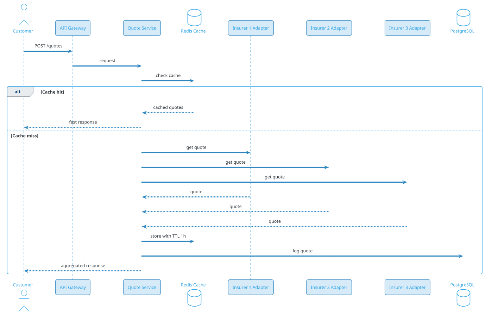
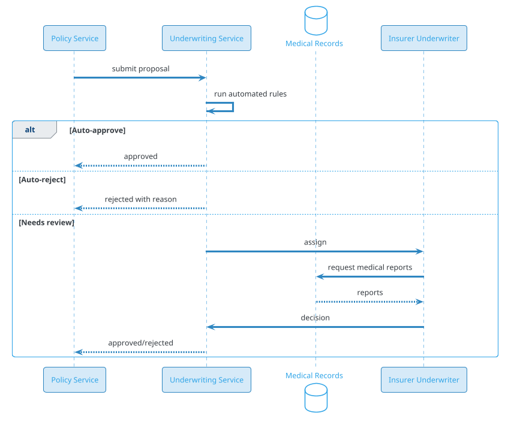
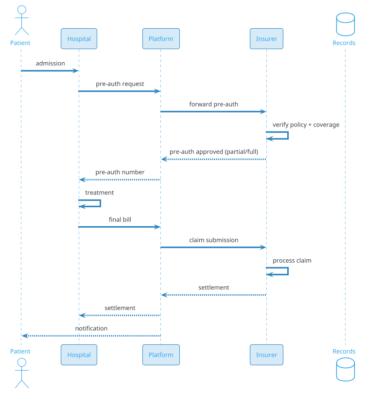
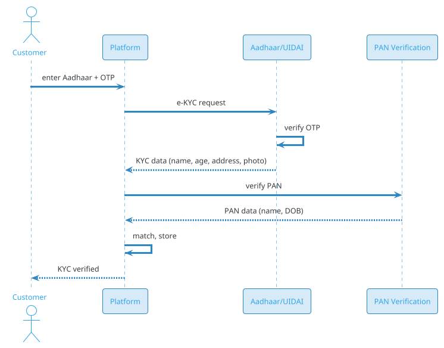
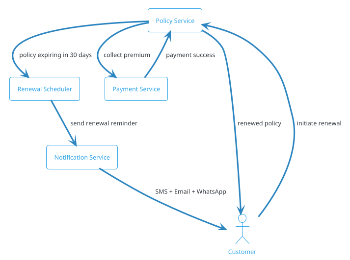

# Insurance Platform

## Problem Statement

Design an insurance platform like PolicyBazaar, Acko, or Bajaj Finance. Users compare policies from multiple insurers, buy policies, file claims, and manage renewals. Insurers manage products, pricing, underwriting, and claim payouts. The platform handles the entire lifecycle from quote to claim settlement.

**Example:**
```
User Ravi, 32, wants health insurance for his family (wife, 2 kids).

Flow:
  1. Enter details: age, family, city, pre-existing conditions
  2. Compare plans from 15 insurers (Star Health, HDFC Ergo, Acko...)
  3. Filter: premium < ₹20K/year, coverage > ₹10L, cashless hospitals
  4. Get quote for top 3 plans
  5. Fill proposal form (medical history)
  6. Underwriting: some plans ask for more info
  7. Pay premium (annual/quarterly/monthly)
  8. Policy issued (PDF, policy number)
  9. Renewal reminders 30 days before expiry
 10. Claim: hospital, pre-auth, cashless settlement, or reimbursement

Insurers get:
  - Access to customer leads
  - Underwriting workflow
  - Claim processing

Platform gets:
  - Commission per policy sold (10-30%)
  - Renewal commission
  - Lead generation fees
```

**Real-world apps:** PolicyBazaar, Acko, Bajaj Allianz, Coverfox, LIC, ICICI Lombard.

**Why it's interesting:**

- **Multi-party system** (customer + insurer + TPA + hospital)
- **Regulated industry** (IRDAI in India, state insurance departments in US)
- **Complex pricing** (actuarial models, risk assessment)
- **KYC / AML compliance** (Aadhaar, PAN, address proof)
- **Long-lived policies** (1-30 years)
- **Claims workflow** (document-heavy, human-in-the-loop)
- **Commission tracking** (platform, agents, brokers)
- **Renewal cycles** (annual, reminders)

---

## 1. Requirements Clarification

### Functional Requirements
- **Product catalog**: Insurance products from multiple insurers (health, life, motor, travel, home)
- **Quotes**: Instant quotes based on user inputs (age, sum insured, family size)
- **Comparison**: Side-by-side plan comparison
- **Purchase**: Proposal form, medical declaration, KYC, payment
- **Underwriting**: Automated and manual review
- **Policy issuance**: Digital policy document (PDF)
- **Renewals**: Reminders, renewal flow, grace period
- **Claims**: File, track, settle (cashless or reimbursement)
- **Agent portal**: Agents sell policies, track commissions
- **Insurer portal**: Insurers manage products, leads, claims
- **Payments**: Premium collection, claim payout
- **KYC**: Aadhaar, PAN, address verification
- **Notifications**: SMS, email, WhatsApp for reminders, policy status
- **Document management**: Store and serve policy documents, medical reports

### Non-Functional Requirements
- **Scale**: 50M users, 5M policies/year, 500K claims/year
- **Latency**: Quote < 2 sec p99; purchase < 5 min p99 (with underwriting)
- **Availability**: 99.99% — insurance is trust-sensitive
- **Consistency**: Strong for policy issuance, payments
- **Compliance**: IRDAI (India), GDPR (EU), state regulations (US)
- **Security**: PCI-DSS for payments, encryption at rest + transit
- **Audit**: Every transaction logged, immutable
- **Data retention**: Policy + claim records for 10+ years
- **Disaster recovery**: RPO < 1 hour, RTO < 4 hours

### Out of Scope
- Direct insurer operations (actuarial model training, reinsurance)
- Hospital network management
- Physical branch operations

---

## 2. Back-of-Envelope Estimation

### Traffic

```
Given:
  Users                = 50,000,000
  DAU                  = 2,000,000
  Quotes/day           = 500,000
  Policies sold/day    = 15,000 (5M/year)
  Claims filed/day     = 1,500 (500K/year)
  Renewals/day         = 10,000
  Reads per quote      = 5 (compare views)
  Peak multiplier      = 3x (tax season, festival)

Average QPS:
  Quote requests  = 500K / 86,400 = ~5.8/sec
  Quote reads     = 2.5M / 86,400 = ~29/sec
  Policy purchase = 15K / 86,400 = ~0.17/sec
  Claims          = 1.5K / 86,400 = ~0.017/sec

Total: ~35 ops/sec average

Peak QPS:
  Quote requests = ~18/sec
  Quote reads    = ~87/sec

Low-throughput system. Optimize for correctness, not scale.
```

### Storage

```
Users:
  50M x 5 KB (KYC data, documents) = ~250 GB

Products:
  100 insurers x 50 products = 5,000 products
  Per product: ~50 KB (terms, pricing rules)
  Total: ~250 MB

Quotes:
  500K/day x 365 x 3 years = 547M quotes
  Per quote: ~10 KB (inputs + computed premium)
  Total: ~5.5 TB

Policies:
  15M policies over 5 years
  Per policy: ~50 KB (metadata + documents)
  Total: ~750 GB
  Documents in S3: ~50 GB

Claims:
  2.5M claims over 5 years
  Per claim: ~100 KB (metadata + documents)
  Total: ~250 GB
  Documents in S3: ~500 GB

Payments:
  20M transactions over 5 years
  Per transaction: ~1 KB
  Total: ~20 GB

Audit logs:
  100M events over 5 years
  Per event: ~500 bytes
  Total: ~50 GB

Total DB: ~7 TB
S3 (documents): ~1 TB
```

### Bandwidth

```
Quote requests:
  18/sec x 5 KB = ~90 KB/sec

Document downloads:
  100 concurrent downloads x 5 MB = ~500 MB/sec peak

Peak: ~500 MB/sec = ~4 Gbps
Small.
```

### Latency Budget

```
Quote:
  Input validation:      ~50 ms
  Fetch products:        ~100 ms
  Call insurer APIs:     ~500 ms (parallel)
  Rank and filter:       ~50 ms
  Response:              ~50 ms
  Total:                 ~750 ms

Policy purchase:
  KYC verification:      ~2-5 sec (external)
  Underwriting:          ~1-5 min (sometimes manual)
  Payment:               ~5-30 sec
  Policy issuance:       ~5 sec
  Total:                 ~2-5 min (includes human wait)

Claim:
  Document upload:       ~30 sec
  Verification:          ~1-24 hours (human review)
  Settlement:            ~1-7 days (banking)
  Total:                 ~days
```

---

## 3. High-Level Design

```d2 
direction: down

customer: Customer {shape: person}
agent: Agent {shape: person}
insurer: Insurer {shape: person}
hospital: Hospital {shape: person}

cdn: CDN {shape: cloud}
gw: "API Gateway" {shape: hexagon}

us: "User Service" {shape: rectangle}
cs: "Catalog Service" {shape: rectangle}
qs: "Quote Service" {shape: rectangle}
ps: "Policy Service" {shape: rectangle}
cls: "Claim Service" {shape: rectangle}
pays: "Payment Service" {shape: rectangle}
kyc: "KYC Service" {shape: rectangle}
uw: "Underwriting Service" {shape: rectangle}
ns: "Notification Service" {shape: rectangle}

pg: "PostgreSQL (core data)" {shape: cylinder}
redis: "Redis (cache, sessions)" {shape: cylinder}
kafka: "Kafka (events)" {shape: queue}
s3: "S3 (documents)" {shape: cylinder}
ia: "Insurer Adapters" {shape: rectangle}
ext: "External APIs" {shape: rectangle}
es: "Elasticsearch (search)" {shape: cylinder}

customer -> cdn
agent -> cdn
insurer -> cdn
hospital -> cdn
cdn -> gw

gw -> us
gw -> cs
gw -> qs
gw -> ps
gw -> cls
gw -> pays

qs -> ia
ia -> ext
ps -> kyc
ps -> uw
ps -> pays
cls -> ia
ps -> kafka
cls -> kafka
kafka -> ns
cs -> es
ps -> pg
qs -> redis
ps -> s3
```

### Component Responsibilities

| Component | Role |
|---|---|
| API Gateway | Entry, auth, rate limiting |
| User Service | Customer, agent, insurer identities |
| Catalog Service | Products, comparison |
| Quote Service | Instant quotes from insurers |
| Policy Service | Policy issuance, management |
| Claim Service | Claim filing, tracking, settlement |
| Payment Service | Premium collection, payouts |
| KYC Service | Identity verification (Aadhaar, PAN) |
| Underwriting Service | Risk assessment, approvals |
| Notification Service | SMS, email, WhatsApp |
| Insurer Adapters | Integration per insurer |
| PostgreSQL | Core transactional data |
| Redis | Quote cache, sessions |
| Kafka | Event bus |
| S3 | Documents (policies, KYC, medical) |
| Elasticsearch | Product search |

### Why This Architecture

- **Adapter pattern** for insurers — each has different APIs
- **PostgreSQL** for ACID on policies, claims, payments
- **Redis** for quote cache (same inputs → same quote)
- **Kafka** for async (notifications, audit, analytics)
- **S3** for documents (compliance retention)
- **KYC integration** essential for regulated industry

---

## 4. API Design

### Product Catalog

```http
GET /v1/insurance/products?category=health&sum_insured_min=500000&city=mumbai
```

**Response:**
```json
{
  "products": [
    {
      "product_id": "prod-star-health-1",
      "insurer_name": "Star Health",
      "plan_name": "Family Health Optima",
      "category": "health",
      "sum_insured_options": [500000, 1000000, 2000000],
      "premium_from_cents": 1200000,
      "features": ["cashless", "pre_hospitalization", "post_hospitalization"],
      "waiting_period_days": 30,
      "claim_settlement_ratio": 0.93,
      "network_hospitals": 14000,
      "rating": 4.5
    }
  ],
  "total": 47
}
```

### Get Quote

```http
POST /v1/insurance/quotes
Content-Type: application/json

{
  "category": "health",
  "customer": {
    "age": 32,
    "gender": "male",
    "city": "mumbai",
    "pincode": "400050",
    "family_members": [
      {"relation": "self", "age": 32, "gender": "male"},
      {"relation": "spouse", "age": 30, "gender": "female"},
      {"relation": "child", "age": 5, "gender": "male"},
      {"relation": "child", "age": 2, "gender": "female"}
    ]
  },
  "coverage": {
    "sum_insured_cents": 100000000,
    "pre_existing_diseases": ["none"],
    "tobacco_use": false,
    "alcohol_use": false
  },
  "preferences": {
    "max_premium_cents": 2000000,
    "must_have_cashless": true
  }
}
```

**Response:**
```json
{
  "quote_id": "qt-abc123",
  "expires_at": "2026-09-17T11:00:00Z",
  "quotes": [
    {
      "product_id": "prod-star-health-1",
      "insurer_name": "Star Health",
      "plan_name": "Family Health Optima",
      "premium_cents": 1850000,
      "premium_frequency": "annual",
      "sum_insured_cents": 100000000,
      "waiting_period_days": 30,
      "benefits": {
        "room_rent_limit": "no_limit",
        "co_pay": 0,
        "pre_hospitalization_days": 60,
        "post_hospitalization_days": 90
      },
      "network_hospitals": 14000,
      "claim_settlement_ratio": 0.93
    }
  ]
}
```

### Proposal / Purchase

```http
POST /v1/insurance/policies
Content-Type: application/json
Idempotency-Key: purchase-uuid-xyz

{
  "quote_id": "qt-abc123",
  "product_id": "prod-star-health-1",
  "customer": {
    "name": "Ravi Kumar",
    "email": "ravi@example.com",
    "phone": "+91-9876543210",
    "pan": "ABCDE1234F",
    "aadhaar_last4": "1234",
    "address": {...}
  },
  "nominee": {
    "name": "Priya Kumar",
    "relation": "spouse",
    "age": 30
  },
  "payment": {
    "method": "upi",
    "token": "tok_upi_xyz"
  }
}
```

**Response 201:**
```json
{
  "policy_id": "pol-789",
  "policy_number": "STAR-2026-123456",
  "status": "issued",
  "start_date": "2026-09-18",
  "end_date": "2027-09-17",
  "premium_cents": 1850000,
  "policy_document_url": "https://docs.example.com/pol-789.pdf"
}
```

**Response 202 (pending underwriting):**
```json
{
  "policy_id": "pol-789",
  "status": "under_review",
  "estimated_completion": "2026-09-17T12:00:00Z",
  "message": "Your proposal is under review. We'll notify you once done."
}
```

### Policy Management

```http
GET    /v1/insurance/policies/{policy_id}
GET    /v1/insurance/policies                 # user's policies
POST   /v1/insurance/policies/{policy_id}/renew
POST   /v1/insurance/policies/{policy_id}/cancel
GET    /v1/insurance/policies/{policy_id}/document
```

### Renewal

```http
POST /v1/insurance/policies/pol-789/renew
{
  "renewal_term_months": 12,
  "payment_method": "upi"
}
```

**Response:**
```json
{
  "renewal_id": "ren-123",
  "new_policy_id": "pol-790",
  "new_policy_number": "STAR-2027-123457",
  "new_start_date": "2027-09-18",
  "new_end_date": "2028-09-17",
  "premium_cents": 1950000
}
```

### File Claim

```http
POST /v1/insurance/claims
Content-Type: application/json
Idempotency-Key: claim-uuid-abc

{
  "policy_id": "pol-789",
  "claim_type": "hospitalization",
  "incident_date": "2026-10-15",
  "hospital": {
    "name": "Apollo Hospital",
    "city": "Mumbai",
    "network": true
  },
  "diagnosis": "Appendicitis",
  "amount_claimed_cents": 5000000,
  "documents": [
    {"type": "discharge_summary", "url": "s3://..."},
    {"type": "hospital_bill", "url": "s3://..."},
    {"type": "prescription", "url": "s3://..."}
  ]
}
```

**Response 201:**
```json
{
  "claim_id": "clm-456",
  "claim_number": "CLM-2026-789",
  "status": "submitted",
  "estimated_settlement_days": 7
}
```

### Track Claim

```http
GET /v1/insurance/claims/clm-456
```

**Response:**
```json
{
  "claim_id": "clm-456",
  "status": "under_review",
  "timeline": [
    {"status": "submitted", "at": "2026-10-20T10:00:00Z"},
    {"status": "documents_verified", "at": "2026-10-21T14:00:00Z"},
    {"status": "under_review", "at": "2026-10-22T09:00:00Z"}
  ],
  "amount_approved_cents": null
}
```

---

## 5. Database Design

### Schema (PostgreSQL)

```sql
-- Customers
CREATE TABLE customers (
    customer_id BIGINT PRIMARY KEY,
    name VARCHAR(200) NOT NULL,
    email VARCHAR(255) UNIQUE,
    phone VARCHAR(20) UNIQUE NOT NULL,
    date_of_birth DATE,
    gender VARCHAR(20),
    pan VARCHAR(10) UNIQUE,
    aadhaar_hash VARCHAR(64),
    address JSONB,
    kyc_status VARCHAR(20) DEFAULT 'pending',
    kyc_verified_at TIMESTAMP,
    created_at TIMESTAMP DEFAULT NOW()
);

-- Agents
CREATE TABLE agents (
    agent_id BIGINT PRIMARY KEY,
    name VARCHAR(200),
    email VARCHAR(255) UNIQUE,
    phone VARCHAR(20),
    license_number VARCHAR(50) UNIQUE,
    commission_rate DECIMAL(5,4),
    parent_agent_id BIGINT,
    is_active BOOLEAN DEFAULT TRUE,
    created_at TIMESTAMP DEFAULT NOW()
);

-- Insurers
CREATE TABLE insurers (
    insurer_id BIGINT PRIMARY KEY,
    name VARCHAR(200) NOT NULL,
    irdai_registration VARCHAR(50) UNIQUE,
    logo_url TEXT,
    api_endpoint TEXT,
    integration_type VARCHAR(50),
    is_active BOOLEAN DEFAULT TRUE,
    created_at TIMESTAMP DEFAULT NOW()
);

-- Insurance products
CREATE TABLE products (
    product_id BIGINT PRIMARY KEY,
    insurer_id BIGINT REFERENCES insurers(insurer_id),
    name VARCHAR(300) NOT NULL,
    category VARCHAR(50) NOT NULL,
    sub_category VARCHAR(100),
    description TEXT,
    min_age INT,
    max_age INT,
    sum_insured_options BIGINT[],
    waiting_period_days INT,
    claim_settlement_ratio DECIMAL(5,4),
    network_hospitals INT,
    features JSONB,
    pricing_rules JSONB,
    terms_url TEXT,
    is_active BOOLEAN DEFAULT TRUE,
    created_at TIMESTAMP DEFAULT NOW()
);
CREATE INDEX idx_products_category ON products(category) WHERE is_active = TRUE;

-- Quotes
CREATE TABLE quotes (
    quote_id BIGINT PRIMARY KEY,
    customer_id BIGINT,
    session_id VARCHAR(100),
    category VARCHAR(50) NOT NULL,
    input_data JSONB NOT NULL,
    quotes JSONB NOT NULL,
    expires_at TIMESTAMPTZ NOT NULL,
    created_at TIMESTAMP DEFAULT NOW()
);
CREATE INDEX idx_quotes_customer ON quotes(customer_id, created_at DESC);
CREATE INDEX idx_quotes_expires ON quotes(expires_at);

-- Policies
CREATE TABLE policies (
    policy_id BIGINT PRIMARY KEY,
    policy_number VARCHAR(50) UNIQUE NOT NULL,
    customer_id BIGINT REFERENCES customers(customer_id),
    product_id BIGINT REFERENCES products(product_id),
    insurer_id BIGINT REFERENCES insurers(insurer_id),
    agent_id BIGINT REFERENCES agents(agent_id),
    status VARCHAR(30) NOT NULL,
    start_date DATE NOT NULL,
    end_date DATE NOT NULL,
    premium_cents BIGINT NOT NULL,
    sum_insured_cents BIGINT NOT NULL,
    premium_frequency VARCHAR(20),
    policy_data JSONB,
    policy_document_s3 TEXT,
    idempotency_key VARCHAR(255) UNIQUE,
    created_at TIMESTAMP DEFAULT NOW(),
    updated_at TIMESTAMP DEFAULT NOW()
);
CREATE INDEX idx_policies_customer ON policies(customer_id, status);
CREATE INDEX idx_policies_insurer ON policies(insurer_id, created_at DESC);
CREATE INDEX idx_policies_agent ON policies(agent_id, created_at DESC);
CREATE INDEX idx_policies_end_date ON policies(end_date) WHERE status = 'active';
CREATE INDEX idx_policies_number ON policies(policy_number);

-- Policy endorsements (changes during policy period)
CREATE TABLE policy_endorsements (
    endorsement_id BIGINT PRIMARY KEY,
    policy_id BIGINT REFERENCES policies(policy_id),
    endorsement_type VARCHAR(50),
    old_value JSONB,
    new_value JSONB,
    effective_date DATE,
    created_at TIMESTAMP DEFAULT NOW()
);

-- Payments
CREATE TABLE payments (
    payment_id BIGINT PRIMARY KEY,
    customer_id BIGINT,
    reference_type VARCHAR(30) NOT NULL,
    reference_id BIGINT NOT NULL,
    amount_cents BIGINT NOT NULL,
    currency VARCHAR(3) DEFAULT 'INR',
    gateway VARCHAR(50),
    gateway_txn_id VARCHAR(255),
    method VARCHAR(50),
    status VARCHAR(20) NOT NULL,
    idempotency_key VARCHAR(255) UNIQUE,
    error_message TEXT,
    created_at TIMESTAMP DEFAULT NOW(),
    completed_at TIMESTAMP
);
CREATE INDEX idx_payments_reference ON payments(reference_type, reference_id);
CREATE INDEX idx_payments_status ON payments(status);
CREATE INDEX idx_payments_customer ON payments(customer_id, created_at DESC);

-- Refunds
CREATE TABLE refunds (
    refund_id BIGINT PRIMARY KEY,
    payment_id BIGINT REFERENCES payments(payment_id),
    amount_cents BIGINT NOT NULL,
    reason VARCHAR(200),
    status VARCHAR(20) NOT NULL,
    gateway_refund_id VARCHAR(255),
    created_at TIMESTAMP DEFAULT NOW(),
    completed_at TIMESTAMP
);

-- Claims
CREATE TABLE claims (
    claim_id BIGINT PRIMARY KEY,
    claim_number VARCHAR(50) UNIQUE NOT NULL,
    policy_id BIGINT REFERENCES policies(policy_id),
    customer_id BIGINT REFERENCES customers(customer_id),
    claim_type VARCHAR(50) NOT NULL,
    status VARCHAR(30) NOT NULL,
    incident_date DATE NOT NULL,
    reported_date DATE NOT NULL,
    hospital_name VARCHAR(300),
    hospital_network BOOLEAN,
    diagnosis TEXT,
    amount_claimed_cents BIGINT NOT NULL,
    amount_approved_cents BIGINT,
    rejection_reason TEXT,
    idempotency_key VARCHAR(255) UNIQUE,
    created_at TIMESTAMP DEFAULT NOW(),
    updated_at TIMESTAMP DEFAULT NOW()
);
CREATE INDEX idx_claims_policy ON claims(policy_id);
CREATE INDEX idx_claims_customer ON claims(customer_id, created_at DESC);
CREATE INDEX idx_claims_status ON claims(status);
CREATE INDEX idx_claims_number ON claims(claim_number);

-- Claim documents
CREATE TABLE claim_documents (
    document_id BIGINT PRIMARY KEY,
    claim_id BIGINT REFERENCES claims(claim_id) ON DELETE CASCADE,
    document_type VARCHAR(50) NOT NULL,
    s3_key TEXT NOT NULL,
    file_size_bytes BIGINT,
    mime_type VARCHAR(100),
    uploaded_at TIMESTAMP DEFAULT NOW()
);
CREATE INDEX idx_claim_docs_claim ON claim_documents(claim_id);

-- Claim status history
CREATE TABLE claim_status_history (
    history_id BIGINT PRIMARY KEY,
    claim_id BIGINT REFERENCES claims(claim_id),
    status VARCHAR(30) NOT NULL,
    notes TEXT,
    actor_id BIGINT,
    actor_type VARCHAR(20),
    created_at TIMESTAMP DEFAULT NOW()
);
CREATE INDEX idx_claim_history ON claim_status_history(claim_id, created_at);

-- Commission tracking
CREATE TABLE commissions (
    commission_id BIGINT PRIMARY KEY,
    policy_id BIGINT REFERENCES policies(policy_id),
    agent_id BIGINT REFERENCES agents(agent_id),
    commission_type VARCHAR(30),
    gross_premium_cents BIGINT,
    commission_rate DECIMAL(5,4),
    commission_cents BIGINT,
    status VARCHAR(20) DEFAULT 'pending',
    paid_at TIMESTAMP,
    created_at TIMESTAMP DEFAULT NOW()
);
CREATE INDEX idx_commissions_agent ON commissions(agent_id, status);
CREATE INDEX idx_commissions_policy ON commissions(policy_id);

-- Audit log (immutable)
CREATE TABLE audit_log (
    log_id BIGSERIAL PRIMARY KEY,
    actor_id BIGINT,
    actor_type VARCHAR(20),
    resource_type VARCHAR(30),
    resource_id BIGINT,
    action VARCHAR(50),
    old_value JSONB,
    new_value JSONB,
    ip_hash VARCHAR(64),
    created_at TIMESTAMP DEFAULT NOW()
);
CREATE INDEX idx_audit_resource ON audit_log(resource_type, resource_id, created_at DESC);
CREATE INDEX idx_audit_actor ON audit_log(actor_id, created_at DESC);
```

### Redis Data Structures

```
-- Quote cache
Key: quote:{hash of input}
Value: JSON of quotes
TTL: 1 hour

-- Session
Key: session:{session_id}
Value: JSON of user context
TTL: 1 hour

-- Rate limiting
Key: ratelimit:{user_id}:quotes
Value: counter
TTL: 1 minute

-- KYC status cache
Key: kyc:{customer_id}
Value: verified/pending/rejected
TTL: 15 minutes
```

---

## 6. Deep Dive: Quote Engine

### The Challenge

Users expect instant quotes. Insurers have complex pricing models. We need:
- Fast response (< 2 sec)
- Multiple insurers in parallel
- Accurate pricing (legal requirement)
- Caching (same inputs → same quote)

### Quote Flow



### Insurer Integration Patterns

Different insurers = different integration styles:

| Integration | Protocol | Latency | Use Case |
|---|---|---|---|
| REST API | HTTP/JSON | 100-500 ms | Modern insurers |
| SOAP API | XML/SOAP | 500-2000 ms | Legacy insurers |
| File-based | SFTP | Hours | Very old insurers |
| Manual | Email/portal | Hours | Small insurers |

**Adapter pattern:** Each insurer has an adapter implementing a common interface.

```java
public interface InsurerAdapter {
    QuoteResponse getQuote(QuoteRequest request);
    PolicyResponse issuePolicy(PolicyRequest request);
    ClaimResponse fileClaim(ClaimRequest request);
}

@Component
public class StarHealthAdapter implements InsurerAdapter {
    public QuoteResponse getQuote(QuoteRequest req) {
        // Convert to Star Health format
        // Call Star Health API
        // Convert response
    }
}
```

### Pricing Rules

Insurers provide pricing rules; the platform applies them.

**Example pricing rule:**
```json
{
  "base_rate_per_lakh": 100000,
  "age_multipliers": {
    "18-25": 1.0,
    "26-35": 1.2,
    "36-45": 1.5,
    "46-55": 2.0,
    "56+": 3.0
  },
  "family_size_discount": {
    "1": 1.0,
    "2": 0.9,
    "3": 0.85,
    "4+": 0.8
  },
  "pre_existing_loading": 1.3,
  "tobacco_loading": 1.5,
  "cashless_benefit_add": 50000
}
```

**Computation:**
```
base = coverage_in_lakhs x base_rate_per_lakh
age_adj = base x age_multiplier
family_adj = age_adj x family_discount
loadings = family_adj x (pre_existing ? 1.3 : 1.0) x (tobacco ? 1.5 : 1.0)
total = loadings + cashless_benefit
```

**Caching:** Same inputs → same quote. Cache key is hash of normalized inputs.

### Quote Validity

Quotes have an expiration (typically 1 hour). After that, user must re-quote.

**Why:** Prices change, promotions end.

### Multi-Insurer Comparison

The quote service collects all quotes and returns them sorted/ranked:

```json
{
  "quotes": [...],
  "recommended": "prod-star-health-1",
  "best_value": "prod-acko-2",
  "cheapest": "prod-hdfc-3"
}
```

**Recommendation algorithm:**
- Weight: premium (40%), coverage (30%), network (15%), CSR (15%)
- Exclude insurers with poor CSR or recent complaints
- Personalize based on user profile

---

## 7. Deep Dive: Underwriting

### What Is Underwriting?

**Underwriting** = assessing risk before issuing a policy.

- **Auto-approved**: Low risk (young, healthy, small coverage)
- **Auto-rejected**: Clear red flags (age > 70, terminal illness)
- **Manual review**: Complex cases (pre-existing conditions, high coverage)

### Underwriting Flow



### Automated Rules

```json
{
  "auto_approve": {
    "max_age": 45,
    "max_sum_insured_cents": 50000000,
    "no_pre_existing": true,
    "no_tobacco": true,
    "no_high_risk_occupation": true
  },
  "auto_reject": {
    "min_age": 18,
    "max_age": 75,
    "terminal_illness": true,
    "recent_cancer": "<5 years"
  },
  "manual_review": ["other cases"]
}
```

### Medical Underwriting

For high-risk cases, insurer may request:
- Medical test (blood, ECG)
- Previous medical records
- Doctor's report
- Video medical exam

**Platform role:** Coordinate with hospital/lab, upload results, track status.

### Turnaround Times

| Risk Level | Typical TAT |
|---|---|
| Auto-approved | < 5 min |
| Simple review | 2-24 hours |
| Complex review | 2-7 days |
| Medical test needed | 5-14 days |

### Counter-offers

Insurer may approve with conditions:
- Higher premium (loading)
- Exclusion of specific conditions
- Lower coverage
- Waiting period extension

**Flow:** Underwriter proposes → User accepts/rejects → Policy issued or cancelled.

### Waiting Periods

Most health insurance policies have waiting periods:
- **Initial**: 30 days for any illness
- **Specific diseases**: 1-4 years (e.g., cataract, hernia)
- **Pre-existing conditions**: 2-4 years
- **Maternity**: 2-4 years

Stored per policy for claim validation.

### Rejection Handling

```
User gets rejection notice with:
  - Reason (specific, per IRDAI guidelines)
  - Appeal process
  - Refund of premium
  - Alternative products

Platform may suggest:
  - Similar products from other insurers
  - Products without the excluding condition
```

---

## 8. Deep Dive: Claims Processing

### Claim Types

| Type | Description | TAT |
|---|---|---|
| Cashless | Hospital bills insurer directly | 1-4 hours (pre-auth) |
| Reimbursement | User pays, claims later | 7-30 days |
| Death | Life insurance claim | 15-30 days |
| Critical Illness | Lump sum on diagnosis | 7-15 days |
| Motor | Vehicle damage | 7-30 days |

### Cashless Claim Flow



### Pre-Authorization

Before planned hospitalization:
1. Hospital submits pre-auth request to insurer
2. Insurer verifies policy, coverage, waiting period
3. Insurer approves amount (may be partial)
4. Patient admitted; hospital bills insurer

**Time-critical:** Emergency admissions — pre-auth within 24 hours.

### Claim Documents

For hospitalization:
- **Discharge summary**
- **Hospital bill** (itemized)
- **Prescription** (pre- and post-hospitalization)
- **Diagnostic reports** (blood, X-ray, MRI)
- **Payment receipts**
- **ID proof**

Platform provides **document checklist** to user. Missing docs → rejection.

### Claim Adjudication

```
1. Verify policy active on incident date
2. Verify claim within policy coverage
3. Check waiting periods
4. Check exclusions
5. Verify hospital is in network (for cashless)
6. Verify documents complete
7. Calculate eligible amount (deduct co-pay, caps)
8. Approve / Reject / Partial
```

### Fraud Detection

Claims are a common fraud vector:

**Signals:**
- Multiple claims on same policy in short time
- Hospital not in network
- Diagnosis not matching treatment
- Policy purchased recently (within 90 days)
- Repeated claims from same hospital
- Document tampering (checksums)
- Unusual amounts

**Actions:**
- Trigger manual review
- Request additional documents
- Independent verification (hospital, doctor)
- Reject with reason

### Settlement

```
1. Insurer approves claim
2. Platform requests payout (NEFT/IMPS)
3. Bank processes (~1-7 days)
4. Patient notified
5. Policy limit reduced by claim amount (if applicable)
```

**Turnaround:** IRDAI mandates settlement within 30 days of receiving all documents.

### Rejection and Appeals

**Rejection reasons:**
- Policy lapsed
- Waiting period not met
- Exclusion applies
- Documents incomplete
- Pre-existing condition disclosed late

**Appeal process:**
1. User files appeal within 30 days
2. Insurer re-examines
3. Grievance officer reviews
4. IRDAI ombudsman (if still unresolved)

**Platform role:** Help user file appeals, track status.

---

## 9. Deep Dive: KYC and Compliance

### KYC Requirements (India)

For insurance:
- **PAN** mandatory (for premium > ₹50K or specific products)
- **Aadhaar** (for e-KYC)
- **Address proof**
- **Photo**

For agent:
- **License** from IRDAI
- **Training certification**
- **Background check**

### e-KYC Flow



### KYC Data Storage

**Important:** Store only what's needed:
- Full name
- DOB
- Gender
- Address (not Aadhaar number itself)
- PAN (stored, required for tax)
- Photo (thumbnail)

**Aadhaar number:** Store only last 4 digits (privacy).

### AML (Anti-Money Laundering)

For high-value policies:
- Source of funds verification
- Politically Exposed Person (PEP) check
- Sanctions list check
- Ongoing monitoring

### Data Localization

India (DPDP): Data must stay in India for Indian citizens.

**Implementation:** Use Indian cloud regions; replicate only as needed.

### Consent Management

```
User consents to:
  - Sharing KYC data with insurers
  - Sharing medical data with underwriters
  - Marketing communication
  - Data retention period
```

All consents logged with timestamps.

### Audit for Compliance

IRDAI requires:
- Every customer interaction logged
- Every agent transaction traceable
- Every policy change auditable
- Retention: 7-10 years

**Implementation:** Immutable audit log (append-only), backed by S3 with WORM (Write Once Read Many).

---

## 10. Deep Dive: Renewals

### Why Renewals Matter

- **Revenue:** Renewal commissions (5-15%) are pure profit
- **Retention:** Renewed customers have higher lifetime value
- **Regulatory:** Grace period for renewals (30-60 days)

### Renewal Lifecycle



### Renewal Timeline

```
Day -30: First reminder (email)
Day -15: Second reminder (SMS + email)
Day -7: Third reminder (WhatsApp + SMS)
Day -1: Final reminder (all channels)
Day 0: Policy expires
Day 1-30: Grace period (can renew with no break)
Day 31-90: Lapsed (renewal with waiting period reset)
Day 90+: New policy required
```

### Renewal vs New Policy

**Renewal:**
- Same policy number (or extension)
- No waiting period reset (usually)
- Continuous coverage
- Higher compliance

**New Policy:**
- New policy number
- Waiting periods reset
- Pre-existing conditions re-evaluated
- Usually worse for customer

### Auto-Renewal

Some customers opt-in for auto-renewal:
- Saved payment method
- Charge on renewal date
- Pre-notification 7 days before
- Cancel anytime

**Regulatory:** Must get explicit consent (RBI/IRDAI).

### Renewal Premium Changes

Premium may increase due to:
- Age (every 5 years typically)
- Claim history (no-claim bonus vs loading)
- Medical inflation
- Insurer repricing

**Communication:** Must inform customer 30 days before renewal.

### No-Claim Bonus (NCB)

Many health policies give NCB:
- 10-50% increase in sum insured (if no claim in year)
- Or premium discount

**Tracked per policy:** `ncb_percent`, `ncb_accumulated`.

### Portability

Customer can switch insurer at renewal:
- No waiting period reset (per IRDAI)
- Some conditions apply
- Platform facilitates portability

**Value-add:** Platform can suggest better plans at renewal.

### Reconciliation

After renewal:
- Update policy dates
- Generate new document
- Pay commission to agent
- Notify insurer
- Update CRM

---

## 11. Scaling Considerations

### Read Scaling

- **Elasticsearch** for product search
- **Redis** for quotes, sessions
- **Read replicas** for PostgreSQL
- **CDN** for documents, images

### Write Scaling

**Low throughput (~35 ops/sec average).** PostgreSQL handles this easily.

If scale demands:
- **Shard by customer_id** for policies, claims
- **Shard by insurer_id** for products, quotes (less common)
- **Time-based partitioning** for quotes (high volume, short-lived)

### Multi-Insurer Adapter Scaling

Different insurers have different rate limits:
- Insurer A: 100 QPS
- Insurer B: 10 QPS
- Insurer C: 1 QPS

**Solution:** Per-insurer rate limiting + queue.

```java
@RateLimiter(name = "insurer-a", limit = "100/s")
public QuoteResponse getStarHealthQuote(QuoteRequest req) { ... }
```

### Document Storage

- **S3** for all documents (encrypted with KMS)
- **CDN** for frequently accessed (policy PDFs)
- **Lifecycle policies**: Move to Glacier after 1 year

### High Availability

- **Multi-AZ** for PostgreSQL, Redis
- **Active-passive** across regions for DR
- **RPO** 1 hour (backups + WAL archiving)
- **RTO** 4 hours

### Data Residency

For India: Mumbai + Hyderabad regions only.

For global platforms: Route users by country; data stays in-region.

### Peak Handling

**Tax season (Jan-Mar):** 5x normal traffic
- Auto-scale API servers
- Pre-warm quote cache
- Rate limit aggressively

**Festival season (Oct-Nov):** 3x
- Similar scaling

---

## 12. Bottlenecks and Trade-offs

| Concern | Solution | Trade-off |
|---|---|---|
| Insurer API latency | Parallel calls, cache | Stale quotes |
| Underwriting TAT | Auto-rules for low-risk | Risk of bad policies |
| KYC latency | e-KYC (UIDAI) | Dependency on external |
| Document storage | S3 + KMS | Retrieval latency |
| Claim processing | Human review | Slow (but accurate) |
| Multi-insurer | Adapter pattern | Code per insurer |
| Fraud detection | Multi-signal + ML | False positives |
| Renewal reminders | Multi-channel | Risk of spam |
| Data retention | 7-10 years | Storage cost |
| Compliance audit | Immutable log | Cost |

### Design Decisions Summary

| Decision | Choice | Rationale |
|---|---|---|
| Primary DB | PostgreSQL | ACID for policies, claims |
| Adapters | Per-insurer | Different APIs |
| Quote cache | Redis (1h TTL) | Same inputs → same quote |
| Documents | S3 + KMS | Compliance retention |
| Search | Elasticsearch | Multi-attribute |
| Async | Kafka | Notifications, audit |
| KYC | UIDAI integration | Regulatory |
| Underwriting | Auto + manual | Risk-based |
| Claims | Workflow engine | Multi-step, human-in-loop |
| Multi-region | Active-passive DR | RPO/RTO |

---

## 13. Failure Scenarios

### Insurer API Down

**Impact:** Quotes unavailable for that insurer.

**Mitigation:**
- Show quotes from other insurers
- Cache last-known quotes (with expiry warning)
- Alert insurer; retry with backoff
- Fail-safe: hide insurer temporarily

### Payment Gateway Down

**Impact:** New policies, renewals fail.

**Mitigation:**
- Backup gateway (Razorpay + PayU + Stripe)
- Retry with exponential backoff
- Queue payments; process when recovered
- Never double-charge (idempotency)

### KYC Service Down

**Impact:** Can't verify new customers.

**Mitigation:**
- Queue for retry
- Allow manual KYC (upload docs)
- Estimated TAT communicated

### Underwriting Service Down

**Impact:** New policies stuck in review.

**Mitigation:**
- Queue submissions
- Auto-approve low-risk cases as fallback
- Manual queue visible to ops

### Document Storage Down

**Impact:** Can't access policy documents, claim evidence.

**Mitigation:**
- Multi-region S3
- Cache hot documents in Redis
- Notify users; serve cached where possible

### Claim Data Breach

**Impact:** Medical records exposed.

**Mitigation:**
- Encryption at rest (AES-256)
- Encryption in transit (TLS)
- Access controls + audit log
- Anomaly detection
- Incident response plan
- Notify users within 72 hours (DPDP/GDPR)

### Renewal Reminder Failure

**Impact:** Customers forget to renew; policies lapse.

**Mitigation:**
- Multi-channel (SMS + email + WhatsApp + push)
- Verify delivery status
- Retry failed channels
- Fall back to phone call for high-value policies

### Commission Miscalculation

**Impact:** Agent underpaid or overpaid.

**Mitigation:**
- Nightly reconciliation
- Agent portal shows commission breakdown
- Dispute resolution process
- Audit trail per commission

### Regulatory Audit

**Impact:** Fines, license suspension.

**Mitigation:**
- Continuous compliance monitoring
- Immutable audit logs
- Regular internal audits
- Quick response to regulator requests

### Fraud Claim Detected

**Impact:** Financial loss.

**Mitigation:**
- Manual review
- Independent verification
- Reject with evidence
- Blacklist fraudulent hospitals/agents
- Report to authorities

---

## 14. Monitoring and Alerts

### Key Metrics

| Metric | Target | Alert Threshold |
|---|---|---|
| Quote p99 | < 2 sec | > 5 sec |
| Policy issuance p99 | < 5 min | > 15 min |
| Claim submission p99 | < 3 sec | > 10 sec |
| Claim TAT p95 | < 15 days | > 30 days |
| KYC success rate | > 95% | < 90% |
| Insurer API success rate | > 99% | < 95% |
| Payment success rate | > 95% | < 90% |
| Document upload success | > 99.9% | < 99% |
| Renewal rate | > 70% | < 60% |
| Fraud flag rate | baseline | sudden spike |
| Audit log write failures | 0 | > 0 |

### Dashboards

- **Business**: Quotes, policies, claims, renewals, revenue
- **Funnel**: Quote → purchase conversion
- **Insurers**: API latency, success rate per insurer
- **Claims**: Volume, TAT, rejection rate, amounts
- **Agent**: Sales, commissions, top performers
- **Compliance**: KYC rate, audit log, data access anomalies
- **Infrastructure**: DB, Redis, S3, ES health

### Alerts

- **P0**: Insurer integration down, payment failure spike, data breach
- **P1**: Quote p99 > 5 sec, claim TAT > 30 days
- **P2**: KYC success < 90%, high fraud flags
- **P3**: Renewal reminder failure, commission discrepancies

### Business KPIs

- **Quote-to-policy conversion rate** (target: 5-10%)
- **Average premium** per policy
- **Claim settlement ratio** (industry: 90%+)
- **Renewal rate** (target: 70%+)
- **Customer acquisition cost** (CAC)
- **Customer lifetime value** (LTV)
- **Net Promoter Score** (NPS)

---

## 15. Cost Estimation

Rough monthly cost (AWS, us-east-1) for 50M users:

| Component | Spec | Cost/month |
|---|---|---|
| API servers | 40 x c6g.large | ~$2,400 |
| PostgreSQL | 6 shards x db.r6g.2xlarge | ~$14,000 |
| Read replicas | 12 x db.r6g.xlarge | ~$14,000 |
| Redis cluster | 6 x cache.r6g.large | ~$3,000 |
| Kafka (MSK) | 3 brokers | ~$1,200 |
| Elasticsearch | 4 x r6g.large | ~$1,200 |
| S3 (documents) | 1 TB | ~$25 |
| S3 Glacier (archive) | 10 TB | ~$40 |
| CDN | 10 TB/month | ~$850 |
| KMS (encryption) | API calls | ~$100 |
| Monitoring | Datadog | ~$8,000 |
| KYC (Aadhaar/PAN) | 500K verifications | ~$50,000 |
| Payment gateway fees | 1.5% of GMV | variable |
| **Total** | | **~$95,000/month** |

**Per user:** ~$0.002/month/user.

**Revenue note:** Commission per policy (10-30% of premium) makes this profitable at scale.

**Cost optimization:**
- Reserved instances (30-40% savings)
- Tiered S3 (Glacier for old documents)
- Self-hosted observability
- Negotiate KYC rates with providers

---

## 16. Extensions and Follow-ups

### Multi-Product Platform

Beyond health insurance:
- **Life insurance**: Long-term, different underwriting
- **Motor insurance**: Vehicle data, renewal cycles
- **Travel insurance**: Short-term, high volume
- **Home insurance**: Property valuation, natural disaster risk
- **Cyber insurance**: Newer, growing

**Challenge:** Each product has different workflows, regulations, and data models.

### B2B (Corporate Insurance)

Sell to companies:
- Group health insurance
- Employee benefits
- Bulk quotes
- Admin portal

**Different requirements:** Bulk KYC, group underwriting, HR integration.

### Embedded Insurance

Sell insurance at point of need:
- Travel booking → travel insurance
- Car purchase → motor insurance
- Phone purchase → device insurance
- Event ticket → event cancellation

**Implementation:** APIs for partners; white-label widgets.

### AI-Powered Recommendations

- **Personalized** plan suggestions based on profile
- **Predictive** renewal likelihood
- **Churn prediction** with intervention
- **Fraud detection** with ML

### Voice and Chatbots

- Voice quotes in regional languages
- WhatsApp bot for renewals, claims
- Chatbot for FAQs
- Reduces support load

### Blockchain for Claims

Some insurers exploring:
- **Smart contracts** for automatic payouts
- **Immutable claim records**
- **Cross-insurer data sharing** (with consent)

**Reality:** Still early. Regulatory hurdles.

### Telemedicine Integration

- Doctor consultations included in some plans
- Prescription upload for claims
- Video evidence for claim verification

### Wellness Programs

- Step count rewards
- Health checkup reminders
- Preventive care discounts
- Reduces claims long-term

### Peer-to-Peer Insurance

- Community-based insurance
- Claims paid from pool
- Lower overhead

**Reality:** Niche; regulatory challenges.

### Cross-Border Insurance

- For expats, travelers
- Multi-currency
- Different regulations per country

### ESG and Green Insurance

- Discounts for EV owners
- Climate risk assessment
- Sustainable investing of premiums

---

## 17. Summary

| Aspect | Decision |
|---|---|
| Primary DB | PostgreSQL (sharded by customer_id) |
| Insurer integration | Adapter pattern per insurer |
| Quote engine | Parallel calls + Redis cache |
| Underwriting | Auto rules + manual review |
| Claims | Workflow engine + human-in-loop |
| KYC | UIDAI + PAN integration |
| Documents | S3 + KMS encryption |
| Search | Elasticsearch |
| Async | Kafka for notifications, audit |
| Compliance | Immutable audit log, 7-10 year retention |
| Multi-region | Active-passive DR |
| Scale | 5M policies/year, 500K claims/year |
| Latency | Quote < 2 sec, policy < 5 min |
| Availability | 99.99% |
| Cost | ~$95K/month for 50M users |

**Key takeaways:**

- **Adapter pattern is essential** — each insurer has different APIs
- **Quote caching** gives instant responses (same inputs → same quote)
- **Underwriting** balances speed (auto-approve low-risk) and accuracy (manual for complex)
- **Claims are document-heavy** — S3 + workflow engine + human review
- **KYC is regulatory** — Aadhaar/PAN integration mandatory
- **Multi-channel notifications** for renewals (SMS + email + WhatsApp)
- **Immutable audit log** for compliance (IRDAI, GDPR, DPDP)
- **Fraud detection** must be multi-layered (claims are a common target)
- **Renewals are high-margin** — invest in reminders and incentives
- **Data residency** matters for insurance (DPDP in India)

**Similar Pattern Problems:**

- Payment System (payment processing, refunds)
- Hospital Appointment Booking (healthcare integration)
- E-Commerce Checkout (multi-party transaction)
- Trading Platform (regulated financial services)
- Fraud Detection (cross-cutting concern)
- Document Management (S3, compliance)