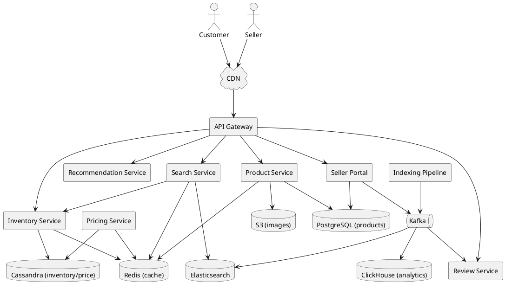
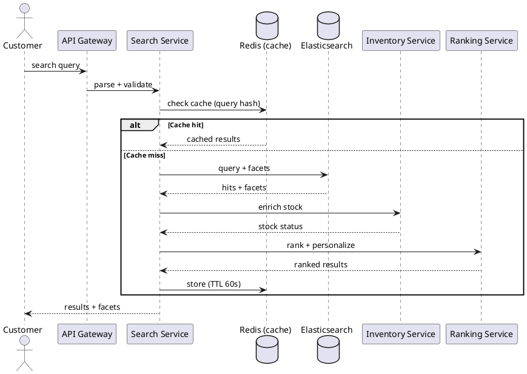
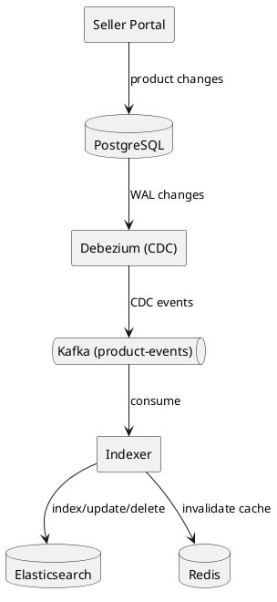
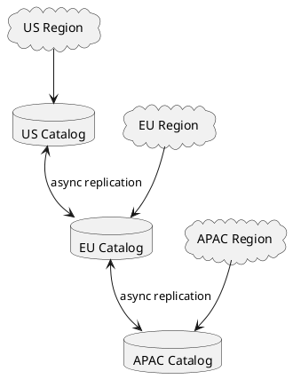

# Product Catalog

## Problem Statement

Design a product catalog for an e-commerce platform like Amazon, Flipkart, or Myntra. Users search, filter, browse, and compare millions of products across categories. Sellers list products, update inventory and pricing, and manage their catalog. The system must handle read-heavy traffic, faceted search, and stay fresh under constant updates.

**Example:**
```
User searches "wireless headphones under ₹5000 with noise cancellation"

System returns:
  - 1,247 results, sorted by relevance
  - Filters: brand (Sony, JBL, boAt), price range, rating, features
  - Facets: category, color, connectivity (BT/wired)
  - Top result: "Sony WH-CH720N" — 4.4★, ₹4,999
  - Each result: image, title, price, rating, delivery ETA, badges

Sellers continuously:
  - Add new products
  - Update price and stock
  - Change descriptions and images
  - Manage variants (size, color)

The catalog must:
  - Serve 10K+ searches/sec at peak
  - Reflect price/stock changes within seconds
  - Support 50M+ SKUs
  - Handle seasonal spikes (festival sales)
  - Power recommendations and related products
```

**Real-world apps:** Amazon, Flipkart, Myntra, Nykaa, Alibaba, eBay, Etsy, Shopify.

**Why it's interesting:**

- **Read-heavy**: 100:1 or 1000:1 read-to-write ratio
- **Faceted search**: Filter by many attributes
- **Freshness**: Price/stock must be current
- **Scale**: Millions of SKUs, billions of queries
- **Ranking**: Relevance + popularity + personalization
- **Variants**: Same product, different sizes/colors
- **Multi-tenant**: Thousands of sellers
- **Consistency**: Search index vs DB must stay in sync

---

## 1. Requirements Clarification

### Functional Requirements
- **Product listing**: Search, browse, filter, sort
- **Faceted search**: Filter by brand, price, rating, attributes
- **Categories**: Hierarchical (Electronics → Audio → Headphones)
- **Product detail**: Title, images, description, specs, reviews, Q&A
- **Variants**: Size, color, storage, etc.
- **Inventory & price**: Real-time or near-real-time
- **Search suggestions**: Autocomplete, typo tolerance
- **Recommendations**: Related products, "also bought"
- **Seller portal**: Add/edit/pause products
- **Bulk operations**: CSV upload for inventory
- **Reviews & ratings**: Aggregated + individual

### Non-Functional Requirements
- **Scale**: 50M SKUs, 10K search QPS peak, 1M product views/sec
- **Latency**: Search < 200 ms p99; product detail < 100 ms p99
- **Availability**: 99.99% — every second of downtime = lost revenue
- **Consistency**: Eventual for search (5-30 sec lag); strong for price/stock at checkout
- **Freshness**: Price updates < 30 sec; stock updates < 5 sec
- **Ranking quality**: Relevance + popularity + personalization
- **Multi-region**: Low latency globally

### Out of Scope
- Cart, checkout, payment (separate systems)
- Warehouse/fulfillment
- Seller onboarding/KYC
- Advertising/promoted listings (mentioned briefly)

---

## 2. Back-of-Envelope Estimation

### Traffic

```
Given:
  SKUs                 = 50,000,000
  DAU                  = 100,000,000
  Searches/user/day    = 10
  Product views/user/day = 20
  Seller updates/day   = 5,000,000
  Peak multiplier      = 5x (festival sale)

Average QPS:
  Searches      = 100M x 10 / 86,400 = ~11,574/sec
  Product views = 100M x 20 / 86,400 = ~23,148/sec
  Seller updates = 5M / 86,400 = ~58/sec

Peak QPS:
  Searches      = ~58,000/sec
  Product views = ~115,000/sec
  Seller updates = ~300/sec

Read:Write ratio = ~600:1 (extremely read-heavy)
```

### Storage

```
Products (raw):
  50M SKUs x 10 KB (title, desc, images URLs, attrs) = ~500 GB

Product images:
  50M SKUs x 5 images x 100 KB = ~25 TB (in S3/CDN)

Product variants:
  50M SKUs x 3 variants = 150M rows
  Per variant: ~1 KB
  Total: ~150 GB

Categories (hierarchical):
  10K categories x 2 KB = ~20 MB

Seller data:
  500K sellers x 50 KB = ~25 GB

Reviews:
  50M products x 100 reviews = 5B reviews
  Per review: ~500 bytes
  Total: ~2.5 TB

Inventory/price (hot):
  Current state only (not history):
  50M rows x 500 bytes = ~25 GB

Search index (Elasticsearch):
  Inverted index + doc values
  ~2-3x raw data size
  Total: ~1.5 TB
  (Sharded across Elasticsearch cluster)

Total DB: ~3 TB
S3 (images): ~25 TB
```

### Bandwidth

```
Product views:
  115,000/sec x 20 KB (JSON) = ~2.3 GB/sec = ~18 Gbps

Search responses:
  58,000/sec x 50 KB = ~2.9 GB/sec = ~23 Gbps

Images (CDN):
  Offloaded to CDN, not origin traffic

Peak origin: ~40 Gbps
CDN egress: ~500 Gbps peak
```

### Latency Budget

```
Search:
  Query parse:           ~5 ms
  Elasticsearch:         ~50 ms
  Rank + personalize:    ~30 ms
  Enrich (price, stock): ~20 ms
  Serialize:             ~15 ms
  Network:               ~30 ms
  Total:                 ~150 ms

Product detail:
  Cache hit:             ~5 ms
  Cache miss + DB:       ~40 ms
  Enrich:                ~10 ms
  Serialize:             ~10 ms
  Total:                 ~65 ms
```

### Freshness Requirements

| Data | Freshness | Method |
|---|---|---|
| Product metadata | Minutes | Batch index |
| Price | < 30 sec | Stream + cache |
| Stock | < 5 sec | Real-time cache |
| Reviews | Minutes | Async aggregation |
| Search index | 5-30 sec | CDC + Kafka |

---

## 3. High-Level Design



### Component Responsibilities

| Component | Role |
|---|---|
| API Gateway | Entry, auth, rate limiting |
| Search Service | Query ES, rank, personalize |
| Product Service | Product CRUD, detail pages |
| Inventory Service | Real-time stock |
| Pricing Service | Real-time price |
| Recommendation Service | Related, personalized |
| Review Service | Reviews, ratings aggregation |
| Seller Portal | Bulk uploads, dashboards |
| Indexing Pipeline | CDC to ES |
| Elasticsearch | Full-text search + facets |
| PostgreSQL | Source of truth for products |
| Redis | Hot cache (product detail, price, stock) |
| Cassandra | High-write inventory/price |
| Kafka | Event bus for indexing |
| S3 | Product images |
| ClickHouse | Analytics |

### Why This Architecture

- **PostgreSQL** for product master data (relational, ACID)
- **Elasticsearch** for search (inverted index, facets, geo)
- **Cassandra** for inventory/price (write-heavy, distributed)
- **Redis** for hot cache (product detail, recent prices)
- **Kafka** for async indexing (decouple writes from search)
- **S3 + CDN** for images (cost-effective, globally fast)
- **Separate read path** (search + cache) from write path (seller updates)

---

## 4. API Design

### Search

```http
GET /v1/search?q=wireless+headphones&category=audio&min_price=100000&max_price=500000&brand=sony,jbl&min_rating=4&sort=relevance&page=1&size=24
```

**Response:**
```json
{
  "query": "wireless headphones",
  "total": 1247,
  "page": 1,
  "size": 24,
  "results": [
    {
      "product_id": "prd-123",
      "title": "Sony WH-CH720N Wireless Headphones",
      "brand": "Sony",
      "category": "Electronics > Audio > Headphones",
      "price_cents": 499900,
      "currency": "INR",
      "discount_percent": 17,
      "rating": 4.4,
      "review_count": 2847,
      "image_url": "https://cdn.example.com/prd-123/main.jpg",
      "in_stock": true,
      "delivery_eta_days": 2,
      "badges": ["Bestseller", "Noise Cancellation"],
      "highlights": ["30h battery", "Active noise cancellation", "Lightweight"]
    }
  ],
  "facets": {
    "brand": [
      {"value": "Sony", "count": 42},
      {"value": "JBL", "count": 38},
      {"value": "boAt", "count": 127}
    ],
    "price_range": [
      {"value": "0-1000", "count": 12},
      {"value": "1000-3000", "count": 345},
      {"value": "3000-5000", "count": 890}
    ],
    "rating": [
      {"value": "4+", "count": 512},
      {"value": "3+", "count": 890}
    ],
    "connectivity": [
      {"value": "bluetooth", "count": 1100},
      {"value": "wired", "count": 147}
    ]
  },
  "suggestions": ["wireless earbuds", "wired headphones", "noise cancelling headphones"]
}
```

### Product Detail

```http
GET /v1/products/prd-123
```

**Response:**
```json
{
  "product_id": "prd-123",
  "title": "Sony WH-CH720N Wireless Headphones",
  "description": "...",
  "brand": {"id": "brand-sony", "name": "Sony"},
  "category_path": ["Electronics", "Audio", "Headphones"],
  "specifications": {
    "connectivity": "Bluetooth 5.2",
    "battery_life": "35 hours",
    "weight": "192g",
    "noise_cancellation": "Active"
  },
  "variants": [
    {"variant_id": "var-1", "color": "Black", "price_cents": 499900, "in_stock": true},
    {"variant_id": "var-2", "color": "White", "price_cents": 499900, "in_stock": false}
  ],
  "images": ["https://cdn.example.com/prd-123/1.jpg", ...],
  "rating": 4.4,
  "review_count": 2847,
  "sellers": [
    {"seller_id": "sel-1", "name": "Sony Official", "price_cents": 499900, "in_stock": true},
    {"seller_id": "sel-2", "name": "ElectroMart", "price_cents": 489900, "in_stock": true}
  ],
  "related": ["prd-456", "prd-789"],
  "also_bought": ["prd-111", "prd-222"]
}
```

### Seller: Add/Update Product

```http
POST /v1/seller/products
Content-Type: application/json
Authorization: Bearer <seller-token>

{
  "title": "New Wireless Headphones",
  "category_id": "cat-audio",
  "brand_id": "brand-sony",
  "description": "...",
  "specifications": {...},
  "images": ["s3://temp/upload-1.jpg"],
  "variants": [
    {"color": "Black", "price_cents": 499900, "stock": 100}
  ]
}
```

### Seller: Bulk Update

```http
POST /v1/seller/products/bulk
Content-Type: multipart/form-data

file: products.csv  (up to 10K rows)
```

**Async processing:**
```json
{
  "job_id": "job-abc",
  "status": "queued",
  "total_rows": 5000,
  "message": "You'll be notified when complete"
}
```

### Inventory & Price Update

```http
PUT /v1/seller/products/prd-123/inventory
{
  "variant_id": "var-1",
  "stock": 95,
  "price_cents": 479900
}
```

### Autocomplete

```http
GET /v1/search/suggest?q=wire
```

**Response:**
```json
{
  "suggestions": [
    {"text": "wireless headphones", "type": "query", "popularity": 9500},
    {"text": "wireless earbuds", "type": "query", "popularity": 8200},
    {"text": "wireless mouse", "type": "query", "popularity": 6100},
    {"text": "Wireless Keyboard (Logitech K380)", "type": "product", "id": "prd-555"}
  ]
}
```

---

## 5. Database Design

### Product Master (PostgreSQL)

```sql
-- Categories (hierarchical)
CREATE TABLE categories (
    category_id BIGINT PRIMARY KEY,
    parent_id BIGINT REFERENCES categories(category_id),
    name VARCHAR(200) NOT NULL,
    slug VARCHAR(200) UNIQUE NOT NULL,
    level INT NOT NULL,
    path TEXT NOT NULL,                          -- "Electronics/Audio/Headphones"
    attributes_schema JSONB,                     -- defines allowed attributes
    is_active BOOLEAN DEFAULT TRUE,
    created_at TIMESTAMP DEFAULT NOW()
);
CREATE INDEX idx_categories_parent ON categories(parent_id);
CREATE INDEX idx_categories_path ON categories(path);

-- Brands
CREATE TABLE brands (
    brand_id BIGINT PRIMARY KEY,
    name VARCHAR(200) NOT NULL,
    slug VARCHAR(200) UNIQUE NOT NULL,
    logo_url TEXT,
    is_verified BOOLEAN DEFAULT FALSE,
    created_at TIMESTAMP DEFAULT NOW()
);

-- Products (master record)
CREATE TABLE products (
    product_id BIGINT PRIMARY KEY,
    seller_id BIGINT NOT NULL,
    category_id BIGINT REFERENCES categories(category_id),
    brand_id BIGINT REFERENCES brands(brand_id),
    title VARCHAR(500) NOT NULL,
    slug VARCHAR(500) UNIQUE NOT NULL,
    description TEXT,
    specifications JSONB,                        -- flexible attributes
    attributes JSONB,                            -- for faceted search
    status VARCHAR(20) DEFAULT 'active',         -- draft, active, paused, out_of_stock, archived
    rating_avg DECIMAL(3,2) DEFAULT 0,
    rating_count INT DEFAULT 0,
    sales_count BIGINT DEFAULT 0,
    created_at TIMESTAMP DEFAULT NOW(),
    updated_at TIMESTAMP DEFAULT NOW()
);
CREATE INDEX idx_products_category ON products(category_id) WHERE status = 'active';
CREATE INDEX idx_products_brand ON products(brand_id);
CREATE INDEX idx_products_seller ON products(seller_id);
CREATE INDEX idx_products_status ON products(status);
CREATE INDEX idx_products_slug ON products(slug);

-- Product images
CREATE TABLE product_images (
    image_id BIGINT PRIMARY KEY,
    product_id BIGINT REFERENCES products(product_id) ON DELETE CASCADE,
    variant_id BIGINT,                            -- null = applies to all
    s3_key TEXT NOT NULL,
    display_order INT DEFAULT 0,
    alt_text VARCHAR(500),
    created_at TIMESTAMP DEFAULT NOW()
);
CREATE INDEX idx_product_images_product ON product_images(product_id, display_order);

-- Product variants (SKU-level)
CREATE TABLE product_variants (
    variant_id BIGINT PRIMARY KEY,
    product_id BIGINT REFERENCES products(product_id) ON DELETE CASCADE,
    sku VARCHAR(100) UNIQUE NOT NULL,
    variant_attributes JSONB,                    -- {color: "Black", size: "M"}
    price_cents BIGINT NOT NULL,
    mrp_cents BIGINT,                             -- strike-through price
    currency VARCHAR(3) DEFAULT 'INR',
    weight_grams INT,
    dimensions_cm JSONB,
    is_active BOOLEAN DEFAULT TRUE,
    created_at TIMESTAMP DEFAULT NOW(),
    updated_at TIMESTAMP DEFAULT NOW()
);
CREATE INDEX idx_variants_product ON product_variants(product_id);
CREATE INDEX idx_variants_sku ON product_variants(sku);

-- Sellers
CREATE TABLE sellers (
    seller_id BIGINT PRIMARY KEY,
    name VARCHAR(200) NOT NULL,
    email VARCHAR(255),
    phone VARCHAR(20),
    is_verified BOOLEAN DEFAULT FALSE,
    rating DECIMAL(3,2),
    total_sales BIGINT DEFAULT 0,
    created_at TIMESTAMP DEFAULT NOW()
);
```

### Inventory & Price (Cassandra)

```sql
-- Real-time inventory per variant
CREATE TABLE inventory (
    variant_id BIGINT,
    warehouse_id INT,
    stock INT,
    reserved INT,
    updated_at TIMESTAMP,
    PRIMARY KEY ((variant_id), warehouse_id)
);

-- Current price per variant
CREATE TABLE price (
    variant_id BIGINT,
    seller_id BIGINT,
    price_cents BIGINT,
    mrp_cents BIGINT,
    discount_percent INT,
    effective_from TIMESTAMP,
    effective_until TIMESTAMP,
    updated_at TIMESTAMP,
    PRIMARY KEY ((variant_id), seller_id)
);

-- Price history (for analytics and audits)
CREATE TABLE price_history (
    variant_id BIGINT,
    effective_from TIMESTAMP,
    seller_id BIGINT,
    price_cents BIGINT,
    mrp_cents BIGINT,
    PRIMARY KEY ((variant_id), effective_from, seller_id)
) WITH CLUSTERING ORDER BY (effective_from DESC);
```

**Why Cassandra?** High write throughput (millions of price/stock updates/day), tunable consistency, distributed.

### Reviews (PostgreSQL + Elasticsearch)

```sql
CREATE TABLE reviews (
    review_id BIGINT PRIMARY KEY,
    product_id BIGINT NOT NULL,
    variant_id BIGINT,
    user_id BIGINT NOT NULL,
    order_id BIGINT,
    rating INT NOT NULL CHECK (rating BETWEEN 1 AND 5),
    title VARCHAR(200),
    body TEXT,
    images TEXT[],
    helpful_count INT DEFAULT 0,
    verified_purchase BOOLEAN DEFAULT FALSE,
    status VARCHAR(20) DEFAULT 'published',     -- published, hidden, pending
    created_at TIMESTAMP DEFAULT NOW()
);
CREATE INDEX idx_reviews_product ON reviews(product_id, created_at DESC);
CREATE INDEX idx_reviews_user ON reviews(user_id, created_at DESC);

-- Aggregated ratings (materialized for fast reads)
CREATE TABLE product_ratings (
    product_id BIGINT PRIMARY KEY,
    rating_avg DECIMAL(3,2) NOT NULL,
    rating_count INT NOT NULL,
    rating_1_count INT DEFAULT 0,
    rating_2_count INT DEFAULT 0,
    rating_3_count INT DEFAULT 0,
    rating_4_count INT DEFAULT 0,
    rating_5_count INT DEFAULT 0,
    updated_at TIMESTAMP DEFAULT NOW()
);
```

### Search Index (Elasticsearch)

```json
{
  "settings": {
    "number_of_shards": 30,
    "number_of_replicas": 2,
    "refresh_interval": "5s",
    "analysis": {
      "analyzer": {
        "product_analyzer": {
          "type": "custom",
          "tokenizer": "standard",
          "filter": ["lowercase", "asciifolding", "edge_ngram_filter"]
        }
      }
    }
  },
  "mappings": {
    "properties": {
      "product_id": {"type": "keyword"},
      "title": {"type": "text", "analyzer": "product_analyzer", "boost": 3},
      "description": {"type": "text"},
      "brand": {"type": "keyword"},
      "category_path": {"type": "keyword"},
      "category_ids": {"type": "keyword"},
      "seller_id": {"type": "keyword"},
      "attributes": {"type": "nested"},
      "price_cents": {"type": "integer"},
      "rating_avg": {"type": "float"},
      "rating_count": {"type": "integer"},
      "sales_count": {"type": "long"},
      "in_stock": {"type": "boolean"},
      "created_at": {"type": "date"},
      "image_url": {"type": "keyword"},
      "location": {"type": "geo_point"}            // for local inventory
    }
  }
}
```

**Why Elasticsearch?** Inverted index for full-text search, native faceting, ranking, geo, and horizontal scalability.

---

## 6. Deep Dive: Search and Faceted Navigation

### Search Architecture



### Multi-Match Query with Boosts

```json
{
  "query": {
    "bool": {
      "must": [
        {
          "multi_match": {
            "query": "wireless headphones",
            "fields": ["title^3", "brand^2", "description", "attributes.*"],
            "type": "best_fields",
            "fuzziness": "AUTO"
          }
        }
      ],
      "filter": [
        {"term": {"category_ids": "cat-audio"}},
        {"range": {"price_cents": {"gte": 100000, "lte": 500000}}},
        {"terms": {"brand": ["Sony", "JBL"]}},
        {"range": {"rating_avg": {"gte": 4}}},
        {"term": {"in_stock": true}}
      ]
    }
  },
  "aggs": {
    "brand": {"terms": {"field": "brand", "size": 20}},
    "price_ranges": {
      "range": {
        "field": "price_cents",
        "ranges": [
          {"to": 100000, "key": "Under ₹1000"},
          {"from": 100000, "to": 300000, "key": "₹1000-₹3000"},
          {"from": 300000, "to": 500000, "key": "₹3000-₹5000"}
        ]
      }
    },
    "rating": {
      "range": {
        "field": "rating_avg",
        "ranges": [
          {"from": 4, "key": "4+ stars"},
          {"from": 3, "to": 4, "key": "3-4 stars"}
        ]
      }
    },
    "attributes": {
      "nested": {"path": "attributes"},
      "aggs": {
        "connectivity": {
          "terms": {"field": "attributes.connectivity"}
        }
      }
    }
  },
  "sort": [
    {"_score": "desc"},
    {"sales_count": "desc"}
  ]
}
```

### Faceted Navigation

Facets are **dynamically computed** from the result set. When a filter is applied, other facets re-compute (facets excluded from current filter).

**Example flow:**
```
Query: "headphones"
Facets: brand [Sony, JBL, boAt], price [..]

User selects brand=Sony
Re-run query with filter
New facets: brand [Sony], price [recomputed for Sony]
```

This is the "post-filter" mode in Elasticsearch. Filters are applied post-aggregation so facets reflect only filtered products.

### Ranking

Default ranking: **relevance + popularity**

```
score = 0.6 x text_relevance + 0.4 x popularity_score

popularity_score = log(sales_count) + 0.5 x log(views_30d) + rating_avg
```

**Personalization:**
- User's past searches (recency-weighted)
- User's past purchases (category preference)
- User's location (nearby sellers)
- User's price sensitivity (from history)

**Adjusted score:**
```
final_score = base_score x (1 + personalization_boost)
```

### Autocomplete

**Types:**
- **Query completion**: "wireless" → "wireless headphones"
- **Product completion**: "iphone 15" → "iPhone 15 Pro Max 256GB"
- **Category completion**: "electronics" → "Electronics > Phones"
- **Brand completion**: "son" → "Sony"

**Implementation:** Elasticsearch completion suggester (edge n-gram + FST index) for sub-50ms response.

### Synonym Handling

```
"headphones" ≡ "headphone" ≡ "cans" ≡ "earphones"
"mobile" ≡ "phone" ≡ "cellphone"
"tv" ≡ "television"
```

Managed via Elasticsearch synonym token filter.

### Typo Tolerance

- **Fuzziness AUTO**: Allows edit distance 1 for short terms, 2 for longer
- **Prefix matching**: "headphne" matches "headphone"
- **Did-you-mean**: "wireles hedphones" → "did you mean 'wireless headphones'?"

### Zero Results Handling

```
If no exact matches:
  - Try relaxed query (remove filters one by one)
  - Fall back to broad match
  - Show related categories
  - Show popular products in category
  - Never show a dead end
```

### Ranking Signals

| Signal | Weight | Source |
|---|---|---|
| Text relevance (BM25) | 40% | Elasticsearch |
| Sales count (30d) | 20% | Analytics |
| Rating avg | 15% | Reviews |
| Recency of listing | 5% | Product DB |
| Personalization | 20% | User profile |

### Search Cache

**Cache key:** hash of normalized query + filters + user segment (not user_id — that breaks cache).

```
Key: search:{hash(query + filters + "segment:" + segment)}
Value: serialized results
TTL: 60 seconds
```

**Why short TTL?** Prices, stock change. Stale search results annoy users.

**Cache invalidation:** On product updates, invalidate related queries (complex). Easier: short TTL.

### A/B Testing Ranking

```
User → 50% control (default ranking)
     50% experiment (new ranking)

Compare: CTR, conversion, revenue per search
```

---

## 7. Deep Dive: Indexing Pipeline (CDC)

### The Challenge

Search index (Elasticsearch) must stay in sync with product master (PostgreSQL).

**Options:**
1. **Dual write**: App writes to both PG and ES
2. **CDC (Change Data Capture)**: Capture PG changes, stream to ES
3. **Batch reindex**: Periodic full reindex (slow)
4. **Event-driven**: Producer publishes events, consumers index

**Recommendation:** Event-driven with Kafka + fallback batch reindex.

### Indexing Architecture



### Event Schema

```json
{
  "event_id": "evt-abc123",
  "event_type": "product.updated",
  "product_id": "prd-123",
  "timestamp": "2026-09-17T10:00:00Z",
  "changes": {
    "title": "New Title",
    "price_cents": 479900,
    "attributes": {"color": "Black"}
  },
  "version": 42
}
```

### Indexing Flow

1. Seller updates product via Seller Portal
2. Product Service writes to PostgreSQL
3. Debezium captures change from PostgreSQL WAL
4. Publishes to Kafka `product-events` topic
5. Indexer consumes events
6. Enriches with aggregated data (rating, stock) from Redis/DB
7. Upserts into Elasticsearch
8. Invalidates related caches in Redis

### Freshness Targets

| Change Type | Latency to ES |
|---|---|
| Title/description | 5-30 sec |
| Price | 5-10 sec (via Redis bypass for search) |
| Stock | 1-5 sec (via Redis for filters) |
| New product | 10-30 sec |

**Why not instant?** Full index sync is expensive. Instead:
- **Price/stock** are checked live from Redis at search time
- **Attributes** (title, description) are indexed with slight delay
- **New products** appear after indexing (~10-30 sec)

### Handling Hot Products

**Problem:** A viral product gets 100K updates/sec (bots or bugs).

**Mitigation:**
- **Debounce**: Batch multiple updates to same product within 1 sec
- **Rate limit** per seller
- **Alert** on abnormal update patterns

### Batch Reindex

For schema changes or drift correction:

```
1. Create new index with new mapping (ES alias switch)
2. Bulk load from PostgreSQL (parallel)
3. Optionally reindex from old index
4. Switch alias to new index
5. Delete old index
```

**Frequency:** Monthly or on-demand.

### Consistency Guarantees

- **At-least-once** from Kafka (idempotent indexing)
- **Monotonic versions**: Ignore out-of-order events (use `version` field)
- **Reconciliation job**: Nightly compare PG vs ES sample; alert on drift

---

## 8. Deep Dive: Price and Inventory Freshness

### The Challenge

Search result must show **current price and stock**. Stale data = unhappy customer + lost sale.

**Naive approach:** Index price/stock in ES. Reindex on every change. Too slow.

**Better approach:** Two-tier:
- **ES** for text relevance + attributes (relaxed freshness: 30 sec)
- **Redis** for price + stock (tight freshness: < 1 sec)

### Search-Time Enrichment

```java
public SearchResponse search(SearchRequest req) {
    // 1. Search ES for product IDs
    SearchResponse esResponse = es.search(req);
    List<Long> productIds = esResponse.getProductIds();
    
    // 2. Batch fetch price/stock from Redis
    Map<Long, PriceStock> live = redis.mget(productIds);
    
    // 3. Merge results (ES attributes + live price/stock)
    List<Result> results = merge(esResponse, live);
    
    // 4. Apply filters that depend on live data (e.g., "in stock only")
    results = filterByLive(results, req);
    
    // 5. Sort and paginate
    return paginate(results, req);
}
```

**Redis key format:**
```
Key: price:{variant_id}
Value: {price_cents, mrp_cents, discount, updated_at}

Key: stock:{variant_id}
Value: {stock, updated_at}
```

### Price/Stock Write Path

```
Seller updates price
  → Write to PostgreSQL (master)
  → Write to Redis (fast read)
  → Publish to Kafka (async: index update, analytics)

Read path:
  Search → Enrich from Redis (always fresh)
  Product detail → Redis cache (fast)
```

### Redis vs Cassandra

- **Cassandra**: Source of truth for inventory (durable, distributed)
- **Redis**: Hot cache for search-time reads (sub-ms)

**Flow:**
```
Update → Cassandra (durable) + Redis (cache) + Kafka (event)
Read → Redis (fast) → on miss: Cassandra (slower) → populate Redis
```

### Stock Reservation During Checkout

When user clicks "Add to cart" or "Buy":
1. Reserve stock in Cassandra (`reserved` column)
2. Hold for 15 min
3. On order: decrement `stock`
4. On timeout: release `reserved`

**Consistency:** Checkout always reads Cassandra (source of truth), not Redis.

### Flash Sale Handling

**Scenario:** "iPhone at 50% off, 1000 units"

```
T-1 day: Pre-warm Redis with price/stock
T=0: Traffic spikes 100x
  - Redis handles hot reads easily
  - Cassandra handles writes (queue orders if needed)
  - ES search results show high demand signal
  - Rate limit per user (1 unit)
  - CAPTCHA on bot traffic
```

**Stock decrement:** Use Redis `DECR` for atomic reservation during sale; sync to Cassandra async.

### Price Consistency

**Problem:** Different users see different prices at same time (cache drift).

**Solution:**
- Single source of truth (Cassandra)
- Redis updates within 1 sec
- Cached HTTP responses (CDN) invalidated on price change
- In-session price lock (price doesn't change mid-session)

---

## 9. Deep Dive: Personalization

### Why Personalize?

Generic search returns generic results. Personalized results convert better.

**Signals:**
- Past searches (recency-weighted)
- Past clicks (strong signal)
- Past purchases (strongest signal)
- Wishlist additions
- Cart additions
- Time spent on products

### User Profile (Real-Time)

```json
{
  "user_id": "u-123",
  "interests": {
    "electronics": 0.8,
    "audio": 0.9,
    "fitness": 0.4
  },
  "brand_affinity": {
    "sony": 0.7,
    "bose": 0.5
  },
  "price_range": {"min": 200000, "max": 800000, "avg": 450000},
  "recent_searches": ["wireless headphones", "bluetooth speaker"],
  "recent_clicks": ["prd-123", "prd-456"],
  "updated_at": "2026-09-17T10:00:00Z"
}
```

**Storage:** Redis (hot) + Cassandra (durable).

### Ranking with Personalization

```
final_score = text_relevance
            x (1 + category_affinity_boost)
            x (1 + brand_affinity_boost)
            x (1 + price_preference_boost)
            x popularity_score
```

**Boosts capped** to avoid over-filtering.

### Collaborative Filtering

"Users like you also bought..." — computed offline.

**Algorithm:**
- Matrix factorization (ALS, SVD)
- Item-item similarity (co-purchase graph)
- Embeddings (two-tower model)

**Serving:** Pre-compute top-N recommendations per user; refresh daily.

### Real-Time Personalization

For some signals, real-time is critical:
- User just viewed 5 headphones → show more headphones
- User just added to cart → show related accessories

**Implementation:** In-memory session state + streaming updates.

### Privacy Considerations

- **Consent**: Explicit opt-in for personalization
- **Transparency**: User can view/delete their profile
- **Data minimization**: Store only what's needed
- **GDPR/DPDP**: Right to explanation, right to erasure

### Cold Start

New user → no history.
- Show popular products in category
- Use demographics (if provided)
- Learn from first few interactions

### A/B Testing

- Control: generic ranking
- Experiment 1: personalized ranking
- Experiment 2: personalized + collaborative filtering
- Experiment 3: heavier personalization

**Measure:** CTR, add-to-cart rate, conversion.

---

## 10. Scaling Considerations

### Read Scaling

- **Elasticsearch**: 30+ shards, 2-3 replicas
- **Redis cluster**: shard by product_id
- **CDN**: images and static JSON
- **Read replicas**: PostgreSQL for detail queries

### Write Scaling

- **PostgreSQL**: sharded by `seller_id` (natural partition)
- **Cassandra**: for inventory/price (linear scaling)
- **Kafka**: partitioned by product_id for ordered indexing
- **Elasticsearch**: write throughput ~100K docs/sec per cluster

### Sharding Strategy

**PostgreSQL:** Shard by `seller_id`.
```
shard_id = hash(seller_id) % N
```

**Why seller_id?** Sellers manage their catalog independently. Admin queries (rare) can fan out.

**Alternative:** Shard by `category_id` if queries are category-scoped.

**Elasticsearch:** Shards by document hash. Routing key = `product_id`.

**Cassandra:** Partitions by `variant_id`. All warehouses for a variant on one partition.

### Hot Product Handling

**Scenario:** iPhone launch → 100K views/sec on 1 product.

**Mitigations:**
1. **Redis cache**: Hot product served from cache (sub-ms)
2. **CDN edge cache**: Static JSON cached at edge
3. **Request coalescing**: Multiple requests for same product collapse into 1 DB fetch
4. **Circuit breaker**: If DB is slow, serve cached (even if stale)

### Multi-Region



**Approach:** Region-local read replicas; write to primary region.

**Latency:** 10-50 ms local reads; write-forwarding for cross-region.

**Data residency:** Product catalog is not PII; can replicate freely.

### Peak Handling (Festival Sale)

- **Pre-warm** caches for known hot products
- **Auto-scale** API servers (5x)
- **Rate limit** per user (not too aggressive)
- **Queue** seller updates (during peak, throttle writes)
- **Monitor** queue depth, latency, error rate

### Search Relevance Tuning

- **Offline evaluation**: NDCG, MAP, MRR on labeled data
- **Online A/B**: CTR, conversion, revenue
- **Continuous learning**: Bandits for ranking exploration

---

## 11. Bottlenecks and Trade-offs

| Concern | Solution | Trade-off |
|---|---|---|
| Search index freshness | CDC + Kafka | 5-30 sec lag |
| Price/stock freshness | Redis at search time | Cache complexity |
| Read scale | Elasticsearch + Redis + CDN | Cost |
| Write scale | Cassandra for hot writes | Eventual consistency |
| Ranking quality | Personalization + A/B | Complexity |
| Cache invalidation | Short TTL + event invalidation | Stale on invalidation miss |
| Multi-region | Async replication | Cross-region lag |
| Faceted search cost | Post-filter mode | Complex queries |
| Hot product | Redis + CDN + circuit breaker | Stale risk |
| Bulk updates | Async queue | Delayed visibility |

### Design Decisions Summary

| Decision | Choice | Rationale |
|---|---|---|
| Product master | PostgreSQL | ACID, relational |
| Search | Elasticsearch | Inverted index, facets |
| Inventory/price | Cassandra | Write-heavy |
| Hot cache | Redis | Sub-ms reads |
| Indexing | Debezium CDC + Kafka | Decoupled, reliable |
| Images | S3 + CDN | Cost-effective, fast |
| Ranking | Relevance + popularity + personalization | Quality |
| Facets | Post-filter in ES | Accurate counts |
| Multi-region | Region-local reads + async replication | Latency, compliance |
| Search cache | 60-sec TTL | Balance freshness and load |

---

## 12. Failure Scenarios

### Elasticsearch Cluster Down

**Impact:** Search unavailable.

**Mitigation:**
- Fall back to PostgreSQL LIKE queries (slow but works)
- Serve cached popular searches
- Circuit breaker to protect DB
- Alert immediately

### Redis Down

**Impact:** Hot cache miss; every request hits Cassandra/PG.

**Mitigation:**
- Cassandra can absorb read load (with higher latency)
- Circuit breaker to avoid cascade
- Redis Sentinel for HA failover (~10 sec)

### Cassandra Down

**Impact:** Can't update inventory/price.

**Mitigation:**
- Queue updates in Kafka
- Continue serving reads from Redis cache (may be stale)
- Restore Cassandra; replay Kafka

### Kafka Down

**Impact:** Indexing pipeline stops; ES gets stale.

**Mitigation:**
- Buffer events in Product Service memory (bounded)
- Fallback to batch reindex
- Alert if lag > 5 min

### PostgreSQL Primary Down

**Impact:** Product master writes fail.

**Mitigation:**
- Multi-AZ failover (~30 sec)
- Reads from replicas
- Queue seller updates

### CDN Outage

**Impact:** Images slow or unavailable.

**Mitigation:**
- Multi-CDN strategy (fallback to secondary)
- Serve placeholder images
- Notify ops

### Search Index Drift

**Impact:** ES shows products that no longer exist or wrong data.

**Mitigation:**
- Nightly reconciliation job
- Alert on drift > 0.1%
- Full reindex weekly

### Seller Spam / Abuse

**Impact:** Catalog polluted with fake/junk products.

**Mitigation:**
- KYC for sellers
- Automated content moderation (ML)
- User reports
- Manual review queue
- Ban repeat offenders

### Price Update Storm

**Impact:** Millions of price updates in seconds (bug or sale).

**Mitigation:**
- Rate limit per seller
- Debounce duplicate updates
- Queue and process gradually
- Alert on abnormal patterns

### Fraudulent Reviews

**Impact:** Misleading ratings.

**Mitigation:**
- Verified purchase only
- ML detection (spam, sentiment)
- User reports
- Manual review

### Regional Outage

**Impact:** One region unavailable.

**Mitigation:**
- DNS failover to another region (30-60 sec)
- Cross-region read replicas
- Alert ops

---

## 13. Monitoring and Alerts

### Key Metrics

| Metric | Target | Alert Threshold |
|---|---|---|
| Search p99 | < 200 ms | > 500 ms |
| Product detail p99 | < 100 ms | > 300 ms |
| Autocomplete p99 | < 50 ms | > 100 ms |
| ES indexing lag | < 30 sec | > 5 min |
| Price freshness p99 | < 5 sec | > 30 sec |
| Stock freshness p99 | < 3 sec | > 15 sec |
| Redis hit ratio (product) | > 95% | < 85% |
| Search conversion rate | baseline | drop > 10% |
| Zero-result rate | < 5% | > 10% |
| Cache stampede events | 0 | > 0 |
| Reconciliation drift | 0 | > 0.1% |

### Dashboards

- **Traffic**: Search QPS, product view QPS, seller update rate
- **Latency**: p50/p95/p99 for search, detail, autocomplete
- **Search quality**: Zero-result rate, CTR, conversion
- **Freshness**: ES lag, price/stock staleness
- **Infrastructure**: ES cluster health, Redis, Cassandra, PG
- **Business**: Top searches, top products, categories
- **Seller**: Updates/sec, bulk job queue

### Alerts

- **P0**: ES down, PG primary down, Kafka down, reconciliation drift > 1%
- **P1**: Search p99 > 500 ms, indexing lag > 5 min
- **P2**: Redis hit ratio < 85%, high zero-result rate
- **P3**: Seller bulk job backlog, CDN error rate

### Business KPIs

- **Search-to-click rate** (CTR)
- **Click-to-cart rate**
- **Cart-to-order rate**
- **Average order value** (AOV)
- **Search exit rate** (user leaves without clicking)
- **Time to first click**
- **Repeat search rate** (user searches again after first result)

---

## 14. Cost Estimation

Rough monthly cost (AWS, us-east-1) for 50M SKUs, 10K search QPS:

| Component | Spec | Cost/month |
|---|---|---|
| API servers | 60 x c6g.large | ~$3,600 |
| Elasticsearch | 20 x r6g.2xlarge | ~$18,000 |
| PostgreSQL | 8 shards x db.r6g.2xlarge | ~$18,000 |
| Read replicas | 16 x db.r6g.xlarge | ~$18,000 |
| Cassandra | 12 x i3.2xlarge | ~$12,000 |
| Redis cluster | 15 x cache.r6g.2xlarge | ~$8,000 |
| Kafka (MSK) | 6 brokers | ~$2,500 |
| S3 (images) | 25 TB | ~$600 |
| S3 (logs) | 5 TB | ~$120 |
| CDN | 500 TB/month | ~$40,000 |
| ClickHouse | 4 x c6g.2xlarge | ~$1,600 |
| Monitoring | Datadog | ~$12,000 |
| **Total** | | **~$134,420/month** |

**Cost optimization:**
- Reserved instances (30-40% savings)
- Smaller ES cluster (start smaller, scale up)
- S3 Intelligent-Tiering for images
- Self-hosted observability
- Cache more aggressively (reduce origin load)

**Revenue note:** Search drives conversion. A 1% improvement in conversion is worth far more than the infra cost.

---

## 15. Extensions and Follow-ups

### Voice Search

- Speech-to-text (Google, Whisper)
- Intent extraction
- Voice-optimized results

**Use case:** Smart speakers, mobile.

### Visual Search

- Upload image, find similar products
- Embeddings + vector search (Pinecone, Weaviate)
- "Shop the look" for fashion

### AR/VR Try-On

- Virtual try-on for eyewear, makeup, furniture
- AR integration in mobile app

### AI-Powered Recommendations

- LLM-based chat ("Help me find a gift for my dad")
- Conversational commerce
- Semantic search (embeddings)

### Local Inventory

- Same-day delivery (from nearby stores)
- Geo-filtered results
- Store pickup

**Implementation:** Store locations in ES as geo points; rank by distance.

### B2B Catalog

- Bulk pricing tiers
- Contract pricing
- Multi-user accounts

### Advertisements

- Promoted listings (paid placement)
- Sponsored brands
- Display ads

**Implementation:** Blend organic + sponsored results.

### Reviews and Q&A

- Verified purchase reviews
- Q&A moderated by sellers
- Photo reviews

### Bundles and Kits

- "Frequently bought together"
- Custom bundles
- Dynamic pricing

### Subscription Products

- "Subscribe and save"
- Recurring orders
- Auto-replenishment

### Cross-Border

- Currency conversion
- Customs/duties
- Language localization

### Sustainability

- Eco-friendly badges
- Carbon footprint per product
- Green shipping options

---

## 16. Comparison: Catalog vs Other Systems

| Aspect | Product Catalog | Social Feed | Video Streaming |
|---|---|---|---|
| Read:Write | 600:1 | 100:1 | 1000:1 |
| Data size | GBs-TBs | TBs | PBs |
| Freshness | Seconds | Seconds | Hours |
| Ranking | Relevance + pop | Recency + engage | Watch time |
| Search | Critical | Optional | Critical |
| Media | Images | Images + video | Video |
| Cost driver | Egress + search | Compute | Egress + storage |

**Key insight:** Product catalog is **read-heavy but data-light** — the challenge is ranking + freshness, not storage.

---

## 17. Summary

| Aspect | Decision |
|---|---|
| Product master | PostgreSQL (sharded by seller_id) |
| Search | Elasticsearch (30 shards, 2 replicas) |
| Inventory/price | Cassandra (durable) + Redis (cache) |
| Indexing | Debezium CDC + Kafka |
| Images | S3 + CDN |
| Ranking | Relevance + popularity + personalization |
| Faceted nav | Post-filter mode in ES |
| Freshness | Price < 5s, stock < 3s, attributes < 30s |
| Multi-region | Region-local reads + async replication |
| Scale | 50M SKUs, 10K search QPS, 100K product views/sec |
| Latency | Search < 200 ms, detail < 100 ms |
| Availability | 99.99% |
| Cost | ~$134K/month |

**Key takeaways:**

- **Search and product master are separate concerns** — ES for search, PG for source of truth
- **Two-tier freshness** — ES for attributes (30s), Redis for price/stock (1s)
- **CDC + Kafka** keeps ES in sync without dual writes
- **Faceted search** uses post-filter mode for accurate counts
- **Personalization boosts ranking** but must be capped
- **Redis at search time** solves price/stock staleness without reindexing
- **Cassandra** handles write-heavy inventory updates
- **CDN** is essential for images at scale
- **Read-heavy, data-light** — the challenge is ranking + freshness, not storage
- **Never show a dead end** — always have fallbacks for zero results

**Similar Pattern Problems:**

- Job Search Platform (similar search + facets)
- Social Feed (ranking, personalization)
- Video Streaming (search + recommendations)
- URL Shortener (read-heavy design)
- Search Autocomplete (dedicated problem)
- Recommendations (personalization signals)