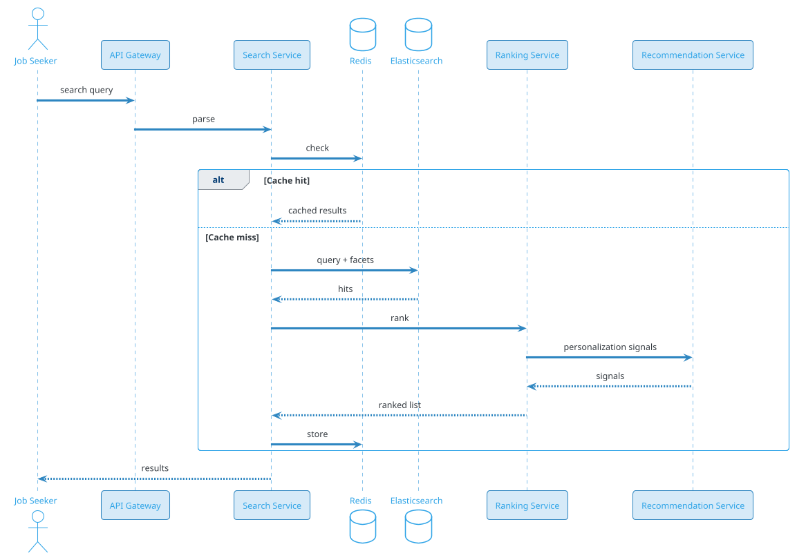
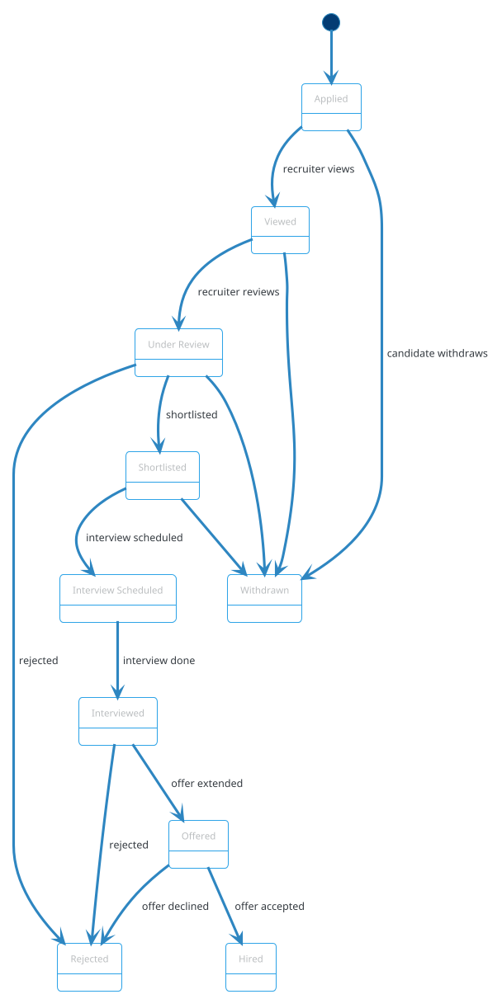
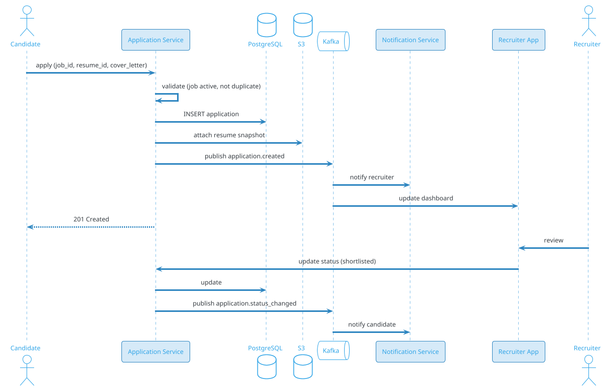

# Job Search Platform

## Problem Statement

Design a job search platform like LinkedIn, Naukri, or Indeed. Job seekers search for jobs, apply, track applications, and manage resumes. Recruiters post jobs, search for candidates, and manage the hiring pipeline. The system must handle complex matching, ranking, notifications, and scale to millions of users.

**Example:**
```
Job seeker Priya, 5 years experience in backend engineering, Bangalore.

Flow:
  1. Search: "senior backend engineer" in Bangalore, 3-8 yrs exp, Python/Go
  2. Filters: company size, remote/onsite, salary range, industry
  3. Get 500 results ranked by relevance + personalization
  4. Click job → view details → apply (resume auto-attached)
  5. Track application status (applied, viewed, shortlisted, interview, offer, rejected)
  6. Get recommendations: similar jobs, companies hiring now
  7. Recruiter sees application → views profile → shortlists → schedules interview
  8. Both parties get notifications at each stage

Recruiters get:
  - Job posting management
  - Candidate search (boolean + semantic)
  - Application tracking (ATS)
  - Interview scheduling
  - Analytics (funnel, time-to-hire)

Platform gets:
  - Job posting fees
  - Featured listings
  - Recruiter subscriptions
  - Resume database access fees
```

**Real-world apps:** LinkedIn, Naukri, Indeed, Glassdoor, Monster, AngelList, Wellfound.

**Why it's interesting:**

- **Two-sided marketplace** (job seekers + recruiters)
- **Semantic matching** (skills, experience, location)
- **Resume parsing** (unstructured to structured)
- **Ranking + personalization** (relevance, recency, fit)
- **Application tracking** (state machine, notifications)
- **Privacy** (resumes, salary, contact info)
- **Search scale** (millions of jobs, thousands of QPS)
- **Fraud** (fake jobs, fake candidates)
- **GDPR/DPDP** (personal data, right to erasure)

---

## 1. Requirements Clarification

### Functional Requirements
- **Job posting**: Recruiter creates job with title, description, skills, location, salary
- **Job search**: Full-text + filters (location, exp, salary, skills, company, remote)
- **Resume upload**: Parse resume, extract structured data
- **Apply**: One-click apply with resume, cover letter
- **Application tracking**: Status per application
- **Recruiter search**: Find candidates by skills, exp, location, keywords
- **Recommendations**: Similar jobs, similar candidates
- **Notifications**: Email, push, in-app for status changes
- **Messaging**: Candidate ↔ recruiter chat
- **Saved jobs / saved searches**: For job seekers
- **Alerts**: Email alerts for new matching jobs
- **Analytics**: For recruiters (views, applies, conversion)
- **Verification**: Company verification, candidate verification

### Non-Functional Requirements
- **Scale**: 500M job seekers, 50M recruiters, 100M jobs, 10B applications
- **Latency**: Search < 300 ms p99; apply < 500 ms p99
- **Availability**: 99.99% — recruitment happens 24/7 globally
- **Consistency**: Strong for applications, eventual for search index
- **Privacy**: Resume data is PII — encryption, access controls
- **Freshness**: New jobs indexed within 1 min; applications immediate
- **Compliance**: GDPR, DPDP, anti-discrimination laws (EEOC)
- **Ranking quality**: Match relevance, quality, freshness
- **Two-sided**: Fair for job seekers and recruiters

### Out of Scope
- Interview scheduling (calendar integration) — separate problem
- Background checks
- Payroll
- Video interviews (webrtc)

---

## 2. Back-of-Envelope Estimation

### Traffic

```
Given:
  Job seekers          = 500,000,000
  Recruiters           = 50,000,000
  Active jobs          = 100,000,000
  Applications/day     = 50,000,000
  Job searches/day     = 200,000,000
  Job views/day        = 1,000,000,000
  Resume views/day     = 500,000,000
  Peak multiplier      = 3x

Average QPS:
  Searches         = 200M / 86,400 = ~2,315/sec
  Job views        = 1B / 86,400 = ~11,574/sec
  Applications     = 50M / 86,400 = ~579/sec
  Resume views     = 500M / 86,400 = ~5,787/sec

Peak QPS:
  Searches         = ~6,945/sec
  Job views        = ~34,722/sec
  Applications     = ~1,737/sec
  Resume views     = ~17,361/sec

Read:Write ratio = ~30:1
```

### Storage

```
Users (job seekers):
  500M x 5 KB = ~2.5 TB
  Resumes in S3: 500M x 500 KB = ~250 TB

Recruiters:
  50M x 10 KB = ~500 GB

Companies:
  5M companies x 50 KB = ~250 GB

Jobs:
  100M jobs x 20 KB (description + metadata) = ~2 TB
  Expired jobs (5 years): 500M x 20 KB = ~10 TB

Applications:
  50M/day x 365 x 5 years = 91B applications
  Per application: ~2 KB
  Total: ~182 TB

Messages (recruiter ↔ candidate):
  1B messages over 5 years
  Per message: ~1 KB
  Total: ~1 TB

Audit logs:
  1T events over 5 years x 200 bytes = ~200 TB

Search index (Elasticsearch):
  Jobs: ~3 TB
  Candidates (skills, experience): ~5 TB
  Total: ~8 TB

Total DB: ~200 TB
S3 (resumes, logos): ~500 TB
```

### Bandwidth

```
Job views:
  34,722 x 20 KB = ~700 MB/sec = ~5.6 Gbps

Search responses:
  6,945 x 100 KB = ~700 MB/sec = ~5.6 Gbps

Resume downloads:
  200 concurrent x 500 KB = ~100 MB/sec

Images (logos, avatars):
  CDN offloaded

Peak: ~12 Gbps
```

### Latency Budget

```
Job search:
  Query parse:          ~10 ms
  Elasticsearch:        ~80 ms
  Ranking:              ~50 ms
  Personalization:      ~20 ms
  Enrich (company):     ~20 ms
  Serialize:            ~20 ms
  Network:              ~50 ms
  Total:                ~250 ms

Apply:
  Auth:                 ~20 ms
  Validate job active:  ~10 ms
  Check duplicate:      ~10 ms
  Attach resume:        ~20 ms
  Save application:     ~30 ms
  Queue notifications:  ~10 ms
  Total:                ~100 ms

Recruiter search:
  Query parse:          ~20 ms
  Elasticsearch:        ~150 ms
  Ranking:              ~80 ms
  Total:                ~250 ms
```

---

## 3. High-Level Design

```d2
direction: down

js: "Job Seeker" {shape: person}
recruiter: Recruiter {shape: person}
admin: "Admin/Moderator" {shape: person}

cdn: CDN {shape: cloud}
gw: "API Gateway" {shape: hexagon}

us: "User Service" {shape: rectangle}
jobs: "Job Service" {shape: rectangle}
ss: "Search Service" {shape: rectangle}
apps: "Application Service" {shape: rectangle}
res: "Resume Service" {shape: rectangle}
recs: "Recommendation Service" {shape: rectangle}
ns: "Notification Service" {shape: rectangle}
msg: "Messaging Service" {shape: rectangle}
vs: "Verification Service" {shape: rectangle}
fs: "Fraud Service" {shape: rectangle}

pg: "PostgreSQL (core data)" {shape: cylinder}
es: "Elasticsearch (search)" {shape: cylinder}
redis: "Redis (cache, sessions)" {shape: cylinder}
s3: "S3 (resumes, logos)" {shape: cylinder}
kafka: "Kafka (events)" {shape: queue}
ch: "ClickHouse (analytics)" {shape: cylinder}
ml: "ML Models" {shape: rectangle}

js -> cdn
recruiter -> cdn
admin -> cdn
cdn -> gw

gw -> us
gw -> jobs
gw -> ss
gw -> apps
gw -> res
gw -> recs
gw -> msg
gw -> vs

jobs -> pg
jobs -> kafka
ss -> es
ss -> redis
apps -> pg
apps -> kafka
res -> s3
recs -> ml
recs -> es
recs -> redis
kafka -> ns
kafka -> ch
kafka -> fs
fs -> kafka
```

### Component Responsibilities

| Component | Role |
|---|---|
| API Gateway | Entry, auth, rate limit |
| User Service | Job seekers, recruiters, companies |
| Job Service | Job CRUD, status management |
| Search Service | Full-text + semantic search, facets |
| Application Service | Apply, track, status workflow |
| Resume Service | Upload, parse, store |
| Recommendation Service | Similar jobs, candidate matches |
| Notification Service | Email, push, in-app |
| Messaging Service | Recruiter ↔ candidate chat |
| Verification Service | Company, candidate verification |
| Fraud Service | Fake jobs, fake candidates, spam |
| ML Models | Ranking, matching, embeddings |
| PostgreSQL | Core transactional data |
| Elasticsearch | Search indexes (jobs, candidates) |
| Redis | Sessions, caches, rate limit |
| S3 | Resumes, logos, attachments |
| Kafka | Event bus |
| ClickHouse | Analytics |

### Why This Architecture

- **PostgreSQL** for transactional core (jobs, applications, users)
- **Elasticsearch** for search (inverted index, facets, semantic)
- **S3** for resume PDFs and documents
- **Kafka** for events (application status, notifications, analytics)
- **Redis** for cache, sessions, rate limiting
- **ML** for ranking, matching, recommendations
- **ClickHouse** for recruiter analytics

---

## 4. API Design

### Job Seeker: Search Jobs

```http
GET /v1/jobs/search?q=senior+backend+engineer&location=bangalore&exp_min=3&exp_max=8&skills=python,go&remote=hybrid&salary_min=3000000&posted_within=7d&page=1&size=20
```

**Response:**
```json
{
  "total": 1247,
  "page": 1,
  "size": 20,
  "jobs": [
    {
      "job_id": "job-123",
      "title": "Senior Backend Engineer",
      "company": {
        "company_id": "comp-456",
        "name": "TechCorp",
        "logo_url": "https://cdn.example.com/comp-456/logo.png",
        "size": "1000-5000",
        "rating": 4.2,
        "verified": true
      },
      "location": {"city": "Bangalore", "country": "IN", "remote": "hybrid"},
      "experience": {"min_years": 4, "max_years": 8},
      "salary": {"min_cents": 3000000, "max_cents": 5000000, "currency": "INR"},
      "skills": ["Python", "Go", "PostgreSQL", "Kafka"],
      "posted_at": "2026-09-15T10:00:00Z",
      "applicants_count": 47,
      "match_score": 0.92,
      "highlights": ["Series B funded", "Remote friendly", "ESOPs"]
    }
  ],
  "facets": {
    "company_size": [
      {"value": "1-50", "count": 45},
      {"value": "51-200", "count": 120},
      {"value": "1000-5000", "count": 340}
    ],
    "experience": [
      {"value": "0-2", "count": 100},
      {"value": "3-5", "count": 500},
      {"value": "6-10", "count": 400}
    ],
    "remote": [
      {"value": "remote", "count": 300},
      {"value": "hybrid", "count": 500},
      {"value": "onsite", "count": 447}
    ]
  }
}
```

### Job Detail

```http
GET /v1/jobs/job-123
```

**Response:**
```json
{
  "job_id": "job-123",
  "title": "Senior Backend Engineer",
  "description": "...",
  "responsibilities": ["Design APIs", "Lead architecture", "Mentor juniors"],
  "requirements": ["5+ years backend", "Python or Go", "Distributed systems"],
  "nice_to_have": ["Kubernetes", "AWS", "Kafka"],
  "company": {...},
  "recruiter": {
    "recruiter_id": "rec-789",
    "name": "Anita Verma",
    "title": "Tech Recruiter",
    "response_rate": 0.85
  },
  "benefits": ["Health insurance", "ESOPs", "Flexible hours"],
  "application_deadline": "2026-10-15",
  "status": "active",
  "posted_at": "2026-09-15T10:00:00Z",
  "views_count": 2341,
  "applicants_count": 47,
  "similar_jobs": ["job-456", "job-789"]
}
```

### Apply to Job

```http
POST /v1/jobs/job-123/apply
Content-Type: application/json
Idempotency-Key: apply-uuid-xyz

{
  "resume_id": "res-456",
  "cover_letter": "...",
  "expected_salary_cents": 4500000,
  "notice_period_days": 30,
  "custom_answers": {
    "why_this_role": "...",
    "visa_required": false
  }
}
```

**Response 201:**
```json
{
  "application_id": "app-789",
  "job_id": "job-123",
  "status": "applied",
  "applied_at": "2026-09-17T10:00:00Z"
}
```

### Application Tracking (Job Seeker)

```http
GET /v1/applications
```

**Response:**
```json
{
  "applications": [
    {
      "application_id": "app-789",
      "job": {
        "job_id": "job-123",
        "title": "Senior Backend Engineer",
        "company_name": "TechCorp"
      },
      "status": "shortlisted",
      "status_history": [
        {"status": "applied", "at": "2026-09-17T10:00:00Z"},
        {"status": "viewed", "at": "2026-09-17T14:00:00Z"},
        {"status": "shortlisted", "at": "2026-09-18T09:00:00Z"}
      ],
      "next_step": "Interview scheduled for Sept 20, 10:00 AM",
      "applied_at": "2026-09-17T10:00:00Z"
    }
  ]
}
```

### Recruiter: Post a Job

```http
POST /v1/recruiter/jobs
Content-Type: application/json
Authorization: Bearer <recruiter-token>
Idempotency-Key: job-create-abc

{
  "title": "Senior Backend Engineer",
  "company_id": "comp-456",
  "location": {"city": "Bangalore", "country": "IN", "remote": "hybrid"},
  "experience": {"min_years": 4, "max_years": 8},
  "salary": {"min_cents": 3000000, "max_cents": 5000000, "currency": "INR"},
  "skills": ["Python", "Go", "PostgreSQL", "Kafka"],
  "description": "...",
  "responsibilities": [...],
  "requirements": [...],
  "benefits": [...],
  "application_deadline": "2026-10-15"
}
```

**Response 201:**
```json
{
  "job_id": "job-123",
  "status": "draft",
  "message": "Review and publish to make visible"
}
```

### Recruiter: Search Candidates

```http
POST /v1/recruiter/candidates/search
Content-Type: application/json
Authorization: Bearer <recruiter-token>

{
  "query": "backend engineer python distributed systems",
  "filters": {
    "location": "bangalore",
    "exp_min": 4,
    "exp_max": 8,
    "skills": ["python", "go", "kafka"],
    "current_company": ["google", "amazon", "flipkart"],
    "notice_period_days_max": 60
  },
  "exclude_applied_to": "job-123"
}
```

**Response:**
```json
{
  "total": 234,
  "candidates": [
    {
      "candidate_id": "cand-111",
      "headline": "Senior Backend Engineer at Amazon",
      "skills": ["Python", "Go", "Kafka", "AWS"],
      "experience_years": 6,
      "location": "Bangalore",
      "current_company": "Amazon",
      "notice_period_days": 30,
      "expected_salary_cents": 4500000,
      "match_score": 0.89,
      "verified_email": true,
      "open_to_work": true
    }
  ]
}
```

### Resume Upload

```http
POST /v1/resumes
Content-Type: multipart/form-data

file: resume.pdf
```

**Response 201:**
```json
{
  "resume_id": "res-456",
  "status": "parsing",
  "message": "Resume is being parsed. Refresh in a few seconds."
}
```

**After parsing:**
```json
{
  "resume_id": "res-456",
  "status": "parsed",
  "extracted": {
    "name": "Priya Patel",
    "email": "...",
    "phone": "...",
    "skills": ["Python", "Go", "PostgreSQL", "Kafka"],
    "experience": [
      {"company": "Amazon", "title": "SDE-2", "years": 3, "from": "2021", "to": "2024"},
      {"company": "Flipkart", "title": "SDE-1", "years": 2, "from": "2019", "to": "2021"}
    ],
    "education": [
      {"degree": "B.Tech CSE", "institution": "IIT Bombay", "year": 2019}
    ],
    "total_experience_years": 5
  }
}
```

### Messaging

```http
POST /v1/conversations
{
  "participant_id": "rec-789",
  "job_id": "job-123",
  "message": "Hi, I'm interested in this role."
}
```

### Notifications Preferences

```http
PUT /v1/users/me/notification-preferences
{
  "email_alerts": true,
  "push_enabled": true,
  "job_alerts": {"frequency": "daily", "criteria": {...}},
  "application_updates": "immediate",
  "recruiter_messages": "immediate"
}
```

---

## 5. Database Design

### Schema (PostgreSQL)

```sql
-- Companies
CREATE TABLE companies (
    company_id BIGINT PRIMARY KEY,
    name VARCHAR(300) NOT NULL,
    slug VARCHAR(300) UNIQUE NOT NULL,
    website VARCHAR(500),
    logo_url TEXT,
    size VARCHAR(50),
    industry VARCHAR(100),
    headquarters VARCHAR(200),
    description TEXT,
    is_verified BOOLEAN DEFAULT FALSE,
    verification_documents JSONB,
    rating_avg DECIMAL(3,2),
    rating_count INT DEFAULT 0,
    created_at TIMESTAMP DEFAULT NOW()
);
CREATE INDEX idx_companies_name ON companies(name);

-- Job seekers (candidates)
CREATE TABLE candidates (
    candidate_id BIGINT PRIMARY KEY,
    user_id BIGINT UNIQUE NOT NULL,
    headline VARCHAR(300),
    summary TEXT,
    location VARCHAR(200),
    willing_to_relocate BOOLEAN DEFAULT FALSE,
    experience_years INT,
    current_company VARCHAR(200),
    current_title VARCHAR(200),
    expected_salary_cents BIGINT,
    notice_period_days INT,
    open_to_work BOOLEAN DEFAULT TRUE,
    profile_visibility VARCHAR(20) DEFAULT 'recruiters',  -- public, recruiters, private
    skills TEXT[],
    created_at TIMESTAMP DEFAULT NOW(),
    updated_at TIMESTAMP DEFAULT NOW()
);
CREATE INDEX idx_candidates_open ON candidates(open_to_work) WHERE open_to_work = TRUE;
CREATE INDEX idx_candidates_location ON candidates(location);
CREATE INDEX idx_candidates_skills ON candidates USING GIN (skills);

-- Recruiters
CREATE TABLE recruiters (
    recruiter_id BIGINT PRIMARY KEY,
    user_id BIGINT UNIQUE NOT NULL,
    company_id BIGINT REFERENCES companies(company_id),
    name VARCHAR(200),
    title VARCHAR(200),
    email VARCHAR(255),
    phone VARCHAR(20),
    is_verified BOOLEAN DEFAULT FALSE,
    verified_at TIMESTAMP,
    response_rate DECIMAL(4,3),
    created_at TIMESTAMP DEFAULT NOW()
);
CREATE INDEX idx_recruiters_company ON recruiters(company_id);

-- Resumes
CREATE TABLE resumes (
    resume_id BIGINT PRIMARY KEY,
    candidate_id BIGINT REFERENCES candidates(candidate_id),
    file_name VARCHAR(500),
    s3_key TEXT NOT NULL,
    file_size_bytes BIGINT,
    mime_type VARCHAR(100),
    parsed_data JSONB,
    parse_status VARCHAR(20) DEFAULT 'pending',
    is_primary BOOLEAN DEFAULT FALSE,
    version INT DEFAULT 1,
    created_at TIMESTAMP DEFAULT NOW()
);
CREATE INDEX idx_resumes_candidate ON resumes(candidate_id, is_primary DESC);

-- Jobs
CREATE TABLE jobs (
    job_id BIGINT PRIMARY KEY,
    company_id BIGINT REFERENCES companies(company_id),
    recruiter_id BIGINT REFERENCES recruiters(recruiter_id),
    title VARCHAR(500) NOT NULL,
    description TEXT,
    responsibilities TEXT[],
    requirements TEXT[],
    nice_to_have TEXT[],
    benefits TEXT[],
    location_city VARCHAR(200),
    location_country VARCHAR(100),
    location_remote VARCHAR(20),
    experience_min_years INT,
    experience_max_years INT,
    salary_min_cents BIGINT,
    salary_max_cents BIGINT,
    salary_currency VARCHAR(3) DEFAULT 'INR',
    skills TEXT[],
    industry VARCHAR(100),
    job_type VARCHAR(50),
    status VARCHAR(20) DEFAULT 'draft',
    application_deadline DATE,
    views_count INT DEFAULT 0,
    applicants_count INT DEFAULT 0,
    idempotency_key VARCHAR(255) UNIQUE,
    created_at TIMESTAMP DEFAULT NOW(),
    updated_at TIMESTAMP DEFAULT NOW(),
    published_at TIMESTAMP,
    expires_at TIMESTAMP
);
CREATE INDEX idx_jobs_company ON jobs(company_id);
CREATE INDEX idx_jobs_recruiter ON jobs(recruiter_id);
CREATE INDEX idx_jobs_status_published ON jobs(status, published_at DESC) WHERE status = 'active';
CREATE INDEX idx_jobs_skills ON jobs USING GIN (skills);
CREATE INDEX idx_jobs_location ON jobs(location_city, location_country);
CREATE INDEX idx_jobs_expires ON jobs(expires_at) WHERE status = 'active';

-- Applications
CREATE TABLE applications (
    application_id BIGINT PRIMARY KEY,
    job_id BIGINT REFERENCES jobs(job_id),
    candidate_id BIGINT REFERENCES candidates(candidate_id),
    resume_id BIGINT REFERENCES resumes(resume_id),
    cover_letter TEXT,
    expected_salary_cents BIGINT,
    notice_period_days INT,
    custom_answers JSONB,
    status VARCHAR(30) NOT NULL DEFAULT 'applied',
    -- applied, viewed, under_review, shortlisted, interview_scheduled, interviewed, offered, hired, rejected, withdrawn
    recruiter_notes TEXT,
    idempotency_key VARCHAR(255) UNIQUE,
    applied_at TIMESTAMP DEFAULT NOW(),
    updated_at TIMESTAMP DEFAULT NOW(),
    UNIQUE (job_id, candidate_id)
);
CREATE INDEX idx_applications_job ON applications(job_id, status, applied_at DESC);
CREATE INDEX idx_applications_candidate ON applications(candidate_id, applied_at DESC);
CREATE INDEX idx_applications_status ON applications(status);
CREATE UNIQUE INDEX idx_applications_idem ON applications(idempotency_key) WHERE idempotency_key IS NOT NULL;

-- Application status history
CREATE TABLE application_status_history (
    history_id BIGINT PRIMARY KEY,
    application_id BIGINT REFERENCES applications(application_id),
    status VARCHAR(30) NOT NULL,
    notes TEXT,
    actor_id BIGINT,
    actor_type VARCHAR(20),
    created_at TIMESTAMP DEFAULT NOW()
);
CREATE INDEX idx_app_status_history ON application_status_history(application_id, created_at);

-- Saved jobs
CREATE TABLE saved_jobs (
    candidate_id BIGINT REFERENCES candidates(candidate_id),
    job_id BIGINT REFERENCES jobs(job_id),
    saved_at TIMESTAMP DEFAULT NOW(),
    PRIMARY KEY (candidate_id, job_id)
);
CREATE INDEX idx_saved_jobs_candidate ON saved_jobs(candidate_id, saved_at DESC);

-- Saved searches (for alerts)
CREATE TABLE saved_searches (
    search_id BIGINT PRIMARY KEY,
    candidate_id BIGINT REFERENCES candidates(candidate_id),
    name VARCHAR(200),
    query JSONB NOT NULL,
    alert_frequency VARCHAR(20) DEFAULT 'daily',
    last_alerted_at TIMESTAMP,
    is_active BOOLEAN DEFAULT TRUE,
    created_at TIMESTAMP DEFAULT NOW()
);
CREATE INDEX idx_saved_searches_active ON saved_searches(is_active, last_alerted_at);

-- Conversations (recruiter ↔ candidate)
CREATE TABLE conversations (
    conversation_id BIGINT PRIMARY KEY,
    recruiter_id BIGINT REFERENCES recruiters(recruiter_id),
    candidate_id BIGINT REFERENCES candidates(candidate_id),
    job_id BIGINT REFERENCES jobs(job_id),
    last_message_at TIMESTAMP,
    created_at TIMESTAMP DEFAULT NOW(),
    UNIQUE (recruiter_id, candidate_id, job_id)
);
CREATE INDEX idx_conversations_candidate ON conversations(candidate_id, last_message_at DESC);
CREATE INDEX idx_conversations_recruiter ON conversations(recruiter_id, last_message_at DESC);

-- Messages
CREATE TABLE messages (
    message_id BIGINT PRIMARY KEY,
    conversation_id BIGINT REFERENCES conversations(conversation_id),
    sender_id BIGINT NOT NULL,
    sender_type VARCHAR(20),
    body TEXT,
    attachments JSONB,
    read_at TIMESTAMP,
    created_at TIMESTAMP DEFAULT NOW()
);
CREATE INDEX idx_messages_conversation ON messages(conversation_id, created_at DESC);

-- Notifications
CREATE TABLE notifications (
    notification_id BIGINT PRIMARY KEY,
    user_id BIGINT NOT NULL,
    type VARCHAR(50) NOT NULL,
    payload JSONB,
    read_at TIMESTAMP,
    created_at TIMESTAMP DEFAULT NOW()
);
CREATE INDEX idx_notifications_user ON notifications(user_id, created_at DESC);
CREATE INDEX idx_notifications_unread ON notifications(user_id) WHERE read_at IS NULL;

-- Company reviews
CREATE TABLE company_reviews (
    review_id BIGINT PRIMARY KEY,
    company_id BIGINT REFERENCES companies(company_id),
    candidate_id BIGINT REFERENCES candidates(candidate_id),
    rating INT CHECK (rating BETWEEN 1 AND 5),
    title VARCHAR(200),
    pros TEXT,
    cons TEXT,
    is_anonymous BOOLEAN DEFAULT TRUE,
    status VARCHAR(20) DEFAULT 'published',
    created_at TIMESTAMP DEFAULT NOW()
);
CREATE INDEX idx_company_reviews ON company_reviews(company_id, created_at DESC);

-- Fraud signals
CREATE TABLE fraud_signals (
    signal_id BIGINT PRIMARY KEY,
    entity_type VARCHAR(20),
    entity_id BIGINT,
    signal_type VARCHAR(50),
    severity INT,
    details JSONB,
    resolved BOOLEAN DEFAULT FALSE,
    created_at TIMESTAMP DEFAULT NOW()
);
CREATE INDEX idx_fraud_entity ON fraud_signals(entity_type, entity_id, created_at DESC);
```

### Elasticsearch Indexes

**Jobs index:**
```json
{
  "mappings": {
    "properties": {
      "job_id": {"type": "keyword"},
      "title": {"type": "text", "analyzer": "standard", "boost": 3},
      "description": {"type": "text"},
      "company_name": {"type": "text"},
      "company_id": {"type": "keyword"},
      "location_city": {"type": "keyword"},
      "location_country": {"type": "keyword"},
      "location_geo": {"type": "geo_point"},
      "remote": {"type": "keyword"},
      "experience_min_years": {"type": "integer"},
      "experience_max_years": {"type": "integer"},
      "salary_min_cents": {"type": "long"},
      "salary_max_cents": {"type": "long"},
      "skills": {"type": "keyword"},
      "industry": {"type": "keyword"},
      "job_type": {"type": "keyword"},
      "company_size": {"type": "keyword"},
      "company_verified": {"type": "boolean"},
      "posted_at": {"type": "date"},
      "expires_at": {"type": "date"},
      "status": {"type": "keyword"}
    }
  }
}
```

**Candidates index (for recruiter search):**
```json
{
  "mappings": {
    "properties": {
      "candidate_id": {"type": "keyword"},
      "headline": {"type": "text", "boost": 3},
      "summary": {"type": "text"},
      "skills": {"type": "keyword"},
      "experience_years": {"type": "integer"},
      "current_company": {"type": "keyword"},
      "current_title": {"type": "text"},
      "location_city": {"type": "keyword"},
      "location_geo": {"type": "geo_point"},
      "open_to_work": {"type": "boolean"},
      "expected_salary_cents": {"type": "long"},
      "notice_period_days": {"type": "integer"},
      "profile_visibility": {"type": "keyword"}
    }
  }
}
```

### Redis Data Structures

```
-- Session
Key: session:{session_id}
TTL: 1 hour

-- Rate limiting
Key: ratelimit:{user_id}:{endpoint}
TTL: 1 minute

-- Hot jobs cache
Key: job:{job_id}
Value: JSON
TTL: 5 minutes

-- User's saved jobs count
Key: user:{user_id}:saved_count

-- Application rate limit
Key: ratelimit:{candidate_id}:applications:{date}
TTL: 24 hours
```

---

## 6. Deep Dive: Search and Ranking

### Search Architecture



### Query Processing

**1. Parse:**
- Extract keywords: "senior backend engineer"
- Extract filters: location=bangalore, exp_min=3, exp_max=8
- Detect intent: `fresher`, `internship`, `remote`

**2. Synonym expansion:**
```
"backend engineer" → ["backend developer", "server engineer", "API engineer"]
"senior" → ["lead", "sr", "experienced"]
"python" → ["python3", "py"]
```

**3. Query Elasticsearch:**

```json
{
  "query": {
    "bool": {
      "should": [
        {"match": {"title": {"query": "senior backend engineer", "boost": 5}}},
        {"match": {"description": {"query": "senior backend engineer", "boost": 2}}},
        {"match": {"skills": {"query": "python go", "boost": 3}}}
      ],
      "filter": [
        {"term": {"location_city": "Bangalore"}},
        {"range": {"experience_min_years": {"lte": 8}}},
        {"range": {"experience_max_years": {"gte": 3}}},
        {"term": {"status": "active"}},
        {"range": {"expires_at": {"gte": "now"}}}
      ]
    }
  },
  "aggs": {
    "company_size": {"terms": {"field": "company_size"}},
    "remote": {"terms": {"field": "remote"}},
    "experience": {
      "histogram": {"field": "experience_min_years", "interval": 2}
    }
  }
}
```

### Ranking Signals

| Signal | Weight | Source |
|---|---|---|
| Text relevance (BM25) | 30% | Elasticsearch |
| Skill match | 25% | Overlap skills |
| Location fit | 10% | Same city / remote |
| Experience fit | 10% | Range overlap |
| Company quality | 10% | Rating + verified |
| Freshness | 5% | Recency of posting |
| Personalization | 10% | User history |

**Personalization signals:**
- Past searches
- Past clicks
- Past applications
- Saved jobs
- Preferred location, salary, company size

### Semantic Search (Embeddings)

Beyond keyword match:
```
Job description → embedding (BERT, sentence-transformers)
Query → embedding
Cosine similarity → semantic match score
```

**Hybrid approach:** Combine BM25 (keyword) + embedding (semantic) with weights.

**Why:** Handles synonyms, context, and natural language queries.

### Recommendation

**For job seekers:**
- "Jobs you might like" — based on profile + activity
- "Similar jobs" — from current job detail
- "Companies hiring now" — in user's domain

**For recruiters:**
- "Candidates matching this job" — from active job
- "Similar candidates" — from viewed candidate
- "Talent pool insights" — supply/demand by skill, city

**Implementation:**
- Collaborative filtering (users who applied to X also applied to Y)
- Content-based (similar skills, exp, location)
- Embeddings (job + candidate vectors)

### Ranking Fairness

Two-sided marketplace means:
- **Anti-discrimination**: Don't rank by gender, age, race
- **Freshness boost**: New jobs get visibility
- **Diversity**: Don't always show the same companies
- **Transparency**: Show why a job was recommended

---

## 7. Deep Dive: Resume Parsing

### The Challenge

Resumes are unstructured PDFs/DOCs. Need to extract:
- Name, email, phone
- Work experience (company, title, dates, description)
- Education
- Skills
- Achievements

### Parsing Pipeline

```d2
direction: right

candidate: Candidate {shape: person}
up: "Upload API" {shape: rectangle}
s3: "S3" {shape: cylinder}
k: "Kafka" {shape: queue}
rp: "Resume Parser" {shape: rectangle}
ml: "ML Extractor" {shape: rectangle}
pg: "PostgreSQL" {shape: cylinder}
es: "Elasticsearch" {shape: cylinder}
ns: "Notification" {shape: rectangle}

candidate -> up: upload PDF
up -> s3: store raw file
up -> k: enqueue event
k -> rp: consume
rp -> rp: extract text (PDFBox, Tika)
rp -> ml: parse structure (NER)
ml -> rp: structured data
rp -> pg: save
rp -> es: index
rp -> ns: notify candidate
```

### Text Extraction

| Format | Tool |
|---|---|
| PDF | Apache PDFBox, pdfplumber |
| DOC/DOCX | Apache POI, python-docx |
| Images (scanned) | Tesseract OCR |
| HTML (LinkedIn export) | BeautifulSoup |

### Structured Extraction

**Rules-based** (fast, reliable for standard formats):
- Regex for email, phone, LinkedIn URL
- Section headers ("Experience", "Education")
- Date patterns (2019 - 2021, Jan 2019 - Present)

**ML-based** (robust to variation):
- NER (Named Entity Recognition) for company, title, location
- Section classification
- Skill extraction from text

**Hybrid:** Rules first, ML fallback.

### Skill Extraction

```
1. Match against skill taxonomy (10K+ skills)
2. Fuzzy match for typos ("pyhton" → "python")
3. Context: differentiate "Java" (language) from "Java" (island)
4. Infer from experience: "Led team of 5" → leadership
```

### Data Model

```json
{
  "candidate_id": "cand-111",
  "parsed_at": "2026-09-17T10:00:00Z",
  "confidence": 0.92,
  "personal": {
    "name": "Priya Patel",
    "email": "priya@example.com",
    "phone": "+91-9876543210",
    "location": "Bangalore, India",
    "linkedin": "linkedin.com/in/priyapatel"
  },
  "summary": "Backend engineer with 5 years...",
  "experience": [
    {
      "company": "Amazon",
      "title": "SDE-2",
      "from": "2021-06",
      "to": "2024-08",
      "location": "Bangalore",
      "description": "...",
      "skills": ["Java", "AWS", "DynamoDB"]
    }
  ],
  "education": [
    {"degree": "B.Tech CSE", "institution": "IIT Bombay", "year": 2019}
  ],
  "skills": {
    "primary": ["Python", "Go", "PostgreSQL", "Kafka"],
    "secondary": ["Docker", "Kubernetes", "AWS"]
  },
  "total_experience_years": 5.2
}
```

### Handling Edge Cases

- **Scanned PDFs**: OCR (Tesseract)
- **Multiple columns**: Text extraction can mix columns
- **Tables**: Detect and parse
- **Non-English**: Language detection + multilingual models
- **Images (screenshots)**: OCR
- **Weird fonts**: Fallback to rules

### Privacy

- **PII scrubbing** for analytics: remove name, email, phone
- **Candidate control**: can hide resume from specific companies
- **Retention**: comply with GDPR/DPDP

### Quality

- **Confidence scores** per field
- **User review**: candidate can correct parsed data
- **Feedback loop**: corrected data improves models

---

## 8. Deep Dive: Application Workflow

### Status Machine



### Application Flow



### Deduplication

**Problem:** Candidate clicks "Apply" multiple times.

**Solutions:**
- Unique constraint on `(job_id, candidate_id)`
- Idempotency key from client
- Check before insert

```sql
INSERT INTO applications (job_id, candidate_id, ...) 
VALUES (?, ?, ...)
ON CONFLICT (job_id, candidate_id) DO NOTHING
RETURNING application_id;
```

### Resume Snapshot

When candidate applies:
- Store **snapshot** of resume at application time
- If candidate later updates resume, application still shows original
- **Why:** Recruiters rely on what they saw when reviewing

### Notifications

**On apply:**
- Recruiter: "New application from Priya Patel for [Job]"
- Candidate: "Application submitted successfully"

**On status change:**
- Candidate: "Your application moved to [shortlisted]"
- Channels: In-app, push (mobile), email

**On offer:**
- Candidate: "Congratulations! You received an offer"
- Priority: High

### Recruiter Dashboard

- Applications inbox (new, in-review, shortlisted)
- Filters: job, status, date
- Bulk actions: shortlist multiple, reject with reason
- Candidate profile view with resume
- Notes and tags per candidate

### Candidate Withdrawal

- Candidate can withdraw any time before offer
- Status → withdrawn
- Recruiter notified
- Job appears in "similar jobs" suggestions

### Auto-Rejection

Some platforms auto-reject after N days if no action:
- **Controversial** — some prefer no response to rejection
- **Best practice**: Send rejection within 2 weeks

---

## 9. Deep Dive: Anti-Fraud and Trust

### Threat Model

| Threat | Description | Impact |
|---|---|---|
| Fake jobs | Non-existent jobs to harvest resumes | Data theft, trust damage |
| Fake candidates | Fake profiles applying | Wasted recruiter time |
| Scams | Jobs asking for money | Fraud, legal risk |
| Spam | Bulk applications | Recruiter frustration |
| Discrimination | Biased hiring | Legal, ethical |
| Poaching | Recruiter spam | Candidate annoyance |
| Phishing | Impersonating recruiters | Security |

### Verification

**Companies:**
- Business registration (MCA in India, SEC in US)
- Domain email verification
- LinkedIn presence
- Manual review for high-risk categories (finance, healthcare)
- "Verified" badge

**Recruiters:**
- Email verification via company domain
- LinkedIn profile link
- Manual review for reported accounts

**Candidates:**
- Email + phone verification
- Optional: LinkedIn integration
- Verified badges for premium candidates

### Fraud Detection

**Signals for fake jobs:**
- New company + vague description
- Salary too good to be true
- Asks for money (registration, training)
- Off-platform communication request
- Non-corporate email domain
- Repeated posting (spam)
- Report count > threshold

**Signals for fake candidates:**
- Resume is generic template
- Same resume from multiple accounts
- Skills mismatch with stated experience
- Unrealistic claims (5 years in a 2-year-old tech)
- No LinkedIn / social presence

**Signals for scams:**
- Job asks for money
- Job asks for personal documents upfront
- Job asks to move off-platform
- URL redirect to non-official domain
- Urgency ("apply today or lose")

**Actions:**
- Shadow-ban (still active but not indexed)
- Manual review queue
- Remove with reason
- Ban account
- Report to authorities

### ML-Based Detection

Train models on:
- Labeled fraudulent jobs
- Reported candidates
- Document tampering signals
- Behavioral patterns

Real-time scoring:
- On job post → flag if score > threshold
- On apply → flag if candidate suspicious
- On message → check for scam patterns

### Reporting

- Users can report jobs/candidates
- Priority queue for high-severity reports
- Response SLA: 24 hours
- Transparency: notify reporter of action

### Content Moderation

- **Automated**: profanity, PII leaks, spam
- **Manual**: complex cases, appeals
- **Appeals**: users can appeal decisions

---

## 10. Deep Dive: Personalization and Recommendations

### Why Personalize?

Generic search shows 10K jobs. Personalized shows top 20 with high relevance.

**Signals:**
- Past searches
- Jobs viewed (dwell time)
- Jobs applied to
- Saved jobs
- Skills from profile
- Location, salary preferences
- Company preferences

### Candidate Profile (Real-Time)

```json
{
  "candidate_id": "cand-111",
  "inferred_preferences": {
    "preferred_titles": ["Senior Backend Engineer", "Tech Lead"],
    "preferred_locations": ["Bangalore", "Remote"],
    "preferred_salary_min": 4000000,
    "preferred_company_size": ["1000-5000", "5000+"],
    "preferred_industries": ["Fintech", "SaaS"],
    "top_skills": ["Python", "Go", "Kafka", "AWS"]
  },
  "recent_searches": ["senior backend python", "distributed systems"],
  "recent_views": ["job-123", "job-456", "job-789"],
  "updated_at": "2026-09-17T10:00:00Z"
}
```

Stored in Redis (hot) + PostgreSQL (durable).

### Ranking with Personalization

```
base_relevance = text_match + skill_match + filter_match
personal_boost = category_affinity * 0.2
               + location_affinity * 0.15
               + salary_match * 0.15
               + company_affinity * 0.1
final_score = base_relevance * (1 + personal_boost)
```

**Boosts capped** to avoid over-filtering.

### Recommendation Types

**1. Similar jobs:** "More like this"
- Based on current job: same skills, similar title, nearby location
- Exclude already viewed/applied

**2. Jobs you might like:** personalized feed
- Based on entire profile + activity
- Updated daily

**3. Companies hiring now:** in user's domain
- Companies with recent job postings matching user's skills

**4. Talent pool insights (recruiters):**
- Supply/demand by skill, city
- Salary benchmarks
- Competitive landscape

### Embedding-Based Matching

```
Job text → embedding (e.g., 768-dim)
Candidate profile → embedding
Cosine similarity → semantic match
```

**Benefits:**
- Handles synonyms ("backend engineer" ≈ "server developer")
- Captures context
- Robust to wording

**Implementation:**
- Fine-tuned BERT or sentence-transformers
- Indexed in Elasticsearch (dense_vector) or Pinecone/Weaviate
- Batch score candidates for a job (or vice versa)

### Cold Start

New user → no history:
- Show popular jobs in their location/industry
- Ask for preferences during onboarding
- Use resume-derived signals

### A/B Testing

- Control: keyword ranking
- Experiment 1: + collaborative filtering
- Experiment 2: + embeddings
- Experiment 3: + real-time signals

**Measure:** CTR, apply rate, retention, time-to-fill.

---

## 11. Scaling Considerations

### Read Scaling

- **Elasticsearch**: 50+ shards, 3 replicas for jobs; 30+ for candidates
- **Redis**: Sharded, cluster mode
- **CDN**: Logos, resume thumbnails
- **Read replicas**: PostgreSQL for job detail, application list

### Write Scaling

- **Applications**: 50M/day, ~579/sec avg, ~1,737/sec peak
- **PostgreSQL**: sharded by `candidate_id` or `job_id`
- **Kafka**: partitioned by `job_id` for ordered events
- **S3**: resumes, logos, attachments

### Sharding Strategy

**Applications:** Shard by `candidate_id`.
```
shard_id = hash(candidate_id) % N
```
Most queries are per-candidate (my applications).

**Jobs:** Shard by `company_id` (recruiters manage their company's jobs).

**Cross-shard queries:**
- Job + applications across shards → application service joins
- Cache at application layer for hot joins

### Multi-Region

```d2
direction: right

us: "US Region" {shape: cloud}
eu: "EU Region" {shape: cloud}
apac: "APAC Region" {shape: cloud}

usd: "US Data" {shape: cylinder}
eud: "EU Data" {shape: cylinder}
apd: "APAC Data" {shape: cylinder}

us -> usd
eu -> eud
apac -> apd
usd <-> eud: async replication
eud <-> apd: async replication
```

**Approach:**
- **Home region per user** (data residency)
- **Global job index** (jobs are not PII) — replicated to all regions
- **Resume/profile** stays in home region
- **Cross-region search:** search index is local; profile fetch is cross-region

### Peak Handling

**Monday morning (job seeker peak):** 3-5x normal search traffic
**Recruiter activity:** Business hours peak
**Festival/hiring season (Aug-Oct, Jan-Feb):** 2-3x sustained

**Mitigations:**
- Auto-scale search service
- Pre-warm hot caches
- Rate limit per user
- Queue non-critical writes

### Cost Optimization

- Elasticsearch: right-size shards
- CDN: 90%+ hit ratio for images
- S3: Intelligent-Tiering for old resumes
- Spot instances for batch jobs (indexing, ML)

---

## 12. Bottlenecks and Trade-offs

| Concern | Solution | Trade-off |
|---|---|---|
| Search freshness | CDC + Kafka | 1-min lag |
| Personalization | Real-time signals + ML | Complexity |
| Resume parsing | Hybrid rules + ML | Accuracy vs speed |
| Application flood | Rate limit, dedup | Legitimate users may hit limits |
| Two-sided fairness | Diversity in ranking | Slightly lower relevance |
| Fraud detection | Multi-signal + ML | False positives |
| Multi-region | Home region + replication | Cross-region latency |
| Recruiter spam | Rate limit + filters | UX friction |
| Privacy | Encryption + access controls | Performance |
| Resume PII | Scrub before indexing | Lost signal for ML |

### Design Decisions Summary

| Decision | Choice | Rationale |
|---|---|---|
| Primary DB | PostgreSQL (sharded) | ACID for jobs, applications |
| Search | Elasticsearch | Inverted index, facets |
| Resume storage | S3 + KMS | Cost-effective, compliance |
| Resume parsing | Hybrid rules + NER | Accuracy + speed |
| Ranking | BM25 + embeddings | Keyword + semantic |
| Personalization | Real-time + batch | Freshness |
| Applications | State machine | Clear workflow |
| Notifications | Kafka + multi-channel | Async, reliable |
| Fraud | Multi-signal + ML | Robust |
| Multi-region | Home region | Data residency |

---

## 13. Failure Scenarios

### Elasticsearch Down

**Impact:** Search unavailable.

**Mitigation:**
- Fall back to PostgreSQL full-text search (slow)
- Serve cached recent searches
- Circuit breaker to protect DB
- Alert immediately

### PostgreSQL Primary Down

**Impact:** Applications, jobs, profile updates fail.

**Mitigation:**
- Multi-AZ failover (~30 sec)
- Reads from replicas
- Queue writes in Kafka

### Kafka Down

**Impact:** Notifications, indexing lag.

**Mitigation:**
- Buffer in services (bounded)
- Fall back to direct DB updates
- Replay on recovery

### S3 Down

**Impact:** Resume uploads, downloads fail.

**Mitigation:**
- Multi-region S3
- Cache hot resumes in Redis
- Retry with backoff

### Application Spam

**Impact:** One candidate applies to 1000 jobs.

**Mitigation:**
- Rate limit: 50 applications/day
- Duplicate detection
- CAPTCHA on threshold
- Manual review

### Fraudulent Job Post

**Impact:** Users apply to scam.

**Mitigation:**
- Automated detection
- Manual review queue
- User reports
- Quick takedown
- Notify affected applicants

### Resume Parsing Failure

**Impact:** Candidate can't apply or profile incomplete.

**Mitigation:**
- Fallback to manual entry
- Retry parsing with different model
- Error feedback to candidate

### Recruiter Harassment

**Impact:** Candidate receives unwanted messages.

**Mitigation:**
- Block recruiter
- Report to platform
- Rate limit per recruiter
- Ban patterns

### Data Breach

**Impact:** Resumes exposed.

**Mitigation:**
- Encryption at rest + transit
- Access controls
- Audit logs
- Anomaly detection
- Incident response plan

### Regional Outage

**Impact:** One region unavailable.

**Mitigation:**
- DNS failover to another region
- Cross-region read replicas
- Alert ops

---

## 14. Monitoring and Alerts

### Key Metrics

| Metric | Target | Alert Threshold |
|---|---|---|
| Job search p99 | < 300 ms | > 800 ms |
| Apply p99 | < 500 ms | > 1.5 sec |
| Recruiter search p99 | < 400 ms | > 1 sec |
| Resume parse p99 | < 30 sec | > 2 min |
| Application success rate | > 99% | < 95% |
| Notification delivery | > 99% | < 95% |
| ES indexing lag | < 1 min | > 5 min |
| Cache hit ratio | > 90% | < 80% |
| Fraud flag rate | baseline | sudden spike |
| API error rate | < 0.1% | > 1% |

### Dashboards

- **Traffic**: Searches, applies, views, recruiter activity
- **Latency**: p50/p95/p99 per endpoint
- **Funnel**: View → apply → shortlist → interview → hire
- **Search quality**: CTR, apply rate, zero-result rate
- **Recruiter**: Active recruiters, response rate, time-to-fill
- **Fraud**: Flagged jobs, candidates, actions
- **Infrastructure**: ES, PG, Redis, Kafka health

### Alerts

- **P0**: ES down, PG primary down, data breach, scam job viral
- **P1**: Search p99 > 800 ms, apply p99 > 1.5 sec
- **P2**: Indexing lag > 5 min, high fraud flags
- **P3**: Notification delivery < 95%, cache hit < 80%

### Business KPIs

- **Job seeker activation** (% who apply within 7 days)
- **Recruiter response rate**
- **Time to first application** (job posted → first apply)
- **Time to hire**
- **Application quality** (shortlist rate)
- **Repeat usage** (retention)
- **NPS** for both sides

---

## 15. Cost Estimation

Rough monthly cost (AWS, us-east-1) for 500M job seekers:

| Component | Spec | Cost/month |
|---|---|---|
| API servers | 100 x c6g.large | ~$6,000 |
| Elasticsearch (jobs + candidates) | 40 x r6g.2xlarge | ~$36,000 |
| PostgreSQL | 20 shards x db.r6g.4xlarge | ~$90,000 |
| Read replicas | 40 x db.r6g.2xlarge | ~$84,000 |
| Redis cluster | 20 x cache.r6g.2xlarge | ~$10,000 |
| Kafka (MSK) | 8 brokers | ~$3,500 |
| S3 (resumes) | 250 TB | ~$6,000 |
| S3 (logs, archives) | 200 TB | ~$5,000 |
| CDN | 100 TB/month | ~$8,500 |
| ClickHouse | 8 x c6g.2xlarge | ~$3,000 |
| ML inference (GPU) | 4 x g4dn.xlarge | ~$2,000 |
| Monitoring | Datadog | ~$20,000 |
| **Total** | | **~$274,000/month** |

**Per user:** ~$0.0005/month/user.

**Cost optimization:**
- Reserved instances (30-40% savings)
- Tiered S3 storage
- Right-size Elasticsearch
- Self-hosted observability
- Spot instances for ML training

**Revenue note:** Recruiter subscriptions + job posting fees cover cost at scale.

---

## 16. Extensions and Follow-ups

### AI Resume Writing

- LLM helps polish resume
- Keyword optimization for ATS
- Cover letter generator

### AI Interview Prep

- Mock interviews with AI
- Feedback on answers
- Common question suggestions

### Skill Assessments

- Verified badges (like HackerRank, LinkedIn Skill Assessments)
- Auto-attached to profile
- Improves trust

### Salary Insights

- Crowdsourced salary data
- By role, location, company, experience
- Free for job seekers; premium for recruiters

### Company Reviews

- Employee reviews (Glassdoor-style)
- Interview experiences
- Verified employee badge

### Remote Job Focus

- Remote-first companies
- Time zone filters
- Async culture signals

### Diversity Hiring

- Companies with DEI commitments highlighted
- Blind resume review option (hide name, gender, age)
- Diversity-focused job boards integration

### Freelance / Gig

- Short-term contracts
- Hourly/fixed price
- Portfolio integration

### Blue-Collar Jobs

- Different UX (mobile-first, voice)
- Skills verification
- Location-heavy

### Campus Hiring

- University partnerships
- Fresher-specific searches
- Internship programs

### Internal Mobility

- Enterprise feature
- Employees see internal openings first
- Managers can refer

### Compliance and Audits

- EEOC compliance (US)
- Anti-discrimination screening
- Audit trails for hiring decisions

### Blockchain Credentials

- Verified degrees, certifications
- Immutable resume data
- Controlled by candidate

### Voice Search

- "Find me a job in Bangalore paying 20 lakhs"
- Voice-first for accessibility

---

## 17. Summary

| Aspect | Decision |
|---|---|
| Primary DB | PostgreSQL (sharded by candidate_id) |
| Search | Elasticsearch (jobs + candidates) |
| Resume storage | S3 + KMS encryption |
| Resume parsing | Hybrid rules + NER |
| Ranking | BM25 + embeddings + personalization |
| Applications | State machine with history |
| Notifications | Kafka + multi-channel |
| Fraud | Multi-signal scoring + ML |
| Multi-region | Home region per user |
| Scale | 500M job seekers, 50M applications/day |
| Latency | Search < 300 ms, apply < 500 ms |
| Availability | 99.99% |
| Cost | ~$274K/month |

**Key takeaways:**

- **Two-sided marketplace** — must optimize for both job seekers and recruiters
- **Search + ranking** — BM25 for keywords, embeddings for semantic, personalization for relevance
- **Resume parsing** — hybrid rules + ML, user-editable for accuracy
- **Application workflow** — state machine with status history, notifications
- **Fraud detection** — multi-signal (new company, off-platform requests, vague descriptions)
- **Data residency** — home region per user; jobs are global
- **Notifications** — Kafka + multi-channel (email, push, in-app)
- **Never lose an application** — idempotency keys + unique constraints
- **Privacy matters** — PII encryption, access controls, audit logs
- **Scale smart** — read-heavy; cache aggressively; shard carefully

**Similar Pattern Problems:**

- Product Catalog (search + facets + ranking)
- Social Feed (personalization, ranking)
- Messaging App (recruiter ↔ candidate chat)
- Notification System (multi-channel delivery)
- Fraud Detection (multi-signal)
- Document Management (resumes, S3, compliance)