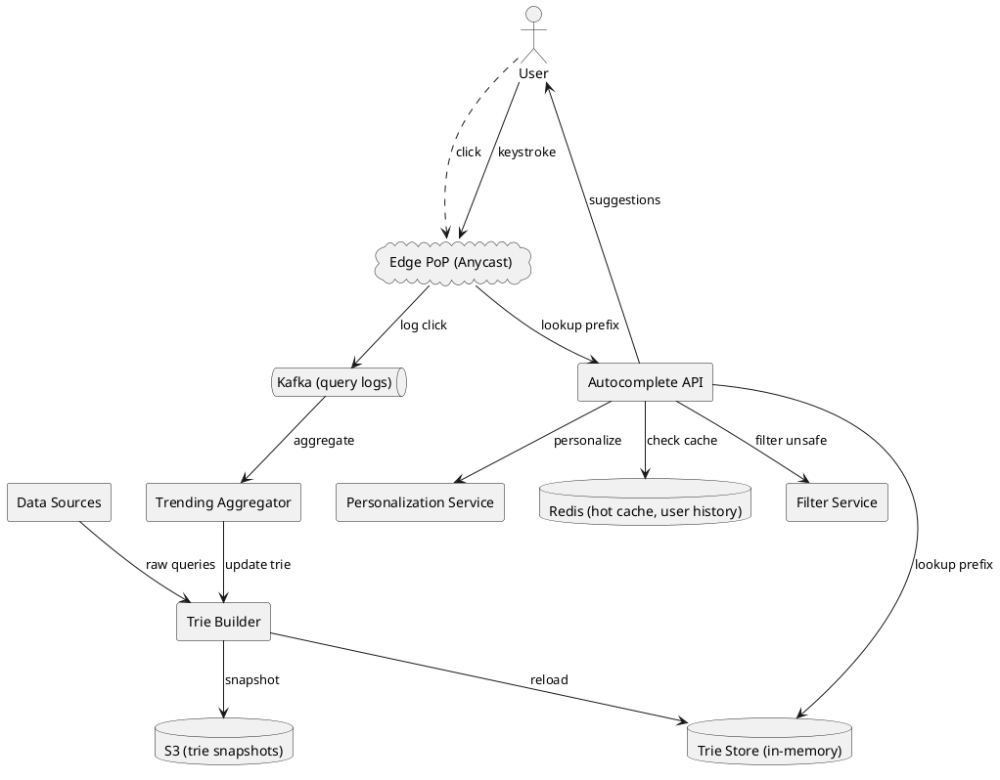
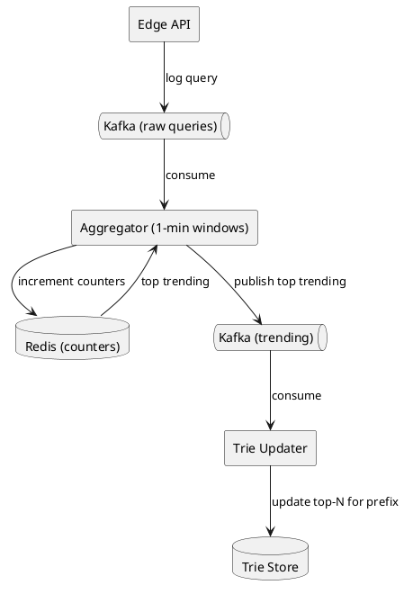
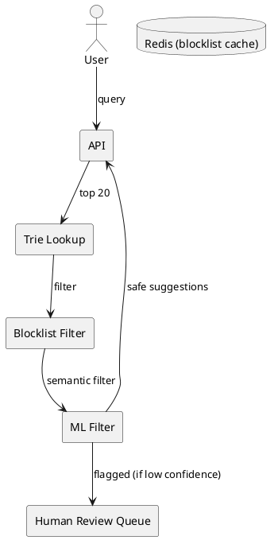
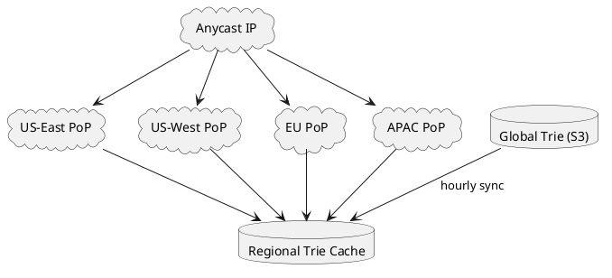

# Search Autocomplete

## Problem Statement

Design a search autocomplete (typeahead) system like Google Search, Amazon search bar, or YouTube suggestions. As the user types, the system returns ranked suggestions in real time (under 100 ms). Suggestions can be queries, products, entities, or any searchable items. The system must handle billions of queries per day with sub-100ms latency globally.

**Example:**
```
User types: "wire"
Suggestions (top 10, updated every keystroke):
  wireless headphones
  wireless earbuds
  wireless mouse
  wireless keyboard
  wireless charger
  wireless router
  wireless printer
  wireless speaker
  wireless keyboard logitech
  wireless mouse for mac

User types: "wireless ear"
Suggestions:
  wireless earbuds
  wireless earbuds under 2000
  wireless earbuds boat
  wireless earbuds sony
  ...

Requirements:
  - < 100 ms response (real-time, no noticeable lag)
  - Top 10 suggestions (ranked by popularity/relevance)
  - Prefix matching + fuzzy matching ("hedphones" → "headphones")
  - Personalization (user's history boosts some suggestions)
  - Trending (new queries appear within minutes)
  - Multi-language
  - Multi-device (mobile, desktop, TV)
```

**Real-world systems:** Google Autocomplete, Amazon Search Suggestions, YouTube Suggestions, Bing Autosuggest, Algolia, Elasticsearch Completion Suggester.

**Why it's interesting:**

- **Trie data structure** (prefix tree) is the classic solution
- **Scale**: 10B queries/day, peak 500K QPS
- **Latency**: < 100 ms p99 globally (needs edge deployment)
- **Freshness**: New trending queries appear within minutes
- **Ranking**: Popularity + personalization + freshness
- **Storage**: Compact trie or finite state transducer
- **Filtering**: Adult content, hate speech, PII, misinformation
- **Cost**: Huge read volume, but very small per-request data

---

## 1. Requirements Clarification

### Functional Requirements
- **Prefix match**: As user types "wire", return "wireless headphones"
- **Top-N suggestions**: Return top 10 (configurable)
- **Ranked**: By popularity (or personal relevance)
- **Fuzzy match**: "hedphones" → "headphones" (typo tolerance)
- **Personalization**: Boost suggestions based on user history
- **Trending**: New popular queries appear within minutes
- **Multi-language**: Support all locales
- **Multi-type**: Queries, products, entities (people, places)
- **Filter**: Block adult content, spam, PII
- **Suggest as you type**: Every keystroke (debounced on client)
- **Click tracking**: Learn from user clicks

### Non-Functional Requirements
- **Scale**: 10B queries/day (~116K QPS average, 500K QPS peak)
- **Latency**: < 100 ms p99 (global, includes network)
- **Availability**: 99.99% — search is core
- **Freshness**: Trending queries appear within 5 min
- **Storage**: Trie or FST must fit in memory (or sharded)
- **Consistency**: Eventual for suggestions (5 min lag acceptable)
- **Cost**: Must be cheap per query (huge volume)
- **Privacy**: Don't leak PII in suggestions

### Out of Scope
- Full search results (that's the search engine)
- Ads (though suggestions can be monetized)
- Voice search (separate problem)
- Image search

---

## 2. Back-of-Envelope Estimation

### Traffic

```
Given:
  Queries/day          = 10,000,000,000
  Suggestions per query = 1 (each keystroke triggers a new request)
  Keystrokes per query = 5 (avg)
  Actual requests/day  = 10B x 5 = 50B (but debounced to ~3 per query)
  Debounced requests   = 10B x 3 = 30B/day
  Peak multiplier      = 5x

Average QPS:
  = 30B / 86,400 = ~347,000 QPS

Peak QPS:
  = 347,000 x 5 = ~1.7M QPS

(For a Google-scale system; for smaller systems scale down.)
```

### Storage

```
Dictionary of unique queries:
  1B unique queries (ever seen)
  Per query: ~30 bytes (avg)
  Raw: ~30 GB
  With metadata (frequency, last_seen): ~100 GB

Trie/FST representation:
  Compact trie: ~3-5x raw size = ~300-500 GB
  Finite State Transducer (FST): ~1.5-2x raw = ~50-100 GB

Sharded across servers:
  100 shards x 1 GB each = 100 GB total

Cache (Redis):
  Top 100M queries: ~3 GB (hot set)
  Per-user recent queries: ~1 KB per user x 100M users = 100 GB

Total storage: ~500 GB (fits in memory across a small cluster)
```

### Bandwidth

```
Response size:
  Per query: ~500 bytes (10 suggestions x 50 bytes each)

Bandwidth:
  347,000 QPS x 500 bytes = ~173 MB/sec = ~1.4 Gbps
  Peak: ~7 Gbps

Small compared to other systems.
```

### Latency Budget

```
Target: < 100 ms p99 globally

Breakdown (single-region):
  Client → nearest PoP:  ~10 ms
  PoP → lookup:          ~1-2 ms (in-memory)
  Ranking:               ~2 ms
  Filtering:             ~1 ms
  Serialize:             ~1 ms
  Response:              ~10 ms
  Total:                 ~25-30 ms

With edge deployment, < 100 ms is easily achievable globally.
```

### Cost Optimization

```
At 1.7M peak QPS:
  - Must be cheap per query
  - In-memory lookups (no disk I/O)
  - Edge caching for popular prefixes
  - Compression of trie

Typical cost: $0.000001 per query (basically free at scale)
```

---

## 3. High-Level Design



### Component Responsibilities

| Component | Role |
|---|---|
| Edge PoP | Anycast for global low latency |
| Autocomplete API | Serve suggestions for a prefix |
| Trie Store | In-memory data structure for prefix lookup |
| Redis | Hot cache for popular prefixes, user history |
| Personalization Service | Boost suggestions based on user |
| Filter Service | Block adult/spam/PII content |
| Kafka | Log queries, clicks for aggregation |
| Trending Aggregator | Compute trending queries |
| Trie Builder | Rebuild trie from query logs |
| S3 | Snapshot storage |
| Data Sources | Query logs, external signals |

### Why This Architecture

- **Anycast + edge** for global low latency
- **Trie in memory** for O(prefix length) lookup
- **Redis** for hot cache + user history
- **Kafka** for streaming query/click logs
- **Trending aggregator** updates trie in near-real-time
- **Sharding** by prefix first letter for scale

---

## 4. API Design

### Autocomplete Query

```http
GET /v1/autocomplete?q=wire&limit=10&lang=en&client=mobile
```

**Response 200:**
```json
{
  "query": "wire",
  "suggestions": [
    {
      "text": "wireless headphones",
      "type": "query",
      "score": 9500,
      "highlight": "<b>wire</b>less headphones"
    },
    {
      "text": "wireless earbuds",
      "type": "query",
      "score": 8200,
      "highlight": "<b>wire</b>less earbuds"
    },
    {
      "text": "wireless mouse",
      "type": "query",
      "score": 6100
    },
    {
      "text": "Wireless Keyboard Logitech K380",
      "type": "product",
      "product_id": "prd-555",
      "score": 5400
    }
  ],
  "latency_ms": 18,
  "cached": true
}
```

### Autocomplete with Personalization

```http
GET /v1/autocomplete?q=wire&user_id=u-123&session_id=s-456
```

Personalization uses `user_id` (history) and `session_id` (current session).

### Click Feedback

```http
POST /v1/autocomplete/click
{
  "query": "wire",
  "selected": "wireless headphones",
  "position": 1,
  "user_id": "u-123",
  "session_id": "s-456"
}
```

Used to train ranking + personalization.

### Suggest by Type

```http
GET /v1/autocomplete?q=paris&type=place
```

Returns only places. Types: `query`, `product`, `place`, `person`, `brand`, `category`.

### Bulk Suggestions (for testing)

```http
POST /v1/autocomplete/bulk
{
  "queries": ["wire", "wireless", "wir", "wi"]
}
```

### Admin: Block a Query

```http
POST /v1/admin/blocklist
{
  "text": "harmful query",
  "reason": "policy_violation"
}
```

---

## 5. Data Structure: Trie Deep Dive

### Why a Trie?

**Trie** (prefix tree): each node represents a character, path from root to node spells a prefix.

```
         (root)
        /  |  \  \
       w   h   a  ...
       |
       i
       |
       r
       |
       e  (wire: score 9500)
      /|\
     l s s ...
     |
     e
     |
     s
     |
     s  (wireless: score 9200)
```

**Lookup:** O(prefix length), not O(number of entries). Fast.

**Memory:** Naive trie is memory-heavy (each character is a pointer).

### Trie Optimizations

**1. Compressed Trie (Radix Tree)**
- Merge single-child paths into one node
- "wire" → "less" compressed
- Reduces memory by 3-5x

**2. Finite State Transducer (FST)**
- Shares suffixes too
- Very compact (~1.5-2x raw data)
- Used by Lucene, Elasticsearch
- Slightly slower to build

**3. DAWG (Directed Acyclic Word Graph)**
- Shares common suffixes
- Good for English (many common suffixes)
- More complex

**4. Top-N at each node**
- Pre-compute top 10 suggestions for each prefix
- Store in the node itself
- O(1) lookup after prefix traversal

**Recommendation:** **FST + top-N at each node** for production.

### Trie vs FST

| Aspect | Trie | FST |
|---|---|---|
| Memory | High | Low (5-10x smaller) |
| Build time | Fast | Slower |
| Lookup | Fast | Slightly slower |
| Updates | Easy | Hard (rebuild) |
| Used by | Naive impls | Lucene, ES |

### Top-N Storage

For each node (prefix), store top 10 suggestions:

```
Node at "wire":
  top_suggestions = [
    ("wireless headphones", 9500),
    ("wireless earbuds", 8200),
    ("wireless mouse", 6100),
    ...
  ]
```

**Lookup:** Traverse to node, return top suggestions. O(prefix length + N).

**Memory:** 10 suggestions x 50 bytes x 100M prefixes = 50 GB (manageable).

### Sharding

Shard by first letter (or first 2 characters):
```
Shard 0: prefixes starting with "a"
Shard 1: prefixes starting with "b"
...
Shard 25: prefixes starting with "z"

With 2-char shards:
Shard "aa": prefixes starting with "aa"
Shard "ab": prefixes starting with "ab"
...
```

**Query routing:** Look at first char (or two) → route to shard.

**Benefit:** Each shard is small enough to fit in memory.

---

## 6. Deep Dive: Ranking

### Ranking Signals

| Signal | Weight | Source |
|---|---|---|
| Query popularity | 50% | Historical count |
| Recent popularity | 20% | Last 7 days |
| Trending (last hour) | 10% | Real-time |
| Personalization | 10% | User history |
| Freshness | 5% | Recency |
| Diversity | 5% | Avoid repeating similar |

### Popularity Score

```
popularity = log(total_count) + 0.5 x log(weekly_count)
```

**Why log?** Prevents mega-popular queries from dominating everything.

### Trending Score

```
trending_score = (last_hour_count / avg_hourly_count) x log(last_hour_count)
```

Detects spikes: "election results", "breaking news".

### Personalization

**Signals:**
- User's past searches (recency-weighted)
- User's clicks (stronger than searches)
- User's location, language
- User's device type

**Boost:**
```
final_score = base_score x (1 + personal_boost)

personal_boost = 0.3 x (query in user_history)
              + 0.2 x (similar to past query)
              + 0.1 x (user_location match)
```

Capped to avoid over-personalization.

### Freshness

```
freshness_boost = 1 + 0.2 x exp(-days_since_first_seen / 7)
```

New queries get a boost (exploration).

### Diversity

Avoid showing 10 variations of same query:
- Deduplicate near-identical suggestions
- Mix categories (query + product + brand)
- Ensure diversity in top 10

### Ranking at Trie Build Time

Top-N per node is **pre-computed** during trie build:
1. Aggregate query counts (last 30 days, weighted)
2. Sort queries by score
3. For each prefix, select top N
4. Store in node

**Rebuild frequency:** Every 5 minutes (trending) or hourly (full).

### Ranking at Query Time

1. Traverse trie to prefix node
2. Get pre-computed top N
3. Apply personalization (rerank)
4. Apply filters (adult content, blocklist)
5. Return top 10

**Fast:** O(prefix length + N) + personalization.

---

## 7. Deep Dive: Freshness and Trending

### The Challenge

New trending queries (breaking news, viral moments) must appear within minutes, not hours.

**Naive:** Rebuild trie from scratch every time. Too slow.

**Better:** Incremental updates + fast rebuilds.

### Trending Aggregation Pipeline



### Windowing

- **1-min window**: Real-time trending detection
- **1-hour window**: Short-term trends
- **24-hour window**: Daily popularity
- **7-day window**: Weekly popularity
- **30-day window**: Long-term popularity

Each window contributes to final score.

### Real-Time Trending Detection

```
For each query in last 5 min:
  current_rate = count_last_5min
  baseline_rate = avg_rate_last_hour
  spike_ratio = current_rate / (baseline_rate + 1)
  
  if spike_ratio > 10:
    mark as trending
    boost score by 2x
```

### Incremental Trie Update

For trending queries:
1. New query → insert into trie
2. Compute top-N for all prefixes of this query
3. Update those nodes

**Challenge:** FST doesn't support incremental updates (must rebuild).

**Solution:**
- **Main trie (FST)**: Rebuilt hourly from 24h/30d aggregation
- **Delta trie (in-memory)**: Small, holds last hour's trending
- **Query time**: Merge results from both tries

**Memory:** Delta trie is small (~1M queries max).

### Rebuild Frequency

| Trie | Content | Frequency |
|---|---|---|
| Main (FST) | All queries (30d window) | Hourly |
| Delta (in-memory) | Trending (last 1h) | Every 1 min |

### Query-Time Merge

```
1. Lookup in main trie → top 10 suggestions A
2. Lookup in delta trie → top 10 suggestions B
3. Merge A + B by score
4. Apply personalization + filters
5. Return top 10
```

**Latency:** Still < 5 ms total.

### Handling Breaking News

For events like "election results", "earthquake":
- Automatic detection via spike ratio
- Appears in suggestions within 1-2 min
- Boosted during the event
- Decays after the event

### Censoring Trending

Some trending queries may be harmful (violence, hate speech, PII):
- Filter before adding to trie
- Manual blocklist
- Policy violations trigger removal

---

## 8. Deep Dive: Filtering and Safety

### Why Filter?

Autocomplete can suggest:
- **Adult content**
- **Hate speech**
- **PII** (social security numbers, addresses)
- **Misinformation** (health, elections)
- **Illegal content** (drugs, weapons)
- **Spam** (SEO spam, scams)

**Also**: Legal requirements (COPPA, GDPR, DPDP), platform policies.

### Filter Categories

| Category | Action | Example |
|---|---|---|
| Adult content | Block | Explicit queries |
| Hate speech | Block | Slurs, extremist |
| PII | Block | SSN, credit card |
| Illegal | Block | Drug sales, weapons |
| Medical misinformation | Block/caution | Fake cures |
| Brand impersonation | Block | "fake nike" |
| Competitor names | Block | "google" on Bing |

### Filter Implementation

**1. Blocklist (exact match)**
```
"harmful query 1"
"harmful query 2"
...
```
Fast lookup, used for known bad queries.

**2. Pattern matching (regex)**
```
\d{3}-\d{2}-\d{4}   # SSN
\d{16}               # credit card
```
For PII detection.

**3. ML classifier (semantic)**
- Train on labeled adult/hate/etc.
- Predict per suggestion
- Threshold-based block

**4. Human review**
- Flagged suggestions → queue
- Reviewers decide

### Filter Pipeline



**Why filter after lookup?** Trie returns top 20, we filter down to top 10 safe suggestions.

### PII Detection

- Regex for known patterns (SSN, credit card, phone)
- ML for names + addresses
- Block before serving

### Multilingual Filtering

Each language has its own blocklist + models.

### Filter Latency

- Blocklist: < 1 ms (hash lookup)
- ML: ~2-5 ms (small model, edge-optimized)
- Total filter latency: < 5 ms

### Censorship vs Censorship

**Danger:** Over-filtering legitimate queries.
- "breast cancer" — medical, don't block
- "how to make a bomb" — block
- "sex education" — educational, don't block

**Approach:** Semantic ML + human review of edge cases.

### User Feedback Loop

- Users can report bad suggestions
- Reports feed into training
- High-confidence reports trigger immediate block

---

## 9. Deep Dive: Personalization

### Why Personalize?

Generic suggestions: "restaurants near me" → generic list
Personalized: same query → user's favorite cuisine, past searches, saved places

**Boosts** result relevance.

### Personalization Signals

| Signal | Weight | Storage |
|---|---|---|
| User's past searches | 30% | Redis (last 100) |
| User's past clicks | 40% | Redis (last 100) |
| User's location | 10% | From request |
| User's language | 5% | From request |
| User's device type | 5% | From request |
| User's time-of-day | 5% | From request |
| Session context | 5% | In-memory |

### User Profile (Redis)

```
Key: user:{user_id}:history
Type: Sorted set (score = timestamp)
Value: query strings
Max size: 100 most recent queries
TTL: 90 days

Key: user:{user_id}:clicks
Type: Sorted set
Value: clicked suggestions
Max size: 100 most recent
TTL: 90 days
```

### Personalization Algorithm

```
For each candidate suggestion S from trie:
  base_score = S.popularity_score
  
  boost = 0
  if S.text in user.past_searches: boost += 0.3
  if S.text in user.past_clicks:   boost += 0.5
  if S.text matches user's patterns: boost += 0.2
  if S.text is in user's location:  boost += 0.1
  
  final_score = base_score * (1 + min(boost, 1.0))
```

**Cap** the boost at 1.0 to avoid over-personalization.

### Privacy Considerations

- **Consent**: User opts in for personalization
- **Transparency**: User can see their history
- **Control**: User can clear history
- **Anonymization**: Aggregated stats don't identify users
- **GDPR/DPDP**: Right to access, right to erasure

### Cold Start

New user → no history:
- Use generic popularity
- Use location + language
- Learn from first few queries

### Cross-Device

User's history syncs across devices:
- Phone, laptop, tablet share
- Requires login

### Anonymous Users

No user_id → no personalization:
- Generic suggestions
- Session-based (within session, boost repeated queries)

---

## 10. Deep Dive: Deployment at Scale

### Global Edge Deployment



**Anycast**: Same IP advertised from all PoPs; BGP routes user to nearest.

**Trie replication**: Each PoP has a local copy (or reads from regional cache).

**Sync**: Hourly snapshot from S3; delta updates via Kafka.

### Regional Sharding

If trie is too big for a single PoP:
- Shard by first letter
- Each PoP has all shards (for its region)
- Or shard across PoPs (query routing based on prefix)

### Cache Hierarchy

```
L1: Local PoP in-memory trie (sub-ms)
L2: Redis cache for popular prefixes (1-2 ms)
L3: Regional trie (10-20 ms)
L4: Global trie (cold, ~100 ms) — rarely used
```

**Cache hit ratio:** > 95% served from L1.

### Multi-Region Consistency

- **Eventual consistency** for suggestions
- **Propagation lag**: 1-5 min for trending
- **Region-local popular**: Some queries are regional ("cricket score")

### Capacity Planning

```
Per PoP:
  QPS: 500K / num_PoPs (e.g., 200 PoPs → 2.5K QPS)
  Memory: Trie shard ~1 GB per PoP
  CPU: ~4 cores per 10K QPS

Total PoPs: 200 globally
Total servers: 500-1000 (with redundancy)
```

### Graceful Degradation

- **Trie unavailable**: Fall back to Redis cache
- **Both unavailable**: Return generic fallback (empty or popular list)
- **Slow trie**: Timeout + serve partial results
- **PoP failure**: Anycast routes to next nearest PoP

### Cost Optimization

- **Edge caching**: 95% served from edge, no origin call
- **Compression**: FST is already compact
- **Shared memory**: Multiple processes share trie via mmap
- **Small instances**: Trie is small, compute-light

---

## 11. Scaling Considerations

### Read Scaling

- **Anycast**: Routes to nearest PoP
- **Local cache**: 95%+ hit rate
- **Redis**: For popular prefixes and user history
- **Horizontal scaling**: Add more PoPs

### Write Scaling

- **Query logging**: Via Kafka (async, no blocking)
- **Click logging**: Same
- **Aggregation**: Parallel, windowed
- **Trie rebuild**: Hourly, incremental

### Sharding

**Trie sharding:**
- By first character (a-z, 0-9, special)
- 36+ shards
- Each shard fits in memory

**Query routing:**
- Look at first char → route to shard
- For multi-shard queries (rare), fan-out + merge

### Storage Optimization

| Technique | Benefit |
|---|---|
| FST | 5-10x smaller than naive trie |
| Delta trie | Fast trending updates |
| Compression | 2-3x smaller |
| Top-N only | Skip lower-ranked entries |
| Sharding | Parallel processing |

### Latency Optimization

- **In-memory**: No disk I/O
- **Anycast**: No DNS lookup
- **Edge compute**: Close to user
- **Pre-computed top-N**: No ranking at query time (only personalization)
- **Vectorized filtering**: SIMD for blocklist checks

### Handling Special Cases

**Very short prefixes (1 char):** Cache top 100; hit rate high
**Long prefixes (10+ chars):** Rare; still O(prefix length)
**Non-ASCII (Hindi, Chinese):** Unicode-aware FST
**Numbers/emojis:** Include in trie
**Typos:** Fuzzy match via edit distance

### Cost at Scale

```
Google-scale (1.7M peak QPS):
  Compute: ~1000 edge servers x $100/month = $100K
  Storage: ~500 GB across PoPs = ~$1K/month
  Bandwidth: 7 Gbps peak = ~$500/month
  Total: ~$100K/month
  
Per query: ~$0.0000005 (basically free)
```

**Why so cheap?** In-memory lookups, tiny responses, huge caching.

---

## 12. Bottlenecks and Trade-offs

| Concern | Solution | Trade-off |
|---|---|---|
| Latency globally | Anycast + edge | Complexity |
| Trending freshness | Delta trie + Kafka | Memory overhead |
| Personalization | Redis per user | Storage, privacy |
| Trie size | FST + top-N | Build time |
| Filtering | ML at edge | Latency, cost |
| Multi-language | Per-language tries | Memory |
| Sharding | By first char | Hot shard risk |
| Updates | Hourly rebuild + delta | Complexity |
| Privacy | Consent + control | Reduced personalization |
| Cost | Caching + compression | Infra complexity |

### Design Decisions Summary

| Decision | Choice | Rationale |
|---|---|---|
| Data structure | FST with top-N per node | Compact, fast |
| Trie location | In-memory at edge | Sub-ms latency |
| Trending | Delta trie + Kafka | 1-min freshness |
| Rebuild | Hourly main + 1-min delta | Balance freshness/cost |
| Personalization | Redis per-user | Fast, scalable |
| Filtering | Blocklist + ML | Multi-layer safety |
| Sharding | By first character | Memory distribution |
| Global | Anycast + edge | Low latency worldwide |
| Logging | Kafka async | Non-blocking |
| Consistency | Eventual (1-5 min) | Acceptable for suggestions |

---

## 13. Failure Scenarios

### Edge PoP Down

**Impact:** Users in that region see higher latency.

**Mitigation:**
- Anycast routes to next nearest PoP
- Downtime: < 30 sec (BGP convergence)
- Capacity: Adjacent PoPs absorb load

### Trie Service Down

**Impact:** No suggestions.

**Mitigation:**
- Fall back to Redis cache (popular prefixes)
- Fall back to static popular queries
- Alert immediately
- Auto-restart

### Kafka Down

**Impact:** Query logging stops; trending updates delayed.

**Mitigation:**
- Buffer queries in-memory (bounded)
- Fall back to file-based logging
- Trending still works with older data

### Trie Rebuild Failure

**Impact:** Trie stays stale.

**Mitigation:**
- Retry rebuild
- Alert ops
- Keep previous trie version
- Manual rollback if corrupted

### Cache Stampede

**Impact:** Popular prefix cache expires; many requests hit trie.

**Mitigation:**
- Probabilistic early refresh
- Never expire popular prefixes (refresh async)
- Mutex on cache miss

### Filter Bypass

**Impact:** Harmful suggestions slip through.

**Mitigation:**
- Multiple filter layers (blocklist + ML + human)
- User reports
- Fast blocklist updates
- Post-mortem + model retrain

### Personalization Data Leak

**Impact:** User's search history exposed.

**Mitigation:**
- Encrypt at rest
- Access controls
- Audit logs
- Anonymization for analytics

### DDoS on Autocomplete

**Impact:** Service overwhelmed.

**Mitigation:**
- Rate limiting at edge
- CAPTCHA for suspicious traffic
- Anycast absorbs volume
- Cache aggressively

### Stale Suggestions

**Impact:** Users see outdated trending.

**Mitigation:**
- Delta trie refreshes every 1 min
- Monitor freshness metric
- Alert if lag > 5 min

### Language Mismatch

**Impact:** Wrong language suggestions.

**Mitigation:**
- Auto-detect user language
- Fall back to English
- Manual language selector

---

## 14. Monitoring and Alerts

### Key Metrics

| Metric | Target | Alert Threshold |
|---|---|---|
| Autocomplete p99 | < 100 ms | > 200 ms |
| p50 latency | < 20 ms | > 50 ms |
| Cache hit ratio | > 95% | < 85% |
| Trie lookup p99 | < 5 ms | > 20 ms |
| Personalization p99 | < 10 ms | > 30 ms |
| Filter p99 | < 5 ms | > 15 ms |
| Trending freshness | < 2 min | > 10 min |
| Zero results rate | < 1% | > 5% |
| Click-through rate | baseline | drop > 20% |
| Filter block rate | baseline | spike (over-blocking) |
| Rebuild success rate | 100% | < 99% |

### Dashboards

- **Traffic**: QPS by region, by prefix length
- **Latency**: p50/p95/p99 globally and per PoP
- **Cache**: Hit ratio, eviction rate
- **Trie**: Size, shards, memory usage
- **Trending**: Freshness lag, trending queries
- **Filters**: Block rate, flagged queries
- **Errors**: 4xx/5xx by region
- **Business**: Top queries, CTR, search-to-click rate

### Alerts

- **P0**: Autocomplete down, filter bypass (harmful content live)
- **P1**: p99 > 200 ms, cache hit < 85%
- **P2**: Trending freshness > 10 min, high zero-results
- **P3**: Rebuild failures, high filter block rate

### Business KPIs

- **Autocomplete CTR** (click-through rate)
- **Suggestion acceptance rate** (user picks one)
- **Queries per session** (engagement)
- **Time to first click**
- **Search abandonment** (no click)

---

## 15. Cost Estimation

Rough monthly cost (AWS, us-east-1) for a Google-scale system:

| Component | Spec | Cost/month |
|---|---|---|
| Edge compute | 500 x c6g.large | ~$30,000 |
| Redis cluster | 20 x cache.r6g.2xlarge | ~$10,000 |
| Kafka (MSK) | 10 brokers | ~$4,000 |
| Aggregation workers | 20 x c6g.large | ~$1,200 |
| Trie build workers | 10 x c6g.xlarge | ~$1,200 |
| S3 (snapshots, logs) | 10 TB | ~$250 |
| Anycast + bandwidth | 7 Gbps peak | ~$5,000 |
| CDN edge | For cache misses | ~$2,000 |
| Monitoring | Datadog | ~$15,000 |
| **Total** | | **~$68,650/month** |

**Cost per query:** ~$0.0000002 (essentially free).

**Cost optimization:**
- Reserved instances (30-40% savings)
- Smaller instance types
- Aggressive edge caching
- Self-hosted observability

**Note:** Cost is dominated by edge compute; storage is trivial.

---

## 16. Extensions and Follow-ups

### AI-Powered Suggestions

- **Semantic autocomplete**: "best laptop for video editing" → suggests based on intent
- **LLM**: Use small language model at edge
- **Multi-turn**: Suggest based on conversation context

### Voice Autocomplete

- Speech-to-text integration
- Faster, more forgiving suggestions
- Mobile-first

### Visual Suggestions

- Image thumbnails alongside suggestions
- Product images for shopping
- "Search by image" from suggestions

### Entity Suggestions

- People ("Sundar Pichai")
- Places ("Paris, France")
- Brands ("Nike")
- Categories ("Running shoes")

Each with different ranking logic.

### Rich Suggestions

- Weather: "weather in Mumbai" → inline weather card
- Calculator: "2+2" → inline result
- Definitions: "define ubiquitous" → inline definition
- Conversions: "100 USD to INR" → inline rate

### Contextual Autocomplete

- **Time of day**: Morning → "breakfast places"
- **Location**: Mumbai → local suggestions
- **Device**: Mobile → shorter suggestions
- **Previous query**: Context from prior search

### Multimodal- Suggest emojis for text
- Suggest GIFs for chat
- Suggest images for shopping

### Multi-Language

- Automatic language detection
- Cross-language suggestions (Hinglish)
- Transliteration (Hindi in English letters)

### Federated Autocomplete

- Suggestions from multiple sources (queries, products, people)
- Blended ranking
- Type indicators

### Zero-Query Suggestions

- Proactive suggestions before user types
- Based on time, location, history

### Privacy-First Autocomplete

- On-device personalization (federated learning)
- No query data to server
- Trade-off: Less relevance, more privacy

### Ad Monetization

- Sponsored suggestions
- Must be clearly marked
- Trade-off: User trust vs revenue

### Auto-Complete for Code

- IDE autocomplete (like GitHub Copilot)
- Different problem: larger vocabulary, structured
- Uses LSP, transformers, not tries

### Real-Time Collaborative Search

- Team search (e.g., at a company)
- Suggestions include colleagues' recent searches
- Privacy controls

---

## 17. Summary

| Aspect | Decision |
|---|---|
| Data structure | FST with top-N per node |
| Deployment | Anycast + edge PoPs |
| Latency | < 100 ms p99 globally, < 20 ms typical |
| Trie rebuild | Hourly main + 1-min delta |
| Trending | Kafka + delta trie |
| Ranking | Popularity + recency + trending + personalization |
| Personalization | Redis per-user history |
| Filtering | Blocklist + ML |
| Sharding | By first character |
| Consistency | Eventual (1-5 min lag) |
| Storage | ~500 GB across PoPs |
| Peak QPS | 1.7M (Google-scale) |
| Cost | ~$68K/month at scale, ~free per query |

**Key takeaways:**

- **Trie/FST is the canonical data structure** for prefix lookup
- **Top-N per node** eliminates ranking at query time (except personalization)
- **Anycast + edge deployment** achieves < 100 ms globally
- **Delta trie** handles trending queries with 1-min freshness
- **Kafka + aggregation** processes billions of queries efficiently
- **Filtering is multi-layer** — blocklist + ML + human
- **Personalization via Redis** boosts relevance without huge overhead
- **Sharding by first character** keeps each shard memory-resident
- **Cost is tiny** — in-memory lookups, small responses, 95% cache hit
- **Privacy matters** — consent, transparency, control, anonymization

**Similar Pattern Problems:**

- Product Catalog (search suggestions for products)
- Job Search Platform (autocomplete for job titles, companies, skills)
- Video Streaming (search suggestions)
- Messaging App (autocomplete for mentions, emojis)
- Search Autocomplete for Code (IDE)
- Any prefix-based lookup problem