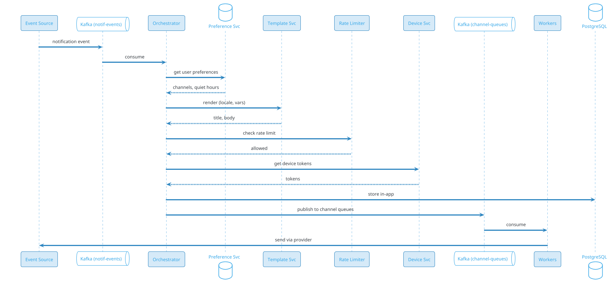
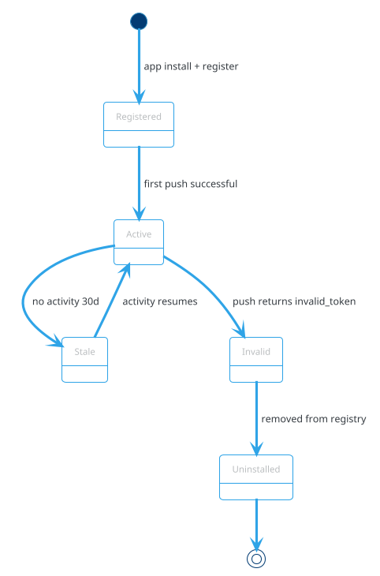

# Real-Time Notification System

## Problem Statement

Design a real-time notification system like those powering WhatsApp, Instagram, Gmail, or Slack. The system delivers notifications to users across multiple channels (push, email, SMS, in-app) in real time, handles billions of notifications per day, and respects user preferences. It must be reliable, scalable, and support targeting, batching, retries, and cross-device sync.

**Example:**
```
User Alice gets a notification: "Bob liked your photo"

Flow:
  1. Bob likes Alice's photo (backend event)
  2. Notification Service receives event
  3. Look up Alice's preferences: push ON, email OFF, in-app ON
  4. Look up Alice's devices: iPhone, iPad, Web
  5. Send push to iPhone + iPad (via APNS)
  6. Queue email for later digest (if applicable)
  7. Store in-app notification
  8. Update unread count badge
  9. Alice's iPhone shows: "Bob liked your photo"
 10. Alice taps it → deep link to photo
 11. Badge cleared on all devices (cross-device sync)

Channels:
  - Push (APNS, FCM)
  - Email (SendGrid, SES)
  - SMS (Twilio, SNS)
  - In-app (WebSocket, polling)
  - WhatsApp (Business API)

Scale:
  - 10B notifications/day (~116K/sec avg, 500K/sec peak)
  - 500M users, 2B devices
  - 100K notification types
```

**Real-world systems:** Firebase Cloud Messaging (FCM), Apple Push Notification Service (APNS), OneSignal, Pusher, AWS SNS, SendGrid, Twilio.

**Why it's interesting:**

- **Multi-channel fan-out** (one event → many channels)
- **Device token lifecycle** (tokens expire, refresh, uninstall)
- **User preferences** (channels, quiet hours, frequency)
- **Batching & digests** (avoid spamming users)
- **Delivery guarantees** (at-least-once, idempotency)
- **Cross-device sync** (read on phone = cleared on laptop)
- **Rate limiting** (prevent notification storms)
- **Scale** (billions of notifications, peak bursts)
- **Failure recovery** (retries, DLQ, provider outages)
- **Compliance** (GDPR, unsubscribe, transactional vs marketing)

---

## 1. Requirements Clarification

### Functional Requirements
- **Trigger**: Receive notification requests from internal services (via API or Kafka)
- **Targeting**: Target user(s), group, segment, or topic
- **Channels**: Push (iOS/Android), Email, SMS, In-app, WhatsApp
- **Preferences**: Per-user, per-channel, per-notification-type
- **Templating**: Multi-language, personalization
- **Scheduling**: Send now, scheduled, or delayed
- **Batching**: Group similar notifications within a window
- **Cross-device sync**: Read on one device clears others
- **Read/unread**: Track per notification
- **Deep linking**: Tap notification → open specific screen
- **Analytics**: Delivery rate, open rate, click rate
- **Opt-out**: Unsubscribe from marketing; critical (transactional) still sent

### Non-Functional Requirements
- **Scale**: 10B notifications/day, 500K/sec peak, 500M users, 2B devices
- **Latency**: < 5 sec p99 from event to delivery (push); < 1 min for email
- **Availability**: 99.99% — critical notifications must not be lost
- **Consistency**: At-least-once delivery; idempotent consumers
- **Durability**: Notifications persisted (in-app) for 90 days
- **Ordering**: Per-user ordering for in-app notifications
- **Privacy**: PII encrypted, user control
- **Compliance**: GDPR, CAN-SPAM, DPDP, unsubscribes honored
- **Cost**: Push is cheap; SMS/email have per-unit cost — optimize

### Out of Scope
- Building APNS/FCM (use existing providers)
- Building SMTP servers (use SES, SendGrid)
- Building SMS gateways (use Twilio, SNS)
- Real-time chat (that's messaging app)

---

## 2. Back-of-Envelope Estimation

### Traffic

```
Given:
  Notifications/day    = 10,000,000,000
  Users                = 500,000,000
  Devices per user     = 4 (phone, tablet, web, watch)
  Total devices        = 2,000,000,000
  Peak multiplier      = 5x

Average QPS:
  = 10B / 86,400 = ~115,740/sec

Peak QPS:
  = 115,740 x 5 = ~578,700/sec

Per channel breakdown (typical):
  Push:    60% = ~347K peak/sec
  In-app:  30% = ~174K peak/sec
  Email:   8%  = ~46K peak/sec
  SMS:     2%  = ~12K peak/sec
```

### Storage

```
Notifications (in-app, 90-day retention):
  10B/day x 0.3 (in-app only) = 3B/day
  x 90 days = 270B notifications
  Per notification: ~500 bytes
  Total: ~135 TB

Delivery status:
  10B/day x 30 days = 300B
  Per record: ~200 bytes
  Total: ~60 TB

Device tokens:
  2B devices x 200 bytes = ~400 GB

User preferences:
  500M users x 1 KB = ~500 GB

Templates:
  100K templates x 5 languages x 5 KB = ~2.5 GB

Notification logs (audit):
  10B/day x 365 days x 100 bytes = ~365 TB/year

Total DB: ~600 TB (with retention policies)
S3 for archives: Several PB
```

### Bandwidth

```
Push payload:
  ~4 KB per notification (FCM/APNS limit ~4KB)

Push bandwidth:
  347K/sec x 4 KB = ~1.4 GB/sec = ~11 Gbps peak

Email:
  46K/sec x 50 KB = ~2.3 GB/sec = ~18 Gbps peak

SMS:
  12K/sec x 200 bytes = ~2.4 MB/sec (negligible)

Total: ~30 Gbps peak
```

### Latency Budget

```
Push notification (event → user's device):
  Event received:          ~10 ms
  Preference lookup:       ~5 ms
  Template render:         ~10 ms
  Device token lookup:     ~5 ms
  Send to APNS/FCM:        ~50 ms
  APNS/FCM → device:       ~1-3 sec
  Total:                   ~1.5-3.5 sec

For in-app:
  WebSocket push:          ~100-500 ms
  Total:                   < 500 ms

For email:
  Queue + send:            ~30 sec - 5 min
  Delivery:                ~1-30 min (best-effort)
```

### Cost Considerations

```
Push: ~$0.000001 per notification (FCM free, APNS free)
Email: ~$0.0001 per email (SES, SendGrid)
SMS: ~$0.01 per SMS (Twilio)

Monthly cost (10B/day):
  Push: 180B x $0.000001 = $180K (FCM free tier + paid)
  Email: 24B x $0.0001 = $2.4M
  SMS: 6B x $0.01 = $60M  ← DOMINANT COST

SMS is by far the most expensive channel.
→ Aggressive opt-in, batching, fallback policies
```

---

## 3. High-Level Design

```d2
direction: down

event: Event Source {
  shape: cloud
}

api: Notification API {
  shape: hexagon
}

kafka_in: "Kafka (notification-events)" {
  shape: queue
}

orch: Notification Orchestrator {
  shape: rectangle
}

services: "Preference + Template + Rate + Device" {
  shape: rectangle
  style.fill: "#E3F2FD"
}

kafka_out: "Kafka (channel-queues)" {
  shape: queue
}

push: Push Worker {
  shape: rectangle
}

email: Email Worker {
  shape: rectangle
}

sms: SMS Worker {
  shape: rectangle
}

inapp: In-App Worker {
  shape: rectangle
}

ws: WebSocket Gateway {
  shape: hexagon
}

user: User Device {
  shape: person
}

pg: "PostgreSQL" {
  shape: cylinder
}

redis: "Redis" {
  shape: cylinder
}

s3: "S3 (templates)" {
  shape: cylinder
}

kafka_status: "Kafka (delivery-status)" {
  shape: queue
}

analytics: Analytics {
  shape: rectangle
}

dlq: DLQ Handler {
  shape: rectangle
}

providers: External Providers {
  shape: cloud
}

event -> api: trigger
api -> kafka_in: publish event
kafka_in -> orch: consume
orch -> services: lookup
orch -> pg: store in-app
orch -> kafka_out: publish to channels
kafka_out -> push
kafka_out -> email
kafka_out -> sms
kafka_out -> inapp
push -> providers
email -> providers
sms -> providers
inapp -> ws
inapp -> pg
ws -> user: push notification
providers -> kafka_status: delivery reports
kafka_status -> analytics
kafka_status -> pg
kafka_status -> dlq: failures
orch -> redis: cache
orch -> s3: templates
```

### Component Responsibilities

| Component | Role |
|---|---|
| Notification API | Entry for internal services to trigger notifications |
| Kafka (notification-events) | Buffers incoming events |
| Notification Orchestrator | Fan-out, preference check, routing |
| Preference Service | Per-user, per-channel, per-type preferences |
| Template Service | Multi-language, personalized templates |
| Rate Limiter | Per-user, per-type rate limits |
| Device Service | Device tokens per user |
| Batching Service | Group similar notifications |
| Scheduler | Delayed and scheduled notifications |
| Kafka (channel-queues) | Per-channel queues for parallel processing |
| Push Worker | Send to APNS/FCM |
| Email Worker | Send via SES/SendGrid |
| SMS Worker | Send via Twilio/SNS |
| In-App Worker | Store + push via WebSocket |
| WebSocket Gateway | Real-time push to connected clients |
| PostgreSQL | Notifications, delivery status, preferences |
| Redis | Cache, rate limiting, user sessions |
| S3 | Templates, archives, attachments |
| Kafka (delivery-status) | Feedback from providers |
| Analytics | Delivery, open, click rates |
| DLQ | Failed notifications for retry |

### Why This Architecture

- **Kafka** decouples event sources from delivery
- **Orchestrator** centralizes fan-out logic
- **Per-channel queues** isolate failures (email down ≠ push down)
- **Workers** scale independently per channel
- **WebSocket** for real-time in-app delivery
- **PostgreSQL** for durable storage of in-app notifications
- **Redis** for rate limiting and hot caches
- **DLQ** for poison messages and retries

---

## 4. API Design

### Trigger Notification (Internal)

```http
POST /v1/notifications
Content-Type: application/json
Authorization: Bearer <internal-token>
Idempotency-Key: notif-uuid-xyz

{
  "event_id": "evt-liked-123",
  "recipients": {
    "user_ids": ["u-456"],
    "topics": ["photo_likes"],
    "segments": ["active_users_india"]
  },
  "type": "photo_liked",
  "priority": "high",
  "template": "photo_liked_v2",
  "data": {
    "actor_name": "Bob",
    "photo_url": "https://...",
    "deep_link": "app://photo/123"
  },
  "channels": ["push", "in_app"],
  "schedule_at": null,
  "expires_at": "2026-09-18T10:00:00Z"
}
```

**Response 202:**
```json
{
  "notification_id": "notif-abc-123",
  "status": "accepted",
  "estimated_delivery": "2026-09-17T10:00:05Z"
}
```

### Get User's In-App Notifications

```http
GET /v1/users/me/notifications?limit=20&cursor=xyz&unread_only=false
```

**Response:**
```json
{
  "notifications": [
    {
      "notification_id": "notif-abc-123",
      "type": "photo_liked",
      "title": "Bob liked your photo",
      "body": "Check it out!",
      "icon_url": "https://.../bob.jpg",
      "deep_link": "app://photo/123",
      "is_read": false,
      "created_at": "2026-09-17T09:55:00Z"
    }
  ],
  "unread_count": 5,
  "next_cursor": "eyJpZCI6..."
}
```

### Mark as Read

```http
POST /v1/users/me/notifications/read
Content-Type: application/json

{
  "notification_ids": ["notif-abc-123"],
  "read_on_device": "device-xyz"
}
```

**Response:**
```json
{
  "marked": 1,
  "unread_count": 4,
  "synced_to_devices": ["device-abc", "device-def"]
}
```

### Mark All as Read

```http
POST /v1/users/me/notifications/read-all
```

### Device Registration

```http
POST /v1/users/me/devices
Content-Type: application/json

{
  "device_id": "device-xyz",
  "platform": "ios",
  "push_token": "abc123def456...",
  "app_version": "2.4.1",
  "os_version": "iOS 17.2",
  "locale": "en-IN",
  "timezone": "Asia/Kolkata"
}
```

**Response 201:**
```json
{
  "device_id": "device-xyz",
  "registered_at": "2026-09-17T10:00:00Z"
}
```

### Update Preferences

```http
PUT /v1/users/me/notification-preferences
{
  "channels": {
    "push": true,
    "email": true,
    "sms": false,
    "in_app": true,
    "whatsapp": false
  },
  "quiet_hours": {
    "enabled": true,
    "start": "22:00",
    "end": "08:00",
    "timezone": "Asia/Kolkata"
  },
  "types": {
    "photo_liked": {"push": true, "email": false},
    "marketing": {"push": false, "email": true, "frequency": "weekly"}
  },
  "digest": {
    "frequency": "daily",
    "time": "09:00"
  }
}
```

### Unsubscribe (Public Link)

```http
GET /unsubscribe?token=xyz&channel=email
POST /unsubscribe
{
  "token": "xyz",
  "channel": "email",
  "reason": "too_frequent"
}
```

### WebSocket (In-App Real-Time)

```
CONNECT wss://ws.example.com/notifications
AUTH: Bearer <user-token>

SERVER PUSHES:
{
  "type": "notification",
  "notification_id": "notif-abc-123",
  "title": "Bob liked your photo",
  "body": "...",
  "icon_url": "...",
  "deep_link": "app://photo/123",
  "created_at": "2026-09-17T09:55:00Z"
}

CLIENT SENDS:
{"type": "mark_read", "notification_ids": ["notif-abc-123"]}

SERVER ACKS:
{"type": "mark_read_ack", "notification_ids": ["notif-abc-123"]}
```

---

## 5. Database Design

### PostgreSQL Schema

```sql
-- Notifications (in-app, 90-day retention)
CREATE TABLE notifications (
    notification_id BIGINT PRIMARY KEY,
    user_id BIGINT NOT NULL,
    type VARCHAR(100) NOT NULL,
    title VARCHAR(500),
    body TEXT,
    icon_url TEXT,
    deep_link TEXT,
    data JSONB,
    priority VARCHAR(20) DEFAULT 'normal',
    is_read BOOLEAN DEFAULT FALSE,
    read_at TIMESTAMP,
    created_at TIMESTAMP DEFAULT NOW(),
    expires_at TIMESTAMP
);
CREATE INDEX idx_notifications_user ON notifications(user_id, created_at DESC);
CREATE INDEX idx_notifications_unread ON notifications(user_id) WHERE is_read = FALSE;
CREATE INDEX idx_notifications_expires ON notifications(expires_at) WHERE expires_at IS NOT NULL;

-- Device tokens
CREATE TABLE devices (
    device_id BIGINT PRIMARY KEY,
    user_id BIGINT NOT NULL,
    platform VARCHAR(20) NOT NULL,
    push_token TEXT NOT NULL,
    app_version VARCHAR(50),
    os_version VARCHAR(50),
    locale VARCHAR(20),
    timezone VARCHAR(50),
    is_active BOOLEAN DEFAULT TRUE,
    last_active_at TIMESTAMP,
    registered_at TIMESTAMP DEFAULT NOW(),
    UNIQUE (platform, push_token)
);
CREATE INDEX idx_devices_user ON devices(user_id) WHERE is_active = TRUE;
CREATE INDEX idx_devices_token ON devices(push_token);

-- User notification preferences
CREATE TABLE user_preferences (
    user_id BIGINT PRIMARY KEY,
    channels JSONB NOT NULL,
    quiet_hours JSONB,
    types JSONB,
    digest JSONB,
    unsubscribed_at TIMESTAMP,
    updated_at TIMESTAMP DEFAULT NOW()
);

-- Delivery log (per channel per notification)
CREATE TABLE delivery_log (
    delivery_id BIGINT PRIMARY KEY,
    notification_id BIGINT NOT NULL,
    user_id BIGINT NOT NULL,
    channel VARCHAR(20) NOT NULL,
    status VARCHAR(20) NOT NULL,
    provider VARCHAR(50),
    provider_message_id VARCHAR(255),
    error_message TEXT,
    attempts INT DEFAULT 0,
    sent_at TIMESTAMP,
    delivered_at TIMESTAMP,
    opened_at TIMESTAMP,
    clicked_at TIMESTAMP,
    created_at TIMESTAMP DEFAULT NOW()
);
CREATE INDEX idx_delivery_notif ON delivery_log(notification_id);
CREATE INDEX idx_delivery_user ON delivery_log(user_id, created_at DESC);
CREATE INDEX idx_delivery_status ON delivery_log(status);

-- Templates
CREATE TABLE templates (
    template_id BIGINT PRIMARY KEY,
    name VARCHAR(200) UNIQUE NOT NULL,
    channel VARCHAR(20) NOT NULL,
    locale VARCHAR(20) NOT NULL,
    subject TEXT,
    body TEXT NOT NULL,
    variables JSONB,
    version INT DEFAULT 1,
    is_active BOOLEAN DEFAULT TRUE,
    created_at TIMESTAMP DEFAULT NOW(),
    UNIQUE (name, channel, locale, version)
);

-- Rate limits (per user, per type)
CREATE TABLE rate_limits (
    user_id BIGINT NOT NULL,
    type VARCHAR(100) NOT NULL,
    window_start TIMESTAMPTZ NOT NULL,
    count INT NOT NULL DEFAULT 0,
    PRIMARY KEY (user_id, type, window_start)
);

-- Batching (group notifications for digest)
CREATE TABLE batches (
    batch_id BIGINT PRIMARY KEY,
    user_id BIGINT NOT NULL,
    batch_key VARCHAR(200) NOT NULL,
    notification_ids BIGINT[],
    scheduled_for TIMESTAMPTZ NOT NULL,
    status VARCHAR(20) DEFAULT 'pending',
    created_at TIMESTAMP DEFAULT NOW()
);
CREATE INDEX idx_batches_scheduled ON batches(scheduled_for) WHERE status = 'pending';

-- Unsubscribe tokens
CREATE TABLE unsubscribe_tokens (
    token VARCHAR(100) PRIMARY KEY,
    user_id BIGINT NOT NULL,
    channel VARCHAR(20) NOT NULL,
    expires_at TIMESTAMPTZ NOT NULL,
    used_at TIMESTAMP,
    created_at TIMESTAMP DEFAULT NOW()
);

-- Audit log
CREATE TABLE audit_log (
    log_id BIGSERIAL PRIMARY KEY,
    actor_id BIGINT,
    actor_type VARCHAR(20),
    action VARCHAR(50),
    resource_type VARCHAR(30),
    resource_id BIGINT,
    metadata JSONB,
    created_at TIMESTAMP DEFAULT NOW()
);
CREATE INDEX idx_audit_resource ON audit_log(resource_type, resource_id, created_at DESC);
```

### Redis Data Structures

```
-- User preference cache (hot)
Key: prefs:{user_id}
Value: JSON of preferences
TTL: 1 hour

-- Device tokens per user
Key: user:{user_id}:devices
Type: Set of device_ids
TTL: 1 hour

-- Rate limit counters
Key: ratelimit:{user_id}:{type}:{window}
Value: count
TTL: window duration

-- WebSocket sessions
Key: ws:{user_id}
Value: connection_id, node_id
TTL: 30 sec (refreshed by heartbeat)

-- Batch accumulator
Key: batch:{user_id}:{type}
Type: List of notification_ids
TTL: 5 min

-- Idempotency
Key: idem:notif:{idempotency_key}
Value: notification_id
TTL: 24 hours
```

### Cassandra Schema (Delivery Log at Scale)

```sql
CREATE TABLE delivery_events (
    user_id BIGINT,
    created_at TIMESTAMP,
    notification_id BIGINT,
    channel TEXT,
    status TEXT,
    provider TEXT,
    provider_message_id TEXT,
    metadata MAP<TEXT, TEXT>,
    PRIMARY KEY ((user_id), created_at, notification_id)
) WITH CLUSTERING ORDER BY (created_at DESC)
  AND compaction = {'class': 'TimeWindowCompactionStrategy', 'compaction_window_size': 1, 'compaction_window_unit': 'DAYS'};
```

### S3 Buckets

```
s3://notif-templates/          # Template versions (per locale)
s3://notif-archives/yyyy/mm/   # Archived notifications (after 90 days)
s3://notif-attachments/        # Email attachments
s3://notif-audit/              # Audit logs (WORM)
```

---

## 6. Deep Dive: Fan-Out and Orchestration

### The Core Pipeline



### Fan-Out Logic

For each notification request:

```
1. Validate request (recipients exist, event not expired)
2. Deduplicate (idempotency key)
3. For each recipient user:
   a. Check preferences (channels enabled, quiet hours)
   b. Check rate limits (per user, per type)
   c. Decide channels (respect user opt-in)
   d. For each channel:
      - Render template (locale, variables)
      - Look up channel-specific data (device tokens, email, phone)
      - Apply batching rules (if applicable)
      - Publish to channel queue
4. Record in delivery_log
5. Emit delivery-status event
```

### Batching for Scale

**Problem:** 500M users × 10 notification types × 5 channels = massive fan-out.

**Solution:** Batch similar notifications per user.

```
Instead of 10 separate "X liked your photo" pushes:
  → 1 push: "10 people liked your photos"

Batch rules:
  - Same type, same user → batch within 5-min window
  - Send digest if > 5 notifications in window
  - Respect priority (urgent never batched)
```

**Batching state:** Redis `batch:{user_id}:{type}` accumulates IDs; a scheduled worker flushes.

### Rate Limiting

Per-user per-type limits:

```
marketing: 3/day
social:    50/day
transactional: unlimited
```

**Implementation:** Redis `INCR` with TTL window. On exceed, drop or defer to digest.

### Quiet Hours

If user is in quiet hours:
- **Normal**: defer to end of quiet hours
- **High priority**: still send
- **Critical** (security, payment): always send

**Implementation:** Check user's timezone + quiet_hours config. If in window, schedule for later.

### Deduplication

Every notification request has an `event_id` (from source). Store in Redis:

```
Key: dedup:{event_id}:{user_id}
Value: notification_id
TTL: 1 hour
```

If exists, skip (already processed).

### Idempotency

Client-supplied `Idempotency-Key` for retries:
- Store in PostgreSQL: unique constraint
- On duplicate: return existing notification_id
- 24-hour window

---

## 7. Deep Dive: Channel Workers

### Push Worker (APNS / FCM)

**Input:** Notification + device token + platform

**Process:**
```
1. Build platform-specific payload:
   - iOS: APNS JSON (aps, alert, badge, sound, custom)
   - Android: FCM JSON (notification, data, priority)
2. Send via HTTP/2 to APNS/FCM
3. Parse response:
   - Success → mark delivered
   - Invalid token → remove from device registry
   - Rate limited → retry with backoff
   - Server error → retry
4. Log delivery status to Kafka
```

**APNS/FCM specifics:**

| Aspect | APNS (iOS) | FCM (Android) |
|---|---|---|
| Protocol | HTTP/2 | HTTP/1.1 or HTTP/2 |
| Payload limit | 4 KB | 4 KB |
| Auth | JWT (p8 key) | Server key / OAuth |
| Batch | One request per device | Up to 1000 per multicast |
| Priority | 5 (medium), 10 (high) | normal, high |

**Optimization:** Batch FCM (up to 1000 devices per request). APNS sends per-device.

### Email Worker

**Process:**
```
1. Render HTML + text (from template)
2. Attach files if needed
3. Send via SES / SendGrid
4. Handle bounces (hard/soft)
   - Hard bounce → remove email
   - Soft bounce → retry 3x
5. Log opens/clicks (via tracking pixel + link wrapping)
```

**Batching:** Daily digest of marketing emails; transactional sent immediately.

**Cost:** ~$0.0001 per email → significant at 24B/month.

### SMS Worker

**Process:**
```
1. Render template (short, 160 chars if SMS)
2. Send via Twilio / SNS
3. Handle delivery receipt
4. Handle STOP / START opt-out
```

**Cost:** ~$0.01 per SMS → **most expensive channel**. Aggressive opt-in + fallback.

**Fallback:** If push fails and SMS is critical, send SMS; otherwise skip.

### In-App Worker

**Process:**
```
1. Store notification in PostgreSQL (in-app notifications)
2. Increment unread count
3. If user is connected via WebSocket → push immediately
4. Else → user fetches on next open
5. Cross-device sync: mark-read propagates to all devices
```

**WebSocket flow:**
```
Worker → WebSocket Gateway (via Redis pub/sub or Kafka)
Gateway → connected device
Device acks read → Gateway → Worker → update DB → broadcast to other devices
```

### WhatsApp Worker

**Process:**
```
1. Use WhatsApp Business API (via Meta or provider)
2. Template must be pre-approved by Meta
3. Send with template ID + variables
4. Handle delivery receipt + read receipt
```

**Cost:** ~$0.005-0.08 per message depending on country.

---

## 8. Deep Dive: WebSocket for In-App Real-Time

### Why WebSocket?

Users expect notifications instantly, even when the app is open. WebSocket provides:
- Bidirectional communication
- Push without polling
- Lower overhead than HTTP long-polling
- Sub-second latency

### Architecture

```d2
direction: down
client: User Device {shape: person}
lb: Edge LB {shape: hexagon}
ws1: "WebSocket Gateway 1"
ws2: "WebSocket Gateway 2"
ws3: "WebSocket Gateway 3"
redis: "Redis (pub/sub)" {shape: cylinder}
worker: In-App Worker
pg: PostgreSQL {shape: cylinder}
client -> lb: WSS connect
lb -> ws1: route
ws1 -> redis: subscribe
worker -> redis: publish
redis -> ws1: fan-out
ws1 -> client: push
client -> ws1: ack
ws1 -> pg: update
ws1 -> redis: broadcast
redis -> ws2: sync
redis -> ws3: sync
```

### Connection Lifecycle

```
1. Client connects with WSS
2. Sends auth token
3. Gateway validates token, extracts user_id
4. Stores session in Redis: ws:{user_id} → {gateway_id, connection_id}
5. Subscribes to user's channel in Redis pub/sub
6. Sends heartbeat every 30 sec
7. On disconnect: removes from Redis
```

### Fan-Out

For a notification for user `u-123`:
- In-App Worker publishes to Redis channel `user:u-123`
- All gateways with a session for that user receive it
- Each gateway pushes to its connected client
- User typically has 1 active connection per device (multiple devices = multiple connections)

### Cross-Device Sync

**Problem:** User reads a notification on iPhone; iPad should mark it read.

**Solution:**
1. iPhone sends `mark_read` via WebSocket
2. Gateway updates PostgreSQL
3. Gateway broadcasts `read` event on Redis
4. All gateways push `read` event to user's devices
5. iPad updates UI

**Idempotency:** Read events are idempotent (setting `is_read = true` multiple times is fine).

### Fallback for Old Clients

Some clients don't support WebSocket:
- **SSE (Server-Sent Events)**: One-way push, simpler
- **Long polling**: Client polls; server holds connection until data
- **Short polling**: Client polls every N seconds (inefficient)

### Scale

- 1 connection = ~10 KB memory
- 1M concurrent = ~10 GB across cluster
- 100K connections per gateway (typical)
- 1M concurrent users = 10 gateways

### Reconnection

On disconnect:
- Exponential backoff (1, 2, 4, 8 sec)
- After reconnect: fetch missed notifications via REST API (with cursor)
- Sync read state

### Presence vs Notifications

WebSocket also enables presence (who's online) — used for typing indicators, read receipts.

---

## 9. Deep Dive: Device Token Lifecycle

### The Problem

Push tokens (APNS/FCM) are not permanent:
- Change on app reinstall
- Change on OS update (sometimes)
- Expire after 30-90 days of inactivity
- User disables notifications → token inactive

### Lifecycle



### Registration

```
1. App starts → requests permission from OS
2. OS grants → app receives push token from APNS/FCM
3. App sends token to backend
4. Backend stores (device_id, user_id, token)
5. On login: associate token with user
6. On logout: disassociate (don't delete — device may still receive)
```

### Refresh

```
- On app launch: re-register token (in case it changed)
- On token change: APNS/FCM SDK calls delegate → app sends new token
- Backend: upsert (platform + token) unique constraint
```

### Cleanup

**Invalid tokens:** APNS/FCM returns error codes:
- APNS: `410 Gone`, `BadDeviceToken`
- FCM: `InvalidRegistration`, `NotRegistered`

**Action:** Remove from `devices` table; log for analytics.

**Inactive tokens:** No activity for 90 days → mark inactive; delete after 180 days.

### Multiple Users per Device

Shared tablet (family):
- Multiple users may use same device
- On logout: disassociate; on login: associate
- Latest logged-in user gets pushes

### Multiple Devices per User

- Each device has unique token
- Push sent to all active devices
- Read on one device → sync to others

### Token Collision

Same token assigned to different users (rare, bug):
- Enforce unique constraint on (platform, token)
- On registration: reassign to new user

---

## 10. Deep Dive: Delivery Guarantees and Retries

### At-Least-Once Delivery

Every notification should be delivered **at least once**:
- Kafka consumer: commit offset after processing
- Worker: ack after provider confirms
- Idempotency: prevent duplicates on user side

### Delivery States

```
PENDING → SENT → DELIVERED → OPENED → CLICKED
              ↘ FAILED (after retries)
              ↘ BOUNCED (email)
              ↘ INVALID_TOKEN (push)
              ↘ OPTED_OUT (user)
```

### Retry Strategy

| Error Type | Retry? | Backoff |
|---|---|---|
| Network timeout | Yes | 3x exponential (1s, 4s, 16s) |
| Provider 5xx | Yes | 3x exponential |
| Provider 429 (rate limit) | Yes | Honor Retry-After |
| Provider 4xx (client error) | No | Log, mark failed |
| Invalid token | No | Remove token |
| Invalid email | No | Remove email |
| User opted out | No | Skip |

### Dead Letter Queue

After N retries (typically 3), message → DLQ:
- Manual review
- Alert ops
- Replay if fix applied

### Idempotency

**Server-side:**
- `event_id` from source: dedup window (1 hour)
- `Idempotency-Key` from client: 24-hour window

**Client-side:**
- Push notification IDs: dedupe on device
- In-app: dedup by notification_id

### Exactly-Once (Aspirational)

Strictly impossible in distributed systems, but **effectively exactly-once**:
- At-least-once delivery
- Idempotent consumers (dedupe by ID)
- Result: user sees notification once

### Failure Modes

| Failure | Impact | Recovery |
|---|---|---|
| Kafka down | Buffered in API | Retry on recovery |
| Worker down | Kafka backpressure | Auto-restart, rebalance |
| Provider down | Retries with backoff | Queue in DLQ after retries |
| DB down | No in-app storage | Read from Kafka log |
| WebSocket down | Polling fallback | Reconnect with backoff |

---

## 11. Deep Dive: User Preferences

### Preference Hierarchy

```
Global default
  └── User preference
      └── Type-specific
          └── Channel-specific
              └── Device-specific (quiet hours on phone but not laptop)
```

Most specific wins.

### Preference Schema

```json
{
  "user_id": "u-123",
  "channels": {
    "push": true,
    "email": true,
    "sms": false,
    "in_app": true,
    "whatsapp": false
  },
  "quiet_hours": {
    "enabled": true,
    "start": "22:00",
    "end": "08:00",
    "timezone": "Asia/Kolkata"
  },
  "types": {
    "photo_liked": {
      "push": true,
      "email": false,
      "frequency": "immediate"
    },
    "marketing": {
      "push": false,
      "email": true,
      "frequency": "weekly_digest"
    },
    "security_alert": {
      "push": true,
      "email": true,
      "sms": true,
      "frequency": "immediate"
    }
  },
  "digest": {
    "frequency": "daily",
    "time": "09:00",
    "timezone": "Asia/Kolkata"
  }
}
```

### Preference Evaluation

```
For a given notification:
1. Load user preferences (cached)
2. Check type-specific override
3. Check channel enabled
4. Check quiet hours (unless high priority)
5. Check digest preference (batch if needed)
6. If all pass → send
```

### Defaults

Most users don't change preferences. Sensible defaults:
- Push: ON
- Email: ON for critical, OFF for marketing
- SMS: OFF
- In-app: always ON
- Quiet hours: OFF (opt-in)
- Digest: immediate for transactional, weekly for marketing

### Transactional vs Marketing

**Transactional**: Order confirmation, password reset, security alert
- Sent regardless of marketing preferences
- Only global unsubscribe blocks (rare)

**Marketing**: Promotions, newsletters, product updates
- Requires explicit opt-in (GDPR)
- Honor unsubscribe immediately
- Include unsubscribe link

### Unsubscribe

**One-click unsubscribe** (CAN-SPAM, GDPR):
- Token in email link
- Click → unsubscribe from that category
- Or manage all preferences

**Implementation:**
```
1. Generate signed token per user per channel
2. Include in email as link
3. Click → validate token → update preferences → confirm page
```

**Token signing:** HMAC with secret; user_id + channel + timestamp.

### Compliance

| Regulation | Requirement |
|---|---|
| GDPR (EU) | Explicit opt-in for marketing; easy unsubscribe |
| CAN-SPAM (US) | Unsubscribe link in every email |
| DPDP (India) | Consent for personal data processing |
| CASL (Canada) | Express consent for commercial messages |
| TCPA (US) | Written consent for SMS marketing |

**Auto-enforcement:** Preference service rejects sends that violate policy.

---

## 12. Scaling Considerations

### Read Scaling

- **Redis cache** for preferences, devices, sessions
- **Read replicas** for PostgreSQL (in-app notifications)
- **CDN** for template assets, icons
- **WebSocket** reduces polling load

### Write Scaling

- **Kafka partitioning** by `user_id` (ordered per user)
- **PostgreSQL sharding** by `user_id` (in-app notifications)
- **Cassandra** for delivery log (write-heavy)
- **Per-channel workers** scale independently

### Sharding

**PostgreSQL:** Shard by `user_id`.
```
shard_id = hash(user_id) % N
```

Why user_id? Most queries are per-user (list, unread count).

**Cassandra:** Partition by `user_id`.

**Kafka:** Partition by `user_id` for ordered delivery per user.

### Multi-Region

```d2
direction: down

us: "US Region" {
  shape: cloud
}

eu: "EU Region" {
  shape: cloud
}

apac: "APAC Region" {
  shape: cloud
}

usd: "US DB" {
  shape: cylinder
}

eud: "EU DB" {
  shape: cylinder
}

apad: "APAC DB" {
  shape: cylinder
}

reg: "User Registry" {
  shape: cylinder
}

us -> usd
eu -> eud
apac -> apad
us -> reg
eu -> reg
apac -> reg
```

**User registry** (global): maps user_id → home region.

**Delivery**: Route to user's home region for storage; push/email can be sent from any region.

**Compliance**: EU users' data stays in EU; US in US; India in India (DPDP).

### Peak Handling

**Notifications spike during:**
- Breaking news
- Live events (sports, elections)
- Product launches
- Marketing campaigns

**Mitigations:**
- Kafka buffers bursts
- Auto-scale workers (K8s HPA based on queue depth)
- Rate limit source events during overload
- Degrade: skip low-priority channels first

### Cost Optimization

| Channel | Optimization |
|---|---|
| Push | Batch FCM (1000 devices/call) |
| Email | Daily digest for marketing; SES bulk |
| SMS | Aggressive opt-in; fallback to push |
| In-app | Only store last 90 days; archive to S3 |

### Priority Queues

- **High priority** (security, OTP): Fastest path, no batching
- **Normal priority** (social, transactional): Standard queue
- **Low priority** (marketing): Digest, off-peak

**Implementation:** Separate Kafka topics or priority field in message.

---

## 13. Bottlenecks and Trade-offs

| Concern | Solution | Trade-off |
|---|---|---|
| Fan-out at scale | Kafka + per-channel workers | Infra complexity |
| Real-time | WebSocket | Connection state |
| Delivery guarantee | At-least-once + idempotency | Storage overhead |
| Cost | Batch, digest, optimize channels | Latency for batches |
| Device token management | Background cleanup | Stale tokens |
| Preferences | Cached in Redis | Stale on update |
| Rate limiting | Redis INCR | Redis dependency |
| Quiet hours | Timezone-aware scheduling | Storage of scheduled |
| Cross-device sync | WebSocket + Redis pub/sub | Complexity |
| Multi-region | Home region | Cross-region latency |
| Compliance | Preference service enforcement | Slower sends |

### Design Decisions Summary

| Decision | Choice | Rationale |
|---|---|---|
| Event ingestion | Kafka | Decoupled, ordered |
| Orchestration | Central service | Fan-out logic |
| Channels | Workers per channel | Independent scaling |
| In-app storage | PostgreSQL (sharded) | ACID |
| Delivery log | Cassandra | Write-heavy |
| Real-time | WebSocket | Low latency |
| Preferences | Redis + PG | Fast + durable |
| Device tokens | PG + Redis | Fast lookup |
| Batching | Redis accumulator + scheduled flush | Reduce spam |
| Idempotency | Unique constraints + Redis | Prevent duplicates |
| Multi-region | Home region | Compliance, latency |

---

## 14. Failure Scenarios

### Kafka Down

**Impact:** Notification API can't publish events.

**Mitigation:**
- In-memory buffer in API (bounded)
- Persist to local disk if buffer fills
- Retry on Kafka recovery
- Alert ops

### Orchestrator Down

**Impact:** No fan-out; notifications queue in Kafka.

**Mitigation:**
- Multi-instance orchestrator (consumer group)
- Auto-restart
- Kafka buffer absorbs backlog

### Push Provider Down (APNS/FCM)

**Impact:** Push notifications delayed or failed.

**Mitigation:**
- Exponential backoff
- Retry after provider recovers
- Fall back to in-app + email for critical
- Alert ops

### Email Provider Down (SES/SendGrid)

**Impact:** Email delivery fails.

**Mitigation:**
- Backup provider (SendGrid as fallback for SES)
- Queue in DLQ
- Retry after recovery
- Skip non-critical if prolonged

### SMS Provider Down

**Impact:** SMS fails.

**Mitigation:**
- Fallback to push + email (if possible)
- Queue for retry
- Alert ops

### PostgreSQL Down

**Impact:** In-app notifications not stored.

**Mitigation:**
- Multi-AZ failover (~30 sec)
- In-memory buffer during outage
- Replay from Kafka

### WebSocket Gateway Down

**Impact:** Users lose real-time; fall back to polling.

**Mitigation:**
- Client reconnects to another gateway
- Fetch missed notifications via REST
- Polling fallback for old clients

### Redis Down

**Impact:** Preferences cache misses; rate limiting fails.

**Mitigation:**
- Fall back to PostgreSQL for preferences
- Fail open on rate limits (log alert)
- Redis Sentinel for HA

### Rate Limit Hit

**Impact:** Some notifications dropped or deferred.

**Mitigation:**
- Priority: high-priority always sent
- Batch low-priority for digest
- Notify user of missed notifications
- Log for analysis

### Device Token Leak

**Impact:** Unauthorized pushes to wrong user.

**Mitigation:**
- Encrypt tokens at rest
- Access controls + audit
- Re-register on login
- Unique constraint prevents mis-association

### Spam / Abuse

**Impact:** Users receive spam; churn.

**Mitigation:**
- Rate limits
- ML spam detection
- User reports
- Ban abusive senders

### Compliance Violation

**Impact:** Legal, fines, trust.

**Mitigation:**
- Preference enforcement (mandatory)
- Unsubscribe honored
- Audit logs
- Regular compliance reviews

---

## 15. Monitoring and Alerts

### Key Metrics

| Metric | Target | Alert Threshold |
|---|---|---|
| End-to-end p99 (event → push) | < 5 sec | > 30 sec |
| In-app p99 (event → user) | < 500 ms | > 2 sec |
| Email delivery p99 | < 5 min | > 30 min |
| Kafka consumer lag | < 10 sec | > 5 min |
| Push delivery rate | > 95% | < 90% |
| Email delivery rate | > 98% | < 95% |
| SMS delivery rate | > 95% | < 90% |
| WebSocket connection success | > 99% | < 95% |
| WebSocket p99 latency | < 500 ms | > 2 sec |
| Preference cache hit ratio | > 95% | < 85% |
| Device token valid rate | > 95% | < 90% |
| DLQ size | 0 | > 100 |
| Duplicate rate | < 0.1% | > 1% |

### Dashboards

- **Volume**: Notifications/sec by channel, by type
- **Latency**: p50/p95/p99 per channel
- **Delivery**: Success/failure rate per channel, per provider
- **Engagement**: Open rate, click rate, unsubscribe rate
- **Devices**: Active tokens, invalid tokens, registrations
- **WebSocket**: Connections, messages/sec, disconnects
- **Cost**: Per-channel spend (SMS dominates)
- **Compliance**: Unsubscribe rate, preference changes

### Alerts

- **P0**: Notification delivery rate < 90% for any channel, DLQ > 1000
- **P1**: End-to-end p99 > 30 sec, WebSocket down
- **P2**: Kafka lag > 5 min, preference cache < 85%
- **P3**: High duplicate rate, invalid token rate spike

### Business KPIs

- **Delivery rate** (should be > 95%)
- **Open rate** (push: 5-15%; email: 15-25%)
- **Click-through rate** (CTR)
- **Unsubscribe rate** (< 1% for marketing)
- **Opt-in rate** (for marketing channels)
- **Time to deliver** (p50, p99)
- **Notification fatigue** (declining open rates over time)

### Notification Quality Metrics

- **Noise ratio** (notifications ignored)
- **Mute rate** (users disabling notifications)
- **Report rate** (spam reports)
- **Session impact** (do notifications drive sessions?)

---

## 16. Cost Estimation

Rough monthly cost (AWS, us-east-1) for 10B notifications/day:

| Component | Spec | Cost/month |
|---|---|---|
| API servers | 60 x c6g.large | ~$3,600 |
| Orchestrator | 40 x c6g.large | ~$2,400 |
| Channel workers | 100 x c6g.large | ~$6,000 |
| WebSocket gateways | 30 x c6g.large | ~$1,800 |
| Kafka (MSK) | 12 brokers | ~$6,000 |
| PostgreSQL | 16 shards x db.r6g.2xlarge | ~$36,000 |
| Read replicas | 24 x db.r6g.xlarge | ~$28,000 |
| Cassandra | 15 x i3.2xlarge | ~$15,000 |
| Redis cluster | 12 x cache.r6g.2xlarge | ~$8,000 |
| S3 (templates, archives) | 200 TB | ~$5,000 |
| FCM | Mostly free | ~$500 |
| APNS | Free | $0 |
| SES (email) | 24B emails/month | ~$2,400,000 |
| Twilio (SMS) | 6B SMS/month | ~$60,000,000 |
| Monitoring | Datadog | ~$20,000 |
| **Total** | | **~$62,520,500/month** |

**Cost optimization (critical):**
- **SMS**: Aggressive opt-in, fallback policies, negotiate rates
- **Email**: Batch, use cheaper tiers, deduplicate
- **Push**: Free (FCM/APNS)
- **Infra**: Reserved instances, right-size

**Reality:** SMS is 95%+ of cost. Any optimization here matters most.

**Revenue vs cost:** For consumer apps, notifications drive engagement; cost is justified if it lifts retention. For marketing, ROI per notification must be positive.

---

## 17. Extensions and Follow-ups

### AI-Powered Notifications

- **Send-time optimization**: ML predicts best time per user
- **Content personalization**: Different copy per user
- **Fatigue prediction**: Reduce frequency for disengaged users
- **Prioritization**: Rank notifications per user

### Rich Notifications

- **Images**: Product image in push
- **Action buttons**: "Accept", "Decline", "Snooze"
- **Reply from notification**: Text reply without opening app
- **Voice**: Audio notifications

### Notification Inbox

- In-app inbox with filters (unread, mentions, etc.)
- Search across notifications
- Snooze / mute per thread
- Bulk actions

### Threading

- Group related notifications ("3 people liked your photo")
- Thread view for conversations
- Collapse duplicates

### Notification Scheduling

- "Remind me in 1 hour"
- "Remind me tomorrow morning"
- Recurring reminders

### Cross-Platform Sync

- Read on phone → cleared on watch, tablet, web
- Dismiss on one → dismissed on all
- Action taken → consistent across devices

### Notification Analytics

- Per-notification attribution
- Cohort analysis (new vs returning)
- Funnel from notification → action
- A/B testing notification copy

### Compliance Automation

- Auto-detect regulated content (financial, medical)
- Geo-specific rules
- Consent management integration
- Audit trail for every send

### Notification Batching (Smart)

- ML-based batching (what to batch, what not)
- Context-aware (meeting vs free time)
- Grouped by type, sender, urgency

### Voice Notifications

- Alexa, Google Assistant integration
- Voice summaries for multiple notifications

### Multi-Channel Fallback

- Push fails → email
- Email fails → SMS (for critical)
- Configurable per type

### User Notification Score

- Aggregate "notification quality" per user
- Prevent over-notification
- Auto-tune per user

### Integration with Other Systems

- **CRM**: Sync notification history
- **Analytics**: BigQuery/Snowflake for deeper analysis
- **Customer Support**: Show notification history to support
- **ML**: Feature for recommendation/churn models

### Event-Driven Architecture

- All notifications driven by domain events
- Event bus (Kafka) as source of truth
- Replay events for backfill

### Privacy-Preserving Notifications

- On-device notification generation
- Content stored locally; server sends only signal
- Enhanced privacy for sensitive notifications

---

## 18. Summary

| Aspect | Decision |
|---|---|
| Event ingestion | Kafka (partitioned by user_id) |
| Orchestration | Central service (consumer group) |
| Channels | Push, Email, SMS, In-app, WhatsApp |
| Per-channel | Independent workers (scale independently) |
| Real-time in-app | WebSocket + Redis pub/sub |
| In-app storage | PostgreSQL (sharded by user_id) |
| Delivery log | Cassandra (write-heavy) |
| Preferences | Redis cache + PostgreSQL durable |
| Device tokens | PostgreSQL + Redis cache |
| Batching | Redis accumulator + scheduler |
| Rate limiting | Redis INCR with windows |
| Idempotency | Unique constraints + dedup keys |
| Multi-region | Home region per user |
| Scale | 10B notifications/day, 500K/sec peak |
| Latency | Push < 5 sec, in-app < 500 ms |
| Availability | 99.99% |
| Cost | ~$62M/month (dominated by SMS) |

## Key Takeaways

- **Kafka is the backbone** — decouples sources, enables replay, buffers bursts
- **Per-channel workers** scale independently and isolate failures
- **WebSocket + Redis pub/sub** provides real-time in-app delivery
- **Device token lifecycle** must be managed (register, refresh, cleanup)
- **Preferences are mandatory** — respect quiet hours, channels, types
- **Batching reduces spam** — digest-based for low priority
- **At-least-once + idempotency** = effectively exactly-once
- **Cross-device sync** via WebSocket broadcast
- **Multi-region** for compliance (data residency) and latency
- **SMS is 95%+ of cost** — optimize aggressively (opt-in, fallback, batching)
- **Multi-channel fallback** for critical notifications (push → email → SMS)
- **Observability** is critical — track delivery, open, click, unsubscribe rates

**Similar Pattern Problems:**

- Online Messaging App (real-time delivery, WebSocket)
- Social Feed (event-driven fan-out)
- Mail Sharing (email delivery, preferences)
- Task Management (notifications for task changes)
- Ride Booking (notifications for ride status)
- E-Commerce Checkout (order confirmation, shipping updates)
- Calendar / Scheduling (reminders)