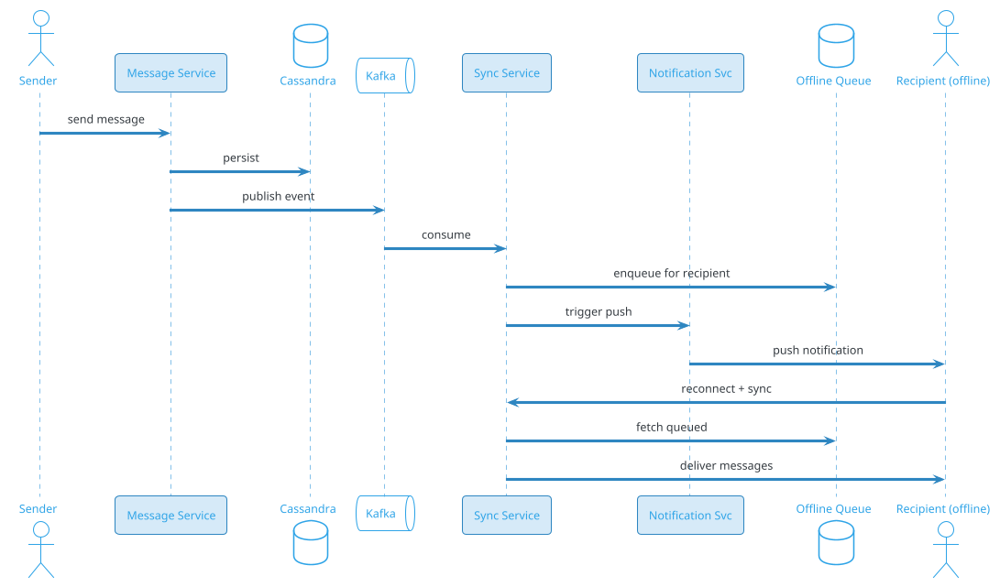
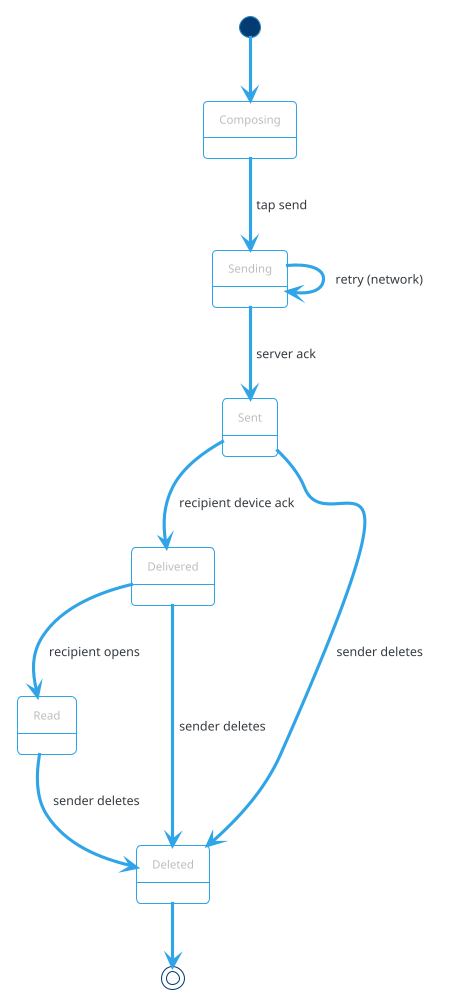
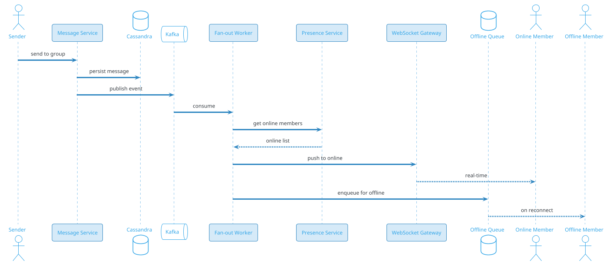
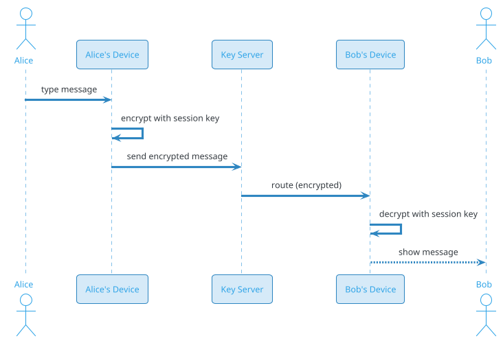
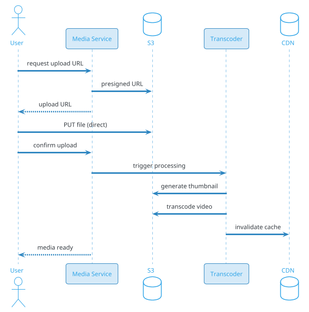

# Online Messaging App (WhatsApp / Slack)

## Problem Statement

Design a real-time messaging app like WhatsApp, Slack, or Telegram. Users send 1:1 and group messages, see delivery and read receipts, share media, and receive messages offline. The system must handle billions of messages per day, guarantee ordered delivery within a conversation, support end-to-end encryption (E2EE), and synchronize across multiple devices per user.

**Example:**
```
Alice sends "Hey, how are you?" to Bob (1:1 chat)

Flow:
  1. Alice types and taps Send
  2. Message is E2EE, sent to server
  3. Server assigns message_id + timestamp
  4. Server routes to Bob's devices (phone, laptop, tablet)
  5. Bob's phone is online → push via WebSocket
  6. Bob's laptop is offline → queue for later
  7. Bob sees the message, taps it → "Read" receipt sent back
  8. Alice's device shows "Read" indicator
  9. If Bob replies, message flows back to Alice + her other devices
 10. If Alice's phone is offline, message is queued

Group chat:
  - 500 members in a "Team" group
  - Each message is fanned out to all members' devices
  - Only online members receive in real-time; others on next open

Scale:
  - 2B users, 5B devices
  - 100B messages/day (~1.16M/sec avg, 5M/sec peak)
  - 100M groups, avg 20 members
  - Media: 500M photos/videos per day
```

**Real-world systems:** WhatsApp, Slack, Telegram, Signal, Discord, Facebook Messenger, WeChat.

**Why it's interesting:**

- **Message ordering** (per conversation, monotonic)
- **Delivery guarantees** (at-least-once, dedup)
- **Offline delivery** (queue, persist, retry)
- **Multi-device sync** (phone, tablet, web)
- **End-to-end encryption** (Signal Protocol, key management)
- **Media upload/download** (S3, CDN, chunked)
- **Group fan-out** (small vs large groups)
- **Presence and typing** (WebSocket)
- **Read receipts** (per user, per message)
- **Scale** (billions of messages, millions of concurrent connections)
- **Storage** (chat history, retention, GDPR)

---

## 1. Requirements Clarification

### Functional Requirements
- **1:1 messaging**: Send, receive, sync across devices
- **Group messaging**: Up to 1000 members per group
- **Message ordering**: Per-conversation, monotonic by sender
- **Delivery status**: Sent, delivered, read receipts
- **Offline delivery**: Queue and deliver on reconnect
- **Media**: Images, videos, documents, voice notes
- **Multi-device**: 4 devices per user, synced
- **Presence**: Online/offline, last seen
- **Typing indicator**: Real-time
- **Message search**: Full-text across conversations
- **Message history**: Sync on new device
- **Edit / delete**: Within time window
- **Reactions**: Emoji reactions to messages
- **Reply / thread**: Quote a message
- **Mentions**: @user in groups
- **End-to-end encryption**: Optional but preferred
- **Push notifications**: When app in background

### Non-Functional Requirements
- **Scale**: 100B messages/day, 5M msg/sec peak, 2B users, 5B devices
- **Latency**: Message delivery < 500 ms p99 (both online)
- **Availability**: 99.99% — messaging is core
- **Consistency**: Per-conversation ordering; eventual across conversations
- **Durability**: No message loss (replicated, persisted)
- **Ordering**: Monotonic per sender per conversation
- **Privacy**: E2EE, metadata minimization
- **Compliance**: GDPR, DPDP, lawful intercept (where required)
- **Storage**: 90-day hot, archive older
- **Cost**: Optimize media storage and bandwidth

### Out of Scope
- Voice / video calls (that's a separate problem)
- Stories / status (ephemeral, separate)
- Payments in chat (integrations)
- Bots / integrations (Slack apps)

---

## 2. Back-of-Envelope Estimation

### Traffic

```
Given:
  Users                = 2,000,000,000
  DAU                  = 1,000,000,000
  Devices per user     = 2.5 avg
  Messages/day         = 100,000,000,000
  Groups               = 100,000,000
  Avg group size       = 20
  Media/day            = 500,000,000
  Peak multiplier      = 5x

Average QPS:
  Messages = 100B / 86,400 = ~1,157,400/sec
  Media    = 500M / 86,400 = ~5,787/sec

Peak QPS:
  Messages = ~5,787,000/sec
  Media    = ~28,935/sec

Fan-out:
  Avg fan-out = 2.5 devices + 20 group members (if group)
  Worst case: 500-member group × 2.5 devices = 1250 deliveries/message
```

### Storage

```
Messages:
  100B/day x 30 days = 3T messages (hot)
  100B/day x 365 days = 36.5T messages/year
  Per message: ~500 bytes (with metadata)
  Hot (30 days): ~1.5 PB
  1-year: ~18 PB

Media:
  500M/day x 1 MB avg = 500 TB/day
  30 days: ~15 PB
  1 year: ~180 PB

Message index (for search):
  Inverted index over messages
  ~30% of message size
  1 year: ~5.4 PB

User metadata:
  2B users x 5 KB = ~10 TB

Device metadata:
  5B devices x 1 KB = ~5 TB

Group metadata:
  100M groups x 20 KB = ~2 TB

Presence:
  1B online users x 1 KB (Redis) = ~1 TB

Total hot storage: ~20 PB
Total cold storage: ~200 PB (media dominates)
```

### Bandwidth

```
Messages:
  1.16M/sec x 500 bytes = ~580 MB/sec
  Peak: ~2.9 GB/sec = ~23 Gbps

Media upload:
  5,787/sec x 1 MB = ~5.8 GB/sec = ~46 Gbps

Media download:
  5,787/sec x 3 downloads avg x 1 MB = ~17 GB/sec = ~139 Gbps

Total peak: ~200 Gbps (media dominates)
```

### Latency Budget

```
Message delivery (online user):
  Client → API:              ~50 ms
  Auth:                       ~10 ms
  Persist to DB:              ~20 ms
  Route to recipient:         ~10 ms
  WebSocket push:             ~100 ms
  Recipient device render:    ~50 ms
  Total:                      ~250 ms

Message delivery (offline user):
  Store + queue:              ~100 ms
  Push notification:          ~500 ms
  User opens app:             user-driven
  Sync on reconnect:          ~1-5 sec (depends on backlog)
```

---

## 3. High-Level Design

```d2
direction: down

sender: Sender Device {shape: person}
receiver: Receiver Device {shape: person}

cdn: CDN {shape: cloud}

lb: Edge LB {shape: hexagon}
gw: API Gateway {shape: hexagon}
ws: WebSocket Gateway {shape: rectangle}

msg: Message Service {shape: rectangle}
auth: Auth Service {shape: rectangle}
presence: Presence Service {shape: rectangle}
notif: Notification Service {shape: rectangle}
media: Media Service {shape: rectangle}
search: Search Service {shape: rectangle}
sync: Sync Service {shape: rectangle}

kafka: Kafka {shape: queue}

msgdb: "Cassandra (messages)" {shape: cylinder}
pdb: "PostgreSQL (users, groups)" {shape: cylinder}
redis: "Redis (presence, sessions)" {shape: cylinder}
s3: "S3 (media)" {shape: cylinder}
es: "Elasticsearch (search)" {shape: cylinder}

apns: "APNS / FCM" {shape: cloud}

sender -> cdn
cdn -> lb
lb -> gw
gw -> auth
gw -> msg
gw -> media
gw -> search
gw -> sync

msg -> kafka
msg -> msgdb
msg -> pdb
msg -> redis

kafka -> notif
kafka -> sync
kafka -> search

presence -> redis
notif -> apns
apns -> receiver

ws -> redis
receiver -> ws
ws -> msg

media -> s3
sync -> redis
search -> es
```

### Component Responsibilities

| Component | Role |
|---|---|
| CDN | Static assets, media thumbnails |
| Edge LB | Anycast routing to nearest region |
| API Gateway | Auth, rate limiting, routing |
| WebSocket Gateway | Persistent connections for real-time |
| Message Service | Send, receive, persist messages |
| Auth Service | User authentication, device pairing |
| Presence Service | Online/offline, last seen, typing |
| Notification Service | Push when app is backgrounded |
| Media Service | Upload, download, transcode, thumbnails |
| Search Service | Full-text search across messages |
| Sync Service | Multi-device sync, offline queue replay |
| Kafka | Event bus for fan-out |
| Cassandra | Message storage (write-heavy, partitioned) |
| PostgreSQL | Users, groups, metadata (ACID) |
| Redis | Presence, sessions, hot cache, rate limit |
| S3 | Media blobs (images, video, docs) |
| Elasticsearch | Message search index |
| APNS / FCM | Push notification delivery |

### Why This Architecture

- **WebSocket** for real-time delivery (phone ↔ server)
- **Cassandra** for message storage (write-heavy, time-series friendly)
- **PostgreSQL** for users, groups, relationships (relational, ACID)
- **Redis** for presence, sessions, typing (ephemeral, in-memory)
- **Kafka** for async fan-out (multi-device, notifications, search indexing)
- **S3 + CDN** for media (cost-effective, globally fast)
- **Per-region deployment** for compliance and latency

---

## 4. API Design

### Send Message

```http
POST /v1/conversations/{conversation_id}/messages
Content-Type: application/json
Authorization: Bearer <user-token>
Idempotency-Key: msg-uuid-xyz

{
  "client_message_id": "client-uuid-123",
  "type": "text",
  "content": "Hey, how are you?",
  "reply_to": null,
  "mentions": [],
  "metadata": {
    "device_id": "device-abc",
    "sent_at": "2026-09-19T10:00:00.123Z"
  }
}
```

**Response 201:**
```json
{
  "message_id": "srv-uuid-456",
  "conversation_id": "conv-789",
  "sender_id": "user-123",
  "type": "text",
  "content": "Hey, how are you?",
  "sent_at": "2026-09-19T10:00:00.456Z",
  "server_timestamp": "2026-09-19T10:00:00.500Z",
  "status": "sent"
}
```

### Get Messages (Pagination)

```http
GET /v1/conversations/{conversation_id}/messages?limit=50&before=msg-uuid-456
```

**Response:**
```json
{
  "messages": [
    {
      "message_id": "srv-uuid-456",
      "sender_id": "user-123",
      "content": "Hey, how are you?",
      "sent_at": "2026-09-19T10:00:00.456Z",
      "status": "delivered",
      "delivered_to": ["user-456", "user-789"],
      "read_by": ["user-456"]
    }
  ],
  "has_more": true,
  "next_cursor": "msg-uuid-455"
}
```

### Conversations List

```http
GET /v1/conversations?limit=20&cursor=conv-cursor
```

**Response:**
```json
{
  "conversations": [
    {
      "conversation_id": "conv-789",
      "type": "group",
      "name": "Engineering Team",
      "participants": ["user-123", "user-456", ...],
      "last_message": {
        "content": "Hey, how are you?",
        "sender_id": "user-123",
        "sent_at": "2026-09-19T10:00:00.456Z"
      },
      "unread_count": 5
    }
  ]
}
```

### Media Upload

```http
POST /v1/media/upload
Content-Type: multipart/form-data

file: <binary>
conversation_id: conv-789
type: image
```

**Response 201:**
```json
{
  "media_id": "media-abc",
  "url": "https://cdn.example.com/media/media-abc.jpg",
  "thumbnail_url": "https://cdn.example.com/media/media-abc-thumb.jpg",
  "size_bytes": 524288,
  "mime_type": "image/jpeg",
  "width": 1024,
  "height": 768
}
```

### Send Message with Media

```http
POST /v1/conversations/conv-789/messages
{
  "client_message_id": "client-uuid-124",
  "type": "image",
  "media_id": "media-abc",
  "caption": "Look at this!",
  "metadata": {
    "device_id": "device-abc",
    "sent_at": "2026-09-19T10:01:00.123Z"
  }
}
```

### Delivery / Read Receipts

```http
POST /v1/messages/{message_id}/receipt
{
  "type": "delivered",
  "user_id": "user-456",
  "device_id": "device-xyz",
  "timestamp": "2026-09-19T10:00:02.000Z"
}
```

```http
POST /v1/messages/{message_id}/receipt
{
  "type": "read",
  "user_id": "user-456",
  "device_id": "device-xyz",
  "timestamp": "2026-09-19T10:00:15.000Z"
}
```

### Presence

```http
GET /v1/users/{user_id}/presence
```

**Response:**
```json
{
  "user_id": "user-456",
  "status": "online",
  "last_seen_at": null,
  "typing_in": ["conv-789"]
}
```

### WebSocket Protocol

```
CONNECT wss://ws.example.com/v1/chat
AUTH: Bearer <user-token>

CLIENT → SERVER:
{"type": "subscribe", "conversation_ids": ["conv-789", "conv-790"]}
{"type": "typing", "conversation_id": "conv-789", "typing": true}
{"type": "send_message", "conversation_id": "conv-789", "client_message_id": "uuid", "content": "Hello"}
{"type": "ack", "message_id": "srv-uuid-456"}

SERVER → CLIENT:
{"type": "message", "message_id": "srv-uuid-457", "conversation_id": "conv-789", "sender_id": "user-456", "content": "Hi", "sent_at": "..."}
{"type": "typing", "conversation_id": "conv-789", "user_id": "user-456", "typing": true}
{"type": "receipt", "message_id": "srv-uuid-456", "type": "delivered", "user_id": "user-456"}
{"type": "presence", "user_id": "user-456", "status": "online"}
```

### Sync on Reconnect

```http
GET /v1/sync?since_cursor=sync-cursor-abc&limit=1000
```

**Response:**
```json
{
  "messages": [...],
  "receipts": [...],
  "presence_updates": [...],
  "next_cursor": "sync-cursor-def",
  "has_more": false
}
```

---

## 5. Database Design

### PostgreSQL Schema (Users, Groups)

```sql
-- Users
CREATE TABLE users (
    user_id BIGINT PRIMARY KEY,
    phone_hash VARCHAR(64) UNIQUE,
    email VARCHAR(255) UNIQUE,
    display_name VARCHAR(100),
    avatar_url TEXT,
    status VARCHAR(50),
    created_at TIMESTAMP DEFAULT NOW()
);

-- Devices per user
CREATE TABLE devices (
    device_id BIGINT PRIMARY KEY,
    user_id BIGINT REFERENCES users(user_id),
    platform VARCHAR(20),
    push_token TEXT,
    device_name VARCHAR(100),
    is_active BOOLEAN DEFAULT TRUE,
    last_active_at TIMESTAMP,
    registered_at TIMESTAMP DEFAULT NOW(),
    UNIQUE (user_id, device_id)
);
CREATE INDEX idx_devices_user ON devices(user_id) WHERE is_active = TRUE;

-- Conversations (1:1 and group)
CREATE TABLE conversations (
    conversation_id BIGINT PRIMARY KEY,
    type VARCHAR(20) NOT NULL,
    name VARCHAR(200),
    avatar_url TEXT,
    created_by BIGINT REFERENCES users(user_id),
    created_at TIMESTAMP DEFAULT NOW(),
    updated_at TIMESTAMP DEFAULT NOW()
);

-- Conversation participants
CREATE TABLE conversation_participants (
    conversation_id BIGINT REFERENCES conversations(conversation_id),
    user_id BIGINT REFERENCES users(user_id),
    role VARCHAR(20) DEFAULT 'member',
    joined_at TIMESTAMP DEFAULT NOW(),
    muted_until TIMESTAMP,
    last_read_message_id BIGINT,
    last_read_at TIMESTAMP,
    PRIMARY KEY (conversation_id, user_id)
);
CREATE INDEX idx_participants_user ON conversation_participants(user_id);

-- User's conversation list (denormalized for fast access)
CREATE TABLE user_conversations (
    user_id BIGINT,
    conversation_id BIGINT,
    last_message_id BIGINT,
    last_message_at TIMESTAMP,
    unread_count INT DEFAULT 0,
    updated_at TIMESTAMP DEFAULT NOW(),
    PRIMARY KEY (user_id, conversation_id)
);
CREATE INDEX idx_user_conv_recent ON user_conversations(user_id, last_message_at DESC);
```

### Cassandra Schema (Messages)

```sql
-- Messages per conversation, ordered by message_id (time-based UUID)
CREATE TABLE messages (
    conversation_id BIGINT,
    message_id TIMEUUID,
    sender_id BIGINT,
    type TEXT,
    content TEXT,
    media_id BIGINT,
    reply_to UUID,
    mentions LIST<BIGINT>,
    client_message_id TEXT,
    sent_at TIMESTAMP,
    edited_at TIMESTAMP,
    deleted BOOLEAN DEFAULT FALSE,
    PRIMARY KEY ((conversation_id), message_id)
) WITH CLUSTERING ORDER BY (message_id DESC)
  AND compaction = {'class': 'TimeWindowCompactionStrategy', 'compaction_window_size': 1, 'compaction_window_unit': 'DAYS'};

-- Receipts per message
CREATE TABLE message_receipts (
    conversation_id BIGINT,
    message_id TIMEUUID,
    user_id BIGINT,
    receipt_type TEXT,           -- delivered, read
    received_at TIMESTAMP,
    PRIMARY KEY ((conversation_id), message_id, user_id, receipt_type)
);

-- Offline queue per device
CREATE TABLE offline_queue (
    user_id BIGINT,
    device_id BIGINT,
    queued_at TIMESTAMP,
    message_id TIMEUUID,
    conversation_id BIGINT,
    payload TEXT,
    PRIMARY KEY ((user_id, device_id), queued_at)
) WITH CLUSTERING ORDER BY (queued_at ASC)
  AND default_time_to_live = 2592000;   -- 30 days

-- Media metadata
CREATE TABLE media (
    media_id BIGINT,
    uploaded_by BIGINT,
    s3_key TEXT,
    thumbnail_s3_key TEXT,
    mime_type TEXT,
    size_bytes BIGINT,
    width INT,
    height INT,
    duration_seconds INT,
    created_at TIMESTAMP,
    PRIMARY KEY ((media_id))
);
```

### Redis Data Structures

```
-- Presence (per user)
Key: presence:{user_id}
Value: {status, last_seen_at, device_ids}
TTL: 60 seconds (refreshed by heartbeat)

-- Typing indicator (per conversation)
Key: typing:{conversation_id}
Type: Set of user_ids (expire after 5 sec)
TTL: 5 seconds

-- WebSocket sessions
Key: ws:{user_id}:{device_id}
Value: {gateway_id, connection_id, subscribed_conversations}
TTL: 60 seconds

-- Recent messages cache (hot conversations)
Key: conv:{conversation_id}:recent
Type: List of last 100 messages
TTL: 1 hour

-- Rate limit per user
Key: ratelimit:{user_id}:messages
Value: count
TTL: 1 minute

-- Idempotency
Key: idem:{user_id}:{client_message_id}
Value: server_message_id
TTL: 24 hours

-- Conversation → WebSocket gateway mapping
Key: conv:{conversation_id}:subscribers
Type: Set of gateway_ids
```

### Elasticsearch Index

```json
{
  "mappings": {
    "properties": {
      "message_id": {"type": "keyword"},
      "conversation_id": {"type": "keyword"},
      "sender_id": {"type": "keyword"},
      "content": {"type": "text", "analyzer": "standard"},
      "sent_at": {"type": "date"},
      "type": {"type": "keyword"},
      "mentions": {"type": "keyword"}
    }
  }
}
```

**Indexed per user** (only messages in conversations they participate in).

---

## 6. Deep Dive: Message Ordering and Delivery

### The Core Challenge

Messages must appear in the **same order** for all participants in a conversation, regardless of:
- Network reordering
- Clock skew between devices
- Concurrent sends
- Offline delivery

### Ordering Strategy

**Per-conversation ordering** using **server-assigned timestamps**:

```
1. Sender's device assigns client_message_id + client timestamp
2. Server receives, assigns server-side message_id (TIMEUUID) + server timestamp
3. Server broadcasts to all recipients with server timestamp
4. Recipients order by (server_timestamp, message_id)
```

**TIMEUUID** (Cassandra):
- Embeds timestamp + random
- Monotonically increasing per node
- Globally sortable

**Why server timestamp?**
- Client clocks are unreliable (skew, drift, tampering)
- Server is the single source of truth for ordering
- Cross-device consistency

### Client-Side Ordering

Each device maintains:
- `last_server_timestamp` for the conversation
- Pending messages (not yet acked by server)
- Server-acked messages

**Display order:**
1. Server-acked messages sorted by `server_timestamp`
2. Pending messages appended after (with optimistic UI)

**On ack:** Pending message is replaced by server-acked version.

**Conflict:** If server timestamp is earlier than expected (clock skew), re-order.

### Delivery Guarantees

**At-least-once delivery**:
- Sender retries until server acks
- Server persists + broadcasts
- Client dedupes by `client_message_id`

**Deduplication:**
```
For each incoming message:
  if message.client_message_id in local_cache:
    skip (already processed)
  else:
    process and store
```

**Idempotency key:** `(sender_id, client_message_id)`.

### Delivery Status

| Status | Meaning | Who Reports |
|---|---|---|
| Sending | Client is uploading | Sender |
| Sent | Server received | Server |
| Delivered | Recipient device received | Recipient device |
| Read | Recipient opened | Recipient |

**Group chats:** Status is aggregate:
- Delivered: at least one device received
- Read: all online recipients read (or configurable)

### Offline Delivery



**Offline queue:**
- Per user per device
- FIFO order
- TTL: 30 days
- Delivered on reconnect

**Sync on reconnect:**
- Client sends last sync cursor
- Server sends all changes since cursor
- Client applies changes
- Bidirectional sync

### Message Lifecycle



---

## 7. Deep Dive: Group Fan-Out

### The Challenge

A message in a group with N members must be delivered to:
- N members
- × average 2.5 devices per member
- = 2.5N deliveries

**Small group (20 members):** 50 deliveries. Easy.

**Large group (1000 members):** 2500 deliveries. More challenging.

**WhatsApp limit:** 1024 members per group.
**Telegram limit:** 200,000 members per channel.

### Fan-Out Strategy

**Two approaches:**

**1. Fan-out on write:**
- When message sent, replicate to all recipients' queues
- Pros: Fast read (just read your queue)
- Cons: Expensive write for large groups

**2. Fan-out on read:**
- Store message once in conversation
- Each recipient fetches on open
- Pros: Cheap write
- Cons: Slower read for active conversations

**Hybrid (recommended):**
- **Small groups (< 100 members):** Fan-out on write
- **Large groups (> 100 members):** Fan-out on read
- **Online members:** Push via WebSocket
- **Offline members:** Queue, fetch on open

### Group Message Flow



### Fan-Out Performance

For a 1000-member group:
- 1000 members × 2.5 devices = 2500 deliveries
- If 30% online: 750 real-time WebSocket pushes
- If 70% offline: 1750 enqueued

**Optimization:**
- Batch WebSocket pushes (send multiple messages per frame)
- Batch offline queue writes
- Parallel fan-out (10-20 workers per group)

**Latency target:** All deliveries within 1 sec for a 1000-member group.

### Message Expiry in Large Groups

For very large groups (channels), consider:
- **Read receipts off** (too expensive)
- **Delivery receipts off**
- **History off** (only new messages)
- **Pinned messages only**

### Rate Limiting

**Per user per conversation:** 10 msg/sec (Slack limit)
**Per group:** Total incoming rate limited to prevent spam

**Broadcast groups:** Special handling (admin-only posting).

---

## 8. Deep Dive: Multi-Device Sync

### The Challenge

User has phone + laptop + tablet. Message should sync across all devices.

### Device Registration

```
1. User installs app → generates device keypair
2. Device registers with backend:
   - device_id (server-assigned)
   - user_id
   - public_key (for E2EE)
3. Server stores device in `devices` table
4. User's other devices get notified → update key bundle
```

### Sync Mechanism

**Option A: Server stores per-device state**
- Each device has its own queue
- Server pushes to each device independently
- Pros: Simple
- Cons: N copies of every message

**Option B: Server stores per-user state + sync cursor**
- Each device has its own cursor
- On reconnect, fetch delta since cursor
- Pros: Efficient
- Cons: Slightly more complex

**Recommendation:** Option B.

### Sync Protocol

```
1. Device reconnects → WebSocket
2. Sends last_sync_cursor (per conversation)
3. Server responds with:
   - New messages since cursor
   - Receipt updates
   - Presence updates
   - New cursor
4. Device applies changes locally
5. Device sends own pending messages
6. Server acks and broadcasts to other devices
```

### Cross-Device Read Sync

**Problem:** User reads message on phone; laptop should mark it read.

**Solution:**
1. Phone sends `read` receipt with `message_id`
2. Server updates `conversation_participants.last_read_message_id`
3. Server broadcasts to user's other devices
4. Laptop updates UI (unread count = 0)

**Idempotent:** Marking read multiple times is fine.

### Conflict Resolution

**Scenario:** Same user sends messages from two devices at once.

**Resolution:**
- Each message has unique `client_message_id`
- Server assigns distinct `server_message_id`
- Both messages delivered in order
- No conflict (both are legitimate)

**Scenario:** User edits message on phone, laptop has stale version.

**Resolution:**
- Edit creates a new version (edit_id)
- Server broadcasts edit event
- All devices update to latest version
- Last-write-wins for edits (only one edit version kept)

### Device Removal

**When user logs out:**
- Device is deregistered
- Server stops sending to it
- Future messages not delivered to it

**When user loses device:**
- From another device, "Remove this device"
- Server removes device + its keys
- E2EE keys rotated (forward secrecy)

### Notification Coordination

**Problem:** Message arrives; all 3 devices show notification.

**Solution:**
- Push notification to the device that's most likely to be used
- Or: push to all; dismiss on others when one is opened

**Implementation:**
- Push to all devices
- Include `collapse_key` (same notification for all)
- User opens one → server sends `dismiss` to others

---

## 9. Deep Dive: Presence and Typing

### Presence

**States:**
- Online (active in last 30 sec)
- Away (active in last 5 min)
- Offline (> 5 min)

**Implementation:**

```
1. Client connects to WebSocket
2. Sends heartbeat every 30 sec
3. Server updates Redis: presence:{user_id} = {status, last_seen}
4. TTL 60 sec; refreshed by heartbeat
5. On disconnect: presence removed (or set to offline)
```

**Fan-out:** When user comes online, notify their contacts:
- Only contacts in user's recent conversations (not all 2B users)
- Batched via Kafka

**Last seen:** Only if user enables privacy setting.

### Typing Indicator

**Problem:** Show "Alice is typing..." in real-time.

**Naive approach:** Send a typing event on every keystroke. Too chatty.

**Better approach:**
- Client: Send `typing: true` on first keystroke
- Client: Send `typing: false` after 3 sec of inactivity or on send
- Server: Broadcast to conversation participants
- Server: Auto-expire typing indicator after 5 sec

**Redis:**
```
Key: typing:{conversation_id}
Type: Set of user_ids
TTL: 5 sec

SADD typing:conv-789 user-123
EXPIRE typing:conv-789 5
```

**Cleanup:** On send or timeout, `SREM`.

### Presence Scale

```
1B online users
Each has:
  - Presence entry in Redis: ~1 KB
  - WebSocket connection: ~10 KB memory
Total: ~11 TB across cluster (distributed)
```

**Sharding:** Presence by user_id in Redis cluster.

### Privacy Controls

- **Last seen:** On/Off per user
- **Read receipts:** On/Off per user (both parties must enable)
- **Typing indicator:** On/Off
- **Online status:** On/Off

**Mutual:** If A disables read receipts, B doesn't see A's reads either.

### Presence in Groups

**Problem:** 500-member group; showing all presence is noisy.

**Solution:**
- Show presence for active participants only
- "5 members online" summary
- Individual presence on demand

### Presence Reliability

- **Missed disconnect:** TTL handles it (60 sec)
- **Rapid reconnects:** Don't flap status (debounce)
- **Cross-region:** Presence stored in user's home region

---

## 10. Deep Dive: End-to-End Encryption (Optional)

### Why E2EE?

- Server can't read messages
- Protection against server compromise
- Privacy regulation compliance
- User trust

### Signal Protocol (Recommended)

The industry standard for E2EE messaging:
- **Double Ratchet**: Forward secrecy + future secrecy
- **X3DH**: Initial key agreement
- **Sender Keys**: Efficient for groups

### Key Concepts

**Identity key**: Long-term public key per user
**Signed prekey**: Medium-term, signed by identity key
**One-time prekey**: Single-use, for initial handshake
**Session key**: Derived per-conversation, ratcheted per message

### Sending a Message



### Group E2EE (Sender Keys)

For groups:
- Each member generates a **sender key**
- Sender key is distributed to all members (encrypted per member)
- Sender encrypts group message once with sender key
- All members decrypt with sender key

**Benefit:** One encryption for N recipients.

**Rotate:** Sender key rotated when membership changes.

### Server's Role

- Server stores encrypted messages (can't read)
- Server routes to devices
- Server stores public keys (for handshake)
- Server does NOT have private keys

### Metadata Protection

Even with E2EE, server sees:
- Who sends to whom
- When
- Message size

**Minimize:**
- Sealed sender (Signal)
- Padding (obfuscate size)
- Delayed delivery (obfuscate timing)

### Key Verification

Users can verify:
- **Safety numbers**: Compare fingerprint out-of-band
- **QR codes**: Scan to verify

**Not automatic** — user must opt in.

### Multi-Device E2EE

Each device has its own keys.
- Sender encrypts once per recipient **device**
- Server routes to correct device
- Adds overhead: N devices = N ciphertexts

**Optimization:** Sender key per device group.

### Trade-offs

| Aspect | With E2EE | Without E2EE |
|---|---|---|
| Privacy | High | Low |
| Server search | No | Yes |
| Server-side AI | No | Yes |
| Lawful intercept | No | Yes |
| Complexity | High | Low |
| Multi-device | Complex | Simple |

**Reality:** Most platforms use E2EE optionally (WhatsApp always; Telegram optional for secret chats; Slack no).

---

## 11. Deep Dive: Media Handling

### The Challenge

500M media uploads/day. Images, videos, documents. Must be fast, reliable, and cheap.

### Upload Flow



### Presigned URLs

Client uploads directly to S3 (not through backend):
- Reduces backend load
- Faster upload
- Uses S3 scalability

**Backend issues presigned URL** with:
- Expiry (5 min)
- Size limit
- Content-type restriction

### Thumbnail Generation

For images:
- Thumbnail (200x200)
- Medium (800x800)
- Full (original)

For videos:
- Thumbnail (poster frame)
- Preview (short clip)
- Transcoded (720p, 1080p)

**Async:** Triggered via Kafka event after upload.

### CDN Distribution

- S3 as origin
- CloudFront / Cloudflare as CDN
- Cache images at edge (1-year TTL, immutable URLs)
- Serve to user from nearest PoP

**Bandwidth:** ~90% served from CDN, 10% from S3.

### Download Flow

```
1. Client requests media
2. CDN serves if cached (90%)
3. If not cached, CDN fetches from S3
4. Client gets media
```

### Media Encryption (E2EE)

If E2EE enabled:
- Client encrypts media before upload
- Server stores encrypted blob
- Server cannot see media
- Recipient downloads and decrypts

**Trade-off:** No server-side thumbnail generation. Client generates thumbnail and uploads both.

### Media Expiry

- **Viewed media:** Downloaded to device, kept until user deletes
- **Server-side:** Retained per retention policy (30 days hot, archive after)
- **Group media:** Same retention as messages

### Cost Optimization

| Technique | Savings |
|---|---|
| Deduplicate identical files (hash) | 10-20% |
| CDN caching | 90% bandwidth from origin |
| Compression (WebP, AV1) | 30-50% storage |
| Tiered storage (S3 → Glacier) | 70% for cold |
| Expiry of undownloaded media | 5-10% |

---

## 12. Deep Dive: Search

### Message Search Requirements

- Full-text across all conversations
- Filter by sender, date, conversation
- Fast (< 300 ms p99)
- Privacy: only search user's own messages

### Architecture

**Per-user index** (each user has their own index in Elasticsearch) OR **shared index with user filter**.

**Recommendation:** Shared index with `user_ids` field; queries filter by current user.

**Indexing pipeline:**
1. Message sent → Kafka event
2. Search indexer consumes event
3. Adds to Elasticsearch (per user per conversation)
4. Excludes E2EE messages (if E2EE enabled — server can't read)

### Index Schema

```json
{
  "message_id": "srv-456",
  "conversation_id": "conv-789",
  "sender_id": "user-123",
  "content": "Hey, how are you?",
  "sent_at": "2026-09-19T10:00:00.456Z",
  "type": "text",
  "user_ids": ["user-123", "user-456"],
  "mentions": [],
  "has_media": false
}
```

**`user_ids`** lets queries filter by "messages visible to this user" — no separate index per user.

### Search Query

```json
{
  "query": {
    "bool": {
      "must": [
        {"match": {"content": "meeting"}}
      ],
      "filter": [
        {"term": {"user_ids": "user-123"}},
        {"range": {"sent_at": {"gte": "2026-09-01"}}}
      ]
    }
  }
}
```

### Search UI

- Global search (all conversations)
- Per-conversation search
- Filters: sender, date range, has media
- Sort: relevance or date
- Snippets with highlighted matches

### Privacy Considerations

- Only search own messages (user_ids filter)
- E2EE messages not indexed server-side (client-side search only)
- GDPR: right to export, right to erasure

### Scale

```
1-year messages: 36.5T messages
Per message ~500 bytes → 18 PB
Index ~30% → 5.4 PB

Elasticsearch cluster: 100+ nodes
Sharded by user_id_hash
```

---

## 13. Scaling Considerations

### Read Scaling

- **Cassandra** for messages (linear scale)
- **Read replicas** for PostgreSQL (users, groups)
- **Redis cluster** for presence, sessions
- **CDN** for media
- **Elasticsearch** for search (sharded)

### Write Scaling

- **Cassandra** for messages (write-optimized)
- **Kafka** for fan-out (partitioned)
- **S3** for media (unlimited)
- **PostgreSQL** for metadata (sharded)

### Sharding Strategy

**Cassandra messages:** Partition by `conversation_id`.
- All messages in a conversation on same partition
- Time-ordered (TIMEUUID)
- Efficient range queries

**PostgreSQL:**
- Users: shard by `user_id`
- Conversations: shard by `conversation_id`
- Participants: shard by `conversation_id`

**Kafka:**
- Partition by `conversation_id` (ordered per conversation)

**Redis:**
- Shard by `user_id` (presence)
- Shard by `conversation_id` (typing, hot cache)

### Multi-Region

```d2
direction: down

us: "US Region" {
  shape: cloud
}
eu: "EU Region" {
  shape: cloud
}
apac: "APAC Region" {
  shape: cloud
}

usdb: "US Cassandra" {
  shape: cylinder
}
eudb: "EU Cassandra" {
  shape: cylinder
}
apacdb: "APAC Cassandra" {
  shape: cylinder
}

registry: "User Registry" {
  shape: cylinder
}

us -> usdb
eu -> eudb
apac -> apacdb
us -> registry
eu -> registry
apac -> registry
```

**Home region per user** (based on phone number / signup).
**Data residency:** EU users in EU (GDPR), India in India (DPDP).

**Cross-region conversations:** Store in one region (usually participant majority); other region fetches cross-region.

**Latency:** Cross-region delivery ~200-500 ms (vs <100 ms local).

### Scale Numbers

- **WebSocket gateways:** 100+ nodes, 100K connections each = 10M concurrent
- **Kafka:** 30+ brokers, partitioned by conversation
- **Cassandra:** 200+ nodes, partition by conversation
- **Redis:** 50+ nodes cluster
- **S3:** Multi-region, unlimited
- **Elasticsearch:** 100+ nodes

### Peak Handling

- **New Year, elections, breaking news:** 5-10x spikes
- **Kafka buffers bursts**
- **Auto-scale WebSocket gateways**
- **Prioritize text over media** during peak
- **Degrade:** Skip typing indicators, presence

### Cost Optimization

- **Media is 80% of storage cost** — aggressive tiering
- **Egress is dominated by media** — CDN caching
- **Hot/warm/cold tiering** in Cassandra (recent hot, older cold)
- **Compression** in Cassandra (30-50% savings)
- **Message retention:** 90 days hot, then archive to S3
- **User retention:** Clear inactive users' data after N years

---

## 14. Bottlenecks and Trade-offs

| Concern | Solution | Trade-off |
|---|---|---|
| Message ordering | Server timestamps + TIMEUUID | Extra round trip |
| Delivery guarantee | At-least-once + idempotency | Storage overhead |
| Multi-device sync | Per-device cursor | Storage per device |
| E2EE complexity | Signal Protocol | Complex key management |
| Group fan-out | Hybrid (write/read) | Complex logic |
| Media bandwidth | CDN + compression | Cost, complexity |
| Presence | Redis with TTL | Eventual consistency |
| Typing | Fire-and-forget | May miss events |
| Search | Elasticsearch | E2EE breaks search |
| Multi-region | Home region | Cross-region latency |
| Cost | Tiered storage | Retrieval latency |

### Design Decisions Summary

| Decision | Choice | Rationale |
|---|---|---|
| Message store | Cassandra (partition by conversation) | Write-heavy, time-series |
| Metadata store | PostgreSQL (sharded) | ACID for users, groups |
| Real-time | WebSocket | Low latency |
| Fan-out | Kafka | Decoupled, ordered |
| Media | S3 + CDN | Cost-effective, fast |
| Search | Elasticsearch | Full-text |
| Presence | Redis with TTL | Fast, ephemeral |
| E2EE | Signal Protocol (optional) | Industry standard |
| Multi-region | Home region | Compliance, latency |
| Ordering | Server-assigned TIMEUUID | Consistent per conversation |

---

## 15. Failure Scenarios

### WebSocket Gateway Down

**Impact:** Users connected to it lose real-time.

**Mitigation:**
- Client reconnects to another gateway
- Fetch missed messages via sync API
- Push notifications still work

### Cassandra Node Down

**Impact:** Conversations on that node temporarily unavailable.

**Mitigation:**
- Replication factor 3
- Quorum reads/writes continue
- Node auto-recovers

### Kafka Down

**Impact:** Fan-out delayed.

**Mitigation:**
- Buffer in Message Service
- Fall back to direct DB writes
- Replay on recovery

### Redis Down

**Impact:** Presence, typing, sessions unavailable.

**Mitigation:**
- Fall back to DB for sessions
- Presence degrades gracefully
- Redis Sentinel for HA

### S3 Down

**Impact:** Media upload/download fails.

**Mitigation:**
- Multi-region S3
- Retry with backoff
- Queue uploads

### Push Provider Down (APNS/FCM)

**Impact:** Notifications delayed.

**Mitigation:**
- Retry with backoff
- Fall back to in-app only
- Extended retention in offline queue

### PostgreSQL Down

**Impact:** New users, groups fail.

**Mitigation:**
- Multi-AZ failover
- Queue writes
- Read from replicas

### Elasticsearch Down

**Impact:** Search unavailable.

**Mitigation:**
- Fall back to Cassandra-based search (slow)
- Serve cached recent searches
- Alert ops

### Message Loss

**Impact:** User's message never delivered.

**Mitigation:**
- At-least-once delivery
- Persistent offline queue
- Idempotent consumers
- Monitoring: detect gaps, alert

### Clock Skew

**Impact:** Messages out of order.

**Mitigation:**
- Server-authoritative timestamps
- NTP across servers
- Client clock not trusted for ordering

### Data Breach

**Impact:** Message content exposed.

**Mitigation:**
- E2EE (if enabled)
- Encryption at rest (AES-256)
- Access controls + audit
- Incident response

### Spam / Abuse

**Impact:** Users receive unwanted messages.

**Mitigation:**
- Rate limits per user
- Block / report features
- ML spam detection
- Phone number verification

### Compliance / Lawful Intercept

**Impact:** Required to hand over data.

**Mitigation:**
- E2EE makes this hard (by design)
- Metadata still available
- Transparency reports
- Legal process

---

## 16. Monitoring and Alerts

### Key Metrics

| Metric | Target | Alert Threshold |
|---|---|---|
| Message send p99 | < 500 ms | > 2 sec |
| Delivery p99 (online) | < 500 ms | > 2 sec |
| Sync p99 (reconnect) | < 5 sec | > 30 sec |
| WebSocket connection success | > 99.9% | < 99% |
| WebSocket p99 latency | < 100 ms | > 500 ms |
| Fan-out lag | < 1 sec | > 10 sec |
| Kafka consumer lag | < 5 sec | > 60 sec |
| Cassandra write p99 | < 20 ms | > 100 ms |
| Media upload p99 | < 3 sec (10 MB) | > 10 sec |
| CDN cache hit ratio | > 90% | < 80% |
| Message loss rate | 0 | > 0.001% |
| Duplicate delivery rate | < 0.1% | > 1% |

### Dashboards

- **Traffic**: Messages/sec, media/sec, by region
- **Latency**: p50/p95/p99 per operation
- **Fan-out**: Queue depth, delivery rate
- **WebSocket**: Connections, messages/sec, disconnects
- **Media**: Upload/download rates, CDN hit ratio
- **Errors**: 4xx/5xx by endpoint
- **Infrastructure**: Cassandra, Kafka, Redis, PG health
- **Business**: DAU, MAU, messages/user, retention

### Alerts

- **P0**: Message loss detected, Cassandra cluster down, Kafka down
- **P1**: Delivery p99 > 2 sec, WebSocket success < 99%
- **P2**: Fan-out lag > 10 sec, CDN hit ratio < 80%
- **P3**: High duplicate rate, high disconnect rate

### Business KPIs

- **DAU/MAU** ratio (engagement)
- **Messages per DAU** (activity)
- **Media per DAU** (content richness)
- **Retention** (D1, D7, D30)
- **Multi-device usage** (% with 2+ devices)
- **Group participation** (% in 2+ groups)
- **Notification CTR** (push → open)

---

## 17. Cost Estimation

Rough monthly cost (AWS, us-east-1) for 100B messages/day:

| Component | Spec | Cost/month |
|---|---|---|
| WebSocket gateways | 200 x c6g.2xlarge | ~$24,000 |
| API servers | 200 x c6g.large | ~$12,000 |
| Message Service | 100 x c6g.large | ~$6,000 |
| Media Service | 50 x c6g.large | ~$3,000 |
| Cassandra | 300 x i3.2xlarge | ~$300,000 |
| PostgreSQL | 30 shards x db.r6g.4xlarge | ~$140,000 |
| Read replicas | 60 x db.r6g.2xlarge | ~$126,000 |
| Kafka (MSK) | 30 brokers | ~$15,000 |
| Redis cluster | 60 x cache.r6g.2xlarge | ~$30,000 |
| S3 (hot 30d) | 15 PB | ~$345,000 |
| S3 (Glacier archive) | 100 PB | ~$400,000 |
| CDN | 5 PB/month egress | ~$400,000 |
| Elasticsearch | 100 x r6g.2xlarge | ~$180,000 |
| Monitoring | Datadog | ~$50,000 |
| **Total** | | **~$2.03M/month** |

**Per user:** ~$0.001/month (very cheap per user).

**Cost optimization:**
- **Media storage**: aggressive tiering (hot 30d, warm 1y, cold archive)
- **CDN caching**: 90%+ hit ratio
- **Compute**: Reserved instances (30-40% savings)
- **Compression**: 30-50% Cassandra savings
- **Retention**: Clear inactive user data

**Note:** Media storage + egress dominate cost (65%+). Text messaging itself is cheap.

---

## 18. Extensions and Follow-ups

### Voice / Video Calls

- WebRTC for real-time
- Signaling via existing WebSocket
- SFU for group calls
- Separate service (not covered here)

### Stories / Status

- Ephemeral content (24h)
- Separate service with TTL
- Feed generation (contacts' stories)

### Channels / Broadcasts

- One-to-many (like Telegram channels)
- Fan-out on read (not write)
- Millions of subscribers
- Read receipts off by default

### Bots and Integrations

- Slack-style apps
- Webhook events
- OAuth for third-party
- Slash commands

### Rich Media

- Polls
- Location sharing
- Contact cards
- Stickers / GIFs

### Disappearing Messages

- TTL per message
- Client-side and server-side deletion
- Forward secrecy implications

### Message Editing

- Time window (e.g., 15 min)
- Edit history (or not)
- E2EE implications

### Threads / Replies

- Slack-style threads
- Reduces noise in group chats
- Nested messages

### Reactions

- Emoji reactions per message
- Aggregate counts
- Live updates

### Payments in Chat

- Send/receive money
- Integration with payment providers
- Regulatory compliance

### AI Features

- **Smart replies**: ML suggestions
- **Summarization**: Long thread summary
- **Translation**: Auto-translate
- **Search enhancement**: Semantic search

### Web3 / Decentralized

- Matrix protocol for federation
- Blockchain-based identity
- Decentralized storage (IPFS)

### Enterprise Features

- Compliance (eDiscovery)
- Data retention policies
- Admin controls
- SSO integration

### Accessibility

- Screen reader support
- High contrast mode
- Voice messages → text
- Text → voice

---

## 19. Summary

| Aspect | Decision |
|---|---|
| Message store | Cassandra (partition by conversation) |
| Metadata store | PostgreSQL (sharded) |
| Real-time | WebSocket |
| Fan-out | Kafka (hybrid write/read) |
| Media | S3 + CDN |
| Search | Elasticsearch |
| Presence | Redis with TTL |
| E2EE | Signal Protocol (optional) |
| Ordering | Server-assigned TIMEUUID |
| Delivery | At-least-once + idempotency |
| Offline | Per-device queue in Cassandra |
| Multi-device | Sync cursors + WebSocket |
| Scale | 100B messages/day, 5M/sec peak |
| Latency | < 500 ms p99 (online) |
| Availability | 99.99% |
| Cost | ~$2M/month |

## Key Takeaways

- Cassandra is the message backbone — partition by conversation, TIMEUUID for ordering
- WebSocket for real-time, Kafka for fan-out, offline queue for reliability
- Server-assigned timestamps ensure consistent ordering across all participants
- At-least-once + idempotency = effectively exactly-once
- Hybrid group fan-out (write for small, read for large)
- Multi-device via sync cursors — efficient, no duplication
- Presence via Redis with TTL — self-healing
- E2EE is complex — Signal Protocol is standard, but breaks server-side search
- Media dominates cost — CDN + tiering is essential
- Home region per user for compliance and latency
- Cost per user is tiny ($0.001/month) but total is massive due to scale

---

## Similar Pattern Problems

- Notification System (real-time delivery, WebSocket)
- Social Feed (event-driven, fan-out)
- Mail Sharing (email delivery, offline)
- Content Sharing / Microblog (real-time updates)
- Video Conferencing (WebRTC, separate problem)
- Task Management (notifications, sync)
- Collaborative Document Editor (real-time sync)