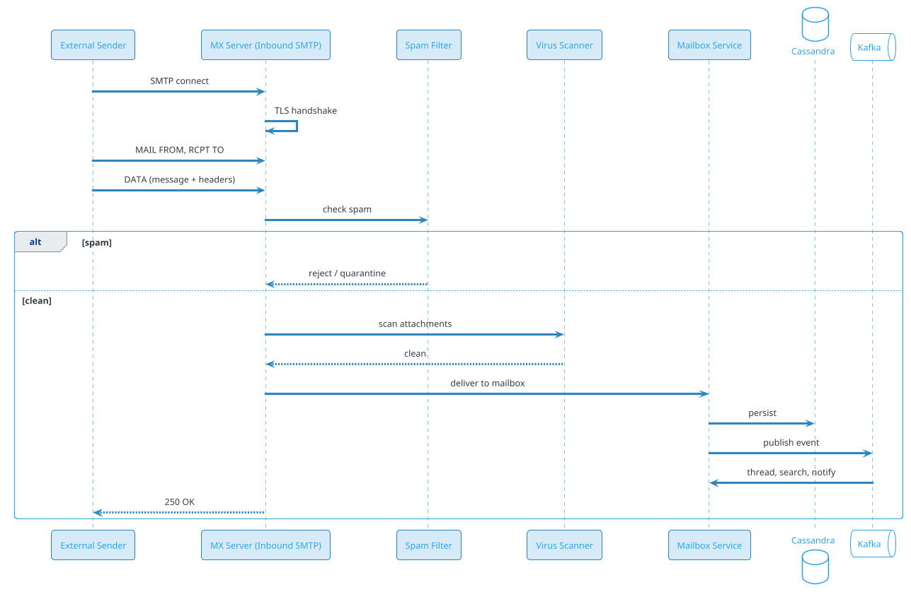
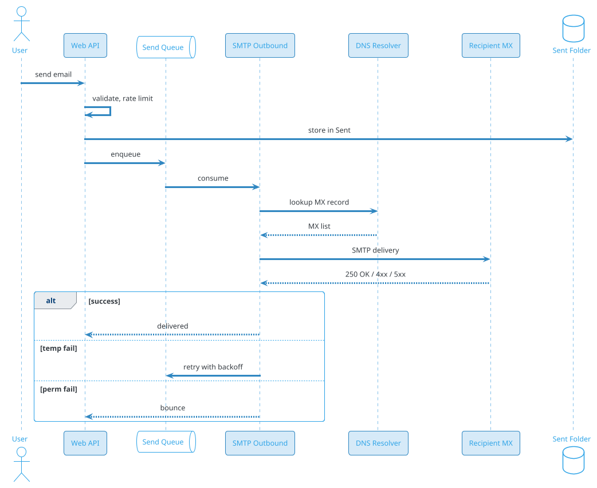
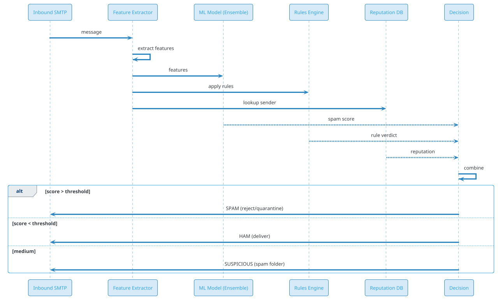
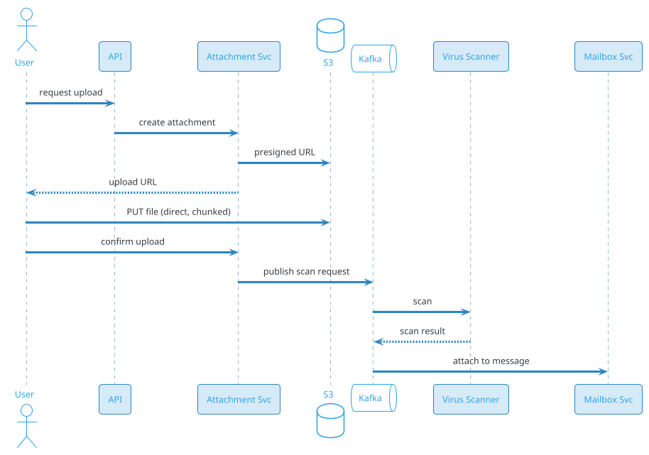

# Mail Sharing (Gmail / Outlook)

## Problem Statement

Design a large-scale email service like Gmail or Outlook. Users compose, send, receive, search, and organize emails. The system handles billions of emails per day, supports attachments, spam filtering, threading, labels, and cross-device sync. It integrates with external mail servers via SMTP/IMAP and stores decades of user history.

**Example:**
```
User Priya sends an email:

To: bob@example.com, carol@example.com
Subject: Meeting tomorrow
Body: "Let's discuss the Q4 plan. Attached the deck."
Attachment: q4_plan.pdf (2 MB)

Flow:
  1. Priya composes in Gmail web/app
  2. Client uploads attachment to storage
  3. Client sends email via API (HTTPS) to Gmail backend
  4. Backend validates, runs spam checks
  5. Backend assigns message_id, stores in Priya's "Sent"
  6. Backend looks up MX records for example.com
  7. Backend delivers via SMTP to example.com's mail server
  8. Recipients (bob, carol) receive via their mail provider
  9. Replies come back, threaded by Gmail
 10. Search indexes the message ("q4 plan")

Scale:
  - 2B users
  - 300B emails/day (~3.5M/sec avg, 15M/sec peak)
  - 60% spam blocked at edge
  - 100B attachments/day (~1 PB/day)
  - 10-year retention
```

**Real-world systems:** Gmail, Outlook, Yahoo Mail, ProtonMail, Zoho Mail, Fastmail.

**Why it's interesting:**

- **SMTP protocol** (30+ years old, still core)
- **Spam filtering** (ML, reputation, rules)
- **Storage at exabyte scale** (decades of history)
- **Search over billions of emails per user**
- **Threading** (conversation grouping)
- **Attachments** (large files, virus scanning)
- **Interoperability** (SMTP, IMAP, POP3, JMAP)
- **Privacy** (regulated, encryption)
- **Compliance** (legal hold, eDiscovery, GDPR)
- **Deliverability** (SPF, DKIM, DMARC)

---

## 1. Requirements Clarification

### Functional Requirements
- **Compose**: Send email with To, CC, BCC, Subject, Body, Attachments
- **Receive**: Inbound email from external servers via SMTP
- **Threading**: Group related messages into conversations
- **Labels/Folders**: Inbox, Sent, Drafts, Spam, custom labels
- **Search**: Full-text search across all messages
- **Filters/Rules**: Auto-sort, auto-forward, auto-delete
- **Attachments**: Upload, download, preview, scan for viruses
- **Contacts**: Address book, groups
- **Signatures**: Multiple signatures
- **Drafts**: Auto-save, resume editing
- **Undo Send**: Delay send by 5-30 seconds
- **Schedule Send**: Send at a future time
- **Read/Unread**: Per user, per device
- **Reply/Forward**: Quote original
- **Multi-device**: Sync across phone, tablet, web

### Non-Functional Requirements
- **Scale**: 300B emails/day, 2B users, exabyte storage
- **Latency**: Send < 2 sec, deliver < 30 sec (same provider), search < 500 ms
- **Availability**: 99.99% — mail is critical infrastructure
- **Durability**: Never lose an email (replicated, backed up)
- **Consistency**: Strong for user's own mailbox; eventual across servers
- **Search**: Full-text, < 500 ms p99
- **Security**: TLS in transit, encryption at rest, E2EE optional
- **Deliverability**: > 99% inbox delivery (not spam)
- **Compliance**: GDPR, CAN-SPAM, HIPAA (healthcare), legal hold

### Out of Scope
- Calendar and contacts sync (separate protocols)
- Real-time chat (that's messaging)
- Voice/video calls
- Email marketing tools (Mailchimp-style)

---

## 2. Back-of-Envelope Estimation

### Traffic

```
Given:
  Users                = 2,000,000,000
  DAU                  = 800,000,000
  Emails/day (received) = 300,000,000,000
  Spam %               = 60% (blocked at edge)
  Legitimate emails    = 120,000,000,000/day
  Attachments/day      = 100,000,000,000
  Searches/user/day    = 3
  
Average QPS:
  Inbound email   = 300B / 86,400 = ~3,472,000/sec
  Legitimate      = 120B / 86,400 = ~1,389,000/sec
  Sends           = 500M / 86,400 = ~5,787/sec
  Searches        = 800M x 3 / 86,400 = ~27,778/sec
  Attachment ops  = 100B / 86,400 = ~1,157,000/sec

Peak QPS (5x):
  Inbound         = ~17M/sec
  Searches        = ~139K/sec
```

### Storage

```
Emails:
  300B/day x 365 = 109.5T emails/year
  Per email: ~50 KB avg (body + metadata)
  Without attachments: ~5.5 EB/year
  With attachments: ~50 EB/year

Attachments:
  100B/day x 1 MB avg = 100 PB/day
  x 365 = 36.5 EB/year

Index (search):
  ~30% of email size
  ~1.6 EB/year

Mailbox metadata:
  2B users x 100 MB avg metadata = ~200 PB

Total hot storage (year 1): ~95 EB
Note: Exabyte scale — requires tiered storage, compression, dedup
```

### Bandwidth

```
Inbound bandwidth:
  3.47M/sec x 50 KB = ~173 GB/sec = ~1.4 Tbps (spam + legitimate)

Outbound bandwidth:
  5,787/sec x 50 KB = ~290 MB/sec = ~2.3 Gbps

Attachment downloads:
  Peak: ~200 Gbps

Total peak: ~1.6 Tbps
```

### Latency Budget

```
Send email:
  Client → API:           ~50 ms
  Auth + rate limit:      ~20 ms
  Spam check (local):     ~50 ms
  Persist to mailbox:     ~100 ms
  Enqueue for delivery:   ~10 ms
  Total:                  ~250 ms

Delivery (same provider):
  Queue → delivery:       ~1-5 sec

Delivery (cross-provider):
  Queue → SMTP:           ~5-30 sec
  Receiver accepts:       ~1-5 min (best effort)

Search:
  Query parse:            ~10 ms
  Index lookup:           ~200 ms
  Rank + snippet:         ~100 ms
  Total:                  ~350 ms
```

---

## 3. High-Level Design

```d2
direction: down

sender: Sender {shape: person}
recipient: Recipient {shape: person}
external: External Mail Server {shape: cloud}

cdn: CDN {shape: cloud}
lb: Edge LB {shape: hexagon}

api: Web API {shape: rectangle}
smtp_in: SMTP Inbound {shape: rectangle}
smtp_out: SMTP Outbound {shape: rectangle}
imap: IMAP Gateway {shape: rectangle}

auth: Auth Service {shape: rectangle}
spam: Spam Filter {shape: rectangle}
mailbox: Mailbox Service {shape: rectangle}
threading: Threading Service {shape: rectangle}
search: Search Service {shape: rectangle}
attach: Attachment Service {shape: rectangle}
contacts: Contacts Service {shape: rectangle}

kafka: Kafka {shape: queue}

maildb: "Cassandra (emails)" {shape: cylinder}
meta: "PostgreSQL (users, mailboxes)" {shape: cylinder}
redis: "Redis (sessions, hot cache)" {shape: cylinder}
s3: "S3 (attachments)" {shape: cylinder}
es: "Elasticsearch (search index)" {shape: cylinder}
tier: "Cold Storage (Glacier)" {shape: cylinder}

sender -> cdn
cdn -> lb
lb -> api
lb -> imap

external -> smtp_in
smtp_in -> spam

api -> auth
api -> mailbox
api -> attach
api -> search
api -> contacts

spam -> mailbox
mailbox -> kafka
mailbox -> maildb
mailbox -> meta

kafka -> threading
kafka -> search
kafka -> smtp_out

smtp_out -> external

attach -> s3
search -> es
imap -> maildb
imap -> redis

mailbox -> redis

maildb -> tier : after 1 year
```

### Component Responsibilities

| Component | Role |
|---|---|
| CDN | Static assets, attachment downloads |
| Edge LB | Global routing |
| Web API | REST/JSON for web and mobile |
| SMTP Inbound | Receive email from external servers |
| SMTP Outbound | Send email to external servers |
| IMAP Gateway | IMAP protocol for legacy clients |
| Auth Service | User authentication, session management |
| Spam Filter | ML + rules + reputation |
| Mailbox Service | Store, retrieve, manage mailbox |
| Threading Service | Group messages into conversations |
| Search Service | Full-text search over mailbox |
| Attachment Service | Upload, download, virus scan |
| Contacts Service | Address book |
| Kafka | Event bus for async processing |
| Cassandra | Email store (write-heavy, time-series) |
| PostgreSQL | Users, mailboxes, settings (ACID) |
| Redis | Sessions, hot mailbox cache |
| S3 | Attachment blobs |
| Elasticsearch | Search index |
| Cold Storage | Archive older than 1 year |

### Why This Architecture

- **SMTP + IMAP** for interoperability (email is a federated protocol)
- **Cassandra** for email storage (write-heavy, time-partitioned, cheap)
- **PostgreSQL** for user accounts, settings, contacts (relational, ACID)
- **Elasticsearch** for search (inverted index, fast full-text)
- **S3** for attachments (cost-effective, unlimited)
- **Kafka** for async pipeline (spam, threading, search, delivery)
- **Tiered storage** (hot → warm → cold → archive) for exabyte scale

---

## 4. API Design

### Send Email

```http
POST /v1/messages/send
Content-Type: application/json
Authorization: Bearer <user-token>
Idempotency-Key: send-uuid-xyz

{
  "to": ["bob@example.com"],
  "cc": ["carol@example.com"],
  "bcc": [],
  "subject": "Meeting tomorrow",
  "body_html": "<p>Let's discuss the Q4 plan.</p>",
  "body_text": "Let's discuss the Q4 plan.",
  "attachments": [
    {
      "filename": "q4_plan.pdf",
      "media_id": "media-abc",
      "size_bytes": 2097152,
      "mime_type": "application/pdf"
    }
  ],
  "reply_to_message_id": null,
  "thread_id": null,
  "send_at": null
}
```

**Response 201:**
```json
{
  "message_id": "msg-abc-123",
  "thread_id": "thread-xyz",
  "status": "queued",
  "queued_at": "2026-09-19T10:00:00Z",
  "estimated_delivery": "2026-09-19T10:00:30Z"
}
```

### Get Mailbox (List)

```http
GET /v1/mailbox?label=inbox&limit=50&cursor=xyz
```

**Response:**
```json
{
  "messages": [
    {
      "message_id": "msg-abc-123",
      "thread_id": "thread-xyz",
      "subject": "Meeting tomorrow",
      "from": {"name": "Priya Patel", "email": "priya@example.com"},
      "to": [{"name": "Bob", "email": "bob@example.com"}],
      "snippet": "Let's discuss the Q4 plan...",
      "received_at": "2026-09-19T10:00:00Z",
      "is_read": false,
      "is_starred": false,
      "has_attachment": true,
      "labels": ["inbox", "work"]
    }
  ],
  "next_cursor": "msg-abc-122",
  "total_estimate": 1247,
  "unread_count": 42
}
```

### Get Message (Full)

```http
GET /v1/messages/msg-abc-123
```

**Response:**
```json
{
  "message_id": "msg-abc-123",
  "thread_id": "thread-xyz",
  "subject": "Meeting tomorrow",
  "from": {...},
  "to": [...],
  "cc": [...],
  "body_html": "<p>Let's discuss...</p>",
  "body_text": "...",
  "attachments": [
    {
      "attachment_id": "att-456",
      "filename": "q4_plan.pdf",
      "size_bytes": 2097152,
      "mime_type": "application/pdf",
      "download_url": "https://cdn.example.com/att/att-456"
    }
  ],
  "received_at": "2026-09-19T10:00:00Z",
  "headers": {
    "message_id": "<abc@example.com>",
    "in_reply_to": null,
    "references": [],
    "spf": "pass",
    "dkim": "pass",
    "dmarc": "pass"
  }
}
```

### Thread

```http
GET /v1/threads/thread-xyz
```

**Response:**
```json
{
  "thread_id": "thread-xyz",
  "subject": "Meeting tomorrow",
  "message_count": 5,
  "messages": [
    {"message_id": "msg-abc-123", "from": "priya@", "received_at": "..."},
    {"message_id": "msg-abc-124", "from": "bob@", "received_at": "..."},
    ...
  ]
}
```

### Search

```http
GET /v1/search?q=q4+plan+has:attachment+after:2026-01-01
```

**Response:**
```json
{
  "total": 47,
  "results": [
    {
      "message_id": "msg-abc-123",
      "subject": "Meeting tomorrow",
      "from": "priya@example.com",
      "snippet": "...discuss the <em>Q4 plan</em>...",
      "received_at": "...",
      "labels": ["inbox"]
    }
  ]
}
```

### Labels / Filters

```http
GET /v1/labels
POST /v1/labels
PUT /v1/messages/{message_id}/labels
```

### Attachment Upload

```http
POST /v1/attachments
Content-Type: multipart/form-data

file: <binary>
```

**Response 201:**
```json
{
  "attachment_id": "att-456",
  "upload_url": "https://upload.example.com/...",
  "scan_status": "pending",
  "expires_at": "..."
}
```

**After virus scan (async):**
```json
{
  "attachment_id": "att-456",
  "scan_status": "clean",
  "ready": true
}
```

### Drafts

```http
POST /v1/drafts
PUT /v1/drafts/{draft_id}
GET /v1/drafts/{draft_id}
DELETE /v1/drafts/{draft_id}
```

### Undo Send

```http
POST /v1/messages/send
{
  "undo_window_seconds": 10,
  ...
}
```

Message is queued but not sent for 10 sec. User can call:

```http
POST /v1/messages/{message_id}/cancel
```

### Sync (Multi-Device)

```http
GET /v1/sync?since_cursor=abc&limit=1000
```

---

## 5. Database Design

### PostgreSQL Schema (Users, Metadata)

```sql
-- Users
CREATE TABLE users (
    user_id BIGINT PRIMARY KEY,
    email VARCHAR(255) UNIQUE NOT NULL,
    display_name VARCHAR(200),
    created_at TIMESTAMP DEFAULT NOW()
);

-- Mailboxes (user's folder structure)
CREATE TABLE mailboxes (
    mailbox_id BIGINT PRIMARY KEY,
    user_id BIGINT REFERENCES users(user_id),
    name VARCHAR(200),
    type VARCHAR(20),
    created_at TIMESTAMP DEFAULT NOW()
);

-- Labels
CREATE TABLE labels (
    label_id BIGINT PRIMARY KEY,
    user_id BIGINT REFERENCES users(user_id),
    name VARCHAR(100),
    color VARCHAR(20),
    is_system BOOLEAN DEFAULT FALSE,
    created_at TIMESTAMP DEFAULT NOW()
);

-- Filters (auto-sort rules)
CREATE TABLE filters (
    filter_id BIGINT PRIMARY KEY,
    user_id BIGINT REFERENCES users(user_id),
    name VARCHAR(200),
    criteria JSONB,
    actions JSONB,
    is_active BOOLEAN DEFAULT TRUE,
    created_at TIMESTAMP DEFAULT NOW()
);

-- Contacts
CREATE TABLE contacts (
    contact_id BIGINT PRIMARY KEY,
    user_id BIGINT REFERENCES users(user_id),
    email VARCHAR(255) NOT NULL,
    name VARCHAR(200),
    phone VARCHAR(20),
    notes TEXT,
    tags TEXT[],
    created_at TIMESTAMP DEFAULT NOW(),
    UNIQUE (user_id, email)
);
CREATE INDEX idx_contacts_user ON contacts(user_id);

-- Drafts
CREATE TABLE drafts (
    draft_id BIGINT PRIMARY KEY,
    user_id BIGINT REFERENCES users(user_id),
    data JSONB NOT NULL,
    updated_at TIMESTAMP DEFAULT NOW()
);
CREATE INDEX idx_drafts_user ON drafts(user_id, updated_at DESC);

-- Message metadata (denormalized for fast listing)
CREATE TABLE message_metadata (
    message_id BIGINT PRIMARY KEY,
    user_id BIGINT NOT NULL,
    thread_id BIGINT NOT NULL,
    from_email VARCHAR(255),
    to_emails TEXT[],
    subject TEXT,
    snippet VARCHAR(500),
    is_read BOOLEAN DEFAULT FALSE,
    is_starred BOOLEAN DEFAULT FALSE,
    is_deleted BOOLEAN DEFAULT FALSE,
    labels TEXT[],
    has_attachment BOOLEAN DEFAULT FALSE,
    size_bytes BIGINT,
    received_at TIMESTAMPTZ,
    created_at TIMESTAMP DEFAULT NOW()
);
CREATE INDEX idx_msg_user_date ON message_metadata(user_id, received_at DESC);
CREATE INDEX idx_msg_user_thread ON message_metadata(user_id, thread_id);
CREATE INDEX idx_msg_user_unread ON message_metadata(user_id) WHERE is_read = FALSE;
CREATE INDEX idx_msg_labels ON message_metadata USING GIN (labels);
```

### Cassandra Schema (Email Content)

```sql
-- Message bodies (partition by user_id + time bucket for scalability)
CREATE TABLE messages (
    user_id BIGINT,
    bucket INT,                  -- week number (for partition spread)
    message_id TIMEUUID,
    thread_id BIGINT,
    from_email TEXT,
    to_emails LIST<TEXT>,
    cc_emails LIST<TEXT>,
    bcc_emails LIST<TEXT>,
    subject TEXT,
    body_html TEXT,
    body_text TEXT,
    headers MAP<TEXT, TEXT>,
    attachments LIST<FROZEN<attachment>>,
    size_bytes BIGINT,
    received_at TIMESTAMP,
    PRIMARY KEY ((user_id, bucket), message_id)
) WITH CLUSTERING ORDER BY (message_id DESC)
  AND compaction = {'class': 'TimeWindowCompactionStrategy', 'compaction_window_size': 30, 'compaction_window_unit': 'DAYS'};

-- Threads (partition by user_id)
CREATE TABLE threads (
    user_id BIGINT,
    thread_id BIGINT,
    subject TEXT,
    participants LIST<TEXT>,
    message_count INT,
    last_message_id TIMEUUID,
    last_message_at TIMESTAMP,
    PRIMARY KEY (user_id, thread_id)
) WITH CLUSTERING ORDER BY (thread_id DESC);

-- Message IDs per thread
CREATE TABLE thread_messages (
    user_id BIGINT,
    thread_id BIGINT,
    message_id TIMEUUID,
    PRIMARY KEY ((user_id, thread_id), message_id)
) WITH CLUSTERING ORDER BY (message_id ASC);
```

### Redis Data Structures

```
-- Session
Key: session:{session_id}
Value: {user_id, device_id, expiry}
TTL: 30 days

-- Hot mailbox cache (recent messages)
Key: mailbox:{user_id}:inbox
Type: List of message_ids (top 100)
TTL: 5 min

-- Unread count
Key: unread:{user_id}
Value: int
TTL: 1 hour

-- Rate limiting
Key: ratelimit:{user_id}:send
Value: count
TTL: 1 hour

-- Idempotency
Key: idem:send:{idempotency_key}
Value: message_id
TTL: 24 hours

-- WebSocket sessions (for push)
Key: ws:{user_id}:{device_id}
TTL: 60 sec
```

### S3 / Attachment Storage

```
s3://mail-attachments/{user_id}/{message_id}/{attachment_id}
  - Encrypted with KMS
  - Lifecycle: Standard 90 days, Infrequent Access 1 year, Glacier after
  - Versioning on
```

### Cold Storage (Archive)

```
After 1 year:
  - Messages moved to Glacier
  - Metadata (searchable) remains in hot index
  - Retrieval: 1-5 min for cold messages
```

### Elasticsearch Index

```json
{
  "mappings": {
    "properties": {
      "message_id": {"type": "keyword"},
      "user_id": {"type": "keyword"},
      "thread_id": {"type": "keyword"},
      "from_email": {"type": "keyword"},
      "to_emails": {"type": "keyword"},
      "subject": {"type": "text", "boost": 3},
      "body_text": {"type": "text"},
      "labels": {"type": "keyword"},
      "has_attachment": {"type": "boolean"},
      "received_at": {"type": "date"},
      "size_bytes": {"type": "long"}
    }
  }
}
```

---

## 6. Deep Dive: SMTP and Email Protocols

### SMTP (Simple Mail Transfer Protocol)

The 30+ year old protocol for sending email. Still the backbone.

**Flow:**
```
1. Client (or server) connects to recipient's MX server on port 25 (or 587)
2. HELO/EHLO greeting
3. STARTTLS (encryption)
4. MAIL FROM: <sender@example.com>
5. RCPT TO: <recipient@example.com>
6. DATA
7. <message content>
8. .
9. QUIT
```

### Inbound Flow



### Outbound Flow



### Deliverability (SPF, DKIM, DMARC)

**SPF (Sender Policy Framework):**
- DNS record lists authorized IPs for sending
- Receiver checks sender IP against SPF
- Prevents spoofing

**DKIM (DomainKeys Identified Mail):**
- Sender signs message with private key
- Receiver verifies with public DNS record
- Ensures message not tampered

**DMARC (Domain-based Message Authentication):**
- Policy for SPF/DKIM failures
- Alignment check (From header must match)
- Reports back to sender

**Implementation:**
- Sign every outgoing message with DKIM
- Publish SPF and DMARC records
- Monitor DMARC reports for abuse

### IMAP / POP3 (Client Access)

**IMAP** for full mailbox sync:
```
1. Client connects to IMAP server
2. Authenticates
3. Selects mailbox (INBOX, Sent, etc.)
4. Fetches message list
5. Fetches full messages on demand
6. Syncs flags (read, starred, deleted)
```

**JMAP** (modern alternative to IMAP):
- JSON-based
- Push notifications
- Efficient sync

### Bounce Handling

**Hard bounce:** Email address doesn't exist. → Mark contact as invalid.

**Soft bounce:** Temporary failure (mailbox full, server down). → Retry with backoff.

**Bounce classification:**
- 5xx = permanent
- 4xx = temporary

After N soft bounces, treat as hard bounce.

---

## 7. Deep Dive: Spam Filtering

### The Challenge

60% of email is spam. Must block it without blocking legitimate email.

**False positive (legit email → spam folder):** Very bad (missed important email)
**False negative (spam → inbox):** Annoying (but less harmful)

**Target:** < 0.1% false positive rate, > 99% spam catch rate.

### Multi-Layer Defense

**Layer 1: Connection-level**
- Block known bad IPs (Spamhaus, DNSBL)
- Rate limiting per IP
- Reject malformed SMTP
- Greylisting (temporary reject first-time senders)

**Layer 2: Authentication**
- SPF check (sender IP authorized?)
- DKIM verification (message signed?)
- DMARC alignment
- ARC (Authenticated Received Chain)

**Layer 3: Content analysis**
- Keyword rules (Viagra, lottery, etc.)
- URL analysis (blocklists, ML)
- Attachment analysis (macro virus, executable)
- Bayesian classifier (trained per user)
- Machine learning (transformer models)

**Layer 4: Reputation**
- Sender reputation (IP, domain)
- User feedback (mark as spam)
- Global reputation database

**Layer 5: User-specific**
- User's contacts (known sender → higher trust)
- User's past behavior (marked similar emails as spam)
- User's preferences (strict/lenient)

### ML Architecture



### Features Used by ML

- **Content**: Keywords, URL patterns, HTML structure
- **Headers**: SPF/DKIM/DMARC results, reply-to mismatch
- **Sender**: Domain age, IP reputation, sending history
- **Recipient**: User's past behavior
- **Metadata**: Time of day, message size, attachment types
- **Behavioral**: Send rate, recipient count

### User Feedback Loop

- **"Mark as spam"** → adds to training set
- **"Not spam"** → adds to training set
- **Daily retraining** on user feedback
- **Per-user model** (adapts to user's preferences)

### Spam Quarantine

For uncertain cases:
- Move to **Spam folder** (user can review)
- Optional: **Daily digest** of quarantined messages
- Auto-delete after 30 days

### Challenges

- **Adversarial**: Spammers adapt to filters
- **Legitimate bulk mail**: Newsletters, marketing
- **False positives**: Critical (missed job offer, medical info)
- **Language/culture**: Spam patterns vary by locale
- **Zero-day**: New spam techniques before models catch up

### Anti-Spam Standards

- **SPF, DKIM, DMARC** for authentication
- **ARC** for forwarding integrity
- **BIMI** for brand logo in inbox
- **MTA-STS** for TLS enforcement

---

## 8. Deep Dive: Threading and Conversations

### The Challenge

Group related emails into conversations:
- "Re: Re: Re: Meeting tomorrow" → one thread
- Different clients (Gmail, Outlook) have different threading
- Users expect consistent grouping

### Threading Algorithms

**Approach 1: Reference-based (RFC 5322)**
- Use `Message-ID`, `In-Reply-To`, `References` headers
- Chain of references → thread
- Standard-compliant

**Approach 2: Subject-based**
- Normalize subject (strip Re:, Fwd:)
- Group by (sender, recipients, subject)
- Fallback when headers missing

**Approach 3: Hybrid (Gmail)**
- Try reference-based first
- Fallback to subject-based
- Merge threads when discovered to be same

### Implementation

```
On receiving message:
  1. Parse headers: Message-ID, In-Reply-To, References
  2. If In-Reply-To or References → find existing thread
  3. Else, look for thread with matching subject + participants
  4. If found → add to thread
  5. Else → create new thread
  6. Update thread metadata (last_message_at, message_count)
```

### Thread Storage

**Cassandra:**
- `threads` table: one row per thread
- `thread_messages` table: message_ids per thread
- Index `message_metadata.thread_id` for fast lookup

### UI Considerations

- **Collapse**: Show thread summary, expand on click
- **Reply in-thread**: Reply keeps thread
- **New thread**: Compose starts new thread
- **Split thread**: User can split long thread
- **Merge threads**: User can merge related

### Cross-Client Consistency

Different clients implement threading differently. To maintain consistency:
- Server assigns thread_id on receipt
- Client uses server's thread_id
- Client can display group differently but underlying data is same

---

## 9. Deep Dive: Search

### Why Search Matters

Users have 10+ years of email. Search is the primary way to find old messages.

**Requirements:**
- Full-text across subject, body, sender, recipient
- Filters: has:attachment, from:, to:, after:, before:, label:
- Fast: < 500 ms p99
- Accurate: no missed results

### Index Architecture

**Per-user index** (Elasticsearch) OR **shared index with user filter**.

**Recommendation:** Shared index sharded by `user_id` hash. Each user's messages on one shard.

### Index Schema

```json
{
  "message_id": "srv-456",
  "user_id": "u-123",
  "thread_id": "t-789",
  "from_email": "priya@example.com",
  "from_name": "Priya Patel",
  "to_emails": ["bob@example.com"],
  "subject": "Meeting tomorrow",
  "body_text": "Let's discuss the Q4 plan...",
  "attachment_names": ["q4_plan.pdf"],
  "labels": ["inbox", "work"],
  "has_attachment": true,
  "received_at": "2026-09-19T10:00:00Z",
  "size_bytes": 2097152
}
```

### Indexing Pipeline

```
Message received → Kafka → Indexer → Elasticsearch
                                        ↓
                                 Incremental index
```

**Near-real-time:** Index updated within 1-2 sec of receipt.

**Backfill:** Existing messages indexed via batch job.

### Query Processing

**Parse query:**
- Free text: "q4 plan"
- Operators: `from:bob@`, `has:attachment`, `after:2026-01-01`
- Labels: `label:work`

**Search:**
- Elasticsearch multi_match (subject^3, body, from_name^2)
- Filters applied
- Sort: relevance or date

**Results:**
- Top matches
- Snippet with highlighted terms
- Thread collapse (one result per thread)

### Ranking

**Signals:**
- Text relevance (BM25)
- Recency (newer = higher)
- Starred (user marked important)
- Frequent contacts (from/to)
- Attachments (user searches often want them)

### Indexing Cost

At 300B emails/day, indexing is expensive:
- Only index legitimate (not spam) → 120B/day
- Only index text (not attachments) initially
- Lazy indexing for old email (on first search)

### E2EE and Search

If E2EE is enabled:
- Server can't read content
- **Client-side search only** (index stored on device)
- Alternative: E2EE content encrypted with server key + user key (breaks E2EE)

**Trade-off:** Gmail doesn't do E2EE by default, enabling server-side search.

---

## 10. Deep Dive: Attachments

### The Challenge

100B attachments/day. Sizes from 1 KB to 100 MB. Must be:
- Fast (upload, download)
- Safe (virus scan)
- Cheap (storage cost)
- Reliable (no loss)

### Upload Flow



### Direct S3 Upload

- Backend issues **presigned URL** (5 min expiry)
- Client uploads directly to S3 (not through backend)
- Faster, cheaper, scalable

### Virus Scanning

- **ClamAV** or commercial scanner
- Scan within 5 min of upload
- **Quarantine** until scan complete
- If clean → mark ready
- If infected → notify sender, block

### Attachment Size Limits

- **Gmail:** 25 MB per email (attachment)
- **Larger files:** Upload to Drive, share link
- **Our limit:** 50 MB direct; larger via Drive-style

### Download Flow

- **CDN** for popular attachments
- **S3 presigned URL** for direct download
- **Access control:** Only message participants can download

### Storage Tiering

```
Hot (0-90 days):     S3 Standard
Warm (90d-1y):       S3 Infrequent Access
Cold (1-5y):         S3 Glacier Instant
Archive (5+ years):  S3 Glacier Deep Archive
```

**Cost impact:** 10-20x cheaper for cold storage.

### Deduplication

Many users receive the same attachment (e.g., newsletter PDF):
- Hash content (SHA-256)
- If hash exists, reference existing blob
- **Save 20-30%** storage

### Preview Generation

- **Images:** Thumbnails
- **PDFs:** First-page thumbnail
- **Documents:** Text extraction
- **Videos:** Poster frame

Generated async, cached.

### Attachment Search

- Extract text from PDF, Word, etc.
- Index attachment text (for search)
- Users can search `has:attachment filename:q4`

### Compliance

- **Retention:** User-controlled or policy-driven
- **Legal hold:** Freeze attachments for litigation
- **eDiscovery:** Export attachments for legal
- **GDPR:** Right to erasure

---

## 11. Deep Dive: Multi-Device Sync

### The Challenge

User has phone, laptop, tablet, web. Same mailbox, synced.

### Sync Protocol

**Option A: IMAP-like (poll-based)**
- Client polls for changes
- Simple but inefficient

**Option B: Push-based (WebSocket + sync API)**
- Server pushes changes via WebSocket
- Client fetches delta on reconnect
- Efficient, real-time

**Recommendation:** Option B.

### Sync State per Device

Each device has:
- `last_sync_cursor` (per mailbox)
- `pending_actions` (send, mark read, delete)
- Local cache

### Sync Flow

```
1. Device connects (WebSocket)
2. Sends last_sync_cursor
3. Server sends:
   - New messages since cursor
   - Flag changes (read, starred, deleted)
   - Label changes
   - New cursor
4. Device applies changes
5. Device sends own pending actions
6. Server applies and broadcasts
```

### Conflict Resolution

**Scenario:** Same message marked read on phone and unread on laptop.

**Resolution:**
- Last-write-wins per flag
- Server timestamp determines winner
- Broadcasts to other devices

### Offline Support

- **Send:** Queue in local outbox, send on reconnect
- **Read/Star/Delete:** Queue, apply on reconnect
- **Drafts:** Auto-save locally, sync on reconnect

### Sync Scale

```
2B users × 2.5 devices = 5B device syncs
Persistent WebSocket: ~500M concurrent
Sync API: ~10K req/sec
```

### Full Mailbox Sync (New Device)

When user logs in on new device:
1. Fetch mailbox list (INBOX, Sent, Drafts, etc.)
2. Fetch most recent 100 messages per mailbox
3. Fetch older on demand (pagination)
4. Background: index locally for offline search
5. Initial sync: 1-5 GB of data over hours

### Push Notifications

When app is backgrounded:
- **APNS/FCM** push notification
- Tapping opens app → syncs
- Rich notifications: sender + subject + snippet

---

## 12. Scaling Considerations

### Read Scaling

- **Cassandra** for message content (linear scale)
- **Read replicas** for PostgreSQL
- **Redis** for hot mailbox cache
- **CDN** for attachment downloads
- **Elasticsearch** for search (sharded)

### Write Scaling

- **SMTP inbound** horizontally scaled
- **Kafka** for async processing
- **Cassandra** for high write throughput
- **S3** for attachment storage

### Sharding

**Cassandra:** Partition by `(user_id, bucket)` where bucket = week number.
- Spreads load across nodes
- All messages for a user in a week on one partition
- ~1M messages per partition max

**PostgreSQL:** Shard by `user_id`.
- All data for a user on one shard
- Simple queries

**Kafka:** Partition by `user_id` for ordered per-user events.

**Elasticsearch:** Shard by `user_id` hash.

### Multi-Region

```d2
direction: down

us: "US Region" {
  shape: cloud
}
eu: "EU Region" {
  shape: cloud
}
apac: "APAC Region" {
  shape: cloud
}

usdb: "US Mailboxes" {
  shape: cylinder
}
eudb: "EU Mailboxes" {
  shape: cylinder
}
apacdb: "APAC Mailboxes" {
  shape: cylinder
}

registry: "User Region Registry" {
  shape: cylinder
}

us -> usdb
eu -> eudb
apac -> apacdb
us -> registry
eu -> registry
apac -> registry
```

**User's home region** for mailbox data.
**SMTP inbound** globally distributed (MX records).
**Compliance:** GDPR (EU), DPDP (India), data residency.

### Exabyte Storage Strategy

- **Tiered:** Hot → warm → cold → archive
- **Compression:** Email bodies compress 3-5x
- **Dedup:** Attachments, quoted text
- **Retention:** Default 10 years; user-configurable
- **Cold archival:** S3 Glacier for inactive mailboxes

### Peak Handling

- **Marketing emails:** Scheduled sends (throttled)
- **Newsletters:** Batch delivery
- **Breaking news:** Spikes 2-3x
- **Kafka buffers**, workers auto-scale

### Cost

| Component | Optimization |
|---|---|
| Storage | Tiering, compression, dedup |
| Bandwidth | CDN for attachments |
| Compute | Reserved instances, spot for batch |
| Search | Sampling for analytics; per-user shard |
| Spam filter | Edge rules first, ML only for uncertain |

---

## 13. Bottlenecks and Trade-offs

| Concern | Solution | Trade-off |
|---|---|---|
| Spam detection | Multi-layer ML + rules | False positives hurt |
| Deliverability | SPF/DKIM/DMARC | Complex setup |
| Storage growth | Tiering, dedup, compression | Retrieval latency |
| Search speed | Elasticsearch sharded | Index lag, cost |
| Multi-device sync | WebSocket + sync cursors | Persistent connections |
| Attachment uploads | Direct to S3 | Client complexity |
| Threading | Hybrid (refs + subject) | Imperfect grouping |
| E2EE | Signal Protocol | Breaks server-side search |
| Compliance | Retention policies | Storage + legal |
| Deliverability monitoring | Postmaster tools | Ongoing ops |

### Design Decisions Summary

| Decision | Choice | Rationale |
|---|---|---|
| Message store | Cassandra (partition by user_id + bucket) | Write-heavy, time-series |
| Metadata store | PostgreSQL (sharded) | ACID for users, settings |
| Search | Elasticsearch | Full-text, fast |
| Attachments | S3 + CDN | Cost-effective, scalable |
| Async | Kafka | Decoupled pipeline |
| Multi-device | WebSocket + sync cursors | Real-time + resilient |
| Protocols | SMTP, IMAP, JMAP, REST | Interoperability |
| Spam | Multi-layer ML + rules | Balance catch rate and FP |
| Ordering | Server-assigned timestamps | Consistent |
| Multi-region | Home region | Compliance, latency |

---

## 14. Failure Scenarios

### SMTP Inbound Down

**Impact:** Incoming email delayed.

**Mitigation:**
- MX records point to backup MX
- Backup MX queues messages
- Auto-restart
- Alert ops

### SMTP Outbound Down

**Impact:** Outgoing email delayed.

**Mitigation:**
- Queue in Kafka
- Retry with exponential backoff
- Alternative SMTP relay
- Alert ops

### Cassandra Node Down

**Impact:** Messages on that node temporarily unavailable.

**Mitigation:**
- Replication factor 3
- Quorum reads/writes continue
- Auto-recovery

### Spam Filter Failure

**Impact:** Spam floods inbox OR legitimate mail blocked.

**Mitigation:**
- Fail-open (deliver) vs fail-closed (block)
- **Recommended:** Fail-open (better to receive spam than lose legit)
- Alert + retrain
- Fallback rules

### Search Index Down

**Impact:** Search unavailable.

**Mitigation:**
- Fall back to Cassandra-based search (slow)
- Recent messages cached in Redis
- Alert ops

### S3 Down

**Impact:** Attachment upload/download fails.

**Mitigation:**
- Multi-region S3
- Retry with backoff
- Queue uploads

### Kafka Down

**Impact:** Async pipeline stops.

**Mitigation:**
- Buffer in SMTP/API (bounded)
- Fallback to direct DB writes
- Replay on recovery

### Redis Down

**Impact:** Sessions lost; hot cache misses.

**Mitigation:**
- Redis Sentinel
- Fall back to PostgreSQL
- Reduce load on DB

### Data Loss (Rare)

**Impact:** User loses email.

**Mitigation:**
- Multi-region replication
- Backups (daily snapshots)
- Test restore procedures
- **Recovery:** < 24 hours typical

### Deliverability Issues

**Impact:** Emails marked as spam by recipients.

**Mitigation:**
- SPF, DKIM, DMARC configured
- Monitor reputation (Sender Score, Postmaster Tools)
- Warm up IPs gradually
- Remove bad senders

### Account Compromise

**Impact:** Attacker sends spam from user's account.

**Mitigation:**
- 2FA
- Anomaly detection (unusual send patterns)
- Rate limits
- Temporary suspension
- Alert user

### GDPR / Legal Request

**Impact:** Must produce data.

**Mitigation:**
- eDiscovery tools
- Retention policies
- Legal hold
- Data export (right to access)

---

## 15. Monitoring and Alerts

### Key Metrics

| Metric | Target | Alert Threshold |
|---|---|---|
| Send p99 | < 2 sec | > 5 sec |
| Delivery p99 (same provider) | < 30 sec | > 2 min |
| Inbound p99 | < 5 sec | > 30 sec |
| Search p99 | < 500 ms | > 2 sec |
| Attachment upload p99 | < 5 sec (25 MB) | > 15 sec |
| Spam catch rate | > 99% | < 95% |
| False positive rate | < 0.1% | > 0.5% |
| Deliverability (inbox %) | > 95% | < 90% |
| SMTP queue depth | < 1000 | > 10000 |
| Kafka consumer lag | < 5 sec | > 60 sec |
| Cassandra write p99 | < 20 ms | > 100 ms |
| Search index lag | < 5 sec | > 1 min |
| Attachment scan time | < 5 min | > 30 min |

### Dashboards

- **Traffic**: Emails/sec in/out, spam %, attachment ops
- **Latency**: p50/p95/p99 per operation
- **Deliverability**: Inbox rate, bounce rate, complaints
- **Spam**: Catch rate, FP rate, top spam sources
- **Search**: Query rate, p99 latency, zero-result rate
- **Storage**: Hot/warm/cold usage, tiering metrics
- **Infrastructure**: SMTP, Kafka, Cassandra, ES, S3 health
- **Business**: DAU, messages/user, retention

### Alerts

- **P0**: SMTP down, spam filter down, data loss, Cassandra cluster down
- **P1**: Deliverability < 90%, search p99 > 2 sec, queue depth > 10K
- **P2**: Spam catch rate < 95%, attachment scan > 30 min
- **P3**: High bounce rate, sender reputation drop

### Business KPIs

- **DAU/MAU** (engagement)
- **Emails sent per DAU**
- **Retention** (D1, D7, D30)
- **Read rate** (emails read / delivered)
- **Reply rate**
- **Search usage** (% users who search)
- **Storage per user** (GB)

---

## 16. Cost Estimation

Rough monthly cost (AWS, us-east-1) for 2B users:

| Component | Spec | Cost/month |
|---|---|---|
| SMTP inbound cluster | 200 x c6g.large | ~$12,000 |
| SMTP outbound cluster | 100 x c6g.large | ~$6,000 |
| Web API servers | 150 x c6g.large | ~$9,000 |
| Spam filter cluster | 100 x c6g.2xlarge | ~$12,000 |
| Cassandra | 500 x i3.2xlarge | ~$500,000 |
| PostgreSQL | 50 shards x db.r6g.4xlarge | ~$240,000 |
| Read replicas | 100 x db.r6g.2xlarge | ~$210,000 |
| Kafka (MSK) | 50 brokers | ~$25,000 |
| Redis cluster | 100 x cache.r6g.2xlarge | ~$50,000 |
| S3 (hot) | 20 PB | ~$460,000 |
| S3 Glacier (archive) | 80 PB | ~$320,000 |
| CDN | 100 PB/month egress | ~$2,000,000 |
| Elasticsearch | 200 x r6g.2xlarge | ~$360,000 |
| Cold storage retrieval | 100 TB/month | ~$10,000 |
| Monitoring | Datadog | ~$80,000 |
| **Total** | | **~$4.29M/month** |

**Per user:** ~$0.002/month.

**Cost optimization:**
- **CDN caching**: 80%+ hit ratio for attachments
- **Storage tiering**: 10x savings on cold data
- **Compression**: 3-5x on email bodies
- **Dedup**: 20-30% on attachments
- **Reserved instances**: 30-40% savings

**Note:** Storage and bandwidth dominate (90%+). Email itself is cheap to process.

---

## 17. Extensions and Follow-ups

### E2EE Email

- PGP / S/MIME encryption
- Key management (WKD, Autocrypt)
- Trade-off: breaks server-side search, spam filtering

### Smart Compose

- AI-suggested completions
- Gmail's "Smart Compose" (transformer model)
- Privacy considerations

### Smart Reply

- Quick replies generated by AI
- Context-aware
- "Thanks!", "Sounds good!", "Will do"

### Priority Inbox

- ML ranks important emails
- Time-sensitive, important, others
- User-customizable

### Undo Send

- Delay send by N seconds
- Cancel during window
- Industry standard (Gmail 5-30 sec)

### Schedule Send

- Send at future time
- Timezone-aware
- Recurring sends

### Confidential Mode

- Expiring emails
- No forward/copy
- OTP verification to view

### Email to Calendar

- Auto-detect meeting invites
- One-click add to calendar
- Integration with Google Calendar, Outlook

### Email to Tasks

- Convert email to task
- Reminder, due date
- Integration with Trello, Asana

### Snooze

- Temporarily hide email
- Reappears at scheduled time
- Similar to Inbox Zero workflows

### Bundling

- Group promotional emails
- Group social notifications
- Reduces inbox noise

### Cross-Platform Sync

- Gmail, Outlook, Yahoo interoperability
- Contacts sync (CardDAV, Google Contacts)
- Calendar sync (CalDAV)

### Corporate / Enterprise

- Custom domain
- Admin controls (retention, DLP)
- eDiscovery
- Legal hold
- Compliance (HIPAA, FINRA)

### Email Analytics

- Open tracking (controversial)
- Click tracking
- Delivery analytics (for senders)

### AI Assistant

- Summarize long threads
- Draft replies
- Find old emails via natural language
- Schedule meetings from email

### Federated / Decentralized

- Matrix protocol for email (bridging)
- Blockchain-based identity
- Peer-to-peer email (rare)

### Green Email

- Carbon-neutral hosting
- Efficient storage
- Lifecycle optimization

---

## 18. Summary

| Aspect | Decision |
|---|---|
| Message store | Cassandra (partition by user_id + bucket) |
| Metadata store | PostgreSQL (sharded) |
| Search | Elasticsearch (sharded by user_id) |
| Attachments | S3 + CDN |
| Async | Kafka |
| Protocols | SMTP, IMAP, JMAP, REST, WebSocket |
| Spam | Multi-layer ML + rules + reputation |
| Multi-device | WebSocket + sync cursors |
| Ordering | Server-assigned timestamps |
| Multi-region | Home region per user |
| Scale | 300B emails/day, 2B users, exabytes |
| Latency | Send < 2 sec, search < 500 ms |
| Availability | 99.99% |
| Cost | ~$4.3M/month |

**Key takeaways:**

- **Email is a federated protocol** — SMTP + IMAP + DNS (MX) are the backbone
- **Spam filtering is a multi-layer ML + rules engine** — 60% of email is spam
- **Deliverability requires SPF, DKIM, DMARC** — misconfigured = spam folder
- **Cassandra for messages, PostgreSQL for metadata** — write-heavy + ACID split
- **Search is critical** — Elasticsearch sharded by user_id
- **Attachments dominate cost** — S3 + CDN + tiering is essential
- **Threading via references + subject** — hybrid approach is most robust
- **Multi-device via WebSocket + sync cursors** — efficient, resilient
- **Exabyte scale requires tiered storage** — hot/warm/cold/archive
- **E2EE breaks server-side search** — trade-off users must accept
- **Cost per user is tiny** ($0.002/month) but total is massive at scale

### Similar Pattern Problems

- Online Messaging App (real-time delivery, offline queue)
- Notification System (email as a channel)
- File Storage Service (attachment storage, similar S3 patterns)
- Content Sharing / Microblog (feed of messages)
- Calendar / Scheduling (meeting invites from email)
- Job Search Platform (email notifications)
- Social Feed (inbox as a feed)