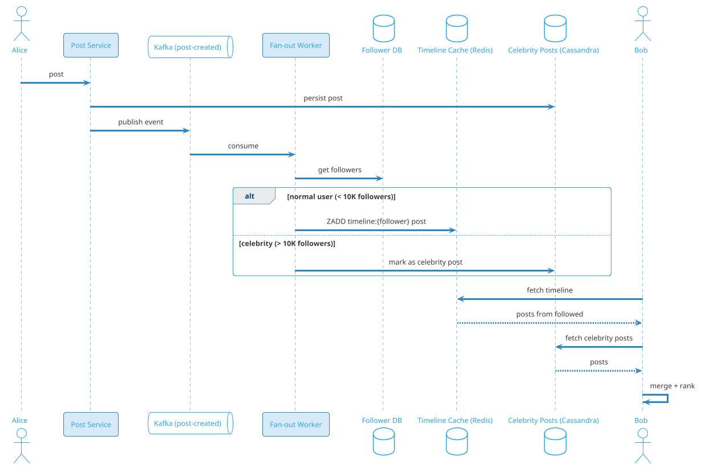
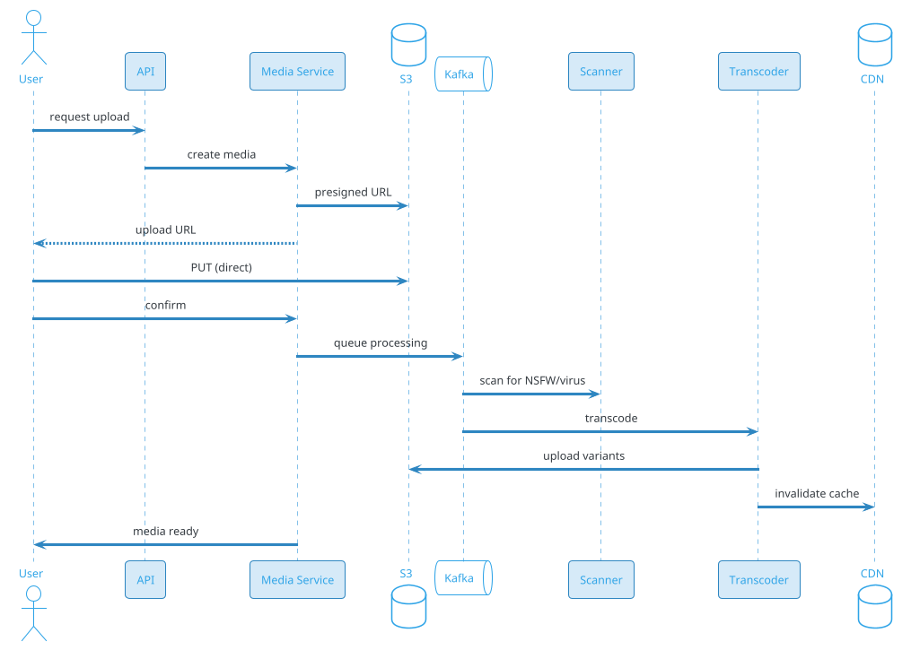

# Content Sharing / Microblog (Twitter)

## Problem Statement

Design a microblogging platform like Twitter (X), Threads, Mastodon, or Bluesky. Users post short text updates (with optional images/videos/links), follow other users, see a personalized timeline, and engage via likes, replies, reposts, and quotes. The system handles hundreds of millions of users, billions of posts per day, and delivers a fresh, ranked timeline in real time.

**Example:**
```
Alice (500K followers) posts: "Just launched our new product! 🚀"

Flow:
  1. Alice composes and posts (280 chars max)
  2. Server assigns post_id + timestamp
  3. Post is fanned out to followers' timelines
  4. Followers see it in their home timeline (ranked)
  5. Some like, reply, repost, quote
  6. Engagement counts update in real-time
  7. Trending algorithm picks it up
  8. Non-followers discover it via search/trends
  9. Recommended posts surface it to similar users

Key challenges:
  - Celebrity fan-out (50M followers)
  - Real-time engagement counts
  - Timeline ranking (recency vs relevance)
  - Search over billions of posts
  - Trending topic detection
  - Spam/bot/spam filtering
  - Content moderation at scale

Scale:
  - 500M DAU
  - 1B users
  - 500M posts/day (~5,787/sec avg, 30K/sec peak)
  - 10B reads/day (timeline views)
  - 5B likes/day
  - 500M reposts/day
  - 1B media uploads/day
```

**Real-world systems:** Twitter / X, Threads, Mastodon, Bluesky, Tumblr, Sina Weibo.

**Why it's interesting:**

- **Fan-out problem** — one post → millions of timelines
- **Timeline ranking** — chronological vs algorithmic
- **Real-time engagement** — likes, replies, reposts update instantly
- **Celebrity problem** — some users have 100M+ followers
- **Search and trends** — find fresh, relevant content
- **Recommendations** — "For you" feed for non-followed content
- **Content moderation** — billions of posts, human + ML
- **Bot detection** — spam, misinformation, coordinated campaigns
- **Media handling** — images, videos, live streams
- **Privacy and verification** — public by default, verified accounts

---

## 1. Requirements Clarification

### Functional Requirements
- **Post**: Short text (280 chars), with optional media, links, mentions, hashtags
- **Follow**: Follow/unfollow other users
- **Home timeline**: Posts from followed users (chronological or ranked)
- **For You feed**: Algorithmic recommendations
- **Engagement**: Like, reply, repost, quote, bookmark
- **Notifications**: Mentions, likes, replies, follows, reposts
- **Search**: Full-text search over posts, users, hashtags
- **Trends**: Trending topics by location
- **Direct messages**: 1:1 and group
- **Profiles**: Bio, avatar, banner, pinned post, follower counts
- **Verification**: Verified accounts (blue check, or subscription)
- **Edit**: Edit post within 30 min (with history)
- **Delete**: Delete own post
- **Mute/Block**: Filter content
- **Lists**: Custom feeds
- **Spaces**: Audio rooms (optional)
- **Communities**: Topic-based groups (optional)

### Non-Functional Requirements
- **Scale**: 500M DAU, 1B users, 500M posts/day, 10B timeline reads/day
- **Latency**: Timeline load < 500 ms p99; post send < 1 sec p99
- **Availability**: 99.99% — core social infrastructure
- **Consistency**: Eventual for timelines (seconds lag acceptable); strong for engagement counts
- **Durability**: Posts are permanent (until deleted)
- **Freshness**: New posts appear in timelines within 10 sec
- **Ordering**: Chronological within a user's timeline
- **Scale of fan-out**: Celebrity (100M followers) → manageable
- **Compliance**: GDPR, DPDP, content moderation laws
- **Cost**: Media storage and bandwidth dominate

### Out of Scope
- Voice/video calls (that's a separate app)
- Live streaming (mentioned briefly)
- Payments/monetization (mentioned briefly)
- Advertising system

---

## 2. Back-of-Envelope Estimation

### Traffic

```
Given:
  DAU                 = 500,000,000
  Users               = 1,000,000,000
  Posts/day           = 500,000,000
  Timeline views/day  = 10,000,000,000
  Likes/day           = 5,000,000,000
  Reposts/day         = 500,000,000
  Media uploads/day   = 1,000,000,000
  Peak multiplier     = 5x

Average QPS:
  Posts      = 500M / 86,400 = ~5,787/sec
  Timeline   = 10B / 86,400 = ~115,740/sec
  Likes      = 5B / 86,400 = ~57,870/sec
  Reposts    = 500M / 86,400 = ~5,787/sec
  Media      = 1B / 86,400 = ~11,574/sec

Peak QPS (5x):
  Posts      = ~28,935/sec
  Timeline   = ~578,700/sec
  Likes      = ~289,350/sec
  Media      = ~57,870/sec

Fan-out calculation:
  Avg followers      = 200
  Fan-out per post   = 200 timeline writes
  Total writes/day   = 500M x 200 = 100B timeline writes
  Peak write QPS     = ~5.8M/sec

Celebrity fan-out (worst case):
  100M followers × 1 post = 100M writes
  Must handle within seconds
```

### Storage

```
Posts:
  500M/day x 365 = 182.5B posts/year
  Per post: ~500 bytes (text + metadata)
  5-year retention: ~456 GB x 5 = ~2.3 TB
  Actually: 182.5B x 500 bytes = ~91 TB/year
  5 years: ~456 TB

Media:
  1B uploads/day x 500 KB avg = 500 TB/day
  5 years: ~912 PB
  (dominant storage cost)

Timeline cache (Redis):
  Active users x 1000 posts x 100 bytes per entry
  500M x 1000 x 100 bytes = ~50 TB
  (hot cache, only recent)

Engagement counts:
  Posts x 3 (likes, replies, reposts)
  ~500B counters x 50 bytes = ~25 TB

Follow graph:
  1B users x 200 followers = 200B edges
  Per edge: ~50 bytes
  Total: ~10 TB

User profiles:
  1B x 2 KB = ~2 TB

Search index:
  Inverted index over posts
  ~30% of post size
  5 years: ~140 TB

Notifications:
  500M/day x 30 days = 15B notifications
  Per notification: ~200 bytes
  Total: ~3 TB

Total hot: ~150 TB
Total cold/archive: ~1 PB
Media (S3): ~1 EB (exabyte)
```

### Bandwidth

```
Timeline responses:
  115K/sec x 50 KB (JSON with 20 posts + media URLs) = ~5.8 GB/sec = ~46 Gbps

Posts (send):
  5,787/sec x 1 KB = ~6 MB/sec (negligible)

Media upload:
  11,574/sec x 500 KB = ~5.8 GB/sec = ~46 Gbps

Media download (CDN):
  11,574/sec x 3 views x 500 KB = ~17 GB/sec = ~139 Gbps

Total: ~230 Gbps peak
```

### Latency Budget

```
Home timeline load:
  Client → API:            ~50 ms
  Auth:                     ~10 ms
  Redis timeline fetch:     ~5 ms
  Enrich with post data:    ~50 ms
  Rank + personalize:       ~30 ms
  Serialize + response:     ~50 ms
  Total:                    ~200 ms

Post send:
  Client → API:             ~50 ms
  Auth + validate:          ~20 ms
  Persist post:             ~30 ms
  Fan-out (async):          ~10 ms (enqueue)
  Return to sender:         ~50 ms
  Total:                    ~150 ms

For You feed (algorithmic):
  Candidate generation:     ~100 ms
  Ranking (ML):             ~200 ms
  Filter + diversify:       ~50 ms
  Serialize:                ~50 ms
  Total:                    ~400 ms
```

---

## 3. High-Level Design

```d2
direction: down

user: User {shape: person}
cdn: CDN {shape: cloud}
lb: Edge LB {shape: hexagon}

api: API Gateway {shape: hexagon}

post: Post Service {shape: rectangle}
timeline: Timeline Service {shape: rectangle}
fanout: Fan-out Worker {shape: rectangle}
engage: Engagement Service {shape: rectangle}
follow: Follow Service {shape: rectangle}
search: Search Service {shape: rectangle}
trend: Trending Service {shape: rectangle}
reco: Recommendation Service {shape: rectangle}
notif: Notification Service {shape: rectangle}
media: Media Service {shape: rectangle}
moderation: Moderation Service {shape: rectangle}

kafka: Kafka {shape: queue}

pdb: "PostgreSQL (users, follows)" {shape: cylinder}
pstore: "Post Store (Cassandra)" {shape: cylinder}
redis: "Redis (timeline cache)" {shape: cylinder}
es: "Elasticsearch (search)" {shape: cylinder}
s3: "S3 (media)" {shape: cylinder}
ch: "ClickHouse (analytics)" {shape: cylinder}

user -> cdn
cdn -> lb
lb -> api

api -> post
api -> timeline
api -> engage
api -> follow
api -> search
api -> reco
api -> media
api -> notif

post -> kafka
post -> pstore
post -> pdb
post -> redis

kafka -> fanout
kafka -> search
kafka -> trend
kafka -> notif
kafka -> moderation

fanout -> redis
fanout -> pstore

timeline -> redis
timeline -> pstore
timeline -> reco

engage -> redis
engage -> ch

follow -> pdb

search -> es
reco -> es
reco -> ch

media -> s3
```

### Component Responsibilities

| Component | Role |
|---|---|
| CDN | Static assets, media thumbnails |
| Edge LB | Anycast routing |
| API Gateway | Auth, rate limiting, routing |
| Post Service | Create, edit, delete posts |
| Timeline Service | Serve home timeline and user timeline |
| Fan-out Worker | Push posts to followers' timelines |
| Engagement Service | Likes, replies, reposts, quotes |
| Follow Service | Follow graph management |
| Search Service | Full-text search over posts and users |
| Trending Service | Detect trending topics |
| Recommendation Service | "For You" algorithmic feed |
| Notification Service | Push, email, in-app notifications |
| Media Service | Upload, transcode, serve media |
| Moderation Service | Content policy enforcement |
| Kafka | Event bus for async processing |
| PostgreSQL | Users, follows, relationships |
| Cassandra | Post storage (write-heavy, time-series) |
| Redis | Timeline cache (hot, per-user) |
| Elasticsearch | Search index |
| S3 | Media blobs |
| ClickHouse | Analytics, engagement counts |

### Why This Architecture

- **Cassandra** for posts (write-heavy, time-partitioned)
- **Redis** for timelines (fast in-memory, per-user)
- **Kafka** for fan-out pipeline (decouples post creation from delivery)
- **PostgreSQL** for users, follows (relational, ACID)
- **Elasticsearch** for search (inverted index)
- **ClickHouse** for engagement counts (OLAP, fast aggregation)
- **S3 + CDN** for media (cost-effective, globally fast)
- **Fan-out service** separates the celebrity problem from the common case

---

## 4. API Design

### Post

```http
POST /v1/posts
Content-Type: application/json
Authorization: Bearer <user-token>
Idempotency-Key: post-uuid-xyz

{
  "text": "Just launched our new product! 🚀",
  "media_ids": ["media-abc"],
  "reply_to": null,
  "quote_of": null,
  "mentions": ["@bob"],
  "hashtags": ["#launch", "#product"]
}
```

**Response 201:**
```json
{
  "post_id": "post-123",
  "author_id": "user-456",
  "text": "Just launched our new product! 🚀",
  "media": [{"media_id": "media-abc", "url": "..."}],
  "created_at": "2026-09-19T10:00:00.123Z",
  "metrics": {
    "likes": 0,
    "replies": 0,
    "reposts": 0,
    "quotes": 0,
    "views": 0
  }
}
```

### Get Timeline (Home)

```http
GET /v1/timeline/home?limit=50&cursor=xyz
```

**Response:**
```json
{
  "posts": [
    {
      "post_id": "post-123",
      "author": {
        "user_id": "user-456",
        "username": "alice",
        "display_name": "Alice",
        "avatar_url": "...",
        "verified": true
      },
      "text": "Just launched our new product!",
      "media": [...],
      "created_at": "2026-09-19T10:00:00.123Z",
      "metrics": {"likes": 1247, "replies": 89, "reposts": 342},
      "user_engagement": {
        "liked": false,
        "reposted": false,
        "bookmarked": false
      }
    }
  ],
  "next_cursor": "post-121",
  "algorithm": "ranked"
}
```

### For You Feed

```http
GET /v1/timeline/for-you?limit=50&cursor=xyz
```

Same response structure, different ranking (algorithmic, includes non-followed posts).

### User Timeline

```http
GET /v1/users/{username}/posts?limit=50&cursor=xyz
```

### Get Post

```http
GET /v1/posts/post-123
```

### Like / Unlike

```http
POST /v1/posts/post-123/like
DELETE /v1/posts/post-123/like
```

### Reply

```http
POST /v1/posts
{
  "text": "Congrats!",
  "reply_to": "post-123"
}
```

### Repost

```http
POST /v1/posts/post-123/repost
DELETE /v1/posts/post-123/repost
```

### Follow / Unfollow

```http
POST /v1/users/user-456/follow
DELETE /v1/users/user-456/follow
```

### Search

```http
GET /v1/search?q=product+launch&type=posts&limit=20
GET /v1/search?q=alice&type=users&limit=20
```

### Trends

```http
GET /v1/trends?location=IN&limit=10
```

**Response:**
```json
{
  "location": "IN",
  "trends": [
    {"topic": "#Diwali", "post_count": 234000},
    {"topic": "#Cricket", "post_count": 189000}
  ]
}
```

### Media Upload

```http
POST /v1/media/upload
Content-Type: multipart/form-data

file: <binary>
```

**Response 201:**
```json
{
  "media_id": "media-abc",
  "url": "https://cdn.example.com/media/media-abc.jpg",
  "thumbnail_url": "...",
  "width": 1024,
  "height": 768,
  "size_bytes": 524288,
  "scan_status": "pending"
}
```

### Notifications

```http
GET /v1/notifications?limit=20&cursor=xyz
POST /v1/notifications/mark-read
```

---

## 5. Database Design

### PostgreSQL Schema (Users, Follows)

```sql
-- Users
CREATE TABLE users (
    user_id BIGINT PRIMARY KEY,
    username VARCHAR(50) UNIQUE NOT NULL,
    email VARCHAR(255) UNIQUE,
    phone_hash VARCHAR(64),
    display_name VARCHAR(100),
    bio VARCHAR(300),
    avatar_url TEXT,
    banner_url TEXT,
    location VARCHAR(100),
    website VARCHAR(200),
    verified BOOLEAN DEFAULT FALSE,
    follower_count INT DEFAULT 0,
    following_count INT DEFAULT 0,
    post_count INT DEFAULT 0,
    created_at TIMESTAMP DEFAULT NOW()
);
CREATE INDEX idx_users_username ON users(username);

-- Follow graph
CREATE TABLE follows (
    follower_id BIGINT NOT NULL,
    followee_id BIGINT NOT NULL,
    created_at TIMESTAMP DEFAULT NOW(),
    PRIMARY KEY (follower_id, followee_id)
);
CREATE INDEX idx_follows_followee ON follows(followee_id);

-- Blocked users
CREATE TABLE blocks (
    blocker_id BIGINT NOT NULL,
    blocked_id BIGINT NOT NULL,
    created_at TIMESTAMP DEFAULT NOW(),
    PRIMARY KEY (blocker_id, blocked_id)
);

-- Muted users
CREATE TABLE mutes (
    muter_id BIGINT NOT NULL,
    muted_id BIGINT NOT NULL,
    created_at TIMESTAMP DEFAULT NOW(),
    PRIMARY KEY (muter_id, muted_id)
);

-- Bookmarks
CREATE TABLE bookmarks (
    user_id BIGINT NOT NULL,
    post_id BIGINT NOT NULL,
    created_at TIMESTAMP DEFAULT NOW(),
    PRIMARY KEY (user_id, post_id)
);
```

### Cassandra Schema (Posts, Engagement)

```sql
-- Posts (partition by author, time-bucketed)
CREATE TABLE posts (
    author_id BIGINT,
    bucket INT,                    -- week number
    post_id TIMEUUID,
    text TEXT,
    media_ids LIST<BIGINT>,
    reply_to TIMEUUID,
    quote_of TIMEUUID,
    mentions LIST<TEXT>,
    hashtags LIST<TEXT>,
    language TEXT,
    created_at TIMESTAMP,
    edited_at TIMESTAMP,
    is_deleted BOOLEAN DEFAULT FALSE,
    PRIMARY KEY ((author_id, bucket), post_id)
) WITH CLUSTERING ORDER BY (post_id DESC)
  AND compaction = {'class': 'TimeWindowCompactionStrategy', 'compaction_window_size': 7, 'compaction_window_unit': 'DAYS'};

-- Posts by ID lookup (for fetching individual post)
CREATE TABLE posts_by_id (
    bucket INT,
    post_id TIMEUUID,
    author_id BIGINT,
    text TEXT,
    media_ids LIST<BIGINT>,
    reply_to TIMEUUID,
    quote_of TIMEUUID,
    mentions LIST<TEXT>,
    hashtags LIST<TEXT>,
    language TEXT,
    created_at TIMESTAMP,
    edited_at TIMESTAMP,
    is_deleted BOOLEAN DEFAULT FALSE,
    PRIMARY KEY ((bucket), post_id)
);

-- Replies per post
CREATE TABLE replies (
    post_id TIMEUUID,
    reply_id TIMEUUID,
    author_id BIGINT,
    created_at TIMESTAMP,
    PRIMARY KEY ((post_id), reply_id)
) WITH CLUSTERING ORDER BY (reply_id ASC);

-- Likes per post
CREATE TABLE likes (
    post_id TIMEUUID,
    user_id BIGINT,
    created_at TIMESTAMP,
    PRIMARY KEY ((post_id), user_id)
);

-- Likes per user
CREATE TABLE user_likes (
    user_id BIGINT,
    post_id TIMEUUID,
    created_at TIMESTAMP,
    PRIMARY KEY ((user_id), post_id)
) WITH CLUSTERING ORDER BY (post_id DESC);

-- Reposts
CREATE TABLE reposts (
    post_id TIMEUUID,
    user_id BIGINT,
    created_at TIMESTAMP,
    PRIMARY KEY ((post_id), user_id)
);

-- Engagement counts (denormalized, fast reads)
CREATE TABLE engagement_counts (
    post_id TIMEUUID,
    likes BIGINT,
    replies BIGINT,
    reposts BIGINT,
    quotes BIGINT,
    views BIGINT,
    updated_at TIMESTAMP,
    PRIMARY KEY ((post_id))
);

-- User's timeline (fan-out on write, for small/medium accounts)
CREATE TABLE user_timeline (
    user_id BIGINT,
    post_id TIMEUUID,
    author_id BIGINT,
    created_at TIMESTAMP,
    PRIMARY KEY ((user_id), post_id)
) WITH CLUSTERING ORDER BY (post_id DESC)
  AND default_time_to_live = 2592000;   -- 30 days
```

### Redis Data Structures

```
-- Home timeline cache (per user)
Key: timeline:{user_id}
Type: Sorted Set (score = timestamp)
Value: post_ids (last 800 posts)
TTL: 7 days

-- For You cache (per user)
Key: foryou:{user_id}
Type: List
Value: post_ids (ranked)
TTL: 1 hour

-- Post engagement counters (hot)
Key: post:{post_id}:counts
Type: Hash
Fields: likes, replies, reposts, views
TTL: 24 hours

-- User's liked posts (recent)
Key: user:{user_id}:likes
Type: Set
TTL: 30 days

-- Trending hashtags (per region)
Key: trends:{region}
Type: Sorted Set
Value: hashtag (score = velocity)
TTL: 1 hour

-- Rate limiting
Key: ratelimit:{user_id}:post
Value: counter
TTL: 1 hour

-- Presence (online users)
Key: presence:{user_id}
TTL: 60 sec

-- Idempotency
Key: idem:post:{idempotency_key}
Value: post_id
TTL: 24 hours
```

### ClickHouse (Analytics, Engagement Counts)

```sql
CREATE TABLE post_events (
    post_id UInt64,
    user_id UInt64,
    event_type String,           -- like, reply, repost, view, quote
    event_time DateTime,
    country String,
    device_type String
) ENGINE = MergeTree()
PARTITION BY toYYYYMMDD(event_time)
ORDER BY (post_id, event_time)
TTL event_time + INTERVAL 90 DAY;

-- Materialized view for counts
CREATE MATERIALIZED VIEW post_engagement_counts AS
SELECT
    post_id,
    countIf(event_type = 'like') AS likes,
    countIf(event_type = 'reply') AS replies,
    countIf(event_type = 'repost') AS reposts,
    countIf(event_type = 'view') AS views
FROM post_events
GROUP BY post_id;
```

### Elasticsearch Index (Search)

```json
{
  "mappings": {
    "properties": {
      "post_id": {"type": "keyword"},
      "author_id": {"type": "keyword"},
      "username": {"type": "keyword"},
      "text": {"type": "text", "analyzer": "standard"},
      "hashtags": {"type": "keyword"},
      "mentions": {"type": "keyword"},
      "media_count": {"type": "integer"},
      "language": {"type": "keyword"},
      "created_at": {"type": "date"},
      "engagement_score": {"type": "float"},
      "is_verified_author": {"type": "boolean"},
      "is_deleted": {"type": "boolean"}
    }
  }
}
```

### S3 (Media)

```
s3://media/{user_id}/{yyyy}/{mm}/{dd}/{media_id}/
  - original.jpg (original upload)
  - large.jpg (1200px)
  - medium.jpg (600px)
  - thumb.jpg (200px)
  - meta.json (EXIF, dimensions)

For videos:
  - original.mp4
  - 720p.mp4
  - 480p.mp4
  - thumb.jpg
  - hls/ (for streaming)
```

---

## 6. Deep Dive: Fan-Out (The Core Problem)

### The Challenge

When Alice (500K followers) posts:
- 500K timelines need the new post
- If done synchronously, post takes seconds
- If done naively, millions of DB writes per post

**Total timeline writes/day:** 500M posts × 200 avg followers = 100B writes.

### Three Fan-Out Strategies

**1. Fan-out on write (push model)**
- On post, write to every follower's timeline
- Pros: Fast reads (just fetch your timeline)
- Cons: Slow writes for celebrities, huge write volume

**2. Fan-out on read (pull model)**
- On timeline fetch, gather posts from all followees
- Pros: Fast writes (just store post once)
- Cons: Slow reads (merge many sources), complex

**3. Hybrid (recommended, used by Twitter)**
- **Fan-out on write** for normal users (< 10K followers)
- **Fan-out on read** for celebrities (> 10K followers)
- **Merge** both at read time

### Hybrid Architecture



### Fan-Out Worker

```
For each new post:
  1. Fetch author's follower list (paginated)
  2. If follower count > threshold (10K):
     - Mark as celebrity post
     - Don't fan out (followers pull)
  3. Else:
     - For each follower:
       - Add post_id to follower's timeline (Redis ZADD)
       - Cap timeline size at 800 (ZREMRANGEBYRANK)
  4. Publish metrics
```

**Throughput:** A fan-out worker can process ~10K followers/sec. For 100K posts/sec (peak) × 200 followers = 20M writes/sec. Needs ~2000 workers.

### Timeline Read (Hybrid)

```
1. Fetch user's home timeline from Redis
   (contains posts from normal followed accounts)
2. Fetch user's followed celebrities list
3. Fetch recent posts from each celebrity (Cassandra)
4. Merge the two lists by timestamp
5. Apply ranking (recency + engagement + personalization)
6. Filter (blocked, muted, deleted)
7. Enrich with author info + engagement counts
8. Return top N
```

### Celebrity List

Maintained per user in Redis:
```
Key: user:{user_id}:celebrities
Type: Set
Value: celebrity user_ids
```

Updated when user follows/unfollows a celebrity.

### Fan-Out Optimization

- **Batching**: Process multiple posts per worker invocation
- **Parallel**: Fan-out to different followers in parallel
- **Rate limit**: Throttle fan-out for high-volume accounts
- **Lazy**: Fan-out only to active followers (logged in last 30 days)
- **Skip**: Don't fan out to bots/inactive users

### Celebrity Threshold

Threshold determines trade-off:
- **Lower** (1K): More fan-out on read (slower reads)
- **Higher** (100K): More fan-out on write (slower writes, more storage)

**Twitter uses ~10K.**

---

## 7. Deep Dive: Timeline Ranking

### Chronological vs Algorithmic

**Chronological (Home timeline):**
- Posts sorted by time (newest first)
- Simple, predictable
- User sees all posts

**Algorithmic (For You):**
- Ranked by relevance + engagement prediction
- Mixes followed + recommended
- Higher engagement, but less predictable

**Twitter's Home:**
- "Following" tab: chronological
- "For You" tab: algorithmic (mix of followed + recommended)

### Ranking Signals

| Signal | Weight | Source |
|---|---|---|
| Recency | 25% | created_at |
| Author affinity | 20% | user interaction history |
| Engagement prediction | 20% | ML model |
| Media presence | 10% | has image/video |
| Author verification | 5% | verified flag |
| Post length | 5% | 280 vs short |
| Hashtag relevance | 5% | user's hashtag history |
| Diversity | 5% | avoid same author repeatedly |
| Freshness penalty | 5% | older posts penalized |

### Ranking Algorithm (Simplified)

```
For each candidate post P:
  score = w1 * recency_score(P)
        + w2 * affinity_score(user, P.author)
        + w3 * engagement_prediction(P)
        + w4 * media_score(P)
        + w5 * verified_score(P.author)
        + w6 * topic_relevance(user, P)
  Apply diversity penalty
  Sort by score
  Return top N
```

### Recency Score

```
recency_score = exp(-age_hours / half_life_hours)

Where half_life_hours varies:
  - For news/trending: 2 hours
  - For evergreen content: 24 hours
  - For personal posts: 12 hours
```

### Affinity Score

Based on user's history with the author:
- Likes on author's posts
- Replies to author
- Reposts of author
- Direct messages
- Profile visits

```
affinity_score = f(past_interactions) / f(max_interactions)
```

### Engagement Prediction (ML)

Model trained on:
- User features (past engagement, interests)
- Post features (text, media, hashtags, author)
- Context (time of day, day of week)

**Output:** probability user will engage with this post

**Model:** Gradient boosted trees or neural network (two-tower)

### Diversity

Avoid showing:
- 5 posts from same author in a row
- 5 posts on same topic consecutively
- Only verified accounts

**Algorithm:**
- Rank posts by score
- Apply MMR (Maximal Marginal Relevance) or DPP (Determinantal Point Process)
- Ensure diverse top-N

### Cold Start

New user has no history:
- Show popular posts in their language/region
- Show verified accounts in their interests
- Learn from first few interactions

### A/B Testing

- Control: chronological
- Experiment: algorithmic
- Measure: engagement rate, time spent, retention

### Real-Time Signals

For fresh posts (breaking news):
- Boost signals for trending topics
- "This just in" badge
- Show to more users (exploration)

---

## 8. Deep Dive: Search and Trends

### Search Requirements

- Full-text over posts
- Filter by author, date, language, has media
- Sort by relevance or recency
- Fast (< 500 ms p99)
- Fresh (index within 30 sec of post)

### Search Index (Elasticsearch)

**Indexed per post:**
- Text content
- Author info
- Hashtags, mentions
- Engagement score
- Created timestamp
- Language
- Media flag

### Indexing Pipeline

```
Post created → Kafka → Indexer → Elasticsearch
                                ↓
                            Indexed within seconds
```

**Near-real-time:** Default refresh interval 1 sec.

### Search Query

```json
{
  "query": {
    "bool": {
      "must": [
        {"multi_match": {
          "query": "product launch",
          "fields": ["text^3", "hashtags^2", "username"],
          "type": "best_fields"
        }}
      ],
      "filter": [
        {"term": {"language": "en"}},
        {"range": {"created_at": {"gte": "now-30d"}}},
        {"term": {"is_deleted": false}}
      ]
    }
  },
  "sort": [
    {"_score": "desc"},
    {"engagement_score": "desc"}
  ]
}
```

### Ranking for Search

- **Text relevance** (BM25)
- **Engagement** (likes, replies, reposts)
- **Recency** (newer boosts)
- **Author authority** (verified, follower count)
- **Personalization** (user's network, interests)

### Trends Detection

**The Challenge:** Find topics that are unusually popular RIGHT NOW.

**Signals:**
- Hashtag/post velocity (posts per minute)
- Velocity relative to baseline
- Unique users (avoid one user spamming)
- Geographic clustering

### Trends Algorithm

```
For each hashtag/topic T in last 5 min:
  current_rate = count(T, last_5min)
  baseline_rate = avg_rate(T, last_24h)
  unique_users = distinct_users(T, last_5min)
  
  velocity_score = current_rate / (baseline_rate + 1)
  
  if velocity_score > 10 AND unique_users > 100:
    trending = true
    score = velocity_score * log(unique_users)
```

### Trending Storage

**Redis sorted set per region:**
```
Key: trends:{region}
Type: Sorted Set
Value: hashtag (score = velocity)
TTL: 1 hour

Updated every 1 min by Trend Worker
```

**Regions:**
- Global
- Per country
- Per city (for big cities)

### Trends API

```http
GET /v1/trends?location=IN&limit=10
```

**Response:**
```json
{
  "location": "IN",
  "trends": [
    {"topic": "#Diwali", "post_count": 234000, "velocity": 45.2},
    {"topic": "#Cricket", "post_count": 189000, "velocity": 32.1}
  ]
}
```

### Filtering Trends

- **NSFW**: Filter adult content
- **Spam**: Filter coordinated spam
- **Misinformation**: Filter known false claims (manual)
- **Sensitive**: Flag political/hate topics for review

### Trends Moderation

Trends can amplify harmful content:
- Manual review queue for flagged trends
- Auto-hide trends from banned accounts
- Policy enforcement at trend level

---

## 9. Deep Dive: Engagement at Scale

### The Challenge

- 5B likes/day
- 500M reposts/day
- Real-time counts on every post
- Cross-user, cross-region consistency

### Counting Strategy

**Problem:** Counting likes per post in real-time = write contention.

**Solution:** Sharded counters + async aggregation.

### Sharded Counters (Redis)

```
Key: post:{post_id}:like_count:{shard}
Shards: 10 (or 100)
Operation: INCR

Read: SUM across all shards
```

**Why shard?** A viral post gets 100K likes/min. One counter = contention.

**Write path:**
```
1. User likes post
2. Kafka publish "like" event
3. Like Worker:
   - INCR post:{post_id}:like_count:{random_shard}
   - Add to post:{post_id}:likes set (dedup)
   - Add to user:{user_id}:likes set
```

**Read path:**
```
1. Sum shards for total like count
2. Check if user in post:{post_id}:likes for user-specific view
```

### Engagement Count Persistence

Redis is ephemeral. Need durable storage:
- **ClickHouse** for analytics (aggregate queries)
- **Cassandra** for per-post counts (hot read)
- **Periodic flush** from Redis to Cassandra (every 30 sec)

### Real-Time Updates

Timeline shows post + counts. Counts must be fresh:
- Read from Redis (hot cache)
- If miss, read from Cassandra
- If miss, compute from ClickHouse

### Like Idempotency

User can like a post only once:
- Check `SADD post:{post_id}:likes {user_id}` (returns 0 if already exists)
- If already liked, skip
- Unlike: `SREM`

### Engagement Notifications

Author gets notified of likes/replies/reposts:
- **Batch**: Group likes on same post within 5 min
- **Aggregate**: "10 people liked your post"
- **Millestone**: Notify at 100, 1000, 10000 likes

### Viral Post Handling

**Problem:** A post goes viral → 1M likes/sec.

**Mitigations:**
- Sharded counters (10-100 shards)
- Rate limit per user (10 likes/sec)
- Kafka buffers
- Batch writes to Cassandra
- CDN caches read-heavy views

### View Counts

**Problem:** Views are high-volume (10B timeline reads/day).

**Solution:**
- Sample-based counting (1 in 10 views)
- ML extrapolation for actual count
- Update every 1 min (not real-time)
- **Why:** Exact view counts don't matter much; approximate is fine

### Engagement API

```http
GET /v1/posts/post-123/engagement
```

**Response:**
```json
{
  "post_id": "post-123",
  "likes": 1247,
  "replies": 89,
  "reposts": 342,
  "quotes": 12,
  "views": 45000,
  "updated_at": "2026-09-19T10:00:30Z"
}
```

---

## 10. Deep Dive: Media Handling

### Why Media is Special

- **Large**: 500 KB - 5 MB per media
- **Frequent**: 1B uploads/day
- **Varied**: Images, videos, GIFs
- **Scanned**: For viruses, NSFW
- **Transcoded**: Multiple resolutions

### Upload Flow



### Presigned URLs

- **Direct S3 upload** (not through backend)
- Faster, scalable, cost-effective
- 5-minute expiry
- Size and content-type validated

### Image Processing

For each image:
- **Original** (retain for re-processing)
- **Large** (1200px, JPEG 85%)
- **Medium** (600px, JPEG 80%)
- **Thumb** (200px, WebP)
- **BlurHash** (placeholder while loading)

**Async** via Kafka.

### Video Processing

For each video:
- **Transcode** to 720p, 480p
- **HLS** segments for streaming
- **Poster frame** (thumbnail)
- **Audio normalize** (optional)
- **Duration cap** (2m 20s for Twitter)

### Virus Scanning

- **ClamAV** or commercial scanner
- Scan before publishing
- **Quarantine** if suspicious
- **Block** if malicious
- **Alert** user if blocked

### NSFW Detection

- ML model (image classifier)
- Flag NSFW content
- **Sensitive content** flag (user opt-in to view)
- **Manual review** for edge cases

### Content Moderation

- **Text**: Profanity filter, hate speech ML
- **Image**: NSFW, violence, illegal
- **Video**: Frames + audio
- **Links**: Phishing, malware, spam

### CDN Distribution

- S3 as origin
- CDN caches at edge (1-year TTL)
- ~90% served from CDN
- **Signed URLs** for private/expiring content

### Media Retention

- Retained as long as post exists
- Deleted when post deleted (async)
- **S3 Lifecycle**: Standard → IA → Glacier

### Storage Optimization

| Technique | Savings |
|---|---|
| Multiple resolutions | Serve right size |
| WebP/AVIF | 30-50% smaller |
| Video codec (H.265/AV1) | 40-50% smaller |
| Dedup (identical files) | 10-20% |
| CDN caching | 90% less origin load |

### Live Streaming (Extension)

- **RTMP ingest** from broadcaster
- **Transcode** to HLS
- **Distribute** via CDN
- **Chat** via WebSocket
- **Recording** stored in S3

---

## 11. Deep Dive: Content Moderation

### The Challenge

- 500M posts/day
- Must remove: hate speech, harassment, misinformation, spam, illegal content
- Manual review can't scale
- False positives hurt legitimate users
- Regulatory pressure (DSA in EU, IT Rules in India)

### Multi-Layer Moderation

**Layer 1: Pre-publish (automatic)**
- Text: profanity, hate speech ML
- Media: NSFW, violence ML
- Links: phishing, malware
- **Action:** Block or flag for review

**Layer 2: Post-publish (automatic)**
- Same checks, continuous
- Behavioral signals (spam patterns)
- Coordinated campaigns
- **Action:** Remove or downrank

**Layer 3: User reports**
- Users flag content
- Priority queue for high-severity reports
- **Action:** Review within SLA

**Layer 4: Human review**
- Escalated cases
- Appeals
- Policy decisions
- **Action:** Final decision

### ML Models

- **Text classification**: Hate, harassment, spam
- **Image classification**: NSFW, violence, illegal
- **Video classification**: Frame-level + audio
- **Coordinated behavior**: Graph analysis

**Training:**
- Labeled examples from reports
- Adversarial training
- Continuous retraining

### Enforcement Actions

| Action | When |
|---|---|
| Allow | Normal content |
| Add label | Sensitive (e.g., "may contain sensitive content") |
| Downrank | Borderline; show to fewer users |
| Limit replies | High-risk post |
| Hide | Under review; only visible to author |
| Remove | Policy violation |
| Ban account | Repeat/severe violation |

### Appeals Process

- User can appeal removal
- Human review within 7 days
- Restore if wrongly removed
- Transparency report (quarterly)

### Transparency

- **Transparency report**: Actions taken, by category
- **User notification**: Why content was removed
- **Policy pages**: Clear, updated rules
- **Research access**: For academics (with privacy)

### Coordinated Behavior

**Threat:** Bot networks amplify content.

**Detection:**
- Graph analysis (unusual follow patterns)
- Temporal patterns (all post at once)
- Content similarity (same text from many accounts)
- Account age and activity

**Action:**
- Label as "coordinated"
- Downrank
- Remove if policy violation
- Suspend network

### Misinformation

- **Fact-checkers**: Partner with orgs (PolitiFact, AFP)
- **Labels**: "This claim is disputed"
- **Downrank**: Reduce reach
- **Remove**: If causes imminent harm (violence, health)
- **Community notes**: Crowdsourced context

### Regulatory Compliance

- **EU DSA**: Transparency, risk assessments, audits
- **India IT Rules**: Grievance officer, removal within 36 hours
- **US Section 230**: Platform immunity (with caveats)
- **GDPR**: Data subject rights

---

## 12. Scaling Considerations

### Read Scaling

- **Redis** for timelines (per-user, hot cache)
- **Read replicas** for PostgreSQL
- **Cassandra** for post retrieval (linear scale)
- **CDN** for media
- **Elasticsearch** for search

### Write Scaling

- **Kafka** decouples post creation from fan-out
- **Sharded fan-out workers** (1000+ instances)
- **Cassandra** for post storage (write-optimized)
- **Sharded counters** for engagement

### Sharding

**Cassandra:**
- Posts: partition by `(author_id, bucket)` where bucket = week
- Replies: partition by `post_id`
- Likes: partition by `post_id`

**PostgreSQL:**
- Users: shard by `user_id`
- Follows: shard by `follower_id`

**Kafka:**
- Partition by `author_id` (ensures per-author ordering)

**Redis:**
- Timeline: shard by `user_id`
- Counts: shard by `post_id`

**Elasticsearch:**
- Shard by `post_id` hash

### Multi-Region

```d2
direction: down

us: "US Region" {
  shape: cloud
}
eu: "EU Region" {
  shape: cloud
}
apac: "APAC Region" {
  shape: cloud
}

usdb: "US Data" {
  shape: cylinder
}
eudb: "EU Data" {
  shape: cylinder
}
apacdb: "APAC Data" {
  shape: cylinder
}

registry: "User Registry" {
  shape: cylinder
}

us -> usdb
eu -> eudb
apac -> apacdb
us -> registry
eu -> registry
apac -> registry
```

**User home region** for personal data.
**Public posts** replicated globally (they're public).
**Compliance:** EU data in EU (GDPR), India in India (DPDP).
**Latency:** Timeline reads from local region.

### Peak Handling

**Events:**
- Breaking news: 5-10x spike
- Elections: 20x spike
- Sports finals: 10x spike
- Award shows: 5x spike

**Mitigations:**
- Pre-warm caches for expected events
- Auto-scale fan-out workers
- Rate limit per user
- Degrade non-critical features (typing, presence)
- Queue backpressure

### Cost Optimization

| Component | Optimization |
|---|---|
| Media | CDN caching, compression, dedup |
| Timeline | Redis with TTL, LRU eviction |
| Fan-out | Skip inactive users |
| Storage | Tiering to Glacier |
| Compute | Reserved + spot for batch |
| Search | Sampling for analytics |

### Exabyte-Scale Media

- **S3 Intelligent-Tiering**: Auto-move to cheaper tiers
- **Regional buckets**: Data locality
- **Signed URLs**: Security at scale
- **Dedup**: Hash-based (save 10-20%)

---

## 13. Bottlenecks and Trade-offs

| Concern | Solution | Trade-off |
|---|---|---|
| Fan-out cost | Hybrid (write + read) | Complexity |
| Celebrity posts | Fan-out on read | Slower reads for followers |
| Timeline freshness | Redis + async fan-out | Slight delay for posts |
| Engagement counts | Sharded counters | Read aggregation |
| Search freshness | Elasticsearch refresh | Small lag |
| Trending accuracy | ML + manual review | Manual overhead |
| Spam/bots | Multi-layer detection | False positives |
| Media cost | CDN + tiering | Complexity |
| Consistency | Eventual | Slight lag possible |
| Compliance | Content moderation | Cost, false positives |
| Multi-region | Home region | Cross-region latency |

### Design Decisions Summary

| Decision | Choice | Rationale |
|---|---|---|
| Post store | Cassandra (partition by author) | Write-heavy, time-series |
| Timeline cache | Redis (per-user sorted set) | Fast reads, TTL |
| Fan-out | Hybrid (write for small, read for celebrity) | Balance write/read |
| Engagement counts | Sharded Redis + ClickHouse | High throughput |
| Search | Elasticsearch | Full-text, fast |
| Media | S3 + CDN | Cost-effective, scalable |
| Async | Kafka | Decoupled pipeline |
| Multi-region | Home region + global public posts | Compliance, latency |
| Moderation | Multi-layer ML + human | Balance scale and accuracy |

---

## 14. Failure Scenarios

### Fan-out Worker Down

**Impact:** New posts not delivered to timelines.

**Mitigation:**
- Kafka backlog buffers events
- Auto-scale workers
- Replay on recovery
- Users see posts on direct profile visit (fallback)

### Redis Timeline Down

**Impact:** Timeline cache miss; falls back to Cassandra.

**Mitigation:**
- Redis Sentinel for HA
- Fall back to fan-out on read
- Slower but works
- Alert ops

### Cassandra Node Down

**Impact:** Posts on that node temporarily unavailable.

**Mitigation:**
- Replication factor 3
- Quorum reads/writes
- Auto-recovery

### Kafka Down

**Impact:** Fan-out, search indexing, trending stop.

**Mitigation:**
- Buffer in Post Service
- Retry on recovery
- Priority: fan-out first, then search, then trending

### Elasticsearch Down

**Impact:** Search unavailable.

**Mitigation:**
- Fall back to Cassandra search (slow)
- Serve cached recent searches
- Alert ops

### S3 Down

**Impact:** Media upload/download fails.

**Mitigation:**
- Multi-region S3
- Retry with backoff
- Queue uploads

### Celebrity Post Storm

**Impact:** One celebrity with 100M followers posts; fan-out floods system.

**Mitigation:**
- Celebrity threshold (10K followers) → fan-out on read
- Rate limit celebrity posts
- Dedicated workers for celebrity accounts
- Queue with priority

### DDoS on API

**Impact:** API overwhelmed.

**Mitigation:**
- CDN/edge filtering
- Rate limiting
- WAF
- Anycast absorbs volume

### Content Moderation Failure

**Impact:** Harmful content spreads before removal.

**Mitigation:**
- Real-time detection
- Fast takedown (< 1 hour)
- Escalation to human
- Post-mortem

### Spam Attack

**Impact:** Feed polluted with spam.

**Mitigation:**
- Rate limit per account
- ML spam detection
- Block new account spikes
- CAPTCHA for suspicious activity

### Data Breach

**Impact:** User data exposed.

**Mitigation:**
- Encryption at rest + transit
- Access controls + audit
- Anomaly detection
- Incident response

---

## 15. Monitoring and Alerts

### Key Metrics

| Metric | Target | Alert Threshold |
|---|---|---|
| Timeline load p99 | < 500 ms | > 2 sec |
| Post send p99 | < 1 sec | > 3 sec |
| Fan-out lag | < 5 sec | > 30 sec |
| Fan-out queue depth | < 1M | > 10M |
| Search p99 | < 500 ms | > 2 sec |
| Search index lag | < 30 sec | > 5 min |
| Trending freshness | < 2 min | > 10 min |
| Like count accuracy | > 99.9% | < 99% |
| Media upload p99 | < 5 sec | > 15 sec |
| CDN cache hit ratio | > 90% | < 80% |
| Content moderation response | < 1 hour | > 4 hours |
| Bot detection rate | > 95% | < 90% |

### Dashboards

- **Traffic**: Posts/sec, timeline reads/sec, likes/sec
- **Latency**: p50/p95/p99 per operation
- **Fan-out**: Queue depth, processing rate, celebrity lag
- **Search**: Query rate, latency, zero-result rate
- **Trends**: Velocity, top trending, freshness
- **Media**: Upload rate, scan time, CDN ratio
- **Moderation**: Actions/sec, human review queue, appeals
- **Infrastructure**: Kafka, Cassandra, Redis, ES, S3 health
- **Business**: DAU, posts/user, engagement rate, retention

### Alerts

- **P0**: Fan-out down, Cassandra cluster down, data breach
- **P1**: Timeline p99 > 2 sec, fan-out lag > 30 sec
- **P2**: Search p99 > 2 sec, trending freshness > 10 min
- **P3**: High bot detection rate, high moderation queue

### Business KPIs

- **DAU/MAU** (engagement)
- **Posts per DAU**
- **Engagement rate** (likes + replies + reposts / views)
- **Retention** (D1, D7, D30)
- **Session length**
- **Follower growth**
- **Trend participation** (% users engaging with trends)

---

## 16. Cost Estimation

Rough monthly cost (AWS, us-east-1) for 500M DAU:

| Component | Spec | Cost/month |
|---|---|---|
| API servers | 500 x c6g.large | ~$30,000 |
| Fan-out workers | 2000 x c6g.large | ~$120,000 |
| PostgreSQL | 40 shards x db.r6g.4xlarge | ~$190,000 |
| Read replicas | 80 x db.r6g.2xlarge | ~$168,000 |
| Cassandra | 500 x i3.2xlarge | ~$500,000 |
| Redis cluster | 200 x cache.r6g.2xlarge | ~$100,000 |
| Kafka (MSK) | 50 brokers | ~$25,000 |
| Elasticsearch | 200 x r6g.2xlarge | ~$360,000 |
| ClickHouse | 20 x i3.2xlarge | ~$20,000 |
| S3 (media hot) | 100 PB | ~$2,300,000 |
| S3 (media archive) | 800 PB | ~$3,200,000 |
| CDN | 500 PB/month egress | ~$10,000,000 |
| Monitoring | Datadog | ~$100,000 |
| **Total** | | **~$17.1M/month** |

**Per user:** ~$0.034/month.

**Cost optimization:**
- **Media is 90% of cost** — CDN caching, compression, dedup, tiering
- **CDN volume discount** — negotiate at scale
- **Reserved instances** — 30-40% savings
- **Spot for batch** — fan-out workers, indexing
- **Timeline TTL** — shorter cache = less Redis

**Note:** Twitter/X has been famously unprofitable — cost per user is high due to media + CDN.

---

## 17. Extensions and Follow-ups

### Spaces (Audio)

- Live audio rooms
- RTMP ingest → HLS out
- Real-time chat
- Recording to podcast

### Communities

- Topic-based sub-communities
- Moderators
- Custom rules
- Separate feed

### Long-form Content

- Articles (beyond 280 chars)
- Newsletters
- Integration with publishing

### Subscriptions

- Paid subscriptions to creators
- Exclusive content
- Super follows

### Verification / Blue

- Paid verification
- Priority in replies
- Edit button
- Longer posts

### Ads System

- Promoted posts
- Targeted ads
- Advertiser dashboard
- Revenue share

### DMs (Direct Messages)

- 1:1 and group
- E2EE (X rolled this out)
- Media sharing
- Separate from public posts

### Live Video

- Live streaming via RTMP
- Real-time engagement
- Replay as post
- Super chats

### Lists

- Custom feeds from subset of users
- Curated by user
- Public or private

### Bookmarks

- Save posts for later
- Folders
- Search bookmarks

### Analytics

- Per-post analytics for authors
- Profile analytics
- Audience insights

### API for Developers

- Public API
- Rate limits per tier
- OAuth for apps
- Webhooks

### Federation / Decentralization

- ActivityPub (Mastodon)
- AT Protocol (Bluesky)
- Bridging between platforms

### AI Features

- Grok-style AI assistant
- Post summarization
- Translation
- Content recommendations

### Payments

- Creator monetization
- Tips
- Subscriptions

### Live Events

- Real-time event pages
- Curated feeds
- Trending boosts

---

## 18. Summary

| Aspect | Decision |
|---|---|
| Post store | Cassandra (partition by author) |
| Timeline cache | Redis (per-user sorted set) |
| Fan-out | Hybrid (write for small, read for celebrity) |
| Engagement | Sharded Redis counters + ClickHouse |
| Search | Elasticsearch (sharded) |
| Media | S3 + CDN |
| Async | Kafka |
| Multi-region | Home region + global public posts |
| Moderation | Multi-layer ML + human |
| Scale | 500M DAU, 500M posts/day, 10B timeline reads |
| Latency | Timeline < 500 ms, post < 1 sec |
| Availability | 99.99% |
| Cost | ~$17M/month (media dominates) |

**Key takeaways:**

- **Fan-out is the core problem** — hybrid (write for small, read for celebrity) balances cost
- **Cassandra for posts, Redis for timelines** — write-heavy + hot cache pattern
- **Kafka decouples** post creation from fan-out, search, trending, notifications
- **Sharded counters** solve engagement at scale (5B likes/day)
- **Timeline ranking is a blend** of recency, affinity, engagement prediction, diversity
- **Search freshness** requires near-real-time indexing (< 30 sec)
- **Trending detection** uses velocity + unique users + region
- **Content moderation is multi-layer** — pre-publish, post-publish, user reports, human review
- **Media dominates cost** (90%+) — CDN, compression, tiering are essential
- **Celebrity threshold** (~10K followers) determines write vs read fan-out
- **Eventual consistency is fine** for timelines; strong for engagement counts
- **Compliance and moderation** are non-negotiable at this scale

### Similar Pattern Problems

- Social Feed / Timeline (similar fan-out, ranking)
- News Feed Ranking (similar ranking, engagement)
- Online Messaging App (real-time delivery, WebSocket)
- Content Moderation (moderation pipeline)
- Video Streaming (media handling)
- Notification System (event fan-out)
- Reddit-style Forum (content ranking, voting)
- Recommendation Engine (ML-based ranking)