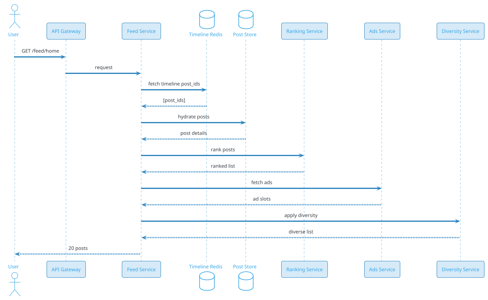

# Social Feed / Timeline

## Problem Statement

Design a social feed (timeline) like Facebook News Feed, Instagram Feed, or LinkedIn Feed. Users see a personalized, ranked stream of posts from friends, pages, and recommended accounts. The feed must be fresh (new posts appear within seconds), relevant (ranked by interest), and scalable (billions of users, billions of posts per day).

**Example:**
```
User Priya opens Instagram:

Flow:
  1. App loads feed (pull-to-refresh)
  2. Server returns 20 ranked posts
  3. Posts include: friends' photos, followed pages, recommended content
  4. User scrolls → next page loads (paginated)
  5. New posts appear at top when pulled
  6. Feed refreshes every N sec if user stays
  7. Each interaction (like, comment, share) updates feed

Feed composition (typical):
  - 60% friends/followed
  - 30% recommended (ML-based)
  - 10% ads/promoted
  - Mixed by ranking algorithm

Ranking signals:
  - Recency
  - Engagement prediction
  - Author affinity
  - Content type (image > text)
  - Diversity (avoid same author)
  - Freshness boost

Scale:
  - 2B users, 500M DAU
  - 1B posts/day
  - 100 feed loads per DAU per day
  - 50B feed loads/day (~578K/sec avg, 2.9M/sec peak)
  - 20 posts per feed load → 1T post placements/day
```

**Real-world systems:** Facebook News Feed, Instagram Feed, LinkedIn Feed, TikTok For You, Pinterest Home Feed.

**Why it's interesting:**

- **Ranking is the core value** — relevance beats chronology
- **Fan-out at scale** — billions of timeline writes
- **Real-time freshness** — new posts within seconds
- **Personalization** — ML models per user
- **Diversity** — avoid echo chambers, spam
- **Cold start** — new users, new posts
- **Ads integration** — monetization without ruining UX
- **Feedback loop** — engagements train the model
- **Privacy and regulation** — GDPR, algorithmic transparency

---

## 1. Requirements Clarification

### Functional Requirements
- **Feed**: Personalized ranked stream of posts
- **Pagination**: Infinite scroll, cursor-based
- **Freshness**: New posts appear within seconds
- **Ranking**: ML-driven relevance
- **Composition**: Friends + followed + recommended + ads
- **Interactions**: Like, comment, share, save, hide
- **Video/Image posts**: Rich media
- **Stories**: Ephemeral (24h) posts (optional)
- **Ads**: Promoted posts, mixed with organic
- **Feed refresh**: Pull-to-refresh, auto-refresh
- **Seen tracking**: Track which posts user has seen
- **Feedback**: Hide, report, "show less like this"
- **Multiple feeds**: Home, Following, Discover (tabs)

### Non-Functional Requirements
- **Scale**: 2B users, 500M DAU, 50B feed loads/day
- **Latency**: Feed load < 500 ms p99; new post visible < 5 sec
- **Availability**: 99.99%
- **Consistency**: Eventual (feed may lag by seconds)
- **Freshness**: New posts within 5-10 sec
- **Ranking quality**: High engagement rate
- **Diversity**: No more than 2 consecutive from same author
- **Compliance**: GDPR, DSA, algorithmic transparency
- **Cost**: ~$0.03/user/month (media, compute, ML)

### Out of Scope
- Full search (covered elsewhere)
- Messaging (covered elsewhere)
- Video transcoding (covered elsewhere)
- Ad auction system (mentioned briefly)

---

## 2. Back-of-Envelope Estimation

### Traffic

```
Given:
  Users               = 2,000,000,000
  DAU                 = 500,000,000
  Posts/day           = 1,000,000,000
  Feed loads/DAU/day  = 100
  Posts per load      = 20
  Peak multiplier     = 5x

Average QPS:
  Posts      = 1B / 86,400 = ~11,574/sec
  Feed loads = 50B / 86,400 = ~578,700/sec
  Post placements = 578,700 x 20 = ~11.6M/sec

Peak QPS (5x):
  Posts      = ~57,870/sec
  Feed loads = ~2.9M/sec

Fan-out calculation:
  Avg friends/followees = 500
  Fan-out per post      = 500 timeline writes
  Total writes/day      = 1B x 500 = 500B
  Peak write QPS        = ~29M/sec
```

### Storage

```
Posts:
  1B/day x 365 = 365B posts/year
  Per post: ~500 bytes (text + metadata)
  5 years: ~912 TB

Media:
  Assume 40% of posts have media
  400M media/day x 500 KB = 200 TB/day
  5 years: ~365 PB

Timeline cache (Redis):
  Active users x 800 posts x 100 bytes
  500M x 800 x 100 = ~40 TB

Feed engagement (ClickHouse):
  1T interactions/day x 100 bytes = 100 TB/day
  Sampled: ~10 TB/day retained

User profile:
  2B users x 2 KB = ~4 TB

Ranking model features:
  User features: 500M x 10 KB = ~5 TB
  Post features: 365B x 1 KB = ~365 TB
  In-memory serving: ~500 GB per region

Total hot: ~200 TB
Total cold: ~1 PB
Media: ~400 PB
```

### Bandwidth

```
Feed responses:
  578,700/sec x 50 KB (20 posts with media URLs) = ~29 GB/sec = ~232 Gbps

Media (via CDN):
  Peak: ~500 Gbps

Ads:
  ~20% of feed placements = ~2.3M/sec x 10 KB = ~23 GB/sec = ~184 Gbps

Total peak: ~1 Tbps
```

### Latency Budget

```
Feed load (p99):
  Client → API:              ~50 ms
  Auth:                       ~10 ms
  Redis timeline fetch:       ~5 ms
  Hydrate posts:              ~50 ms
  Ranking (ML):               ~200 ms
  Diversity filter:           ~20 ms
  Ads insertion:              ~50 ms
  Serialize + return:         ~50 ms
  Total:                      ~435 ms

Feed refresh (new post visible):
  Post created → Kafka:       ~10 ms
  Fan-out worker:             ~500 ms
  Timeline Redis update:      ~10 ms
  Next feed load:             user-driven
  Total:                      < 5 sec typical
```

---

## 3. High-Level Design

```d2
direction: down

user: User {shape: person}
cdn: CDN {shape: cloud}
lb: Edge LB {shape: hexagon}
api: API Gateway {shape: hexagon}

feed: Feed Service {shape: rectangle}
post: Post Service {shape: rectangle}
fanout: Fan-out Worker {shape: rectangle}
rank: Ranking Service {shape: rectangle}
feature: Feature Service {shape: rectangle}
ads: Ads Service {shape: rectangle}
diversity: Diversity Service {shape: rectangle}
engage: Engagement Service {shape: rectangle}

kafka: Kafka {shape: queue}

timeline: "Timeline Cache (Redis)" {shape: cylinder}
posts: "Post Store (Cassandra)" {shape: cylinder}
graph: "Social Graph (PostgreSQL)" {shape: cylinder}
features: "Feature Store (Redis + Cassandra)" {shape: cylinder}
es: "Elasticsearch (search)" {shape: cylinder}
s3: "S3 (media)" {shape: cylinder}
ch: "ClickHouse (analytics)" {shape: cylinder}
ml: "ML Models (serving)" {shape: rectangle}

user -> cdn
cdn -> lb
lb -> api

api -> feed
api -> post
api -> engage

post -> kafka
post -> posts
post -> graph

kafka -> fanout
kafka -> feature
kafka -> es

fanout -> timeline

feed -> timeline
feed -> posts
feed -> rank
feed -> ads
feed -> diversity

rank -> ml
rank -> features

feature -> features
feature -> ch

engage -> ch
engage -> timeline

ads -> ch
```

### Component Responsibilities

| Component | Role |
|---|---|
| CDN | Static assets, media thumbnails |
| Edge LB | Anycast routing |
| API Gateway | Auth, rate limiting, routing |
| Feed Service | Orchestrate feed generation |
| Post Service | Post CRUD |
| Fan-out Worker | Push posts to timelines |
| Ranking Service | Score and order posts |
| Feature Service | Compute user + post features |
| Ads Service | Insert ads into feed |
| Diversity Service | Enforce variety rules |
| Engagement Service | Track likes, comments, shares |
| Kafka | Event bus |
| Timeline Cache | Redis sorted sets per user |
| Post Store | Cassandra (write-heavy) |
| Social Graph | PostgreSQL (follows, friendships) |
| Feature Store | Online features for ranking |
| Elasticsearch | Search index |
| S3 | Media |
| ClickHouse | Analytics, engagement stats |
| ML Models | Ranking, recommendations |

### Why This Architecture

- **Redis timeline** for fast feed reads (sub-10ms)
- **Cassandra** for posts (write-heavy, time-series)
- **Kafka** for fan-out (decouples post creation)
- **Feature Store** for ML ranking features
- **ClickHouse** for engagement analytics (OLAP)
- **S3 + CDN** for media
- **Separate ranking service** allows model updates without redeploying feed

---

## 4. API Design

### Get Feed

```http
GET /v1/feed/home?limit=20&cursor=xyz&feed_type=ranked
```

**Response:**
```json
{
  "posts": [
    {
      "post_id": "post-123",
      "type": "post",
      "author": {
        "user_id": "user-456",
        "username": "alice",
        "display_name": "Alice",
        "avatar_url": "...",
        "verified": true,
        "relationship": "friend"
      },
      "content": {
        "text": "Beautiful sunset today!",
        "media": [
          {"type": "image", "url": "...", "width": 1080, "height": 720}
        ]
      },
      "created_at": "2026-09-19T10:00:00Z",
      "metrics": {
        "likes": 1247,
        "comments": 89,
        "shares": 42
      },
      "user_engagement": {
        "liked": false,
        "saved": false,
        "seen": false
      },
      "ranking_info": {
        "score": 0.87,
        "reason": "author_affinity"
      }
    },
    {
      "post_id": "ad-789",
      "type": "ad",
      "advertiser": "TechCorp",
      "content": {
        "text": "Try the new XYZ phone",
        "media": [{"type": "image", "url": "..."}]
      },
      "sponsored": true
    }
  ],
  "next_cursor": "cursor-abc",
  "refresh_after_seconds": 30,
  "feed_id": "feed-session-xyz"
}
```

### Feed Refresh

```http
GET /v1/feed/home?since=2026-09-19T10:00:00Z
```

Returns only posts newer than the given timestamp (delta refresh).

### Mark Seen

```http
POST /v1/feed/mark-seen
{
  "post_ids": ["post-123", "post-124"],
  "seen_at": "2026-09-19T10:00:05Z"
}
```

### Hide Post

```http
POST /v1/feed/hide
{
  "post_id": "post-123",
  "reason": "not_interested"
}
```

### Report Post

```http
POST /v1/feed/report
{
  "post_id": "post-123",
  "reason": "spam"
}
```

### Get Feed Analytics (for creators)

```http
GET /v1/feed/analytics?post_id=post-123
```

**Response:**
```json
{
  "post_id": "post-123",
  "impressions": 45000,
  "unique_viewers": 32000,
  "engagement_rate": 0.039,
  "avg_watch_time_seconds": 3.2,
  "traffic_sources": {
    "home_feed": 28000,
    "profile": 12000,
    "search": 5000
  }
}
```

### WebSocket (Real-Time Feed Updates)

```
CONNECT wss://ws.example.com/feed
AUTH: Bearer <user-token>

CLIENT → SERVER:
{"type": "subscribe", "feed": "home"}

SERVER → CLIENT:
{"type": "new_post", "post_id": "post-124", "author_id": "user-456", "created_at": "..."}
{"type": "engagement_update", "post_id": "post-123", "likes": 1248}
```

---

## 5. Database Design

### PostgreSQL Schema (Users, Graph)

```sql
-- Users
CREATE TABLE users (
    user_id BIGINT PRIMARY KEY,
    username VARCHAR(50) UNIQUE NOT NULL,
    display_name VARCHAR(100),
    avatar_url TEXT,
    verified BOOLEAN DEFAULT FALSE,
    follower_count INT DEFAULT 0,
    following_count INT DEFAULT 0,
    created_at TIMESTAMP DEFAULT NOW()
);

-- Social graph (follows / friendships)
CREATE TABLE follows (
    follower_id BIGINT NOT NULL,
    followee_id BIGINT NOT NULL,
    relationship_type VARCHAR(20) DEFAULT 'follow',
    created_at TIMESTAMP DEFAULT NOW(),
    PRIMARY KEY (follower_id, followee_id)
);
CREATE INDEX idx_follows_followee ON follows(followee_id);

-- Close friends (subset for priority feed)
CREATE TABLE close_friends (
    user_id BIGINT NOT NULL,
    friend_id BIGINT NOT NULL,
    created_at TIMESTAMP DEFAULT NOW(),
    PRIMARY KEY (user_id, friend_id)
);

-- Hidden posts (user chose to hide)
CREATE TABLE hidden_posts (
    user_id BIGINT NOT NULL,
    post_id BIGINT NOT NULL,
    reason VARCHAR(50),
    created_at TIMESTAMP DEFAULT NOW(),
    PRIMARY KEY (user_id, post_id)
);

-- User interests (for recommendations)
CREATE TABLE user_interests (
    user_id BIGINT PRIMARY KEY,
    interests JSONB,           -- topic affinities, brand affinities
    updated_at TIMESTAMP DEFAULT NOW()
);
```

### Cassandra Schema (Posts)

```sql
-- Posts (partition by author, time-bucketed)
CREATE TABLE posts (
    author_id BIGINT,
    bucket INT,                 -- week
    post_id TIMEUUID,
    text TEXT,
    media_ids LIST<BIGINT>,
    hashtags LIST<TEXT>,
    mentions LIST<TEXT>,
    language TEXT,
    is_edited BOOLEAN DEFAULT FALSE,
    is_deleted BOOLEAN DEFAULT FALSE,
    created_at TIMESTAMP,
    PRIMARY KEY ((author_id, bucket), post_id)
) WITH CLUSTERING ORDER BY (post_id DESC)
  AND compaction = {'class': 'TimeWindowCompactionStrategy', 'compaction_window_size': 7, 'compaction_window_unit': 'DAYS'};

-- Posts by ID (for direct lookups)
CREATE TABLE posts_by_id (
    bucket INT,
    post_id TIMEUUID,
    author_id BIGINT,
    text TEXT,
    media_ids LIST<BIGINT>,
    hashtags LIST<TEXT>,
    mentions LIST<TEXT>,
    language TEXT,
    is_deleted BOOLEAN DEFAULT FALSE,
    created_at TIMESTAMP,
    PRIMARY KEY ((bucket), post_id)
);

-- Post metrics (denormalized, fast reads)
CREATE TABLE post_metrics (
    post_id TIMEUUID,
    likes BIGINT DEFAULT 0,
    comments BIGINT DEFAULT 0,
    shares BIGINT DEFAULT 0,
    views BIGINT DEFAULT 0,
    updated_at TIMESTAMP,
    PRIMARY KEY ((post_id))
);
```

### Redis Data Structures

```
-- Home timeline (per user, sorted set)
Key: timeline:{user_id}:home
Type: Sorted Set (score = ranking_score)
Value: post_ids (top 800)
TTL: 7 days

-- Following timeline (chronological)
Key: timeline:{user_id}:following
Type: Sorted Set (score = created_at timestamp)
Value: post_ids (top 800)
TTL: 7 days

-- Featured / recommended
Key: timeline:{user_id}:discover
Type: List
Value: post_ids (20 ranked by ML)
TTL: 1 hour

-- Seen posts (per user, dedup)
Key: user:{user_id}:seen
Type: Bloom filter or Set
TTL: 30 days

-- Hidden posts (per user)
Key: user:{user_id}:hidden
Type: Set
TTL: 90 days

-- User features (for ranking)
Key: user_features:{user_id}
Type: Hash
Fields: interests, affinities, recent_topics
TTL: 1 hour

-- Post features (for ranking)
Key: post_features:{post_id}
Type: Hash
Fields: author_affinity, topics, engagement_pred
TTL: 15 min

-- Realtime engagement counts
Key: post:{post_id}:counts
Type: Hash
Fields: likes, comments, shares
TTL: 24 hours
```

### ClickHouse (Analytics, Feature Store)

```sql
-- Engagement events (for training, analytics)
CREATE TABLE engagement_events (
    user_id UInt64,
    post_id UInt64,
    event_type String,       -- impression, click, like, comment, share, hide, report
    feed_source String,       -- home, following, discover, profile, ad
    position Int32,          -- position in feed
    event_time DateTime,
    context Map(String, String)
) ENGINE = MergeTree()
PARTITION BY toYYYYMMDD(event_time)
ORDER BY (user_id, event_time)
TTL event_time + INTERVAL 180 DAY;

-- User-post interactions (for ranking features)
CREATE MATERIALIZED VIEW user_post_interactions AS
SELECT
    user_id,
    post_id,
    countIf(event_type = 'like') AS likes,
    countIf(event_type = 'comment') AS comments,
    countIf(event_type = 'share') AS shares,
    countIf(event_type = 'impression') AS impressions,
    max(event_time) AS last_interaction
FROM engagement_events
GROUP BY user_id, post_id;

-- Author affinity (user-author interaction history)
CREATE MATERIALIZED VIEW author_affinity AS
SELECT
    user_id,
    post_id,          -- join with posts to get author
    count() AS interactions,
    max(event_time) AS last_interaction
FROM engagement_events
WHERE event_type IN ('like', 'comment', 'share')
GROUP BY user_id, post_id;
```

### Elasticsearch (Search, Features)

```json
{
  "mappings": {
    "properties": {
      "post_id": {"type": "keyword"},
      "author_id": {"type": "keyword"},
      "text": {"type": "text", "analyzer": "standard"},
      "hashtags": {"type": "keyword"},
      "language": {"type": "keyword"},
      "media_count": {"type": "integer"},
      "engagement_score": {"type": "float"},
      "created_at": {"type": "date"},
      "is_deleted": {"type": "boolean"}
    }
  }
}
```

### S3 (Media)

```
s3://feed-media/{user_id}/{yyyy}/{mm}/{dd}/{media_id}/
  - original.jpg
  - large.jpg (1200px)
  - medium.jpg (600px)
  - thumb.jpg (200px)
```

---

## 6. Deep Dive: Feed Generation Pipeline

### The Feed Request Flow



### Step-by-Step

**1. Fetch timeline post_ids (Redis)**
```
ZREVRANGE timeline:{user_id}:home 0 200
```
Returns top 200 candidate post_ids (already ranked approximately).

**2. Hydrate posts (Cassandra)**
```
Multi-get from Cassandra for post details
```
Fetch author, content, media URLs.

**3. Fetch features (Redis / Feature Store)**
```
User features: affinities, interests, recent topics
Post features: author, topics, engagement prediction
```

**4. Rank posts (Ranking Service)**
- Apply ML model
- Compute final scores
- Sort by score

**5. Insert ads (Ads Service)**
- Determine ad slots (e.g., positions 3, 8, 15)
- Fetch relevant ads
- Blend

**6. Apply diversity (Diversity Service)**
- Max 2 consecutive from same author
- Max 30% from one topic
- Ensure variety of content types

**7. Mark seen (async)**
- Add post_ids to user's seen set

**8. Return response**
- Enriched posts
- Cursor for next page
- Refresh hint

### Candidate Generation

We can't rank all 1B posts. Instead:

**1. Timeline candidates (200)**
- Pre-computed, already filtered to user's network
- Stored in Redis sorted set

**2. Recommended candidates (200)**
- ML-based (collaborative filtering, embeddings)
- From "For You" pool

**3. Trending candidates (50)**
- Global trending posts
- Boosted for freshness

**4. Ads (10)**
- From ads service

**Total candidates: ~460** → rank → top 20.

### Ranking Model

**Input:**
- User features (interests, past behavior)
- Post features (content, author, engagement)
- Context (time, device, feed position)

**Output:** Score per post.

**Model:** Neural network (two-tower) or gradient boosted trees.

**Features:**
- User-post affinity (past interactions)
- Author affinity (frequency, recency)
- Content similarity (topics)
- Engagement prediction (CTR, likes)
- Freshness (age of post)
- Media presence
- Position bias (already accounted for)

### Latency

| Step | Time |
|---|---|
| Timeline fetch (Redis) | ~5 ms |
| Post hydration (Cassandra) | ~30 ms |
| Feature fetch | ~20 ms |
| ML inference | ~100 ms |
| Ads fetch | ~30 ms |
| Diversity | ~10 ms |
| Serialize | ~20 ms |
| **Total** | **~215 ms** |

Well under the 500 ms target.

---

## 7. Deep Dive: Ranking and ML

### Ranking Signals

| Signal | Weight | Source |
|---|---|---|
| Predicted engagement (CTR) | 30% | ML |
| Author affinity | 20% | History |
| Content relevance | 15% | Topics |
| Recency | 10% | Timestamp |
| Media presence | 5% | Post metadata |
| Author authority | 5% | Verified, follower count |
| Diversity | 5% | Applied post-ranking |
| Ads boost | 10% | Ad auction |

### Two-Tower Model

**User tower:**
- Embed user features (interests, behavior)
- Output: user embedding (128-dim)

**Item tower:**
- Embed post features (text, media, author)
- Output: post embedding (128-dim)

**Score:** Dot product of embeddings → affinity score.

**Advantages:**
- Fast inference (pre-compute item embeddings)
- Scales to billions of items
- Easy to update

### Feature Engineering

**User features:**
- Demographics
- Interests (topics)
- Recent engagement (last 24h)
- Long-term behavior (last 30d)
- Session context

**Post features:**
- Author ID
- Topics (hashtags, entities)
- Media type
- Length
- Language
- Historical engagement

**Context features:**
- Time of day
- Day of week
- Device
- Feed position (bias correction)

### Feature Store

**Online (Redis):** Sub-10ms lookup for ranking.
**Offline (ClickHouse):** For training, batch features.

**Sync:** Kafka pipeline from events → feature store.

### Training

- **Data:** Last 30 days of impressions + engagements
- **Labels:** Click, like, comment, share (binary)
- **Loss:** Binary cross-entropy
- **Retraining:** Daily (offline batch) + hourly (incremental)
- **Model store:** S3, versioned

### Serving

- **Model in memory:** Sub-100ms inference
- **Batch prediction:** For pre-ranking (10K posts → 200)
- **Real-time inference:** For final rank (200 → 20)

### Exploration vs Exploitation

- **Exploitation:** Show high-scoring posts (safe)
- **Exploration:** Show some uncertain posts (learn)
- **Epsilon-greedy:** 5% exploration
- **Contextual bandits:** Better trade-off

### Diversity

After ranking:
- **Author diversity:** No more than 2 consecutive from same author
- **Topic diversity:** No more than 30% from same topic
- **Content type diversity:** Mix images, videos, text
- **Verification diversity:** Not only verified accounts

**Algorithm:** Greedy re-ranking with diversity constraints.

### Position Bias Correction

Users click top posts more (regardless of relevance).
- **Training:** Weight positions
- **Modeling:** Include position as feature
- **Serving:** Still rank by predicted relevance (not position)

### A/B Testing

- **Control:** Old model
- **Experiment 1:** New features
- **Experiment 2:** New architecture
- **Measure:** CTR, likes, comments, session length, retention

---

## 8. Deep Dive: Fan-Out and Timeline Construction

### The Fan-Out Problem

1B posts/day × 500 avg friends = 500B timeline writes/day.

**Naive:** Write each post to each friend's timeline at post time.

**Problem:** Celebrity (100M followers) → 100M writes for one post.

### Hybrid Fan-Out

**Write-time fan-out (normal users):**
- Post created → enqueue to fan-out
- Fan-out worker writes to each follower's timeline
- Followers see post on next feed load

**Read-time fan-out (celebrities):**
- Post created → store in celebrity posts table
- Followers fetch celebrity posts on feed load
- Merge with their write-time timeline

### Threshold

- **Below 10K followers:** Write-time fan-out
- **Above 10K followers:** Read-time fan-out

**Tunable:** Higher threshold = more write load; lower = more read load.

### Fan-Out Worker

```
For each post:
  1. Fetch author's followers (paginated)
  2. If followers > 10K → mark as celebrity, skip
  3. Else:
     - For each follower:
       - ZADD timeline:{follower}:home score post_id
       - Cap to 800 entries (ZREMRANGEBYRANK)
  4. Log metrics
```

**Throughput:** ~10K writes/sec per worker. Peak = 500B writes/day = 5.8M/sec. Need ~600 workers.

### Celebrity Post Handling

**Storage:**
```
Key: celebrity_posts:{user_id}
Type: Sorted Set
Value: post_ids (last 100)
```

**Read:**
```
1. Fetch user's home timeline (Redis)
2. Fetch user's followed celebrities (Redis set)
3. For each celebrity:
   - ZREVRANGE celebrity_posts:{celeb} 0 20
4. Merge, dedup, sort by score
5. Continue with ranking
```

### Timeline Refresh

**Problem:** User keeps app open; new posts should appear.

**Solutions:**
- **Polling:** Client polls every 30 sec
- **WebSocket:** Server pushes new post notifications
- **Hybrid:** WebSocket push, client fetches on signal

**Recommendation:** WebSocket signal + delta fetch.

### Timeline Consistency

- **Eventual:** New posts appear within seconds
- **Ordering:** By ranking score (not timestamp)
- **Seen:** Tracked per user; may differ across devices briefly

### Small vs Large Timeline

- **Small network (< 500 friends):** Write-time fan-out works great
- **Large network (> 5000 friends):** Read-time fan-out better
- **Hybrid:** Threshold-based

### Cold Start (New User)

New user has no timeline:
- Fallback to "popular in your area" (regional trending)
- Show onboarding "follow 5 accounts" flow
- Once user follows, timeline builds up

### Timeline Size

- **Stored:** Last 800 posts (ZSET with ZREMRANGEBYRANK)
- **Displayed:** Top 20 per page
- **Fetched:** 200 candidates per feed load

---

## 9. Deep Dive: Ads Integration

### Ad Slots

Feed has natural ad slots:
- Position 1 (after first organic): optional
- Position 3
- Position 8
- Position 15
- Position 20

**Ratio:** ~1 ad per 10 organic posts (10%).

### Ad Selection

```
1. Determine slot positions
2. Fetch relevant ads (targeting)
3. Rank ads by bid × predicted CTR
4. Blend with organic
5. Insert at slots
```

### Ad Auction

- **Advertiser bids** CPM or CPC
- **Predicted CTR** by ML
- **Ad rank** = bid × predicted_ctr
- **Winning ad** displayed
- **Charged** on click (CPC) or impression (CPM)

### Ad Targeting

- **Demographics** (age, gender, location)
- **Interests** (inferred from behavior)
- **Lookalike** (similar to existing customers)
- **Retargeting** (visited site before)

**Privacy:** Consent-based (GDPR). User can opt out.

### Ad Quality

- **Relevance:** Targeted but not creepy
- **Freshness:** Not shown repeatedly
- **Diversity:** Mix of advertisers
- **User feedback:** Hide ad → fewer similar

### Ad Frequency Capping

- **Per user:** Max 5 ads per session
- **Per advertiser:** Max 1 per feed load
- **Per campaign:** Frequency cap per user (e.g., 3/day)

### Blending with Organic

Organic posts are ranked first. Then ads inserted at slots:

```
Ranked organic: [A, B, C, D, E, F, G, H, I, J, ...]
Ad slots:      positions 3, 8, 15
Final:         [A, B, C(ad), D, E, F, G, H(ad), I, J, K, L, M, N, O(ad), ...]
```

**Notice:** Ads don't replace organic; they're inserted.

### Ad Metrics

- **Impressions** (ad shown)
- **Clicks** (ad clicked)
- **CTR** (clicks/impressions)
- **Conversions** (purchase, signup)
- **ROAS** (return on ad spend)

### Advertiser Dashboard

- Campaign management
- Targeting options
- Budget, bid
- Performance metrics
- A/B testing

### Ad Load

- Too many ads → users leave
- Too few ads → less revenue
- **Target:** 10-15% ads, high relevance

---

## 10. Deep Dive: Multi-Region Feed

### The Challenge

- 2B users globally
- Latency to home region may be 200+ ms
- Cross-region data transfer cost
- Data residency (GDPR, DPDP)

### Architecture

**Home region per user:**
- Determined at signup (based on phone/email)
- Stored in user registry
- All personal data stays in home region

**Regional clusters:**
- US, EU, APAC, India
- Each has full stack (feed, timeline, features)
- Cross-region reads for global content

### Cross-Region Feed

**User in EU, friend in US:**
- Friend's post is stored in US
- EU user's timeline has reference (post_id)
- EU feed service fetches post from US (or replica)
- Media served via CDN

**Optimization:**
- **Replicate public posts** to all regions
- **Private posts** stay in home region (fetch on demand)
- **CDN** for media

### Data Residency

**GDPR:** EU user data must stay in EU.
**DPDP:** India user data must stay in India.
**CCPA:** California users have rights.

**Implementation:**
- Partition by user home region
- Replicate only public content cross-region
- Private messages stay in home region

### Latency Optimization

- **Anycast routing** to nearest region
- **Regional feeds** for local friends
- **CDN** for media
- **Edge caching** for trending

### Consistency

- **Eventual** across regions
- **Per-user** strong within home region
- **Cross-region** eventual (seconds lag)

### Cost

Cross-region data transfer: ~$0.02/GB. At 400 PB/month of media, that's significant. Optimize with:
- CDN edge caching
- Regional replicas
- Compression

### Multi-Region Failure

**Region down:**
- Users routed to backup region
- Degraded experience (higher latency)
- Priority: restore primary region

**Split-brain:**
- Home region always owns user's data
- Conflict: home region wins
- Audit for reconciliation

---

## 11. Deep Dive: Feed Quality and User Signals

### Explicit Signals

- **Like:** Strong positive
- **Comment:** Strong positive
- **Share:** Strongest positive
- **Save:** Strong positive
- **Hide:** Strong negative
- **Report:** Very strong negative
- **Mute:** Strong negative for author

### Implicit Signals

- **Dwell time:** Time spent viewing post
- **Scroll past quickly:** Weak negative
- **Tap to pause on video:** Positive
- **Reread:** Strong positive
- **Tap profile:** Interest in author
- **Tap media:** Interest in content

### Session Signals

- **Session length:** Longer = better feed
- **Return frequency:** Higher = better
- **Abandonment:** App closed quickly = bad feed
- **Engagement rate:** Higher = better

### Feed Quality Metrics

- **CTR** (click-through rate)
- **Engagement rate** (interactions/impressions)
- **Session length** (seconds)
- **Session frequency** (per day)
- **DAU/MAU** ratio
- **Retention** (D1, D7, D30)
- **NPS** (user satisfaction)

### Anti-Signals

- **Hide** — user explicitly doesn't want
- **Report** — possibly harmful
- **Mute** — author annoyance
- **Unfollow** — user churn signal

### Feedback Loop

- User engagement feeds back into ranking
- Positive signals → boost similar
- Negative signals → demote
- Continuous learning

### Bias and Fairness

- **Avoid filter bubbles:** Diverse perspectives
- **Avoid promotion of harmful content:** Moderation
- **Avoid over-personalization:** Serendipity
- **Regulatory:** EU DSA requires algorithmic transparency

### User Control

- **Chronological vs Algorithmic:** Toggle
- **Topics:** Follow/unfollow
- **Authors:** Mute/unfollow
- **Feed preferences:** What to see more/less of

### Algorithmic Transparency

Users can see:
- Why they're seeing a post ("because you follow X")
- What data is used
- How to change it

**EU DSA requires this** for platforms > 45M users.

---

## 12. Scaling Considerations

### Read Scaling

- **Redis** for timelines (sub-10ms, per-user)
- **Cassandra** for post hydration (linear scale)
- **Read replicas** for PostgreSQL
- **CDN** for media
- **Feature Store** (Redis) for ML features

### Write Scaling

- **Kafka** for fan-out (decoupled)
- **Fan-out workers** auto-scaled (600+ instances)
- **Cassandra** for posts (write-optimized)
- **ClickHouse** for events (high throughput)

### Sharding

**Redis timeline:** Shard by `user_id`.
**Cassandra posts:** Partition by `(author_id, bucket)`.
**PostgreSQL:** Shard by `user_id` (social graph).
**Kafka:** Partition by `author_id` (per-author ordering).
**Elasticsearch:** Shard by `post_id` hash.

### Caching Layers

```
L1: Client-side cache (recent feed in app)
L2: CDN (media, static)
L3: Edge cache (trending posts)
L4: Regional feed cache (Redis cluster)
L5: Origin (Cassandra, ES)
```

### Auto-Scaling

- **Feed Service:** Scale on request rate
- **Fan-out Workers:** Scale on Kafka lag
- **Ranking Service:** Scale on inference rate
- **Redis:** Scale on ops/sec

### Peak Handling

**Events:**
- Breaking news: 5-10x traffic
- Elections: 20x
- Sports finals: 10x
- Viral moments: 50x (short bursts)

**Mitigations:**
- Kafka buffers
- Auto-scale
- Rate limit per user
- Degrade: skip non-critical features

### Cost Optimization

| Component | Optimization |
|---|---|
| Media | CDN caching (90%+ hit) |
| Timeline | Redis TTL, LRU eviction |
| Fan-out | Skip inactive followers |
| Compute | Reserved + spot |
| Storage | Tiering to Glacier |
| ML | Batch inference where possible |
| Search | Sampling for analytics |

### Exabyte-Scale Media

- **S3 Intelligent-Tiering** (auto-move to cheaper tiers)
- **Dedup** (identical content across users)
- **Compression** (WebP, AVIF)
- **CDN** for 90%+ serving

---

## 13. Bottlenecks and Trade-offs

| Concern | Solution | Trade-off |
|---|---|---|
| Fan-out cost | Hybrid (write + read) | Complexity |
| Ranking latency | Pre-computed features | Feature staleness |
| Ads relevance | ML targeting | Privacy concerns |
| Feed freshness | WebSocket + async fan-out | Slight lag |
| Diversity | Post-ranking rules | Might demote relevant |
| Cold start | Popular fallback | Less personalized |
| Multi-region | Home region + replication | Cross-region latency |
| Moderation | ML + human | False positives |
| Cost | CDN, tiering, dedup | Complexity |

### Design Decisions Summary

| Decision | Choice | Rationale |
|---|---|---|
| Timeline cache | Redis (per-user sorted set) | Fast reads |
| Post store | Cassandra | Write-heavy |
| Social graph | PostgreSQL | Relational, ACID |
| Fan-out | Hybrid (write small, read celebrity) | Balance |
| Ranking | Two-tower ML model | Scalable |
| Feature store | Redis (online) + ClickHouse (offline) | Fast + rich |
| Ads | Separate service, blended | Modularity |
| Multi-region | Home region per user | Compliance, latency |
| Moderation | Multi-layer ML + human | Balance scale + accuracy |

---

## 14. Failure Scenarios

### Fan-out Workers Down

**Impact:** New posts delayed in timelines.

**Mitigation:**
- Kafka buffers (up to hours)
- Auto-scale workers
- Backlog replayed on recovery
- Fallback: direct fan-out on read

### Redis Timeline Down

**Impact:** Feed cache miss; falls back to Cassandra.

**Mitigation:**
- Redis Sentinel for HA
- Fallback to fan-out on read
- Slower but functional
- Alert ops

### Cassandra Node Down

**Impact:** Posts on that node temporarily unavailable.

**Mitigation:**
- Replication factor 3
- Quorum reads/writes
- Auto-recovery

### Kafka Down

**Impact:** Fan-out, search indexing, features stop.

**Mitigation:**
- Buffer in Post Service
- Retry on recovery
- Prioritize critical paths

### Ranking Service Down

**Impact:** Fall back to chronological.

**Mitigation:**
- Serve chronological feed
- Alert immediately
- Auto-restart

### Feature Store Down

**Impact:** Ranking degrades (uses stale or no features).

**Mitigation:**
- Cache last-known features in Redis
- Fallback to popularity ranking
- Alert ops

### Ads Service Down

**Impact:** No ads shown; organic-only feed.

**Mitigation:**
- Fill slots with organic
- Skip ad insertion
- Alert ops (revenue impact)

### CDN Down

**Impact:** Media slow or unavailable.

**Mitigation:**
- Multi-CDN strategy
- Serve placeholders
- Retry

### DDoS on Feed

**Impact:** Feed service overwhelmed.

**Mitigation:**
- CDN/edge filtering
- Rate limiting
- WAF
- Anycast absorbs volume

### Feed Staleness

**Impact:** Users see old posts; miss new ones.

**Mitigation:**
- WebSocket for real-time updates
- Client polls periodically
- Monitor freshness metric
- Alert if > threshold

### Data Breach

**Impact:** Personal data exposed.

**Mitigation:**
- Encryption at rest + transit
- Access controls + audit
- Anomaly detection
- Incident response

### Compliance Violation

**Impact:** Fines, regulatory action.

**Mitigation:**
- GDPR, DPDP, DSA compliance
- Data residency
- Algorithmic transparency
- Regular audits

---

## 15. Monitoring and Alerts

### Key Metrics

| Metric | Target | Alert Threshold |
|---|---|---|
| Feed load p99 | < 500 ms | > 1 sec |
| Feed freshness p99 | < 5 sec | > 30 sec |
| Fan-out lag | < 5 sec | > 30 sec |
| Ranking p99 | < 200 ms | > 500 ms |
| Ads load p99 | < 50 ms | > 200 ms |
| Redis timeline hit ratio | > 95% | < 85% |
| Cache hit ratio (post hydrate) | > 90% | < 80% |
| CDN media hit ratio | > 90% | < 80% |
| Feed CTR | baseline | drop > 10% |
| User session length | baseline | drop > 10% |
| Content moderation response | < 1 hour | > 4 hours |

### Dashboards

- **Traffic**: Feed loads/sec, posts/sec, engagement
- **Latency**: p50/p95/p99 per operation
- **Fan-out**: Queue depth, processing rate, celebrity lag
- **Ranking**: Model version, inference rate, CTR
- **Ads**: Fill rate, CTR, revenue
- **Freshness**: New post visibility lag
- **Moderation**: Reports, actions, human review queue
- **Infrastructure**: Redis, Cassandra, Kafka, ES health
- **Business**: DAU, sessions/user, feed CTR, retention

### Alerts

- **P0**: Feed service down, ranking down, data breach
- **P1**: Feed p99 > 1 sec, freshness > 30 sec, fan-out lag > 30 sec
- **P2**: Redis hit < 85%, ads down, moderation backlog
- **P3**: High hidden rate, high unfollow rate, sentiment drop

### Business KPIs

- **DAU/MAU** ratio
- **Sessions per DAU**
- **Session length**
- **Feed scroll depth**
- **Engagement rate**
- **Retention** (D1, D7, D30)
- **Feed quality** (CTR, session length)
- **Ads revenue per user**

---

## 16. Cost Estimation

Rough monthly cost (AWS, us-east-1) for 500M DAU:

| Component | Spec | Cost/month |
|---|---|---|
| Feed Service | 500 x c6g.large | ~$30,000 |
| Ranking Service | 200 x c6g.2xlarge | ~$48,000 |
| Fan-out Workers | 1500 x c6g.large | ~$90,000 |
| Feature Service | 100 x c6g.large | ~$6,000 |
| Ads Service | 100 x c6g.large | ~$6,000 |
| PostgreSQL | 40 shards x db.r6g.4xlarge | ~$190,000 |
| Read replicas | 80 x db.r6g.2xlarge | ~$168,000 |
| Cassandra | 500 x i3.2xlarge | ~$500,000 |
| Redis cluster | 200 x cache.r6g.2xlarge | ~$100,000 |
| Kafka (MSK) | 50 brokers | ~$25,000 |
| Elasticsearch | 100 x r6g.2xlarge | ~$180,000 |
| ClickHouse | 20 x i3.2xlarge | ~$20,000 |
| S3 (media hot) | 50 PB | ~$1,150,000 |
| S3 (media archive) | 300 PB | ~$1,200,000 |
| CDN | 200 PB/month egress | ~$4,000,000 |
| Monitoring | Datadog | ~$80,000 |
| **Total** | | **~$7.79M/month** |

**Per user:** ~$0.016/month.

**Cost optimization:**
- **Media dominates** (80%+) — CDN, tiering, compression
- **Reserved instances** — 30-40% savings
- **Spot for batch** — fan-out workers
- **Timeline TTL** — shorter cache = less Redis
- **CDN volume discount** — negotiate

---

## 17. Extensions and Follow-ups

### Stories

- Ephemeral (24h) content
- Separate service with TTL
- Story tray at top of feed
- View tracking

### Reels / Short Videos

- TikTok-style feed
- Swipe up to next
- Separate ranking model
- Higher engagement per view

### Live Video

- RTMP ingest → HLS out
- Real-time comments
- Replay as post
- Notifications to followers

### Communities

- Topic-based sub-feeds
- Moderators
- Separate ranking
- Privacy controls

### Shopping Feed

- Product posts
- Shoppable content
- Checkout integration
- Advertiser + merchant

### News Feed

- Verified news sources
- Fact-checking labels
- Chronological for breaking
- Ranked for evergreen

### Watch Feed

- Video-first feed
- Autoplay
- Infinite scroll
- Higher ad load

### Group Feed

- Facebook Groups
- Members-only
- Different ranking
- Admin controls

### Local Feed

- City/area-based
- Local businesses
- Community posts
- Hyper-local ads

### Professional Feed

- LinkedIn-style
- Career content
- Job recommendations
- Networking

### AI Assistant

- Feed summarization
- "What did I miss?"
- Personalized digest
- Conversational feed

### Algorithmic Transparency

- "Why am I seeing this?"
- "Adjust my feed"
- "Chronological option"
- Regulatory compliance

### Cross-Platform

- Mobile, web, TV, watch
- Same feed, different UI
- Context-aware ranking

### Creator Monetization

- Subscriptions
- Tips
- Ads revenue share
- Paid content

### Web3 / Decentralized

- Nostr, Bluesky protocols
- User-owned data
- Decentralized feeds
- Blockchain identity

---

## 18. Summary

| Aspect | Decision |
|---|---|
| Timeline cache | Redis (per-user sorted set) |
| Post store | Cassandra (partition by author) |
| Social graph | PostgreSQL (sharded) |
| Fan-out | Hybrid (write small, read celebrity) |
| Ranking | Two-tower ML model |
| Feature store | Redis (online) + ClickHouse (offline) |
| Ads | Separate service, blended into feed |
| Multi-region | Home region + global public posts |
| Moderation | Multi-layer ML + human |
| Scale | 500M DAU, 50B feed loads/day |
| Latency | Feed < 500 ms, freshness < 5 sec |
| Availability | 99.99% |
| Cost | ~$7.8M/month (media dominates) |

**Key takeaways:**

- **Ranking is the core** — two-tower ML model scales to billions
- **Hybrid fan-out** (write small, read celebrity) balances cost
- **Redis timeline** for sub-10ms reads
- **Cassandra for posts** — write-heavy, time-series
- **Feature store** (Redis online + ClickHouse offline) is critical for ML
- **Ads integrated** at fixed slots with ML ranking
- **Diversity is enforced** post-ranking (author, topic, type)
- **Position bias** corrected in training
- **Multi-region** with home region per user (compliance + latency)
- **Feedback loop** — engagements train the model continuously
- **Media dominates cost** — CDN + tiering essential
- **Moderation is multi-layer** — ML + human + user reports
- **Algorithmic transparency** is required by regulation (EU DSA)

### Similar Pattern Problems

- Content Sharing / Microblog (real-time posts, engagement)
- News Feed Ranking (ranking optimization)
- Video Streaming (media, recommendations)
- Recommendation Engine (ML ranking)
- Online Messaging App (real-time delivery)
- Notification System (event fan-out)
- Product Catalog (ranking, personalization)
- Job Search Platform (ML matching)