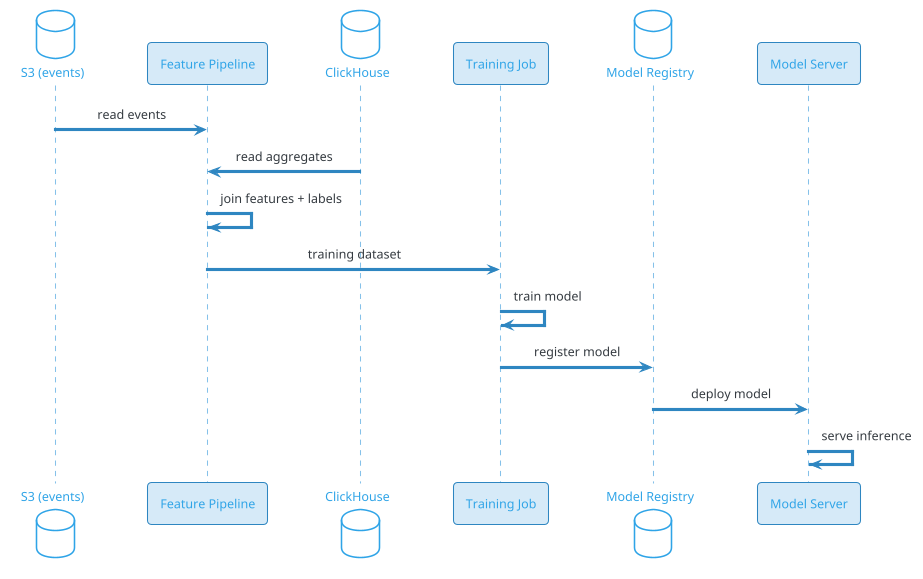

# News Feed Ranking

## Problem Statement

Design the **ranking system** that powers a personalized news feed (Facebook News Feed, Instagram Feed, LinkedIn Feed, YouTube Home, TikTok For You). Unlike the broader "Social Feed" problem (which covers storage and fan-out), this problem focuses purely on **how to rank posts** to maximize user engagement and long-term satisfaction.

**Example:**

```
User Priya opens the app. 500 candidate posts are available:

  - 200 from friends (already in her timeline)
  - 200 recommended (ML-based candidates)
  - 50 trending
  - 50 ads

Ranking system must:
  1. Score each candidate (ML model)
  2. Apply diversity constraints
  3. Correct for position bias
  4. Blend ads at fixed slots
  5. Return top 20

Goal:
  Maximize engagement (likes, comments, shares, dwell time)
  AND long-term satisfaction (retention, DAU)

Naive approach: rank by recency → misses relevance
Better: rank by predicted CTR → can create filter bubbles
Best: multi-objective ranking (relevance + diversity + long-term value)

Scale:
  - 2B users
  - 50B feed loads/day
  - 20 posts per load → 1T post placements/day
  - Sub-500ms p99 ranking latency
  - Multiple ML models (pre-rank + rank)
  - Continuous learning from engagement
```

**Real-world systems:** Facebook News Feed, Instagram Feed, LinkedIn Feed, YouTube Home, TikTok For You, Twitter Home, Pinterest Home Feed.

**Why it's interesting:**

- **ML at scale** — billions of predictions per second
- **Multi-objective optimization** — engagement + retention + satisfaction
- **Cold start** — new users, new content
- **Feedback loops** — engagements train the model continuously
- **Position bias** — correcting for what users see
- **Diversity** — avoiding filter bubbles
- **Latency vs quality** — pre-ranking vs ranking
- **Online learning** — models update continuously
- **A/B testing** — measuring ranking changes safely
- **Fairness** — avoiding bias in ranking

---

## 1. Requirements Clarification

### Functional Requirements
- **Rank candidates**: Score and order posts for a user's feed
- **Personalization**: Per-user ranking
- **Multi-objective**: Optimize for engagement + retention
- **Diversity**: Mix authors, topics, formats
- **Ads blending**: Integrate ads at fixed slots
- **Freshness**: New posts surfaced within seconds
- **Position bias correction**: Don't reward top positions
- **Real-time signals**: Trending, breaking news
- **Seen filtering**: Don't show already-seen posts
- **User controls**: Chronological option, mute, hide
- **Explainability**: "Why am I seeing this?"
- **Feedback loop**: Train on engagements

### Non-Functional Requirements
- **Scale**: 500M DAU, 1T placements/day, 2.9M peak QPS
- **Latency**: < 500 ms p99 for full ranking pipeline
- **Throughput**: 2.9M ranking calls/sec at peak
- **Model updates**: Daily retrain, hourly incremental
- **Availability**: 99.99%
- **Freshness**: New posts visible within 5 sec
- **Consistency**: Eventual
- **Fairness**: No demographic bias
- **Transparency**: Explain top signals (EU DSA)
- **A/B testing**: Multiple experiments in parallel

### Out of Scope
- Storage and fan-out (covered in Social Feed problem)
- Content moderation (covered separately)
- Ads auction mechanics (mentioned briefly)
- Search ranking (different problem)
- Video recommendation (similar but distinct)

---

## 2. Back-of-Envelope Estimation

### Traffic

```
Given:
  Users                = 2,000,000,000
  DAU                  = 500,000,000
  Feed loads/DAU/day   = 100
  Candidates/load      = 500 (avg)
  Posts displayed/load = 20
  Peak multiplier      = 5x

Ranking pipeline volume:
  Feed loads/day       = 50B
  Candidate scores/day = 50B x 500 = 25T
  Displayed posts/day  = 50B x 20 = 1T
  
Average QPS:
  Feed loads           = 50B / 86,400 = ~578K/sec
  Candidate scoring    = 25T / 86,400 = ~290M/sec

Peak QPS (5x):
  Feed loads           = ~2.9M/sec
  Candidate scoring    = ~1.4B/sec

ML inference:
  Pre-ranking model (lightweight): ~200 candidates per feed
  Ranking model (full): ~200 candidates per feed
  Total inferences/day: 50B x 400 = 20T
  Peak: ~1.16B/sec
```

### Storage

```
Training data (engagement events):
  1T placements/day x 100 bytes = 100 TB/day
  Retained 180 days: ~18 PB

Model artifacts:
  Multiple models (pre-rank + rank + diversity):
  Each ~1-10 GB
  Versioned: ~1 TB total

Feature store:
  Online (Redis): ~5 TB
  Offline (S3/Parquet): ~50 PB (historical)

Embeddings:
  User embeddings: 500M x 256 floats x 4 bytes = ~512 GB
  Item embeddings: 365B posts x 256 floats x 4 bytes = ~365 TB
  
Total: ~500 TB serving data, ~20 PB training data
```

### Bandwidth

```
Feature fetch (online):
  290M candidates/sec x 1 KB features = ~290 GB/sec = ~2.3 Tbps

This is INTERNAL traffic between ranking service and feature store.
Optimized heavily with:
  - Co-location
  - Batching
  - Caching
  - Quantization
```

### Latency Budget

```
Total feed load: < 500 ms p99

Breakdown:
  API gateway:                ~20 ms
  Auth:                        ~10 ms
  Candidate generation:       ~50 ms
  Pre-ranking (200 candidates): ~50 ms
  Feature fetch:              ~30 ms
  Ranking (top 200):          ~150 ms
  Diversity:                  ~20 ms
  Ads insertion:              ~30 ms
  Serialization:              ~40 ms
  Network:                    ~100 ms
  Total:                      ~500 ms

Ranking is the largest single cost. Pre-ranking reduces it.
```

---

## 3. High-Level Design

```d2
direction: down

user: User {shape: person}
api: API Gateway {shape: hexagon}

feed: Feed Service {shape: rectangle}
candidate: Candidate Generator {shape: rectangle}
prerank: Pre-Ranking Service {shape: rectangle}
rank: Ranking Service {shape: rectangle}
div: Diversity Service {shape: rectangle}
ads: Ads Service {shape: rectangle}
explain: Explainability Service {shape: rectangle}

feature: "Feature Store (online)" {shape: cylinder}
emb: "Embedding Store" {shape: cylinder}
model: "Model Server" {shape: rectangle}

kafka: Kafka {shape: queue}
ch: "ClickHouse (events)" {shape: cylinder}
s3: "S3 (training data)" {shape: cylinder}
train: "Training Pipeline" {shape: rectangle}
registry: "Model Registry" {shape: rectangle}

user -> api
api -> feed
feed -> candidate
feed -> prerank
feed -> rank
feed -> div
feed -> ads
feed -> explain

candidate -> emb
candidate -> feature
prerank -> feature
prerank -> model
rank -> feature
rank -> emb
rank -> model

feed -> user

user -> kafka : engagement events
kafka -> ch
kafka -> feature
kafka -> s3

s3 -> train
train -> registry
registry -> model
```

### Component Responsibilities

| Component | Role |
|---|---|
| Feed Service | Orchestrates the ranking pipeline |
| Candidate Generator | Produces ~500 candidate posts |
| Pre-Ranking Service | Fast lightweight scoring (500 → 200) |
| Ranking Service | Full ML model scoring (200 → 20) |
| Diversity Service | Apply author/topic/format diversity |
| Ads Service | Insert ads at fixed slots |
| Explainability Service | Provide "why this post" reasons |
| Feature Store | Online features (Redis) |
| Embedding Store | User + item embeddings |
| Model Server | Serve ML models (TF Serving, TorchServe) |
| Kafka | Event bus for engagements |
| ClickHouse | Analytics, feature aggregation |
| S3 | Training data lake |
| Training Pipeline | Daily retrain, hourly incremental |
| Model Registry | Version, deploy, rollback models |

### Why This Architecture

- **Two-stage ranking** (pre-rank + rank) — reduces latency by filtering cheaply first
- **Feature store** decouples feature computation from serving
- **Model server** allows model updates without service redeploy
- **Kafka + S3** pipeline trains models continuously
- **Explainability service** satisfies regulatory requirements
- **Diversity service** enforces product rules post-ranking

---

## 4. API Design

### Rank Feed (Internal)

```http
POST /v1/rank
Content-Type: application/json
X-Internal-Token: <token>

{
  "user_id": "u-123",
  "candidates": ["post-1", "post-2", "..."],
  "context": {
    "session_id": "sess-abc",
    "device": "mobile",
    "time": "2026-09-19T10:00:00Z",
    "location": "IN",
    "feed_type": "home"
  },
  "limit": 20,
  "options": {
    "include_ads": true,
    "explain": true
  }
}
```

**Response:**
```json
{
  "ranked_posts": [
    {
      "post_id": "post-123",
      "score": 0.87,
      "type": "organic",
      "reasons": [
        {"signal": "author_affinity", "weight": 0.35},
        {"signal": "predicted_ctr", "weight": 0.30}
      ]
    },
    {
      "post_id": "ad-456",
      "type": "ad",
      "score": 0.75
    }
  ],
  "model_version": "v42.3",
  "latency_ms": 180
}
```

### Explain (User-Facing)

```http
GET /v1/posts/post-123/why-am-i-seeing-this
```

**Response:**
```json
{
  "post_id": "post-123",
  "reasons": [
    {
      "type": "author_affinity",
      "description": "You interact with Alice frequently",
      "weight": 0.35
    },
    {
      "type": "topic_interest",
      "description": "You follow #tech content",
      "weight": 0.25
    },
    {
      "type": "engagement_prediction",
      "description": "People like you engage with similar posts",
      "weight": 0.20
    }
  ],
  "actions": [
    {"action": "show_less_like_this", "endpoint": "/v1/feed/preferences"},
    {"action": "mute_author", "endpoint": "/v1/users/{id}/mute"}
  ]
}
```

### Feedback

```http
POST /v1/feed/feedback
{
  "user_id": "u-123",
  "post_id": "post-123",
  "signal": "hide",
  "reason": "not_interested"
}
```

### A/B Test Assignment

```http
GET /v1/experiments/assign?user_id=u-123&experiment=ranking_v43
```

**Response:**
```json
{
  "experiment": "ranking_v43",
  "variant": "treatment",
  "model_version": "v43.1"
}
```

### Model Info (Internal)

```http
GET /v1/models/active
```

**Response:**
```json
{
  "models": [
    {
      "name": "pre_rank",
      "version": "v42.1",
      "loaded_at": "2026-09-19T08:00:00Z",
      "latency_p99_ms": 45
    },
    {
      "name": "rank",
      "version": "v42.3",
      "loaded_at": "2026-09-19T08:00:00Z",
      "latency_p99_ms": 120
    }
  ]
}
```

---

## 5. Candidate Generation

### Why Candidates First?

Ranking all 365B posts is infeasible. Instead, generate ~500 candidates from multiple sources, then rank.

### Candidate Sources

| Source | Count | Rationale |
|---|---|---|
| Timeline (follows) | 200 | Already in user's network |
| Recommended (ML) | 200 | Collaborative filtering, embeddings |
| Trending | 50 | Fresh, popular globally |
| Recent from friends | 30 | Fresh, high-affinity |
| Evergreen (saved) | 20 | User's saved/liked |
| Total | 500 | |

### Timeline Candidates

Already computed by fan-out (see Social Feed problem).

```
ZREVRANGE timeline:{user_id}:home 0 200
```

### Recommended Candidates (Two-Tower Model)

```
1. Fetch user embedding from Embedding Store
2. ANN search over item embeddings (using FAISS, ScaNN)
3. Return top 200 candidates not already in timeline
4. Filter by seen, blocked, hidden
```

**Embedding model:**
- User tower: features → 256-dim embedding
- Item tower: post features → 256-dim embedding
- Similarity: dot product

### Trending Candidates

```
1. Trending Service maintains global trending posts
2. Fetch top 50 for user's region/language
3. Filter by seen
```

### Filtering

```
- Seen: remove posts user has already seen (Bloom filter)
- Blocked: remove posts from blocked authors
- Muted: remove from muted authors
- Hidden: remove posts user hid
- Deleted: remove deleted posts
- Expired: remove posts older than N days (for non-evergreen)
- Reported: remove if user reported similar content
```

### Candidate Diversity

Before ranking, ensure candidates are diverse:
- Different authors
- Different topics
- Different formats (image, video, text)

**Why:** If candidates are all from one author, ranking can't fix it.

---

## 6. Deep Dive: Pre-Ranking (Fast Filter)

### Purpose

Reduce 500 candidates to 200 before full ranking. Fast, lightweight model.

**Latency budget:** ~50 ms for 500 candidates → 200 selected.

### Model

**Lightweight ML model:**
- Logistic regression or small neural network
- ~20 features (vs 100+ for full model)
- Inference: ~0.1 ms per candidate

**Features:**
- Author affinity (rough)
- Topic match
- Recency
- Media presence
- Predicted CTR (rough)

### Why Pre-Rank?

- Full ranking model is expensive (~1 ms per candidate)
- 500 candidates × 1 ms = 500 ms just for ranking → too slow
- Pre-rank uses 0.1 ms × 500 = 50 ms → fits budget
- Full rank on 200 × 1 ms = 200 ms → fits budget

### Model Architecture

```
Input: 20 features per candidate
Hidden: 2 layers, 64 units each
Output: score [0, 1]
Params: ~5K
Latency: ~0.1 ms per candidate
```

### Trained On

Same engagement events as full model, but with reduced feature set.

**Trade-off:** Slightly less accurate than full model, but 10x faster.

### Batching

Process candidates in batches of 64 for GPU efficiency:
- 500 candidates → 8 batches of 64
- GPU inference: ~10 ms total
- Much faster than CPU per-candidate

---

## 7. Deep Dive: Ranking Model (Full)

### Purpose

Score top 200 candidates with high accuracy. Return ranked list.

**Latency budget:** ~150 ms for 200 candidates.

### Model Architecture

**Two-tower or DLRM (Deep Learning Recommendation Model):**

```
User tower:
  Input: 50 user features
  Layers: [256, 128]
  Output: 128-dim user embedding

Item tower:
  Input: 100 item features
  Layers: [256, 128]
  Output: 128-dim item embedding

Context tower:
  Input: 20 context features
  Layers: [64]
  Output: 64-dim context embedding

Fusion:
  Concatenate [user, item, context] embeddings
  Layers: [256, 128, 64, 1]
  Output: score [0, 1]
```

**Parameters:** ~10M

**Latency:** ~0.7 ms per candidate (on GPU)

### Features

**User features (50):**
- Demographics: age, gender, location
- Interests: top topics (10)
- Past behavior: 7-day, 30-day engagement rates
- Session: current session length, time in feed
- Device: mobile/desktop
- Social: friend count, follow count

**Item features (100):**
- Post: length, media type, hashtags
- Author: follower count, verified, past engagement
- Topics: categories (multi-hot)
- Language
- Age (seconds since post)
- Global engagement (likes, comments, shares)
- Embedding (256-dim from item tower)

**Context features (20):**
- Time of day
- Day of week
- Feed position (bias)
- Device type
- Network quality
- Location

### Multi-Task Learning

Instead of predicting a single engagement, predict multiple:

```
Outputs:
  - P(click)         → weight 0.2
  - P(like)          → weight 0.3
  - P(comment)       → weight 0.15
  - P(share)         → weight 0.15
  - P(dwell > 5s)    → weight 0.1
  - P(hide/report)   → weight -0.5 (negative)
```

**Final score:** Weighted sum.

**Why multi-task?** A post with high click but high hide rate is bad. Multi-task captures this.

### Training

**Data:** Last 30 days of impressions + engagements.

**Labels:** Binary for each task.

**Loss:** Weighted binary cross-entropy per task.

**Optimizer:** Adam, learning rate 1e-3.

**Batch size:** 8192.

**Hardware:** GPU cluster (A100 or similar).

**Training time:** ~4 hours for full retrain.

**Frequency:** Daily full retrain + hourly incremental.

### Serving

**Model Server:** TF Serving, TorchServe, or custom (Triton).

**Batching:** Batch requests from multiple users (50-100 per batch).

**Latency:** ~100-150 ms for 200 candidates.

**Caching:** Cache user embedding (updated hourly).

---

## 8. Deep Dive: Position Bias

### The Problem

Users click top items more, regardless of relevance. Model trained on this data learns "top position = click", not "relevant = click".

**Without correction:**
- Model boosts items that happened to be shown at top
- Creates feedback loop
- Hurts long-term quality

### Correction Techniques

**1. Position as feature:**
- Include position as an input feature
- At serving, set position=1 for all candidates
- Model learns position-independent score

**2. Inverse propensity weighting (IPW):**
- Weight training examples by 1/Propensity(position)
- Position 1 has high propensity → down-weighted
- Position 10 has low propensity → up-weighted

**3. Shallow tower:**
- Separate "position tower" predicts click from position alone
- Main tower predicts click from features
- Final = position_tower × main_tower
- At serving, remove position tower

**Recommendation:** Position as feature + IPW.

### Position Bias in Training Data

```
Impression: (user, post, position=1, clicked=yes)
  Without correction: strong positive signal for this post

Impression: (user, post2, position=10, clicked=no)
  Without correction: weak signal (maybe not relevant, maybe just low position)
```

**With IPW:**
```
post1 weight: 1/P(position=1) = 1/0.5 = 2
post2 weight: 1/P(position=10) = 1/0.05 = 20
```

post2's signal is amplified — the model learns that it just wasn't seen.

### Testing Position Bias Correction

- **Offline:** Replay logs with and without correction
- **Online:** A/B test — measure engagement
- **Long-term:** Track DAU, retention

### Other Biases

- **Selection bias:** Training only on shown items
- **Popularity bias:** Popular items get more engagement
- **Feedback loop:** Model recommends, users engage, model learns to recommend more

**Mitigation:** Exploration (show uncertain items), diversity, calibration.

---

## 9. Deep Dive: Diversity and Multi-Objective

### Why Diversity?

**Problem:** Pure relevance ranking creates:
- Filter bubbles (same topics)
- Monotony (same author)
- Over-optimization for CTR (clickbait)
- Long-term dissatisfaction

**Solution:** Post-ranking diversity constraints.

### Diversity Constraints

| Constraint | Rule | Rationale |
|---|---|---|
| Author | Max 2 consecutive from same author | Variety |
| Topic | Max 30% from same topic | Avoid filter bubble |
| Format | Mix images, videos, text | Variety |
| Source | Mix follows, recommended, ads | Discover |
| Verified | Not only verified | Fairness |
| Freshness | At least 30% from last 24h | Timeliness |
| Language | Match user's language | Relevance |

### Diversity Algorithm

After ranking (200 → 20):

```
1. Start with ranked list
2. Greedy selection:
   - Pick top post
   - For each subsequent position:
     - Skip if violates diversity constraint
     - Pick next acceptable post
3. Ensure top 20 has minimum diversity
```

**Trade-off:** May demote highly relevant posts.

**Optimization:** Use MMR (Maximal Marginal Relevance) or DPP (Determinantal Point Process) for probabilistic diversity.

### Multi-Objective Optimization

**Objectives:**
1. **Engagement:** Clicks, likes, comments, shares (short-term)
2. **Retention:** DAU/MAU, session length (long-term)
3. **Satisfaction:** Dwell time, no hides/reports (quality)
4. **Diversity:** Variety (long-term)
5. **Freshness:** Timeliness (relevance)

**Combine:**

```
final_score = w1 * engagement_score
            + w2 * retention_prediction
            + w3 * satisfaction_score
            + w4 * diversity_score
            + w5 * freshness_score
```

**Weights** tuned via A/B testing and long-term holdouts.

### Long-Term Value

**Problem:** Optimizing for CTR can hurt long-term.

**Solutions:**
- **Long-term holdout:** 1% of users see no new model; compare retention
- **Reward shaping:** Include retention signal in reward
- **Counterfactual:** Simulate long-term effects

### Fairness

**Sources of bias:**
- Training data reflects historical bias
- Model amplifies popular content
- Under-represented creators get less reach

**Mitigation:**
- **Demographic parity:** Ensure similar reach across groups
- **Equal opportunity:** Same CTR prediction accuracy across groups
- **Calibration:** Predictions match reality per group

**Regular audits** and **bias metrics** in dashboard.

---

## 10. Deep Dive: Ads Integration

### Ad Slots

Fixed positions in feed:
- Position 3 (after 2 organic)
- Position 8
- Position 15
- Position 20

**Ratio:** ~1 ad per 10 organic.

### Ad Ranking

Ads have their own ranking:
```
ad_score = bid × predicted_ctr × quality_score
```

**Bid:** What advertiser pays per click.
**Predicted CTR:** ML model for this ad + user.
**Quality score:** Ad quality, relevance to user.

### Blending with Organic

```
1. Rank organic posts (top 100)
2. Rank ads separately (top 10)
3. Insert ads at fixed slots:
   - Slot 3: top ad
   - Slot 8: 2nd ad
   - ...
4. Fill remaining slots with organic
```

**Why separate ranking?** Ads optimize for revenue, organic for engagement.

### Ad Diversity

- Max 1 ad per advertiser per feed
- Mix of ad types (image, video, carousel)
- Geographic diversity
- Category diversity

### Ad Frequency Capping

- Max 5 ads per session
- Max 3 ads per advertiser per day
- Max 20 ads per user per day

### Ad Quality Signals

- **Feedback:** User hides ad → demote
- **Relevance:** Match user interests
- **Freshness:** Don't repeat same ad
- **Landing page quality:** Slow/bad pages demoted

### Ad Load

**Optimal:** 10-15% of feed.
- Too few → low revenue
- Too many → user churn

**A/B tested** continuously.

---

## 11. Deep Dive: Training Pipeline

### Data Collection

**Every impression:**
```json
{
  "event_id": "evt-abc",
  "user_id": "u-123",
  "post_id": "post-123",
  "position": 3,
  "feed_source": "home",
  "model_version": "v42.3",
  "features_snapshot": {...},
  "timestamp": "2026-09-19T10:00:00Z"
}
```

**Every engagement:**
```json
{
  "event_id": "evt-def",
  "user_id": "u-123",
  "post_id": "post-123",
  "event_type": "like",
  "timestamp": "2026-09-19T10:00:05Z"
}
```

**Streamed to Kafka → ClickHouse + S3.**

### Feature Store

**Online (Redis):**
- Latest user features (updated hourly)
- Latest post features (updated every 15 min)
- User-item interaction history

**Offline (S3/Parquet):**
- Historical features for training
- Time-series of features

**Sync:** Feature pipeline (Kafka → Feature Store).

### Training



### Training Details

- **Data:** Last 30 days of events (sampled)
- **Labels:** Binary (click, like, comment, share, hide)
- **Loss:** Weighted binary cross-entropy per task
- **Batch size:** 8192
- **Optimizer:** Adam
- **Hardware:** 8x A100 GPUs
- **Duration:** ~4 hours
- **Frequency:** Daily full + hourly incremental

### Evaluation

**Offline metrics:**
- AUC, log loss per task
- NDCG (ranking quality)
- Calibration

**Online metrics:**
- CTR, engagement rate
- Session length
- DAU, retention

**A/B testing:**
- 5% control, 5% treatment
- 2 weeks minimum
- Ship if +2% engagement, no retention drop

### Deployment

**Model Registry:**
- Versioned models
- Metadata (metrics, training date)
- Rollback support

**Deployment:**
- Canary (5% traffic)
- Gradual rollout (5 → 25 → 50 → 100%)
- Rollback on metrics degradation

**Serving:**
- Model Server (TF Serving, Triton)
- Loads multiple models
- A/B routing

---

## 12. Deep Dive: Online Learning and Continuous Improvement

### Why Online Learning?

- User behavior changes fast
- New content, new creators
- Seasonal patterns
- Breaking news

**Daily retrain** is too slow for fast-changing preferences.

### Approaches

**1. Incremental training:**
- Update model every hour with last hour's data
- Smaller learning rate
- Faster convergence

**2. Online learning (SGD per example):**
- Update after each example
- Very fast adaptation
- Risk: unstable

**3. Multi-armed bandits:**
- Exploration vs exploitation
- Learn per-user preferences
- Contextual (LinUCB, Thompson sampling)

**Recommendation:** Daily full + hourly incremental + bandits for cold start.

### Exploration

**Problem:** Pure exploitation locks into known preferences.

**Solution:** Allocate ~5% of feed to exploration:
- Random posts from outside comfort zone
- New creators
- Diverse topics

**Measure:** Does exploration improve long-term retention?

### New Content Boost

New posts get a **freshness boost** to get initial impressions:
```
freshness_boost = exp(-age_hours / 6)
```

**Why:** Give new content a chance.

**Trade-off:** May show low-quality new content.

### New Creator Boost

New creators get a **discovery boost**:
- Higher weight in ranking
- Guaranteed impressions
- Fade after N impressions

**Why:** Fairness, prevent monopoly of popular creators.

### Cold Start Users

New user with no history:
- **Demographics-based:** Show popular content in their age/location
- **Onboarding:** Ask for interests
- **Explore quickly:** First few sessions gather data
- **Fallback:** Trending + popular

### Cold Start Items

New post with no engagement:
- **Content-based:** Match to user interests via text/media
- **Author-based:** If user follows author, boost
- **Explore:** Small % of traffic to gather data

### Bandits for Recommendations

**Contextual bandit:**
- State: user context, post features
- Action: show post
- Reward: engagement
- Learn policy that maximizes reward

**Algorithms:**
- LinUCB
- Thompson Sampling
- Neural bandits

**Trade-off:** Exploration cost vs long-term gain.

---

## 13. Scaling Considerations

### Compute Scaling

**Ranking Service:**
- 500M DAU × 100 loads = 50B requests/day
- Peak 2.9M req/sec
- Each request scores 200 candidates
- 580M scores/sec peak

**Hardware:**
- GPU inference (10x faster than CPU)
- ~50-100 GPU servers for ML
- CPU for pre-rank (~200 servers)

**Optimization:**
- Batch requests (50-100 users per batch)
- Quantization (INT8)
- Model pruning
- Distillation (smaller student model)

### Feature Store Scaling

- **Online (Redis):** ~5 TB, sharded by user_id
- **Offline (S3):** ~50 PB, queried by training jobs
- **Feature freshness:** 15 min for post features, 1 hour for user features

### Training Scaling

- **Data:** 100 TB/day, sampled to ~10 TB for training
- **GPU cluster:** 8-32 GPUs per training job
- **Parallel training:** Data-parallel + model-parallel

### Model Serving Scaling

- **Model Server:** ~100 servers
- **Batching:** Automatic (TF Serving)
- **Versioned:** A/B routing
- **Rollback:** Instant

### Multi-Region

```d2
direction: down

us: "US Region" {
  shape: cloud
}
eu: "EU Region" {
  shape: cloud
}
apac: "APAC Region" {
  shape: cloud
}

usm: "US Models" {
  shape: cylinder
}
eum: "EU Models" {
  shape: cylinder
}
apacm: "APAC Models" {
  shape: cylinder
}

usfs: "US Feature Store" {
  shape: cylinder
}
eufs: "EU Feature Store" {
  shape: cylinder
}
apacfs: "APAC Feature Store" {
  shape: cylinder
}

us -> usm
us -> usfs
eu -> eum
eu -> eufs
apac -> apacm
apac -> apacfs
```

**Per-region models:** Trained on regional data, deployed regionally.
**Global training:** Some features aggregated globally.
**Latency:** < 50 ms per region.

### Peak Handling

- **Auto-scale** ranking service (K8s HPA)
- **Batch** requests
- **Cache** user embeddings
- **Prioritize** critical models

### Cost Optimization

| Component | Optimization |
|---|---|
| GPU inference | Quantization, batching |
| Feature store | Caching, compression |
| Training | Spot instances, mixed precision |
| Model storage | Compression, pruning |
| Network | Co-location, batching |

---

## 14. Bottlenecks and Trade-offs

| Concern | Solution | Trade-off |
|---|---|---|
| Latency | Two-stage ranking | Slight accuracy loss |
| Training data volume | Sampling | Less signal |
| Position bias | Position as feature + IPW | Complex training |
| Diversity | Post-ranking constraints | May demote relevant |
| Exploration | 5% traffic | Short-term CTR loss |
| Model complexity | Multi-task | Training complexity |
| Cold start | Fallbacks + exploration | Worse UX initially |
| Feedback loops | Long-term holdouts | Slow iteration |
| Fairness | Bias audits | May reduce engagement |
| Ad integration | Separate ranking | Complexity |

### Design Decisions Summary

| Decision | Choice | Rationale |
|---|---|---|
| Ranking pipeline | Two-stage (pre-rank + rank) | Latency vs quality |
| Pre-rank | Lightweight model | Fast filter |
| Full rank | Two-tower or DLRM | Scale + accuracy |
| Multi-task | 5-6 objectives | Balance |
| Position bias | Feature + IPW | Correction |
| Diversity | Post-ranking constraints | User experience |
| Ads | Separate ranking | Revenue optimization |
| Training | Daily + hourly incremental | Freshness |
| Exploration | 5% bandits | Long-term learning |
| Model serving | GPU, batched | Performance |

---

## 15. Failure Scenarios

### Ranking Service Down

**Impact:** Fall back to chronological or popularity.

**Mitigation:**
- Serve fallback ranking
- Alert ops
- Auto-restart
- Cache last-known rankings

### Model Server Down

**Impact:** No ML ranking; degrade.

**Mitigation:**
- Serve with fallback (popularity + recency)
- Use cached scores
- Auto-restart

### Feature Store Down

**Impact:** Ranking with stale or missing features.

**Mitigation:**
- Serve with cached features
- Fallback to simpler model
- Alert ops

### Training Pipeline Failure

**Impact:** Model becomes stale.

**Mitigation:**
- Use last-good model
- Alert ML team
- Retry pipeline
- Manual intervention

### Model Degradation

**Impact:** User engagement drops.

**Mitigation:**
- Continuous monitoring of CTR
- Auto-rollback on > 5% drop
- A/B testing for changes

### Bias Detection

**Impact:** Discrimination in ranking.

**Mitigation:**
- Regular fairness audits
- Bias metrics in dashboard
- Corrective action if detected

### Ad Frequency Violation

**Impact:** User annoyance, churn.

**Mitigation:**
- Strict frequency caps
- Feedback loop (hide ad → reduce)
- Regular audits

### Cold Start Failure

**Impact:** New users see bad feed.

**Mitigation:**
- Onboarding interest selection
- Fallback to trending
- Fast exploration

### Latency Spike

**Impact:** Feed slow; user frustration.

**Mitigation:**
- Timeout at 500 ms
- Return partial results
- Serve cached feed
- Alert

### Model Inversion Attack

**Impact:** Model reverse-engineered.

**Mitigation:**
- Rate limit API
- Don't expose internal scores
- Differential privacy in training

---

## 16. Monitoring and Alerts

### Key Metrics

| Metric | Target | Alert Threshold |
|---|---|---|
| Ranking p99 | < 200 ms | > 500 ms |
| Feed load p99 | < 500 ms | > 1 sec |
| Model inference p99 | < 150 ms | > 300 ms |
| Feature store p99 | < 30 ms | > 100 ms |
| Pre-rank p99 | < 50 ms | > 100 ms |
| CTR | baseline | drop > 10% |
| Session length | baseline | drop > 10% |
| DAU | baseline | drop > 5% |
| Retention (D7) | baseline | drop > 2% |
| Diversity score | target range | outside range |
| Bias metrics | within tolerance | outside |
| Ad CTR | baseline | drop > 15% |

### Dashboards

- **Traffic**: Ranking requests/sec, candidates/sec
- **Latency**: p50/p95/p99 per stage
- **Model**: Version, inference rate, error rate
- **Engagement**: CTR, likes, comments, shares
- **Retention**: DAU, session length, D1/D7
- **Diversity**: Author, topic, format distribution
- **Bias**: Demographic parity, equal opportunity
- **Ads**: Fill rate, CTR, revenue
- **Infrastructure**: GPU, CPU, Redis, Kafka health

### Alerts

- **P0**: Ranking down, model serving down, bias detected
- **P1**: Latency > 500 ms, CTR drop > 10%
- **P2**: Model degradation, diversity violation
- **P3**: Training failure, ad performance drop

### Business KPIs

- **DAU/MAU** ratio
- **Session length** (per user)
- **Posts per session**
- **Engagement rate**
- **CTR**
- **Retention** (D1, D7, D30)
- **Creator diversity** (# creators with impressions)
- **Ad revenue per user**

---

## 17. Cost Estimation

Rough monthly cost (AWS, us-east-1) for 500M DAU:

| Component | Spec | Cost/month |
|---|---|---|
| Ranking Service (CPU) | 200 x c6g.2xlarge | ~$48,000 |
| Ranking Service (GPU) | 100 x g4dn.xlarge | ~$50,000 |
| Pre-Ranking Service | 200 x c6g.large | ~$12,000 |
| Feature Store (Redis) | 100 x cache.r6g.2xlarge | ~$50,000 |
| Feature Compute | 100 x c6g.large | ~$6,000 |
| Model Server | 100 x c6g.2xlarge | ~$24,000 |
| Training Cluster (GPU) | 32 x p3.2xlarge | ~$60,000 |
| ClickHouse | 30 x i3.2xlarge | ~$30,000 |
| Kafka (MSK) | 30 brokers | ~$15,000 |
| S3 (training data) | 20 PB | ~$460,000 |
| S3 (model store) | 10 TB | ~$250 |
| Experimentation | 20 x c6g.large | ~$3,000 |
| Monitoring | Datadog | ~$50,000 |
| **Total** | | **~$808,250/month** |

**Per user:** ~$0.0016/month.

**Cost optimization:**
- **Training data storage** is largest (57% of cost)
- **Sampling**: Store 1 in 10 events (90% savings, minimal accuracy loss)
- **Compression**: Parquet with compression
- **Retention**: 180 days default, less for some features
- **GPU inference**: Quantization (INT8)
- **Spot instances** for training (70% savings)
- **Feature store**: Sharding, compression

**Note:** ML training data storage is often the surprise cost at scale.

---

## 18. Extensions and Follow-ups

### Real-Time Ranking

- Stream-based feature updates
- Streaming ML (Kafka + Flink)
- Sub-second adaptation

### Causal Inference

- Counterfactual reasoning
- Uplift modeling
- Better causal attribution

### Reinforcement Learning

- Long-term reward optimization
- Policy gradient
- Exploration with safety constraints

### Federated Learning

- On-device model personalization
- Privacy-preserving
- Reduced server load

### Contextual Bandits

- Per-user exploration policy
- Thompson Sampling, LinUCB
- Better cold start

### Multi-Armed Bandit for Ads

- Ad selection as bandit problem
- Maximize revenue + engagement

### Neural Ranking

- Transformer-based rankers (BERT for text)
- Attention over user history
- Sequential recommendations

### Graph Neural Networks

- User-post-author graph
- Message passing
- Better embeddings

### Explainability

- SHAP values for feature importance
- Counterfactual explanations
- User-facing "why this post"

### Fairness

- Demographic parity
- Equal opportunity
- Calibration per group

### Privacy

- Differential privacy in training
- Federated learning
- On-device inference

### LLM-Powered Ranking

- LLM as reranker
- Natural language query
- Personalized summarization

### Multi-Modal Ranking

- Text + image + video embeddings
- Cross-modal attention

### Real-Time Personalization

- Session-based adaptation
- Immediate feedback loops
- Contextual bandits

### Long-Term Value

- Reward shaping
- Retention optimization
- Counterfactual long-term

### Regulatory Compliance

- EU DSA: transparency, audit
- GDPR: right to explanation
- Algorithmic impact assessments

---

## 19. Summary

| Aspect | Decision |
|---|---|
| Pipeline | Two-stage (pre-rank + full rank) |
| Pre-rank | Lightweight model, 500 → 200 |
| Full rank | Two-tower / DLRM, 200 → 20 |
| Multi-task | Click, like, comment, share, dwell |
| Position bias | Position as feature + IPW |
| Diversity | Post-ranking constraints |
| Ads | Separate ranking, blended at slots |
| Training | Daily full + hourly incremental |
| Exploration | 5% bandits |
| Model serving | GPU, batched, quantized |
| Scale | 500M DAU, 2.9M peak QPS |
| Latency | Rank < 200 ms, feed < 500 ms |
| Availability | 99.99% |
| Cost | ~$800K/month (training data dominates) |

**Key takeaways:**

- **Two-stage ranking** (pre-rank + rank) is essential for latency at scale
- **Multi-task learning** captures engagement + satisfaction + diversity
- **Position bias correction** (position feature + IPW) is critical for fair training
- **Feature store** (Redis online + S3 offline) decouples computation from serving
- **Continuous learning** (daily + incremental) adapts to behavior
- **Diversity constraints** prevent filter bubbles and fatigue
- **Ads integrated** at fixed slots, ranked separately for revenue
- **Exploration** (5% bandits) prevents lock-in and improves long-term
- **Cold start** handled with fallbacks + exploration + fast adaptation
- **Fairness audits** are mandatory (EU DSA, user trust)
- **Training data storage** dominates cost — sampling + compression essential
- **Latency vs quality** is the core trade-off; two-stage ranking resolves it

### Similar Pattern Problems

- Social Feed / Timeline (fan-out, ranking context)
- Content Sharing / Microblog (feed ranking)
- Video Streaming (video recommendation ranking)
- Recommendation Engine (general recommendation)
- Product Catalog (product ranking)
- Job Search Platform (job matching)
- Content Moderation (ranking + filtering)
- Ads System (auction + ranking)