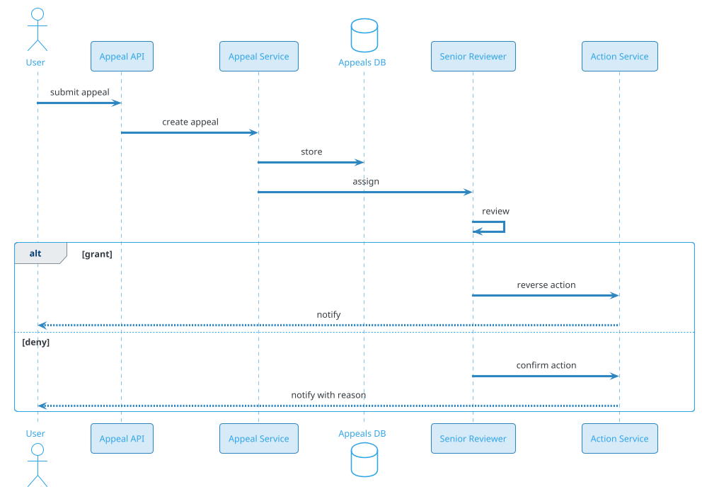

# Content Moderation

## Problem Statement

Design a content moderation system for a large-scale platform (social network, video site, marketplace, messaging app). The system must detect and act on harmful content — hate speech, harassment, spam, misinformation, NSFW, violence, illegal content — across text, images, video, and audio, at a scale of billions of items per day. It combines automated ML classifiers with human review, balances false positives against false negatives, and provides transparency and appeals.

**Example:**

```
User reports a post: "This contains hate speech"

System flow:
  1. Report enters queue with priority
  2. Automated ML classifier scores content (hate speech: 0.92)
  3. If score > threshold, auto-action (remove + notify)
  4. Else, route to human review queue
  5. Human reviewer sees content + context + ML score
  6. Reviewer decides: remove, label, allow
  7. User notified of decision
  8. Repeat offender tracking updated
  9. If user appeals, escalated to senior reviewer
 10. Decision logged for transparency report

Moderation types:
  - Pre-publish (block before posting)
  - Post-publish (remove after posting)
  - User-report-driven (act on reports)
  - Proactive (scan all content)

Content types:
  - Text: posts, comments, messages, usernames, bios
  - Images: photos, memes, thumbnails
  - Video: clips, live streams, thumbnails
  - Audio: voice messages, music
  - Links: phishing, malware, spam
  - Metadata: hashtags, mentions, URLs

Scale:
  - 5B content items/day
  - 500M user reports/day
  - 100M actions/day (remove, label, warn)
  - 10K human moderators globally
  - 24/7 coverage in 50+ languages
```

**Real-world systems:** Facebook Community Standards, YouTube Trust & Safety, Twitter/X Safety, Reddit Moderation, TikTok Safety, OpenAI Moderation API.

**Why it's interesting:**

- **Adversarial** — bad actors adapt to detection
- **Multimodal** — text, image, video, audio
- **Multi-language** — 100+ languages
- **Scale** — billions of items, millions of reports
- **Accuracy trade-offs** — false positives hurt users, false negatives hurt platform
- **Human-in-the-loop** — ML suggests, humans decide edge cases
- **Legal/regulatory** — DSA, GDPR, IT Rules, Section 230
- **Transparency** — explain decisions, allow appeals
- **Fairness** — avoid demographic bias
- **Speed** — viral harmful content spreads in minutes
- **Cost** — human review is expensive

---

## 1. Requirements Clarification

### Functional Requirements
- **Detect**: Identify policy-violating content (text, image, video, audio)
- **Classify**: Hate, harassment, spam, misinformation, NSFW, violence, illegal
- **Action**: Allow, label, downrank, limit, remove, ban
- **Report**: User-submitted reports with priority
- **Review**: Human moderator queue with tools
- **Appeal**: User can appeal decisions
- **Notify**: User informed of action + reason
- **Repeat offenders**: Track history, escalate
- **Transparency**: Report on actions taken
- **Multi-language**: 100+ languages
- **Real-time**: Live streams, live chat
- **Context-aware**: Conversation context matters

### Non-Functional Requirements
- **Scale**: 5B items/day, 500M reports/day, 100M actions/day
- **Latency**: Real-time (pre-publish) < 200 ms; post-publish < 5 min
- **Accuracy**: High precision (avoid false positives), high recall (catch harmful)
- **Availability**: 99.99%
- **Cost**: Human review is expensive → minimize escalations
- **Fairness**: No demographic bias
- **Compliance**: DSA, GDPR, IT Rules, DMCA
- **Transparency**: Explain decisions, quarterly reports
- **Auditability**: Every action logged with reason

### Out of Scope
- Full policy writing (legal, policy teams)
- Law enforcement coordination (mentioned briefly)
- Copyright/DMCA (separate but related)
- Age verification (separate)

---

## 2. Back-of-Envelope Estimation

### Traffic

```
Given:
  Content items/day   = 5,000,000,000
  User reports/day    = 500,000,000
  Actions/day         = 100,000,000
  Human reviews/day   = 10,000,000 (2% of content)
  Peak multiplier     = 5x

Average QPS:
  Content ingestion    = 5B / 86,400 = ~57,870/sec
  Reports              = 500M / 86,400 = ~5,787/sec
  ML inference         = 5B / 86,400 = ~57,870/sec
  Human reviews        = 10M / 86,400 = ~116/sec

Peak QPS (5x):
  Content ingestion    = ~289,350/sec
  Reports              = ~28,935/sec
  ML inference         = ~289,350/sec

ML inference is the bottleneck:
  Each content item may need multiple classifiers
  Text: 5-10 classifiers
  Image: 3-5 classifiers
  Video: frame sampling + audio
  Total ~10-20 inferences per item
  Peak: ~5.8M inferences/sec
```

### Storage

```
Content (for review):
  5B items/day x 500 KB avg = 2.5 PB/day
  Retained 30 days: ~75 PB (hot)
  Retained 1 year: ~30 PB (with compression, tiering)

Reports:
  500M/day x 5 KB = 2.5 TB/day
  Retained 1 year: ~912 TB

Moderation actions:
  100M/day x 2 KB = 200 GB/day
  Retained 5 years: ~365 TB

ML model artifacts:
  100+ models x 1 GB = ~100 GB

Human review queue:
  ~10M items in queue x 500 KB = ~5 TB
  Plus context (metadata): ~1 TB

Training data:
  Labeled examples: 100M x 1 MB = ~100 TB
  Feature store: ~50 TB

Embeddings:
  Content embeddings: 5B x 1 KB = ~5 TB
  User reputation: 2B x 1 KB = ~2 TB

Total hot: ~100 PB
Total cold: ~50 PB
```

### Bandwidth

```
Content for ML inference:
  57,870/sec x 500 KB = ~29 GB/sec = ~232 Gbps

Report + action events:
  5,787/sec x 5 KB = ~29 MB/sec

Human review UI:
  116 reviews/sec x 1 MB = ~116 MB/sec

Model serving:
  Internal traffic between services
  ~500 Gbps internal

Total peak: ~1 Tbps
```

### Latency Budget

```
Pre-publish (block before posting):
  ML classifiers (text):        ~50 ms
  ML classifiers (image):       ~100 ms
  ML classifiers (video):       ~500 ms
  Decision:                     ~10 ms
  Total (text):                 ~100 ms
  Total (image):                ~200 ms
  Total (video):                ~1 sec

Post-publish (proactive scan):
  Queue to ML:                  ~1 sec
  ML inference:                 ~1 sec
  Decision + action:            ~1 sec
  Total:                        < 10 sec

User report:
  Priority queue:               ~10 ms
  ML scoring (cached):          ~50 ms
  Human review:                 hours-days
  Decision:                     ~10 ms
  Total (auto):                 < 5 min
  Total (human):                24-72 hours
```

---

## 3. High-Level Design

```d2
direction: down

user: User {shape: person}
content: Content Ingestion {shape: rectangle}
cdn: CDN {shape: cloud}

api: API Gateway {shape: hexagon}

moderator: "Moderator UI" {shape: rectangle}
reporter: "Report Ingestion" {shape: rectangle}
appeal: "Appeal Service" {shape: rectangle}

orchestrator: Moderation Orchestrator {shape: rectangle}
textmod: "Text Classifiers" {shape: rectangle}
imgmod: "Image Classifiers" {shape: rectangle}
vidmod: "Video Classifiers" {shape: rectangle}
linkmod: "Link / URL Classifiers" {shape: rectangle}
repmod: "Reputation Service" {shape: rectangle}
policy: "Policy Engine" {shape: rectangle}
appealsvc: "Appeal Handler" {shape: rectangle}

queue: "Human Review Queue" {shape: queue}
kafka: Kafka {shape: queue}

contentdb: "Content Store (S3)" {shape: cylinder}
actions: "Actions DB (PostgreSQL)" {shape: cylinder}
events: "Events (ClickHouse)" {shape: cylinder}
labels: "Labels Store" {shape: cylinder}
models: "Model Registry" {shape: cylinder}

user -> content
content -> api
api -> orchestrator

reporter -> api
moderator -> api
appeal -> api

orchestrator -> textmod
orchestrator -> imgmod
orchestrator -> vidmod
orchestrator -> linkmod
orchestrator -> repmod
orchestrator -> policy

policy -> queue
policy -> content
policy -> actions
policy -> kafka

textmod -> models
imgmod -> models
vidmod -> models
linkmod -> models

queue -> moderator

kafka -> events
kafka -> labels
content -> contentdb
```

### Component Responsibilities

| Component | Role |
|---|---|
| Content Ingestion | Receives new content (posts, comments, media) |
| API Gateway | Auth, rate limiting, routing |
| Moderation Orchestrator | Coordinates classifiers, applies policy |
| Text Classifiers | Hate, spam, harassment, etc. |
| Image Classifiers | NSFW, violence, hate symbols |
| Video Classifiers | Frame sampling + audio |
| Link / URL Classifiers | Phishing, malware, spam |
| Reputation Service | User history, trust score |
| Policy Engine | Rules combining ML output + policy |
| Human Review Queue | Escalated items for moderators |
| Moderator UI | Tools for human review |
| Appeal Service | User appeals workflow |
| Actions DB | Log of all moderation actions |
| Events (ClickHouse) | Analytics, transparency reports |
| Labels Store | Training labels from human reviews |
| Model Registry | Versioned ML models |
| Content Store (S3) | Persistent content storage |

### Why This Architecture

- **Orchestrator** centralizes policy logic (easy to update)
- **Separate classifiers** by modality (scale independently)
- **Policy Engine** decouples ML from rules (business can adjust)
- **Human review queue** for edge cases
- **Appeal service** for user recourse
- **Actions DB** for audit + transparency
- **Labels store** closes the ML training loop
- **Kafka** decouples ingestion from moderation

---

## 4. API Design

### Submit Content (Internal, from Post Service)

```http
POST /v1/moderate/content
Content-Type: application/json
X-Internal-Token: <token>

{
  "content_id": "cnt-123",
  "content_type": "post",
  "user_id": "u-456",
  "text": "Some post text",
  "media_urls": ["s3://bucket/image-1.jpg"],
  "metadata": {
    "language": "en",
    "hashtags": ["#example"],
    "mentions": ["@user"],
    "created_at": "2026-09-19T10:00:00Z",
    "device": "mobile",
    "ip_hash": "abc123"
  },
  "context": {
    "conversation_id": "conv-789",
    "parent_post_id": null,
    "is_reply": false
  }
}
```

**Response (synchronous pre-publish):**
```json
{
  "moderation_id": "mod-abc",
  "decision": "allow",           // allow, block, flag_review, remove
  "scores": {
    "hate": 0.05,
    "harassment": 0.12,
    "spam": 0.03,
    "nsfw": 0.01,
    "violence": 0.02
  },
  "reason_codes": [],
  "action_taken": null,
  "latency_ms": 145
}
```

**Response (queued for human review):**
```json
{
  "moderation_id": "mod-abc",
  "decision": "flag_review",
  "scores": {
    "hate": 0.65,
    "harassment": 0.72
  },
  "reason_codes": ["HATE_SPEECH_POSSIBLE", "HARASSMENT_POSSIBLE"],
  "action_taken": "queued_for_review",
  "queue_position": 12345
}
```

### Submit User Report

```http
POST /v1/reports
Content-Type: application/json
Authorization: Bearer <user-token>

{
  "content_id": "cnt-123",
  "reason": "hate_speech",
  "details": "This post uses racial slurs",
  "reporter_id": "u-789"
}
```

**Response 201:**
```json
{
  "report_id": "rep-abc",
  "status": "received",
  "estimated_review_time_hours": 24
}
```

### Get Report Status

```http
GET /v1/reports/rep-abc
```

**Response:**
```json
{
  "report_id": "rep-abc",
  "status": "actioned",
  "decision": "content_removed",
  "reason": "hate_speech",
  "actioned_at": "2026-09-19T12:30:00Z"
}
```

### Submit Appeal

```http
POST /v1/appeals
Content-Type: application/json
Authorization: Bearer <user-token>

{
  "moderation_id": "mod-abc",
  "appeal_reason": "I believe this was a mistake. The content was educational.",
  "additional_context": "..."
}
```

**Response 201:**
```json
{
  "appeal_id": "app-xyz",
  "status": "pending_review",
  "estimated_response_days": 7
}
```

### Moderator: Get Queue

```http
GET /v1/moderator/queue?priority=high&limit=20&language=en
Authorization: Bearer <moderator-token>
```

**Response:**
```json
{
  "items": [
    {
      "moderation_id": "mod-abc",
      "content": {
        "text": "...",
        "media_urls": ["..."],
        "author": {...}
      },
      "report_count": 12,
      "ml_scores": {"hate": 0.65, "harassment": 0.72},
      "priority": "high",
      "assigned_to": null,
      "queue_time_seconds": 3421
    }
  ],
  "next_cursor": "..."
}
```

### Moderator: Take Action

```http
POST /v1/moderator/actions
Authorization: Bearer <moderator-token>

{
  "moderation_id": "mod-abc",
  "action": "remove",           // allow, label, downrank, remove, ban_author
  "policy_violated": "hate_speech",
  "notes": "Clear hate speech violation",
  "duration_hours": 168
}
```

**Response:**
```json
{
  "action_id": "act-xyz",
  "status": "applied",
  "content_removed": true,
  "author_notified": true
}
```

### Transparency Report (Public)

```http
GET /v1/transparency/reports?quarter=2026-Q3
```

**Response:**
```json
{
  "quarter": "2026-Q3",
  "total_content_moderated": 450000000000,
  "actions": {
    "content_removed": 125000000,
    "content_labeled": 8000000,
    "accounts_suspended": 2500000,
    "appeals_received": 1200000,
    "appeals_granted": 180000
  },
  "top_violations": [
    {"type": "spam", "count": 45000000},
    {"type": "hate_speech", "count": 32000000}
  ],
  "automated_vs_human": {
    "automated": 0.92,
    "human_review": 0.08
  }
}
```

---

## 5. Database Design

### PostgreSQL Schema (Actions, Reports, Appeals)

```sql
-- Reports (user-submitted)
CREATE TABLE reports (
    report_id BIGINT PRIMARY KEY,
    content_id BIGINT NOT NULL,
    content_type VARCHAR(20),
    reporter_id BIGINT,
    reason VARCHAR(50) NOT NULL,
    details TEXT,
    status VARCHAR(20) NOT NULL,     -- received, triaged, actioned, rejected
    decision VARCHAR(50),
    actioned_at TIMESTAMP,
    created_at TIMESTAMP DEFAULT NOW()
);
CREATE INDEX idx_reports_content ON reports(content_id);
CREATE INDEX idx_reports_status ON reports(status);
CREATE INDEX idx_reports_reporter ON reports(reporter_id, created_at DESC);

-- Moderation actions (all decisions)
CREATE TABLE moderation_actions (
    action_id BIGINT PRIMARY KEY,
    content_id BIGINT NOT NULL,
    content_type VARCHAR(20),
    author_id BIGINT,
    actor_type VARCHAR(20) NOT NULL,   -- system, human_moderator, appeal_reviewer
    actor_id BIGINT,
    action VARCHAR(50) NOT NULL,       -- allow, label, downrank, remove, ban
    policy_violated VARCHAR(100),
    reason_codes TEXT[],
    notes TEXT,
    duration_hours INT,
    automated BOOLEAN,
    ml_scores JSONB,
    content_snapshot_url TEXT,
    created_at TIMESTAMP DEFAULT NOW(),
    reversed_at TIMESTAMP,
    reversed_by BIGINT
);
CREATE INDEX idx_actions_content ON moderation_actions(content_id);
CREATE INDEX idx_actions_author ON moderation_actions(author_id, created_at DESC);
CREATE INDEX idx_actions_created ON moderation_actions(created_at DESC);
CREATE INDEX idx_actions_automated ON moderation_actions(automated);

-- Appeals
CREATE TABLE appeals (
    appeal_id BIGINT PRIMARY KEY,
    moderation_id BIGINT REFERENCES moderation_actions(action_id),
    user_id BIGINT,
    appeal_reason TEXT NOT NULL,
    additional_context TEXT,
    status VARCHAR(20) NOT NULL,      -- pending, in_review, granted, denied
    reviewer_id BIGINT,
    decision_reason TEXT,
    created_at TIMESTAMP DEFAULT NOW(),
    reviewed_at TIMESTAMP
);
CREATE INDEX idx_appeals_user ON appeals(user_id, created_at DESC);
CREATE INDEX idx_appeals_status ON appeals(status);

-- User reputation / trust score
CREATE TABLE user_reputation (
    user_id BIGINT PRIMARY KEY,
    trust_score DECIMAL(5,4) DEFAULT 1.0,   -- 0-1
    total_violations INT DEFAULT 0,
    violations_30d INT DEFAULT 0,
    last_violation_at TIMESTAMP,
    is_verified BOOLEAN DEFAULT FALSE,
    is_banned BOOLEAN DEFAULT FALSE,
    ban_reason VARCHAR(200),
    banned_until TIMESTAMP,
    updated_at TIMESTAMP DEFAULT NOW()
);

-- Blocklist (known harmful content, hash-based)
CREATE TABLE blocklist (
    hash VARCHAR(64) PRIMARY KEY,     -- SHA-256 of normalized content
    content_type VARCHAR(20),
    reason VARCHAR(50),
    first_seen_at TIMESTAMP DEFAULT NOW()
);

-- Policy rules (config-driven)
CREATE TABLE policies (
    policy_id BIGINT PRIMARY KEY,
    name VARCHAR(100) UNIQUE NOT NULL,
    category VARCHAR(50),             -- hate, harassment, spam, etc.
    threshold_critical DECIMAL(3,2),
    threshold_high DECIMAL(3,2),
    threshold_medium DECIMAL(3,2),
    auto_action VARCHAR(50),          -- remove, label, queue
    human_review_required BOOLEAN,
    version INT NOT NULL,
    effective_from TIMESTAMP,
    is_active BOOLEAN DEFAULT TRUE
);

-- Language-specific thresholds
CREATE TABLE policy_thresholds (
    policy_id BIGINT REFERENCES policies(policy_id),
    language VARCHAR(10),
    threshold DECIMAL(3,2),
    PRIMARY KEY (policy_id, language)
);
```

### Cassandra / ClickHouse Schema (Events, Analytics)

```sql
-- ClickHouse: All moderation events for analytics
CREATE TABLE moderation_events (
    event_id UUID,
    content_id UInt64,
    content_type String,
    author_id UInt64,
    event_type String,             -- report, ml_score, human_review, action, appeal
    decision String,
    policy_violated String,
    ml_scores String,              -- JSON
    confidence Float32,
    automated Bool,
    actor_id UInt64,
    country String,
    language String,
    event_time DateTime
) ENGINE = MergeTree()
PARTITION BY toYYYYMMDD(event_time)
ORDER BY (event_time, content_id)
TTL event_time + INTERVAL 3 YEAR;

-- Materialized view: actions per day by type
CREATE MATERIALIZED VIEW daily_actions AS
SELECT
    toDate(event_time) AS date,
    policy_violated,
    decision,
    count() AS count
FROM moderation_events
WHERE event_type = 'action'
GROUP BY date, policy_violated, decision;
```

### Redis Data Structures

```
-- User reputation cache (hot)
Key: rep:{user_id}
Value: {trust_score, violations_30d, is_banned}
TTL: 15 min

-- Rate limit (per user)
Key: ratelimit:{user_id}:content
Value: count
TTL: 1 hour

-- ML score cache (avoid re-scoring similar content)
Key: ml_score:{content_hash}
Value: {scores, model_version}
TTL: 1 hour

-- Blocklist cache (Bloom filter)
Key: blocklist:bloom
Value: Bloom filter of hashes
TTL: 1 hour (rebuilt)

-- Active moderator sessions
Key: mod_session:{moderator_id}
Value: {queue_position, last_action}
TTL: 30 min

-- Countdown / escalation
Key: escalation:{content_id}
Value: {priority, deadline}
TTL: 1 hour
```

### S3 Buckets

```
s3://content-store/{content_type}/{yyyy}/{mm}/{dd}/{content_id}
  - original
  - thumbnail
  - metadata.json
  - ml_scores.json

s3://moderation-snapshots/{action_id}/
  - content_snapshot (immutable for audit)
  - context.json

s3://moderation-labels/{yyyy}/{mm}/
  - labeled_examples.parquet (for training)
```

### Elasticsearch (Search for Moderators)

```json
{
  "mappings": {
    "properties": {
      "content_id": {"type": "keyword"},
      "text": {"type": "text"},
      "author_id": {"type": "keyword"},
      "ml_score": {"type": "float"},
      "report_count": {"type": "integer"},
      "status": {"type": "keyword"},
      "language": {"type": "keyword"},
      "created_at": {"type": "date"},
      "queue_priority": {"type": "integer"}
    }
  }
}
```

---

## 6. Deep Dive: ML Classifier Stack

### Text Classification

**Tasks:**
- Hate speech detection
- Harassment / cyberbullying
- Spam detection
- Misinformation
- Self-harm / suicide risk
- Violence / threats

**Models:**
- Fine-tuned transformer (BERT, RoBERTa, XLM-R for multilingual)
- Task-specific heads (multi-label)
- Small model for pre-filter, large for verification

**Features:**
- Text tokens
- Embeddings (sentence-level)
- Hashtags, mentions, URLs
- Author reputation
- Conversation context

**Languages:**
- Primary: English, Spanish, Hindi, Arabic, Portuguese
- Secondary: 100+ others (XLM-R multilingual)

**Latency:** ~10-50 ms per item.

### Image Classification

**Tasks:**
- NSFW (adult content, nudity)
- Violence (blood, gore, weapons)
- Hate symbols (swastikas, etc.)
- Self-harm imagery
- Terrorist content
- Spam (text in images)

**Models:**
- EfficientNet, ViT, CLIP-based
- Multi-label classifiers
- OCR for text-in-image

**Preprocessing:**
- Resize, normalize
- Face detection (avoid flagging faces for nudity)
- Text extraction (OCR)

**Latency:** ~50-100 ms per image.

### Video Classification

**Tasks:**
- Content moderation (all tasks above, over time)
- Live stream moderation
- Music copyright detection (audio fingerprinting)

**Approach:**
- Frame sampling (1 frame per second)
- Keyframe extraction
- Audio transcription + classification
- Temporal aggregation (combine frame scores)

**Models:**
- Per-frame: image classifier
- Temporal: LSTM or transformer over frames
- Audio: Whisper (transcription) + text classifier

**Latency:** ~500 ms - 2 sec per minute of video.

### Link / URL Classification

**Tasks:**
- Phishing detection
- Malware distribution
- Spam (link farms)
- Ad fraud

**Signals:**
- Domain reputation (Whitelist, Blacklist)
- WHOIS data (domain age, registrant)
- URL patterns
- Landing page content
- Redirect chains

**Models:**
- Gradient boosted trees (URL + WHOIS features)
- Content-based (landing page classifier)

**Latency:** ~100 ms per URL.

### Multimodal Fusion

Some content has multiple modalities (image + text). Combine scores:

```
text_score = 0.5
image_score = 0.7
combined = max(text_score, image_score)  # or weighted average

if combined > 0.8 → block
if 0.5 < combined < 0.8 → human review
```

### Model Serving

```d2
direction: right

request: "Incoming Request" {shape: rectangle}
cache: "Score Cache (Redis)" {shape: cylinder}
router: "Model Router" {shape: rectangle}
small: "Small Models (fast)" {shape: rectangle}
large: "Large Models (accurate)" {shape: rectangle}
ensemble: "Ensemble / Fusion" {shape: rectangle}
output: "Scores Output" {shape: rectangle}

request -> cache
cache -> router
router -> small
small -> large : if uncertain
large -> ensemble
small -> ensemble
ensemble -> output
```

**Two-stage inference:**
1. **Small model** runs first (~5 ms, ~80% confidence)
2. If uncertain (score between 0.3 and 0.7), **large model** runs (~50 ms)
3. Ensemble combines

**Saves 70% compute** for clear-cut cases.

### Model Training

**Data:**
- Human-labeled examples (from moderator decisions)
- Adversarial examples (red team)
- User reports (weak labels)
- Synthetic data (for rare classes)

**Frequency:**
- **Full retrain**: Weekly
- **Incremental**: Daily
- **Hot fixes**: On new abuse vectors (hours)

**Evaluation:**
- **Precision/recall** per class
- **False positive rate** (critical for user trust)
- **False negative rate** (critical for safety)
- **Per-language performance**
- **Adversarial robustness**

**Deployment:**
- Canary (5% traffic)
- Shadow mode (score without action)
- Gradual rollout

### Adversarial Attacks

Bad actors adapt:
- **Misspellings**: "h8te" for "hate"
- **Leetspeak**: "h4te"
- **Unicode tricks**: Zero-width characters
- **Images with text**: Hide text in images
- **Encoded content**: Base64, ROT13
- **Contextual**: Sarcasm, dog whistles

**Countermeasures:**
- Normalize text (lowercase, remove special chars)
- OCR for images
- Adversarial training
- Continuous red teaming
- Ensemble of models

---

## 7. Deep Dive: Human Review

### Why Human Review?

- ML is imperfect (false positives/negatives)
- Edge cases need judgment
- Appeals require human
- New abuse patterns need human labeling
- Cultural context matters

**Target:** ~2% of content escalated to humans.

### Review Queue

**Prioritization:**
- **High**: Serious violations (violence, CSAM), viral content, verified authors
- **Medium**: Hate speech, harassment, spam
- **Low**: Borderline, low-reach content

**Scoring:**
```
priority = w1 * severity_score
         + w2 * virality_score
         + w3 * report_count
         + w4 * author_risk_score
         + w5 * age_hours  (older = higher priority to clear queue)
```

### Moderator UI

**Features:**
- Content + context (conversation, user history)
- ML scores + reason codes
- User reports summary
- Similar past decisions (for consistency)
- Action buttons (allow, label, remove, ban)
- Reason picker (structured)
- Notes field
- Keyboard shortcuts (fast workflow)
- Next item auto-loaded

**Performance:**
- Target: 2-5 min per item
- Batch similar items (same author, same topic)
- Escalation to senior reviewer

### Moderator Wellness

Moderators see traumatic content daily. Must protect them:
- **Wellness programs** (counseling, breaks)
- **Blur by default** (reveal on click)
- **Time limits** (max hours on harmful content)
- **Rotation** (mix of severity)
- **Opt-out** for specific categories

### Quality Control

- **Audit**: 5% of decisions randomly reviewed by senior
- **Inter-rater reliability**: Ensure consistency
- **Training**: Regular updates on policy
- **Feedback loop**: From appeals

### Language / Region Specialization

- Native speakers for each language
- Regional context (culture, law)
- Time zone coverage (24/7)

### Scale

- **10K moderators globally**
- **~10M reviews/day**
- **~1K reviews/moderator/day** (at 4-8 min each)
- **3 shifts** (24/7 coverage)

### Cost

- **~$30K-$60K per moderator/year** (including benefits, training)
- **10K moderators** = **~$400M-$600M/year**
- **This is the dominant cost** of moderation

### Automation of Human Review

To reduce cost:
- **Self-serve** for simple cases (user can delete own content)
- **Community moderation** (Reddit-style, for smaller communities)
- **Appeal auto-grant** for borderline cases (if pattern matches previous grants)
- **Confidence thresholds**: Only escalate uncertain cases

---

## 8. Deep Dive: Policy Engine

### Why a Policy Engine?

- ML gives scores; policy decides action
- Policy changes independently of code
- Different rules per category, language, region
- Testable, versioned

### Policy Structure

```json
{
  "policy_id": "hate_speech_v3",
  "category": "hate_speech",
  "version": 3,
  "effective_from": "2026-09-01",
  "rules": [
    {
      "condition": {
        "ml_score": {"hate": {">=": 0.9}}
      },
      "action": "remove",
      "notify_user": true,
      "escalate": false
    },
    {
      "condition": {
        "ml_score": {"hate": {">=": 0.7, "<": 0.9}},
        "author_trust_score": {"<": 0.5}
      },
      "action": "remove",
      "notify_user": true,
      "escalate": false
    },
    {
      "condition": {
        "ml_score": {"hate": {">=": 0.5, "<": 0.7}}
      },
      "action": "queue_review",
      "priority": "high"
    }
  ]
}
```

### Policy Evaluation

```
1. Fetch active policies for content category + language
2. Evaluate rules in priority order
3. First matching rule determines action
4. Log decision with rule_id
5. If no rule matches → default allow
```

### Policy Versioning

- Every policy change = new version
- Old versions retained (for audit)
- A/B testing of policy changes
- Rollback if issues

### Region-Specific Policies

Different laws, different rules:
- **EU (DSA)**: Strict, transparent
- **US (Section 230)**: More permissive
- **India (IT Rules)**: Government takedown, 36-hour SLA
- **Germany (NetzDG)**: Hate speech, 24-hour removal

### Policy Conflicts

When rules conflict:
- **Priority order** (most specific wins)
- **Override list** (manual overrides)
- **Escalate** to human

### Policy Testing

- **Unit tests**: Synthetic examples → expected action
- **Regression tests**: Historical decisions
- **Shadow mode**: Run new policy on live traffic, no action, compare
- **Canary**: Apply to 1% of traffic

---

## 9. Deep Dive: Appeals

### Why Appeals?

- ML makes mistakes
- Users deserve recourse
- Regulatory requirement (DSA, GDPR)
- Builds trust

### Appeal Flow



### Appeal Outcomes

- **Granted**: Reverse action (restore content, unban)
- **Denied**: Confirm action, provide reason
- **Partial**: Different action (label instead of remove)

### Appeal Timeline

- **Acknowledgment**: Within 24 hours
- **Decision**: Within 7 days (DSA requirement)
- **Complex cases**: Extended with notification

### Appeal Volume

```
Appeals/day       = 1,200,000
Grant rate        = 15%
Human reviews     = 1,200,000 (all appeals need human)
Cost              = ~$5/appeal × 1.2M × 30 = ~$180M/month
```

**Optimization:**
- **Auto-grant** borderline cases if pattern matches historical grants
- **Auto-deny** obvious violations (CSAM, terror)
- **Triage** to route to best reviewer

### Appeal Quality

- Senior reviewers (more experienced)
- Fresh eyes (not original reviewer)
- Consistency checks
- Audit trail

### Repeat Appeals

- User can appeal once
- If denied, can request escalation (rare)
- Abuse of appeals = account action

---

## 10. Deep Dive: Real-Time Moderation

### The Challenge

Some content spreads in seconds:
- Live streams
- Breaking news comments
- Viral tweets
- Coordinated attacks

**Requirement:** Detect and act within seconds.

### Pre-Publish (Block Before Posting)

For high-risk content:
- Text: ML runs before post is visible (~100 ms)
- Media: ML runs before post is visible (~200 ms - 1 sec)
- If blocked → user sees error message

**Pros:** No harmful content ever visible.
**Cons:** Slower posting, false positives block legit content.

**Recommended for:** Comments, replies, DMs.

### Post-Publish (Proactive Scan)

For most content:
- Post is visible immediately
- ML runs asynchronously
- If high-score, action within seconds-minutes**Pros:** Fast posting, high throughput.
**Cons:** Harmful content visible briefly.

**Recommended for:** Posts, stories, videos.

### Hybrid Approach

```
Post submitted:
  1. Fast ML (text, quick) runs synchronously (~50 ms)
  2. If score > critical → block
  3. Else → post visible
  4. Slow ML (image, video) runs async (~1-10 sec)
  5. If score > threshold → remove + notify

Result: Very harmful blocked; rest fast
```

### Live Stream Moderation

For live video:
- **Frame sampling**: Every 1-5 seconds
- **Audio transcription**: Real-time
- **Chat moderation**: In parallel
- **Auto-shutdown**: If critical threshold exceeded
- **Human escalation**: Immediate for review

**Latency:** 5-30 sec detection.

### Coordinated Attacks

**Pattern:** Many accounts post same content simultaneously.

**Detection:**
- **Content hash clustering**: Group identical content
- **Velocity**: Sudden spike in reports
- **Coordination signals**: New accounts, similar IPs

**Response:**
- **Auto-quarantine**: Hold for review
- **Batch action**: Remove all at once
- **Account network**: Investigate coordinating accounts

---

## 11. Deep Dive: Transparency and Compliance

### Why Transparency?

- **User trust**: Users need to know why content was removed
- **Regulatory**: DSA (EU), GDPR, IT Rules require it
- **Accountability**: Public reports hold platform accountable
- **Improvement**: Feedback from reports

### User Notifications

Every action includes:
- **What was removed** (or labeled, or downranked)
- **Why** (policy violated, in user's language)
- **How to appeal** (link to appeal form)
- **Duration** (temporary vs permanent)
- **Repeat offense count**

### Transparency Reports

Quarterly public reports:
- Total content moderated
- Actions by category
- Automated vs human
- Appeals received/granted
- Top violations
- Response times

**DSA requires:** Reports for platforms > 45M EU users.

### Audit Trail

Every moderation action:
- **Timestamp**
- **Actor** (system or human)
- **Reason** (policy violated)
- **Evidence** (ML scores, reports)
- **Content snapshot** (immutable)
- **Follow-up** (appeal, reversal)

**Retention:** 5+ years.

### Regulatory Compliance

| Regulation | Requirement |
|---|---|
| EU DSA | Transparency, appeals, risk assessment |
| GDPR | Right to explanation, data subject access |
| India IT Rules | 36-hour takedown, grievance officer |
| US Section 230 | Platform immunity (conditional) |
| Germany NetzDG | 24-hour removal of clear violations |
| Australia eSafety | Online Safety Act |
| UK Online Safety Bill | Safety duties, transparency |

### Government Requests

- **Takedown orders** from governments
- **Legal process** (subpoenas)
- **Emergency requests** (imminent harm)
- **Transparency reporting** on requests

**Process:**
1. Receive request
2. Validate legality
3. Comply or challenge
4. Notify user (if allowed)
5. Report in transparency stats

### Algorithmic Transparency (DSA)

Users can request:
- **Explanation** of why they saw a recommendation
- **Opt-out** of algorithmic ranking (chronological option)
- **Non-profiling** option

**Implementation:** Explainability service + user toggles.

### Risk Assessments

Annual/quarterly:
- **Systemic risks** of platform (misinformation, elections, minors)
- **Mitigation measures**
- **Audit** by independent third party

**DSA requires:** For VLOPs (Very Large Online Platforms, > 45M users).

---

## 12. Scaling Considerations

### Read Scaling

- **Redis** for hot state (reputation, rate limits)
- **Read replicas** for PostgreSQL
- **ClickHouse** for analytics (OLAP)
- **Elasticsearch** for moderator search
- **CDN** for content snapshots

### Write Scaling

- **Kafka** for event ingestion (decoupled)
- **Cassandra / ClickHouse** for events (write-heavy)
- **Sharded orchestrator** for parallel processing
- **Batch processing** for efficiency

### Sharding

**PostgreSQL:** Shard by `content_id`.
**Kafka:** Partition by `author_id` (per-author ordering).
**Redis:** Shard by `user_id`.
**ClickHouse:** Partition by date.

### Auto-Scaling

- **Classifiers**: Scale on inference rate
- **Orchestrator**: Scale on Kafka lag
- **Moderator UI**: Scale on concurrent sessions
- **Human review**: Scale by hiring (not auto-scale)

### Multi-Region

```d2
direction: down

us: "US Region" {
  shape: cloud
}
eu: "EU Region" {
  shape: cloud
}
apac: "APAC Region" {
  shape: cloud
}

usm: "US Models" {
  shape: cylinder
}
eum: "EU Models" {
  shape: cylinder
}
apacm: "APAC Models" {
  shape: cylinder
}

usq: "US Moderators" {
  shape: cylinder
}
euq: "EU Moderators" {
  shape: cylinder
}
apacq: "APAC Moderators" {
  shape: cylinder
}

us -> usm
us -> usq
eu -> eum
eu -> euq
apac -> apacm
apac -> apacq
```

**Per-region:**
- Models (language-specific)
- Moderators (language + region)
- Data (compliance)
- Latency (local processing)

### Peak Handling

**Events:**
- Elections: 5-10x reports
- Breaking news: 3-5x
- Coordinated attacks: 100x (brief)
- Viral harmful content: 50x (brief)

**Mitigations:**
- Kafka buffers
- Auto-scale classifiers
- Pre-warm models
- Reserve moderator capacity

### Cost Optimization

| Component | Optimization |
|---|---|
| ML inference | Two-stage (small then large) |
| Human review | Auto-grant, triage, community mod |
| Storage | Tiering, retention policies |
| Compute | Reserved + spot |
| Training | Spot, mixed precision |

### Exabyte-Scale Content

- **Content store**: S3 with lifecycle policies
- **Snapshots**: Retain for legal/audit
- **Training data**: Sample and compress
- **Retention**: Based on regulation (1-7 years)

---

## 13. Bottlenecks and Trade-offs

| Concern | Solution | Trade-off |
|---|---|---|
| ML accuracy | Multi-model ensemble | Cost, latency |
| False positives | Higher thresholds | More false negatives |
| Human cost | Auto-action for clear cases | Errors |
| Latency | Fast path + slow path | Complexity |
| Adversarial | Continuous red teaming | Ongoing effort |
| Language coverage | Native moderators | Cost |
| Fairness | Bias audits | May reduce catch rate |
| Transparency | Explainability service | Exposes logic |
| Real-time | Pre-publish + post-publish | UX trade-off |
| Appeals | Human review | Cost, delay |

### Design Decisions Summary

| Decision | Choice | Rationale |
|---|---|---|
| ML architecture | Multi-model ensemble | Best accuracy |
| Two-stage inference | Small then large | Cost vs accuracy |
| Human review | ML + human hybrid | Balance scale + accuracy |
| Policy engine | Config-driven | Fast iteration |
| Appeals | Human senior review | Fairness |
| Real-time | Hybrid (sync + async) | UX + safety |
| Transparency | User notification + reports | Regulatory |
| Multi-region | Region-specific models + moderators | Compliance + context |

---

## 14. Failure Scenarios

### ML Classifier Down

**Impact:** No automated scoring; fallback to human-only.

**Mitigation:**
- Serve with cached scores
- Fallback to simple rules
- Route to human review
- Alert immediately

### Moderator UI Down

**Impact:** Human review blocked; queue grows.

**Mitigation:**
- Auto-scale
- Fallback to simple UI
- Secondary region
- Alert ops

### Policy Engine Down

**Impact:** Can't apply rules; default allow (risky).

**Mitigation:**
- Cache policies
- Fallback to default policy
- Alert immediately

### Human Review Backlog

**Impact:** Queue grows; SLA missed.

**Mitigation:**
- Hire more moderators
- Auto-action more cases
- Reduce escalation threshold
- Prioritize severe cases

### False Positive Storm

**Impact:** Legit content removed; user frustration.

**Mitigation:**
- Fast appeal review
- Rollback policy
- Adjust threshold
- Post-mortem

### Adversarial Attack

**Impact:** Bypass detection; harmful content visible.

**Mitigation:**
- Red team response
- Update models quickly
- Manual block
- Emergency policy

### CSAM Detected

**Impact:** Critical; legal implications.

**Mitigation:**
- Immediate removal
- Report to NCMEC / authorities
- Preserve evidence
- User ban
- Legal review

### Government Takedown Request

**Impact:** Potential free speech vs legal compliance.

**Mitigation:**
- Legal review
- Comply if lawful
- Notify user (if allowed)
- Transparency report

### Data Breach

**Impact:** User content exposed.

**Mitigation:**
- Encryption at rest
- Access controls
- Incident response
- Notify users

### Systemic Bias Detected

**Impact:** Discriminatory outcomes.

**Mitigation:**
- Bias audit
- Model retraining
- Policy adjustment
- Public disclosure

---

## 15. Monitoring and Alerts

### Key Metrics

| Metric | Target | Alert Threshold |
|---|---|---|
| Moderation latency (pre-publish) | < 200 ms | > 500 ms |
| Moderation latency (post-publish) | < 5 min | > 30 min |
| ML inference p99 | < 100 ms | > 300 ms |
| Human review queue depth | < 100K | > 500K |
| Human review time (avg) | < 24 hours | > 72 hours |
| Appeal resolution time | < 7 days | > 14 days |
| False positive rate | < 1% | > 2% |
| False negative rate (sampled) | < 5% | > 10% |
| Appeals grant rate | 10-20% | outside range |
| Adversarial bypass rate | < 1% | > 5% |
| Bias metric (demographic parity) | < 5% difference | > 10% |

### Dashboards

- **Volume**: Content moderated, actions, reports
- **Latency**: p50/p95/p99 per stage
- **Accuracy**: Precision, recall, false positive/negative
- **Human review**: Queue depth, resolution time
- **Appeals**: Volume, grant rate, resolution time
- **Policy**: Active policies, rule hits
- **Bias**: Demographic parity, equal opportunity
- **Adversarial**: Detected bypasses, red team findings
- **Cost**: Per-action cost, per-report cost
- **Business**: User trust score, churn, NPS

### Alerts

- **P0**: CSAM detected, systemic bias, human review backlog > 1M
- **P1**: Queue depth > 500K, appeal SLA breach, adversarial bypass
- **P2**: False positive rate > 2%, policy engine down
- **P3**: Bias metric drift, new abuse vector

### Business KPIs

- **Content removed** (per 1K items)
- **User reports** (per 1K items)
- **Appeal grant rate**
- **Repeat offender rate**
- **Time to action** (SLA)
- **User trust score** (survey)
- **Moderator wellness** (retention, mental health)

---

## 16. Cost Estimation

Rough monthly cost (AWS, us-east-1) for 5B items/day:

| Component | Spec | Cost/month |
|---|---|---|
| Content Ingestion | 200 x c6g.large | ~$12,000 |
| Moderation Orchestrator | 300 x c6g.2xlarge | ~$72,000 |
| ML Inference (CPU) | 500 x c6g.2xlarge | ~$120,000 |
| ML Inference (GPU) | 200 x g4dn.xlarge | ~$100,000 |
| Feature Store (Redis) | 50 x cache.r6g.2xlarge | ~$25,000 |
| PostgreSQL | 20 shards x db.r6g.4xlarge | ~$95,000 |
| Read replicas | 40 x db.r6g.2xlarge | ~$84,000 |
| ClickHouse | 50 x i3.2xlarge | ~$50,000 |
| Kafka (MSK) | 40 brokers | ~$20,000 |
| S3 (content + snapshots) | 100 PB | ~$2,300,000 |
| S3 Glacier (archive) | 200 PB | ~$800,000 |
| Elasticsearch | 20 x r6g.2xlarge | ~$36,000 |
| **Human moderators** | 10,000 globally | ~$400,000,000/yr = **~$33M/month** |
| Senior reviewers | 500 globally | ~$30M/yr = ~$2.5M/month |
| Training cluster (GPU) | 32 x p3.2xlarge | ~$60,000 |
| Model serving | 100 x c6g.2xlarge | ~$24,000 |
| Monitoring | Datadog | ~$50,000 |
| **Total** | | **~$36.5M/month** |

**Per item:** ~$0.00024 per content item.

**Cost breakdown:**
- **Human moderation**: ~91% of cost
- **ML inference**: ~1% of cost
- **Storage**: ~8% of cost

**Cost optimization:**
- **Reduce human escalation**: Better ML → fewer escalations
- **Auto-action clear cases**: Clear violations removed without human
- **Community moderation**: For smaller communities
- **Appeal automation**: Auto-grant clear cases

**Reality:** Human moderation dominates cost. The goal of ML is not just accuracy — it's to reduce human workload.

---

## 17. Extensions and Follow-ups

### Community Moderation

Reddit-style:
- Volunteer moderators per community
- Custom rules per community
- Escalation to platform for critical violations
- Moderator tools + dashboard

### Federated Moderation

Mastodon / Bluesky:
- Instance-level moderation
- Shared blocklists
- Federated reports
- Cross-instance coordination

### AI-Generated Content Detection

- Detect AI-generated text (GPT, Claude)
- Detect AI-generated images (DALL-E, Midjourney)
- Watermarking (C2PA standard)
- Provenance tracking

### Deepfake Detection

- Video deepfake detection
- Audio deepfake detection
- Face manipulation detection
- Real-time detection for live streams

### CSAM Detection

- Hash matching (PhotoDNA, NCMEC)
- ML classifiers for new content
- Mandatory reporting (NCMEC in US)
- Law enforcement coordination

### Terrorist Content

- Hash matching (GIFCT database)
- ML classifiers
- Immediate removal
- Coordination with authorities

### Misinformation / Disinformation

- Fact-checker partnerships
- Claim detection (claim extraction)
- Source credibility
- Labels ("This claim is disputed")
- Downranking

### Election Integrity

- Coordinated inauthentic behavior detection
- Voter suppression detection
- Political ad transparency
- Real-time monitoring during elections

### Health Misinformation

- COVID, vaccine misinformation
- Mental health content
- Medical claim verification
- Partnerships with WHO, health orgs

### Self-Harm / Suicide Prevention

- Detection of self-harm content
- Crisis resources (helpline)
- Prioritized review
- Collaboration with mental health orgs

### Age Verification

- Detect underage users
- Age-gating for adult content
- Parental controls
- Regulatory compliance

### Privacy-Preserving Moderation

- On-device detection
- Federated learning
- Differential privacy
- Encrypted content scanning (rare)

### LLM-Based Moderation

- Use LLMs as moderators or assistants
- Better context understanding
- Explainable decisions
- Cost-effective at scale

### Multi-Modal Fusion

- Text + image + audio + video
- Cross-modal attention
- Better accuracy
- More robust to evasion

### Adversarial Robustness

- Red teaming
- Adversarial training
- Continuous monitoring
- Fast response to new vectors

### Transparency Advancements

- Per-user dashboards (why this action)
- Public APIs for researchers
- Independent audits
- Open-source tooling

### Cross-Platform Coordination

- Industry consortiums
- Shared blocklists
- Coordinated takedowns
- Standards (C2PA, etc.)

---

## 18. Summary

| Aspect | Decision |
|---|---|
| ML architecture | Multi-model ensemble (text, image, video, link) |
| Two-stage inference | Small then large model |
| Human review | Hybrid (ML + human) |
| Policy engine | Config-driven, versioned |
| Appeals | Human senior review |
| Real-time | Hybrid (sync pre-publish + async post-publish) |
| Transparency | User notification + reports |
| Multi-region | Region-specific models + moderators |
| Scale | 5B items/day, 500M reports/day |
| Latency | Pre-publish < 200 ms, post-publish < 5 min |
| Availability | 99.99% |
| Cost | ~$36M/month (human dominates) |

**Key takeaways:**

- **Hybrid ML + human** is the standard — ML filters, humans decide edge cases
- **Two-stage inference** (small + large model) saves 70% compute
- **Human moderation dominates cost** (91%) — reducing escalations is key
- **Policy engine decouples** business rules from code — fast iteration
- **Appeals require human review** — regulatory requirement, trust builder
- **Real-time moderation** uses hybrid pre-publish (block critical) + post-publish (async scan)
- **Adversarial robustness** requires continuous red teaming and updates
- **Fairness audits** are mandatory — bias detection and mitigation
- **Transparency reports** are required by DSA, GDPR, IT Rules
- **Multi-region** for language coverage, latency, and compliance
- **Wellness of moderators** is critical — they see traumatic content daily
- **Content moderation cost** scales with content volume, not user count — platform economics depend on reducing escalations

### Similar Pattern Problems

- Social Feed / Timeline (moderation pipeline)
- Content Sharing / Microblog (moderation at scale)
- Online Messaging App (message moderation)
- News Feed Ranking (ranking + filtering)
- Video Streaming (video moderation)
- Fraud Detection (adversarial detection)
- Anomaly Detection (pattern detection)
- Trust and Safety Systems (broader domain)