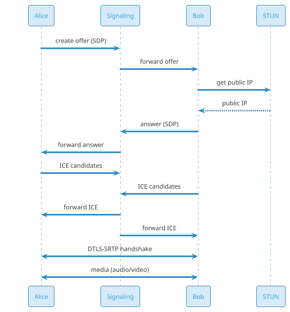
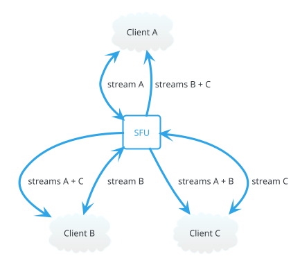
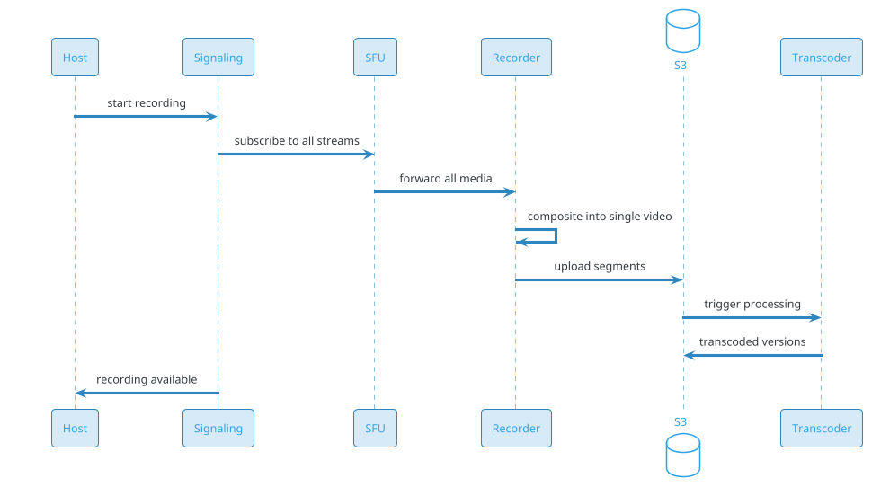

# Video Conferencing (Zoom / Teams / Google Meet)

## Problem Statement

Design a video conferencing system like Zoom, Google Meet, or Microsoft Teams. Users create meetings, join with audio/video, share screens, chat, and record. The system must support 1:1 calls, small group meetings (up to 100), webinars (up to 10,000 viewers), and live streaming, with sub-150ms end-to-end latency for interactive calls.

**Example:**

```
Meeting flow:
  1. Alice creates a meeting → gets meeting link (meet.example.com/abc-def-ghi)
  2. Invites Bob, Carol, Dave (via email, calendar)
  3. At meeting time, all join via link
  4. WebRTC establishes peer connections
  5. Audio/video flows (SFU-based for >2 participants)
  6. Screen share starts (new stream added)
  7. Chat messages (in-meeting)
  8. Recording starts (server-side)
  9. Meeting ends → recording processed and available

Key challenges:
  - Ultra-low latency (< 150ms for interactive)
  - Adaptive bitrate (bad network)
  - Screen share (higher resolution)
  - Recording (server-side compositing)
  - Large meetings (100+ participants)
  - Webinars (10,000+ viewers, one-to-many)
  - Global scale (users worldwide)
  - NAT traversal (WebRTC complexity)

Scale:
  - 500M MAU
  - 20M DAU
  - 100M meetings/day (avg 5 min)
  - 10M concurrent participants peak
  - 30% video, 100% audio
  - Recordings: 5M hours/day
```

**Real-world systems:** Zoom, Google Meet, Microsoft Teams, WebEx, Jitsi, Daily.co, Twilio Video.

**Why it's interesting:**

- **WebRTC** — real-time communication protocol
- **SFU vs MCU** — media routing architecture
- **NAT traversal** — STUN, TURN, ICE
- **Adaptive bitrate** — simulcast, SVC
- **Latency budget** — < 150ms for interactivity
- **Global deployment** — edge PoPs, low latency
- **Recording** — server-side compositing
- **Live streaming** — RTMP, HLS
- **Scale** — millions of concurrent participants
- **Bandwidth** — huge (video = 1-3 Mbps per stream)

---

## 1. Requirements Clarification

### Functional Requirements
- **Create meeting**: Schedule or instant
- **Join meeting**: Via link, calendar, dial-in
- **Audio**: Bidirectional, echo cancellation, noise suppression
- **Video**: 1:1, group (up to 100), HD
- **Screen share**: Full screen or window
- **Chat**: In-meeting text messages
- **Recording**: Cloud or local
- **Virtual backgrounds**: Blur, image, video
- **Mute/unmute**: Individual and host control
- **Waiting room**: Host admits participants
- **Breakout rooms**: Small group sessions
- **Live captions**: Real-time transcription
- **File sharing**: Send files in chat
- **Reactions**: Emoji reactions
- **Webinars**: One-to-many, up to 10,000
- **Live streaming**: RTMP/HLS output

### Non-Functional Requirements
- **Scale**: 20M DAU, 10M concurrent participants peak
- **Latency**: < 150 ms end-to-end (audio), < 200 ms (video)
- **Availability**: 99.99% — meetings are real-time
- **Quality**: Adaptive bitrate, tolerate 5-10% packet loss
- **Bandwidth**: 1-3 Mbps per stream (HD)
- **Security**: E2EE option, encrypted in transit (DTLS-SRTP)
- **Global**: Sub-100 ms to nearest PoP
- **Recording**: 5M hours/day, retained per policy
- **Compliance**: HIPAA, GDPR, SOC 2

### Out of Scope
- Traditional phone dial-in (PSTN) — mentioned briefly
- Hardware room systems (Zoom Rooms)
- Advanced analytics (engagement, sentiment)

---

## 2. Back-of-Envelope Estimation

### Traffic

```
Given:
  MAU                  = 500,000,000
  DAU                  = 20,000,000
  Meetings/day         = 100,000,000
  Avg meeting size     = 5 participants
  Concurrent peak      = 10,000,000 participants
  Avg call duration    = 15 min
  Recordings/day       = 5,000,000 meeting-hours

Signaling:
  Join events/day      = 100M x 5 = 500M
  Signaling QPS        = 500M / 86,400 = ~5,787/sec
  Peak signaling       = ~29,000/sec

Media streams:
  Concurrent streams   = 10M participants x 1 = 10M upstream
  + 10M x 4 downstream (group call) = 40M downstream
  Total streams        = 50M

Media bandwidth:
  Video at 1 Mbps avg x 50M streams = 50 Tbps peak
  Audio at 50 Kbps x 10M = 500 Gbps
  Screen share at 2 Mbps x 1M = 2 Tbps
  Total peak: ~53 Tbps

This is HUGE — video conferencing is one of the highest-bandwidth systems.
```

### Storage

```
Recordings:
  5M meeting-hours/day
  Each hour ~500 MB (compressed 720p)
  = 2.5 PB/day
  Retained 90 days: ~225 PB
  Retained 1 year: ~900 PB

Meeting metadata:
  100M meetings/day x 2 KB = 200 GB/day
  Retained 1 year: ~73 TB

Chat messages:
  100M meetings x 50 messages x 500 bytes = 2.5 TB/day
  Retained 1 year: ~912 TB

Transcripts:
  5M hours/day x 30 KB (text) = 150 GB/day
  Retained 1 year: ~55 TB

Total: ~1 PB (hot) + ~900 PB (cold recordings)
```

### Bandwidth

```
Total media: ~53 Tbps peak (from above)

Signaling:
  29,000/sec x 5 KB = 145 MB/sec

Recording:
  5M hours/day = ~208K concurrent recording streams
  Server-side compositing: ~2-3 streams per meeting
  Total: ~500 Gbps internal

Total: ~55 Tbps peak
```

### Latency Budget

```
End-to-end (Alice speaks, Bob hears):
  Alice mic → capture:           ~20 ms
  Encode (Opus):                 ~10 ms
  Network to SFU:                ~20-50 ms
  SFU forwarding:                ~5 ms
  Network to Bob:                ~20-50 ms
  Jitter buffer:                 ~20-40 ms
  Decode:                        ~5 ms
  Bob speaker:                   ~5 ms
  Total:                         ~100-190 ms

Target: < 150 ms p99 for interactive audio.
Video can tolerate slightly more (~200 ms).
```

---

## 3. High-Level Design

```d2
direction: down

alice: Alice (Client) {shape: person}
bob: Bob (Client) {shape: person}
carol: Carol (Client) {shape: person}

cdn: CDN (static) {shape: cloud}
edge: Edge PoP (nearest) {shape: cloud}

lb: Load Balancer {shape: hexagon}
api: API Gateway {shape: hexagon}

signaling: "Signaling Server (WebSocket)" {shape: rectangle}
sfu: "SFU (Selective Forwarding Unit)" {shape: rectangle}
mcu: "MCU (for large meetings)" {shape: rectangle}
recording: "Recording Service" {shape: rectangle}
chat: "Chat Service" {shape: rectangle}
transcript: "Transcription Service" {shape: rectangle}

turn: "TURN Server" {shape: rectangle}
stun: "STUN Server" {shape: rectangle}

kafka: Kafka {shape: queue}

pdb: "PostgreSQL (users, meetings)" {shape: cylinder}
redis: "Redis (sessions, presence)" {shape: cylinder}
s3: "S3 (recordings, files)" {shape: cylinder}
ch: "ClickHouse (analytics)" {shape: cylinder}

alice -> edge
bob -> edge
carol -> edge

edge -> lb
lb -> api

api -> signaling
api -> chat

signaling -> sfu
signaling -> mcu

alice <-> sfu : WebRTC media
bob <-> sfu : WebRTC media
carol <-> sfu : WebRTC media

sfu -> recording
sfu -> transcript

alice <-> turn : relay if needed
turn <-> stun

signaling -> redis
api -> pdb
recording -> s3
transcript -> s3
sfu -> kafka
kafka -> ch
```

### Component Responsibilities

| Component | Role |
|---|---|
| CDN | Static assets (web app, JS, CSS) |
| Edge PoP | Anycast routing, closest to user |
| Load Balancer | Route to signaling/SFU |
| API Gateway | Auth, rate limiting, routing |
| Signaling Server | WebSocket for SDP, ICE, control |
| SFU | Selective Forwarding Unit — routes media |
| MCU | Multipoint Control Unit — mixes streams (legacy) |
| Recording Service | Server-side recording, compositing |
| Chat Service | In-meeting text chat |
| Transcription Service | Real-time captions |
| TURN Server | NAT traversal relay |
| STUN Server | NAT discovery |
| Kafka | Event bus |
| PostgreSQL | Users, meetings, scheduling |
| Redis | Sessions, presence, room state |
| S3 | Recordings, files |
| ClickHouse | Quality analytics |

### Why This Architecture

- **SFU** is the modern standard (vs MCU)
- **WebRTC** for peer-to-peer media (with SFU relay)
- **STUN/TURN** for NAT traversal
- **Signaling via WebSocket** for SDP exchange
- **Edge PoPs** for low-latency media
- **Recording** separate (async, expensive)
- **Kafka** for events (analytics, recording triggers)

---

## 4. Deep Dive: WebRTC Fundamentals

### What is WebRTC?

**WebRTC** (Web Real-Time Communication) is a browser API and protocol suite for peer-to-peer audio/video/data.

**Key components:**

- **getUserMedia**: Access mic/camera
- **RTCPeerConnection**: Manage media connection
- **RTCDataChannel**: Peer-to-peer data
- **SDP**: Session Description Protocol (codec, media info)
- **ICE**: Interactive Connectivity Establishment
- **STUN**: Session Traversal Utilities for NAT
- **TURN**: Traversal Using Relays around NAT
- **DTLS-SRTP**: Encryption

### Connection Establishment



### SDP (Session Description Protocol)

Describes the media session:
```
v=0
o=- 1234 2 IN IP4 127.0.0.1
s=-
t=0 0
m=audio 9 UDP/TLS/RTP/SAVPF 111
a=rtpmap:111 opus/48000/2
m=video 9 UDP/TLS/RTP/SAVPF 96
a=rtpmap:96 VP8/90000
```

Contains:
- Codecs supported
- Media types (audio, video, data)
- ICE candidates
- DTLS fingerprints

### ICE (Interactive Connectivity Establishment)

Finds the best path between peers:

1. **Host candidates**: Local IPs
2. **Server-reflexive**: Public IP (via STUN)
3. **Relay**: Via TURN server (fallback)

**Candidate pairs** tested in order of priority. Best path wins.

### STUN

Simple protocol: "What's my public IP?"

Client sends request to STUN server; server responds with observed public IP.

**Used for:** Discovery of NAT mapping.

### TURN

Relay server for when direct connection fails (symmetric NAT, firewall).

**Cost:** Bandwidth through TURN is expensive (~10-30% of connections).

**Optimization:** Use TURN only when necessary (ICE falls back).

### Encryption

- **DTLS** for key exchange
- **SRTP** for media encryption
- **Mandatory** in WebRTC

**E2EE option:** Insertable Streams (encoded transform) allows end-to-end encryption bypassing SFU.

---

## 5. Deep Dive: SFU vs MCU vs Mesh

### Three Architectures

**Mesh (P2P):**
- Each participant connects to every other
- N participants = N(N-1)/2 connections
- Only viable for 2-4 participants
- Pros: Low latency, no server
- Cons: Doesn't scale

**MCU (Multipoint Control Unit):**
- Server mixes all streams into one
- Each participant receives one stream
- Pros: Client is simple, bandwidth-efficient
- Cons: Server CPU-intensive, higher latency

**SFU (Selective Forwarding Unit):**
- Server forwards streams without mixing
- Each participant receives N-1 streams
- Pros: Low latency, server CPU-efficient
- Cons: Higher client bandwidth

### Comparison

| Aspect | Mesh | MCU | SFU |
|---|---|---|---|
| Participants | 2-4 | 10-50 | 10-500 |
| Server CPU | None | High | Low |
| Client bandwidth | N² | Low | N × 1 |
| Latency | Lowest | High | Low |
| Quality | Best | Lossy | Original |
| Cost | Free | Expensive | Cheap |

**Modern standard: SFU.**

### SFU Architecture



**Flow:**
- Alice sends stream to SFU
- SFU forwards to Bob and Carol
- Bob sends stream to SFU; forwarded to Alice and Carol
- etc.

**Each client:** 1 upstream, N-1 downstream.

### SFU Features

- **Simulcast**: Client sends multiple qualities; SFU forwards best for each recipient
- **SVC (Scalable Video Coding)**: Layered encoding, forward sub-layers
- **Selective forwarding**: Only forward active speakers
- **Bandwidth management**: Per-recipient quality adjustment
- **Packet loss handling**: Retransmit, FEC

### When to Use MCU

- **Very large meetings** (100+): SFU would require N² bandwidth at SFU
- **Low-bandwidth clients**: One stream is better than N
- **Recording/mixing**: Server needs a mixed output

**Recommendation:** SFU for most; MCU for very large or specific cases.

### Our Choice

**SFU for 2-100 participants.**
**MCU/hybrid for 100-1000.**
**Live streaming (RTMP/HLS) for 1000+ viewers.**

---

## 6. Deep Dive: Simulcast and Adaptive Bitrate

### The Problem

Clients have different network conditions:
- Alice: 100 Mbps fiber
- Bob: 5 Mbps mobile

Alice sends high-quality video; Bob can't receive it.

### Simulcast

Client sends **multiple encodings** of the same stream:
- Low: 180p @ 200 kbps
- Medium: 360p @ 500 kbps
- High: 720p @ 1.5 Mbps

**SFU forwards the best layer for each recipient.**

```
Alice's stream:
  Layer 0: 180p @ 200 kbps
  Layer 1: 360p @ 500 kbps
  Layer 2: 720p @ 1.5 Mbps

SFU sends:
  To Alice (fiber): Layer 2
  To Bob (mobile): Layer 0
  To Carol (DSL): Layer 1
```

### SVC (Scalable Video Coding)

Alternative: Single encoded stream with layers. SFU forwards subsets.

**Pros:** Less client CPU (one encoder)
**Cons:** Less efficient compression; harder to implement

**Simulcast is more common** in production.

### Adaptive Bitrate

Continuously monitor network; switch layers:

```
1. Client sends RTCP Receiver Reports (packet loss, jitter)
2. SFU adjusts which layer to forward
3. If congestion, downgrade to lower layer
4. If network improves, upgrade
```

**Latency:** Switch within 100-500 ms.

### Bandwidth Estimation

- **REMB** (Receiver Estimated Max Bitrate): Client reports available bandwidth
- **Transport-CC**: Feedback on packet timing
- **Google Congestion Control**: Algorithms for estimation

### Handling Packet Loss

- **NACK**: Retransmit lost packets
- **FEC** (Forward Error Correction): Redundancy for recovery
- **PLC** (Packet Loss Concealment): Predict lost audio

### Screen Share

Different characteristics:
- Higher resolution (1080p+)
- Lower framerate (5-15 fps)
- Text-heavy (needs sharpness)
- Content changes rarely → less bandwidth needed

**Encoding:** Use screen-specific codecs (e.g., VP9 with screen content mode).

### Bandwidth Summary

| Content | Resolution | Bitrate | Framerate |
|---|---|---|---|
| Audio (Opus) | - | 20-50 kbps | - |
| Video 180p | 320x180 | 200 kbps | 30 |
| Video 360p | 640x360 | 500 kbps | 30 |
| Video 720p | 1280x720 | 1.5 Mbps | 30 |
| Video 1080p | 1920x1080 | 3 Mbps | 30 |
| Screen share | 1920x1080 | 1-2 Mbps | 5-15 |
| Thumbnail | 160x90 | 50 kbps | 15 |

**Typical 1:1 call:** ~2 Mbps per direction.

**Typical 5-person call:** ~6 Mbps downstream per user.

---

## 7. Deep Dive: Signaling

### What is Signaling?

**Signaling** is the exchange of control messages between clients (via server) to establish and manage connections:

- SDP offer/answer
- ICE candidates
- Room join/leave
- Mute/unmute
- Screen share start/stop
- Chat messages

**Not media** — media flows peer-to-peer or via SFU.

### Signaling Server

- **WebSocket** connection (persistent)
- Authenticates user
- Assigns SFU
- Relays messages
- Manages room state

### Protocol

```
1. Client connects via WebSocket
2. Sends AUTH
3. Server validates, adds to room
4. Server sends room state (participants, existing streams)
5. Client creates RTCPeerConnection, generates offer
6. Sends offer via signaling to SFU
7. SFU responds with answer
8. ICE candidates exchanged
9. Media flows
10. Control messages relayed as needed
```

### Room Management

- **Room**: A meeting (unique ID)
- **Participants**: Users in the room
- **Streams**: Each participant's audio/video/screen
- **State**: Who's muted, who's speaking, recording status

### Redis for Room State

```
Key: room:{meeting_id}:state
Type: Hash
Fields: participants, host, started_at, recording, locked
TTL: Meeting duration + 1 hour

Key: room:{meeting_id}:participants
Type: Set
Value: user_ids

Key: user:{user_id}:meeting
Value: meeting_id
TTL: Meeting duration

Key: room:{meeting_id}:chat
Type: List
Value: messages (last 1000)
```

### Presence

- **Heartbeat**: Client sends every 5 sec
- **Timeout**: 15 sec → considered dropped
- **Reconnect**: Client re-joins, state restored

### Signaling Scale

- **WebSocket servers**: 10K connections each
- **10M concurrent** → 1000 servers
- **Messages/sec**: ~50K (join, leave, control)

---

## 8. Deep Dive: Recording

### Why Recording?

- Compliance (healthcare, finance)
- Later viewing
- Training
- Transcription

### Recording Modes

**Cloud recording:**
- Server-side (SFU-based)
- Storage in S3
- Processing (transcoding, compositing)

**Local recording:**
- Client-side
- Stored on user's device

**Cloud recording is standard** for enterprise.

### Cloud Recording Architecture



### Recording Implementation

**Server-side SFU subscribes to all streams:**
- Audio: mix all participants
- Video: composite (grid layout) or individual streams

**Two recording types:**
1. **Composite**: Grid view, single file
2. **Individual streams**: Per-participant

**Storage:** HLS segments (.ts) + playlist (.m3u8) + MP4 for download.

### Compositing

For grid layout, SFU/Recorder:
1. Decodes each participant's video
2. Renders to a canvas (grid)
3. Encodes as single video
4. Streams to storage

**CPU-intensive:** ~1-2 vCPU per 720p stream.

### Storage Optimization

- **H.264/H.265**: Efficient codecs
- **Segment length**: 4-6 sec (HLS standard)
- **Lifecycle**: Move older recordings to Glacier
- **Tiered**: Hot (30 days) → warm (1 year) → cold (5 years)

### Recording Costs

```
5M meeting-hours/day
500 MB per hour
= 2.5 PB/day
= 75 PB/month
= 900 PB/year

At S3 Standard ($0.023/GB):
  ~$20M/month

At S3 Glacier ($0.004/GB):
  ~$3.6M/month
```

**Recording is expensive.** Most platforms:
- Default off
- User-initiated
- Paid feature (cloud recording)

### Recording Playback

- **Streaming**: HLS (adaptive)
- **Download**: MP4
- **Transcripts**: Time-synced
- **Chapters**: Auto-generated (AI)

### Recording Encryption

- **At rest**: AES-256 (S3 encryption)
- **In transit**: TLS
- **Access control**: Only participants (or admin)

### Compliance

- **HIPAA**: Encryption, access controls, BAA
- **GDPR**: Consent, right to erasure
- **Legal hold**: Preserve for litigation

---

## 9. Deep Dive: Large Meetings and Webinars

### Scale Tiers

| Type | Participants | Architecture |
|---|---|---|
| 1:1 call | 2 | SFU (or P2P) |
| Small meeting | 3-25 | SFU |
| Large meeting | 25-100 | SFU (optimized) |
| Webinar | 100-10,000 | SFU + RTMP/HLS |
| Live stream | 10,000+ | RTMP/HLS |

### Large Meeting Optimization (> 25)

**Problem:** SFU must handle N² streams. For 100 participants, that's 10K stream pairs.

**Solutions:**
- **Active speaker only**: Only forward active speaker's video, thumbnails for others
- **Simulcast**: Send lower quality for non-active
- **MCU for small subsets**: Mix when needed
- **Selective forwarding**: Only forward to subscribers

**Typical behavior:**
- Active speaker: Full quality
- Others: Low-quality thumbnails
- Pinned: Full quality if user pins

### Webinars (100-10,000)

**One-to-many model:**
- Presenters (1-10): Send video/audio
- Attendees (100-10,000): Receive only
- Interaction: Q&A, polls, chat

**Architecture:**
- Presenters → SFU → RTMP → CDN → Attendees
- Or: Presenters → SFU → HLS → CDN → Attendees

**Latency:** 5-30 sec (vs <150 ms for interactive).

**Trade-off:** Scale over latency.

### Live Streaming

For 10,000+ viewers:

```
1. Presenter sends RTMP to ingest server
2. Ingest transcodes to HLS (multiple bitrates)
3. HLS segments distributed via CDN
4. Viewers pull HLS from CDN (adaptive)
```

**Latency:** 10-30 sec (HLS), 3-5 sec (LL-HLS), <1 sec (WebRTC).

**Trade-off:** Latency vs scale.

### Hybrid Approach

- **Presenters**: WebRTC (low latency)
- **Interactive attendees** (small group): WebRTC via SFU
- **Broadcast attendees** (large group): HLS via CDN

**Use case:** Webinar with 10 presenters + 100 interactive + 10,000 viewers.

### Breakout Rooms

Split meeting into small groups:
- Each breakout is a separate SFU room
- Participants move between rooms
- Host can broadcast to all

**Implementation:** Room IDs generated dynamically; participants rejoin.

---

## 10. Deep Dive: NAT Traversal

### The Problem

Most users are behind NAT (home router, corporate firewall). They can't accept incoming connections.

**NAT:** Translates private IPs to public IP. Inbound connections blocked.

### STUN (Session Traversal Utilities for NAT)

Client asks STUN server: "What's my public IP:port?"

Server responds with observed IP.

Client now knows its public address; can advertise it in ICE.

**Simple, cheap, works for 80% of cases.**

### TURN (Traversal Using Relays around NAT)

When direct connection fails (symmetric NAT, strict firewall), use a relay:

```
Alice → TURN server → Bob
```

**TURN relays all media** — expensive.

**Cost:** TURN traffic is 10-30% of total; bandwidth is expensive.

### ICE (Interactive Connectivity Establishment)

The algorithm that ties it together:

```
1. Gather candidates:
   - Host (local IPs)
   - Server-reflexive (via STUN)
   - Relay (via TURN)
2. Exchange candidates via signaling
3. Form candidate pairs
4. Test pairs in priority order
5. Use first working pair
```

**Priority:** Host > Server-reflexive > Relay.

### TURN Server Deployment

- **Global edge PoPs**: Closest to users
- **Bandwidth**: 1-3 Mbps per relayed stream
- **Cost**: Significant (egress)

**Optimization:** Use TURN only when necessary; prefer direct.

### Enterprise Firewalls

Corporate networks often block UDP (WebRTC's transport). Fallback:
- **TURN over TCP**: Higher latency but works
- **TURN over TLS (443)**: Looks like HTTPS
- **TURN over WebSocket**: For very restrictive networks

---

## 11. Deep Dive: Quality of Experience (QoE)

### Metrics

| Metric | Target | Notes |
|---|---|---|
| Audio latency | < 150 ms | End-to-end |
| Video latency | < 200 ms | |
| Jitter | < 30 ms | Variance in packet arrival |
| Packet loss | < 1% | Concealed by FEC/PLC |
| Audio quality | MOS > 4.0 | Mean Opinion Score |
| Video quality | VMAF > 80 | Objective quality |
| Join time | < 3 sec | From click to in-meeting |
| Video startup | < 500 ms | First frame |

### Adaptive Responses

- **Congestion:** Downgrade video quality, prioritize audio
- **Packet loss:** FEC, retransmit, concealment
- **Jitter:** Increase buffer (trade-off with latency)
- **CPU-bound:** Reduce resolution/framerate

### Bandwidth Management

- **Per-stream budget**: Allocate based on priority
- **Active speaker priority**: Full quality
- **Thumbnails**: Low quality
- **Screen share**: High quality when active

### Echo Cancellation

**Problem:** Speaker output feeds back into mic.

**Solution:** 
- AEC (Acoustic Echo Cancellation): ML/algorithm in client
- WebRTC has built-in AEC

### Noise Suppression

- **Background noise**: ML-based (Krisp, RNNoise)
- **Voice isolation**: Only speaker's voice
- **Client-side** processing

### Virtual Backgrounds

- **Blur**: Simple segmentation
- **Image/Video**: Replace background
- **ML-based**: Person segmentation (TensorFlow.js, etc.)
- **Hardware acceleration**: Where available

### Quality Monitoring

- **Client-side metrics**: Sent via RTCP
- **Server-side metrics**: Aggregate from SFU
- **Correlation**: User reports + metrics
- **Alerts**: If quality drops

### Fallback Modes

- **Audio-only**: When video is impossible
- **Lower resolution**: When bandwidth is limited
- **Dial-in**: When internet is down (phone)

---

## 12. Scaling Considerations

### Read Scaling

- **Signaling**: WebSocket (persistent)
- **SFU**: Media forwarding (linear scale with CPU)
- **Redis**: Room state (sharded by room_id)
- **PostgreSQL**: Read replicas
- **CDN**: Static assets, recording playback

### Write Scaling

- **Signaling**: WebSocket messages (high volume)
- **SFU**: Media (high bandwidth)
- **Recording**: S3 writes (batched)
- **Kafka**: Events (analytics)

### Sharding

**Rooms:** Shard by `room_id`.
**SFU:** Each room assigned to one SFU (stateful).
**Redis:** Shard by `room_id`.
**PostgreSQL:** Shard by `user_id` (personal data), `room_id` (meetings).

### Multi-Region

```d2
direction: down

us: "US Region" {
  shape: cloud
}
eu: "EU Region" {
  shape: cloud
}
apac: "APAC Region" {
  shape: cloud
}

ussfu: "US SFU Cluster" {
  shape: cylinder
}
eusfu: "EU SFU Cluster" {
  shape: cylinder
}
apacs: "APAC SFU Cluster" {
  shape: cylinder
}

us -> ussfu
eu -> eusfu
apac -> apacs
```

**GeoDNS** routes to nearest region.
**Cross-region meetings:** SFU in one region; other region connects.
**Latency:** < 50 ms within region; 100-200 ms cross-region.

**Optimization:** **Cascaded SFUs** for cross-region:
- Region A SFU → Region B SFU (single stream between)
- Region B SFU distributes to local users

### Scaling SFU

- **Per-SFU capacity**: ~500-1000 concurrent streams (depending on CPU)
- **10M concurrent participants** → ~10K-20K SFU servers
- **Auto-scale** based on active rooms
- **Room stickiness**: All participants of a room on same SFU

### Handling Load Spikes

**Events:**
- Monday morning (work meetings): 5x normal
- Breaking news: 10x
- Large webinars: burst

**Mitigations:**
- Pre-warm capacity
- Auto-scale
- Queue join requests (waiting room)
- Degrade (audio-only)

### Cost Optimization

| Component | Optimization |
|---|---|
| SFU | CPU-optimized instances; reserved capacity |
| TURN | Use only when needed; edge PoPs |
| Recording | Only when opted-in; tiered storage |
| CDN | Cache recording playback |
| Compute | Spot for non-critical (recording processing) |

### Bandwidth Costs

**Video conferencing is bandwidth-heavy.**

At 50 Tbps peak:
- If all through cloud: $0.02/GB × 50 Tbps × 86400 × 30 = astronomical
- Optimization: peer-to-peer when possible, TURN only as fallback

**Best practice:** Edge PoPs, direct peering, ISP partnerships.

---

## 13. Bottlenecks and Trade-offs

| Concern | Solution | Trade-off |
|---|---|---|
| Latency | Edge PoPs, SFU | Cost, complexity |
| Scale | SFU + MCU hybrid | Complexity |
| Bandwidth | Simulcast, adaptive | Client complexity |
| Quality | FEC, NACK, PLC | Bandwidth overhead |
| TURN | Use only when needed | Fallback latency |
| Recording | Async, server-side | CPU cost |
| Large meetings | Active speaker + thumbnails | UX |
| Webinars | RTMP/HLS | Latency |
| Multi-region | Cascaded SFUs | Complexity |
| E2EE | Insertable streams | Complex key mgmt |

### Design Decisions Summary

| Decision | Choice | Rationale |
|---|---|---|
| Architecture | SFU (vs MCU/Mesh) | Balance latency/scale |
| Media protocol | WebRTC | Standard, low latency |
| Signaling | WebSocket | Persistent, low latency |
| NAT traversal | STUN + TURN | Fallback coverage |
| Adaptive bitrate | Simulcast | Best quality per user |
| Recording | Cloud, server-side | Standard |
| Large meetings | Active speaker + thumbnails | Scale |
| Webinars | RTMP/HLS | Scale over latency |
| Multi-region | Cascaded SFUs | Low latency |

---

## 14. Failure Scenarios

### SFU Down

**Impact:** All participants in that room disconnected.

**Mitigation:**
- Auto-reconnect to new SFU
- Room state in Redis (restored)
- Alert ops
- Root cause analysis

### Signaling Server Down

**Impact:** Users can't join; existing calls continue (media is peer-to-SFU).

**Mitigation:**
- Multi-server signaling (sharded by room)
- Auto-reconnect
- Fallback to different server

### Redis Down

**Impact:** Room state lost; presence broken.

**Mitigation:**
- Redis Sentinel for HA
- Rebuild from SFU state
- Alert ops

### TURN Server Down

**Impact:** Users behind strict NAT can't connect.

**Mitigation:**
- Multiple TURN servers
- Health checks
- Fallback to TCP/TLS TURN
- Alert ops

### Recording Failure

**Impact:** Meeting not recorded.

**Mitigation:**
- Retry
- Recording as separate service
- Alert host
- Post-call: attempt reconstruction from SFU logs (limited)

### Network Congestion

**Impact:** Poor video quality; dropouts.

**Mitigation:**
- Adaptive bitrate
- Audio priority
- Degrade video
- Switch to audio-only

### DDoS on Signaling

**Impact:** Service unavailable.

**Mitigation:**
- CDN/WAF
- Rate limiting
- CAPTCHA on join
- Waiting room

### Zoom-bombing

**Impact:** Unwanted participants disrupt meeting.

**Mitigation:**
- Waiting room
- Password-protected meetings
- Meeting locks
- Reporting

### Data Breach

**Impact:** Meeting content exposed.

**Mitigation:**
- DTLS-SRTP (encrypted)
- E2EE option
- Access controls
- Incident response

### Cross-Region Latency

**Impact:** Poor experience for remote participants.

**Mitigation:**
- Cascaded SFUs
- Local PoPs
- Route optimization
- Accept latency for cross-region

### Recording Compliance

**Impact:** Legal issues if recording without consent.

**Mitigation:**
- Notification to participants
- Consent capture
- Access controls
- Retention policies

---

## 15. Monitoring and Alerts

### Key Metrics

| Metric | Target | Alert Threshold |
|---|---|---|
| Join success rate | > 99% | < 95% |
| Join time p99 | < 3 sec | > 5 sec |
| Audio latency p99 | < 150 ms | > 250 ms |
| Video latency p99 | < 200 ms | > 300 ms |
| Packet loss rate | < 1% | > 3% |
| Jitter p99 | < 30 ms | > 50 ms |
| MOS (audio) | > 4.0 | < 3.5 |
| Video freeze rate | < 1% | > 5% |
| SFU CPU | < 70% | > 85% |
| TURN usage rate | < 20% | > 30% |
| Recording success | > 99% | < 95% |
| Signaling p99 | < 50 ms | > 200 ms |

### Dashboards

- **Live**: Active meetings, participants, streams
- **Quality**: MOS, packet loss, jitter distribution
- **Latency**: p50/p95/p99 per stage
- **SFU**: CPU, bandwidth, streams per SFU
- **TURN**: Relayed streams, cost
- **Recording**: Active recordings, S3 uploads
- **Signaling**: Connections, messages/sec
- **Errors**: Join failures, disconnects
- **Business**: DAU, meeting duration, retention

### Alerts

- **P0**: SFU cluster down, signaling down, mass disconnects
- **P1**: Join success < 95%, audio MOS < 3.5
- **P2**: TURN usage > 30%, recording failure > 5%
- **P3**: High packet loss, jitter spike

### Business KPIs

- **DAU/MAU** ratio
- **Meetings per user** (per week)
- **Meeting duration** (avg)
- **Participant count** (avg)
- **Screen share usage**
- **Recording usage**
- **Churn** (subscription)
- **NPS**

---

## 16. Cost Estimation

Rough monthly cost (AWS, us-east-1) for 20M DAU:

| Component | Spec | Cost/month |
|---|---|---|
| Signaling servers | 1000 x c6g.large | ~$60,000 |
| SFU servers | 15,000 x c6g.2xlarge (CPU-optimized) | ~$5,400,000 |
| MCU (large meetings) | 100 x c6g.4xlarge | ~$150,000 |
| TURN servers | 500 x c6g.xlarge | ~$120,000 |
| Recording servers | 2000 x c6g.large | ~$120,000 |
| PostgreSQL | 20 shards x db.r6g.2xlarge | ~$46,000 |
| Redis cluster | 100 x cache.r6g.2xlarge | ~$50,000 |
| Kafka (MSK) | 20 brokers | ~$10,000 |
| ClickHouse | 10 x i3.2xlarge | ~$10,000 |
| S3 (recordings) | 75 PB/month | ~$1,725,000 |
| S3 Glacier (archive) | 900 PB | ~$3,600,000 |
| CDN (recording playback) | 20 PB/month | ~$400,000 |
| Monitoring | Datadog | ~$50,000 |
| **Bandwidth (egress)** | 50 Tbps peak | ~$5,000,000+ |
| **Total** | | **~$16.7M/month** |

**Per user:** ~$0.83/month.

**Cost optimization:**
- **SFU compute** dominates — right-size, use spot where possible
- **Bandwidth** — peer-to-peer when possible, TURN only as needed
- **Recording** — default off, tiered storage
- **Reserved instances** — 30-40% savings on SFU
- **Edge PoPs** — negotiate with ISPs

**Note:** Video conferencing is **one of the most expensive** systems per user. Zoom's gross margin is ~75%, driven by efficient infrastructure.

---

## 17. Extensions and Follow-ups

### E2EE (End-to-End Encryption)

- Insertable Streams (browser API)
- Each client encrypts; SFU forwards without decrypting
- Key distribution via signaling
- Trade-off: No server-side recording/transcription

### Live Transcription

- Speech-to-text (Whisper, Google)
- Real-time captions
- Multi-language
- Post-meeting transcripts

### AI Meeting Assistant

- Summary
- Action items
- Highlights
- Sentiment analysis
- Search within meetings

### Virtual Backgrounds

- Blur
- Image
- Video
- ML-based segmentation
- GPU acceleration

### Noise Suppression

- ML-based (Krisp, RNNoise)
- Voice isolation
- Background noise removal

### Gesture Recognition

- Thumbs up
- Hand raise
- Reactions via gestures

### Meeting Analytics

- Engagement (who spoke, who listened)
- Talk time per participant
- Sentiment
- Attendance

### Calendar Integration

- Google Calendar, Outlook
- Auto-create meetings
- Join from calendar
- Dial-in numbers

### Phone Dial-in (PSTN)

- Toll-free numbers
- SIP gateway
- Audio bridge
- Interoperability with phones

### Room Systems (Hardware)

- Zoom Rooms, Teams Rooms
- Dedicated hardware
- Auto-join from room
- Camera + speaker integration

### Virtual Events

- Large-scale events (10K+ attendees)
- Sponsor booths
- Networking
- Live streaming

### Hybrid Meetings

- Some in-room, some remote
- Room camera + speaker
- Fair experience for all

### Accessibility

- Live captions
- Sign language interpretation
- Transcript
- Screen reader support

### Industry-Specific

- **Telehealth**: HIPAA, e-prescription
- **Education**: Breakout rooms, hand raise
- **Legal**: Deposition, court reporting
- **Financial**: Compliance, recording

### Integration

- Slack, Teams, Discord
- Google Workspace
- CRM (Salesforce, HubSpot)
- Webinars (Zoom Webinars, On24)

### Web3

- Decentralized video (Livepeer, Huddle01)
- Blockchain identity
- Token-gated rooms

### Spatial Audio

- 3D audio positioning
- "Breakout" audio bubbles
- Immersive meetings

### VR/AR Meetings

- Meta Horizon Workrooms
- Immersive presence
- Shared 3D space

---

## 18. Summary

| Aspect | Decision |
|---|---|
| Media architecture | SFU (vs MCU/Mesh) |
| Media protocol | WebRTC |
| Signaling | WebSocket |
| NAT traversal | STUN + TURN |
| Adaptive bitrate | Simulcast + SVC |
| Recording | Cloud, server-side |
| Large meetings | Active speaker + thumbnails |
| Webinars | RTMP/HLS + CDN |
| Multi-region | Cascaded SFUs |
| E2EE | Insertable Streams (optional) |
| Scale | 20M DAU, 10M concurrent participants |
| Latency | < 150 ms audio, < 200 ms video |
| Availability | 99.99% |
| Cost | ~$16.7M/month (SFU + bandwidth dominate) |

**Key takeaways:**

- **SFU is the modern standard** — beats MCU and mesh for scale + latency
- **WebRTC** is the media protocol — low latency, browser-native
- **STUN + TURN** solve NAT traversal — TURN is expensive, use sparingly
- **Simulcast + SVC** enable adaptive bitrate per user
- **Signaling via WebSocket** establishes SDP/ICE, media flows peer-to-SFU
- **Recording is CPU-intensive** — cloud recording is a premium feature
- **Large meetings** use active speaker + thumbnails to scale
- **Webinars** use RTMP/HLS + CDN, trading latency for scale
- **Multi-region with cascaded SFUs** keeps cross-region latency low
- **Bandwidth dominates cost** — this is the most expensive system type
- **QoE metrics** (MOS, packet loss, jitter) drive adaptive responses
- **E2EE is complex** — insertable streams break server-side recording/transcription

### Similar Pattern Problems

- Online Messaging App (real-time delivery, WebSocket)
- Live Streaming (RTMP/HLS, CDN)
- Video Streaming (media delivery)
- Notification System (real-time delivery)
- Online Judge (resource-limited execution)
- Cloud Gaming (low-latency streaming)
- Voice Assistants (audio streaming)
- Collaborative Document Editor (real-time sync)