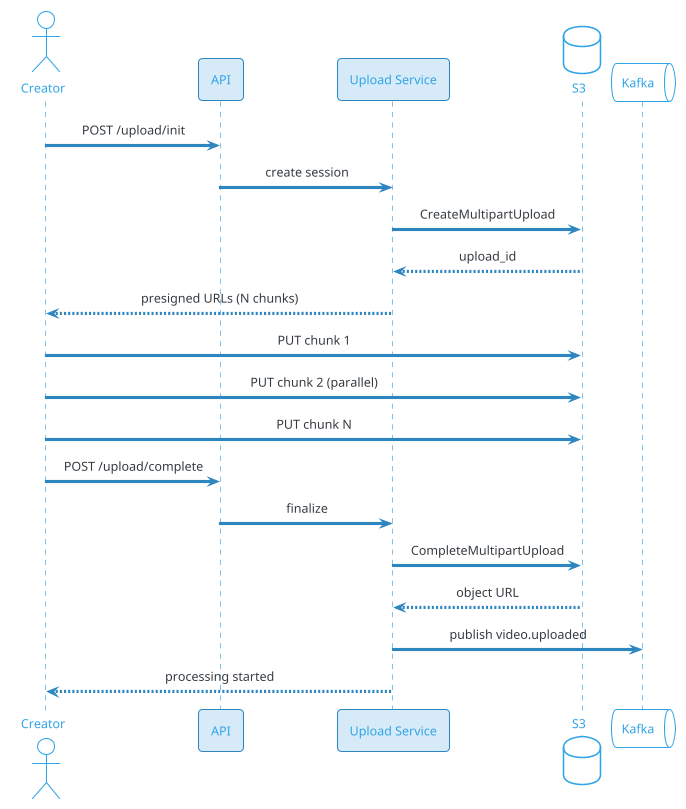
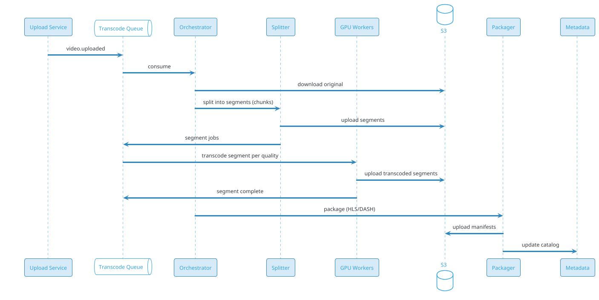
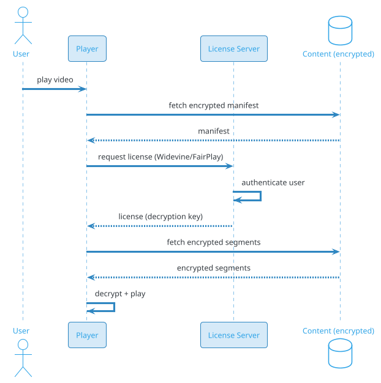

# Video Streaming Platform (VOD)

## Problem Statement

Design a video-on-demand (VOD) platform like YouTube, Netflix, or Hotstar. Users upload, transcode, store, and stream billions of hours of video. The system must handle massive upload volume, multi-resolution transcoding, global CDN delivery, adaptive bitrate streaming, personalized recommendations, and sub-second startup latency. Storage is in exabytes; egress is in petabytes per day.

**Example:**

```
Upload flow:
  1. Creator uploads 4K video (5 GB, 1 hour)
  2. Chunked upload to S3 (multi-part)
  3. Transcoding job triggered
  4. Video split into segments; transcoded to multiple resolutions:
     - 240p, 360p, 480p, 720p, 1080p, 1440p, 4K
     - HLS and DASH manifests
  5. Thumbnails generated (10 per video)
  6. Metadata indexed (title, tags, description)
  7. Video published

Viewing flow:
  1. User searches / browses catalog
  2. Opens video page → player loads
  3. Player fetches manifest (HLS m3u8)
  4. Player selects initial bitrate based on bandwidth
  5. Video segments streamed from CDN
  6. Player adapts bitrate as network changes
  7. User pauses/resumes, seeks, casts to TV

Scale:
  - 2B users, 500M DAU
  - 500 hours uploaded per minute (YouTube)
  - 1B hours watched per day
  - 5B videos total
  - 100 PB of egress per day
  - 500 CDN PoPs globally
```

**Real-world systems:** YouTube, Netflix, Hotstar, Amazon Prime Video, Vimeo, Twitch (for VOD).

**Why it's interesting:**

- **Exabyte storage** — petabytes of uploads daily
- **Transcoding at scale** — CPU/GPU intensive
- **Adaptive bitrate** — HLS/DASH, multiple qualities
- **Global CDN** — serving from hundreds of PoPs
- **Sub-second startup** — fast playback initiation
- **Personalization** — recommend next video
- **Search + discovery** — billions of videos
- **Live streaming** — separate but related
- **Cost** — egress dominates; optimization critical
- **DRM** — content protection (Netflix)

---

## 1. Requirements Clarification

### Functional Requirements
- **Upload**: Video files, chunked, resumable
- **Transcoding**: Multi-resolution, multi-codec
- **Storage**: Original + transcoded variants
- **Playback**: Adaptive bitrate streaming (HLS, DASH)
- **Search**: By title, description, tags, channel
- **Recommendations**: Personalized "up next"
- **Thumbnails**: Auto-generated, custom
- **Captions**: Uploaded or auto-generated
- **Chapters**: Metadata
- **Analytics**: View counts, watch time
- **Comments**: On videos
- **Subscriptions**: Follow channels
- **Playlists**: User-curated
- **Watch later**: Personal
- **Likes/Dislikes**: Ratings

### Non-Functional Requirements
- **Scale**: 500M DAU, 1B hours/day, 500 hours uploaded/min
- **Latency**: Playback start < 1 sec; seek < 500 ms
- **Availability**: 99.99% — video must play
- **Quality**: Adaptive bitrate, tolerate 5% packet loss
- **Durability**: Never lose original upload
- **Storage**: Exabyte scale
- **Bandwidth**: ~100 PB egress/day
- **Cost**: Egress dominates; optimization critical
- **DRM**: For premium content (Netflix)
- **Compliance**: DMCA, age restrictions, GDPR

### Out of Scope
- Live streaming (separate — Twitch)
- Music streaming (Spotify)
- Video editing (Creator Studio — separate)
- Ads auction (mentioned briefly)

---

## 2. Back-of-Envelope Estimation

### Traffic

```
Given:
  Users                = 2,000,000,000
  DAU                  = 500,000,000
  Watch time/user/day  = 2 hours
  Total watch time     = 1B hours/day
  Avg video length     = 10 min
  Avg bitrate          = 3 Mbps (mixed qualities)
  Uploads/min          = 500 hours
  Uploads/day          = 720,000 hours
  Videos uploaded/day  = ~5,000,000

Streaming:
  Concurrent viewers (peak) = 50,000,000
  Avg bitrate               = 3 Mbps
  Total egress              = 50M x 3 Mbps = 150 Tbps peak
  Daily egress              = 150 Tbps x 86400 = 1.62 EB/day
  Actually: ~100 PB/day realistic

Uploads:
  Upload rate    = 500 hours/min = 8.3 hours/sec
  Avg file size  = 5 GB/hour
  Upload bytes/s = 8.3 x 5 GB = ~41 GB/sec peak
  Daily upload   = ~3.6 PB/day

Requests:
  Video views/day = 20B (avg 3 min per view)
  QPS = 20B / 86,400 = ~231K/sec avg
  Peak = ~1.16M/sec
```

### Storage

```
Original videos (uploaded):
  720,000 hours/day
  Avg 5 GB/hour = 3.6 PB/day
  Retained forever: ~1.3 EB/year

Transcoded variants (7 resolutions):
  ~3x original size (with all variants)
  ~10.8 PB/day
  Retained forever: ~3.9 EB/year

Total video storage:
  ~5 EB in year 1
  ~20 EB in year 5

Thumbnails:
  5M videos/day x 10 thumbs x 100 KB = 5 TB/day

Metadata:
  5M videos/day x 5 KB = 25 GB/day

Captions/transcripts:
  720K hours/day x 50 KB = 36 GB/day

Total: ~5 EB/year (exabyte scale)
```

### Bandwidth

```
Egress (CDN to users):
  100 PB/day
  = ~1.16 GB/sec avg = ~9.3 Gbps
  Peak = ~150 Tbps

This is the DOMINANT cost.
$0.02-0.08 per GB egress from cloud.
100 PB/day x $0.05 = $5M/day = $150M/month
Actually CDN negotiated: ~$0.01-0.02/GB
= $30-60M/month minimum for CDN egress

Upload:
  ~3.6 PB/day (much less than egress)
```

### Latency Budget

```
Playback start:
  Client → API:                 ~50 ms
  Auth:                          ~10 ms
  Manifest fetch (CDN):          ~50 ms
  Player init:                   ~100 ms
  First segment fetch (CDN):     ~100 ms
  Decode + render:               ~50 ms
  Total:                         ~360 ms

Target: < 1 sec for first frame.

Seek:
  Segment fetch from CDN:        ~100-500 ms
  Depends on segment length (4-6 sec typical)

Adaptive bitrate switch:
  Detect congestion:             ~1-3 sec
  Fetch new quality segment:     ~100-500 ms
  Total:                         ~2-3 sec
```

---

## 3. High-Level Design

```d2
direction: down

user: User {shape: person}
creator: Creator {shape: person}

cdn: "CDN (500+ PoPs)" {shape: cloud}
edge: Edge PoP {shape: cloud}

lb: Load Balancer {shape: hexagon}
api: API Gateway {shape: hexagon}

upload: Upload Service {shape: rectangle}
transcode: Transcode Orchestrator {shape: rectangle}
meta: Metadata Service {shape: rectangle}
search: Search Service {shape: rectangle}
reco: Recommendation Service {shape: rectangle}
playback: Playback Service {shape: rectangle}
analytics: Analytics Service {shape: rectangle}
drm: DRM Service {shape: rectangle}

kafka: Kafka {shape: queue}
queue: "Transcode Queue" {shape: queue}

s3: "S3 (originals + transcoded)" {shape: cylinder}
pdb: "PostgreSQL (metadata)" {shape: cylinder}
redis: "Redis (cache)" {shape: cylinder}
es: "Elasticsearch (search)" {shape: cylinder}
ch: "ClickHouse (analytics)" {shape: cylinder}

creator -> cdn
cdn -> lb
lb -> api
api -> upload
upload -> s3
upload -> kafka
kafka -> transcode
transcode -> queue
queue -> transcode
transcode -> s3
transcode -> meta

user -> cdn
cdn -> edge
edge -> api
api -> meta
api -> search
api -> reco
api -> playback

playback -> s3
playback -> drm

search -> es
reco -> ch
reco -> redis

meta -> pdb
meta -> es
analytics -> ch
```

### Component Responsibilities

| Component | Role |
|---|---|
| CDN | Distribute video to users globally |
| Edge PoP | Nearest CDN node |
| API Gateway | Auth, routing |
| Upload Service | Handle chunked uploads to S3 |
| Transcode Orchestrator | Coordinate transcoding jobs |
| Transcode Workers | GPU/CPU workers for transcoding |
| Metadata Service | Video metadata (title, description) |
| Search Service | Full-text search over videos |
| Recommendation Service | "Up next" suggestions |
| Playback Service | Manifest generation, DRM |
| Analytics Service | View counts, watch time |
| DRM Service | License management |
| Kafka | Event bus |
| Transcode Queue | Job queue for transcoding |
| S3 | Video storage (originals + variants) |
| PostgreSQL | Metadata (relational) |
| Redis | Cache (hot metadata, sessions) |
| Elasticsearch | Search index |
| ClickHouse | Analytics |

### Why This Architecture

- **S3** for video storage (cost-effective, unlimited)
- **CDN** for delivery (essential for scale)
- **GPU workers** for transcoding (parallel, efficient)
- **Kafka** for async pipeline (upload → transcode → publish)
- **PostgreSQL** for metadata (relational)
- **Elasticsearch** for search (fast full-text)
- **ClickHouse** for analytics (high-volume writes)
- **DRM** for premium content protection

---

## 4. Deep Dive: Upload Pipeline

### Chunked Upload

For large files (5 GB+), use **chunked upload**:

```
1. Client requests upload session
2. Server returns presigned S3 URLs for chunks
3. Client uploads chunks (5-10 MB each) in parallel
4. Client notifies server of completion
5. Server assembles chunks in S3
6. Server triggers transcode job
```

**Benefits:**

- Resumable (retry failed chunks)
- Parallel (faster)
- Robust (individual chunk failures don't kill upload)

### S3 Multipart Upload

S3 natively supports multipart:

```
1. CreateMultipartUpload → upload_id
2. UploadPart (multiple, up to 10,000 parts, 5 MB-5 GB each)
3. CompleteMultipartUpload (assemble)
```

**Server-side:** Backend generates presigned URLs; client uploads directly.

### Upload Flow



### Upload Optimization

- **Parallelism:** 4-8 chunks in parallel
- **Chunk size:** 5-10 MB (balance overhead vs. retry cost)
- **Resume:** Client tracks uploaded chunks
- **Retry:** Exponential backoff on failure
- **Presigned URLs:** Expire in 1 hour

### Upload Processing

After upload:

1. **Validate:** Codec, duration, size
2. **Extract metadata:** Duration, resolution, codec
3. **Generate thumbnail:** Initial thumbnail
4. **Trigger transcode:** Multiple resolutions
5. **Extract audio:** For transcription
6. **Generate preview:** Animated GIF/short clip

### Upload Scale

```
500 hours/minute = 8.3 hours/sec
5 GB/hour avg
= ~41 GB/sec peak upload
= ~330 Gbps peak ingress
= ~3.6 PB/day total ingress
```

**Ingress is significant but less than egress.**

---

## 5. Deep Dive: Transcoding

### Why Transcode?

**Different devices need different formats:**

- Phone: 240p-720p, H.264
- Laptop: 720p-1080p, H.264/H.265
- TV: 1080p-4K, H.265/AV1
- Bandwidth varies: 500 kbps - 25 Mbps

**Transcoding:** Convert original to multiple variants.

### Variant Ladder

| Quality | Resolution | Bitrate | Codec |
|---|---|---|---|
| 240p | 426x240 | 300 kbps | H.264 |
| 360p | 640x360 | 700 kbps | H.264 |
| 480p | 854x480 | 1.2 Mbps | H.264 |
| 720p | 1280x720 | 2.5 Mbps | H.264 |
| 1080p | 1920x1080 | 5 Mbps | H.264 |
| 1440p | 2560x1440 | 9 Mbps | H.265 |
| 4K | 3840x2160 | 20 Mbps | H.265/AV1 |

**Each variant requires a separate transcode.**

### Transcoding Pipeline



### Chunked Transcoding

**Problem:** A 1-hour 4K video takes hours to transcode.

**Solution:** Split into chunks, transcode in parallel.

```
1. Split video into 10-second segments (or GOP-aligned)
2. Transcode each segment in parallel (100s of workers)
3. Reassemble segments in order
4. Package as HLS/DASH
```

**Speedup:** 100x parallel processing.

### GPU Acceleration

- **NVIDIA NVENC**: Hardware H.264/H.265 encoder
- **Intel QSV**: Quick Sync Video
- **Google VP9/AV1**: Software, but optimized

**GPU workers:** 10-50x faster than CPU for encoding.

**Cost:** Higher per worker but fewer needed.

### Codec Choice

| Codec | Compression | Compatibility | Use |
|---|---|---|---|
| H.264 | Baseline | Universal | Default, all devices |
| H.265 (HEVC) | 50% better | Newer devices | 4K, premium |
| VP9 | Similar to H.265 | Chrome, Android | YouTube, WebM |
| AV1 | 30% better than H.265 | Newer (2020+) | Netflix, YouTube |

**Multi-codec:** Generate H.264 + H.265 (or AV1) for flexibility.

### Packaging

**HLS (HTTP Live Streaming):**

- `.m3u8` playlist (manifest)
- `.ts` segments (10 sec each)
- Master playlist + variant playlists

```
master.m3u8:
  #EXT-X-STREAM-INF:BANDWIDTH=300000,RESOLUTION=426x240
  240p/index.m3u8
  #EXT-X-STREAM-INF:BANDWIDTH=700000,RESOLUTION=640x360
  360p/index.m3u8
  ...
```

**DASH (Dynamic Adaptive Streaming over HTTP):**

- `.mpd` manifest
- `.m4s` segments
- Similar to HLS but XML-based

**Recommendation:** HLS for broad compatibility, DASH for modern browsers.

### Transcoding Cost

```
Uploads: 720,000 hours/day
Each hour: ~7 variants x 1x realtime = 7 GPU-hours
Total GPU-hours/day: 720K x 7 = 5M GPU-hours
GPU cost: ~$0.50/hour (on-demand, cloud)
Total: $2.5M/day = $75M/month
```

**Optimization:**

- Reserved GPU instances (30-40% savings)
- Spot instances (70% savings, but interruptible)
- AV1 (30% better compression, fewer variants needed)
- Lazy transcode (only popular variants)

### Lazy Transcoding

**Problem:** Most videos are watched rarely. Transcoding all 7 variants for all videos is wasteful.

**Solution:** Transcode on-demand:

```
1. Upload original; transcode only 360p initially
2. When video becomes popular (view count threshold), transcode more variants
3. When specific variant is requested, transcode on-the-fly (if not cached)
```

**Trade-off:** Higher latency for rare videos; lower cost.

**Used by:** YouTube (partially), Vimeo.

---

## 6. Deep Dive: Streaming and CDN

### Adaptive Bitrate Streaming

**Problem:** Network conditions change.

**Solution:** Send multiple qualities; player switches dynamically.

**How it works:**

1. Player fetches master manifest (all qualities)
2. Player selects initial quality based on bandwidth estimate
3. Player fetches segments (4-10 sec each)
4. Player monitors download speed, buffer level
5. If bandwidth drops → switch to lower quality
6. If buffer is low → switch quickly
7. If bandwidth improves → upgrade quality

### HLS Flow

```
1. Player GET /master.m3u8
   → List of variant playlists
2. Player GET /720p/index.m3u8
   → List of segments (720p)
3. Player GET /720p/segment-001.ts
   → Video segment (10 sec)
4. Player decodes, buffers, plays
5. Player GET /720p/segment-002.ts
6. ... continues
7. Bandwidth drops → switch to 480p/index.m3u8
8. Player GET /480p/segment-005.ts
```

### Buffer Management

- **Target buffer:** 30-60 sec ahead
- **Min buffer:** 10 sec (avoid rebuffering)
- **Max buffer:** 5 min (memory)
- **Rebuffering:** When buffer empties (bad UX)

### CDN Architecture

```d2
direction: right

user: User {shape: person}
dns: "DNS / Anycast" {shape: cloud}
edge: "Edge PoP (500+)" {shape: cloud}
regional: "Regional Cache (20)" {shape: cloud}
origin: "Origin (S3)" {shape: cylinder}

user -> dns
dns -> edge
edge -> regional : cache miss
regional -> origin : cache miss
```

**Hierarchy:**

1. **Edge PoP** (500+): Closest to user, small cache
2. **Regional cache** (20): Mid-tier, larger cache
3. **Origin** (S3): Source of truth

**Cache hit ratio:** 95%+ at edge for popular content.

### Popular Content (Long Tail vs Head)

- **Head (top 1%):** Cached at all PoPs
- **Body (next 9%):** Cached at regional
- **Tail (90%):** Fetched from origin on demand

**Cache eviction:** LRU with TTL; popular content re-cached.

### Video Segments

- **Standard:** 4-10 sec segments
- **Low-latency:** 1-2 sec segments (LL-HLS)
- **Trade-off:** Smaller segments = more requests, lower latency

### CDN Optimization

| Technique | Benefit |
|---|---|
| Multi-CDN | Redundancy, cost |
| Edge caching | 95%+ hit ratio |
| HTTP/2, HTTP/3 | Multiplexing, faster |
| Byte-range requests | Seek efficiency |
| Prefetching | Next segment anticipation |
| Compression | Manifests (small) |

### Netflix's Open Connect

Netflix deploys **custom cache appliances** at ISPs:
- Free to ISPs (Netflix pays for hardware)
- Content cached locally
- Reduces transit cost for ISPs
- Better quality for users

**Result:** Netflix traffic often never leaves ISP networks.

### Egress Cost Optimization

| Technique | Savings |
|---|---|
| Multi-CDN negotiation | 20-40% |
| Reserved capacity | 30-50% |
| Open Connect (ISP caching) | 60-80% |
| Edge caching | 90%+ hit ratio |
| Compression (AV1) | 30% bandwidth |
| Low-bandwidth ads | 20% |

**Cost reduction is critical** — CDN egress is the largest single cost for VOD.

---

## 7. Deep Dive: Search and Discovery

### Search Requirements

- **Text search:** Title, description, tags, channel
- **Filters:** Duration, upload date, quality, view count
- **Sort:** Relevance, views, date, rating
- **Autocomplete:** As you type
- **Suggestions:** Related searches

### Search Index

**Elasticsearch** with:

- Video metadata (title, desc, tags)
- Channel info
- Engagement signals (views, likes, comments)
- Upload date
- Duration
- Language

### Ranking

**BM25 text relevance** + **popularity** + **freshness** + **personalization**.

```
score = 0.5 * BM25
      + 0.2 * log(views)
      + 0.1 * freshness_boost
      + 0.2 * personalization
```

### Recommendations ("Up Next")

**Signals:**

- **Co-watch:** Users who watched A also watched B
- **Content similarity:** Same channel, topic, tags
- **Personal history:** Watch history, likes
- **Trending:** Popular now
- **Collaborative filtering:** User-user or item-item

**Model:** Two-tower neural network (like news feed).

### Recommendations Pipeline

```
1. Candidate generation (100s)
   - Co-watch graph
   - Content similarity
   - Personalized (from history)
2. Ranking (ML)
   - User embedding
   - Video embedding
   - Context (time, device)
3. Diversity
   - Mix channels
   - Mix topics
   - Mix durations
4. Return top N
```

### Homepage Feed

- **Subscriptions:** New videos from subscribed channels
- **Recommended:** Personalized
- **Trending:** Popular now
- **Categories:** Topic-based

### Search Scale

```
20B searches/day
= 231K QPS avg
= 1.16M QPS peak

Elasticsearch cluster: 100+ nodes, sharded
```

---

## 8. Deep Dive: Metadata Management

### What is Metadata?

- Title, description, tags
- Channel, uploader
- Duration, resolution, codec
- Upload date
- View count, likes, comments
- Thumbnails
- Captions
- Chapters

### Metadata Storage

- **PostgreSQL:** Structured metadata (title, channel, date)
- **Elasticsearch:** Search index (text, filters)
- **Redis:** Hot metadata cache
- **ClickHouse:** Analytics (views, watch time)

### Metadata Access

**On video page load:**
1. Fetch video metadata (PostgreSQL/Redis)
2. Fetch channel info
3. Fetch play manifest URL
4. Fetch comments (async)
5. Fetch recommendations (async)

**On search:**
1. Query Elasticsearch
2. Fetch top results' metadata
3. Rank + return

### Metadata Update

- **View count:** High volume → ClickHouse + Redis, batch to PostgreSQL
- **Likes:** Similar
- **Title/desc:** Rare → direct to PostgreSQL
- **Thumbnails:** S3, URLs in PostgreSQL

### View Count

**Problem:** 20B views/day = 231K views/sec. Can't update DB per view.

**Solution:**

- **Redis INCR** on view
- **Kafka** event for view
- **ClickHouse** aggregates
- **Batch update** PostgreSQL every 5 min

### Metadata Scale

```
5B videos
50 KB metadata per video
= ~250 TB in PostgreSQL
Sharded by video_id (hash)
```

---

## 9. Deep Dive: DRM and Content Protection

### Why DRM?

For premium content (Netflix, Prime Video):
- Prevent piracy
- License content
- Track usage

### DRM Systems

- **Widevine** (Google) — Chrome, Android
- **FairPlay** (Apple) — Safari, iOS
- **PlayReady** (Microsoft) — Windows, Xbox

**Multi-DRM:** Encrypt once; license per DRM.

### DRM Flow



### Encryption

- **CENC** (Common Encryption) — standard
- **AES-128** or **AES-256**
- **Multi-key:** Different keys per quality tier
- **Rotating keys:** Change periodically

### License Server

- Authenticates user
- Checks entitlement (subscription, purchase)
- Issues license with decryption key
- Rate limiting, geo-restrictions
- Logs for audit

### Geo-Restrictions

- Content licensed per region
- Check user's IP location
- Block or serve alternative

### Watermarking

- **Visible:** Username overlay (deters screen recording)
- **Invisible (forensic):** Unique per session, survives re-encoding
- **Used for:** Identifying leakers

### Piracy Detection

- Crawl torrent sites, streaming sites
- Match watermarks
- DMCA takedowns
- Legal action

### DRM Complexity

- Multiple DRM systems
- Key management
- License server scale (100K+ requests/sec)
- Compliance (HDCP for HD, 4K)

**Trade-off:** DRM adds complexity but protects content value.

---

## 10. Deep Dive: Live Streaming (Bonus)

### Live vs VOD

| Aspect | Live | VOD |
|---|---|---|
| Latency | 3-30 sec | 1-3 sec startup |
| Ingest | RTMP/SRT | Upload |
| Transcode | Real-time | Async |
| CDN | Live streaming | Standard |
| Latency vs Scale | Trade-off | Scale |

### Ingest

- **RTMP** (Real-Time Messaging Protocol) — legacy, widely supported
- **SRT** (Secure Reliable Transport) — modern, better quality
- **WebRTC** — ultra-low latency (<1 sec), limited scale

### Live Transcoding

- Real-time or faster-than-real-time
- Lower quality variants for scale
- GPU-accelerated

### Live CDN

- **HLS** — 10-30 sec latency
- **LL-HLS** — 3-5 sec latency
- **WebRTC** — <1 sec latency (limited scale)

### Chat

- Real-time chat alongside stream
- WebSocket-based
- Moderation tools
- Slow mode

### Recording

- Live stream → VOD
- Auto-generated after stream ends
- Same pipeline as VOD transcode

---

## 11. Deep Dive: Analytics and Recommendations

### View Analytics

For each view:
- User, video, timestamp
- Watch duration
- Quality (initial + switches)
- Device, region
- Referrer (search, recommendation, direct)

**Storage:** ClickHouse (time-series, high volume).

### Metrics for Creators

- Views, watch time
- CTR (thumbnail performance)
- Audience retention (drop-off)
- Demographics
- Traffic sources
- Revenue

### Engagement Signals

- **Likes/dislikes:** Binary
- **Comments:** Text
- **Shares:** External
- **Subscribe:** Channel-level
- **Watch time:** Strongest signal
- **Completion rate:** Video quality

### Recommendation Model

**Two-tower:**

- User tower: watch history, subscriptions, demographics
- Video tower: content features, metadata, engagement

**Fusion:** Concatenate embeddings → MLP → score.

**Training:** Last 90 days of watch history.

**Labels:** Watch time, completion, like, share.

### Cold Start

- **New user:** Popular in region, demographics
- **New video:** Content-based, channel's subscribers
- **Learned:** Update within hours

### Feedback Loop

- User watches recommended → model learns
- User skips → negative signal
- Continuous improvement

---

## 12. Scaling Considerations

### Read Scaling

- **CDN** (huge scale, 500+ PoPs)
- **Redis** for hot metadata
- **Read replicas** for PostgreSQL
- **Elasticsearch** for search
- **ClickHouse** for analytics

### Write Scaling

- **S3** for video (unlimited)
- **Kafka** for events
- **ClickHouse** for analytics (high write)
- **Redis** for counters

### Sharding

**PostgreSQL:** Shard by `video_id`.
**Kafka:** Partition by `video_id`.
**Redis:** Shard by `video_id`.
**Elasticsearch:** Shard by `video_id` hash.

### Multi-Region

```d2
direction: down

us: "US Region" {
  shape: cloud
}
eu: "EU Region" {
  shape: cloud
}
apac: "APAC Region" {
  shape: cloud
}

uss3: "US S3" {
  shape: cylinder
}
eus3: "EU S3" {
  shape: cylinder
}
apacs3: "APAC S3" {
  shape: cylinder
}

us -> uss3
eu -> eus3
apac -> apacs3
```

**Originals** stored in home region; **replicated** to popular regions.

**CDN** handles global delivery from edge.

**Compliance:** EU data in EU (GDPR).

### Peak Handling

**Prime time** (evening) — 5x normal.
**Events** (sports, new releases) — 10x.

**Mitigations:**
- Pre-warm CDN caches
- Auto-scale CDN (CDNs handle)
- Pre-transcode popular content
- Reserved capacity

### Cost Optimization

| Component | Optimization |
|---|---|
| CDN egress | Multi-CDN, ISP peering, AV1 |
| Storage | Tiering (hot/warm/cold) |
| Transcode | Spot instances, lazy transcode |
| Compute | Reserved, right-size |

---

## 13. Bottlenecks and Trade-offs

| Concern | Solution | Trade-off |
|---|---|---|
| Upload speed | Chunked, parallel | Client complexity |
| Transcode time | Chunked + parallel | GPU cost |
| Storage | Tiered S3 | Retrieval latency |
| CDN egress | Multi-CDN, edge cache | Cost, complexity |
| Playback start | Fast manifest, segment prefetch | Bandwidth |
| Adaptive bitrate | HLS/DASH + ABR | Client CPU |
| DRM | Multi-DRM | Complexity, latency |
| Search | Elasticsearch | Index lag |
| Recommendations | Two-tower ML | Training cost |
| Live streaming | HLS/WebRTC | Latency vs scale |

### Design Decisions Summary

| Decision | Choice | Rationale |
|---|---|---|
| Storage | S3 (originals + variants) | Cost-effective, unlimited |
| Transcode | GPU workers, parallel | Speed + cost |
| Packaging | HLS + DASH | Compatibility + modern |
| Delivery | CDN (500+ PoPs) | Scale, latency |
| Metadata | PostgreSQL | Relational |
| Search | Elasticsearch | Fast full-text |
| Analytics | ClickHouse | High write, fast aggregation |
| Recommendations | Two-tower ML | Scale, personalization |
| DRM | Multi-DRM (Widevine, FairPlay) | Compatibility |
| Live | HLS/LL-HLS | Scale, latency |

---

## 14. Failure Scenarios

### Upload Failure

**Impact:** Creator can't upload.

**Mitigation:**
- Chunked upload retries failed chunks
- Resumable upload
- Alert creator
- Support ticket

### Transcode Failure

**Impact:** Video stuck in "processing".

**Mitigation:**
- Auto-retry (3x)
- DLQ for persistent failures
- Alert ops
- Manual retry from console

### S3 Outage

**Impact:** Playback fails; uploads fail.

**Mitigation:**
- Multi-region S3
- CDN cache serves recent content
- Retry with backoff
- Alert ops

### CDN Outage

**Impact:** Video slow or unavailable in region.

**Mitigation:**
- Multi-CDN strategy
- DNS failover to backup
- Monitor per-PoP health
- Alert ops

### Transcode Queue Backlog

**Impact:** New uploads delayed.

**Mitigation:**
- Auto-scale GPU workers
- Priority queue (premium users)
- Lazy transcode for low-priority
- Alert ops

### Search Index Down

**Impact:** Search unavailable.

**Mitigation:**
- Fall back to PostgreSQL LIKE (slow)
- Serve cached popular searches
- Alert ops

### Recommendation Failure

**Impact:** Generic "up next"; lower engagement.

**Mitigation:**
- Fallback to popularity + co-watch
- Serve cached recommendations
- Alert ML team

### DRM License Failure

**Impact:** Premium content can't play.

**Mitigation:**
- Multi-DRM fallback
- Retry license request
- Alert ops
- Support contact

### View Count Explosion

**Impact:** Hot video gets 1M views/sec; counters overwhelmed.

**Mitigation:**
- Sharded counters (Redis)
- Batch updates
- Sample-based counting (1 in 10)
- Alert ops

### Content Piracy

**Impact:** Revenue loss; legal risk.

**Mitigation:**
- DRM
- Watermarking
- DMCA takedowns
- Legal action

### DDoS on API

**Impact:** Search/browse unavailable.

**Mitigation:**
- CDN/WAF
- Rate limiting
- Anycast absorbs volume
- Alert ops

---

## 15. Monitoring and Alerts

### Key Metrics

| Metric | Target | Alert Threshold |
|---|---|---|
| Playback start p99 | < 1 sec | > 3 sec |
| Rebuffering rate | < 1% | > 5% |
| Video quality (avg bitrate) | > 2 Mbps | < 1 Mbps |
| Upload success rate | > 99% | < 95% |
| Upload speed p99 | > 10 MB/s | < 5 MB/s |
| Transcode p99 | < 10 min | > 30 min |
| CDN cache hit ratio | > 90% | < 80% |
| CDN error rate | < 0.1% | > 1% |
| Search p99 | < 500 ms | > 2 sec |
| Recommendation CTR | baseline | drop > 10% |
| View count lag | < 1 min | > 10 min |
| DRM license p99 | < 500 ms | > 2 sec |

### Dashboards

- **Traffic**: Views/sec, uploads/sec, bandwidth
- **Latency**: Playback start, rebuffering, seek
- **Quality**: Avg bitrate, switch rate, resolution
- **CDN**: Hit ratio, errors, bandwidth per PoP
- **Transcode**: Queue depth, GPU utilization, time
- **Storage**: S3 usage, egress, cost
- **Business**: DAU, views/user, retention
- **Recommendations**: CTR, watch time, diversity

### Alerts

- **P0**: CDN outage in region, S3 down, mass rebuffering
- **P1**: Playback start > 3 sec, cache hit < 80%
- **P2**: Transcode queue > 10K, DRM failures
- **P3**: High rebuffering, low average quality

### Business KPIs

- **DAU/MAU** ratio
- **Views per user** (per day)
- **Watch time per user**
- **Session length**
- **Video completion rate**
- **Subscriber growth**
- **Churn** (subscription)
- **NPS**
- **Creator retention** (uploads)

---

## 16. Cost Estimation

Rough monthly cost (AWS, us-east-1) for 500M DAU:

| Component | Spec | Cost/month |
|---|---|---|
| API servers | 500 x c6g.large | ~$30,000 |
| Upload service | 100 x c6g.large | ~$6,000 |
| Transcode orchestrator | 200 x c6g.large | ~$12,000 |
| GPU transcode workers | 5000 x g4dn.xlarge (with spot) | ~$750,000 |
| Metadata DB (PostgreSQL) | 50 shards x db.r6g.4xlarge | ~$240,000 |
| Read replicas | 100 x db.r6g.2xlarge | ~$210,000 |
| Redis cluster | 200 x cache.r6g.2xlarge | ~$100,000 |
| Kafka (MSK) | 50 brokers | ~$25,000 |
| Elasticsearch | 200 x r6g.2xlarge | ~$360,000 |
| ClickHouse | 50 x i3.2xlarge | ~$50,000 |
| S3 (storage) | 5 EB (avg $0.01/GB tier) | ~$50,000,000 |
| S3 Glacier | 20 EB (archive) | ~$80,000,000 |
| **CDN egress** | 100 PB/day | **~$60,000,000** |
| Monitoring | Datadog | ~$100,000 |
| **Total** | | **~$191M/month** |

**Per user:** ~$0.38/month.

**Cost breakdown:**

- **S3 storage**: ~68% of cost
- **CDN egress**: ~31% of cost
- **Compute**: ~1% of cost

**Cost optimization is CRITICAL:**

- **S3 tiering**: Hot/warm/cold (Glacier = 20x cheaper)
- **AV1 codec**: 30% bandwidth reduction
- **CDN negotiation**: Multi-CDN for pricing
- **ISP peering**: Netflix Open Connect model
- **Delete old originals**: Keep only transcoded
- **Region-specific storage**: Lower cost regions

**Note:** YouTube/Netflix have billions in revenue; cost per user is manageable at scale.

---

## 17. Extensions and Follow-ups

### Live Streaming

- RTMP/SRT ingest
- Real-time transcode
- HLS/LL-HLS delivery
- Live chat
- Auto-record to VOD

### Short-form Video (Shorts, Reels)

- Vertical format (9:16)
- Short duration (< 60 sec)
- Infinite scroll feed
- Different ranking model
- Separate CDN (higher request rate)

### Premieres

- Scheduled release
- Live chat
- Countdown
- Simultaneous playback

### 360° / VR Video

- Equirectangular projection
- Spatial audio
- Head tracking
- Higher bitrate

### Interactive Video

- Choose-your-own-adventure
- Live polls
- Clickable annotations
- Shoppable videos

### Cloud Gaming

- Ultra-low latency
- Real-time gameplay streaming
- GPU server per user
- Different from VOD

### AI Features

- Auto-captions (Whisper)
- Auto-chapters (scene detection)
- Auto-translation
- Content moderation
- Personalized thumbnails
- AI-generated summaries

### Creator Monetization

- Ads (revenue share)
- Subscriptions
- Super Chat (live)
- Memberships
- Merch integration

### Ads

- Pre-roll, mid-roll, post-roll
- Skippable/non-skippable
- Personalized
- Auction-based
- Brand safety

### Privacy

- Incognito mode
- Watch history controls
- Data export
- GDPR compliance

### Accessibility

- Multi-language captions
- Audio description
- Sign language
- Transcripts

### Social Features

- Comments (threaded)
- Community posts
- Clips (short segments)
- Shares
- Watch together (synchronized)

### Education

- Course structure
- Quizzes
- Certificates
- Classroom integration

### Enterprise

- Private video hosting
- SSO
- Access controls
- Analytics

### Blockchain / Web3

- NFT videos
- Decentralized storage (IPFS)
- Token-gated content
- Creator royalties

### Green Streaming

- Efficient codecs
- Edge computing
- Sustainable CDN
- Carbon-aware scheduling

---

## 18. Summary

| Aspect | Decision |
|---|---|
| Storage | S3 (originals + variants) |
| Transcode | GPU workers, chunked, parallel |
| Packaging | HLS + DASH |
| Delivery | CDN (500+ PoPs) |
| Metadata | PostgreSQL (sharded) |
| Search | Elasticsearch |
| Analytics | ClickHouse |
| Recommendations | Two-tower ML |
| DRM | Multi-DRM (Widevine, FairPlay) |
| Live | HLS/LL-HLS |
| Scale | 500M DAU, 500 hrs/min upload, 100 PB/day egress |
| Latency | Playback start < 1 sec |
| Availability | 99.99% |
| Cost | ~$191M/month (storage + egress dominate) |

**Key takeaways:**

- **S3 for storage, CDN for delivery** — the fundamental architecture
- **Chunked + parallel transcode** — GPU workers, 100x speedup
- **HLS/DASH** — industry standard for adaptive bitrate
- **CDN is essential** — 500+ PoPs, 90%+ cache hit ratio
- **Egress is the largest cost** — ISP peering (Open Connect model)
- **Lazy transcode** for long-tail videos — save GPU cost
- **Multi-codec** (H.264 + H.265/AV1) — compatibility + efficiency
- **DRM** for premium content — Widevine, FairPlay, PlayReady
- **Recommendations** via two-tower ML — drives engagement
- **Live streaming** is a separate architecture — latency vs scale
- **Storage tiering** (S3 → Glacier) — 20x cost reduction
- **Cost optimization is existential** — egress + storage dominate

### Similar Pattern Problems

- Video Conferencing (real-time media)
- Live Streaming (RTMP, CDN)
- Music Streaming (similar architecture, lower bitrate)
- File Storage Service (S3, chunking)
- Content Moderation (video moderation)
- Recommendation Engine (ML ranking)
- Search Autocomplete (search infrastructure)
- CDN (design your own)