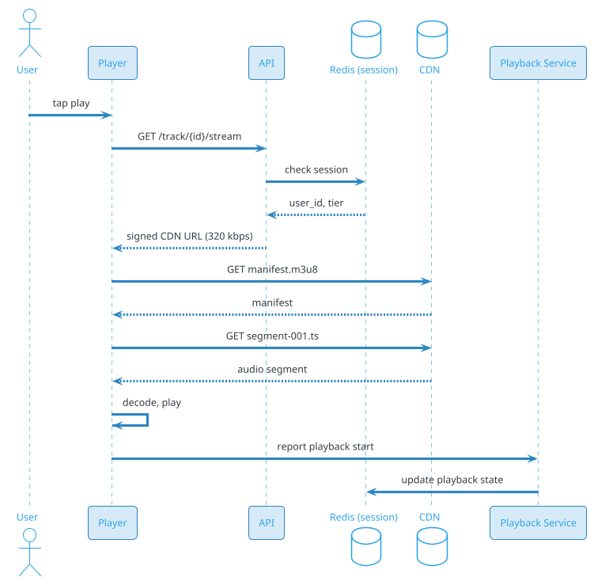
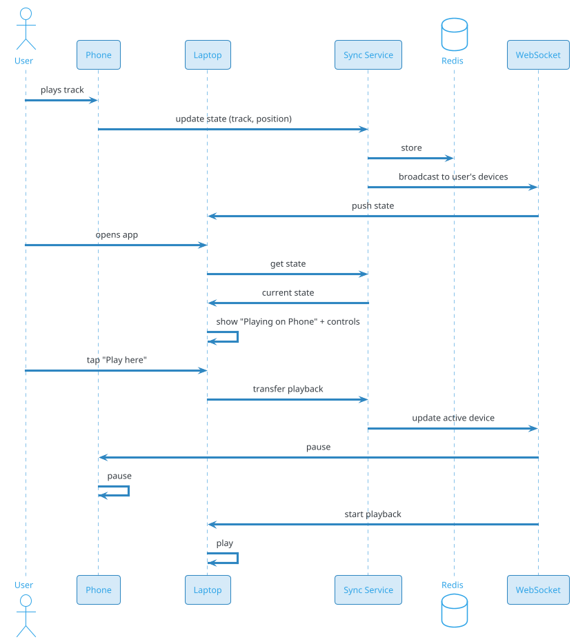
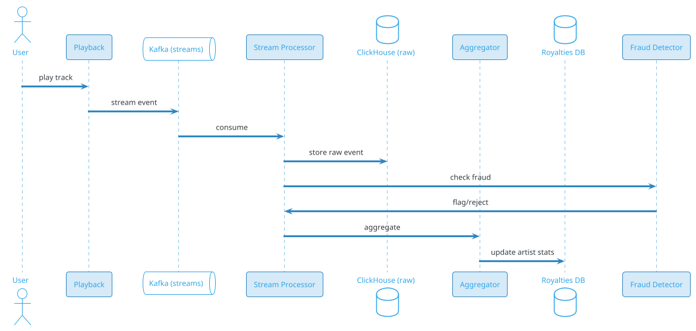

# Music Streaming (Spotify / Gaana / Apple Music)

## Problem Statement

Design a music streaming platform like Spotify, Apple Music, or Gaana. Users browse and search a catalog of hundreds of millions of tracks, create playlists, follow artists, and stream music with adaptive bitrate and offline caching. The system must deliver sub-second playback startup, handle massive concurrent listeners, support royalties calculation, and provide personalized recommendations.

**Example:**

```
User Priya opens Spotify:

  1. Opens app → "Home" tab loads (personalized recommendations)
  2. Taps "Discover Weekly" → 30 tracks curated by ML
  3. Selects a track → playback begins in ~200 ms
  4. Audio streams at 320 kbps (Premium) or 160 kbps (Free)
  5. Song ends → next track auto-plays
  6. User likes track → saved to library
  7. Adds track to playlist
  8. Goes offline → downloads playlist for later
  9. Playback continues on smart speaker (Spotify Connect)
 10. Royalties calculated daily, paid monthly to artists

Key challenges:
  - Sub-second playback start
  - Seamless track transitions
  - Offline caching (mobile)
  - Multi-device sync (playback state)
  - Personalized recommendations
  - Royalties calculation (per-stream)
  - Licensing (per-country, per-artist)
  - Audio quality (adaptive bitrate)
  - Casting (Spotify Connect, AirPlay, Chromecast)

Scale:
  - 500M MAU, 200M Premium subscribers
  - 100M tracks in catalog
  - 100B streams/day (~1.16M/sec avg, 5M/sec peak)
  - 10B playlists
  - 1M artists
  - 500 CDN PoPs globally
```

**Real-world systems:** Spotify, Apple Music, Gaana, JioSaavn, YouTube Music, Amazon Music.

**Why it's interesting:**

- **Ultra-low latency** — playback starts in milliseconds
- **Small files, massive volume** — 3-5 MB per track, 100B streams/day
- **Licensing complexity** — per country, per label
- **Royalties** — accurate per-stream tracking, billions of micro-payments
- **Recommendations** — ML-driven (Discover Weekly is legendary)
- **Offline downloads** — mobile-first caching
- **Multi-device sync** — playback state across devices
- **CDN dominance** — 90%+ of traffic from CDN
- **Cost per stream** — fractions of a cent, but multiplied by billions
- **Fraud detection** — fake streams, bot plays

---

## 1. Requirements Clarification

### Functional Requirements
- **Catalog**: Browse 100M+ tracks, albums, artists
- **Search**: By track, artist, album, playlist, lyrics
- **Playback**: Stream audio with adaptive bitrate
- **Playlists**: Create, edit, share (10B playlists)
- **Library**: Save tracks/albums, follow artists
- **Recommendations**: Personalized mixes (Discover Weekly)
- **Radio**: Genre/artist-based auto-play
- **Queue**: Up next, shuffle, repeat
- **Lyrics**: Synced (time-aligned)
- **Offline downloads**: Mobile caching
- **Multi-device**: Spotify Connect, AirPlay, Chromecast
- **Social**: Share, collaborative playlists
- **Podcasts**: Audio shows (extension)
- **Royalties**: Track per-stream for artist payouts
- **Family/Duo plans**: Multi-user accounts

### Non-Functional Requirements
- **Scale**: 500M MAU, 200M Premium, 100B streams/day
- **Latency**: Playback start < 500 ms; next track < 100 ms
- **Availability**: 99.99% — music is always-on
- **Durability**: Never lose catalog
- **Quality**: Adaptive bitrate (96, 160, 320 kbps)
- **Offline**: Full playback without connectivity
- **Sync**: Playback state across devices < 1 sec
- **Royalties**: Per-stream accuracy (legal requirement)
- **Compliance**: Licensing, GDPR, DMCA, royalties

### Out of Scope
- Podcast recording (creator tools)
- Music production (DAWs)
- Live concerts (separate)
- Music videos (VOD problem)
- NFTs/blockchain (mention)

---

## 2. Back-of-Envelope Estimation

### Traffic

```
Given:
  MAU                  = 500,000,000
  Premium subscribers  = 200,000,000
  DAU                  = 250,000,000
  Streams/day          = 100,000,000,000
  Avg stream duration  = 3.5 min (210 sec)
  Avg bitrate          = 256 kbps (mix of 96, 160, 320)
  Peak multiplier      = 5x

Average QPS:
  Streams/sec = 100B / 86,400 = ~1,157,407/sec

Peak QPS:
  Streams/sec = ~5,787,000/sec

Data per stream:
  3.5 min x 256 kbps / 8 = ~6.7 MB per stream

Bandwidth:
  Avg: 1.16M/sec x 6.7 MB = ~7.8 TB/sec = ~62 Tbps
  Peak: ~312 Tbps
  
Note: This is HEAVILY cached at CDN edge.
Origin egress is much smaller (~10% of total).
```

### Storage

```
Catalog:
  100M tracks x 5 MB avg (FLAC master) = ~500 TB
  + Multiple formats (MP3, AAC, Ogg, FLAC) = ~2 PB
  + Multiple bitrates per format = ~5 PB total

Metadata:
  100M tracks x 50 KB = ~5 TB
  1M artists x 100 KB = ~100 GB
  Albums: 10M x 20 KB = ~200 GB

Playlists:
  10B playlists x 10 KB (metadata + track IDs) = ~100 TB

User library:
  500M users x 10 KB (saved tracks) = ~5 TB

Artwork:
  100M tracks x 500 KB (multiple resolutions) = ~50 TB

Lyrics:
  100M tracks x 10 KB = ~1 TB

Analytics (play events):
  100B streams/day x 500 bytes = ~50 TB/day
  Retained 1 year: ~18 PB

Total hot: ~20 PB
Total cold (archive): ~50 PB
```

### Bandwidth

```
CDN egress:
  Peak: ~312 Tbps
  Daily: ~100B streams x 6.7 MB = ~670 PB/day

This is the DOMINANT cost.
At CDN negotiated rates (~$0.005/GB):
  670 PB/day x $0.005/GB = ~$3.35M/day = ~$100M/month

This is a significant cost — Spotify's gross margin is affected by this.

Origin egress:
  ~10% of CDN traffic = ~67 PB/day
```

### Latency Budget

```
Playback start:
  Client → API:                    ~50 ms
  Auth:                             ~10 ms
  Fetch track URL:                  ~20 ms
  CDN fetch first chunk:            ~50 ms
  Decode + buffer:                  ~100 ms
  Start playback:                   ~50 ms
  Total:                            ~280 ms

Target: < 500 ms for first audio.

Next track transition:
  Pre-fetch next track:             ~200 ms (before current ends)
  Seamless transition:              ~50 ms
  Total:                            < 100 ms after pre-fetch

Multi-device sync:
  Playback state propagate:         ~500 ms (via WebSocket)
```

---

## 3. High-Level Design

```d2
direction: down

user: User {shape: person}
artist: Artist {shape: person}

cdn: "CDN (500+ PoPs)" {shape: cloud}
edge: Edge PoP {shape: cloud}

lb: Load Balancer {shape: hexagon}
api: API Gateway {shape: hexagon}

catalog: Catalog Service {shape: rectangle}
search: Search Service {shape: rectangle}
streaming: Streaming Service {shape: rectangle}
playlist: Playlist Service {shape: rectangle}
library: Library Service {shape: rectangle}
reco: Recommendation Service {shape: rectangle}
playback: Playback Service {shape: rectangle}
lyrics: Lyrics Service {shape: rectangle}
sync: "Device Sync Service" {shape: rectangle}
royalty: "Royalty Service" {shape: rectangle}
fraud: Fraud Service {shape: rectangle}

kafka: Kafka {shape: queue}

s3: "S3 (audio masters + variants)" {shape: cylinder}
catalog_db: "PostgreSQL (catalog)" {shape: cylinder}
user_db: "PostgreSQL (users, playlists)" {shape: cylinder}
redis: "Redis (cache, sessions)" {shape: cylinder}
es: "Elasticsearch (search)" {shape: cylinder}
ch: "ClickHouse (analytics)" {shape: cylinder}

user -> cdn
cdn -> edge
edge -> lb
lb -> api
api -> catalog
api -> search
api -> streaming
api -> playlist
api -> library
api -> reco
api -> lyrics
api -> sync

streaming -> s3
streaming -> cdn

playback -> redis

playlist -> user_db
library -> user_db
catalog -> catalog_db
catalog -> es

reco -> ch
reco -> redis

royalty -> ch
royalty -> kafka

user -> kafka : play events
kafka -> ch
kafka -> fraud
```

### Component Responsibilities

| Component | Role |
|---|---|
| CDN | Audio delivery globally |
| Edge PoP | Nearest CDN node |
| API Gateway | Auth, routing, rate limiting |
| Catalog Service | Track, album, artist metadata |
| Search Service | Full-text search |
| Streaming Service | Audio URL generation, signed URLs |
| Playlist Service | CRUD for playlists |
| Library Service | User's saved tracks/albums |
| Recommendation Service | Discover Weekly, Daily Mixes |
| Playback Service | Playback state (position, queue) |
| Lyrics Service | Synced lyrics |
| Device Sync Service | Multi-device playback sync |
| Royalty Service | Per-stream royalty calculation |
| Fraud Service | Detect fake streams |
| Kafka | Event bus |
| S3 | Audio masters + transcoded variants |
| PostgreSQL | Catalog + user data |
| Redis | Cache, sessions, playback state |
| Elasticsearch | Search index |
| ClickHouse | Analytics + royalties |

### Why This Architecture

- **S3 + CDN** for audio (cost-effective, scalable)
- **PostgreSQL** for metadata (relational, ACID)
- **Redis** for hot cache + playback state
- **Elasticsearch** for search (fast full-text)
- **ClickHouse** for analytics + royalties (high-volume writes)
- **Kafka** for play events (async, decoupled)
- **Separate royalty service** (accuracy matters)

---

## 4. Deep Dive: Audio Storage and Delivery

### Audio Formats

| Format | Use | Bitrate | Size (3.5 min) |
|---|---|---|---|
| FLAC | Master | ~1000 kbps | ~26 MB |
| AAC 320 | Premium high | 320 kbps | ~8.4 MB |
| AAC 256 | Premium | 256 kbps | ~6.7 MB |
| AAC 160 | Free high | 160 kbps | ~4.2 MB |
| AAC 96 | Free low | 96 kbps | ~2.5 MB |
| Ogg Vorbis | Android | variable | ~5 MB |
| Opus | Web/modern | variable | ~4 MB |

**Catalog storage:** ~5 PB (all formats + bitrates).

### Encoding Pipeline

```
Upload (from labels):
  1. Receive master (FLAC, WAV, DSD)
  2. Validate + normalize
  3. Transcode to AAC, Ogg, Opus (multiple bitrates)
  4. Segment for HLS/DASH (4-10 sec)
  5. Encrypt (DRM for Premium)
  6. Upload to S3 with CDN-friendly structure
  7. Update catalog with all variant URLs
```

### Storage Layout

```
s3://music-catalog/{track_id}/
  master.flac
  aac-320/
    manifest.m3u8
    segment-001.ts
    segment-002.ts
    ...
  aac-160/
    manifest.m3u8
    segment-001.ts
    ...
  ogg-vorbis/
    ...
  opus/
    ...
  artwork/
    64.jpg
    300.jpg
    640.jpg
  lyrics.json
  metadata.json
```

**Key insight:** Segment-based storage (like video) enables:
- Adaptive bitrate
- Byte-range requests
- CDN caching at segment level

### Adaptive Bitrate for Audio

Similar to video:
- Player fetches master manifest
- Selects initial bitrate (Premium: 320 kbps; Free: 160 kbps)
- Monitors network, buffer
- Switches quality if needed

**But:** Audio bitrate changes are less common — network quality is usually sufficient.

### Signed URLs

For access control:
- Premium tracks: Signed URLs (expire 1 hour)
- Free tracks: Public CDN URLs
- DRM: Encrypted segments + license

### CDN Architecture

```d2
direction: right

user: User {shape: person}
dns: "DNS / Anycast" {shape: cloud}
edge: "Edge PoP (500+)" {shape: cloud}
regional: "Regional Cache (20)" {shape: cloud}
origin: "Origin (S3)" {shape: cylinder}

user -> dns
dns -> edge
edge -> regional : cache miss
regional -> origin : cache miss
```

**Cache hit ratio:** 95%+ for popular tracks.

**Long tail:** Rare tracks fetched from origin on demand (higher latency).

### Playback Flow



### Next Track Pre-fetch

For seamless transitions:
1. While current track plays, pre-fetch next track's first few segments
2. Cache in player buffer
3. When current ends, transition immediately (no latency)

**Signals:** Queue from playlist, autoplay, radio.

### Audio Codec Choice

- **AAC**: Universal, good quality
- **Ogg Vorbis**: Spotify's default (open, good)
- **Opus**: Modern, best quality per bit, used by YouTube
- **FLAC**: Lossless (for audiophile tier)

**Recommendation:** AAC (universal) + Ogg (Spotify) + Opus (future).

### Offline Downloads

For mobile:
- User marks playlist/album for offline
- App downloads segments (encrypted)
- Stored on device (encrypted)
- Plays without network
- Syncs when online (updates, deletes)

**Storage:** ~1-10 GB per user (typical).

**Encryption:** Encrypted with device key; can't be copied.

---

## 5. Deep Dive: Catalog and Metadata

### Catalog Structure

```
Artist
  ├── Albums
  │     ├── Tracks
  │     ├── Artwork
  │     └── Credits
  ├── Singles
  └── Appears On
```

### Metadata Schema (PostgreSQL)

```sql
CREATE TABLE artists (
    artist_id BIGINT PRIMARY KEY,
    name VARCHAR(200) NOT NULL,
    bio TEXT,
    image_url TEXT,
    popularity INT DEFAULT 0,
    follower_count BIGINT DEFAULT 0,
    verified BOOLEAN DEFAULT FALSE,
    created_at TIMESTAMP DEFAULT NOW()
);
CREATE INDEX idx_artists_name ON artists(name);

CREATE TABLE albums (
    album_id BIGINT PRIMARY KEY,
    title VARCHAR(300) NOT NULL,
    artist_id BIGINT REFERENCES artists(artist_id),
    release_date DATE,
    album_type VARCHAR(20),          -- album, single, EP
    total_tracks INT,
    artwork_url TEXT,
    label VARCHAR(200),
    copyright TEXT,
    created_at TIMESTAMP DEFAULT NOW()
);
CREATE INDEX idx_albums_artist ON albums(artist_id);

CREATE TABLE tracks (
    track_id BIGINT PRIMARY KEY,
    title VARCHAR(300) NOT NULL,
    album_id BIGINT REFERENCES albums(album_id),
    artist_id BIGINT REFERENCES artists(artist_id),
    duration_seconds INT NOT NULL,
    track_number INT,
    disc_number INT DEFAULT 1,
    explicit BOOLEAN DEFAULT FALSE,
    isrc VARCHAR(20) UNIQUE,         -- International Standard Recording Code
    popularity INT DEFAULT 0,
    play_count BIGINT DEFAULT 0,
    is_available BOOLEAN DEFAULT TRUE,
    available_regions TEXT[],        -- licensing
    created_at TIMESTAMP DEFAULT NOW()
);
CREATE INDEX idx_tracks_album ON tracks(album_id);
CREATE INDEX idx_tracks_artist ON tracks(artist_id);
CREATE INDEX idx_tracks_popularity ON tracks(popularity DESC);

CREATE TABLE track_credits (
    track_id BIGINT REFERENCES tracks(track_id),
    role VARCHAR(50),                -- producer, writer, composer
    artist_id BIGINT REFERENCES artists(artist_id),
    PRIMARY KEY (track_id, role, artist_id)
);
```

### Metadata Service

- Read-heavy (browse, search)
- Cache in Redis (hot tracks, albums)
- CDN-cached JSON for very popular items
- Elasticsearch for search

### Search Index

```json
{
  "track_id": "trk-123",
  "title": "Bohemian Rhapsody",
  "artist": "Queen",
  "album": "A Night at the Opera",
  "duration": 355,
  "popularity": 9500,
  "release_year": 1975,
  "language": "en",
  "genre": ["rock", "classic rock"],
  "is_available": true
}
```

### Search Ranking

```
score = 0.4 * text_relevance
      + 0.3 * popularity
      + 0.1 * recency
      + 0.2 * personalization
```

### Autocomplete

As user types "bohe":
- "Bohemian Rhapsody" (Queen)
- "Bohemian Like You" (Dandy Warhols)
- "Bohemian" (artist name)

**Implementation:** Elasticsearch completion suggester with edge n-grams.

### Multi-Region Catalog

- **Catalog is global** (same tracks worldwide)
- **Availability is regional** (licensing)
- **Local metadata** (language, region-specific)

### Metadata Scale

```
100M tracks
50 KB per track (with all metadata, credits)
= ~5 TB total (small)
```

**Metadata is tiny compared to audio storage.**

---

## 6. Deep Dive: Playback and Multi-Device Sync

### Playback State

Per user:
- Current track
- Position (in seconds)
- Queue
- Volume
- Repeat mode
- Shuffle mode
- Active device

### Storage

**Redis:**
```
Key: playback:{user_id}
Type: Hash
Fields:
  track_id, position, queue (list), volume,
  repeat_mode, shuffle_mode, active_device_id,
  updated_at
TTL: 24 hours
```

### Multi-Device Sync

**Scenario:** User starts Spotify on phone, opens laptop, expects playback to continue.

**Flow:**



### Spotify Connect

- **Discovery:** Devices on same network (mDNS)
- **Protocol:** Spotify Connect protocol (proprietary)
- **Handoff:** Transfer playback between devices
- **Control:** Any device can control any active device

### Playback API

```http
POST /v1/playback/start
{
  "device_id": "phone-1",
  "track_id": "trk-123",
  "position_seconds": 0
}

POST /v1/playback/pause
POST /v1/playback/resume
POST /v1/playback/seek
{
  "position_seconds": 45
}
POST /v1/playback/next
POST /v1/playback/queue
{
  "track_id": "trk-456",
  "position": "end"
}
```

### Playback Events

Every playback action emits an event:
- `playback.started`
- `playback.paused`
- `playback.seeked`
- `playback.completed`
- `track.started` (for royalty)
- `track.completed` (for royalty)

These feed analytics, recommendations, royalties.

### Offline Playback

When offline:
- Playback state stored locally
- Events queued (for analytics/royalties)
- On reconnect: sync events + state
- Conflict resolution: last-write-wins

### Casting

For AirPlay, Chromecast:
- Device is the audio output
- Phone is the controller
- Cast protocol handles discovery + streaming
- Session state syncs across phone/device

---

## 7. Deep Dive: Recommendations

### Discover Weekly

Spotify's legendary feature: 30 tracks per user per week, personalized.

**ML approach:**
- Collaborative filtering (user-item matrix)
- Content-based (audio features)
- NLP on playlists (track co-occurrence)
- Deep learning (neural embeddings)

**Pipeline:**

```
1. Offline training (weekly):
   - Build user embeddings (based on listening history)
   - Build track embeddings (audio + text + co-play)
   - Train model to predict next-track probability
2. Candidate generation:
   - For each user, ANN search for nearest tracks
   - 1000 candidates
3. Ranking:
   - ML model scores candidates
   - Filter by listened, disliked, unavailable
4. Diversity:
   - Mix familiar + new
   - Mix genres
   - 30 tracks
5. Publish to user (Monday morning)
```

### Audio Features

Spotify's audio analysis:
- Tempo (BPM)
- Key, mode
- Energy
- Danceability
- Acousticness
- Instrumentalness
- Valence (mood)
- Speechiness
- Liveness

**Use:** Similarity, recommendations, mood-based playlists.

### Daily Mixes

- 6 mixes per user
- Each mix: one genre/style cluster
- Personalized to user's taste
- Updated daily

### Radio

- Based on seed (track, artist, playlist)
- Continuous recommendations
- Infinite play

**Algorithm:**
- Start with seed
- Recommend similar tracks
- User feedback (skip, like) adjusts

### Personalized Home

- **Recently played**
- **Made for you** (Discover Weekly, Daily Mixes)
- **Because you listened to X**
- **New releases from followed artists**
- **Jump back in**

### Cold Start

New user:
- Onboarding: pick genres, artists
- Popular in region
- Fast learning (first 10 tracks)

### ML Infrastructure

- **Training:** Weekly offline batch (Spark, GPU cluster)
- **Serving:** Two-tower model, embeddings in Redis
- **ANN:** FAISS, ScaNN for nearest-neighbor
- **Feature store:** User + track features

### A/B Testing

- Control vs. experiment groups
- Metrics: skip rate, save rate, session length, retention
- Statistically significant improvements required

---

## 8. Deep Dive: Royalties and Analytics

### Royalty Model

Spotify pays ~70% of revenue to rights holders:
- Labels (major, indie)
- Publishers (songwriters)
- Distributors (TuneCore, DistroKid)

**Per-stream:** Calculated by "pro-rata" or "user-centric" model.

**Pro-rata:** Total revenue / total streams x artist streams.

**User-centric:** Revenue per user / user's streams x artist streams.

**User-centric** pays smaller artists more fairly; Spotify uses pro-rata.

### Per-Stream Tracking

Every stream must be tracked:
- User ID (or anonymized)
- Track ID
- Timestamp
- Duration played
- Country (licensing)
- Device

**Requirement:** ≥ 30 sec play = counted as stream.

### Royalty Calculation

```
For each month:
  1. Total revenue (subscriptions + ads) = R
  2. Total streams (>= 30 sec) = S
  3. Per-stream rate = R * 0.70 / S  (~$0.003-0.005)
  4. For each artist:
     - streams_artist = sum(streams of their tracks)
     - royalty = streams_artist * per_stream_rate
     - minus publisher/distributor share
     - paid monthly
```

### Scale

```
100B streams/day
= 3T streams/month
x 500 bytes per event = ~1.5 PB/month
Stored in ClickHouse (aggregated)
```

### Analytics for Artists

- **Streams**: Per track, per country, per day
- **Listeners**: Unique users
- **Demographics**: Age, gender, location (aggregated)
- **Playlists**: Which playlists include the track
- **Revenue**: Detailed breakdown
- **Trends**: Growth rate

### Fraud Detection

Fake streams are a real problem:
- **Stream farms**: Bots playing tracks on repeat
- **Playlist fraud**: Fake playlists inflating streams
- **Bot accounts**: Automated listening

**Detection:**
- Play patterns (too fast, too repetitive)
- Account age and behavior
- Device fingerprinting
- Payment patterns
- Network analysis (bot rings)

**Response:**
- Remove fraudulent streams
- Ban accounts
- Withhold royalties for fraudulent streams
- Legal action for major fraud

### Analytics Pipeline



### Compliance

- **Mechanical royalties**: Songwriters
- **Performance royalties**: Public performance
- **Sync royalties**: Video sync (YouTube)
- **Publishing**: Split between labels and publishers

---

## 9. Deep Dive: Offline and Mobile

### Why Offline?

- **Subway, airplane, spotty network**
- **Data savings** (avoid streaming)
- **Better battery** (no constant network)
- **Better UX** (instant playback)

### Offline Architecture

- **User marks** playlist/album/podcast for download
- **App downloads** encrypted segments
- **Local DB** stores metadata + paths
- **Plays from local** storage
- **Syncs** periodically (updates, deletes)

### Storage on Device

- **Playlists**: ~50-500 MB each
- **Albums**: ~50-200 MB
- **Podcasts**: 500 MB - 2 GB
- **Total per user**: 1-10 GB (typical)
- **Max**: Configurable (e.g., 10 GB)

### Encryption

- **Encrypted** with device-specific key
- **Keys in Keychain/Keystore**
- **Not playable outside app**
- **Expires** if subscription lapses

### Sync

- **Content updates**: When online, check for new tracks
- **Library changes**: Sync saved tracks/playlists
- **Playback state**: Sync when online
- **Deletes**: User removes download → free storage

### Bandwidth Savings

For users with limited data:
- **Download on Wi-Fi only** (setting)
- **Stream quality**: Lower on cellular
- **Data saver mode**: 96 kbps instead of 320

### Caching

Even non-downloaded tracks cached:
- **Recent tracks**: Cached for instant replay
- **Next track**: Pre-fetched
- **Cache eviction**: LRU, max size
- **Clear cache**: User option

### Offline Limitations

- **Search**: Only downloaded content
- **Recommendations**: Cached, not fresh
- **Lyrics**: Only if downloaded
- **Sharing**: Queue for online

### Analytics Offline

- **Events queued** locally
- **Synced on reconnect**
- **Timestamps preserved**
- **Royalties still counted** (though slightly delayed)

---

## 10. Deep Dive: Licensing and Geo-Restrictions

### Licensing Complexity

Music rights are complex:
- **Per-country** (different laws, deals)
- **Per-label** (major, indie, self-published)
- **Per-track** (some tracks unavailable)
- **Time-limited** (contracts expire)

### Rights Model

| Right | Who | What |
|---|---|---|
| Master | Label | Recording |
| Publishing | Publisher | Composition (melody, lyrics) |
| Performance | PRO | Public performance |
| Mechanical | Publisher | Reproduction |
| Sync | Publisher | Video/film sync |

### Geo-Restrictions

- **Unavailable tracks**: Not in user's country
- **UI**: Grey out / "Not available in your region"
- **Search**: Filter by availability
- **Recommendations**: Only available tracks

### License Management

- **Catalog DB** stores `available_regions` per track
- **Check at playback**: Block if not available
- **Check at search**: Filter results
- **Updates**: When deals change, update catalog

### Royalty Distribution

- **Per-country rates** vary
- **Currency conversion** for payouts
- **Tax withholding** per jurisdiction
- **Reporting** to labels/publishers (monthly statements)

### Compliance

- **DMCA**: Takedown for copyright claims
- **GDPR**: User data rights
- **COPPA**: Children's privacy
- **Local laws**: Country-specific content rules

### Scale

- **1M+ artists** with contracts
- **100K+ labels** (major + indie)
- **Millions of contracts** tracked
- **Billions of micro-payments** monthly

---

## 11. Deep Dive: Audio Quality

### Bitrate Tiers

| Tier | Bitrate | Codec | Users |
|---|---|---|---|
| Free | 96 kbps | AAC | Free |
| Premium | 160 kbps | AAC | Premium |
| Premium HQ | 320 kbps | AAC | Premium |
| Lossless | ~1411 kbps | FLAC | Hi-Fi (extra) |
| Spatial | Varies | Dolby Atmos | Special |

### Codec Selection

- **AAC**: Universal (iOS, Android, Web)
- **Ogg Vorbis**: Spotify (open, good quality)
- **Opus**: Modern, best compression
- **FLAC**: Lossless, audiophile
- **Dolby Atmos**: Spatial audio

### Spatial Audio

- **Dolby Atmos Music**: Object-based audio
- **Apple Spatial Audio**: Head tracking
- **360 Reality Audio**: Sony

**Storage:** Larger files (5-10x). Only for premium tiers.

### Audio Normalization

- **Loudness normalization**: Consistent volume across tracks
- **Target**: -14 LUFS (streaming standard)
- **Per-track gain**: Applied at encode
- **Prevents volume jumps** between tracks

### Transitions

- **Gapless playback**: No gap between consecutive tracks
- **Crossfade**: Fade out/in (optional)
- **Pre-fetch**: Next track pre-loaded

### Quality Adaptation

- **Network-aware**: Reduce bitrate on poor connection
- **Buffer-aware**: Increase if buffer is healthy
- **Wi-Fi vs cellular**: Different defaults
- **User override**: Force quality

### Audio Analytics

- **Skip rate**: If high, quality or relevance issue
- **Completion rate**: Users finish good tracks
- **Replay rate**: Users replay favorites
- **Quality switches**: Network issues

---

## 12. Scaling Considerations

### Read Scaling

- **CDN** (500+ PoPs, huge scale)
- **Redis** for hot metadata, playback state
- **Read replicas** for PostgreSQL
- **Elasticsearch** for search
- **ClickHouse** for analytics

### Write Scaling

- **S3** for audio (unlimited)
- **Kafka** for play events (millions/sec)
- **ClickHouse** for analytics (high write)
- **PostgreSQL** for catalog (write-light; updates rare)

### Sharding

**PostgreSQL:** Shard by `user_id` (users, playlists).
**Cassandra:** (if used) Posts by `track_id`.
**Kafka:** Partition by `user_id` (play events).
**Redis:** Shard by `user_id`.
**Elasticsearch:** Shard by `track_id`.

### Multi-Region

```d2
direction: down

us: "US Region" {
  shape: cloud
}
eu: "EU Region" {
  shape: cloud
}
apac: "APAC Region" {
  shape: cloud
}

us3: "US S3" {
  shape: cylinder
}
eu3: "EU S3" {
  shape: cylinder
}
apac3: "APAC S3" {
  shape: cylinder
}

us -> us3
eu -> eu3
apac -> apac3
```

**Audio** stored in multiple regions (or origin in one, CDN handles global).

**Metadata** replicated globally (small).

**Playback state** in home region.

**Compliance:** EU (GDPR), India (DPDP).

### Peak Handling

**Evening commute** (6-9 PM): 2x.
**Weekends**: 1.5x.
**New album releases** (Taylor Swift): 10x spikes on specific content.

**Mitigations:**
- Pre-warm CDN for expected releases
- Auto-scale API
- Reserved CDN capacity

### Cost Optimization

| Component | Optimization |
|---|---|
| CDN egress | Multi-CDN, negotiate rates |
| S3 storage | Tiering, compress old formats |
| Compute | Reserved, right-size |
| Transcode | Only on upload; done once |
| Analytics | Sample high-volume events |

### CDN Cost Reduction

- **Multi-CDN strategy**: Negotiate rates
- **ISP partnerships**: Cache at ISP edge
- **Peer-to-peer**: Some experimentation (BitTorrent-like)
- **Regional CDN**: Cheaper in some regions

---

## 13. Bottlenecks and Trade-offs

| Concern | Solution | Trade-off |
|---|---|---|
| Playback start | Pre-fetch, edge cache | Bandwidth |
| Multi-device sync | Redis + WebSocket | Consistency |
| Recommendations | Two-tower ML | Training cost |
| Royalties | ClickHouse aggregation | Accuracy vs cost |
| Fraud | Multi-signal ML | False positives |
| Licensing | Regional catalog | Complexity |
| Offline | Local storage | Device space |
| Audio quality | Adaptive bitrate | Bandwidth |
| CDN cost | Multi-CDN | Complexity |
| Scale | Sharded everything | Consistency |

### Design Decisions Summary

| Decision | Choice | Rationale |
|---|---|---|
| Audio storage | S3 (masters + variants) | Cost-effective |
| Delivery | CDN (500+ PoPs) | Scale |
| Catalog | PostgreSQL (sharded) | Relational |
| Search | Elasticsearch | Fast |
| Playback state | Redis | Fast sync |
| Multi-device | WebSocket | Real-time |
| Recommendations | Two-tower ML | Personalization |
| Royalties | ClickHouse + Kafka | Scale, accuracy |
| Offline | Encrypted local storage | UX |
| Licensing | Regional catalog | Compliance |

---

## 14. Failure Scenarios

### CDN Outage

**Impact:** Music unavailable in region.

**Mitigation:**
- Multi-CDN
- DNS failover
- Cache serves recent content
- Alert ops

### S3 Outage

**Impact:** Audio unavailable; uploads fail.

**Mitigation:**
- Multi-region S3
- CDN cache serves recent
- Retry with backoff

### Playback State Lost

**Impact:** Multi-device sync broken.

**Mitigation:**
- Redis persistence
- Backup to PostgreSQL
- Rebuild from play events

### Recommendation Failure

**Impact:** Generic recommendations; lower engagement.

**Mitigation:**
- Fallback to popularity
- Serve cached recommendations
- Alert ML team

### Royalty Calculation Error

**Impact:** Artists underpaid/overpaid; legal issues.

**Mitigation:**
- Idempotent calculations
- Reconciliation
- Audit trail
- Alert finance team

### Fraud Detection Failure

**Impact:** Inflated royalties; revenue loss.

**Mitigation:**
- Multi-signal detection
- Manual review
- Rollback payments
- Alert fraud team

### Licensing Violation

**Impact:** Legal issues.

**Mitigation:**
- Pre-check availability
- Automated takedowns
- Compliance monitoring
- Legal review

### Search Index Down

**Impact:** Search unavailable.

**Mitigation:**
- Fall back to PostgreSQL
- Cache popular searches
- Alert ops

### Playback Start Slow

**Impact:** Poor UX; users leave.

**Mitigation:**
- Pre-fetch next track
- Edge caching
- Lower initial quality (upgrade later)
- Monitor and alert

### Account Compromise

**Impact:** Attacker uses victim's account.

**Mitigation:**
- 2FA
- Anomaly detection
- Session revocation
- Alert user

### Data Breach

**Impact:** User data exposed.

**Mitigation:**
- Encryption at rest + transit
- Access controls + audit
- Incident response
- Notify users

---

## 15. Monitoring and Alerts

### Key Metrics

| Metric | Target | Alert Threshold |
|---|---|---|
| Playback start p99 | < 500 ms | > 1 sec |
| Track transition p99 | < 100 ms | > 300 ms |
| Buffering rate | < 0.5% | > 2% |
| CDN cache hit ratio | > 90% | < 80% |
| CDN error rate | < 0.1% | > 1% |
| Search p99 | < 300 ms | > 1 sec |
| Multi-device sync p99 | < 1 sec | > 3 sec |
| Recommendation CTR | baseline | drop > 10% |
| Royalty calculation lag | < 1 hour | > 24 hours |
| Fraud detection rate | > 95% | < 90% |
| API availability | > 99.99% | < 99.9% |

### Dashboards

- **Traffic**: Streams/sec, unique listeners, per-region
- **Latency**: Playback start, transitions, buffering
- **Quality**: Bitrate distribution, switches, errors
- **CDN**: Hit ratio, bandwidth, cost per PoP
- **Recommendations**: CTR, saves, skips
- **Royalties**: Streams/day, payouts, fraud flags
- **Infrastructure**: Redis, Kafka, ClickHouse health
- **Business**: DAU, MAU, Premium conversion, retention

### Alerts

- **P0**: CDN outage, mass playback failure, data breach
- **P1**: Playback start > 1 sec, cache hit < 80%
- **P2**: Recommendation CTR drop > 10%, royalty lag > 24h
- **P3**: High skip rate, low average quality

### Business KPIs

- **DAU/MAU** ratio
- **Premium conversion** (%)
- **Streams per user** (per day)
- **Session length**
- **Skip rate**
- **Save rate**
- **Churn** (subscription)
- **NPS**
- **Royalty per stream** (avg)

---

## 16. Cost Estimation

Rough monthly cost (AWS + CDN) for 500M MAU:

| Component | Spec | Cost/month |
|---|---|---|
| API servers | 500 x c6g.large | ~$30,000 |
| Catalog servers | 200 x c6g.large | ~$12,000 |
| Recommendation compute | 100 x c6g.2xlarge | ~$24,000 |
| Playback/sync servers | 300 x c6g.large | ~$18,000 |
| PostgreSQL | 30 shards x db.r6g.4xlarge | ~$142,000 |
| Read replicas | 60 x db.r6g.2xlarge | ~$126,000 |
| Redis cluster | 100 x cache.r6g.2xlarge | ~$50,000 |
| Kafka (MSK) | 50 brokers | ~$25,000 |
| Elasticsearch | 100 x r6g.2xlarge | ~$180,000 |
| ClickHouse | 50 x i3.2xlarge | ~$50,000 |
| S3 (catalog) | 5 PB | ~$115,000 |
| S3 (archive) | 50 PB | ~$200,000 |
| **CDN egress** | 670 PB/day | **~$100,000,000** |
| Monitoring | Datadog | ~$50,000 |
| **Total** | | **~$101M/month** |

**Per user:** ~$0.20/month.

**Cost breakdown:**
- **CDN egress**: ~99% of cost
- **Storage**: ~0.3% of cost
- **Compute**: ~0.2% of cost

**Cost optimization is critical:**

- Multi-CDN negotiation
- ISP partnerships (Open Connect-like)
- AV1/Opus codecs (30% smaller)
- Regional routing (cheaper egress)
- Peer-assisted delivery (experimental)

**Reality:** Spotify's gross margin is ~25-30%, driven by music licensing (70%+ of revenue) and infrastructure cost.

---

## 17. Extensions and Follow-ups

### Podcasts

- Audio shows, interviews
- RSS-based ingestion
- Video podcasts
- Ad insertion
- Separate from music

### Live Audio (Greenroom/Spaces)

- Live audio rooms
- Real-time WebRTC
- Interactive

### Music Videos

- Video content
- VOD architecture
- Sync with audio

### Lyrics Sync

- Timed lyrics (LRC format)
- ML-based alignment
- Crowdsourced corrections

### Social Features

- Collaborative playlists
- Friend activity
- Shared listening (Jam)
- Comments

### Artist Tools

- Spotify for Artists
- Analytics dashboard
- Playlist pitching
- Fan engagement

### Discovery

- Discover Weekly
- Release Radar
- Daily Mixes
- Radio
- Blend (with friends)

### Audio Quality Tiers

- Lossless (FLAC)
- Hi-Fi (Hi-Res)
- Spatial (Dolby Atmos)
- Premium tier

### Cross-Platform

- Web (browser)
- Desktop apps
- Mobile (iOS, Android)
- TV apps
- Smart speakers
- Car (CarPlay, Android Auto)

### Hardware

- Spotify Car Thing (discontinued)
- Integration with automakers
- Smart speaker partnerships

### AI Features

- AI DJ (narrated)
- AI playlist generation
- Natural language search
- Personalized ads

### NFT / Web3

- Music NFTs
- Token-gated content
- Fan ownership
- Experimental

### Payments

- Artist payouts
- Fan tipping
- Merch integration

### Accessibility

- Screen reader support
- Voice control
- Large text
- High contrast

### Health / Wellness

- Sleep music
- Focus music
- Workout playlists
- Binaural beats

### Education

- Music lessons
- Music theory
- Instrument tutorials

---

## 18. Summary

| Aspect | Decision |
|---|---|
| Audio storage | S3 (masters + variants) |
| Delivery | CDN (500+ PoPs) |
| Catalog | PostgreSQL (sharded) |
| Search | Elasticsearch |
| Playback state | Redis |
| Multi-device | WebSocket + Spotify Connect |
| Recommendations | Two-tower ML |
| Royalties | ClickHouse + Kafka |
| Offline | Encrypted local storage |
| Licensing | Regional catalog |
| Scale | 500M MAU, 100B streams/day |
| Latency | Playback start < 500 ms |
| Availability | 99.99% |
| Cost | ~$101M/month (CDN dominates) |

**Key takeaways:**

- **CDN egress is 99% of cost** — negotiation and peering are existential
- **Segment-based storage** (like video) enables adaptive bitrate + CDN caching
- **Ultra-low latency** (< 500 ms) is the UX bar — pre-fetch + edge caching
- **Multi-device sync** via Redis + WebSocket — playback state is the source of truth
- **Recommendations** (Discover Weekly, Daily Mixes) via two-tower ML
- **Royalties** require per-stream tracking with accuracy (ClickHouse + Kafka)
- **Fraud detection** is critical — fake streams = stolen revenue
- **Licensing** is per-country, per-track — compliance complexity
- **Offline downloads** are table stakes — encrypted local storage
- **Audio quality tiers** — free (96 kbps), premium (320 kbps), Hi-Fi (FLAC)
- **Pre-fetch + gapless** — seamless transitions are expected
- **Cost per user is tiny** (~$0.20/month), but total is $100M+/month due to scale

### Similar Pattern Problems

- Video Streaming (VOD) — similar architecture, video-specific
- Live Streaming — real-time audio/video
- Video Conferencing — real-time media
- File Storage Service — chunked upload, tiering
- Recommendation Engine — ML-driven discovery
- Search Autocomplete — search infrastructure
- Podcast Platforms — audio-specific extension