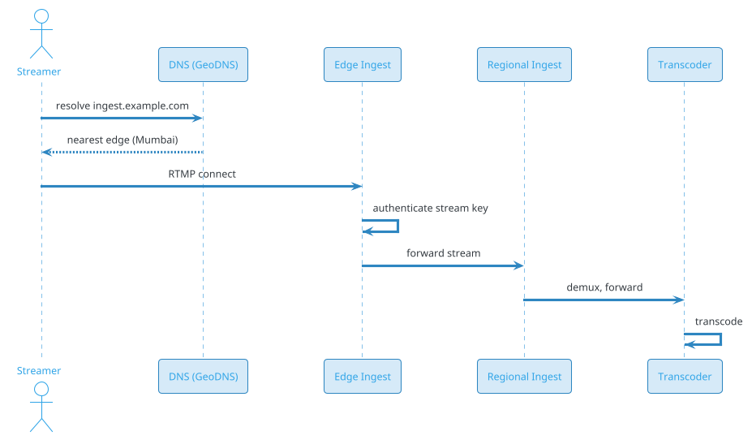
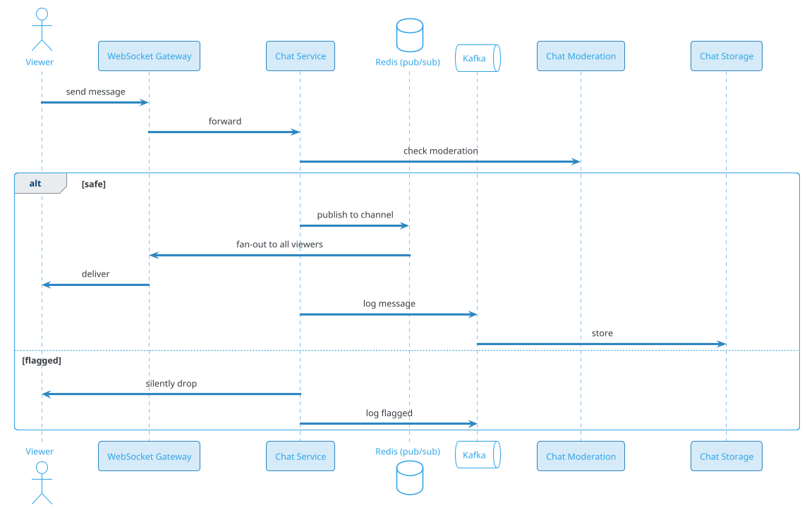

# Live Streaming (Twitch / YouTube Live / Facebook Live)

## Problem Statement

Design a live streaming platform like Twitch, YouTube Live, or Facebook Live. Streamers broadcast live video to potentially millions of concurrent viewers. The system must handle RTMP/SRT ingest, real-time transcoding, low-latency distribution, chat at scale, and monetization. Unlike VOD, latency is critical (viewers interact in real-time), and the system must scale from a streamer with 5 viewers to one with 5 million.

**Example:**

```
Streamer Ninja goes live:

Flow:
  1. Opens OBS, configures RTMP endpoint + stream key
  2. Starts streaming at 1080p 60fps (6 Mbps)
  3. Ingest server receives stream
  4. Real-time transcoding to multiple qualities:
     - 160p, 360p, 480p, 720p, 1080p
  5. HLS segments generated (2-6 sec each)
  6. CDN distributes to edge PoPs
  7. 5 million viewers pull HLS from nearest PoP
  8. Chat messages flow (100K/sec peak)
  9. Donations, subscriptions, ads
 10. Stream ends → recorded VOD available

Viewer experience:
  - Latency: 3-30 sec (normal) or < 1 sec (low-latency mode)
  - Quality: adaptive (network-aware)
  - Chat: real-time, moderated
  - Interaction: reactions, donations, clips

Scale:
  - 500M MAU, 50M DAU
  - 100K concurrent streams
  - 5M concurrent viewers on a single stream (peak)
  - 1B hours watched/day
  - 10B chat messages/day
  - 30s typical latency, < 1s in low-latency mode
```

**Real-world systems:** Twitch, YouTube Live, Facebook Live, TikTok Live, Kick, DLive, LinkedIn Live.

**Why it's interesting:**

- **Real-time ingest** — RTMP/SRT, latency-sensitive
- **Real-time transcoding** — must keep up with live stream
- **Latency vs scale** — trade-off between interactivity and reach
- **Chat at scale** — 100K messages/sec on popular streams
- **Massive fan-out** — one stream → millions of viewers
- **Cost** — transcoding + CDN egress dominate
- **Moderation** — live content, hard to moderate
- **Monetization** — subscriptions, ads, donations
- **Clips** — highlight extraction from live
- **Multi-region** — global fanbase

---

## 1. Requirements Clarification

### Functional Requirements
- **Broadcast**: RTMP, SRT ingest from OBS, mobile
- **Transcoding**: Real-time to multiple qualities
- **Playback**: HLS, DASH, LL-HLS, WebRTC
- **Chat**: Real-time, moderated, emotes
- **Stream discovery**: Browse by category, popularity
- **Follow**: Subscribe to streamers
- **Notifications**: When streamer goes live
- **Subscriptions**: Paid tiers (Twitch Turbo, subs)
- **Donations**: Tips, bits
- **Clips**: Highlight extraction
- **VOD**: Recorded streams available
- **Moderation**: Chat mod, bans, auto-mod
- **Analytics**: Streamer dashboard
- **Raids**: Send viewers to another streamer

### Non-Functional Requirements
- **Scale**: 100K concurrent streams, 5M concurrent viewers peak
- **Latency**: 3-10 sec (normal), < 1 sec (LL mode)
- **Availability**: 99.99% — live is unforgiving
- **Durability**: Streams recorded for VOD
- **Quality**: Adaptive bitrate, multiple qualities
- **Chat**: Sub-second delivery, reliable
- **Cost**: Transcoding + CDN dominate
- **Compliance**: Copyright (DMCA), moderation, age restrictions

### Out of Scope
- VOD-only platforms (YouTube)
- Podcasts
- Sports broadcasting (linear TV)
- Video conferencing

---

## 2. Back-of-Envelope Estimation

### Traffic

```
Given:
  MAU                  = 500,000,000
  DAU                  = 50,000,000
  Concurrent streams   = 100,000 (avg)
  Peak concurrent streams = 500,000 (major events)
  Avg viewers/stream   = 10
  Peak viewers on one  = 5,000,000 (Ninja, esports)
  Concurrent viewers   = 5,000,000 (peak)
  Total watch time     = 1,000,000,000 hours/day

Ingest:
  Avg bitrate          = 6 Mbps (1080p60)
  Concurrent ingest    = 100K streams x 6 Mbps = 600 Gbps
  Peak ingest          = 500K x 6 Mbps = 3 Tbps

Transcode:
  Per stream: 5 variants
  Total transcoded     = 500K streams x 5 = 2.5M variants
  Each variant ~ 1-3 Mbps

Egress:
  Concurrent viewers   = 5M
  Avg bitrate          = 3 Mbps
  Total egress         = 15 Tbps
  Daily egress         = ~1 PB/day

Chat:
  Total messages/day   = 10B
  Peak QPS             = 1M/sec (major event)
```

### Storage

```
Recorded VODs:
  100K streams/day x 4 hours avg x 3 GB/hour = ~1.2 PB/day
  Retained 30 days (hot): ~36 PB
  Retained 1 year (cold): ~438 PB

Clips:
  10M clips/day x 20 MB = 200 TB/day
  Retained 1 year: ~73 PB

Thumbnails:
  100K streams x 5 thumbnails x 100 KB = 50 GB/day

Chat messages:
  10B/day x 200 bytes = 2 TB/day
  Retained 30 days: ~60 TB

Metadata:
  Streams, users, categories: ~10 TB

Total hot: ~50 PB
Total cold: ~500 PB
```

### Bandwidth

```
Ingest:
  ~3 Tbps peak

Egress:
  ~15 Tbps peak
  ~1 PB/day

This is the DOMINANT cost.
At CDN negotiated (~$0.005/GB):
  1 PB/day x $0.005/GB = $5M/day = $150M/month
  Negotiated with ISPs, can be much less.

Internal (transcode to CDN):
  ~10 Tbps internal traffic
```

### Latency Budget

```
Standard HLS:
  Ingest → transcode:           ~1-2 sec
  Segment generation:           ~2-6 sec
  CDN distribution:             ~100-500 ms
  Player buffer:                ~6-12 sec
  Total:                        ~10-20 sec

LL-HLS (Low-Latency HLS):
  Segment:                      ~0.5-1 sec
  Partial segments:             ~200 ms
  Buffer:                       ~1-3 sec
  Total:                        ~2-5 sec

WebRTC (Ultra-low):
  End-to-end:                   ~200-500 ms
  Limited scale (~10K viewers)
```

---

## 3. High-Level Design

```d2
direction: down

streamer: Streamer {shape: person}
viewer: Viewer {shape: person}

ingest: "Ingest Server (RTMP/SRT)" {shape: rectangle}
transcoder: "Real-Time Transcoder" {shape: rectangle}
packager: Packager {shape: rectangle}
origin: "Origin Server" {shape: rectangle}

cdn: "CDN (500+ PoPs)" {shape: cloud}
edge: Edge PoP {shape: cloud}

chat: "Chat Service (WebSocket)" {shape: rectangle}
chatmod: "Chat Moderation" {shape: rectangle}

api: API Gateway {shape: hexagon}
discovery: Discovery Service {shape: rectangle}
reco: Recommendation Service {shape: rectangle}
user_svc: User Service {shape: rectangle}
vox: "VOD Service" {shape: rectangle}
clips: "Clips Service" {shape: rectangle}
monetize: "Monetization Service" {shape: rectangle}

kafka: Kafka {shape: queue}
redis: "Redis (chat, presence)" {shape: cylinder}
pdb: "PostgreSQL (users, streams)" {shape: cylinder}
s3: "S3 (VOD, clips)" {shape: cylinder}
ch: "ClickHouse (analytics)" {shape: cylinder}

streamer -> ingest
ingest -> transcoder
transcoder -> packager
packager -> origin
origin -> cdn
cdn -> edge
edge -> viewer

viewer -> chat
chat -> redis
chat -> chatmod
chatmod -> kafka

viewer -> api
api -> discovery
api -> reco
api -> user_svc
api -> vox
api -> clips
api -> monetize

discovery -> pdb
discovery -> redis
reco -> ch
vox -> s3
clips -> s3
monetize -> pdb
kafka -> ch
```

### Component Responsibilities

| Component | Role |
|---|---|
| Ingest Server | Receive RTMP/SRT from streamer |
| Real-Time Transcoder | Transcode to multiple qualities |
| Packager | Generate HLS/DASH segments |
| Origin Server | Serve segments to CDN |
| CDN | Distribute to global viewers |
| Edge PoP | Nearest CDN node |
| Chat Service | Real-time chat (WebSocket) |
| Chat Moderation | Auto-mod + human mod tools |
| API Gateway | Auth, routing |
| Discovery Service | Browse streams (categories, popular) |
| Recommendation Service | Personalized stream suggestions |
| User Service | Accounts, follows, subscriptions |
| VOD Service | Recorded streams |
| Clips Service | Highlight clips |
| Monetization Service | Subscriptions, bits, ads |
| Kafka | Event bus |
| Redis | Chat state, presence, hot data |
| PostgreSQL | Users, streams, subscriptions |
| S3 | VOD, clips |
| ClickHouse | Analytics |

### Why This Architecture

- **Specialized ingest** (RTMP/SRT) for streamer
- **Real-time transcode** with GPU/CPU workers
- **Origin + CDN** for scale
- **Separate chat service** (independent scale)
- **Kafka** for async (chat, VOD, notifications)
- **S3** for recorded content
- **ClickHouse** for high-volume analytics

---

## 4. Deep Dive: Ingest

### RTMP (Real-Time Messaging Protocol)

Legacy but universal protocol for streaming:
- TCP-based
- 5-10 sec latency (typical)
- Supported by OBS, XSplit, hardware encoders

**Flow:**
```
1. Streamer connects to ingest server (rtmp://ingest.example.com/live)
2. Authenticates with stream key
3. Sends audio + video packets
4. Ingest server receives, demuxes
5. Forwards to transcoder
```

**Pros:** Universal, battle-tested.
**Cons:** TCP (head-of-line blocking), higher latency.

### SRT (Secure Reliable Transport)

Modern alternative:
- UDP-based (avoids TCP HOL)
- Better on lossy networks
- Encryption built-in
- Adaptive bitrate

**Pros:** Lower latency, resilient.
**Cons:** Less universal (growing).

### WebRTC Ingest

For mobile streamers:
- Sub-second latency
- Browser-native
- Limited bitrate

**Used by:** TikTok Live, Instagram Live.

### Ingest Architecture



**Edge ingest:** Streamer connects to nearest PoP; forwarded to regional transcoder.

### Stream Key Authentication

- Streamer has unique stream key
- Server validates key → user_id
- Rate limit per user
- Reject unauthorized

**Security:** Don't expose in URL. Use TLS.

### Adaptive Ingest

- Client (OBS) sends single high-quality stream (e.g., 1080p60 at 6 Mbps)
- Server transcodes to multiple qualities
- **Alternative:** Client sends multiple (simulcast) — less common for live

### Ingest Redundancy

- **Multiple ingest servers:** If one fails, streamer reconnects
- **Backup ingest:** DNS failover
- **Buffer:** 5-10 sec buffer to handle jitter

### Ingest Scale

- **500K concurrent streams** at peak
- Each stream: 6 Mbps
- **3 Tbps ingest** (distributed across regions)
- Ingest servers: ~10K-50K depending on capacity

### Mobile Ingest

- **iOS/Android SDK** using RTMP or WebRTC
- **Lower bitrate** (1-3 Mbps, 720p)
- **Camera switches** (front/back)
- **Filters/effects** (client-side)

---

## 5. Deep Dive: Real-Time Transcoding

### The Challenge

Unlike VOD (offline transcode), live transcode must keep up in real-time:
- **1 second of input → 1 second of output** (or faster)
- **Low latency** — buffer size must be small
- **Multiple qualities** — 5+ variants per stream

### Transcoding Pipeline

```
Input: 1080p60 @ 6 Mbps
  ↓
Demux (separate audio + video)
  ↓
Decode (H.264 → raw frames)
  ↓
Process (resize, overlay)
  ↓
Encode (H.264/H.265 → multiple resolutions)
  ↓
Package (HLS/DASH segments)
  ↓
Output: 5 variants

Variants:
  160p  @ 300 kbps
  360p  @ 800 kbps
  480p  @ 1.5 Mbps
  720p  @ 3 Mbps
  1080p @ 6 Mbps
```

### GPU vs CPU

**CPU (x264/x265):**
- Flexible, high quality
- Slow (1x realtime per core)

**GPU (NVENC, QSV):**
- Fast (10-50x realtime)
- Slightly lower quality
- Standard for live

**FPGA (hardware):**
- Ultra-low latency
- Fixed algorithms
- High upfront cost

**Recommendation:** GPU for live (NVENC).

### Distribution of Work

**Per stream:**
- 1 GPU can typically handle 1-2 1080p transcodes to 5 variants
- Or: multiple GPUs, each handling 1 variant

**100K streams:**
- 100K-200K GPU workers
- Distributed across regions

### Per-Title Encoding

**Optimization:** Use different encoding settings per stream:
- High-motion (gaming): higher bitrate
- Low-motion (talking head): lower bitrate

**ML-based:** Predict optimal settings.

### Latency Considerations

- **GOP size:** 1-2 sec (lower = lower latency, worse compression)
- **Segment duration:** 2-6 sec (HLS), 0.5-1 sec (LL-HLS)
- **Encoder lookahead:** 0 frames (no B-frames lookahead for low latency)
- **Buffer:** Small (100-500 ms)

### Transcode Quality

- **Preset:** Fast/very fast (lower quality, faster)
- **Rate control:** CBR (constant) for streaming
- **Two-pass:** Not for live (latency)

### Multi-Region Transcode

```d2
direction: right

streamer: Streamer {shape: person}
ining: "Ingest (Mumbai)" {shape: rectangle}
intrans: "Transcoder (Mumbai)" {shape: rectangle}

backup_in: "Backup Transcoder (Singapore)" {shape: rectangle}

cdn: CDN {shape: cloud}

streamer -> ining
ining -> intrans
intrans -> cdn
intrans -> backup_in : backup
backup_in -> cdn
```

**Regional transcoders** for low-latency ingest. 
**Backup transcoder** for redundancy.

### Edge Transcoding

For ultra-low latency:
- Transcode at edge (near viewer)
- Requires more edge compute
- Reduces CDN egress
- Used for gaming (low latency)

### Cost of Transcoding

```
100K streams concurrent
Avg 5 variants
Each variant: ~1 GPU-hour per stream-hour
Total GPU-hours: 100K x 5 = 500K concurrent GPU
Cost: ~$0.50/hour per GPU = $250K/hour = $180M/month
```

**Optimization:**
- **Spot instances** (70% savings)
- **Reserved capacity** (30-40% savings)
- **Adaptive quality** (fewer variants for low-viewer streams)
- **Merge variants** (720p and 1080p similar for some content)

---

## 6. Deep Dive: Latency vs Scale

### The Core Trade-off

| Mode | Latency | Scale | Use Case |
|---|---|---|---|
| WebRTC | < 1 sec | < 10K | Interactive, 1:1 calls |
| LL-HLS | 2-5 sec | Millions | Interactive live |
| HLS (standard) | 10-30 sec | Billions | Broadcast |
| RTMP (legacy) | 5-10 sec | Limited | Legacy |

**Goal:** Support different modes based on use case.

### Standard HLS

- Segments: 6-10 sec
- Buffer: 3-5 segments (18-50 sec)
- Latency: 10-30 sec
- Pros: Cheapest, most scalable
- Cons: High latency

### LL-HLS (Low-Latency HLS)

Apple's extension:
- **Partial segments**: 200-500 ms chunks
- **Preload hints**: Player fetches next segments proactively
- **Blocking playlist reload**: Player waits for new segments
- Latency: 2-5 sec

**Pros:** Lower latency, standard.
**Cons:** More requests, higher CDN cost.

### WebRTC

- Sub-second latency
- **SFU** for multi-viewer (like video conferencing)
- Limited scale (~10K viewers per SFU cluster)
- Pros: Interactive, ultra-low latency
- Cons: Expensive, doesn't scale

### Hybrid Approach

- **Small audience** (< 1K viewers): WebRTC
- **Medium audience** (1K-100K): LL-HLS
- **Large audience** (> 100K): Standard HLS

**Dynamic switching:** Based on viewer count.

### Achieving Scale

**Problem:** 5M concurrent viewers on one stream.

**Solution:** CDN fan-out.

```
Origin → CDN (regional caches)
    ↓
Regional → Edge (per city)
    ↓
Edge → Users (thousands per edge)
```

**Each CDN layer** multiplies capacity by ~100x.

### Edge Caching

- **Popular segments** cached at edge
- **Hit ratio** ~95% for popular streams
- **Long tail** fetched from origin

### Bandwidth Savings

For a 5M-viewer stream:
- Without CDN: 5M × 3 Mbps = 15 Tbps from origin
- With CDN: ~150 Gbps from origin (100x reduction)

**CDN is essential.**

### Latency Monitoring

- **Measure per-viewer latency**
- **Alert if > target**
- **Auto-adjust buffer** (trade latency for reliability)
- **Rebuffer** if needed

---

## 7. Deep Dive: Chat

### Why Chat Matters

- **Real-time interaction** — viewers comment on stream
- **Community** — chat creates engagement
- **Moderation** — must prevent abuse
- **Emotes** — custom emotes (Twitch)
- **Slow mode** — rate limiting when busy

### Chat Architecture



### Chat Scale

- **Single stream**: 100K messages/sec peak
- **Total**: 10B messages/day
- **Total QPS**: ~116K/sec avg, ~1M/sec peak

### WebSocket vs Polling

- **WebSocket**: Bidirectional, low overhead, real-time
- **SSE (Server-Sent Events)**: One-way push
- **Polling**: Legacy, inefficient

**Recommendation:** WebSocket.

### Chat Fan-Out

For a stream with 100K viewers:
- Message arrives at Chat Service
- Published to Redis channel
- All WebSocket gateways subscribed to channel
- Each gateway pushes to its viewers

**Redis pub/sub:** Fan-out mechanism.

**Kafka:** Persistence + async processing.

### Chat Rate Limiting

- **Per user**: 1 message / 3 sec (default)
- **Slow mode**: Host-configurable (1 / 5 sec, 1 / 30 sec)
- **Subscribers**: Higher limits
- **Mods**: No limit

### Chat Moderation

- **Auto-mod**: ML + rules
- **Banned words**: Configurable list
- **Links**: Block/require permission
- **Caps**: Limit (e.g., max 50% caps)
- **Repeated messages**: Block spam

**Moderators:**
- Human mods per channel
- Tools: timeout, ban, delete, slow mode
- Log of actions

### Chat Storage

- **Hot**: Redis (last 1000 messages per channel)
- **Warm**: Kafka + S3 (30 days)
- **Cold**: Archived for compliance

### Custom Emotes

- **Channel-specific**: Streamer uploads
- **Global**: Platform-wide
- **Animated**: GIF
- **Usage**: `:emoteName:`

**Storage:** S3 + CDN.

### Chat Metrics

- **Messages/sec** per channel
- **Active chatters**
- **Mod actions**
- **Emote usage**
- **Sentiment** (ML)

### Chat UI

- **Timeline**: Recent messages
- **Pinned**: Important
- **Highlighted**: Subscribers, mods
- **Emotes**: Rendered inline
- **Colors**: User-specific
- **Badges**: Sub, mod, VIP

---

## 8. Deep Dive: VOD and Clips

### Recording Live Streams

Every live stream is recorded:
1. **Ingest** captures full stream
2. **Parallel** record to S3 (original quality)
3. **After stream ends**:
   - Transcode to multiple qualities (VOD-style)
   - Generate thumbnails
   - Extract chapters (auto)
   - Publish as VOD

**Storage:** ~1.2 PB/day of new VOD content.

### Clips

Users create clips from live streams or VODs:
- Select start/end (up to 60 sec)
- Auto-generate from highlights
- Share to social media

**Implementation:**
1. User specifies timestamps
2. Server extracts segment
3. Transcodes to clip format
4. Stores in S3
5. Generates shareable link

### Auto-Highlights

ML detects highlights:
- **Chat spikes**: Sudden increase in messages
- **Audio events**: Loud moments
- **Visual events**: Action, explosions
- **Streamer reaction**: Face cam detection

**Output:** Suggested clips.

### VOD Analytics

- **Views per VOD**
- **Watch time**
- **Retention** (where viewers drop off)
- **Chat replay** (timed with video)

### VOD Search

- **Transcription**: Auto-transcribe audio
- **Index**: Search within VOD
- **Chapters**: Navigate to key moments

### Storage Tiering

- **Hot** (0-30 days): S3 Standard
- **Warm** (30-180 days): S3 IA
- **Cold** (180d+): S3 Glacier

**Cost:** 10-20x reduction for cold.

### VOD Delivery

- **HLS/DASH** like VOD platforms
- **CDN** for delivery
- **Adaptive bitrate**

### VOD vs Live CDN

- **VOD:** Cacheable for long periods (unlimited TTL)
- **Live:** Short TTL (segments expire)

**Different CDN configurations.**

---

## 9. Deep Dive: Discovery and Recommendations

### Browse Categories

- **Games**: Top categories (Fortnite, League, etc.)
- **IRL**: Just Chatting, Music
- **Esports**: Tournaments
- **Creative**: Art, programming

### Ranking Streams

**Browse page:**
```
score = 0.4 * log(viewer_count)
      + 0.3 * recent_growth
      + 0.2 * category_affinity
      + 0.1 * streamer_followers
```

**Home page (personalized):**
- **Followed**: Streams from followed channels (chronological or ranked)
- **Recommended**: ML-based
- **Live now**: Trending
- **Categories**: User interests

### Recommendations

**Signals:**
- Follows
- Watch history
- Chat activity
- Category preferences
- Time of day

**ML:** Two-tower model (user + stream embeddings).

### Live Notifications

When a followed streamer goes live:
- Push notification
- Email (optional)
- In-app notification

**Implementation:** Pub/sub on stream start event.

### Stream Discovery for New Streamers

**Challenge:** New streamers have no viewers.

**Solutions:**
- **Sort by variety**: Not just top streamers
- **Raids**: Established streamers send viewers
- **Host mode**: Auto-host another streamer
- **Algorithm**: Boost new streamers sometimes

### Category Diversity

- Prevent same category from dominating
- Mix popular + niche
- Geographic diversity

### Analytics for Streamers

- **Concurrent viewers** (live)
- **Avg viewers**
- **Chat messages**
- **New followers**
- **Subscriptions**
- **Revenue**
- **Peak moments**

---

## 10. Deep Dive: Monetization

### Subscriptions

- **Tier 1, 2, 3**: $4.99, $9.99, $24.99/month
- **Split**: Streamer gets ~50-70%
- **Perks**: Emotes, badge, ad-free, sub-only chat

**Scale:** 100M+ subscriptions globally.

### Bits / Cheers

- Viewers buy bits
- Use bits to "cheer" in chat
- Streamer gets revenue per bit

**Micro-transactions.**

### Ads

- **Pre-roll**: Before stream
- **Mid-roll**: During breaks
- **Display**: Around player

**Revenue share** with streamer.

### Donations

- Direct tips (via PayPal, Stripe)
- Platform takes small cut
- Shown on stream (alerts)

### Merch

- Integrated with stream
- Streamer's merch store
- Revenue share

### Bounties

- Platform pays for sponsored content
- Brands work with streamers

### Payouts

- **Monthly payouts** to streamers
- **Minimum threshold** ($50-100)
- **Tax reporting** (1099, etc.)
- **Multiple currencies**

### Monetization Scale

- **Processing**: 100M+ subs
- **Payouts**: Millions of streamers
- **Fraud**: Chargebacks, fake subs
- **Compliance**: Tax, KYC

---

## 11. Deep Dive: Content Moderation

### Why Moderation is Hard for Live

- **Real-time**: Can't pre-moderate (like VOD upload)
- **Live**: Content already streaming
- **Scale**: 100K concurrent streams
- **Speed**: Must act within seconds

### Moderation Layers

**1. Pre-stream:**
- Streamer verification
- Content warnings (tags)
- Age-restricted categories

**2. During stream:**
- ML classifiers on video/audio
- Chat moderation
- User reports
- Human moderators

**3. Post-stream:**
- VOD review
- Reports
- Retroactive action

### ML Moderation

- **Video**: NSFW, violence, hate symbols
- **Audio**: Hate speech, harassment
- **Chat**: Spam, abuse, threats

**Latency:** ~500 ms - 5 sec (frame-based).

### Auto-Actions

- **Blur** (video)
- **Mute** (audio)
- **Hide chat**
- **Warning banner**
- **Auto-shutdown** (severe)

### Human Moderation

- **Per channel**: Volunteer mods
- **Platform**: Paid moderators
- **Escalation**: From auto to human
- **Appeals**: Users can appeal

### DMCA / Copyright

- **Audio fingerprinting**: Detect copyrighted music
- **Auto-mute** or **take down**
- **Repeat offenders**: Ban

**YouTube Content ID** is the gold standard.

### Age Restrictions

- **18+ content**: Age-verified viewers
- **Default**: General audience
- **Violations**: Stream ban

### Moderation at Scale

- **100K streams** concurrent
- **~10% require attention** = 10K
- **Human moderators**: 5K-10K globally
- **Ratio**: 1 moderator per 1-2 streams at peak

### Cost

- **Moderator salaries**: Significant
- **ML inference**: ~$5-10K/month for 100K streams
- **Total**: ~$50-100M/month for platform moderation

---

## 12. Scaling Considerations

### Read Scaling

- **CDN** for video (500+ PoPs)
- **Redis** for chat, presence
- **Read replicas** for PostgreSQL
- **ClickHouse** for analytics

### Write Scaling

- **Ingest servers** (specialized)
- **Transcoders** (GPU)
- **Kafka** for chat/events
- **S3** for VOD

### Sharding

**Chat:** Shard by `stream_id`.
**Redis:** Shard by `stream_id`.
**Kafka:** Partition by `stream_id`.
**PostgreSQL:** Shard by `user_id`.
**ClickHouse:** Partition by date.

### Multi-Region

```d2
direction: down

us: "US Region" {
  shape: cloud
}
eu: "EU Region" {
  shape: cloud
}
apac: "APAC Region" {
  shape: cloud
}

usin: "US Ingest + Transcode" {
  shape: cylinder
}
euin: "EU Ingest + Transcode" {
  shape: cylinder
}
apacin: "APAC Ingest + Transcode" {
  shape: cylinder
}

us -> usin
eu -> euin
apac -> apacin
```

**Regional ingest** for low-latency streaming.
**Regional transcode** for redundancy.
**Global CDN** for delivery.

### Peak Handling

**Major events (esports finals, Ninja stream):**
- 100x traffic on specific streams
- CDN absorbs
- Chat rate limiting
- Pre-provision capacity

**Scheduled events** (E3, TwitchCon):
- Announce weeks ahead
- Reserve CDN capacity
- Scale transcoders

### Cost Optimization

| Component | Optimization |
|---|---|
| Transcode | Spot instances, adaptive quality |
| CDN | Multi-CDN, ISP peering |
| Storage | Tiering, delete old VOD |
| Chat | Sample analytics, batch storage |
| Compute | Auto-scale, reserved baseline |

### CDN Cost Reduction

- **Multi-CDN**: Negotiate rates
- **Regional CDN**: Cheaper in some regions
- **ISP partnerships**: Cache at ISP (like Netflix Open Connect)
- **P2P assistance**: Some experiments (peer-assisted streaming)

**Twitch's cost per hour** is a public concern — they've optimized heavily.

---

## 13. Bottlenecks and Trade-offs

| Concern | Solution | Trade-off |
|---|---|---|
| Latency | LL-HLS, WebRTC | Scale, cost |
| Scale | CDN fan-out | Cost |
| Transcode | GPU, spot instances | Quality, availability |
| Chat | Redis pub/sub, Kafka | Storage, cost |
| Moderation | Auto + human | Cost, false positives |
| Copyright | Audio fingerprinting | False positives |
| Discovery | ML ranking | Compute |
| Monetization | Complex payout | Compliance |
| VOD storage | Tiering | Retrieval latency |

### Design Decisions Summary

| Decision | Choice | Rationale |
|---|---|---|
| Ingest | RTMP + SRT | Universal + modern |
| Transcode | GPU (NVENC) | Real-time performance |
| Packaging | HLS (standard + LL) | Compatibility |
| Delivery | CDN (500+ PoPs) | Scale |
| Chat | WebSocket + Redis pub/sub | Real-time fan-out |
| Chat storage | Kafka + S3 | Persistence |
| VOD | S3 with tiering | Cost |
| Moderation | ML + human | Scale + accuracy |
| Monetization | Multi-tier subs, bits | Diversified |
| Multi-region | Regional ingest + global CDN | Latency + scale |

---

## 14. Failure Scenarios

### Ingest Server Down

**Impact:** Streamer disconnects.

**Mitigation:**
- Streamer reconnects (OBS auto-retry)
- Backup ingest server
- DNS failover
- Alert ops

### Transcoder Failure

**Impact:** Stream degraded or offline.

**Mitigation:**
- Backup transcoder
- Auto-restart
- Alert ops
- Streamer notified

### CDN Outage

**Impact:** Viewers can't watch.

**Mitigation:**
- Multi-CDN
- DNS failover
- Cache serves recent segments
- Alert ops

### Origin Down

**Impact:** CDN can't fetch new segments.

**Mitigation:**
- Multi-region origin
- Cache serves for a while
- Alert ops
- Root cause

### Chat Service Down

**Impact:** Chat unavailable; stream continues.

**Mitigation:**
- WebSocket fallback to polling
- Auto-restart
- Alert ops
- Degrade gracefully

### Chat Spam Attack

**Impact:** Chat unusable.

**Mitigation:**
- Rate limiting
- Auto-mod
- Broad bans
- Slow mode
- Sub-only mode

### DDoS on Ingest

**Impact:** Service unavailable.

**Mitigation:**
- Rate limit per IP
- Anti-DDoS at edge
- Stream key validation
- Alert ops

### Copyright Takedown

**Impact:** Stream or VOD removed.

**Mitigation:**
- Audio fingerprinting (pre-emptive)
- Auto-mute
- Appeals process
- Streamer education

### Moderation Failure (Illegal Content)

**Impact:** Legal issues, brand damage.

**Mitigation:**
- Real-time detection
- Fast takedown
- Law enforcement reporting
- Incident response

### Storage Failure

**Impact:** VOD unavailable; recording lost.

**Mitigation:**
- Multi-region S3
- Retry
- Alert ops
- Recover from CDN cache (partial)

### Analytics Failure

**Impact:** Streamer dashboard broken.

**Mitigation:**
- Cache last-known metrics
- Degrade gracefully
- Alert ops

---

## 15. Monitoring and Alerts

### Key Metrics

| Metric | Target | Alert Threshold |
|---|---|---|
| Ingest success rate | > 99.9% | < 99% |
| Ingest latency | < 500 ms | > 1 sec |
| Transcode lag | < 500 ms | > 2 sec |
| Playback start p99 | < 2 sec | > 5 sec |
| Rebuffering rate | < 1% | > 5% |
| End-to-end latency | < 30 sec (HLS), < 5 sec (LL-HLS) | +50% |
| CDN cache hit ratio | > 90% | < 80% |
| Chat delivery p99 | < 500 ms | > 2 sec |
| Chat message rate | baseline | drop > 30% |
| VOD processing lag | < 1 hour | > 4 hours |
| Moderation response | < 30 sec | > 5 min |
| Concurrent viewers | baseline | drop > 20% |

### Dashboards

- **Live**: Streams, viewers, chat rate
- **Latency**: Ingest, transcode, delivery
- **Quality**: Rebuffering, resolution, errors
- **CDN**: Hit ratio, bandwidth, per-PoP
- **Chat**: Messages/sec, moderation actions
- **Transcode**: GPU utilization, queue depth
- **VOD**: Processing lag, storage
- **Monetization**: Subs, bits, ads
- **Infrastructure**: All services health
- **Business**: DAU, watch time, top streams

### Alerts

- **P0**: Ingest down, CDN outage, mass rebuffering
- **P1**: Transcode lag > 2 sec, chat down
- **P2**: Moderation queue > 1000, VOD lag > 4 hours
- **P3**: High chat spam, low CDN hit ratio

### Business KPIs

- **DAU/MAU** ratio
- **Concurrent viewers** (peak)
- **Watch time per viewer**
- **Streamers going live** (daily)
- **New streamers** (acquisition)
- **Subscription conversion**
- **Chat participation**
- **Retention** (D1, D7, D30)
- **NPS**

---

## 16. Cost Estimation

Rough monthly cost (AWS + CDN) for 500M MAU:

| Component | Spec | Cost/month |
|---|---|---|
| Ingest servers | 10,000 x c6g.2xlarge | ~$2,400,000 |
| Transcode (GPU) | 200,000 x g4dn.xlarge (with spot) | ~$30,000,000 |
| Origin servers | 500 x c6g.2xlarge | ~$120,000 |
| Chat servers | 1,000 x c6g.large | ~$60,000 |
| API servers | 500 x c6g.large | ~$30,000 |
| Discovery/Reco | 200 x c6g.2xlarge | ~$48,000 |
| PostgreSQL | 30 shards x db.r6g.4xlarge | ~$142,000 |
| Read replicas | 60 x db.r6g.2xlarge | ~$126,000 |
| Redis cluster | 200 x cache.r6g.2xlarge | ~$100,000 |
| Kafka (MSK) | 100 brokers | ~$50,000 |
| ClickHouse | 30 x i3.2xlarge | ~$30,000 |
| Elasticsearch | 50 x r6g.2xlarge | ~$90,000 |
| S3 (VOD hot) | 36 PB | ~$828,000 |
| S3 (VOD cold) | 438 PB | ~$1,750,000 |
| **CDN egress** | ~1 PB/day | **~$150,000,000** |
| Monitoring | Datadog | ~$80,000 |
| **Total** | | **~$185M/month** |

**Per user:** ~$0.37/month.

**Cost breakdown:**
- **CDN egress**: ~81% of cost
- **Transcode**: ~16% of cost
- **Other**: ~3% of cost

**Cost optimization is critical:**

- Multi-CDN negotiation
- ISP partnerships (Twitch has these)
- Spot instances for transcode
- AV1 codec (30% smaller)
- Regional CDN (cheaper in some regions)
- Ad revenue + subs cover cost

**Reality:** Twitch, YouTube Live, etc., all face massive CDN costs. Profitability depends on ads, subs, and cost optimization.

---

## 17. Extensions and Follow-ups

### Interactive Features

- **Polls**: Real-time voting
- **Predictions**: Bet on outcomes
- **Extensions**: Third-party overlays
- **Chat games**: Interactive

### Co-streaming

- Multiple streamers in one stream
- Picture-in-picture
- Shared chat

### Watch Parties

- Synchronized viewing
- Reactions
- Chat

### VR / AR Streaming

- 360° video
- VR headsets
- Spatial audio

### Mobile Streaming

- One-tap go live
- Front/back camera
- Filters
- Vertical format

### Gaming-Specific

- Game integration
- Drop campaigns
- In-game rewards

### Multi-Language

- Live translation (AI)
- Regional commentary
- Localized streams

### Accessibility

- Live captions
- Audio description
- Sign language interpretation

### Education

- Live lectures
- Q&A
- Certification

### Fitness

- Live workout classes
- On-demand replays
- Heart rate integration

### Live Shopping

- Product demos
- In-stream purchase
- TikTok Shop, Amazon Live

### Music

- Live concerts
- DJ sets
- Virtual venues

### Sports

- Live games
- Multi-camera
- Commentary

### Web3

- Token-gated streams
- NFT drops
- Crypto tips

### AI Features

- Auto-highlights (real-time)
- Auto-clips
- Auto-captions
- Real-time translation
- Content moderation

### Analytics

- Real-time dashboards
- Sentiment analysis
- Audience demographics
- Peak moments

### Monetization

- Sub tiers
- Bits/cheers
- Ads
- Sponsorships
- Merch
- Tips
- Premium subscriptions

---

## 18. Summary

| Aspect | Decision |
|---|---|
| Ingest | RTMP + SRT |
| Transcode | GPU (NVENC), real-time |
| Packaging | HLS (standard + LL-HLS) |
| Delivery | CDN (500+ PoPs) |
| Chat | WebSocket + Redis pub/sub |
| Chat storage | Kafka + S3 |
| VOD | S3 with tiering |
| Moderation | ML + human |
| Monetization | Multi-tier subs, bits, ads |
| Multi-region | Regional ingest + global CDN |
| Scale | 100K streams, 5M concurrent viewers |
| Latency | 3-30 sec (HLS), 2-5 sec (LL-HLS) |
| Availability | 99.99% |
| Cost | ~$185M/month (CDN dominates) |

**Key takeaways:**

- **CDN egress is 81% of cost** — negotiation and peering are existential
- **Real-time transcoding** on GPU is standard — spot instances save 70%
- **Latency vs scale trade-off** — LL-HLS for interactive, HLS for scale
- **Chat is a separate service** — Redis pub/sub for fan-out, Kafka for persistence
- **Moderation is hardest for live** — ML + human, can't pre-moderate
- **VOD from live** — automatic recording, tiered storage
- **Clips** — user-driven + ML auto-highlights
- **Discovery** — ML ranking, category diversity, cold start for new streamers
- **Monetization** — subs, bits, ads, donations
- **Regional ingest** for low-latency streaming
- **Multi-region** for global fanbase
- **Cost per user is tiny** (~$0.37/month), but total is $185M+/month due to scale

### Similar Pattern Problems

- Video Streaming (VOD) — similar architecture, offline transcode
- Video Conferencing — real-time media, lower scale
- Music Streaming — audio, similar CDN
- Content Sharing / Microblog — real-time, chat
- Online Messaging App — real-time, WebSocket
- Notification System — event fan-out
- Content Moderation — live content moderation
- Recommendation Engine — discovery, personalization