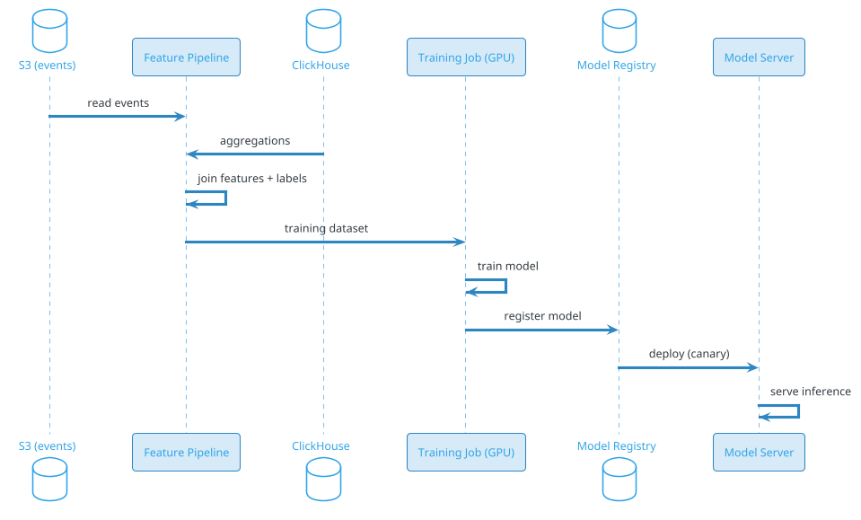
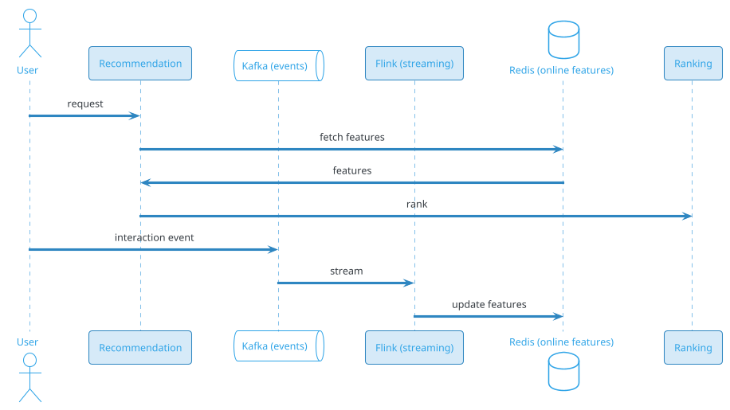

# Recommendation Engine

## Problem Statement

Design a general-purpose recommendation engine that powers personalized suggestions across a large platform — e-commerce (Amazon), video (Netflix, YouTube), music (Spotify), social (Instagram, TikTok), news, and more. The engine takes a user + context and returns a ranked list of items the user is most likely to engage with. It must handle billions of users and items, provide sub-200 ms recommendations, and learn continuously from feedback.

**Example:**

```
User Priya opens an app:

  1. App requests recommendations: "what should Priya see next?"
  2. Recommendation service receives request (user_id, context)
  3. Returns top 20 items in < 200 ms
  4. App displays them, tracks impressions and engagements
  5. Engagements feed back into training pipeline
  6. Model improves continuously

Scenarios:
  - E-commerce: "Products you might like"
  - Video: "Up next" / "For You"
  - Music: "Discover Weekly"
  - Social: "Suggested for you"
  - News: "Top picks"
  - Ads: "Sponsored for you"

Scale:
  - 2B users
  - 1B items
  - 10B recommendation requests/day (~116K/sec avg, 580K/sec peak)
  - 100B+ interactions/day (impressions, clicks, purchases)
  - Sub-200 ms latency p99
  - Continuous learning (hourly model updates)
```

**Real-world systems:** Amazon Recommendations, Netflix Personalization, YouTube Recommendations, TikTok For You, Spotify Discover Weekly, Pinterest Related Pins, Alibaba, LinkedIn Feed.

**Why it's interesting:**

- **Two-tower + ranker** — the modern recommendation architecture
- **Candidate generation vs ranking** — scale is impossible without two stages
- **Embeddings** — user and item representations, learned from behavior
- **Cold start** — new users, new items
- **Feedback loop** — the system trains on its own output
- **Exploration vs exploitation** — bandits, diversity, serendipity
- **Feature store** — online + offline, critical infrastructure
- **Real-time signals** — session context, trending
- **Multi-objective** — engagement, satisfaction, retention, revenue
- **Latency vs quality** — trade-offs at scale

---

## 1. Requirements Clarification

### Functional Requirements
- **Personalized recommendations**: Per user, per context
- **Multiple surfaces**: Home, "related items", "up next", search
- **Top-N**: Return N items ranked
- **Filters**: Already seen, blocked, out-of-stock, geo-restricted
- **Explanations**: Why this recommendation (optional)
- **Real-time**: Reflect recent behavior within minutes
- **Cold start**: New users, new items
- **Diversity**: Mix of categories, authors, content types
- **Business rules**: Boost promoted items, exclude banned
- **Feedback loop**: Log impressions, clicks, purchases
- **A/B testing**: Compare models
- **User controls**: "Not interested", reset recommendations

### Non-Functional Requirements
- **Scale**: 2B users, 1B items, 10B requests/day
- **Latency**: < 200 ms p99 for recommendation response
- **Availability**: 99.99%
- **Freshness**: Model updates hourly; real-time signals within minutes
- **Accuracy**: High CTR, engagement, retention
- **Diversity**: Prevent filter bubbles
- **Fairness**: No demographic bias
- **Privacy**: GDPR, no leak of PII
- **Cost**: Efficient at massive scale

### Out of Scope
- Search (that's a different problem)
- Ads auction (mentioned briefly)
- Content moderation (separate)
- Full ML training infrastructure (touched on)

---

## 2. Back-of-Envelope Estimation

### Traffic

```
Given:
  Users                = 2,000,000,000
  Items                = 1,000,000,000
  DAU                  = 500,000,000
  Requests/DAU/day     = 20 (feeds, pages)
  Items/request        = 20
  Peak multiplier      = 5x

Average QPS:
  Requests = 500M x 20 / 86,400 = ~115,740/sec

Peak QPS:
  Requests = ~578,700/sec

Candidate scoring:
  Per request: ~500 candidates (pre-rank)
  Per request: ~200 candidates (full rank)
  Total scores/sec = 578,700 x 700 = ~405M/sec peak

Embedding lookups:
  User embedding: 1 per request
  Item embeddings: 500 per request
  Total: ~300M/sec peak
```

### Storage

```
User embeddings:
  2B users x 256 floats x 4 bytes = ~2 TB

Item embeddings:
  1B items x 256 floats x 4 bytes = ~1 TB

Feature store (online):
  User features: 2B x 10 KB = ~20 TB
  Item features: 1B x 5 KB = ~5 TB
  Total: ~25 TB

Feature store (offline):
  Historical features for training
  ~500 TB - 5 PB (depending on retention)

Interaction logs:
  100B/day x 500 bytes = 50 TB/day
  Retained 180 days: ~9 PB

Model artifacts:
  Multiple models (candidate, ranker, reranker)
  Each ~1-10 GB
  Versioned: ~1 TB

Serving cache:
  Hot user embeddings: ~100 GB
  Hot item embeddings: ~200 GB
  Recent features: ~500 GB

Total serving: ~30 TB
Total training: ~10 PB
```

### Bandwidth

```
Internal (recommendation service ↔ feature store):
  578K req/sec x 500 items x 1 KB features = ~289 GB/sec = ~2.3 Tbps

This is INTERNAL traffic — optimized with:
  - Co-location
  - Caching
  - Batching
  - Quantization
```

### Latency Budget

```
Recommendation request (target < 200 ms):

  API gateway:                  ~10 ms
  Auth + rate limit:             ~5 ms
  Candidate generation:          ~30 ms
  Feature fetch (batched):       ~20 ms
  Pre-rank:                      ~20 ms
  Full rank:                     ~80 ms
  Diversity / rules:             ~10 ms
  Serialize:                     ~10 ms
  Network:                       ~15 ms
  Total:                         ~200 ms

Recommendation pipeline stages must fit in budget.
```

---

## 3. High-Level Design

```d2
direction: down

client: "Client (app/web)" {shape: person}
api: API Gateway {shape: hexagon}

reco: Recommendation Service {shape: rectangle}

cand: "Candidate Generator" {shape: rectangle}
user_emb: "User Embedding Store" {shape: cylinder}
item_emb: "Item Embedding Store (ANN)" {shape: cylinder}
pop: "Popularity Store" {shape: cylinder}
graph: "Co-visitation Graph" {shape: cylinder}

prerank: "Pre-Ranker (lightweight)" {shape: rectangle}
rank: "Full Ranker (deep)" {shape: rectangle}
rerank: "Re-Ranker (diversity, rules)" {shape: rectangle}

feature: "Online Feature Store" {shape: cylinder}
model: "Model Server" {shape: rectangle}

kafka: "Kafka (events)" {shape: queue}
ch: "ClickHouse (analytics)" {shape: cylinder}
s3: "S3 (training data)" {shape: cylinder}
train: "Training Pipeline" {shape: rectangle}
registry: "Model Registry" {shape: cylinder}
offline_feat: "Offline Feature Store" {shape: cylinder}

client -> api
api -> reco
reco -> cand
cand -> user_emb
cand -> item_emb
cand -> pop
cand -> graph

reco -> prerank
reco -> rank
reco -> rerank

prerank -> feature
prerank -> model
rank -> feature
rank -> model

reco -> client

client -> kafka : impressions, clicks, purchases
kafka -> ch
kafka -> feature
kafka -> s3
s3 -> train
train -> registry
registry -> model
kafka -> offline_feat
```

### Component Responsibilities

| Component | Role |
|---|---|
| Recommendation Service | Orchestrates pipeline |
| Candidate Generator | Produce ~500 candidates |
| User Embedding Store | User vectors for ANN |
| Item Embedding Store | Item vectors with ANN index |
| Popularity Store | Trending, popular items |
| Co-visitation Graph | Users who X also Y |
| Pre-Ranker | Lightweight filter 500 → 200 |
| Full Ranker | Heavy model 200 → 20 |
| Re-Ranker | Diversity, rules, business |
| Online Feature Store | Low-latency features for ranking |
| Offline Feature Store | Historical features for training |
| Model Server | Serve ML models |
| Kafka | Event bus |
| ClickHouse | Analytics, aggregations |
| S3 | Training data lake |
| Training Pipeline | Offline training |
| Model Registry | Version, deploy, rollback |

### Why This Architecture

- **Two-stage ranking** (candidate → rank) — necessary for scale
- **Two-tower embeddings** — efficient candidate generation via ANN
- **Feature store** — decouples computation from serving
- **Model server** — decouples model updates from code
- **Kafka + S3** — continuous learning pipeline
- **Re-ranker** — business rules + diversity applied after ML

---

## 4. Deep Dive: Two-Tower Model

### The Core Idea

Learn embeddings for users and items in the same vector space:
- **Similarity** = dot product of embeddings
- **Training**: Positive pairs (user, interacted item), negative samples
- **Serving**: ANN search for user's top-K items

### Why Two-Tower?

- **Scalable**: Pre-compute item embeddings; ANN is fast
- **Flexible**: Any user or item features
- **Effective**: Used by YouTube, Google, Meta, Pinterest

### Architecture

```
User Tower:
  Input: user features (demographics, history, context)
  Layers: [512, 256, 128]
  Output: 128-dim user embedding

Item Tower:
  Input: item features (text, images, metadata, engagement)
  Layers: [512, 256, 128]
  Output: 128-dim item embedding

Score: dot_product(user_embedding, item_embedding)
```

### Training

**Data:** User-item interactions (views, clicks, purchases, likes).

**Positive samples:** User interacted with item.

**Negative samples:**
- **Random negatives**: Random items
- **Hard negatives**: Items user saw but didn't interact (more signal)
- **In-batch negatives**: Other items in the same batch (efficient)

**Loss:** Sampled softmax or binary cross-entropy.

**Scale:** Billions of examples per epoch; distributed training.

### Serving

**Candidate generation:**
1. Fetch user embedding (from User Embedding Store)
2. ANN search over item embeddings (top 500)
3. Filter (seen, blocked, unavailable)
4. Pass to pre-ranker

**ANN libraries:** FAISS, ScaNN, HNSW, Milvus.

### Cold Start

**New user:** 
- No history
- Use demographics + context
- Fall back to popularity

**New item:**
- No engagement
- Use content features (text, images)
- Boost in exploration

### Online Updates

- **User embeddings**: Update after each session (async)
- **Item embeddings**: Update after batch of new interactions
- **ANN index**: Rebuilt periodically (hourly)

### Variants

- **Multi-tower**: More than two towers (query, context, etc.)
- **Sequential**: RNN/Transformer over user history
- **Graph**: GNN over user-item graph

---

## 5. Deep Dive: Candidate Generation

### Why Candidates First?

1B items can't be ranked. Instead:
- Generate ~500 candidates from multiple sources
- Then rank with heavy model

### Candidate Sources

| Source | Count | Purpose |
|---|---|---|
| Two-tower ANN | 200 | Personalized |
| User history (recent) | 50 | Recently viewed |
| Co-visitation graph | 100 | "Also viewed" |
| Popular in user's segment | 50 | Demographics |
| Trending | 30 | Global/regional |
| Content-based similarity | 50 | Same category |
| Business promoted | 20 | Ads, sponsored |
| Total | 500 | |

### Two-Tower ANN

- **User embedding** → nearest items
- **Index:** FAISS/ScaNN, ~1B items
- **Latency:** ~5-10 ms per query
- **Batch:** Multiple users per request

### Co-Visitation Graph

- **Edges:** User viewed/clicked A then B
- **Weight:** Frequency
- **Query:** Given recent items, fetch neighbors
- **Storage:** Pre-computed in Redis or Cassandra

### Trending

- **Velocity:** Items gaining engagement fast
- **Window:** Last 1 hour, 24 hours
- **Region-specific**

### Content-Based

- **Same category** as recently viewed
- **Similar embeddings** (text, image)
- **Item-item similarity** from co-engagement

### Business Rules

- **Promoted items** (ads, sponsored)
- **New arrivals** (boost)
- **Editorial picks**

### Filtering

Applied to candidates:
- Already seen (Bloom filter)
- Blocked/muted
- Out of stock
- Geo-restricted
- Age-restricted

### Diversity in Candidates

- Ensure candidates span categories
- Avoid clustering on one topic
- Include novel items

---

## 6. Deep Dive: Ranking

### Full Ranker

Takes ~200 candidates, outputs ranked list.

**Model:** DLRM, DeepFM, Wide&Deep, or Transformer-based.

**Features:**
- **User features** (50): demographics, history, context
- **Item features** (100): content, metadata, engagement
- **Cross features** (50): user-item interactions
- **Context features** (20): time, device, session

**Outputs (multi-task):**
- P(click)
- P(like)
- P(purchase)
- P(dwell > 5s)
- P(hide)

**Final score:** Weighted sum of tasks.

### Feature Engineering

**User features:**
- Age, gender, location (bucketed)
- Interests (topics from history)
- Recent interactions (last 10 items)
- Session features (time, device)
- Engagement rates (last 7, 30 days)

**Item features:**
- Category, brand, price
- Text embeddings (BERT)
- Image embeddings (CNN)
- Engagement stats (views, likes)
- Freshness (age)

**Cross features:**
- User-category affinity
- User-brand affinity
- Historical interaction (has user interacted with this item?)
- Price match (in user's range?)

**Context features:**
- Time of day
- Day of week
- Device type
- Session length
- Current page/context

### Position Bias Correction

Users click top items more. Correct via:
- **Position as feature** (set to 1 at serving)
- **Inverse propensity weighting** in training

### Training

- **Data:** Last 30 days of impressions + engagements
- **Labels:** Binary per task
- **Loss:** Weighted BCE per task
- **Batch:** Large (8192+)
- **Hardware:** GPU cluster
- **Duration:** ~4 hours per epoch
- **Frequency:** Daily full + hourly incremental

### Serving

- **Batch requests** from multiple users
- **GPU inference** (~1 ms per candidate)
- **Cache** item features

---

## 7. Deep Dive: Feature Store

### Why a Feature Store?

Feature engineering is:
- **Expensive** (complex joins, aggregations)
- **Repeated** (same features used in many models)
- **Inconsistent** (online vs offline skew)

A feature store:
- **Centralizes** feature computation
- **Ensures consistency** (online = offline)
- **Enables reuse** across models
- **Provides low-latency** serving

### Online Feature Store

- **Storage:** Redis, Cassandra, DynamoDB
- **Latency:** < 10 ms
- **Updates:** Streaming (from Kafka)
- **Query:** Point lookups by key

**Features:**
- User features (updated hourly)
- Item features (updated 15 min)
- Session features (real-time)

### Offline Feature Store

- **Storage:** S3 (Parquet), Hive, Delta Lake
- **Latency:** Minutes to hours
- **Use:** Training data generation
- **Query:** Batch (Spark, Presto)

### Consistency

**Problem:** Online and offline features may differ (skew).
**Solution:** Same code path for both.

**Implementation:**
- Feature definitions in code (Python DSL)
- Compute for both online and offline
- Test parity

### Feature Groups

```
user_features:
  - demographics (age, gender, location)
  - engagement (last_7d_clicks, last_30d_purchases)
  - interests (topic_affinity_vector)
  - session (current_session_length)

item_features:
  - content (category, brand, text_embedding, image_embedding)
  - engagement (views_7d, ctr_7d, purchase_rate)
  - freshness (days_since_listed)

interaction_features:
  - user_item_affinity
  - has_purchased_before
  - view_count_by_user
```

### Streaming Updates

- Kafka events (clicks, views, purchases)
- Streaming processor (Flink, Spark Streaming)
- Compute aggregated features
- Write to online feature store (< 1 min lag)

### Cost

- **Online store**: Redis/Cassandra at scale (~$1-5M/month)
- **Offline store**: S3 + compute (~$1-5M/month)
- **Streaming**: Flink cluster (~$500K/month)

---

## 8. Deep Dive: Continuous Learning

### The Feedback Loop

```
User sees recommendation → engages or not → event logged
                                           ↓
                                    Kafka → Feature store
                                           ↓
                                    Training data
                                           ↓
                                    Model updated
                                           ↓
                                    Deployed → serves better recommendations
```

### Data Collection

**Every impression:**
```json
{
  "event_id": "evt-abc",
  "user_id": "u-123",
  "item_id": "i-456",
  "position": 3,
  "surface": "home_feed",
  "model_version": "v42.3",
  "features": {...},
  "timestamp": "2026-09-19T10:00:00Z"
}
```

**Every engagement:**
```json
{
  "event_id": "evt-def",
  "user_id": "u-123",
  "item_id": "i-456",
  "event_type": "click",        // or view, purchase, like
  "timestamp": "2026-09-19T10:00:05Z",
  "dwell_seconds": 12.5
}
```

**Streamed to Kafka → ClickHouse + S3.**

### Training Pipeline



### Online Learning

**Daily full retrain** + **hourly incremental** + **streaming updates**.

**Streaming:**
- Online SGD (risky)
- Multi-armed bandits (safe)
- Real-time user embedding updates

### Bandits for Exploration

**Problem:** Pure exploitation locks into known items.
**Solution:** Allocate ~5% traffic to exploration.

**Approaches:**
- **ε-greedy**: Random 5% of the time
- **Thompson Sampling**: Bayesian exploration
- **LinUCB**: Contextual bandits
- **Neural bandits**: Deep learning + exploration

**Reward:** Engagement (click, dwell, purchase).

### A/B Testing

- **Control** (95%): Current model
- **Treatment** (5%): New model
- **Metrics:** CTR, dwell, purchase rate, retention
- **Duration:** 2 weeks minimum
- **Ship if:** Statistically significant improvement, no guardrail degradation

### Model Versioning

- **Registry:** MLflow, custom
- **Metadata:** Training date, metrics, hyperparameters
- **Rollback:** Instant revert if degradation
- **Canary:** Deploy to 5%, monitor, expand

---

## 9. Deep Dive: Diversity and Re-ranking

### Why Diversity?

**Problem:** Pure relevance ranking leads to:
- Filter bubbles
- Monotony (same category repeated)
- Over-optimization for CTR (clickbait)
- Long-term dissatisfaction

**Solution:** Diversity constraints post-ranking.

### Diversity Dimensions

- **Category**: Mix of topics
- **Author/brand**: Different sources
- **Price**: Range
- **Freshness**: Mix old and new
- **Format**: Mix content types

### Re-ranking Algorithms

**MMR (Maximal Marginal Relevance):**
```
MMR = λ * relevance - (1-λ) * similarity_to_selected
```

Iteratively pick items that are relevant but different from already picked.

**DPP (Determinantal Point Process):**
- Probabilistic model for diverse subsets
- Higher probability for diverse sets

**Business Rules:**
- Max 2 consecutive from same brand
- Max 30% from one category
- At least one new item

### Multi-Objective

Combine:
- **Engagement** (clicks, dwell)
- **Satisfaction** (no hides, no reports)
- **Diversity** (spread)
- **Freshness** (timeliness)
- **Revenue** (for ads)

**Weights** tuned via A/B testing.

### Business Rules

- **Promoted items**: Boost by fixed %
- **Excluded items**: Remove (banned, out-of-stock)
- **Editorial picks**: Insert manually
- **New arrivals**: Boost for exposure

### Fairness

- **Demographic parity**: Similar reach across groups
- **Equal opportunity**: Same accuracy across groups
- **Calibration**: Predictions match reality per group

**Audits** regularly.

### Re-Ranker Implementation

- **Deterministic**: Rules applied in order
- **Probabilistic**: DPP sampling
- **ML-based**: Trained to optimize for final objective
- **Fast**: Must fit in ~10 ms budget

---

## 10. Deep Dive: Cold Start

### New User

**Problem:** No history → no signals.

**Solutions:**
1. **Onboarding**: Ask for interests, favorite categories
2. **Demographics**: Age, gender, location
3. **Popular in region**: Trending in user's area
4. **Fast learning**: Update embeddings after first few interactions
5. **Explore**: Show diverse items to learn quickly

### New Item

**Problem:** No engagement history.

**Solutions:**
1. **Content features**: Text, images, category
2. **Two-tower**: Item tower works with content only
3. **Explore**: Allocate small % of traffic
4. **Boost**: Temporarily boost new items
5. **Similar items**: Recommend to users who liked similar content

### Cold Start for New Categories

- Similar to new items
- Use content similarity
- Cross-category transfer

### Cold Start for New Regions

- Use global popularity
- Learn quickly from local interactions
- Consider cultural differences

### Fast Adaptation

- **Streaming embeddings**: Update after each session
- **Bandits**: Learn policy quickly
- **Meta-learning**: Model that generalizes (MAML)

---

## 11. Deep Dive: Real-Time Signals

### Session Context

- **Recent items viewed** (last 10)
- **Time in session**
- **Device**
- **Current page**
- **Search query** (if any)

**Use:** Adjust recommendations within a session.

### Trending Signals

- **Velocity**: Items gaining engagement fast
- **Window**: Last 1h, 24h, 7d
- **Update**: Every 1-5 min
- **Boost**: Trending items

### Real-Time Features

- **Last item clicked**: Recent behavior
- **Session length**: Engagement
- **Time of day**: Context
- **Network quality**: Context

**Computed in Flink/Spark Streaming, served from Redis.**

### Streaming Feature Updates



**Latency:** < 1 min for streaming features.

### Personalization in Real-Time

- **Micro-sessions**: Adjust within a session
- **Reward shaping**: Immediate reward influences next recommendation
- **Bandits**: Explore within session

---

## 12. Deep Dive: Evaluation

### Offline Metrics

- **AUC**: Area under ROC curve (binary classification)
- **NDCG**: Ranking quality
- **Recall@K**: Fraction of relevant items in top-K
- **MAP**: Mean Average Precision
- **Log loss**: Prediction calibration

**Limitation:** Offline metrics may not correlate with online.

### Online Metrics

- **CTR** (click-through rate)
- **Dwell time**
- **Purchase rate**
- **Engagement rate**
- **Session length**
- **Retention** (D1, D7, D30)
- **Diversity metrics** (category spread)

### Counterfactual Evaluation

- **Inverse propensity scoring**: Correct for bias
- **Off-policy evaluation**: Estimate new policy from old data
- **Simulation**: Simulated environment for testing

### Long-Term Value

- **Holdout:** 1% of users see control model; compare retention
- **Reward shaping:** Include long-term reward in objective
- **Causal inference:** Estimate causal effect of model change

### Guardrail Metrics

- **Latency**: Must stay < 200 ms
- **Diversity**: Must stay above threshold
- **Fairness**: No demographic bias
- **System health**: Error rate, CPU

**A/B test blocks if guardrails degrade.**

### Feedback Loop Dangers

- **Popularity bias**: Popular items get more exposure
- **Feedback loop**: Model recommends → users engage → model learns to recommend more
- **Filter bubble**: Narrow interests

**Mitigation:** Diversity, exploration, debiasing.

---

## 13. Scaling Considerations

### Read Scaling

- **ANN index** sharded (billion items)
- **User embeddings** sharded by user_id
- **Feature store** sharded by key
- **Redis** cluster for online features
- **Model server** horizontally scaled

### Write Scaling

- **Kafka** for events (partitioned by user_id)
- **ClickHouse** for analytics (high write)
- **Streaming** for real-time features
- **Offline training** (batch, scheduled)

### Sharding

**ANN index:** Shard by item_id hash; multiple shards queried in parallel.
**User embeddings:** Shard by user_id.
**Feature store:** Shard by user_id (user features) or item_id (item features).
**Kafka:** Partition by user_id (user events) or item_id (item events).

### Multi-Region

```d2
direction: down

us: "US Region" {
  shape: cloud
}
eu: "EU Region" {
  shape: cloud
}
apac: "APAC Region" {
  shape: cloud
}

usfeat: "US Feature Store" {
  shape: cylinder
}
eufe: "EU Feature Store" {
  shape: cylinder
}
apacfe: "APAC Feature Store" {
  shape: cylinder
}

us -> usfeat
eu -> eufe
apac -> apacfe
```

**Per-region deployment** for low latency.
**Model trained globally**, deployed per region.
**Compliance:** EU data in EU.

### Peak Handling

- **Auto-scale** recommendation servers
- **Batch requests** at edge
- **Cache** recent responses
- **Pre-warm** ANN indexes
- **Fallback** to popularity if overloaded

### Cost Optimization

| Component | Optimization |
|---|---|
| ANN | Quantization, sharding |
| Feature store | Caching, compression |
| Model inference | GPU batching, quantization |
| Training | Spot instances, distributed |
| Data storage | Tiering, sampling |

### Compute at Scale

- **Recommendation service**: ~500 servers (peak)
- **GPU inference**: ~50-100 servers
- **Training**: ~20-50 GPU servers (periodic)
- **Feature store**: ~100 servers
- **Total**: ~1000 servers + GPU

---

## 14. Bottlenecks and Trade-offs

| Concern | Solution | Trade-off |
|---|---|---|
| Scale | Two-stage ranking | Accuracy loss vs 1-stage |
| Latency | Pre-rank + light rank | Less accurate |
| Cold start | Fallbacks + exploration | Lower initial quality |
| Position bias | Feature + IPW | Complex training |
| Diversity | Post-rerank | May demote relevant |
| Long-term value | Holdout + reward shaping | Slow iteration |
| Real-time | Streaming features | Complexity |
| Feature skew | Shared computation | Implementation effort |
| Training | Sampling | Less signal |
| Cost | Quantization, caching | Accuracy loss |

### Design Decisions Summary

| Decision | Choice | Rationale |
|---|---|---|
| Architecture | Two-tower + ranker | Scale + accuracy |
| Candidate gen | ANN over item embeddings | Fast, scalable |
| Pre-rank | Lightweight model | Filter cheaply |
| Full rank | DLRM / DeepFM | Accuracy |
| Re-rank | Diversity + rules | Business + UX |
| Feature store | Online (Redis) + offline (S3) | Consistency |
| Training | Daily + incremental | Freshness |
| Exploration | 5% bandits | Learning |
| Serving | GPU, batched | Performance |
| Evaluation | Offline + online + holdout | Robust |

---

## 15. Failure Scenarios

### Recommendation Service Down

**Impact:** No recommendations; fallback needed.

**Mitigation:**
- Fallback to popularity
- Cached responses
- Auto-restart
- Alert ops

### Feature Store Down

**Impact:** Features missing; ranking degrades.

**Mitigation:**
- Serve with cached features
- Fallback to simple model
- Alert ops

### ANN Index Down

**Impact:** Candidate generation fails for two-tower.

**Mitigation:**
- Fallback to co-visitation
- Fallback to popular
- Alert ops

### Model Server Down

**Impact:** No ML ranking.

**Mitigation:**
- Fallback to popularity + recency
- Auto-restart
- Alert ops

### Training Pipeline Failure

**Impact:** Stale model.

**Mitigation:**
- Use last-good model
- Alert ML team
- Retry training

### Feedback Loop Bias

**Impact:** Filter bubbles, degraded experience.

**Mitigation:**
- Monitor diversity metrics
- Inject exploration
- Debiasing techniques
- Holdout cohorts

### Position Bias

**Impact:** Ranking degrades due to biased training.

**Mitigation:**
- Position as feature
- IPW in training
- Regular audits

### Cold Start Failure

**Impact:** Bad experience for new users/items.

**Mitigation:**
- Fallbacks (popular, demographics)
- Exploration
- Onboarding

### Latency Spike

**Impact:** Slow feeds; user frustration.

**Mitigation:**
- Timeout at 200 ms
- Serve cached results
- Fallback to simpler model
- Alert ops

### Adversarial Attack

**Impact:** Model reverse-engineered, gamed.

**Mitigation:**
- Rate limit API
- Don't expose scores
- Differential privacy in training
- Detect anomalies

---

## 16. Monitoring and Alerts

### Key Metrics

| Metric | Target | Alert Threshold |
|---|---|---|
| Recommendation p99 | < 200 ms | > 500 ms |
| ANN p99 | < 20 ms | > 50 ms |
| Feature fetch p99 | < 10 ms | > 30 ms |
| Model inference p99 | < 100 ms | > 250 ms |
| CTR | baseline | drop > 10% |
| Dwell time | baseline | drop > 10% |
| Diversity score | target range | outside range |
| Fairness metric | within tolerance | outside |
| Training time | < 4 hours | > 8 hours |
| Model staleness | < 24 hours | > 48 hours |
| Cold start success | baseline | drop > 20% |

### Dashboards

- **Traffic**: Requests/sec, candidates/sec
- **Latency**: p50/p95/p99 per stage
- **Model**: Version, inference rate, accuracy
- **Engagement**: CTR, dwell, purchase
- **Diversity**: Category, brand, freshness
- **Fairness**: Demographic metrics
- **Feature store**: Freshness, skew, hit rate
- **Training**: Duration, GPU utilization
- **Infrastructure**: Redis, Kafka, S3 health
- **Business**: DAU, revenue, retention

### Alerts

- **P0**: Recommendation service down, feature store down, model serving down
- **P1**: p99 > 500 ms, CTR drop > 10%
- **P2**: Training failure, model staleness > 48h
- **P3**: Diversity drift, cold start degradation

### Business KPIs

- **DAU/MAU** ratio
- **Session length**
- **Items per session**
- **CTR**
- **Dwell time per item**
- **Purchase rate**
- **Retention** (D1, D7, D30)
- **Diversity score**
- **Recommendation-driven revenue**

---

## 17. Cost Estimation

Rough monthly cost (AWS, us-east-1) for 2B users:

| Component | Spec | Cost/month |
|---|---|---|
| Recommendation servers | 500 x c6g.2xlarge | ~$120,000 |
| GPU inference | 100 x g4dn.xlarge | ~$50,000 |
| Feature store (online Redis) | 200 x cache.r6g.2xlarge | ~$100,000 |
| Feature store (offline S3) | 10 PB | ~$230,000 |
| ANN index servers | 100 x r6g.2xlarge | ~$60,000 |
| Model server | 100 x c6g.2xlarge | ~$24,000 |
| Training cluster (GPU) | 50 x p3.2xlarge | ~$90,000 |
| ClickHouse | 30 x i3.2xlarge | ~$30,000 |
| Kafka (MSK) | 50 brokers | ~$25,000 |
| PostgreSQL | 20 shards x db.r6g.2xlarge | ~$46,000 |
| Monitoring | Datadog | ~$50,000 |
| **Total** | | **~$825,000/month** |

**Per user:** ~$0.0004/month.

**Cost optimization:**
- **Training data storage** dominates (~28%) — sample, compress, tier
- **GPU inference** — quantization, batching, spot
- **Feature store** — caching, compression
- **ANN** — quantization
- **Reserved instances** — 30-40% savings

**Note:** Recommendation engines pay for themselves via increased engagement and revenue.

---

## 18. Extensions and Follow-ups

### Sequential Recommendations

- **Session-based**: RNN/Transformer over user history
- **BERT4Rec**: Transformer for sequential rec
- **GRU4Rec**: RNN-based
- **SASRec**: Self-attention

### Graph Neural Networks

- **User-item graph**: GNN over bipartite graph
- **PinSage**: Pinterest's GNN
- **LightGCN**: Simplified GCN

### Multi-Modal Recommendations

- Text + image + video embeddings
- Cross-modal attention
- Better content understanding

### Conversational Recommendations

- Chatbot-based
- Natural language queries
- Multi-turn dialogue

### Reinforcement Learning

- Long-term reward optimization
- Policy gradient
- Model-based RL

### Causal Inference

- Debiasing
- Counterfactual reasoning
- Uplift modeling

### Federated Learning

- On-device personalization
- Privacy-preserving
- Reduced server load

### Explainable Recommendations

- "Because you watched X"
- Feature importance (SHAP)
- Counterfactual explanations

### Multi-Objective Optimization

- Pareto frontier
- Weighted sum
- Constrained optimization

### Fairness

- Demographic parity
- Equal opportunity
- Calibration per group

### Privacy

- Differential privacy
- Federated learning
- On-device inference

### Real-Time Personalization

- Streaming features
- Session-based
- Contextual bandits

### Cross-Domain

- Transfer learning
- Multi-task learning
- Domain adaptation

### LLM-Based Recommendations

- LLM as reranker
- Natural language reasoning
- Explainable + effective

### Generative Recommendations

- Generate items (rare)
- Generate explanations
- Generate queries

### Web3

- Decentralized recommendation
- Token-gated content
- Blockchain identity

---

## 19. Summary

| Aspect | Decision |
|---|---|
| Architecture | Two-tower + ranker + re-ranker |
| Candidate generation | Two-tower ANN + co-visitation + popular |
| Pre-rank | Lightweight model |
| Full rank | DLRM / DeepFM |
| Re-rank | Diversity + business rules |
| Feature store | Online (Redis) + offline (S3) |
| Training | Daily full + hourly incremental |
| Exploration | 5% bandits |
| Serving | GPU, batched, quantized |
| Evaluation | Offline + online + holdout |
| Scale | 2B users, 10B requests/day |
| Latency | < 200 ms p99 |
| Availability | 99.99% |
| Cost | ~$825K/month |

**Key takeaways:**

- **Two-tower + ranker** is the modern recommendation architecture
- **Candidate generation** (ANN, co-visitation, popular) → **rank** (DLRM) → **re-rank** (diversity)
- **Feature store** (online + offline) is critical infrastructure — consistency matters
- **Continuous learning** (daily + hourly + streaming) keeps models fresh
- **Exploration** (bandits) prevents lock-in and improves long-term
- **Cold start** handled with fallbacks, content features, and fast learning
- **Diversity** enforced post-ranking (MMR, DPP, rules)
- **Position bias** corrected via feature + IPW
- **Feedback loops** are dangerous — monitor diversity and use holdouts
- **Long-term value** (retention) must be measured, not just CTR
- **Fairness audits** are essential (EU regulations, user trust)
- **Cost is significant** but pays for itself via engagement and revenue

### Similar Pattern Problems

- News Feed Ranking (ranking pipeline)
- Social Feed / Timeline (recommendations in feed)
- Content Sharing / Microblog (recommendations)
- Video Streaming (recommendations)
- Music Streaming (Discover Weekly)
- Product Catalog (product recommendations)
- Job Search Platform (job recommendations)
- Ads System (ad ranking, CTR prediction)
- Search Ranking (query-document ranking)
- Trending Detection (real-time signals)