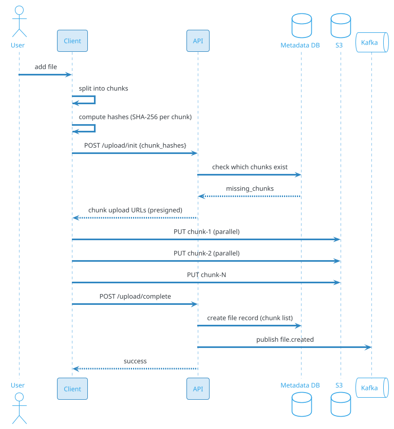
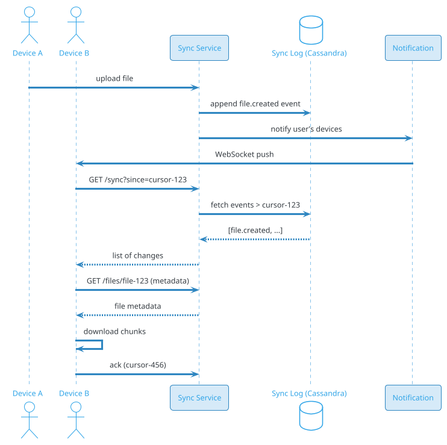
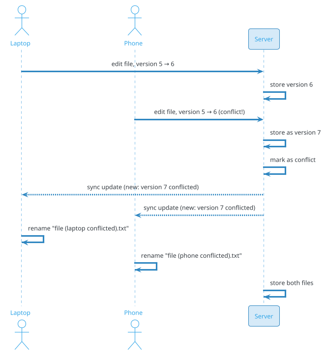

# File Storage Service (Dropbox / Google Drive / OneDrive)

## Problem Statement

Design a cloud file storage and sync service like Dropbox, Google Drive, or OneDrive. Users upload files, sync them across devices, share with others, and access from anywhere. The system must handle billions of files, exabytes of storage, and synchronization conflicts across multiple devices with eventual consistency and zero data loss.

**Example:**

```
User Priya uploads a 500 MB video from her laptop:

Flow:
  1. Laptop detects new file in Dropbox folder
  2. Client splits file into 4 MB chunks
  3. Computes content hash (SHA-256) per chunk
  4. Checks with server: "which chunks do you already have?" (dedup)
  5. Uploads only missing chunks
  6. Server assembles file, stores metadata
  7. Server notifies all of Priya's other devices
  8. Phone syncs: downloads missing chunks
  9. Priya edits file on laptop
 10. New version uploaded (delta)
 11. Phone syncs the new version
 12. Priya shares folder with Bob
 13. Bob receives link, downloads file

Key challenges:
  - Chunked upload/download (resumable)
  - Deduplication (block-level)
  - Sync across devices (eventual consistency)
  - Conflict resolution (concurrent edits)
  - Sharing (permissions, links)
  - Versioning (file history)
  - Encryption (at rest + in transit)
  - Thumbnails and previews
  - Search (metadata, content)

Scale:
  - 500M users, 100M DAU
  - 1T files total
  - 10B file operations/day
  - 500 PB storage (exabytes for large providers)
  - 10 PB/day uploads (peak)
  - Sync across 5 devices per user
```

**Real-world systems:** Dropbox, Google Drive, OneDrive, iCloud Drive, Box, pCloud, Mega.

**Why it's interesting:**

- **Exabyte-scale storage** — PB/day of uploads
- **Deduplication** — save 50%+ storage
- **Sync** — complex multi-device consistency
- **Conflict resolution** — user-friendly handling
- **Chunked upload** — resumable, parallel
- **Encryption** — at rest + in transit, optional E2EE
- **Sharing** — permissions, public links
- **Versioning** — file history, retention
- **Performance** — LAN sync, delta sync
- **Cost** — storage + egress dominate

---

## 1. Requirements Clarification

### Functional Requirements
- **Upload**: Files of any size, chunked, resumable
- **Download**: Fast, resumable, parallel
- **Sync**: Across devices (Windows, Mac, Linux, iOS, Android)
- **Folder structure**: Nested folders, rename, move, delete
- **Sharing**: File/folder sharing with users, public links
- **Permissions**: Read, write, comment
- **Versioning**: File history, restore old versions
- **Search**: By filename, content (Premium)
- **Trash**: Deleted files recoverable for 30 days
- **Preview**: Thumbnails, view in browser
- **Collaborative editing**: Docs, Sheets (integration)
- **Selective sync**: Choose which folders sync
- **LAN sync**: Direct device-to-device on local network
- **Offline access**: Cached files available offline
- **File locking**: Prevent concurrent edits
- **Audit log**: Who accessed what (Business)
- **Compliance**: HIPAA, GDPR, SOC 2

### Non-Functional Requirements
- **Scale**: 500M users, 1T files, 500 PB storage
- **Latency**: Upload start < 500 ms; sync notification < 5 sec
- **Availability**: 99.99%
- **Consistency**: Eventual for sync; strong for metadata
- **Durability**: 11 nines (99.999999999%) — never lose data
- **Throughput**: Handle PB/day uploads
- **Bandwidth**: Efficient chunking, dedup
- **Security**: Encryption at rest + in transit
- **Compliance**: GDPR, HIPAA, SOC 2, ISO 27001
- **Cost**: Storage + egress dominate

### Out of Scope
- Document editing (Google Docs — separate)
- Email attachments
- CDN (separate, for public sharing)
- Full version control (that's Git)

---

## 2. Back-of-Envelope Estimation

### Traffic

```
Given:
  Users                = 500,000,000
  DAU                  = 100,000,000
  Files total          = 1,000,000,000,000
  File operations/day  = 10,000,000,000
  Avg file size        = 5 MB
  Uploads/day          = 2,000,000,000
  Downloads/day        = 5,000,000,000
  Peak multiplier      = 5x

Average QPS:
  Uploads = 2B / 86,400 = ~23,148/sec
  Downloads = 5B / 86,400 = ~57,870/sec
  Metadata ops = 10B / 86,400 = ~115,740/sec
  Total = ~200K ops/sec

Peak QPS (5x):
  Metadata = ~578,700/sec
  Uploads = ~116,000/sec
  Downloads = ~289,000/sec

Chunks:
  4 MB chunks → 5 MB file = 2 chunks avg
  Peak chunk ops = ~1M/sec
```

### Storage

```
Files:
  1T files x 5 MB avg = ~5 EB (raw)
  With dedup (50% savings): ~2.5 EB

Metadata:
  1T files x 1 KB = ~1 TB (file metadata)
  Folder structure: 100B folders x 500 bytes = ~50 TB
  Versioning: 3x file count = ~3 TB

User accounts:
  500M users x 5 KB = ~2.5 TB

Sharing:
  500B shares x 200 bytes = ~100 TB

Thumbnails:
  200B files with thumbnails x 50 KB = ~10 PB

Search index:
  Filenames: 1T x 100 bytes = ~100 TB
  Content (Premium): 10% of files = ~500 TB

Total hot: ~20 PB
Total cold: ~3 EB
```

### Bandwidth

```
Uploads:
  2B files/day x 5 MB = ~10 PB/day
  With dedup (50% savings): ~5 PB/day
  Avg: ~58 GB/sec = ~464 Gbps
  Peak: ~2.3 Tbps

Downloads:
  5B downloads/day x 5 MB = ~25 PB/day
  Avg: ~290 GB/sec = ~2.3 Tbps
  Peak: ~11.6 Tbps

Internal (chunk storage, replication):
  ~5 Tbps peak

Total egress: ~15 Tbps peak (significant!)
```

### Latency Budget

```
Upload initiation:
  Client → API:                 ~50 ms
  Auth:                          ~10 ms
  Create upload session:         ~20 ms
  Return chunk URLs:             ~20 ms
  Total:                         ~100 ms

Chunk upload:
  Client → S3 (direct):          ~200 ms (10 MB chunk)

Sync notification:
  Server → Devices:              ~2-5 sec (WebSocket)
  Depends on device online

Download:
  Client → CDN/S3:               ~100-500 ms (first chunk)
  Streaming download

Metadata operations:
  List folder:                   ~50-100 ms
  Create/delete:                 ~100 ms
  Share:                         ~200 ms
```

---

## 3. High-Level Design

```d2
direction: down

client: "Client (Desktop/Mobile/Web)" {shape: person}

cdn: "CDN (static, public files)" {shape: cloud}
lb: Load Balancer {shape: hexagon}
api: API Gateway {shape: hexagon}

sync: Sync Service {shape: rectangle}
meta: Metadata Service {shape: rectangle}
chunk: Chunk Service {shape: rectangle}
share: Share Service {shape: rectangle}
search: Search Service {shape: rectangle}
preview: Preview Service {shape: rectangle}
version: Version Service {shape: rectangle}
notif: Notification Service {shape: rectangle}

block: "Block Storage (S3)" {shape: cylinder}
pdb: "PostgreSQL (metadata)" {shape: cylinder}
cass: "Cassandra (sync log)" {shape: cylinder}
redis: "Redis (sessions, cache)" {shape: cylinder}
es: "Elasticsearch (search)" {shape: cylinder}
s3thumb: "S3 (thumbnails)" {shape: cylinder}

kafka: Kafka {shape: queue}

client -> cdn
cdn -> lb
lb -> api

api -> sync
api -> meta
api -> chunk
api -> share
api -> search
api -> version

sync -> cass
sync -> kafka
meta -> pdb
meta -> redis
chunk -> block
chunk -> pdb
share -> pdb
search -> es
preview -> s3thumb
version -> pdb

kafka -> notif
notif -> client
```

### Component Responsibilities

| Component | Role |
|---|---|
| CDN | Public file sharing, static assets |
| Load Balancer | Route to API |
| API Gateway | Auth, rate limiting, routing |
| Sync Service | Cross-device sync, notifications |
| Metadata Service | File/folder metadata (name, size, path) |
| Chunk Service | Chunk upload/download, dedup |
| Share Service | Permissions, public links |
| Search Service | Filename + content search |
| Preview Service | Thumbnails, doc previews |
| Version Service | File history, restore |
| Notification Service | Push updates to devices |
| Block Storage (S3) | Actual file chunks |
| PostgreSQL | Metadata (users, files, folders) |
| Cassandra | Sync log (event stream) |
| Redis | Sessions, cache, locks |
| Elasticsearch | Search index |
| S3 (thumbnails) | Thumbnails, previews |
| Kafka | Event bus |

### Why This Architecture

- **S3** for block storage (durable, cost-effective)
- **PostgreSQL** for metadata (relational, ACID)
- **Cassandra** for sync log (time-series, multi-region)
- **Redis** for hot cache, locks, sessions
- **Kafka** for async sync notifications
- **Elasticsearch** for search
- **CDN** for public sharing
- **WebSocket** for real-time sync notifications

---

## 4. Deep Dive: Chunked Upload and Deduplication

### Why Chunking?

- **Resumable**: Restart from last uploaded chunk
- **Parallel**: Multiple chunks at once
- **Deduplication**: Same chunk across files/versions
- **Efficient**: Only upload changed chunks (delta sync)

### Chunk Size

- **4 MB** — Dropbox default
- **8 MB** — Google Drive
- **Trade-off**: Smaller = more requests; larger = less dedup

**Recommendation:** 4 MB (good balance).

### Chunking Algorithm

**Content-defined chunking (CDC):**
- Chunk boundaries based on content (Rabin fingerprint)
- Same content → same chunks (even if file changes)
- **Better dedup** than fixed-size chunks

**Fixed-size chunking:**
- Every 4 MB is a chunk
- Simpler
- **Worse dedup** if content shifts

**Recommendation:** CDC for dedup-heavy systems (Dropbox), fixed for simplicity.

### Upload Flow



### Deduplication

**Client-side dedup:**
1. Compute hash of each chunk
2. Send hashes to server
3. Server returns which chunks exist
4. Client uploads only missing chunks

**Server-side dedup:**
- When new file arrives, check chunk hashes
- Reference existing chunks (no re-upload)
- **Storage saved:** 30-60% in typical workloads

**Chunk store structure:**

```
s3://chunks/{chunk_hash[:2]}/{chunk_hash[2:4]}/{chunk_hash}
```

Sharding by hash prefix for even distribution.

### File Reconstruction

A file is a list of chunk references:

```json
{
  "file_id": "file-123",
  "name": "video.mp4",
  "size": 524288000,
  "chunks": [
    {"hash": "abc123...", "size": 4194304},
    {"hash": "def456...", "size": 4194304},
    {"hash": "ghi789...", "size": 2097152}
  ],
  "content_hash": "sha256-of-full-file"
}
```

To download: fetch chunks in order, concatenate.

### Delta Sync (Versioning)

**Problem:** User edits 1% of a 1 GB file. Uploading 1 GB again is wasteful.

**Solution:** Delta sync:
1. Client computes delta (chunks that changed)
2. Uploads only changed chunks
3. Server updates chunk list
4. Only new chunks stored

**Dedup impact:** A single chunk change = only 1 chunk uploaded.

### Upload Optimization

- **Parallel chunks:** 4-8 at once
- **Presigned URLs:** Client uploads directly to S3
- **Resume:** Client tracks uploaded chunks
- **Retry:** Exponential backoff
- **Compression:** Gzip before upload (optional)

### Download Optimization

- **Parallel chunks:** Multiple chunks at once
- **Range requests:** Partial file download
- **Streaming:** Play while downloading
- **Resume:** Restart from last complete chunk
- **Cache:** Recently downloaded files cached locally

### Upload Scale

```
2B files/day
5 MB avg
= ~10 PB/day

With dedup: ~5 PB/day actually stored
Peak: ~2.3 Tbps ingress

Concurrent uploads: ~100K
Each: 4-8 chunks in flight
= ~500K concurrent S3 PUT requests
```

**S3 handles this easily.**

---

## 5. Deep Dive: Sync Across Devices

### The Challenge

User has 5 devices (laptop, desktop, phone, tablet, web). All should stay in sync.

**Requirements:**
- New file on device A → appears on B, C, D, E
- Rename → synced
- Delete → synced
- Edit → new version
- Conflict resolution if two devices edit

### Sync Architecture

**Server-driven sync:**
- Server is source of truth
- Devices pull updates from server
- Server pushes notifications to online devices

**Event log:**
- Every change = event
- Events stored in order (Cassandra)
- Devices track last-seen event cursor

### Sync Protocol



### Sync Log

**Cassandra:**
```sql
CREATE TABLE sync_events (
    user_id BIGINT,
    device_id BIGINT,                -- or 'all' for user-wide
    event_time TIMESTAMP,
    event_id TIMEUUID,
    event_type TEXT,
    file_id BIGINT,
    payload TEXT,
    PRIMARY KEY ((user_id), event_time, event_id)
) WITH CLUSTERING ORDER BY (event_time DESC);
```

**Retention:** 30-90 days. Older devices do full sync.

### Device Cursors

Each device tracks:
- `last_sync_cursor`: Last event processed
- `pending_uploads`: Local changes not yet synced
- `pending_downloads`: Changes to fetch

### Notification

**WebSocket:**
- Device connects on startup
- Subscribes to user's events
- Receives push on new events
- Falls back to polling

**Push notification:**
- For mobile, when app backgrounded
- APNS/FCM
- User taps → app opens → syncs

### LAN Sync

**Optimization:** If two devices on same LAN:
- They discover each other (mDNS)
- Sync directly (peer-to-peer)
- Server notified of delta
- **Fast** (100x faster than via cloud)

**Used by:** Dropbox (LAN sync), Resilio Sync.

### Selective Sync

- User chooses folders to sync on each device
- Only selected folders downloaded
- Others as "online-only"
- **Saves disk space**

### Online-Only Files

- Metadata synced
- Content downloaded on demand
- Placeholder in filesystem
- Mac: Finder extension; Windows: Explorer integration

### Sync Scale

```
500M users
5 devices avg
= 2.5B device-sync relationships

100M DAU
Each device syncs ~10 times/day
= 1B sync operations/day = ~11.6K/sec

Peak: ~58K/sec sync ops
```

---

## 6. Deep Dive: Conflict Resolution

### The Problem

User edits same file on two devices:
- Laptop: adds paragraph
- Phone: fixes typo

Same file, two versions. Which wins?

### Strategies

**1. Last-write-wins (LWW):**
- Timestamp-based
- Newer version wins
- **Problem:** Loses one edit

**2. Keep both:**
- Create "file (conflicted copy).txt"
- User resolves manually
- **Dropbox's approach**

**3. Merge (for text):**
- 3-way merge (common ancestor)
- For text, doc files
- **Not applicable for binary**

**4. Lock-based:**
- File locked during edit
- Other devices wait
- **Used for Office docs**

**Recommendation:** Depends on file type.

### Conflict Detection

**Server-side:**
- Version number per file
- Client sends version with update
- Server checks: if version changed, conflict

```
Client A: update file-123, version 5
Server: current version is 6 → conflict
```

### Conflict Resolution Flow



### Conflict Types

- **Same file, different devices**: Keep both
- **Same file, same device (offline)**: Merge or keep both
- **Rename vs edit**: Merge
- **Delete vs edit**: Keep edited (deletion wins?) — policy decision

### Conflict-Free Data Types (CRDT)

For collaborative text (docs):
- **CRDT**: Conflict-free replicated data types
- **OT**: Operational transformation
- **Used by:** Google Docs, Figma

**Not applicable for arbitrary files (binary).**

### File Locking

For Office docs:
- Client requests lock before edit
- Other clients see "locked by X"
- Lock released on close
- **Prevents conflicts**

**Trade-off:** Complex, works only if all clients respect locks.

### Conflict Notification

- **UI indicator**: File shows "conflicted" badge
- **Notification**: "File has a conflict"
- **Preview**: Show both versions
- **User action**: Keep one, both, or merge

---

## 7. Deep Dive: Metadata Service

### Metadata Model

```
User
  ├── Devices
  ├── Folders (tree)
  │     ├── Files
  │     └── Sub-folders
  ├── Shared items
  └── Trash
```

### PostgreSQL Schema

```sql
CREATE TABLE users (
    user_id BIGINT PRIMARY KEY,
    email VARCHAR(255) UNIQUE,
    quota_bytes BIGINT,
    used_bytes BIGINT,
    plan VARCHAR(20),
    created_at TIMESTAMP DEFAULT NOW()
);

CREATE TABLE folders (
    folder_id BIGINT PRIMARY KEY,
    user_id BIGINT REFERENCES users(user_id),
    parent_id BIGINT,
    name VARCHAR(500),
    path TEXT,                        -- materialized path
    created_at TIMESTAMP DEFAULT NOW(),
    updated_at TIMESTAMP DEFAULT NOW(),
    deleted_at TIMESTAMP
);
CREATE INDEX idx_folders_user ON folders(user_id, parent_id);
CREATE INDEX idx_folders_path ON folders(user_id, path);

CREATE TABLE files (
    file_id BIGINT PRIMARY KEY,
    user_id BIGINT REFERENCES users(user_id),
    folder_id BIGINT REFERENCES folders(folder_id),
    name VARCHAR(500),
    size_bytes BIGINT,
    content_hash VARCHAR(64),
    version INT DEFAULT 1,
    mime_type VARCHAR(100),
    is_deleted BOOLEAN DEFAULT FALSE,
    created_at TIMESTAMP DEFAULT NOW(),
    updated_at TIMESTAMP DEFAULT NOW(),
    deleted_at TIMESTAMP
);
CREATE INDEX idx_files_user ON files(user_id, folder_id);
CREATE INDEX idx_files_hash ON files(content_hash);
CREATE INDEX idx_files_name ON files(user_id, name);

CREATE TABLE file_chunks (
    file_id BIGINT REFERENCES files(file_id),
    chunk_index INT,
    chunk_hash VARCHAR(64),
    size_bytes INT,
    PRIMARY KEY (file_id, chunk_index)
);

CREATE TABLE file_versions (
    version_id BIGINT PRIMARY KEY,
    file_id BIGINT REFERENCES files(file_id),
    version INT,
    chunks TEXT,                       -- JSON array of chunk refs
    size_bytes BIGINT,
    created_at TIMESTAMP DEFAULT NOW()
);
CREATE INDEX idx_versions_file ON file_versions(file_id, version DESC);

CREATE TABLE shares (
    share_id BIGINT PRIMARY KEY,
    file_id BIGINT,
    folder_id BIGINT,
    owner_id BIGINT REFERENCES users(user_id),
    shared_with_user_id BIGINT,
    shared_with_email VARCHAR(255),
    permission VARCHAR(20),             -- read, write, admin
    link_token VARCHAR(100),
    expires_at TIMESTAMP,
    created_at TIMESTAMP DEFAULT NOW()
);
CREATE INDEX idx_shares_file ON shares(file_id);
CREATE INDEX idx_shares_user ON shares(shared_with_user_id);
CREATE INDEX idx_shares_token ON shares(link_token);

CREATE TABLE devices (
    device_id BIGINT PRIMARY KEY,
    user_id BIGINT REFERENCES users(user_id),
    device_name VARCHAR(200),
    platform VARCHAR(50),
    last_sync_cursor TEXT,
    last_seen_at TIMESTAMP,
    registered_at TIMESTAMP DEFAULT NOW()
);
CREATE INDEX idx_devices_user ON devices(user_id);
```

### Metadata Caching

- **Redis**: Hot metadata (recent files, folder listings)
- **CDN**: Public shared metadata
- **Client cache**: Local metadata for offline

### Metadata Sharding

**Shard by user_id** — all data for a user on one shard.

```
shard_id = hash(user_id) % NUM_SHARDS
```

**Why?** Most queries are per-user (list my files, sync my folder).

### Cross-Shard Queries

- **Shared files**: Query all shards (rare)
- **Admin queries**: Aggregated separately
- **Analytics**: From data warehouse

---

## 8. Deep Dive: Sharing and Permissions

### Sharing Types

**1. Direct user sharing:**
- Share with specific user (email)
- Permission: read/write/admin
- Notification to user

**2. Link sharing:**
- Generate public link
- Optional: password
- Optional: expiry
- Optional: edit permission

**3. Folder sharing:**
- Share entire folder
- Inherited by sub-items
- Revoke = removes access to all

### Permissions Model

```sql
CREATE TABLE permissions (
    resource_type VARCHAR(20),          -- file, folder
    resource_id BIGINT,
    grantee_type VARCHAR(20),           -- user, group, link
    grantee_id BIGINT,
    permission VARCHAR(20),             -- read, write, admin
    granted_by BIGINT,
    granted_at TIMESTAMP,
    PRIMARY KEY (resource_type, resource_id, grantee_type, grantee_id)
);
```

### Access Check

```
For user U accessing file F:
  1. Check if U owns F → allow
  2. Check direct share: shares where file_id=F and shared_with_user_id=U
  3. Check folder share: any parent folder shared with U
  4. Check link token: if valid, grant link's permission
  5. Else: deny
```

**Cached in Redis:** `access:{user_id}:{file_id}` with TTL.

### Public Links

- **Random token:** e.g., `https://dropbox.com/s/abc123xyz/file.pdf`
- **Signed URLs** (S3) for direct download
- **Access log:** Track who accessed
- **Revoke:** Delete token; future requests fail

### Sharing at Scale

```
500B shares (files + folders)
500M users
Avg 1000 shares per user

Access checks: 100M/sec peak (during sync)
Cache hit ratio: > 95% (Redis)
```

### Team/Business Features

- **Team folders:** Shared among team members
- **Admin controls:** Set policies
- **Audit log:** All accesses logged
- **Data Loss Prevention (DLP):** Scan for sensitive data
- **eDiscovery:** Search for legal
- **Compliance:** HIPAA, SOC 2, ISO 27001

### Sharing Notifications

- When sharing with user: email + in-app
- When shared folder updated: notify recipients
- When link accessed: log for owner

---

## 9. Deep Dive: Encryption and Security

### Encryption Layers

**In transit:**
- TLS 1.3 for all API traffic
- HTTPS for web
- TLS for WebSocket

**At rest:**
- S3 server-side encryption (SSE-S3 or SSE-KMS)
- Encrypted metadata in PostgreSQL (pgcrypto)
- Encrypted backups

**End-to-end (optional):**
- Client encrypts before upload
- Server stores encrypted chunks
- Server can't read content
- **Trade-off:** Server can't dedup (encrypted content differs)

### Key Management

- **Data Encryption Keys (DEK):** Per-file or per-user
- **Master keys:** In KMS (AWS KMS, HashiCorp Vault)
- **Rotation:** Periodic (annual)
- **Access:** Only authorized services

### Password-Protected Links

- Link includes password requirement
- Password hashed (bcrypt)
- Checked on download
- **Prevents unauthorized access**

### Two-Factor Authentication (2FA)

- **TOTP:** Google Authenticator
- **SMS:** Fallback
- **Hardware keys:** FIDO2 (YubiKey)
- **Required** for sensitive actions (share, delete)

### Access Logs

- **Every access logged:** User, IP, time, action
- **Retention:** 90 days (Standard), 1 year (Business)
- **Export:** For compliance (GDPR, HIPAA)

### Compliance

| Regulation | Requirement |
|---|---|
| GDPR | Right to access, right to erasure |
| HIPAA | Encryption, audit, BAA |
| SOC 2 | Security controls |
| ISO 27001 | InfoSec management |
| CCPA | California privacy |
| DPDP (India) | Consent, data residency |

### Data Residency

- **EU users:** Data in EU
- **US users:** Data in US
- **India users:** Data in India (DPDP)
- **Compliance:** Different regions, different rules

### E2EE Option

For privacy-conscious users:
- **Client-side encryption**
- Server can't read content
- **Trade-off:** No server-side search, no dedup, no preview
- **Used by:** Tresorit, Sync.com

### Security Incidents

- **Breach response:** Isolate, notify, remediate
- **Transparency:** Report publicly
- **Bug bounty:** Reward researchers

---

## 10. Deep Dive: Versioning and History

### Why Versioning?

- **Mistakes:** Restore older version
- **Audit:** Who changed what
- **Legal:** Evidence retention
- **Compliance:** Regulatory

### Version Storage

**Chunk-level versioning:**
- Store chunks per version
- Dedup across versions
- Old versions reference old chunks
- **Efficient** if changes are small

**File-level versioning:**
- Full file per version
- Simpler
- **Wasteful** for large files with small changes

**Recommendation:** Chunk-level (like Dropbox).

### Version Retention

- **Free tier:** 30 days
- **Premium:** 180 days
- **Business:** 1 year or custom
- **Legal hold:** Indefinite

### Version API

```http
GET /v1/files/file-123/versions
GET /v1/files/file-123/versions/5
POST /v1/files/file-123/restore
{
  "version": 5
}
```

### Version Metadata

```json
{
  "file_id": "file-123",
  "version": 5,
  "size": 524288000,
  "chunks": [...],
  "created_at": "2026-09-19T10:00:00Z",
  "created_by": "user-123",
  "device": "laptop-1",
  "note": "Auto-save"
}
```

### Version Cleanup

- **TTL-based:** Delete versions older than retention
- **Size-based:** Keep only N most recent
- **Explicit:** User deletes versions
- **Background job:** Periodic cleanup

### Legal Hold

- **Preserve versions** beyond retention
- **Block deletion** by user
- **Compliance requirement**
- **Logged** in audit

---

## 11. Deep Dive: Search

### Filename Search

- **Index:** Filenames per user
- **Elasticsearch:** Full-text, fuzzy
- **Filters:** Type, date, size, owner
- **Fast:** < 200 ms

### Content Search (Premium)

- **OCR** for images/PDFs
- **Text extraction** from documents
- **Index** extracted content
- **Privacy:** Opt-in or Premium only

### Search Index

```json
{
  "file_id": "file-123",
  "user_id": "u-456",
  "name": "Q4-report.pdf",
  "content_text": "extracted text...",
  "mime_type": "application/pdf",
  "size_bytes": 524288,
  "folder_path": "/Work/Reports",
  "created_at": "2026-09-19T10:00:00Z",
  "owner": "priya@example.com",
  "tags": ["work", "q4"]
}
```

### Search Ranking

- **Filename match** (boosted)
- **Content match**
- **Recency**
- **Owner/Shared** (user's files first)
- **Popularity** (within user's items)

### Search Scale

```
1T files
100 bytes per filename
= ~100 TB index (filenames only)

With content (10% of files):
+ 500 TB (extracted text)

Total: ~600 TB index
Sharded by user_id hash
```

### Search UX

- **Autocomplete:** As you type
- **Filters:** Type, date, size, owner, shared
- **Preview:** Hover to see snippet
- **Recent:** Recently accessed
- **Saved searches:** For recurring queries

### Privacy

- **Filename search:** Always available
- **Content search:** Premium or opt-in
- **E2EE files:** Not searchable server-side
- **User can disable:** Search indexing

---

## 12. Deep Dive: Preview and Thumbnails

### Why Previews?

- **Browsing:** See file before download
- **Quick check:** Verify content
- **Web viewing:** View without download
- **Mobile:** Better UX

### Supported Types

- **Images:** Thumbnail, full preview
- **PDFs:** First page thumbnail, full preview
- **Documents:** First page thumbnail (converted to PDF)
- **Videos:** Poster frame, streaming preview
- **Audio:** Waveform, playback
- **Code:** Syntax highlighting

### Preview Generation

Async pipeline:

```
1. File uploaded
2. Trigger preview job (Kafka)
3. Worker fetches file
4. Generate preview based on type:
   - Images: resize with PIL/ImageMagick
   - PDFs: render first page
   - Docs: convert to PDF (LibreOffice headless)
   - Videos: extract frame (FFmpeg)
5. Upload preview to S3
6. Update metadata with preview URL
```

### Thumbnail Sizes

- **Small:** 64x64 (folder view)
- **Medium:** 256x256 (grid view)
- **Large:** 1024x1024 (detail view)
- **Full preview:** Rendered on demand

### Video Streaming

For large videos:
- **Transcode** to HLS (adaptive)
- **CDN** for delivery
- **Play in browser** without download

### Storage

- **Thumbnails:** ~50 KB per file
- **Full previews:** ~1 MB per file
- **Videos:** 100 MB+ per minute
- **S3** for storage; **CDN** for delivery

### Preview Scale

```
200B files with previews
x 50 KB thumbnail = ~10 PB
x 1 MB full preview = ~200 PB

Stored in S3, tiered
Frequently accessed: cached in CDN
```

### Privacy

- **Previews of E2EE files:** Not generated server-side
- **User can disable:** Previews
- **Deletion:** Previews deleted with file

---

## 13. Scaling Considerations

### Read Scaling

- **CDN** for public shared files
- **S3** for private downloads (direct)
- **Read replicas** for PostgreSQL
- **Redis** for hot metadata
- **Elasticsearch** for search

### Write Scaling

- **S3** for chunks (unlimited)
- **Kafka** for events
- **ClickHouse** for analytics
- **Streaming** for metadata updates

### Sharding

**PostgreSQL:** Shard by `user_id`.
**Cassandra:** Shard by `user_id`.
**Redis:** Shard by `user_id`.
**Elasticsearch:** Shard by `user_id` hash.
**Kafka:** Partition by `user_id`.

### Multi-Region

```d2
direction: down

us: "US Region" {
  shape: cloud
}
eu: "EU Region" {
  shape: cloud
}
apac: "APAC Region" {
  shape: cloud
}

usmeta: "US Metadata" {
  shape: cylinder
}
eumeta: "EU Metadata" {
  shape: cylinder
}
apacmeta: "APAC Metadata" {
  shape: cylinder
}

us -> usmeta
eu -> eumeta
apac -> apacmeta
```

**Data residency:** Per-user home region.
**Replication:** Metadata replicated; chunks regional (or replicated for durability).
**Latency:** Local reads; cross-region slower.

### Chunk Replication

- **Within region:** 3x replication (S3 default)
- **Cross-region:** For disaster recovery
- **Trade-off:** Cost vs durability

### Peak Handling

**Events:**
- Monday morning: 2x
- End of quarter: 3x (business docs)
- Tax season: 2x
- New OS release: 3x (sync)

**Mitigations:**
- Auto-scale
- Queue non-critical
- Pre-warm

### Cost Optimization

| Component | Optimization |
|---|---|
| S3 storage | Dedup (50%), tiering |
| CDN | Public files only |
| Compute | Reserved, right-size |
| Bandwidth | Delta sync, compression |
| Metadata | Right-size DB, cache |

### Cost Breakdown

- **Storage:** 60-70% of cost
- **Bandwidth:** 20-30% of cost
- **Compute:** 5-10% of cost

**S3 tiering is critical:**
- Hot (30d): Standard
- Warm (1y): Infrequent Access
- Cold (1y+): Glacier
- 10-20x cost reduction

---

## 14. Bottlenecks and Trade-offs

| Concern | Solution | Trade-off |
|---|---|---|
| Storage cost | Dedup, tiering | Retrieval latency |
| Sync latency | WebSocket | Connection state |
| Conflicts | Keep both | User annoyance |
| Metadata | Sharded PG | Cross-shard queries |
| Search | Elasticsearch | Index lag |
| Preview | Async generation | Initial delay |
| Encryption | Client-side E2EE | No server dedup |
| Sharing | Token-based links | Security |
| Versioning | Chunk-level | Complexity |

### Design Decisions Summary

| Decision | Choice | Rationale |
|---|---|---|
| Chunk storage | S3 with dedup | Cost-effective, scalable |
| Chunk size | 4 MB | Balance |
| Metadata | PostgreSQL (sharded) | ACID |
| Sync log | Cassandra | Time-series, multi-region |
| Cache | Redis | Fast |
| Search | Elasticsearch | Full-text |
| Notifications | WebSocket | Real-time |
| Encryption | TLS + SSE-KMS | Compliance |
| Versioning | Chunk-level | Storage efficient |
| Multi-region | Per-user home region | Compliance, latency |

---

## 15. Failure Scenarios

### S3 Outage

**Impact:** Uploads/downloads fail; sync stalls.

**Mitigation:**
- Multi-region S3
- Cache recent files
- Retry with backoff
- Alert ops

### Metadata DB Down

**Impact:** No file operations.

**Mitigation:**
- Multi-AZ failover (~30 sec)
- Read replicas for reads
- Queue writes
- Alert ops

### Sync Service Down

**Impact:** Devices don't get updates.

**Mitigation:**
- Devices fall back to polling
- Auto-restart
- Alert ops

### Kafka Down

**Impact:** Async operations stop (notifications, previews).

**Mitigation:**
- Buffer in API
- Retry on recovery
- Alert ops

### Client Offline

**Impact:** Device doesn't sync.

**Mitigation:**
- Local changes queued
- Sync on reconnect
- Conflict handling

### Conflict Storm

**Impact:** Many conflicts; user confusion.

**Mitigation:**
- Better conflict UX
- Notification
- Suggested resolution
- Support

### Data Corruption

**Impact:** File unreadable.

**Mitigation:**
- Chunk integrity check (SHA-256)
- Restore from version history
- Replication catches most
- Alert ops

### Data Loss

**Impact:** User loses files.

**Mitigation:**
- 11 nines durability (S3)
- Multi-region replication
- Versioning
- Trash (30 days)
- Restore procedures

### DDoS

**Impact:** Service unavailable.

**Mitigation:**
- CDN/WAF
- Rate limiting
- Anycast absorbs
- Alert ops

### Data Breach

**Impact:** User data exposed.

**Mitigation:**
- Encryption at rest + transit
- Access controls + audit
- Anomaly detection
- Incident response
- Notify users

### Shared Link Abuse

**Impact:** Unauthorized access.

**Mitigation:**
- Password-protected links
- Expiry
- Access logs
- Rate limiting
- User can revoke

### Compliance Violation

**Impact:** Legal, fines.

**Mitigation:**
- Data residency
- Consent tracking
- Right to erasure
- Regular audits

---

## 16. Monitoring and Alerts

### Key Metrics

| Metric | Target | Alert Threshold |
|---|---|---|
| Upload start p99 | < 500 ms | > 1.5 sec |
| Chunk upload p99 | < 2 sec | > 5 sec |
| Sync notification p99 | < 5 sec | > 30 sec |
| Download p99 | < 500 ms | > 1.5 sec |
| Metadata p99 | < 100 ms | > 500 ms |
| Search p99 | < 200 ms | > 1 sec |
| Dedup ratio | > 40% | < 30% |
| Sync success rate | > 99.9% | < 99% |
| Conflict rate | < 0.1% | > 1% |
| Data durability | 11 nines | any incident |
| Storage growth | baseline | spike > 50% |

### Dashboards

- **Traffic**: Uploads/sec, downloads/sec, metadata ops
- **Latency**: p50/p95/p99 per operation
- **Sync**: Devices online, sync operations
- **Storage**: Usage, dedup ratio, tiering
- **Search**: Query rate, latency, zero-result
- **Sharing**: Links created, accessed
- **Errors**: 4xx/5xx by operation
- **Infrastructure**: DB, S3, Redis, Kafka health
- **Business**: DAU, files/user, storage/user

### Alerts

- **P0**: Metadata DB down, S3 down, data loss detected
- **P1**: Sync p99 > 30 sec, upload p99 > 5 sec
- **P2**: Dedup ratio < 30%, conflict rate > 1%
- **P3**: High DDoS, shared link abuse

### Business KPIs

- **DAU/MAU** ratio
- **Files per user**
- **Storage per user** (GB)
- **Sync operations per user** (daily)
- **Sharing activity**
- **Premium conversion**
- **Churn** (subscription)
- **NPS**

---

## 17. Cost Estimation

Rough monthly cost (AWS, us-east-1) for 500M users, 500 PB:

| Component | Spec | Cost/month |
|---|---|---|
| API servers | 500 x c6g.large | ~$30,000 |
| Sync servers | 300 x c6g.large | ~$18,000 |
| Metadata DB (PostgreSQL) | 50 shards x db.r6g.4xlarge | ~$240,000 |
| Read replicas | 100 x db.r6g.2xlarge | ~$210,000 |
| Cassandra (sync log) | 100 x i3.2xlarge | ~$100,000 |
| Redis cluster | 100 x cache.r6g.2xlarge | ~$50,000 |
| Kafka (MSK) | 50 brokers | ~$25,000 |
| Elasticsearch | 100 x r6g.2xlarge | ~$180,000 |
| S3 (hot, 30d) | 20 PB | ~$460,000 |
| S3 IA (1y) | 100 PB | ~$1,250,000 |
| S3 Glacier (3y+) | 400 PB | ~$1,600,000 |
| S3 (thumbnails) | 10 PB | ~$230,000 |
| **CDN egress** | 500 PB/month | **~$5,000,000** |
| Internal bandwidth | ~5 Tbps | ~$200,000 |
| Monitoring | Datadog | ~$50,000 |
| **Total** | | **~$9.6M/month** |

**Per user:** ~$0.019/month.

**Cost breakdown:**
- **S3 storage**: ~37% of cost
- **CDN egress**: ~52% of cost
- **Compute**: ~3% of cost
- **Other**: ~8%

**Cost optimization:**

- **Dedup** (50% storage savings)
- **Tiering** (S3 → Glacier)
- **CDN only for public shares**
- **Direct S3** for private downloads
- **Delta sync** (bandwidth)
- **Reserved instances**

**Reality:** Dropbox's gross margin is ~75%, driven by efficient infrastructure and pricing.

---

## 18. Extensions and Follow-ups

### Collaborative Editing

- Google Docs-style (CRDT/OT)
- Real-time collaboration
- Version history
- Comments, suggestions
- Separate service (complex)

### File Locking

- Prevent concurrent edits
- Office integration
- Advisory locks
- Release on close

### Smart Sync

- **Selective sync**: Choose folders
- **Online-only**: Placeholder files
- **Offline**: Download for offline
- **Smart**: ML-based prefetch

### Backup

- **Continuous backup**: Like Time Machine
- **Ransomware protection**: Version history
- **Disaster recovery**: Multi-region
- **Retention**: User-configurable

### Team/Enterprise

- Team folders
- Admin console
- SSO/SAML
- Audit logs
- DLP (data loss prevention)
- eDiscovery
- Compliance (HIPAA, SOC 2)

### Developer API

- OAuth for apps
- REST API for file operations
- Webhooks for events
- SDKs (Python, JS, etc.)

### Mobile Features

- **Camera upload**: Auto-upload photos
- **Offline files**: Download for offline
- **Share extension**: Share from other apps
- **Widgets**: Recent files

### Desktop Features

- **Sync**: Automatic
- **Selective sync**: Choose folders
- **LAN sync**: Peer-to-peer
- **Smart sync**: Online-only files
- **Screen capture**: Save to Drive

### Web Features

- **Web upload**: Drag-and-drop
- **Preview**: View without download
- **Editing**: Online docs
- **Share**: Links
- **Trash**: Recover

### Advanced Features

- **Smart search**: ML-based
- **Auto-tagging**: ML
- **Duplicate detection**: Dedup at file level
- **File recommendations**: Based on usage
- **Password manager**: Integration

### Integrations

- Slack, Teams (share files)
- Google Workspace
- Microsoft 365
- Salesforce
- Zoom (recordings)

### Web3

- Decentralized storage (IPFS, Filecoin)
- Blockchain identity
- Token-gated content
- Rare but growing

### AI Features

- **Smart search**: Semantic
- **Auto-summarize**: Documents
- **Auto-organize**: Suggest folders
- **Anomaly detection**: Security
- **Smart previews**: For code, docs

### Green Storage

- **Efficient codecs**
- **Regional storage** (less transit)
- **Renewable energy** data centers
- **Carbon-aware** scheduling

---

## 19. Summary

| Aspect | Decision |
|---|---|
| Chunk storage | S3 with dedup (chunk-level) |
| Chunk size | 4 MB, content-defined |
| Metadata | PostgreSQL (sharded by user_id) |
| Sync log | Cassandra (time-series) |
| Cache | Redis |
| Search | Elasticsearch |
| Notifications | WebSocket + push |
| Versioning | Chunk-level |
| Encryption | TLS + SSE-KMS (E2EE optional) |
| Multi-region | Per-user home region |
| Scale | 500M users, 1T files, 500 PB |
| Latency | Upload start < 500 ms |
| Availability | 99.99% |
| Durability | 11 nines (S3) |
| Cost | ~$9.6M/month (storage + egress dominate) |

**Key takeaways:**

- **Chunking + dedup** saves 50%+ storage — chunk-level is critical
- **Content-defined chunking (CDC)** better than fixed-size for dedup
- **Delta sync** — only upload changed chunks; huge bandwidth savings
- **Metadata in PostgreSQL, sync log in Cassandra** — appropriate stores
- **Sync via WebSocket + sync log + cursors** — reliable across devices
- **Conflict resolution** — keep both (Dropbox approach) is user-friendly
- **Versioning** at chunk level — storage-efficient
- **Encryption** — TLS + SSE-KMS; E2EE optional (breaks dedup/search)
- **Multi-region** for compliance and latency
- **CDN** only for public shares; private downloads direct from S3
- **Cost** dominated by storage (~37%) and egress (~52%)
- **S3 tiering** (Standard → IA → Glacier) is essential for cost

### Similar Pattern Problems

- Video Streaming (VOD) — chunked storage, S3 + CDN
- Music Streaming — chunked audio
- Collaborative Document Editor — real-time sync
- Online Messaging App — multi-device sync
- E-Commerce Checkout — metadata consistency
- Dropbox-like systems — specialized
- Content Delivery Networks — for public sharing