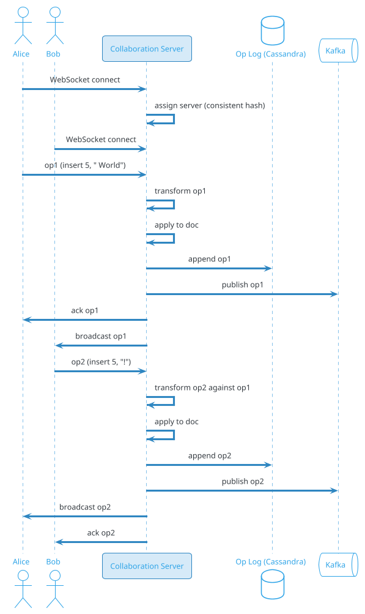
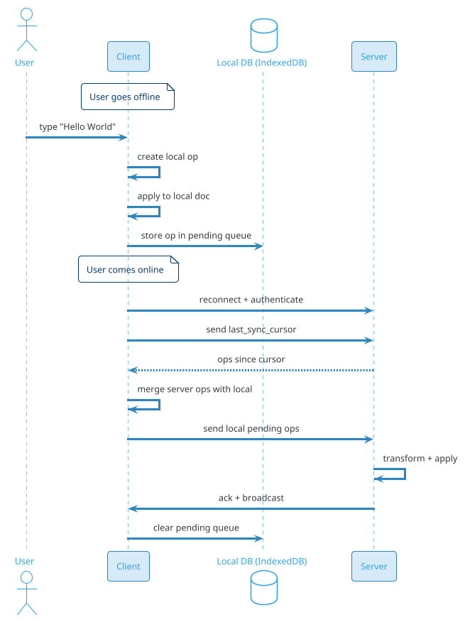

# Collaborative Document Editor (Google Docs / Notion / Figma)

## Problem Statement

Design a real-time collaborative document editor like Google Docs, Notion, or Figma. Multiple users edit the same document simultaneously, see each other's changes in real time, and never lose work. The system must handle concurrent edits without conflicts (or resolve them invisibly), support offline editing, and provide version history, comments, and suggestions.

**Example:**

```
Document editing flow:
  1. Alice opens doc-123 in browser
  2. Bob opens same doc on laptop
  3. Carol opens on tablet
  4. Alice types "Hello" at position 0
  5. Bob types "World" at position 5 simultaneously
  6. Server merges edits → final text: "Hello World"
  7. All 3 users see the same final state
  8. Alice goes offline (subway)
  9. Alice keeps typing locally
 10. Alice comes online
 11. Local edits sync; conflicts resolved
 12. Carol comments on a paragraph
 13. Alice responds
 14. Bob accepts a suggestion
 15. Version history shows all edits

Key challenges:
  - Concurrent edits (no last-write-wins)
  - Operational Transformation (OT) vs CRDTs
  - Real-time sync (<100ms)
  - Offline editing + sync
  - Cursor/selection sharing
  - Comments, suggestions, mentions
  - Version history
  - Access control (view/edit/comment)
  - Scalability (thousands of concurrent docs)

Scale:
  - 1B users (Google Docs scale)
  - 500M DAU
  - 100M documents actively edited
  - 10M concurrent editors peak
  - 1B operations/day (keystrokes, formatting)
  - 100M comments/day
```

**Real-world systems:** Google Docs, Microsoft Office Online, Notion, Figma, Coda, Quip, Dropbox Paper.

**Why it's interesting:**

- **Concurrent editing** — the core problem (OT vs CRDT)
- **Real-time** — sub-100ms sync
- **Offline-first** — editing works without network
- **Consistency** — all editors see the same final state
- **Cursor sharing** — see where others are
- **Comments & suggestions** — async collaboration
- **Version history** — time travel
- **Rich text** — formatting, tables, images
- **Access control** — view/edit/comment
- **Presence** — who's in the doc
- **Scale** — thousands of concurrent docs

---

## 1. Requirements Clarification

### Functional Requirements
- **Rich text editing**: Bold, italic, headings, lists, tables, images
- **Real-time collaboration**: Multiple editors see changes instantly
- **Cursor presence**: See where others are
- **Comments**: On ranges, threaded
- **Suggestions**: Track changes, accept/reject
- **Version history**: Restore any version
- **Offline editing**: Continue without network
- **Sharing**: View, comment, edit permissions
- **Export**: PDF, DOCX, HTML, Markdown
- **Templates**: Pre-defined formats
- **Search**: Within doc, across docs
- **Mentions**: @user in comments
- **Notifications**: On comments, mentions

### Non-Functional Requirements
- **Scale**: 1B users, 500M DAU, 100M concurrent docs
- **Latency**: < 100 ms for edits to propagate
- **Availability**: 99.99%
- **Consistency**: Strong (all editors see same final state)
- **Offline**: Full editing capability without network
- **Conflict-free**: No data loss on concurrent edits
- **Durability**: Never lose a document
- **Security**: Encryption, access control
- **Compliance**: GDPR, HIPAA, SOC 2

### Out of Scope
- Formula editing (Sheets — separate)
- Presentation design (Slides)
- Rich media editing (video, audio)
- Full DTP (InDesign)

---

## 2. Back-of-Envelope Estimation

### Traffic

```
Given:
  Users                = 1,000,000,000
  DAU                  = 500,000,000
  Active docs          = 100,000,000
  Concurrent editors   = 10,000,000 (peak)
  Operations/day       = 1,000,000,000 (keystrokes, formatting)
  Comments/day         = 100,000,000
  Doc opens/day        = 500,000,000
  Peak multiplier      = 5x

Average QPS:
  Document opens = 500M / 86,400 = ~5,787/sec
  Ops            = 1B / 86,400 = ~11,574/sec
  Comments       = 100M / 86,400 = ~1,157/sec

Peak QPS (5x):
  Doc opens      = ~29,000/sec
  Ops            = ~58,000/sec
  Comments       = ~5,800/sec

Per doc:
  Concurrent editors: 5 avg, 100 max
  Ops/sec per doc: 10 avg, 1000 peak
  Sync latency: <100 ms
```

### Storage

```
Documents:
  1B docs x 50 KB avg (text + formatting) = ~50 TB

Document versions:
  50 versions per doc x 50 KB = ~2.5 TB (compressed)

Operations log (per doc):
  10K ops per doc x 100 bytes = ~1 TB

Comments:
  1B comments x 500 bytes = ~500 GB

Presence/sessions:
  10M concurrent x 1 KB = ~10 GB (Redis)

Search index:
  Full-text over docs
  ~30% of doc size = ~15 TB

Metadata:
  Users, permissions, sharing: ~10 TB

Media (images, embeds):
  100M docs with media x 500 KB = ~50 TB

Total hot: ~150 TB
Total cold (archived): ~500 TB
```

### Bandwidth

```
Sync traffic:
  10M concurrent editors x 100 ops/min x 100 bytes
  = 10M x 100 x 100 bytes / 60
  = ~1.67 GB/sec = ~13 Gbps

Full doc loads:
  29K doc opens/sec x 50 KB = ~1.5 GB/sec = ~12 Gbps

Total: ~25 Gbps peak
```

### Latency Budget

```
Edit propagation (typing to other editors seeing it):
  Client keystroke:              ~0 ms
  Encode op:                     ~1 ms
  WebSocket send:                ~20-50 ms
  Server processing:             ~10 ms
  Server broadcast:              ~10 ms
  WebSocket receive:             ~20-50 ms
  Apply to other client:         ~5 ms
  Total:                         ~65-130 ms

Target: < 100 ms typical.

Cursor update:
  Similar (throttled to 10-20/sec)
  ~50 ms

Save to durable storage:
  Async, batched every 1-5 sec
```

---

## 3. High-Level Design

```d2
direction: down

alice: Alice {shape: person}
bob: Bob {shape: person}
carol: Carol {shape: person}

cdn: CDN {shape: cloud}
lb: Load Balancer {shape: hexagon}
api: API Gateway {shape: hexagon}

docsvc: Document Service {shape: rectangle}
syncsvc: Sync Service {shape: rectangle}
collab: "Collaboration Server (WebSocket)" {shape: rectangle}
oplog: "Op Log Service" {shape: rectangle}
comment: Comment Service {shape: rectangle}
version: Version Service {shape: rectangle}
presence: Presence Service {shape: rectangle}
permission: Permission Service {shape: rectangle}
search: Search Service {shape: rectangle}
export: Export Service {shape: rectangle}

kafka: Kafka {shape: queue}

pdb: "PostgreSQL (docs, permissions)" {shape: cylinder}
cass: "Cassandra (op log, versions)" {shape: cylinder}
redis: "Redis (presence, locks, hot)" {shape: cylinder}
es: "Elasticsearch (search)" {shape: cylinder}
s3: "S3 (media, exports, snapshots)" {shape: cylinder}

alice -> cdn
bob -> cdn
carol -> cdn
cdn -> lb
lb -> api

api -> docsvc
api -> comment
api -> version
api -> permission
api -> search
api -> export

alice <-> collab : WebSocket
bob <-> collab : WebSocket
carol <-> collab : WebSocket

collab -> syncsvc
collab -> oplog
collab -> presence
collab -> kafka

syncsvc -> cass
oplog -> cass
docsvc -> pdb
docsvc -> redis
comment -> pdb
version -> pdb
version -> s3
permission -> pdb

kafka -> search
kafka -> version

presence -> redis
```

### Component Responsibilities

| Component | Role |
|---|---|
| CDN | Static assets, media |
| Load Balancer | Route to API / WebSocket |
| API Gateway | Auth, rate limiting, routing |
| Document Service | CRUD docs, metadata |
| Sync Service | Apply operations, merge |
| Collaboration Server | WebSocket for real-time |
| Op Log Service | Store operations for replay |
| Comment Service | Comments, suggestions |
| Version Service | Version history, restore |
| Presence Service | Who's online, cursors |
| Permission Service | Access control |
| Search Service | Full-text search |
| Export Service | PDF, DOCX, HTML |
| Kafka | Event bus |
| PostgreSQL | Docs, permissions |
| Cassandra | Op log, versions |
| Redis | Presence, hot doc state |
| Elasticsearch | Search index |
| S3 | Media, exports, snapshots |

### Why This Architecture

- **Collaboration Server** with WebSocket for real-time
- **OT or CRDT** for concurrent edits (see deep dive)
- **Cassandra** for op log (write-heavy, time-series)
- **PostgreSQL** for metadata (ACID)
- **Redis** for presence, hot doc state
- **Kafka** for async (search indexing, versioning)
- **S3** for snapshots, media, exports

---

## 4. Deep Dive: Concurrent Editing — OT vs CRDT

### The Core Problem

Two users type at the same time:
```
Initial doc: "Hello"
Alice types " World" at position 5
Bob types "!" at position 5
```

**Result on Alice's machine:** "Hello World!"
**Result on Bob's machine:** "Hello! World" (if not synchronized)

**Goal:** Both machines show the same final state.

### Two Approaches

**1. Operational Transformation (OT):**
- Central server orders operations
- Server transforms ops to account for concurrent ones
- Requires authoritative server

**2. CRDT (Conflict-Free Replicated Data Type):**
- Data structure that merges concurrent edits automatically
- No central authority required
- Peer-to-peer capable

### OT Deep Dive

**Operations:** `insert(position, text)`, `delete(position, length)`.

**Example:**
```
Client A: insert(5, " World")
Client B: insert(5, "!")

Server: orders A first, then B
  A: insert(5, " World") → "Hello World"
  B: insert(5, "!") → "Hello! World" (wrong!)

Transform B against A:
  B's original position: 5
  A's insert was at position 5 (before B's)
  Transform: B's position += 6 (length of A's insert)
  B': insert(11, "!") → "Hello World!"
  
Both clients see "Hello World!"
```

**Algorithm:**
- Server maintains operation history
- New op transformed against all concurrent ops
- Order determined by server (usually FIFO)
- Clients apply transformed ops

**Pros:** Mature (Google Docs), efficient.
**Cons:** Requires central server; complex to implement correctly.

### CRDT Deep Dive

**Data structure:** Each character has a unique ID (client_id, sequence).
**Insert:** Character with ID (C, 1) is placed based on IDs of neighbors.

**Example:**
```
Initial: "Hello" = [H, e, l, l, o]

Alice inserts " World" after "Hello":
  [H, e, l, l, o, (A,1) , (A,2), ..., (A,6)]

Bob inserts "!" after "Hello":
  [H, e, l, l, o, (B,1)]

Merge: Characters ordered by (position, id)
  [H, e, l, l, o, (A,1), ..., (A,6), (B,1)]
  = "Hello World!"

Or: [H, e, l, l, o, (B,1), (A,1), ..., (A,6)]
  = "Hello! World"

Deterministic (order by ID).
```

**Pros:** No central server, works P2P, offline-friendly.
**Cons:** Higher memory, complexity.

**Modern CRDTs:**
- **Yjs**: JavaScript, used by many editors
- **Automerge**: Martin Kleppmann
- **Diamond Types**: Rust, high-performance

### OT vs CRDT Comparison

| Aspect | OT | CRDT |
|---|---|---|
| Server | Required | Optional (P2P possible) |
| Complexity | High (transformations) | High (data structure) |
| Offline | Requires server | Native support |
| Memory | Lower | Higher (metadata per char) |
| Convergence | Guaranteed | Guaranteed |
| Latency | Depends on server | Depends on network |
| Examples | Google Docs, Office | Figma, Notion, Jupyter |

### Recommendation

- **OT:** If central server is acceptable (Google Docs model)
- **CRDT:** If P2P or offline-first is needed (Figma model)

**For this problem:** Use **OT** (simpler, well-understood).

### Implementation

```
Server per document:
  1. Maintains doc state (text)
  2. Maintains operation history
  3. Receives op from client
  4. Transforms op against concurrent ops
  5. Applies transformed op to doc
  6. Broadcasts transformed op to all clients
  7. Stores op in log

Client:
  1. Applies local op optimistically
  2. Sends op to server
  3. Receives transformed ops from server
  4. Applies them
  5. Reconciles with local state
```

### Handling Conflicts

- **Insert vs insert:** Order by server arrival (OT) or ID (CRDT)
- **Insert vs delete:** Delete wins (or transform)
- **Delete vs delete:** Idempotent
- **Format vs format:** Last-write-wins or merge

### Cursor and Selection

- **Cursor position** is a number (character offset)
- Transformed like operations
- Broadcast to other users
- Throttled (10-20 updates/sec)

---

## 5. Deep Dive: Real-Time Sync

### WebSocket Architecture

- **Persistent connection** per client
- **Pub/sub** per document
- **Bidirectional** (client → server, server → client)

### Collaboration Server

Each document has a **collaboration server** (or logical partition):
- Receives ops from clients
- Transforms and broadcasts
- Maintains document state
- Publishes to Kafka for persistence

**Scaling:**
- Shard by `document_id`
- Multiple clients of same doc → same server (via consistent hashing)
- Server failure → reassign doc to another server

### Sync Protocol



### Message Types

```
Client → Server:
  {"type": "op", "doc_id": "doc-123", "op": {"type": "insert", "pos": 5, "text": " World"}}
  {"type": "cursor", "doc_id": "doc-123", "pos": 5, "selection_end": 10}
  {"type": "presence", "doc_id": "doc-123", "status": "active"}
  {"type": "comment", "doc_id": "doc-123", "range": [5, 15], "text": "..."}

Server → Client:
  {"type": "op_applied", "op": {"id": "op-456", "transformed": {...}}}
  {"type": "cursor_update", "user_id": "bob", "pos": 12}
  {"type": "presence_update", "users": [...]}
  {"type": "comment_added", "comment": {...}}
  {"type": "user_joined", "user_id": "carol"}
  {"type": "user_left", "user_id": "carol"}
```

### Batching

- Server batches ops (e.g., 10 ms window)
- Reduces WebSocket messages
- Client batches too (send on flush)

### Reconnection

- Client loses connection → reconnects
- Sends `last_op_id` received
- Server sends ops since then
- Client applies missing ops
- State converged

### Server Failure

- Doc assigned to server A
- Server A crashes
- Server B takes over (via orchestrator)
- B loads doc state from Cassandra
- Clients reconnect to B
- Ops resumed

**Redundancy:** Hot standby per shard (expensive) or cold recovery (~10 sec).

### Op Log

**Cassandra:**
```sql
CREATE TABLE doc_operations (
    doc_id BIGINT,
    version BIGINT,                  -- monotonically increasing
    op_id TIMEUUID,
    client_id BIGINT,
    op_type TEXT,
    op_data TEXT,
    created_at TIMESTAMP,
    PRIMARY KEY ((doc_id), version)
) WITH CLUSTERING ORDER BY (version ASC);
```

**Replay:** From version N to current.

**Retention:** 30-90 days; older archived.

### Document Snapshots

- **Periodic** (every 1000 ops or 5 min): Full doc snapshot to S3
- **On demand:** When opening doc, load latest snapshot + replay ops
- **Benefit:** Faster doc open (no full replay from start)

### Sync Scale

```
10M concurrent editors
~1M concurrent documents
1000 ops/sec per hot doc

Total: ~100M ops/sec peak
WebSocket servers: ~10K (10K connections each)

Broadcast: Kafka pub/sub or Redis pub/sub per doc
```

---

## 6. Deep Dive: Offline Editing

### Why Offline?

- Network unreliable (subway, airplane)
- Local-first UX (instant response)
- No data loss on disconnect

### Offline Architecture

- **Local model**: Client maintains full doc state
- **Local op log**: Client records ops
- **Optimistic UI**: Apply immediately
- **Sync on reconnect**: Send local ops, receive remote ops

### Offline Flow



### Conflict Resolution Offline

**Scenario:** Alice and Bob both edited offline.

**On reconnect:**
- Server receives Alice's ops, transforms against Bob's
- Server receives Bob's ops, transforms against Alice's
- Both converge to same state

**OT handles this** if server is authoritative.

### Local Storage

- **IndexedDB** (browser)
- **SQLite** (mobile, desktop)
- **Doc state**: Text + formatting
- **Op log**: Pending ops
- **Cache**: Recently opened docs

### Sync Protocol Offline

```
1. Client sends: "I have ops from version N to N+5"
2. Server returns: ops from N+6 to current
3. Client rebases local ops on top
4. Client sends rebased ops to server
5. Server transforms, applies, broadcasts
6. Client updates local state
```

### Offline Comments

- Comment locally
- Sync on reconnect
- Server assigns comment_id

### Offline Presence

- No presence while offline
- On reconnect, presence restored

### Offline Limits

- **Max offline time**: 30 days (server preserves ops)
- **Max pending ops**: 10,000 per client
- **Storage**: Device-dependent

### Offline First (CRDT)

If using CRDTs, offline is native:
- No server coordination needed
- Each client has full doc
- Merge on reconnect
- **Trade-off**: Higher memory

**Example:** Figma (CRDT-based), uses offline-first.

---

## 7. Deep Dive: Comments and Suggestions

### Comments

- **Range-based**: Comment on specific text range
- **Threaded**: Replies to comments
- **Mentions**: @user in comment
- **Resolve**: Mark as resolved
- **Notifications**: Notify participants

### Comment Model

```json
{
  "comment_id": "cmt-123",
  "doc_id": "doc-456",
  "range": {
    "start": 45,
    "end": 60,
    "text": "this paragraph"
  },
  "author_id": "alice",
  "body": "Can we make this clearer?",
  "created_at": "2026-09-19T10:00:00Z",
  "resolved": false,
  "replies": [
    {
      "reply_id": "cmt-124",
      "author_id": "bob",
      "body": "Sure, I'll revise.",
      "created_at": "..."
    }
  ],
  "mentions": ["bob"]
}
```

### Range Tracking

**Problem:** Comment range is (start, end). Document changes; range must stay valid.

**Solution:** Comment range is anchored to operation IDs (not positions).

**Implementation:**
- Store comment with op IDs of start/end
- On lookup, compute current positions
- OT/CRDT handles position updates

### Suggestions (Track Changes)

- **Insert suggestion**: Add text, marked as suggestion
- **Delete suggestion**: Remove text, marked
- **Format suggestion**: Change style
- **Accept/reject**: Apply or reject suggestion
- **Author tracking**: Who suggested

**Model:**
```json
{
  "suggestion_id": "sug-123",
  "doc_id": "doc-456",
  "type": "insert",
  "position": 45,
  "content": "New sentence.",
  "author": "alice",
  "status": "pending",
  "created_at": "..."
}
```

### Suggestion Merge

- Suggestion is a special op
- Not applied to main doc
- Displayed with markup (e.g., underline, color)
- Accept → applied; Reject → discarded

### Notifications

- **On comment**: Notify participants + mentions
- **On reply**: Notify thread participants
- **On mention**: Notify mentioned user
- **On suggestion**: Notify author when accepted/rejected

### Comment Scale

```
100M comments/day
Real-time insertion
Cloud-synced

Comment Service:
  - CRUD comments
  - Threaded replies
  - Notifications
  - Search
```

---

## 8. Deep Dive: Version History

### Why Version History?

- **Mistakes**: Restore older version
- **Audit**: Who changed what
- **Legal**: Evidence retention
- **Compliance**: Regulatory

### Version Storage

- **Operation log**: All ops (source of truth)
- **Snapshots**: Periodic full state
- **Combination**: Load snapshot + replay ops

### Snapshot Frequency

- **Every 1000 ops** OR
- **Every 5 minutes** OR
- **On significant change** (e.g., 100KB diff)

**Trade-off:** More snapshots = faster load, more storage.

### Version API

```http
GET /v1/docs/doc-123/versions?limit=50
GET /v1/docs/doc-123/versions/42
POST /v1/docs/doc-123/versions/42/restore
```

### Version Model

```json
{
  "version_id": 42,
  "doc_id": "doc-123",
  "author": "alice",
  "created_at": "2026-09-19T10:00:00Z",
  "size_bytes": 50000,
  "op_count": 1234,
  "change_summary": "Added section 3"
}
```

### Change Summaries

AI-generated summary per version:
- What changed
- Who changed it
- Why (from comments?)

### Restore Flow

1. User selects version N
2. Server loads snapshot + ops up to N
3. Server creates new version N+1 (restore)
4. Broadcasts to all clients
5. Clients update

### Version Retention

- **Free tier**: 30 days
- **Premium**: 1 year
- **Business**: Custom (legal hold)
- **Compliance**: 5+ years

### Version Search

- Search by date, author, text
- Find "when was X added?"
- Diff between versions

### Version Compression

- Op log is compact (100 bytes per op)
- Snapshots are full text
- Compression: gzip (3-5x)

### Version Scale

```
100M docs x 50 versions = 5B versions
Avg 50 KB per version (compressed)
= ~250 TB

Storage in S3 (tiered)
```

---

## 9. Deep Dive: Presence and Cursors

### Why Presence?

- **Who's here**: See other editors
- **Where they are**: Cursors
- **What they're doing**: Typing indicator
- **Community**: Feel of collaboration

### Presence Model

```json
{
  "user_id": "alice",
  "name": "Alice",
  "color": "#E91E63",
  "cursor": {
    "position": 45,
    "selection_end": 60
  },
  "last_seen": "2026-09-19T10:00:05Z",
  "status": "active"
}
```

### Presence Service

- **Redis**: Store presence per doc
- **Heartbeat**: Client sends every 5 sec
- **TTL**: 15 sec (auto-remove stale)
- **Broadcast**: On join/leave/cursor move

### Redis Schema

```
Key: presence:{doc_id}
Type: Hash
Fields: user_id → JSON of presence

Key: user:{user_id}:presence
Type: Hash
Fields: doc_id → JSON
TTL: 15 sec
```

### Cursor Updates

- **Throttled**: 10-20 updates/sec per client
- **Broadcast**: To all doc participants
- **Rendering**: Color-coded cursors with names

### Typing Indicator

- **Throttled**: "user is typing" for 2 sec
- **Broadcast**: To doc participants
- **Cleared**: After inactivity

### Presence Scale

```
10M concurrent users
Avg 5 users per doc
= 2M active docs

Presence stored in Redis (sharded by doc_id)
~10M entries, ~10 GB memory

Broadcast:
  100 ops/sec per doc avg
  x 2M docs = 200M broadcast/sec peak
  Kafka or Redis pub/sub
```

### Privacy

- User can opt-out of presence
- Anonymous editing (in some editors)
- Cursor sharing can be disabled

### Chat in Doc

Some editors allow chat:
- Sidebar chat
- Real-time
- Persisted with doc

**Additional feature** beyond presence.

---

## 10. Deep Dive: Rich Text and Formatting

### Rich Text Model

Beyond plain text:
- **Bold, italic, underline**
- **Headings, paragraphs**
- **Lists (ordered, unordered)**
- **Tables**
- **Images, embeds**
- **Links, footnotes**
- **Code blocks**
- **Formulas**

### Data Model

**Option 1: Flat text + formatting ops**
```
Text: "Hello World"
Formatting: [
  {type: "bold", range: [0, 5]},
  {type: "italic", range: [6, 11]}
]
```

**Pros:** Simple, easy to transform.
**Cons:** Complex formatting hard.

**Option 2: Tree structure** (like Quill, ProseMirror)
```
{
  "type": "doc",
  "content": [
    {"type": "paragraph", "content": [
      {"type": "text", "text": "Hello", "marks": [{"type": "bold"}]},
      {"type": "text", "text": " World"}
    ]}
  ]
}
```

**Pros:** Rich structure, standard (ProseMirror).
**Cons:** Complex transforms.

**Recommendation:** Tree structure (ProseMirror, Slate, Quill).

### OT for Rich Text

- **Tree-based OT**: Transform paths, not just positions
- **JSON OT**: For JSON documents
- **Libraries**: ShareDB, ot.js

### CRDT for Rich Text

- **Yjs**: Rich text CRDT (used by many)
- **Automerge**: JSON-based CRDT
- **Handles rich text natively**

### Formatting Ops

- **Bold**: Apply bold mark to range
- **Insert link**: Add link mark
- **Heading**: Change paragraph type
- **Table insert**: Add table structure

### Images and Embeds

- **Upload**: Client uploads image to S3
- **Insert op**: Add image node with S3 URL
- **Rendering**: CDN for images
- **Collaboration**: Image is a node; moving = transform

### Tables

- Complex: rows, columns, cells
- Operations: insert row, delete column, merge cells
- OT: more complex transforms
- CRDT: Yjs handles tables

### Rich Text Scale

```
1B ops/day
Avg 100 bytes per op
= 100 GB/day of ops

Compressed in Cassandra: ~30 GB/day
Retained 30 days: ~900 GB
```

---

## 11. Deep Dive: Search and Export

### Search

- **In-document search**: Find in current doc (client-side)
- **Cross-document search**: Find across user's docs
- **Content search**: Full-text over doc content
- **Metadata search**: By name, date, owner

### Search Index

- **Elasticsearch** for cross-doc search
- **Index per user** (or shared index with user filter)
- **Updated on op apply** (near-real-time)
- **Debounced** (batch indexing every few sec)

### Search Schema

```json
{
  "doc_id": "doc-123",
  "user_id": "alice",
  "title": "Q4 Report",
  "content": "extracted text...",
  "created_at": "...",
  "updated_at": "...",
  "owner": "alice",
  "shared_with": ["bob", "carol"]
}
```

### Search Ranking

- **Title match** (boosted)
- **Content match**
- **Recency**
- **Owner** (user's docs first)

### Export

- **PDF**: Render HTML → PDF (Puppeteer, wkhtmltopdf)
- **DOCX**: Convert from internal format
- **HTML**: Direct export
- **Markdown**: For simple docs
- **Plain text**: Strip formatting

### Export Pipeline

```
1. User requests export
2. Server fetches doc state
3. Renders based on format
4. Uploads to S3
5. Returns signed URL (24h expiry)
6. Email notification with link
```

### Export Scale

```
10M exports/day
Avg 500 KB per export
= ~5 TB/day
= ~1.8 PB/year

S3 storage with lifecycle (delete after 7 days)
```

### Import

- **DOCX, PDF, HTML, Markdown** → Internal format
- **Conversion**: Use libraries (docx4j, pandoc)
- **Best effort**: Complex formatting may not convert perfectly

---

## 12. Deep Dive: Access Control

### Permission Model

- **Owner**: Full control (transfer, delete)
- **Editor**: Edit content, comment
- **Commenter**: Comment only
- **Viewer**: Read only
- **Public**: Anyone with link (view or edit)

### Permission Storage

```sql
CREATE TABLE doc_permissions (
    doc_id BIGINT,
    user_id BIGINT,
    permission VARCHAR(20),
    granted_by BIGINT,
    granted_at TIMESTAMP,
    PRIMARY KEY (doc_id, user_id)
);

CREATE TABLE doc_links (
    doc_id BIGINT,
    link_token VARCHAR(100) PRIMARY KEY,
    permission VARCHAR(20),
    expires_at TIMESTAMP,
    created_by BIGINT,
    created_at TIMESTAMP
);
```

### Access Check

```
1. User authenticates
2. On doc open: check permission
   - Own doc? → full access
   - Direct permission? → check
   - Shared folder permission? → check
   - Link token? → check
   - Public? → check
   - Else: deny
3. Cache result (Redis, 5 min TTL)
```

### Real-Time Permission

If permission changes while doc is open:
- Server invalidates session
- Client sees "access revoked"
- Redirect to view-only or close

### Sharing

- **Share with user**: By email, add to permissions
- **Share by link**: Generate token, set permission
- **Share folder**: Inherit to sub-docs
- **Public**: Google-style "anyone with link"

### Notifications

- On share: notify recipient
- On permission change: notify
- On revoke: notify (or not)

### Audit

- Log every access: user, doc, action, IP
- Retention: 90 days (Standard), 1 year (Business)
- Export for compliance

### Multi-Tenant (Business)

- **Organization**: Group of users
- **Team folders**: Shared across team
- **Admin controls**: Set policies
- **SSO**: SAML, OIDC
- **DLP**: Data loss prevention

---

## 13. Scaling Considerations

### Read Scaling

- **CDN** for static assets, images
- **Read replicas** for PostgreSQL
- **Redis** for presence, hot doc state
- **Elasticsearch** for search
- **WebSocket** connections (persistent)

### Write Scaling

- **Collaboration servers** (per doc)
- **Cassandra** for op log (write-heavy)
- **Kafka** for async (search, versions)
- **S3** for snapshots

### Sharding

**PostgreSQL:** Shard by `doc_id`.
**Cassandra:** Partition by `doc_id`.
**Redis:** Shard by `doc_id`.
**Kafka:** Partition by `doc_id`.
**Elasticsearch:** Shard by `doc_id`.

### Multi-Region

```d2
direction: down

us: "US Region" {
  shape: cloud
}
eu: "EU Region" {
  shape: cloud
}
apac: "APAC Region" {
  shape: cloud
}

uscollab: "US Collab Servers" {
  shape: cylinder
}
eucollab: "EU Collab Servers" {
  shape: cylinder
}
apaccollab: "APAC Collab Servers" {
  shape: cylinder
}

us -> uscollab
eu -> eucollab
apac -> apaccollab
```

**Doc home region:** Based on owner's region.
**Collaborators from other regions** connect cross-region (higher latency).
**Trade-off:** Consistency vs latency.

**EU users' docs stay in EU** (GDPR).

### Cross-Region Docs

- Home region owns doc
- Other regions connect to home region
- Latency: 100-200 ms cross-region
- **Acceptable** for collaborative editing (not real-time chat)

### Peak Handling

**School hours**: 9 AM - 3 PM spike.
**Business hours**: 9 AM - 6 PM.
**Evening**: Personal use.

**Mitigations:**
- Auto-scale collab servers
- Shard heavy docs
- Rate limit per user

### Cost Optimization

| Component | Optimization |
|---|---|
| Collab servers | Auto-scale, spot |
| Cassandra | Tiering, compression |
| S3 snapshots | Tiering, dedup |
| Compute | Reserved + spot |
| Egress | CDN for media |

### Scale Numbers

- **10M concurrent editors** → ~10K collab servers (1000 editors each)
- **1M concurrent docs** → sharded across servers
- **100M ops/sec peak** → Cassandra + Kafka

---

## 14. Bottlenecks and Trade-offs

| Concern | Solution | Trade-off |
|---|---|---|
| Concurrent edits | OT or CRDT | Complexity |
| Real-time | WebSocket | Connection state |
| Offline | Local-first + sync | Conflict resolution |
| Rich text | Tree model | Complex transforms |
| Presence | Redis + throttling | Broadcast storm |
| Versions | Op log + snapshots | Storage |
| Search | Elasticsearch | Index lag |
| Multi-region | Home region | Latency |
| Permission | Cached | Invalidation |

### Design Decisions Summary

| Decision | Choice | Rationale |
|---|---|---|
| Concurrency | OT (server-authoritative) | Mature, efficient |
| Data model | Tree (ProseMirror-like) | Rich text |
| Real-time | WebSocket | Low latency |
| Op log | Cassandra | Write-heavy |
| Metadata | PostgreSQL | ACID |
| Presence | Redis | Fast, ephemeral |
| Versions | Snapshots + op log | Fast load, storage |
| Search | Elasticsearch | Full-text |
| Multi-region | Home region | Compliance, latency |

---

## 15. Failure Scenarios

### Collaboration Server Down

**Impact:** Doc editing paused for that doc.

**Mitigation:**
- Reassign to another server (~5-10 sec)
- Clients buffer local ops
- Reconnect on recovery
- Alert ops

### Cassandra Down

**Impact:** Op log unavailable; new ops can't persist.

**Mitigation:**
- Buffer in Kafka
- Fall back to PostgreSQL (slow)
- Redis cluster for HA
- Alert ops

### WebSocket Gateway Down

**Impact:** Clients disconnect; reconnect to another.

**Mitigation:**
- Multiple gateways (client-side failover)
- Fallback to polling
- Alert ops

### Conflict Storm

**Impact:** Many concurrent edits; transform backlog.

**Mitigation:**
- Shard by doc
- More server capacity
- Client throttle
- Alert ops

### Document Corruption

**Impact:** Doc unreadable.

**Mitigation:**
- Op log replay catches most
- Snapshots provide recovery point
- Alert ops
- Post-mortem

### Data Loss

**Impact:** User loses work.

**Mitigation:**
- Op log persisted
- Snapshots in S3
- Multi-region replication
- Version history
- **11 nines durability** (S3)

### Search Index Down

**Impact:** Search unavailable.

**Mitigation:**
- Fall back to PostgreSQL LIKE
- Cache recent searches
- Alert ops

### Presence Service Down

**Impact:** No presence; editing continues.

**Mitigation:**
- Degrade gracefully (no presence)
- Auto-restart
- Alert ops

### Permission Bypass

**Impact:** Unauthorized access.

**Mitigation:**
- Strict access checks
- Audit logs
- Anomaly detection
- Alert security team

### Spam/Abuse

**Impact:** Public docs vandalized.

**Mitigation:**
- Rate limiting
- CAPTCHA
- Revert to previous version
- Report/block

### DDoS

**Impact:** Service unavailable.

**Mitigation:**
- CDN/WAF
- Rate limiting
- Anycast
- Alert ops

---

## 16. Monitoring and Alerts

### Key Metrics

| Metric | Target | Alert Threshold |
|---|---|---|
| Edit propagation p99 | < 100 ms | > 300 ms |
| Doc open p99 | < 1 sec | > 3 sec |
| WebSocket p99 | < 100 ms | > 500 ms |
| Concurrent editors | baseline | drop > 20% |
| Op apply p99 | < 20 ms | > 100 ms |
| Conflicts per sec | baseline | spike > 5x |
| Sync backlog | < 100 ops | > 10K ops |
| Presence p99 | < 100 ms | > 500 ms |
| Version load p99 | < 500 ms | > 2 sec |
| Search p99 | < 500 ms | > 2 sec |
| Export p99 | < 10 sec | > 30 sec |

### Dashboards

- **Traffic**: Concurrent editors, ops/sec, docs open
- **Latency**: p50/p95/p99 per operation
- **Sync**: Queue depth, backlog, conflicts
- **Presence**: Active users, cursor updates
- **Versions**: Snapshots, storage, load time
- **Search**: Query rate, latency, zero-result
- **Errors**: 4xx/5xx by operation
- **Infrastructure**: Cassandra, Redis, Kafka, S3
- **Business**: DAU, docs/user, retention

### Alerts

- **P0**: Collab server down, Cassandra down, data loss
- **P1**: Edit propagation > 300 ms, sync backlog > 10K
- **P2**: Conflict spike, presence degraded
- **P3**: Search slow, version load slow

### Business KPIs

- **DAU/MAU** ratio
- **Docs per user**
- **Session length**
- **Collaborators per doc**
- **Comments per doc**
- **Retention** (D1, D7, D30)
- **Premium conversion**
- **NPS**

---

## 17. Cost Estimation

Rough monthly cost (AWS, us-east-1) for 1B users:

| Component | Spec | Cost/month |
|---|---|---|
| Collaboration servers | 5,000 x c6g.2xlarge | ~$1,200,000 |
| API servers | 500 x c6g.large | ~$30,000 |
| Document Service | 500 x c6g.large | ~$30,000 |
| Presence servers | 200 x c6g.large | ~$12,000 |
| PostgreSQL | 50 shards x db.r6g.4xlarge | ~$240,000 |
| Read replicas | 100 x db.r6g.2xlarge | ~$210,000 |
| Cassandra (op log) | 100 x i3.2xlarge | ~$100,000 |
| Redis cluster | 100 x cache.r6g.2xlarge | ~$50,000 |
| Kafka (MSK) | 50 brokers | ~$25,000 |
| Elasticsearch | 100 x r6g.2xlarge | ~$180,000 |
| S3 (snapshots + exports) | 50 TB | ~$1,200 |
| S3 (media) | 50 TB | ~$1,200 |
| CDN | 100 TB/month | ~$8,500 |
| Monitoring | Datadog | ~$80,000 |
| **Total** | | **~$2.17M/month** |

**Per user:** ~$0.002/month.

**Cost breakdown:**
- **Collaboration servers**: ~55% (WebSocket heavy)
- **Databases**: ~28%
- **Search**: ~8%
- **Other**: ~9%

**Cost optimization:**
- **Auto-scale collab servers** (peak vs off-peak)
- **Spot instances** for non-critical
- **Right-size Cassandra**
- **Reserved instances**

---

## 18. Extensions and Follow-ups

### Collaborative Spreadsheets

- Google Sheets model
- Cell-based OT/CRDT
- Formulas (dependency graph)
- Separate but related

### Collaborative Presentations

- Google Slides
- Slide-based editing
- Speaker notes
- Real-time sync

### Whiteboard

- Figma-style canvas
- Vector graphics
- CRDT for shapes
- Infinite canvas

### Code Collaboration

- Google Colab
- Jupyter notebooks
- Real-time code editing
- Execution

### Design Collaboration

- Figma
- Vector graphics
- CRDT-based
- Component libraries

### Voice Collaboration

- Talk while editing
- Integration with video conferencing
- Audio presence

### AI Assistance

- **Auto-complete**: Suggest next words
- **Grammar check**: Real-time
- **Translation**: Live translation
- **Summarization**: Section summaries
- **Suggestions**: Style, clarity

### Version Comparison

- **Diff view**: Side-by-side comparison
- **Who changed what**: Attribution
- **Revert to point**: Time travel

### Comments and Suggestions

- **Advanced threading**: Nested discussions
- **Emoji reactions**: Quick feedback
- **Mentions**: @user with notifications
- **Tasks**: Convert comment to task

### Offline-First

- **Full offline editing**: Like desktop apps
- **Sync on reconnect**: Transparent
- **Conflict resolution**: Automated

### Accessibility

- **Screen reader**: Full support
- **Keyboard navigation**: All features
- **High contrast**: Visual
- **Voice input**: Dictation

### Integration

- **Slack**: Share and discuss
- **Teams**: Microsoft 365
- **Notion**: Embed docs
- **Jira**: Link issues
- **Google Drive**: Storage

### Publishing

- **Publish to web**: Public URL
- **Blog-style**: Static rendering
- **Embed**: In websites
- **SEO**: Optimized

### Templates

- **Templates**: Pre-defined docs
- **Gallery**: Community templates
- **Variables**: Fill-in fields

### Automation

- **Triggers**: When X happens, do Y
- **Workflows**: Approvals, notifications
- **Bots**: Custom integrations

### Web3

- **Decentralized**: IPFS storage
- **Blockchain identity**: Wallet login
- **Token-gated**: NFT docs
- **Rare**: Experimentation

---

## 19. Summary

| Aspect | Decision |
|---|---|
| Concurrency | OT (server-authoritative) |
| Data model | Tree (ProseMirror-like) |
| Real-time | WebSocket |
| Op log | Cassandra |
| Metadata | PostgreSQL (sharded) |
| Presence | Redis |
| Versions | Snapshots + op log |
| Search | Elasticsearch |
| Multi-region | Home region |
| Scale | 1B users, 500M DAU, 10M concurrent editors |
| Latency | Edit propagation < 100 ms |
| Availability | 99.99% |
| Durability | 11 nines (S3 + replication) |
| Cost | ~$2.17M/month |

**Key takeaways:**

- **OT vs CRDT** — the core decision; OT for server-authoritative, CRDT for offline-first
- **WebSocket per doc** — real-time sync, sharded by doc_id
- **Op log in Cassandra** — write-heavy, time-series
- **Snapshots in S3** — fast doc load, storage
- **Presence in Redis** — ephemeral, fast
- **Offline editing** — local-first + sync on reconnect
- **Comments anchored to ops** — not positions (avoids drift)
- **Version history** = op log + snapshots
- **Multi-region** — home region per doc; latency trade-off
- **Scaling** — 10M concurrent editors via sharded collab servers
- **Cost** — collab servers dominate (WebSocket heavy)
- **Latency** — < 100 ms edit propagation is the UX bar

### Similar Pattern Problems

- Online Messaging App — real-time delivery, WebSocket
- Task Management Tool — real-time collaboration
- File Storage Service — chunked storage, sync
- Video Conferencing — real-time media
- Social Feed / Timeline — real-time updates
- Notification System — event fan-out
- Content Moderation — comment/abuse moderation