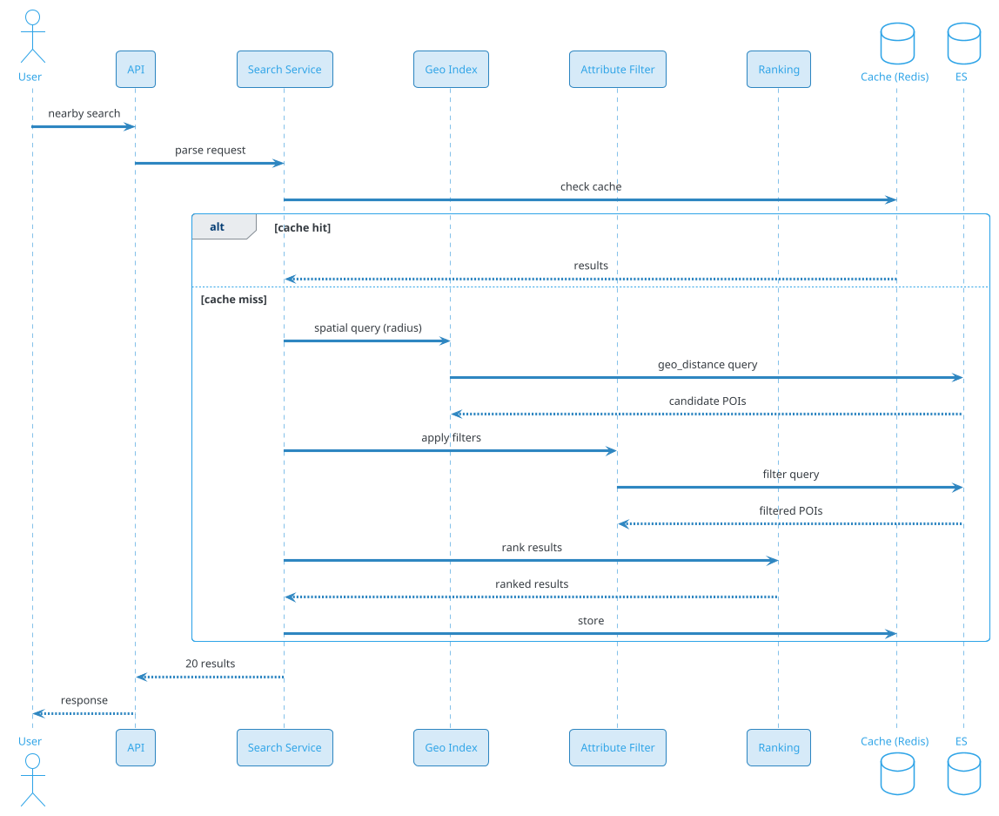
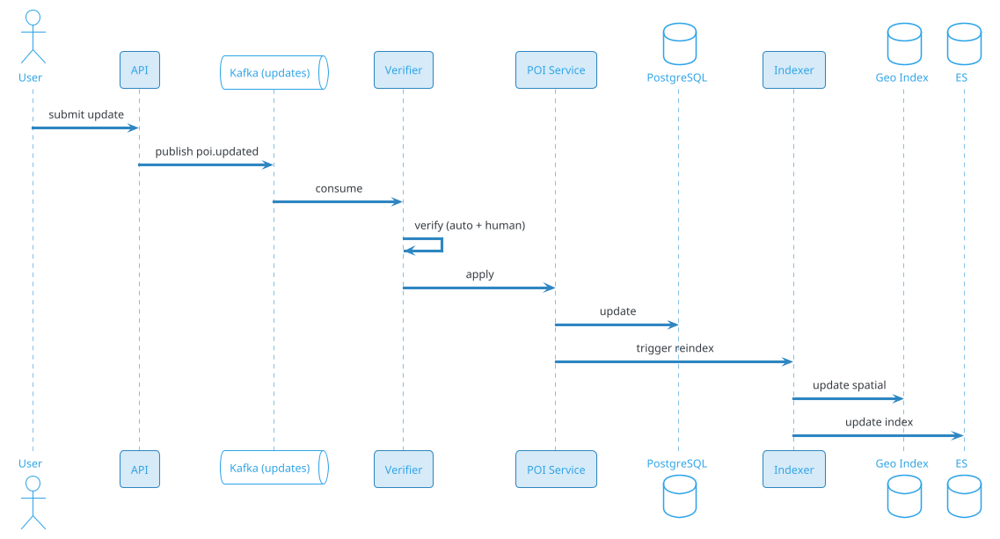

# Proximity Service (Nearby Search)

## Problem Statement

Design a proximity service that finds nearby places of interest (POIs) — restaurants, ATMs, hospitals, gas stations, hotels, stores — given a user's location and a radius. Like Yelp, Google Maps, or Foursquare. The system must support billions of POIs, millions of concurrent location queries, real-time updates (a store opens, another closes), and sub-100 ms latency globally.

**Example:**

```
User Priya opens Yelp in Mumbai:

Flow:
  1. App sends location: (19.0760, 72.8777)
  2. Yelp backend queries: "restaurants within 2 km"
  3. Returns 50 results, ranked by rating/distance
  4. User filters: "open now", "4+ stars", "₹₹"
  5. Results refine in real time
  6. User taps one → detail page
  7. Gets directions → external maps app

Key challenges:
  - Geospatial indexing (lat/lng → fast queries)
  - Radius queries (find all in range)
  - Combined filters (distance + attributes)
  - Ranking (distance, rating, popularity)
  - Real-time updates (store hours, closures)
  - Global scale (billions of POIs)
  - Latency (< 100 ms p99)
  - Read-heavy (100:1 read:write)

Scale:
  - 500M MAU
  - 200M DAU
  - 1B POIs globally (all businesses, places)
  - 10B searches/day (~116K/sec avg, 580K/sec peak)
  - 100M POI updates/day
  - 500 CDN PoPs
```

**Real-world systems:** Yelp, Google Maps, Foursquare, Apple Maps, Uber (nearby drivers), Swiggy (nearby restaurants), Tinder (nearby users).

**Why it's interesting:**

- **Geospatial indexing** — Geohash, QuadTree, S2, H3
- **Radius queries** — complex algorithms
- **Combined filters** — distance + attributes
- **Ranking** — distance, rating, popularity
- **Real-time updates** — store closures, hours
- **Global scale** — billions of POIs
- **Read-heavy** — 100:1 read:write
- **Latency** — sub-100 ms p99
- **Cost** — storage + compute dominate
- **Privacy** — location data is sensitive

---

## 1. Requirements Clarification

### Functional Requirements
- **Nearby search**: Find POIs within radius of a location
- **Attribute filters**: Category, rating, price, hours, amenities
- **Ranking**: Distance, rating, popularity, personalization
- **Autocomplete**: As user types
- **POI details**: Photos, reviews, hours, contact
- **POI updates**: Add, edit, close (real-time)
- **Reviews**: Users rate and review
- **Favorites**: Save POIs
- **Directions**: Deep link to maps
- **Offline**: Cached recent searches
- **Multi-language**: Internationalization

### Non-Functional Requirements
- **Scale**: 1B POIs, 500M MAU, 10B searches/day
- **Latency**: < 100 ms p99 for nearby search
- **Availability**: 99.99%
- **Consistency**: Eventual (POI updates within seconds)
- **Freshness**: POI updates visible within 1 min
- **Accuracy**: Correct distances, hours
- **Privacy**: Location not stored without consent
- **Global**: Sub-100 ms worldwide

### Out of Scope
- Turn-by-turn navigation (that's Maps)
- Real-time traffic
- Street view imagery
- Ride hailing (separate — Uber)
- Food delivery (separate — Swiggy)

---

## 2. Back-of-Envelope Estimation

### Traffic

```
Given:
  Users                = 500,000,000 (MAU)
  DAU                  = 200,000,000
  Searches/day         = 10,000,000,000
  POIs                 = 1,000,000,000
  POI updates/day      = 100,000,000
  Avg results/search   = 20
  Peak multiplier      = 5x

Average QPS:
  Searches = 10B / 86,400 = ~115,740/sec
  POI updates = 100M / 86,400 = ~1,157/sec
  Details = 2B / 86,400 = ~23,148/sec

Peak QPS (5x):
  Searches = ~578,700/sec
  POI updates = ~5,787/sec
  Details = ~115,740/sec

Read:Write ratio = 100:1 (searches dominate)
```

### Storage

```
POIs:
  1B x 5 KB (name, address, hours, category, images URLs) = ~5 TB

Attributes (indexed):
  1B x 500 bytes (for fast filtering) = ~500 GB

Reviews:
  1B POIs x 50 reviews avg x 500 bytes = ~25 TB

Photos:
  1B POIs x 10 photos x 500 KB = ~5 PB (in S3)

Images (thumbnails):
  1B x 10 x 50 KB = ~500 TB

Reviews images:
  ~5 TB

Geohash index:
  1B POIs x 100 bytes = ~100 GB (for spatial queries)

Search index:
  ~500 GB (Elasticsearch)

User data:
  500M x 5 KB = ~2.5 TB

Total hot: ~30 TB (excluding photos)
Photos: ~5 PB in S3
```

### Bandwidth

```
Search responses:
  578,700/sec x 20 KB (20 results with images) = ~11.6 GB/sec = ~93 Gbps

POI detail:
  115,740/sec x 50 KB = ~5.8 GB/sec = ~46 Gbps

Photos (via CDN):
  Peak: ~500 Gbps

Total peak: ~640 Gbps
```

### Latency Budget

```
Nearby search:
  Client → API:                 ~50 ms
  Auth:                          ~10 ms
  Parse + validate:              ~5 ms
  Geohash computation:           ~1 ms
  Spatial query (index):         ~30 ms
  Attribute filters:             ~10 ms
  Ranking:                       ~10 ms
  Hydrate POI details:           ~30 ms
  Serialize:                     ~20 ms
  Network:                       ~30 ms
  Total:                         ~200 ms

Target: < 100 ms p99 (with optimizations)

Autocomplete:
  Prefix search:                 ~20 ms
  Rank + return:                 ~30 ms
  Total:                         ~50 ms
```

---

## 3. High-Level Design

```d2
direction: down

user: User {shape: person}
cdn: CDN {shape: cloud}
lb: Load Balancer {shape: hexagon}
api: API Gateway {shape: hexagon}

search: Search Service {shape: rectangle}
geo: Geo Index Service {shape: rectangle}
attr: Attribute Service {shape: rectangle}
rank: Ranking Service {shape: rectangle}
poi: POI Service {shape: rectangle}
review: Review Service {shape: rectangle}
reco: Recommendation Service {shape: rectangle}
notif: Notification Service {shape: rectangle}

ingest: "POI Ingest Pipeline" {shape: rectangle}
crowd: "Crowdsource Updates" {shape: rectangle}
verify: "Verification Service" {shape: rectangle}

kafka: Kafka {shape: queue}

geodb: "Geo Index (Elasticsearch + QuadTree)" {shape: cylinder}
pdb: "PostgreSQL (POIs, users)" {shape: cylinder}
ch: "ClickHouse (analytics)" {shape: cylinder}
redis: "Redis (cache, sessions)" {shape: cylinder}
s3: "S3 (photos)" {shape: cylinder}
es: "Elasticsearch (full-text)" {shape: cylinder}

user -> cdn
cdn -> lb
lb -> api

api -> search
api -> poi
api -> review
api -> reco

search -> geo
search -> attr
search -> rank

poi -> pdb
poi -> redis
review -> pdb
review -> es
reco -> ch

ingest -> kafka
crowd -> kafka
kafka -> verify
verify -> pdb
verify -> geo
verify -> es

geo -> geodb
rank -> redis
search -> es
```

### Component Responsibilities

| Component | Role |
|---|---|
| CDN | Photos, static assets |
| Load Balancer | Route to API |
| API Gateway | Auth, rate limiting, routing |
| Search Service | Orchestrate nearby search |
| Geo Index Service | Spatial queries (Geohash, QuadTree) |
| Attribute Service | Filter by attributes |
| Ranking Service | Order results |
| POI Service | CRUD for POIs |
| Review Service | Reviews, ratings |
| Recommendation Service | Personalized suggestions |
| Notification Service | Updates to users |
| Ingest Pipeline | Bulk POI imports |
| Crowdsource Updates | User-submitted changes |
| Verification Service | Verify updates |
| Kafka | Event bus |
| Geo Index | Elasticsearch + QuadTree |
| PostgreSQL | POI metadata |
| ClickHouse | Analytics |
| Redis | Cache, sessions |
| S3 | Photos |
| Elasticsearch | Full-text search |

### Why This Architecture

- **Elasticsearch** with geo_point for spatial queries
- **QuadTree** or **Geohash** for pre-indexing (hot cells)
- **PostgreSQL** for transactional POI metadata
- **Redis** for hot cache
- **Kafka** for async updates
- **S3 + CDN** for photos
- **ClickHouse** for analytics

---

## 4. Deep Dive: Geospatial Indexing

### The Core Problem

Given 1B POIs worldwide and a user at (lat, lng), find all POIs within radius R.

**Naive:** Scan all 1B POIs, compute distance, filter. **Too slow** (minutes).

**Solution:** Spatial indexes.

### Geohash

**Concept:** Encode (lat, lng) into a short string. Points nearby share prefixes.

**Encoding:**
- Lat range: -90 to 90 (180 degrees)
- Lng range: -180 to 180 (360 degrees)
- Interleave bits, base32 encode

**Example:** (19.0760, 72.8777) → `te7u2s` (Mumbai)

**Properties:**
- Same prefix → nearby
- Length determines precision:
  - 1 char: ~5000 km
  - 4 chars: ~20 km
  - 6 chars: ~1 km
  - 8 chars: ~40 m

**Query:**
```
1. Compute geohash of user location
2. Find neighbors (8 surrounding cells)
3. Query all POIs with those geohashes
4. Filter by actual distance
```

### QuadTree

**Concept:** Recursively subdivide space into 4 quadrants.

**Structure:**
```
Root (whole world)
  ├── NW quadrant
  │     ├── NW, NE, SW, SE
  │     └── ...
  ├── NE quadrant
  ├── SW quadrant
  └── SE quadrant
```

**Each node:** Up to N POIs; subdivide when full.

**Query:**
```
1. Traverse tree from root
2. Prune quadrants that don't intersect search circle
3. Collect POIs from intersecting leaves
4. Filter by actual distance
```

**Advantages:** Adaptive to density (cities dense, oceans sparse).

**Used by:** Uber's H3, Google S2.

### S2 Geometry

**Google's library:** Projects sphere to cube, then to 2D, then to Hilbert curve.

**Cell IDs:** 64-bit identifiers for cells at various levels.

**Advantages:**
- Spherical (no projection distortion)
- Hierarchical
- Hilbert curve locality

**Used by:** Google Maps, Foursquare, Uber.

### H3 (Uber)

**Hexagonal grid:** Earth divided into hexagons at multiple resolutions.

**Advantages:**
- Uniform distance between neighbors
- 16 resolutions (from ~0.7 km² to millions of km²)
- Good for ride-hailing, delivery

**Used by:** Uber, H3 open-source.

### Comparison

| Index | Pros | Cons | Used By |
|---|---|---|---|
| Geohash | Simple, prefix-based | Boundary issues | Redis, Elasticsearch |
| QuadTree | Adaptive, simple | Tree rebalancing | Custom |
| S2 | Spherical, hierarchical | Complex | Google |
| H3 | Hexagons, uniform | Newer | Uber, DoorDash |

**Recommendation:** **Geohash + Elasticsearch geo_point** for simplicity. **S2 or H3** for advanced.

### Redis GEO

Redis has built-in geo commands:
```
GEOADD places 72.8777 19.0760 "Taj Hotel"
GEOSEARCH places FROMLONLAT 72.8777 19.0760 BYRADIUS 2 km ASC
```

**Under the hood:** Geohash with 52-bit precision.

**Pros:** Simple, fast (in-memory).
**Cons:** Limited to memory, no complex filters.

**Use for:** Hot POIs, small datasets.

### Elasticsearch geo_point

```json
{
  "mappings": {
    "properties": {
      "name": {"type": "text"},
      "location": {"type": "geo_point"},
      "category": {"type": "keyword"},
      "rating": {"type": "float"},
      "open_now": {"type": "boolean"}
    }
  }
}
```

Query:
```json
{
  "query": {
    "bool": {
      "must": [
        {"geo_distance": {
          "distance": "2km",
          "location": {"lat": 19.0760, "lon": 72.8777}
        }}
      ],
      "filter": [
        {"term": {"category": "restaurant"}},
        {"range": {"rating": {"gte": 4}}}
      ]
    }
  },
  "sort": [
    {"_geo_distance": {
      "location": {"lat": 19.0760, "lon": 72.8777},
      "order": "asc",
      "unit": "km"
    }}
  ]
}
```

**Pros:** Combines spatial + attribute filters.
**Cons:** Elasticsearch-specific.

### Hybrid Approach

For maximum performance:
- **Geohash pre-filter** (fast, coarse)
- **Actual distance filter** (accurate, slower)
- **Attribute filter** (Elasticsearch)
- **Ranking** (custom)

### Spatial Index at Scale

**1B POIs, 10B queries/day:**
- **Sharding:** By geohash prefix (e.g., 2-char)
- **Replication:** 3x for HA
- **Caching:** Hot cities in Redis
- **Pre-computation:** Popular queries cached

### Boundary Issues

**Problem:** Geohash cells have boundaries. A POI 10 m away might be in a different cell.

**Solution:** Query 9 cells (own + 8 neighbors).

**Over-fetching:** Fetch 2x results, filter by actual distance.

---

## 5. Deep Dive: Search and Ranking

### Search Flow



### Filters

**Category:** restaurant, cafe, atm, hospital.

**Rating:** ≥ 4 stars.

**Price:** ₹, ₹₹, ₹₹₹.

**Hours:** open now, open 24h.

**Amenities:** parking, wifi, wheelchair-accessible.

**Distance:** within 500m, 1km, 5km.

**Chain:** Starbucks, McDonald's.

### Ranking Signals

| Signal | Weight | Notes |
|---|---|---|
| Distance | 30% | Closer is better |
| Rating | 25% | Stars |
| Review count | 15% | More reviews = more popular |
| Personalization | 15% | User's history |
| Promoted | 10% | Paid placement |
| Freshness | 5% | Recently updated |

### Distance Score

```
distance_score = 1 / (1 + distance_km)
```

**Near = ~1, Far = ~0.**

### Combined Score

```
score = 0.3 * distance_score
      + 0.25 * normalized_rating
      + 0.15 * log(review_count)
      + 0.15 * personalization_score
      + 0.10 * promoted_score
      + 0.05 * freshness_score
```

### Personalization

Based on user's history:
- Categories user frequents
- Restaurants user likes
- Time of day (breakfast, lunch, dinner)
- Price range preferences

### Post-Filtering

After ranking, apply diversity:
- Max 2 from same chain
- Mix categories
- Include top-rated + close + popular

### Autocomplete

- **Prefix match** on POI names
- **Category match** (e.g., "pizza" → pizza places)
- **Location match**
- **Ranked by popularity**

**Implementation:** Elasticsearch completion suggester (edge n-grams).

### Search Scale

```
10B searches/day
= 116K QPS avg
= 580K QPS peak

Elasticsearch cluster: 100+ nodes
Index size: ~1 TB (1B POIs, ~1 KB each)
Sharded by geohash prefix
Replicas for HA
```

### Caching

- **Popular searches** cached in Redis (5 min TTL)
- **User's recent** cached locally
- **Hot cities** cached at edge
- **Cache hit ratio:** 60-70%

### Real-Time Updates

POI updates (open/close, hours):
- Published to Kafka
- Geo index updated within seconds
- Cache invalidated
- Users see fresh data

### Ranking A/B Testing

- **Control:** Current ranking
- **Experiment:** New signal
- **Metrics:** CTR, detail views, navigation clicks
- **Ship if:** Statistically significant improvement

---

## 6. Deep Dive: POI Data and Updates

### POI Data Model

```json
{
  "poi_id": "poi-123",
  "name": "Taj Mahal Palace Hotel",
  "category": "hotel",
  "sub_categories": ["luxury", "5-star"],
  "location": {"lat": 18.9217, "lng": 72.8332},
  "address": "Apollo Bunder, Colaba, Mumbai",
  "city": "Mumbai",
  "country": "IN",
  "phone": "+91-22-6665-3366",
  "website": "https://tajhotels.com",
  "hours": {
    "mon": "24h",
    "tue": "24h",
    ...
  },
  "rating": 4.7,
  "review_count": 12453,
  "price_range": "₹₹₹₹",
  "amenities": ["wifi", "parking", "pool", "spa"],
  "photos": ["s3://photos/poi-123/1.jpg", ...],
  "verified": true,
  "last_updated": "2026-09-15T10:00:00Z"
}
```

### Data Sources

- **Business registrations** (government data)
- **Crowdsourced** (user submissions)
- **Partnerships** (Yelp, Google, Foursquare)
- **Web scraping** (with permission)
- **Manual curation** (for premium)

### Update Pipeline



### Verification

- **Auto-verify:** From trusted sources (partnerships)
- **Crowdsource:** Need N confirmations
- **Human review:** For conflicting edits
- **Reject:** Spam, false info

### Update Types

- **New POI:** Added
- **Edit:** Name, address, hours
- **Close:** Mark as closed
- **Reopen:** Mark as open
- **Photo:** Add photo
- **Menu:** Update menu

### Update Frequency

- **Restaurants:** Hours can change weekly
- **Retail:** Sales, hours seasonal
- **Businesses:** Address rare
- **New POIs:** Thousands per day globally

### Freshness

- **Critical updates** (open/closed): < 1 min
- **Hours:** < 5 min
- **Minor edits:** < 1 hour
- **Photos:** < 24 hours

### Bulk Import

For large datasets:
- **Batch upload** via S3
- **Bulk indexing** (Elasticsearch bulk API)
- **Progress tracking**
- **Rollback** if errors

### Data Quality

- **Deduplication:** Same POI, multiple sources
- **Validation:** Address, phone, coordinates
- **Ranking boost:** For verified data
- **User reports:** Flag incorrect

---

## 7. Deep Dive: Reviews and Ratings

### Why Reviews?

- **User trust:** Social proof
- **Ranking:** Popular POIs first
- **Content:** Photos, descriptions
- **Engagement:** Users contribute

### Review Model

```json
{
  "review_id": "rev-123",
  "poi_id": "poi-456",
  "user_id": "u-789",
  "rating": 5,
  "text": "Amazing food and service!",
  "photos": ["s3://reviews/rev-123/1.jpg"],
  "visited_at": "2026-09-15",
  "helpful_count": 42,
  "verified_visit": true,
  "created_at": "2026-09-16T10:00:00Z"
}
```

### Rating Aggregation

- **Average rating:** Computed from all reviews
- **Count:** Total reviews
- **Distribution:** Histogram (5★, 4★, etc.)
- **Update:** Batch every 5 min (or real-time with streaming)

### Anti-Abuse

- **Verified visits:** Via GPS or receipt
- **Rate limiting:** Per user per POI
- **ML detection:** Fake reviews
- **Human moderation:** For reports
- **Weighted:** Verified users' reviews count more

### Review Ranking

- **Helpful votes:** Sort by community approval
- **Recency:** Newer first
- **Verified:** Highlighted
- **Photos:** Prioritized

### Review Scale

```
1B POIs x 50 reviews avg = 50B reviews
Per review: ~1 KB
= 50 TB total

New reviews/day: ~50M
= 500 bytes x 50M = 25 GB/day

Storage in PostgreSQL (hot) + S3 (cold)
```

### Sentiment Analysis

- **NLP** on review text
- **Topics:** Food, service, ambiance
- **Aspect extraction:** Per-aspect ratings
- **Dashboard:** For business owners

### Business Owner Tools

- **Claim POI:** Verify ownership
- **Respond to reviews:** Public replies
- **Analytics:** Views, calls, directions
- **Update info:** Hours, photos, menu
- **Promoted placement:** Paid

---

## 8. Deep Dive: Caching and CDN

### Caching Strategy

**Multi-level cache:**

1. **Client-side** (mobile): Recent searches
2. **CDN edge**: Static POI photos, popular queries
3. **Application cache (Redis)**: Hot POIs, popular searches
4. **Database cache**: Query result cache

### Cache-Aside Pattern

```
1. Search request arrives
2. Compute cache key (geohash + filters)
3. Look up in Redis
4. Hit → return
5. Miss → query Elasticsearch
6. Store in Redis (TTL 5 min)
7. Return
```

### Cache Keys

```
search:{geohash_prefix}:{category}:{filters}:{limit}
search:te7u:restaurant:rating4:limit20
```

### TTL Strategy

- **Popular searches:** 5 min
- **POI details:** 15 min
- **Categories:** 1 hour
- **User data:** 30 min

### Invalidation

- **On POI update:** Invalidate related searches
- **Time-based:** TTL
- **Explicit:** Admin action

### Cache Hit Ratio

- **60-70%** for popular cities
- **30-40%** for long tail
- **Higher** during business hours

### CDN for Photos

- **S3** as origin
- **CloudFront/Cloudflare** as CDN
- **Cache-Control:** 1 year (immutable URLs)
- **Cache hit ratio:** > 90%

### Photo Optimization

- **Multiple resolutions:** 100px, 300px, 800px
- **Format:** WebP/AVIF (30-50% smaller)
- **Lazy loading:** Load on scroll
- **BlurHash:** Placeholder

### Cache Stampede Prevention

- **Mutex on cache miss**
- **Probabilistic early refresh**
- **Background refresh** before TTL

### Cache Size

```
1B POIs x 1 KB (metadata) = ~1 TB (all)
Hot POIs (10%) x 1 KB = ~100 GB
Popular queries: ~10 GB
Total: ~110 GB in Redis cluster
```

---

## 9. Deep Dive: Privacy and Location

### Privacy Concerns

- **Location is sensitive PII**
- **User can be tracked**
- **GDPR, CCPA compliance**
- **User consent required**

### Privacy Principles

1. **Consent**: Explicit for location
2. **Minimization**: Only use what's needed
3. **Anonymization**: Don't tie to user
4. **Retention**: Short (days, not months)
5. **Transparency**: Tell user what's done

### Implementation

- **Location opt-in**: Ask permission
- **Approximate**: Round to 100 m precision
- **Session-based**: Location not persisted
- **Aggregated**: Analytics use aggregated data
- **Right to delete**: Clear location history

### Location Precision

- **Exact** (GPS): ~10 m
- **Approximate** (IP): ~1 km
- **Cell tower**: ~500 m
- **WiFi**: ~20 m

**Trade-off:** Precision vs privacy.

### GDPR Compliance

- **Right to access**: User can download data
- **Right to erasure**: Delete location history
- **Right to rectification**: Correct errors
- **Data portability**: Export
- **Consent**: Documented

### DPDP (India)

- **Data residency**: Indian users' data in India
- **Consent**: Explicit
- **Purpose limitation**: Only for stated purpose
- **Retention**: Minimum necessary

### CCPA (California)

- **Right to know**: What data collected
- **Right to delete**: Delete data
- **Right to opt-out**: Don't sell data
- **Non-discrimination**: Same service

### Global Deployment

```d2
direction: down

us: "US Region" {
  shape: cloud
}
eu: "EU Region" {
  shape: cloud
}
apac: "APAC Region" {
  shape: cloud
}

usdata: "US Data (GDPR)" {
  shape: cylinder
}
eudata: "EU Data (GDPR)" {
  shape: cylinder
}
apacdata: "APAC Data (DPDP)" {
  shape: cylinder
}

us -> usdata
eu -> eudata
apac -> apacdata
```

**Data residency**: Users' data stays in their home region.
**POI data**: Global (not PII, replicated).
**Latency**: Local reads for user data; POIs from nearest.

---

## 10. Deep Dive: Global Scale

### Multi-Region Architecture

```d2
direction: down

user: User {shape: person}
dns: "GeoDNS / Anycast" {shape: cloud}

us: "US Region (SF)" {shape: cloud}
eu: "EU Region (Frankfurt)" {shape: cloud}
apac: "APAC Region (Mumbai)" {shape: cloud}

user -> dns
dns -> us
dns -> eu
dns -> apac
```

**Routing:**
- **GeoDNS**: Based on user's location
- **Anycast**: Same IP, BGP routes to nearest
- **Latency-based**: Route to lowest-latency region

### POI Data Distribution

- **Global POIs**: Replicated to all regions
- **Regional POIs**: Only in that region
- **Full replication**: For simplicity
- **Regional sharding**: For scale

### User Data Residency

- **EU users**: Data in EU (GDPR)
- **US users**: Data in US
- **India users**: Data in India (DPDP)
- **Cross-region reads**: Allowed for global user base

### Consistency

- **POI data**: Eventually consistent (seconds)
- **User data**: Strong within region
- **Cross-region**: Eventual

### Regional Search

```
1. User in Mumbai → route to Mumbai PoP
2. Query local Elasticsearch (has India POIs)
3. Fast response (<50 ms)
4. If POI not found, query global index
```

### Cache Locality

- **Local Redis** per region
- **CDN** for photos (global)
- **Cross-region cache invalidation**: Async

### Cost Optimization

- **Storage**: Duplicate POIs globally (~1 TB per region, small)
- **Compute**: Regional clusters (peak in local hours)
- **Bandwidth**: CDN for photos
- **Egress**: Minimize cross-region

### Disaster Recovery

- **Multi-region** = failover
- **Region down** → route to next
- **RPO**: < 1 min (POI data)
- **RTO**: < 5 min

### Compliance

- **GDPR**: EU data in EU
- **DPDP**: India data in India
- **CCPA**: US users' rights
- **Multi-region**: Meets all

---

## 11. Scaling Considerations

### Read Scaling

- **Elasticsearch** cluster (100+ nodes)
- **Redis** cluster for cache
- **Read replicas** for PostgreSQL
- **CDN** for photos
- **Regional clusters** for latency

### Write Scaling

- **Kafka** for POI updates
- **Elasticsearch** bulk indexing
- **PostgreSQL** for transactional
- **Streaming** for real-time

### Sharding

**Elasticsearch:** Shard by geohash prefix (2 chars = 1024 shards).
**PostgreSQL:** Shard by `poi_id` (or `region`).
**Redis:** Shard by cache key hash.
**Kafka:** Partition by `poi_id`.

### Peak Handling

**Lunch/dinner time**: 2-3x for restaurants.
**Weekends**: 1.5x.
**Holidays**: 2x.
**Events**: 5x (sports, concerts).

**Mitigations:**
- Auto-scale ES cluster
- Pre-warm cache
- Rate limit per user
- Degrade gracefully

### Cost Optimization

| Component | Optimization |
|---|---|
| Elasticsearch | Right-size, tiered storage |
| Redis | Cache TTL, LRU |
| S3 (photos) | Tiering, compression |
| CDN | Multi-CDN |
| Compute | Reserved + spot |

### Scale Numbers

- **1B POIs** in Elasticsearch (~1 TB index)
- **10B queries/day** (~116K QPS avg, 580K peak)
- **100M updates/day** via Kafka
- **500M photos** in S3 (~5 PB)
- **CDN**: ~500 Gbps peak

---

## 12. Bottlenecks and Trade-offs

| Concern | Solution | Trade-off |
|---|---|---|
| Spatial index | Geohash + Elasticsearch | Boundary issues |
| Ranking | Multi-signal | Tuning |
| Updates | Kafka + async | Eventual consistency |
| Caching | Redis | Staleness |
| Photos | CDN + S3 | Cost |
| Privacy | Anonymization | Less personalization |
| Multi-region | Replication | Cost, complexity |
| Scale | Sharding by geohash | Cross-shard queries |

### Design Decisions Summary

| Decision | Choice | Rationale |
|---|---|---|
| Spatial index | Geohash + Elasticsearch | Simple, effective |
| Database | PostgreSQL (sharded) | Relational |
| Cache | Redis | Fast |
| Updates | Kafka | Decoupled |
| Photos | S3 + CDN | Scalable |
| Ranking | Distance + rating + personalization | Balanced |
| Multi-region | Regional clusters | Latency, compliance |
| Privacy | Consent + minimization | Regulatory |

---

## 13. Failure Scenarios

### Elasticsearch Down

**Impact:** Search unavailable.

**Mitigation:**
- Fall back to Redis (hot POIs)
- Fall back to PostgreSQL (slow)
- Auto-restart
- Alert ops

### Redis Down

**Impact:** Cache misses; DB load.

**Mitigation:**
- Redis Sentinel for HA
- Circuit breaker
- Fall back to DB
- Alert ops

### PostgreSQL Down

**Impact:** POI updates fail.

**Mitigation:**
- Multi-AZ failover
- Queue in Kafka
- Read from ES
- Alert ops

### Kafka Down

**Impact:** POI updates delayed.

**Mitigation:**
- Buffer in API
- Retry on recovery
- Alert ops

### CDN Down

**Impact:** Photos slow.

**Mitigation:**
- Multi-CDN
- Placeholder images
- Alert ops

### Cache Stampede

**Impact:** DB overwhelmed on cache miss.

**Mitigation:**
- Mutex on miss
- Probabilistic refresh
- Rate limit

### Hot POI

**Impact:** One POI gets 1M views/sec (viral).

**Mitigation:**
- Redis cache (hot POI)
- CDN edge cache
- Rate limit per user

### Data Breach

**Impact:** User location exposed.

**Mitigation:**
- Encryption at rest
- Access controls
- Anonymization
- Incident response

### Location Spoofing

**Impact:** Fake check-ins, abuse.

**Mitigation:**
- GPS verification
- ML detection
- Rate limit
- Manual review

### Spam POIs

**Impact:** Fake businesses.

**Mitigation:**
- Verification
- ML detection
- User reports
- Manual review

### Region Outage

**Impact:** Users in region can't search.

**Mitigation:**
- GeoDNS failover to next region
- Cross-region replication
- Alert ops

---

## 14. Monitoring and Alerts

### Key Metrics

| Metric | Target | Alert Threshold |
|---|---|---|
| Nearby search p99 | < 100 ms | > 300 ms |
| Search success rate | > 99.9% | < 99% |
| Elasticsearch p99 | < 50 ms | > 150 ms |
| Redis cache hit ratio | > 60% | < 40% |
| CDN hit ratio (photos) | > 90% | < 80% |
| POI update lag | < 1 min | > 5 min |
| Autocomplete p99 | < 50 ms | > 100 ms |
| API error rate | < 0.1% | > 1% |
| Concurrent searches | baseline | drop > 20% |
| Freshness (POI open/closed) | < 1 min | > 5 min |

### Dashboards

- **Traffic**: Searches/sec, updates/sec, POI count
- **Latency**: p50/p95/p99 per operation
- **Cache**: Hit ratio, eviction, memory
- **Elasticsearch**: Query rate, latency, cluster health
- **Updates**: Lag, queue depth, verification
- **Privacy**: Consent rate, data access logs
- **Errors**: 4xx/5xx by operation
- **Business**: DAU, searches/user, retention

### Alerts

- **P0**: ES cluster down, region outage, data breach
- **P1**: Search p99 > 300 ms, cache hit < 40%
- **P2**: Update lag > 5 min, high spam
- **P3**: Privacy metric drift

### Business KPIs

- **DAU/MAU** ratio
- **Searches per DAU**
- **Detail views** (click-through)
- **Navigation clicks** (deep links)
- **Reviews submitted**
- **Retention** (D1, D7, D30)
- **NPS**

---

## 15. Cost Estimation

Rough monthly cost (AWS, us-east-1) for 500M MAU:

| Component | Spec | Cost/month |
|---|---|---|
| API servers | 500 x c6g.large | ~$30,000 |
| Search Service | 500 x c6g.large | ~$30,000 |
| Elasticsearch | 100 x r6g.2xlarge | ~$180,000 |
| PostgreSQL | 20 shards x db.r6g.2xlarge | ~$46,000 |
| Read replicas | 40 x db.r6g.xlarge | ~$28,000 |
| Redis cluster | 100 x cache.r6g.2xlarge | ~$50,000 |
| Kafka (MSK) | 30 brokers | ~$15,000 |
| ClickHouse | 20 x i3.2xlarge | ~$20,000 |
| S3 (photos) | 5 PB | ~$115,000 |
| S3 Glacier (archive) | 20 PB | ~$80,000 |
| CDN (photos) | 500 TB/month | ~$1,000,000 |
| Monitoring | Datadog | ~$50,000 |
| **Total** | | **~$1.64M/month** |

**Per user:** ~$0.003/month.

**Cost breakdown:**
- **CDN**: ~61% (photos dominate)
- **Elasticsearch**: ~11%
- **S3**: ~12%
- **Other**: ~16%

**Cost optimization:**
- **CDN** — negotiate rates, cache more
- **Photos** — tiering, compression
- **ES** — right-size, tiered storage
- **Reserved instances**

---

## 16. Extensions and Follow-ups

### Discovery Features

- **Trending POIs**: What's popular now
- **New openings**: Recently added
- **Hidden gems**: Low review count, high rating
- **Recommended for you**: Personalized

### Business Tools

- **Claim business**: Verify ownership
- **Analytics**: Views, calls, directions
- **Respond to reviews**: Public replies
- **Promoted placement**: Paid visibility

### User Features

- **Check-in**: Confirm visit
- **Photos**: Add to POI
- **Lists**: Curated collections
- **Favorites**: Save POIs
- **Reviews**: Rate and write

### Advanced Search

- **Multi-criteria**: Distance + rating + price + cuisine
- **Route-based**: Along the way
- **Time-based**: Open at specific time
- **Group preferences**: Family-friendly

### Integrations

- **Maps**: Directions
- **Ride-hailing**: Call Uber
- **Food delivery**: Order from Swiggy
- **Reservations**: Book table

### AI Features

- **Chatbot**: "Find me a romantic restaurant"
- **Summaries**: Review summaries
- **Recommendations**: ML-based
- **Photo recognition**: Identify POI from image

### Accessibility

- **Wheelchair**: Filter
- **Sensory-friendly**: Quiet, lighting
- **Sign language**: Trained staff

### Sustainability

- **Eco-friendly**: Filter
- **Carbon footprint**: For route
- **Local sourcing**: For restaurants

### Augmented Reality

- **AR overlay**: See POIs through camera
- **Navigation**: AR arrows
- **Info**: Point and learn

### Voice Search

- "Find Italian restaurants near me"
- Voice-first UX
- Hands-free

### Web3

- **Tokenized POIs**: NFT ownership
- **Reviews on blockchain**: Immutable
- **Rewards**: Crypto incentives

### Local Events

- **Events nearby**: Concerts, markets
- **Calendar integration**
- **Ticketing**

### Transit Integration

- **Public transit**: Nearby stops
- **Real-time arrivals**
- **Route planning**

### Environmental

- **Air quality**: Nearby stations
- **Weather**: For outdoor POIs
- **Traffic**: For drive time

---

## 17. Summary

| Aspect | Decision |
|---|---|
| Spatial index | Geohash + Elasticsearch geo_point |
| Primary DB | PostgreSQL (sharded by region) |
| Cache | Redis |
| Search | Elasticsearch (sharded by geohash) |
| Updates | Kafka (async) |
| Photos | S3 + CDN |
| Ranking | Distance + rating + personalization |
| Multi-region | Regional clusters, home region for user data |
| Privacy | Consent, minimization, anonymization |
| Scale | 1B POIs, 10B searches/day |
| Latency | < 100 ms p99 |
| Availability | 99.99% |
| Cost | ~$1.64M/month |

**Key takeaways:**

- **Geohash + Elasticsearch** is a simple, scalable spatial index
- **QuadTree/S2/H3** for more advanced (density-adaptive, uniform)
- **Redis GEO** for hot small datasets
- **Multi-level caching** (client, CDN, Redis, DB)
- **Kafka** for real-time POI updates
- **CDN + S3** for photos (61% of cost)
- **Multi-region** for latency + compliance
- **Privacy** — consent, minimization, no long-term location storage
- **Ranking** — distance + rating + personalization
- **Real-time filters** (open now) via streaming updates
- **Reviews** — anti-abuse, verified visits
- **Scale** via sharding, caching, regional clusters
- **Cost** dominated by CDN/photos

### Similar Pattern Problems

- Ride Booking (Uber) — nearby drivers
- Food Delivery (Swiggy) — nearby restaurants
- Dating App (Tinder) — nearby users
- Google Maps — POI search
- Foursquare — check-ins, discovery
- TripAdvisor — POI reviews
- Zomato — restaurant discovery
- Yelp — reviews, discovery