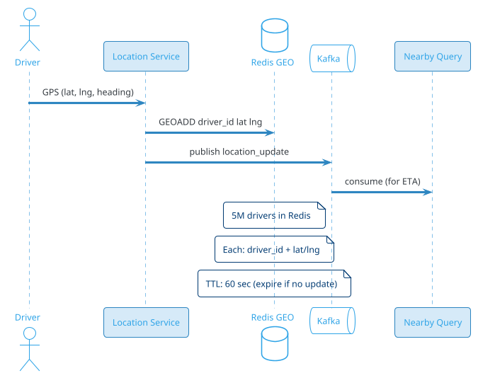
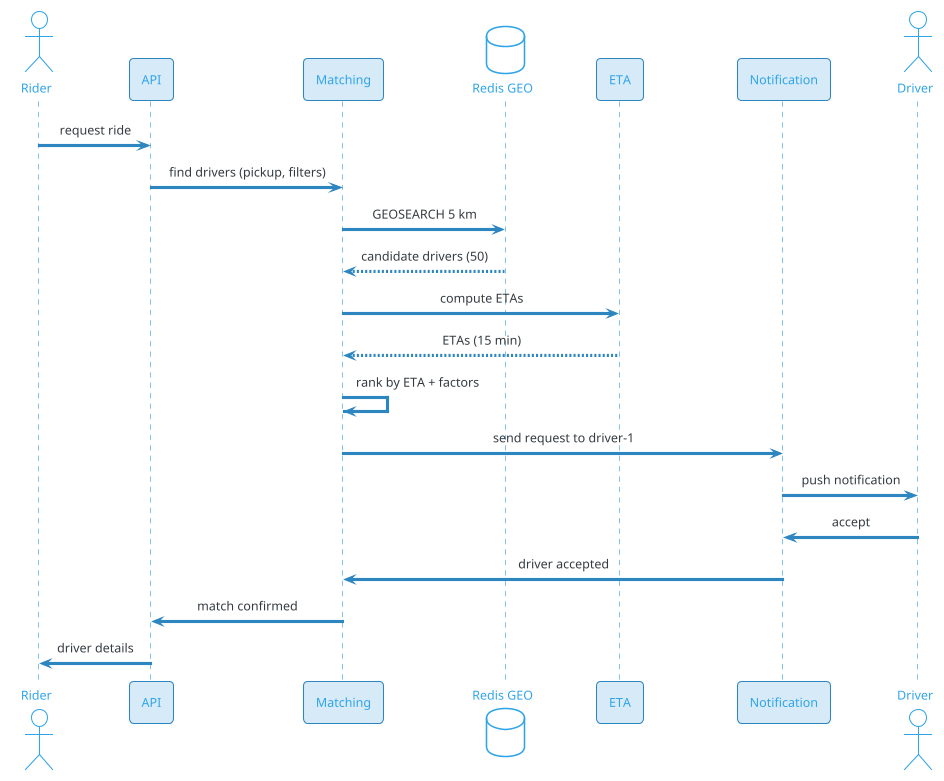
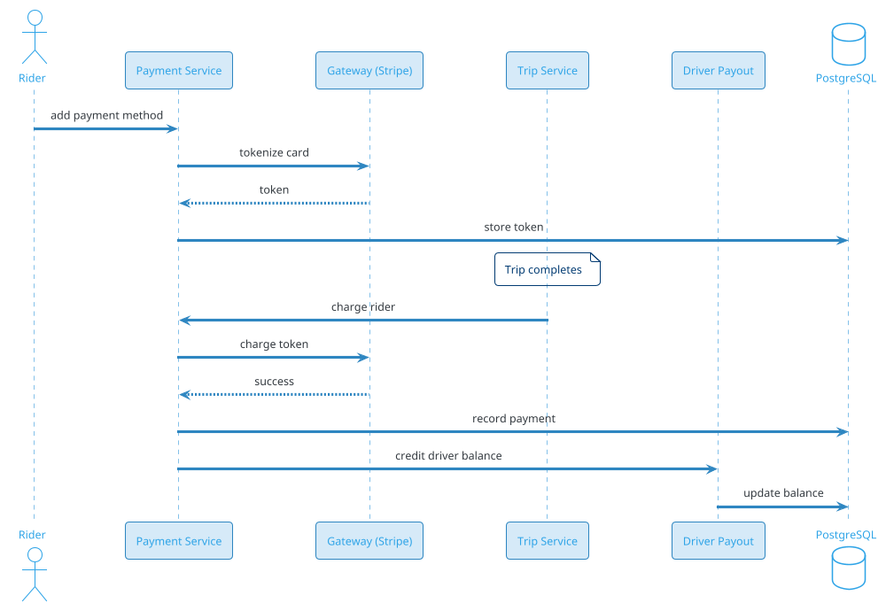

# Ride Booking (Uber / Ola / Rapido)

## Problem Statement

Design a ride-booking platform like Uber, Ola, or Rapido. Riders request rides, drivers accept, both are matched in real time, prices are quoted upfront (or metered), trips are tracked on a map, and payments are processed. The system must handle millions of concurrent rides, real-time location updates, dynamic pricing (surge), matching algorithms, and a two-sided marketplace with drivers and riders.

**Example:**

```
Ride flow:
  1. Priya opens app, sets pickup (Bandra) + drop (Airport)
  2. Gets fare estimate: ₹350 (UberX, 25 min)
  3. Taps "Request"
  4. System finds nearby drivers (5 within 2 km)
  5. Sends request to nearest driver
  6. Driver Raj accepts in 8 sec
  7. Priya sees driver's location, ETA, vehicle info
  8. Driver picks up Priya (GPS confirms)
  9. Trip starts
 10. Real-time tracking (both sides)
 11. Trip ends at airport
 12. Fare calculated (₹360, slight detour)
 13. Payment via UPI
 14. Receipt emailed
 15. Both rate each other

Key challenges:
  - Real-time location (millions of drivers)
  - Matching algorithm (driver ↔ rider)
  - Dynamic pricing (surge)
  - Trip state machine
  - Payment processing
  - Safety (SOS, share trip)
  - Multi-region (different cities, countries)
  - Two-sided marketplace

Scale:
  - 100M MAU, 20M DAU
  - 5M drivers globally
  - 50M rides/day (~578/sec avg, 2,900/sec peak)
  - 5M concurrent drivers online (peak)
  - 100M location updates/sec
  - 50 cities globally
```

**Real-world systems:** Uber, Ola, Rapido, Lyft, Bolt, Grab, Didi, Careem.

**Why it's interesting:**

- **Real-time location** — 5M drivers pinging every 4 sec
- **Matching algorithm** — driver-rider, minimize ETA
- **Dynamic pricing** — surge multiplier
- **Trip state machine** — multiple states
- **Geospatial** — drivers as moving points
- **Payments** — settle between rider and driver
- **Safety** — SOS, trip sharing
- **Two-sided** — supply/demand balance
- **Scale** — cities, countries, time zones
- **Cost** — compute for location + matching

---

## 1. Requirements Clarification

### Functional Requirements
- **Rider app**: Request ride, track driver, pay
- **Driver app**: Accept rides, navigate, earn
- **Location tracking**: Real-time GPS
- **Matching**: Nearest driver, ETA
- **Fare estimation**: Upfront price
- **Trip lifecycle**: Request → accept → pickup → drop → pay
- **Payments**: Multiple methods
- **Ratings**: Two-way
- **Safety**: SOS, share trip, phone mask
- **Support**: Rider and driver
- **Scheduling**: Book for later
- **Ride types**: UberX, Comfort, XL, Pool

### Non-Functional Requirements
- **Scale**: 20M DAU, 5M drivers, 50M rides/day
- **Latency**: Match < 10 sec; location update < 1 sec
- **Availability**: 99.99% — ride is critical
- **Consistency**: Strong for trip state and payments
- **Real-time**: Location and matching
- **Durability**: Never lose a trip
- **Global**: 50 cities, 20+ countries
- **Compliance**: Local laws, GDPR, payments
- **Safety**: SOS within seconds
- **Cost**: Optimize location updates, matching

### Out of Scope
- Food delivery (Uber Eats — separate)
- Freight (Uber Freight)
- Self-driving cars (future)
- Full navigation (uses external maps)

---

## 2. Back-of-Envelope Estimation

### Traffic

```
Given:
  MAU                  = 100,000,000
  DAU                  = 20,000,000
  Drivers (total)      = 5,000,000
  Drivers online (peak) = 1,000,000
  Rides/day            = 50,000,000
  Peak multiplier      = 5x

Location updates:
  Drivers online (avg)  = 500,000
  Updates per driver    = 15/min = 0.25/sec
  Total location QPS    = 500,000 x 0.25 = 125,000/sec
  Peak: ~625,000/sec

Ride requests:
  Rides/sec (avg) = 50M / 86,400 = ~578/sec
  Peak: ~2,900/sec

Matches:
  Per request = 1
  Total = same as requests

Notifications:
  Trip state changes: ~5 per ride
  Total = 250M/day = ~2,900/sec
  Peak: ~15,000/sec

Total ops: ~200K/sec avg, ~1M/sec peak
```

### Storage

```
Drivers:
  5M x 5 KB (profile, docs, vehicle) = ~25 GB

Riders:
  100M x 2 KB = ~200 GB

Trips:
  50M/day x 365 x 5 = 91B trips
  Per trip: ~5 KB (route, fare, states) = ~456 TB

Trip locations (GPS trace):
  50M trips x 100 location points x 50 bytes = ~250 GB/day
  5 years: ~456 TB

Location history (drivers):
  500K online x 86400 x 15/min = ~5.4B/day
  5 years: ~9.8T points x 20 bytes = ~196 TB

Payments:
  50M/day x 365 x 5 = 91B x 500 bytes = ~46 TB

Driver earnings:
  91B trips x 200 bytes = ~18 TB

Ratings:
  91B x 500 bytes = ~46 TB

SOS events:
  Rare, ~10K/day x 5 KB = ~50 MB/day

Total hot: ~10 TB
Total cold: ~1 PB
```

### Bandwidth

```
Location updates:
  125K/sec x 100 bytes = ~12.5 MB/sec = ~100 Mbps
  Peak: ~500 Mbps

Match notifications:
  5K/sec x 500 bytes = ~2.5 MB/sec

Map data (rider):
  ~10 KB per request

Total: ~1 Gbps peak
```

### Latency Budget

```
Match (request → accept):
  Client → API:                 ~50 ms
  Parse request:                ~10 ms
  Find nearby drivers:          ~100 ms
  Rank by ETA:                  ~50 ms
  Send request to driver:       ~100 ms
  Driver accepts:               ~2-10 sec (human)
  Notify rider:                 ~100 ms
  Total:                        ~3-11 sec

Target: < 30 sec (with retries)

Location update:
  Driver GPS → Server:          ~100-500 ms
  Store in Redis:               ~5 ms
  Publish to pub/sub:           ~10 ms
  Subscribers notified:         ~50 ms
  Total:                        ~200 ms

Trip tracking (rider view):
  Driver location update:       ~500 ms
  Propagation to rider:         ~100 ms
  UI update:                    ~50 ms
  Total:                        ~650 ms
  Update every 2-5 sec
```

---

## 3. High-Level Design

```d2
direction: down

rider: Rider {shape: person}
driver: Driver {shape: person}

cdn: CDN {shape: cloud}
lb: Load Balancer {shape: hexagon}
api: API Gateway {shape: hexagon}

match: Matching Service {shape: rectangle}
location: Location Service {shape: rectangle}
trip: Trip Service {shape: rectangle}
fare: Fare Service {shape: rectangle}
payment: Payment Service {shape: rectangle}
rating: Rating Service {shape: rectangle}
notif: Notification Service {shape: rectangle}
safety: Safety Service {shape: rectangle}
eta: ETA Service {shape: rectangle}

kafka: Kafka {shape: queue}

georedis: "Redis (driver locations)" {shape: cylinder}
tripdb: "PostgreSQL (trips, users)" {shape: cylinder}
cass: "Cassandra (location history)" {shape: cylinder}
ch: "ClickHouse (analytics)" {shape: cylinder}
s3: "S3 (docs, receipts)" {shape: cylinder}
maps: "Maps API (external)" {shape: cloud}

rider -> cdn
driver -> cdn
cdn -> lb
lb -> api

api -> match
api -> trip
api -> fare
api -> payment
api -> rating
api -> safety

driver -> location
rider -> location

location -> georedis
location -> kafka
match -> georedis
match -> kafka
trip -> tripdb
trip -> kafka
fare -> maps
eta -> maps
payment -> tripdb
kafka -> notif
kafka -> ch
kafka -> cass
```

### Component Responsibilities

| Component | Role |
|---|---|
| CDN | Static assets |
| Load Balancer | Route to API |
| API Gateway | Auth, rate limiting |
| Matching Service | Pair riders with drivers |
| Location Service | Track driver locations |
| Trip Service | Manage trip state machine |
| Fare Service | Compute fares |
| Payment Service | Process payments |
| Rating Service | Two-way ratings |
| Notification Service | Push, SMS |
| Safety Service | SOS, trip sharing |
| ETA Service | Compute ETAs |
| Redis (geo) | Live driver locations |
| PostgreSQL | Trips, users, payments |
| Cassandra | Location history |
| ClickHouse | Analytics |
| Kafka | Event bus |
| S3 | Documents, receipts |
| Maps API | Routes, ETAs |

### Why This Architecture

- **Redis GEO** for live driver locations (sub-ms queries)
- **PostgreSQL** for trip state (ACID)
- **Cassandra** for location history (write-heavy)
- **Kafka** for events (location, trip state, notifications)
- **ClickHouse** for analytics (surge detection)
- **Matching as separate service** (critical path)

---

## 4. Deep Dive: Location Tracking

### The Challenge

- **5M drivers** online at peak
- **15 updates/min** per driver
- **1.25M updates/sec** peak
- **Sub-second** propagation to riders

### Location Update Flow



### Redis GEO

Redis has native geospatial support:
```
GEOADD drivers:city-mumbai lng lat driver_id
GEOADD drivers:city-mumbai 72.8777 19.0760 "driver-123"
GEOSEARCH drivers:city-mumbai FROMLONLAT 72.8777 19.0760 BYRADIUS 2 km
```

**Precision:** 52-bit geohash (~0.6 m).

**Sharding:** By city or geohash prefix.

### Location Storage

**Live location (Redis):**
```
Key: drivers:{city}:{geohash_prefix}
Type: GEO set
TTL: 60 sec (heartbeat)
```

**Historical location (Cassandra):**
```
CREATE TABLE location_history (
    driver_id BIGINT,
    timestamp TIMESTAMP,
    lat DOUBLE,
    lng DOUBLE,
    heading INT,
    speed INT,
    PRIMARY KEY ((driver_id), timestamp)
);
```

**Retention:** 30 days (for disputes, analytics).

### Location Accuracy

- **GPS**: ~5-10 m outdoors
- **WiFi**: ~20 m indoors
- **Cell tower**: ~500 m
- **IP**: ~1 km

**Trade-off:** Precision vs privacy.

### Location Update Rate

- **Idle driver**: 1 update / 30 sec (to save battery)
- **Waiting for ride**: 1 update / 10 sec
- **On trip**: 1 update / 2 sec (for tracking)
- **Adaptive**: Faster when movement detected

### Handling GPS Noise

- **Kalman filter**: Smooth out jitter
- **Map matching**: Snap to roads
- **Outlier removal**: Discard big jumps

### Location Service Scale

- **1.25M updates/sec peak** — Redis handles easily
- **Sharded by city**: 50 cities x 25K QPS
- **Per-city Redis cluster**: 3 shards each
- **Total**: ~150 Redis instances

### Privacy

- **Location not shared** with rider until matched
- **Historical** deleted after 30 days
- **Not sold** to third parties
- **User consent** required

---

## 5. Deep Dive: Matching Algorithm

### The Core Problem

Given a ride request (pickup, drop, time), find the best driver.

**Criteria:**
- **Closest** by ETA (not just distance)
- **Available** (not on trip, not on break)
- **Vehicle type** matches request
- **Driver rating** meets threshold
- **Fairness** (rotate drivers, avoid cherry-picking)

### Matching Flow



### Candidate Generation

1. **Query Redis GEO**: All drivers within 5 km
2. **Filter**: Available, correct vehicle type, rating threshold
3. **Compute ETAs**: For top candidates
4. **Rank**: By ETA + fairness + driver behavior

### ETA Computation

For each driver:
- **Route distance**: Road distance (not straight line)
- **Traffic factor**: Real-time traffic
- **Driver history**: Their speed patterns
- **Time to pickup** + **time to drop**

**Maps API**: Google, Mapbox, or in-house.

**Batch:** Compute ETAs for 10-20 candidates.

### Ranking Formula

```
score = w1 * (1 / eta_to_pickup)
      + w2 * driver_rating
      + w3 * driver_acceptance_rate
      + w4 * fairness_boost
      - w5 * driver_distance_from_rider
```

**Fairness**: Drivers who've waited longer get a boost.

### Dispatch Strategy

**Option 1: Broadcast**
- Send request to all candidates
- First to accept wins
- **Fast**, but wastes driver time

**Option 2: Sequential**
- Send to best driver, wait 5-10 sec
- If declined, next
- **Slower**, but less noise

**Option 3: Hybrid (Uber)**
- Send to top 3 drivers simultaneously
- First to accept wins
- If no acceptance in 10 sec, expand radius

**Recommendation:** Hybrid.

### Handling Declines

- **Driver decline**: Send to next
- **Timeout**: 10 sec per driver
- **Expand**: Increase radius (5 km → 10 km → 15 km)
- **Surge**: Increase price to attract more
- **Cancel**: If no match in 60 sec

### Matching Optimization

- **Batch matching**: Group requests every 1-2 sec
- **Global optimal**: Match all requests + drivers optimally (Hungarian algorithm for small batches)
- **Trade-off**: Fast vs optimal

### Driver Availability

- **Online**: Receiving requests
- **On trip**: Not available
- **Break**: Temporarily off
- **Offline**: Not receiving

### Matching Scale

```
50M rides/day
= 578 rides/sec avg
= 2,900 rides/sec peak

Per ride:
  Candidate query: ~10 ms
  ETA computation: ~50 ms (batch)
  Ranking: ~5 ms
  Dispatch: async
  
Total matching time: ~100 ms per batch
Matching service: ~100 instances (peak)
```

---

## 6. Deep Dive: Trip State Machine

### Trip States

```
REQUESTED → MATCHING → MATCHED → ARRIVING → ARRIVED → 
IN_PROGRESS → COMPLETED → PAID → RATED
     ↓
  CANCELLED (at any pre-trip state)
```

### State Transitions

| From | To | Trigger |
|---|---|---|
| REQUESTED | MATCHING | System starts match |
| MATCHING | MATCHED | Driver accepts |
| MATCHING | CANCELLED | No driver / rider cancels |
| MATCHED | ARRIVING | Driver starts moving to pickup |
| ARRIVING | ARRIVED | Driver at pickup (GPS) |
| ARRIVING | CANCELLED | Rider/driver cancels |
| ARRIVED | IN_PROGRESS | Trip starts (GPS + rider confirms) |
| IN_PROGRESS | COMPLETED | Reached drop (GPS) |
| COMPLETED | PAID | Payment processed |
| PAID | RATED | Both rate |
| Any | CANCELLED | SOS / emergency |

### Trip Data Model

```json
{
  "trip_id": "trip-123",
  "rider_id": "r-456",
  "driver_id": "d-789",
  "status": "in_progress",
  "pickup": {"lat": 19.0760, "lng": 72.8777, "address": "Bandra West"},
  "drop": {"lat": 19.0896, "lng": 72.8656, "address": "Airport T2"},
  "requested_at": "2026-09-19T10:00:00Z",
  "matched_at": "2026-09-19T10:00:10Z",
  "started_at": "2026-09-19T10:03:00Z",
  "estimated_fare_cents": 35000,
  "final_fare_cents": 36000,
  "payment_method": "upi",
  "distance_km": 12.5,
  "duration_minutes": 25
}
```

### State Transitions via Kafka

Each transition:
- Persisted in PostgreSQL
- Published to Kafka (for notifications, analytics)
- Reflected in Redis (hot cache)
- Broadcast via WebSocket (to rider + driver)

### Cancellation

- **Rider cancels**: Free before 2 min, then fee
- **Driver cancels**: Penalty to driver
- **System cancels**: No match; refund any pre-auth

### Trip Events

- `trip.requested`
- `trip.matched`
- `trip.arriving`
- `trip.arrived`
- `trip.started`
- `trip.completed`
- `trip.cancelled`
- `trip.paid`

### Recovery

- **Trip state in PostgreSQL**: Source of truth
- **Redis cache**: Hot state
- **Server crash**: Restore from DB
- **Client reconnect**: Fetch state via API

---

## 7. Deep Dive: Dynamic Pricing (Surge)

### Why Surge?

Balance supply and demand:
- **High demand** (rain, events, rush hour)
- **Low supply** (few drivers)
- **Surge multiplier** attracts drivers

### Surge Algorithm

```
surge_multiplier = base_multiplier * demand_factor / supply_factor

demand_factor = requests_per_minute / baseline
supply_factor = available_drivers / baseline

surge = clamp(surge_multiplier, 1.0, 5.0)
```

### Example

```
Bandra area:
  Baseline requests = 100/min
  Current requests = 300/min
  Baseline drivers = 500
  Current drivers = 200
  
surge = (300/100) / (200/500)
      = 3 / 0.4
      = 7.5 → clamp to 5.0
```

### Surge Areas

- **Geohash cells** with surge
- **Dynamic**: Updated every 1-5 min
- **Displayed**: On map (heatmap)

### Surge Interaction

- **Rider sees surge** before requesting
- **Upfront price** (no surprise)
- **Driver sees surge** (incentive)
- **Transparency**: Explain why

### Cap

- **Max 5x** (regulatory)
- **Fair**: Not during emergencies
- **Policy**: Different per market

### Surge Data

```
Key: surge:{geohash_5}
Value: multiplier
TTL: 5 min
```

### Demand Signals

- **Ride requests/min** per cell
- **Search-to-request rate**
- **Cancellations**
- **Weather events**
- **Local events** (concerts, sports)

### Supply Signals

- **Available drivers** per cell
- **Driver login rate**
- **Driver offline rate**
- **Traffic conditions**

### Surge Elasticity

- **Model**: Historical data, ML
- **Predict**: Future demand
- **Adjust**: Pre-emptive surge

### Surge Impact

- **Attracts drivers**: More supply
- **Reduces demand**: Some riders wait
- **Balances**: Eventually demand = supply

### Ethical Considerations

- **Not during emergencies**: Cap at 1.0
- **Not discriminatory**: Same price for same route
- **Transparent**: Show multiplier

---

## 8. Deep Dive: Payment and Settlement

### Payment Flow



### Payment Methods

- **Credit/Debit card** (Stripe, Razorpay)
- **UPI** (India)
- **PayPal**
- **Wallet** (in-app)
- **Cash** (some markets)
- **Corporate accounts** (B2B)

### Payment Flow

1. **Pre-auth** (optional): Hold amount at request
2. **Charge** after trip completes
3. **Settle**: Net of commission
4. **Payout**: To driver's account (weekly/bi-weekly/daily)

### Fare Calculation

```
fare = base_fare
     + (distance_km * per_km_rate)
     + (duration_min * per_min_rate)
     - discounts
     + surge_multiplier
     + tolls
     + waiting_time
     + surge_boost
```

**Commission:** Platform takes 20-25%.

### Driver Earnings

```
earnings = fare * (1 - commission_rate)
         + tips
         + bonuses (quests)
         - cancellations
```

### Payout

- **Frequency**: Weekly (default), daily (instant payout)
- **Methods**: Bank transfer, debit card
- **Minimum**: $10
- **Fee**: Free (weekly), small fee (instant)
- **Tax**: 1099 (US), TDS (India)

### Payment Security

- **PCI-DSS**: Card data tokenized
- **Encryption**: TLS, AES-256 at rest
- **Fraud detection**: ML-based
- **3D Secure**: For high-risk transactions

### Refunds

- **Trip cancelled**: Auto-refund
- **Dispute**: Manual review
- **Duplicate charge**: Auto-refund
- **SLA**: Refund within 5-7 business days

### Payment Scale

```
50M rides/day
= ~578 payments/sec avg
= ~2,900 payments/sec peak

Each payment: ~500 ms (external gateway)
Concurrent: ~1,500 in flight

Payment service: ~50 instances
```

---

## 9. Deep Dive: Safety Features

### SOS

**Flow:**
1. User taps SOS button
2. Captures location, trip info
3. Alerts:
   - Emergency contacts
   - Local authorities
   - Platform safety team
4. Real-time tracking
5. Two-way communication

**Implementation:**
- **Auto-dial** local emergency number
- **Share trip** with contacts
- **Alert platform** for monitoring
- **Record** audio (optional, per consent)

### Trip Sharing

- **Share link** with trusted contacts
- **Live location** shown
- **ETA** and route
- **Driver details** included
- **Rider can stop** sharing anytime

### Phone Masking

- **Rider and driver** cannot see each other's real numbers
- **Proxy number** (Twilio) for calls
- **Auto-expire** after trip

### Driver Verification

- **Background check** (criminal, driving record)
- **Document verification** (license, insurance, registration)
- **Vehicle inspection** (periodic)
- **Photo verification** (selfie match)

### Rider Verification

- **Phone verification** (SMS)
- **Email verification**
- **Payment method** (card on file)
- **Photo verification** (selfie, some markets)

### Incident Response

- **Report button**: In-app
- **24/7 support**: Chat, phone
- **Safety team**: Trained responders
- **Law enforcement**: Coordination
- **Insurance**: Coverage during trip

### Real-Time Monitoring

- **Anomaly detection**: Off-route, sudden stop, long pause
- **Machine learning**: Flag suspicious trips
- **Auto-alert**: Safety team notified
- **Rider notified**: "Everything okay?"

### Privacy

- **Location**: Only during trip
- **Recording**: Consent required
- **Data retention**: Limited (30 days for SOS)
- **Third-party sharing**: Only with consent

### Safety Metrics

- **Incidents per million rides**: Target < 1
- **SOS response time**: < 30 sec
- **Report response**: < 1 hour
- **Driver background check**: 100%

---

## 10. Deep Dive: Multi-City and Multi-Region

### Why Multi-City?

- Different cities have different:
  - Regulations
  - Pricing
  - Vehicle types
  - Payment methods
  - Currencies
- Data residency (GDPR, DPDP)
- Local teams

### Architecture

```d2
direction: down

us: "US Region" {
  shape: cloud
}
eu: "EU Region" {
  shape: cloud
}
india: "India Region" {
  shape: cloud
}

usdb: "US DB + Redis" {
  shape: cylinder
}
eudb: "EU DB + Redis" {
  shape: cylinder
}
indiadb: "India DB + Redis" {
  shape: cylinder
}

us -> usdb
eu -> eudb
india -> indiadb
```

### Per-City Deployment

- **City = logical shard**
- **Independent Redis** for drivers
- **Independent PostgreSQL** for trips (or shared with shard key)
- **Independent Matching** service instance

### Cross-City

- **User accounts**: Global (single login)
- **Payments**: Per-city methods (UPI for India, card for US)
- **Trip history**: Aggregated globally
- **Rider can book** in any city

### Regional Customization

| Feature | US | India | EU |
|---|---|---|---|
| Payment | Card, PayPal | UPI, Cash | Card, SEPA |
| Vehicle | UberX, XL, Black | Auto, Bike, Cab | UberX, Comfort |
| Currency | USD | INR | EUR |
| Surge cap | 5x | 3x | 2x |
| Regulations | State-level | Central | Country-level |

### Data Residency

- **GDPR**: EU data in EU
- **DPDP**: India data in India
- **CCPA**: US users' rights
- **Compliance**: Per-region

### Localization

- **Language**: App in local language
- **Currency**: Local
- **Units**: Miles (US), km (rest)
- **Date/time**: Local formats

### Cost

- **Regional infrastructure**: Higher cost
- **Compliance**: Legal, audits
- **Localization**: Translation, support
- **Trade-off**: Global scale vs local fit

---

## 11. Deep Dive: Driver Experience

### Driver App

- **Go online/offline**: Toggle availability
- **Accept/decline**: Ride requests
- **Navigate**: In-app or external maps
- **Earnings**: Real-time balance
- **Quests**: Bonus challenges
- **Support**: Chat, phone
- **Vehicle info**: Manage

### Driver Metrics

- **Acceptance rate**: % of requests accepted
- **Completion rate**: % of accepted trips completed
- **Rating**: Average (1-5)
- **Cancellation rate**: % cancelled
- **Online hours**: Weekly
- **Earnings**: Daily, weekly

**Consequences:**
- Low acceptance → fewer requests
- Low rating → deactivation
- High cancellation → warning

### Driver Incentives

- **Quests**: Complete N rides, get bonus
- **Surge**: Higher fares during peak
- **Streaks**: Consecutive rides
- **Guarantees**: Minimum hourly earnings

### Driver Support

- **In-app help**: FAQs, chat
- **Phone support**: For issues
- **Safety**: Emergency button
- **Payment issues**: Resolution
- **Deactivation appeals**: Process

### Driver Community

- **Driver centers**: Physical locations
- **Online forums**: Peer support
- **Feedback channels**: App improvements

### Two-Sided Balance

- **Too many drivers**: Low earnings, churn
- **Too few drivers**: Long wait, rider churn
- **Balance**: Incentives, pricing
- **ML**: Predict supply/demand
- **Recruit**: In underserved areas

### Driver Onboarding

- **Signup**: Basic info
- **Documents**: License, insurance, registration
- **Background check**: 1-7 days
- **Vehicle inspection**: Physical
- **Training**: App, safety
- **Activation**: First ride

---

## 12. Scaling Considerations

### Read Scaling

- **Redis** for live driver locations
- **Read replicas** for PostgreSQL
- **ClickHouse** for analytics
- **CDN** for static assets
- **Regional** for latency

### Write Scaling

- **Kafka** for events
- **Cassandra** for location history
- **PostgreSQL** sharded for trips
- **Redis** for hot state

### Sharding

**Redis:** Shard by city (and geohash within city).
**PostgreSQL:** Shard by `city_id` and `user_id`.
**Cassandra:** Partition by `driver_id`.
**Kafka:** Partition by `driver_id` or `trip_id`.

### Peak Handling

- **Rush hour**: 5x
- **Rain**: 3x
- **Events**: 10x (concerts, sports)
- **New Year's Eve**: 20x

**Mitigations:**
- Auto-scale
- Surge pricing (attracts drivers)
- Queue requests
- Degrade gracefully

### Cost Optimization

| Component | Optimization |
|---|---|
| Location service | Batch updates, sample |
| Matching | Batch, cache ETAs |
| Notifications | Batch, dedupe |
| Maps API | Cache routes, batch |
| Storage | Tiering, sampling |

### Scale Numbers

- **5M drivers** in Redis GEO (sharded)
- **1M concurrent** online at peak
- **50M rides/day** in PostgreSQL
- **1.25M location updates/sec** peak
- **2,900 matches/sec** peak

---

## 13. Bottlenecks and Trade-offs

| Concern | Solution | Trade-off |
|---|---|---|
| Location scale | Redis GEO, sharded | Cost |
| Matching speed | Batch, cache ETAs | Optimality |
| Surge accuracy | Real-time signals | Complexity |
| Trip state | PostgreSQL + Redis | Consistency |
| Payment | External gateway | Dependency |
| Safety | Multi-layer | Response time |
| Multi-region | Per-city | Cost |
| Driver experience | Incentives | Cost |

### Design Decisions Summary

| Decision | Choice | Rationale |
|---|---|---|
| Location | Redis GEO | Fast spatial queries |
| Trip state | PostgreSQL (sharded) | ACID |
| History | Cassandra | Write-heavy |
| Events | Kafka | Decoupled |
| Analytics | ClickHouse | Fast aggregations |
| Maps | External API | Don't build |
| Payments | External gateway | PCI compliance |
| Multi-region | Per-city sharding | Isolation |

---

## 14. Failure Scenarios

### Matching Service Down

**Impact:** Riders can't get matched.

**Mitigation:**
- Multi-instance
- Queue requests
- Fall back to simple matching
- Alert ops

### Location Service Down

**Impact:** Drivers not trackable.

**Mitigation:**
- Redis Sentinel
- Buffer updates locally
- Retry on recovery
- Alert ops

### Redis Down

**Impact:** No live locations.

**Mitigation:**
- Redis cluster (HA)
- Failover (~10 sec)
- Rebuild from driver heartbeats
- Alert ops

### PostgreSQL Down

**Impact:** Trip state can't be persisted.

**Mitigation:**
- Multi-AZ failover
- Queue in Kafka
- Read from Redis (stale)
- Alert ops

### Kafka Down

**Impact:** Events delayed.

**Mitigation:**
- Buffer in services
- Retry
- Alert ops

### Payment Gateway Down

**Impact:** Can't charge riders.

**Mitigation:**
- Fallback gateway
- Queue payments
- Allow "pay later"
- Alert ops

### Maps API Down

**Impact:** No ETAs.

**Mitigation:**
- Cache recent ETAs
- Fallback to straight-line distance
- Switch to alternative provider
- Alert ops

### GPS Failure (Driver)

**Impact:** Driver not trackable.

**Mitigation:**
- Fall back to last known location
- Notify driver
- Manual location entry

### Region Outage

**Impact:** City can't operate.

**Mitigation:**
- Route to backup region
- Restore from replica
- Alert ops

### Safety Incident

**Impact:** User in danger.

**Mitigation:**
- SOS button
- Auto-alert contacts
- Platform safety team
- Local authorities

### Data Breach

**Impact:** User data exposed.

**Mitigation:**
- Encryption at rest + transit
- Access controls
- Anomaly detection
- Incident response

### DDoS

**Impact:** Service unavailable.

**Mitigation:**
- CDN/WAF
- Rate limiting
- Anycast
- Alert ops

---

## 15. Monitoring and Alerts

### Key Metrics

| Metric | Target | Alert Threshold |
|---|---|---|
| Match time p99 | < 30 sec | > 60 sec |
| Match rate | > 95% | < 90% |
| Location update p99 | < 1 sec | > 3 sec |
| Trip state transition p99 | < 500 ms | > 2 sec |
| Payment success rate | > 99% | < 95% |
| Driver acceptance rate | > 80% | < 70% |
| Rider cancellation rate | < 5% | > 10% |
| Surge accuracy | baseline | +50% |
| SOS response | < 30 sec | > 60 sec |
| Concurrent drivers | baseline | drop > 20% |
| Rides per minute | baseline | drop > 30% |

### Dashboards

- **Traffic**: Rides/sec, location updates/sec
- **Latency**: p50/p95/p99 per operation
- **Matching**: Success rate, time, declines
- **Supply/demand**: Drivers online, riders requesting
- **Surge**: Active surge areas, multipliers
- **Payments**: Success rate, payouts
- **Safety**: SOS events, incidents
- **Infrastructure**: Redis, PostgreSQL, Kafka
- **Business**: DAU, rides/user, revenue

### Alerts

- **P0**: Region down, Redis down, safety incident
- **P1**: Match rate < 90%, payment failure > 5%
- **P2**: High cancellations, surge accuracy drop
- **P3**: Slow ETAs, support backlog

### Business KPIs

- **DAU/MAU** ratio
- **Rides per DAU**
- **Driver utilization** (% time on trip)
- **Rider retention** (D1, D7, D30)
- **Driver retention**
- **Take rate** (commission %)
- **Average fare**
- **NPS** (both sides)

---

## 16. Cost Estimation

Rough monthly cost (AWS, us-east-1) for 20M DAU:

| Component | Spec | Cost/month |
|---|---|---|
| API servers | 500 x c6g.large | ~$30,000 |
| Matching servers | 200 x c6g.2xlarge | ~$48,000 |
| Location servers | 300 x c6g.large | ~$18,000 |
| Trip servers | 200 x c6g.large | ~$12,000 |
| Payment servers | 100 x c6g.large | ~$6,000 |
| PostgreSQL | 30 shards x db.r6g.4xlarge | ~$142,000 |
| Read replicas | 60 x db.r6g.2xlarge | ~$126,000 |
| Redis (locations) | 200 x cache.r6g.2xlarge | ~$100,000 |
| Redis (cache) | 100 x cache.r6g.xlarge | ~$25,000 |
| Cassandra | 50 x i3.2xlarge | ~$50,000 |
| Kafka (MSK) | 40 brokers | ~$20,000 |
| ClickHouse | 20 x i3.2xlarge | ~$20,000 |
| S3 (docs, receipts) | 50 TB | ~$1,200 |
| Maps API | 500M calls | ~$2,500,000 |
| Payment gateway | ~2% of GMV | variable |
| Monitoring | Datadog | ~$50,000 |
| **Total** | | **~$3.2M/month** |

**Per user:** ~$0.16/month.

**Cost breakdown:**
- **Maps API**: ~78% (dominant)
- **Databases**: ~10%
- **Compute**: ~5%
- **Other**: ~7%

**Cost optimization:**
- **Maps**: Negotiate rates, cache ETAs, batch
- **Redis**: Right-size, TTL
- **Compute**: Reserved, spot

**Revenue note:** Commission per ride (20-25%) covers cost.

---

## 17. Extensions and Follow-ups

### Pool / Shared Rides

- Multiple riders share
- Dynamic routing
- Cheaper fares
- Longer detours
- Complex optimization

### Scheduled Rides

- Book for later
- Advance matching
- Guaranteed availability

### Ride Types

- UberX, Comfort, XL, Black
- Bike (Rapido)
- Auto (Ola)
- Different pricing, vehicles

### Food Delivery (Uber Eats)

- Same driver pool
- Different workflow
- Restaurant integration
- Separate app

### Freight (Uber Freight)

- Trucking
- Long-haul
- B2B

### Payments Integration

- UPI, cards, wallets
- Cash (some markets)
- Corporate accounts

### Loyalty Program

- Uber Rewards
- Points per ride
- Free upgrades

### Subscription

- Uber Pass
- Fixed monthly fee
- Discounts, free deliveries

### Accessibility

- Wheelchair-accessible vehicles
- Sign language support
- Audio cues

### Electric Vehicles

- EV fleet
- Charging stations
- Incentives

### Autonomous

- Self-driving cars
- Waymo partnership
- Future

### Multi-Modal

- Ride + public transit
- Bike + ride
- Integration with transit

### Business Travel

- Corporate accounts
- Expense integration
- Policy compliance

### Insurance

- In-trip insurance
- Optional coverage

### Blockchain / Web3

- Decentralized ride-hailing
- Token incentives
- Experimental

---

## 18. Summary

| Aspect | Decision |
|---|---|
| Location | Redis GEO (sharded by city) |
| Trip state | PostgreSQL (sharded) |
| Location history | Cassandra |
| Events | Kafka |
| Analytics | ClickHouse |
| Maps | External API (Google, Mapbox) |
| Payments | External gateway (Stripe, Razorpay) |
| Matching | Real-time, batched, hybrid dispatch |
| Surge | Demand/supply ratio, capped |
| Safety | SOS, trip sharing, monitoring |
| Multi-region | Per-city sharding |
| Scale | 20M DAU, 50M rides/day, 5M drivers |
| Latency | Match < 30 sec, location < 1 sec |
| Availability | 99.99% |
| Cost | ~$3.2M/month (maps dominate) |

**Key takeaways:**

- **Redis GEO** for live driver locations — sub-ms spatial queries
- **Matching** is the critical path — hybrid dispatch (top 3, first-accept)
- **ETA** must account for traffic, not just distance
- **Surge pricing** balances supply/demand — real-time signals
- **Trip state machine** with Kafka events — clear lifecycle
- **Payment** via external gateway — PCI compliance
- **Safety** is non-negotiable — SOS, trip sharing, monitoring
- **Multi-region** per city for isolation, compliance, latency
- **Maps API is 78% of cost** — negotiate, cache, batch
- **Driver experience** matters — incentives, support, balance
- **Two-sided marketplace** — balance supply and demand
- **Scale**: 5M drivers, 1.25M location updates/sec, 2,900 matches/sec

### Similar Pattern Problems

- Food Delivery (Swiggy, Zomato) — nearby restaurants, delivery
- Proximity Service — nearby search
- Dating App — nearby users
- Ride-hailing — Uber, Ola, Lyft, Bolt, Grab
- Delivery (Amazon Flex) — nearby drivers
- Home Services (Urban Company) — nearby professionals
- Logistics — fleet management