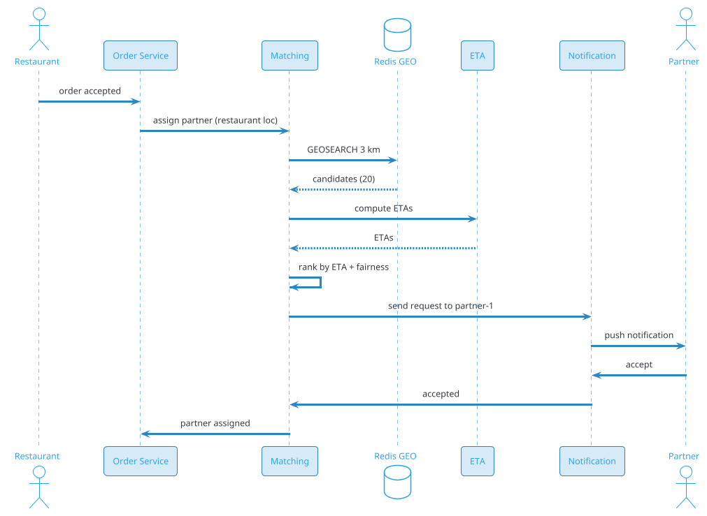
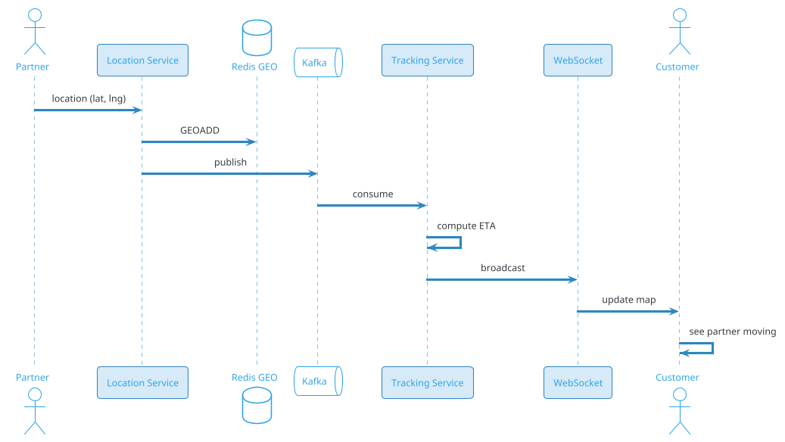
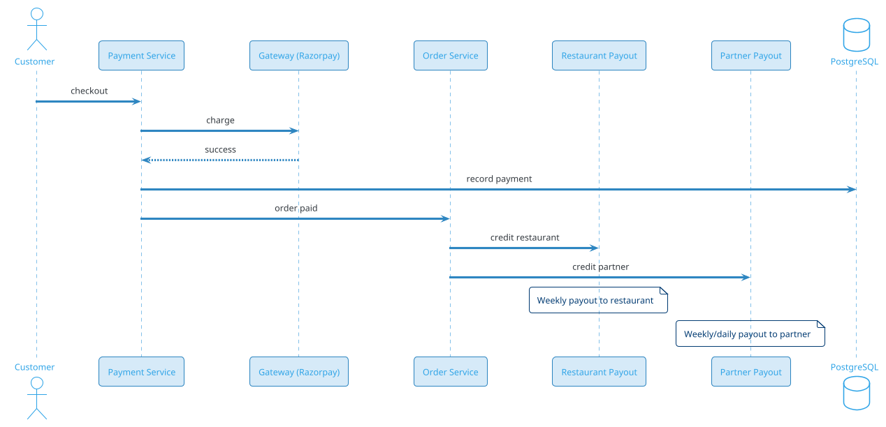

# Food Delivery (Swiggy / Zomato / DoorDash)

## Problem Statement

Design a food delivery platform like Swiggy, Zomato, or DoorDash. Users browse restaurants, order food, track delivery in real time, and pay. Restaurants receive orders, prepare food, and hand off to delivery partners (or their own). Delivery partners pick up from restaurants and deliver to customers. The system must handle millions of concurrent orders, real-time tracking, dynamic pricing, and a three-sided marketplace (customer, restaurant, delivery partner).

**Example:**

```
Order flow:
  1. Priya opens app, browses restaurants nearby
  2. Filters: "Indian", "4+ stars", "under 30 min"
  3. Selects restaurant, adds items to cart
  4. Gets total: ₹450 (food) + ₹40 (delivery) + ₹30 (taxes) = ₹520
  5. Applies coupon: 20% off → ₹470
  6. Places order, pays via UPI
  7. Restaurant receives order, accepts in 30 sec
  8. Delivery partner (Rahul) assigned
  9. Rahul goes to restaurant, picks up
 10. Real-time tracking (Priya sees Rahul on map)
 11. Delivered in 28 min
 12. Priya rates 5 stars; tips ₹20
 13. Restaurant gets order amount - commission
 14. Rahul gets delivery fee + tip

Key challenges:
  - Restaurant discovery (nearby, filters)
  - Menu management (items, prices, availability)
  - Order lifecycle (restaurant accept, prepare, pickup, deliver)
  - Delivery partner assignment (nearby, available)
  - Real-time tracking (customer, restaurant, delivery)
  - Dynamic pricing (delivery fee, surge)
  - Batching (multiple orders per partner)
  - Ratings and reviews (3-sided)

Scale:
  - 100M MAU, 20M DAU
  - 500K restaurants
  - 5M delivery partners
  - 10M orders/day (~116/sec avg, 580/sec peak)
  - 50M menu items
  - 100M searches/day
  - 50 cities globally
```

**Real-world systems:** Swiggy, Zomato, DoorDash, Uber Eats, Grubhub, Deliveroo, Postmates, Blinkit (instant delivery).

**Why it's interesting:**

- **Three-sided marketplace** (customer, restaurant, delivery partner)
- **Order lifecycle** — multiple states, multiple actors
- **Delivery partner assignment** — nearby, available, right vehicle
- **Batching** — one partner, multiple orders
- **Real-time tracking** — sub-second updates
- **Restaurant discovery** — search, filters, ranking
- **Menu management** — items, availability, pricing
- **Dynamic pricing** — delivery fee, surge
- **Ratings** — three-way feedback
- **Scale** — millions of orders, thousands of restaurants

---

## 1. Requirements Clarification

### Functional Requirements
- **Customer app**: Browse restaurants, order, track, pay, rate
- **Restaurant app**: Menu, orders, preparation, handoff
- **Delivery app**: Accept, navigate, pickup, deliver, earn
- **Restaurant discovery**: Search, filters, ranking
- **Menu**: Items, prices, customizations, availability
- **Cart**: Add/remove, apply coupon
- **Order placement**: Checkout, payment
- **Order lifecycle**: States (placed, accepted, preparing, ready, picked_up, delivered)
- **Delivery partner assignment**: Nearby, available
- **Real-time tracking**: Map, ETA
- **Dynamic pricing**: Delivery fee, surge
- **Ratings**: Customer → restaurant, customer → delivery, restaurant → delivery
- **Support**: Customer, restaurant, delivery
- **Promotions**: Coupons, discounts, free delivery
- **Multi-restaurant cart**: Order from multiple (rare)

### Non-Functional Requirements
- **Scale**: 20M DAU, 10M orders/day, 500K restaurants, 5M delivery partners
- **Latency**: Search < 500 ms, order placement < 2 sec
- **Availability**: 99.99% — order critical
- **Consistency**: Strong for order state, payments
- **Real-time**: Live tracking < 2 sec lag
- **Durability**: Never lose an order
- **Global**: 50 cities, multi-region
- **Compliance**: Local food safety, GDPR, payments
- **Cost**: Delivery fee, payments, compute

### Out of Scope
- Restaurant reservation (OpenTable)
- Grocery delivery (Instacart — different)
- Full inventory management for restaurants
- POS integration (mentioned)

---

## 2. Back-of-Envelope Estimation

### Traffic

```
Given:
  MAU                  = 100,000,000
  DAU                  = 20,000,000
  Restaurants          = 500,000
  Delivery partners    = 5,000,000
  Orders/day           = 10,000,000
  Searches/day         = 100,000,000
  Menu views/day       = 50,000,000
  Peak multiplier      = 5x (dinner rush)

Average QPS:
  Orders = 10M / 86,400 = ~116/sec
  Searches = 100M / 86,400 = ~1,157/sec
  Menu views = 50M / 86,400 = ~579/sec
  Total: ~1.9K ops/sec

Peak QPS (5x, dinner 7-9 PM):
  Orders = ~580/sec
  Searches = ~5,787/sec
  Menu views = ~2,900/sec
  Total: ~9.3K ops/sec

Location updates:
  Delivery partners online (peak) = 500,000
  Updates = 15/min = 0.25/sec
  Total = ~125,000/sec
  Peak: ~625,000/sec
```

### Storage

```
Restaurants:
  500K x 20 KB (profile, hours, images URLs) = ~10 GB

Menus:
  500K restaurants x 100 items x 5 KB = ~250 GB

Menu images:
  50M items x 3 images x 300 KB = ~45 TB (in S3)

Orders:
  10M/day x 365 x 5 = 18.25B orders
  Per order: ~2 KB (items, status, amounts) = ~36 TB

Order items:
  18.25B x 5 items x 500 bytes = ~45 TB

Delivery partner data:
  5M x 5 KB = ~25 GB
  Location history: 500K online x 86400 x 15/min = ~10B/day
  5 years: ~50B points x 20 bytes = ~1 TB

Ratings:
  18.25B orders x 3 ratings x 500 bytes = ~27 TB

Payments:
  18.25B x 500 bytes = ~9 TB

Analytics:
  10M orders/day x 10 events x 500 bytes = ~50 GB/day
  5 years: ~91 TB

Total hot: ~10 TB
Total cold: ~500 TB
```

### Bandwidth

```
Search responses:
  5,787/sec x 50 KB = ~290 MB/sec = ~2.3 Gbps

Menu views:
  2,900/sec x 100 KB = ~290 MB/sec = ~2.3 Gbps

Order responses:
  580/sec x 10 KB = ~6 MB/sec

Location updates:
  125,000/sec x 100 bytes = ~12.5 MB/sec

Images (via CDN):
  Peak: ~50 Gbps

Total peak: ~60 Gbps
```

### Latency Budget

```
Restaurant search:
  Client → API:                 ~50 ms
  Auth:                          ~10 ms
  Parse:                         ~5 ms
  Geo query (restaurants):       ~50 ms
  Filters:                       ~20 ms
  Ranking:                       ~20 ms
  Hydrate menus:                 ~30 ms
  Serialize:                     ~20 ms
  Total:                         ~205 ms

Order placement:
  Client → API:                 ~50 ms
  Auth:                          ~10 ms
  Validate cart:                 ~20 ms
  Reserve order:                 ~50 ms
  Payment:                       ~500 ms (external)
  Confirm:                       ~50 ms
  Notify restaurant:             ~10 ms
  Total:                         ~700 ms

Order tracking:
  Delivery location → Server:    ~200 ms
  Server → Customer:             ~200 ms
  UI update:                     ~50 ms
  Total:                         ~450 ms
  Update every 2-5 sec
```

---

## 3. High-Level Design

```d2
direction: down

customer: Customer {shape: person}
restaurant: Restaurant {shape: person}
delivery: "Delivery Partner" {shape: person}

cdn: CDN {shape: cloud}
lb: Load Balancer {shape: hexagon}
api: API Gateway {shape: hexagon}

search: Search Service {shape: rectangle}
menu: Menu Service {shape: rectangle}
order: Order Service {shape: rectangle}
match: "Delivery Matching" {shape: rectangle}
location: Location Service {shape: rectangle}
track: "Tracking Service" {shape: rectangle}
payment: Payment Service {shape: rectangle}
rating: Rating Service {shape: rectangle}
notif: Notification Service {shape: rectangle}
pricing: Pricing Service {shape: rectangle}
support: Support Service {shape: rectangle}

kafka: Kafka {shape: queue}

georedis: "Redis (delivery locations)" {shape: cylinder}
pdb: "PostgreSQL (orders, users)" {shape: cylinder}
cass: "Cassandra (location history)" {shape: cylinder}
ch: "ClickHouse (analytics)" {shape: cylinder}
s3: "S3 (images, receipts)" {shape: cylinder}
es: "Elasticsearch (restaurants)" {shape: cylinder}
maps: "Maps API" {shape: cloud}

customer -> cdn
restaurant -> cdn
delivery -> cdn
cdn -> lb
lb -> api

api -> search
api -> menu
api -> order
api -> payment
api -> rating
api -> track

delivery -> location
location -> georedis
location -> kafka

order -> pdb
order -> kafka
match -> georedis
match -> kafka
track -> georedis
track -> cass

search -> es
pricing -> ch
kafka -> notif
kafka -> ch
kafka -> payment
```

### Component Responsibilities

| Component | Role |
|---|---|
| CDN | Images, static |
| Load Balancer | Route to API |
| API Gateway | Auth, rate limiting |
| Search Service | Restaurant discovery |
| Menu Service | Menu CRUD, availability |
| Order Service | Order lifecycle |
| Delivery Matching | Assign delivery partner |
| Location Service | Track partners |
| Tracking Service | Real-time order tracking |
| Payment Service | Process payments |
| Rating Service | Three-way ratings |
| Notification Service | Push, SMS |
| Pricing Service | Delivery fee, surge |
| Support Service | Customer, restaurant, delivery |
| Redis (geo) | Live partner locations |
| PostgreSQL | Orders, users, restaurants |
| Cassandra | Location history |
| ClickHouse | Analytics |
| S3 | Images, receipts |
| Elasticsearch | Search index |
| Maps API | Routes, ETAs |

### Why This Architecture

- **Redis GEO** for live delivery partner locations
- **PostgreSQL** for orders (ACID)
- **Cassandra** for location history
- **Kafka** for events
- **ClickHouse** for analytics (surge detection)
- **Elasticsearch** for restaurant search
- **S3 + CDN** for images

---

## 4. Deep Dive: Restaurant Discovery

### Search Requirements

- **By cuisine**: Indian, Chinese, Italian
- **By location**: Nearby (radius)
- **By rating**: 4+ stars
- **By delivery time**: Under 30 min
- **By price**: ₹, ₹₹, ₹₹₹
- **By offers**: Discounts, free delivery
- **By dietary**: Veg, vegan, halal
- **By features**: Pure veg, outdoor seating

### Search Index (Elasticsearch)

```json
{
  "restaurant_id": "rest-123",
  "name": "Taj Mahal Palace",
  "cuisines": ["indian", "mughlai", "continental"],
  "location": {"lat": 18.9217, "lng": 72.8332},
  "rating": 4.7,
  "review_count": 12453,
  "price_range": 4,
  "delivery_time_min": 35,
  "delivery_fee": 4000,
  "min_order": 20000,
  "is_open": true,
  "offers": ["20% off", "free delivery"],
  "dietary": ["veg", "non_veg"],
  "images": ["s3://.../1.jpg"]
}
```

### Query

```json
{
  "query": {
    "bool": {
      "must": [
        {"multi_match": {
          "query": "biryani",
          "fields": ["name^3", "cuisines^2", "menu_items"]
        }}
      ],
      "filter": [
        {"geo_distance": {
          "distance": "5km",
          "location": {"lat": 19.0760, "lon": 72.8777}
        }},
        {"term": {"is_open": true}},
        {"range": {"rating": {"gte": 4}}},
        {"terms": {"cuisines": ["indian"]}}
      ]
    }
  },
  "sort": [
    {"_score": "desc"},
    {"delivery_time_min": "asc"}
  ]
}
```

### Ranking Signals

| Signal | Weight | Notes |
|---|---|---|
| Text relevance | 25% | Name, cuisine, menu |
| Distance | 20% | Closer = better |
| Rating | 20% | Stars |
| Delivery time | 15% | Faster = better |
| Offers | 10% | Discounts boost |
| Personalization | 10% | User history |

### Delivery Time Estimation

```
delivery_time = prep_time + delivery_partner_to_restaurant + restaurant_to_customer + buffer

prep_time: From restaurant (past data, item-specific)
partner_to_restaurant: Based on available partners
restaurant_to_customer: Map API + traffic
buffer: 5 min for delays
```

### Restaurant Availability

- **Open/Closed**: Based on hours + holiday
- **Accepting orders**: Not too busy (max concurrent orders)
- **Menu items available**: Stock status
- **Temporarily closed**: Busy, paused

### Promoted Listings

- **Sponsored**: Restaurant pays for placement
- **Featured**: Platform-curated
- **Boost**: Higher commission for placement

### Search Scale

```
100M searches/day
= 1,157 QPS avg
= 5,787 QPS peak

Elasticsearch cluster: 50+ nodes
Index size: ~10 GB (500K restaurants)
```

---

## 5. Deep Dive: Order Lifecycle

### Order States

```
PLACED → ACCEPTED (by restaurant) → PREPARING → READY → 
PICKED_UP (by partner) → DELIVERED → COMPLETED → RATED
    ↓
REJECTED (restaurant declines) / CANCELLED (customer)
```

### State Transition Details

| From | To | Actor | Notes |
|---|---|---|---|
| PLACED | ACCEPTED | Restaurant | 30 sec timeout, auto-reject |
| PLACED | REJECTED | Restaurant | Reason |
| PLACED | CANCELLED | Customer | Free before accept |
| ACCEPTED | PREPARING | Restaurant | Food being made |
| PREPARING | READY | Restaurant | Ready for pickup |
| READY | PICKED_UP | Partner | Confirmed by GPS |
| PICKED_UP | DELIVERED | Partner | Confirmed by GPS |
| DELIVERED | COMPLETED | System | Payment captured |
| COMPLETED | RATED | Customer | Within 24h |

### Order Data Model

```json
{
  "order_id": "ord-123",
  "customer_id": "c-456",
  "restaurant_id": "rest-789",
  "delivery_partner_id": "dp-111",
  "status": "delivered",
  "items": [
    {"item_id": "item-1", "name": "Chicken Biryani", "qty": 2, "price": 30000},
    {"item_id": "item-2", "name": "Raita", "qty": 1, "price": 5000}
  ],
  "subtotal_cents": 65000,
  "delivery_fee_cents": 4000,
  "tax_cents": 3000,
  "discount_cents": 13000,
  "tip_cents": 2000,
  "total_cents": 61000,
  "payment_method": "upi",
  "placed_at": "2026-09-19T19:00:00Z",
  "accepted_at": "2026-09-19T19:00:30Z",
  "picked_up_at": "2026-09-19T19:15:00Z",
  "delivered_at": "2026-09-19T19:35:00Z"
}
```

### Order Service

- **State machine**: Enforces valid transitions
- **Idempotency**: Client retries don't duplicate
- **Persistence**: PostgreSQL (ACID)
- **Events**: Kafka for notifications
- **Cache**: Redis for hot orders

### Order Notifications

- **To restaurant**: New order (push, sound)
- **To customer**: Accepted, preparing, ready, picked up, delivered
- **To partner**: New assignment, order ready, customer location

### Handling Failures

- **Restaurant doesn't accept**: Auto-reject after 30 sec, refund
- **Restaurant rejects**: Refund + suggest alternatives
- **Partner doesn't arrive**: Reassign to another
- **Customer not available**: Partner waits, then cancels
- **Payment fails**: Retry, or cancel

### Order Cancellations

| Actor | When | Fee |
|---|---|---|
| Customer | Before accept | Free |
| Customer | After accept, before prep | Small fee |
| Customer | After prep | Full charge |
| Restaurant | Before prep | Free, refund |
| Restaurant | After prep | Refund + penalty |
| Partner | Before pickup | Reassign |
| System | No partners | Refund |

### Order Scale

```
10M orders/day
= 116/sec avg
= 580/sec peak (dinner rush)

Concurrent orders (peak) = ~50,000
Order lifecycle: ~45 min average
Order Service: ~50 instances
```

---

## 6. Deep Dive: Delivery Partner Assignment

### The Challenge

Assign a delivery partner to each order:
- **Nearby** restaurant
- **Available** (not on another delivery)
- **Right vehicle** (bike, car)
- **Fair** (rotate, avoid cherry-picking)

### Assignment Flow



### Candidate Generation

1. **Query Redis GEO**: All available partners within 3 km
2. **Filter**: Right vehicle, rating threshold, not on break
3. **Compute ETAs**: To restaurant
4. **Rank**: By ETA + fairness + partner behavior

### Assignment Strategy

**Option 1: Broadcast**
- Send to all candidates
- First to accept wins
- **Fast**, wastes partner time

**Option 2: Sequential**
- Send to best, wait 15 sec
- Decline → next
- **Slower**, less noise

**Option 3: Hybrid**
- Top 3 simultaneously
- First accept wins
- Expand radius if no accept

### Batching (Multiple Orders)

**Optimization:** One partner picks up multiple orders from nearby restaurants.

```
Partner Rahul is at Restaurant A
Order 1: Restaurant A → Customer X (2 km)
Order 2: Restaurant B (500 m away) → Customer Y (1 km from X)

Rahul picks up both, delivers in sequence
Saves time, more earnings for partner
Customer gets food slightly later
```

**Algorithm:**
- Partner has active order
- System checks: nearby pickup + nearby drop?
- If yes, bundle

**Constraint:** Delivery time must not exceed customer's tolerance (e.g., +10 min).

### ETA Computation

For partner assignment:
- Partner → Restaurant ETA
- Restaurant prep time
- Restaurant → Customer ETA
- Total delivery time

### Fairness

- **Rotate** partners (avoid same partner getting all orders)
- **Boost** partners who've been idle
- **Penalize** partners who decline too much

### Assignment Scale

```
10M orders/day
= 116 assignments/sec avg
= 580/sec peak

Per assignment:
  Candidate query: ~10 ms
  ETA: ~50 ms (batch)
  Ranking: ~5 ms

Assignment service: ~20 instances
```

---

## 7. Deep Dive: Real-Time Tracking

### Tracking Requirements

- **Customer**: See partner's location on map
- **Restaurant**: See partner's ETA to pickup
- **Partner**: See pickup + drop locations
- **All**: ETA updates

### Location Updates

**Delivery partner app:**
- Sends location every 2-5 sec (during active delivery)
- Every 30 sec (idle)
- Batches when network is poor

**Server:**
- Stores in Redis GEO (live)
- Stores in Cassandra (history)
- Publishes to Kafka
- Broadcasts via WebSocket

### Tracking Flow



### ETA Updates

Computed every 30 sec:
- Current partner location
- Route to pickup (if not picked up)
- Route to customer (if picked up)
- Traffic factor
- Past performance

### WebSocket

- Customer subscribes to order channel
- Receives location updates
- Updates map in real time
- Throttled to 1 update / 2 sec

### Map Rendering

- **Customer app**: Live map (Google Maps SDK)
- **Partner icon**: Location + heading
- **Route**: Highlighted path
- **ETA**: Display prominently

### Privacy

- **Only during active delivery**: Partner location shared
- **After delivery**: Not shared
- **Customer location**: Only revealed to assigned partner
- **Both parties**: Can see each other's live location only during order

### Tracking Scale

```
50,000 concurrent deliveries (peak)
Each: 1 customer + 1 partner
Location updates: 25K/sec
WebSocket connections: 100K
Broadcasts: 100K/sec

Tracking service: ~50 instances
Redis: ~10 shards
```

### Offline Handling

- **Partner offline**: Last known location shown
- **Customer offline**: Updates queued, shown on reconnect
- **Reconnect**: Sync missing updates

---

## 8. Deep Dive: Dynamic Pricing

### Why Dynamic Pricing?

- **Delivery fee** varies by distance, demand
- **Surge** during peak (dinner, rain)
- **Free delivery** promotions
- **Balance** supply/demand

### Delivery Fee Calculation

```
delivery_fee = base_fee
             + (distance_km * per_km_rate)
             + surge_multiplier
             - discounts
             + small_order_fee (if < min)
```

**Base fee:** ₹20-30
**Per km:** ₹5-10
**Surge:** 1.0x - 2.5x

### Surge Algorithm

```
surge = demand / supply

demand = orders_in_area / baseline
supply = available_partners / baseline

surge = clamp(surge, 1.0, 2.5)
```

### Surge Areas

- **Geohash cells** with surge
- **Updated every 5 min**
- **Displayed**: On checkout

### Pricing Service

- **Real-time signals**: Orders, partners, weather
- **ML models**: Predict demand
- **A/B testing**: Different pricing
- **Fairness**: Cap during emergencies

### Free Delivery Promotions

- **Subscription**: Swiggy One, Zomato Pro
- **Threshold**: Order > ₹500
- **Specific restaurants**: Partner offers
- **First order**: Welcome offer

### Customer Transparency

- **Delivery fee shown** upfront
- **Surge reason** ("High demand")
- **No surprise** charges
- **Comparison**: Show different options

### Partner Incentives

- **Surge**: Higher earnings
- **Quests**: Complete N orders
- **Peak bonus**: Extra per order

### Pricing Scale

```
10M orders/day
Pricing computed per order
Real-time surge updates every 5 min

Pricing service: ~20 instances
```

---

## 9. Deep Dive: Menu Management

### Menu Structure

```
Restaurant
  ├── Category (Starters, Main Course, Desserts)
  │     ├── Item (Chicken Biryani)
  │     │     ├── Customizations (Spice level, Add-ons)
  │     │     ├── Price
  │     │     ├── Description
  │     │     ├── Image
  │     │     └── Availability
```

### Menu Data Model

```json
{
  "restaurant_id": "rest-123",
  "categories": [
    {
      "id": "cat-1",
      "name": "Biryani",
      "items": [
        {
          "item_id": "item-1",
          "name": "Chicken Biryani",
          "description": "Aromatic basmati rice with tender chicken",
          "price_cents": 30000,
          "image_url": "s3://.../biryani.jpg",
          "is_veg": false,
          "spice_level": ["mild", "medium", "spicy"],
          "customizations": [
            {"name": "Add raita", "price_cents": 5000},
            {"name": "Extra chicken", "price_cents": 8000}
          ],
          "available": true,
          "prep_time_min": 15
        }
      ]
    }
  ]
}
```

### Menu Updates

- **Restaurant app**: Update price, availability, add items
- **Bulk upload**: CSV for large menus
- **Sync**: Real-time (Kafka)
- **Cache**: Redis (15 min TTL)
- **Search index**: Updated within minutes

### Availability

- **In stock**: Available
- **Out of stock**: Grayed out
- **Temporarily unavailable**: Until time
- **Update frequency**: Real-time (restaurant marks)

### Item Customizations

- **Required**: Pick spice level
- **Optional**: Add-ons
- **Multiple**: Choose 2 sides
- **Pricing**: Base + add-ons

### Menu Scale

```
500K restaurants x 100 items avg
= 50M items

Menu reads: 50M/day = ~579/sec avg
Menu writes: ~500K/day = ~6/sec

Menu Service: ~20 instances
Redis cache: ~10 shards
```

### Images

- **Upload**: Restaurant app → S3
- **Generate**: Multiple sizes
- **CDN**: For delivery
- **Optimization**: WebP, lazy load

### Menu Search

- Search within menu (e.g., "biryani")
- Filter by veg/non-veg
- Filter by price
- Sort by popularity

### Menu Versioning

- **Track changes**: Price history
- **Audit**: For disputes
- **Revert**: If needed
- **Analytics**: Price changes vs orders

---

## 10. Deep Dive: Ratings and Reviews

### Three-Sided Ratings

- **Customer → Restaurant**: Food quality, delivery time, packaging
- **Customer → Delivery Partner**: Speed, politeness
- **Restaurant → Delivery Partner**: Timeliness, professionalism
- **Delivery Partner → Customer**: Wait time, address accuracy

### Rating Model

```json
{
  "rating_id": "rat-123",
  "order_id": "ord-456",
  "from": {"type": "customer", "id": "c-789"},
  "to": {"type": "restaurant", "id": "rest-111"},
  "rating": 5,
  "review_text": "Amazing biryani!",
  "tags": ["fast_delivery", "well_packed"],
  "created_at": "2026-09-19T20:00:00Z"
}
```

### Aggregation

- **Average rating**: Over all reviews
- **Count**: Total reviews
- **Distribution**: Histogram (5★, 4★, etc.)
- **Tags**: Frequency of tags

### Anti-Abuse

- **Verified orders only**: Must have ordered
- **Rate limiting**: 1 rating per order
- **ML detection**: Fake reviews
- **Human moderation**: For reports
- **Weighted**: Recent reviews count more

### Rating Impact

- **Restaurant ranking**: Higher rating = higher rank
- **Restaurant visibility**: Featured if 4.5+
- **Partner assignment**: Higher-rated get more orders
- **Customer**: Repeated cancellations lower priority

### Review Text Analysis

- **Sentiment**: Positive/negative
- **Topics**: Food, delivery, packaging
- **Alert**: If negative trend

### Restaurant Response

- **Public reply**: For reviews
- **Improve**: Based on feedback
- **Analytics**: Dashboard

### Rating Scale

```
10M orders/day
x 3 ratings avg (customer-rest, customer-partner, partner-customer)
= 30M ratings/day

Storage: 30M x 500 bytes = ~15 GB/day
5 years: ~27 TB

Rating service: ~20 instances
```

---

## 11. Deep Dive: Payments and Settlement

### Payment Flow



### Payment Methods

- **UPI** (India)
- **Card** (Visa, Mastercard, Amex)
- **Wallet** (in-app)
- **Cash on delivery** (COD)
- **Net banking**

### Split Payment

- **Restaurant**: Order amount - commission (20-30%)
- **Delivery Partner**: Delivery fee + tip
- **Platform**: Commission + delivery fee margin

### Settlement

- **Restaurant**: Weekly (or daily for premium)
- **Partner**: Weekly (or instant payout)
- **Platform**: Immediate

### Refunds

- **Order cancelled**: Auto-refund
- **Wrong order**: Full refund
- **Missing item**: Partial refund
- **Late delivery**: Small refund

### Payment Scale

```
10M orders/day
= 116 payments/sec avg
= 580/sec peak

Each payment: ~500 ms (gateway)
Concurrent: ~300 in flight

Payment service: ~20 instances
```

### Fraud Detection

- **Stolen cards**: ML
- **Fake orders**: Pattern detection
- **Chargebacks**: Automated response
- **COD abuse**: Block repeat offenders

---

## 12. Deep Dive: Real-Time Order Updates

### WebSocket Architecture

- **Customer** connects via WebSocket
- **Restaurant** connects via WebSocket
- **Partner** connects via WebSocket
- All subscribe to order channel

### Events

```
Order placed → Restaurant notified
Restaurant accepts → Customer notified
Restaurant prepares → Customer notified
Order ready → Partner notified
Partner picks up → Customer notified
Partner en route → Customer sees location
Delivered → Customer notified, payment captured
```

### Event Bus (Kafka)

- All order events published
- Consumers:
  - Notification service (push, SMS)
  - Tracking service (WebSocket)
  - Analytics (ClickHouse)
  - Payment service (on delivery)

### Notification Channels

- **Push** (FCM/APNS): Primary
- **SMS**: Backup for critical
- **In-app**: Chat, updates
- **WhatsApp**: Some markets

### Notification Preferences

- User can mute non-critical
- Critical (order status) always sent
- Opt-in for promotions

### Real-Time Scale

```
10M orders/day
~10 events per order = 100M events/day = ~1,157/sec avg
Peak: ~5,787/sec

WebSocket connections:
  Peak: ~100K (customers + restaurants + partners)

Kafka topics:
  order-events: ~1M msgs/sec peak (partitions)
```

---

## 13. Scaling Considerations

### Read Scaling

- **Redis** for live data, cache
- **Read replicas** for PostgreSQL
- **Elasticsearch** for search
- **CDN** for images
- **Regional** for latency

### Write Scaling

- **Kafka** for events
- **Cassandra** for location history
- **PostgreSQL** sharded for orders
- **Redis** for hot state

### Sharding

**PostgreSQL:** Shard by `city_id` (then `order_id`).
**Redis:** Shard by city (geo).
**Cassandra:** Partition by `partner_id`.
**Kafka:** Partition by `order_id`.

### Multi-Region

- **Per-city deployment**
- Independent Redis for partners
- Independent PostgreSQL shard
- Cross-city user accounts

### Peak Handling

- **Dinner rush (7-9 PM)**: 5x
- **Lunch rush (12-2 PM)**: 3x
- **Weekend evenings**: 6x
- **Weather events**: 4x

**Mitigations:**
- Auto-scale
- Surge pricing (attracts partners)
- Queue orders
- Degrade gracefully

### Cost Optimization

| Component | Optimization |
|---|---|
| Maps | Cache routes, batch |
| Notifications | Batch, dedupe |
| Compute | Reserved + spot |
| Storage | Tiering |
| CDN | Images, cache |

---

## 14. Bottlenecks and Trade-offs

| Concern | Solution | Trade-off |
|---|---|---|
| Search | Elasticsearch | Index lag |
| Order state | PostgreSQL | ACID |
| Partner assignment | Real-time | Fairness |
| Batching | Optimization | Delivery time |
| Surge | Dynamic pricing | User backlash |
| Tracking | WebSocket | Connection state |
| Menu | Redis cache | Staleness |
| Multi-region | Per-city | Cost |
| Ratings | Three-way | Complexity |

### Design Decisions Summary

| Decision | Choice | Rationale |
|---|---|---|
| Search | Elasticsearch | Fast |
| Orders | PostgreSQL | ACID |
| Partner location | Redis GEO | Fast |
| Events | Kafka | Decoupled |
| Analytics | ClickHouse | Fast aggregations |
| Maps | External | Don't build |
| Payments | External | PCI compliance |
| CDN | S3 + CDN | Images |
| Multi-region | Per-city | Isolation |

---

## 15. Failure Scenarios

### Order Service Down

**Impact:** Can't place orders.

**Mitigation:**
- Multi-instance
- Queue requests
- Alert ops

### Restaurant Down (System)

**Impact:** Can't receive orders.

**Mitigation:**
- Phone order (fallback)
- Manual dispatch
- Alert restaurant

### Partner App Down

**Impact:** Can't receive assignments.

**Mitigation:**
- SMS fallback
- Manual dispatch
- Alert partner

### Payment Gateway Down

**Impact:** Can't charge.

**Mitigation:**
- Fallback gateway
- COD option
- Queue payments
- Alert ops

### Maps API Down

**Impact:** No ETAs.

**Mitigation:**
- Cache recent ETAs
- Straight-line fallback
- Switch provider
- Alert ops

### Redis Down

**Impact:** No live partner locations.

**Mitigation:**
- Redis Sentinel
- Rebuild from partner heartbeats
- Alert ops

### Cassandra Down

**Impact:** Location history delayed.

**Mitigation:**
- Buffer in Kafka
- Alert ops

### Delivery Partner Shortage

**Impact:** Long delivery times.

**Mitigation:**
- Surge pricing (attracts more)
- Notify partners
- Cap orders
- Waitlist customers

### Restaurant Backlog

**Impact:** Slow prep.

**Mitigation:**
- Cap concurrent orders
- Notify customers
- Adjust ETA

### Order Lost

**Impact:** Customer doesn't get food.

**Mitigation:**
- Idempotency
- Reconciliation
- Refund + apology
- Alert ops

### Data Breach

**Impact:** User data exposed.

**Mitigation:**
- Encryption
- Access controls
- Incident response
- Notify users

### DDoS

**Impact:** Service unavailable.

**Mitigation:**
- CDN/WAF
- Rate limiting
- Anycast
- Alert ops

---

## 16. Monitoring and Alerts

### Key Metrics

| Metric | Target | Alert Threshold |
|---|---|---|
| Search p99 | < 500 ms | > 1.5 sec |
| Order placement p99 | < 2 sec | > 5 sec |
| Order accept time p99 | < 60 sec | > 120 sec |
| Partner assignment p99 | < 60 sec | > 120 sec |
| Delivery time p99 | < 45 min | > 60 min |
| Tracking p99 | < 2 sec | > 5 sec |
| Payment success | > 99% | < 95% |
| Cancellation rate | < 5% | > 10% |
| Restaurant rating | baseline | drop > 0.3 |
| Partner utilization | baseline | drop > 20% |

### Dashboards

- **Traffic**: Orders/sec, searches/sec
- **Latency**: p50/p95/p99 per operation
- **Order flow**: Placed, accepted, delivered
- **Supply/demand**: Partners online, orders
- **Surge**: Active surge areas
- **Payments**: Success rate, failures
- **Ratings**: Average, distribution
- **Infrastructure**: Redis, PostgreSQL, Kafka
- **Business**: DAU, orders/user, revenue

### Alerts

- **P0**: Order service down, payment gateway down, region down
- **P1**: Order accept > 120 sec, cancellation > 10%
- **P2**: Surge accuracy drop, high support tickets
- **P3**: Slow tracking, high delivery time

### Business KPIs

- **DAU/MAU** ratio
- **Orders per DAU**
- **Average order value** (AOV)
- **Delivery time**
- **Cancellation rate**
- **Restaurant retention**
- **Partner retention**
- **Take rate** (commission %)
- **NPS**

---

## 17. Cost Estimation

Rough monthly cost (AWS, us-east-1) for 20M DAU:

| Component | Spec | Cost/month |
|---|---|---|
| API servers | 300 x c6g.large | ~$18,000 |
| Order servers | 100 x c6g.large | ~$6,000 |
| Search (Elasticsearch) | 30 x r6g.2xlarge | ~$54,000 |
| PostgreSQL | 20 shards x db.r6g.2xlarge | ~$46,000 |
| Read replicas | 40 x db.r6g.xlarge | ~$28,000 |
| Redis cluster | 50 x cache.r6g.2xlarge | ~$25,000 |
| Cassandra | 30 x i3.2xlarge | ~$30,000 |
| Kafka (MSK) | 20 brokers | ~$10,000 |
| ClickHouse | 10 x i3.2xlarge | ~$10,000 |
| S3 (images) | 50 TB | ~$1,200 |
| CDN (images) | 100 TB/month | ~$8,500 |
| Maps API | 200M calls | ~$1,000,000 |
| Payment gateway | ~2% GMV | variable |
| Monitoring | Datadog | ~$40,000 |
| **Total** | | **~$1.27M/month** |

**Per user:** ~$0.064/month.

**Cost breakdown:**
- **Maps API**: ~79%
- **Databases**: ~10%
- **Compute**: ~4%
- **Other**: ~7%

**Cost optimization:**
- **Maps**: Negotiate, cache, batch
- **Storage**: Tiering
- **Compute**: Reserved, spot

**Revenue note:** Commission (20-30%) + delivery fee margin covers cost.

---

## 18. Extensions and Follow-ups

### Grocery Delivery

- Instant (Blinkit, Zepto)
- Different inventory
- Warehouse-based
- 10-min delivery

### Dine-in Reservations

- Table booking
- Menu preview
- Pre-order

### Subscription (Swiggy One, Zomato Pro)

- Free delivery
- Discounts
- Priority

### Cloud Kitchen

- Platform-owned
- Multiple brands
- No dining

### Meal Plans

- Weekly/monthly
- Scheduled delivery
- Health-focused

### Corporate Catering

- Office lunches
- Bulk orders
- B2B

### Alcohol Delivery

- Regulated
- Age verification
- Some markets

### Pet Food Delivery

- Specialized
- Subscription

### Health Food

- Nutrition tracking
- Calorie counts
- Diet filters

### Sustainability

- Eco-friendly packaging
- EV delivery
- Carbon offset

### Live Cooking

- Watch chef
- Interactive
- Order + stream

### Voice Ordering

- Voice search
- Voice cart
- Accessible

### AR Menu

- See dish in AR
- Nutrition info
- Reviews

### AI Recommendations

- Personalized menus
- Order predictions
- Auto-reorder

### Global Expansion

- Multi-currency
- Local payment
- Local cuisine

### Web3

- Crypto payments
- NFT loyalty
- Rare

---

## 19. Summary

| Aspect | Decision |
|---|---|
| Search | Elasticsearch (geo + filters) |
| Orders | PostgreSQL (sharded by city) |
| Partner location | Redis GEO |
| Location history | Cassandra |
| Events | Kafka |
| Analytics | ClickHouse |
| Maps | External (Google, Mapbox) |
| Payments | External (Razorpay, Stripe) |
| Notifications | Push, SMS, WebSocket |
| Multi-region | Per-city |
| Scale | 20M DAU, 10M orders/day, 500K restaurants |
| Latency | Search < 500 ms, order < 2 sec |
| Availability | 99.99% |
| Cost | ~$1.27M/month (maps dominate) |

**Key takeaways:**

- **Three-sided marketplace** — customer, restaurant, delivery partner
- **Redis GEO** for live partner locations — sub-ms spatial queries
- **Order state machine** with Kafka events — clear lifecycle
- **Delivery partner assignment** — nearby, available, fair
- **Batching** — one partner, multiple orders (efficiency)
- **Dynamic pricing** — delivery fee + surge based on demand/supply
- **Real-time tracking** via WebSocket — sub-2-sec latency
- **Three-way ratings** — customer, restaurant, partner
- **Multi-region** per city for isolation, compliance, latency
- **Maps API is 79% of cost** — negotiate, cache, batch
- **Menu management** — real-time updates, availability
- **Scale**: 10M orders/day, 500K partner location updates/sec
- **Cost optimization is critical** — maps dominate

### Similar Pattern Problems

- Ride Booking (Uber) — nearby drivers, matching
- Proximity Service — nearby search
- E-Commerce Checkout — order lifecycle
- Payment System — payments, settlement
- Delivery (Amazon Flex) — delivery partners
- Grocery Delivery (Blinkit) — instant delivery
- Logistics — fleet management