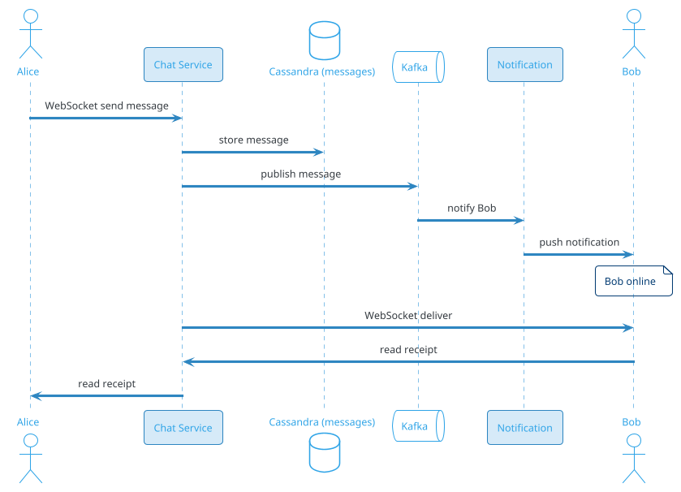
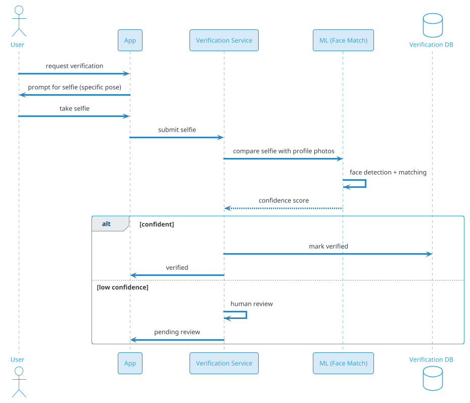

# Dating App (Tinder / Bumble / Hinge)

## Problem Statement

Design a dating app like Tinder, Bumble, or Hinge. Users create profiles, upload photos, set preferences, and are shown potential matches. They swipe (like/pass), and when two users like each other (mutual like), they match and can chat. The system must handle millions of concurrent users, real-time messaging, recommendation algorithms, geolocation, and trust & safety — all while balancing privacy and engagement.

**Example:**

```
User Priya opens Tinder:

  1. Creates profile: photos, bio, age, location, interests
  2. Sets preferences: age range, distance, gender
  3. Views potential matches one at a time (swipe cards)
  4. Swipes right (like) on a few, left (pass) on others
  5. If mutual like → "It's a Match!" notification
  6. Opens chat, sends message
  7. Continues matching, chatting
  8. Can unmatch, block, report

Behind the scenes:
  - Profile gets indexed for search
  - Recommendations computed based on preferences + ML
  - Swipes stored, matches detected (mutual like)
  - Real-time chat via WebSocket
  - Trust & safety: photo verification, report/block
  - Anti-spam: rate limits, bot detection
  - Privacy: location fuzzed, sensitive data protected

Scale:
  - 100M MAU, 20M DAU
  - 500M profiles total
  - 100M swipes/day (~1,157/sec avg, 5,787/sec peak)
  - 50M matches/day
  - 500M messages/day
  - 10M concurrent users at peak (evening)
  - 200 countries, multi-language
```

**Real-world systems:** Tinder, Bumble, Hinge, OkCupid, Match, Coffee Meets Bagel.

**Why it's interesting:**

- **Matching algorithm** — recommendations, mutual likes
- **Swipe at scale** — 100M swipes/day, sub-100 ms feedback
- **Real-time chat** — 500M messages/day
- **Geolocation** — nearby users, privacy
- **Trust & safety** — fake profiles, harassment, scams
- **Photo verification** — ML-based, selfie match
- **Cold start** — new users, new locations
- **Recommendation quality** — the difference between good and bad dating apps
- **Monetization** — premium, boosts, super likes
- **Privacy** — sensitive data, GDPR, location

---

## 1. Requirements Clarification

### Functional Requirements
- **Profile**: Photos, bio, age, gender, interests, location
- **Preferences**: Age range, distance, gender, deal-breakers
- **Swipe**: Like (right), Pass (left), Super Like (up)
- **Match**: Mutual like → match
- **Chat**: Real-time messaging between matches
- **Discovery**: Show potential matches one at a time
- **Rewind**: Undo last swipe (Premium)
- **Boost**: Higher visibility (Premium)
- **Super Like**: Notify the other user
- **Filters**: Age, distance, interests
- **Safety**: Block, report, unmatch
- **Verification**: Photo verification, ID (optional)
- **Premium**: Ad-free, unlimited likes, see who liked you
- **Notifications**: New match, new message, likes
- **Multilingual**: 30+ languages

### Non-Functional Requirements
- **Scale**: 100M MAU, 20M DAU, 500M profiles
- **Latency**: Swipe response < 100 ms; chat < 500 ms
- **Availability**: 99.99%
- **Consistency**: Strong for matches, eventual for recommendations
- **Real-time**: Chat, presence
- **Privacy**: Location fuzzed, sensitive data protected
- **Safety**: Report/block within seconds
- **Fraud**: Prevent fake profiles, bots, scams
- **Compliance**: GDPR, CCPA, DPDP, age verification (18+)
- **Cost**: Storage (photos) + compute (ML)

### Out of Scope
- Video calls (Tinder has some, but not core)
- Events (Tinder Explore — separate)
- Payments between users
- Marriage/long-term (that's Match/eHarmony)

---

## 2. Back-of-Envelope Estimation

### Traffic

```
Given:
  MAU                  = 100,000,000
  DAU                  = 20,000,000
  Profiles total       = 500,000,000
  Swipes/day           = 100,000,000
  Matches/day          = 50,000,000
  Messages/day         = 500,000,000
  Peak multiplier      = 5x (evening 8-11 PM)

Average QPS:
  Swipes = 100M / 86,400 = ~1,157/sec
  Matches = 50M / 86,400 = ~579/sec
  Messages = 500M / 86,400 = ~5,787/sec
  Recommendations = 20M DAU x 100/day = 2B / 86,400 = ~23,148/sec
  Total: ~30K ops/sec

Peak QPS (5x):
  Swipes = ~5,787/sec
  Messages = ~28,935/sec
  Recommendations = ~115,740/sec
  Total: ~150K ops/sec

Location updates:
  20M concurrent users at peak
  Updates every 5 min
  ~66K/sec

Presence (chat):
  10M concurrent
  Heartbeats every 30 sec
  ~333K/sec
```

### Storage

```
Profiles:
  500M x 10 KB (bio, preferences, metadata) = ~5 TB

Photos:
  500M x 6 photos x 500 KB = ~1.5 PB (in S3)
  Thumbnails: 500M x 6 x 50 KB = ~150 TB

Swipes:
  100M/day x 365 x 5 = 182.5B swipes
  Per swipe: ~100 bytes (user_id, target_id, direction, ts) = ~18 TB

Matches:
  50M/day x 365 x 5 = 91B matches
  Per match: ~500 bytes = ~45 TB

Messages:
  500M/day x 365 x 5 = 912.5B messages
  Per message: ~500 bytes = ~456 TB

Chat metadata:
  91B matches x 200 bytes = ~18 TB

Reports/Blocks:
  ~10M/day x 365 x 5 = 18B x 500 bytes = ~9 TB

Location (live):
  10M concurrent x 100 bytes = ~1 GB (Redis)

Recommendations cache:
  20M DAU x 100 candidates = 2B x 100 bytes = ~200 GB

Analytics:
  1B events/day x 500 bytes = ~500 GB/day
  5 years: ~900 TB

Total hot: ~50 TB
Total cold: ~2 PB
Photos: ~1.5 PB
```

### Bandwidth

```
Swipe requests:
  5,787/sec x 500 bytes = ~3 MB/sec

Recommendation responses:
  115,740/sec x 10 KB (profile + photos) = ~1.16 GB/sec = ~9 Gbps

Messages:
  28,935/sec x 500 bytes = ~15 MB/sec

Photos (via CDN):
  Peak: ~100 Gbps

Total: ~110 Gbps peak (photos dominate)
```

### Latency Budget

```
Swipe response:
  Client → API:                 ~50 ms
  Auth:                          ~10 ms
  Validate:                      ~5 ms
  Store swipe:                   ~10 ms
  Check match:                   ~10 ms
  Notify (if match):             ~20 ms
  Return:                        ~30 ms
  Total:                         ~135 ms

Recommendation (new profile):
  Client → API:                 ~50 ms
  Auth:                          ~10 ms
  Fetch candidates:              ~50 ms (Redis)
  Filter (seen, blocked):        ~20 ms
  ML ranking:                    ~30 ms
  Hydrate profile:               ~30 ms
  Total:                         ~190 ms

Message send:
  Client → API:                 ~50 ms
  Store message:                 ~30 ms
  Deliver (WebSocket):           ~100 ms
  Total:                         ~180 ms
```

---

## 3. High-Level Design

```d2
direction: down

user: User {shape: person}
cdn: CDN {shape: cloud}
lb: Load Balancer {shape: hexagon}
api: API Gateway {shape: hexagon}

profile: Profile Service {shape: rectangle}
prefs: Preference Service {shape: rectangle}
reco: "Recommendation Service" {shape: rectangle}
swipe: Swipe Service {shape: rectangle}
match: Match Service {shape: rectangle}
chat: "Chat Service (WebSocket)" {shape: rectangle}
notif: Notification Service {shape: rectangle}
safety: "Safety Service" {shape: rectangle}
verify: "Verification Service" {shape: rectangle}
search: Search Service {shape: rectangle}
location: Location Service {shape: rectangle}

kafka: Kafka {shape: queue}

pdb: "PostgreSQL (users, matches)" {shape: cylinder}
cass: "Cassandra (messages, swipes)" {shape: cylinder}
redis: "Redis (location, cache, sessions)" {shape: cylinder}
es: "Elasticsearch (search)" {shape: cylinder}
s3: "S3 (photos)" {shape: cylinder}
ch: "ClickHouse (analytics)" {shape: cylinder}
ml: "ML Models" {shape: rectangle}

user -> cdn
cdn -> lb
lb -> api

api -> profile
api -> prefs
api -> reco
api -> swipe
api -> match
api -> chat
api -> safety

profile -> pdb
profile -> s3
prefs -> pdb
swipe -> cass
swipe -> kafka
swipe -> redis

match -> pdb
match -> kafka
match -> notif

chat -> cass
chat -> kafka
chat -> redis

reco -> redis
reco -> ml
reco -> ch

location -> redis
safety -> pdb
verify -> ml
search -> es

kafka -> notif
kafka -> ch
kafka -> safety
```

### Component Responsibilities

| Component | Role |
|---|---|
| CDN | Photos, static |
| Load Balancer | Route to API |
| API Gateway | Auth, rate limiting |
| Profile Service | Profile CRUD |
| Preference Service | User preferences |
| Recommendation Service | Show potential matches |
| Swipe Service | Record swipes |
| Match Service | Detect mutual likes |
| Chat Service | Real-time messaging |
| Notification Service | Push, in-app |
| Safety Service | Block, report |
| Verification Service | Photo verification |
| Search Service | Search profiles |
| Location Service | Nearby users |
| PostgreSQL | Users, matches |
| Cassandra | Messages, swipes |
| Redis | Location, cache, sessions |
| Elasticsearch | Search index |
| S3 | Photos |
| ClickHouse | Analytics |
| ML Models | Ranking, verification |

### Why This Architecture

- **Cassandra** for swipes/messages (write-heavy, time-series)
- **PostgreSQL** for users, matches (ACID)
- **Redis** for location, cache, sessions
- **Kafka** for events (matches, messages, safety)
- **ClickHouse** for analytics
- **S3 + CDN** for photos
- **ML** for ranking, verification

---

## 4. Deep Dive: Recommendation Algorithm

### The Core Problem

Given a user, show them potential matches one at a time (swipe cards).

**Constraints:**
- **Preference filters** (age, distance, gender)
- **Mutual opt-in** (both must like each other)
- **Diversity** (variety of profiles)
- **Freshness** (new users, active users)
- **Avoid seen** (don't show same profile twice)
- **Avoid blocked** (blocked users)
- **Avoid matched** (already matched)
- **Avoid suspicious** (fake profiles)

### Candidate Generation

1. **Filter by preferences**:
   - Age range
   - Distance (geohash neighbors)
   - Gender
   - Deal-breakers (smoking, kids, etc.)

2. **Filter by activity**:
   - Active in last 7 days
   - Not blocked
   - Not reported
   - Not already seen

3. **Candidate pool**: 500-1000 profiles per user

**Storage:**
- Redis Geo for nearby users
- PostgreSQL for user attributes
- Cache candidate pool per user (regenerated every hour)

### Ranking

**Signals:**
- **Distance**: Closer = higher
- **Activity**: Active now = higher
- **Profile completeness**: More photos = higher
- **Popularity**: % right swipes received
- **Compatibility**: Shared interests
- **ML score**: Predicted match probability
- **Freshness**: New users boosted

**Formula:**
```
score = 0.25 * distance_score
      + 0.20 * activity_score
      + 0.15 * compatibility_score
      + 0.15 * popularity_score
      + 0.15 * ml_score
      + 0.10 * freshness_score
```

### ML Model

**Two-tower:**
- User tower: preferences, behavior, demographics
- Candidate tower: profile attributes, activity
- Score: dot product (match probability)

**Training data:** Past swipes (right = positive, left = negative).

**Labels:**
- **Right swipe** (like)
- **Match** (mutual like) — strongest signal
- **Conversation started** — even stronger
- **Date happened** (rare, hard to measure)

**Features:**
- Demographics (age, location)
- Interests (music, sports, etc.)
- Photos (embeddings from CNN)
- Behavior (swipe rate, response time)
- Preferences

### Diversity

- Mix of "safe" and "exploratory" candidates
- Avoid same type (all models, all athletes)
- Geographic diversity
- Ethnicity diversity (fair)

### Fairness

- **Don't penalize** based on race, religion (illegal)
- **Do** match on stated preferences
- **Transparency** on ranking factors (some apps)
- **Regular audits**

### Cold Start

**New user:**
- Boost for first 24 hours
- Show to many users
- Learn from first swipes

**New location:**
- Show popular in area
- Learn user's preferences quickly

### Recommendation Refresh

- **On request**: New card per swipe
- **Batch**: Pre-fetch 20 candidates
- **Cache**: Candidate pool per user (1 hour TTL)
- **Regenerate**: When 80% consumed

### Recommendation Scale

```
20M DAU x 100 swipes/day = 2B cards served/day
= ~23K QPS avg, ~115K QPS peak

Per card:
  Candidate fetch: ~10 ms
  Ranking: ~20 ms
  Hydrate: ~30 ms
  Total: ~60 ms

Reco service: ~200 instances
```

---

## 5. Deep Dive: Swipe and Match

### Swipe

**Client sends:**
```json
{
  "target_user_id": "u-456",
  "direction": "right",     // right=like, left=pass, up=super
  "timestamp": "2026-09-19T20:00:00Z"
}
```

**Server:**
1. Validate (not seen, not blocked)
2. Store in Cassandra (swipe log)
3. Publish to Kafka
4. Check for mutual like
5. If mutual → match!

### Swipe Storage (Cassandra)

```sql
CREATE TABLE swipes (
    user_id BIGINT,
    target_id BIGINT,
    direction SMALLINT,       -- 1=right, -1=left, 2=super
    created_at TIMESTAMP,
    PRIMARY KEY ((user_id), target_id)
);

-- For detecting mutual likes
CREATE TABLE swipes_by_target (
    target_id BIGINT,
    user_id BIGINT,
    direction SMALLINT,
    created_at TIMESTAMP,
    PRIMARY KEY ((target_id), user_id)
);
```

**Write:** ~1,157/sec avg, ~5,787/sec peak.
**Read:** Query target's swipes to check mutual.

### Match Detection

**On each right swipe:**
1. Write swipe to `swipes` (by user)
2. Write swipe to `swipes_by_target` (by target)
3. Query `swipes_by_target` for target's swipes on user
4. If target also right-swiped → MATCH!

**Optimization:**
- **Bloom filter**: Check if target has swiped on user (fast negative)
- **Redis**: Cache recent swipes (last 24h)
- **Async**: Kafka for match creation

### Match Storage (PostgreSQL)

```sql
CREATE TABLE matches (
    match_id BIGINT PRIMARY KEY,
    user_a_id BIGINT,
    user_b_id BIGINT,
    matched_at TIMESTAMP,
    last_message_at TIMESTAMP,
    is_active BOOLEAN DEFAULT TRUE,
    unmatched_at TIMESTAMP,
    unmatched_by BIGINT,
    UNIQUE (user_a_id, user_b_id)
);
CREATE INDEX idx_matches_user_a ON matches(user_a_id, last_message_at DESC);
CREATE INDEX idx_matches_user_b ON matches(user_b_id, last_message_at DESC);
```

**Why PostgreSQL?** ACID for matches (money-adjacent, user trust).

### Match Event

Published to Kafka:
```json
{
  "event": "match.created",
  "match_id": "m-123",
  "user_a": "u-1",
  "user_b": "u-2",
  "matched_at": "2026-09-19T20:00:00Z"
}
```

**Consumers:**
- Notification (push "It's a Match!")
- Analytics
- Chat service (create conversation)

### Swipe Scale

```
100M swipes/day
= 1,157/sec avg
= 5,787/sec peak

Cassandra: ~100 nodes
Bloom filters: Redis (last 24h swipes)
Match detection: 50M matches/day = 579/sec
```

### Rate Limiting

- **Free users**: 50-100 likes/day
- **Premium**: Unlimited
- **Bots**: Detected via behavior

---

## 6. Deep Dive: Real-Time Chat

### Chat Flow



### Chat Data Model

```sql
-- Messages (Cassandra)
CREATE TABLE messages (
    match_id BIGINT,
    message_id TIMEUUID,
    sender_id BIGINT,
    content TEXT,
    message_type TEXT,          -- text, image, gif
    created_at TIMESTAMP,
    read_at TIMESTAMP,
    PRIMARY KEY ((match_id), message_id)
) WITH CLUSTERING ORDER BY (message_id DESC);

-- Conversation metadata
CREATE TABLE conversations (
    match_id BIGINT PRIMARY KEY,
    user_a_id BIGINT,
    user_b_id BIGINT,
    last_message_text TEXT,
    last_message_at TIMESTAMP,
    last_message_sender BIGINT,
    unread_count_a INT DEFAULT 0,
    unread_count_b INT DEFAULT 0
);
```

### WebSocket for Real-Time

- **Persistent connection** per user
- **Subscribe to matches**: All user's conversations
- **Push messages**: When user is online
- **Fall back to push notification**: When offline

### Message Delivery

**When user is online:**
- WebSocket push < 500 ms

**When user is offline:**
- Push notification (APNS/FCM)
- User opens app → fetch missed messages

**Delivery guarantee:** At-least-once.

### Read Receipts

- User opens chat → mark all messages as read
- Server updates `read_at`
- Notifies other user (if online)

### Typing Indicator

- Client sends "typing" on each keystroke (throttled)
- Server broadcasts to other user
- Clears after 5 sec of inactivity

### Media in Chat

- **Images**: Upload to S3, send URL
- **GIFs**: Giphy/Tenor integration
- **Voice**: Audio upload
- **Video**: Rare, disabled by default

### Chat Scale

```
500M messages/day
= 5,787/sec avg
= 28,935/sec peak

Cassandra: ~100 nodes
WebSocket: ~10K connections per server
Total WebSocket servers: ~1,000 (for 10M concurrent)
```

### Anti-Spam

- **Rate limit**: 1 msg / sec, 50 msg / day (new users)
- **Content filter**: ML for spam, scams
- **Pattern detection**: Copy-paste messages
- **Block/mute**: User can block

---

## 7. Deep Dive: Photo Verification

### Why Verification?

Fake profiles with stolen photos are a huge problem:
- **Catfishing**: Fake identity
- **Scams**: Financial fraud
- **Harassment**: Anonymous abuse
- **Bots**: Automated swipes

**Photo verification** ensures the person in the photo matches the user.

### Verification Flow



### ML Face Matching

- **Face detection**: YOLO or MTCNN
- **Face embedding**: FaceNet, ArcFace
- **Comparison**: Cosine similarity between selfie and profile photos
- **Threshold**: >0.85 = verified, <0.5 = rejected, else human review

### Additional Verification

- **Liveness detection**: Ensure selfie is not a photo (blink, turn head)
- **Specific pose**: "Take a selfie with your hand on your chin" (prevents stock photos)
- **ID verification**: Passport, driver's license (rare, premium)

### Verification Storage

```sql
CREATE TABLE verifications (
    user_id BIGINT PRIMARY KEY,
    status VARCHAR(20),           -- pending, verified, rejected
    selfie_s3_key TEXT,
    confidence_score DECIMAL(3,2),
    verified_at TIMESTAMP,
    rejection_reason TEXT,
    reviewed_by BIGINT,
    created_at TIMESTAMP DEFAULT NOW()
);
```

### Verification Scale

```
500M profiles
~50% verification rate = 250M verifications
Selfie stored in S3: 250M x 500 KB = ~125 TB
ML inference: ~100 ms per verification
Daily new verifications: ~500K
```

### Verification Impact

- **Verified badge**: Higher match rate
- **Algorithm boost**: More visibility
- **Trust**: Other users see badge
- **Anti-fraud**: Reduces fakes

---

## 8. Deep Dive: Trust and Safety

### Threats

- **Fake profiles**: Stolen photos, bots
- **Harassment**: Abusive messages
- **Scams**: Romance scams, financial fraud
- **Underage users**: <18
- **Spam**: Links, promotions
- **Off-platform requests**: Move to WhatsApp (red flag)
- **NSFW content**: Explicit photos

### Detection and Mitigation

**1. Fake profiles:**
- Photo verification
- ML detection (photo duplication, unusual patterns)
- Phone/email verification
- Behavioral analysis (too many swipes, too fast)
- Report/block

**2. Harassment:**
- ML text classifier for abusive messages
- User report
- Auto-block after N reports
- Ban repeat offenders

**3. Scams:**
- ML pattern detection ("send money", "crypto", "invest")
- Report
- User education (tips)
- Ban scammers

**4. Underage:**
- Age verification (ID for suspicious)
- ML age detection (photos)
- Ban underage users

**5. NSFW:**
- ML image classifier
- Auto-block or flag
- User report

### Report/Block Flow

```
1. User reports (reason + details)
2. Report stored, subject to review
3. Auto-actions:
   - Block: hide from user immediately
   - Flag: send to moderation
4. Human review (if needed)
5. Action: warn, ban, or no-action
6. Reporter notified
```

### Safety Features

- **Block**: Hide from each other
- **Unmatch**: End conversation
- **Report**: Send to platform
- **Photo verification**: Trust badge
- **Safety tips**: Onboarding, in-app
- **Panic button**: For emergency
- **Share date**: With friend (date + location)
- **Background check**: Integration (paid)

### Moderation

- **Automated**: ML for spam, harassment, NSFW
- **Human**: Escalated reports
- **Appeals**: Users can appeal bans
- **Transparency**: Report on actions

### Safety Scale

```
Reports/day: ~1M
Human review: ~100K/day
Moderators: ~500 globally
ML inference: ~10M/day
Ban rate: ~0.1% of users
```

### Privacy

- **Location**: Fuzzed to 1 km
- **Sensitive data**: Encrypted at rest
- **Right to delete**: GDPR
- **Data export**: User can download
- **No selling**: User data not sold

---

## 9. Deep Dive: Geolocation and Distance

### Why Distance?

Dating apps are local — people meet nearby.

**Requirements:**
- Show users within N km
- Update as user moves
- Privacy (don't show exact location)

### Location Update

- User app sends location every 5 min (when active)
- Server fuzzes to 1 km precision
- Stores in Redis Geo
- TTL: 24 hours (if inactive, not shown)

### Redis Geo

```
GEOADD users:active:{geohash_prefix} lng lat user_id
GEOSEARCH users:active:{city} FROMLONLAT lng lat BYRADIUS 50 km
```

**Sharding:** By city or geohash prefix.

### Distance Calculation

- Haversine formula for actual distance
- For ranking, use geohash approximation
- Display: "2 km away" (rounded)

### Privacy

- **Fuzz location**: Round to 1 km grid
- **Don't show exact**: "2 km away" not coordinates
- **Opt-out**: User can hide location (app less effective)
- **Delete**: Location history deleted after 30 days

### Location Scale

```
20M DAU x 5 min updates = ~66K updates/sec avg
Peak: ~333K/sec

Redis: sharded by geohash
Total users in Redis: ~50M active
Memory: ~5 GB per shard x 10 shards = ~50 GB
```

### Handling Location Spoofing

- **GPS detection**: Check if location matches device
- **VPN detection**: Flag if using VPN
- **Pattern detection**: Unusual location jumps
- **Rate limit**: Location updates

### Distance Preferences

- User sets max distance (e.g., 50 km)
- Candidates filtered by distance
- Premium: change distance more frequently

---

## 10. Deep Dive: Premium Features

### Monetization

- **Tinder Plus**: Unlimited likes, rewind, 5 super likes/day
- **Tinder Gold**: See who liked you
- **Tinder Platinum**: Priority likes, message before match
- **Boosts**: 30 min of higher visibility
- **Super Likes**: Get attention
- **Read Receipts**: See if message read

### Premium Impact on Algorithm

- **Boost**: Higher visibility in recommendations
- **Super Like**: Notify recipient, higher priority
- **Priority Likes**: Shown first in recipient's queue

### Boost

- User buys 30 min boost
- Profile shown to more users
- Algorithm boosts visibility
- Cost: $2-10 per boost

### Super Like

- User sends Super Like (blue star)
- Recipient notified even before matching
- Higher chance of mutual match
- Free: limited; Premium: more

### See Who Liked You

- **Free**: Blurred preview
- **Premium**: Full list
- **Value**: Skip guessing

### Read Receipts

- **Premium**: See when message read
- **Reciprocal**: Must both opt-in

### Premium Scale

```
~10% of MAU pay for Premium
= ~10M subscribers
Avg $15/month = $150M/month revenue

Boosts: ~1M sold/day at $5 = $5M/day = $150M/month
Total revenue: ~$300M/month
```

### Pricing

- **India**: ₹500/month
- **US**: $20/month
- **EU**: €18/month
- **Dynamic**: A/B tested

### Premium Analytics

- Track conversion (free → premium)
- Churn
- Feature usage
- Revenue per user

---

## 11. Deep Dive: Photos and Media

### Photo Requirements

- **6 photos per profile** (Tinder max)
- **Min 1 photo** (required)
- **Max 10 MB per photo**
- **Formats**: JPG, PNG, HEIC

### Photo Upload

```
1. Client uploads to S3 (presigned URL)
2. Server generates thumbnails (multiple sizes)
3. ML classifies (NSFW, face detection)
4. Store URLs in PostgreSQL
5. Cache in CDN
```

### Photo Processing

- **Resize**: 1080x1080, 500x500, 200x200
- **Format**: WebP (30% smaller) + JPEG fallback
- **Face detection**: Confirm faces present
- **NSFW detection**: Block explicit content
- **Blur**: For NSFW preview

### Photo Storage

- **S3 Standard**: Hot (recent, active users)
- **S3 IA**: Warm (inactive users)
- **S3 Glacier**: Cold (deleted profiles, archived)
- **CDN**: CloudFront/Cloudflare

### Photo Serving

- **Profile view**: Fetch main photo
- **Swipe card**: Fetch all 6 photos
- **Chat**: Fetch on message

### Photo Scale

```
500M profiles x 6 photos x 500 KB = ~1.5 PB
Thumbnails: ~150 TB
Daily uploads: ~5M photos = ~2.5 TB/day
CDN egress: ~100 Gbps peak
```

### CDN Optimization

- **Multi-CDN**: Cloudflare + CloudFront
- **Cache headers**: 1 year (immutable URLs)
- **Hit ratio**: > 95%
- **Image optimization**: Auto-WebP, auto-resize

### Moderation

- **Auto**: ML detects NSFW, violence
- **Manual**: Escalated for review
- **User report**: For specific photos

---

## 12. Deep Dive: Privacy and Data

### Privacy Concerns

- **Location**: Sensitive, fuzzed
- **Photos**: Personal, encrypted
- **Messages**: Private
- **Sexual orientation**: Sensitive
- **HIV status**: (if asked) — very sensitive
- **Gender identity**: Sensitive

### Data Protection

- **Encryption at rest**: AES-256
- **Encryption in transit**: TLS 1.3
- **Access controls**: Only authorized services
- **Audit logs**: Every access logged

### GDPR / CCPA / DPDP

- **Right to access**: Download all data
- **Right to erasure**: Delete account
- **Right to rectification**: Correct data
- **Data portability**: Export
- **Consent**: Explicit for sensitive data

### Data Retention

- **Active profiles**: Retained
- **Inactive (1+ year)**: Notified, then deleted
- **Deleted**: Removed within 30 days
- **Messages**: Deleted with account
- **Reports**: Retained for legal (2 years)

### Deletion Flow

```
1. User requests deletion
2. Confirm (email)
3. Soft delete (30 days grace)
4. Hard delete:
   - Profile: removed
   - Photos: removed from S3
   - Messages: removed
   - Matches: anonymized
5. Backup: purged within 90 days
```

### Anonymization

- **Analytics**: Use anonymized data
- **Aggregates**: No PII
- **Research**: Opt-in, anonymized

### Privacy vs Safety

- **Safety**: Need to detect bad actors
- **Privacy**: Don't over-collect
- **Balance**: Collect only what's needed
- **Transparency**: Tell users what's collected

### Multi-Region

- **EU users**: Data in EU (GDPR)
- **India users**: Data in India (DPDP)
- **US users**: Data in US
- **Cross-region**: Only for legal requests

---

## 13. Scaling Considerations

### Read Scaling

- **Redis** for location, cache
- **Read replicas** for PostgreSQL
- **CDN** for photos
- **Elasticsearch** for search
- **Regional** for latency

### Write Scaling

- **Kafka** for events
- **Cassandra** for swipes, messages
- **PostgreSQL** sharded for matches
- **Redis** for hot state

### Sharding

**PostgreSQL:** Shard by `user_id`.
**Cassandra:** Partition by `user_id` (swipes) or `match_id` (messages).
**Redis:** Shard by geohash (location) or user_id (cache).
**Kafka:** Partition by `user_id`.

### Multi-Region

- **Per-region deployment**
- **User home region** for data
- **Cross-region matching** (only if user moves)
- **Compliance**: GDPR, DPDP

### Peak Handling

- **Evening (8-11 PM)**: 5x
- **Weekend evenings**: 6x
- **Valentine's Day**: 10x
- **New Year's Eve**: 8x

**Mitigations:**
- Auto-scale
- Cache aggressively
- Rate limit
- Degrade gracefully

### Cost Optimization

| Component | Optimization |
|---|---|
| Photos | S3 tiering, CDN cache |
| ML | Batch, quantization |
| Compute | Reserved + spot |
| Cassandra | Right-size, tiering |
| CDN | Multi-CDN |

---

## 14. Bottlenecks and Trade-offs

| Concern | Solution | Trade-off |
|---|---|---|
| Recommendations | ML ranking | Compute cost |
| Swipe | Cassandra + Redis | Eventual for match |
| Match | PostgreSQL | ACID |
| Chat | Cassandra + WebSocket | Storage |
| Verification | ML face match | False positives |
| Location | Redis GEO | Privacy |
| Photos | S3 + CDN | Cost |
| Premium | Algorithm boost | Fairness |
| Multi-region | Per-region | Complexity |

### Design Decisions Summary

| Decision | Choice | Rationale |
|---|---|---|
| Profiles | PostgreSQL (sharded) | ACID |
| Swipes | Cassandra | Write-heavy |
| Messages | Cassandra | Write-heavy |
| Location | Redis GEO | Fast |
| Photos | S3 + CDN | Scalable |
| Events | Kafka | Decoupled |
| Analytics | ClickHouse | Fast |
| ML | Custom models | Ranking, verification |
| Multi-region | Per-region | Compliance, latency |

---

## 15. Failure Scenarios

### Recommendation Service Down

**Impact:** No new cards.

**Mitigation:**
- Fallback to cached candidates
- Simplify ranking
- Alert ops

### Swipe Service Down

**Impact:** Can't swipe.

**Mitigation:**
- Queue in client
- Retry on recovery
- Alert ops

### Match Service Down

**Impact:** Matches delayed.

**Mitigation:**
- Queue in Kafka
- Alert ops

### Chat Service Down

**Impact:** Can't send messages.

**Mitigation:**
- Queue in client
- Push notification fallback
- Alert ops

### Cassandra Down

**Impact:** Swipes/messages stuck.

**Mitigation:**
- Redis cluster (HA)
- Buffer in Kafka
- Alert ops

### PostgreSQL Down

**Impact:** Can't create matches.

**Mitigation:**
- Multi-AZ failover
- Queue in Kafka
- Alert ops

### S3 Down

**Impact:** Photos unavailable.

**Mitigation:**
- Multi-region S3
- CDN cache serves
- Alert ops

### Verification Failure

**Impact:** Users can't verify.

**Mitigation:**
- Retry
- Manual review
- Alert ops

### Fake Profile Surge

**Impact:** Many fakes.

**Mitigation:**
- ML detection
- Rapid response
- Ban waves
- Alert safety

### Data Breach

**Impact:** User data exposed.

**Mitigation:**
- Encryption
- Access controls
- Incident response
- Notify users

### DDoS

**Impact:** Service unavailable.

**Mitigation:**
- CDN/WAF
- Rate limiting
- Anycast
- Alert ops

### Underage User Detection

**Impact:** Legal risk.

**Mitigation:**
- Age verification
- ML age detection
- Ban
- Report to authorities (if required)

---

## 16. Monitoring and Alerts

### Key Metrics

| Metric | Target | Alert Threshold |
|---|---|---|
| Swipe p99 | < 100 ms | > 300 ms |
| Recommendation p99 | < 200 ms | > 500 ms |
| Match detection p99 | < 200 ms | > 500 ms |
| Message delivery p99 | < 500 ms | > 1.5 sec |
| Verification p99 | < 3 sec | > 10 sec |
| Photo upload p99 | < 3 sec | > 10 sec |
| CDN hit ratio (photos) | > 90% | < 80% |
| Match rate | baseline | drop > 20% |
| Report rate | baseline | spike > 50% |
| Bot rate | < 1% | > 5% |
| Concurrent users | baseline | drop > 20% |

### Dashboards

- **Traffic**: Swipes/sec, messages/sec, matches/sec
- **Latency**: p50/p95/p99 per operation
- **Matching**: Rate, match rate, premium conversion
- **Chat**: Messages, delivery, read rate
- **Safety**: Reports, bans, verifications
- **Photos**: Upload rate, CDN hit ratio
- **Infrastructure**: Cassandra, PostgreSQL, Redis, S3
- **Business**: DAU, matches, revenue

### Alerts

- **P0**: Recommendation down, match service down, data breach
- **P1**: Message delivery > 1.5 sec, match rate drop > 20%
- **P2**: Report spike, bot rate > 5%
- **P3**: Slow verification, CDN hit ratio drop

### Business KPIs

- **DAU/MAU** ratio
- **Swipes per DAU**
- **Matches per DAU**
- **Match rate** (% of swipes that match)
- **Message rate** (messages per match)
- **Premium conversion**
- **Retention** (D1, D7, D30)
- **Revenue per user**
- **NPS**

---

## 17. Cost Estimation

Rough monthly cost (AWS, us-east-1) for 20M DAU:

| Component | Spec | Cost/month |
|---|---|---|
| API servers | 300 x c6g.large | ~$18,000 |
| Reco servers | 200 x c6g.2xlarge | ~$48,000 |
| Chat servers | 1,000 x c6g.large | ~$60,000 |
| PostgreSQL | 20 shards x db.r6g.4xlarge | ~$95,000 |
| Read replicas | 40 x db.r6g.2xlarge | ~$84,000 |
| Cassandra | 100 x i3.2xlarge | ~$100,000 |
| Redis cluster | 50 x cache.r6g.2xlarge | ~$25,000 |
| Kafka (MSK) | 30 brokers | ~$15,000 |
| ClickHouse | 20 x i3.2xlarge | ~$20,000 |
| Elasticsearch | 30 x r6g.2xlarge | ~$54,000 |
| S3 (photos) | 1.5 PB | ~$35,000 |
| S3 Glacier (archive) | 5 PB | ~$20,000 |
| **CDN egress** | 100 PB/month | **~$1,000,000** |
| ML inference (GPU) | 50 x g4dn.xlarge | ~$25,000 |
| Verification | 500K/day | ~$10,000 |
| Monitoring | Datadog | ~$50,000 |
| **Total** | | **~$1.66M/month** |

**Per user:** ~$0.083/month.

**Cost breakdown:**
- **CDN**: ~60%
- **Databases**: ~18%
- **Compute**: ~10%
- **Other**: ~12%

**Cost optimization:**
- **CDN**: Multi-CDN, negotiate rates
- **Photos**: Tiering, WebP/AVIF
- **ML**: Quantization, batching
- **Compute**: Reserved + spot

**Revenue note:** Premium ($150M+/month) + boosts + ads covers cost.

---

## 18. Extensions and Follow-ups

### Video Dating

- Video calls (built-in)
- Video profiles
- Pre-date video chat

### Voice Dating

- Voice messages
- Voice calls
- Voice-first profiles

### Personality Tests

- Comprehensive quizzes (OkCupid)
- Compatibility scoring
- Better matches

### Interests-Based Matching

- Hobbies, activities
- Shared interests
- Better conversations

### Date Ideas

- Suggest date spots
- Reserve table
- Book tickets

### Safety Features

- Background check (Garbo)
- Panic button
- Share date
- Photo verification

### Events

- Singles events
- Speed dating
- Themed meetups

### LGBTQ+ Focus

- Gender identity options
- Pronouns
- Orientation-specific apps

### Polyamory

- Multiple partners
- Relationship status
- Specific features

### Long-Term

- Marriage-focused (eHarmony)
- Compatibility algorithms
- Premium matching

### AI Features

- AI wingman (chat suggestions)
- Profile optimization
- Photo ranking
- Conversation starters

### International

- Multi-language
- Cultural preferences
- Cross-border matching

### Web3

- Blockchain identity
- NFT profiles
- Crypto payments

---

## 19. Summary

| Aspect | Decision |
|---|---|
| Profiles | PostgreSQL (sharded) |
| Swipes | Cassandra |
| Messages | Cassandra |
| Matches | PostgreSQL (ACID) |
| Location | Redis GEO |
| Photos | S3 + CDN |
| Events | Kafka |
| Analytics | ClickHouse |
| Real-time | WebSocket |
| ML | Two-tower (ranking), face match (verification) |
| Multi-region | Per-region (compliance) |
| Scale | 100M MAU, 20M DAU, 100M swipes/day |
| Latency | Swipe < 100 ms, chat < 500 ms |
| Availability | 99.99% |
| Cost | ~$1.66M/month (CDN dominates) |

**Key takeaways:**

- **Two-tower ML** for ranking — the difference between good and bad matches
- **Cassandra** for swipes/messages — write-heavy, time-series
- **PostgreSQL** for matches — ACID (trust-sensitive)
- **Redis GEO** for location — fast, fuzzed for privacy
- **WebSocket** for chat — real-time
- **Photo verification** — ML face match reduces fakes
- **Trust & safety** — ML + human + user reports
- **Privacy** — location fuzzed, encrypted, deletable
- **Premium** — boosts, super likes, see who liked you
- **CDN is 60% of cost** — negotiate, optimize
- **Scale**: 20M DAU, 5,787 swipes/sec peak, 28,935 messages/sec peak
- **Verification** — reduces fake profiles, builds trust

### Similar Pattern Problems

- Proximity Service — nearby users
- Ride Booking — nearby drivers
- Food Delivery — nearby restaurants
- Social Feed — feed ranking
- Online Messaging App — real-time chat
- Recommendation Engine — ML ranking
- Content Moderation — safety
- Notification System — event fan-out