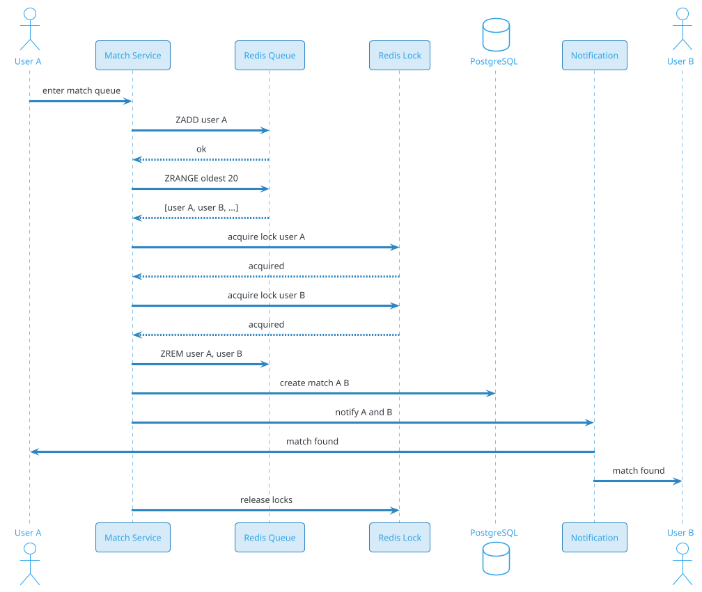

# Proximity Matchmaking

## Problem Statement

Design a **proximity-based matchmaking system** that pairs users in real time based on their location. Unlike dating apps (which have persistent profiles and async matching), proximity matchmaking is used for **immediate, ephemeral pairing** — think Uber's driver matching, Tinder's "Tinder Passport", Zomato's delivery partner assignment, or location-based games like Pokémon Go raid matchmaking.

The system must:
- Detect nearby users/devices
- Match in **real time** (sub-second to seconds)
- Handle **high concurrency** (millions of concurrent matches)
- Balance **latency vs fairness**
- Handle **churn** (users enter/leave constantly)
- Support **1:1, 1:N, N:M** matching

**Example:**

```
Uber driver matching:
  1. Rider requests ride at location L
  2. Server queries: available drivers within 3 km
  3. Ranks by ETA + fairness
  4. Sends request to top driver
  5. Driver accepts → match within 10 sec
  6. If no accept, expands radius

Pokémon Go raid matchmaking:
  1. Player initiates raid at gym location
  2. Server finds nearby players (within 100 m)
  3. Creates raid room
  4. Players join in real time
  5. Starts raid when enough

Tinder Passport:
  1. User sets "travel mode" to another city
  2. Server fetches users in that city
  3. Async matching (not real-time)

Real-time requirements:
  - Match within seconds
  - Handle millions of concurrent matches
  - Sub-100 ms query latency
  - Fair distribution (no one waits too long)
  - Handle churn (users entering/leaving)

Scale:
  - 10M concurrent users (peak)
  - 1M active matchable users at any time
  - 100M match attempts/day
  - 500K matches/sec peak
  - 1,000 cities globally
  - < 1 sec match latency
```

**Real-world systems:** Uber, Lyft (driver matching), Tinder (location-based), Pokémon Go (raid matching), Airbnb (nearby hosts), Zoom (breakout rooms), Among Us (game matchmaking), Call of Duty (matchmaking), Omegle (random chat).

**Why it's interesting:**

- **Real-time proximity** — user enters/leaves continuously
- **Sub-second latency** — matching must be instant
- **Fairness** — no user should wait too long
- **Churn** — millions of entries/leaves per second
- **Two-sided** — both sides need to be matched
- **Geospatial** — efficient nearby queries
- **Optimization** — minimize total wait/ETA
- **Atomicity** — one user, one match (no double-match)
- **Failure** — handle lost connections, no-shows
- **Cost** — compute for matching + geospatial

---

## 1. Requirements Clarification

### Functional Requirements
- **Real-time matching**: Pair users within seconds
- **Proximity**: Match only nearby users
- **1:1**: One user to one user (chat roulette)
- **1:N**: One user to many (game raid, delivery batch)
- **N:M**: Many-to-many (sports matchmaking)
- **Preferences**: Age, gender, skill, vehicle, etc.
- **Fairness**: Rotate users, avoid repeated matching
- **Timeout**: Cancel if no match in N seconds
- **Re-match**: Try again if cancelled
- **Cancel**: User can cancel waiting
- **Blocklist**: Don't match with blocked users

### Non-Functional Requirements
- **Scale**: 10M concurrent users, 500K matches/sec peak
- **Latency**: Match within 1-5 sec p99
- **Availability**: 99.99%
- **Consistency**: Strong for match creation (atomic)
- **Real-time**: Sub-second query for candidates
- **Fairness**: Max wait time per user
- **Global**: 1000+ cities
- **Compliance**: Location privacy, GDPR, DPDP

### Out of Scope
- Long-term matching (dating apps — separate)
- Recommendations (news feed — separate)
- Auction/bidding (Ads — separate)

---

## 2. Back-of-Envelope Estimation

### Traffic

```
Given:
  Concurrent users (peak)      = 10,000,000
  Active matchable users       = 1,000,000
  Match attempts/day           = 100,000,000
  Peak match rate              = 500,000/sec
  Cities                       = 1,000
  Avg wait time                = 10 sec
  Peak multiplier              = 5x

Match attempts:
  Avg = 100M / 86,400 = ~1,157/sec
  Peak = ~5,787/sec

But active matching:
  1M users waiting for match
  Each matches every ~10 sec
  = 100K matches/sec at any time
  Peak (rush): ~500K/sec

Location updates:
  10M concurrent x 1 update / 10 sec
  = 1M updates/sec
  Peak: ~5M/sec

Presence:
  10M concurrent
  Heartbeat every 30 sec
  = 333K/sec
```

### Storage

```
Active sessions:
  10M x 500 bytes (session, location, prefs) = ~5 GB (Redis)

Match history:
  100M/day x 365 x 5 = 182.5B matches
  Per match: ~200 bytes (users, timestamp, outcome) = ~36 TB

Location history:
  10M concurrent x 86400 x 1/10 = ~86B/day
  Per location: ~50 bytes = ~4.3 TB/day
  Retained 7 days: ~30 TB
  5 years (archived): ~7 PB

Analytics:
  1B events/day x 200 bytes = ~200 GB/day
  5 years: ~365 TB

User preferences:
  100M x 1 KB = ~100 GB

Blocklists:
  100M x 100 bytes = ~10 GB

Total hot: ~50 GB (Redis)
Total cold: ~7 PB
```

### Bandwidth

```
Location updates:
  1M/sec x 100 bytes = ~100 MB/sec = ~800 Mbps
  Peak: ~4 Gbps

Match notifications:
  500K/sec x 200 bytes = ~100 MB/sec = ~800 Mbps

WebSocket traffic:
  10M concurrent x 1 KB/30 sec = ~333 MB/sec = ~2.7 Gbps

Total: ~8 Gbps peak
```

### Latency Budget

```
Match request (user → match):
  Client → API:                 ~50 ms
  Auth:                          ~10 ms
  Register session:              ~10 ms
  Enter match queue:             ~5 ms
  Find candidates:               ~30 ms
  Rank + select:                 ~10 ms
  Atomic match:                  ~20 ms
  Notify both users:             ~100 ms
  Total:                         ~235 ms

Target: < 1 sec for match (from queue entry).

Location update:
  Client → Server:               ~100 ms
  Update Redis:                  ~5 ms
  Publish to subscribers:        ~10 ms
  Total:                         ~115 ms
```

---

## 3. High-Level Design

```d2
direction: down

user: User {shape: person}
cdn: CDN {shape: cloud}
lb: Load Balancer {shape: hexagon}
api: API Gateway {shape: hexagon}

match: "Match Service" {shape: rectangle}
geo: "Geo Index Service" {shape: rectangle}
queue: "Match Queue" {shape: rectangle}
session: "Session Service" {shape: rectangle}
presence: "Presence Service" {shape: rectangle}
notif: "Notification Service" {shape: rectangle}
ranking: "Ranking Service" {shape: rectangle}
fairness: "Fairness Service" {shape: rectangle}

kafka: Kafka {shape: queue}

redis_geo: "Redis GEO (live locations)" {shape: cylinder}
redis_queue: "Redis (match queue)" {shape: cylinder}
redis_lock: "Redis (distributed locks)" {shape: cylinder}
pdb: "PostgreSQL (matches, users)" {shape: cylinder}
cass: "Cassandra (location history)" {shape: cylinder}
ch: "ClickHouse (analytics)" {shape: cylinder}

user -> cdn
cdn -> lb
lb -> api

api -> match
api -> session
api -> presence

match -> geo
match -> queue
match -> ranking
match -> fairness
match -> redis_lock

geo -> redis_geo
queue -> redis_queue
session -> pdb
presence -> redis_geo

match -> kafka
kafka -> notif
kafka -> ch
kafka -> cass
```

### Component Responsibilities

| Component | Role |
|---|---|
| CDN | Static assets |
| Load Balancer | Route to API |
| API Gateway | Auth, rate limiting |
| Match Service | Orchestrate matching |
| Geo Index Service | Nearby queries |
| Match Queue | FIFO queue per city/region |
| Session Service | User session state |
| Presence Service | Online/offline |
| Notification Service | Push match results |
| Ranking Service | Rank candidates |
| Fairness Service | Rotate, avoid repeats |
| Redis GEO | Live user locations |
| Redis (queue) | Match queues |
| Redis (locks) | Distributed locks |
| PostgreSQL | Matches, users |
| Cassandra | Location history |
| Kafka | Event bus |
| ClickHouse | Analytics |

### Why This Architecture

- **Redis GEO** for live locations (sub-ms queries)
- **Redis queues** for match queue (FIFO)
- **Distributed locks** for atomic matching (prevent double-match)
- **Kafka** for async events
- **PostgreSQL** for matches (ACID)
- **Cassandra** for location history (write-heavy)
- **ClickHouse** for analytics

---

## 4. Deep Dive: Geo Indexing at Scale

### Requirements

- **10M concurrent users** with locations
- **1M updates/sec** peak
- **Sub-100 ms** query for nearby users
- **Fairness** — rotate users, avoid starvation

### Redis GEO

```
GEOADD users:active:{city} lng lat user_id
GEOSEARCH users:active:{city} FROMLONLAT lng lat BYRADIUS 5 km ASC
```

**Scale:** 10M users in Redis GEO across 100 shards = 100K per shard.

**Memory:** ~100 bytes per user = 1 GB per shard.

**Query:** ~1-5 ms for 5 km radius.

### Sharding by City

- **City-level shards**: Each city is a Redis cluster
- **Hot cities** (Mumbai, Delhi): dedicated shard
- **Small cities**: grouped

**Query:**
```
1. User location → city (geohash lookup)
2. Query city's Redis GEO for nearby users
3. If user is near border, query adjacent cities
```

### Sharding by Geohash

Alternative: shard by geohash prefix.

```
Shard 0: geohash prefix "a"
Shard 1: geohash prefix "b"
...
Shard 31: geohash prefix "z"
```

**Query:** Fetch 9 cells (own + 8 neighbors).

**Pros:** Even distribution.
**Cons:** More complex.

### Hybrid: Geohash + City

- **City is primary**: Logical grouping
- **Geohash within city**: For query
- **Cross-city**: Query adjacent cities if near border

### Location Updates

**Rate:** 1 update per 10 sec per user (throttled).

**Write path:**
```
1. Client sends location
2. Server updates Redis GEO
3. Publishes to Kafka (async)
4. Kafka consumer stores in Cassandra (history)
```

**Batching:** Updates batched (10-100 per batch) to reduce Redis load.

### Presence

**Heartbeat:** Every 30 sec.

**TTL:** 60 sec in Redis (expire if no heartbeat).

**Offline detection:** If no heartbeat in 60 sec, user is offline.

### Fairness in Geo Index

**Problem:** Popular users (attractive, verified) get matched more; others wait longer.

**Solutions:**
- **Rotation**: Recently-matched users deprioritized
- **Boost**: Users waiting > 30 sec get priority
- **Round-robin**: Within a region, cycle through users
- **Random selection**: Prevent winners-take-all

### Geo Index Scale

```
10M concurrent users
1M updates/sec peak
Redis: 100 shards x 100K users each
Query: ~5 ms for 5 km radius
```

---

## 5. Deep Dive: Match Queue and Atomicity

### The Queue Model

Users enter a **match queue** and are matched with others in the same queue.

**Queue key:** `{city}:{preferences}` (e.g., `mumbai:male-25-35`).

**Why separate queues?**
- **Preferences**: Filter candidates
- **Fairness**: FIFO within queue
- **Scale**: Shard by queue key

### Queue Data Structure

**Redis List (FIFO):**
```
LPUSH queue:mumbai:male-25-35 user-123
RPOP queue:mumbai:male-25-35
```

**Or Redis Sorted Set (score = timestamp):**
```
ZADD queue:mumbai:male-25-35 {timestamp} user-123
ZRANGE queue:mumbai:male-25-35 0 0 WITHSCORES  # oldest
```

**Recommendation:** Sorted Set (allows priority + fairness).

### Match Flow



### Atomic Match

**Problem:** Two matchers running concurrently could match user A with B and A with C (double-match).

**Solution:** **Distributed locks** (Redis).

```
1. Matcher picks user A (oldest in queue)
2. Acquire lock on A (SET NX)
3. Acquire lock on B (candidate)
4. If both locks acquired:
   - Remove A and B from queue
   - Create match
   - Notify
5. Release locks
```

**Lock timeout:** 5 sec (auto-release on failure).

**Atomicity:** Redis `SET NX` is atomic.

### Matcher Architecture

- **Distributed matchers**: Multiple instances
- **Queue sharding**: Each matcher handles a subset of queues
- **Round-robin**: Matchers cycle through queues
- **Locking**: Prevent double-match

**Matcher loop (every 100 ms):**
```
For each queue (this matcher's):
  users = ZRANGE queue 0 20
  if users >= 2:
    pair = pick_best_pair(users)
    if lock_and_match(pair):
      remove from queue, notify
```

### Batching

For 1:N matching (e.g., game):
- Collect N users
- Atomic lock all
- Create match

### Queue Priority

- **FIFO**: First in, first out
- **Boost**: Users waiting > 30 sec get priority
- **Premium**: Paid users get priority (optional)
- **Fairness**: Random selection among top 20 (avoid winner-takes-all)

### Match Queue Scale

```
10M concurrent users in queues
100 cities x 100 queues each = 10K queues
Per queue: ~1000 users
Matcher: ~100 instances
Match rate: ~500K/sec peak
```

---

## 6. Deep Dive: Ranking and Fairness

### Ranking Signals

For each candidate in queue:
- **Wait time** (longer = higher priority)
- **Distance** (closer = better, but not always)
- **Preference match** (age, gender, interests)
- **Match history** (avoid repeats)
- **Premium status** (boost)

**Combined score:**
```
score = 0.4 * wait_time_score
      + 0.2 * distance_score
      + 0.2 * preference_score
      + 0.1 * freshness_score
      + 0.1 * premium_score
```

### Fairness

**Problems:**
- **Starvation**: Some users wait too long
- **Winner-takes-all**: Popular users get all matches
- **Repeated matching**: Same users matched again

**Solutions:**

1. **Wait-time boost**: Users waiting longer get higher priority.

2. **Random selection**: Pick randomly from top 20 (not always the best).

3. **Rotation**: Recently matched users deprioritized.

4. **Penalty for repeat**: Don't match same pair twice.

5. **Max wait time**: If user waits > 60 sec, force match (any willing candidate).

### Fairness Algorithm

```
For each pair (A, B):
  base_score = rank_score(A, B)
  
  # Penalty for recent match
  if A matched recently: base_score *= 0.5
  if B matched recently: base_score *= 0.5
  
  # Boost for wait time
  wait_A = now - A.entered_queue
  wait_B = now - B.entered_queue
  if wait_A > 30 sec: base_score += 0.2
  if wait_B > 30 sec: base_score += 0.2
  
  # Max wait override
  if wait_A > 60 sec or wait_B > 60 sec:
    base_score = 1.0  # force match
  
  return base_score
```

### Preference Matching

- **Age range**: A's preferred age range includes B's age
- **Gender**: A's preferred gender matches B
- **Distance**: Within A's max distance
- **Interests**: Overlap (optional)

**Filter:** Only candidates matching preferences.

**Fallback:** If no candidates, relax preferences (e.g., expand distance).

### Diversity

- Avoid matching same type repeatedly
- Mix demographics (fair)
- Random shuffle within top candidates

### Fairness Metrics

- **P99 wait time**: Max 5 sec
- **Match rate**: % users matched within 60 sec
- **Repeat rate**: % matches with same user
- **Satisfaction**: Post-match rating

### Fairness Scale

```
10M users, 500K matches/sec peak
Fairness computation: ~1 ms per pair
Matcher: ~100 instances
```

---

## 7. Deep Dive: Real-Time Notifications

### Notification Flow

```
1. Match created
2. Event published to Kafka
3. Notification service consumes
4. For each user: send via WebSocket (if online) or push
5. Client displays "Match found!"
```

### WebSocket

- **Persistent connection** per user
- **Match notification** pushed instantly
- **Fallback to push** if offline

### Notification Payload

```json
{
  "type": "match",
  "match_id": "m-123",
  "partner": {
    "user_id": "u-456",
    "name": "Priya",
    "photo_url": "https://cdn.example.com/u-456/main.jpg",
    "age": 28
  },
  "expires_at": "2026-09-19T20:01:00Z",
  "join_url": "app://match/m-123"
}
```

### Push Notification (offline)

- **APNS/FCM** for mobile
- **SMS** fallback (rare)
- **Email** for critical

### Timeout

- Match expires in 60 sec if not accepted
- Both users must confirm
- If one declines, requeue

### Retry

- If match fails (user offline, declined), requeue
- Rate limit retries (max 5)

### Notification Scale

```
500K matches/sec
Each: 2 notifications = 1M notifications/sec

WebSocket: 10M concurrent connections
Notification service: ~100 instances
```

---

## 8. Deep Dive: 1:N and N:M Matching

### 1:N Matching (Game, Delivery)

**Example:** Pokémon Go raid — one initiator, N players.

**Flow:**
```
1. Player creates raid room (N slots)
2. Room published to nearby players
3. Players join (up to N)
4. When full: start
5. If timeout (60 sec): start with fewer
```

**Data structure:**
```
Room: {room_id, lat, lng, radius, max_players, current_players, status}
```

**Redis:**
```
HSET room:{room_id} ...
SADD room:{room_id}:players user-1 user-2 ...
```

**Atomic join:**
```
WATCH room:{room_id}
if current_players < max_players:
  MULTI
    SADD room:{room_id}:players user-x
    INCR room:{room_id}:count
  EXEC
```

### N:M Matching (Team Sports)

**Example:** 5v5 matchmaking.

**Flow:**
```
1. Collect 10 players (5 per team)
2. Balance teams (skill, role)
3. Create match
```

**Algorithm:**
- **Greedy**: Sort by skill, alternate picks
- **Balanced**: Minimize total skill difference
- **Constraint**: Role-based (1 goalie per team)

### Batching for 1:N

For delivery (one driver, N orders):
- Collect N nearby orders
- Match driver (capable of N)
- Assign batch

### N:M Scale

- **1:N**: Room-based (10K concurrent rooms)
- **N:M**: Larger pools (100K concurrent players)

---

## 9. Deep Dive: Location and Privacy

### Location Updates

- **Rate**: 1 per 10 sec (throttled)
- **Precision**: Fuzzed to 100 m for privacy
- **Storage**: Redis (live), Cassandra (history)
- **Retention**: 7 days live, 30 days cold

### Privacy

- **Fuzzing**: Round lat/lng to 100 m precision
- **No exact location**: "2 km away" not coordinates
- **Consent**: Explicit for location
- **Delete**: User can delete location history

### Location Spoofing

- **Detection**: Compare GPS with WiFi/cell
- **VPN**: Detect and flag
- **Pattern**: Unusual jumps flagged
- **Rate limit**: Location updates

### GDPR / DPDP

- **Data minimization**: Only what's needed
- **Right to delete**: User can delete
- **Data residency**: EU users in EU
- **Consent**: Documented

### Location Scale

```
10M concurrent users
1M location updates/sec peak
Redis: 100 shards
Cassandra: 100 nodes
```

---

## 10. Deep Dive: Failure Handling

### User Goes Offline

- **Detection**: No heartbeat in 60 sec
- **Action**: Remove from queue, release any match
- **Re-match**: Partner re-queued

### Matcher Crashes

- **Detection**: No heartbeat
- **Action**: Another matcher takes over queue
- **Locks**: Auto-expire after 5 sec

### Redis Down

- **Detection**: Connection error
- **Action**: Failover to replica (Sentinel)
- **Impact**: ~10 sec of no matching

### Match Timeout

- **Action**: Both users re-queued
- **Priority**: Higher (they've waited)

### Double-Match

- **Prevention**: Distributed locks
- **Detection**: If detected, keep first match, cancel second
- **Alert**: Ops

### No Candidates

- **Fallback**: Relax preferences (distance, age)
- **Eventually**: Return "no match found"
- **Retry**: User can retry

### Churn

- **Rate**: 10M entries/leaves per minute
- **Handle**: Efficient add/remove from queue
- **Cleanup**: Periodic remove stale users

### Network Partition

- **Impact**: Some users can't match
- **Mitigation**: Regional queues, eventual consistency
- **Recovery**: Merge queues on heal

### Failure Scale

- **Matcher crash**: ~1% downtime, auto-recover
- **Redis down**: ~10 sec impact, failover
- **Region outage**: Cross-region routing

---

## 11. Deep Dive: Match Feedback and Learning

### Feedback Signals

- **Accept/Decline**: User confirms match
- **Rating**: Post-match rating
- **Conversation length**: For chat apps
- **Report**: Bad match
- **Block**: Never match again

### Learning

- **Preference inference**: From feedback, learn user's preferences
- **Ranking model**: Train on match success rate
- **Fairness model**: Learn to balance wait times
- **Blocklist**: Update from reports

### A/B Testing

- **Control**: Current algorithm
- **Experiment**: New ranking
- **Metrics**: Match rate, wait time, satisfaction
- **Duration**: 2 weeks

### Metrics

- **Match rate**: % of users matched
- **P50/P99 wait time**
- **Acceptance rate**: % of matches accepted
- **Satisfaction**: Post-match rating
- **Churn**: User leaves app

### Improvement Loop

```
1. Collect feedback
2. Train model
3. A/B test
4. Deploy if improved
5. Repeat
```

---

## 12. Scaling Considerations

### Read Scaling

- **Redis GEO** for locations (sharded)
- **Redis queue** for match queue (sharded)
- **Read replicas** for PostgreSQL

### Write Scaling

- **Kafka** for events
- **Cassandra** for location history
- **Redis** for queue (high write)

### Sharding

**Redis GEO:** Shard by city or geohash.
**Redis queue:** Shard by queue key.
**PostgreSQL:** Shard by match_id.
**Kafka:** Partition by user_id.

### Multi-Region

```d2
direction: down

us: "US Region" {
  shape: cloud
}
eu: "EU Region" {
  shape: cloud
}
apac: "APAC Region" {
  shape: cloud
}

usq: "US Queues" {
  shape: cylinder
}
euq: "EU Queues" {
  shape: cylinder
}
apacq: "APAC Queues" {
  shape: cylinder
}

us -> usq
eu -> euq
apac -> apacq
```

**Per-region matching**: Users in same region matched locally.
**Cross-region**: Rare, for specific use cases.

### Peak Handling

- **Rush hour**: 5x (commute, dinner)
- **Events**: 10x (concerts, sports)
- **New Year's Eve**: 20x

**Mitigations:**
- Auto-scale matchers
- Cache geo queries
- Rate limit per user
- Degrade (longer match time)

### Cost Optimization

| Component | Optimization |
|---|---|
| Redis | Right-size, TTL |
| Matchers | Spot instances |
| Kafka | Batch events |
| Compute | Reserved |

---

## 13. Bottlenecks and Trade-offs

| Concern | Solution | Trade-off |
|---|---|---|
| Real-time | Redis GEO | Cost |
| Atomicity | Distributed locks | Latency |
| Fairness | Wait-time boost | Complexity |
| 1:N | Room-based | Complexity |
| Location | Fuzzed | Precision |
| Notification | WebSocket | Connection state |
| Multi-region | Per-region | Cost |

### Design Decisions Summary

| Decision | Choice | Rationale |
|---|---|---|
| Location index | Redis GEO | Fast |
| Queue | Redis sorted set | FIFO + priority |
| Atomicity | Redis locks | Simple |
| Matcher | Distributed | Scale |
| Ranking | Wait + distance + prefs | Fairness |
| Notification | WebSocket | Real-time |
| Multi-region | Per-region | Latency |

---

## 14. Failure Scenarios

### Match Service Down

**Impact:** No matches.

**Mitigation:**
- Multi-instance
- Auto-restart
- Alert ops

### Redis Down

**Impact:** No locations, no queues.

**Mitigation:**
- Sentinel failover (~10 sec)
- Buffer in Kafka
- Alert ops

### Matcher Backlog

**Impact:** Longer wait times.

**Mitigation:**
- Auto-scale
- Prioritize wait-time
- Alert ops

### No Candidates (Empty Queue)

**Impact:** User waits indefinitely.

**Mitigation:**
- Relax preferences
- Timeout with error
- Suggest alternatives

### Double-Match

**Impact:** User matched with two.

**Mitigation:**
- Distributed locks
- Detection + cancel
- Alert ops

### Region Outage

**Impact:** Users in region can't match.

**Mitigation:**
- Cross-region routing
- Restore from replica
- Alert ops

### Location Spoofing

**Impact:** Fake matches.

**Mitigation:**
- Detection ML
- Block
- Alert ops

### DDoS

**Impact:** Service unavailable.

**Mitigation:**
- CDN/WAF
- Rate limiting
- Anycast
- Alert ops

---

## 15. Monitoring and Alerts

### Key Metrics

| Metric | Target | Alert Threshold |
|---|---|---|
| Match latency p99 | < 1 sec | > 3 sec |
| Match rate | > 95% | < 90% |
| Queue depth | baseline | > 10x |
| Matcher CPU | < 70% | > 85% |
| Redis GEO p99 | < 10 ms | > 30 ms |
| Notification p99 | < 200 ms | > 500 ms |
| Concurrent users | baseline | drop > 20% |
| Wait time p99 | < 5 sec | > 15 sec |
| Double-match rate | 0 | > 0.01% |
| Fairness (P99 wait) | < 5 sec | > 15 sec |

### Dashboards

- **Traffic**: Match requests/sec, queue depth
- **Latency**: p50/p95/p99 for match
- **Queue**: Length per queue, wait time
- **Matchers**: CPU, memory, throughput
- **Redis**: Latency, memory, connection
- **Notifications**: Delivery rate
- **Business**: DAU, matches/day, retention

### Alerts

- **P0**: Match service down, Redis down, double-match spike
- **P1**: Match latency > 3 sec, queue > 10x
- **P2**: Wait time > 15 sec, high churn
- **P3**: Low match rate, fairness drift

### Business KPIs

- **DAU/MAU** ratio
- **Matches per DAU**
- **Match rate** (% users matched)
- **Wait time** (p50, p99)
- **Acceptance rate**
- **Retention**
- **NPS**

---

## 16. Cost Estimation

Rough monthly cost (AWS, us-east-1) for 10M concurrent users:

| Component | Spec | Cost/month |
|---|---|---|
| API servers | 200 x c6g.large | ~$12,000 |
| Match servers | 100 x c6g.2xlarge | ~$24,000 |
| Matcher workers | 500 x c6g.large | ~$30,000 |
| Redis cluster (GEO) | 50 x cache.r6g.2xlarge | ~$25,000 |
| Redis (queues) | 30 x cache.r6g.2xlarge | ~$15,000 |
| PostgreSQL | 10 shards x db.r6g.2xlarge | ~$23,000 |
| Read replicas | 20 x db.r6g.xlarge | ~$14,000 |
| Cassandra | 30 x i3.2xlarge | ~$30,000 |
| Kafka (MSK) | 20 brokers | ~$10,000 |
| ClickHouse | 10 x i3.2xlarge | ~$10,000 |
| WebSocket servers | 500 x c6g.large | ~$30,000 |
| Monitoring | Datadog | ~$30,000 |
| **Total** | | **~$253,000/month** |

**Per user:** ~$0.025/month.

**Cost breakdown:**
- **Compute**: ~60%
- **Databases**: ~30%
- **Other**: ~10%

**Cost optimization:**
- **Matchers**: Spot instances
- **Redis**: Right-size, TTL
- **Compute**: Reserved instances

---

## 17. Extensions and Follow-ups

### Chat Roulette (Omegle)

- Instant 1:1 video chat
- Random pairing
- Skip button
- Content moderation

### Game Matchmaking

- Skill-based (ELO, MMR)
- Team balancing
- Ranked / casual
- Cross-platform

### Delivery Batching

- One driver, N orders
- Route optimization
- Time windows

### Event Matching

- Speed dating
- Networking
- Speed networking

### Real-Time Dating

- Video-first
- Instant match
- Time-limited

### Voice Matchmaking

- Voice-first
- Anonymous
- Callback

### Group Matching

- 4-6 people
- Common interests
- Events

### Language Exchange

- Pair learners
- Native speakers
- Practice

### Fitness Buddy

- Nearby gym partners
- Same workout type
- Time-based

### Study Buddy

- Nearby students
- Same subject
- Exam prep

### Travel Buddy

- Nearby travelers
- Same destination
- Date overlap

### Pet Playdate

- Nearby pet owners
- Same pet type
- Location-based

### Local Events

- Nearby events
- Interest-based
- RSVP

### Web3

- Decentralized matching
- Token-gated
- Rare

---

## 18. Summary

| Aspect | Decision |
|---|---|
| Location index | Redis GEO (sharded by city) |
| Match queue | Redis sorted set |
| Atomicity | Distributed locks (Redis) |
| Matcher | Distributed, 100 ms loop |
| Ranking | Wait + distance + preferences |
| Fairness | Wait-time boost, random in top 20 |
| Notification | WebSocket (real-time) |
| Scale | 10M concurrent, 500K matches/sec peak |
| Latency | Match < 1 sec p99 |
| Availability | 99.99% |
| Cost | ~$253K/month |

**Key takeaways:**

- **Redis GEO** is the core — sub-ms nearby queries
- **Match queues** by city + preferences — scalable, fair
- **Distributed locks** — prevent double-match
- **Matcher loop** (100 ms) — atomic pair selection
- **Fairness** — wait-time boost, random in top 20
- **WebSocket** for real-time notification
- **1:N and N:M** — room-based or balanced
- **Location privacy** — fuzzed, consent, deletable
- **Failure handling** — offline detection, auto-recovery
- **Scale**: 10M concurrent, 1M location updates/sec, 500K matches/sec

### Similar Pattern Problems

- Ride Booking — driver-rider matching
- Food Delivery — partner assignment
- Dating App — proximity + preferences
- Proximity Service — nearby search
- Multiplayer Games — matchmaking
- Real-time Chat — random pairing
- Ad Auctions — real-time bidding
- Ride Sharing — dynamic pairing