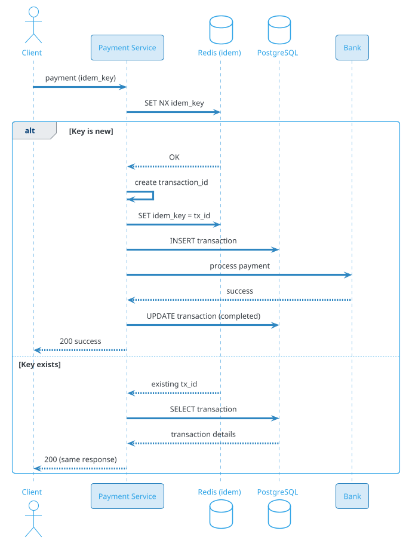
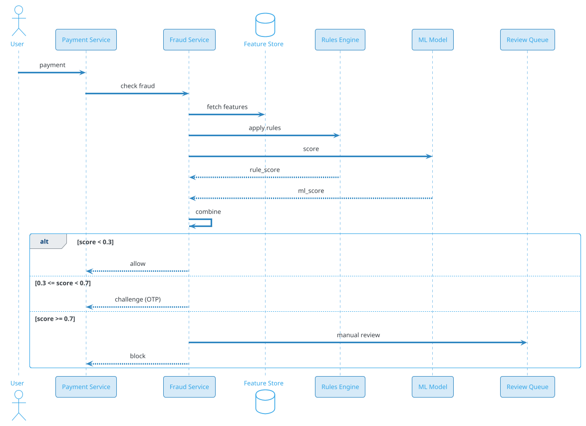
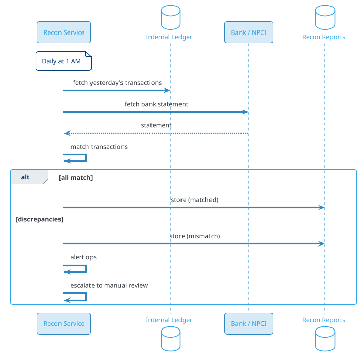
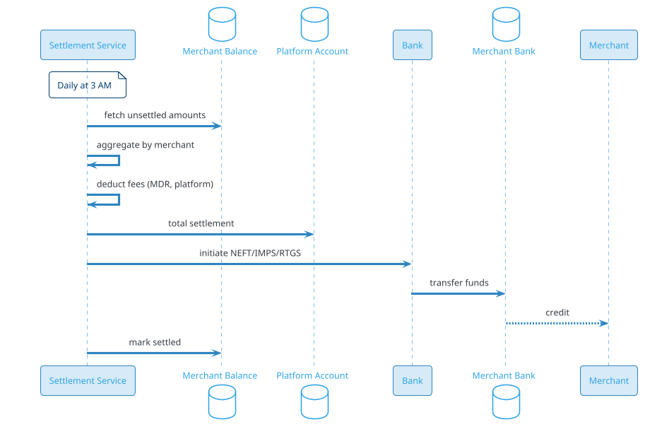

# Payment System (PhonePe / GPay / Stripe / PayPal)

## Problem Statement

Design a payment system like PhonePe, Google Pay, Paytm, Stripe, or PayPal. Users pay merchants, transfer money to friends, and manage balances. The system must process billions of transactions per day, guarantee correctness (money cannot be lost or duplicated), handle third-party payment gateways, reconcile with banks, prevent fraud, and comply with financial regulations (RBI, PCI-DSS, PSD2).

**Example:**

```
Payment flow:
  1. Priya opens PhonePe to pay ₹500 to a merchant
  2. Scans QR code (UPI)
  3. Enters UPI PIN
  4. Payment initiated via NPCI (UPI switch)
  5. Bank debits Priya's account
  6. Bank credits merchant's account
  7. Both parties notified
  8. Receipt generated

Behind the scenes:
  - Transaction ID generated (idempotent)
  - Route to correct payment rail (UPI, card, netbanking)
  - Bank confirmation
  - Ledger updated (double-entry)
  - Reconciliation with bank
  - Fraud check (ML + rules)
  - Compliance (KYC, AML, sanctions)
  - Fees: platform, bank, NPCI

Key challenges:
  - Idempotency (retries)
  - Atomicity (money moves or doesn't)
  - Reconciliation (with bank)
  - Fraud prevention
  - Regulatory compliance
  - Multi-currency
  - Chargebacks / refunds
  - Settlement (T+1, T+2)
  - High throughput (billions/day)

Scale:
  - 500M users
  - 50M DAU
  - 1B transactions/day (~11,574/sec avg, 57,870/sec peak)
  - 100M merchants
  - 200 countries
  - ₹1 lakh crore daily volume
```

**Real-world systems:** PhonePe, Google Pay, Paytm, Stripe, PayPal, Square, Adyen, Razorpay, RazorpayX, Wise.

**Why it's interesting:**

- **Correctness** — money cannot be lost, duplicated, or minted
- **Idempotency** — retries must not double-charge
- **ACID** — transactions are the classic use case
- **Reconciliation** — external systems (banks) can be inconsistent
- **Fraud** — adversarial (bad actors)
- **Compliance** — heavily regulated (RBI, PCI-DSS, PSD2, AML, KYC)
- **Settlement** — T+1, T+2, multi-party
- **Chargebacks** — disputes
- **High throughput** — billions of transactions
- **Multi-currency** — exchange, rounding
- **Availability** — 99.999% (money must flow)

---

## 1. Requirements Clarification

### Functional Requirements
- **Pay merchant**: UPI, card, netbanking, wallet
- **P2P transfer**: Send to friend (phone, UPI ID)
- **Balance management**: Wallet, linked accounts
- **Refunds**: Full, partial
- **Chargebacks**: Dispute resolution
- **Recurring payments**: Subscriptions, autopay
- **Invoicing**: For merchants
- **Refunds**: Initiated by merchant
- **Settlement**: To merchant bank account
- **Statements**: Transaction history
- **Notifications**: Real-time
- **Disputes**: Customer support

### Non-Functional Requirements
- **Scale**: 500M users, 1B transactions/day
- **Latency**: < 3 sec p99 for payment
- **Availability**: 99.999% (5 nines)
- **Consistency**: Strong (ACID) for money
- **Durability**: Never lose a transaction
- **Idempotency**: Retries must not duplicate
- **Security**: PCI-DSS, encryption, tokenization
- **Compliance**: RBI, NPCI, PCI-DSS, AML, KYC, GDPR
- **Fraud**: < 0.01% fraud rate
- **Cost**: Transaction fees competitive

### Out of Scope
- Lending (loan products)
- Insurance
- Investments
- Cryptocurrency

---

## 2. Back-of-Envelope Estimation

### Traffic

```
Given:
  Users                = 500,000,000
  DAU                  = 50,000,000
  Transactions/day     = 1,000,000,000
  Peak multiplier      = 5x (festival, salary day)

Average QPS:
  Transactions = 1B / 86,400 = ~11,574/sec
  Reads (status) = 5B / 86,400 = ~57,870/sec
  Total: ~70K ops/sec

Peak QPS:
  Transactions = ~57,870/sec
  Reads = ~289,350/sec
  Total: ~350K ops/sec

Per transaction:
  - 1 insert into ledger
  - 2-4 entries (debit, credit, fees)
  - Multiple status updates
  - Notifications

Total writes: ~50K/sec avg, ~250K/sec peak
```

### Storage

```
Transactions:
  1B/day x 365 x 5 = 1.825T transactions
  Per transaction: ~2 KB (metadata) = ~3.65 PB

Ledger entries:
  1.825T x 2.5 entries avg = ~4.5T entries
  Per entry: ~200 bytes = ~900 TB

Users:
  500M x 5 KB (KYC, accounts) = ~2.5 TB

Merchants:
  100M x 10 KB = ~1 TB

Bank accounts:
  500M x 2 KB = ~1 TB

Fraud signals:
  1B x 1 KB = ~1 TB/day
  5 years: ~1.8 PB

Audit logs:
  10B events/day x 500 bytes = ~5 TB/day
  5 years: ~9 PB

Analytics:
  1B transactions x 10 events x 500 bytes = ~5 TB/day
  5 years: ~9 PB

Total hot: ~50 TB (recent transactions, users)
Total cold: ~20 PB (archive)
```

### Bandwidth

```
Payment requests:
  57,870/sec x 1 KB = ~58 MB/sec = ~464 Mbps
  Peak: ~2.3 Gbps

Notifications:
  57,870/sec x 500 bytes = ~29 MB/sec
  Peak: ~1.2 Gbps

Bank API calls:
  57,870/sec x 500 bytes = ~29 MB/sec
  Peak: ~1.2 Gbps

Total: ~5 Gbps peak
```

### Latency Budget

```
Payment (end-to-end):
  Client → API:                 ~50 ms
  Auth:                          ~20 ms
  Validate (idempotency):        ~10 ms
  Fraud check:                   ~50 ms
  Route to bank:                 ~20 ms
  Bank API call:                 ~500-1500 ms
  Bank confirms:                 ~100 ms
  Update ledger:                 ~50 ms
  Notification:                  ~50 ms
  Total:                         ~800 ms - 2 sec

Target: < 3 sec p99.
```

---

## 3. High-Level Design

```d2
direction: down

user: User {shape: person}
merchant: Merchant {shape: person}
bank: "External Bank / NPCI" {shape: cloud}
card: "Card Network (Visa)" {shape: cloud}

cdn: CDN {shape: cloud}
lb: Load Balancer {shape: hexagon}
api: API Gateway {shape: hexagon}

auth: Auth Service {shape: rectangle}
payment: Payment Service {shape: rectangle}
ledger: Ledger Service {shape: rectangle}
fraud: Fraud Service {shape: rectangle}
compliance: Compliance Service {shape: rectangle}
notif: Notification Service {shape: rectangle}
recon: Reconciliation Service {shape: rectangle}
refund: Refund Service {shape: rectangle}
settle: Settlement Service {shape: rectangle}
webhook: Webhook Service {shape: rectangle}

kafka: Kafka {shape: queue}

pdb: "PostgreSQL (transactions, users)" {shape: cylinder}
cass: "Cassandra (events)" {shape: cylinder}
redis: "Redis (sessions, idempotency)" {shape: cylinder}
s3: "S3 (statements, docs)" {shape: cylinder}
ch: "ClickHouse (analytics)" {shape: cylinder}
audit: "Audit Log (immutable)" {shape: cylinder}

user -> cdn
merchant -> cdn
cdn -> lb
lb -> api

api -> auth
api -> payment
api -> refund
api -> notif

payment -> fraud
payment -> compliance
payment -> ledger
payment -> bank
payment -> card
payment -> kafka

ledger -> pdb
fraud -> pdb
compliance -> pdb
recon -> pdb
recon -> bank
settle -> pdb
webhook -> merchant

kafka -> notif
kafka -> ch
kafka -> audit
kafka -> webhook
```

### Component Responsibilities

| Component | Role |
|---|---|
| CDN | Static assets |
| Load Balancer | Route to API |
| API Gateway | Auth, rate limiting |
| Auth Service | User authentication, UPI PIN |
| Payment Service | Initiate payment, orchestrate |
| Ledger Service | Double-entry bookkeeping |
| Fraud Service | ML + rules |
| Compliance Service | KYC, AML, sanctions |
| Notification Service | Push, SMS, email |
| Reconciliation Service | Compare with bank |
| Refund Service | Process refunds |
| Settlement Service | Pay merchants |
| Webhook Service | Notify merchants |
| PostgreSQL | Transactions, users, accounts |
| Cassandra | Events (write-heavy) |
| Redis | Idempotency, sessions |
| S3 | Statements, docs |
| ClickHouse | Analytics |
| Audit Log | Immutable (WORM) |

### Why This Architecture

- **PostgreSQL** for transactions (ACID)
- **Cassandra** for events (write-heavy)
- **Redis** for idempotency keys (fast)
- **Kafka** for events (decoupled)
- **ClickHouse** for analytics
- **Audit log** (WORM) for compliance
- **Separate services** for fraud, compliance

---

## 4. Deep Dive: Idempotency

### Why Idempotency?

Networks fail. Clients retry. Without idempotency, retries cause **double charges**.

**Rule:** Every payment must be idempotent.

### Idempotency Key

Client generates a UUID per logical payment:
```json
{
  "idempotency_key": "550e8400-e29b-41d4-a716-446655440000",
  "amount": 50000,
  "currency": "INR",
  "payee": "merchant@upi"
}
```

Server stores: `idempotency_key → transaction_id`.

### Idempotency Flow



### Storage

```
Key: idem:{idempotency_key}
Value: {transaction_id, status, response}
TTL: 24 hours
```

**Why 24 hours?** Covers client retries for a day. Beyond that, clients must use a new key.

### Idempotency Across Services

- **Payment Service**: Idempotency key for creation
- **Bank API**: Bank has its own idempotency (UPI txn ID)
- **Ledger**: Ledger entries are idempotent (by txn_id)

### Handling Concurrent Retries

Two clients send same key simultaneously:
1. Both check Redis `SET NX`
2. Only one succeeds (other gets nil)
3. Loser waits for winner's response
4. Both return same result

**Implementation:** Redis SET NX is atomic.

### Idempotency for Refunds

Same pattern: `refund:{idempotency_key}`.

### Idempotency for Webhooks

Merchant webhooks may be retried:
- Merchant generates `webhook_id`
- Merchant deduplicates

---

## 5. Deep Dive: Ledger and Double-Entry

### Double-Entry Bookkeeping

Every transaction has **two sides**: debit and credit.

**Example:** Priya pays ₹500 to merchant:
```
Debit:  Priya's account  ₹500
Credit: Merchant's account ₹500
```

**Result:** Sum of debits = sum of credits (always).

### Ledger Structure

```sql
CREATE TABLE ledger_entries (
    entry_id BIGINT PRIMARY KEY,
    transaction_id BIGINT NOT NULL,
    account_id BIGINT NOT NULL,
    entry_type VARCHAR(10) NOT NULL,   -- debit, credit
    amount_cents BIGINT NOT NULL,
    currency VARCHAR(3) NOT NULL,
    balance_after_cents BIGINT,
    description TEXT,
    created_at TIMESTAMP DEFAULT NOW()
);
CREATE INDEX idx_ledger_tx ON ledger_entries(transaction_id);
CREATE INDEX idx_ledger_account ON ledger_entries(account_id, created_at DESC);

CREATE TABLE accounts (
    account_id BIGINT PRIMARY KEY,
    user_id BIGINT,
    account_type VARCHAR(20),          -- user, merchant, platform, bank
    balance_cents BIGINT NOT NULL,
    currency VARCHAR(3) NOT NULL,
    is_active BOOLEAN DEFAULT TRUE,
    updated_at TIMESTAMP DEFAULT NOW()
);
```

### Transaction Atomicity

PostgreSQL transaction:
```sql
BEGIN;
  -- Debit Priya
  UPDATE accounts SET balance_cents = balance_cents - 50000 WHERE account_id = ?;
  INSERT INTO ledger_entries (transaction_id, account_id, entry_type, amount_cents)
    VALUES (?, ?, 'debit', 50000);
  
  -- Credit Merchant
  UPDATE accounts SET balance_cents = balance_cents + 50000 WHERE account_id = ?;
  INSERT INTO ledger_entries (transaction_id, account_id, entry_type, amount_cents)
    VALUES (?, ?, 'credit', 50000);
COMMIT;
```

**All-or-nothing:** Either both succeed or both fail.

### Balance Check

Before debit:
```sql
SELECT balance_cents FROM accounts WHERE account_id = ? FOR UPDATE;
-- Check balance >= amount
```

**Row-level lock** prevents concurrent debits.

### Ledger Invariants

- **Sum of debits = sum of credits** (per transaction)
- **Sum of all balances = 0** (across all accounts)
- **No negative balance** (unless overdraft allowed)

### Reconciliation

Daily:
- **Sum of transactions** vs **bank statement**
- Match each transaction
- Flag discrepancies for manual review

### Ledger Scale

```
1B transactions/day
= ~2.5B ledger entries/day
= ~29K entries/sec avg
= ~145K entries/sec peak

PostgreSQL: ~100 shards
Each shard: ~10M transactions
```

### Ledger Types

- **User balance**: Wallet
- **Merchant balance**: Pending settlement
- **Platform**: Commission, fees
- **Bank**: Settlement account
- **Escrow**: Held funds (disputes)

### Immutability

Once a ledger entry is written, it's **never modified**. Corrections are new entries (reversing entries).

**Why?** Audit trail, dispute resolution.

---

## 6. Deep Dive: Fraud Detection

### Fraud Types

- **Stolen card**: Unauthorized use
- **Account takeover**: Compromised credentials
- **Friendly fraud**: Customer claims they didn't buy
- **Money laundering**: Moving illegal funds
- **Carding**: Testing stolen cards
- **Refund fraud**: Abusing refunds
- **Synthetic identity**: Fake user

### Detection Layers

**1. Rules (fast, deterministic):**
- Velocity: > N transactions in T min
- Amount: > threshold
- Geography: Different country from usual
- Device: New device
- Blocklist: Known bad actors

**2. ML models (sophisticated):**
- Gradient boosted trees (XGBoost)
- Neural networks (autoencoders)
- Graph analysis (relationships)
- Anomaly detection

**3. Manual review:**
- Escalated cases
- Human decision
- Feedback loop

### Signals

- **User**: Age, account age, KYC status, history
- **Transaction**: Amount, currency, merchant category
- **Device**: Device ID, OS, IP, geolocation
- **Behavior**: Time of day, velocity, patterns
- **Network**: IP reputation, VPN, proxy
- **Merchant**: Reputation, chargeback rate

### Scoring

```
risk_score = w1 * rule_score
           + w2 * ml_score
           + w3 * user_history
           + w4 * device_score
           + w5 * merchant_score
```

**Decision:**
- < 0.3: Allow
- 0.3 - 0.7: Challenge (OTP, 2FA)
- > 0.7: Block + review

### Fraud Detection Flow



### ML Model

- **Training**: Historical transactions (labeled fraud)
- **Features**: 100+ signals
- **Model**: XGBoost / neural network
- **Latency**: < 50 ms inference
- **Updates**: Daily retrain

### Adaptive Fraud

- **New patterns**: Detect via anomaly
- **Rule updates**: Fast deployment
- **Feedback loop**: Labeled by reviews

### Chargebacks

- **Customer disputes**: Bank reverses
- **Merchant response**: Provide evidence
- **Arbitration**: Card network decides

### Fraud Scale

```
1B transactions/day
Fraud rate: 0.01% = 100K fraud/day
Detection: ~99% of fraud
False positive: < 1%

Fraud Service: ~100 instances
Latency: < 50 ms p99
```

### Cost of Fraud

- **Direct loss**: Fraudulent amount
- **Chargeback fees**: $15-25 per
- **Reputation**: Trust damage
- **Regulatory**: Fines

**Investment:** Heavily justified.

---

## 7. Deep Dive: Reconciliation

### Why Reconciliation?

External systems (banks, card networks) can have:
- **Delays**: Batch settlement
- **Errors**: Technical issues
- **Disputes**: Missing or extra transactions

**Reconciliation** ensures internal ledger matches external records.

### Reconciliation Flow



### Matching Algorithm

For each transaction:
- Match by: `transaction_id`, `amount`, `timestamp`
- Tolerance: ±1 min, ±₹1 (for rounding)

**Statuses:**
- **Matched**: Both sides agree
- **Missing in bank**: We have, bank doesn't (e.g., delayed)
- **Missing internally**: Bank has, we don't (e.g., system failure)
- **Amount mismatch**: Different amounts

### Handling Discrepancies

| Case | Action |
|---|---|
| Missing in bank | Retry bank call; if still missing, reverse |
| Missing internally | Investigate; manually create |
| Amount mismatch | Investigate; correct |
| Duplicate | Reverse duplicate |

### Auto-Resolution

Simple cases:
- **Missing in bank**: Retry
- **Duplicate**: Auto-reverse

Complex cases:
- **Manual review**: Ops team

### Frequency

- **Daily**: Batch reconciliation (bank statement)
- **Real-time**: For high-value (e.g., > ₹1L)
- **Hourly**: For card transactions

### Recon Scale

```
1B transactions/day
Recon: ~1B comparisons
Duration: ~2-4 hours
Parallelization: 100+ workers
```

### Cost

- **Fraud loss** (if recon misses): Mitigated
- **Ops cost**: For manual review
- **Customer trust**: High (money back guarantee)

---

## 8. Deep Dive: Settlement

### What is Settlement?

When a transaction occurs, funds don't move immediately. **Settlement** is the actual transfer of funds between banks/accounts.

### Timeline

- **T+0**: Transaction (auth)
- **T+0 to T+1**: Bank debits/credits
- **T+1**: Settlement between banks
- **T+2**: Merchant payout (net of fees)

### Settlement Participants

- **Merchant's bank**: Where merchant account is
- **Platform's bank**: Where platform holds funds
- **RBI / NPCI**: For UPI settlement
- **Card networks**: Visa, Mastercard (T+2)

### Settlement Flow



### Settlement Frequency

- **Daily**: Most merchants
- **Weekly**: Small merchants (to reduce overhead)
- **Instant**: Premium merchants (T+0, higher fees)

### Fees

- **MDR (Merchant Discount Rate)**: 0.5-2% (paid by merchant)
- **Platform fee**: 0.5-1%
- **Bank fee**: Small
- **NPCI fee**: Small (UPI is free currently)

### Settlement File

- **Batch file**: List of payments to settle
- **Format**: NEFT/IMPS/RTGS compatible
- **Signed**: Digital signature
- **Uploaded**: To bank's portal or API

### Reconciliation of Settlement

- Bank confirms settlement
- Match with internal records
- Update merchant balance

### Settlement Scale

```
1B transactions/day
Total volume: ₹100,000 crore/day
Settlement: 100M merchants
Daily settlement: ~100M transfers (net)

Duration: ~4-6 hours
Banks: ~50 partner banks
```

### Multi-Currency

- **FX conversion**: Real-time or daily rate
- **Hedging**: For large volumes
- **Regulatory**: Cross-border (FEMA in India)

### Settlement Reports

- Merchant dashboard: Daily, weekly, monthly
- Tax filings: GST, TDS
- Regulatory: RBI reporting

---

## 9. Deep Dive: Refunds and Chargebacks

### Refund Flow

**Initiated by merchant or customer:**
1. Merchant clicks "Refund" in dashboard
2. Refund request sent to platform
3. Platform validates (within window, sufficient balance)
4. Refund processed to original payment method
5. Bank credits customer
6. Ledger updated (reversing entry)

### Refund States

- **PENDING**: Initiated
- **PROCESSING**: Bank processing
- **COMPLETED**: Money back
- **FAILED**: Error (retry or manual)

### Partial Refunds

Refund less than full amount:
- Multiple partial refunds allowed
- Track total refunded vs original
- Cannot exceed original

### Refund Window

- **UPI**: Instant (within minutes)
- **Card**: 5-7 business days
- **Netbanking**: 3-5 days
- **Wallet**: Instant

### Chargeback

**Customer disputes with bank:**
1. Customer files dispute
2. Bank requests evidence from platform
3. Platform forwards to merchant
4. Merchant provides evidence (proof of delivery)
5. Bank decides: uphold or reverse chargeback

**Timeline:** 30-90 days.

### Chargeback Fees

- **Merchant pays**: $15-25 per chargeback
- **Platform pays**: If not merchant's fault
- **Card network keeps**: Fee

### Fraud Prevention for Chargebacks

- **3D Secure**: Card authentication
- **AVS**: Address verification
- **CVV**: Card verification
- **Delivery proof**: Signature, tracking

### Refund Scale

```
~1% of transactions refunded
= 10M refunds/day
= ~116/sec avg
= ~580/sec peak

Refund Service: ~20 instances
```

### Ledger Impact

- **Reversal**: Opposite entries
- **Fees**: Not refunded (usually)
- **Net**: Merchant net negative

---

## 10. Deep Dive: Multi-Currency

### Currency Support

- **Local**: INR (India), USD (US), EUR (EU)
- **Cross-border**: USD, EUR (settlement)
- **Exchange rates**: Live or daily

### FX Conversion

- **Real-time rate**: From currency API
- **Lock rate**: For 10 min at checkout
- **Markup**: 1-3% (platform revenue)
- **Settlement**: In local currency

### Rounding

- **Half-up**: Standard
- **Banker's rounding**: Avoids bias
- **Store smallest unit**: Paise (INR), cents (USD)

### Currency Model

```json
{
  "transaction_id": "tx-123",
  "amount": 10000,
  "currency": "USD",
  "settled_amount": 830000,
  "settled_currency": "INR",
  "exchange_rate": 83.00,
  "fx_markup": 0.02,
  "fx_fee_cents": 200
}
```

### Regulatory

- **FEMA (India)**: Cross-border rules
- **PSD2 (EU)**: SCA, open banking
- **OFAC (US)**: Sanctions screening
- **AML**: Anti-money laundering

### Compliance

- **KYC**: For cross-border
- **Purpose code**: For RBI reporting
- **Tax**: GST, TDS (India)

---

## 11. Deep Dive: Compliance

### KYC (Know Your Customer)

- **Required**: For all users
- **Levels**: Min KYC (small amounts), Full KYC (unlimited)
- **Documents**: Aadhaar, PAN, address proof
- **Verification**: Aadhaar OTP, video KYC

### AML (Anti-Money Laundering)

- **Monitoring**: Unusual patterns
- **Reporting**: Suspicious Activity Report (SAR)
- **Thresholds**: Report > ₹10L
- **Ongoing**: Continuous monitoring

### Sanctions Screening

- **OFAC**: US sanctions list
- **UN**: International sanctions
- **RBI**: Indian list
- **Screening**: At onboarding + per transaction

### PCI-DSS

- **Card data**: Never store PAN (use tokens)
- **Encryption**: TLS, AES-256
- **Access**: Strict controls
- **Audits**: Annual

### Data Privacy

- **GDPR**: EU users
- **DPDP**: Indian users
- **CCPA**: California
- **Retention**: Per regulation (5-7 years)

### RBI Guidelines (India)

- **PPI (Prepaid Payment Instrument)**: Wallet regulations
- **PA (Payment Aggregator)**: License required
- **Data localization**: Payment data in India
- **Reporting**: Daily, monthly to RBI

### Audit

- **Internal**: Quarterly
- **External**: Annual
- **Regulatory**: On demand
- **Immutable logs**: WORM storage

---

## 12. Scaling Considerations

### Read Scaling

- **Redis** for sessions, idempotency
- **Read replicas** for PostgreSQL
- **Cassandra** for events
- **ClickHouse** for analytics

### Write Scaling

- **Kafka** for events
- **Cassandra** for high-volume events
- **PostgreSQL** sharded for transactions
- **Redis** for idempotency

### Sharding

**PostgreSQL:** Shard by `user_id`.
**Cassandra:** Partition by `user_id` or `transaction_id`.
**Kafka:** Partition by `user_id`.
**Redis:** Shard by `user_id`.

### Multi-Region

```d2
direction: down

us: "US Region" {
  shape: cloud
}
eu: "EU Region" {
  shape: cloud
}
india: "India Region" {
  shape: cloud
}

usdata: "US Data" {
  shape: cylinder
}
eudata: "EU Data" {
  shape: cylinder
}
indiadata: "India Data" {
  shape: cylinder
}

us -> usdata
eu -> eudata
india -> indiadata
```

**Data residency**: Per regulation.
**Payment rails**: Per country.
**Compliance**: Local.

### Peak Handling

- **Festival (Diwali, Black Friday)**: 5-10x
- **Salary day (1st, 5th)**: 3x
- **Election day**: 2x

**Mitigations:**
- Auto-scale
- Pre-warm
- Queue non-critical
- Rate limit

### Cost Optimization

| Component | Optimization |
|---|---|
| Database | Sharding, tiering |
| Kafka | Batch, retention |
| Compute | Reserved, spot |
| Storage | Tiering |
| Compliance | Automate |

---

## 13. Bottlenecks and Trade-offs

| Concern | Solution | Trade-off |
|---|---|---|
| Idempotency | Redis SET NX | Storage |
| Ledger | Double-entry | Complexity |
| Fraud | ML + rules | Latency, false positives |
| Reconciliation | Batch | Delay |
| Settlement | T+1 | Merchant wait |
| Compliance | Multiple | Overhead |
| Multi-region | Per-region | Complexity |
| Availability | Redundancy | Cost |

### Design Decisions Summary

| Decision | Choice | Rationale |
|---|---|---|
| Transactions | PostgreSQL (sharded) | ACID |
| Events | Cassandra | Write-heavy |
| Idempotency | Redis | Fast |
| Ledger | Double-entry | Correct |
| Fraud | ML + rules | Balance |
| Reconciliation | Batch (daily) | Cost |
| Settlement | T+1, T+2 | Regulatory |
| Multi-region | Per-region | Compliance |

---

## 14. Failure Scenarios

### Payment Service Down

**Impact:** Can't process payments.

**Mitigation:**
- Multi-instance
- Queue in Kafka
- Alert ops

### Ledger Down

**Impact:** Can't record transactions.

**Mitigation:**
- Multi-AZ failover
- Queue
- Alert ops

### Bank API Down

**Impact:** Can't settle.

**Mitigation:**
- Retry with backoff
- Queue
- Alternative bank
- Alert ops

### Redis Down

**Impact:** Idempotency fails; double charges possible.

**Mitigation:**
- Redis Sentinel
- Fallback to PostgreSQL unique constraint
- Alert ops

### Kafka Down

**Impact:** Events delayed.

**Mitigation:**
- Buffer in service
- Retry
- Alert ops

### Fraud Detection Failure

**Impact:** Fraud transactions approved.

**Mitigation:**
- Conservative defaults (block if unclear)
- Manual review
- Alert ops

### Reconciliation Failure

**Impact:** Discrepancies not caught.

**Mitigation:**
- Retry recon
- Manual review
- Alert ops

### Data Breach

**Impact:** User payment data exposed.

**Mitigation:**
- Encryption
- Tokenization
- Incident response
- Notify users

### Regulatory Action

**Impact:** Fines, license suspension.

**Mitigation:**
- Compliance team
- Audits
- Legal counsel
- Transparency

### Region Outage

**Impact:** Users in region can't pay.

**Mitigation:**
- Cross-region routing
- Restore
- Alert ops

### DDoS

**Impact:** Service unavailable.

**Mitigation:**
- CDN/WAF
- Rate limiting
- Anycast
- Alert ops

### Chargeback Storm

**Impact:** Merchant disputes surge.

**Mitigation:**
- Auto-response for known patterns
- Evidence collection
- Alert ops

---

## 15. Monitoring and Alerts

### Key Metrics

| Metric | Target | Alert Threshold |
|---|---|---|
| Payment p99 | < 3 sec | > 5 sec |
| Success rate | > 99.5% | < 98% |
| Idempotency hit rate | baseline | spike |
| Ledger balance | balanced | mismatch |
| Fraud rate | < 0.01% | > 0.05% |
| False positive | < 1% | > 2% |
| Bank API p99 | < 1.5 sec | > 3 sec |
| Reconciliation match | > 99.99% | < 99.9% |
| Chargeback rate | < 0.5% | > 1% |
| Settlement success | 100% | < 99.9% |

### Dashboards

- **Traffic**: Transactions/sec, by type
- **Latency**: p50/p95/p99
- **Success**: By payment method
- **Fraud**: Flagged, confirmed, blocked
- **Ledger**: Balanced, discrepancies
- **Settlement**: Pending, completed
- **Compliance**: KYC, AML alerts
- **Infrastructure**: DB, Kafka, Redis
- **Business**: Volume, revenue, merchants

### Alerts

- **P0**: Payment down, ledger mismatch, data breach
- **P1**: Success rate < 98%, fraud > 0.05%
- **P2**: Recon mismatch, chargeback spike
- **P3**: Slow API, high false positive

### Business KPIs

- **TPV** (Total Payment Volume)
- **Success rate**
- **Average transaction value**
- **Revenue** (fees)
- **Merchant count**
- **User retention**
- **NPS**

---

## 16. Cost Estimation

Rough monthly cost (AWS, us-east-1) for 1B transactions/day:

| Component | Spec | Cost/month |
|---|---|---|
| API servers | 500 x c6g.large | ~$30,000 |
| Payment Service | 300 x c6g.2xlarge | ~$72,000 |
| Ledger Service | 200 x c6g.2xlarge | ~$48,000 |
| Fraud Service | 100 x c6g.2xlarge | ~$24,000 |
| PostgreSQL | 100 shards x db.r6g.4xlarge | ~$475,000 |
| Read replicas | 200 x db.r6g.2xlarge | ~$420,000 |
| Cassandra | 100 x i3.2xlarge | ~$100,000 |
| Redis cluster | 100 x cache.r6g.2xlarge | ~$50,000 |
| Kafka (MSK) | 40 brokers | ~$20,000 |
| ClickHouse | 20 x i3.2xlarge | ~$20,000 |
| S3 (statements, docs) | 50 TB | ~$1,200 |
| WORM (audit) | 500 TB | ~$12,000 |
| Monitoring | Datadog | ~$50,000 |
| Compliance (KYC, AML) | 10M/month | ~$500,000 |
| **Total** | | **~$1.82M/month** |

**Per transaction:** ~$0.00006 (very cheap).

**Cost breakdown:**
- **Databases**: ~52%
- **Compliance**: ~27%
- **Compute**: ~10%
- **Other**: ~11%

**Revenue note:** Fees (0.5-2% MDR) generate 100x+ the cost.

---

## 17. Extensions and Follow-ups

### UPI

- India's real-time payment system
- NPCI-operated
- 10B+ transactions/month
- Free for users, small MDR

### Cards

- Visa, Mastercard, RuPay
- Credit, debit
- 3D Secure
- Tokenization

### Wallets

- Prepaid instruments
- RBI-regulated
- KYC required
- Limits

### BNPL (Buy Now Pay Later)

- Credit at checkout
- Installments
- Merchant fee
- Regulatory scrutiny

### Cross-Border

- International payments
- FX conversion
- Compliance (FEMA)
- Partners (Wise, PayPal)

### Recurring Payments

- UPI AutoPay
- Card subscriptions
- Mandates
- Retry logic

### Payment Links

- Merchant generates link
- Share via SMS/email
- Customer pays
- No app needed

### Invoicing

- Generate invoice
- Track payment
- Reminders
- GST compliance

### Split Payments

- Multiple payers
- Split bill
- Group payments

### Escrow

- Hold funds
- Release on condition
- Marketplace use
- Dispute resolution

### Lending Integration

- Credit line at checkout
- EMI options
- Partnerships with banks

### Voice Payments

- Voice-based auth
- Accessibility
- Growing

### Biometric Payments

- Fingerprint
- Face ID
- Aadhaar-based (India)

### CBDC (Central Bank Digital Currency)

- Digital rupee
- Government-issued
- Experimental

### Web3 / Crypto

- Crypto payments
- Stablecoins
- Blockchain settlement
- Regulatory uncertainty

---

## 18. Summary

| Aspect | Decision |
|---|---|
| Transactions | PostgreSQL (sharded) |
| Ledger | Double-entry (immutable) |
| Idempotency | Redis SET NX |
| Events | Cassandra |
| Analytics | ClickHouse |
| Fraud | ML + rules |
| Reconciliation | Daily batch |
| Settlement | T+1 / T+2 |
| Compliance | KYC, AML, PCI-DSS |
| Multi-region | Per-region |
| Scale | 500M users, 1B transactions/day |
| Latency | < 3 sec p99 |
| Availability | 99.999% |
| Cost | ~$1.82M/month (databases dominate) |

**Key takeaways:**

- **Idempotency is non-negotiable** — retries must not duplicate
- **Double-entry ledger** — sum of debits = sum of credits
- **ACID transactions** for money (PostgreSQL)
- **Fraud detection** — ML + rules, < 50 ms inference
- **Reconciliation** daily with banks — catch discrepancies
- **Settlement** T+1/T+2 — regulatory
- **Compliance** — KYC, AML, sanctions, PCI-DSS
- **Availability 99.999%** (5 nines) — money must flow
- **Multi-region** for compliance (data residency)
- **Cost is tiny** per transaction; revenue from fees
- **Audit log** (WORM) for compliance
- **Idempotency keys** for client retries

### Similar Pattern Problems

- Digital Wallet — balances, ledger
- Trading Platform — orders, settlement
- E-Commerce Checkout — payments, refunds
- Insurance Platform — premiums, claims
- Banking — accounts, transfers
- Fraud Detection — cross-cutting
- Accounting Systems — double-entry