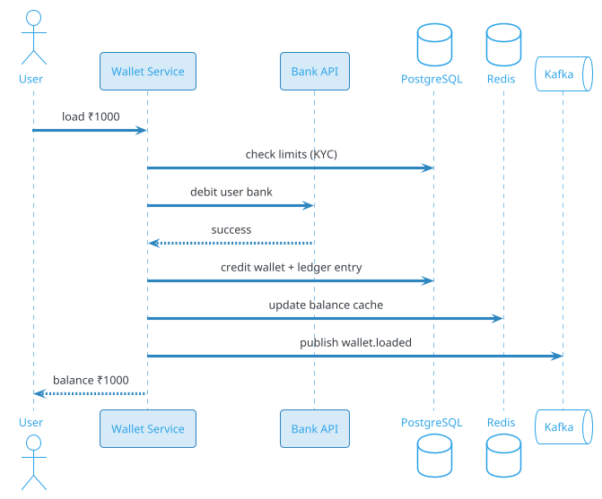
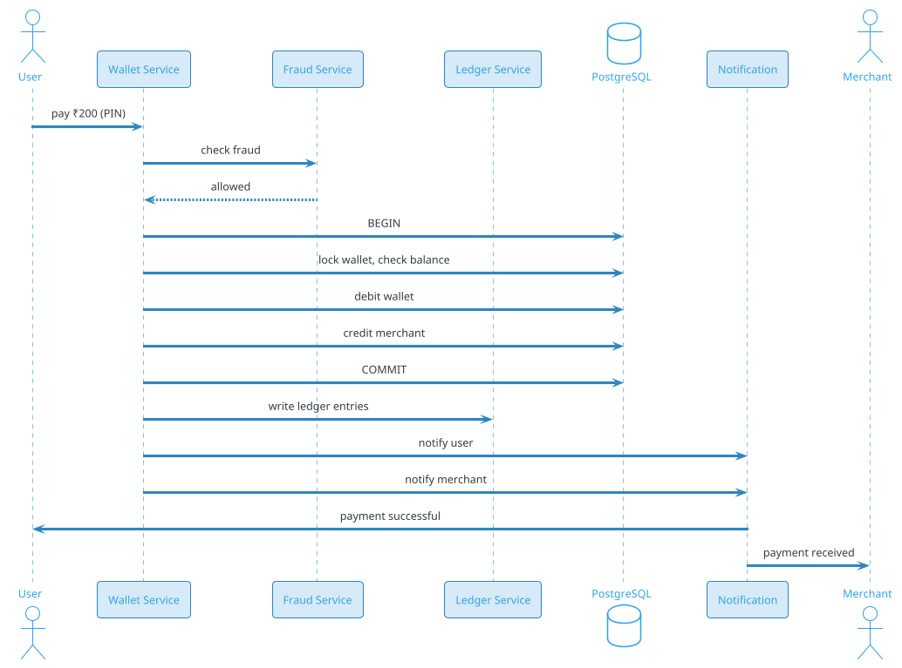
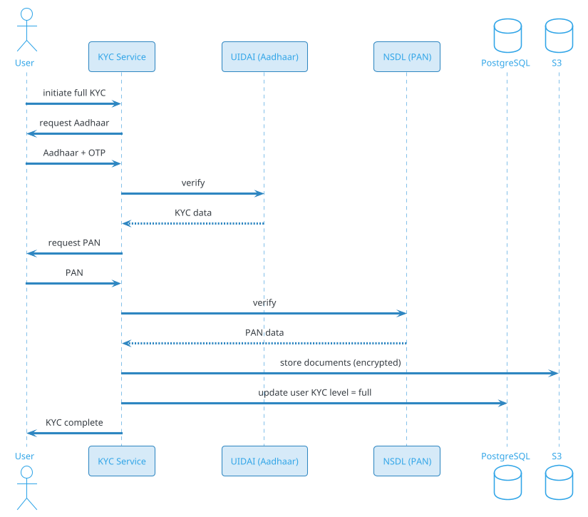

# Digital Wallet (Paytm Wallet / Amazon Pay / Google Pay Balance)

## Problem Statement

Design a digital wallet like Paytm Wallet, Amazon Pay Balance, Google Pay Balance, or PhonePe Wallet. Users load money into their wallet from a bank/card, spend it on merchants, transfer to other users, and withdraw back to their bank. The system maintains a per-user balance, must guarantee correctness (money cannot be lost or duplicated), handle high transaction volumes, comply with RBI's PPI (Prepaid Payment Instrument) regulations, and support refunds, cashback, and offers.

**Example:**

```
Wallet flow:
  1. Priya loads ₹1000 from her bank into her Paytm wallet
  2. Wallet balance: ₹1000
  3. Buys coffee at a café: pays ₹200 from wallet
  4. Wallet balance: ₹800
  5. Receives ₹50 cashback from a promo
  6. Wallet balance: ₹850
  7. Sends ₹100 to a friend's wallet
  8. Wallet balance: ₹750
  9. Friend's balance increases by ₹100
 10. Priya withdraws ₹500 to bank
 11. Wallet balance: ₹250
 12. Full transaction history available

Behind the scenes:
  - Each transaction is double-entry (debit + credit)
  - Idempotency prevents double-charge
  - Balance always ≥ 0 (no overdraft)
  - RBI KYC compliance (min KYC / full KYC)
  - Limits per KYC level
  - Settlement with merchants
  - Reconciliation with banks
  - Fraud detection
  - Cashback accounting
  - Refunds

Key challenges:
  - Per-user balance consistency
  - Idempotency (retries)
  - Atomicity (double-entry)
  - KYC compliance (RBI PPI)
  - Limits enforcement (per KYC level)
  - Wallet load/withdraw
  - Merchant payment
  - P2P transfer
  - Cashback/promotions
  - Refunds

Scale:
  - 500M wallets
  - 200M DAU
  - 500M transactions/day (~5,787/sec avg, 28,935/sec peak)
  - ₹10,000 crore daily volume
  - 100M merchants
  - KYC: 60% min, 40% full
```

**Real-world systems:** Paytm Wallet, Amazon Pay Balance, Google Pay Balance, PhonePe Wallet, Mobikwik, Freecharge.

**Why it's interesting:**

- **Per-user balance** — must be correct at all times
- **Double-entry** — every debit has a matching credit
- **Atomicity** — money moves or doesn't (no partial)
- **Idempotency** — retries must not duplicate
- **KYC compliance** — RBI-regulated PPI
- **Limits** — per KYC level (₹10K min, ₹1L full)
- **Load/Withdraw** — bank integration
- **Merchant payment** — MDR, settlement
- **P2P transfer** — instant, wallet-to-wallet
- **Cashback** — accounting complexity
- **Refunds** — reversal
- **Fraud** — wallet-specific patterns (SIM swap, account takeover)
- **Scale** — 500M wallets, high concurrency

---

## 1. Requirements Clarification

### Functional Requirements
- **Load wallet**: From bank, card, UPI
- **Withdraw**: To bank account
- **Pay merchant**: Scan QR, enter amount
- **P2P transfer**: Wallet to wallet
- **Balance check**: Real-time
- **Transaction history**: Full ledger
- **Refunds**: Full, partial
- **Cashback**: Promotional credits
- **Offers**: Discounts, coupons
- **KYC**: Min KYC, full KYC
- **Limits**: Per KYC level
- **Notifications**: SMS, push, email
- **Statements**: Downloadable
- **Merchant tools**: Dashboard, settlement

### Non-Functional Requirements
- **Scale**: 500M wallets, 200M DAU, 500M transactions/day
- **Latency**: < 2 sec p99 for payment
- **Availability**: 99.99%
- **Consistency**: Strong (ACID) for balances
- **Durability**: Never lose money
- **Idempotency**: Retries must not duplicate
- **Security**: Encryption, MFA
- **Compliance**: RBI PPI, PCI-DSS, KYC, AML
- **Limits**: Enforced (₹10K min, ₹1L full)
- **Multi-region**: Data residency (India)

### Out of Scope
- Credit lines (BNPL — separate)
- Investments
- Crypto
- Insurance

---

## 2. Back-of-Envelope Estimation

### Traffic

```
Given:
  Wallets              = 500,000,000
  DAU                  = 200,000,000
  Transactions/day     = 500,000,000
  Peak multiplier      = 5x (festival, salary day)

Average QPS:
  Transactions = 500M / 86,400 = ~5,787/sec
  Balance reads = 2B / 86,400 = ~23,148/sec
  Total: ~29K ops/sec

Peak QPS:
  Transactions = ~28,935/sec
  Balance reads = ~115,740/sec
  Total: ~145K ops/sec

Per transaction:
  - 1 insert into transactions
  - 2 ledger entries (debit + credit)
  - 1 balance update
  - Multiple status updates
  - Notifications
```

### Storage

```
Transactions:
  500M/day x 365 x 5 = 912.5B transactions
  Per transaction: ~500 bytes = ~456 TB

Ledger entries:
  912.5B x 2.5 entries avg = 2.28T entries
  Per entry: ~200 bytes = ~456 TB

Wallets:
  500M x 2 KB (user, KYC, limits) = ~1 TB

Balance (current):
  500M x 100 bytes = ~50 GB (Redis + PostgreSQL)

KYC documents:
  500M x 1 MB = ~500 TB (S3)

Cashback records:
  100M/day x 365 x 5 = 182.5B x 200 bytes = ~36 TB

Merchants:
  100M x 5 KB = ~500 GB

Fraud signals:
  500M x 500 bytes = ~250 GB/day
  5 years: ~456 TB

Audit logs:
  5B events/day x 300 bytes = ~1.5 TB/day
  5 years: ~2.7 PB

Total hot: ~10 TB (recent)
Total cold: ~4 PB
KYC docs: ~500 TB in S3
```

### Bandwidth

```
Transaction requests:
  28,935/sec x 1 KB = ~29 MB/sec = ~232 Mbps
  Peak: ~1.2 Gbps

Balance reads:
  115,740/sec x 200 bytes = ~23 MB/sec
  Peak: ~920 Mbps

Notifications:
  28,935/sec x 500 bytes = ~15 MB/sec
  Peak: ~580 Mbps

Total: ~3 Gbps peak
```

### Latency Budget

```
Wallet payment (merchant):
  Client → API:                 ~50 ms
  Auth (PIN/biometric):          ~50 ms
  Idempotency check:             ~10 ms
  Balance check:                 ~10 ms
  Fraud check:                   ~30 ms
  Debit wallet:                  ~20 ms
  Credit merchant:               ~20 ms
  Ledger write:                  ~30 ms
  Notification:                  ~30 ms
  Total:                         ~250 ms

Target: < 2 sec p99.

Wallet load (from bank):
  Client → API:                 ~50 ms
  Bank API call:                 ~500-1500 ms
  Confirm:                       ~100 ms
  Total:                         ~1-2 sec
```

---

## 3. High-Level Design

```d2
direction: down

user: User {shape: person}
merchant: Merchant {shape: person}
bank: "External Bank" {shape: cloud}
upi: "UPI / NPCI" {shape: cloud}

cdn: CDN {shape: cloud}
lb: Load Balancer {shape: hexagon}
api: API Gateway {shape: hexagon}

auth: Auth Service {shape: rectangle}
wallet: Wallet Service {shape: rectangle}
txn: Transaction Service {shape: rectangle}
ledger: Ledger Service {shape: rectangle}
kyc: KYC Service {shape: rectangle}
fraud: Fraud Service {shape: rectangle}
limit: Limit Service {shape: rectangle}
cashback: Cashback Service {shape: rectangle}
refund: Refund Service {shape: rectangle}
notif: Notification Service {shape: rectangle}
settle: Settlement Service {shape: rectangle}

kafka: Kafka {shape: queue}

pdb: "PostgreSQL (wallets, txn)" {shape: cylinder}
redis: "Redis (balance, idem)" {shape: cylinder}
cass: "Cassandra (events)" {shape: cylinder}
s3: "S3 (KYC docs)" {shape: cylinder}
ch: "ClickHouse (analytics)" {shape: cylinder}
audit: "Audit Log (WORM)" {shape: cylinder}

user -> cdn
merchant -> cdn
cdn -> lb
lb -> api

api -> auth
api -> wallet
api -> txn
api -> kyc

txn -> fraud
txn -> limit
txn -> ledger
txn -> wallet
txn -> bank
txn -> upi
txn -> cashback
txn -> kafka

wallet -> pdb
wallet -> redis
ledger -> pdb
kyc -> s3
kyc -> pdb
settle -> pdb
settle -> bank

kafka -> notif
kafka -> ch
kafka -> audit
kafka -> refund
```

### Component Responsibilities

| Component | Role |
|---|---|
| CDN | Static assets |
| Load Balancer | Route to API |
| API Gateway | Auth, rate limiting |
| Auth Service | User auth, PIN, biometric |
| Wallet Service | Wallet CRUD, balance |
| Transaction Service | Orchestrate transactions |
| Ledger Service | Double-entry bookkeeping |
| KYC Service | KYC verification, levels |
| Fraud Service | ML + rules |
| Limit Service | Enforce per-KYC limits |
| Cashback Service | Promotional credits |
| Refund Service | Process refunds |
| Notification Service | Push, SMS |
| Settlement Service | Merchant settlement |
| PostgreSQL | Wallets, transactions |
| Redis | Balance cache, idempotency |
| Cassandra | Events (write-heavy) |
| S3 | KYC documents |
| ClickHouse | Analytics |
| Audit Log | Immutable (WORM) |

### Why This Architecture

- **PostgreSQL** for wallets and transactions (ACID)
- **Redis** for balance cache and idempotency (fast)
- **Cassandra** for events (write-heavy)
- **Kafka** for async events
- **ClickHouse** for analytics
- **Audit log** (WORM) for compliance
- **Separate KYC service** for regulatory requirements

---

## 4. Deep Dive: Wallet Balance and Ledger

### Wallet Model

```sql
CREATE TABLE wallets (
    wallet_id BIGINT PRIMARY KEY,
    user_id BIGINT UNIQUE NOT NULL,
    balance_cents BIGINT NOT NULL DEFAULT 0,
    currency VARCHAR(3) DEFAULT 'INR',
    kyc_level VARCHAR(20),              -- min, full
    daily_limit_cents BIGINT,
    monthly_limit_cents BIGINT,
    status VARCHAR(20) DEFAULT 'active', -- active, suspended, closed
    created_at TIMESTAMP DEFAULT NOW(),
    updated_at TIMESTAMP DEFAULT NOW(),
    CHECK (balance_cents >= 0)
);
CREATE INDEX idx_wallets_user ON wallets(user_id);
```

**Critical constraint:** `balance_cents >= 0` — no overdraft.

### Balance Update

**Every transaction must atomically:**
1. Check balance ≥ amount (for debit)
2. Update balance
3. Write ledger entries
4. Update transaction status

**PostgreSQL transaction:**
```sql
BEGIN;
  -- Lock wallet row
  SELECT balance_cents FROM wallets WHERE wallet_id = ? FOR UPDATE;
  
  -- Check sufficient balance
  -- (in application code)
  
  -- Debit wallet
  UPDATE wallets SET balance_cents = balance_cents - 50000 WHERE wallet_id = ?;
  INSERT INTO ledger_entries (transaction_id, account_id, entry_type, amount_cents)
    VALUES (?, ?, 'debit', 50000);
  
  -- Credit merchant
  UPDATE merchant_accounts SET balance_cents = balance_cents + 50000 WHERE merchant_id = ?;
  INSERT INTO ledger_entries (transaction_id, account_id, entry_type, amount_cents)
    VALUES (?, ?, 'credit', 50000);
COMMIT;
```

**Row-level lock** (`FOR UPDATE`) prevents concurrent balance updates.

### Ledger Model (Double-Entry)

```sql
CREATE TABLE ledger_entries (
    entry_id BIGINT PRIMARY KEY,
    transaction_id BIGINT NOT NULL,
    account_type VARCHAR(20) NOT NULL,   -- wallet, merchant, platform, bank
    account_id BIGINT NOT NULL,
    entry_type VARCHAR(10) NOT NULL,     -- debit, credit
    amount_cents BIGINT NOT NULL,
    balance_after_cents BIGINT,
    created_at TIMESTAMP DEFAULT NOW()
);
CREATE INDEX idx_ledger_tx ON ledger_entries(transaction_id);
CREATE INDEX idx_ledger_account ON ledger_entries(account_type, account_id, created_at DESC);
```

**Invariants:**
- Sum of debits = sum of credits (per transaction)
- Sum of all balances = 0 (across all accounts)

### Balance Cache (Redis)

```
Key: balance:{wallet_id}
Value: balance_cents
TTL: 5 min
```

**Cache invalidation:** On balance update, delete cache.

**Read path:**
1. Check Redis → hit → return
2. Miss → query PostgreSQL → cache → return

**Write path:**
1. Update PostgreSQL (source of truth)
2. Delete Redis cache

### Balance Consistency

- **Strong consistency** in PostgreSQL
- **Eventual consistency** in Redis (cache)
- **Reconciliation** job (nightly) to verify

### Wallet Types

- **User wallet**: Personal balance
- **Merchant wallet**: Merchant settlement
- **Platform wallet**: Commission, fees
- **Cashback wallet**: Promotional credits (separate balance)

### Limits (RBI PPI)

| KYC Level | Min Balance | Max Balance | Monthly Limit |
|---|---|---|---|
| Min KYC | ₹0 | ₹10,000 | ₹10,000 |
| Full KYC | ₹0 | ₹100,000 | ₹100,000 |

**Enforcement:**
- On load: check total after load ≤ max
- On transaction: check monthly spent ≤ limit
- On withdraw: only full KYC can withdraw (usually)

### Wallet Scale

```
500M wallets
Balance updates: ~5,787/sec avg, ~28,935/sec peak
PostgreSQL: ~100 shards
Each shard: ~5M wallets
Redis: ~50 shards
```

---

## 5. Deep Dive: Load Money (Top-up)

### Load Flow



### Load Methods

- **UPI**: Direct from bank via UPI
- **Netbanking**: Bank redirect
- **Debit card**: Card network
- **Credit card**: Card network
- **Bank transfer**: NEFT/IMPS

### Load States

- **INITIATED**: User requested
- **PENDING**: Bank processing
- **COMPLETED**: Money credited
- **FAILED**: Bank declined
- **REVERSED**: Refunded to bank

### Load Failure Handling

- **Bank timeout**: Query bank status
- **Bank declined**: Notify user
- **Double debit**: Reverse duplicate (rare)

### Load Fees

- **Free**: Most methods
- **Convenience fee**: Some platforms charge (small %)

### Load Limits

- **Per transaction**: ₹10K (min KYC), ₹1L (full)
- **Per day**: ₹10K (min), ₹1L (full)
- **Per month**: Matches daily x 30

### Load Scale

```
500M wallets
~10% load per day = 50M loads/day
= ~579/sec avg
= ~2,900/sec peak

Per load: ~1-2 sec (bank API)
Concurrent: ~500 in flight
```

---

## 6. Deep Dive: Merchant Payment

### Payment Flow



### Merchant QR

- **Static QR**: Contains merchant ID
- **Dynamic QR**: Contains amount (for specific transaction)
- **UPI QR**: Standard format
- **Scan → identify merchant → pay**

### Payment Methods

- **Wallet balance**: Debit from wallet
- **Wallet + UPI**: Split (rare)
- **Wallet + Card**: Top-up then pay

### MDR (Merchant Discount Rate)

- **Fee** paid by merchant: 0.5-2%
- **Platform takes**: ~50% of MDR
- **Bank/NPCI takes**: Rest

**Note:** UPI transactions are free for merchants (currently).

### Instant Confirmation

- **User**: Instant balance update
- **Merchant**: Instant (for wallet payments)

### Settlement to Merchant

- **T+1**: Next business day
- **Batched**: All transactions per day
- **Net of fees**: MDR deducted

### Merchant Dashboard

- Real-time transactions
- Daily settlement report
- Refund processing
- Analytics

---

## 7. Deep Dive: P2P Transfer

### Transfer Flow

```
1. User A enters User B's phone/UPI/wallet ID
2. Enters amount
3. Auth (PIN/biometric)
4. System checks:
   - Both wallets active
   - A has sufficient balance
   - Within limits
5. Debit A, credit B (atomic)
6. Ledger entries
7. Both notified
```

### P2P Limits

- **Min KYC**: ₹10K/month total
- **Full KYC**: ₹1L/month total
- **Per transaction**: ₹10K (min), ₹1L (full)

### Transfer Fees

- **Free** for wallet-to-wallet (usually)
- **Some platforms**: Small fee

### Failed Transfer

- **Insufficient balance**: Reject
- **Recipient not found**: Reject
- **Network error**: Retry (idempotent)

### P2P Scale

```
500M transactions/day
~30% are P2P = 150M/day
= ~1,736/sec avg
= ~8,680/sec peak
```

### Privacy

- **Phone number** displayed only if opted in
- **Wallet ID**: Public
- **Amount**: Not visible to others

---

## 8. Deep Dive: Withdrawal (To Bank)

### Withdrawal Flow

```
1. User enters amount + bank account
2. Auth (PIN)
3. System checks:
   - Full KYC (usually required)
   - Sufficient balance
   - Within limits
4. Debit wallet
5. Initiate bank transfer (NEFT/IMPS/UPI)
6. Bank credits user's account
7. Confirm
```

### Withdrawal States

- **INITIATED**
- **PROCESSING** (bank)
- **COMPLETED**
- **FAILED** (reversed to wallet)

### Withdrawal Time

- **UPI**: Instant
- **IMPS**: Minutes
- **NEFT**: Hours
- **Batch**: T+1

### Withdrawal Fees

- **Free**: Usually
- **Small fee**: Some platforms (₹5-10)

### Withdrawal Limits

- **Per transaction**: ₹10K - ₹1L (depending on KYC)
- **Per day**: ₹10K - ₹1L
- **Per month**: Limits

### Reversal

If bank rejects:
- **Wallet credited back**
- **User notified**
- **Reason provided**

### Withdrawal Scale

```
~5% of wallets withdraw per week
= 25M withdrawals/week
= ~41/sec avg
= ~206/sec peak
```

---

## 9. Deep Dive: Cashback and Promotions

### Cashback Types

- **Instant cashback**: Credited immediately
- **Deferred**: After N days
- **Tiered**: Based on spend
- **Referral**: For inviting friends

### Cashback Flow

```
1. User completes qualifying transaction
2. Cashback rule matches
3. Cashback credited to wallet
4. Ledger entry (debit platform, credit user)
5. Notification to user
```

### Cashback Accounting

**Cashback is a cost** for the platform:
```
Debit:  Platform expense account
Credit: User wallet
```

**Promotion budget** tracked:
- Per campaign
- Per user (max cashback)
- Per day (total)

### Cashback Rules

- **Eligible transactions**: Certain merchants, categories
- **Minimum spend**: ₹100+
- **Max cashback**: ₹50 per transaction
- **Cap**: ₹500/month

### Offers

- **Coupons**: Discount codes
- **Cashback**: % back
- **Scratch cards**: Gamification
- **Lucky draw**: Random winner

### Fraud Prevention

- **Fake transactions**: To earn cashback
- **ML detection**: Unusual patterns
- **Cap enforcement**: Per user, campaign
- **Manual review**: For large cashback

### Cashback Scale

```
500M transactions/day
~20% have cashback = 100M/day
= ~1,157/sec avg
= ~5,787/sec peak

Cashback Service: ~20 instances
```

### Cashback Ledger

Separate ledger for:
- Platform expense
- User cashback balance
- Campaign budget

---

## 10. Deep Dive: KYC and Compliance

### KYC Levels (RBI)

| Level | Requirements | Max Balance | Monthly Limit |
|---|---|---|---|
| Min KYC | Mobile + OTP | ₹10,000 | ₹10,000 |
| Full KYC | Aadhaar + PAN + address | ₹100,000 | ₹100,000 |

### Min KYC

- **Mobile number** verification via OTP
- **No documents** required
- **Small limits**
- **Upgradeable** to full KYC

### Full KYC

- **Aadhaar**: e-KYC via OTP or biometric
- **PAN**: Verification
- **Address proof**: Aadhaar or utility bill
- **Photo**: Selfie
- **Video KYC**: Optional, for remote

### KYC Flow



### AML (Anti-Money Laundering)

- **Transaction monitoring**: Unusual patterns
- **Threshold reporting**: > ₹10L
- **Sanctions screening**: OFAC, UN
- **STR**: Suspicious Transaction Report

### PPI Regulations (RBI)

- **License**: Required (PPI issuer)
- **Limits**: Enforced
- **Data localization**: In India
- **Reporting**: Daily, monthly

### Compliance Audits

- **Internal**: Quarterly
- **External**: Annual
- **Regulatory**: On demand
- **Immutable logs**: WORM storage

### KYC Scale

```
500M wallets
40% full KYC = 200M full KYC records
Documents: 200M x 1 MB = ~200 TB (S3)
Verifications: ~500K/day
KYC Service: ~20 instances
```

### Privacy

- **Encryption**: Documents encrypted at rest
- **Access**: Restricted to KYC team
- **Retention**: As per regulation
- **Consent**: Documented

---

## 11. Deep Dive: Fraud Detection

### Wallet-Specific Fraud

- **SIM swap**: Attacker takes over phone number
- **Account takeover**: Stolen credentials
- **Fake KYC**: Synthetic identities
- **Money mule**: Laundering
- **Cashback abuse**: Fake transactions
- **Refund abuse**: Repeated refunds
- **Merchant fraud**: Fake merchants

### Detection Layers

**1. Rules**:
- Velocity: > N transactions in T min
- Amount: > threshold
- Device: New device
- Location: Unusual

**2. ML**:
- Gradient boosted trees
- Behavioral analysis
- Graph analysis (mule networks)
- Anomaly detection

**3. Manual review**:
- Escalated cases
- Human decision
- Feedback loop

### Signals

- **User**: KYC level, account age, history
- **Transaction**: Amount, merchant, time
- **Device**: Device ID, OS, IP
- **Behavior**: Velocity, patterns
- **Network**: Mule networks, shared devices

### SIM Swap Detection

- **Recent SIM change**: Flag
- **Device change**: Flag
- **Unusual location**: Flag
- **Combined signals**: Block + verify

### Fraud Score

```
risk_score = 0.3 * velocity
           + 0.2 * amount
           + 0.2 * device_risk
           + 0.15 * location_risk
           + 0.15 * user_history
```

**Actions:**
- < 0.3: Allow
- 0.3-0.7: Challenge (OTP)
- > 0.7: Block + review

### Fraud Scale

```
500M transactions/day
Fraud rate: 0.01% = 50K fraud/day
Detection: ~99%
False positive: < 1%

Fraud Service: ~50 instances
```

### Cost

- **Direct loss**: Fraudulent amount
- **Recovery**: Some recovered
- **Regulatory**: Fines
- **Reputation**: Trust

---

## 12. Deep Dive: Reconciliation

### Why Reconciliation?

- **Banks**: Can have delays, errors
- **NPCI**: Batch settlement
- **Internal ledger**: Must match
- **Discrepancies**: Must be caught

### Reconciliation Flow

```
1. Daily at 1 AM:
   - Fetch bank statement (yesterday)
   - Fetch NPCI settlement (yesterday)
   - Fetch internal ledger (yesterday)
2. Match by transaction_id
3. Categorize:
   - Matched: All 3 agree
   - Missing in bank: Retry
   - Missing internally: Investigate
   - Amount mismatch: Investigate
4. Generate report
5. Auto-resolve simple cases
6. Escalate complex
```

### Reconciliation Types

- **Bank reconciliation**: Wallet vs bank
- **Merchant reconciliation**: Payments vs settlements
- **NPCI reconciliation**: UPI settlements
- **Internal reconciliation**: Ledger vs balance

### Handling Discrepancies

| Case | Action |
|---|---|
| Missing in bank | Retry call |
| Missing internally | Manually create (if confirmed) |
| Amount mismatch | Investigate; correct |
| Duplicate | Auto-reverse |

### Reconciliation Reports

- **Daily**: For ops
- **Weekly**: Summary
- **Monthly**: For compliance

### Recon Scale

```
500M transactions/day
Recon: ~500M comparisons
Duration: ~2-4 hours
Workers: ~100
```

---

## 13. Scaling Considerations

### Read Scaling

- **Redis** for balance (fast reads)
- **Read replicas** for PostgreSQL
- **Cassandra** for events
- **ClickHouse** for analytics

### Write Scaling

- **Kafka** for events
- **PostgreSQL** sharded for wallets
- **Redis** for idempotency

### Sharding

**PostgreSQL:** Shard by `user_id`.
**Redis:** Shard by `wallet_id`.
**Kafka:** Partition by `user_id`.
**Cassandra:** Partition by `user_id`.

### Multi-Region

- **Single region** for India (RBI localization)
- **Read replicas** across regions (for DR)
- **Data residency**: In India

### Peak Handling

- **Festival (Diwali)**: 5x
- **Salary day**: 3x
- **Election day**: 2x

**Mitigations:**
- Auto-scale
- Pre-warm
- Queue non-critical
- Rate limit

### Cost Optimization

| Component | Optimization |
|---|---|
| Database | Sharding, tiering |
| Redis | Right-size, TTL |
| Compute | Reserved, spot |
| Storage | Tiering |
| KYC | Automate |

---

## 14. Bottlenecks and Trade-offs

| Concern | Solution | Trade-off |
|---|---|---|
| Balance consistency | PostgreSQL + locks | Latency |
| Idempotency | Redis SET NX | Storage |
| Double-entry | Ledger | Complexity |
| Fraud | ML + rules | False positives |
| KYC | Multiple levels | Compliance burden |
| Settlement | T+1 | Merchant wait |
| Multi-region | Single (India) | Compliance |
| Availability | Redundancy | Cost |

### Design Decisions Summary

| Decision | Choice | Rationale |
|---|---|---|
| Wallets | PostgreSQL (sharded) | ACID |
| Balance cache | Redis | Fast reads |
| Ledger | Double-entry | Correct |
| Idempotency | Redis | Fast |
| Events | Cassandra | Write-heavy |
| Analytics | ClickHouse | Fast |
| KYC | Aadhaar, PAN | Regulatory |
| Fraud | ML + rules | Balance |
| Settlement | T+1 | Standard |

---

## 15. Failure Scenarios

### Wallet Service Down

**Impact:** Can't transact.

**Mitigation:**
- Multi-instance
- Queue in Kafka
- Alert ops

### PostgreSQL Down

**Impact:** Wallets unavailable.

**Mitigation:**
- Multi-AZ failover
- Redis cache serves reads
- Queue writes
- Alert ops

### Redis Down

**Impact:** Balance cache misses; idempotency fails.

**Mitigation:**
- Redis Sentinel
- PostgreSQL unique constraint for idempotency
- Alert ops

### Bank API Down

**Impact:** Can't load/withdraw.

**Mitigation:**
- Retry
- Alternative bank
- Queue
- Alert ops

### Kafka Down

**Impact:** Events delayed.

**Mitigation:**
- Buffer
- Retry
- Alert ops

### Fraud Detection Failure

**Impact:** Fraud transactions approved.

**Mitigation:**
- Conservative defaults
- Manual review
- Alert ops

### Balance Inconsistency

**Impact:** Ledger vs balance mismatch.

**Mitigation:**
- Reconciliation
- Manual correction
- Alert ops

### Data Breach

**Impact:** User data exposed.

**Mitigation:**
- Encryption
- Access controls
- Incident response
- Notify users

### RBI Action

**Impact:** Regulatory action.

**Mitigation:**
- Compliance team
- Audits
- Legal counsel

### Region Outage

**Impact:** Users can't transact.

**Mitigation:**
- DR site
- Restore
- Alert ops

### DDoS

**Impact:** Service unavailable.

**Mitigation:**
- CDN/WAF
- Rate limiting
- Anycast
- Alert ops

---

## 16. Monitoring and Alerts

### Key Metrics

| Metric | Target | Alert Threshold |
|---|---|---|
| Transaction p99 | < 2 sec | > 4 sec |
| Success rate | > 99.5% | < 99% |
| Load p99 | < 2 sec | > 4 sec |
| Withdraw p99 | < 5 min | > 15 min |
| Balance read p99 | < 50 ms | > 200 ms |
| Idempotency hit rate | baseline | spike |
| Fraud rate | < 0.01% | > 0.05% |
| Ledger balance | balanced | mismatch |
| Recon match | > 99.99% | < 99.9% |
| KYC completion | > 95% | < 90% |
| Cashback abuse | < 0.1% | > 1% |

### Dashboards

- **Traffic**: Transactions/sec, by type
- **Latency**: p50/p95/p99
- **Success**: By operation
- **Balance**: Total, avg per wallet
- **Fraud**: Flagged, blocked
- **Ledger**: Balanced, discrepancies
- **KYC**: Completion rate, levels
- **Settlement**: Pending, completed
- **Infrastructure**: DB, Redis, Kafka
- **Business**: DAU, TPV, revenue

### Alerts

- **P0**: Wallet service down, ledger mismatch, data breach
- **P1**: Success < 99%, fraud > 0.05%
- **P2**: Recon mismatch, KYC drop
- **P3**: Slow withdrawal, high false positive

### Business KPIs

- **DAU/MAU** ratio
- **Transactions per DAU**
- **TPV** (Total Payment Volume)
- **Active wallets**
- **KYC completion**
- **Retention**
- **NPS**

---

## 17. Cost Estimation

Rough monthly cost (AWS, us-east-1) for 200M DAU:

| Component | Spec | Cost/month |
|---|---|---|
| API servers | 300 x c6g.large | ~$18,000 |
| Wallet Service | 200 x c6g.2xlarge | ~$48,000 |
| Transaction Service | 200 x c6g.2xlarge | ~$48,000 |
| Ledger Service | 100 x c6g.2xlarge | ~$24,000 |
| Fraud Service | 50 x c6g.2xlarge | ~$12,000 |
| KYC Service | 50 x c6g.large | ~$3,000 |
| PostgreSQL | 50 shards x db.r6g.4xlarge | ~$237,000 |
| Read replicas | 100 x db.r6g.2xlarge | ~$210,000 |
| Cassandra | 50 x i3.2xlarge | ~$50,000 |
| Redis cluster | 50 x cache.r6g.2xlarge | ~$25,000 |
| Kafka (MSK) | 30 brokers | ~$15,000 |
| ClickHouse | 20 x i3.2xlarge | ~$20,000 |
| S3 (KYC docs) | 500 TB | ~$12,000 |
| WORM (audit) | 1 PB | ~$25,000 |
| Monitoring | Datadog | ~$40,000 |
| Compliance | KYC, AML | ~$500,000 |
| **Total** | | **~$1.29M/month** |

**Per user:** ~$0.0065/month.

**Cost breakdown:**
- **Compliance**: ~39%
- **Databases**: ~34%
- **Compute**: ~12%
- **Other**: ~15%

**Revenue note:** MDR (0.5-2%), convenience fees, and float income cover costs.

---

## 18. Extensions and Follow-ups

### UPI Integration

- UPI wallet (linked)
- UPI Lite (small value)
- UPI AutoPay

### Cards

- Prepaid cards
- Gift cards
- Corporate cards

### Merchant Tools

- Payment links
- Invoice generation
- Analytics
- Refunds

### Recurring Payments

- Subscriptions
- Bill payments
- Auto top-up

### Rewards

- Loyalty points
- Referral bonuses
- Scratch cards

### Investments

- Mutual funds
- Gold
- Stocks

### Insurance

- Micro-insurance
- Partnerships

### Bill Payments

- Electricity
- Water
- Mobile recharge
- DTH

### Travel

- Ticket booking
- Hotel booking
- Wallet payment

### Lending

- BNPL
- Personal loans
- Credit line

### Cross-Border

- International wallets
- Forex
- Remittance

### CBDC

- Digital rupee integration
- Experimental

### Voice Payments

- Voice-based
- Accessible

### Biometric

- Fingerprint
- Face ID
- Aadhaar-based

### AI

- Spending insights
- Fraud detection
- Personalized offers

### Web3

- Crypto wallet
- Token integration
- Regulatory unclear

---

## 19. Summary

| Aspect | Decision |
|---|---|
| Wallets | PostgreSQL (sharded) |
| Balance cache | Redis |
| Ledger | Double-entry (immutable) |
| Idempotency | Redis SET NX |
| Events | Cassandra |
| Analytics | ClickHouse |
| KYC | Aadhaar, PAN (RBI) |
| Fraud | ML + rules |
| Settlement | T+1 |
| Limits | Per KYC level |
| Scale | 500M wallets, 500M transactions/day |
| Latency | < 2 sec p99 |
| Availability | 99.99% |
| Cost | ~$1.29M/month |

**Key takeaways:**

- **Double-entry ledger** — sum of debits = sum of credits
- **Idempotency** — retries must not duplicate
- **ACID transactions** for wallet balance
- **KYC levels** — min (₹10K), full (₹1L)
- **Limits** — enforced per RBI PPI
- **Load/Withdraw** — bank integration
- **Cashback** — accounting complexity
- **Fraud** — SIM swap, account takeover
- **Reconciliation** daily with banks
- **Compliance** — RBI, PPI, AML, KYC
- **Single region** (India) for compliance
- **Cost is tiny** per user; revenue from fees

### Similar Pattern Problems

- Payment System — payments, settlement
- Trading Platform — orders, settlement
- E-Commerce Checkout — payments
- Insurance Platform — premiums
- Banking — accounts, transfers
- Fraud Detection — cross-cutting
- Accounting — double-entry