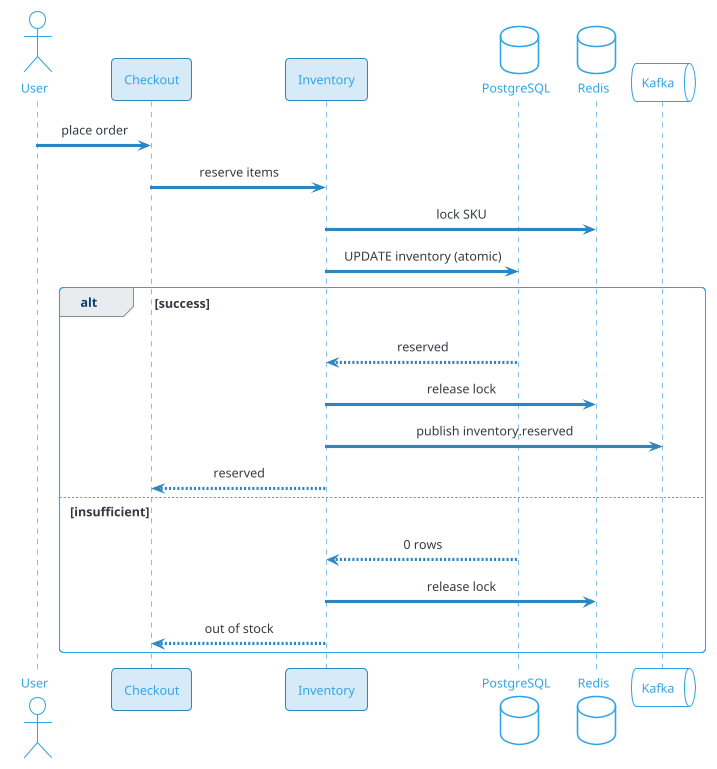
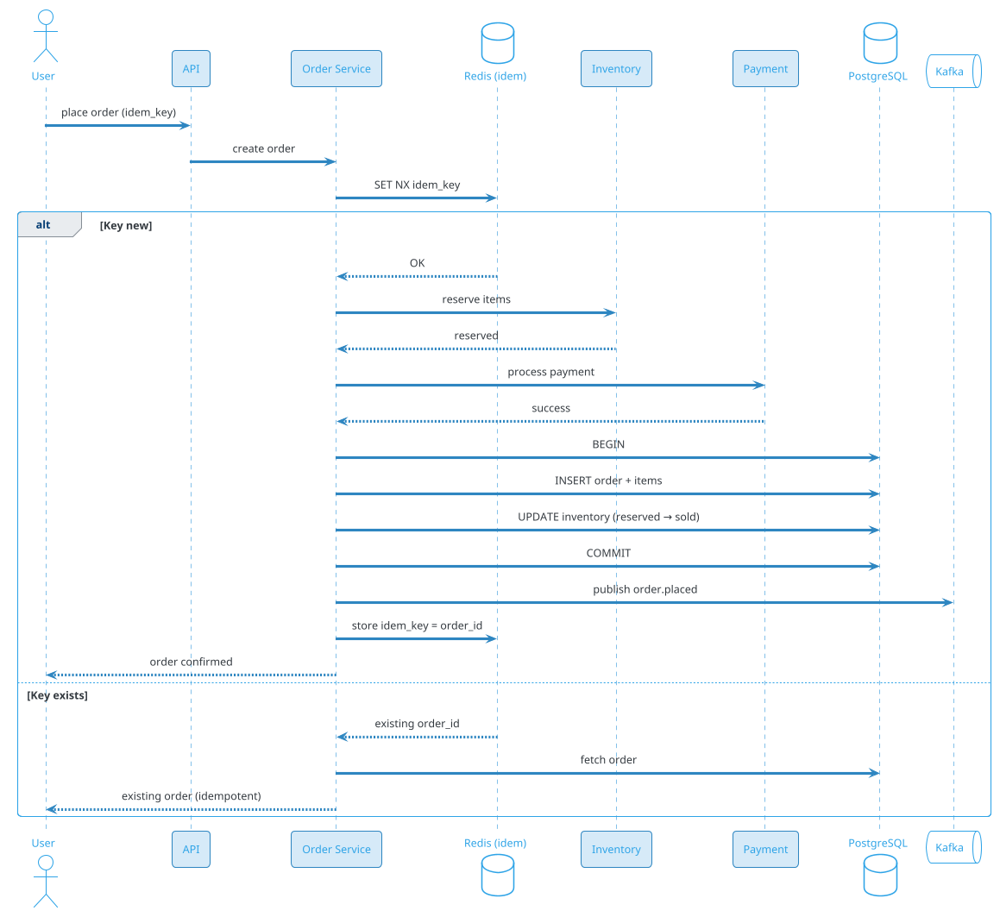

# E-Commerce Checkout Flow (Amazon / Flipkart / Shopify)

## Problem Statement

Design an e-commerce checkout flow like Amazon, Flipkart, or Shopify. Users add items to cart, proceed to checkout, enter shipping details, select payment method, and place the order. The system must handle inventory reservation, pricing, taxes, shipping, coupons, payments, and order fulfillment — while preventing overselling, handling concurrent buyers, ensuring idempotency, and providing a smooth user experience during peak sales (Black Friday, Prime Day).

**Example:**

```
Checkout flow:
  1. Priya adds 3 items to cart:
     - iPhone 15 (₹79,900)
     - AirPods (₹19,900)
     - Phone case (₹1,500)
  2. Cart total: ₹1,01,300
  3. Proceeds to checkout
  4. Enters shipping address
  5. Selects delivery option (standard, free)
  6. Applies coupon: 10% off up to ₹5,000 → saves ₹5,000
  7. Selects payment: UPI
  8. Tax (GST 18%): ₹17,334
  9. Total: ₹1,13,634
 10. Confirms order
 11. Payment processed
 12. Order confirmed, inventory reserved
 13. Confirmation email/SMS
 14. Shipment tracking

Behind the scenes:
  - Cart service (persistent across devices)
  - Inventory check (real-time stock)
  - Price calculation (base + tax + shipping - discounts)
  - Coupon validation (single-use, eligible, not expired)
  - Address validation (pincode serviceability)
  - Payment processing (multiple methods)
  - Order creation (transactional)
  - Inventory reservation (with TTL)
  - Fulfillment (warehouse, shipment)

Key challenges:
  - Inventory consistency (no overselling)
  - Cart state (persistent, multi-device)
  - Pricing (complex rules: taxes, shipping, discounts)
  - Coupons (validation, limits)
  - Payment (multiple methods, retries)
  - Idempotency (retries)
  - Order atomicity (all or nothing)
  - Peak traffic (Black Friday: 100x)
  - Cart abandonment (recovery)

Scale:
  - 500M users
  - 100M DAU
  - 50M orders/day (~579/sec avg, 2,900/sec peak)
  - 500M cart updates/day
  - 100K SKUs per large catalog
  - 10M SKUs across platform
  - Peak: Black Friday (100x normal)
```

**Real-world systems:** Amazon, Flipkart, Shopify, Walmart, Etsy, eBay, Target, Best Buy, Myntra, Nykaa.

**Why it's interesting:**

- **Inventory consistency** — no overselling (worst UX)
- **Cart state** — persistent, multi-device
- **Pricing** — complex (taxes, shipping, discounts)
- **Coupons** — validation, limits
- **Payment** — multiple methods, retries
- **Idempotency** — retries must not duplicate orders
- **Order atomicity** — all or nothing
- **Peak traffic** — Black Friday (100x)
- **Cart abandonment** — recovery emails
- **Fulfillment** — warehouse, shipment
- **Returns** — refunds, exchanges
- **Fraud** — stolen cards, fake orders

---

## 1. Requirements Clarification

### Functional Requirements
- **Cart**: Add, update, remove items
- **Cart persistence**: Across devices, sessions
- **Address**: Add, validate, select
- **Shipping options**: Standard, expedited
- **Pricing**: Subtotal, taxes, shipping, discounts
- **Coupons**: Apply, validate, remove
- **Payment**: Multiple methods (card, UPI, netbanking, wallet, COD)
- **Order placement**: Confirm, process, notify
- **Order tracking**: Status updates
- **Cancellation**: Before shipment
- **Returns**: Initiate, track
- **Refunds**: Process
- **Recommendations**: Cross-sell, upsell
- **Notifications**: Email, SMS, push

### Non-Functional Requirements
- **Scale**: 500M users, 100M DAU, 50M orders/day
- **Latency**: Checkout < 2 sec; payment < 5 sec
- **Availability**: 99.99% — orders = revenue
- **Consistency**: Strong for inventory, payments
- **Durability**: Never lose an order
- **Idempotency**: Retries must not duplicate
- **Peak**: 100x during sales
- **Security**: PCI-DSS, encryption
- **Compliance**: GST, GDPR, DPDP, consumer protection

### Out of Scope
- Full inventory management (warehouse)
- Logistics (shipment tracking — separate)
- Recommendations (ML — separate)
- Advertising

---

## 2. Back-of-Envelope Estimation

### Traffic

```
Given:
  Users                = 500,000,000
  DAU                  = 100,000,000
  Orders/day           = 50,000,000
  Cart updates/day     = 500,000,000
  Checkout sessions    = 150,000,000
  Peak multiplier      = 5x (normal), 100x (Black Friday)

Average QPS:
  Orders = 50M / 86,400 = ~579/sec
  Cart updates = 500M / 86,400 = ~5,787/sec
  Checkout = 150M / 86,400 = ~1,736/sec
  Reads = 5B / 86,400 = ~57,870/sec
  Total: ~65K ops/sec

Peak QPS:
  Orders = ~2,900/sec
  Cart updates = ~28,935/sec
  Reads = ~289,350/sec
  Total: ~325K ops/sec

Black Friday peak: 100x normal
  Orders = ~58,000/sec
  Cart updates = ~580,000/sec
```

### Storage

```
Carts:
  200M active carts x 5 KB = ~1 TB
  Redis (session) + PostgreSQL (persistent)

Orders:
  50M/day x 365 x 5 = 91.25B orders
  Per order: ~5 KB = ~456 TB

Order items:
  91.25B x 3 items avg x 500 bytes = ~137 TB

Payments:
  91.25B x 500 bytes = ~46 TB

Inventory:
  10M SKUs x 1 KB (stock, metadata) = ~10 GB (PostgreSQL)

Users:
  500M x 2 KB = ~1 TB

Addresses:
  500M x 500 bytes = ~250 GB

Coupons:
  10M x 1 KB = ~10 GB

Analytics:
  50M orders x 10 events x 500 bytes = ~250 GB/day
  5 years: ~456 TB

Total hot: ~10 TB
Total cold: ~1 PB
```

### Bandwidth

```
Cart operations:
  28,935/sec x 1 KB = ~29 MB/sec = ~232 Mbps
  Peak: ~1.2 Gbps

Checkout responses:
  2,900/sec x 5 KB = ~15 MB/sec
  Peak: ~580 Mbps

Payment:
  2,900/sec x 2 KB = ~6 MB/sec

Total: ~2 Gbps peak
```

### Latency Budget

```
Add to cart:
  Client → API:                 ~50 ms
  Auth:                          ~10 ms
  Validate:                      ~10 ms
  Update cart:                   ~20 ms
  Return:                        ~20 ms
  Total:                         ~110 ms

Checkout:
  Client → API:                 ~50 ms
  Load cart:                     ~30 ms
  Validate pricing:              ~50 ms
  Check inventory:               ~30 ms
  Validate coupon:               ~20 ms
  Calculate tax:                 ~30 ms
  Return:                        ~30 ms
  Total:                         ~240 ms

Order placement:
  Client → API:                 ~50 ms
  Idempotency check:             ~10 ms
  Reserve inventory:             ~50 ms
  Process payment:               ~1500 ms (external)
  Create order:                  ~50 ms
  Confirm:                       ~100 ms
  Total:                         ~1.8 sec

Target: < 3 sec p99.
```

---

## 3. High-Level Design

```d2
direction: down

user: User {shape: person}
merchant: Merchant {shape: person}
warehouse: Warehouse {shape: person}

cdn: CDN {shape: cloud}
lb: Load Balancer {shape: hexagon}
api: API Gateway {shape: hexagon}

cart: Cart Service {shape: rectangle}
checkout: Checkout Service {shape: rectangle}
pricing: Pricing Service {shape: rectangle}
inventory: Inventory Service {shape: rectangle}
coupon: Coupon Service {shape: rectangle}
tax: Tax Service {shape: rectangle}
shipping: Shipping Service {shape: rectangle}
payment: Payment Service {shape: rectangle}
order: Order Service {shape: rectangle}
notif: Notification Service {shape: rectangle}
reco: Recommendation Service {shape: rectangle}

kafka: Kafka {shape: queue}

pdb: "PostgreSQL (orders, inventory)" {shape: cylinder}
redis: "Redis (cart, cache)" {shape: cylinder}
cass: "Cassandra (events)" {shape: cylinder}
ch: "ClickHouse (analytics)" {shape: cylinder}
s3: "S3 (invoices, images)" {shape: cylinder}
payment_gw: "Payment Gateway" {shape: cloud}
tax_api: "Tax API" {shape: cloud}

user -> cdn
merchant -> cdn
warehouse -> cdn
cdn -> lb
lb -> api

api -> cart
api -> checkout
api -> order

cart -> redis
cart -> pdb

checkout -> pricing
checkout -> inventory
checkout -> coupon
checkout -> tax
checkout -> shipping

checkout -> order
order -> payment
order -> inventory
order -> notif
order -> kafka

payment -> payment_gw
tax -> tax_api
inventory -> pdb
inventory -> redis

kafka -> notif
kafka -> ch
kafka -> warehouse
```

### Component Responsibilities

| Component | Role |
|---|---|
| CDN | Static assets, product images |
| Load Balancer | Route to API |
| API Gateway | Auth, rate limiting |
| Cart Service | Cart CRUD, persistence |
| Checkout Service | Orchestrate checkout |
| Pricing Service | Calculate total (base + tax + shipping - discount) |
| Inventory Service | Stock, reservation |
| Coupon Service | Validate, apply |
| Tax Service | GST/VAT calculation |
| Shipping Service | Options, ETA |
| Payment Service | Process payment |
| Order Service | Order lifecycle |
| Notification Service | Email, SMS, push |
| Recommendation Service | Cross-sell |
| PostgreSQL | Orders, inventory |
| Redis | Cart cache, idempotency |
| Cassandra | Events |
| ClickHouse | Analytics |
| S3 | Invoices, images |
| Payment Gateway | External (Stripe, Razorpay) |
| Tax API | External (Avalara, GST) |

### Why This Architecture

- **Cart in Redis** (fast, session-based) + **PostgreSQL** (persistent)
- **PostgreSQL** for orders and inventory (ACID)
- **Inventory Service** with atomic reservation
- **Pricing Service** centralizes calculation
- **Kafka** for events (order, inventory)
- **ClickHouse** for analytics
- **External APIs** for tax and payment

---

## 4. Deep Dive: Cart Management

### Cart Data Model

```json
{
  "cart_id": "cart-123",
  "user_id": "u-456",
  "items": [
    {
      "sku": "iphone-15-128-black",
      "product_id": "prod-1",
      "quantity": 1,
      "price_cents": 7990000,
      "added_at": "2026-09-19T10:00:00Z",
      "saved_for_later": false
    },
    {
      "sku": "airpods-pro-2",
      "product_id": "prod-2",
      "quantity": 1,
      "price_cents": 1990000,
      "added_at": "2026-09-19T10:01:00Z"
    }
  ],
  "subtotal_cents": 9980000,
  "updated_at": "2026-09-19T10:02:00Z"
}
```

### Storage Strategy

**Redis (hot, session):**
```
Key: cart:{user_id}
Type: Hash (or JSON)
TTL: 30 days
```

**PostgreSQL (persistent):**
```sql
CREATE TABLE carts (
    cart_id BIGINT PRIMARY KEY,
    user_id BIGINT UNIQUE,
    items JSONB,
    updated_at TIMESTAMP DEFAULT NOW()
);
```

**Why both?**
- **Redis**: Fast read/write for active sessions
- **PostgreSQL**: Persistence across devices, analytics

**Sync:** Redis → PostgreSQL (async every 5 min or on checkout).

### Cart Operations

- **Add item**: Check stock, add to cart
- **Update quantity**: Adjust, re-check stock
- **Remove item**: Delete
- **Save for later**: Move to saved list
- **Clear cart**: Empty

### Cart Rules

- **Max items**: 100 (or configurable)
- **Max quantity per item**: 10
- **Price refresh**: On checkout (use latest price)
- **Stock check**: At add + checkout

### Guest Cart

- **Session ID** for guests
- **Merge** on login
- **TTL**: 30 days

### Cross-Device

- **Same cart** on phone, web, tablet
- **Sync** via server
- **Last-write-wins** for conflicts

### Cart Scale

```
500M cart updates/day
= ~5,787/sec avg
= ~28,935/sec peak

Redis: ~50 shards
PostgreSQL: ~20 shards
```

---

## 5. Deep Dive: Inventory Reservation

### The Overselling Problem

**Scenario:** 10 iPhones in stock. 100 users try to buy simultaneously. Without control, 100 orders could be placed → oversell.

**Solution:** **Atomic inventory reservation.**

### Reservation Model

```sql
CREATE TABLE inventory (
    sku VARCHAR(100) PRIMARY KEY,
    product_id BIGINT NOT NULL,
    available_qty INT NOT NULL,
    reserved_qty INT NOT NULL DEFAULT 0,
    total_qty INT NOT NULL,
    updated_at TIMESTAMP DEFAULT NOW(),
    CHECK (available_qty >= 0),
    CHECK (reserved_qty >= 0),
    CHECK (available_qty + reserved_qty <= total_qty)
);
```

**Atomic reservation:**
```sql
UPDATE inventory
SET available_qty = available_qty - ?,
    reserved_qty = reserved_qty + ?
WHERE sku = ?
  AND available_qty >= ?;
```

**If 0 rows affected:** insufficient stock.

### Reservation TTL

Reserved inventory expires after 15 min if order not confirmed:
- **On order confirm**: Move reserved → sold (decrement total)
- **On timeout**: Move reserved → available (release)
- **On cancel**: Release

### Reservation Flow



### Distributed Lock (Redis)

For high concurrency:
```
Key: lock:inventory:{sku}
Value: transaction_id
TTL: 5 sec
SET NX
```

**Order of operations:**
1. Acquire Redis lock on SKU
2. Update PostgreSQL (atomic)
3. Release lock

**Why lock?** Prevents thundering herd on same SKU.

### Inventory Consistency

- **PostgreSQL**: Source of truth
- **Redis**: Cache for fast reads
- **Sync**: On update, invalidate cache
- **Reads**: From Redis (fast), fallback to PostgreSQL

### Inventory Levels

- **Available**: Can be sold
- **Reserved**: Held for checkout
- **Sold**: Shipped to customer
- **Returned**: Back in stock (after return)

### Multi-Warehouse

- **SKU** per warehouse
- **Reservation** at nearest warehouse
- **Shipping** from that warehouse

### Peak Handling

**Black Friday:** 100x traffic.
- **Pre-reserve** popular SKUs
- **Queue** orders
- **Rate limit** per user
- **Priority** for Prime members

### Inventory Scale

```
10M SKUs
50M orders/day
~150M reservations/day
= ~1,736/sec avg
= ~8,680/sec peak

PostgreSQL: ~50 shards (by SKU)
Redis: ~30 shards (locks + cache)
```

---

## 6. Deep Dive: Pricing and Tax

### Pricing Components

```
Total = Subtotal
      + Shipping
      + Tax
      - Discount
      + Small order fee (if any)
      + COD fee (if COD)
```

### Subtotal

- Sum of item prices × quantity
- **Latest price** at checkout (not cart time)

### Shipping

- **Standard**: Free (over threshold)
- **Expedited**: Paid
- **Express**: Paid
- Based on weight, distance, speed

### Tax (GST India)

- **CGST + SGST**: Intra-state
- **IGST**: Inter-state
- **Rate**: 0-28% (by category)
- **Calculation**: On (subtotal + shipping - discount)

**Example:**
```
Subtotal: ₹10,000
Shipping: ₹100
Discount: ₹1,000
Taxable: ₹9,100
GST 18%: ₹1,638
Total: ₹10,738
```

### Discount

- **Coupon**: Flat or percentage
- **Promo**: Platform-wide
- **Bank offer**: Card-specific
- **Loyalty**: Points redemption

### Pricing Service

- **Centralized** logic
- **Configurable** rules
- **Versioned** (audit)
- **Cache** per cart hash (5 min TTL)

### Tax Service

- **External API** (Avalara, ClearTax)
- **Rate** by category + location
- **Cached** rates
- **Compliance** reports

### Price Protection

- **If price drops** after order: refund difference (some platforms)
- **If price increases**: honor cart price (within window)

### Currency

- **Local currency** for display
- **Settlement** in base currency
- **FX** for cross-border

### Pricing Scale

```
50M orders/day
Pricing: ~5,787/sec avg
Peak: ~28,935/sec

Cached: ~90% hit ratio
Pricing Service: ~50 instances
```

---

## 7. Deep Dive: Coupons and Promotions

### Coupon Model

```json
{
  "coupon_id": "cpn-123",
  "code": "SAVE10",
  "type": "percentage",
  "value": 10,
  "max_discount_cents": 500000,
  "min_order_cents": 100000,
  "valid_from": "2026-09-01T00:00:00Z",
  "valid_until": "2026-09-30T23:59:59Z",
  "usage_limit": 10000,
  "usage_count": 1234,
  "per_user_limit": 1,
  "applicable_categories": ["electronics"],
  "applicable_products": [],
  "stackable": false,
  "first_order_only": true,
  "excluded_brands": [],
  "created_at": "2026-09-01T00:00:00Z"
}
```

### Validation Rules

- **Valid dates**: Within window
- **Min order**: Subtotal ≥ min
- **Usage limit**: Not exceeded
- **Per-user limit**: User hasn't used
- **Category**: Applies to cart items
- **Stackable**: Not with other coupons
- **First order**: User has no prior orders

### Coupon Redemption

```
1. User enters code
2. Fetch coupon
3. Validate (rules above)
4. Apply discount to cart
5. Store reservation (for X min)
6. On order confirm: mark used
```

### Coupon Reservation

**Problem:** User applies coupon, then abandons. Others can't use (if single-use).

**Solution:** **Temporary reservation** with TTL:
```
Key: coupon:{code}:user:{user_id}
TTL: 15 min
```

After TTL, reservation expires; user must re-apply.

### Promotions

- **Platform-wide**: All users
- **Category-specific**: Electronics
- **Bank offers**: Card-specific
- **Loyalty**: Points-based
- **Referral**: Invite friends

### Cashback

- **Wallet credit** after order
- **Percentage** or **fixed**
- **Deferred**: After delivery
- **Cap**: Max per order

### Fraud Prevention

- **ML detection**: Fake accounts, abuse
- **Rate limit**: Per user
- **Cap**: Max discount
- **Manual review**: For large discounts

### Coupon Scale

```
10M active coupons
Coupon validation: ~5,787/sec avg
Peak: ~28,935/sec
Cache: Redis (popular coupons)
Coupon Service: ~20 instances
```

---

## 8. Deep Dive: Order Placement (Transactional)

### Order Placement Flow



### Idempotency

**Client generates UUID** for each checkout attempt.

**Server stores:** `idempotency_key → order_id` (TTL 24 hours).

**On retry:** Return same order (no duplicate).

### Order Data Model

```json
{
  "order_id": "ord-123",
  "user_id": "u-456",
  "status": "confirmed",
  "items": [
    {"sku": "iphone-15-128-black", "qty": 1, "price_cents": 7990000}
  ],
  "subtotal_cents": 7990000,
  "shipping_cents": 0,
  "tax_cents": 1438200,
  "discount_cents": 500000,
  "total_cents": 8928200,
  "payment_method": "upi",
  "payment_id": "pay-789",
  "shipping_address": {...},
  "idempotency_key": "550e8400-...",
  "created_at": "2026-09-19T10:00:00Z",
  "confirmed_at": "2026-09-19T10:00:05Z"
}
```

### Order States

- **DRAFT**: Cart converted (not confirmed)
- **PAYMENT_PENDING**: Payment initiated
- **CONFIRMED**: Payment success
- **PROCESSING**: Warehouse picking
- **SHIPPED**: In transit
- **DELIVERED**: Customer received
- **CANCELLED**: Before shipment
- **RETURNED**: After delivery
- **REFUNDED**: Money returned

### Order Atomicity

**All-or-nothing:**
1. Reserve inventory
2. Process payment
3. Create order
4. Update inventory (reserved → sold)

**If any step fails:** Rollback (release inventory, refund if paid).

### Order Service Scale

```
50M orders/day
= ~579/sec avg
= ~2,900/sec peak

Order Service: ~50 instances
PostgreSQL: ~30 shards (by user_id)
```

---

## 9. Deep Dive: Payment Integration

### Payment Methods

- **Card**: Visa, Mastercard, Amex, RuPay
- **UPI**: India (PhonePe, GPay, Paytm)
- **Netbanking**: Bank redirect
- **Wallet**: Platform wallet or external
- **COD**: Cash on delivery
- **EMI**: Installments
- **BNPL**: Buy now pay later

### Payment Flow

```
1. User selects method
2. Payment service creates payment intent
3. Redirect/authorize with gateway
4. Gateway processes
5. Webhook confirms success/failure
6. Order service updates
7. User notified
```

### Payment States

- **INITIATED**
- **PENDING** (bank)
- **SUCCESS**
- **FAILED**
- **REFUNDED**
- **PARTIALLY_REFUNDED**

### Payment Gateway

- **Stripe**, **Razorpay**, **PayU**, **Adyen**
- **Tokenization**: Card stored securely
- **3D Secure**: For card payments
- **Retries**: Idempotent

### Idempotency in Payment

- **Client**: Idempotency key per payment attempt
- **Gateway**: Handles duplicate keys
- **Server**: Stores payment_id ↔ idem_key

### Payment Retries

- **Failed card**: User retries with different card
- **Timeout**: Query gateway status
- **Success but no webhook**: Reconcile

### COD (Cash on Delivery)

- **No upfront payment**
- **Risk**: RTO (return to origin)
- **Fee**: Small COD fee
- **Fraud check**: Higher scrutiny

### Payment Scale

```
50M orders/day
50M payment attempts
= ~579/sec avg
= ~2,900/sec peak

Per payment: ~1-2 sec
Concurrent: ~500 in flight
Payment Service: ~30 instances
```

### Reconciliation

- **Daily**: Payments vs gateway
- **Discrepancies**: Manual review
- **Refunds**: Auto or manual

---

## 10. Deep Dive: Order Fulfillment

### Fulfillment Flow

```
1. Order confirmed → Warehouse notified
2. Warehouse picks items
3. Pack + label
4. Hand off to courier
5. In-transit updates
6. Out for delivery
7. Delivered (signature/photo)
8. Customer notified
9. Review/rating
```

### Warehouse Integration

- **WMS** (Warehouse Management System)
- **Pick list** sent via API
- **Status updates** via webhook
- **Exception handling** (out of stock, damaged)

### Courier Integration

- **Courier APIs**: FedEx, UPS, DHL, Delhivery, BlueDart
- **Tracking**: Real-time updates
- **Delivery attempts**: Retry logic
- **Return**: Reverse logistics

### Shipment States

- **CREATED**: Label generated
- **PICKED_UP**: Warehouse handoff
- **IN_TRANSIT**: Moving
- **OUT_FOR_DELIVERY**: Local
- **DELIVERED**: Received
- **FAILED_DELIVERY**: Retry
- **RETURNED**: Back to warehouse

### Order Tracking

- **Real-time**: WebSocket updates
- **Email/SMS**: On status change
- **App**: Push notification
- **Web**: Tracking page

### Fulfillment Scale

```
50M orders/day
Warehouses: 100+ globally
Couriers: 10+ partners
Shipments: 50M/day
```

### Returns

- **Initiate**: Within 30 days
- **Pickup**: Scheduled
- **QC**: At warehouse
- **Refund**: After QC
- **Restock**: If resellable

---

## 11. Deep Dive: Cart Abandonment

### The Problem

~70% of carts are abandoned:
- Sticker shock
- Shipping costs
- Payment friction
- Distraction

### Recovery Strategies

**1. Email reminders:**
- After 1 hour (if email captured)
- After 24 hours
- After 72 hours

**2. Push notifications:**
- On mobile
- Personalized

**3. Retargeting ads:**
- On social media
- Display ads

**4. Discounts:**
- Free shipping
- 10% off (if user abandons)

**5. Exit intent popup:**
- On website
- Offer help

### Recovery Flow

```
1. Detect abandonment (no activity for X min)
2. Schedule reminder
3. Send email/push
4. Track engagement
5. Retry if not engaged
6. Stop after 3 attempts
```

### Cart Recovery Scale

```
~100M abandoned carts/day
~30% recoverable (email captured)
~5% recovery rate
= ~1.5M recovered orders/day
```

### Analytics

- **Abandonment rate** by step
- **Recovery rate**
- **Revenue recovered**
- **Best time to send**
- **Best offer**

---

## 12. Deep Dive: Peak Traffic (Black Friday)

### The Challenge

- **100x normal traffic**
- **Limited inventory**
- **Payment gateway limits**
- **Site crashes = lost revenue**

### Preparation

**Weeks before:**
- Load testing (simulate 100x)
- Capacity planning (10x headroom)
- Inventory allocation
- Coupon setup
- CDN pre-warming

**Days before:**
- Disable non-critical features
- Prepare queues
- Alert on-call
- War room

### During Peak

- **Queue system**: Virtual waiting room
- **Rate limiting**: Per user
- **Priority**: Prime members first
- **Graceful degradation**: Skip recommendations
- **Queue orders**: Process at controlled rate
- **Real-time monitoring**: Live dashboard

### Flash Sales

- **Limited time**: 1 hour
- **Limited inventory**: 100 units
- **Millions of users**
- **Atomic reservation critical**

### Virtual Waiting Room

```
1. User enters site
2. Added to queue (FIFO)
3. Position shown
4. When front: allowed 5 min to buy
5. Token for access
```

**Benefits:** Protects backend, fair ordering.

### Peak Scale

```
Normal: 2,900 orders/sec
Black Friday: 58,000 orders/sec (20x)
Huge spike on flash sales

Mitigations:
- Auto-scale (10x)
- Queue orders
- Rate limit
- Prioritize
```

### Post-Peak

- **Incident review**
- **Metrics analysis**
- **Capacity adjustments**
- **Learn for next time**

---

## 13. Scaling Considerations

### Read Scaling

- **Redis** for cart, session
- **Read replicas** for PostgreSQL
- **CDN** for product images
- **Elasticsearch** for search

### Write Scaling

- **Kafka** for events
- **PostgreSQL** sharded for orders
- **Redis** for high-frequency (cart)

### Sharding

**PostgreSQL:** Shard by `user_id` (orders), by `sku` (inventory).
**Redis:** Shard by `user_id` (cart).
**Kafka:** Partition by `user_id`.

### Multi-Region

- **Per-region** deployments
- **Data residency** (GDPR, DPDP)
- **Payment** per country
- **Tax** per country

### Cost Optimization

| Component | Optimization |
|---|---|
| Cart | Redis TTL, LRU |
| Orders | Tiered storage |
| Images | CDN, WebP |
| Compute | Reserved + spot |
| Payment | Negotiate rates |

---

## 14. Bottlenecks and Trade-offs

| Concern | Solution | Trade-off |
|---|---|---|
| Inventory | Atomic reservation | Latency |
| Idempotency | Redis SET NX | Storage |
| Cart | Redis + PostgreSQL | Consistency |
| Payment | External gateway | Dependency |
| Coupons | Reservation with TTL | Storage |
| Peak | Queue + rate limit | UX |
| Multi-region | Per-region | Complexity |

### Design Decisions Summary

| Decision | Choice | Rationale |
|---|---|---|
| Cart | Redis (hot) + PostgreSQL (cold) | Fast + durable |
| Inventory | PostgreSQL + Redis locks | Atomic |
| Orders | PostgreSQL (sharded) | ACID |
| Pricing | Centralized service | Consistent |
| Payment | External gateway | PCI compliance |
| Idempotency | Redis + PostgreSQL | Fast + durable |
| Events | Kafka | Decoupled |
| Analytics | ClickHouse | Fast |

---

## 15. Failure Scenarios

### Cart Service Down

**Impact:** Can't add/update cart.

**Mitigation:**
- Multi-instance
- Redis fallback
- Alert ops

### Inventory Service Down

**Impact:** Can't check stock.

**Mitigation:**
- Redis cache serves
- Conservative (block if unknown)
- Alert ops

### Payment Gateway Down

**Impact:** Can't process payments.

**Mitigation:**
- Fallback gateway
- Queue
- Alert ops

### Order Service Down

**Impact:** Can't place orders.

**Mitigation:**
- Queue in Kafka
- Alert ops

### PostgreSQL Down

**Impact:** Orders/inventory unavailable.

**Mitigation:**
- Multi-AZ failover
- Redis cache for reads
- Queue writes
- Alert ops

### Redis Down

**Impact:** Cart, idempotency fail.

**Mitigation:**
- Redis Sentinel
- PostgreSQL fallback
- Alert ops

### Overselling

**Impact:** Orders beyond stock.

**Mitigation:**
- Atomic reservation (prevents)
- Reconciliation catches
- Refund + apology
- Alert ops

### Peak Overload

**Impact:** Site down.

**Mitigation:**
- Virtual queue
- Rate limit
- Auto-scale
- Alert ops

### Payment Fraud

**Impact:** Fake orders.

**Mitigation:**
- ML fraud detection
- Manual review
- Block suspicious
- Alert ops

### Data Breach

**Impact:** Customer data exposed.

**Mitigation:**
- Encryption
- Access controls
- Incident response
- Notify users

### DDoS

**Impact:** Service unavailable.

**Mitigation:**
- CDN/WAF
- Rate limiting
- Anycast
- Alert ops

---

## 16. Monitoring and Alerts

### Key Metrics

| Metric | Target | Alert Threshold |
|---|---|---|
| Cart update p99 | < 200 ms | > 500 ms |
| Checkout p99 | < 2 sec | > 4 sec |
| Order placement p99 | < 3 sec | > 5 sec |
| Payment success | > 95% | < 90% |
| Inventory accuracy | 100% | any error |
| Overselling rate | 0 | > 0.01% |
| Idempotency hit rate | baseline | spike |
| Cart abandonment | baseline | +10% |
| Order conversion | baseline | -10% |
| Peak QPS | baseline | > 5x |
| Error rate | < 0.1% | > 1% |

### Dashboards

- **Traffic**: Orders/sec, cart updates/sec
- **Latency**: p50/p95/p99 per operation
- **Funnel**: Add to cart → checkout → order
- **Inventory**: Stock, reservations, oversells
- **Payments**: Success rate by method
- **Fulfillment**: Orders pending, shipped
- **Abandonment**: Rate, recovery
- **Infrastructure**: DB, Redis, Kafka
- **Business**: GMV, AOV, conversion

### Alerts

- **P0**: Order service down, overselling, payment down
- **P1**: Order p99 > 5 sec, payment success < 90%
- **P2**: Inventory mismatch, high abandonment
- **P3**: Slow cart, high fraud

### Business KPIs

- **DAU/MAU** ratio
- **Orders per DAU**
- **Average Order Value** (AOV)
- **Conversion rate** (cart → order)
- **Cart abandonment rate**
- **Return rate**
- **Customer Lifetime Value** (LTV)
- **NPS**

---

## 17. Cost Estimation

Rough monthly cost (AWS, us-east-1) for 100M DAU:

| Component | Spec | Cost/month |
|---|---|---|
| API servers | 500 x c6g.large | ~$30,000 |
| Cart Service | 200 x c6g.large | ~$12,000 |
| Checkout Service | 200 x c6g.2xlarge | ~$48,000 |
| Order Service | 200 x c6g.2xlarge | ~$48,000 |
| Inventory Service | 100 x c6g.2xlarge | ~$24,000 |
| Pricing Service | 50 x c6g.2xlarge | ~$12,000 |
| PostgreSQL | 50 shards x db.r6g.4xlarge | ~$237,000 |
| Read replicas | 100 x db.r6g.2xlarge | ~$210,000 |
| Redis cluster | 100 x cache.r6g.2xlarge | ~$50,000 |
| Cassandra | 30 x i3.2xlarge | ~$30,000 |
| Kafka (MSK) | 40 brokers | ~$20,000 |
| ClickHouse | 20 x i3.2xlarge | ~$20,000 |
| S3 (invoices, images) | 100 TB | ~$2,300 |
| CDN | 500 TB/month | ~$8,500 |
| Payment gateway | 2% GMV | variable |
| Tax API | 10M calls | ~$50,000 |
| Monitoring | Datadog | ~$50,000 |
| **Total** | | **~$852,800/month** |

**Per user:** ~$0.0085/month.

**Cost breakdown:**
- **Databases**: ~52%
- **Compute**: ~20%
- **Tax API**: ~6%
- **Other**: ~22%

**Revenue note:** GMV margins cover costs.

---

## 18. Extensions and Follow-ups

### One-Click Checkout

- Saved payment + address
- Instant order
- Amazon's 1-Click

### Subscribe & Save

- Recurring orders
- Discount for subscription
- Auto-replenishment

### BOPIS (Buy Online, Pick Up In Store)

- Reserve online
- Pick up at store
- No shipping

### Curbside Pickup

- Order online
- Pick up at curb
- No contact

### Same-Day Delivery

- Order before X
- Delivered same day
- Premium fee

### Gift Options

- Gift wrapping
- Gift message
- Gift receipt

### Group Buy

- Multiple buyers
- Discount if enough
- Social commerce

### Live Shopping

- Live stream
- Buy during stream
- TikTok Shop, Amazon Live

### AR Try-On

- Virtual try-on
- See product in home
- Reduce returns

### Voice Shopping

- Alexa, Google Assistant
- Voice checkout
- Reorder

### Social Commerce

- Instagram, Facebook Shop
- In-app checkout
- TikTok Shop

### BNPL Integration

- Klarna, Afterpay
- Installments
- Higher conversion

### Crypto Payments

- Bitcoin, Ethereum
- Rare, volatile
- Regulatory

### Web3

- NFT purchases
- Token-gated
- Blockchain receipts

### AI Shopping Assistant

- Chatbot
- Personalized
- Product finder

---

## 19. Summary

| Aspect | Decision |
|---|---|
| Cart | Redis (hot) + PostgreSQL (persistent) |
| Inventory | PostgreSQL (atomic) + Redis locks |
| Orders | PostgreSQL (sharded by user_id) |
| Pricing | Centralized service |
| Coupons | PostgreSQL + reservation TTL |
| Tax | External API (Avalara, ClearTax) |
| Payment | External gateway (Stripe, Razorpay) |
| Idempotency | Redis SET NX |
| Events | Kafka |
| Analytics | ClickHouse |
| Scale | 100M DAU, 50M orders/day |
| Latency | Checkout < 2 sec, order < 3 sec |
| Availability | 99.99% |
| Cost | ~$853K/month |

**Key takeaways:**

- **Atomic inventory reservation** — prevents overselling
- **Idempotency** — retries must not duplicate orders
- **Cart persistence** — Redis (hot) + PostgreSQL (persistent)
- **Pricing Service** — centralized, consistent
- **Coupon reservation** — TTL prevents abuse
- **Order atomicity** — all-or-nothing
- **Payment via external gateway** — PCI compliance
- **Kafka** for events — decoupled
- **Cart abandonment** — recovery emails, retargeting
- **Peak (Black Friday)** — virtual queue, rate limiting
- **Multi-region** — data residency, latency
- **Cost is tiny per user**; revenue from margins

### Similar Pattern Problems

- Product Catalog — products, search
- Payment System — payments, refunds
- Digital Wallet — balances
- Food Delivery — ordering
- Ride Booking — booking, matching
- Trading Platform — orders, matching
- Booking (Show, Travel) — inventory reservation
- Subscription (SaaS) — recurring billing