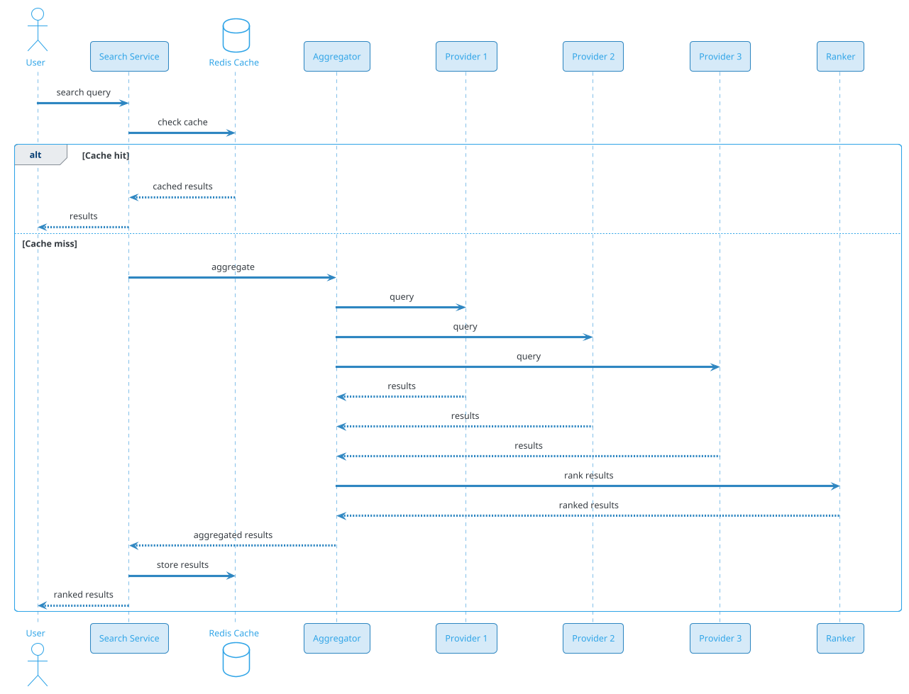
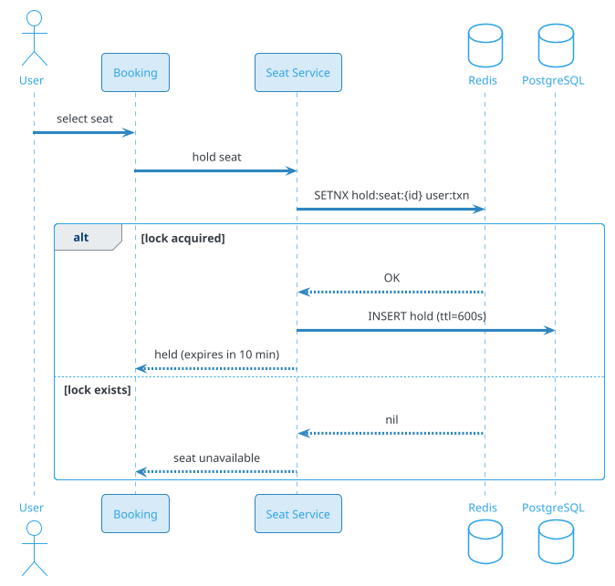
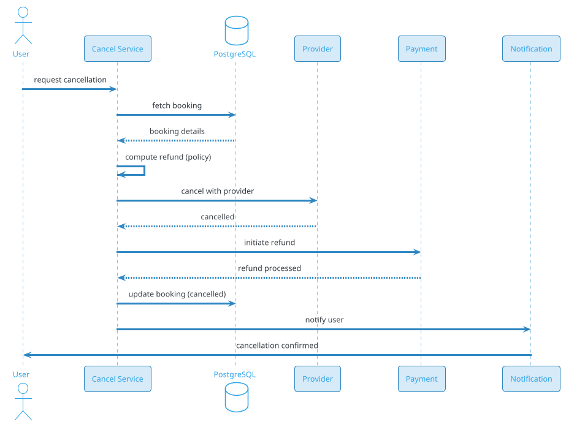

# Travel Booking (IRCTC / Air India / Expedia / MakeMyTrip)

## Problem Statement

Design a travel booking platform like IRCTC, Air India, Expedia, or MakeMyTrip. Users search for flights/trains/buses, compare prices, select seats, book tickets, pay, and receive confirmations. The system must handle huge concurrent traffic during tatkal/sales, integrate with multiple inventory providers (airlines, railways, buses), prevent double-booking, process payments, and handle cancellations/refunds. Travel booking is one of the highest-concurrency transactional systems — IRCTC handles 25M+ bookings/day at peak.

**Example:**

```
Booking flow:
  1. Priya searches: "Mumbai to Delhi, Sept 25, 2 passengers"
  2. System queries multiple providers (IndiGo, Air India, SpiceJet)
  3. Shows 50 results, sorted by price/time
  4. Selects IndiGo 6E-204, 10:00 AM, ₹5,500/person
  5. Views seat map, picks 2 adjacent seats (12A, 12B)
  6. Enters passenger details (name, age, ID)
  7. Selects payment (UPI)
  8. Applies coupon: ₹500 off
  9. Confirms → seats held for 10 min
 10. Payment processed
 11. PNR generated
 12. Ticket emailed/SMSed
 13. Web check-in 24h before
 14. Cancellation if needed → refund

Behind the scenes:
  - Aggregated search across providers
  - Real-time availability
  - Seat map caching
  - Seat hold (10 min during payment)
  - Booking with provider (API call)
  - PNR generation
  - Payment processing
  - Ticket delivery
  - Cancellation + refund
  - Reconciliation with providers

Key challenges:
  - Multi-provider integration (GDS, direct APIs)
  - Real-time availability
  - Seat hold (prevent double-booking)
  - Peak load (tatkal: 100K bookings/sec)
  - Payment integration
  - Cancellation + refund
  - Reconciliation
  - PNR lifecycle
  - Multi-modal (flight, train, bus, hotel)

Scale:
  - 500M users
  - 50M DAU
  - 25M bookings/day (~289/sec avg, 5,000/sec peak)
  - Tatkal peak: 100K bookings/sec (IRCTC)
  - 1B searches/day
  - 50 providers integrated
  - 10M seats/day
```

**Real-world systems:** IRCTC, Air India, Expedia, MakeMyTrip, Booking.com, Kayak, Skyscanner, Cleartrip, Yatra, Goibibo.

**Why it's interesting:**

- **Multi-provider** — each with different APIs (REST, SOAP, GDS)
- **Real-time inventory** — seats sell out fast
- **Seat hold** — temporary reservation during payment
- **Peak concurrency** — tatkal is a legendary spike
- **Double-booking** — must prevent
- **Payments** — large amounts, various methods
- **Cancellation + refund** — complex policies
- **Reconciliation** — with airlines/railways
- **PNR** — unique booking reference
- **Compliance** — DGCA (aviation), Indian Railways

---

## 1. Requirements Clarification

### Functional Requirements
- **Search**: Flights, trains, buses, hotels
- **Filters**: Price, time, duration, stops, airline
- **Compare**: Side-by-side options
- **Seat selection**: Map, preferences
- **Booking**: Passenger details, contact
- **Payment**: Multiple methods
- **PNR generation**: Unique reference
- **Ticketing**: Email, SMS, app
- **Cancellation**: Refund per policy
- **Modification**: Date, seat change
- **Check-in**: Online, at counter
- **Boarding pass**: QR code
- **Multi-passenger**: Group bookings
- **Multi-city**: Complex itineraries
- **Refund status**: Tracking

### Non-Functional Requirements
- **Scale**: 50M DAU, 25M bookings/day, 100K bookings/sec peak
- **Latency**: Search < 2 sec; booking < 5 sec
- **Availability**: 99.99%
- **Consistency**: Strong for booking (no double-book)
- **Durability**: Never lose a booking
- **Peak**: 100x normal (tatkal, sales)
- **Security**: PCI-DSS, encryption
- **Compliance**: DGCA, IRCTC rules, GDPR

### Out of Scope
- Hotel booking (separate problem)
- Car rental
- Travel insurance (mentioned)
- Visa processing

---

## 2. Back-of-Envelope Estimation

### Traffic

```
Given:
  Users                = 500,000,000
  DAU                  = 50,000,000
  Searches/day         = 1,000,000,000
  Bookings/day         = 25,000,000
  Peak multiplier      = 20x (normal), 100x (tatkal)

Average QPS:
  Searches = 1B / 86,400 = ~11,574/sec
  Bookings = 25M / 86,400 = ~289/sec
  Reads (status) = 5B / 86,400 = ~57,870/sec
  Total: ~70K ops/sec

Peak QPS:
  Searches = ~231,480/sec (normal peak)
  Bookings = ~5,787/sec
  Tatkal: ~100K bookings/sec (extreme)

Tatkal (IRCTC 10 AM):
  Millions of users refreshing simultaneously
  100K booking attempts/sec
  99.9% fail (no seats)
```

### Storage

```
Users:
  500M x 5 KB (profile, ID, preferences) = ~2.5 TB

Bookings:
  25M/day x 365 x 5 = 45.6B bookings
  Per booking: ~5 KB (passengers, seats, segments) = ~228 TB

Passengers:
  45.6B x 1.5 avg x 500 bytes = ~34 TB

Payments:
  45.6B x 500 bytes = ~23 TB

Search cache:
  1B searches x 50 KB (results) = ~50 TB (Redis, transient)

Seat maps:
  10M flight/route configurations x 50 KB = ~500 GB

Cancellations:
  45.6B x 20% x 1 KB = ~9 TB

Refunds:
  9B x 500 bytes = ~4.5 TB

Provider data:
  Airlines, trains, buses: ~100 GB

Analytics:
  1B searches x 500 bytes = ~500 GB/day
  5 years: ~912 TB

Total hot: ~100 GB
Total cold: ~2 PB
```

### Bandwidth

```
Search requests:
  231,480/sec x 1 KB = ~231 MB/sec = ~1.85 Gbps
  Peak: ~9 Gbps

Search responses:
  231,480/sec x 100 KB = ~23 GB/sec = ~185 Gbps
  Peak: ~925 Gbps (huge!)

Booking:
  5,787/sec x 5 KB = ~29 MB/sec
  Peak: ~145 MB/sec

Total: ~1 Tbps peak (search responses dominate)
```

### Latency Budget

```
Search (aggregated):
  Client → API:                 ~50 ms
  Auth:                          ~10 ms
  Parse query:                   ~10 ms
  Call providers (parallel):     ~1000 ms
  Aggregate + rank:              ~50 ms
  Return:                        ~50 ms
  Total:                         ~1.2 sec

Target: < 2 sec.

Booking:
  Client → API:                 ~50 ms
  Idempotency check:             ~10 ms
  Validate seat availability:    ~100 ms
  Hold seat:                     ~200 ms
  Payment:                       ~1500 ms
  Provider booking:              ~500 ms
  PNR generation:                ~50 ms
  Confirm:                       ~100 ms
  Total:                         ~2.5 sec

Target: < 5 sec.
```

---

## 3. High-Level Design

```d2
direction: down

user: User {shape: person}
provider: "External Provider" {shape: cloud}
airline: "Airline API" {shape: cloud}
railway: "Railway API" {shape: cloud}

cdn: CDN {shape: cloud}
lb: Load Balancer {shape: hexagon}
api: API Gateway {shape: hexagon}

search: Search Service {shape: rectangle}
agg: "Aggregator Service" {shape: rectangle}
seat: "Seat Service" {shape: rectangle}
book: Booking Service {shape: rectangle}
pay: Payment Service {shape: rectangle}
pnr: PNR Service {shape: rectangle}
cancel: Cancellation Service {shape: rectangle}
notif: Notification Service {shape: rectangle}
recon: Reconciliation Service {shape: rectangle}

kafka: Kafka {shape: queue}

pdb: "PostgreSQL (bookings, users)" {shape: cylinder}
redis: "Redis (cache, holds)" {shape: cylinder}
cass: "Cassandra (search logs)" {shape: cylinder}
ch: "ClickHouse (analytics)" {shape: cylinder}
s3: "S3 (tickets, PNR)" {shape: cylinder}
es: "Elasticsearch (search)" {shape: cylinder}

user -> cdn
cdn -> lb
lb -> api

api -> search
api -> book
api -> cancel

search -> agg
agg -> provider
agg -> airline
agg -> railway

book -> seat
book -> pay
book -> pnr
book -> provider

seat -> redis
book -> pdb
cancel -> pdb
cancel -> provider

kafka -> notif
kafka -> ch
kafka -> recon
```

### Component Responsibilities

| Component | Role |
|---|---|
| CDN | Static assets |
| Load Balancer | Route to API |
| API Gateway | Auth, rate limiting |
| Search Service | Parse queries, orchestrate aggregation |
| Aggregator Service | Call providers, aggregate results |
| Seat Service | Seat maps, holds |
| Booking Service | Orchestrate booking |
| Payment Service | Process payments |
| PNR Service | Generate PNR, store booking |
| Cancellation Service | Handle cancellations, refunds |
| Notification Service | Email, SMS, push |
| Reconciliation Service | Match with providers |
| PostgreSQL | Bookings, users |
| Redis | Cache, seat holds |
| Cassandra | Search logs |
| ClickHouse | Analytics |
| S3 | Tickets, PNR documents |
| Elasticsearch | Search index |

### Why This Architecture

- **Aggregator** for multi-provider search
- **Redis** for seat holds (TTL-based)
- **PostgreSQL** for bookings (ACID)
- **Kafka** for async events
- **ClickHouse** for analytics
- **Separate PNR service** for unique ID generation

---

## 4. Deep Dive: Multi-Provider Search

### The Challenge

Search must query multiple providers:
- **Airlines**: IndiGo, Air India, SpiceJet (direct APIs)
- **GDS**: Amadeus, Sabre, Travelport
- **Railways**: IRCTC
- **Buses**: RedBus, state transport
- **OTAs**: Expedia, Booking.com

Each has different:
- **API style**: REST, SOAP, GDS
- **Response time**: 100 ms - 5 sec
- **Data format**: JSON, XML, proprietary
- **Rate limits**: 10-1000 QPS
- **Cost**: Per call

### Aggregation Flow



### Provider Adapter

Each provider has an adapter:
```java
public interface ProviderAdapter {
    SearchResponse search(SearchQuery query);
    BookingResponse book(BookingRequest request);
    CancelResponse cancel(CancelRequest request);
}

@Component
public class IndigoAdapter implements ProviderAdapter {
    public SearchResponse search(SearchQuery query) {
        // Convert to IndiGo format
        // Call IndiGo API
        // Convert response
    }
}
```

### Timeout Handling

- **Per provider**: 2 sec timeout
- **Overall**: 3 sec for search
- **Partial results**: Return what came back
- **Fast providers**: 10x more often

### Caching

- **Popular routes**: 5 min TTL
- **Cache key**: hash of query
- **Invalidation**: On price change
- **Hit ratio**: 60-70%

### Ranking

- **Price** (30%)
- **Duration** (20%)
- **Stops** (15%)
- **Airline quality** (15%)
- **User preference** (10%)
- **Freshness** (10%)

### Search Scale

```
1B searches/day
= ~11,574/sec avg
= ~231,480/sec peak

Per search:
  3-5 provider calls
  Parallel execution: ~1 sec
  Rank: ~50 ms
  
Search Service: ~1000 instances
Aggregator: ~500 instances
```

---

## 5. Deep Dive: Seat Hold (Preventing Double-Booking)

### The Problem

User selects seat, proceeds to payment. During payment (2-5 min), another user could book the same seat.

**Solution:** **Seat hold** — temporary reservation.

### Hold Flow



### Hold Storage

**Redis:**
```
Key: hold:seat:{flight_id}:{seat_number}
Value: {user_id, transaction_id, expires_at}
TTL: 600 sec (10 min)
```

**PostgreSQL (audit):**
```sql
CREATE TABLE seat_holds (
    hold_id BIGINT PRIMARY KEY,
    flight_id BIGINT,
    seat_number VARCHAR(10),
    user_id BIGINT,
    transaction_id BIGINT,
    expires_at TIMESTAMPTZ,
    status VARCHAR(20),  -- held, confirmed, expired, released
    created_at TIMESTAMP DEFAULT NOW()
);
```

### Hold Lifecycle

1. **User selects seat** → Hold created (10 min)
2. **User pays** → Confirm hold
3. **User abandons** → Hold expires (10 min)
4. **Payment fails** → Release hold
5. **User cancels** → Release hold

### Distributed Lock

**Why distributed?** Multiple booking servers.

**Redis SET NX** is atomic:
```
SET hold:seat:{id} {user_id} NX EX 600
```

**Only one user gets the lock.**

### Hold Conflict

If user A holds seat, user B tries:
- B's `SET NX` returns nil
- B sees "seat unavailable"
- B picks different seat

### Hold Cleanup

- **TTL**: Redis auto-expires after 600 sec
- **Background job**: Cleans expired holds in PostgreSQL
- **On expire**: Release inventory (if applicable)

### Bulk Hold

For group bookings (multiple seats):
- Hold all seats atomically (Lua script)
- If any fails, release all

**Lua script:**
```lua
for i, key in ipairs(KEYS) do
    if redis.call('EXISTS', key) == 1 then
        return 0  -- rollback
    end
end
for i, key in ipairs(KEYS) do
    redis.call('SET', key, ARGV[1], 'EX', ARGV[2])
end
return 1
```

### Tatkal Special

For IRCTC tatkal (10 AM rush):
- **Millions of users** trying to book simultaneously
- **Holds** are critical
- **Redis cluster** handles ~1M ops/sec
- **Queue** users if overloaded
- **Rate limit** per user (1 booking)

### Seat Hold Scale

```
5,000 bookings/sec (peak)
Each holds 2 seats = 10,000 holds/sec
Hold TTL: 10 min = 6M active holds

Redis: 20 shards x 300K holds
```

---

## 6. Deep Dive: Booking Flow

### Booking States

```
SEARCHED → SELECTED → HELD → PAYMENT_INITIATED → PAID → 
CONFIRMED → TICKETED → CHECKED_IN → FLOWN
                              ↓
                          CANCELLED → REFUNDED
```

### Booking Data Model

```json
{
  "booking_id": "bkg-123",
  "user_id": "u-456",
  "pnr": "ABC123",
  "status": "confirmed",
  "type": "flight",
  "provider": "indigo",
  "segments": [
    {
      "flight_number": "6E-204",
      "from": "BOM",
      "to": "DEL",
      "departure": "2026-09-25T10:00:00+05:30",
      "arrival": "2026-09-25T12:15:00+05:30",
      "aircraft": "A320",
      "seat": "12A",
      "class": "economy"
    }
  ],
  "passengers": [
    {"name": "Priya Patel", "age": 28, "gender": "F", "id": "..."},
    {"name": "Rahul Patel", "age": 30, "gender": "M", "id": "..."}
  ],
  "contact": {"email": "...", "phone": "..."},
  "fare": {
    "base_cents": 1100000,
    "taxes_cents": 200000,
    "total_cents": 1300000
  },
  "payment_id": "pay-789",
  "booked_at": "2026-09-19T10:00:00Z",
  "cancellation_policy": {...}
}
```

### Booking Flow Steps

1. **Validate**: User, seats still available
2. **Hold seats**: Already held
3. **Confirm hold**: Convert hold to booking
4. **Call provider**: Book with airline
5. **Provider confirms**: Returns PNR
6. **Store booking**: PostgreSQL
7. **Payment capture**: Charge user
8. **Generate ticket**: PDF in S3
9. **Notify**: Email, SMS, push
10. **Release seat hold**: Convert to confirmed

### Idempotency

- **Client**: UUID per booking attempt
- **Server**: Store `idem_key → booking_id`
- **On retry**: Return same booking

### Payment Integration

- **Multiple methods**: UPI, card, netbanking, wallet
- **3D Secure**: For cards
- **Timeout**: 5 min per payment
- **Retry**: Different method

### PNR Generation

**PNR** = Passenger Name Record (6-character alphanumeric).

**Requirements:**
- Unique globally
- Not predictable (security)
- 6 characters (62^6 = 56B combinations)

**Algorithm:**
```
pnr = base62(hash(user_id, booking_id, timestamp))
```

**Storage:**
```sql
CREATE TABLE pnrs (
    pnr VARCHAR(10) PRIMARY KEY,
    booking_id BIGINT UNIQUE NOT NULL,
    created_at TIMESTAMP DEFAULT NOW()
);
```

### Booking Scale

```
25M bookings/day
= ~289/sec avg
= ~5,787/sec peak
Tatkal: ~100K/sec (extreme)

Booking Service: ~100 instances
```

---

## 7. Deep Dive: Cancellation and Refund

### Cancellation Policies

Different per airline/class:
- **Full refund**: > 24 hours before
- **Partial**: < 24 hours (fee deducted)
- **No refund**: < 2 hours or no-show

### Cancellation Flow



### Refund Calculation

```
refund_amount = paid_amount - cancellation_fee

Where:
  cancellation_fee depends on:
  - Time before departure
  - Fare type (refundable, non-refundable)
  - Airline policy
  - Class (economy, business)
```

### Refund Methods

- **Original payment method**: Default
- **Wallet**: Instant (if user opts)
- **Bank transfer**: For cash bookings

### Refund Timeline

- **Instant**: To wallet
- **2-3 days**: Card refund
- **5-7 days**: Bank transfer

### Partial Cancellation

For multi-passenger bookings:
- Cancel one passenger
- Refund partial amount
- Remaining passengers unaffected

### No-Show

- No refund (usually)
- Some policies allow rebooking (fee)

### Cancellation Scale

```
~20% cancellation rate
5M cancellations/day
= ~58/sec avg
= ~290/sec peak

Cancel Service: ~20 instances
```

### Disputes

- User disputes fee
- Support reviews
- Manual refund (exception)
- Track patterns (frequent disputers)

---

## 8. Deep Dive: Peak Load (Tatkal)

### The IRCTC Tatkal Legend

- **10 AM daily**: Tatkal booking opens
- **Millions of users** simultaneously
- **100K+ booking attempts/sec**
- **99.9% fail** (limited seats)
- **Site often crashes** (legacy system)

### Handling the Spike

**1. Virtual Waiting Room:**
- All users enter queue
- Served in batches (e.g., 1000 at a time)
- Position shown
- Fair ordering

**2. Pre-warm:**
- Load data before 10 AM
- Cache availability
- Pre-authenticate users

**3. Rate Limiting:**
- 1 booking per user
- Per IP limits
- CAPTCHA

**4. Queue Orders:**
- Accept requests
- Process at controlled rate
- Notify result

**5. Graceful Degradation:**
- Disable search for non-essential
- Read-only for non-bookers
- Focus on booking flow

### Virtual Waiting Room

```
1. User enters at 9:55 AM
2. Added to Redis queue (ZADD timestamp)
3. Position: ZRANK
4. Every 5 sec: check if at front
5. If yes: issue token (valid 5 min)
6. Token required for booking API
7. After 5 min: expire, re-queue
```

### Redis Queue

```
Key: tatkal:queue:{date}
Type: Sorted Set
Score: timestamp
Value: user_id

ZADD queue:{date} {timestamp} user-123
ZRANK queue:{date} user-123  → position
ZRANGE queue:{date} 0 999    → first 1000
ZREM queue:{date} user-123
```

### Token System

```
1. When user is at front, generate token
2. Token = UUID, stored in Redis
3. User includes token in booking request
4. Server validates token before booking
5. Token expires after 5 min
6. User must complete booking before expiry
```

### Capacity Planning

For tatkal:
- **Normal**: 100 servers
- **Tatkal**: 1,000 servers (10x)
- **Auto-scale**: Pre-warm 30 min before
- **Load balancer**: Distribute
- **DB**: Shard, cache

### Peak Scale

```
Normal: 5,000 bookings/sec
Tatkal: 100,000 attempts/sec
Success: ~1,000/sec (limited seats)

Virtual queue: 10M users in queue
Processed: ~10,000 users/min
Duration: ~16 hours to clear (not practical)

Better: Limit queue size, prioritize
```

### Fallback

- **Site down**: SMS-based backup? (rare)
- **Alternate**: Authorized agents
- **Fair**: First-come, first-served

---

## 9. Deep Dive: Reconciliation

### Why Reconciliation?

Bookings involve:
- **Provider** (airline, railway)
- **Payment gateway**
- **Internal system**

If any doesn't agree, disputes arise.

### Reconciliation Types

1. **Booking reconciliation**: Internal vs provider
2. **Payment reconciliation**: Internal vs gateway
3. **Refund reconciliation**: Internal vs gateway

### Reconciliation Flow

```
1. Daily at 2 AM:
   - Fetch provider bookings (yesterday)
   - Fetch internal bookings (yesterday)
   - Match by PNR
2. Categorize:
   - Matched: Both agree
   - Missing in provider: Internal has, provider doesn't
   - Missing internally: Provider has, we don't
   - Amount mismatch: Different amounts
3. Auto-resolve simple cases
4. Escalate complex
5. Report
```

### Handling Discrepancies

| Case | Action |
|---|---|
| Missing in provider | Retry booking; if still missing, cancel + refund |
| Missing internally | Investigate; recreate if confirmed |
| Amount mismatch | Investigate; correct |
| Duplicate | Cancel duplicate; refund |

### Reconciliation Scale

```
25M bookings/day
Recon: ~25M comparisons
Duration: ~2 hours
Workers: ~50
```

### Provider Reports

- **Daily**: From each provider
- **Format**: CSV, API, FTP
- **Delay**: 1-2 days for some
- **Discrepancies**: Common (need resolution)

---

## 10. Deep Dive: Multi-Modal Integration

### Modes

- **Flights**: Airlines (IndiGo, Air India, SpiceJet)
- **Trains**: IRCTC
- **Buses**: RedBus, state transport
- **Cabs**: Ola, Uber (integration)
- **Hotels**: Booking.com, Agoda

### Integration Patterns

| Mode | API Style | Latency | Rate Limit |
|---|---|---|---|
| Flights | REST/GDS | 500 ms - 2 sec | 100-1000 QPS |
| Trains | SOAP/REST | 1-3 sec | 10 QPS |
| Buses | REST | 300 ms | 500 QPS |
| Cabs | REST | 200 ms | 100 QPS |
| Hotels | REST | 500 ms | 1000 QPS |

### Adapter Architecture

Each provider has:
- **Adapter class**: Converts formats
- **Circuit breaker**: Fails fast
- **Rate limiter**: Respects provider limits
- **Retry logic**: Exponential backoff
- **Monitoring**: Per-provider metrics

### Circuit Breaker

If provider fails:
- **Open**: Stop calling
- **Half-open**: Try one
- **Closed**: Resume normal

**Prevents cascading failures.**

### Multi-Modal Booking

For complex trips:
- Flight + Hotel + Cab
- Sequential booking
- Partial failure handling
- Rollback if needed

### Cross-Modal Search

- **Flight + Train**: Mumbai → Delhi → Agra
- **Compare combos**: Price, time
- **Complex optimization**

### Provider Scale

```
50 providers integrated
Per provider: 10-100 QPS
Total: ~1000 QPS aggregate

Aggregator: Handles all
```

---

## 11. Deep Dive: PNR and Ticketing

### PNR Lifecycle

1. **Generated**: On booking confirmation
2. **Stored**: In PostgreSQL + provider
3. **Sent**: Email, SMS, app
4. **Checked in**: 24-48h before
5. **Boarding pass**: Generated
6. **Flown**: Status updated
7. **Archived**: After travel

### PNR Model

```json
{
  "pnr": "ABC123",
  "booking_id": "bkg-123",
  "provider_pnr": "6E-XYZ",
  "status": "confirmed",
  "passengers": [...],
  "segments": [...],
  "fare": {...},
  "check_in_opens": "2026-09-24T10:00:00Z",
  "boarding_pass_url": "s3://tickets/bkg-123.pdf",
  "created_at": "2026-09-19T10:00:00Z"
}
```

### Ticketing

**Ticket PDF contains:**
- PNR, booking ID
- Passenger names
- Flight/train details
- Seat numbers
- QR code (for scanning)
- Terms & conditions

**Generated:** After booking confirmation.
**Stored:** S3, CDN for download.
**Emailed:** To contact email.
**SMS:** Link to download.

### Check-In

- **Online**: 24-48h before (airline-specific)
- **Mobile**: App-based
- **Counter**: At airport
- **Web**: Airline website
- **Auto check-in**: If opted

### Boarding Pass

- **QR code**: For scanning
- **Gate**: Assigned
- **Seat**: Confirmed
- **Boarding time**: 30 min before

### PNR Modification

- **Date change**: Fee + fare difference
- **Name change**: Restrictions
- **Seat change**: Fee
- **Class upgrade**: Fee

### Ticketing Scale

```
25M tickets/day
PDF size: ~200 KB
= ~5 TB/day of tickets
= ~1.8 PB/year

S3 storage with lifecycle (delete after 90 days)
CDN for download
```

---

## 12. Deep Dive: Payments

### Payment Methods

- **UPI** (India)
- **Credit/Debit card**
- **Netbanking**
- **Wallet** (platform, external)
- **EMI** (for large amounts)
- **Pay at counter** (some)
- **Corporate** (B2B)

### Payment Flow

```
1. User selects payment
2. Server creates payment intent
3. Redirect to gateway (or in-app)
4. User authorizes
5. Gateway processes
6. Webhook to server
7. Server confirms booking
8. Notify user
```

### Payment States

- **INITIATED**
- **PENDING** (bank)
- **SUCCESS**
- **FAILED**
- **REFUNDED**

### Idempotency

- Client sends UUID
- Server stores
- On duplicate: return existing

### 3D Secure

For cards:
- Bank authentication
- OTP to phone
- Extra security

### Payment Retries

- **Failure**: Retry with different card
- **Timeout**: Query gateway
- **Success but no webhook**: Reconcile

### Payment Scale

```
25M bookings/day
= ~289/sec avg
= ~5,787/sec peak

Per payment: ~1-2 sec
Concurrent: ~500 in flight
Payment Service: ~50 instances
```

### Refunds

- **On cancellation**
- **Within 7 days**
- **To original method**
- **Wallet**: Instant

### Reconciliation

- **Daily**: Payments vs gateway
- **Discrepancies**: Manual review
- **Chargebacks**: Handle

---

## 13. Scaling Considerations

### Read Scaling

- **CDN** for static assets
- **Redis** for cache, holds
- **Read replicas** for PostgreSQL
- **Elasticsearch** for search

### Write Scaling

- **Kafka** for events
- **PostgreSQL** sharded for bookings
- **Redis** for holds

### Sharding

**PostgreSQL:** Shard by `user_id`.
**Redis:** Shard by `flight_id` (holds) or `user_id` (sessions).
**Kafka:** Partition by `user_id`.

### Multi-Region

- **Per-region** deployments
- **Data residency** (GDPR, DPDP)
- **Local providers** integrated per region

### Peak Handling

- **Tatkal**: 100x (see deep dive)
- **Festivals**: 5x
- **Holidays**: 10x

**Mitigations:**
- Virtual queue
- Auto-scale
- Rate limit
- Pre-warm

### Cost Optimization

| Component | Optimization |
|---|---|
| Search | Cache popular routes |
| Holds | Redis TTL, cluster |
| Compute | Auto-scale (spot for peak) |
| Storage | Tiering |
| Provider calls | Cache, batch |

---

## 14. Bottlenecks and Trade-offs

| Concern | Solution | Trade-off |
|---|---|---|
| Multi-provider | Adapter pattern | Complexity |
| Seat hold | Redis SET NX | TTL management |
| Double-book | Distributed lock | Latency |
| Tatkal peak | Virtual queue | UX |
| Payment | External gateway | Dependency |
| Cancellation | Policy + refund | Manual edge cases |
| Reconciliation | Daily batch | Delay |

### Design Decisions Summary

| Decision | Choice | Rationale |
|---|---|---|
| Search | Aggregator | Multi-provider |
| Seat hold | Redis | Fast, TTL |
| Bookings | PostgreSQL (sharded) | ACID |
| PNR | Separate service | Unique generation |
| Payment | External gateway | PCI compliance |
| Events | Kafka | Decoupled |
| Analytics | ClickHouse | Fast |
| Tatkal | Virtual queue | Fair, protects system |

---

## 15. Failure Scenarios

### Search Service Down

**Impact:** Can't search.

**Mitigation:**
- Multi-instance
- Cache serves popular routes
- Alert ops

### Provider API Down

**Impact:** Results from that provider missing.

**Mitigation:**
- Circuit breaker
- Other providers serve
- Alert ops

### Seat Hold Service Down

**Impact:** Can't hold seats.

**Mitigation:**
- Redis cluster (HA)
- Fallback (without hold)
- Alert ops

### Booking Service Down

**Impact:** Can't book.

**Mitigation:**
- Queue in Kafka
- Auto-scale
- Alert ops

### Payment Gateway Down

**Impact:** Can't pay.

**Mitigation:**
- Fallback gateway
- Queue
- Alert ops

### PostgreSQL Down

**Impact:** Bookings unavailable.

**Mitigation:**
- Multi-AZ failover
- Read replicas
- Alert ops

### Tatkal Overload

**Impact:** Site crashes.

**Mitigation:**
- Virtual queue
- Rate limit
- Auto-scale (pre-warm)
- Alert ops

### Double-Booking

**Impact:** Two bookings, one seat.

**Mitigation:**
- Distributed lock (prevents)
- Reconciliation (catches)
- Refund + apology
- Alert ops

### PNR Collision

**Impact:** Duplicate PNR.

**Mitigation:**
- Random generation (low probability)
- Unique constraint
- Retry

### Data Breach

**Impact:** User data exposed.

**Mitigation:**
- Encryption
- Access controls
- Incident response
- Notify users

### DDoS

**Impact:** Service unavailable.

**Mitigation:**
- CDN/WAF
- Rate limiting
- Anycast
- Alert ops

---

## 16. Monitoring and Alerts

### Key Metrics

| Metric | Target | Alert Threshold |
|---|---|---|
| Search p99 | < 2 sec | > 4 sec |
| Booking p99 | < 5 sec | > 10 sec |
| Seat hold p99 | < 200 ms | > 500 ms |
| Payment success | > 95% | < 90% |
| PNR generation | < 100 ms | > 500 ms |
| Provider success | > 99% | < 95% |
| Double-booking | 0 | > 0.01% |
| Cancellation p99 | < 3 sec | > 10 sec |
| Refund p99 | < 24 hours | > 72 hours |
| Peak QPS | baseline | > 10x |
| Error rate | < 0.1% | > 1% |

### Dashboards

- **Traffic**: Searches/sec, bookings/sec
- **Latency**: p50/p95/p99 per operation
- **Providers**: Success rate per provider
- **Holds**: Active, expired, confirmed
- **Payments**: Success, failures
- **Cancellations**: Rate, refund status
- **Tatkal**: Queue size, throughput
- **Infrastructure**: DB, Redis, Kafka
- **Business**: Bookings, revenue, cancel rate

### Alerts

- **P0**: Booking down, double-booking, data breach
- **P1**: Search p99 > 4 sec, payment < 90%
- **P2**: Provider failure, high cancellations
- **P3**: Slow PNR, refund delay

### Business KPIs

- **DAU/MAU** ratio
- **Bookings per DAU**
- **Search-to-booking** rate
- **Cancellation rate**
- **Refund time**
- **Repeat booking** rate
- **NPS**

---

## 17. Cost Estimation

Rough monthly cost (AWS, us-east-1) for 50M DAU:

| Component | Spec | Cost/month |
|---|---|---|
| API servers | 500 x c6g.large | ~$30,000 |
| Search Service | 1000 x c6g.large | ~$60,000 |
| Booking Service | 200 x c6g.2xlarge | ~$48,000 |
| Aggregator | 500 x c6g.large | ~$30,000 |
| PostgreSQL | 20 shards x db.r6g.4xlarge | ~$95,000 |
| Read replicas | 40 x db.r6g.2xlarge | ~$84,000 |
| Redis cluster | 100 x cache.r6g.2xlarge | ~$50,000 |
| Cassandra | 20 x i3.2xlarge | ~$20,000 |
| Kafka (MSK) | 30 brokers | ~$15,000 |
| ClickHouse | 20 x i3.2xlarge | ~$20,000 |
| Elasticsearch | 30 x r6g.2xlarge | ~$54,000 |
| S3 (tickets) | 100 TB | ~$2,300 |
| CDN | 100 TB/month | ~$8,500 |
| Provider APIs | Variable | Variable |
| Monitoring | Datadog | ~$50,000 |
| **Total** | | **~$567,000/month** |

**Per user:** ~$0.011/month.

**Cost breakdown:**
- **Compute**: ~35%
- **Databases**: ~35%
- **Search**: ~10%
- **Other**: ~20%

**Revenue note:** Booking fees + commissions cover costs.

---

## 18. Extensions and Follow-ups

### Flight + Hotel Bundles

- Package deals
- Discounted rates
- Combined booking

### Multi-City

- Complex itineraries
- Multiple segments
- Optimized routing

### Group Bookings

- 10+ passengers
- Group discounts
- Seat blocks

### Corporate Travel

- Company accounts
- Policy compliance
- Expense integration

### Loyalty Programs

- Miles/points
- Tier benefits
- Redemptions

### Travel Insurance

- Optional add-on
- Coverage
- Claims

### Visa Assistance

- Document checklists
- Application tracking
- Partner integrations

### Currency

- Multi-currency display
- FX conversion
- Local payments

### Chatbot / Voice

- Booking by voice
- Chatbot assistance
- 24/7 support

### AI Recommendations

- Best options
- Personalized
- Price predictions

### Price Alerts

- Track routes
- Notify on drop
- Historical trends

### Flexibility

- Free cancellation
- Date change
- Refundable fares

### Sustainability

- Carbon footprint
- Green options
- Offset programs

### Web3

- Blockchain tickets
- NFT
- Rare

---

## 19. Summary

| Aspect | Decision |
|---|---|
| Search | Aggregator (parallel providers) |
| Seat hold | Redis SET NX (TTL) |
| Bookings | PostgreSQL (sharded by user_id) |
| PNR | Separate service (unique generation) |
| Payment | External gateway (PCI compliance) |
| Cancellation | Policy + refund |
| Events | Kafka |
| Analytics | ClickHouse |
| Tatkal | Virtual queue |
| Multi-region | Per-region (data residency) |
| Scale | 50M DAU, 25M bookings/day, 100K/sec tatkal peak |
| Latency | Search < 2 sec, booking < 5 sec |
| Availability | 99.99% |
| Cost | ~$567K/month |

**Key takeaways:**

- **Multi-provider aggregation** — adapter pattern for different APIs
- **Seat hold via Redis SET NX** — prevents double-booking
- **Idempotency** — retries must not duplicate bookings
- **Virtual queue** for tatkal — protects backend, fair
- **PNR generation** — unique, secure, 6 characters
- **Cancellation policies** — complex, configurable
- **Reconciliation** daily with providers and payment
- **Peak (tatkal)** — 100x traffic; needs special handling
- **Payment gateway** — external, PCI-DSS
- **Multi-region** for data residency
- **Cost is tiny per user**; revenue from commissions

### Similar Pattern Problems

- Ride Booking — inventory (drivers), matching
- Food Delivery — inventory (restaurants), ordering
- Show Booking — seat selection, payment
- Hotel Booking — inventory (rooms)
- E-Commerce Checkout — cart, payment
- Ticketing Systems — inventory reservation
- Airline Reservation Systems (GDS)