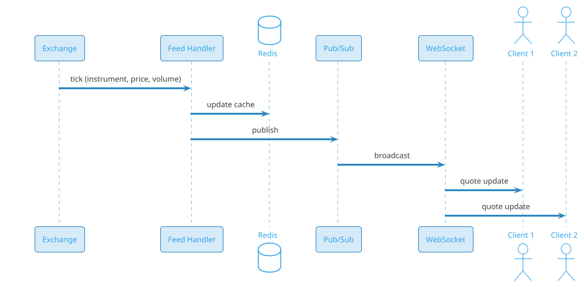
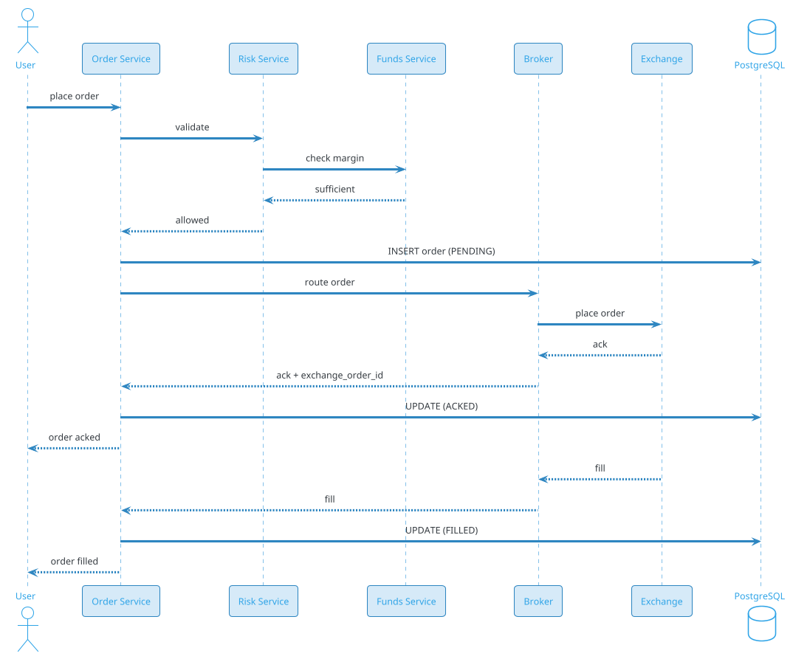
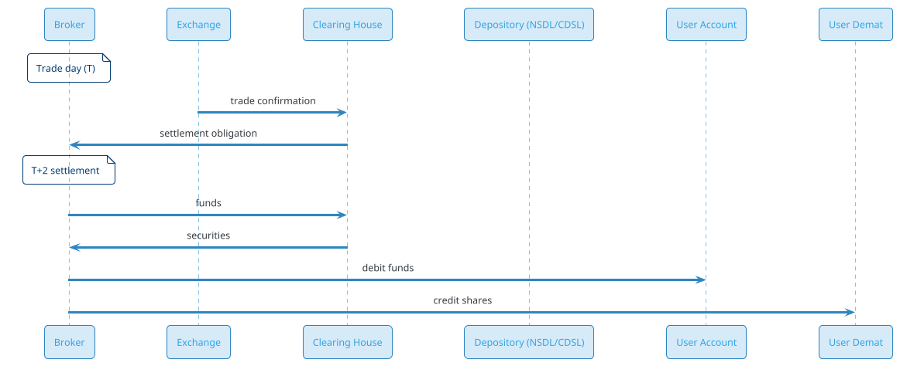

# Trading Platform (Zerodha / Groww / Robinhood)

## Problem Statement

Design a stock trading platform like Zerodha, Groww, Robinhood, or E*TRADE. Users view live market data, place buy/sell orders, track their portfolio, and manage funds. The system must match orders with sub-second latency, ensure correctness (money is at stake), handle millions of concurrent users during volatile markets, and comply with financial regulations (SEBI, SEC, FINRA). This is one of the most latency-sensitive systems — microseconds matter.

**Example:**

```
Trading flow:
  1. Priya opens Zerodha at 9:15 AM (market open)
  2. Views live quotes for RELIANCE (₹2,450, +1.2%)
  3. Places a buy order: 10 shares @ ₹2,450 (limit order)
  4. Order sent to exchange (NSE)
  5. Order matched in ~10 ms
  6. Trade executed: 10 shares @ ₹2,450
  7. Portfolio updated
  8. Order confirmation via app
  9. End of day: settlement (T+2)
 10. Funds debited

Behind the scenes:
  - Live market data (WebSocket, millions of ticks/sec)
  - Order placement (validation, risk check)
  - Order routing to exchange
  - Matching (at exchange, not our system)
  - Trade confirmation
  - Position/portfolio update
  - Fund management (balance, margin)
  - Settlement (T+2)
  - Reconciliation with exchange
  - Regulatory reporting

Key challenges:
  - Ultra-low latency (microseconds)
  - Live market data at scale
  - Order correctness (money at stake)
  - Risk management (margins, position limits)
  - Peak volatility (market crash: 100x)
  - Regulatory compliance (SEBI, SEC)
  - Settlement (T+2)
  - Reconciliation with exchange
  - Multi-asset (stocks, F&O, commodities)
  - 24/7 crypto (some platforms)

Scale:
  - 20M users
  - 5M DAU
  - 50M orders/day (~579/sec avg, 50K/sec peak)
  - 10M concurrent users (peak volatility)
  - 1B market data ticks/day
  - 100K instruments
  - NSE + BSE + MCX + NFO
```

**Real-world systems:** Zerodha, Groww, Robinhood, E*TRADE, Interactive Brokers, Upstox, Angel Broking, Webull, Coinbase.

**Why it's interesting:**

- **Ultra-low latency** — microseconds in HFT
- **Live market data** — millions of ticks/sec
- **Money at stake** — correctness non-negotiable
- **Risk management** — margins, position limits
- **Regulatory** — SEBI, SEC, FINRA, KYC, AML
- **Peak volatility** — market crash = 100x traffic
- **Settlement** — T+2 (exchange-controlled)
- **Multi-asset** — stocks, options, futures, commodities
- **Reconciliation** — daily with exchange
- **24/7 crypto** — different rules

---

## 1. Requirements Clarification

### Functional Requirements
- **Market data**: Live quotes, depth, trades
- **Search**: Find instruments
- **Order placement**: Market, limit, stop-loss
- **Order types**: Buy, sell, modify, cancel
- **Positions**: Current holdings, P&L
- **Portfolio**: Holdings, average price, current value
- **Funds**: Add, withdraw, balance
- **Watchlist**: Track instruments
- **Charts**: Historical + live
- **Alerts**: Price alerts
- **Statements**: Trade history, tax reports
- **Multi-asset**: Stocks, F&O, commodities, currency
- **Mobile + web + desktop**

### Non-Functional Requirements
- **Scale**: 20M users, 5M DAU, 50M orders/day
- **Latency**: Order placement < 100 ms; market data < 50 ms
- **Availability**: 99.99% during market hours
- **Consistency**: Strong for orders, positions
- **Durability**: Never lose an order
- **Risk**: Real-time margin checks
- **Compliance**: SEBI, SEC, KYC, AML, insider trading
- **Peak**: Market volatility (100x)
- **Security**: Encryption, 2FA

### Out of Scope
- Exchange matching engine (external)
- Clearing house
- Settlement system (exchange-controlled)
- HFT (co-located, specialized)

---

## 2. Back-of-Envelope Estimation

### Traffic

```
Given:
  Users                = 20,000,000
  DAU                  = 5,000,000
  Orders/day           = 50,000,000
  Market data ticks    = 1,000,000,000/day
  Concurrent users (peak) = 10,000,000
  Peak multiplier      = 10x (volatility)

Average QPS:
  Orders = 50M / 86,400 = ~579/sec
  Market data = 1B / 86,400 = ~11,574/sec
  Reads (portfolio) = 100M / 86,400 = ~1,157/sec
  Total: ~13K ops/sec

Peak QPS:
  Orders = ~5,790/sec (normal), ~50K/sec (volatility)
  Market data = ~115,740/sec (normal), ~1M/sec (peak)
  Reads = ~11,570/sec

Market data ticks (peak volatility):
  10M subscribers x 10 instruments each
  100 ticks/sec per instrument
  = ~10M msg/sec fan-out

This is HUGE — market data dominates.
```

### Storage

```
Orders:
  50M/day x 365 x 5 = 91.25B orders
  Per order: ~500 bytes = ~46 TB

Trades:
  91.25B trades
  Per trade: ~300 bytes = ~27 TB

Positions (current):
  20M users x 10 positions avg x 500 bytes = ~100 GB

Portfolio history:
  20M users x 365 x 5 x 10 positions = ~3.6T records
  Per record: ~200 bytes = ~730 TB

Market data (historical):
  1B ticks/day x 365 x 5 = 1.825T ticks
  Per tick: ~50 bytes = ~91 TB

Market data (live cache):
  100K instruments x 100 KB (depth) = ~10 GB (Redis)

Users:
  20M x 10 KB (KYC, funds) = ~200 GB

Funds ledger:
  Same as payments (double-entry)

Total hot: ~20 TB
Total cold: ~1 PB
```

### Bandwidth

```
Market data (fan-out):
  10M subscribers x 100 bytes/tick x 100 ticks/sec
  = ~100 GB/sec = ~800 Gbps

This is the DOMINANT cost.

Order placement:
  50K/sec x 500 bytes = ~25 MB/sec = ~200 Mbps

Total: ~800 Gbps peak
```

### Latency Budget

```
Order placement:
  Client → API:                 ~20 ms
  Auth:                          ~10 ms
  Validate (margin, limits):     ~20 ms
  Risk check:                    ~10 ms
  Route to exchange:             ~50 ms
  Exchange ack:                  ~20 ms
  Confirm to user:               ~20 ms
  Total:                         ~150 ms

Target: < 100 ms p99 (brokerage)
HFT: < 10 microseconds (co-located)

Market data:
  Exchange → Broker:             ~1 ms
  Broker → Client:               ~20-50 ms
  Total:                         ~50 ms

Target: < 50 ms p99 for market data.
```

---

## 3. High-Level Design

```d2
direction: down

user: User {shape: person}
exchange: "Exchange (NSE/BSE)" {shape: cloud}
broker: "Broker" {shape: cloud}
regulator: "Regulator (SEBI)" {shape: cloud}

cdn: CDN {shape: cloud}
lb: Load Balancer {shape: hexagon}
api: API Gateway {shape: hexagon}

market: "Market Data Service" {shape: rectangle}
order: "Order Service" {shape: rectangle}
risk: "Risk Service" {shape: rectangle}
position: "Position Service" {shape: rectangle}
funds: "Funds Service" {shape: rectangle}
portfolio: "Portfolio Service" {shape: rectangle}
trade: "Trade Service" {shape: rectangle}
recon: "Reconciliation Service" {shape: rectangle}
notif: "Notification Service" {shape: rectangle}

kafka: Kafka {shape: queue}

redis: "Redis (market data cache)" {shape: cylinder}
pdb: "PostgreSQL (orders, positions)" {shape: cylinder}
cass: "Cassandra (ticks, trades)" {shape: cylinder}
ch: "ClickHouse (analytics)" {shape: cylinder}
s3: "S3 (statements, reports)" {shape: cylinder}

user -> cdn
cdn -> lb
lb -> api

api -> market
api -> order
api -> portfolio
api -> funds
api -> position

market -> exchange
market -> redis
order -> risk
order -> broker
risk -> funds
order -> pdb
broker -> exchange

kafka -> notif
kafka -> ch
kafka -> recon
recon -> regulator
```

### Component Responsibilities

| Component | Role |
|---|---|
| CDN | Static assets |
| Load Balancer | Route to API |
| API Gateway | Auth, rate limiting |
| Market Data Service | Live quotes, depth, ticks |
| Order Service | Order placement, lifecycle |
| Risk Service | Margin, position limits |
| Position Service | Current positions, P&L |
| Funds Service | Balance, deposits, withdrawals |
| Portfolio Service | Holdings, valuation |
| Trade Service | Trade execution, history |
| Reconciliation Service | Match with exchange |
| Notification Service | Push, SMS, email |
| Redis | Market data cache, sessions |
| PostgreSQL | Orders, positions, users |
| Cassandra | Ticks, trades |
| ClickHouse | Analytics |
| S3 | Statements, reports |

### Why This Architecture

- **Redis** for live market data (sub-ms)
- **PostgreSQL** for orders, positions (ACID)
- **Cassandra** for ticks (write-heavy, time-series)
- **Kafka** for events (orders, trades, notifications)
- **ClickHouse** for analytics
- **Separate risk service** for real-time checks

---

## 4. Deep Dive: Market Data

### The Challenge

- **100K instruments** (stocks, options, futures)
- **100+ ticks/sec per instrument**
- **10M subscribers** (peak)
- **100M+ messages/sec fan-out**

### Market Data Flow



### Feed Handler

- **Connects** to exchange feed (binary protocol)
- **Parses** ticks (100K/sec)
- **Updates** Redis cache
- **Publishes** to pub/sub (Redis or Kafka)
- **Latency**: < 1 ms

### Redis Cache

```
Key: quote:{instrument_id}
Type: Hash
Fields: bid, ask, last, volume, oi, change, change_pct
TTL: 60 sec
```

**Update rate:** ~100K updates/sec (aggregated).

### Pub/Sub

- **Redis Pub/Sub**: For low latency (< 1 ms)
- **Kafka**: For durability + replay

**Use Redis for live, Kafka for history.**

### WebSocket Fan-Out

- **Client subscribes** to instruments
- **Server pushes** updates
- **Batching**: 10-100 ms (reduce messages)
- **Throttling**: 1 update / 100 ms per instrument

### Subscriptions

- **Per user**: Up to 100 instruments
- **Per instrument**: Millions of subscribers
- **Fan-out**: CDN-like pattern

### Market Data Scale

```
100K instruments x 100 ticks/sec = 10M updates/sec
10M subscribers x 10 instruments each = 100M subscriptions

Fan-out: 100M messages/sec peak
WebSocket servers: ~10,000
Redis: ~100 shards
```

### Historical Data

- **Cassandra** for ticks (time-series)
- **Query**: By instrument, date range
- **Retention**: 5 years
- **Compression**: 10x

### Snapshot vs Delta

- **Snapshot**: Full quote every N seconds
- **Delta**: Only changes
- **Full snapshot**: Every 30 sec

### Aggregation

- **L1 (best bid/ask)**: 1 level
- **L2 (depth)**: Top 5-10 levels
- **L3 (full book)**: Full order book (rare)

---

## 5. Deep Dive: Order Management

### Order Types

- **Market**: Execute at best price
- **Limit**: Execute at specified price or better
- **Stop-loss**: Trigger at price, then market
- **Stop-limit**: Trigger at price, then limit
- **Bracket**: With target + stop
- **Cover**: For short positions
- **AMO**: After market order
- **GTT**: Good till triggered

### Order States

```
PENDING → VALIDATING → ROUTED → ACKED (by exchange) → 
PARTIAL → FILLED → SETTLED
     ↓
  REJECTED (validation or exchange) / CANCELLED
```

### Order Data Model

```json
{
  "order_id": "ord-123",
  "user_id": "u-456",
  "instrument": "RELIANCE",
  "exchange": "NSE",
  "side": "BUY",
  "type": "LIMIT",
  "quantity": 10,
  "price": 245000,
  "filled_qty": 10,
  "avg_price": 245000,
  "status": "FILLED",
  "product": "CNC",
  "validity": "DAY",
  "placed_at": "2026-09-19T09:15:00Z",
  "updated_at": "2026-09-19T09:15:01Z",
  "exchange_order_id": "EX-789"
}
```

### Order Flow



### Order Validation

- **User**: Authenticated, KYC, active
- **Instrument**: Valid, trading
- **Quantity**: Within limits
- **Price**: Within circuit limits
- **Margin**: Sufficient funds
- **Position**: Within limits
- **Time**: Market hours

### Idempotency

- **Client**: UUID per order
- **Server**: Store `idem_key → order_id`
- **On retry**: Return same order

### Order Routing

- **Broker** (Zerodha) is a **member** of exchange
- **Routes** order to exchange via binary protocol
- **Low latency**: < 10 ms to exchange

### Order Modification

- **Modify price/qty**: Cancel + new
- **Cancel**: Before fill
- **Partial fill**: Remaining can be cancelled

### Order Scale

```
50M orders/day
= ~579/sec avg
= ~5,790/sec peak
Volatility: ~50K/sec peak

Order Service: ~200 instances
```

---

## 6. Deep Dive: Risk Management

### Why Risk?

- **Prevent losses**: Margin, position limits
- **Compliance**: SEBI requires
- **Protect users**: From themselves
- **Protect broker**: From default

### Risk Checks

**1. Pre-trade:**
- **Margin**: Sufficient funds for order
- **Position limit**: Max position per instrument
- **Exposure**: Total exposure across instruments
- **Circuit limits**: Price within bounds
- **Concentration**: Not too much in one instrument

**2. Post-trade:**
- **MTM**: Mark-to-market losses
- **Margin call**: If below threshold
- **Auto square-off**: If below critical

### Margin Calculation

For **equity**:
- **CNC (Cash)**: Full amount
- **MIS (Intraday)**: 5x leverage
- **NRML (Delivery)**: Full amount

For **F&O**:
- **SPAN margin**: Exchange-calculated
- **Exposure margin**: Additional

**Formula:**
```
Total margin = SPAN + Exposure + Additional
```

### Risk Service

- **Real-time** checks (< 10 ms)
- **Cache** user limits
- **Pre-compute** margins
- **Update** on trade

### Margin Calls

If margin falls below threshold:
- **Notification**: To user
- **Time**: To add funds
- **Auto square-off**: If not

### Auto Square-Off

At **3:15 PM** (before close):
- Close all MIS positions
- Prevent overnight risk

### Risk Scale

```
50K orders/sec peak
Each: ~10 ms risk check

Risk Service: ~100 instances
Cache: Redis (limits, margins)
```

### Regulatory

- **SEBI**: Circulars on margins, leverage
- **Reporting**: Daily to exchange
- **Audit**: Quarterly

---

## 7. Deep Dive: Portfolio and Positions

### Position Model

```sql
CREATE TABLE positions (
    position_id BIGINT PRIMARY KEY,
    user_id BIGINT,
    instrument_id BIGINT,
    product VARCHAR(20),              -- CNC, MIS, NRML
    quantity INT NOT NULL,
    avg_price_cents BIGINT NOT NULL,
    ltp_cents BIGINT,                 -- last traded price
    pnl_cents BIGINT,                 -- unrealized P&L
    realized_pnl_cents BIGINT DEFAULT 0,
    updated_at TIMESTAMP DEFAULT NOW(),
    UNIQUE (user_id, instrument_id, product)
);
CREATE INDEX idx_positions_user ON positions(user_id);
```

### Real-Time P&L

```
Unrealized P&L = (LTP - avg_price) * quantity

For shorts:
Unrealized P&L = (avg_price - LTP) * |quantity|
```

**Updated on every tick** (throttled to 1 sec).

### Holdings (Delivery)

```sql
CREATE TABLE holdings (
    holding_id BIGINT PRIMARY KEY,
    user_id BIGINT,
    instrument_id BIGINT,
    quantity INT NOT NULL,
    avg_price_cents BIGINT NOT NULL,
    current_value_cents BIGINT,
    pnl_cents BIGINT,
    updated_at TIMESTAMP DEFAULT NOW()
);
```

**Holdings = positions + delivered trades.**

### Portfolio Summary

```json
{
  "user_id": "u-456",
  "total_invested_cents": 10000000,
  "current_value_cents": 10500000,
  "total_pnl_cents": 500000,
  "total_pnl_pct": 5.0,
  "day_pnl_cents": 50000,
  "holdings_count": 15,
  "positions_count": 3
}
```

### Mark-to-Market (MTM)

- **Every minute**: Update LTP for all positions
- **Compute**: Unrealized P&L
- **Aggregate**: Total portfolio
- **Update**: Redis cache

### Portfolio Scale

```
20M users
Each with 10-20 positions
Total: ~200M-400M position records

Updates: On every relevant tick (100K/sec)
Aggregated: Every 1 sec

PostgreSQL: ~50 shards
Redis: ~50 shards (hot cache)
```

---

## 8. Deep Dive: Funds and Settlement

### Funds Management

```sql
CREATE TABLE funds (
    user_id BIGINT PRIMARY KEY,
    balance_cents BIGINT NOT NULL DEFAULT 0,
    margin_used_cents BIGINT DEFAULT 0,
    margin_available_cents BIGINT DEFAULT 0,
    updated_at TIMESTAMP DEFAULT NOW()
);

CREATE TABLE fund_transactions (
    txn_id BIGINT PRIMARY KEY,
    user_id BIGINT,
    type VARCHAR(20),                  -- deposit, withdrawal, trade, fee
    amount_cents BIGINT,
    balance_after_cents BIGINT,
    reference_id VARCHAR(100),
    created_at TIMESTAMP DEFAULT NOW()
);
```

### Deposit

- **UPI/Netbanking**: Instant
- **NEFT/RTGS**: Hours
- **Reflects**: In balance
- **Use**: For trading

### Withdrawal

- **Request**: User initiates
- **Verification**: 2FA
- **Processing**: T+1 (next day)
- **To bank**: NEFT/IMPS

### Settlement (T+2)

- **T+2**: Trade date + 2 business days
- **Debit**: Buyer's account (paid at trade)
- **Credit**: Seller's account (after T+2)
- **Delivery**: Shares transferred (T+2)

### Settlement Flow



### Funds Scale

```
50M orders/day
~20M fund transactions/day
= ~231/sec avg
= ~1,157/sec peak

PostgreSQL: ~20 shards (by user_id)
```

---

## 9. Deep Dive: Settlement and Reconciliation

### T+2 Settlement

**Trade date (T):** Order executed
**T+1:** Settlement preparation
**T+2:** Funds and securities exchanged

### Settlement Participants

- **Buyer**: Pays funds, receives shares
- **Seller**: Delivers shares, receives funds
- **Exchange**: Matches trades
- **Clearing House**: Guarantees settlement
- **Depository**: Transfers shares (NSDL/CDSL)

### Reconciliation

**Daily:**
- **Broker** vs **Exchange**: Trade match
- **Broker** vs **Depository**: Holdings match
- **Broker** vs **Bank**: Funds match

**Discrepancies:**
- **Missing trade**: Investigate
- **Extra trade**: Reverse
- **Amount mismatch**: Correct

### Reconciliation Flow

```
1. End of day (3:30 PM):
   - Fetch trade file from exchange
   - Fetch internal trades
   - Match by exchange_order_id
2. Categorize:
   - Matched
   - Missing (internal or exchange)
   - Mismatch
3. Auto-resolve
4. Escalate
5. Report to SEBI
```

### Regulatory Reporting

- **Daily**: Trade reports to exchange
- **Monthly**: SEBI reports
- **Annual**: Audits
- **AML**: Suspicious transactions

### Settlement Scale

```
20M settled trades/day
Recon: ~20M comparisons
Duration: ~2 hours
Workers: ~50
```

---

## 10. Deep Dive: Peak Volatility

### Market Crash Scenario

**Example:** COVID crash (March 2020)
- **100x normal traffic**
- **Millions of orders/sec** (attempted)
- **Site crashes** for many brokers
- **Latency spikes**

### Handling Volatility

**1. Pre-warm:**
- Capacity 10x normal
- Alerts on-call
- Load test for 100x

**2. Rate limit:**
- Per user: 10 orders/min
- Per IP: 100 orders/min
- Throttle to prevent abuse

**3. Queue orders:**
- When overloaded, queue
- Process at controlled rate
- User sees position

**4. Circuit breakers:**
- If exchange slow, pause
- Protect backend
- Resume when healthy

**5. Graceful degradation:**
- Disable charts
- Disable recommendations
- Focus on order placement

### Peak Scale

```
Normal: 5,790 orders/sec
Volatility: 50,000 orders/sec (10x)
Flash crash: 500,000 attempts/sec (100x)

Realistically:
- 5,790/sec processed
- 50,000/sec attempted (queue rest)
- 500,000/sec rejected (rate limit)
```

### Recovery

- **Restore** full service
- **Process** queued orders
- **Reconcile** with exchange
- **Post-mortem**

---

## 11. Deep Dive: Multi-Asset

### Asset Classes

- **Equity**: Stocks (NSE, BSE)
- **F&O**: Futures, options (NFO)
- **Currency**: Forex (CDS)
- **Commodity**: Gold, silver, crude (MCX)
- **Crypto**: Bitcoin, Ethereum (24/7)

### Different Rules

| Asset | Hours | Settlement | Margin | Leverage |
|---|---|---|---|---|
| Equity | 9:15-3:30 | T+2 | 100% (CNC) | 1x-5x |
| F&O | 9:15-3:30 | Daily MTM | SPAN | 5x-10x |
| Currency | 9:00-5:00 | T+1 | SPAN | 10x-20x |
| Commodity | 9:00-11:30 | T+1 | SPAN | 5x-20x |
| Crypto | 24/7 | Instant | None | 1x |

### Common Abstraction

```java
public interface AssetClass {
    OrderResult placeOrder(OrderRequest request);
    Position getPosition(User user, String symbol);
    Margin calculateMargin(OrderRequest request);
}
```

### Instrument Master

- **100K instruments**
- **Metadata**: Symbol, ISIN, lot size, tick size, circuit limits
- **Updated**: Daily
- **Cached**: Redis

### Multi-Asset Scale

```
20M users
Each trades 1-3 asset classes
Total positions: 60M+

Broker: Handles all via unified interface
```

---

## 12. Scaling Considerations

### Read Scaling

- **Redis** for market data, sessions
- **Read replicas** for PostgreSQL
- **Cassandra** for ticks
- **ClickHouse** for analytics

### Write Scaling

- **Kafka** for events
- **PostgreSQL** sharded for orders, positions
- **Cassandra** for ticks

### Sharding

**PostgreSQL:** Shard by `user_id`.
**Redis:** Shard by `instrument_id` (quotes) or `user_id` (sessions).
**Kafka:** Partition by `user_id`.
**Cassandra:** Partition by `instrument_id` (ticks).

### Multi-Region

- **Same region**: For exchanges (low latency)
- **DR**: Cross-region backup
- **Data residency**: As required

### Peak Handling

- **Market open** (9:15 AM): 10x
- **Market close** (3:15 PM): 10x
- **Volatility events**: 100x

**Mitigations:**
- Auto-scale
- Queue
- Rate limit
- Graceful degradation

### Cost Optimization

| Component | Optimization |
|---|---|
| Market data | Aggressive caching |
| Redis | Right-size, TTL |
| Compute | Reserved + spot |
| Storage | Tiering |
| Exchange fees | Negotiate |

---

## 13. Bottlenecks and Trade-offs

| Concern | Solution | Trade-off |
|---|---|---|
| Latency | Co-location, feed handlers | Cost |
| Market data | Redis pub/sub | Memory |
| Order correctness | PostgreSQL ACID | Latency |
| Risk | Real-time checks | Complexity |
| Peak | Queue + rate limit | UX |
| Settlement | T+2 (exchange) | Delay |
| Reconciliation | Daily batch | Delay |

### Design Decisions Summary

| Decision | Choice | Rationale |
|---|---|---|
| Market data | Redis + pub/sub | Low latency |
| Orders | PostgreSQL (sharded) | ACID |
| Risk | Real-time service | Prevent losses |
| Ticks | Cassandra | Write-heavy |
| Events | Kafka | Decoupled |
| Analytics | ClickHouse | Fast |
| Settlement | T+2 (exchange) | Standard |
| Multi-asset | Adapter | Flexibility |

---

## 14. Failure Scenarios

### Market Data Service Down

**Impact:** No live quotes.

**Mitigation:**
- Redis cache (last known)
- Fallback feed
- Alert ops

### Order Service Down

**Impact:** Can't place orders.

**Mitigation:**
- Queue in Kafka
- Multi-instance
- Alert ops

### Risk Service Down

**Impact:** Can't validate orders.

**Mitigation:**
- Cache limits
- Conservative (block if unclear)
- Alert ops

### Exchange Down

**Impact:** Can't trade.

**Mitigation:**
- Circuit breaker
- Notify users
- Alert ops

### PostgreSQL Down

**Impact:** Orders unavailable.

**Mitigation:**
- Multi-AZ failover
- Read replicas
- Alert ops

### Redis Down

**Impact:** No market data cache.

**Mitigation:**
- Redis Sentinel
- Fallback to feed
- Alert ops

### Peak Volatility

**Impact:** System overloaded.

**Mitigation:**
- Virtual queue
- Rate limit
- Auto-scale
- Alert ops

### Wrong Order Execution

**Impact:** User loses money.

**Mitigation:**
- Validation (multiple layers)
- Reconciliation
- Manual review
- Compensation

### Data Breach

**Impact:** User data exposed.

**Mitigation:**
- Encryption
- Access controls
- Incident response
- Notify users

### Regulatory Action

**Impact:** Fines, license.

**Mitigation:**
- Compliance team
- Audits
- Legal counsel

### DDoS

**Impact:** Service unavailable.

**Mitigation:**
- CDN/WAF
- Rate limiting
- Anycast
- Alert ops

---

## 15. Monitoring and Alerts

### Key Metrics

| Metric | Target | Alert Threshold |
|---|---|---|
| Order placement p99 | < 100 ms | > 500 ms |
| Market data p99 | < 50 ms | > 200 ms |
| Risk check p99 | < 20 ms | > 100 ms |
| Order success rate | > 99% | < 95% |
| Fill rate | > 95% | < 90% |
| Feed lag | < 10 ms | > 100 ms |
| Concurrent users | baseline | drop > 20% |
| Position accuracy | 100% | any error |
| Settlement on-time | 100% | < 99% |
| Reconciliation match | > 99.99% | < 99.9% |
| Regulatory reports | 100% | < 100% |

### Dashboards

- **Traffic**: Orders/sec, market data/sec
- **Latency**: p50/p95/p99 per operation
- **Orders**: Placed, filled, rejected
- **Market**: Live quotes, spread, volume
- **Risk**: Margin utilization, alerts
- **Funds**: Balance, deposits, withdrawals
- **Settlement**: Pending, completed
- **Reconciliation**: Match rate
- **Infrastructure**: DB, Redis, Kafka
- **Business**: DAU, volume, revenue

### Alerts

- **P0**: Order down, market data down, double-booking
- **P1**: Latency > 500 ms, success < 95%
- **P2**: High volatility, margin alerts
- **P3**: Slow risk, position mismatch

### Business KPIs

- **DAU/MAU** ratio
- **Orders per DAU**
- **Trades per DAU**
- **Brokerage revenue**
- **Active users**
- **Retention** (D1, D7, D30)
- **NPS**

---

## 16. Cost Estimation

Rough monthly cost (AWS, us-east-1) for 5M DAU:

| Component | Spec | Cost/month |
|---|---|---|
| API servers | 300 x c6g.large | ~$18,000 |
| Market Data Service | 500 x c6g.large | ~$30,000 |
| Order Service | 200 x c6g.2xlarge | ~$48,000 |
| Risk Service | 100 x c6g.2xlarge | ~$24,000 |
| Position Service | 100 x c6g.large | ~$6,000 |
| Portfolio Service | 50 x c6g.large | ~$3,000 |
| PostgreSQL | 20 shards x db.r6g.4xlarge | ~$95,000 |
| Read replicas | 40 x db.r6g.2xlarge | ~$84,000 |
| Redis cluster | 100 x cache.r6g.2xlarge | ~$50,000 |
| Cassandra | 50 x i3.2xlarge | ~$50,000 |
| Kafka (MSK) | 30 brokers | ~$15,000 |
| ClickHouse | 10 x i3.2xlarge | ~$10,000 |
| WebSocket servers | 500 x c6g.large | ~$30,000 |
| S3 (statements) | 50 TB | ~$1,200 |
| Monitoring | Datadog | ~$40,000 |
| Compliance | SEBI reports | ~$100,000 |
| **Total** | | **~$604,200/month** |

**Per user:** ~$0.12/month.

**Cost breakdown:**
- **Market data**: ~35%
- **Databases**: ~30%
- **Compute**: ~15%
- **Other**: ~20%

**Revenue note:** Brokerage fees, subscription, and float income cover costs.

---

## 17. Extensions and Follow-ups

### Algorithmic Trading

- API for algos
- Backtesting
- Strategies

### Options Trading

- Options chain
- Greeks
- Strategies

### Mutual Funds

- SIP
- Direct funds
- Portfolio tracking

### IPO

- Apply for IPO
- UPI mandate
- Allotment

### Robo-Advisory

- Automated portfolios
- Goal-based
- Rebalancing

### Crypto Trading

- 24/7
- Different risk
- Regulatory

### International Markets

- US stocks
- Currency
- Regulatory

### Social Trading

- Follow traders
- Copy trading
- Community

### Education

- Courses
- Tutorials
- Simulators

### AI Insights- Recommendations
- Sentiment
- Patterns

### Tax Reports

- Capital gains
- Dividend
- TDS

### Web3

- Tokenized securities
- Decentralized exchange
- Blockchain settlement

---

## 18. Summary

| Aspect | Decision |
|---|---|
| Market data | Redis + pub/sub + WebSocket |
| Orders | PostgreSQL (sharded by user_id) |
| Risk | Real-time service |
| Ticks | Cassandra |
| Events | Kafka |
| Analytics | ClickHouse |
| Settlement | T+2 (exchange-controlled) |
| Multi-asset | Adapter pattern |
| Regulatory | SEBI, SEC compliance |
| Scale | 5M DAU, 50M orders/day |
| Latency | Order < 100 ms, market < 50 ms |
| Availability | 99.99% |
| Cost | ~$604K/month |

**Key takeaways:**

- **Ultra-low latency** — feed handlers, co-location for HFT
- **Market data is the biggest challenge** — 10M subscribers, 100M msg/sec fan-out
- **Redis pub/sub** for live market data
- **PostgreSQL ACID** for orders, positions
- **Real-time risk** — margin, position limits
- **Peak volatility** — 100x traffic; queue, rate limit
- **T+2 settlement** — exchange-controlled
- **Reconciliation** daily with exchange
- **Regulatory** — SEBI, SEC, KYC, AML
- **Multi-asset** — adapter pattern
- **Cost is meaningful per user** ($0.12/month); revenue from brokerage

### Similar Pattern Problems

- Payment System — transactions
- Digital Wallet — balances, ledger
- E-Commerce Checkout — orders
- Ride Booking — real-time matching
- Video Conferencing — real-time streaming
- Fraud Detection — anomalies
- Content Delivery — market data fan-out
- Matching Engine — order matching