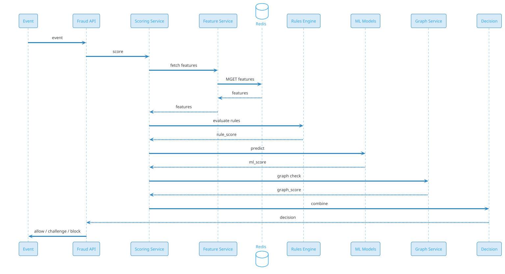
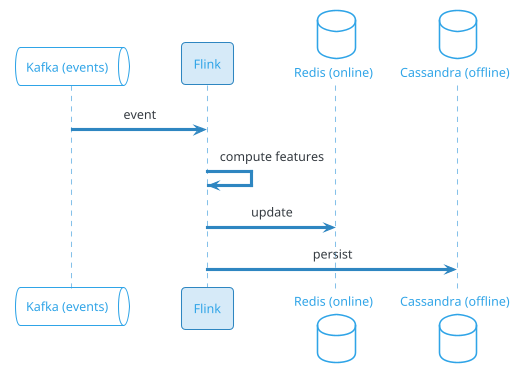
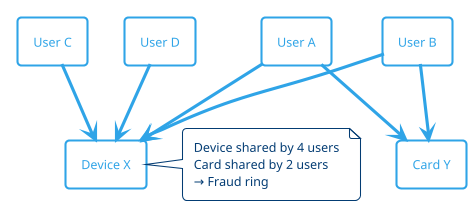

# Fraud Detection

## Problem Statement

Design a fraud detection system that identifies and prevents fraudulent activity across a platform — payments, account creation, logins, transactions, content, and more. The system must score events in real time (< 100 ms), learn continuously from labeled data and feedback, minimize both false positives (blocking legitimate users) and false negatives (missing fraud), and adapt to evolving adversarial tactics.

**Example:**

```
Fraud detection scenarios:

1. Payment fraud:
   - User's card used for ₹50,000 purchase in a different country
   - Within 5 min of a ₹200 purchase in home city
   - Velocity + geo-impossible + high amount → Flag

2. Account takeover:
   - Login from new device + new IP + new location
   - Password reset followed by immediate large transfer
   - Device fingerprint mismatch → Block

3. Card testing:
   - 100 small transactions (₹1 each) from same IP
   - Different card numbers, sequential
   - Pattern detection → Block card range

4. Money laundering:
   - Series of transfers between accounts
   - Round-trip patterns (A → B → C → A)
   - Structuring (just below reporting threshold)
   - Graph analysis → Report to FIU

5. Fake accounts:
   - Bulk account creation from same device
   - Disposable email domains
   - Unusual signup patterns
   - ML detection → Block signup

Real-time requirements:
  - Score in < 100 ms
  - Decision: Allow / Challenge / Block
  - Learn from feedback
  - Adapt to new patterns

Scale:
  - 500M users
  - 1B events/day (~11,574/sec avg, 57,870/sec peak)
  - 1% fraud rate = 10M fraud events/day
  - < 1% false positive rate
  - 99%+ detection rate
  - 10ms p99 scoring latency
```

**Real-world systems:** Stripe Radar, PayPal Fraud Protection, Sift, Forter, Kount, Feedzai, Featurespace, SAS Fraud, Experian.

**Why it's interesting:**

- **Adversarial** — fraudsters adapt to detection
- **Asymmetric costs** — false negative (fraud) is worse than false positive (block)
- **Real-time** — must score before transaction completes
- **Imbalanced data** — 1% fraud, 99% legitimate
- **Concept drift** — patterns change over time
- **Explainability** — regulators require reasoning
- **Privacy** — must detect without over-collecting
- **Scale** — billions of events per day
- **Multi-domain** — payments, accounts, content, gaming
- **Feedback loop** — labels come from investigations

---

## 1. Requirements Clarification

### Functional Requirements
- **Real-time scoring**: < 100 ms per event
- **Multi-domain**: Payments, logins, signups, content, transactions
- **Rules engine**: Deterministic rules (velocity, blocklists)
- **ML models**: Supervised + unsupervised
- **Graph analysis**: Relationships, rings, mules
- **Device fingerprinting**: Identify devices
- **Behavioral analysis**: Patterns, anomalies
- **Case management**: Review queue for analysts
- **Feedback loop**: Labels from investigations
- **Explainability**: Why this score
- **Reporting**: For compliance (SAR, STR)
- **Alerts**: Real-time to ops

### Non-Functional Requirements
- **Scale**: 1B events/day, 57,870/sec peak
- **Latency**: < 100 ms p99 scoring
- **Availability**: 99.99%
- **Consistency**: Real-time for scoring; eventual for learning
- **Freshness**: Models updated hourly/daily
- **Accuracy**: > 99% detection, < 1% false positive
- **Explainability**: Per-decision reasons (regulators)
- **Compliance**: PCI-DSS, GDPR, AML, KYC, PSD2
- **Privacy**: Data minimization

### Out of Scope
- Physical fraud (store theft)
- Insurance fraud (separate)
- Tax fraud (government)
- Full AML program (this is a component)

---

## 2. Back-of-Envelope Estimation

### Traffic

```
Given:
  Users                = 500,000,000
  Events/day           = 1,000,000,000
  Peak multiplier      = 5x
  Fraud rate           = 1% (10M fraud/day)

Average QPS:
  Events = 1B / 86,400 = ~11,574/sec

Peak QPS:
  Events = ~57,870/sec
  Volatility (fraud attack): ~500,000/sec

Feature computation:
  Per event: ~100 features
  Total: ~1M feature lookups/sec avg
  Peak: ~6M/sec

ML inference:
  Per event: ~5 models
  Total: ~58K inferences/sec avg
  Peak: ~290K/sec
  Volatility: ~2.5M/sec
```

### Storage

```
Events (scored):
  1B/day x 365 x 5 = 1.825T events
  Per event: ~500 bytes = ~912 TB

Features (online):
  User features: 500M x 5 KB = ~2.5 TB
  Device features: 1B x 1 KB = ~1 TB
  IP features: 100M x 1 KB = ~100 GB
  Merchant features: 100M x 2 KB = ~200 GB
  Total: ~5 TB

Feature store (offline):
  Historical features for training
  ~500 TB (5 years)

Labels:
  10M fraud/day x 365 x 5 = 18.25B labels
  Per label: ~200 bytes = ~3.6 TB

Cases (review queue):
  100K/day x 365 x 5 = 182.5M cases
  Per case: ~5 KB (evidence, notes) = ~912 GB

Models:
  Multiple models (per domain, per signal)
  Each ~100 MB - 1 GB
  Versioned: ~100 GB

Audit logs:
  1B events x 500 bytes = ~500 GB/day
  Retained 1 year: ~182 TB

Analytics:
  10B events x 200 bytes = ~2 TB/day
  5 years: ~3.6 PB

Total hot: ~10 TB
Total cold: ~10 PB
```

### Bandwidth

```
Event ingestion:
  57,870/sec x 1 KB = ~58 MB/sec = ~464 Mbps
  Peak: ~2.3 Gbps

Feature lookups:
  6M/sec x 100 bytes = ~600 MB/sec = ~4.8 Gbps

Model inference:
  Internal

Alerts:
  ~1K/sec x 1 KB = ~1 MB/sec

Total: ~10 Gbps peak
```

### Latency Budget

```
Event scoring (target < 100 ms):
  Event received:               ~10 ms
  Parse + validate:              ~5 ms
  Feature fetch:                 ~20 ms
  Rules evaluation:              ~5 ms
  ML inference:                  ~30 ms
  Graph lookup:                  ~10 ms
  Decision + audit:              ~10 ms
  Total:                         ~90 ms

Feature computation (streaming):
  Kafka → Flink → Redis:         ~50 ms

Model training (offline):
  Batch: hours
  Incremental: minutes
```

---

## 3. High-Level Design

```d2
direction: down

event: "Event Source" {shape: cloud}
user: User {shape: person}
merchant: Merchant {shape: person}

cdn: CDN {shape: cloud}
lb: Load Balancer {shape: hexagon}
api: "Fraud API" {shape: hexagon}

scoring: "Scoring Service" {shape: rectangle}
features: "Feature Service" {shape: rectangle}
rules: "Rules Engine" {shape: rectangle}
ml: "ML Models" {shape: rectangle}
graph: "Graph Service" {shape: rectangle}
device: "Device Fingerprint" {shape: rectangle}
decision: "Decision Service" {shape: rectangle}
cases: "Case Management" {shape: rectangle}
feedback: "Feedback Service" {shape: rectangle}
report: "Reporting Service" {shape: rectangle}

kafka: Kafka {shape: queue}
flink: Flink {shape: rectangle}

featstore: "Feature Store (Redis)" {shape: cylinder}
pdb: "PostgreSQL (cases, labels)" {shape: cylinder}
cass: "Cassandra (events, features)" {shape: cylinder}
ch: "ClickHouse (analytics)" {shape: cylinder}
s3: "S3 (training data)" {shape: cylinder}
graphdb: "Graph DB (Neo4j)" {shape: cylinder}
reg: "Regulator (SEBI/FIU)" {shape: cloud}

event -> api
user -> api
merchant -> api

api -> scoring
scoring -> features
scoring -> rules
scoring -> ml
scoring -> graph
scoring -> device
scoring -> decision

decision -> kafka
kafka -> flink
flink -> featstore
kafka -> ch
kafka -> cass
kafka -> cases

cases -> feedback
feedback -> s3
s3 -> ml

scoring -> featstore

cases -> report
report -> reg
```

### Component Responsibilities

| Component | Role |
|---|---|
| Fraud API | Entry for events |
| Scoring Service | Orchestrate scoring |
| Feature Service | Fetch/compute features |
| Rules Engine | Deterministic rules |
| ML Models | Supervised + unsupervised |
| Graph Service | Relationship analysis |
| Device Fingerprint | Device identification |
| Decision Service | Combine signals, decide |
| Case Management | Review queue for analysts |
| Feedback Service | Label feedback |
| Reporting Service | Compliance reports |
| Kafka | Event bus |
| Flink | Streaming feature computation |
| Feature Store (Redis) | Online features |
| PostgreSQL | Cases, labels |
| Cassandra | Events, features |
| ClickHouse | Analytics |
| S3 | Training data |
| Graph DB | Relationships |

### Why This Architecture

- **Kafka** for event ingestion (decoupled, scalable)
- **Flink** for streaming feature computation
- **Redis** for online features (sub-ms)
- **Multiple models** (rules + ML + graph)
- **Decision service** combines signals
- **Case management** for human review
- **Feedback loop** for continuous learning

---

## 4. Deep Dive: Real-Time Scoring Pipeline

### Event Ingestion

```
1. Event arrives at Fraud API
2. Parse + validate
3. Attach request_id + timestamp
4. Publish to Kafka (fraud-events topic)
5. Await scoring response (sync) OR
   Continue (async) for non-blocking
```

### Scoring Pipeline



### Latency Breakdown

| Step | Time |
|---|---|
| Event received | 10 ms |
| Feature fetch (Redis) | 20 ms |
| Rules evaluation | 5 ms |
| ML inference | 30 ms |
| Graph lookup | 10 ms |
| Decision | 5 ms |
| Audit + response | 10 ms |
| **Total** | **~90 ms** |

### Batching

- **Batch events**: 10-50 per batch
- **Parallel scoring**: All in batch
- **Vectorized ML**: Batch inference (10x faster)

### Caching

- **Features**: Redis (hot features)
- **ML**: Model in memory
- **Rules**: Compiled rules

### Fallback

If ML slow:
- **Timeout** at 50 ms
- **Fallback** to rules-only
- **Alert** ops

### Scoring Scale

```
1B events/day
= ~11,574/sec avg
= ~57,870/sec peak

Scoring Service: ~200 instances
Redis: ~100 shards
```

---

## 5. Deep Dive: Feature Engineering

### Feature Types

**User features:**
- Account age
- KYC level
- Historical transaction count
- Average transaction amount
- Chargeback rate
- Devices used
- Login patterns

**Device features:**
- Device ID (fingerprint)
- OS, browser
- First seen date
- Associated users (how many accounts)
- Fraud history

**IP features:**
- Country, city, ISP
- VPN/proxy/Tor detection
- Reputation (blocklist)
- Number of users on IP

**Merchant features:**
- Category (MCC)
- Chargeback rate
- Refund rate
- Country
- Volume

**Transaction features:**
- Amount
- Currency
- Time
- Channel (web, app, POS)

**Behavioral features:**
- Velocity (last 1h, 24h, 7d)
- Amount vs user's average
- Unusual time
- Unusual location

**Graph features:**
- Distance from known fraud
- Number of shared devices
- Cluster size
- Centrality

### Feature Store

**Online (Redis):**
```
Key: user:{user_id}:features
Type: Hash
Fields: account_age_days, tx_count_30d, avg_amount, chargeback_rate, ...

Key: device:{device_id}:features
Key: ip:{ip}:features
Key: merchant:{merchant_id}:features
```

**Offline (S3/Cassandra):**
- Same features for training
- Time-series for backtesting

### Streaming Feature Computation



### Velocity Features

**Sliding windows:**
- Last 1 minute
- Last 1 hour
- Last 24 hours
- Last 7 days
- Last 30 days

**Computed in Flink with windowed aggregations.**

### Feature Freshness

- **Real-time**: < 1 sec (streaming)
- **Near-real-time**: 1 min (micro-batch)
- **Batch**: Daily (for slow-changing)

**Trade-off:** Latency vs accuracy.

### Feature Engineering Scale

```
100 features per event
1B events/day = 100B feature computations/day
= ~1.16M feature computations/sec avg
Peak: ~5.8M/sec

Flink cluster: ~50 workers
Redis: ~100 shards
```

---

## 6. Deep Dive: ML Models

### Model Types

**1. Supervised (binary classification):**
- **Fraud** vs **legitimate**
- **Features** → **fraud probability**
- **Models**: XGBoost, LightGBM, Neural Networks

**2. Unsupervised (anomaly detection):**
- **Autoencoder**: Reconstruct features; high error = anomaly
- **Isolation Forest**: Isolate anomalies
- **Clustering**: Group similar events; outliers = fraud

**3. Graph-based:**
- **GNN**: Graph Neural Network over relationships
- **PageRank**: Influence
- **Community detection**: Fraud rings

**4. Sequence models:**
- **LSTM/GRU**: Sequential patterns
- **Transformer**: Long-range dependencies

### Training Data

- **Labels**: From investigations
- **Fraud**: Confirmed cases
- **Legitimate**: Verified good
- **Imbalanced**: 1% fraud (need sampling)

### Handling Imbalance

- **SMOTE**: Synthetic minority oversampling
- **Class weights**: Higher weight to fraud
- **Focal loss**: Focus on hard examples
- **Ensemble**: Combine models

### Model Stacking

**Multiple models** vote:
```
final_score = 0.4 * xgboost
            + 0.3 * neural_net
            + 0.2 * autoencoder
            + 0.1 * graph_model
```

### Model Explainability

- **SHAP**: Feature importance
- **LIME**: Local explanations
- **Decision trees**: Rule extraction
- **Regulatory**: Must explain decisions

### Model Deployment

- **Online**: Real-time inference (Triton, TF Serving)
- **Batch**: For non-urgent
- **Versioning**: A/B testing
- **Rollback**: Instant

### Model Updates

- **Full retrain**: Weekly
- **Incremental**: Daily
- **Real-time**: Streaming (rare, risky)

### Model Scale

```
1B events/day
5 models per event = 5B inferences/day
= ~58K/sec avg
= ~290K/sec peak

GPU inference: ~10 servers
CPU inference: ~100 servers
```

---

## 7. Deep Dive: Rules Engine

### Why Rules?

- **Fast**: < 5 ms
- **Deterministic**: Same input → same output
- **Explainable**: Easy to audit
- **Configurable**: Business can update
- **Complementary**: Handle known patterns

### Rule Types

**1. Blocklist:**
```
IF card_number IN blocklist → BLOCK
IF ip IN blocklist → BLOCK
```

**2. Velocity:**
```
IF transactions_last_hour > 5 → CHALLENGE
IF amount_last_day > 100000 → REVIEW
```

**3. Geo:**
```
IF country != user_home_country → CHALLENGE
IF distance_from_last_tx > 1000km within 1h → BLOCK (impossible travel)
```

**4. Threshold:**
```
IF amount > 50000 AND first_transaction → REVIEW
```

**5. Pattern:**
```
IF same_ip, different_cards > 5 in 1h → BLOCK (card testing)
```

**6. Combination:**
```
IF new_device AND amount > 10000 AND country != home → BLOCK
```

### Rule Engine

- **DSL**: Domain-specific language
- **Compiled**: Fast execution
- **Priority**: Order matters
- **Versioned**: Audit trail
- **A/B tested**: New rules tested on subset

### Rule Example (DSL)

```yaml
rule_id: high_amount_new_device
description: Block high amount from new device
priority: 100
conditions:
  - device_age_days: < 1
  - amount_cents: > 1000000
  - country: != user_home_country
action: BLOCK
reason: HIGH_AMOUNT_NEW_DEVICE
```

### Rule Conflicts

- **Priority** resolves
- **Most restrictive** wins
- **Manual override** for known cases

### Rule Management

- **Create**: By fraud team
- **Test**: On historical data
- **Deploy**: Canary → full
- **Monitor**: Performance
- **Retire**: When obsolete

### Rule Scale

```
1000+ rules
Evaluated in < 5 ms
Runs before ML (fast filter)
If rule matches: skip ML (fast decision)
```

---

## 8. Deep Dive: Graph Analysis

### Why Graphs?

Fraud is often **network-based**:
- **Fraud rings**: Multiple accounts
- **Mules**: Accounts moving money
- **Synthetic identities**: Fake identities
- **Shared infrastructure**: Devices, IPs

### Graph Model

**Nodes:**
- User
- Device
- IP
- Card
- Merchant
- Bank account

**Edges:**
- User → Device (used)
- User → IP (from)
- User → Card (owns)
- User → Merchant (transacted)
- User → User (transferred)

### Fraud Ring Detection



### Graph Queries

- **Shared devices**: Users sharing device
- **Shared cards**: Users sharing card
- **Distance**: How far from known fraud
- **Cluster**: Size, density
- **Cycles**: Round-trip transfers

### GNN (Graph Neural Network)

- **Node embeddings**: User → vector
- **Message passing**: Aggregate neighbor info
- **Prediction**: Fraud probability
- **Scalable**: Sampling for large graphs

### Real-Time Graph

- **Graph DB**: Neo4j, JanusGraph, TigerGraph
- **Query time**: < 10 ms
- **Updates**: Real-time (new edges)
- **Scale**: Billions of nodes/edges

### Graph Scale

```
500M users
1B devices
100M IPs
Total: ~2B nodes, ~10B edges

Graph DB: sharded
Query: ~10 ms
Updates: ~11K/sec
```

---

## 9. Deep Dive: Case Management and Feedback

### Case Management

**When to create a case:**
- High risk score (0.7+)
- Rule triggered
- User reported
- Random sampling (for audit)

**Case contents:**
- Event details
- Features (anonymized)
- Model scores
- Rules triggered
- Historical context
- User history

**Analyst workflow:**
1. Review case
2. Investigate (external tools)
3. Decide: Fraud / Legitimate / Unclear
4. Action: Block, Allow, Escalate
5. Add notes

### Case Queue

```sql
CREATE TABLE cases (
    case_id BIGINT PRIMARY KEY,
    event_id BIGINT,
    event_type VARCHAR(50),
    risk_score DECIMAL(3,2),
    priority INT,                    -- 1 (high) to 5 (low)
    status VARCHAR(20),              -- pending, in_review, resolved
    assigned_to BIGINT,
    decision VARCHAR(20),            -- fraud, legitimate, unclear
    notes TEXT,
    created_at TIMESTAMP DEFAULT NOW(),
    resolved_at TIMESTAMP
);
CREATE INDEX idx_cases_status_priority ON cases(status, priority);
```

### Feedback Loop

```
Analyst decides → label stored → training data → model retrained
```

**Critical:** Feedback must be timely (hours, not days).

### Label Storage

```sql
CREATE TABLE labels (
    label_id BIGINT PRIMARY KEY,
    event_id BIGINT,
    label VARCHAR(20),               -- fraud, legitimate, unsure
    source VARCHAR(20),              -- analyst, user, auto
    confidence DECIMAL(3,2),
    notes TEXT,
    created_at TIMESTAMP DEFAULT NOW()
);
```

### Automated Labels

- **Chargebacks**: Auto-label as fraud
- **User reports**: High confidence
- **Model consensus**: Multiple models agree
- **Confirmed fraud**: From operations

### Feedback Scale

```
100K cases/day
Analyst decision: ~5 min per case
Analysts: ~200 globally

Labels: 100K/day
Feedback loop: < 24 hours
```

---

## 10. Deep Dive: Decision Logic

### Risk Score

```
risk_score = 0.3 * rules_score
           + 0.5 * ml_score
           + 0.2 * graph_score

Normalized to [0, 1]
```

### Decision Thresholds

| Score | Decision | Action |
|---|---|---|
| < 0.3 | ALLOW | Process normally |
| 0.3 - 0.7 | CHALLENGE | Request 2FA / OTP |
| > 0.7 | BLOCK | Reject + review |
| > 0.9 | BLOCK + ALERT | Reject + immediate alert |

### Challenge Types

- **OTP**: SMS/email code
- **2FA**: Authenticator app
- **Security questions**: Knowledge-based
- **Biometric**: Fingerprint, face
- **Manual review**: For high value

### Allow List

- **Trusted users**: Long history, no fraud
- **Bypass**: For low-risk events
- **VIP**: Special handling

### Manual Review

For high-risk decisions:
- **Analyst queue**
- **SLA**: 1 hour
- **Decision**: Approve, reject, escalate
- **Feedback**: To model

### Fallback

If all else fails:
- **Conservative**: Block
- **Notify user**: "For your security"
- **Provide alternative**: Other payment method

### Decision Scale

```
1B events/day
Decision: ~5 ms
Total: ~5B decisions/day

Decision Service: ~100 instances
```

---

## 11. Deep Dive: Fraud Types and Detection

### Payment Fraud

- **Stolen card**: Use at merchant
- **Card testing**: Small amounts, verify
- **Friendly fraud**: User claims not to have made purchase

**Detection:**
- Velocity
- Geo-impossible
- Card BIN
- Device mismatch
- CVV mismatch
- 3D Secure

### Account Takeover (ATO)

- **Credential stuffing**: Stolen passwords
- **Phishing**: Fake login pages
- **SIM swap**: Take over phone

**Detection:**
- New device
- New location
- Password change
- Unusual behavior
- Device fingerprint

### Money Laundering

- **Structuring**: Below reporting threshold
- **Round-trip**: A→B→C→A
- **Mules**: Account holders moving money

**Detection:**
- Graph analysis
- Velocity
- Round-trip detection
- Threshold monitoring

### Fake Accounts

- **Bulk creation**: Same device/IP
- **Disposable emails**: Temp email services
- **Synthetic identities**: Fake but realistic

**Detection:**
- Device fingerprint
- Email domain reputation
- Signup velocity
- Behavioral analysis

### Promo Abuse

- **Multi-accounting**: Same user, multiple accounts
- **Coupon abuse**: Reusing coupons
- **Referral fraud**: Fake referrals

**Detection:**
- Device fingerprint
- Phone/email reuse
- IP correlation
- Behavioral

### Content Fraud

- **Spam**: Bulk content
- **Fake reviews**: Paid reviews
- **Fake engagement**: Bots

**Detection:**
- Content ML
- Account age
- Behavior
- Network

### Return Fraud

- **Wardrobing**: Use, then return
- **Empty box**: Return wrong item
- **Fake damage**: Claim damage

**Detection:**
- Return rate
- Pattern
- Photo evidence
- External data

---

## 12. Deep Dive: Model Lifecycle

### Training

- **Data**: Last 90 days of labels
- **Features**: 100+ per event
- **Splits**: Train (70%), validation (15%), test (15%)
- **Imbalance**: SMOTE, class weights
- **Algorithm**: XGBoost (primary)
- **Duration**: 2-4 hours
- **Frequency**: Weekly full, daily incremental

### Evaluation

**Metrics:**
- **AUC**: Area under ROC curve
- **Precision**: True positive / (TP + FP)
- **Recall**: TP / (TP + FN)
- **F1**: Harmonic mean
- **Precision@K**: Top K precision

**Target:**
- Precision > 90% at recall 50%
- Detection rate > 99%

### Deployment

- **Canary**: 5% traffic
- **Monitor**: Metrics
- **Rollout**: 25%, 50%, 100%
- **Rollback**: If degradation

### Monitoring

- **Model drift**: Input distribution change
- **Concept drift**: Relationship changes
- **Performance**: Precision, recall over time
- **Alert**: If metrics degrade

### Retraining Triggers

- **Scheduled**: Weekly/daily
- **Drift detected**: Immediate
- **New fraud type**: Ad-hoc

### Model Scale

```
1B events/day
Model training: weekly
Feedback: 100K labels/day

ML infrastructure:
  Training: ~10 GPU servers
  Serving: ~50 CPU servers
  Feature store: Redis + Cassandra
```

---

## 13. Scaling Considerations

### Read Scaling

- **Redis** for features (sub-ms)
- **Read replicas** for PostgreSQL
- **Cassandra** for events
- **ClickHouse** for analytics

### Write Scaling

- **Kafka** for events
- **Flink** for streaming features
- **Cassandra** for events

### Sharding

**Redis:** Shard by user_id (features).
**PostgreSQL:** Shard by case_id.
**Kafka:** Partition by user_id.
**Cassandra:** Partition by event_id.

### Multi-Region

- **Per-region** deployment
- **Data residency** (GDPR)
- **Global fraud graph** (replicated)

### Peak Handling

- **Fraud attack**: 10x-100x
- **Card testing**: Surge
- **Account takeover wave**: Surge

**Mitigations:**
- Auto-scale
- Rate limit
- Emergency rules
- Manual review surge

### Cost Optimization

| Component | Optimization |
|---|---|
| Feature store | TTL, tiering |
| ML inference | Batching, quantization |
| Storage | Tiering |
| Compute | Reserved + spot |

---

## 14. Bottlenecks and Trade-offs

| Concern | Solution | Trade-off |
|---|---|---|
| Latency | Redis, batching | Freshness |
| Accuracy | Ensemble models | Complexity |
| False positives | Thresholds, feedback | Detection rate |
| Adversarial | Continuous learning | Model staleness |
| Explainability | SHAP, rules | Simplicity |
| Scale | Sharding, batching | Consistency |
| Privacy | Minimization, encryption | Detection |

### Design Decisions Summary

| Decision | Choice | Rationale |
|---|---|---|
| Features | Redis (online) + Cassandra (offline) | Fast + durable |
| Models | Ensemble (XGBoost + NN + autoencoder) | Accuracy |
| Rules | Config-driven | Fast, explainable |
| Graph | Neo4j | Relationship analysis |
| Feedback | Case management | Learning |
| Decision | Rules + ML + graph | Robust |

---

## 15. Failure Scenarios

### Scoring Service Down

**Impact:** Can't score events.

**Mitigation:**
- Fallback to rules-only
- Queue events
- Alert ops

### Feature Store Down

**Impact:** No features.

**Mitigation:**
- Cache last known
- Fallback to simpler model
- Alert ops

### ML Model Failure

**Impact:** No ML scoring.

**Mitigation:**
- Fallback to rules
- Alert ops

### Kafka Down

**Impact:** Events delayed.

**Mitigation:**
- Buffer in API
- Retry
- Alert ops

### Rules Engine Down

**Impact:** No rule evaluation.

**Mitigation:**
- Cached rules
- Conservative default
- Alert ops

### Peak Attack

**Impact:** System overloaded.

**Mitigation:**
- Rate limit
- Queue
- Auto-scale
- Alert ops

### Data Breach

**Impact:** User data exposed.

**Mitigation:**
- Encryption
- Access controls
- Incident response
- Notify users

### False Positive Storm

**Impact:** Legitimate users blocked.

**Mitigation:**
- Quick rollback
- Manual review surge
- Notification
- Apology + compensation

### Adversarial Adaptation

**Impact:** Model defeated.

**Mitigation:**
- Continuous learning
- Red team
- Rapid retraining
- New features

### Regulatory Action

**Impact:** Fines, license.

**Mitigation:**
- Compliance team
- Audits
- Explainability
- Transparency

### DDoS

**Impact:** Service unavailable.

**Mitigation:**
- CDN/WAF
- Rate limiting
- Anycast
- Alert ops

---

## 16. Monitoring and Alerts

### Key Metrics

| Metric | Target | Alert Threshold |
|---|---|---|
| Scoring p99 | < 100 ms | > 200 ms |
| Detection rate | > 99% | < 95% |
| False positive rate | < 1% | > 2% |
| Feature freshness | < 1 sec | > 10 sec |
| Model AUC | > 0.9 | < 0.8 |
| Rules latency | < 5 ms | > 20 ms |
| ML inference p99 | < 50 ms | > 100 ms |
| Case queue depth | < 10K | > 50K |
| Case resolution SLA | < 4 hours | > 24 hours |
| Fraud rate | baseline | spike > 50% |

### Dashboards

- **Traffic**: Events/sec, by type
- **Latency**: p50/p95/p99
- **Accuracy**: Precision, recall, F1
- **Fraud**: Rate, by type
- **Models**: Versions, drift
- **Rules**: Triggered, effectiveness
- **Cases**: Queue, resolution time
- **Graph**: Rings detected
- **Business**: Fraud loss, blocked

### Alerts

- **P0**: Fraud spike, model failure, data breach
- **P1**: Latency > 200 ms, detection < 95%
- **P2**: High false positive, slow case resolution
- **P3**: Model drift, new fraud type

### Business KPIs

- **Fraud loss** (₹/month)
- **Detection rate**
- **False positive rate**
- **Case resolution time**
- **User friction** (challenges per user)
- **Customer satisfaction**
- **Regulatory compliance**

---

## 17. Cost Estimation

Rough monthly cost (AWS, us-east-1) for 1B events/day:

| Component | Spec | Cost/month |
|---|---|---|
| Fraud API servers | 200 x c6g.large | ~$12,000 |
| Scoring Service | 200 x c6g.2xlarge | ~$48,000 |
| Feature Service | 100 x c6g.2xlarge | ~$24,000 |
| ML Serving (CPU) | 50 x c6g.4xlarge | ~$30,000 |
| ML Serving (GPU) | 10 x g4dn.xlarge | ~$5,000 |
| Rules Engine | 50 x c6g.large | ~$3,000 |
| Graph DB (Neo4j) | 20 x r6g.2xlarge | ~$36,000 |
| PostgreSQL | 20 shards x db.r6g.2xlarge | ~$46,000 |
| Redis cluster | 100 x cache.r6g.2xlarge | ~$50,000 |
| Cassandra | 50 x i3.2xlarge | ~$50,000 |
| Kafka (MSK) | 30 brokers | ~$15,000 |
| Flink | 50 x c6g.2xlarge | ~$12,000 |
| ClickHouse | 20 x i3.2xlarge | ~$20,000 |
| S3 (training data) | 500 TB | ~$12,000 |
| Monitoring | Datadog | ~$50,000 |
| Compliance | AML, audits | ~$200,000 |
| **Total** | | **~$613,000/month** |

**Per event:** ~$0.00002.

**Cost breakdown:**
- **Compliance**: ~33%
- **Databases**: ~29%
- **Compute**: ~22%
- **Other**: ~16%

**Revenue note:** Fraud prevention saves 10-100x its cost in avoided losses.

---

## 18. Extensions and Follow-ups

### Real-Time Bidding Fraud

- Ad fraud
- Click fraud
- Bot detection

### E-Commerce Fraud

- Account takeover
- Payment fraud
- Return fraud

### Banking Fraud

- Wire fraud
- Check fraud
- Insider fraud

### Insurance Fraud

- Claims fraud
- Staged accidents
- Fake policies

### Healthcare Fraud

- Billing fraud
- Prescription fraud
- Identity theft

### Crypto Fraud

- Wallet takeover
- Pump and dump
- Rug pulls

### Game Fraud

- Cheating
- Gold farming
- Account theft

### Content Fraud

- Fake engagement
- Spam
- Misinformation

### Deepfake Detection

- AI-generated identities
- Video KYC bypass
- Voice fraud

### Behavioral Biometrics

- Typing patterns
- Mouse movement
- Gait analysis

### Device Fingerprinting

- Canvas fingerprint
- WebGL
- Audio fingerprint

### Privacy-Preserving ML

- Federated learning
- Differential privacy
- On-device inference

### Explainable AI

- SHAP, LIME
- Counterfactual
- Regulatory reports

### AI-Powered Fraud

- Adversarial ML
- Generative fraud
- Deepfake

### Web3

- On-chain analysis
- DeFi fraud
- NFT scams

---

## 19. Summary

| Aspect | Decision |
|---|---|
| Features | Redis (online) + Cassandra (offline) |
| ML Models | Ensemble (XGBoost + NN + autoencoder) |
| Rules | Config-driven DSL |
| Graph | Neo4j |
| Streaming | Kafka + Flink |
| Feature Store | Redis + Cassandra |
| Events | Cassandra + ClickHouse |
| Decision | Rules + ML + graph |
| Feedback | Case management |
| Scale | 1B events/day, 57K/sec peak |
| Latency | < 100 ms p99 |
| Detection rate | > 99% |
| False positive | < 1% |
| Cost | ~$613K/month |

**Key takeaways:**

- **Real-time scoring** — < 100 ms; features + rules + ML + graph
- **Feature engineering** — streaming (Flink) for freshness
- **Ensemble ML** — XGBoost + NN + autoencoder; better than single model
- **Rules engine** — fast, explainable, complementary to ML
- **Graph analysis** — fraud rings, mules, shared infrastructure
- **Feedback loop** — case management → labels → retraining
- **Explainability** — SHAP + rules for regulatory compliance
- **Handling imbalance** — SMOTE, class weights, focal loss
- **Adversarial** — continuous learning, rapid retraining
- **Cost** — cheap per event; saves 10-100x in losses

### Similar Pattern Problems

- Payment System — payment fraud
- Digital Wallet — wallet fraud
- Content Moderation — content fraud (spam)
- Trading Platform — trading fraud
- Insurance Platform — claims fraud
- E-Commerce Checkout — payment fraud
- Recommendation Engine — fake engagement
- Anomaly Detection — general anomaly detection