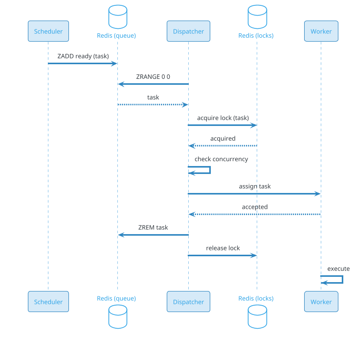

# Distributed Task Scheduler (Airflow / Temporal / Quartz / Cron)

## Problem Statement

Design a distributed task scheduler that reliably runs jobs at scale — cron jobs, delayed tasks, recurring workflows, retries, and one-off executions. Think Airflow, Temporal, Quartz, AWS Step Functions, or Kubernetes CronJobs. The system must handle millions of scheduled tasks, guarantee at-least-once (or exactly-once) execution, support retries with backoff, enforce ordering and dependencies, and survive crashes without losing tasks.

**Example:**

```
Scheduling scenarios:

1. Cron job:
   - "Every day at 2 AM, run ETL pipeline"
   - Cron: 0 2 * * *
   - On failure: retry 3 times with backoff

2. Delayed task:
   - "Send reminder email 24 hours after signup"
   - Scheduled at signup + 24h
   - Cancel if user verifies before

3. Recurring task:
   - "Every 5 min, ping health check endpoint"
   - Simple, high-frequency
   - Skip if previous still running

4. Workflow (DAG):
   - Task A → Task B, Task C
   - Task B, C → Task D
   - Dependencies enforced
   - Retry individual steps

5. Distributed job:
   - "Process 1M records"
   - Split into 1000 chunks
   - 100 workers process in parallel
   - Aggregate results

Requirements:
  - At-least-once execution
  - Retries with backoff
  - Dead letter queue
  - Timeouts
  - Concurrency limits
  - Priority
  - Cron + one-off + delayed
  - Dependencies (DAG)
  - Observability

Scale:
  - 10M tasks/day (~116/sec avg, 580/sec peak)
  - 1M concurrent tasks (peak)
  - 10K workers
  - 100K cron schedules
  - 1K DAGs
  - Sub-second scheduling precision
```

**Real-world systems:** Apache Airflow, Temporal, Quartz, AWS Step Functions, Google Cloud Scheduler, Kubernetes CronJobs, Celery, Sidekiq, Nomad, Prefect, Dagster.

**Why it's interesting:**

- **Reliability** — at-least-once execution (never lose a task)
- **Precision** — schedule at exact time (cron: "2 AM")
- **Scale** — millions of tasks, thousands of workers
- **Retries** — exponential backoff, dead letter
- **Ordering** — per-key ordering (FIFO for same key)
- **Dependencies** — DAG-based workflows
- **Idempotency** — safe to retry
- **Concurrency** — limits per job, per worker, global
- **Observability** — logs, metrics, traces per task
- **Cost** — compute + storage for logs/history

---

## 1. Requirements Clarification

### Functional Requirements
- **Schedule tasks**: Cron, one-off, delayed, recurring
- **Execute tasks**: On workers
- **Retry**: On failure, with backoff
- **Timeout**: Kill long-running tasks
- **Dependencies**: DAG-based workflows
- **Priority**: Important tasks first
- **Concurrency limits**: Per job, per worker, global
- **Cancellation**: User cancels scheduled task
- **Idempotency**: Safe retries
- **Dead letter queue**: For failed tasks
- **Observability**: Logs, metrics, traces
- **History**: Task execution history
- **Alerting**: On failure

### Non-Functional Requirements
- **Scale**: 10M tasks/day, 1M concurrent, 10K workers
- **Latency**: Schedule precision < 1 sec
- **Availability**: 99.99%
- **Consistency**: Strong for scheduling (no duplicates, no misses)
- **Durability**: Never lose a task
- **Throughput**: 580 tasks/sec peak
- **Reliability**: At-least-once execution
- **Observability**: Full visibility
- **Cost**: Efficient at scale

### Out of Scope
- Streaming (Kafka)
- Real-time processing (Flink)
- Batch processing (Spark)
- CI/CD (separate)

---

## 2. Back-of-Envelope Estimation

### Traffic

```
Given:
  Tasks/day            = 10,000,000
  Concurrent tasks     = 1,000,000 (peak)
  Workers              = 10,000
  Cron schedules       = 100,000
  DAGs                 = 1,000

Average QPS:
  Tasks = 10M / 86,400 = ~116/sec
  Scheduling checks = 100K / 60 = ~1,667/sec (cron eval)
  Status updates = 10M x 5 / 86,400 = ~579/sec
  Total: ~2.4K ops/sec

Peak QPS:
  Tasks = ~580/sec
  Cron eval = ~8,335/sec
  Status = ~2,895/sec
  Total: ~12K ops/sec

Concurrent:
  1M concurrent tasks
  10K workers x 100 tasks each = 1M
```

### Storage

```
Task definitions:
  1M tasks x 5 KB = ~5 GB

Task executions:
  10M/day x 365 x 5 = 18.25B executions
  Per execution: ~2 KB (metadata, status) = ~36 TB

Task logs:
  10M/day x 10 KB avg = ~100 GB/day
  5 years: ~182 TB

Task results:
  10M/day x 1 KB = ~10 GB/day
  5 years: ~18 TB

Schedules:
  100K cron schedules x 2 KB = ~200 MB

DAG definitions:
  1K DAGs x 100 KB = ~100 MB

History (long-term):
  Aggregated stats, archived: ~1 PB

Total hot: ~100 GB
Total cold: ~1 PB
```

### Bandwidth

```
Task assignment:
  580/sec x 1 KB = ~580 KB/sec

Status updates:
  2,895/sec x 1 KB = ~3 MB/sec

Logs:
  10M/day x 10 KB = ~1.16 GB/sec = ~9.3 Gbps
  Peak: ~46 Gbps

Total: ~50 Gbps peak (logs dominate)
```

### Latency Budget

```
Task scheduling:
  Cron eval:                     ~10 ms
  Create task instance:          ~20 ms
  Enqueue:                       ~5 ms
  Total:                         ~35 ms

Task execution (assignment):
  Worker poll:                   ~100 ms
  Assign:                        ~20 ms
  Total:                         ~120 ms

Task execution (actual):
  Depends on task (ms to hours)

Status update:
  Publish:                       ~10 ms
  Store:                         ~20 ms
  Total:                         ~30 ms
```

---

## 3. High-Level Design

```d2
direction: down

user: User {shape: person}
external: "External Trigger" {shape: cloud}

cdn: CDN {shape: cloud}
lb: Load Balancer {shape: hexagon}
api: "Scheduler API" {shape: hexagon}

scheduler: "Scheduler Service" {shape: rectangle}
cron: "Cron Service" {shape: rectangle}
dag: "DAG Engine" {shape: rectangle}
queue: "Task Queue" {shape: rectangle}
dispatcher: "Dispatcher" {shape: rectangle}
worker: "Workers" {shape: rectangle}
retry: "Retry Service" {shape: rectangle}
dlq: "Dead Letter Queue" {shape: rectangle}
notif: "Notification Service" {shape: rectangle}
obs: "Observability" {shape: rectangle}

kafka: Kafka {shape: queue}

pdb: "PostgreSQL (tasks, DAGs)" {shape: cylinder}
redis: "Redis (queue, locks)" {shape: cylinder}
cass: "Cassandra (executions, logs)" {shape: cylinder}
ch: "ClickHouse (analytics)" {shape: cylinder}
s3: "S3 (logs, artifacts)" {shape: cylinder}

user -> cdn
cdn -> lb
lb -> api
external -> api

api -> scheduler
api -> cron
api -> dag

cron -> scheduler
dag -> scheduler

scheduler -> queue
queue -> dispatcher
dispatcher -> worker
worker -> retry
retry -> queue
worker -> dlq
worker -> obs

scheduler -> kafka
worker -> kafka
kafka -> notif
kafka -> ch
kafka -> cass
worker -> s3
```

### Component Responsibilities

| Component | Role |
|---|---|
| Scheduler API | Create, cancel, query tasks |
| Scheduler Service | Manage task lifecycle |
| Cron Service | Evaluate cron schedules |
| DAG Engine | Dependency management |
| Task Queue | Priority queue of ready tasks |
| Dispatcher | Assign tasks to workers |
| Workers | Execute tasks |
| Retry Service | Handle retries with backoff |
| Dead Letter Queue | Failed tasks |
| Notification Service | Alerts on failure |
| Observability | Logs, metrics, traces |
| Kafka | Event bus |
| PostgreSQL | Tasks, DAGs, schedules |
| Redis | Queue, locks, cache |
| Cassandra | Executions, logs |
| ClickHouse | Analytics |
| S3 | Logs, artifacts |

### Why This Architecture

- **PostgreSQL** for task definitions (ACID)
- **Redis** for queue (fast, atomic)
- **Cassandra** for executions/logs (write-heavy)
- **Kafka** for events (decoupled)
- **ClickHouse** for analytics
- **S3** for logs (cheap, tiered)

---

## 4. Deep Dive: Task Scheduling

### Task Types

**1. One-off:**
- `execute at T`
- Single execution

**2. Delayed:**
- `execute after N seconds`
- Relative to creation

**3. Recurring (cron):**
- `execute every N minutes`
- Standard cron syntax

**4. Recurring (interval):**
- `execute every N minutes`
- From last execution

**5. DAG:**
- Multiple tasks with dependencies

### Cron Syntax

```
* * * * *
│ │ │ │ │
│ │ │ │ └─── Day of week (0-6)
│ │ │ └───── Month (1-12)
│ │ └─────── Day of month (1-31)
│ └───────── Hour (0-23)
└─────────── Minute (0-59)
```

**Examples:**
- `0 2 * * *` — Every day at 2 AM
- `*/5 * * * *` — Every 5 minutes
- `0 0 1 * *` — First of every month
- `0 9 * * 1-5` — Weekdays at 9 AM

### Scheduling Algorithm

**Cron evaluation:**
```
For each cron schedule:
  next_run = next_occurrence(cron, now)
  if next_run <= now:
    create_task_instance()
    update_next_run()
```

**Efficient evaluation:**
- **Bucket by minute**: Only evaluate schedules due this minute
- **Priority queue**: By next_run time
- **Distributed**: Shard by schedule ID

### Task Model

```json
{
  "task_id": "task-123",
  "name": "daily-etl",
  "type": "cron",
  "schedule": "0 2 * * *",
  "handler": "etl_pipeline",
  "payload": {"source": "s3://raw/", "dest": "s3://processed/"},
  "priority": "high",
  "max_retries": 3,
  "retry_backoff": "exponential",
  "timeout_seconds": 3600,
  "concurrency_limit": 1,
  "next_run_at": "2026-09-20T02:00:00Z",
  "enabled": true,
  "created_at": "2026-09-19T10:00:00Z"
}
```

### Task Instance

```json
{
  "instance_id": "inst-456",
  "task_id": "task-123",
  "scheduled_at": "2026-09-20T02:00:00Z",
  "started_at": "2026-09-20T02:00:01Z",
  "completed_at": "2026-09-20T02:15:00Z",
  "status": "completed",
  "attempt": 1,
  "worker_id": "worker-789",
  "result": {"rows_processed": 1000000},
  "error": null
}
```

### Scheduling Scale

```
100K cron schedules
1,667 evaluations/sec avg
8,335/sec peak

Task instances:
  10M/day = 116/sec avg
  Peak: 580/sec

Scheduler Service: ~20 instances
```

---

## 5. Deep Dive: Task Queue and Dispatch

### Queue Architecture

**Priority queue** with fair scheduling:
- **Multiple priority levels** (0-9)
- **Per-tenant fair scheduling** (round-robin)
- **FIFO within priority**

**Storage:**
- **Redis Sorted Set** (score = priority + timestamp)
- **Kafka** for durability + replay

### Redis Queue

```
Key: queue:ready
Type: Sorted Set
Score: priority * 1e13 + timestamp
Value: task_instance_id

ZADD queue:ready {score} {instance_id}
ZRANGE queue:ready 0 0  → highest priority, oldest
ZREM queue:ready {instance_id}
```

### Dispatch Flow



### Worker Pool

- **10K workers**
- Each: 100 concurrent tasks
- **Pull-based**: Worker polls for tasks
- **Long-polling**: 10-30 sec wait
- **Heartbeat**: Every 30 sec
- **Death detection**: No heartbeat in 60 sec

### Concurrency Limits

- **Per task**: Max concurrent instances (e.g., 1 for singleton)
- **Per worker**: Max 100 concurrent
- **Per tenant**: Max 10K
- **Global**: 1M

**Enforcement:**
- Redis counters
- Distributed locks

### Task Assignment

- **Pull**: Worker pulls tasks
- **Push**: Dispatcher assigns
- **Hybrid**: Long-polling (best)

**Recommendation:** Long-polling — reduces latency without load.

### Dispatch Scale

```
1M concurrent tasks
10K workers
100 tasks/worker

Dispatcher: ~50 instances
Redis: ~20 shards
```

---

## 6. Deep Dive: Reliability and Retries

### At-Least-Once

Every task executed at least once:
- **Persistent queue** (Redis + Kafka)
- **Ack after completion** (or failure)
- **Re-queue on worker death**

**Trade-off:** May execute twice.

### Idempotency

Task handlers must be idempotent:
```python
def handle_task(task_id, payload):
    if already_processed(task_id):
        return cached_result
    result = do_work(payload)
    mark_processed(task_id, result)
    return result
```

### Retry Strategy

**Backoff types:**
- **Fixed**: 5 sec between retries
- **Linear**: 5, 10, 15, 20 sec
- **Exponential**: 5, 25, 125, 625 sec (default)
- **Exponential with jitter**: Add random (avoid thundering herd)

**Formula:**
```
delay = min(max_delay, base * 2^attempt) * random(0.5, 1.5)
```

### Retry State

```json
{
  "instance_id": "inst-456",
  "attempt": 3,
  "max_retries": 5,
  "last_error": "Connection timeout",
  "next_retry_at": "2026-09-19T10:05:00Z",
  "backoff_seconds": 125
}
```

### Dead Letter Queue

After max retries:
- Move to DLQ
- Alert ops
- Manual review
- Fix + replay

**DLQ:**
```
Key: queue:dead
Type: Sorted Set
Value: instance_id

Kafka: dlq-topic
```

### Timeouts

- **Per task**: Configurable (1 sec - 24 hours)
- **Enforcement**: Worker kills after timeout
- **State**: Task marked failed (timeout)
- **Retry**: Yes (unless idempotent only)

### Worker Death

- **Heartbeat**: Every 30 sec
- **Detection**: No heartbeat in 60 sec
- **Action**: Re-queue in-flight tasks
- **State**: Recover from checkpoint

### Checkpointing

For long-running tasks:
- **Progress**: Saved periodically
- **Resume**: From last checkpoint
- **Idempotent**: Safe to restart

### Exactly-Once (Advanced)

**Requires:**
- Idempotent handler
- Atomic commit (result + ack)
- Two-phase commit (rare)

**Trade-off:** Complexity vs guarantee.

### Retry Scale

```
10M tasks/day
~10% fail initially = 1M retries/day
~1% reach DLQ = 100K/day

Retry Service: ~10 instances
```

---

## 7. Deep Dive: DAG and Dependencies

### DAG Model

**Directed Acyclic Graph:**
- Nodes = tasks
- Edges = dependencies
- Root = no dependencies
- Leaf = no dependents

**Example:**
```
       ┌─── B ───┐
   A ──┤         ├── D
       └─── C ───┘
```

### DAG Data Model

```json
{
  "dag_id": "dag-123",
  "name": "daily-etl",
  "schedule": "0 2 * * *",
  "tasks": [
    {"id": "A", "handler": "extract", "depends_on": []},
    {"id": "B", "handler": "transform_b", "depends_on": ["A"]},
    {"id": "C", "handler": "transform_c", "depends_on": ["A"]},
    {"id": "D", "handler": "load", "depends_on": ["B", "C"]}
  ],
  "max_retries": 3,
  "timeout_seconds": 3600
}
```

### DAG Execution

1. **Trigger**: Cron or manual
2. **Create DAG run**: Instance of whole DAG
3. **Topological sort**: Order tasks
4. **Execute leaves** (no dependencies) first
5. **When task completes**: Check successors ready
6. **Execute ready tasks**
7. **Continue until all done**

### Task States (DAG)

- **PENDING**: Not ready
- **READY**: Dependencies satisfied
- **RUNNING**: Executing
- **SUCCESS**: Completed
- **FAILED**: Errored
- **SKIPPED**: Upstream failed

### Retry in DAG

- **Per task**: Retry individual tasks
- **Whole DAG**: Retry entire DAG
- **Default**: Task-level

### Conditional Execution

- **On success**: Continue
- **On failure**: Trigger different path
- **Branches**: Based on task output

### DAG Store

PostgreSQL:
```sql
CREATE TABLE dags (
    dag_id BIGINT PRIMARY KEY,
    name VARCHAR(200) UNIQUE,
    schedule VARCHAR(100),
    definition JSONB,
    enabled BOOLEAN DEFAULT TRUE,
    created_at TIMESTAMP DEFAULT NOW()
);

CREATE TABLE dag_runs (
    run_id BIGINT PRIMARY KEY,
    dag_id BIGINT,
    started_at TIMESTAMP,
    completed_at TIMESTAMP,
    status VARCHAR(20),
    triggered_by VARCHAR(50)
);

CREATE TABLE dag_tasks (
    run_id BIGINT,
    task_id VARCHAR(50),
    status VARCHAR(20),
    started_at TIMESTAMP,
    completed_at TIMESTAMP,
    attempt INT DEFAULT 1,
    result JSONB,
    PRIMARY KEY (run_id, task_id)
);
```

### DAG Scale

```
1K DAGs
Each with 10-100 tasks
Total: 10K-100K task instances per DAG run

DAG Engine: ~20 instances
PostgreSQL: ~10 shards
```

---

## 8. Deep Dive: Distributed Coordination

### Leader Election

For singleton tasks (e.g., "one cron scheduler"):
- **ZooKeeper / etcd**
- **Raft consensus**
- **Lease-based**
- **Fencing tokens**

### Distributed Lock

For "only one instance running":
```
Key: lock:task:{task_id}
Value: instance_id
TTL: task_timeout + buffer
SET NX
```

### Coordination Patterns

**1. Leader election:**
- One leader per cluster
- Leader does scheduling
- Failover on death

**2. Distributed locks:**
- Mutex for singleton tasks
- TTL-based (auto-release)
- Fencing token for safety

**3. Barrier:**
- Wait for all N tasks
- Then proceed
- For aggregation

**4. Semaphore:**
- Max N concurrent
- Counter in Redis

### Redis for Coordination

```
Key: leader:scheduler
Value: node_id
TTL: 30 sec
Heartbeat: refresh

Key: lock:task:{id}
Value: owner_id
TTL: task_timeout
```

### Handling Split-Brain

- **Majority quorum**: For leader election
- **Fencing token**: Prevent stale leader
- **Idempotent operations**

### Coordination Scale

```
10K workers
1K schedulers
Coordination: Redis cluster (HA)
```

---

## 9. Deep Dive: Observability

### Metrics

**Per task:**
- **Success rate**: %
- **Latency**: p50, p95, p99
- **Retries**: Count
- **Failures**: Count

**System:**
- **Throughput**: Tasks/sec
- **Queue depth**: Ready, in-flight
- **Worker utilization**: %
- **Scheduler lag**: Schedule to start

**Per DAG:**
- **DAG success rate**
- **Critical path**
- **Bottleneck tasks**

### Logs

- **Structured JSON** per task
- **Fields**: task_id, instance_id, worker_id, timestamp, level, message, exception
- **Storage**: Cassandra (hot), S3 (cold)
- **Retention**: 30 days hot, 1 year cold

### Traces

- **Distributed tracing** (OpenTelemetry)
- **Per task**: Trace ID propagated
- **Span per step**
- **Visualization**: Jaeger, Zipkin

### Dashboards

- **System**: Throughput, latency, errors
- **Tasks**: Top slowest, most failed
- **DAGs**: Success rate, critical path
- **Workers**: Utilization, health

### Alerts

- **P0**: Scheduler down, DLQ growing
- **P1**: Success rate < 95%, latency p99 > 5 min
- **P2**: Retry spike, worker down
- **P3**: Slow task, lag

### Observability Scale

```
10M tasks/day
Each: 10 log lines
= 100M log lines/day = ~1 TB/day

Cassandra: ~50 nodes
ClickHouse: ~20 nodes
S3: ~1 PB/year
```

---

## 10. Deep Dive: Multi-Region

### Architecture

```d2
direction: down

us: "US Region" {
  shape: cloud
}
eu: "EU Region" {
  shape: cloud
}
apac: "APAC Region" {
  shape: cloud
}

usdb: "US Scheduler" {
  shape: cylinder
}
eudb: "EU Scheduler" {
  shape: cylinder
}
apacdb: "APAC Scheduler" {
  shape: cylinder
}

us -> usdb
eu -> eudb
apac -> apacdb
```

### Regional Scheduling

- **Per-region** schedulers
- **Data residency**: EU tasks in EU
- **Latency**: Local scheduling
- **Failover**: Cross-region

### Global DAGs

- **DAG spans regions**: Coordinate via global lock
- **Cross-region tasks**: Via API
- **Higher latency**: Acceptable

### Failover

- **Region down**: Route to next
- **RTO**: < 5 min
- **RPO**: < 1 min (tasks persisted)

### Compliance

- **GDPR**: EU data in EU
- **DPDP**: India in India
- **Regional**: Per regulation

---

## 11. Deep Dive: Priority and Fairness

### Priority

- **0-9**: 0 highest, 9 lowest
- **Default**: 5
- **Assignment**: User-specified
- **Override**: Admin can change

### Fairness

**Problem:** One tenant can starve others (all priority 0).

**Solution:** **Weighted fair queueing**:
- Each tenant has max share (e.g., 10%)
- Round-robin within priority
- Prevents starvation

**Implementation:**
- Per-tenant queues
- Round-robin across tenants
- Priority within tenant

### Starvation Prevention

- **Aging**: Increase priority over time
- **Deadline**: Force execute after N min
- **Priority boost**: For waiting tasks

### Backpressure

- **Queue depth limit**: Reject if > N
- **Rate limit**: Per tenant
- **Shedding**: Drop low priority during overload

### Priority Scale

```
10M tasks/day
Priority range: 0-9
Fair scheduling: Per tenant

Dispatcher: Handles priority + fairness
```

---

## 12. Scaling Considerations

### Read Scaling

- **Redis** for queue, cache
- **Read replicas** for PostgreSQL
- **Cassandra** for executions
- **ClickHouse** for analytics

### Write Scaling

- **Kafka** for events
- **Cassandra** for high-volume writes
- **PostgreSQL** for task definitions

### Sharding

**PostgreSQL:** Shard by `task_id`.
**Redis:** Shard by `task_id`.
**Kafka:** Partition by `task_id`.
**Cassandra:** Partition by `date`.

### Peak Handling

- **Batch jobs**: Nightly spike
- **End of month**: Financial jobs
- **New deployments**: CI/CD spike

**Mitigations:**
- Auto-scale workers
- Priority queue
- Rate limit
- Shed low priority

### Cost Optimization

| Component | Optimization |
|---|---|
| Workers | Spot instances |
| Storage | Tiering |
| Logs | Sampling, retention |
| Compute | Reserved + spot |

---

## 13. Bottlenecks and Trade-offs

| Concern | Solution | Trade-off |
|---|---|---|
| Reliability | At-least-once + retry | May duplicate |
| Idempotency | Handler-side | Complexity |
| Precision | Sub-second | More resources |
| Scale | Distributed | Coordination |
| DAG | Topological sort | Complexity |
| Priority | Multi-level | Starvation risk |
| Fairness | Weighted queueing | Complex |

### Design Decisions Summary

| Decision | Choice | Rationale |
|---|---|---|
| Task store | PostgreSQL | ACID |
| Queue | Redis (hot) + Kafka (durable) | Fast + durable |
| Executions | Cassandra | Write-heavy |
| Logs | Cassandra + S3 | Hot + cold |
| Coordination | Redis + etcd | Fast + reliable |
| Priority | Multi-level + fairness | Balance |
| Retries | Exponential + jitter | Robust |
| Scheduling | Bucket by minute | Efficient |

---

## 14. Failure Scenarios

### Scheduler Down

**Impact:** No new tasks scheduled.

**Mitigation:**
- Leader election
- Auto-restart
- Alert ops

### Queue Down

**Impact:** Can't enqueue.

**Mitigation:**
- Redis Sentinel
- Kafka (durable)
- Alert ops

### Worker Down

**Impact:** Tasks delayed.

**Mitigation:**
- Heartbeat detection
- Re-queue
- Auto-restart

### DLQ Growing

**Impact:** Failed tasks accumulating.

**Mitigation:**
- Alert
- Manual review
- Fix + replay

### Task Stuck

**Impact:** Won't complete.

**Mitigation:**
- Timeout
- Kill
- Retry

### Double Execution

**Impact:** Task runs twice.

**Mitigation:**
- Idempotent handler
- Dedup by instance_id
- Alert

### Coordination Failure

**Impact:** Multiple leaders.

**Mitigation:**
- Quorum
- Fencing tokens
- Alert

### Data Loss

**Impact:** Tasks lost.

**Mitigation:**
- Persistent queue
- Replication
- Backup

### Data Breach

**Impact:** Task data exposed.

**Mitigation:**
- Encryption
- Access controls
- Incident response

### DDoS

**Impact:** Service unavailable.

**Mitigation:**
- Rate limit
- WAF
- Alert

---

## 15. Monitoring and Alerts

### Key Metrics

| Metric | Target | Alert Threshold |
|---|---|---|
| Scheduler lag | < 1 sec | > 10 sec |
| Task start p99 | < 100 ms | > 1 sec |
| Task success rate | > 99% | < 95% |
| Retry rate | < 10% | > 20% |
| DLQ size | 0 | > 1000 |
| Worker utilization | 60-80% | > 90% |
| Queue depth | baseline | > 10x |
| Coordination lag | < 1 sec | > 5 sec |
| Task latency p99 | varies | +50% |

### Dashboards

- **Traffic**: Tasks/sec, by type
- **Latency**: p50/p95/p99 per task
- **Reliability**: Success, retry, fail
- **DLQ**: Size, top errors
- **Workers**: Utilization, health
- **Scheduler**: Lag, queue depth
- **DAGs**: Success rate, duration
- **Cost**: Compute, storage

### Alerts

- **P0**: Scheduler down, DLQ > 10K
- **P1**: Success < 95%, lag > 10 sec
- **P2**: Retry spike, workers down
- **P3**: Slow task, low utilization

### Business KPIs

- **Task throughput**
- **Success rate**
- **Latency**
- **Cost per task**
- **User satisfaction** (internal teams)

---

## 16. Cost Estimation

Rough monthly cost (AWS, us-east-1) for 10M tasks/day:

| Component | Spec | Cost/month |
|---|---|---|
| Scheduler Service | 50 x c6g.large | ~$3,000 |
| Workers | 10,000 x c6g.large | ~$600,000 |
| Dispatcher | 50 x c6g.large | ~$3,000 |
| PostgreSQL | 10 shards x db.r6g.4xlarge | ~$47,000 |
| Redis cluster | 30 x cache.r6g.2xlarge | ~$15,000 |
| Cassandra | 50 x i3.2xlarge | ~$50,000 |
| Kafka (MSK) | 30 brokers | ~$15,000 |
| ClickHouse | 20 x i3.2xlarge | ~$20,000 |
| S3 (logs) | 200 TB | ~$4,600 |
| Monitoring | Datadog | ~$30,000 |
| **Total** | | **~$787,600/month** |

**Per task:** ~$0.0026.

**Cost breakdown:**
- **Workers**: ~76%
- **Databases**: ~15%
- **Other**: ~9%

**Cost optimization:**
- **Workers**: Spot instances (70% savings), auto-scale
- **Storage**: Tiering
- **Compute**: Reserved

**Note:** Workers dominate cost — they run the actual tasks.

---

## 17. Extensions and Follow-ups

### Workflow Orchestration

- Complex DAGs
- Conditional branches
- Retry policies per step
- Human-in-the-loop

### Event-Driven Tasks

- Trigger on events (Kafka)
- Rule-based
- No schedule

### Backfills

- Historical runs
- Date range
- Data reprocessing

### SLA Monitoring

- Track SLAs per task
- Alert on breach
- Auto-escalate

### Multi-Tenant

- Per-tenant isolation
- Quotas
- Priority
- Billing

### Serverless Workers

- AWS Lambda
- Cloud Functions
- Pay per execution

### Kubernetes-Native

- CronJobs
- Argo Workflows
- Custom resources

### Visual DAG Editor

- Drag-and-drop
- Web-based
- Preview

### AI Scheduling

- Predict optimal time
- Auto-scale
- Anomaly detection

### Blockchain

- Verifiable execution
- Immutable audit
- Rare

---

## 18. Summary

| Aspect | Decision |
|---|---|
| Task store | PostgreSQL (ACID) |
| Queue | Redis (hot) + Kafka (durable) |
| Executions | Cassandra |
| Logs | Cassandra + S3 |
| Coordination | Redis + etcd |
| Priority | Multi-level + fairness |
| Retries | Exponential + jitter |
| Scheduling | Bucket by minute |
| DAGs | Topological sort |
| Scale | 10M tasks/day, 1M concurrent |
| Latency | Schedule precision < 1 sec |
| Availability | 99.99% |
| Reliability | At-least-once |
| Cost | ~$788K/month |

**Key takeaways:**

- **Reliability is core** — at-least-once execution
- **Idempotency** — handlers must be safe to retry
- **Redis + Kafka** for queue — fast + durable
- **PostgreSQL** for task definitions — ACID
- **Cassandra** for executions — write-heavy
- **Exponential backoff** with jitter for retries
- **DLQ** for poison tasks
- **DAG engine** for workflows
- **Leader election** for singleton schedulers
- **Observability** — logs, metrics, traces
- **Workers dominate cost** — spot instances
- **Priority + fairness** — weighted queueing

### Similar Pattern Problems

- Log Ingestion — event processing
- Metrics / Monitoring — scheduled collection
- Distributed Tracing — event tracking
- Notification System — scheduled delivery
- Fraud Detection — periodic scanning
- Web Crawler — scheduled crawling
- Batch Processing — MapReduce