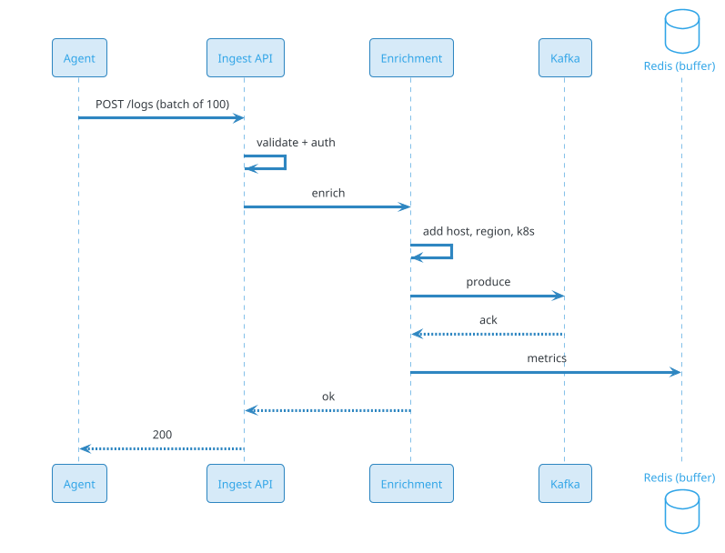

# Log Ingestion System (ELK / Splunk / Datadog / Fluentd)

## Problem Statement

Design a log ingestion and analytics system that collects logs from thousands of services, buffers them, processes them, and makes them searchable in near real-time. Think ELK Stack (Elasticsearch, Logstash, Kibana), Splunk, Datadog, or Grafana Loki. The system must handle petabytes per day, support structured and unstructured logs, enable fast search, and provide alerting on log patterns.

**Example:**

```
Log ingestion flow:
  1. Service emits log: {"timestamp": "2026-09-19T10:00:00Z", "level": "ERROR", "service": "checkout", "message": "Payment failed", "user_id": "u-123", "trace_id": "abc123"}
  2. Agent (Fluentd/Filebeat) on host captures log line
  3. Agent buffers locally (if backend down)
  4. Agent sends to ingestion endpoint (HTTP/gRPC)
  5. Ingestion service validates and enriches (adds host, region, environment)
  6. Log published to Kafka (durable buffer)
  7. Consumers process:
     - Parse structured fields
     - Filter (drop noisy logs)
     - Aggregate (metrics)
     - Index for search
  8. Store in:
     - Hot storage (Elasticsearch) for last 7 days
     - Warm (S3 + OpenSearch) for 30 days
     - Cold (S3 Glacier) for 1 year
  9. Users query via Kibana/Grafana
 10. Alerts triggered on patterns (e.g., 5+ ERROR in 1 min)

Key challenges:
  - Scale: PB/day, billions of events
  - Buffering: Handle burst, backpressure
  - Durability: Never lose logs
  - Search: Sub-second on hot data
  - Retention: Hot/warm/cold tiers
  - Cost: Storage dominates
  - Structure: JSON, plain text, syslog
  - Enrichment: Add context (host, k8s metadata)
  - Cardinality: High-cardinality fields (user_id, trace_id)
  - Backpressure: Agents must not crash services

Scale:
  - 100K services
  - 10B log events/day (~115,740/sec avg, 578,700/sec peak)
  - 1 PB log volume/day
  - 100 TB hot (7 days)
  - 1 PB warm (30 days)
  - 10 PB cold (1 year)
  - 10K queries/sec (peak)
```

**Real-world systems:** ELK Stack, Splunk, Datadog, Grafana Loki, Sumo Logic, New Relic, AWS CloudWatch Logs, GCP Cloud Logging.

**Why it's interesting:**

- **Massive scale** — petabytes per day
- **Durability** — logs must never be lost (compliance, debugging)
- **Backpressure** — agents must not crash services
- **Structured + unstructured** — JSON, plain text, syslog
- **Indexing** — fast search on hot data
- **Tiering** — hot/warm/cold for cost
- **High cardinality** — user_id, trace_id
- **Alerting** — real-time on patterns
- **Multi-tenant** — per-service quotas
- **Compliance** — retention policies, PII handling

---

## 1. Requirements Clarification

### Functional Requirements
- **Collect logs**: From apps, containers, VMs
- **Parse**: Structured (JSON, logfmt), unstructured
- **Enrich**: Add host, region, k8s metadata
- **Buffer**: Handle bursts, backpressure
- **Index**: Fast search (hot data)
- **Query**: Full-text, structured filters
- **Aggregate**: Metrics from logs
- **Alert**: On patterns
- **Retain**: Per tier (hot/warm/cold)
- **Export**: To S3, other systems
- **Multi-tenant**: Per-team isolation
- **Sampling**: Drop debug logs at high volume

### Non-Functional Requirements
- **Scale**: 10B events/day, 1 PB/day, 578K events/sec peak
- **Latency**: Ingest to searchable < 30 sec
- **Availability**: 99.99% (critical for observability)
- **Durability**: Never lose logs (at-least-once)
- **Throughput**: 578K events/sec peak
- **Query latency**: < 1 sec p99 for hot data
- **Retention**: 7 days hot, 30 days warm, 1 year cold
- **Cost**: Storage dominates
- **Compliance**: GDPR, PII redaction, retention
- **Security**: Encryption, access controls

### Out of Scope
- Metrics (Prometheus, separate)
- Traces (Jaeger, separate)
- APM (application monitoring)
- SIEM (security, overlapping)

---

## 2. Back-of-Envelope Estimation

### Traffic

```
Given:
  Services             = 100,000
  Log events/day       = 10,000,000,000
  Avg log size         = 1 KB
  Peak multiplier      = 5x
  Concurrent agents    = 100,000

Average QPS:
  Events = 10B / 86,400 = ~115,740/sec
  Peak: ~578,700/sec

Bandwidth:
  Avg: 115,740 x 1 KB = ~116 MB/sec = ~928 Mbps
  Peak: ~4.6 Gbps
  Daily: 10B x 1 KB = ~10 TB/day
  Monthly: ~300 TB/month
```

### Storage

```
Raw logs (hot, 7 days):
  10 TB/day x 7 = ~70 TB

Index (Elasticsearch, hot):
  30% overhead = ~21 TB
  Total hot: ~91 TB

Warm (30 days):
  S3 + OpenSearch = ~300 TB
  Index: ~90 TB

Cold (1 year):
  S3 Glacier = ~3.6 PB (compressed)
  Compression: 5x → ~730 TB

Total hot: ~91 TB
Total warm: ~390 TB
Total cold: ~730 TB
```

### Bandwidth

```
Ingestion:
  Peak: ~4.6 Gbps (ingress)

Search responses:
  10K/sec x 100 KB = ~1 GB/sec = ~8 Gbps
  Peak: ~40 Gbps

Internal (Kafka, ES):
  ~20 Gbps peak

Total: ~65 Gbps peak
```

### Latency Budget

```
Ingest to searchable:
  Agent capture:                 ~10 ms
  Ingest API:                    ~20 ms
  Kafka produce:                 ~10 ms
  Consumer process:              ~50 ms
  Elasticsearch index:           ~200 ms
  Refresh (searchable):          ~1 sec
  Total:                         ~1.3 sec

Target: < 30 sec.

Query:
  Parse query:                   ~5 ms
  Elasticsearch query:           ~100-500 ms
  Aggregation:                   ~50 ms
  Response:                      ~50 ms
  Total:                         ~200-600 ms
```

---

## 3. High-Level Design

```d2
direction: down

app: "Application" {shape: cloud}
agent: "Log Agent (Fluentd/Filebeat)" {shape: rectangle}

lb: Load Balancer {shape: hexagon}
ingest: "Ingest API" {shape: hexagon}

enrich: "Enrichment Service" {shape: rectangle}
router: "Router (Kafka producer)" {shape: rectangle}
processor: "Log Processor (Flink)" {shape: rectangle}
aggregator: "Metric Aggregator" {shape: rectangle}
alert: "Alert Service" {shape: rectangle}
indexer: "Indexer" {shape: rectangle}
query: "Query Service" {shape: rectangle}

kafka: Kafka {shape: queue}

es: "Elasticsearch (hot)" {shape: cylinder}
s3: "S3 (warm/cold)" {shape: cylinder}
opensearch: "OpenSearch (warm)" {shape: cylinder}
ch: "ClickHouse (analytics)" {shape: cylinder}
redis: "Redis (buffer, cache)" {shape: cylinder}
pdb: "PostgreSQL (config)" {shape: cylinder}

app -> agent
agent -> lb
lb -> ingest
ingest -> enrich
enrich -> router
router -> kafka

kafka -> processor
kafka -> aggregator
kafka -> indexer

processor -> es
processor -> s3
processor -> ch
indexer -> es
aggregator -> alert
aggregator -> ch

query -> es
query -> opensearch
query -> s3
query -> ch
```

### Component Responsibilities

| Component | Role |
|---|---|
| Log Agent | Collect logs on host, forward |
| Ingest API | Receive, validate, route |
| Enrichment Service | Add metadata (host, k8s, region) |
| Router | Produce to Kafka |
| Log Processor | Parse, filter, transform |
| Metric Aggregator | Extract metrics from logs |
| Alert Service | Trigger alerts on patterns |
| Indexer | Write to Elasticsearch |
| Query Service | Search and retrieve |
| Kafka | Durable buffer, decoupling |
| Elasticsearch | Hot storage (7 days) |
| S3 | Warm/cold storage |
| OpenSearch | Warm queries |
| ClickHouse | Analytics |
| Redis | Buffer, cache |
| PostgreSQL | Config, users |

### Why This Architecture

- **Kafka** as central buffer (durable, decoupled)
- **Elasticsearch** for hot search (fast)
- **S3** for warm/cold (cheap)
- **ClickHouse** for analytics
- **Agents** with local buffer (backpressure)
- **Enrichment** separate (fast, stateless)

---

## 4. Deep Dive: Log Collection Agents

### Agent Responsibilities

- **Tail** log files
- **Parse** formats (JSON, syslog)
- **Add** metadata (host, container)
- **Buffer** locally (disk, memory)
- **Forward** to backend
- **Backoff** on failure

### Agent Options

- **Fluentd**: Ruby, plugin-rich
- **Fluent Bit**: C, lightweight
- **Filebeat**: Go, Elastic
- **Vector**: Rust, high-performance
- **Promtail**: Grafana Loki
- **Logstash**: JVM, heavy

**Recommendation:** Fluent Bit (lightweight) or Vector (performance).

### Agent Architecture

```d2
direction: right

input: "Input (tail file)" {shape: rectangle}
parser: "Parser" {shape: rectangle}
filter: "Filter" {shape: rectangle}
buffer: "Buffer (memory + disk)" {shape: rectangle}
output: "Output (HTTP)" {shape: rectangle}

input -> parser
parser -> filter
filter -> buffer
buffer -> output
```

### Backpressure

**Problem:** Service emits 10x normal logs; agent can't keep up.

**Solutions:**
1. **Disk buffer**: Write to disk; retry on backend recovery
2. **Drop**: Drop oldest or newest when full
3. **Rate limit**: Throttle
4. **Sampling**: Drop debug logs when overloaded

**Recommended:** Disk buffer (durable), size-limited (1 GB default).

### Agent Config Example

```yaml
# Fluent Bit config
[INPUT]
    Name tail
    Path /var/log/app/*.log
    Tag app
    Parser json

[FILTER]
    Name kubernetes
    Match app
    Kube_URL https://kubernetes.default.svc

[OUTPUT]
    Name http
    Match *
    Host ingest.logs.example.com
    Port 443
    URI /v1/logs
    Format json
    Retry_Limit False
    storage.total_limit_size 1G
```

### Agent Scale

```
100K services
1-3 agents per host
~300K agents globally

Per agent: ~400 events/sec avg
Peak: ~2K events/sec per agent
```

---

## 5. Deep Dive: Ingest Pipeline

### Ingest API

- **HTTP/gRPC**: Accept logs
- **Auth**: API key, mTLS
- **Rate limit**: Per service
- **Validation**: Schema, size
- **Routing**: To correct Kafka topic

### Ingest Flow



### Batching

- **Agent**: Batch 100-1000 events
- **API**: Accept batch, process
- **Kafka**: Produce batch

**Benefit:** 10x throughput vs one-by-one.

### Enrichment

**Add context:**
- **Host**: Hostname, IP
- **Kubernetes**: Namespace, pod, container, node
- **Region**: Datacenter, AZ
- **Environment**: prod, staging, dev
- **Service**: From tags
- **Version**: App version

**Cached:** K8s metadata in Redis (from API server).

### Filtering

- **Drop** debug logs (sample)
- **Redact** PII (regex)
- **Transform** (rename fields)
- **Route** to different topics

### Ingest Scale

```
578K events/sec peak
Batch size: 100 events
= ~5,780 batches/sec
Ingest API: ~50 instances
Enrichment: ~50 instances
```

---

## 6. Deep Dive: Kafka as Buffer

### Why Kafka?

- **Durable**: Logs persisted to disk
- **Scalable**: Partitioned, distributed
- **Ordered**: Per-partition ordering
- **Replayable**: Consumers can replay
- **Decoupled**: Producers and consumers independent

### Topic Design

```
Topic: logs
Partitions: 100+
Replication: 3
Retention: 24 hours (short; S3 for long)
```

**Partition by:**
- **service_id** (per-service ordering)
- **trace_id** (correlate logs from one request)
- **hash(host)** (per-host ordering)

**Recommendation:** service_id.

### Consumers

- **Log Processor**: Enrich, filter, route to ES/S3
- **Metric Aggregator**: Extract metrics
- **Alert Service**: Pattern detection
- **Cold Storage Writer**: Batch to S3

### Kafka Scale

```
578K events/sec
= ~580 MB/sec (1 KB each)

Kafka cluster:
  Brokers: ~30
  Partitions: 300
  Replication: 3
  Disk: ~100 TB (24h retention)
```

### Consumer Lag

- **Monitor**: Consumer offset lag
- **Alert**: If lag > 5 min
- **Auto-scale**: Add consumers if lag
- **Backpressure**: Slow producers if severe

### Schema

- **Schema Registry**: Avro/Protobuf for logs
- **Versioning**: Backward compatible
- **Validation**: At producer

### Dead Letter Topic

- **Malformed logs**: To DLQ
- **Unknown schema**: To DLQ
- **Review**: Manually fix

---

## 7. Deep Dive: Processing and Indexing

### Log Processor

- **Consume** from Kafka
- **Parse** (structured, unstructured)
- **Transform** (fields, format)
- **Filter** (drop, sample)
- **Route** to Elasticsearch, S3, ClickHouse

### Parsing

**Structured (JSON):**
```json
{"timestamp": "...", "level": "ERROR", "message": "..."}
```
→ Direct field mapping.

**Logfmt:**
```
ts=2026-09-19T10:00:00Z level=error msg="Payment failed"
```
→ Parse key=value.

**Unstructured:**
```
2026-09-19 10:00:00 ERROR Payment failed for user u-123
```
→ Regex or ML extraction.

### Indexing to Elasticsearch

**Index naming:**
```
logs-{service}-{date}
e.g., logs-checkout-2026.09.19
```

**Benefits:**
- Per-service isolation
- Easy retention (delete old indices)
- Efficient queries (only relevant services)

**Mappings:**
```json
{
  "mappings": {
    "properties": {
      "timestamp": {"type": "date"},
      "level": {"type": "keyword"},
      "service": {"type": "keyword"},
      "message": {"type": "text"},
      "trace_id": {"type": "keyword"},
      "user_id": {"type": "keyword"}
    }
  }
}
```

### Refresh Strategy

- **Real-time**: Refresh every 1 sec (expensive)
- **Near-real-time**: Refresh every 5 sec
- **Bulk**: Refresh every 30 sec

**Recommendation:** 5 sec (balance).

### Index Rotation

- **Daily index**: New index per day
- **Rollover**: When 50 GB or 1 day
- **Alias**: `logs-{service}` → current index
- **Retention**: Delete indices older than N days

### Batch Writes

- **Bulk API**: 1000 docs per request
- **Parallel**: Multiple shards
- **Backpressure**: If ES slow, buffer

### Indexing Scale

```
578K events/sec
Bulk size: 1000
= ~580 bulk requests/sec
Indexers: ~50 instances
Elasticsearch: ~30 nodes
```

---

## 8. Deep Dive: Storage Tiers

### Hot (Elasticsearch)

- **Duration**: 7 days
- **Storage**: SSD
- **Use**: Real-time search
- **Cost**: High ($0.10/GB)
- **Size**: ~91 TB

### Warm (OpenSearch + S3)

- **Duration**: 30 days
- **Storage**: HDD
- **Use**: Occasional search
- **Cost**: Medium ($0.02/GB)
- **Size**: ~390 TB

### Cold (S3 Glacier)

- **Duration**: 1 year
- **Storage**: Glacier
- **Use**: Compliance, rare search
- **Cost**: Low ($0.004/GB)
- **Size**: ~730 TB

### Query Flow

```
1. User queries (e.g., "ERROR in checkout last 7 days")
2. Query Service determines time range
3. If < 7 days: Elasticsearch
4. If 7-30 days: OpenSearch
5. If > 30 days: S3 + Presto/Athena
6. Merge results
```

### Tiering Strategy

- **On index age**: Move to next tier
- **Automatic**: Elasticsearch ILM (Index Lifecycle Management)
- **Manual**: Some control

### Retention Policies

- **Default**: 30 days
- **Compliance**: 1 year (financial), 7 years (healthcare)
- **User-configured**: Per service

### Cost Optimization

- **Compression**: 5x (S3)
- **Columnar**: Parquet (S3)
- **Sampling**: Drop debug at high volume
- **Tiering**: Hot → warm → cold

### Storage Scale

```
Hot: 91 TB
Warm: 390 TB
Cold: 730 TB

Total: ~1.2 PB

Cost:
  Hot: $9K/month
  Warm: $8K/month
  Cold: $3K/month
  Total: ~$20K/month
```

---

## 9. Deep Dive: Query and Search

### Query Types

**1. Full-text:**
- "Payment failed" in message
- Tokenized, relevance-ranked

**2. Structured:**
- `level:ERROR AND service:checkout`
- Exact match

**3. Range:**
- `timestamp:[now-1h TO now]`

**4. Aggregation:**
- `count by level` (histogram)
- `top 10 services`

**5. Live tail:**
- Stream logs (like `tail -f`)

### Query Service

- **Parse** query (DSL, Lucene, SQL)
- **Route** to correct tier
- **Execute** in parallel
- **Aggregate** results
- **Paginate**

### Kibana / Grafana

- **UI**: Query builder, visualization
- **Dashboards**: Pre-built
- **Alerts**: On query results

### Query Performance

- **Caching**: Redis for frequent queries
- **Index**: Optimized mappings
- **Sharding**: By service, date
- **Filter**: Push down

### Live Tail

- **WebSocket**: Real-time
- **Subscribe**: To specific service/tag
- **Backpressure**: Server-side buffer

### Query Scale

```
10K queries/sec peak
Per query:
  Parse: ~5 ms
  Execute: ~200-600 ms
  Aggregate: ~50 ms

Query Service: ~50 instances
Elasticsearch: ~30 nodes
```

---

## 10. Deep Dive: Alerting

### Alert on Logs

**Pattern:**
- `level:ERROR AND service:checkout` > 5 in 1 min

**Implementation:**
- Flink/ClickHouse query
- Rolling window
- Trigger on threshold

### Alert Types

- **Threshold**: Count > N in T
- **Pattern**: Regex match
- **Anomaly**: ML on log rate
- **Missing**: Service stops logging

### Alert Delivery

- **Slack, PagerDuty, Opsgenie**
- **Email, SMS**
- **Webhook** (custom)

### Alert Deduplication

- **Fingerprint**: Hash of alert (service + error)
- **Cooldown**: 5 min between same alert
- **Grouping**: Similar alerts bundled

### Alert Scale

```
10K alerts/day
Peak: ~50/sec

Alert Service: ~10 instances
```

### Examples

- **High error rate**: "checkout service error rate > 5%"
- **Specific error**: "PaymentException > 10/min"
- **Anomaly**: "Log volume 3x normal"
- **Missing**: "No logs from service X in 10 min"

---

## 11. Deep Dive: Cost Optimization

### Cost Drivers

- **Storage**: ~60%
- **Compute** (Kafka, ES, processors): ~25%
- **Bandwidth**: ~10%
- **Other**: ~5%

### Optimization Strategies

**1. Sampling:**
- Drop debug logs (or sample 1%)
- Drop health checks
- Drop repetitive logs

**2. Compression:**
- gzip on agent
- 5-10x reduction
- Trade-off: CPU

**3. Tiering:**
- Hot (7d) → warm (30d) → cold (1y)
- 10x cost reduction

**4. Index optimization:**
- Only index needed fields
- `doc_values: false` for text
- Avoid high cardinality

**5. Retention:**
- Reduce retention for noisy logs
- Archive to S3 instead of Elasticsearch

**6. Filtering:**
- Drop at agent (before transmission)
- Drop at ingest (before Kafka)
- Drop at processor (before ES)

### Cardinality

**High-cardinality fields:**
- user_id, trace_id, request_id
- Cause index explosion

**Solutions:**
- **Don't index**: Store but don't index
- **Hash**: If needed, hash
- **Sample**: Only sample some
- **Separate index**: For high-cardinality

### Cost Estimate

```
Raw: 10 TB/day
After sampling: 5 TB/day
After compression: 1 TB/day

Hot (7 days): 7 TB
Warm (30 days): 30 TB
Cold (1 year): 365 TB

Cost:
  Hot: $700/month
  Warm: $600/month
  Cold: $1,500/month
  Compute: $5,000/month
  Total: ~$7,800/month
```

**vs without optimization: $50K+/month.**

---

## 12. Scaling Considerations

### Read Scaling

- **Elasticsearch**: More nodes, replicas
- **Query cache**: Redis
- **CDN**: For dashboards (rare)
- **Read replicas**: For OpenSearch

### Write Scaling

- **Kafka**: More partitions, brokers
- **Processors**: More instances
- **Elasticsearch**: More shards

### Sharding

**Kafka:** Partition by service_id.
**Elasticsearch:** Index per service + date.
**ClickHouse:** Partition by date.

### Multi-Region

- **Per-region** ingestion
- **Global** query (or per-region)
- **Data residency** (GDPR)

### Peak Handling

- **Incidents**: 10x logs
- **Deploys**: 3x logs
- **Marketing events**: 5x logs

**Mitigations:**
- Auto-scale
- Sample aggressively
- Drop debug
- Queue in Kafka

### Cost Optimization

| Component | Optimization |
|---|---|
| Storage | Tiering, compression |
| Kafka | Retention (24h) |
| Elasticsearch | ILM, right-size |
| Compute | Spot, reserved |

---

## 13. Bottlenecks and Trade-offs

| Concern | Solution | Trade-off |
|---|---|---|
| Volume | Sampling, filtering | Loss of detail |
| Latency | Refresh interval | Freshness |
| Cardinality | Don't index high-card | Query limits |
| Cost | Tiering | Retrieval latency |
| Search | Index strategy | Storage |
| Backpressure | Kafka, disk buffer | Complexity |
| Multi-tenant | Per-tenant quotas | Complexity |

### Design Decisions Summary

| Decision | Choice | Rationale |
|---|---|---|
| Agent | Fluent Bit / Vector | Lightweight |
| Buffer | Kafka | Durable, decoupled |
| Hot storage | Elasticsearch | Fast search |
| Warm | OpenSearch + S3 | Balanced |
| Cold | S3 Glacier | Cheap |
| Analytics | ClickHouse | Fast aggregation |
| Query | Tiered routing | Cost |
| Alerts | Flink + rules | Real-time |

---

## 14. Failure Scenarios

### Ingest API Down

**Impact:** Logs delayed.

**Mitigation:**
- Agent disk buffer
- Retry with backoff
- Auto-restart
- Alert ops

### Kafka Down

**Impact:** Logs delayed.

**Mitigation:**
- Agent buffer
- Ingest buffer
- Retry
- Alert ops

### Elasticsearch Down

**Impact:** No hot search.

**Mitigation:**
- Buffer in Kafka
- Replay on recovery
- Query warm/cold
- Alert ops

### Agent Down

**Impact:** Logs from that host missing.

**Mitigation:**
- Auto-restart
- Health check
- Alternative agent
- Alert ops

### Disk Full (Agent)

**Impact:** No buffering.

**Mitigation:**
- Circular buffer
- Drop oldest
- Alert ops

### Disk Full (Kafka)

**Impact:** Backpressure.

**Mitigation:**
- Shorter retention
- More brokers
- Alert ops

### Query Slow

**Impact:** User frustration.

**Mitigation:**
- Cache
- Index optimization
- More nodes
- Alert ops

### Cardinality Explosion

**Impact:** Index bloat.

**Mitigation:**
- Don't index high-card
- Hash
- Sample
- Alert ops

### Data Breach

**Impact:** Logs exposed.

**Mitigation:**
- Encryption
- Access controls
- PII redaction
- Incident response

### DDoS

**Impact:** Service unavailable.

**Mitigation:**
- Rate limit
- WAF
- Alert ops

---

## 15. Monitoring and Alerts

### Key Metrics

| Metric | Target | Alert Threshold |
|---|---|---|
| Ingest p99 | < 100 ms | > 500 ms |
| Ingest to searchable | < 30 sec | > 5 min |
| Kafka consumer lag | < 10 sec | > 5 min |
| Elasticsearch p99 | < 500 ms | > 2 sec |
| Query p99 | < 1 sec | > 3 sec |
| Index refresh | < 5 sec | > 30 sec |
| Disk usage (agent) | < 70% | > 90% |
| Error rate | < 0.1% | > 1% |
| Ingestion rate | baseline | drop > 30% |
| Alert latency | < 1 min | > 5 min |

### Dashboards

- **Traffic**: Events/sec, by service
- **Latency**: Ingest, index, query
- **Storage**: Per tier, growth
- **Kafka**: Lag, throughput
- **Elasticsearch**: Cluster health
- **Alerts**: Firing, resolved
- **Cost**: Per service, per tier
- **Errors**: Parse, schema

### Alerts

- **P0**: Ingest down, Kafka down, ES down
- **P1**: Lag > 5 min, query p99 > 3 sec
- **P2**: Disk > 90%, high cardinality
- **P3**: Sampling spike, cost anomaly

### Business KPIs

- **Coverage**: % services sending logs
- **Freshness**: Lag
- **Query success rate**
- **MTTR** (incident response)
- **Cost per GB**

---

## 16. Cost Estimation

Rough monthly cost (AWS, us-east-1) for 10B events/day:

| Component | Spec | Cost/month |
|---|---|---|
| Ingest API | 100 x c6g.large | ~$6,000 |
| Enrichment | 100 x c6g.large | ~$6,000 |
| Processors | 100 x c6g.2xlarge | ~$24,000 |
| Kafka (MSK) | 30 brokers | ~$15,000 |
| Elasticsearch (hot) | 30 x r6g.4xlarge | ~$180,000 |
| OpenSearch (warm) | 20 x r6g.2xlarge | ~$60,000 |
| ClickHouse | 20 x i3.2xlarge | ~$20,000 |
| Redis | 20 x cache.r6g.2xlarge | ~$10,000 |
| S3 (warm) | 300 TB | ~$7,000 |
| S3 Glacier (cold) | 3.6 PB | ~$14,000 |
| Bandwidth | ~4.6 Gbps peak | ~$50,000 |
| Monitoring | Datadog | ~$30,000 |
| **Total** | | **~$422,000/month** |

**Per GB:** ~$0.042.

**Cost breakdown:**
- **Elasticsearch**: ~43%
- **OpenSearch**: ~14%
- **Storage**: ~5%
- **Compute**: ~20%
- **Other**: ~18%

**Cost optimization:**
- **Sampling**: 50% reduction
- **Compression**: 5x on S3
- **Tiering**: Cheaper storage
- **Right-size ES**: Overprovisioning common
- **Retention**: Shorter for noise

---

## 17. Extensions and Follow-ups

### Structured Logging Standards

- JSON-first
- OpenTelemetry logs
- Semantic conventions

### Log-to-Metrics

- Extract metrics from logs
- Prometheus exposition
- Grafana integration

### Log-to-Traces

- Trace ID correlation
- Distributed tracing
- Jaeger/Zipkin

### Machine Learning

- Anomaly detection
- Log clustering
- Pattern mining
- Auto-alerting

### Compliance

- PII redaction
- Retention policies
- Audit logs
- GDPR/DPDP

### Cost Optimization Tools

- Custom dashboards
- Per-service cost
- Recommendations

### Real-Time Analytics

- Streaming SQL
- Flink/Kafka Streams
- Interactive queries

### Security (SIEM)

- Security events
- Threat detection
- Incident response

### Log Sampling Advanced

- Adaptive sampling
- Priority-based
- Tail-based

### Edge Processing

- Filter at edge
- Reduce egress
- Faster decisions

### Web3

- Immutable log storage
- Blockchain audit
- Rare

---

## 18. Summary

| Aspect | Decision |
|---|---|
| Agent | Fluent Bit / Vector |
| Ingest | HTTP/gRPC with batching |
| Buffer | Kafka (24h retention) |
| Hot storage | Elasticsearch (7 days) |
| Warm | OpenSearch + S3 (30 days) |
| Cold | S3 Glacier (1 year) |
| Analytics | ClickHouse |
| Query | Tiered routing |
| Alerts | Flink + rules |
| Scale | 10B events/day, 578K/sec peak |
| Latency | Ingest to search < 30 sec |
| Availability | 99.99% |
| Durability | At-least-once |
| Cost | ~$422K/month |

**Key takeaways:**

- **Kafka is the backbone** — durable buffer, decouples producers from consumers
- **Agents with disk buffer** — backpressure without crashing services
- **Tiered storage** — hot (ES), warm (S3 + OpenSearch), cold (Glacier)
- **Sampling + filtering** — critical for cost
- **Cardinality control** — high-cardinality fields cost a lot
- **Index strategy** — per service per day for efficiency
- **Real-time alerts** — Flink on Kafka stream
- **Cost dominated by Elasticsearch** — optimize aggressively
- **Observability** — logs, metrics, traces correlated by trace_id
- **Compliance** — PII redaction, retention policies

### Similar Pattern Problems

- Metrics / Monitoring — similar ingestion, different data
- Distributed Tracing — spans instead of logs
- Web Crawler — content ingestion at scale
- Notification System — event fan-out
- Fraud Detection — event stream processing
- Content Moderation — content ingestion and analysis