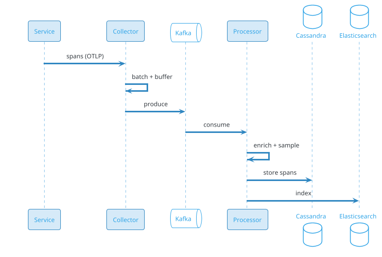

# Distributed Tracing (Jaeger / Zipkin / OpenTelemetry)

## Problem Statement

Design a distributed tracing system like Jaeger, Zipkin, or Datadog APM. In a microservices architecture, a single user request can traverse dozens of services. Tracing captures the end-to-end journey of a request — every service call, database query, and external API call — as a set of spans organized into a trace. The system must collect traces at scale, store them efficiently, and enable fast queries to debug performance issues and failures.

**Example:**

```
A single user request produces one trace:

Trace ID: abc123 (spans across services)

[API Gateway] ─────────────────────────────────────────────►
   │  50 ms
   ├──[Auth Service]───► (10 ms)
   │
   ├──[Order Service]──────────────────────────► (100 ms)
   │        │
   │        ├──[Database]──► (20 ms)
   │        ├──[Payment Service]────► (80 ms)
   │        └──[Inventory Service]──► (15 ms)
   │
   └──[Notification Service]──► (5 ms)

Total latency: 150 ms
Critical path: API → Order → Payment (100 ms)

Without tracing: "The page is slow" 
With tracing: "Payment Service took 80 ms, 53% of latency"

Scale:
  - 100M traces/day
  - 1B spans/day (~11,574/sec avg, 57,870/sec peak)
  - 100K services
  - 100 spans per trace avg
  - 7-day hot retention
  - 30-day warm
  - 1-year cold
  - Sampling: 1-10%
```

**Real-world systems:** Jaeger, Zipkin, OpenTelemetry, Datadog APM, New Relic, Lightstep, Honeycomb, AWS X-Ray, Google Cloud Trace.

**Why it's interesting:**

- **Distributed context propagation** — trace_id across services
- **Span model** — parent-child relationships
- **Sampling** — can't store every trace (too much)
- **High cardinality** — trace_id unique
- **Storage efficiency** — traces are huge
- **Query latency** — find a trace by ID in seconds
- **Correlation** — with logs and metrics
- **Cost** — storage + ingestion dominate
- **OpenTelemetry** — emerging standard
- **Root cause analysis** — pinpoint slow service

---

## 1. Requirements Clarification

### Functional Requirements
- **Capture spans**: At every service boundary
- **Propagate context**: trace_id, span_id across services
- **Collect spans**: From services
- **Store traces**: Efficiently
- **Query**: By trace_id, service, duration, error, tag
- **Visualize**: Timeline, waterfall, service map
- **Sampling**: Head-based, tail-based
- **Correlate**: With logs, metrics
- **Alerting**: On latency, errors
- **Retention**: 7-30 days typical
- **Multi-language**: SDKs for all languages

### Non-Functional Requirements
- **Scale**: 1B spans/day, 100K services
- **Latency**: Ingest to queryable < 1 min
- **Availability**: 99.9%
- **Durability**: Traces not lost (sampled)
- **Query latency**: < 5 sec for trace by ID
- **Storage**: Efficient (compression)
- **Cost**: Sampling essential
- **Compliance**: PII redaction

### Out of Scope
- Logs (ELK — separate)
- Metrics (Prometheus — separate)
- APM (application monitoring)
- Profiling (continuous)

---

## 2. Back-of-Envelope Estimation

### Traffic

```
Given:
  Services             = 100,000
  Traces/day           = 100,000,000
  Spans per trace      = 100
  Spans/day            = 10,000,000,000
  Sampling             = 1-10% (varies)
  Peak multiplier      = 5x

Average QPS:
  Spans = 10B / 86,400 = ~115,740/sec
  With 10% sampling: ~11,574/sec
  
Peak QPS:
  Spans = ~578,700/sec
  With sampling: ~57,870/sec

Bytes per span:
  ~500 bytes (span_id, parent, service, operation, tags, logs)
  = ~50 KB per trace

Total ingest:
  11,574 spans/sec x 500 bytes = ~5.8 MB/sec avg
  Peak: ~29 MB/sec
```

### Storage

```
Spans (raw):
  10B spans/day x 500 bytes = ~5 TB/day
  With 10% sampling: ~500 GB/day
  7 days: ~3.5 TB
  30 days: ~15 TB
  1 year: ~180 TB

Index:
  Trace_id index: 100M traces/day x 64 bytes = ~6.4 GB/day
  Service index: ~1 GB/day

Total hot: ~4 TB
Total warm: ~15 TB
Total cold: ~180 TB
```

### Bandwidth

```
Ingest:
  Peak: ~29 MB/sec = ~232 Mbps

Query:
  1K queries/sec x 100 KB = ~100 MB/sec
  Peak: ~500 MB/sec = ~4 Gbps

Total: ~5 Gbps peak
```

### Latency Budget

```
Span ingest:
  Client → Collector:            ~10 ms
  Buffer (Kafka):                ~100 ms
  Process:                       ~20 ms
  Store:                         ~50 ms
  Queryable:                     ~1 min (batch)
  Total:                         ~2 min

Query by trace_id:
  Parse:                         ~5 ms
  Fetch from storage:            ~500 ms
  Aggregate:                     ~100 ms
  Response:                      ~200 ms
  Total:                         ~800 ms

Target: < 5 sec.
```

---

## 3. High-Level Design

```d2
direction: down

service: "Service (instrumented)" {shape: cloud}
sdk: "OpenTelemetry SDK" {shape: rectangle}

lb: Load Balancer {shape: hexagon}
collector: "OTel Collector" {shape: hexagon}

buffer: "Kafka (buffer)" {shape: queue}
processor: "Span Processor" {shape: rectangle}
sampler: "Sampler" {shape: rectangle}
storage: "Span Store" {shape: cylinder}
index: "Index (ES)" {shape: cylinder}
query: "Query Service" {shape: rectangle}
ui: "UI (Jaeger/Grafana)" {shape: rectangle}

s3: "S3 (archive)" {shape: cylinder}
cass: "Cassandra (spans)" {shape: cylinder}
es: "Elasticsearch (index)" {shape: cylinder}
redis: "Redis (cache)" {shape: cylinder}

service -> sdk
sdk -> lb
lb -> collector
collector -> buffer
buffer -> processor
processor -> sampler
sampler -> storage
sampler -> index

query -> storage
query -> index
query -> redis
ui -> query

storage -> s3
```

### Component Responsibilities

| Component | Role |
|---|---|
| Service | Instrumented app |
| OpenTelemetry SDK | Generate spans |
| Load Balancer | Route to collectors |
| Collector | Receive spans, batch |
| Kafka | Durable buffer |
| Processor | Enrich, sample |
| Sampler | Head/tail sampling |
| Storage | Store spans (Cassandra) |
| Index | Search index (ES) |
| Query Service | Query engine |
| UI | Visualization |
| S3 | Long-term archive |
| Cassandra | Span storage |
| Elasticsearch | Index |
| Redis | Cache |

### Why This Architecture

- **OTel SDK** as standard
- **Collector** as gateway (batch, retry)
- **Kafka** for durability + decoupling
- **Sampler** — critical for cost
- **Cassandra** for spans (write-heavy)
- **Elasticsearch** for index
- **S3** for long-term

---

## 4. Deep Dive: Trace and Span Model

### Trace

A **trace** = a single request's full journey:
- **trace_id**: 128-bit unique ID
- **Spans**: Individual operations
- **Root span**: Entry point
- **Child spans**: Downstream calls

### Span

A **span** = a single operation:
- **span_id**: 64-bit
- **trace_id**: 128-bit
- **parent_span_id**: 64-bit (or null for root)
- **service_name**: Which service
- **operation_name**: What operation (e.g., `GET /api/users`)
- **start_time**: Timestamp
- **duration**: Nanoseconds
- **tags**: Key-value (http.method, db.statement)
- **logs**: Events (e.g., error)
- **status**: OK, ERROR

### Span Structure

```json
{
  "trace_id": "abc123def456...",
  "span_id": "span-789",
  "parent_span_id": "span-456",
  "service_name": "checkout",
  "operation_name": "POST /api/checkout",
  "start_time": "2026-09-19T10:00:00.123456Z",
  "duration_ns": 150000000,
  "tags": {
    "http.method": "POST",
    "http.status_code": 200,
    "user_id": "u-123",
    "span.kind": "server"
  },
  "logs": [
    {"timestamp": "...", "event": "error", "message": "Payment failed"}
  ],
  "status": "OK"
}
```

### Span Context Propagation

**W3C Trace Context** (standard):
```
traceparent: 00-{trace_id}-{span_id}-{flags}
tracestate: vendor=value
```

**Example:**
```
traceparent: 00-4bf92f3577b34da6a3ce929d0e0e4736-00f067aa0ba902b7-01
```

Sent via HTTP headers, gRPC metadata, message queue headers.

### Span Relationships

```
Root Span (GET /checkout)
  ├── Span (auth check)
  ├── Span (fetch cart)
  │     └── Span (db query)
  ├── Span (process payment)
  │     └── Span (external API call)
  └── Span (send email)
```

### Span Kinds

- **SERVER**: Handles incoming request
- **CLIENT**: Makes outgoing request
- **PRODUCER**: Sends message
- **CONSUMER**: Receives message
- **INTERNAL**: Internal operation

### Span Scale

```
100M traces/day
100 spans/trace = 10B spans/day
~115K spans/sec avg
Peak: ~578K/sec
```

---

## 5. Deep Dive: Instrumentation

### Auto-Instrumentation

Most modern frameworks support automatic tracing:
- **HTTP clients/servers**: Express, Spring, Flask, Django
- **Databases**: JDBC, MongoDB, Redis
- **Message queues**: Kafka, RabbitMQ
- **gRPC**: Native support

**Benefit:** No code changes; instant coverage.

### Manual Instrumentation

For business-specific operations:
```java
Span span = tracer.spanBuilder("custom-operation").startSpan();
try (Scope scope = span.makeCurrent()) {
    // do work
    span.setAttribute("user.id", userId);
} catch (Exception e) {
    span.recordException(e);
    span.setStatus(StatusCode.ERROR);
} finally {
    span.end();
}
```

### Context Propagation

**HTTP:**
```java
// Extract from incoming request
Context context = tracer.extract(TextMapGetter, request.headers);

// Inject into outgoing request
tracer.inject(context, TextMapSetter, outgoingRequest.headers);
```

### Sampling at SDK

- **Always**: 100% (expensive)
- **Never**: 0% (no traces)
- **Probabilistic**: 1% random
- **Rate limiting**: N traces/sec
- **Parent-based**: Sample if parent sampled

### Libraries

- **Java**: OpenTelemetry Java
- **Go**: otel-go
- **Python**: opentelemetry-python
- **Node.js**: @opentelemetry/api
- **Ruby**: opentelemetry-ruby
- **Rust**: opentelemetry-rust
- **C++**: opentelemetry-cpp

### Instrumentation Scale

```
100K services
Each instrumented with OTel
SDK overhead: < 1% CPU
```

---

## 6. Deep Dive: Sampling

### Why Sampling?

- **Volume**: 10B spans/day = 5 TB/day
- **Cost**: Storage, network, compute
- **Value**: Most traces not interesting

**Sample rate:**
- **1%**: Basic (10M traces/day)
- **10%**: Better (100M traces/day)
- **100%**: Rare (only for critical services)

### Head-Based Sampling

**Decision at trace start:**
- Random sample (1%)
- Rate limit (N/sec)
- Consistent (same decision for all spans)

**Pros:** Simple, cheap
**Cons:** May miss rare errors

### Tail-Based Sampling

**Decision after trace completes:**
- Sample if slow (p99)
- Sample if error
- Sample if specific tag

**Pros:** Keep interesting traces
**Cons:** Requires buffering all spans until complete

### Adaptive Sampling

- **Dynamic rate**: Based on traffic
- **Service-based**: Different per service
- **Endpoint-based**: Different per endpoint

### Sampling Strategy

```yaml
sampling:
  default_rate: 0.01  # 1%
  services:
    checkout:
      rate: 0.1  # 10%
    payment:
      rate: 1.0  # 100% (critical)
  errors: 1.0  # Always sample errors
  slow_requests:
    threshold_ms: 1000
    rate: 1.0  # Always sample slow
```

### Sampling Implementation

- **Head**: At SDK/collector
- **Tail**: At collector with buffer
- **Consistent**: Same decision across services

### Sampling Scale

```
10B spans/day (100% possible)
After 1% sampling: 100M spans/day
After 10% sampling: 1B spans/day

Cost reduction: 10-100x
```

---

## 7. Deep Dive: Collector and Pipeline

### OpenTelemetry Collector

**Roles:**
- **Receivers**: Accept spans (OTLP, Jaeger, Zipkin)
- **Processors**: Batch, filter, enrich
- **Exporters**: Send to backends

**Configuration:**
```yaml
receivers:
  otlp:
    protocols:
      grpc:
      http:

processors:
  batch:
    timeout: 1s
    send_batch_size: 1000
  memory_limiter:
    limit_mib: 512

exporters:
  kafka:
    brokers: kafka:9092
    topic: spans

service:
  pipelines:
    traces:
      receivers: [otlp]
      processors: [batch, memory_limiter]
      exporters: [kafka]
```

### Collection Flow



### Batching

- **Client**: Batch spans (100-1000)
- **Collector**: Batch for backend (1000-10000)
- **Benefit**: 10x throughput

### Memory Limiter

- **Backpressure**: If memory high, drop
- **Prevent OOM**: Critical
- **Drop policy**: Head or tail

### Retry

- **On backend failure**: Retry with backoff
- **Dead letter**: After N retries
- **Kafka**: Durable (no retry needed)

### Collector Scale

```
57K spans/sec peak
Batch size: 1000
= ~58 batches/sec

Collectors: ~20 instances
Processors: ~50 instances
```

---

## 8. Deep Dive: Storage

### Span Storage Options

- **Cassandra**: Write-heavy, scalable
- **Elasticsearch**: Search-optimized
- **ClickHouse**: Analytics
- **S3**: Long-term
- **DynamoDB**: AWS-native

### Cassandra Schema

```sql
-- Span by trace_id (primary access pattern)
CREATE TABLE spans (
    trace_id UUID,
    span_id BIGINT,
    parent_span_id BIGINT,
    service_name TEXT,
    operation_name TEXT,
    start_time TIMESTAMP,
    duration_ns BIGINT,
    tags MAP<TEXT, TEXT>,
    logs LIST<FROZEN<log_entry>>,
    PRIMARY KEY ((trace_id), span_id)
);

-- Span by service + time (for service queries)
CREATE TABLE spans_by_service (
    service_name TEXT,
    bucket INT,
    start_time TIMESTAMP,
    span_id BIGINT,
    trace_id UUID,
    PRIMARY KEY ((service_name, bucket), start_time, span_id)
);
```

### Index (Elasticsearch)

For search queries:
```json
{
  "trace_id": "abc123",
  "span_id": "span-789",
  "service_name": "checkout",
  "operation_name": "POST /checkout",
  "start_time": "...",
  "duration_ns": 150000000,
  "tags": {...},
  "error": false
}
```

**Queries:**
- By trace_id (fast)
- By service + time range
- By duration > X
- By error + service

### Partitioning

- **By trace_id**: For get-by-ID
- **By service + time**: For service queries
- **Time-based**: For retention

### Compression

- **Tags**: Compress common labels
- **Logs**: Skip or sample
- **Overall**: 5-10x reduction

### Storage Tiers

- **Hot (7 days)**: Local SSD
- **Warm (30 days)**: S3 + cache
- **Cold (1 year)**: S3 Glacier
- **Archive**: Deep Archive

### Storage Scale

```
10B spans/day (after sampling: 100M-1B)
Per span: ~500 bytes
Per day: ~50-500 GB (after sampling + compression)

1 year: ~20-180 TB
```

---

## 9. Deep Dive: Query and Visualization

### Query Types

**1. By trace_id:**
- Fetch full trace
- Show waterfall

**2. By service:**
- All traces involving service X
- Time range

**3. By duration:**
- Traces slower than X
- For performance debugging

**4. By error:**
- Traces with errors
- For failure debugging

**5. By tag:**
- Traces with specific tag
- E.g., user_id = u-123

### Query Service

- **Parse** query
- **Route** to index or storage
- **Fetch** spans
- **Aggregate** into traces
- **Return** JSON

### Visualization

**Waterfall:**
- Time on X axis
- Spans nested by parent
- Duration shown as bars
- Click for details

**Service Map:**
- Graph of services
- Edges = calls
- Node color = latency/errors
- Auto-generated from traces

**Flame Graph:**
- Aggregated spans
- Show hot paths

### Jaeger UI

- **Search**: By service, tags, duration
- **Trace view**: Waterfall
- **Service map**: Dependencies
- **Compare**: Two traces
- **Dependencies**: Service graph

### Grafana Integration

- **Tempo**: Grafana's tracing backend
- **Traces panel**: In dashboards
- **Trace to logs**: Correlation

### Query Scale

```
1K queries/sec peak
Per query: ~1 sec (trace by ID)
= ~5 sec (complex search)

Query Service: ~20 instances
Cache: Redis (hot traces)
```

---

## 10. Deep Dive: Correlation with Logs and Metrics

### Trace-Log Correlation

**Add trace_id to logs:**
```json
{
  "timestamp": "...",
  "level": "ERROR",
  "message": "Payment failed",
  "trace_id": "abc123def456",
  "span_id": "span-789"
}
```

**Query:**
- From trace, find logs by trace_id
- From log, find trace by trace_id

**Implementation:**
- Log ingestion extracts trace_id
- Store in log index
- Cross-reference

### Trace-Metric Correlation

**Exemplars:**
- Metric sample links to trace
- `http_request_duration_seconds_bucket{le="0.1"} # {trace_id="abc123"}`

**Use case:** Slow request metric → drill down to trace

### Unified Observability

- **Grafana**: Logs (Loki), Metrics (Prometheus), Traces (Tempo)
- **Datadog**: Unified
- **New Relic**: Unified

### Correlation Scale

```
100K services
1B spans/day
100B logs/day
Correlation by trace_id

Index: Elasticsearch (logs)
Join: By trace_id
```

---

## 11. Deep Dive: Root Cause Analysis

### The Problem

User reports "checkout is slow".

**Without tracing:**
- Check logs (which service?)
- Check metrics (aggregate)
- Guess

**With tracing:**
- Find slow traces
- See critical path
- Identify slowest span
- Root cause

### Example Analysis

```
Trace: abc123
Total duration: 1,500 ms

Span waterfall:
[API] ────────────────────────────────────── (1500 ms)
  [Auth] ── (10 ms)
  [Order] ──────────────────────── (1000 ms)
    [DB] ── (50 ms)
    [Payment] ─────────────────── (800 ms)  ← Bottleneck!
    [Inventory] ── (100 ms)
  [Notify] ── (50 ms)

Root cause: Payment service took 800 ms (53%)
Action: Optimize Payment service
```

### Critical Path Analysis

- **Longest path**: Slowest span chain
- **Bottleneck**: Span with highest duration
- **Parallelism**: Spans that could run in parallel

### Alerting on Traces

- **Slow trace alert**: > 2 sec p99
- **Error trace alert**: Error rate > 5%
- **Service dependency alert**: New dependency detected

### Anomaly Detection

- **Compare to baseline**: Same operation, different traces
- **Detect regressions**: Latency increase over time
- **Auto-alerts**: On deviations

---

## 12. Scaling Considerations

### Read Scaling

- **Query replicas**: Horizontal
- **Cache**: Redis (hot traces)
- **CDN**: For UI
- **Read replicas**: For Cassandra

### Write Scaling

- **Kafka**: More partitions
- **Collectors**: More instances
- **Processors**: More instances
- **Cassandra**: More nodes

### Sharding

- **By trace_id**: For get-by-ID
- **By service**: For service queries
- **By time**: For retention

### Multi-Region

```d2
direction: down

us: "US Region" {
  shape: cloud
}
eu: "EU Region" {
  shape: cloud
}
apac: "APAC Region" {
  shape: cloud
}

usdb: "US Tracing" {
  shape: cylinder
}
eudb: "EU Tracing" {
  shape: cylinder
}
apacdb: "APAC Tracing" {
  shape: cylinder
}

us -> usdb
eu -> eudb
apac -> apacdb
```

- **Per-region** ingestion
- **Global view**: Aggregate
- **Data residency**: Compliance

### Peak Handling

- **Incidents**: 10x spans
- **Deploys**: 3x
- **Marketing events**: 5x

**Mitigations:**
- Auto-scale
- Sample aggressively
- Drop non-critical spans
- Buffer in Kafka

### Cost Optimization

| Component | Optimization |
|---|---|
| Sampling | 1-10% |
| Storage | Tiering, compression |
| Compute | Spot |
| Query | Cache |
| Cardinality | Control tags |

---

## 13. Bottlenecks and Trade-offs

| Concern | Solution | Trade-off |
|---|---|---|
| Volume | Sampling | Lost traces |
| Latency | Async, batching | Query delay |
| Cost | Compression, tiering | Complexity |
| Cardinality | Limited tags | Less context |
| Query speed | Index, cache | Storage |
| Tail sampling | Buffer all | Memory |
| Multi-region | Per-region | Cross-region queries |

### Design Decisions Summary

| Decision | Choice | Rationale |
|---|---|---|
| SDK | OpenTelemetry | Standard |
| Collector | OTel Collector | Feature-rich |
| Buffer | Kafka | Durable |
| Sampling | Head + tail | Balance |
| Storage | Cassandra | Write-heavy |
| Index | Elasticsearch | Search |
| Query | Custom | Optimized |
| UI | Jaeger / Grafana | Standard |

---

## 14. Failure Scenarios

### Collector Down

**Impact:** Spans delayed.

**Mitigation:**
- SDK buffer
- Retry
- Auto-restart
- Alert ops

### Kafka Down

**Impact:** Spans delayed.

**Mitigation:**
- Buffer in collector
- Retry
- Alert ops

### Storage Down

**Impact:** Can't store spans.

**Mitigation:**
- Buffer in Kafka
- Replay
- Alert ops

### Query Slow

**Impact:** UI slow.

**Mitigation:**
- Cache
- More queriers
- Alert ops

### Sampling Too Aggressive

**Impact:** Missing critical traces.

**Mitigation:**
- Tail sampling
- Always sample errors
- Alert on sampling rate

### Cardinality Explosion

**Impact:** Storage/index bloat.

**Mitigation:**
- Limit tags
- Alert
- Redact

### Data Breach

**Impact:** Trace data exposed.

**Mitigation:**
- Encryption
- PII redaction
- Access controls
- Incident response

### DDoS

**Impact:** Service unavailable.

**Mitigation:**
- Rate limit
- WAF
- Alert

---

## 15. Monitoring and Alerts

### Key Metrics

| Metric | Target | Alert Threshold |
|---|---|---|
| Span ingest p99 | < 100 ms | > 500 ms |
| Ingest to queryable | < 1 min | > 5 min |
| Query p99 (trace by ID) | < 1 sec | > 5 sec |
| Sampling rate | 1-10% | < 0.5% or > 50% |
| Kafka lag | < 1 min | > 10 min |
| Storage usage | < 70% | > 90% |
| Error rate | < 0.1% | > 1% |
| Collector CPU | < 70% | > 85% |
| Query rate | baseline | spike |

### Dashboards

- **Traffic**: Spans/sec, by service
- **Latency**: Ingest, query
- **Sampling**: Rate, by service
- **Storage**: Growth, tiering
- **Kafka**: Lag, throughput
- **Queries**: QPS, latency
- **Errors**: Parse, storage
- **Cost**: Per service, per trace

### Alerts

- **P0**: Ingest down, storage down
- **P1**: Lag > 10 min, query > 5 sec
- **P2**: Sampling anomaly, cardinality
- **P3**: Cost anomaly

### Business KPIs

- **Coverage**: % services
- **Adoption**: % requests traced
- **Query rate**
- **MTTR** (mean time to resolve)
- **Cost per trace**

---

## 16. Cost Estimation

Rough monthly cost (AWS, us-east-1) for 100M traces/day (with sampling):

| Component | Spec | Cost/month |
|---|---|---|
| Collectors | 30 x c6g.2xlarge | ~$7,200 |
| Kafka (MSK) | 20 brokers | ~$10,000 |
| Processors | 50 x c6g.2xlarge | ~$12,000 |
| Query servers | 30 x c6g.2xlarge | ~$7,200 |
| Cassandra | 50 x i3.2xlarge | ~$50,000 |
| Elasticsearch | 30 x r6g.2xlarge | ~$54,000 |
| Redis | 20 x cache.r6g.2xlarge | ~$10,000 |
| S3 (archive) | 200 TB | ~$4,600 |
| UI (Grafana) | 5 x c6g.large | ~$300 |
| Monitoring | Datadog | ~$20,000 |
| **Total** | ~$175,300/month |

**Per trace:** ~$0.00006.

**Cost breakdown:**
- **Elasticsearch**: ~31%
- **Cassandra**: ~29%
- **Compute**: ~15%
- **Monitoring**: ~11%
- **Other**: ~14%

**Cost optimization:**
- **Sampling**: 1-10% (10-100x reduction)
- **Compression**: 5-10x on storage
- **Tiering**: 10x savings
- **Retention**: Shorter for non-critical
- **Reserved instances**

---

## 17. Extensions and Follow-ups

### Continuous Profiling

- Sample CPU/memory during span
- Correlate with trace
- Find hotspot

### Service Map

- Auto-generated from traces
- Dependencies
- Latency per edge
- Error rates

### SLO Tracking

- Traces → SLO compliance
- Error budgets
- Burn rate

### Anomaly Detection

- ML on traces
- Detect regressions
- Auto-alerts

### Root Cause Analysis (RCA)

- Auto-identify bottleneck
- Suggest fixes
- Correlate with changes

### Chaos Engineering

- Inject failures
- Observe traces
- Validate resilience

### Security

- Trace PII redaction
- Audit access
- Compliance

### Cost Observability

- Per-service tracing cost
- Budget alerts
- Optimization

### OpenTelemetry Adoption

- Unified SDK
- Standard protocol
- Vendor-neutral

### AI/ML on Traces

- Anomaly detection
- Root cause
- Auto-remediation

### Web3

- On-chain tracing
- Smart contract calls
- Rare

---

## 18. Summary

| Aspect | Decision |
|---|---|
| SDK | OpenTelemetry |
| Collector | OTel Collector |
| Buffer | Kafka |
| Sampling | Head (1-10%) + tail (errors, slow) |
| Storage | Cassandra |
| Index | Elasticsearch |
| Query | Custom service |
| UI | Jaeger / Grafana Tempo |
| Long-term | S3 |
| Scale | 1B spans/day, 100K services |
| Latency | Ingest < 1 min, query < 1 sec |
| Availability | 99.9% |
| Cost | ~$175K/month |

**Key takeaways:**

- **Trace model** — trace_id + span_id + parent
- **Context propagation** — W3C Trace Context standard
- **Sampling is critical** — 1-10% for cost
- **Head + tail sampling** — errors and slow always sampled
- **Cassandra** for spans (write-heavy)
- **Elasticsearch** for search
- **Kafka** as buffer
- **OpenTelemetry** is the standard
- **Correlation** with logs and metrics (trace_id)
- **Root cause analysis** — waterfall + critical path
- **Cost controlled** by sampling, compression, tiering

### Similar Pattern Problems

- Log Ingestion — similar collection, different data
- Metrics / Monitoring — time-series, different model
- Notification System — event-driven
- Fraud Detection — real-time event processing
- Content Delivery — data distribution
- Distributed Systems — observability