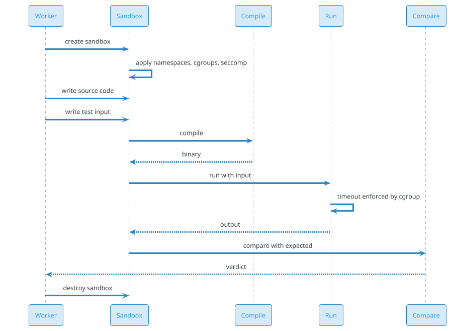
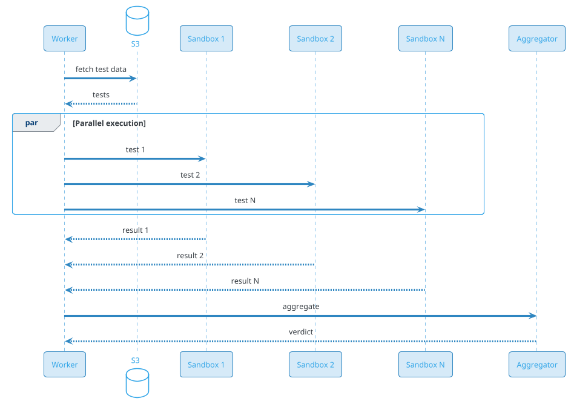
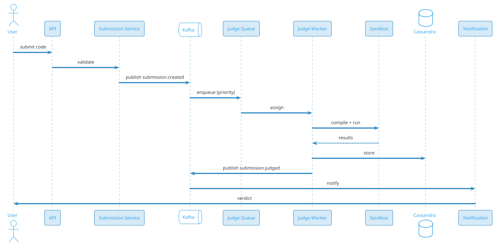
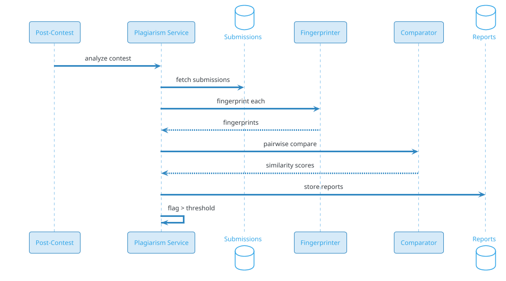

# Online Judge (LeetCode / Codeforces / HackerRank)

## Problem Statement

Design an online judge platform like LeetCode, Codeforces, HackerRank, or CodeChef. Users submit code solutions to programming problems, the system compiles and runs them against test cases in a sandboxed environment, evaluates correctness and performance, and returns verdicts (Accepted, Wrong Answer, Time Limit Exceeded, Memory Limit Exceeded, Runtime Error, Compilation Error). The system must handle millions of submissions, support multiple languages, prevent malicious code from escaping the sandbox, run efficiently at scale, and provide real-time contest rankings.

**Example:**

```
Submission flow:
  1. User submits code: `def two_sum(nums, target): ...`
  2. Selects language: Python
  3. Problem: "Two Sum" (LeetCode #1)
  4. Submission received, queued
  5. Worker picks up:
     a. Compile (if needed)
     b. Run against test cases (10 hidden + 3 sample)
     c. Each test: sandbox, timeout 2 sec, memory 256 MB
     d. Compare output
  6. Verdict: "Accepted" (all tests passed)
  7. Update user's stats, leaderboard
  8. Notify user

Verdicts:
  - AC (Accepted): All tests pass
  - WA (Wrong Answer): Output mismatch
  - TLE (Time Limit Exceeded): > time limit
  - MLE (Memory Limit Exceeded): > memory limit
  - RE (Runtime Error): Exception/crash
  - CE (Compilation Error): Compile fails
  - PE (Presentation Error): Formatting

Scale:
  - 50M users
  - 10M DAU
  - 20M submissions/day (~231/sec avg, 1,157/sec peak)
  - 30 languages supported
  - 100K problems
  - 10B test case executions/day
  - 100K contests/day
  - Real-time leaderboard during contests
```

**Real-world systems:** LeetCode, Codeforces, HackerRank, CodeChef, TopCoder, AtCoder, Codewars, Exercism, Sphere Engine, Judge0.

**Why it's interesting:**

- **Sandboxing** — untrusted code; must not escape
- **Multi-language** — 30+ compilers/runtimes
- **Performance** — timeout, memory limits
- **Scale** — millions of submissions
- **Real-time** — contest leaderboard
- **Cheating** — plagiarism detection
- **Fairness** — same conditions for all
- **Cost** — compute dominates (heavy workloads)
- **Security** — adversarial (users try to break)
- **Reliability** — 99.9% during contests

---

## 1. Requirements Clarification

### Functional Requirements
- **Submit code**: Multiple languages
- **Compile**: Language-specific compilers
- **Run**: Against test cases (sample + hidden)
- **Evaluate**: Correctness (output) + performance (time, memory)
- **Verdicts**: AC, WA, TLE, MLE, RE, CE
- **Problems**: Problem statement, test cases
- **Contests**: Time-bound, leaderboard
- **Submissions**: History, status
- **Plagiarism**: Detect copied code
- **Editor**: In-browser code editor
- **Discussion**: Per problem
- **Profile**: Stats, rating, rank
- **Leaderboard**: Global, contest
- **Editorial**: Solutions after contest

### Non-Functional Requirements
- **Scale**: 50M users, 20M submissions/day, 1,157/sec peak
- **Latency**: < 10 sec verdict (typical)
- **Availability**: 99.9% (99.99% during contests)
- **Consistency**: Strong for verdicts
- **Durability**: Never lose a submission
- **Security**: Sandbox must not escape
- **Performance**: Timeout precision (ms)
- **Fairness**: Same hardware for all
- **Isolation**: Per-user, per-submission
- **Cost**: Compute dominates
- **Compliance**: Academic integrity

### Out of Scope
- Interviews (HackerRank for Work)
- Certifications
- Courses
- Payments (some platforms)

---

## 2. Back-of-Envelope Estimation

### Traffic

```
Given:
  Users                = 50,000,000
  DAU                  = 10,000,000
  Submissions/day      = 20,000,000
  Test cases/problem   = 100 (avg)
  Test runs/day        = 20M x 100 = 2B
  Contest peak         = 10x
  Peak multiplier      = 5x

Average QPS:
  Submissions = 20M / 86,400 = ~231/sec
  Test executions = 2B / 86,400 = ~23,148/sec

Peak QPS:
  Submissions = ~1,157/sec
  Contest peak = ~11,570/sec
  Test executions = ~115,740/sec
  Contest peak = ~1M/sec

Per submission:
  Compile: 1-5 sec (language-dependent)
  Each test: 0.1-2 sec (depends on problem)
  Total: 10 sec - 5 min
```

### Storage

```
Submissions:
  20M/day x 365 x 5 = 36.5B submissions
  Per submission: ~5 KB (source + metadata) = ~182 TB

Source code:
  ~1 KB per submission = ~36.5 TB

Verdicts:
  36.5B x 500 bytes = ~18 TB

Test results:
  36.5B x 100 tests x 200 bytes = ~730 TB

Problems:
  100K problems x 50 KB (statement, examples) = ~5 GB

Test cases:
  100K problems x 100 tests x 10 KB = ~100 GB

Users:
  50M x 2 KB = ~100 GB

Contests:
  100K x 100 KB = ~10 GB

Leaderboards:
  Real-time (Redis)
  Historical: ~1 TB

Plagiarism index:
  36.5B x 100 bytes = ~3.6 TB

Analytics:
  2B test runs x 200 bytes = ~400 GB/day
  5 years: ~730 TB

Total hot: ~10 TB
Total cold: ~1 PB
```

### Bandwidth

```
Submission upload:
  1,157/sec x 5 KB = ~5.8 MB/sec
  Peak: ~29 MB/sec

Test result download:
  115,740/sec x 200 bytes = ~23 MB/sec

Verdict:
  1,157/sec x 1 KB = ~1.2 MB/sec

Total: ~60 MB/sec peak
```

### Latency Budget

```
Submission to verdict:
  Receive submission:            ~50 ms
  Queue:                         ~100 ms
  Compile:                       ~1-5 sec
  Run tests (parallel):          ~5-30 sec (100 tests)
  Aggregate verdict:             ~50 ms
  Notify:                        ~100 ms
  Total:                         ~10 sec - 1 min

Target: < 10 sec for typical submission.
Contest: < 5 sec (high priority).
```

---

## 3. High-Level Design

```d2
direction: down

user: User {shape: person}
browser: "Browser (editor)" {shape: cloud}

cdn: CDN {shape: cloud}
lb: Load Balancer {shape: hexagon}
api: API Gateway {shape: hexagon}

submission: "Submission Service" {shape: rectangle}
problem: "Problem Service" {shape: rectangle}
contest: "Contest Service" {shape: rectangle}
leaderboard: "Leaderboard Service" {shape: rectangle}
judge: "Judge Service" {shape: rectangle}
sandbox: "Sandbox (Docker/gVisor)" {shape: rectangle}
worker: "Judge Workers" {shape: rectangle}
plagiarism: "Plagiarism Service" {shape: rectangle}
notif: "Notification Service" {shape: rectangle}
analytics: "Analytics Service" {shape: rectangle}

kafka: Kafka {shape: queue}
queue: "Judge Queue" {shape: queue}

pdb: "PostgreSQL (users, problems)" {shape: cylinder}
cass: "Cassandra (submissions)" {shape: cylinder}
redis: "Redis (leaderboard, cache)" {shape: cylinder}
s3: "S3 (source, test data)" {shape: cylinder}
es: "Elasticsearch (search)" {shape: cylinder}
ch: "ClickHouse (analytics)" {shape: cylinder}

user -> browser
browser -> cdn
cdn -> lb
lb -> api

api -> submission
api -> problem
api -> contest
api -> leaderboard

submission -> kafka
kafka -> judge
judge -> worker
worker -> sandbox
worker -> cass

leaderboard -> redis
problem -> pdb
contest -> pdb
plagiarism -> es
analytics -> ch
```

### Component Responsibilities

| Component | Role |
|---|---|
| Submission Service | Receive, validate, queue |
| Problem Service | Problems, test cases |
| Contest Service | Contests, participants |
| Leaderboard Service | Rankings |
| Judge Service | Orchestrate judging |
| Sandbox | Isolated execution |
| Judge Workers | Run tests |
| Plagiarism Service | Detect duplicates |
| Notification Service | Notify user |
| Analytics Service | Stats, insights |
| Kafka | Event bus |
| Judge Queue | Priority queue |
| PostgreSQL | Users, problems |
| Cassandra | Submissions |
| Redis | Leaderboard cache |
| S3 | Source, test data |
| Elasticsearch | Search |
| ClickHouse | Analytics |

### Why This Architecture

- **Kafka** for decoupled submission pipeline
- **Judge Queue** with priority (contest > practice)
- **Sandbox** for security (critical)
- **PostgreSQL** for users, problems (ACID)
- **Cassandra** for submissions (write-heavy)
- **Redis** for leaderboard (real-time)
- **S3** for source/test data (cheap)

---

## 4. Deep Dive: Sandboxing

### The Core Security Problem

Users submit **arbitrary code** that will be **executed on our servers**. That code could:
- **Escape** the sandbox (privilege escalation)
- **Access** the network (exfiltrate, attack)
- **Read** files (steal test cases)
- **Fork bomb** (DoS)
- **Mine crypto** (abuse)
- **Attack** other tenants

**Sandboxing is the #1 priority.**

### Sandbox Techniques

**1. Linux namespaces:**
- PID, network, mount, user, IPC, UTS
- Isolate resources

**2. cgroups:**
- CPU, memory, I/O limits
- Prevent fork bombs

**3. seccomp:**
- Filter syscalls
- Allow only safe ones

**4. Docker / containerd:**
- Container isolation
- Built-in seccomp, cgroups

**5. gVisor:**
- User-space kernel
- Stronger than Docker
- Used by Google Cloud Run

**6. Firecracker:**
- MicroVM
- AWS Lambda
- Fast boot, strong isolation

### Sandbox Configuration

```yaml
sandbox:
  image: judge/python:3.11
  network: none                # No network
  read_only: true              # Read-only filesystem
  tmpfs:
    /tmp: 64m                  # Small tmp
    /work: 256m                # Work directory
  cpu_limit: 1
  memory_limit: 256m
  timeout: 2s
  pids_limit: 64               # Prevent fork bomb
  ulimits:
    - "nofile=64"              # Max open files
    - "nproc=32"               # Max processes
  seccomp: default-strict
  capabilities: []             # Drop all
  no_new_privileges: true
  user: nobody
```

### Sandbox Isolation Layers



### Resource Limits

**Time:**
- **Per test**: 2 sec (typical)
- **Total**: 30-60 sec
- **Enforcement**: cgroup CPU quota, `timeout` command, wall clock

**Memory:**
- **Per test**: 256 MB (typical)
- **Enforcement**: cgroup memory limit
- **OOM**: Kill process, MLE verdict

**Disk:**
- **Read-only filesystem**
- **Small tmpfs**: 64 MB
- **Prevent disk fill**

**Process:**
- **Max processes**: 32 (prevent fork bomb)
- **cgroup pids.max**

**Network:**
- **Disabled**: No network access

### Verdict on Sandbox Events

- **Timeout**: TLE
- **OOM**: MLE
- **Signal**: RE (SIGSEGV, SIGKILL)
- **Non-zero exit**: RE
- **Output mismatch**: WA
- **Match**: AC

### Sandbox Scale

```
115,740 test executions/sec peak
Contest: ~1M/sec

Each sandbox:
  Create: ~100 ms
  Execute: ~200 ms (typical)
  Destroy: ~50 ms

Workers: ~500 instances (peak)
Sandbox: Docker + gVisor
```

---

## 5. Deep Dive: Compilation and Languages

### Supported Languages

- **C/C++**: GCC, Clang
- **Java**: OpenJDK
- **Python**: CPython, PyPy
- **JavaScript**: Node.js
- **Go**: Go compiler
- **Rust**: rustc
- **Ruby**: Ruby
- **PHP**: PHP
- **Kotlin**: kotlinc
- **Swift**: swiftc
- **TypeScript**: tsc
- **C#**: .NET
- **Scala**: scala
- **Haskell**: GHC
- **R**: R
- **Perl**: Perl
- **SQL**: SQLite
- **Bash**: bash
- **... and more**

### Language Configuration

```yaml
languages:
  cpp:
    image: judge/cpp:latest
    compile: g++ -O2 -std=c++17 -o solution solution.cpp
    run: ./solution
    source_file: solution.cpp
    time_multiplier: 1.0
    memory_multiplier: 1.0
  python:
    image: judge/python:3.11
    compile: null  # Interpreted
    run: python3 solution.py
    source_file: solution.py
    time_multiplier: 3.0   # Python slower
    memory_multiplier: 2.0
  java:
    image: judge/java:17
    compile: javac Solution.java
    run: java Solution
    source_file: Solution.java
    time_multiplier: 2.0
    memory_multiplier: 2.0
  go:
    image: judge/go:1.21
    compile: go build -o solution solution.go
    run: ./solution
    source_file: solution.go
    time_multiplier: 1.0
    memory_multiplier: 1.0
```

### Time Multipliers

Different languages have different speeds:
- **C++**: 1x (baseline)
- **Java**: 2x
- **Python**: 3x
- **JavaScript**: 2x

**Problem:** Same problem, different time limits per language.

**Solution:** Time multiplier per language.

### Compilation Flow

```
1. Fetch source code
2. Create sandbox
3. Write source to /work
4. Run compile command
5. If error: CE verdict
6. Else: proceed to run tests
7. Cleanup sandbox
```

### Compilation Cache

- **Cache** compiled binaries
- **Key**: hash(source + language + version)
- **Benefit**: Skip recompile for same code
- **Hit rate**: Low (unique submissions)

### Language Scale

```
30 languages
Per language: Docker image (~500 MB)
Total: ~15 GB
Updated: Monthly
```

---

## 6. Deep Dive: Test Case Execution

### Test Case Types

- **Sample**: Shown to user, for debugging
- **Hidden**: Judge-only, for final verdict
- **System**: Additional stress tests

### Test Case Storage

```json
{
  "problem_id": "two-sum",
  "tests": [
    {"id": 1, "input": "2 7 11 15\n9", "output": "0 1", "sample": true},
    {"id": 2, "input": "3 2 4\n6", "output": "1 2", "sample": true},
    {"id": 3, "input": "...", "output": "...", "sample": false}
  ]
}
```

**Storage:** S3 (test data), encrypted.

### Execution Flow



### Parallel Execution

- **Multiple sandboxes** for tests
- **Isolation**: Each test in own sandbox
- **Resource**: CPU, memory per sandbox
- **Aggregation**: Combine results

### Early Termination

- **First failure**: Stop (WA, TLE, RE)
- **Optimization**: Don't run remaining tests
- **Exception**: Continue for full diagnostics (optional)

### Output Comparison

- **Exact**: Byte-for-byte
- **Trimmed**: Whitespace ignored
- **Special**: Float with tolerance, unordered

**Problem-specific** comparator.

### Test Case Scale

```
100 tests/problem
20M submissions/day
= 2B test executions/day
= ~23K/sec avg
Peak: ~115K/sec

Sandboxes: ~500 workers
Each: 100 concurrent tests
```

---

## 7. Deep Dive: Judge Pipeline

### Submission Flow



### Priority Queue

- **Contest**: High priority
- **Practice**: Normal priority
- **Retry**: Low priority
- **Rejudge**: Admin-initiated

**Implementation:** Redis sorted set or Kafka with priority.

### Judge Worker

- **Poll** queue for submission
- **Fetch** problem + test data
- **Compile** (if needed)
- **Run** tests (parallel)
- **Aggregate** verdict
- **Store** results
- **Publish** event

### Judge States

- **QUEUED**: Waiting
- **COMPILING**: Compiling
- **RUNNING**: Executing tests
- **JUDGED**: Verdict ready
- **FAILED**: Internal error

### Worker Pool

- **Pool size**: ~500 workers (peak)
- **Each worker**: 1 submission at a time
- **Total concurrent**: 500 submissions
- **Queue depth**: Monitored

### Contest Mode

- **Priority boost**: Contest submissions first
- **Resource reservation**: Dedicated workers
- **Rate limit**: Per user
- **Fairness**: Same hardware for all

### Judge Scale

```
20M submissions/day
= ~231/sec avg
= ~1,157/sec peak
Contest: ~11,570/sec

Workers: ~500 (peak)
Each: 1 submission at a time
Duration: ~10 sec - 5 min per submission
```

---

## 8. Deep Dive: Leaderboards and Contests

### Contest Types

- **Rated**: Affects rating
- **Unrated**: Practice
- **Time-bound**: 1-3 hours
- **Multi-problem**: 5-10 problems

### Scoring

- **ICPC**: Solved count, penalty time
- **Codeforces**: Points based on solve time
- **Custom**: Platform-specific

### Real-Time Leaderboard

- **Live ranking**: During contest
- **Update**: On each submission
- **Storage**: Redis sorted set
- **Scale**: 100K users per contest

### Redis Leaderboard

```
Key: contest:{contest_id}:leaderboard
Type: Sorted Set
Score: user_score
Value: user_id

ZADD contest:123:leaderboard {score} {user_id}
ZREVRANGE contest:123:leaderboard 0 99  → top 100
ZRANK contest:123:leaderboard {user_id} → user's rank
```

### Score Computation

**ICPC:**
```
score = (solved, penalty)
Where penalty = sum of (solve_time + 20 * failed_attempts)
Sort by: more solved, then lower penalty
```

**Codeforces:**
```
score = sum of problem_points
Where points = base - time_penalty
Sort by: higher score
```

### Leaderboard Updates

- **On AC**: Update score
- **On WA**: Track attempts (for penalty)
- **Real-time**: Redis
- **Persistent**: Periodic snapshot to PostgreSQL

### Contest Scale

```
100K contests/day
100K participants (large contest)
1M submissions per contest (peak)

Redis: sharded by contest_id
Updates: ~10K/sec during contest
```

### Anti-Cheating

- **Plagiarism detection** (after contest)
- **IP correlation** (multiple accounts)
- **Submission timing** (too fast)
- **Code similarity** (unique patterns)
- **Team detection** (shared solutions)

---

## 9. Deep Dive: Plagiarism Detection

### Why Plagiarism?

- **Cheating** in contests
- **Copying** solutions
- **Fairness** essential

### Detection Methods

**1. Source code similarity:**
- **Token-based**: Normalize identifiers, whitespace
- **AST-based**: Compare abstract syntax trees
- **Winnowing**: Fingerprint subsequences (used by MOSS)

**2. Metadata:**
- Submission time (too similar)
- IP address (shared)
- User behavior (sudden improvement)
- Contest participation

**3. Network analysis:**
- Groups of users submitting similar code
- Same IP, same contest, same problem

### Winnowing Algorithm

**Used by MOSS (Measure of Software Similarity):**
1. Normalize code (remove comments, whitespace)
2. Convert to k-grams (k=5 typically)
3. Hash each k-gram
4. Select fingerprints (min hash in each window)
5. Compare fingerprint sets between submissions

**Similarity:** Jaccard index or containment.

### Detection Pipeline



### Threshold

- **< 30%**: Likely independent
- **30-70%**: Suspicious
- **> 70%**: Likely plagiarism

**Manual review** for flagged.

### Plagiarism Scale

```
1M submissions per contest
Pairwise comparison: O(n²) = 1T comparisons
Optimization: 
  - Cluster by fingerprint (LSH)
  - Compare only similar clusters
  - ~1M comparisons

Time: ~1 hour
```

### Consequences

- **Warning**: First offense
- **Disqualification**: Contest
- **Rating reset**: For repeated
- **Ban**: Severe cases

---

## 10. Deep Dive: Problem Management

### Problem Model

```json
{
  "problem_id": "two-sum",
  "title": "Two Sum",
  "description": "...",
  "difficulty": "easy",
  "tags": ["array", "hash-table"],
  "time_limit_ms": 2000,
  "memory_limit_mb": 256,
  "sample_tests": [...],
  "hidden_tests": [...],
  "hints": [...],
  "editorial": "...",
  "created_by": "admin",
  "created_at": "..."
}
```

### Test Data Storage

- **S3**: Test cases (encrypted)
- **PostgreSQL**: Metadata
- **Cache**: Redis (popular problems)

### Problem Categories

- **Algorithms**: Sorting, searching, DP, graphs
- **Data Structures**: Arrays, trees, heaps
- **Math**: Number theory, combinatorics
- **System Design**: Real-world systems
- **SQL**: Database queries
- **Concurrency**: Multi-threaded

### Problem Difficulty

- **Easy**: ~500 (LeetCode)
- **Medium**: ~1000
- **Hard**: ~400

### Problem Creation

- **Admin** creates
- **AI-assisted** (statement, tests)
- **Community** contributions (moderated)

### Problem Scale

```
100K problems
Each: 50 KB statement + 100 tests x 10 KB = ~1 MB
Total: ~100 GB

Test data: S3
Metadata: PostgreSQL
```

### Problem Search

- **By title, tag, difficulty**
- **Elasticsearch** for full-text
- **Filters**: Tags, difficulty, company, contest

---

## 11. Deep Dive: Real-Time Contest

### Contest Lifecycle

1. **Announcement**: Weeks before
2. **Registration**: Days before
3. **Start**: T-0
4. **Submission phase**: 1-3 hours
5. **System test**: Post-contest
6. **Rating update**: Hours/days after
7. **Editorial**: Published

### Contest Scale

**During contest (3 hours):**
- **100K participants**
- **1M submissions**
- **~100 submissions/sec**
- **Leaderboard updates**: 1K/sec

**Peak (last hour):**
- **10x normal traffic**
- **1K submissions/sec**

### Real-Time Challenges

- **Leaderboard**: Update every submission
- **Ranking changes**: Visible instantly
- **Chat**: Real-time (some platforms)
- **Announcements**: Broadcast
- **System status**: Live

### Contest Infrastructure

- **Dedicated workers**: For contest
- **Reserved capacity**: No preemption
- **Priority queue**: Contest > practice
- **Monitoring**: Real-time dashboard
- **On-call**: Engineers ready

### Rating System

**Elo-based (Codeforces):**
```
New rating = Old rating + K * (Actual - Expected)
Where:
  K = 32 (varies by rating)
  Expected = 1 / (1 + 10^((Opponent - Player)/400))
```

**Glicko-2**: More sophisticated (rating deviation)

**Chess.com**: Glicko-2

### Contest Verdicts

- **AC**: Accepted
- **WA**: Wrong Answer
- **TLE**: Time Limit Exceeded
- **MLE**: Memory Limit Exceeded
- **RE**: Runtime Error
- **CE**: Compilation Error
- **Hacked**: Fails system test (after contest)

### Real-Time Scale

```
1M submissions per contest
3 hours = 10,800 sec
= ~92 submissions/sec avg
Peak: ~1K/sec

Leaderboard updates: 1K/sec
Redis: single shard per contest (sharded by contest)
```

---

## 12. Scaling Considerations

### Read Scaling

- **Redis** for leaderboard, cache
- **Read replicas** for PostgreSQL
- **Cassandra** for submissions
- **CDN** for static assets

### Write Scaling

- **Kafka** for submission pipeline
- **Cassandra** for submissions
- **S3** for source, tests
- **PostgreSQL** sharded for users

### Sharding

**PostgreSQL:** Shard by `user_id`.
**Cassandra:** Partition by `submission_id`.
**Redis:** Shard by `contest_id`.
**Kafka:** Partition by `user_id`.

### Multi-Region

- **Per-region** deployments
- **Regional contests** (some)
- **Global leaderboard** (aggregated)
- **Data residency** (GDPR)

### Peak Handling

- **Contest start**: 10x
- **Contest end**: 10x (rush)
- **New problem**: 5x
- **Viral problem**: 100x

**Mitigations:**
- Auto-scale workers
- Priority queue
- Rate limit
- Pre-warm capacity

### Cost Optimization

| Component | Optimization |
|---|---|
| Workers | Spot instances |
| Sandboxes | Reuse, cache |
| Storage | Tiering |
| Compute | Reserved + spot |
| Test data | Compression |

---

## 13. Bottlenecks and Trade-offs

| Concern | Solution | Trade-off |
|---|---|---|
| Security | Sandboxing (gVisor) | Performance |
| Latency | Parallel tests | Resource |
| Scale | Distributed workers | Coordination |
| Fairness | Same hardware | Cost |
| Cost | Sampling, reuse | Complexity |
| Plagiarism | Post-contest | Delay |
| Real-time | Redis | Memory |

### Design Decisions Summary

| Decision | Choice | Rationale |
|---|---|---|
| Sandbox | Docker + gVisor | Security |
| Queue | Kafka + priority | Fair |
| Storage | Cassandra | Write-heavy |
| Source | S3 | Cheap |
| Leaderboard | Redis | Real-time |
| Judge | Distributed workers | Scale |
| Plagiarism | Winnowing | MOSS-like |

---

## 14. Failure Scenarios

### Judge Service Down

**Impact:** Submissions stuck in queue.

**Mitigation:**
- Multi-instance
- Auto-restart
- Queue buffers
- Alert ops

### Sandbox Escape

**Impact:** Security breach.

**Mitigation:**
- Multiple isolation layers
- Monitoring
- Immediate patching
- Incident response
- Notify affected users

### Kafka Down

**Impact:** Submissions not queued.

**Mitigation:**
- Buffer in API
- Retry
- Alert ops

### Leaderboard Down

**Impact:** No real-time ranking.

**Mitigation:**
- Redis Sentinel
- Cached last state
- Alert ops

### Storage Down

**Impact:** Can't store submissions.

**Mitigation:**
- Buffer in Kafka
- Replay
- Alert ops

### Contest Overload

**Impact:** Slow judging.

**Mitigation:**
- Dedicated workers
- Pre-warm
- Rate limit
- Alert ops

### Plagiarism False Positive

**Impact:** Wrong accusation.

**Mitigation:**
- Manual review
- Appeals
- Transparency

### Data Breach

**Impact:** User data, solutions exposed.

**Mitigation:**
- Encryption
- Access controls
- Incident response
- Notify users

### DDoS

**Impact:** Service unavailable.

**Mitigation:**
- CDN/WAF
- Rate limit
- Anycast
- Alert ops

---

## 15. Monitoring and Alerts

### Key Metrics

| Metric | Target | Alert Threshold |
|---|---|---|
| Submission API p99 | < 200 ms | > 500 ms |
| Judge p99 | < 10 sec | > 30 sec |
| Sandbox success | > 99% | < 95% |
| Verdict accuracy | 100% | < 100% |
| Queue depth | < 10K | > 100K |
| Worker utilization | 60-80% | > 90% |
| Leaderboard p99 | < 100 ms | > 500 ms |
| Plagiarism flag rate | baseline | spike |
| Contest submissions | baseline | 10x |
| Sandbox escape | 0 | > 0 |

### Dashboards

- **Traffic**: Submissions/sec, by language
- **Latency**: p50/p95/p99 per stage
- **Verdicts**: AC, WA, TLE, MLE, RE, CE
- **Queue**: Depth, wait time
- **Workers**: Utilization, health
- **Leaderboard**: Updates, latency
- **Contests**: Active, participants
- **Plagiarism**: Flags, confirmed
- **Security**: Sandbox events

### Alerts

- **P0**: Judge down, sandbox escape
- **P1**: Judge p99 > 30 sec, queue > 100K
- **P2**: Verdict accuracy < 100%
- **P3**: Plagiarism spike, cost anomaly

### Business KPIs

- **DAU/MAU** ratio
- **Submissions per DAU**
- **AC rate**
- **Contest participation**
- **Rating distribution**
- **Retention** (D1, D7, D30)
- **NPS**

---

## 16. Cost Estimation

Rough monthly cost (AWS, us-east-1) for 10M DAU:

| Component | Spec | Cost/month |
|---|---|---|
| API servers | 200 x c6g.large | ~$12,000 |
| Judge workers | 1,000 x c6g.2xlarge | ~$240,000 |
| Sandbox overhead | Included | — |
| PostgreSQL | 10 shards x db.r6g.2xlarge | ~$23,000 |
| Read replicas | 20 x db.r6g.xlarge | ~$14,000 |
| Cassandra | 30 x i3.2xlarge | ~$30,000 |
| Redis cluster | 50 x cache.r6g.2xlarge | ~$25,000 |
| Kafka (MSK) | 20 brokers | ~$10,000 |
| ClickHouse | 10 x i3.2xlarge | ~$10,000 |
| S3 (source, tests) | 100 TB | ~$2,300 |
| S3 (archive) | 500 TB | ~$10,000 |
| CDN | 50 TB/month | ~$4,500 |
| Monitoring | Datadog | ~$30,000 |
| **Total** | | **~$411,000/month** |

**Per submission:** ~$0.0006.

**Cost breakdown:**
- **Judge workers**: ~58%
- **Databases**: ~16%
- **Other**: ~26%

**Cost optimization:**
- **Spot instances** for workers (70% savings)
- **Sandbox reuse**: Fewer allocations
- **Compile cache**: Skip recompile
- **Test data tiering**
- **Reserved capacity**

**Note:** Judge workers dominate cost — they run untrusted code.

---

## 17. Extensions and Follow-ups

### Interview Platform

- HackerRank for Work
- Real-time collaboration
- Video interview
- Live coding

### Assessment Platform

- Skill tests
- Certifications
- Anti-cheating (proctoring)

### Learning Platform

- Courses
- Paths
- Quizzes
- Certificates

### Competitive Programming

- Rated contests
- Divisions (Div 1, 2, 3)
- Problem setting
- Testers

### Interview Prep

- Company tags
- Mock interviews
- Progress tracking

### SQL Judge

- Execute SQL queries
- Compare results
- Optimization scoring

### System Design Judge

- Diagram evaluation
- Multiple choice
- Design problems

### Mobile Judge

- Android/iOS code
- Emulator
- UI testing

### AI-Assisted

- Auto-solve (GPT)
- Explain solution
- Generate tests

### Blockchain

- Verifiable submissions
- Immutable records
- Token rewards

---

## 18. Summary

| Aspect | Decision |
|---|---|
| Sandbox | Docker + gVisor |
| Judge queue | Kafka + priority |
| Workers | Distributed, spot instances |
| Storage | Cassandra (submissions), S3 (source) |
| Leaderboard | Redis sorted set |
| Plagiarism | Winnowing (MOSS-like) |
| Problems | PostgreSQL + S3 |
| Contests | PostgreSQL + Redis |
| Scale | 50M users, 20M submissions/day |
| Latency | < 10 sec verdict |
| Availability | 99.9% |
| Cost | ~$411K/month |

**Key takeaways:**

- **Sandboxing is #1 priority** — Docker + gVisor + seccomp + cgroups
- **Kafka** for submission pipeline (decoupled, durable)
- **Priority queue** — contest > practice
- **Parallel test execution** — speed up judging
- **Redis** for real-time leaderboard (sorted set)
- **Cassandra** for submissions (write-heavy)
- **Plagiarism detection** — post-contest analysis
- **Multi-language** — 30+ languages, time multipliers
- **Compile cache** — reuse binaries
- **Spot instances** for workers (58% of cost)
- **Contest scale** — 10x normal traffic
- **Security is existential** — users try to break sandbox

### Similar Pattern Problems

- Distributed Task Scheduler — job execution at scale
- Web Crawler — content processing at scale
- Fraud Detection — adversarial
- Content Moderation — code review
- Cloud Gaming — resource isolation
- Serverless (FaaS) — sandboxed execution
- CI/CD — code build/test pipelines