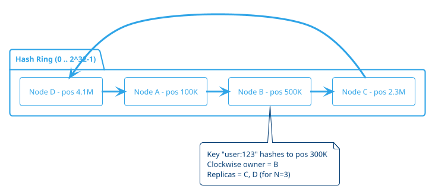
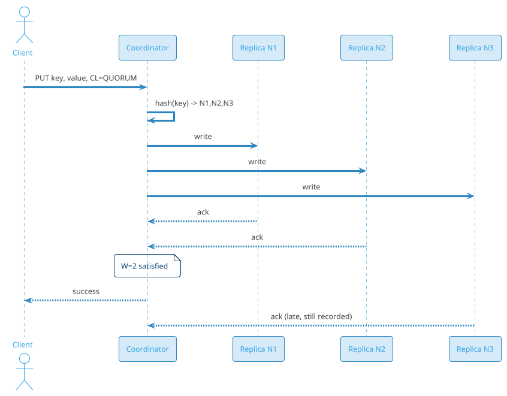
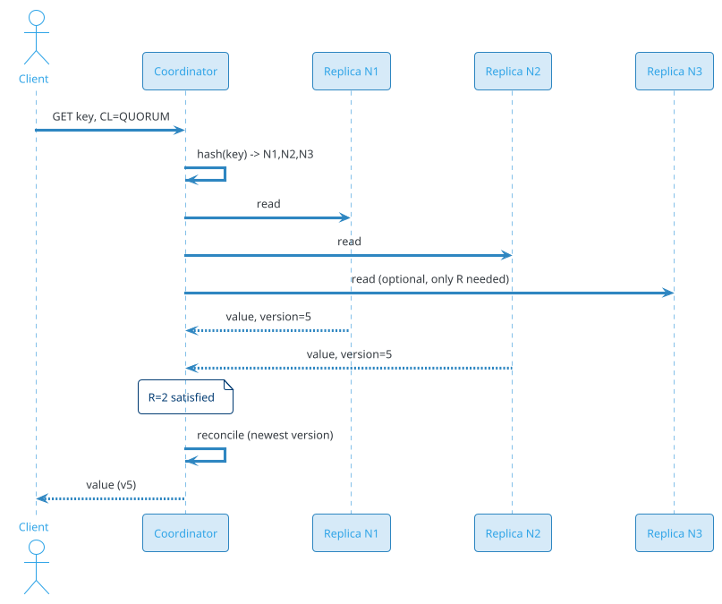
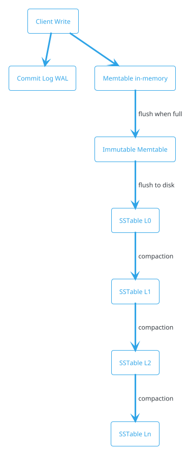
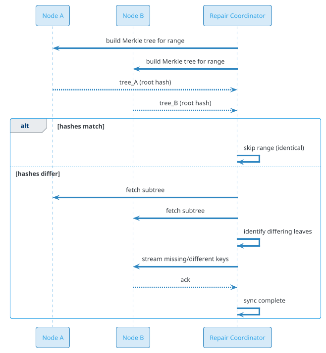
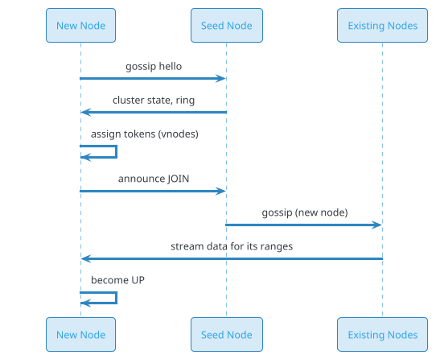

# Distributed Key-Value Store (DynamoDB / Cassandra)

## Problem Statement

Design a distributed key-value store like Amazon DynamoDB or Apache Cassandra. The system stores billions of key-value pairs across thousands of nodes, replicates data for durability, and serves millions of reads/writes per second with single-digit millisecond latency. It must remain available during node failures, network partitions, and even entire datacenter outages — trading strict consistency for tunable consistency and high availability.

**Example:**

```
Client operations:

  PUT user:12345 → {name: "Priya", email: "priya@example.com"}
  GET user:12345 → {name: "Priya", email: "priya@example.com"}
  DELETE user:12345 → success

  Key routing:
    hash("user:12345") → ring position 7,842,113
    → Replicas at nodes: N1, N2, N3 (next 3 nodes clockwise)
    → Coordinator (N1) writes to all 3
    → Quorum W=2, R=2

  Failure scenario:
    N3 down → write succeeds (W=2 met)
    Hinted handoff: N1 stores hint for N3
    N3 recovers → receives hint, catches up

  Partition scenario:
    Network split: {N1, N2} vs {N3, N4, N5}
    {N1, N2} has quorum for some keys → serves
    {N3, N4, N5} has quorum for others → serves
    Conflict resolution via vector clocks / LWW

Key challenges:
  - Consistent hashing (data distribution)
  - Replication (N, R, W quorum)
  - Conflict resolution (vector clocks, LWW, CRDTs)
  - Failure detection (gossip, phi accrual)
  - Hinted handoff (temporary failures)
  - Anti-entropy (Merkle trees, repair)
  - Tunable consistency (strong, eventual, quorum)
  - Multi-datacenter replication
  - Compaction (LSM-tree, SSTables)
  - Hot partitions (adaptive splitting)

Scale:
  - 10 PB total data
  - 1T keys (avg 10 KB value)
  - 10M reads/sec peak
  - 5M writes/sec peak
  - 10K nodes across 5 regions
  - p99 latency < 10 ms
  - 99.99% availability
```

**Real-world systems:** Amazon DynamoDB, Apache Cassandra, Riak, ScyllaDB, Google Bigtable, Azure Cosmos DB, etcd (for coordination), Redis Cluster (in-memory variant).

**Why it's interesting:**

- **CAP theorem** — the canonical example of tunable consistency
- **Consistent hashing** — data distribution without hotspots
- **Quorum** — N, R, W trade-offs
- **Conflict resolution** — last-write-wins, vector clocks, CRDTs
- **Failure detection** — gossip protocol, phi accrual
- **Anti-entropy** — Merkle trees, repair
- **Multi-DC** — cross-region replication and consistency
- **LSM-tree storage** — write-optimized storage engine
- **Hot partition mitigation** — adaptive splitting
- **Scale** — 10K nodes, 10 PB, millions of ops/sec

---

## 1. Requirements Clarification

### Functional Requirements

- **Put(key, value)**: Store or update a value
- **Get(key)**: Retrieve value by key
- **Delete(key)**: Remove a key
- **Tunable consistency**: Per-operation CL (ONE, QUORUM, ALL)
- **TTL**: Auto-expire keys
- **Range queries**: (Optional) Scan by partition key + sort key
- **Conditional writes**: CAS-style (if version = X)
- **Atomic counters**: Increment without read-modify-write race
- **Batch operations**: Multi-key get/put
- **Namespaces / tables**: Logical isolation
- **Secondary indexes**: Query by non-key attributes (optional)

### Non-Functional Requirements

- **Scale**: 10 PB, 1T keys, 10K nodes, 5 regions
- **Throughput**: 10M reads/sec + 5M writes/sec peak
- **Latency**: p99 < 10 ms (single-DC), p99 < 50 ms (cross-DC)
- **Availability**: 99.99% (four nines)
- **Durability**: No data loss after acknowledged write
- **Consistency**: Tunable (eventual → strong)
- **Partition tolerance**: AP under CAP (tunable)
- **Elastic**: Add/remove nodes without downtime
- **Multi-DC**: Replicate across regions
- **Security**: Encryption at rest + in transit, authn/authz
- **Operability**: Metrics, tracing, repair tooling

### Out of Scope

- SQL query engine (this is KV, not relational)
- Full-text search (see Search problem)
- Transactions across partitions (limited 2PC in DynamoDB)
- Analytics / OLAP (separate system)
- ML / feature store (separate)

---

## 2. Back-of-Envelope Estimation

### Traffic

```
Given:
  Total data           = 10 PB
  Total keys           = 1,000,000,000,000 (1T)
  Avg value size       = 10 KB
  Peak reads           = 10,000,000/sec
  Peak writes          =  5,000,000/sec
  Read:write ratio     = 2:1
  Nodes                = 10,000
  Regions              = 5
  Replication factor N = 3

Per-node throughput:
  Reads  = 10M / 10K = 1,000 reads/sec/node
  Writes =  5M / 10K =   500 writes/sec/node
  Total  = 1,500 ops/sec/node

Per-node storage:
  10 PB / 10K nodes = 1 TB/node
  With N=3 replication: 3 TB/node raw

Per-node bandwidth:
  Reads:  1,000 x 10 KB =  10 MB/sec
  Writes:   500 x 10 KB =   5 MB/sec
  Total:  ~15 MB/sec/node (in + out)
```

### Storage

```
Raw data:           10 PB
With N=3 replicas:  30 PB
With LSM overhead (30%):  ~40 PB
With indexes + metadata: ~45 PB

Per region (5 regions, 3 replicas each):
  If data is region-local: 6 PB/region
  If globally replicated:  45 PB total (all regions)

Typical: region-local + async cross-region
  = 6 PB per region x 5 = 30 PB

SSD (hot tier): 20% = ~6 PB
HDD (warm tier): 80% = ~24 PB
```

### Bandwidth

```
Peak read bandwidth:
  10M reads/sec x 10 KB = 100 GB/sec = ~800 Gbps

Peak write bandwidth:
  5M writes/sec x 10 KB = 50 GB/sec = ~400 Gbps

Replication (N=3):
  Writes x 3 = 150 GB/sec internal
  Reads from replicas: distributed

Cross-region (async):
  ~10% of writes = 5 GB/sec = 40 Gbps

Total peak: ~1.5 Tbps aggregate
```

### Latency Budget

```
Single-DC read (QUORUM, R=2 of N=3):

  Client → coordinator:           ~0.5 ms
  Auth + parse:                   ~0.2 ms
  Consistent hash lookup:         ~0.1 ms
  Read from 2 replicas (parallel):~2-5 ms
  Wait for R=2 responses:         ~5 ms
  Merge + return:                 ~0.5 ms
  Network back to client:         ~0.5 ms
  Total:                          ~7 ms

Cross-DC read (LOCAL_QUORUM):
  Same as above + DC local only:  ~7 ms (don't cross DC)

Cross-DC strong read (EACH_QUORUM):
  + cross-region round-trip:      ~50-100 ms
  Total:                          ~60-110 ms

Targets:
  p50: < 2 ms
  p99: < 10 ms (single-DC)
  p99: < 50 ms (cross-DC LOCAL_QUORUM)
```

---

## 3. High-Level Design

```d2
direction: down

client: Client {shape: person}

coord: "Coordinator Node" {shape: hexagon}

ring: "Hash Ring (Consistent Hashing)" {shape: cloud}

n1: "Node 1 (Replica)" {shape: rectangle}
n2: "Node 2 (Replica)" {shape: rectangle}
n3: "Node 3 (Replica)" {shape: rectangle}

gossip: "Gossip Protocol" {shape: cloud}
failure: "Failure Detector (Phi Accrual)" {shape: rectangle}
hint: "Hinted Handoff Store" {shape: cylinder}
merkle: "Merkle Tree (Anti-Entropy)" {shape: rectangle}
repair: "Repair Service" {shape: rectangle}

commitlog: "Commit Log (WAL)" {shape: cylinder}
memtable: "Memtable (in-memory)" {shape: cylinder}
sstable: "SSTables (on-disk)" {shape: cylinder}
compaction: "Compaction Service" {shape: rectangle}

meta: "Metadata Service (schema, topology)" {shape: cylinder}

client -> coord
coord -> ring
ring -> n1
ring -> n2
ring -> n3

n1 -> commitlog
n1 -> memtable
memtable -> sstable
sstable -> compaction

n1 <-> gossip
n1 <-> failure
n1 <-> hint
n1 <-> merkle
merkle -> repair

coord -> meta
```

### Component Responsibilities

| Component | Role |
|---|---|
| Coordinator Node | Any node; routes request to replicas |
| Hash Ring | Consistent hashing for key → node mapping |
| Replica Nodes | Store data; N replicas per key |
| Gossip Protocol | Propagate cluster membership + state |
| Failure Detector | Phi accrual; classify node up/down |
| Hinted Handoff | Store writes for temporarily-down nodes |
| Merkle Tree | Efficiently compare replica datasets |
| Repair Service | Sync divergent replicas (anti-entropy) |
| Commit Log | Write-ahead log for durability |
| Memtable | In-memory sorted write buffer |
| SSTables | Immutable on-disk sorted files |
| Compaction | Merge SSTables, GC tombstones |
| Metadata Service | Schema, topology, ring version |

### Why This Architecture

- **Peer-to-peer** (no master) — no single point of failure
- **Consistent hashing** — even distribution, minimal reshuffling
- **Quorum** — tunable consistency per request
- **LSM-tree** — write-optimized; sequential disk writes
- **Gossip** — scalable failure detection without central coordinator
- **Merkle trees** — efficient anti-entropy (log N comparison)
- **Hinted handoff** — smooths over transient failures
- **Multi-DC** — local quorum for low latency, async cross-DC

---

## 4. Deep Dive: Consistent Hashing

### The Problem with Naive Hashing

`hash(key) % num_nodes` — when nodes are added/removed, **almost all keys remap**, causing massive data movement.

### Consistent Hashing

Map both **keys** and **nodes** onto a circular hash ring (0 to 2^32-1):

```
1. Hash each node's ID → position on ring
2. Hash each key → position on ring
3. Walk clockwise from key position → first node = owner
4. Next N-1 nodes clockwise = replicas
```

### Ring Visualization



### Virtual Nodes (vnodes)

**Problem:** With 1 position per node, distribution is uneven (random).

**Solution:** Each physical node has **many virtual nodes** (100-256) scattered on the ring.

```
Physical Node A → vnode A1 (pos 100K), A2 (pos 2.3M), ..., A256 (pos 4.1B)
Physical Node B → vnode B1 (pos 500K), B2 (pos 3.1M), ..., B256
```

**Benefits:**

- **Even distribution** — law of large numbers
- **Heterogeneous hardware** — more vnodes for bigger nodes
- **Smoother rebalancing** — only 1/N of keys move when a node joins/leaves

### Adding a Node

```
Before: A(20%) B(30%) C(25%) D(25%)
Add E → E takes ~20% from all existing nodes (proportional)
Only keys between D and E move to E.
Average movement: 1/(N+1) = 20% of keys
```

### Removing a Node

```
Node B fails → its keys redistribute to C, D, A (next clockwise)
Only keys owned by B move.
```

### Replication

For N=3 replicas:

```
Owner = first node clockwise from key
Replicas = next N-1 distinct physical nodes clockwise
```

**Rack-aware / DC-aware:** Skip nodes in the same rack/DC as the previous pick to survive rack failures.

### Number of vnodes

| vnodes per node | Distribution quality | Metadata overhead |
|---|---|---|
| 1 | Poor (uneven) | Minimal |
| 16 | Fair | Low |
| 128 | Good | Medium |
| 256 | Excellent | Higher |
| 1000 | Overkill | Significant |

**Recommendation:** 128-256 vnodes per physical node.

### Hash Function

- **Murmur3** — fast, good distribution (Cassandra uses this)
- **xxHash** — very fast
- **MD5/SHA-1** — cryptographic, slower, not needed

**Recommendation:** Murmur3 or xxHash.

### Token Ranges

Each vnode owns a **range** of the ring:

```
A1: [0,           100K)
B1: [100K,        500K)
...
```

**Storage:** Each vnode's data stored separately; queries route to specific vnodes.

### Hot Partitions

**Problem:** A celebrity key (`user:taylorswift`) gets 1M reads/sec — overwhelms its replicas.

**Solutions:**

1. **Key salting**: `hash(key + random_suffix)` → spread across partitions; client aggregates
2. **Adaptive splitting**: DynamoDB auto-splits hot partitions
3. **Caching layer**: Hot key cache in front (Redis)
4. **Read replicas**: More replicas for hot keys (dynamic)
5. **Client-side caching**: SDK caches hot keys

**Trade-off:** Salting requires aggregation on read; not all workloads can use it.

### Consistent Hashing Implementation

```java
public class ConsistentHashRing {
    private final TreeMap<Long, Node> ring = new TreeMap<>();
    private final int vnodesPerNode;

    public ConsistentHashRing(int vnodesPerNode) {
        this.vnodesPerNode = vnodesPerNode;
    }

    public void addNode(Node node) {
        for (int i = 0; i < vnodesPerNode; i++) {
            long hash = murmur3(node.id() + "#" + i);
            ring.put(hash, node);
        }
    }

    public void removeNode(Node node) {
        for (int i = 0; i < vnodesPerNode; i++) {
            long hash = murmur3(node.id() + "#" + i);
            ring.remove(hash);
        }
    }

    public List<Node> getReplicas(String key, int n) {
        long hash = murmur3(key);
        List<Node> replicas = new ArrayList<>();
        Set<Node> seen = new HashSet<>();
        for (Map.Entry<Long, Node> entry : ring.tailMap(hash).entrySet()) {
            Node node = entry.getValue();
            if (seen.add(node)) {
                replicas.add(node);
                if (replicas.size() == n) return replicas;
            }
        }
        for (Map.Entry<Long, Node> entry : ring.entrySet()) {
            Node node = entry.getValue();
            if (seen.add(node)) {
                replicas.add(node);
                if (replicas.size() == n) return replicas;
            }
        }
        return replicas;
    }
}
```

---

## 5. Deep Dive: Replication and Quorum

### Replication Factor (N)

**N = number of replicas per key.**

| N | Fault tolerance | Storage cost | Read latency |
|---|---|---|---|
| 1 | 0 failures | 1x | Lowest |
| 2 | 1 failure | 2x | Low |
| 3 | 2 failures | 3x | Medium |
| 5 | 4 failures | 5x | Higher |

**Standard:** N=3 (survives 2 simultaneous failures; ~99.99% durability with SSD).

### Quorum (R, W)

- **W** = write quorum (how many replicas must ack a write)
- **R** = read quorum (how many replicas must respond to a read)
- **N** = replication factor

**Strong consistency condition:** `R + W > N`

### Common Configurations

| Config | R | W | Consistency | Use case |
|---|---|---|---|---|
| Strong | N | 1 | Strong write, fast read | Read-heavy, strong |
| Strong | 1 | N | Fast read, strong write | Write-heavy, strong |
| Quorum | ⌈N/2⌉ | ⌈N/2⌉ | Balanced | General |
| Eventual | 1 | 1 | Fast, eventual | Max throughput |
| Read-heavy | 1 | 2 | Fast read, safe write | Read-heavy |
| Write-heavy | 2 | 1 | Safe read, fast write | Write-heavy |

**For N=3:**

- `R=2, W=2` → strong (2+2 > 3)
- `R=1, W=3` → strong (1+3 > 3)
- `R=1, W=1` → eventual

### Consistency Levels (Cassandra-style)

| Level | Meaning | Latency |
|---|---|---|
| ONE | 1 replica | Lowest |
| TWO / THREE | N replicas | Low |
| QUORUM | ⌈(N+1)/2⌉ replicas | Medium |
| LOCAL_QUORUM | Quorum within local DC | Low (multi-DC) |
| EACH_QUORUM | Quorum in every DC | Highest |
| ALL | All replicas | Highest (fragile) |
| LOCAL_ONE | 1 replica in local DC | Lowest (multi-DC) |

### Write Path



### Read Path



### Read Repair

When coordinator sees different versions across replicas:

1. Return newest to client
2. **Async**: push newest to stale replicas
3. **Blocking**: if `CL > QUORUM`, wait for repair

**Benefit:** Self-healing on read path.

### Sloppy Quorum + Hinted Handoff

**Problem:** If a replica is down, strict quorum fails.

**Sloppy quorum:** Write to any N healthy nodes (not just preferred replicas).

**Hinted handoff:** Store hint at a healthy node; deliver when the down node recovers.

```
Write to N1, N2 (N3 down)
-> Coordinator picks N4 as stand-in
-> N4 stores {value, hint: "for N3"}
-> N3 recovers -> N4 sends value -> N4 deletes hint
```

**Trade-off:** Improves availability; weakens consistency (unless read repair).

### Multi-DC Replication

```d2
direction: right

client: Client {shape: person}

us: "US-DC" {
  n1: "N1"
  n2: "N2"
  n3: "N3"
}

eu: "EU-DC" {
  n4: "N4"
  n5: "N5"
  n6: "N6"
}

client -> us.n1
us.n1 -> eu.n4 : async replication
us.n2 -> eu.n5 : async
us.n3 -> eu.n6 : async
```

**Key strategies:**

- **LOCAL_QUORUM**: quorum only within local DC (low latency)
- **EACH_QUORUM**: quorum in every DC (strong, slow)
- **Async replication**: cross-DC propagation (eventual consistency)
- **Network topology aware**: replicas placed in different racks/DCs

**Latency:** LOCAL_QUORUM ~5 ms; EACH_QUORUM ~100 ms cross-region.

---

## 6. Deep Dive: Conflict Resolution

### The Problem

With eventual consistency + concurrent writes, replicas diverge. How to merge?

### Last-Write-Wins (LWW)

**Simple:** Keep value with latest timestamp.

**Pros:** Simple, deterministic.
**Cons:** Clock skew → wrong winner; silent data loss.

**Clock skew mitigation:**

- **Hybrid Logical Clocks (HLC)**: combine physical + logical
- **NTP sync**: bound skew to ~10 ms
- **Bound clock skew**: reject writes with too-future timestamps

**Used by:** Cassandra (default), DynamoDB (for some types).

### Vector Clocks

**Better:** Track causal relationships.

Each value carries a vector: `{node_id: counter, ...}`

```
Write A at N1 -> v1 = {N1: 1}
Write B at N1 -> v2 = {N1: 2}   (causally after v1)
Write C at N2 -> v3 = {N1: 2, N2: 1}   (N2 knew about v2)
```

**Comparison:**

- **v1 < v2** (dominated) → v2 wins
- **v1 || v2** (concurrent) → **conflict** (needs resolution)

**Resolution:** Application-specific merge, or return both to client.

**Used by:** Riak (siblings), original Dynamo paper.

### CRDTs (Conflict-free Replicated Data Types)

**Best for specific operations:** Design data types that merge automatically.

| CRDT | Merge rule | Use case |
|---|---|---|
| **G-Counter** | max per node | Page views |
| **PN-Counter** | max(pos) - max(neg) | Likes (with unlike) |
| **G-Set** | union | Tags |
| **2P-Set** | add/remove tracked separately | Deleted items |
| **OR-Set** | add/remove with unique tags | Shopping cart |
| **LWW-Register** | max timestamp | Simple values |
| **MV-Register** | set of values | Multi-value |
| **RGA** | sequence CRDT | Collaborative text |

**Used by:** Riak (counters, sets), Redis CRDT, Automerge.

### Resolution Strategies

| Strategy | Consistency | Data loss | Complexity |
|---|---|---|---|
| LWW | Eventual | Possible | Low |
| Vector clocks | Causal | No (returns conflicts) | Medium |
| CRDTs | Strong (per type) | No | High |
| Custom merge | Varies | Depends | High |

**Recommendation:** LWW default; CRDTs for counters/sets; vector clocks for high-value data.

### Tombstones

Deletes need to propagate:

- Write a **tombstone** (special marker) instead of removing
- Tombstone has its own timestamp/vector
- **GC after `gc_grace_seconds`** (default 10 days in Cassandra)
- **Must be > max downtime** to avoid resurrection

**Problem:** Tombstone accumulation slows reads.
**Mitigation:** Compaction, shorter GC grace (with risk).

---

## 7. Deep Dive: Failure Detection (Gossip + Phi Accrual)

### Gossip Protocol

**Goal:** Every node knows the state of every other node without a central coordinator.

**Mechanism:**

- Each node periodically (1 sec) picks 1-3 random peers
- Exchanges state: `{node_id, heartbeat_counter, status, metadata}`
- Merges received state (higher heartbeat wins)
- **Epidemic spread**: O(log N) rounds to reach all nodes

**Scalability:** 10K nodes → ~14 rounds → ~14 sec to fully propagate.

### Phi Accrual Failure Detector

**Naive:** "If no heartbeat in 10s, node is dead." — brittle.

**Better:** Compute **suspicion level** (φ) based on heartbeat arrival distribution.

```
φ = -log10(1 - F(time_since_last_heartbeat))
```

- **φ < 1**: healthy
- **φ > 8**: likely dead (trigger suspicion)
- **φ > 12**: dead (Cassandra default)

**Benefits:**

- **Adaptive**: learns per-node heartbeat pattern
- **Tunable**: no hard timeout
- **Fewer false positives**: tolerates jitter

### Failure States

| State | Meaning | Action |
|---|---|---|
| UP | Healthy | Normal operations |
| SUSPECTED | φ > threshold | Gossip suspicion; stop routing |
| DOWN | Confirmed or timeout | Hinted handoff; repair on recovery |

### Recovery

When a node recovers:

1. Rejoins cluster via seed node
2. Gossip announces UP
3. **Hinted handoff** delivers pending writes
4. **Anti-entropy repair** syncs divergent ranges

### Network Partitions

Partition tolerance: nodes on each side suspect the other.

- **Quorum side**: continues serving (if it has quorum)
- **Minority side**: rejects writes (or serves stale reads)
- **Heal**: anti-entropy reconciles

**Trade-off:** AP under CAP — availability over strict consistency.

### Gossip Message Format

```json
{
  "sender": "node-42",
  "generation": 1234,
  "heartbeat": 56789,
  "status": "UP",
  "metadata": {
    "dc": "us-east",
    "rack": "rack-3",
    "tokens": [100000, 250000, 380000],
    "load": 0.72,
    "schema_version": 7
  }
}
```

### Gossip Overhead

```
10K nodes
Each gossips to 3 peers/sec
Total messages/sec = 10K x 3 = 30K/sec
Avg message size = 1 KB
Bandwidth = 30 MB/sec = 240 Mbps (negligible)
```

**Very scalable.** Gossip is O(N) messages per round, not O(N²).

---

## 8. Deep Dive: Storage Engine (LSM-Tree)

### Why LSM-Tree?

**Write-optimized:** Sequential disk writes are ~100x faster than random.

**B-Tree (traditional):** In-place updates; random I/O.
**LSM-Tree (modern):** Append-only; sequential I/O.

### LSM-Tree Structure



### Write Path

1. **Append to commit log** (WAL) — durability
2. **Write to memtable** — in-memory sorted structure (red-black tree / skiplist)
3. **Ack write** to client
4. When memtable fills (~64 MB):
   - Freeze current memtable → immutable
   - Flush to **SSTable** (Sorted String Table) on disk
   - New memtable for incoming writes

### Read Path

1. Check **memtable** (fastest)
2. Check **immutable memtable**
3. Check **SSTables** (newest to oldest):
   - **Bloom filter** per SSTable → skip if key absent
   - **Index** → find candidate block
   - **Block cache** → return if cached
   - **Disk read** if not cached
4. **Merge** results by timestamp/version

### Compaction

**Problem:** Many SSTables → slow reads (check each).

**Solution:** Background compaction merges SSTables.

**Strategies:**

| Strategy | Description | Use case |
|---|---|---|
| **Size-Tiered** | Merge similar-sized SSTables | Write-heavy |
| **Leveled** | Merge into non-overlapping levels | Read-heavy |
| **Time-Window** | Merge by time range | Time-series |

**Leveled Compaction (RocksDB, Cassandra default):**

- L0: overlapping SSTables (from memtable flushes)
- L1+: non-overlapping, 10x size each level
- **Write amplification**: ~10x
- **Read amplification**: ~7x
- **Space amplification**: ~1.1x

**Size-Tiered (Cassandra default):**

- Similar-size SSTables merged
- **Write amplification**: ~4x
- **Read amplification**: higher
- **Space amplification**: ~2x

### Tombstones + Compaction

- Deletes write tombstones (not immediate removal)
- Compaction drops tombstones past `gc_grace_seconds`
- `gc_grace_seconds` must be > max node downtime (else resurrection)

### Bloom Filters

**Per-SSTable Bloom filter:** Fast "is key possibly present?" check.

- **False positive**: possible → read SSTable
- **False negative**: impossible (guaranteed)
- **Size**: ~10 bits/key for 1% FPR
- **Benefit**: skip ~90% of SSTable reads

### SSTable Format

```
[SSTable File]
  ├── Data blocks (4-64 KB each)
  │     └── Sorted key-value pairs
  ├── Index block
  │     └── Key -> offset (for binary search)
  ├── Bloom filter
  │     └── Probabilistic membership
  ├── Compression (LZ4, Snappy, Zstd)
  └── Metadata (min/max key, size, checksum)
```

### Write Amplification

```
1 write to memtable
  -> 1 write to commit log
  -> 1 write to SSTable L0
  -> ~10 writes during compaction (L0 -> L1 -> ...)
Total: ~12 writes per user write
```

**Trade-off:** Better write throughput via batching (fewer, larger writes).

### Read Amplification

```
1 read
  -> 1 memtable check
  -> 1 immutable memtable check
  -> N SSTable checks (Bloom filter reduces)
  -> ~7 disk reads worst case
```

**Mitigation:** Block cache, row cache, Bloom filters.

### Tiered Storage (Hot/Cold)

- **Hot tier (SSD)**: Recent data, high traffic
- **Warm tier (HDD)**: Older data
- **Cold tier (S3/Glacier)**: Archived, rare access

**Cassandra:** `tiered_storage` strategy.
**DynamoDB:** Auto-tiering.

---

## 9. Deep Dive: Anti-Entropy and Repair

### Why Anti-Entropy?

Without repair, replicas diverge due to:

- Hinted handoff failures
- Network partitions
- Silent data corruption
- Failed writes that were partially acked

**Repair syncs replicas** to ensure consistency.

### Merkle Trees

**Efficient comparison:** O(log N) instead of O(N).

**Structure:**

```
        Root Hash
       /         \
    H(A,B)      H(C,D)
    /   \        /   \
  H(A) H(B)   H(C)  H(D)
   |    |      |     |
  A    B      C     D   (leaf = hash of data block)
```

**Algorithm:**

1. Each replica computes Merkle tree over its range
2. Compare root hashes:
   - **Match** → data identical (done!)
   - **Mismatch** → recurse into children
3. Find differing leaves → sync only those blocks

**Benefit:** Compares 1 TB in ~1 MB of hash exchange.

### Merkle Tree Construction

```
Leaf: hash(range_key + data)
Internal: hash(left_child + right_child)
Root: hash of all children
```

**Frequency:** Rebuild every ~1 hour (or on-demand).

### Repair Process



### Repair Modes

| Mode | Description | Scope |
|---|---|---|
| **Full repair** | All ranges, all replicas | Slow, comprehensive |
| **Incremental** | Since last repair | Fast, common |
| **Sub-range** | Specific token range | Targeted |
| **Primary range** | Only primary replica's range | Cassandra-specific |
| **Validation** | Compare hashes, no sync | Audit |

### Repair Cost

```
Full repair (10 TB/node, N=3):
  Data transfer: 10 TB x 2 = 20 TB per node
  Duration: hours to days at network speed
  Frequency: weekly (typical)

Incremental:
  Only divergent ranges
  Duration: minutes
  Frequency: hourly/daily
```

### Anti-Entropy Mechanisms

1. **Hinted handoff** — temporary failures
2. **Read repair** — on read path (piggyback)
3. **Merkle tree repair** — background (scheduled)
4. **Node recovery** — when node returns

### Trade-offs

| Mechanism | Latency impact | Data transfer | Frequency |
|---|---|---|---|
| Read repair | Low (async) | Low | Every read |
| Hinted handoff | None | Low | On failure |
| Merkle repair | High (background) | Medium | Scheduled |
| Full repair | High | High | Weekly |

---

## 10. Deep Dive: Cluster Membership

### Seed Nodes

**Problem:** New node needs to find existing cluster.

**Solution:** Bootstrap with **seed nodes** (a few well-known IPs).

```
New node config:
  seeds: [10.0.0.1, 10.0.0.2, 10.0.0.3]

Flow:
  1. New node contacts seed node
  2. Exchanges gossip state
  3. Learns cluster topology
  4. Joins ring
  5. Begins receiving replicas
```

**Seeds:** Usually 3-5 stable nodes per DC; not special beyond bootstrap.

### Node Join



### Node Leave (Decommission)

1. Node announces leaving
2. **Streams its data** to next replica (proportional)
3. Leaves ring
4. Other nodes update topology

**Time:** Proportional to data size (can be hours).

### Node Failure

1. Failure detector marks SUSPECTED → DOWN
2. Coordinators route around failed node
3. **Hinted handoff** stores writes
4. When recovered: anti-entropy + hint replay

### Topology Awareness

```
DC: us-east
  Rack: rack-1 -> N1, N4, N7
  Rack: rack-2 -> N2, N5, N8
  Rack: rack-3 -> N3, N6, N9
```

**Replica placement:** Different racks per replica → survives rack failure.

**Cross-DC:** Replicas in different DCs → survives DC failure.

### Cluster Scaling

| Nodes | Data movement on join | Rebalance time |
|---|---|---|
| 10 → 11 | ~10% | Minutes |
| 100 → 101 | ~1% | Minutes-hours |
| 1,000 → 1,001 | ~0.1% | Hours |
| 10,000 → 10,001 | ~0.01% | Hours |

**Consistent hashing ensures** minimal movement.

### Multi-DC Topology

```d2
direction: down

dc1: "US-East DC" {
  n1: "N1"
  n2: "N2"
  n3: "N3"
}

dc2: "EU-West DC" {
  n4: "N4"
  n5: "N5"
  n6: "N6"
}

dc3: "AP-South DC" {
  n7: "N7"
  n8: "N8"
  n9: "N9"
}

dc1.n1 -> dc2.n4 : cross-DC gossip
dc2.n4 -> dc3.n7 : cross-DC gossip
dc1.n2 -> dc2.n5 : replication
dc2.n5 -> dc3.n8 : replication
```

**Replication:** Async across DCs (usually).
**Reads:** LOCAL_QUORUM (low latency).
**Writes:** LOCAL_QUORUM (async cross-DC).

---

## 11. Deep Dive: Hot Partitions and Load Balancing

### Hot Partition Problem

**Definition:** One key or partition gets disproportionate traffic.

**Examples:**

- Celebrity user (`user:taylorswift`)
- Viral post (`post:viral123`)
- Time-based key (`events:2026-09-19`) — all today's writes

**Impact:**

- Single node becomes bottleneck
- Latency spikes
- Node overload → cascading failures

### Detection

- **Per-node QPS** monitoring
- **Per-key QPS** (sampled)
- **Latency per node** p99
- **CPU/IO per node**

### Solutions

**1. Key Salting**

```
Original: hash("user:taylorswift")
Salted: hash("user:taylorswift#0"), #1, ..., #9
-> Spread across 10 partitions
-> Read: fetch all 10, merge
```

**Trade-off:** Read amplification; write amplification (10x).

**2. Adaptive Splitting**

- DynamoDB auto-detects hot partitions
- Splits into sub-partitions
- Transparent to client (metadata updated)

**3. Caching Layer**

- **Redis/memcached** in front
- Hot keys cached in memory
- 99% of reads from cache
- 1% hit backend

**4. Read Replicas**

- Increase R for hot keys
- More nodes serve the hot key

**5. Client-Side Caching**

- SDK caches hot keys
- TTL-based invalidation
- Reduces backend QPS

**6. Time-Bucketing**

- **Bad**: `events:2026-09-19` (all writes to one key)
- **Good**: `events:2026-09-19-14-00` (write to hour bucket)
- Read across buckets

### Load Balancing

**Static:** Consistent hashing (by design).
**Dynamic:**

- **Load-aware vnodes**: Move vnodes from hot nodes to cold
- **Query-aware**: Route reads to less-loaded replicas
- **Adaptive**: Based on CPU/IO/latency

### Throughput-Aware Routing

If all replicas are equal:

- Round-robin reads
- Route writes to leader (if any)

If heterogeneous:

- Route to least-loaded replica
- **Phi-accrual per replica**

### Bulkhead Pattern

**Isolate workloads:**

- Different tables → different node pools
- Tenant isolation (no noisy neighbors)
- **Resource quotas** per table/tenant

### Backpressure

When overloaded:

- **Reject** requests early (429)
- **Queue** with timeout
- **Shed** low-priority traffic
- **Circuit breaker** on client

---

## 12. Scaling Considerations

### Read Scaling

- **Consistent hashing** distributes reads
- **Replication** (N=3) → 3x read capacity
- **Read replicas** for hot keys
- **Caching layer** (Redis) for hot data
- **LOCAL_QUORUM** for multi-DC (avoid cross-DC)

### Write Scaling

- **LSM-tree** → sequential writes
- **Batching** → fewer, larger writes
- **Async replication** → coordinator doesn't wait for all
- **Hinted handoff** → write even if replica down
- **Time-bucketing** for time-series keys

### Sharding

- **Consistent hashing** handles partitioning
- **Vnodes** for even distribution
- **Custom partitioners** for specific workloads
- **Token ranges** for manual control

### Multi-Region

```d2
direction: down

us: "US Region" {
  shape: cloud
}
eu: "EU Region" {
  shape: cloud
}
apac: "APAC Region" {
  shape: cloud
}

us_db: "US Cluster (3 DCs)" {
  shape: cylinder
}
eu_db: "EU Cluster (3 DCs)" {
  shape: cylinder
}
apac_db: "APAC Cluster (3 DCs)" {
  shape: cylinder
}

us -> us_db
eu -> eu_db
apac -> apac_db

us_db -> eu_db : async
eu_db -> apac_db : async
```

**Strategy:**

- **LOCAL_QUORUM** for low latency
- **Async cross-region** for durability
- **Conflict resolution** on cross-region writes
- **Region-local** data for compliance (GDPR)

### Peak Handling

- **Auto-scaling**: Add nodes when CPU > 70%
- **Pre-warming**: For known peaks (Black Friday)
- **Load shedding**: Reject low-priority at capacity
- **Caching**: Absorbs read spikes
- **Backpressure**: Client retries with jitter

### Cost Optimization

| Component | Optimization |
|---|---|
| Storage | Tiered (SSD/HDD/S3) |
| Compute | Reserved instances, spot for batch |
| Network | LOCAL_QUORUM (avoid cross-DC) |
| Replication | Async cross-DC |
| Compaction | Off-peak scheduling |
| Caching | Redis for hot data |

### Capacity Planning

```
QPS per node: 1,500 (mixed read/write)
Storage per node: 1 TB (with N=3 -> 3 TB raw)
Nodes needed:
  For QPS:    10M reads + 5M writes = 15M ops / 1,500 = 10,000 nodes
  For storage: 10 PB / 1 TB = 10,000 nodes
  -> ~10,000 nodes needed
  -> With 30% headroom: ~13,000 nodes
```

---

## 13. Bottlenecks and Trade-offs

| Concern | Solution | Trade-off |
|---|---|---|
| Scale | Consistent hashing + vnodes | Metadata complexity |
| Consistency | Tunable CL (R, W, N) | Latency vs correctness |
| Availability | Sloppy quorum + hinted handoff | Weaker consistency |
| Conflict resolution | LWW / vector clocks / CRDTs | Data loss vs complexity |
| Failure detection | Phi accrual + gossip | False positives |
| Anti-entropy | Merkle trees | Background I/O |
| Storage | LSM-tree + compaction | Write amplification |
| Hot partitions | Salting / caching / adaptive split | Read amplification |
| Multi-DC | LOCAL_QUORUM + async | Eventual cross-DC |
| Durability | Replication N=3 + WAL | Storage 3x |
| Latency | LOCAL_QUORUM, caching | Staleness |
| Cost | Tiering, reserved capacity | Retrieval latency |

### Design Decisions Summary

| Decision | Choice | Rationale |
|---|---|---|
| Distribution | Consistent hashing + vnodes | Even, minimal reshuffling |
| Replication | N=3, rack/DC-aware | Fault tolerance |
| Consistency | Tunable (CL per op) | Flexible per workload |
| Conflict | LWW default, CRDT for counters | Simple + correct |
| Failure detection | Gossip + phi accrual | Scalable, adaptive |
| Anti-entropy | Merkle trees + hinted handoff | Efficient repair |
| Storage | LSM-tree (SSTables) | Write-optimized |
| Deletes | Tombstones + GC grace | Eventual deletion |
| Multi-DC | LOCAL_QUORUM + async | Low latency, eventual |
| Hot keys | Salting + caching | Spread + speed |
| Protocol | Custom (RPC, Thrift, CQL) | Binary, efficient |

---

## 14. Failure Scenarios

### Node Failure (Transient)

**Impact:** Replica temporarily unavailable.

**Mitigation:**

- Sloppy quorum: write to another healthy node
- Hinted handoff: store for failed node
- On recovery: replay hints
- Alert ops if > 10% nodes down

### Node Failure (Permanent)

**Impact:** Data loss risk if N replicas lost.

**Mitigation:**

- N=3 tolerates 2 failures per key
- Add new node → rebuild replicas
- Alert ops
- Data repair if needed

### Network Partition

**Impact:** Cluster splits into two groups.

**Mitigation:**

- Each side has quorum for some keys
- AP behavior (both serve, eventual consistency)
- On heal: anti-entropy repair
- Alert ops

### Split Brain

**Impact:** Two sides both accept writes.

**Mitigation:**

- Quorum prevents split-brain for same key
- Each key only writable by one side's quorum
- LWW / vector clocks resolve conflicts
- Alert ops

### Clock Skew

**Impact:** LWW picks wrong winner.

**Mitigation:**

- **NTP** with tight bounds
- **HLC** (hybrid logical clocks)
- **Reject** too-future timestamps
- **Reject** too-past timestamps

### Compaction Storm

**Impact:** Disk/CPU spike from too many compactions.

**Mitigation:**

- **Rate-limit** compaction
- **Schedule** off-peak
- **Tune** compaction strategy
- **Alert** on backlog

### Tombstone Overload

**Impact:** Slow reads from too many tombstones.

**Mitigation:**

- **Shorter GC grace** (with risk)
- **More frequent compaction**
- **Avoid mass deletes** (use TTL)
- **Alert** on tombstone count

### Hot Partition

**Impact:** Single node overwhelmed.

**Mitigation:**

- **Salting** hot keys
- **Caching** layer
- **Adaptive split** (DynamoDB)
- **Client-side caching**
- **Alert** on per-key QPS

### Disk Full

**Impact:** Node can't write; goes down.

**Mitigation:**

- **Disk usage monitoring**
- **Auto-scaling** storage
- **Tiering** to cold storage
- **Compaction** to free space
- **Alert** at 70%, 85%, 95%

### Memory Pressure

**Impact:** Memtable can't grow; OOM.

**Mitigation:**

- **Smaller memtable** flush
- **More memory** or **fewer writes**
- **Backpressure** on writes
- **Alert** on memory usage

### Data Corruption

**Impact:** Silent data loss.

**Mitigation:**

- **Checksums** on disk blocks
- **Scrub** (periodic integrity checks)
- **Read repair** detects divergence
- **Merkle trees** find mismatches
- **Restore** from replicas

### Cascading Failures

**Impact:** One failure triggers others.

**Mitigation:**

- **Circuit breakers** on clients
- **Rate limiting** at coordinator
- **Backpressure** on overload
- **Bulkhead** isolation
- **Alert** on error rate

### DDoS Attack

**Impact:** Service unavailable.

**Mitigation:**

- **Rate limiting** per client
- **Auth** required
- **CDN/anycast** absorbs
- **Alert** on anomaly

### Insider Threat

**Impact:** Data exfiltration or manipulation.

**Mitigation:**

- **Authn/authz** on all ops
- **Audit logging**
- **Encryption** at rest
- **Least privilege**

---

## 15. Monitoring and Alerts

### Key Metrics

| Metric | Target | Alert Threshold |
|---|---|---|
| Read p99 (single-DC) | < 10 ms | > 50 ms |
| Write p99 (single-DC) | < 10 ms | > 50 ms |
| Read p99 (LOCAL_QUORUM) | < 15 ms | > 75 ms |
| Availability | 99.99% | < 99.9% |
| Error rate | < 0.01% | > 0.1% |
| Hinted handoff count | < 100 | > 1,000 |
| Pending compactions | < 10 | > 50 |
| Tombstone ratio | < 5% | > 20% |
| Disk usage | < 70% | > 85% |
| CPU usage | < 60% | > 80% |
| Memory usage | < 70% | > 85% |
| Gossip latency | < 1 sec | > 5 sec |
| Repair backlog | < 1 hour | > 24 hours |
| Hot partition QPS | < 10K/sec | > 50K/sec |

### Dashboards

- **Cluster**: Nodes up/down, per-DC health
- **Throughput**: Reads/sec, writes/sec, per-node
- **Latency**: p50/p95/p99 per op type
- **Errors**: Timeouts, exceptions, per-node
- **Storage**: Disk usage, SSTables, size
- **Compaction**: Pending, throughput, backlog
- **Repair**: Last repair, pending ranges, hint count
- **Hot keys**: Top-N by QPS (sampled)
- **Network**: Cross-DC bandwidth, latency
- **Business**: Keys/sec, data size, growth rate

### Alerts

- **P0**: Cluster down, > 50% nodes down, data loss
- **P1**: Availability < 99.9%, p99 > 100 ms, > 20% nodes down
- **P2**: Pending compactions > 100, hint count > 10K, disk > 85%
- **P3**: Tombstone ratio > 20%, repair backlog > 24h
- **P4**: Hot key > 50K QPS, clock skew > 10 ms

### Business KPIs

- **QPS**: Reads + writes per sec
- **Data size**: Total + per-node
- **Latency SLOs**: % requests < threshold
- **Availability**: Uptime %
- **Durability**: Data loss incidents
- **Cost per op**: $/million ops
- **Cost per GB**: $/GB storage

---

## 16. Cost Estimation

Rough monthly cost (AWS, mixed regions) for 10K nodes:

| Component | Spec | Cost/month |
|---|---|---|
| Compute (primary) | 10,000 x r6g.2xlarge | ~$2,400,000 |
| Storage (SSD hot) | 2 PB | ~$200,000 |
| Storage (HDD warm) | 8 PB | ~$200,000 |
| Storage (S3 cold) | 20 PB | ~$460,000 |
| Network (intra-region) | 150 GB/sec peak | ~$500,000 |
| Network (cross-region) | 5 GB/sec peak | ~$900,000 |
| Load balancers | 100 | ~$30,000 |
| Monitoring | Datadog, Prometheus | ~$100,000 |
| Metadata service | 50 x c6g.large | ~$6,000 |
| Backup/DR | S3 cross-region | ~$200,000 |
| **Total** | | **~$5.0M/month** |

**Per key:** ~$0.000000005/month (5e-9).
**Per GB:** ~$0.50/month (storage) + compute + network.

**Cost optimization:**

- **Tiered storage**: 10-20x savings for cold data
- **Reserved instances**: 30-40% off compute
- **Spot instances**: 70% off batch
- **LOCAL_QUORUM**: avoid cross-DC network
- **Compression**: Snappy/Zstd (50-70% reduction)
- **Sampling**: Traces + metrics at 1%

**Reality:** Managed services (DynamoDB) charge per-request + storage, often more than self-hosted but without ops cost.

---

## 17. Extensions and Follow-ups

### Multi-Model Support

- **Document store**: JSON values (DocumentDB)
- **Wide-column**: Cassandra, Bigtable
- **Graph**: Add edges as KV (Nebula, JanusGraph)
- **Time-series**: Specialized indexes
- **Search**: Secondary index + full-text

### Secondary Indexes

- **Local indexes**: Per-partition
- **Global indexes**: Cross-partition
- **Async updates**: Eventual consistency
- **Materialized views**: Pre-joined

### Transactions

- **Lightweight transactions** (LWT): Paxos-based
- **Multi-partition**: 2PC or Percolator-style
- **DynamoDB**: TransactGetItems, TransactWriteItems
- **Trade-off**: Latency vs ACID

### Change Data Capture (CDC)

- **Stream changes** to Kafka
- **Downstream consumers**: Analytics, search, cache invalidation
- **Exactly-once** delivery
- **Used by**: DynamoDB Streams, Cassandra CDC

### Global Tables

- **Multi-region active-active**
- **Last-writer-wins** conflict resolution
- **Automatic replication**
- **DynamoDB Global Tables**

### Time-to-Live (TTL)

- **Automatic expiration**
- **Lazy deletion** (on read)
- **Background compaction**
- **Use cases**: Sessions, caches, temporary data

### Counters

- **Atomic increment** (CRDT G-Counter)
- **Sharded counters** (per-node)
- **Eventual sum** on read
- **Used for**: Likes, views, metrics

### Schema Management

- **Schemaless** (true KV)
- **Schema-on-read** (DynamoDB)
- **Schema evolution** (Cassandra)
- **Backward/forward compatible**

### Query Language

- **CQL** (Cassandra Query Language) — SQL-like
- **PartiQL** (DynamoDB) — SQL-compatible
- **REST** (custom)
- **gRPC** (modern)

### Security

- **Encryption at rest**: AES-256, KMS
- **Encryption in transit**: TLS 1.3
- **Authn**: IAM, mTLS
- **Authz**: Row-level, column-level
- **Audit**: All ops logged
- **Compliance**: HIPAA, SOC 2, PCI

### Observability

- **Distributed tracing**: Jaeger, OpenTelemetry
- **Metrics**: Prometheus, Graphite
- **Logs**: Structured, centralized
- **Profilers**: CPU, memory
- **Query tracing**: Per-request path

### Backups

- **Snapshots**: Point-in-time
- **Incremental**: Changed blocks
- **Cross-region**: DR
- **Restore**: Full or per-table
- **Testing**: Regular DR drills

### Serverless

- **DynamoDB On-Demand**: Pay per request
- **Auto-scaling**: No capacity planning
- **ScyllaDB Cloud**: Managed
- **Trade-off**: Less control, higher $/op

### Edge

- **Local replicas** for latency
- **Read replicas** at edge
- **Write forwarding** to region
- **Compliance**: Data residency

### Green / Sustainability

- **Energy-efficient hardware**
- **Renewable-powered DCs**
- **Right-sizing** (avoid over-provisioning)
- **Carbon-aware** scheduling

---

## 18. Summary

| Aspect | Decision |
|---|---|
| Distribution | Consistent hashing + 256 vnodes/node |
| Replication | N=3, rack/DC-aware |
| Consistency | Tunable (ONE, QUORUM, LOCAL_QUORUM, ALL) |
| Conflict resolution | LWW default; vector clocks / CRDTs for specific |
| Failure detection | Gossip + phi accrual (adaptive) |
| Anti-entropy | Merkle trees + hinted handoff + read repair |
| Storage engine | LSM-tree (commit log + memtable + SSTables) |
| Compaction | Size-tiered + leveled (workload-dependent) |
| Deletes | Tombstones with gc_grace_seconds |
| Multi-DC | Async cross-DC, LOCAL_QUORUM reads |
| Hot keys | Salting + caching + adaptive split |
| Scale | 10K nodes, 10 PB, 15M ops/sec peak |
| Latency | p99 < 10 ms single-DC; < 50 ms cross-DC |
| Availability | 99.99% |
| Cost | ~$5M/month |

**Key takeaways:**

- **Consistent hashing + vnodes** is the canonical solution to data distribution at scale
- **Quorum (R + W > N)** gives tunable consistency — the fundamental CAP trade-off
- **LSM-tree** is the write-optimized storage engine; compaction is the cost
- **Gossip + phi accrual** provides scalable failure detection without a coordinator
- **Merkle trees** make anti-entropy efficient (log N comparison)
- **Hinted handoff + read repair + Merkle repair** are complementary anti-entropy mechanisms
- **Vector clocks / CRDTs** handle conflicts that LWW cannot
- **Multi-DC** replication is async with LOCAL_QUORUM for latency
- **Hot partitions** are handled by salting, caching, or adaptive splitting
- **Tombstones** make deletes eventual; gc_grace must exceed max downtime
- **CAP** is not a binary choice — it's a per-operation tuning knob
- **DynamoDB/Cassandra** are the direct inspiration; this design mirrors their core ideas

### Similar Pattern Problems

- Distributed Cache (Redis Cluster — in-memory KV)
- Distributed Lock (etcd, ZooKeeper — coordination)
- Distributed ID Generator (Snowflake, UUID — keys)
- Distributed Message Queue (Kafka — durable log)
- Distributed Cloud Storage (S3 — object storage)
- Service Discovery (Consul, etcd — registry)
- Distributed Task Scheduler (work distribution)
- File Storage Service (S3 — blob storage)
- Search Engine (inverted index — different structure)
- Graph Database (adjacency — different structure)