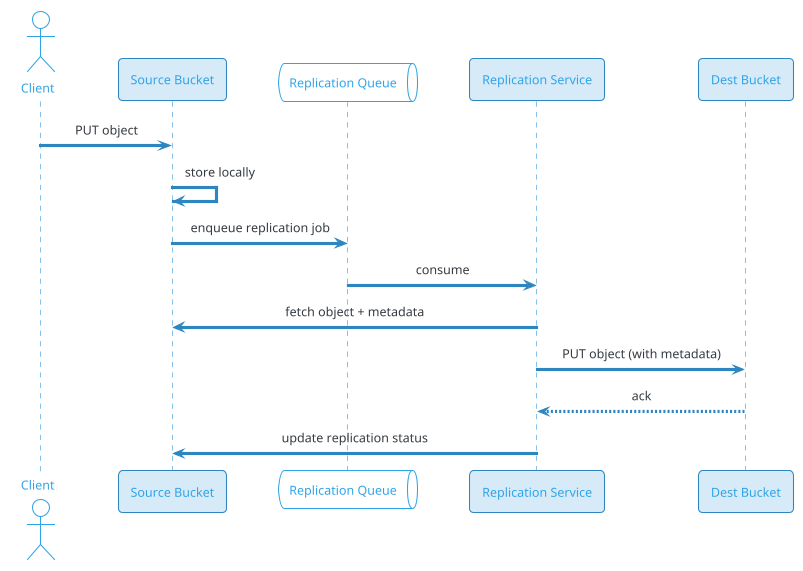

# Distributed Cloud Storage (S3 / GCS / Azure Blob)

## Problem Statement

Design a distributed object storage service like Amazon S3, Google Cloud Storage, or Azure Blob Storage. The system stores exabytes of unstructured data (images, videos, backups, logs, ML datasets) as immutable objects inside buckets, and serves them over HTTP with 99.999999999% (11 nines) durability, strong read-after-write consistency, and global access. Objects range from a few bytes to 5 TB multipart uploads. The system must scale to trillions of objects, serve millions of requests per second, and support tiered storage for cost optimization.

**Example:**

```
PutObject flow:
  1. Client authenticates via SigV4 (AWS Signature v4)
  2. Client issues PUT /bucket-name/photo.jpg
  3. S3 checks bucket policy + IAM permissions
  4. S3 splits object into chunks (for large files)
  5. Each chunk replicated across 3+ AZs (or erasure-coded)
  6. Metadata stored in a distributed metadata service
  7. 200 OK returned with ETag (MD5 of object)
  8. Read-after-write consistency guaranteed

GetObject flow:
  1. Client issues GET /bucket-name/photo.jpg
  2. S3 checks auth + bucket policy
  3. Metadata lookup → chunk locations
  4. Bytes streamed from nearest replica
  5. Cache-Control + ETag returned

Multipart upload (large file, 5 GB):
  1. CreateMultipartUpload → upload_id
  2. UploadPart 1..N (each 5 MB - 5 GB, parallel)
  3. CompleteMultipartUpload → assembles object
  4. Parts cleaned up after retention

Lifecycle:
  1. Object stored in STANDARD
  2. After 30 days → STANDARD_IA (Infrequent Access)
  3. After 90 days → GLACIER (archive)
  4. After 365 days → DEEP_ARCHIVE
  5. After 7 years → deleted

Key challenges:
  - 11 nines durability (survive any failure)
  - Strong read-after-write consistency
  - Exabyte scale (trillions of objects)
  - Multipart upload (up to 5 TB)
  - Global access (any region)
  - Tiered storage (cost optimization)
  - Security (encryption, IAM, bucket policies)
  - Versioning (keep multiple versions)
  - Replication (cross-region)
  - Eventual vs strong consistency (S3 now strong)
  - Range requests (partial reads)
  - Presigned URLs (temporary access)

Scale:
  - 500 PB stored
  - 10T objects (avg 50 KB metadata + chunks)
  - 100M buckets
  - 10M requests/sec peak
  - 100 TB/day uploads
  - 500 TB/day downloads
  - 11 nines durability (99.999999999%)
  - 99.99% availability (Standard tier)
  - p99 latency < 100 ms (first byte)
```

**Real-world systems:** Amazon S3, Google Cloud Storage, Azure Blob Storage, MinIO, Ceph, OpenStack Swift, Backblaze B2, Cloudflare R2.

**Why it's interesting:**

- **11 nines durability** — the strongest guarantee in storage
- **Erasure coding** — 1.5x overhead instead of 3x replication
- **Strong consistency** — S3 moved from eventual to strong in 2020
- **Trillions of objects** — metadata scaling is the hard part
- **Multipart upload** — client-driven chunking
- **Lifecycle policies** — automated tiering
- **Cross-region replication** — durability + compliance
- **Presigned URLs** — delegate access without sharing credentials
- **Range requests** — partial reads for video streaming
- **Event notifications** — trigger downstream processing
- **S3 Select** — push down queries to storage
- **Global access** — anycast, edge, and multi-region

---

## 1. Requirements Clarification

### Functional Requirements

- **Buckets**: Create, list, delete; globally unique names
- **Objects**: Put, get, delete, head, list
- **Metadata**: User-defined (key-value pairs) + system (size, ETag, content-type)
- **Multipart upload**: For objects > 100 MB (up to 5 TB)
- **Range requests**: Partial reads (video streaming, resume downloads)
- **Versioning**: Keep multiple versions of an object
- **Lifecycle policies**: Auto-transition tiers, expire old versions
- **Access control**: IAM policies, bucket policies, ACLs
- **Presigned URLs**: Temporary access without credentials
- **Encryption**: SSE-S3, SSE-KMS, SSE-C, client-side
- **Cross-region replication**: Async replication to other regions
- **Event notifications**: To SQS, SNS, Lambda on object changes
- **Static website hosting**: Serve HTML/CSS/JS from bucket
- **Object lock**: WORM (Write Once Read Many) for compliance
- **Batch operations**: Bulk copy, delete, tag
- **Inventory**: Daily CSV of all objects
- **Storage classes**: Standard, IA, Glacier, Deep Archive

### Non-Functional Requirements

- **Scale**: 500 PB, 10T objects, 100M buckets, 10M req/sec
- **Durability**: 11 nines (99.999999999%)
- **Availability**: 99.99% (Standard), 99.9% (IA), 99.5% (Glacier)
- **Consistency**: Strong read-after-write (S3 since Dec 2020)
- **Latency**: p99 < 100 ms first-byte; < 50 ms metadata
- **Throughput**: 100 TB/day uploads, 500 TB/day downloads
- **Elasticity**: No capacity planning; auto-scale
- **Security**: Encryption, IAM, audit, compliance (HIPAA, SOC 2, PCI)
- **Cost**: Tiered storage; pay-per-request + storage + egress
- **Global**: Multi-region, cross-region replication

### Out of Scope

- Relational queries (this is object, not file/block storage)
- POSIX filesystem semantics (that's EFS / Filestore)
- Block storage (that's EBS / Persistent Disk)
- Full-text search inside objects (that's S3 Select / Glacier Select)
- CDN internals (S3 integrates with CloudFront — separate problem)

---

## 2. Back-of-Envelope Estimation

### Traffic

```
Given:
  Total data             = 500 PB
  Total objects          = 10,000,000,000,000 (10T)
  Avg object size        = 50 KB (mix of small + large)
  Buckets                = 100,000,000
  Peak requests          = 10,000,000/sec
  Uploads/day            = 100 TB
  Downloads/day          = 500 TB
  Read:write ratio       = 5:1

Requests/sec (avg):
  Total = 10M peak; avg ~2M/sec
  GET   = ~1.6M/sec
  PUT   = ~0.3M/sec
  LIST  = ~0.1M/sec

Metadata ops/sec:
  Each request involves 1-5 metadata lookups
  ~20M metadata lookups/sec peak

Chunk ops/sec:
  Avg 10 chunks/object (large objects)
  ~5M chunk reads/sec peak
```

### Storage

```
Raw object data:        500 PB
With replication (3x):  1.5 EB
With erasure coding (1.5x): 750 PB
  (12+4 erasure coding → 1.33x overhead; 10+4 → 1.4x)

Metadata:
  Per object: ~1 KB (key, size, ETag, timestamps, tier, ACL)
  10T objects x 1 KB = 10 TB metadata
  With indexes: ~100 TB

Bucket metadata:
  100M buckets x 1 KB = 100 GB

Chunk location map:
  Per chunk: ~200 bytes
  100T chunks (avg 10/object) x 200 B = 20 TB

Versioning:
  Avg 1.2 versions/object (most not versioned)
  +20% storage

Total:
  ~750 PB objects
  ~130 TB metadata
  ~100 GB bucket metadata
  ~1 TB event logs (recent)
```

### Bandwidth

```
Uploads:
  100 TB/day = ~1.16 GB/sec avg
  Peak (10x) = ~11.6 GB/sec = ~93 Gbps

Downloads:
  500 TB/day = ~5.8 GB/sec avg
  Peak (10x) = ~58 GB/sec = ~464 Gbps

Replication:
  Cross-region: ~10% of writes = ~1 GB/sec = 8 Gbps
  Intra-region (erasure coding): ~50% of writes = ~5 GB/sec

Internal (metadata):
  20M lookups/sec x 1 KB = 20 GB/sec = 160 Gbps

Total peak:
  ~700 Gbps external
  ~500 Gbps internal
```

### Latency Budget

```
GET (first byte):

  Client → edge PoP:              ~10 ms
  Edge → S3 API:                  ~5 ms
  Auth (SigV4 verify):            ~2 ms
  Bucket policy check:            ~2 ms
  Metadata lookup:                ~10 ms
  Chunk location lookup:          ~5 ms
  Fetch chunk from storage:       ~20 ms
  Stream first bytes:             ~5 ms
  Total:                          ~60 ms

PUT (ack):

  Auth + policy:                  ~5 ms
  Chunk split:                    ~2 ms
  Write to 3 replicas (parallel): ~30 ms
  Metadata write:                 ~15 ms
  Ack:                            ~5 ms
  Total:                          ~60 ms

Targets:
  p50 GET: < 20 ms
  p99 GET: < 100 ms
  p50 PUT: < 50 ms
  p99 PUT: < 200 ms
```

---

## 3. High-Level Design

```d2
direction: down

client: Client {shape: person}
cdn: "CDN (CloudFront)" {shape: cloud}
edge: "Edge PoP" {shape: cloud}

lb: "Load Balancer" {shape: hexagon}
api: "S3 API Gateway" {shape: hexagon}

auth: "Auth Service (IAM + SigV4)" {shape: rectangle}
bucket: "Bucket Service" {shape: rectangle}
object: "Object Service" {shape: rectangle}
meta: "Metadata Service" {shape: rectangle}
chunk: "Chunk Service" {shape: rectangle}
tier: "Tiering Service" {shape: rectangle}
repl: "Replication Service" {shape: rectangle}
lifecycle: "Lifecycle Service" {shape: rectangle}
event: "Event Notification Service" {shape: rectangle}
encrypt: "KMS / Encryption" {shape: rectangle}

kafka: Kafka {shape: queue}

meta_db: "Metadata Store (sharded)" {shape: cylinder}
chunk_db: "Chunk Index (sharded)" {shape: cylinder}
blob: "Blob Storage (chunks)" {shape: cylinder}
cold: "Cold Storage (Glacier)" {shape: cylinder}
audit: "Audit Log (append-only)" {shape: cylinder}

client -> cdn
cdn -> edge
edge -> lb
lb -> api

api -> auth
api -> bucket
api -> object
api -> meta

object -> chunk
chunk -> blob
tier -> cold
chunk -> chunk_db
meta -> meta_db

repl -> kafka
lifecycle -> kafka
event -> kafka

api -> audit
encrypt -> meta_db
```

### Component Responsibilities

| Component | Role |
|---|---|
| CDN / Edge | Cache hot objects; terminate TLS; absorb DDoS |
| Load Balancer | Route to API fleet |
| S3 API Gateway | HTTP entry; SigV4 auth; routing |
| Auth Service | IAM, bucket policies, SigV4 verify |
| Bucket Service | Bucket CRUD; global namespace |
| Object Service | Object lifecycle (put, get, delete) |
| Metadata Service | Object metadata; versioning |
| Chunk Service | Chunk splitting, assembly |
| Tiering Service | Move objects between storage classes |
| Replication Service | Cross-region replication |
| Lifecycle Service | Policy evaluation, transitions |
| Event Notification | Emit events to SQS/SNS/Lambda |
| KMS / Encryption | Key management, envelope encryption |
| Kafka | Event bus |
| Metadata Store | Sharded object metadata |
| Chunk Index | Chunk → location mapping |
| Blob Storage | Chunks (erasure-coded) |
| Cold Storage | Glacier / Deep Archive |
| Audit Log | Immutable audit trail |

### Why This Architecture

- **Separation of metadata and data** — enables independent scaling
- **Chunk-based storage** — large objects split; enables parallelism and erasure coding
- **Erasure coding** — 1.4x overhead vs 3x replication
- **Sharded metadata** — trillions of objects require horizontal partition
- **Strong consistency** — metadata store with linearizable writes
- **Event-driven** — Kafka for replication, lifecycle, notifications
- **Tiered storage** — hot on SSD/NVMe, cold on HDD/tape
- **CDN for hot objects** — offloads origin, reduces latency

---

## 4. Deep Dive: Durability and Erasure Coding

### 11 Nines Durability

`99.999999999%` annual durability = expected loss of 1 object per 10 billion per year.

**Achieved by:**
- **Redundancy** across multiple AZs (3+ typically)
- **Erasure coding** within an AZ (or across)
- **Checksums** at multiple layers (end-to-end)
- **Continuous integrity checks** (background scrubbing)
- **Automatic repair** when corruption detected

### Replication vs Erasure Coding

| Aspect | 3x Replication | Erasure Coding (12+4) |
|---|---|---|
| Storage overhead | 3.0x | 1.33x |
| Fault tolerance | 2 simultaneous failures | 4 simultaneous failures |
| Read cost | 1 chunk | 12 chunks (or fewer if cached) |
| Write cost | 3 writes | 16 writes |
| Rebuild cost | 1 full copy | ~12/16 of data |
| CPU | Low | Higher (encode/decode) |
| Latency | Lower | Higher (decode) |

**Standard:** Erasure coding for warm/cold; replication for hot metadata.

### Erasure Coding (Reed-Solomon)

Split object into **k data chunks** + **m parity chunks**:

```
Original: 12 data chunks (D1..D12)
Encoded:  12 data + 4 parity (P1..P4) = 16 chunks
Survives any 4 chunk losses.
Overhead: 16/12 = 1.33x
```

**Encoding:**

```
For each byte position:
  P1 = D1 + D2 + ... + D12       (XOR)
  P2 = a1*D1 + a2*D2 + ...       (GF(2^8) arithmetic)
  P3 = b1*D1 + b2*D2 + ...
  P4 = c1*D1 + c2*D2 + ...
```

**Decoding:** Solve linear system with any 12 of 16 chunks.

### Locality

Place chunks **across AZs** so a single AZ failure doesn't lose > 1/3:

```
AZ-A: D1..D4, P1
AZ-B: D5..D8, P2
AZ-C: D9..D12, P3, P4
```

**Rebuild:** If AZ-A fails, reconstruct D1..D4 from D5..D12 + P1..P4 (12 of 16 available).

### Scrub and Repair

**Background scrubbing** (weekly):
1. Read each chunk
2. Verify checksum
3. If corrupt → mark for rebuild
4. Rebuild from parity

**Priority:** Hot objects first; cold objects off-peak.

### Integrity Checksums

Multiple layers:

| Layer | Checksum |
|---|---|
| Client → S3 | Content-MD5 |
| S3 (metadata) | ETag (MD5 or multipart hash) |
| Chunk on disk | CRC32C per block |
| Inter-DC | TLS + per-packet CRC |

**End-to-end:** S3 validates MD5 on PUT; stores; re-validates on GET (optional).

### Durability Math

```
P(chunk lost) = 10^-6/year (disk failure + unrepaired)
Survive any 4 of 16 (12+4 EC):
  P(data lost) = sum_{i=5}^{16} C(16,i) * p^i * (1-p)^(16-i)
  ≈ C(16,5) * p^5 ≈ 4368 * (10^-6)^5 = 4.4 * 10^-27/year
```

**Far below 11 nines (10^-11).** Real limit is operational errors, not hardware.

### Trade-offs

| Concern | Replication | Erasure Coding |
|---|---|---|
| Storage cost | High | Low |
| CPU | Low | High |
| Latency (read) | Low | Higher |
| Latency (write) | Low | Higher |
| Rebuild time | Short (copy) | Longer (decode) |
| Small object overhead | Low | High (min chunk size) |

**Hybrid:** Replicate small/hot; erasure code large/cold.

---

## 5. Deep Dive: Metadata Store

### Why Metadata is Hard

- **10T objects** — need horizontal sharding
- **Strong consistency** — S3 moved to strong in 2020
- **Low latency** — metadata lookup on every request
- **Multi-index** — by key, by prefix, by tags, by bucket
- **Versioning** — multiple versions per object
- **Atomic updates** — overwrite, delete

### Sharding Strategy

**By bucket + key hash:**
```
shard = hash(bucket_name + "/" + key) % num_shards
```

**By bucket:**
```
Small buckets grouped; large buckets dedicated.
Consistent hashing for shard → node mapping.
```

**Recommendation:** Hash on (bucket, key) with **256+ shards**; each shard replicated.

### Metadata Schema

```
ObjectMetadata:
  bucket          : string
  key             : string
  version_id      : string (UUID)
  size            : int64
  etag            : string (MD5 or multipart hash)
  content_type    : string
  last_modified   : timestamp
  storage_class   : enum
  encryption      : {type, key_id}
  user_metadata   : map<string, string>
  tags            : map<string, string>
  acl             : list<grant>
  is_latest       : bool
  is_delete_marker: bool
  chunk_map       : list<ChunkRef>
  checksum_crc32c : int64
  replication     : {status, target_region}
  object_lock     : {mode, retain_until}
```

### Storage Backend

| Store | Use | Pros | Cons |
|---|---|---|---|
| **Relational (Postgres/MySQL)** | Small deployments | ACID, joins | Vertical scaling |
| **Distributed KV (DynamoDB/Cassandra)** | Large deployments | Horizontal, scalable | Limited queries |
| **Custom (Bigtable)** | Google's approach | Scale + range queries | Complex |
| **Spanner-like** | Strong global | Global ACID | Expensive |

**Recommendation:** Distributed KV (DynamoDB/Cassandra) for metadata; add secondary indexes (Elasticsearch) for LIST/tag queries.

### Metadata Consistency

**S3's strong consistency (since Dec 2020):**
- **PUT then GET** — always sees new object
- **PUT then LIST** — always sees new object
- **DELETE then GET** — 404
- **Overwrite** — atomic (readers see old or new, never partial)

**How:** Metadata store with linearizable writes per object.

**Implementation:**
- Single-writer per object (shard leader)
- **Consensus** (Raft/Paxos) or **conditional writes** in DynamoDB
- Reads can come from leader or replica (as long as consistent snapshot)

### Metadata Caching

**Hot metadata** (recent objects, popular objects):
- **Edge cache** (CDN) for `HEAD` and small `GET`
- **Redis** in front of metadata store
- **TTL**: 5 min for mutable metadata; long for immutable

**Cache invalidation:**
- On PUT → invalidate key
- On DELETE → invalidate key
- Version-aware keys

### Sharding Challenges

**Hot shards:** Popular bucket/key.
**Rebalancing:** Move shards as data grows.
**Cross-shard queries:** LIST (prefix) may span shards.

**Solutions:**
- **Prefix routing:** Ensure similar prefixes hash to same shard (bad — hotspots)
- **Prefix scatter:** Query all shards for prefix (works, but N× reads)
- **Secondary index:** Sorted by (bucket, prefix, key) in a search store

### Metadata Size

```
Per object: ~500 bytes (compressed)
10T objects x 500 B = 5 TB compressed
With indexes + versions: ~50 TB
Sharded across 256 nodes: ~200 GB/node
```

**Small compared to object data — but every op hits it.**

---

## 6. Deep Dive: Multipart Upload

### Why Multipart?

- **5 TB max object** — single PUT impractical
- **Parallelism** — upload parts concurrently
- **Resumability** — retry failed parts only
- **Network resilience** — smaller failure domains

### Protocol

```
1. InitiateMultipartUpload
   POST /bucket/key?uploads
   → response: { UploadId: "abc123" }

2. UploadPart (repeat)
   PUT /bucket/key?partNumber=N&uploadId=abc123
   Body: part bytes
   → response: { ETag: "part-md5" }

3. CompleteMultipartUpload
   POST /bucket/key?uploadId=abc123
   Body: { Parts: [{PartNumber, ETag}, ...] }
   → response: { ETag: "final-etag", Location: "..." }

4. (Optional) AbortMultipartUpload
   DELETE /bucket/key?uploadId=abc123
```

### Constraints

| Constraint | Value |
|---|---|
| Min part size | 5 MB (except last) |
| Max part size | 5 GB |
| Max parts | 10,000 |
| Max object size | 5 TB |

**Implication:** For 5 TB object, use 500 MB parts × 10,000.

### Part Assembly

**Option A — Concatenate on metadata:**
- Store parts as separate chunks
- Metadata references them in order
- Read: fetch all parts, concatenate in-memory or stream
- **Pro:** No rewrite; parallel reads
- **Con:** More chunks; complexity

**Option B — Rewrite into single object:**
- After Complete, write all parts into one erasure-coded object
- **Pro:** Simpler reads
- **Con:** Expensive rewrite (seconds to minutes)

**S3 uses Option A** (metadata references parts); GET streams them.

### Multipart ETag

S3's ETag for multipart is **not** the MD5 of the whole object:
```
ETag = MD5(MD5(part1) + MD5(part2) + ...) + "-" + num_parts
```

**Why:** Computing whole-object MD5 requires reading all bytes; multipart ETag allows per-part validation.

**Client caveat:** Cannot use ETag to verify object integrity for multipart objects.

### Concurrency and Retries

- **Parallel parts:** Client uploads 4-16 parts in parallel
- **Retries:** Failed part → retry that part only
- **Timeout:** Parts have TTL (e.g., 7 days); abort cleans up
- **Idempotency:** Same PartNumber + same bytes → same ETag

### Cost

- **Per-part PUT:** $0.005/1000 (Standard)
- **Complete:** Free
- **Abort:** Free
- **Storage:** Only after Complete; parts aren't billed until then

### Lifecycle for Orphaned Uploads

Abort incomplete uploads after N days:
```json
{
  "Rule": {
    "ID": "abort-incomplete",
    "Filter": {"Prefix": ""},
    "Status": "Enabled",
    "AbortIncompleteMultipartUpload": {
      "DaysAfterInitiation": 7
    }
  }
}
```

**Saves storage** from abandoned uploads.

### Client-Side Multipart

**Library support:**
- AWS SDK: `TransferManager` handles multipart automatically
- CLI: `aws s3 cp --expected-size 5GB` auto-multiparts
- Tools: rclone, s5cmd

**Best practice:** Chunk size = `max(5 MB, min(5 GB, total_size / 10,000))`.

---

## 7. Deep Dive: Consistency and Versioning

### Strong Read-After-Write (S3 2020)

**Before 2020:** Eventual consistency for overwrite PUT and DELETE.

**After Dec 2020:** Strong consistency for all operations:
- **PUT → GET**: always new object
- **PUT → LIST**: always new object
- **DELETE → GET**: 404
- **Overwrite**: atomic (old or new, never partial)

**How:**
- Metadata store with linearizable writes
- Single leader per shard (or Raft)
- Client requests routed to leader for writes
- Reads see latest committed

### Versioning

**Enable versioning** on a bucket:
- Every PUT creates a new `version_id`
- Object has a **current version** (is_latest=true)
- Old versions retained
- DELETE adds a **delete marker** (doesn't remove data)

**Example:**

```
PUT /bucket/key (v1) → version_id=abc
PUT /bucket/key (v2) → version_id=def, is_latest
DELETE /bucket/key  → delete marker (ghi), is_latest
GET /bucket/key     → 404 (delete marker)
GET /bucket/key?versionId=def → v2
GET /bucket/key?versionId=abc → v1
DELETE /bucket/key?versionId=ghi → remove delete marker
```

### Delete Marker

- **Soft delete:** Adds marker; previous versions still accessible
- **Permanent delete:** `DELETE ?versionId=X` removes that version
- **Cleanup:** Lifecycle rules expire old versions

### Lifecycle for Versions

```json
{
  "Rule": {
    "ID": "expire-old-versions",
    "Filter": {"Prefix": "logs/"},
    "Status": "Enabled",
    "NoncurrentVersionExpiration": {
      "NoncurrentDays": 30
    }
  }
}
```

### MFA Delete

**Extra protection:** Require MFA to delete versions:
- Prevents accidental or malicious deletion
- Enabled per bucket
- Requires MFA code on DELETE

### Object Lock (WORM)

**Compliance mode:**
- No one (not even root) can delete/modify
- Retention until date
- Legal hold can extend

**Governance mode:**
- Users with permission can override
- Retention until date

**Use cases:** Financial records, healthcare, legal holds.

### Consistency Trade-offs

| Operation | Before 2020 | After 2020 |
|---|---|---|
| PUT → GET | Eventual | Strong |
| PUT → LIST | Eventual | Strong |
| DELETE → GET | Eventual | Strong |
| Overwrite → GET | Eventual | Strong |
| Multipart → GET | Eventual | Strong |

**Cost:** Higher write latency (leader commit) but better UX.

### Cross-Region Consistency

**Replication:** Async (typically).
**Consistency:** Eventual across regions (by design).

**For strong cross-region:** Use S3 Multi-Region Access Points with active-active replication — still eventual (by latency).

---

## 8. Deep Dive: Tiered Storage and Lifecycle

### Storage Classes

| Class | Use | Latency | Durability | Cost (per GB/mo) |
|---|---|---|---|---|
| **STANDARD** | Hot, frequent access | ms | 11 nines | $0.023 |
| **STANDARD_IA** | Infrequent, rapid access | ms | 11 nines | $0.0125 |
| **ONEZONE_IA** | Infrequent, single AZ | ms | 11 nines | $0.01 |
| **INTELLIGENT_TIERING** | Auto-tier | ms | 11 nines | $0.023+ |
| **GLACIER_IR** | Archive, ms access | ms | 11 nines | $0.004 |
| **GLACIER_FLEXIBLE** | Archive, minutes-hours | minutes | 11 nines | $0.0036 |
| **DEEP_ARCHIVE** | Cold, 12 hours | hours | 11 nines | $0.00099 |

### Lifecycle Policies

**Transition rules:**

```json
{
  "Rules": [
    {
      "ID": "logs-tiering",
      "Filter": {"Prefix": "logs/"},
      "Status": "Enabled",
      "Transitions": [
        {"Days": 30,  "StorageClass": "STANDARD_IA"},
        {"Days": 90,  "StorageClass": "GLACIER_FLEXIBLE"},
        {"Days": 365, "StorageClass": "DEEP_ARCHIVE"}
      ],
      "Expiration": {"Days": 2555},
      "NoncurrentVersionExpiration": {"NoncurrentDays": 30}
    }
  ]
}
```

**Interpretation:**
- Day 0-30: STANDARD
- Day 30-90: STANDARD_IA
- Day 90-365: GLACIER
- Day 365-2555 (7 years): DEEP_ARCHIVE
- Day 2555: delete
- Noncurrent versions: delete after 30 days

### Intelligent-Tiering

**Automatic tiering** based on access patterns:
- **Frequent tier**: default
- **Infrequent tier**: after 30 days no access
- **Archive instant**: after 90 days no access
- **Archive**: opt-in (configurable days)
- **Deep archive**: opt-in (configurable days)

**Monitoring:** Per-object access tracked; transition automated.

**Cost:** Small monitoring fee per object; no retrieval fees.

### Transition Mechanics

When object transitions:
1. Lifecycle service finds eligible objects (batch scan)
2. **Copy** object to new tier's storage backend
3. **Update metadata** (storage_class field)
4. **Delete** old copy (async)

**Time:** Minutes to hours for large objects.

### Retrieval from Archive

**Glacier Flexible:**
- **Expedited:** 1-5 min (higher cost)
- **Standard:** 3-5 hours
- **Bulk:** 5-12 hours (cheapest)

**Glacier Deep Archive:**
- Standard: 12 hours
- Bulk: 48 hours

**Restore process:**
1. POST /object?restore with tier
2. Job queued
3. Object copied to STANDARD (temporary)
4. Available for N days
5. Auto-deleted after

### Lifecycle Costs

```
500 PB total
Assume:
  10% STANDARD       = 50 PB  x $0.023 = $1.18M/mo
  20% STANDARD_IA    = 100 PB x $0.0125 = $1.25M/mo
  30% GLACIER_FLEX   = 150 PB x $0.0036 = $0.54M/mo
  40% DEEP_ARCHIVE   = 200 PB x $0.00099 = $0.20M/mo
                                          --------
                                          ~$3.17M/mo

vs all STANDARD: 500 PB x $0.023 = $11.5M/mo
Savings: ~72%
```

**Lifecycle policies save millions.**

---

## 9. Deep Dive: Security (IAM, Encryption, Presigned URLs)

### Authentication

**AWS Signature v4 (SigV4):**
- Client signs request with access key + secret
- Canonical request → hash → HMAC chain
- Server verifies using stored secret

**Flow:**
```
1. Client builds canonical request:
   HTTPMethod\nCanonicalURI\nCanonicalQuery\nCanonicalHeaders\nSignedHeaders\nHashedPayload
2. StringToSign = "AWS4-HMAC-SHA256\n" + timestamp + "\n" + scope + "\n" + hash(canonical)
3. SigningKey = HMAC(HMAC(HMAC(HMAC("AWS4"+secret, date), region), service), "aws4_request")
4. Signature = HMAC(SigningKey, StringToSign)
5. Add Authorization header with Signature
```

**Server:** Recomputes signature; rejects if mismatch.

### Authorization

**IAM policies** (identity-based):
```json
{
  "Version": "2012-10-17",
  "Statement": [{
    "Effect": "Allow",
    "Action": ["s3:GetObject"],
    "Resource": "arn:aws:s3:::my-bucket/*"
  }]
}
```

**Bucket policies** (resource-based):
```json
{
  "Version": "2012-10-17",
  "Statement": [{
    "Effect": "Allow",
    "Principal": {"AWS": "arn:aws:iam::123:user/alice"},
    "Action": "s3:GetObject",
    "Resource": "arn:aws:s3:::my-bucket/*"
  }]
}
```

**Evaluation:** IAM + bucket policy + ACL + SCP (org) + VPC endpoint policy.

### Encryption at Rest

**Options:**

| Type | Key management | Use case |
|---|---|---|
| **SSE-S3** | S3-managed (AES-256) | Default; simple |
| **SSE-KMS** | AWS KMS customer master keys | Audit, rotation |
| **SSE-C** | Client-provided key | Client controls |
| **DSSE-KMS** | Dual-layer (S3 + KMS) | Compliance |
| **Client-side** | Client encrypts before upload | Full control |

**Envelope encryption (SSE-KMS):**
1. Generate **data key** (AES-256)
2. Encrypt object with data key
3. Encrypt data key with **KMS master key**
4. Store encrypted data key + encrypted object
5. On GET: decrypt data key via KMS; decrypt object

**Rotation:** KMS keys auto-rotate annually; data keys per-object.

### Encryption in Transit

- **TLS 1.2+** for all requests
- **TLS 1.3** supported
- **HTTPS-only bucket policies** (deny HTTP)
- **VPC endpoints** for private access

### Presigned URLs

**Use case:** Delegate temporary access without sharing credentials.

**Flow:**
```
1. Client (with credentials) generates presigned URL:
   GET https://bucket.s3.amazonaws.com/key
     ?X-Amz-Algorithm=AWS4-HMAC-SHA256
     &X-Amz-Credential=...
     &X-Amz-Date=...
     &X-Amz-Expires=3600
     &X-Amz-Signature=...
2. Share URL with untrusted party
3. Party uses URL (no credentials needed)
4. S3 verifies signature; serves object
5. URL expires after X-Amz-Expires
```

**Max expiry:** 7 days (SigV4).

**Use cases:**
- Share file with external user
- Web upload form (presigned PUT)
- Temporary download link

### Audit and Compliance

**CloudTrail / audit log:**
- Every API call logged (who, what, when, result)
- Stored in append-only storage
- Queryable (Athena, etc.)

**Compliance:**
- **HIPAA**: BAA + encryption + audit
- **SOC 2**: Controls + audit
- **PCI DSS**: Encrypted cardholder data
- **GDPR**: Data residency + right to erasure

### Access Logs

**Server access logging:**
- Every request logged to a target bucket
- Fields: bucket, key, requester, operation, status, bytes, latency
- Used for analytics, security, compliance

---

## 10. Deep Dive: Cross-Region Replication

### Why Replicate?

- **Durability**: Survive region-wide failure
- **Latency**: Serve from nearest region
- **Compliance**: Data residency (EU data in EU)
- **DR**: Backup to distant region
- **Multi-region apps**: Active-active reads

### Replication Types

| Type | Direction | Use |
|---|---|---|
| **CRR** (Cross-Region Replication) | One-way, async | DR, compliance |
| **SRR** (Same-Region Replication) | One-way, async | Log aggregation |
| **MRR** (Multi-Region Replication) | Bi-directional | Active-active |
| **S3 Replication Time Control** | Guaranteed 15 min | SLA-backed |

### CRR Configuration

```json
{
  "Role": "arn:aws:iam::123:role/replication-role",
  "Rules": [{
    "ID": "replicate-logs",
    "Status": "Enabled",
    "Filter": {"Prefix": "logs/"},
    "Destination": {
      "Bucket": "arn:aws:s3:::dest-bucket",
      "StorageClass": "STANDARD_IA",
      "ReplicationTime": {"Status": "Enabled", "Time": {"Minutes": 15}},
      "Metrics": {"Status": "Enabled"}
    }
  }]
}
```

### Replication Flow



### Replication Metadata

- **Source ETag**: match object versions
- **Replication status**: PENDING, COMPLETED, FAILED
- **Replication time**: metric per object
- **Version ID**: preserved across replication

### Bi-Directional (MRR)

**Challenge:** Conflict resolution when both regions write same key.

**S3 MRR uses last-writer-wins** (by timestamp).

**Replication loop prevention:** Replication metadata marks replicated objects; no re-replication.

### Replication Costs

- **Per GB replicated**: $0.02
- **Per PUT**: $0.005/1000
- **Storage in destination**: As per class
- **Data transfer**: Cross-region egress ($0.02/GB)

**Example:** 100 TB/month replicated = $2,000 transfer + $5,000 PUT + storage.

### SLA — Replication Time Control

- **99.99%** of objects replicated within 15 min
- **Metrics**: `ReplicationLatency`, `BytesPendingReplication`
- **Cost**: Additional per-GB fee

### Failover

**Active-passive:**
- Replicate to DR region
- DNS failover (Route 53) on region failure
- RTO: minutes; RPO: ~15 min (RTC)

**Active-active:**
- Both regions serve reads
- Writes to either; replicate
- Conflict resolution (LWW)
- Complex app logic

### Replication to Different Account

**For isolation / compliance:**
- Replicate across AWS accounts
- Source bucket policy allows replication role
- Destination bucket policy allows writes from source

**Use case:** Backup account isolated from production.

---

## 11. Deep Dive: Event Notifications

### Why Events?

**Trigger downstream processing:**
- **Image upload** → Lambda to generate thumbnail
- **Video upload** → Transcode job
- **Log upload** → Index in Elasticsearch
- **Data upload** → ETL pipeline
- **Delete** → Cache invalidation

### Event Types

| Event | Trigger |
|---|---|
| `s3:ObjectCreated:*` | PUT, POST, COPY, MultipartComplete |
| `s3:ObjectCreated:Put` | PUT only |
| `s3:ObjectRemoved:*` | DELETE (any) |
| `s3:ObjectRemoved:Delete` | Explicit delete |
| `s3:ObjectRemoved:DeleteMarkerCreated` | Versioning delete |
| `s3:ObjectRestore:*` | Glacier restore |
| `s3:ObjectTagging:*` | Tag add/remove |
| `s3:ObjectAcl:Put` | ACL change |
| `s3:LifecycleTransition` | Tier change |
| `s3:LifecycleExpiration` | Object expired |

### Destinations

- **SQS**: Queue for downstream polling
- **SNS**: Fan-out to subscribers
- **Lambda**: Direct invocation
- **EventBridge**: Advanced routing

### Event Structure

```json
{
  "Records": [{
    "eventVersion": "2.1",
    "eventSource": "aws:s3",
    "eventName": "ObjectCreated:Put",
    "eventTime": "2026-09-19T10:00:00.000Z",
    "s3": {
      "bucket": {"name": "my-bucket"},
      "object": {
        "key": "photos/cat.jpg",
        "size": 12345,
        "eTag": "abc123",
        "versionId": "v1"
      }
    }
  }]
}
```

### Delivery Guarantees

- **At-least-once**: Duplicates possible
- **Ordering**: Not guaranteed
- **Latency**: Typically < 1 sec (SQS/SNS); < 100 ms (Lambda direct)
- **Filtering**: By prefix, suffix, event type

### Filtering

```json
{
  "Filter": {
    "Key": {
      "FilterRules": [
        {"Name": "prefix", "Value": "photos/"},
        {"Name": "suffix", "Value": ".jpg"}
      ]
    }
  },
  "Destination": {"Lambda": "thumbnail-gen"}
}
```

**Only JPGs in photos/ trigger Lambda.**

### Use Cases

**Image processing pipeline:**
```
Upload → S3 event → Lambda (resize) → S3 (thumbnails) → CDN
```

**Log processing:**
```
Logs → S3 → Event → Lambda (parse) → Elasticsearch → Kibana
```

**Data lake:**
```
Data → S3 → Event → Glue (ETL) → Redshift
```

### Reliability

- **Retries**: Automatic (SQS: 14 days; Lambda: 3 attempts)
- **DLQ**: Dead-letter queue for failures
- **Idempotency**: Consumers must dedupe (at-least-once)
- **Monitoring**: `NumberOfObjects`, `EventDeliveryFailures`

### Cost

- **SQS**: $0.40/million requests
- **SNS**: $0.50/million
- **Lambda**: Per-invocation
- **EventBridge**: $1/million events

**Typically negligible** compared to compute.

---

## 12. Scaling Considerations

### Read Scaling

- **CDN** for hot objects (90%+ hit ratio)
- **Edge cache** for static content
- **Read replicas** across AZs
- **Chunk parallelism** for large objects
- **Range requests** for video streaming

### Write Scaling

- **Multipart upload** for large objects
- **Parallel chunk writes** across nodes
- **Erasure coding** with local reconstruction
- **Async replication** to other AZs/regions
- **Write buffering** at API layer

### Sharding

**Metadata:** Shard by `hash(bucket + key)`.
**Chunks:** Shard by `chunk_id` (content hash).
**Buckets:** Global namespace (DNS-compatible).
**Indexes:** Elasticsearch for LIST/tag queries.

### Multi-Region

```d2
direction: down

us: "US-East (primary)" {
  shape: cloud
}
eu: "EU-West (replica)" {
  shape: cloud
}
apac: "AP-South (replica)" {
  shape: cloud
}

us_db: "US Metadata" {
  shape: cylinder
}
eu_db: "EU Metadata" {
  shape: cylinder
}
apac_db: "APAC Metadata" {
  shape: cylinder
}

us -> us_db
eu -> eu_db
apac -> apac_db

us_db -> eu_db : async replication
us_db -> apac_db : async
```

**Strategy:**
- **Region-local buckets** for residency
- **CRR** for DR / global
- **Multi-Region Access Points** for active-active
- **Route 53 latency-based routing**

### Peak Handling

- **Auto-scaling** at API layer
- **Pre-warming** for known peaks (Black Friday)
- **Admission control** at bucket level
- **Throttling** for abusive clients
- **Backpressure** with retries + jitter

### Cost Optimization

| Component | Optimization |
|---|---|
| Storage | Lifecycle tiering (72% savings) |
| Compute | Right-size API fleet |
| Network | CDN offload, VPC endpoints |
| Metadata | Cache hot metadata |
| Replication | Only what's needed |
| Requests | Batch operations |

### Capacity Planning

```
Object storage: 500 PB
API nodes: 10M req/sec peak / 50K req/sec per node = 200 nodes (peak)
           ~100 nodes sustained (with headroom)
Metadata nodes: 20M lookups/sec / 100K lookups/sec per node = 200 nodes
Chunk storage: 100T chunks x 1 MB avg = 100 PB (before EC)
               With 1.33x EC = 133 PB raw
Tiering: 60% warm, 30% cold, 10% archive
```

---

## 13. Bottlenecks and Trade-offs

| Concern | Solution | Trade-off |
|---|---|---|
| Durability | Erasure coding (12+4) | CPU cost for encode/decode |
| Consistency | Leader-based metadata | Higher write latency |
| Scale | Sharded metadata | Cross-shard queries |
| Large objects | Multipart upload | Client complexity |
| Cost | Lifecycle tiering | Retrieval latency for cold |
| Latency | CDN + edge cache | Cache invalidation |
| Security | KMS envelope encryption | KMS dependency |
| Replication | Async cross-region | Eventual consistency |
| Metadata | Distributed KV | Limited query |
| Versioning | Retain all versions | Storage cost |
| Notifications | At-least-once | Duplicate handling |
| Presigned URLs | Time-limited access | Signature complexity |

### Design Decisions Summary

| Decision | Choice | Rationale |
|---|---|---|
| Durability | Erasure coding (12+4) + replication for hot | Balance cost/durability |
| Consistency | Strong (leader-based metadata) | S3 parity |
| Metadata store | Distributed KV (DynamoDB-style) | Scale |
| Blob storage | Custom (chunks on disk) | Control |
| Multipart | Client-driven, metadata-assembled | Parallelism + resumability |
| Tiering | Lifecycle policies | Cost optimization |
| Replication | Async, one-way default | Durability + simplicity |
| Events | Kafka → SQS/SNS/Lambda | Decoupled |
| Encryption | SSE-KMS envelope | Audit + rotation |
| Auth | SigV4 + IAM + bucket policy | Standard |
| URL | Presigned (SigV4) | Temporary access |

---

## 14. Failure Scenarios

### Disk Failure

**Impact:** Chunk lost on one node.

**Mitigation:**
- Erasure coding survives 4 of 16 chunks
- Background scrub detects
- Rebuild from parity
- Alert ops if > 1% disks degraded

### Node Failure

**Impact:** Chunks on node unavailable.

**Mitigation:**
- Data spread across nodes
- Redirect to other replicas
- Rebuild from parity
- Alert ops

### AZ Failure

**Impact:** 1/3 of replicas lost.

**Mitigation:**
- Erasure coding across AZs
- Serve from remaining AZs
- Rebuild when AZ recovers
- Alert ops (P0 if entire AZ down)

### Region Failure

**Impact:** All data in region unavailable.

**Mitigation:**
- CRR to other regions
- DNS failover (Route 53)
- Apps switch to replica region
- Alert ops (P0)

### Metadata Store Failure

**Impact:** Cannot resolve object metadata.

**Mitigation:**
- Multi-AZ metadata replicas
- Leader election (Raft)
- Cache serves recent reads
- Alert ops

### Metadata Corruption

**Impact:** Wrong or missing metadata.

**Mitigation:**
- Checksums on metadata
- Multi-replica validation
- Restore from backup
- Alert ops

### Hot Partition

**Impact:** Single shard overwhelmed.

**Mitigation:**
- Prefix-scatter reads
- Adaptive sharding
- Cache hot metadata
- Alert ops

### Network Partition

**Impact:** Cluster splits.

**Mitigation:**
- Quorum-based metadata writes
- AP reads from local
- On heal: reconcile
- Alert ops

### DDoS Attack

**Impact:** API overwhelmed.

**Mitigation:**
- CDN absorbs
- Rate limiting per account
- Auth required
- Alert ops

### Ransomware

**Impact:** Data encrypted by attacker with stolen creds.

**Mitigation:**
- **MFA Delete** for versioning
- **Object Lock** (WORM)
- **Cross-account replication**
- **Least privilege** IAM
- **Anomaly detection**

### Insider Threat

**Impact:** Data exfiltration.

**Mitigation:**
- **Audit logs** (CloudTrail)
- **Least privilege**
- **VPC endpoints**
- **Anomaly detection**
- **Data classification**

### Bucket Policy Misconfiguration

**Impact:** Public exposure of private data.

**Mitigation:**
- **Block Public Access** at account level
- **Policy validation** (IAM Access Analyzer)
- **Continuous monitoring**
- **Alert on public buckets**

### Multipart Upload Stuck

**Impact:** Orphaned parts consume storage.

**Mitigation:**
- **Lifecycle rule** aborts after N days
- **Monitoring** for orphaned uploads
- **Client retry** with abort on failure

### Encryption Key Compromise

**Impact:** Attacker decrypts data.

**Mitigation:**
- **KMS auto-rotation** (annual)
- **Per-object data keys**
- **Immediate rotation** on suspicion
- **Audit** all key usage

### Region-Wide Outage

**Impact:** Service unavailable in region.

**Mitigation:**
- **CRR** to other regions
- **DNS failover** (Route 53)
- **Multi-region apps**
- **Alert ops (P0)**

### Data Deletion (Accidental)

**Impact:** Data loss.

**Mitigation:**
- **Versioning** (restore old version)
- **MFA Delete** (require MFA)
- **Object Lock** (WORM)
- **Backup bucket** (cross-account)

### Cost Explosion

**Impact:** Unexpected bill.

**Mitigation:**
- **Budget alerts**
- **Lifecycle policies** (tier + expire)
- **CloudWatch billing metrics**
- **Anomaly detection**

---

## 15. Monitoring and Alerts

### Key Metrics

| Metric | Target | Alert Threshold |
|---|---|---|
| GET p99 | < 100 ms | > 300 ms |
| PUT p99 | < 200 ms | > 500 ms |
| HEAD p99 | < 30 ms | > 100 ms |
| Availability (Standard) | 99.99% | < 99.9% |
| Durability | 11 nines | Any data loss |
| Error rate (5xx) | < 0.01% | > 0.1% |
| 4xx rate | < 1% | > 5% |
| Metadata lookup p99 | < 20 ms | > 100 ms |
| Chunk read p99 | < 50 ms | > 200 ms |
| Replication lag | < 15 min | > 1 hour |
| Lifecycle processing lag | < 24 h | > 48 h |
| Orphaned multipart uploads | < 0.1% | > 1% |
| Disk usage per node | < 70% | > 85% |
| Erasure-coded chunks degraded | < 1% | > 5% |
| Hot bucket QPS | < 10K/sec | > 100K/sec |

### Dashboards

- **Global**: Total storage, buckets, objects, requests/sec
- **Per-region**: Latency, throughput, error rate
- **Per-bucket**: Top buckets by requests, storage
- **Metadata**: Shard QPS, latency, errors
- **Chunks**: Read/write throughput, disk usage
- **Tiering**: Objects per tier, transitions/day
- **Replication**: Lag, pending, failures
- **Lifecycle**: Rules triggered, objects affected
- **Security**: Auth failures, public buckets, IAM changes
- **Cost**: Storage, requests, egress, per bucket

### Alerts

- **P0**: Region down, metadata store down, data loss detected
- **P1**: Availability < 99.9%, p99 > 500 ms, replication lag > 1h
- **P2**: Disk > 85%, hot bucket > 100K QPS, orphaned uploads > 1%
- **P3**: Lifecycle lag > 48h, error rate > 0.1%
- **P4**: Public bucket detected, MFA delete disabled

### Business KPIs

- **Objects**: Total, per bucket, growth/day
- **Storage**: Total PB, per tier
- **Requests**: GET/PUT/DELETE/LIST per sec
- **Latency SLOs**: % requests < threshold
- **Durability**: Incidents (should be 0)
- **Cost per object**: $/million objects
- **Cost per GB**: $/GB-month storage
- **Egress**: $/GB out

---

## 16. Cost Estimation

Rough monthly cost (AWS us-east-1) for 500 PB:

| Component | Spec | Cost/month |
|---|---|---|
| API servers | 500 x c6g.2xlarge | ~$120,000 |
| Metadata nodes | 256 x r6g.4xlarge | ~$400,000 |
| Metadata storage (SSD) | 50 TB | ~$5,000 |
| Blob storage (SSD hot) | 50 PB | ~$1,150,000 |
| Blob storage (HDD warm) | 150 PB | ~$1,875,000 |
| Cold storage (Glacier Flex) | 150 PB | ~$540,000 |
| Deep Archive | 150 PB | ~$150,000 |
| Bandwidth (egress) | 500 TB/day | ~$4,500,000 |
| Bandwidth (internal) | 5 GB/sec | ~$500,000 |
| CDN (CloudFront) | 400 TB/day | ~$2,000,000 |
| Kafka (MSK) | 50 brokers | ~$25,000 |
| KMS | Per-key + per-request | ~$50,000 |
| Monitoring | Datadog | ~$100,000 |
| **Total** | | **~$11.4M/month** |

**Per object:** ~$0.000001/month (1 microdollar).
**Per GB:** ~$0.023/month (Standard).

**Cost optimization:**

- **Lifecycle tiering**: ~72% savings vs all-Standard
- **Intelligent-Tiering**: Auto-optimize per-object
- **CDN**: 90%+ cache hit → offload origin
- **Reserved instances**: 30-40% compute
- **Compression**: Client-side before PUT
- **Multipart**: Avoid re-uploads
- **Right region**: Cheaper regions for cold data

**Reality:** S3 is AWS's most profitable service; margins are high due to scale.

---

## 17. Extensions and Follow-ups

### S3 Select

**Push-down queries** on objects:
- SQL-like filtering on CSV, JSON, Parquet
- Reduces data transfer (only results)
- Use case: Query 1 TB log file for 1 GB of matches

### Glacier Select

Same for archived objects — query without full restore.

### S3 Batch Operations

- Bulk copy, tag, ACL, restore
- Millions of objects per job
- Uses manifest (object list)

### S3 Inventory

- Daily CSV of all objects (or weekly)
- Fields: key, size, ETag, storage_class, last_modified
- Use: Audit, cost analysis, sync

### S3 Storage Lens

- Organization-wide visibility
- Metrics: bytes, objects, requests, cost
- Recommendations: cost optimization

### S3 Access Points

- Named network endpoints for buckets
- Per-AP policies (simpler than bucket policies)
- VPC-only access points

### S3 Object Lambda

- Transform data on GET
- Use: Redact PII, convert format, resize images
- Runs Lambda before returning to client

### S3 Multi-Region Access Points

- Single global endpoint
- Routes to nearest region
- Active-active replication

### S3 on Outposts

- S3 on-premises
- Local data processing
- Syncs to cloud

### S3 File Gateway

- NFS/SMB access to S3
- Caching on-premises
- Hybrid cloud

### Object Lambda

Transform on read:
```
GET → Object Lambda → (fetch from S3, transform) → client
```

Use: Redact, format conversion, dynamic content.

### S3 Tables

- Apache Iceberg tables on S3
- Managed compaction
- For analytics workloads

### Storage Browser

- Web UI for S3
- Browse, upload, download
- No custom app needed

### Data Transfer

- **Snowball**: Physical device for large transfers
- **DataSync**: Automated transfer
- **Transfer Family**: SFTP/FTP/FTPS to S3
- **Direct Connect**: Dedicated network

### Analytics Integration

- **Athena**: Query S3 directly (SQL)
- **Redshift Spectrum**: Query S3 from Redshift
- **EMR**: Hadoop/Spark on S3
- **Glue**: ETL on S3
- **Lake Formation**: Data lake governance

### Machine Learning

- **SageMaker**: Train on S3 data
- **Feature Store**: Features in S3
- **Model artifacts**: Stored in S3

### Backup

- **AWS Backup**: Centralized backup
- **Cross-region**: DR
- **Cross-account**: Isolation
- **Vault Lock**: WORM for backups

### Compliance

- **HIPAA**: BAA + encryption + audit
- **PCI DSS**: Cardholder data
- **FedRAMP**: US government
- **GDPR**: EU data residency
- **SOC 1/2/3**: Audit reports

### Green / Sustainability

- **Energy-efficient DCs**
- **Renewable power**
- **Carbon-aware tiering**
- **Lifecycle to Glacier** (lower energy)

---

## 18. Summary

| Aspect | Decision |
|---|---|
| Durability | 11 nines via erasure coding (12+4) + multi-AZ |
| Consistency | Strong read-after-write (leader-based metadata) |
| Scale | 500 PB, 10T objects, 10M req/sec peak |
| Metadata | Distributed KV (sharded by bucket+key) |
| Blob storage | Chunks on disk, erasure-coded |
| Multipart | Client-driven, metadata-assembled |
| Tiering | Lifecycle: Standard → IA → Glacier → Deep Archive |
| Replication | Async, one-way default; MRR for active-active |
| Events | Kafka → SQS/SNS/Lambda |
| Encryption | SSE-KMS envelope (data key + KMS master) |
| Auth | SigV4 + IAM + bucket policy |
| Presigned URLs | SigV4 with expiry (max 7 days) |
| Consistency vs latency | Strong via leader; local reads via cache |
| Cost | ~$11.4M/month for 500 PB |

**Key takeaways:**

- **Erasure coding** (12+4) is the durability backbone — 1.33x overhead vs 3x replication
- **Metadata is the hard part** — trillions of objects require horizontal sharding + strong consistency
- **Separation of metadata and data** enables independent scaling
- **Multipart upload** is essential for large objects (parallel + resumable)
- **Strong consistency** (since 2020) is achieved via leader-based metadata
- **Lifecycle tiering** saves ~72% on storage cost
- **Presigned URLs** delegate access without credential sharing
- **SSE-KMS envelope encryption** is the standard
- **Cross-region replication** (async) for DR + compliance
- **Event notifications** decouple downstream processing
- **CDN + edge cache** offload hot objects (90%+ hit ratio)
- **Durability is operational, not just hardware** — scrubbing, repair, checksums
- **S3's design** (metadata + chunks + EC + tiering) is the industry standard

### Similar Pattern Problems

- File Storage Service (Dropbox — sync + share)
- Distributed Cloud Storage (this problem)
- Distributed Key-Value Store (metadata store at its core)
- Distributed Cache (hot objects cached at edge)
- CDN (design your own CDN)
- Distributed Message Queue (Kafka — durability + replication)
- Log Ingestion System (S3 as data lake)
- Video Streaming (VOD — content stored in S3-like storage)
- Backup / Archival System (Glacier)
- Data Lake (S3 + analytics)