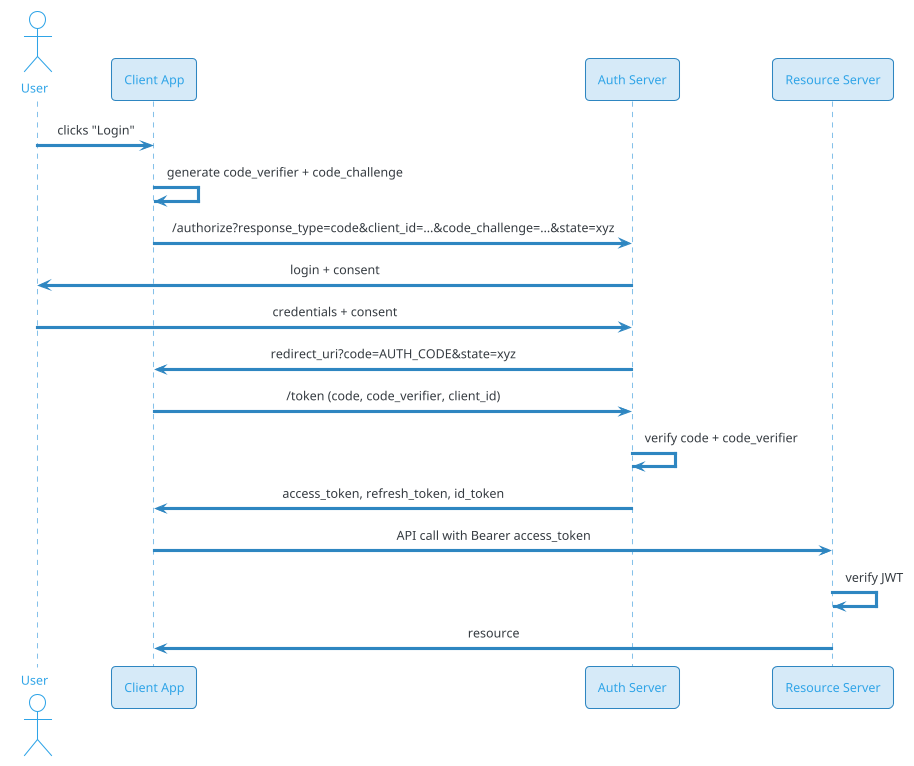
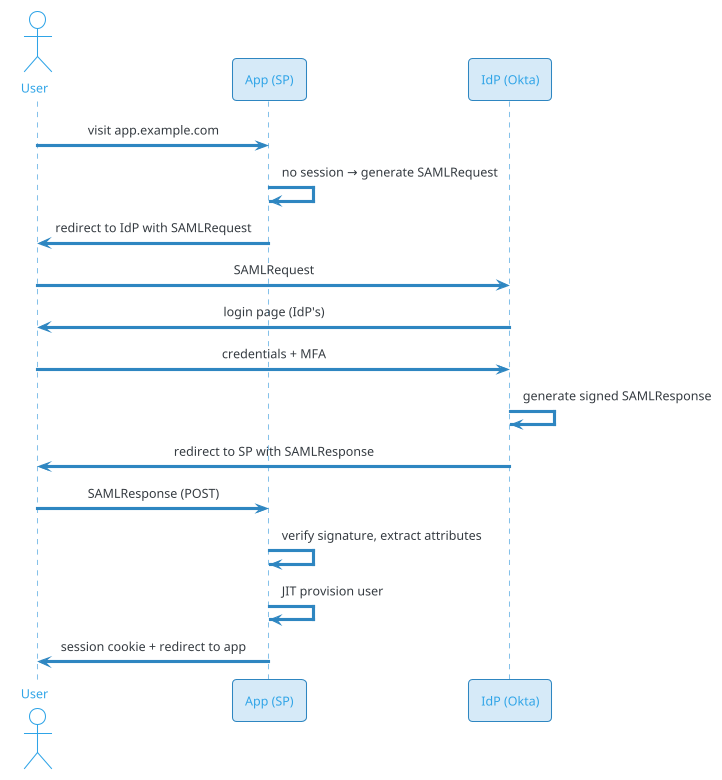

# Authentication & Authorization System (SSO / OAuth2 / OIDC)

## Problem Statement

Design an authentication and authorization system that powers login for a large platform — the identity layer behind "Sign in with Google", enterprise SSO, and first-party apps. It handles user registration, credential storage, multi-factor authentication, session management, OAuth2/OIDC flows for third-party apps, SAML for enterprise IdPs, and fine-grained authorization across services. It must be secure against credential stuffing, phishing, session hijacking, and insider threats, while keeping login latency under 500 ms and supporting billions of users and millions of third-party integrations.

**Example:**

```
First-party login (web):
  1. User visits app.com
  2. Redirected to auth.example.com/authorize?client_id=app&redirect_uri=...&state=xyz
  3. Auth server renders login page
  4. User submits email + password
  5. Auth server verifies password (Argon2id)
  6. (If MFA enabled) prompts for TOTP
  7. Issues authorization code
  8. Redirects to app with code + state
  9. App exchanges code for tokens (backend)
 10. Gets access_token (JWT, 15 min) + refresh_token (opaque, 30 days)
 11. App calls APIs with Bearer token
 12. APIs verify JWT signature + claims

Third-party OAuth ("Sign in with Example"):
  1. Third-party app redirects to auth.example.com/authorize
     ?response_type=code&client_id=third-party&scope=openid email profile
  2. User (already logged in) sees consent screen
  3. Consents → authorization code issued
  4. Third-party backend exchanges code for tokens
  5. Receives id_token (OIDC JWT) with user claims

Enterprise SSO (SAML / OIDC):
  1. Enterprise configures IdP (Okta, Azure AD)
  2. User visits app.example.com → redirected to enterprise IdP
  3. Enterprise IdP authenticates (their own MFA, etc.)
  4. Assertion sent to auth.example.com
  5. JIT provisioning → user account created/mapped
  6. Session established

Token refresh:
  1. Access token expires (15 min)
  2. Client sends refresh_token to /oauth/token
  3. Auth server validates refresh_token (rotating)
  4. Issues new access_token + new refresh_token
  5. Old refresh_token invalidated

Logout:
  1. User clicks logout
  2. Session revoked server-side
  3. Refresh tokens revoked
  4. All devices notified (if global logout)
  5. Redirect to IdP logout (SLO for SSO)

Key challenges:
  - Password storage (Argon2id, not bcrypt)
  - MFA (TOTP, WebAuthn, push, SMS)
  - Session management (revocation, multi-device)
  - Token security (JWT vs opaque, rotation)
  - OAuth2 flows (authorization code + PKCE)
  - OIDC (id_token, userinfo, discovery)
  - SAML 2.0 (enterprise)
  - SCIM (user provisioning)
  - Rate limiting (brute force prevention)
  - Bot detection (credential stuffing)
  - Session fixation, CSRF, XSS
  - Fine-grained authorization (RBAC, ABAC, ReBAC)
  - Audit logging (compliance)
  - GDPR (right to erasure)

Scale:
  - 2B user accounts
  - 500M DAU
  - 10M logins/sec peak (Black Friday, product launch)
  - 100M active sessions
  - 1M registered OAuth clients
  - 100K enterprise SSO tenants
  - p99 login < 500 ms
  - 99.99% availability (auth is critical path)
```

**Real-world systems:** Okta, Auth0, Google Identity, Microsoft Entra ID (Azure AD), AWS Cognito, Keycloak, Ping Identity, OneLogin, Firebase Auth, Ory, Clerk.

**Why it's interesting:**

- **Critical path** — if auth is down, everything is down
- **Security-sensitive** — breach = catastrophic
- **Stateful + stateless mix** — sessions (stateful) + JWTs (stateless)
- **Multiple protocols** — OAuth2, OIDC, SAML, SCIM, LDAP
- **Multi-tenancy** — enterprises with isolated configs
- **Federation** — trust relationships across orgs
- **Token lifecycle** — issue, rotate, revoke
- **Fine-grained authorization** — RBAC, ABAC, ReBAC (Zanzibar-style)
- **Audit and compliance** — SOC 2, HIPAA, GDPR, PCI
- **Scale** — 10M logins/sec peak
- **Latency** — < 500 ms login, < 10 ms token verification

---

## 1. Requirements Clarification

### Functional Requirements

- **User registration**: Email/password, social, phone
- **Login**: Password, passwordless (magic link, OTP), passkeys (WebAuthn)
- **MFA**: TOTP, WebAuthn, push, SMS, backup codes
- **Session management**: Cookie sessions for web, tokens for API
- **OAuth2**: Authorization code (with PKCE), client credentials, refresh
- **OIDC**: id_token, userinfo, discovery, JWKS
- **SAML 2.0**: Enterprise SSO
- **SCIM**: User provisioning from enterprise IdPs
- **Social login**: Google, Apple, Facebook, GitHub, Microsoft
- **Token lifecycle**: Access (JWT), refresh (opaque), rotation
- **Logout**: Single device, all devices, SLO (SSO)
- **Password reset**: Email link, security questions (legacy)
- **Email verification**: Link-based
- **Account recovery**: Backup codes, trusted devices
- **Authorization**: RBAC (roles), ABAC (attributes), ReBAC (relationships)
- **Consent**: OAuth scopes, GDPR consent
- **Audit log**: All auth events
- **Admin console**: User management, policy, audit

### Non-Functional Requirements

- **Scale**: 2B accounts, 500M DAU, 10M logins/sec peak
- **Latency**: Login p99 < 500 ms; token verify p99 < 10 ms
- **Availability**: 99.99% (four nines) — critical path
- **Security**: OWASP ASVS L2, SOC 2, ISO 27001, HIPAA, PCI
- **Durability**: No loss of credentials or sessions
- **Compliance**: GDPR, CCPA, SOX, PCI
- **Multi-tenancy**: 100K+ enterprise tenants isolated
- **Auditability**: Immutable log of all auth events
- **Scalability**: Auto-scale to 10x peaks
- **Global**: < 100 ms auth latency worldwide
- **Extensibility**: Add new IdPs, MFA methods, flows

### Out of Scope

- API gateway internals (auth integrates, not replaces)
- WAF / DDoS protection (separate layer)
- User profile / preferences (separate service)
- Email / SMS delivery (integrations)
- Fraud detection (adjacent service)
- Secrets management (Vault — separate)

---

## 2. Back-of-Envelope Estimation

### Traffic

```
Given:
  Accounts              = 2,000,000,000
  DAU                   = 500,000,000
  Logins/user/day       = 3
  Total logins/day      = 1,500,000,000
  Peak multiplier       = 5x
  OAuth clients         = 1,000,000
  Active sessions       = 100,000,000
  Refresh ops/day       = 10x logins = 15,000,000,000
  Token verifications   = 100x logins = 150,000,000,000
  Enterprise tenants    = 100,000

Average QPS:
  Logins     = 1.5B / 86400 = ~17,361/sec
  Refresh    = 15B / 86400 = ~173,611/sec
  Token verif= 150B / 86400 = ~1,736,111/sec

Peak QPS:
  Logins     = ~86,805/sec
  Refresh    = ~868,055/sec
  Token verif= ~8,680,555/sec

Note: Token verification is often done by API gateways with cached JWKS.
```

### Storage

```
Users:
  2B accounts x 2 KB = ~4 TB
  With indexes: ~10 TB

Credentials (hashed passwords):
  2B x 256 bytes (Argon2id) = ~512 GB

MFA secrets:
  Assume 30% have MFA = 600M x 500 bytes = ~300 GB

Sessions:
  100M active x 1 KB = ~100 GB
  With metadata: ~500 GB

Refresh tokens (hashed):
  500M active x 200 bytes = ~100 GB

OAuth clients:
  1M x 5 KB (config, secrets, redirect URIs) = ~5 GB

Authorization policies:
  RBAC: 10K roles x 10 KB = 100 MB
  ReBAC (relationships): 10B tuples x 100 bytes = ~1 TB

Audit log:
  150B events/day x 500 bytes = 75 TB/day
  Retained 1 year: ~27 PB
  (Compressed + tiered: ~5 PB)

Total hot: ~15 TB
Total audit: ~5 PB (tiered)
```

### Bandwidth

```
Login traffic:
  17K/sec x 5 KB = ~85 MB/sec = 680 Mbps
  Peak: ~3.4 Gbps

Token verification:
  1.7M/sec x 2 KB (JWT) = ~3.4 GB/sec = 27 Gbps
  Peak: ~136 Gbps

Refresh traffic:
  173K/sec x 2 KB = ~346 MB/sec = 2.8 Gbps

Audit writes:
  1.7M events/sec x 500 B = ~850 MB/sec = 6.8 Gbps

Total peak: ~150 Gbps
```

### Latency Budget

```
Login (password):

  Client → auth:                  ~10 ms
  TLS handshake:                  ~20 ms
  Rate limit check:               ~1 ms
  Fetch user by email:            ~5 ms
  Argon2id verify:                ~100 ms (intentionally slow)
  MFA prompt (if enabled):        ~500 ms (user)
  Session create (DB write):      ~10 ms
  Token issue (JWT sign):         ~2 ms
  Total (password only):          ~150 ms
  Total (with MFA):               ~650 ms (dominated by user)

Token verify (JWT):

  API receives request:           ~0 ms
  Parse JWT:                      ~1 ms
  Verify signature (RS256):       ~2 ms (cached key)
  Check exp/nbf/aud:              ~1 ms
  Total:                          ~5 ms

Targets:
  p50 login: < 100 ms
  p99 login: < 500 ms
  p50 token verify: < 5 ms
  p99 token verify: < 20 ms
```

---

## 3. High-Level Design

```d2
direction: down

user: User {shape: person}
app: "Client App" {shape: rectangle}

cdn: "CDN / Edge" {shape: cloud}
waf: "WAF / Bot Detection" {shape: cloud}

lb: "Load Balancer" {shape: hexagon}
api: "Auth API Gateway" {shape: hexagon}

authn: "Authentication Service" {shape: rectangle}
mfa: "MFA Service" {shape: rectangle}
session: "Session Service" {shape: rectangle}
token: "Token Service" {shape: rectangle}
oauth: "OAuth2 / OIDC Service" {shape: rectangle}
saml: "SAML / SSO Service" {shape: rectangle}
scim: "SCIM Provisioning" {shape: rectangle}
authz: "Authorization Service" {shape: rectangle}
policy: "Policy Engine" {shape: rectangle}
risk: "Risk / Fraud Service" {shape: rectangle}
audit: "Audit Service" {shape: rectangle}
kms: "KMS (signing keys)" {shape: rectangle}

kafka: Kafka {shape: queue}

user_db: "User Store (sharded)" {shape: cylinder}
sess_db: "Session Store (Redis)" {shape: cylinder}
token_db: "Token Store (Redis + DB)" {shape: cylinder}
policy_db: "Policy Store (Postgres)" {shape: cylinder}
graph_db: "ReBAC Graph (Spanner-style)" {shape: cylinder}
jwks: "JWKS Store (CDN)" {shape: cylinder}
audit_db: "Audit Log (append-only)" {shape: cylinder}

user -> cdn
cdn -> waf
waf -> lb
lb -> api

api -> authn
api -> mfa
api -> session
api -> token
api -> oauth
api -> saml
api -> scim
api -> authz
api -> risk

authn -> user_db
authn -> kms
mfa -> user_db
session -> sess_db
token -> token_db
token -> kms
oauth -> policy_db
saml -> policy_db
scim -> policy_db
authz -> policy
authz -> graph_db
policy -> policy_db
token -> jwks

api -> audit
kafka -> audit
audit -> audit_db
```

### Component Responsibilities

| Component | Role |
|---|---|
| CDN / Edge | Cache JWKS, terminate TLS, static assets |
| WAF / Bot Detection | Block bots, rate limit, challenge |
| Auth API Gateway | HTTP entry; route; auth check |
| Authentication Service | Password, passwordless, verify |
| MFA Service | TOTP, WebAuthn, push, backup codes |
| Session Service | Create, validate, revoke sessions |
| Token Service | Issue/verify JWTs, refresh tokens |
| OAuth2 / OIDC Service | Authorization code flow, client mgmt |
| SAML / SSO Service | Enterprise IdP integration |
| SCIM Service | User provisioning from IdPs |
| Authorization Service | RBAC, ABAC, ReBAC checks |
| Policy Engine | Evaluate policies |
| Risk / Fraud Service | Anomaly detection, step-up auth |
| Audit Service | Immutable log of all events |
| KMS | Signing keys, encryption keys |
| User Store | Accounts, credentials, MFA |
| Session Store | Active sessions (Redis) |
| Token Store | Refresh tokens, revocations |
| Policy Store | Roles, permissions (Postgres) |
| ReBAC Graph | Relationships (Zanzibar-style) |
| JWKS Store | Public keys for JWT verify |
| Audit Log | Append-only event log |

### Why This Architecture

- **Separate authn from authz** — different scaling, lifecycle
- **Stateless JWTs for API auth** — no DB lookup per request
- **Stateful sessions for web** — revocation-friendly
- **Centralized OAuth/OIDC** — standard flows
- **SAML for enterprise** — required for B2B
- **KMS for signing** — key rotation, HSM
- **Audit as append-only** — tamper-evident
- **Kafka for audit fan-out** — async, scalable

---

## 4. Deep Dive: Password Storage and Hashing

### Why Not Plain Text

- Breach exposes all passwords
- Users reuse passwords across sites
- Legal/regulatory exposure

### Why Not Simple Hash (MD5/SHA-1/SHA-256)

- **Fast** → billions of guesses/sec on GPU
- **Rainbow tables** → precomputed
- **No salt** → identical passwords hash to same value

### Password Hashing Requirements

- **Slow** by design (100 ms per verify)
- **Salted** per user (defeats rainbow tables)
- **Memory-hard** (defeats GPU/ASIC attacks)
- **Tunable** (work factor increases over time)

### Argon2id (Recommended)

**Winner of Password Hashing Competition (2015).**

Parameters:
- **Time cost (t)**: iterations (e.g., 3)
- **Memory cost (m)**: KB (e.g., 64 MB = 65536)
- **Parallelism (p)**: threads (e.g., 4)
- **Salt**: 16 bytes random per user
- **Output**: 32 bytes

**Example (Java, Bouncy Castle):**

```java
Argon2Parameters params = new Argon2Parameters.Builder(Argon2Parameters.ARGON2_id)
    .withVersion(Argon2Parameters.ARGON2_VERSION_13)
    .withIterations(3)
    .withMemoryAsKB(65536)       // 64 MB
    .withParallelism(4)
    .withSalt(salt)              // 16 random bytes
    .build();

Argon2BytesGenerator gen = new Argon2BytesGenerator();
gen.init(params);
byte[] hash = new byte[32];
gen.generateBytes(password.toCharArray(), hash);
```

**Verification:** Recompute with same salt + params; constant-time compare.

**Storage format:**
```
$argon2id$v=19$m=65536,t=3,p=4$<base64-salt>$<base64-hash>
```

### Alternatives

| Algorithm | Pros | Cons |
|---|---|---|
| **Argon2id** | Best (memory-hard, side-channel resistant) | Requires library |
| **scrypt** | Memory-hard, well-tested | Less resistant to side-channel |
| **bcrypt** | Battle-tested, ubiquitous | 72-byte limit, not memory-hard |
| **PBKDF2** | FIPS-approved | Not memory-hard (GPU-vulnerable) |

**Recommendation:** Argon2id (t=3, m=64MB, p=4) for new systems; migrate legacy to Argon2id on login.

### Peppering

**Additional secret** stored outside the DB (in KMS/HSM):
```
hash = Argon2id(password + pepper, salt, params)
```

**Benefit:** Attacker needs DB **and** pepper to crack.
**Trade-off:** Rotating pepper requires rehash on next login (or version tag).

### Password Policy

- **Min length**: 12 (NIST recommends length over complexity)
- **Max length**: 128 (DoS prevention)
- **No complexity rules** (NIST 800-63B) — allow any chars
- **Check against breach lists**: HIBP API (k-anonymity)
- **No forced rotation** (NIST recommends against)
- **Allow password managers** (don't block paste)

### Constant-Time Comparison

```java
// WRONG — timing leak
if (Arrays.equals(stored, computed)) { ... }

// RIGHT — constant time
if (MessageDigest.isEqual(stored, computed)) { ... }
```

### DoS Protection

Argon2id with 64 MB per attempt can be DoS'd. Mitigation:
- **Rate limit** per IP + per user
- **Concurrency limit** per user (one verify at a time)
- **CAPTCHA** after N failures
- **Progressive delay** (exponential backoff)

### Migration

On successful login with old hash:
1. Verify with old algorithm
2. Rehash with Argon2id
3. Update DB
4. No user interaction needed

**Result:** All active users migrated within ~90 days.

---

## 5. Deep Dive: Sessions vs Tokens

### Sessions (Stateful)

**Mechanism:**
- Server creates session record (session_id, user_id, metadata)
- Session ID stored in cookie (HttpOnly, Secure, SameSite)
- Every request: server looks up session

**Pros:**
- **Revocable** — server can invalidate instantly
- **Server-side state** — track device, IP, last activity
- **No token leakage risk** (cookie not accessible to JS)

**Cons:**
- **DB lookup** per request (mitigated by Redis)
- **Sticky sessions** if not using shared store
- **CSRF** vulnerability (mitigated by SameSite, CSRF tokens)

### Tokens (Stateless JWTs)

**Mechanism:**
- Server signs JWT with claims (sub, exp, scope)
- Client sends `Authorization: Bearer <jwt>`
- Server verifies signature (no DB lookup)

**Pros:**
- **No DB lookup** — fast (< 5 ms)
- **Stateless** — scales horizontally
- **Portable** — works across services, mobile

**Cons:**
- **Not revocable** (until expiry) — short expiry mitigates
- **Size** — JWT is ~500-1000 bytes
- **Leakage** — if stolen, valid until expiry

### Hybrid Approach (Recommended)

| Context | Mechanism |
|---|---|
| Web browser (first-party) | Session cookie |
| Mobile app | JWT + refresh token |
| Third-party API | JWT + refresh token |
| Service-to-service | JWT (short-lived) |

**Why:** Web benefits from revocation; mobile/API benefit from statelessness.

### JWT Structure

```
Header.Payload.Signature
```

**Header:**
```json
{"alg": "RS256", "typ": "JWT", "kid": "2026-key-1"}
```

**Payload:**
```json
{
  "iss": "https://auth.example.com",
  "sub": "user:12345",
  "aud": "api.example.com",
  "exp": 1726742400,
  "iat": 1726741500,
  "nbf": 1726741500,
  "jti": "uuid-abc-123",
  "scope": "read write",
  "roles": ["user", "premium"]
}
```

**Signature:** RS256 (RSA) or ES256 (ECDSA).

### Signing Algorithm Choice

| Algorithm | Key size | Signature size | Speed | Use |
|---|---|---|---|---|
| **HS256** | Symmetric | 32 bytes | Fast | Single service |
| **RS256** | 2048-bit RSA | 256 bytes | Slow | Multi-service |
| **ES256** | 256-bit EC | 64 bytes | Fast | Modern, recommended |
| **EdDSA** | 256-bit Ed25519 | 64 bytes | Fastest | Emerging |

**Recommendation:** ES256 (ECDSA P-256) — fast, small, well-supported.

**Never use HS256 with public clients** (secret leaks).

### Key Rotation

- **KID (Key ID)** in JWT header identifies which key
- **JWKS endpoint** (`/.well-known/jwks.json`) publishes public keys
- **Rotate** every 90 days
- **Overlap** old + new keys for grace period (max token lifetime)

**JWKS caching:**
- CDN-cached, `Cache-Control: public, max-age=3600`
- Clients refresh on unknown KID

### Token Lifetimes

| Token | Lifetime | Rationale |
|---|---|---|
| **Access token** | 15 min | Short for security |
| **Refresh token** | 30 days | Long for UX |
| **ID token** | 1 hour | OIDC session |
| **Session cookie** | 7-30 days | Web UX |

### Refresh Token Rotation

**Every refresh issues a new refresh token; old one invalidated.**

```
Refresh 1: RT-1 → new AT + RT-2 (RT-1 revoked)
Refresh 2: RT-2 → new AT + RT-3 (RT-2 revoked)
```

**Detection of reuse:** If RT-1 used after RT-2 issued → assume theft → revoke all tokens for user.

**Storage:** Refresh tokens hashed (SHA-256) in DB; only server knows plaintext.

### Revocation

**JWT is stateless** — cannot revoke before expiry.

**Mitigations:**
1. **Short expiry** (15 min) — window of exposure
2. **Revocation list** (Redis) — check on each request (defeats stateless)
3. **Token version** in user record — bump to invalidate all tokens
4. **Session binding** — token tied to session; revoke session

**Recommendation:** Short expiry + revocation list for critical ops.

### Session Fixation Prevention

- **Rotate session ID** on login (prevent fixation)
- **Bind to device fingerprint** (user-agent + IP, tolerance for mobile)
- **Invalidate on password change** (all sessions)

### CSRF Protection

- **SameSite=Strict/Lax** cookie attribute
- **CSRF token** in forms (double-submit)
- **Origin/Referer validation**
- **Custom headers** for AJAX (browser enforces same-origin)

### Logout

| Type | Scope | Mechanism |
|---|---|---|
| **Local logout** | This device | Delete cookie / token |
| **Global logout** | All devices | Revoke all sessions for user |
| **SLO (SSO logout)** | All apps via IdP | SAML SLO / OIDC RP-initiated |

**SLO complexity:** Each app must have logout endpoint; IdP broadcasts.

---

## 6. Deep Dive: OAuth2 and OIDC

### OAuth2 Roles

- **Resource Owner**: The user
- **Client**: App requesting access
- **Authorization Server**: Issues tokens (our auth service)
- **Resource Server**: API that accepts tokens

### Grant Types

| Grant | Use case | Security |
|---|---|---|
| **Authorization Code + PKCE** | Web, mobile, SPA | Best practice |
| **Client Credentials** | Service-to-service | No user |
| **Device Code** | Smart TV, CLI | User on separate device |
| **Refresh Token** | Get new access token | Standard |
| ~~Implicit~~ | Deprecated | Insecure |
| ~~Password~~ | Deprecated | Insecure |

### Authorization Code Flow (with PKCE)



### PKCE (Proof Key for Code Exchange)

**Problem:** Public clients (SPA, mobile) can't keep a client secret.

**Solution:** Client generates random `code_verifier`, sends `code_challenge = SHA256(code_verifier)` with auth request; sends `code_verifier` with token request.

**Prevents:** Authorization code interception attacks.

**Mandatory** for public clients; recommended for all.

### Client Types

| Type | Secret | PKCE | Examples |
|---|---|---|---|
| **Confidential** | Yes | Optional | Server-side web apps |
| **Public** | No | Required | SPA, mobile, CLI |

### Scopes

**Standard scopes:**
- `openid`: OIDC (get id_token)
- `profile`: name, picture
- `email`: email, email_verified
- `offline_access`: refresh token

**Custom scopes:**
- `read:orders`, `write:orders`
- `admin`
- Resource-specific

**Consent screen** shows requested scopes.

### Token Response

```json
{
  "access_token": "eyJhbGciOiJSUzI1NiIs...",
  "token_type": "Bearer",
  "expires_in": 900,
  "refresh_token": "8xLOxBtZp8...",
  "id_token": "eyJhbGciOiJSUzI1NiIs...",
  "scope": "openid email profile"
}
```

### OIDC (OpenID Connect)

**Layer on top of OAuth2** for identity.

**id_token** (JWT) contains identity claims:
```json
{
  "iss": "https://auth.example.com",
  "sub": "user:12345",
  "aud": "client-id",
  "exp": 1726742400,
  "iat": 1726741500,
  "auth_time": 1726741400,
  "nonce": "n-abc",
  "email": "user@example.com",
  "email_verified": true,
  "name": "Priya Sharma",
  "picture": "https://..."
}
```

**UserInfo endpoint** (`/userinfo`):
```http
GET /userinfo
Authorization: Bearer <access_token>
```
Returns additional claims.

**Discovery** (`/.well-known/openid-configuration`):
```json
{
  "issuer": "https://auth.example.com",
  "authorization_endpoint": "https://auth.example.com/oauth/authorize",
  "token_endpoint": "https://auth.example.com/oauth/token",
  "jwks_uri": "https://auth.example.com/.well-known/jwks.json",
  "userinfo_endpoint": "https://auth.example.com/userinfo",
  "scopes_supported": ["openid", "email", "profile"],
  "response_types_supported": ["code"],
  "grant_types_supported": ["authorization_code", "refresh_token"]
}
```

**Clients auto-configure** from discovery.

### Client Registration

**Dynamic registration** (`/register`):
```json
{
  "client_name": "My App",
  "redirect_uris": ["https://myapp.com/callback"],
  "grant_types": ["authorization_code"],
  "response_types": ["code"],
  "scope": "openid email",
  "token_endpoint_auth_method": "client_secret_basic"
}
```

**Response:** `client_id` + `client_secret` (for confidential clients).

### Security Best Practices

- **PKCE mandatory** for public clients
- **Exact redirect URI match** (no wildcards for security)
- **State parameter** for CSRF (random, session-bound)
- **Nonce parameter** for OIDC (replay prevention)
- **Short-lived codes** (60 sec max)
- **One-time use codes**
- **Bind code to client_id**

### Common Attacks

| Attack | Mitigation |
|---|---|
| **CSRF on redirect** | State parameter |
| **Code interception** | PKCE |
| **Open redirect** | Exact URI match |
| **Token leakage** | Short expiry, HTTPS |
| **Replay** | Nonce, jti |
| **Mix-up attack** | Issuer validation |

---

## 7. Deep Dive: SAML SSO (Enterprise)

### Why SAML?

- **Enterprise standard** — Okta, Azure AD, Ping, OneLogin
- **IdP-initiated** and **SP-initiated** flows
- **XML-based** assertions
- **Long-lived** (still widely used in B2B)

### SAML Roles

- **IdP (Identity Provider)**: Authenticates user (e.g., Okta)
- **SP (Service Provider)**: Our app (auth.example.com)
- **User**: End user

### SAML Assertion

Signed XML with user attributes:

```xml
<saml:Assertion>
  <saml:Issuer>https://okta.com/exk123</saml:Issuer>
  <saml:Subject>
    <saml:NameID Format="emailAddress">user@company.com</saml:NameID>
  </saml:Subject>
  <saml:Conditions NotBefore="..." NotOnOrAfter="...">
    <saml:AudienceRestriction>
      <saml:Audience>https://auth.example.com</saml:Audience>
    </saml:AudienceRestriction>
  </saml:Conditions>
  <saml:AttributeStatement>
    <saml:Attribute Name="email"><saml:AttributeValue>user@company.com</saml:AttributeValue></saml:Attribute>
    <saml:Attribute Name="firstName"><saml:AttributeValue>Priya</saml:AttributeValue></saml:Attribute>
    <saml:Attribute Name="groups"><saml:AttributeValue>engineering</saml:AttributeValue></saml:Attribute>
  </saml:AttributeStatement>
  <ds:Signature>...</ds:Signature>
</saml:Assertion>
```

### SP-Initiated Flow



### JIT (Just-in-Time) Provisioning

First time a user SSOs in:
1. SP validates assertion
2. Looks up user by email/NameID
3. If not found → **create user** with attributes
4. Assign default role
5. Link to IdP

**Benefit:** No pre-provisioning needed.

### IdP-Initiated Flow

User starts at IdP (e.g., Okta dashboard), clicks app tile:
1. IdP sends unsolicited SAMLResponse to SP
2. SP validates + provisions
3. User logged in

**Risk:** Less CSRF protection (no state). Some SPs disable IdP-initiated.

### Metadata Exchange

**IdP metadata** (XML) contains:
- SSO URL (where to send SAMLRequest)
- SLO URL
- Signing certificate

**SP metadata** contains:
- ACS URL (where IdP sends SAMLResponse)
- Entity ID
- SP signing cert

**Exchange:** Admin uploads metadata to both sides.

### SAML vs OIDC

| Feature | SAML | OIDC |
|---|---|---|
| Format | XML | JSON |
| Token | Assertion | JWT |
| Mobile support | Poor | Excellent |
| Enterprise support | Excellent | Growing |
| Complexity | High | Lower |
| Age | 2002 | 2014 |
| Use | B2B enterprise | Modern, all |

**Recommendation:** Support **both**; SAML for legacy enterprise, OIDC for new.

### SCIM (Provisioning)

**SCIM 2.0** — REST API for user/group sync from IdP.

**Endpoints:**
```
GET    /scim/v2/Users
POST   /scim/v2/Users
GET    /scim/v2/Users/{id}
PUT    /scim/v2/Users/{id}
DELETE /scim/v2/Users/{id}

GET    /scim/v2/Groups
POST   /scim/v2/Groups
...
```

**Use cases:**
- HR hires → auto-create account
- HR terminates → auto-disable
- Group changes → role updates

**IdPs supporting SCIM:** Okta, Azure AD, OneLogin, Ping.

### Multi-Tenancy for Enterprise

Each enterprise tenant has:
- **Isolated config**: SAML cert, ACS URL, attribute mapping
- **Separate user pool** (or tagged in shared DB)
- **Own policies**: MFA required, IP allowlist, session timeout
- **Custom domain**: `sso.company.com` → our auth

**Data isolation:** Row-level security in DB, or separate schemas.

---

## 8. Deep Dive: MFA (Multi-Factor Authentication)

### Factor Categories

- **Something you know**: password, PIN
- **Something you have**: phone, hardware key, TOTP app
- **Something you are**: fingerprint, Face ID

**2FA = 2 of these.** MFA = ≥2.

### Methods

| Method | Security | UX | Phishing-resistant |
|---|---|---|---|
| **SMS OTP** | Weak (SIM swap) | High | No |
| **Email OTP** | Weak | High | No |
| **TOTP** (Google Auth) | Good | Medium | No |
| **Push** (Duo, Okta) | Good | High | No |
| **WebAuthn** (passkey, YubiKey) | Strong | High | Yes |
| **Backup codes** | Good | N/A | No |

**Recommendation:** WebAuthn primary; TOTP + push alternatives; SMS discouraged.

### TOTP (Time-based One-Time Password)

**RFC 6238** — HMAC-based OTP.

**Setup:**
1. Server generates random **shared secret** (160 bits)
2. Returns `otpauth://totp/Example:user@example.com?secret=XXX&issuer=Example`
3. User scans QR in Google Authenticator
4. App stores secret locally

**Verification:**
```
TOTP = HMAC-SHA1(secret, floor(time / 30))
      → take last 6 digits
```

**Clock drift:** Accept ±1 window (30 sec before/after).

**Replay prevention:** Track last used code per user.

### WebAuthn (FIDO2)

**Phishing-resistant** — key bound to origin.

**Registration:**
1. Server sends challenge + RP info
2. Browser calls `navigator.credentials.create()`
3. User touches security key / Face ID / fingerprint
4. Authenticator generates key pair
5. Public key + credential_id sent to server
6. Server stores public key

**Authentication:**
1. Server sends challenge
2. Browser calls `navigator.credentials.get()`
3. User authenticates
4. Authenticator signs challenge with private key
5. Server verifies with stored public key

**Benefits:**
- **Phishing-resistant** (key bound to origin)
- **No shared secret** (asymmetric)
- **Biometric or PIN** on device
- **Works across devices** (passkeys sync)

**Passkeys:** WebAuthn + cloud sync (iCloud Keychain, Google Password Manager).

### Push Notifications (Duo, Okta Verify)

1. User enters password
2. Push sent to registered device
3. User taps "Approve" or enters number
4. Device signs approval with private key
5. Server verifies

**Pros:** Good UX, phishing-resistant (number matching).
**Cons:** Requires app, device.

### Recovery

| Method | Use |
|---|---|
| **Backup codes** | 10 single-use codes |
| **Trusted device** | Skip MFA on known device |
| **Admin reset** | Enterprise IT |
| **Identity verification** | Document upload |

**Store backup codes hashed** (like passwords).

### Step-Up Authentication

**Context:** User logged in but accessing sensitive resource.

**Trigger:** Admin panel, payment, PII access.

**Action:**
1. Check session's `auth_time` + `acr`
2. If too old or too low → redirect to re-auth
3. After success → elevate session

**Implementation:** JWT claims `acr` (auth context), `amr` (methods).

### Adaptive MFA (Risk-Based)

**Signals:**
- New device
- New geo
- Impossible travel
- Unusual time
- Known breach (HIBP)
- Bot signals

**Actions:**
- Low risk → password only
- Medium → MFA
- High → MFA + step-up
- Critical → block + manual review

**Risk service** evaluates; returns required auth level.

### Recovery Codes

**Generate 10 codes** on MFA enable:
```
XXXX-XXXX
XXXX-XXXX
...
```

**Storage:** Hashed (Argon2id or SHA-256 with salt).
**Display:** Once, on generation.
**Use:** Each single-use; mark used on validation.

### MFA Bypass Prevention

- **No MFA reset without verification** (email + wait, or ID doc)
- **Alert on MFA changes** (email + push)
- **Rate limit** MFA attempts
- **Lock account** after N failures
- **Log all MFA events** (audit)

---

## 9. Deep Dive: Authorization (RBAC, ABAC, ReBAC)

### RBAC (Role-Based Access Control)

**Users → Roles → Permissions**

```
User: alice
  Roles: [admin, developer]

Role: admin
  Permissions: [user:read, user:write, billing:read]

Role: developer
  Permissions: [code:read, code:write]
```

**Storage:**
```sql
CREATE TABLE roles (id, name);
CREATE TABLE permissions (id, resource, action);
CREATE TABLE role_permissions (role_id, permission_id);
CREATE TABLE user_roles (user_id, role_id);
```

**Check:** `can(user, "user:write")` → any role has permission?

**Pros:** Simple, intuitive.
**Cons:** Role explosion for fine-grained; no context.

### ABAC (Attribute-Based Access Control)

**Policy based on attributes:**

```
ALLOW if:
  user.department == resource.department
  AND user.clearance >= resource.classification
  AND time.hour BETWEEN 9 AND 17
```

**Language:** Rego (OPA), Cedar (AWS), XACML.

**Example (Rego):**
```rego
allow {
  input.user.department == input.resource.department
  input.user.clearance >= input.resource.classification
}
```

**Pros:** Fine-grained, context-aware.
**Cons:** Complex policies; hard to audit.

### ReBAC (Relationship-Based Access Control)

**Google Zanzibar-style.** Model as a graph of relationships.

**Tuples:** `(object, relation, subject)`

```
doc:readme#owner@user:alice
doc:readme#editor@user:bob
doc:readme#viewer@group:eng#member
folder:public#viewer@user:*
```

**Query:** `can user:alice view doc:readme?`

**Resolution:**
1. Lookup tuples for `doc:readme`
2. Find owners, editors, viewers
3. Check if alice is in any
4. Recurse (group membership, folder inheritance)

**Used by:** Google (Zanzibar), Airbnb (Himeji), Auth0 FGA, SpiceDB, OpenFGA.

**Pros:** Scales to billions of relations; expressive.
**Cons:** Complex; latency-sensitive.

### Authorization Service Architecture

```d2
direction: right

api: "API Gateway" {shape: hexagon}
authz: "Authorization Service" {shape: rectangle}
cache: "Decision Cache (Redis)" {shape: cylinder}
policy: "Policy Engine (OPA)" {shape: rectangle}
rbac: "RBAC Store (Postgres)" {shape: cylinder}
rebac: "ReBAC Graph" {shape: cylinder}
audit: "Audit Log" {shape: cylinder}

api -> authz
authz -> cache
authz -> policy
policy -> rbac
policy -> rebac
authz -> audit
```

**Flow:**
1. API calls authz: `can(user, action, resource, context)`
2. Authz checks cache
3. On miss → evaluate policy
4. Policy uses RBAC + ReBAC data
5. Decision cached (TTL 1 min)
6. Audit logged

### Policy Model Comparison

| Model | Use case | Complexity | Scale |
|---|---|---|---|
| **RBAC** | Simple roles | Low | High |
| **ABAC** | Attribute rules | Medium | Medium |
| **ReBAC** | Relationship graph | High | Very high |
| **Hybrid** | Combine | High | High |

**Recommendation:** Start RBAC; migrate to ReBAC for fine-grained.

### Caching Authorization Decisions

- **Key:** `hash(user_id, action, resource, context)`
- **Value:** `allow/deny` + TTL
- **TTL:** 1-5 min (balance freshness vs load)
- **Invalidation:** On policy change, invalidate by tag

**Hit ratio:** ~99% for typical apps.

### Audit and Explain

**For each decision, log:**
- Who: `user_id`, `client_id`
- What: action, resource
- Result: allow/deny
- Why: matched policy/rule
- When: timestamp
- Context: IP, device

**Explain query:** `why(user, action, resource)` → returns matching policy.

### Fine-Grained Example (Google Docs-style)

```
doc:abc#owner@user:alice
doc:abc#editor@user:bob
doc:abc#viewer@group:eng#member
folder:team#viewer@user:carol
doc:abc#parent@folder:team

Can carol view doc:abc?
  carol is viewer of folder:team
  doc:abc's parent is folder:team
  → carol can view doc:abc (inherited)
```

### Authorization at Scale

- **Latency:** p99 < 10 ms (cached)
- **QPS:** 1M+/sec
- **Cache:** Redis for decisions
- **Graph:** Sharded by object ID
- **Fallback:** On authz failure → deny (fail-closed)

---

## 10. Deep Dive: Risk, Fraud, and Bot Detection

### Threats

- **Credential stuffing**: Leaked credentials reused
- **Brute force**: Guessing passwords
- **Phishing**: Fake login pages
- **Session hijacking**: Stolen cookies
- **Account takeover**: Combined attacks
- **Bots**: Automated abuse
- **SIM swap**: MFA bypass

### Signals

| Signal | Source | Weight |
|---|---|---|
| IP reputation | Threat intel | High |
| Device fingerprint | Client SDK | High |
| Geo velocity | Login history | High |
| Time patterns | History | Medium |
| Failed attempts | Recent | High |
| Breach lists | HIBP | High |
| User agent | Request | Medium |
| Behavioral | Session | Medium |

### Risk Scoring

```
risk_score = w1*ip_reputation + w2*geo_anomaly + w3*device + ...
```

**Thresholds:**
- 0-30: Allow (password only)
- 30-60: Step-up (MFA required)
- 60-80: Challenge (CAPTCHA + MFA)
- 80-100: Block + review

### Impossible Travel

**Detect:** Two logins from distant locations within impossible time.

```
Login 1: NYC, 10:00 AM
Login 2: Tokyo, 10:30 AM
Distance: 6,700 miles in 30 min → impossible
```

**Action:** Block or challenge; alert user.

### Device Fingerprinting

**Components:**
- User agent
- Screen resolution
- Timezone
- Installed fonts
- Canvas hash
- WebGL hash
- Audio hash

**Stable fingerprint** → recognize returning device.

**Privacy concern:** GDPR; store hash, not raw.

### Bot Detection

- **Behavioral**: Mouse, keyboard timing
- **Challenge**: CAPTCHA, hCaptcha
- **Rate**: Too fast, too many
- **Headers**: Missing/inconsistent
- **TLS fingerprint**: JA3/JA4

**Action:** Block, throttle, or challenge.

### Credential Stuffing Defense

- **Rate limit** per IP + per account
- **Device fingerprint** to detect new devices
- **Check HIBP** for known-breached passwords
- **MFA** required for new device
- **Distributed rate limiting** (Redis)
- **Account lockout** after N failures

### Account Lockout Policy

| Attempts | Action |
|---|---|
| 5 | Progressive delay (1s, 2s, 4s...) |
| 10 | CAPTCHA required |
| 20 | Account locked 30 min |
| 50 | Account locked + email alert |

**Trade-off:** Security vs DoS (attacker can lock out user).

**Alternative:** IP + account combined; alert user.

### Session Hijacking Defense

- **Bind session to device fingerprint** (tolerant)
- **Bind to IP range** (mobile-friendly: /24)
- **Rotate session ID** periodically
- **Detect anomalies** (new device in same session → re-auth)
- **HttpOnly + Secure + SameSite** cookies

### Phishing Defense

- **WebAuthn** (origin-bound)
- **Email verification** for new devices
- **User education**
- **DMARC/SPF/DKIM** for our domain
- **Monitor lookalike domains**

### SIM Swap Defense

- **Don't use SMS** for MFA (if possible)
- **Push + number matching** (better)
- **WebAuthn** (best)
- **Alert on phone number change**

### Anomaly Detection

**ML models:**
- Sequence of login events
- Compare to user baseline
- Detect unusual patterns

**Action:** Step-up MFA, notify user, or block.

### Integration with Auth

**Pre-auth:**
- IP reputation check
- Device fingerprint
- Rate limit

**During auth:**
- Risk score computed
- MFA required based on score
- Step-up challenges

**Post-auth:**
- Session monitoring
- Anomaly detection
- Alert on suspicious activity

---

## 11. Deep Dive: Audit, Compliance, Privacy

### What to Audit

**Authentication events:**
- Login (success/failure)
- Logout
- MFA enrollment/removal
- Password change/reset
- Session created/revoked

**Authorization events:**
- Permission grants/revokes
- Role assignments
- Policy changes
- Access decisions (for sensitive resources)

**Admin events:**
- User creation/deletion
- Config changes
- API key creation

### Audit Log Structure

```json
{
  "event_id": "evt-uuid",
  "timestamp": "2026-09-19T10:00:00Z",
  "actor": {"user_id": "u-123", "ip": "1.2.3.4", "user_agent": "..."},
  "action": "login.success",
  "target": {"user_id": "u-123"},
  "result": "success",
  "context": {
    "method": "password+mfa",
    "device": "iPhone",
    "location": "Mumbai"
  },
  "signature": "..."  // tamper-evident
}
```

### Tamper-Evidence

**Append-only log** (e.g., AWS QLDB, or hash chain).

**Hash chain:**
```
hash_n = SHA256(event_n || hash_{n-1})
```

Any modification to event_n breaks the chain.

**Merkle tree** for batch verification.

**Publish** periodic root hash (transparency log, like Certificate Transparency).

### Storage

- **Hot** (30 days): Elasticsearch for search
- **Warm** (1 year): S3
- **Cold** (7+ years): Glacier Deep Archive

**Retention** per compliance:
- **PCI**: 1 year
- **HIPAA**: 6 years
- **SOX**: 7 years
- **GDPR**: Right to erasure (specific)

### Compliance

| Regulation | Key requirements |
|---|---|
| **GDPR** | Consent, right to erasure, data residency |
| **CCPA** | Opt-out, disclosure |
| **HIPAA** | PHI protection, audit |
| **PCI DSS** | Cardholder data protection |
| **SOC 2** | Security, availability, confidentiality |
| **ISO 27001** | InfoSec management |
| **FedRAMP** | US government |

### GDPR Right to Erasure

**Challenge:** Audit logs must be immutable; GDPR requires deletion.

**Solutions:**
- **Pseudonymization**: Store user ID, not PII
- **Crypto-shredding**: Delete encryption key → data unreadable
- **Separate PII store**: Delete from PII store; audit references ID only
- **Retention limits**: Auto-delete after N years

### Consent Management

**Track:**
- What was consented to
- When
- Version of policy
- How (click, checkbox)

**Withdraw:** User can revoke; enforce downstream.

### Data Residency

**EU users' data stays in EU.**

**Implementation:**
- **Regional deployments** (EU cluster)
- **Route by user region**
- **Replication** only within region

**Compliance:** GDPR, Schrems II.

### PII Handling

**Encrypt PII** at rest:
- Email: Encrypt + hash for lookup
- Phone: Encrypt
- Name: Encrypt
- Address: Encrypt

**Access:** Only authorized services; audit all access.

### Audit Reporting

- **Admin UI** for queries
- **SIEM integration** (Splunk, Datadog)
- **Export** for compliance
- **Real-time alerts** for anomalies

---

## 12. Scaling Considerations

### Read Scaling

- **JWKS**: CDN-cached; edge serves
- **Token verify**: Stateless (no DB); cached public keys
- **User lookup**: Read replicas
- **Authorization**: Redis-cached decisions
- **Audit**: Read from ClickHouse/S3

### Write Scaling

- **Login**: Distributed across auth servers
- **Session create**: Redis cluster (sharded by user)
- **Token issue**: Stateless signing (KMS)
- **Audit**: Kafka → append-only storage

### Sharding

**Users:** Shard by `hash(user_id)` or `hash(email)`.
**Sessions:** Shard by `session_id`.
**Refresh tokens:** Shard by `hash(token)`.
**Audit:** Partition by date + region.

### Multi-Region

```d2
direction: down

us: "US Region" {
  shape: cloud
}
eu: "EU Region" {
  shape: cloud
}
apac: "APAC Region" {
  shape: cloud
}

us_auth: "US Auth Cluster" {
  shape: cylinder
}
eu_auth: "EU Auth Cluster" {
  shape: cylinder
}
apac_auth: "APAC Auth Cluster" {
  shape: cylinder
}

us -> us_auth
eu -> eu_auth
apac -> apac_auth

us_auth -> eu_auth : user data sync
eu_auth -> apac_auth : user data sync
```

**Strategy:**
- **Region-local auth** for low latency
- **User data replicated** (with residency rules)
- **Global logout** via Kafka broadcast
- **JWKS global** (CDN)
- **Sessions regional** (don't cross regions)
- **Tokens global** (JWT is portable)

### Peak Handling

- **Auto-scale** auth fleet
- **Pre-warm** for known events (product launch)
- **Queue** during overload (login wait room)
- **Degrade** gracefully (skip non-essential MFA risk checks)
- **Reserve capacity** for critical paths

### Cost Optimization

| Component | Optimization |
|---|---|
| Compute | Reserved instances, right-size |
| Redis | Cluster; eviction policies |
| DB | Read replicas; archiving |
| Audit | Tiered storage |
| KMS | Batch operations |
| CDN | Cache JWKS |

### Capacity Planning

```
Logins: 10M/sec peak
Per auth server: 1K logins/sec (with MFA)
→ 10,000 auth servers peak
→ 2,000 sustained (with headroom)

Sessions: 100M active
Redis: 100M x 1 KB = 100 GB
→ 10-node Redis cluster (with 3x replication)

Token verify: 8.6M/sec peak
Stateless (JWT) → CPU-bound
→ ~5K cores (at 2K verify/core/sec)
→ ~1,500 servers
```

---

## 13. Bottlenecks and Trade-offs

| Concern | Solution | Trade-off |
|---|---|---|
| Password verify | Argon2id (100 ms) | DoS risk; rate limit |
| Session vs JWT | Hybrid | Complexity |
| Token revocation | Short expiry + revocation list | Latency vs security |
| Multi-region sessions | Regional + sync | Consistency |
| ReBAC latency | Caching | Staleness |
| MFA UX | WebAuthn / passkeys | Device dependency |
| SAML complexity | Libraries | Legacy |
| Audit volume | Sampling + tiering | Completeness |
| Rate limiting | Distributed (Redis) | Coordination |
| GDPR erasure | Crypto-shredding | Key management |

### Design Decisions Summary

| Decision | Choice | Rationale |
|---|---|---|
| Password hashing | Argon2id (64 MB) | Memory-hard |
| Session model | Cookie (web) + JWT (API) | Best of both |
| JWT signing | ES256 (ECDSA P-256) | Fast, small |
| Refresh tokens | Opaque, rotating, hashed | Secure |
| OAuth flow | Authorization Code + PKCE | Standard |
| OIDC | Full support | Modern identity |
| SAML | Support for enterprise | B2B requirement |
| MFA | WebAuthn + TOTP + push | Best security |
| Authorization | RBAC + ReBAC (hybrid) | Flexible |
| Risk engine | Real-time + ML | Adaptive |
| Audit | Append-only + hash chain | Tamper-evident |
| Multi-region | Regional auth + sync | Latency + residency |

---

## 14. Failure Scenarios

### Auth Service Down

**Impact:** Users can't log in.

**Mitigation:**
- Multi-region; failover
- Auto-scale
- Alert ops (P0)
- Status page

### Session Store (Redis) Down

**Impact:** Existing sessions lost; users logged out.

**Mitigation:**
- Redis cluster with replication
- Persistence (AOF)
- Fallback to DB (slow)
- Alert ops (P0)

### KMS Down

**Impact:** Cannot sign JWTs; new tokens fail.

**Mitigation:**
- Cache signing keys in memory
- Multiple KMS regions
- HSM fallback
- Alert ops (P0)

### JWKS Endpoint Down

**Impact:** API gateways can't verify JWTs.

**Mitigation:**
- CDN-cached JWKS (global)
- Client-side cache (5 min)
- Multi-region endpoints
- Alert ops (P0)

### Token Leak

**Impact:** Attacker has valid tokens.

**Mitigation:**
- Short expiry (15 min)
- Revocation list (Redis)
- Detect anomalous use
- Force global logout for affected user

### Password Database Breach

**Impact:** Attacker has hashes.

**Mitigation:**
- Argon2id → slow to crack
- Peppering → attacker needs pepper too
- Force password reset for all users
- Notify users (GDPR)
- Incident response

### Session Hijacking

**Impact:** Attacker uses stolen session.

**Mitigation:**
- Bind to device/IP
- Rotate session ID
- Detect anomalies
- Force re-auth
- Alert user

### Credential Stuffing Attack

**Impact:** Attackers try leaked credentials at scale.

**Mitigation:**
- Rate limit per IP
- Device fingerprint
- Check HIBP
- MFA required for new device
- Account lockout (progressive)

### MFA Bypass

**Impact:** Attacker bypasses MFA (SIM swap, phishing).

**Mitigation:**
- Prefer WebAuthn
- Push with number matching
- Alert on MFA changes
- Delay MFA reset (24h)

### Account Takeover

**Impact:** Attacker controls account.

**Mitigation:**
- Risk scoring
- Step-up MFA
- Alert user
- Force re-auth
- Recovery flow

### OAuth Client Compromise

**Impact:** Attacker uses stolen client_secret.

**Mitigation:**
- Rotate secrets
- Bind to redirect URI
- Detect anomalous token use
- Revoke client

### SAML Signature Bypass

**Impact:** Attacker forges SAML assertion.

**Mitigation:**
- Validate signature properly
- Check audience, issuer, conditions
- Use well-tested library
- Penetration testing

### Insufficient Logging

**Impact:** Cannot investigate incidents.

**Mitigation:**
- Log all auth events
- Structured logs
- Centralized (SIEM)
- Retention policy

### Cross-Site Scripting (XSS)

**Impact:** Steal session cookies / tokens.

**Mitigation:**
- HttpOnly cookies
- CSP headers
- Input sanitization
- Don't store tokens in localStorage

### CSRF

**Impact:** Force user to perform actions.

**Mitigation:**
- SameSite cookies
- CSRF tokens
- Origin validation

### Clickjacking

**Impact:** Trick user into clicking.

**Mitigation:**
- X-Frame-Options: DENY
- CSP frame-ancestors

### Open Redirect

**Impact:** Phishing via redirect.

**Mitigation:**
- Exact redirect URI match
- No wildcards
- Validate all redirects

### Token Theft via XSS

**Impact:** JWT stolen from localStorage.

**Mitigation:**
- Don't store in localStorage
- Use HttpOnly cookies
- CSP to prevent XSS

### DoS on Login

**Impact:** Auth service unavailable.

**Mitigation:**
- Rate limit per IP
- CAPTCHA after N attempts
- CDN/WAF absorbs
- Queue (wait room)
- Auto-scale

### Region Outage

**Impact:** Auth unavailable in region.

**Mitigation:**
- Multi-region active-active
- DNS failover
- User data replicated
- Alert ops (P0)

### Clock Skew

**Impact:** JWT exp/nbf wrong.

**Mitigation:**
- NTP with tight bounds
- Tolerate ±60 sec in JWT
- Monitor clock skew

### Key Compromise

**Impact:** Attacker signs tokens.

**Mitigation:**
- Rotate keys immediately
- Revoke all tokens (bump version)
- Force re-login
- Incident response

### Insider Threat

**Impact:** Employee misuses access.

**Mitigation:**
- Least privilege
- Audit all admin actions
- Separation of duties
- Alert on anomalies

### Supply Chain Attack

**Impact:** Compromised dependency.

**Mitigation:**
- SCA scanning
- SBOM
- Signed dependencies
- Minimal dependencies

### Backup Failure

**Impact:** Cannot recover after disaster.

**Mitigation:**
- Regular backups
- Test restores
- Cross-region backup
- Encryption

---

## 15. Monitoring and Alerts

### Key Metrics

| Metric | Target | Alert Threshold |
|---|---|---|
| Login p99 | < 500 ms | > 1 sec |
| Token verify p99 | < 10 ms | > 50 ms |
| Auth availability | 99.99% | < 99.9% |
| Login success rate | > 99% | < 95% |
| MFA challenge rate | baseline | +50% (attack) |
| Failed login rate | < 5% | > 20% |
| Account lockout rate | < 0.1% | > 1% |
| Session store latency | < 5 ms | > 20 ms |
| JWKS cache hit | > 99% | < 95% |
| Token issuance p99 | < 50 ms | > 200 ms |
| Authz decision p99 | < 10 ms | > 50 ms |
| ReBAC query p99 | < 20 ms | > 100 ms |
| Audit log lag | < 1 sec | > 10 sec |
| Password reset rate | baseline | +100% |
| New device logins | baseline | anomaly |

### Dashboards

- **Login**: QPS, success rate, latency, per-region
- **MFA**: Challenges, success, methods, per-region
- **Sessions**: Active, created/sec, revoked/sec
- **Tokens**: Issued/sec, verified/sec, revoked/sec
- **OAuth**: Client registrations, token grants, error rate
- **SAML**: Per-tenant SSO, error rate, latency
- **Authorization**: Decisions/sec, cache hit, latency
- **Risk**: Score distribution, blocks, step-ups
- **Audit**: Event rate, storage, lag
- **Security**: Failed attempts, lockouts, anomalies
- **Infrastructure**: Redis, KMS, DB, Kafka health

### Alerts

- **P0**: Auth down, KMS down, mass token failure, data breach
- **P1**: Login p99 > 1s, success rate < 95%, spike in failures
- **P2**: Account lockout spike, JWKS down, audit lag > 10s
- **P3**: MFA challenge spike, new device anomaly
- **P4**: Unusual geo, failed MFA attempts

### Business KPIs

- **DAU/MAU** ratio
- **Login success rate**
- **MFA adoption rate**
- **SSO adoption rate**
- **Passwordless adoption**
- **Session duration**
- **Account recovery rate**
- **Support tickets** (auth-related)
- **NPS**

---

## 16. Cost Estimation

Rough monthly cost (AWS, multi-region) for 2B users:

| Component | Spec | Cost/month |
|---|---|---|
| Auth servers | 2,000 x c6g.2xlarge | ~$480,000 |
| MFA servers | 500 x c6g.xlarge | ~$60,000 |
| Session store (Redis) | 20 x cache.r6g.4xlarge | ~$120,000 |
| Token store (Redis) | 10 x cache.r6g.4xlarge | ~$60,000 |
| User DB (Postgres) | 50 shards x db.r6g.4xlarge | ~$240,000 |
| Read replicas | 100 x db.r6g.2xlarge | ~$210,000 |
| Policy DB (Postgres) | 10 x db.r6g.2xlarge | ~$23,000 |
| ReBAC graph | 20 x db.r6g.4xlarge | ~$96,000 |
| KMS | Per-key + per-request | ~$50,000 |
| Audit storage (S3) | 5 PB | ~$115,000 |
| Audit (Glacier) | 27 PB | ~$270,000 |
| Kafka (MSK) | 50 brokers | ~$25,000 |
| CDN (JWKS) | 1 TB/day | ~$10,000 |
| Monitoring | Datadog | ~$100,000 |
| **Total** | | **~$1.86M/month** |

**Per user:** ~$0.0009/month.
**Per login:** ~$0.000001 (1 microdollar).

**Cost optimization:**

- **Reserved instances**: 30-40% compute
- **Cache aggressively**: JWKS, decisions, sessions
- **Tiered audit**: Hot (ES) → warm (S3) → cold (Glacier)
- **Right-size**: Match instance type to workload
- **Spot for batch**: Audit aggregation
- **Compression**: Audit logs (10x)
- **Sampling**: Non-critical events

**Reality:** Auth is critical path; cost is small relative to revenue; optimize for reliability.

---

## 17. Extensions and Follow-ups

### Passwordless

- **Magic links**: Email with one-time link
- **OTP**: Email/SMS one-time code
- **WebAuthn**: Passkeys
- **Push**: Approve on device

### Passkeys

- WebAuthn + cloud sync (iCloud, Google, Microsoft)
- **Cross-device**: Use phone to sign in on laptop
- **Phishing-resistant**: Origin-bound
- **No password**: Best UX + security

### Decentralized Identity (DID)

- **Self-sovereign identity**
- **Verifiable credentials**
- **Blockchain-based**
- **Emerging standard**

### OAuth 2.1

- Consolidates best practices
- **PKCE mandatory**
- **Implicit + password grants removed**
- **Refresh token rotation recommended**

### FAPI (Financial-grade API)

- **Stronger security** for finance
- **mTLS + JWT**
- **Sender-constrained tokens** (DPoP)
- **Used by Open Banking**

### Token Binding / DPoP

- **Demonstrating Proof-of-Possession**
- **Token bound to client key**
- **Prevents token theft** (stolen token unusable)

### Service Mesh Identity

- **mTLS** between services
- **SPIFFE/SPIRE** for workload identity
- **No shared secrets**

### Zero Trust

- **No implicit trust** (inside or outside)
- **Verify every request**
- **Least privilege**
- **Micro-segmentation**

### Authorization as a Service

- **Auth0 FGA**, **OpenFGA**, **SpiceDB**
- **Zanzibar-inspired**
- **ReBAC** as a service

### Federated Identity

- **Social login** (Google, Apple, GitHub)
- **Enterprise SSO** (SAML, OIDC)
- **Government ID** (eIDAS)
- **Cross-org** federation

### Age Verification

- **Age estimation** (AI)
- **Government ID** check
- **Credit card** verification
- **Compliance**: COPPA, GDPR-K

### Consent Management

- **GDPR consent** tracking
- **Withdrawal** enforcement
- **Third-party sharing** consent
- **Cookie banners**

### Privacy-Enhancing Technologies

- **Differential privacy** for analytics
- **Homomorphic encryption** for PII
- **Secure multi-party computation**
- **Zero-knowledge proofs** for age/eligibility

### Session Recording

- **Replay user sessions** for support
- **Privacy concerns** (redact PII)
- **Security** (avoid logging secrets)

### Bot Mitigation

- **Advanced CAPTCHA** (hCaptcha, Turnstile)
- **Behavioral biometrics**
- **Device attestation** (Play Integrity, App Attest)
- **Proof of work**

### Continuous Authentication

- **Behavioral biometrics** during session
- **Risk scoring** on every action
- **Step-up** when suspicious
- **No explicit re-auth**

### Password Managers

- **Integration** with 1Password, Bitwarden
- **Autofill** support
- **Credential exchange** protocols
- **Better UX**

### Identity Wallet

- **User-controlled identity**
- **Selective disclosure**
- **Verifiable credentials**
- **Interoperable**

### Green Auth

- **Efficient algorithms**
- **Renewable-powered DCs**
- **Carbon-aware scheduling**
- **Reduce audit storage**

---

## 18. Summary

| Aspect | Decision |
|---|---|
| Password storage | Argon2id (64 MB, t=3, p=4) |
| Session model | Cookie (web) + JWT (API) |
| JWT algorithm | ES256 (ECDSA P-256) |
| Refresh tokens | Opaque, rotating, hashed |
| OAuth2 | Authorization Code + PKCE |
| OIDC | Full support (id_token, userinfo, JWKS) |
| SAML | Support for enterprise SSO |
| SCIM | Provisioning from IdPs |
| MFA | WebAuthn + TOTP + push |
| Authorization | RBAC + ReBAC (hybrid) |
| Risk engine | Real-time ML scoring |
| Audit | Append-only, hash chain, tiered |
| Multi-region | Regional auth + global tokens |
| Scale | 2B users, 10M logins/sec peak |
| Latency | p99 < 500 ms login; < 10 ms verify |
| Availability | 99.99% |
| Cost | ~$1.86M/month |

**Key takeaways:**

- **Argon2id** is the modern password hashing standard — memory-hard, tunable
- **Sessions for web, JWTs for API** — hybrid gives best of both
- **Short-lived access tokens** (15 min) + **rotating refresh tokens** is the pattern
- **OAuth2 + PKCE** is mandatory for public clients; **OIDC** adds identity
- **SAML** is still required for enterprise SSO; support both SAML + OIDC
- **WebAuthn / passkeys** is the future of MFA — phishing-resistant
- **RBAC + ReBAC** (Zanzibar-style) scales to billions of relations
- **Risk-based MFA** balances security and UX
- **Audit logs** must be append-only, tamper-evident, tiered
- **Multi-region** with regional auth + global tokens
- **Token verification is stateless** — cache JWKS at edge
- **Auth is the critical path** — invest in availability and security
- **Cost per login is tiny** (~1 µ$), but scale makes it significant

### Similar Pattern Problems

- Service Discovery (etcd, Consul — registry, health)
- Distributed Lock (etcd — coordination)
- Distributed Key-Value Store (session/token storage)
- Notification System (email/SMS delivery)
- Fraud Detection (risk scoring)
- Distributed Tracing (audit context propagation)
- Rate Limiter (login rate limiting)
- API Gateway (token verification at edge)