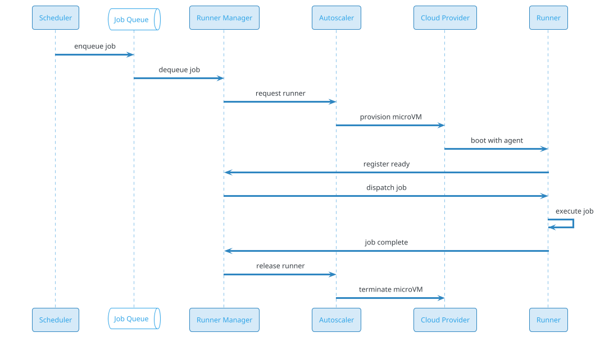
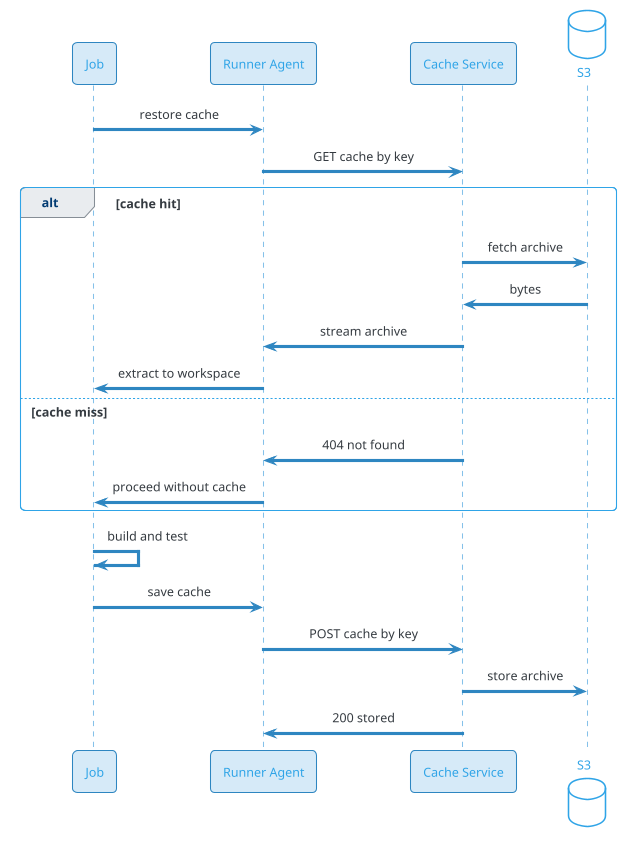
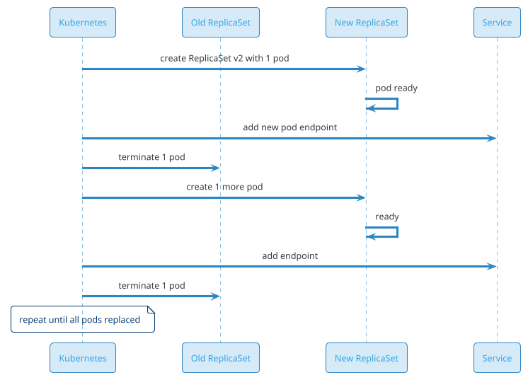
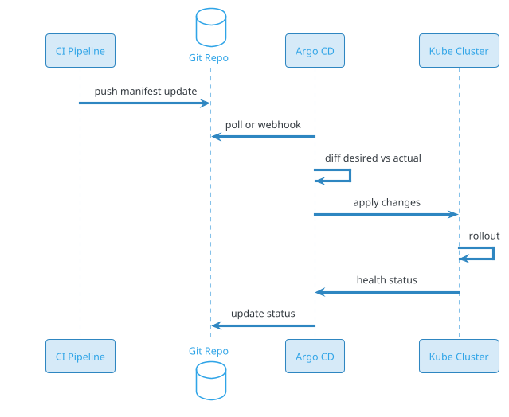
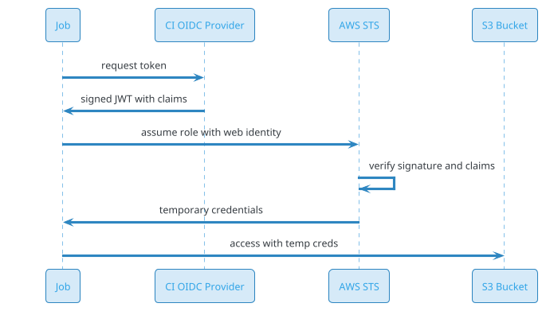
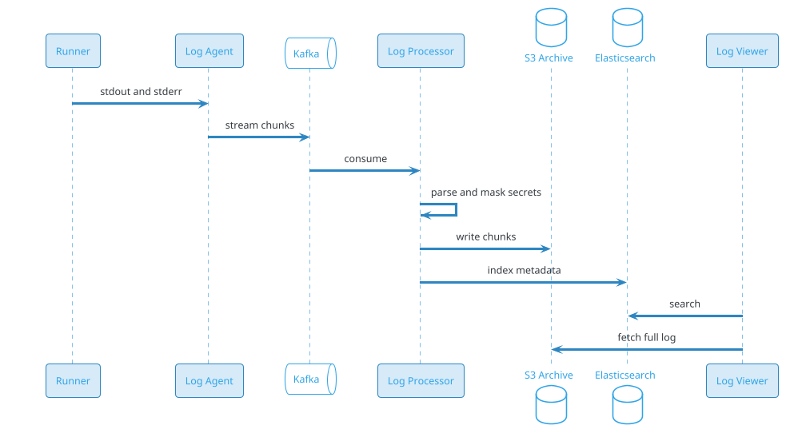

# Code Deployment / CI-CD System

## Problem Statement

Design a CI/CD (Continuous Integration / Continuous Deployment) platform like GitHub Actions, GitLab CI, Jenkins, CircleCI, or Argo CD. The system builds, tests, and deploys code whenever developers push commits. It must run millions of build jobs per day across heterogeneous hardware (CPU, GPU, ARM), isolate untrusted code, cache dependencies aggressively, and deploy to production with zero-downtime strategies like blue-green and canary. It's the backbone of modern software delivery — a single failing deployment can take down an entire product.

**Example:**

```
Developer workflow:

  1. Developer pushes to feature branch
  2. CI platform detects push (webhook from GitHub)
  3. Matches workflow file (.github/workflows/ci.yml)
  4. Spins up runner(s) in isolated environment
  5. Runs: checkout -> setup -> build -> test -> lint -> package
  6. Reports status back to GitHub
  7. On merge to main -> trigger deployment pipeline
  8. Build container image -> push to registry
  9. Deploy to staging -> smoke tests -> canary -> full rollout
 10. Rollback automatically if error rate spikes

Example workflow file:

  name: CI
  on: [push, pull_request]
  jobs:
    build:
      runs-on: ubuntu-latest
      steps:
        - uses: actions/checkout@v4
        - uses: actions/setup-java@v4
          with: { java-version: '21' }
        - run: mvn test
        - run: docker build -t myapp:${{ github.sha }} .
        - run: docker push myapp:${{ github.sha }}

Deployment (GitOps):

  1. Developer merges PR
  2. CI builds image -> pushes to registry
  3. CI updates Kubernetes manifest (image: myapp:v1.2.3)
  4. Argo CD detects manifest change (polling/git webhook)
  5. Argo CD applies to cluster
  6. Kubernetes rolls out new ReplicaSet
  7. Health checks pass -> old pods terminated
  8. If health fails -> Argo CD rolls back to previous manifest

Key challenges:
  - Untrusted code execution (sandboxing, secrets isolation)
  - Massive fan-out (100K concurrent jobs)
  - Cache hit ratio (dependencies, build artifacts)
  - Heterogeneous runners (Linux, macOS, Windows, GPU, ARM)
  - Ephemeral environments (clean per job)
  - Artifact storage (large binaries)
  - Zero-downtime deploys (blue-green, canary)
  - Rollback (fast, automated)
  - Secrets management (env vars, tokens)
  - Multi-tenancy (isolation across orgs)
  - Cost (compute dominates; scale to zero)
  - Observability (logs, traces, metrics per build)

Scale:
  - 100M repositories
  - 500M builds/day
  - 100K concurrent jobs (peak)
  - 10M deployments/day
  - Avg build 5 min
  - Avg deployment 2 min
  - 50 GB artifact storage per repo (avg)
  - p99 build start < 30 sec
  - 99.95% availability
```

**Real-world systems:** GitHub Actions, GitLab CI, CircleCI, Jenkins, Travis CI, Buildkite, Drone, Argo CD, Flux, Spinnaker, Tekton, AWS CodePipeline, Google Cloud Build.

**Why it's interesting:**

- **Untrusted code** — every build is potentially malicious
- **Ephemeral compute** — spin up, run, tear down
- **Cache is king** — most builds are incremental
- **Heterogeneous runners** — different OS, arch, hardware
- **Massive scale** — 500M builds/day, 100K concurrent
- **Zero-downtime deploys** — blue-green, canary, rolling
- **Rollback is critical** — fast automated recovery
- **Multi-tenancy** — 100M repos isolated
- **Cost** — compute dominates; scale to zero
- **Secrets** — never leak across tenants
- **Observability** — logs, traces, metrics per build
- **GitOps** — declarative deploy from Git

---

## 1. Requirements Clarification

### Functional Requirements

- **Triggers**: Push, PR, schedule, manual, webhook, API
- **Workflows**: YAML-defined, multi-job, dependencies
- **Runners**: Linux, macOS, Windows, ARM, GPU
- **Steps**: Checkout, setup, build, test, lint, package
- **Artifacts**: Upload/download between jobs, retention
- **Cache**: Dependencies, build outputs, keyed by hash
- **Secrets**: Per-repo, per-org, environment-scoped
- **Environments**: Dev, staging, prod with approvals
- **Deployments**: Blue-green, canary, rolling
- **Rollback**: Manual and automated
- **Matrix builds**: Multiple versions/platforms
- **Parallelism**: Run jobs concurrently
- **Reusable workflows**: Share across repos
- **Status checks**: Report to VCS
- **Logs**: Real-time stream, searchable
- **Notifications**: Slack, email, webhook
- **Artifacts**: Container images, binaries, reports
- **Self-hosted runners**: Customer-managed
- **GitOps**: Sync cluster state from Git

### Non-Functional Requirements

- **Scale**: 500M builds/day, 100K concurrent jobs
- **Latency**: p99 build start < 30 sec
- **Availability**: 99.95%
- **Isolation**: Strong (no cross-tenant leak)
- **Security**: Sandboxed execution; signed artifacts
- **Durability**: Never lose build logs or artifacts
- **Reproducibility**: Same inputs -> same outputs
- **Cost**: Pay-per-use; scale to zero
- **Observability**: Per-build logs, traces, metrics
- **Compliance**: SOC 2, ISO 27001, SLSA

### Out of Scope

- Source control (GitHub, GitLab — we integrate)
- Container registry internals (Docker Hub, ECR)
- Kubernetes internals (we deploy to K8s)
- Observability platform (Datadog — separate)
- Secret manager internals (Vault — separate)

---

## 2. Back-of-Envelope Estimation

### Traffic

```
Given:
  Repositories          = 100,000,000
  Builds/day            = 500,000,000
  Avg build duration    = 5 min
  Avg jobs/build        = 3
  Peak multiplier       = 5x
  Deployments/day       = 10,000,000

Builds/sec (avg):
  500M / 86,400 = ~5,787/sec

Builds/sec (peak):
  ~28,935/sec

Concurrent builds:
  Avg duration x rate = 5 min x 28,935/sec = ~8.7M
  But capped by capacity; assume 100K peak concurrent jobs

Job-starts/sec:
  28,935 builds/sec x 3 jobs = ~87K job-starts/sec peak

Runner churn:
  Each job: ~5 min
  Concurrent: 100K
  Runners created/sec = 100K / 300 = ~333/sec (steady-state)
  Peak: ~1,700/sec
```

### Storage

```
Build logs:
  500M builds x 3 jobs x 100 KB = ~150 TB/day
  Retained 90 days: ~13.5 PB
  Compressed (10x): ~1.35 PB

Artifacts:
  500M builds x 50 MB avg = ~25 PB/day
  Retained 30 days: ~750 PB
  Tiered (hot 7d + cold 23d): ~250 PB hot

Cache:
  100M repos x 5 GB avg = ~500 PB
  Evicted by LRU; steady-state ~200 PB

Workflow definitions:
  100M repos x 10 KB = ~1 TB

Build metadata:
  500M builds x 5 KB = ~2.5 TB/day
  Retained 1 year: ~900 TB

Container images:
  100M builds x 200 MB = ~20 PB/day
  Deduplicated by layers (90% dedup): ~2 PB/day
  Retained 30 days: ~60 PB

Total hot: ~250 PB (dominated by artifacts + cache)
Total cold: ~1.5 PB (logs)
```

### Bandwidth

```
Artifact upload/download:
  25 PB/day upload = ~2.9 GB/sec = 23 Gbps avg
  Peak: ~115 Gbps

Cache read:
  Assume 80% hit ratio; 20% miss -> fetch from upstream
  ~50 PB/day cache traffic = ~5.8 GB/sec

Log streaming:
  150 TB/day = ~17 MB/sec = 140 Mbps
  Peak: ~700 Mbps

Container image pulls:
  100M builds x 500 MB (avg pull) = ~50 PB/day
  = ~5.8 GB/sec = 46 Gbps avg
  Peak: ~230 Gbps

Total peak: ~500 Gbps
```

### Latency Budget

```
Build start (from trigger to first step):

  Webhook receive:                ~50 ms
  Parse workflow:                 ~20 ms
  Queue job:                      ~10 ms
  Schedule to runner:             ~100 ms
  Provision runner (VM/container):~5-20 sec
  Checkout code:                  ~2-10 sec
  First step executes:            ~100 ms

  Target p99 < 30 sec (dominated by provisioning)

Deployment (from merge to prod):

  Build image:                    ~2-5 min
  Push to registry:               ~30 sec
  Update manifest:                ~5 sec
  Argo CD detect:                 ~3 min (polling)
  Apply to cluster:               ~10 sec
  Rollout (rolling):              ~2-5 min
  Total:                          ~10-15 min

  With webhook-based sync: ~5-10 min

Rollback:

  Detect issue:                   ~1-2 min
  Trigger rollback:               ~10 sec
  Apply old manifest:             ~10 sec
  Rollout:                        ~2-5 min
  Total:                          ~5-8 min
```

---

## 3. High-Level Design

```d2
direction: down

dev: Developer {shape: person}
vcs: "VCS (GitHub/GitLab)" {shape: cloud}

webhook: "Webhook Receiver" {shape: hexagon}
api: "CI/CD API Gateway" {shape: hexagon}

trigger: "Trigger Service" {shape: rectangle}
workflow: "Workflow Parser" {shape: rectangle}
scheduler: "Job Scheduler" {shape: rectangle}
queue: "Job Queue (Kafka)" {shape: queue}

runner_mgr: "Runner Manager" {shape: rectangle}
pool_linux: "Linux Runner Pool" {shape: cloud}
pool_mac: "macOS Runner Pool" {shape: cloud}
pool_win: "Windows Runner Pool" {shape: cloud}
pool_gpu: "GPU Runner Pool" {shape: cloud}
pool_self: "Self-Hosted Pool" {shape: cloud}

runner: "Runner Agent" {shape: rectangle}
sandbox: "Sandbox (microVM/container)" {shape: rectangle}
cache: "Cache Service" {shape: rectangle}
artifact: "Artifact Service" {shape: rectangle}
log: "Log Service" {shape: rectangle}
secret: "Secrets Service" {shape: rectangle}

deploy: "Deployment Service" {shape: rectangle}
gitops: "GitOps (Argo CD)" {shape: rectangle}
k8s: "Kubernetes Cluster" {shape: cloud}

registry: "Container Registry" {shape: cylinder}
s3: "Object Storage (S3)" {shape: cylinder}
cache_s3: "Cache Storage" {shape: cylinder}
log_store: "Log Storage" {shape: cylinder}
meta: "Metadata DB" {shape: cylinder}
kms: "KMS / Vault" {shape: cylinder}
redis: "Redis (locks, presence)" {shape: cylinder}
prom: "Prometheus (metrics)" {shape: cylinder}

dev -> vcs
vcs -> webhook
webhook -> api
api -> trigger
trigger -> workflow
workflow -> scheduler
scheduler -> queue
queue -> runner_mgr
runner_mgr -> pool_linux
runner_mgr -> pool_mac
runner_mgr -> pool_win
runner_mgr -> pool_gpu
runner_mgr -> pool_self

pool_linux -> runner
pool_mac -> runner
pool_win -> runner
pool_gpu -> runner
pool_self -> runner
runner -> sandbox

sandbox -> cache
sandbox -> artifact
sandbox -> log
sandbox -> secret
sandbox -> registry

runner -> deploy
deploy -> gitops
gitops -> k8s
k8s -> registry

artifact -> s3
cache -> cache_s3
log -> log_store
api -> meta
api -> redis
trigger -> prom
deploy -> prom
```

### Component Responsibilities

| Component | Role |
|---|---|
| Webhook Receiver | Accept VCS webhooks; verify signature |
| CI/CD API | REST/GraphQL API for workflows, builds |
| Trigger Service | Match workflow to event |
| Workflow Parser | Parse YAML, validate, build DAG |
| Job Scheduler | Assign jobs to runners; manage deps |
| Job Queue | Durable queue (Kafka/SQS) |
| Runner Manager | Provision, monitor, tear down runners |
| Runner Pools | Grouped runners (Linux, macOS, GPU, etc.) |
| Runner Agent | Execute jobs on the node |
| Sandbox | Isolate jobs (microVM, container) |
| Cache Service | Key-value cache for dependencies |
| Artifact Service | Upload/download artifacts |
| Log Service | Collect, stream, index logs |
| Secrets Service | Inject secrets at runtime |
| Deployment Service | Orchestrate deploys |
| GitOps | Sync cluster state from Git |
| Kubernetes | Runtime for deployed apps |
| Container Registry | Store container images |
| Object Storage | Artifacts, logs, cache blobs |
| Metadata DB | Builds, workflows, users |
| KMS / Vault | Encryption, secrets |
| Redis | Locks, presence, rate limits |
| Prometheus | Metrics |

### Why This Architecture

- **Event-driven** — webhooks trigger builds
- **Queue decouples** — scheduler doesn't block on runners
- **Runner pools** — isolated by platform/hardware
- **Sandbox per job** — strong isolation
- **Cache and artifacts** — separate services for reuse
- **GitOps** — declarative deploy from Git
- **Kubernetes** — standard runtime
- **Observability** — metrics, logs, traces per build

---

## 4. Deep Dive: Sandboxing Untrusted Code

### Why Sandbox?

Every build runs **arbitrary code**:
- Malicious PRs (crypto miners, data exfiltration)
- Compromised dependencies
- Buggy code (fork bombs, disk fill)
- Cross-tenant attacks

**Isolation must be strong** — one job cannot affect:
- Host OS
- Other tenants' jobs
- Secrets of other tenants
- Network (except allowlist)

### Isolation Levels

| Level | Mechanism | Isolation | Cost | Startup |
|---|---|---|---|---|
| **Process** | Linux user, cgroups | Weak | Cheapest | ~ms |
| **Container** | Docker/OCI, namespaces | Good | Cheap | ~100 ms |
| **microVM** | Firecracker, Kata | Strong | Medium | ~125 ms |
| **VM** | Full hypervisor | Strongest | Expensive | ~5-30 sec |
| **Hardware** | Dedicated machine | Absolute | Very expensive | Minutes |

### Recommended: Firecracker microVM

**AWS Lambda uses it.** Ideal for CI:
- **KVM-based** — hardware virtualization
- **~125 ms boot**
- **Minimal attack surface** (5K LoC in Rust)
- **Per-job isolation**
- **Overcommit** — many microVMs per host

### Sandbox Configuration

```
Isolation:
  - Separate kernel (microVM)
  - Separate network namespace
  - Separate filesystem (ephemeral)
  - CPU/memory limits (cgroups)
  - Disk quota
  - No privileged access

Network:
  - Egress allowlist (package registries, VCS)
  - No ingress
  - DNS via proxy
  - No access to host metadata (169.254.169.254)

Secrets:
  - Injected at runtime via tmpfs
  - Not in environment (visible in /proc)
  - Short-lived tokens
  - Scoped to repo + environment

Filesystem:
  - Read-only base image
  - Writable tmpfs
  - Volume for workspace
  - Destroyed after job
```

### Network Egress Allowlist

**Default deny** for outbound:
- Allow: `github.com`, `npmjs.org`, `pypi.org`, `maven.org`
- Allow: customer's artifact registries
- Block: everything else

**Why:** Prevent exfiltration. Attacker can't `curl` secrets to their server.

**Implementation:**
- **Proxy** (HTTP CONNECT) with allowlist
- **DNS** resolution via proxy
- **TLS inspection** (optional, for enterprise)

### Secrets Isolation

**Never store secrets in**:
- Environment variables (visible in `/proc/<pid>/environ`)
- Files (visible unless tmpfs)
- Shell history
- Build logs

**Do**:
- **Inject** at runtime via tmpfs (mode 0600)
- **Short-lived tokens** (OIDC -> assume role)
- **Per-job secrets** (not shared across jobs)
- **Redact** in logs

**OIDC-based secrets (best practice):**


**No long-lived secrets** — JWT is ephemeral and scoped.

### Escape Prevention

- **Seccomp** — restrict syscalls
- **AppArmor/SELinux** — mandatory access control
- **No privileged containers**
- **No Docker socket mount**
- **No host PID/network namespace**
- **No CAP_SYS_ADMIN**
- **Read-only root** (except workspace)
- **Kernel hardening** (KSPP, gVisor optionally)

### gVisor Alternative

**User-space kernel** — intercepts syscalls:
- **Strong isolation** without hardware VM
- **Faster startup** than microVM (~50 ms)
- **Slight overhead** for syscall-heavy workloads
- **Used by:** Google Cloud Run, some CI systems

### Multi-Tenancy

**Logical isolation**:
- **Separate namespaces** per org
- **Resource quotas** per org
- **Network isolation** (VPC peering optional)
- **Secret scoping** (org -> repo -> env)

**Physical isolation** (enterprise):
- **Dedicated runner pools** for enterprise tenants
- **Dedicated compute** (no noisy neighbors)
- **Private networking**

### Threat Model

| Threat | Mitigation |
|---|---|
| Fork bomb | cgroup pids limit |
| Disk fill | Disk quota + tmpfs |
| Memory exhaustion | cgroup memory limit |
| Network exfiltration | Egress allowlist |
| Secret theft | Runtime injection + short-lived |
| Cross-tenant access | microVM isolation |
| Privilege escalation | No privileged, seccomp |
| Persistent compromise | Ephemeral VMs |
| Crypto mining | CPU limits + anomaly detection |

### Ephemeral by Design

**Every job gets a fresh sandbox:**
- Booted from known-good image
- Destroyed after job (or timeout)
- No state carried across jobs
- Cache is external (not sandbox state)

**Benefit:** Compromise is bounded to single job lifetime.

---

## 5. Deep Dive: Runner Provisioning and Scaling

### Runner Types

| Type | Provisioning | Isolation | Cost | Use case |
|---|---|---|---|---|
| **Hosted (SaaS)** | Auto | microVM | Pay-per-minute | Public repos, small teams |
| **Self-hosted** | Customer | Customer choice | Customer pays | Enterprise, custom HW |
| **Spot / preemptible** | Auto | microVM | 70% cheaper | Fault-tolerant builds |
| **Reserved** | Pre-provisioned | microVM | Baseline | Predictable load |

### Provisioning Flow



### Warm Pool (Pre-Warming)

**Problem:** Cold VM boot = ~125 ms; plus image pull = seconds.

**Solution:** Maintain **warm pool** of idle runners:
- Pre-booted microVMs
- Common images cached
- Jobs dispatched immediately
- Pool size adapts to demand

**Trade-off:** Idle cost vs cold-start latency.

**Optimization:**
- Warm pool size = f(predicted demand)
- **Predictive scaling** (time-of-day patterns)
- **Spot instances** for warm pool

### Autoscaling

**Metrics:**
- **Queue depth** — jobs waiting
- **Job arrival rate** — jobs/sec
- **Runner utilization** — % busy
- **Job duration** — avg execution time

**Algorithm (simplified):**
```
desired_runners = queue_depth / target_jobs_per_runner
                + arrival_rate * avg_duration
                * safety_factor (1.2)
```

**Scale-up:** Fast (seconds).
**Scale-down:** Slow (5-10 min) to avoid thrashing.

### Spot / Preemptible Instances

**70% cheaper** but can be reclaimed with 30-sec notice.

**Strategy:**
- **Baseline** on reserved instances
- **Burst** on spot
- **Checkpoint** long jobs
- **Retry** on preemption
- **Mixed pools** (on-demand fallback)

**Suitable for:** Test jobs, lint, builds (not deploys).

### Heterogeneous Runners

| Platform | Image | Use case |
|---|---|---|
| **Ubuntu 22.04** | Standard Linux | Most builds |
| **Ubuntu 24.04** | Latest LTS | Modern toolchains |
| **macOS 14** | Apple silicon | iOS/macOS builds |
| **macOS 13** | Intel | Legacy |
| **Windows Server 2022** | Windows | .NET, C++ |
| **ARM64** | Graviton/Ampere | Cross-compile |
| **GPU** | NVIDIA T4/A100 | ML training |

**Pools are separate** — different hardware, different scheduling.

### Self-Hosted Runners

**Customer runs the runner** in their infra:
- **Security:** Code runs in customer's VPC
- **Customization:** Custom hardware/software
- **Cost:** Customer pays for compute
- **Ephemeral:** Typically container/VM per job
- **Connects to our scheduler** (outbound WebSocket)

**Flow:**
1. Customer installs runner agent
2. Agent registers with our scheduler
3. Scheduler dispatches jobs to agent
4. Agent executes in customer's environment
5. Results reported back

**Benefits:** Data residency, compliance, custom hardware.

### Preemption Handling

When spot instance reclaimed:
1. **30-sec warning** (AWS) -> signal to runner
2. Runner **checkpoints** state (if possible)
3. Job **re-queued** with new runner
4. Retries with backoff
5. **Cost:** Same job runs twice (compute waste)

**Mitigation:** Checkpoint frequently; long jobs on reserved.

### Cost Optimization

| Technique | Savings |
|---|---|
| Spot instances | 70% |
| Warm pool (right-sized) | 20-40% |
| Autoscale to zero | 50-80% (idle) |
| Right-size instance type | 20-30% |
| ARM runners (Graviton) | 20-40% |
| Cache (fewer rebuilds) | 30-60% |
| Multi-tenant bin-packing | 20-30% |

**Combined:** 60-80% cost reduction vs naive.

### Runner Lifecycle

```
1. Provision (boot microVM)
2. Bootstrap (agent, image pull)
3. Register with scheduler
4. Idle (in warm pool)
5. Assigned job
6. Execute (workspace setup, steps)
7. Report results
8. Cleanup (delete workspace, secrets)
9. Return to pool or terminate
```

**Max lifetime:** ~1 hour (prevent drift).
**Max idle:** ~5 min (then terminate).

---

## 6. Deep Dive: Caching and Artifacts

### Why Cache?

Builds are **incremental**:
- Dependencies (npm, pip, maven)
- Build outputs (compiled classes)
- Docker layers

**Cache hit ratio** determines build speed.

### Cache Types

| Type | Example | Storage | Hit ratio |
|---|---|---|---|
| **Dependency cache** | `~/.m2`, `node_modules` | S3 | 80-95% |
| **Build cache** | Compiled classes, Bazel | S3 | 60-80% |
| **Docker layer cache** | Base images | Registry | 70-90% |
| **Test result cache** | Failed test list | Redis | 50-70% |
| **Compiler cache** | ccache, sccache | S3 | 40-70% |

### Cache Key

**Deterministic** based on inputs:
```
cache_key = hash(
  repo_id + branch +
  dependency_lock_file_hash +
  runner_os +
  env_vars
)
```

**Example:**
```
key: node-modules-linux-x64-abc123
path: node_modules
```

**Restore keys** (fallback chain):
```
key: node-modules-linux-x64-abc123
restore-keys:
  - node-modules-linux-x64-
  - node-modules-linux-
```

### Cache Flow



### Cache Eviction

- **LRU** across all keys
- **TTL**: 7-30 days
- **Size limit**: 10 GB/repo (configurable)
- **Quota per org**: avoid abuse
- **Compression**: zstd (3-5x)

### Cache Hit Ratio Optimization

- **Fine-grained keys** (not too broad)
- **Restore keys** for fallback
- **Compress aggressively**
- **Parallel restore** (multi-part)
- **Local SSD cache** on runner (persistent across jobs on same host)
- **P2P cache** (BitTorrent-style for popular repos)

### Docker Layer Cache

- **Registry** as cache (pull layers)
- **Local daemon cache** on runner host
- **BuildKit** with cache-from and cache-to
- **OverlayFS** for layer sharing

**Hit ratio:** 70-90% for incremental builds.

### Artifact Storage

**Artifacts** = outputs of a build:
- Container images
- Binaries (JAR, EXE)
- Test reports (JUnit XML)
- Coverage reports (LCOV)
- Documentation (HTML)

**Storage:** S3 with lifecycle policies.

### Artifact Flow

```
1. Job produces artifacts
2. Runner uploads to Artifact Service
3. Service stores in S3 (chunked, parallel)
4. Metadata in DB (repo, build, name, size, hash)
5. Other jobs download via signed URLs
6. Retention policy applies (30 days default)
```

### Artifact Deduplication

**Content-addressed storage** (CAS):
- Key = SHA-256(content)
- Same content stored once
- **Deduplication:** 80-90% for repeated builds

**Benefit:** Massive storage savings for monorepos.

### Retention Policies

```yaml
retention:
  artifacts:
    default: 30 days
    main_branch: 90 days
    releases: 1 year
  logs:
    default: 90 days
    main_branch: 1 year
  cache:
    default: 7 days
    hit_ratio: adaptive
```

### Cache Security

- **Encrypted at rest** (S3 SSE)
- **Encrypted in transit** (TLS)
- **Scoped by org/repo** (no cross-tenant)
- **Signed URLs** for download
- **Audit access**

### Cross-Branch Cache

**Problem:** Feature branches rebuild deps.

**Solutions:**
- **Shared cache** across branches (by lock file hash)
- **Base branch cache** as fallback
- **Trusted branches** (main) can write global cache

---

## 7. Deep Dive: Pipeline Orchestration (DAG)

### Workflow Definition

```yaml
name: Build and Deploy
on:
  push:
    branches: [main]
  pull_request:

jobs:
  lint:
    runs-on: ubuntu-latest
    steps:
      - uses: actions/checkout@v4
      - run: npm run lint

  test:
    runs-on: ubuntu-latest
    strategy:
      matrix:
        node: [18, 20, 22]
    steps:
      - uses: actions/checkout@v4
      - uses: actions/setup-node@v4
        with: { node-version: ${{ matrix.node }} }
      - run: npm ci
      - run: npm test

  build:
    needs: [lint, test]
    runs-on: ubuntu-latest
    steps:
      - uses: actions/checkout@v4
      - run: docker build -t myapp:${{ github.sha }} .
      - run: docker push myapp:${{ github.sha }}

  deploy:
    needs: build
    if: github.ref == 'refs/heads/main'
    runs-on: ubuntu-latest
    environment: production
    steps:
      - uses: actions/checkout@v4
      - run: kubectl set image deploy/myapp myapp=myapp:${{ github.sha }}
```

### DAG Construction

The workflow defines a **DAG** of jobs:

```d2
direction: right

lint: "lint" {shape: rectangle}
test18: "test Node 18" {shape: rectangle}
test20: "test Node 20" {shape: rectangle}
test22: "test Node 22" {shape: rectangle}
build: "build" {shape: rectangle}
deploy: "deploy (main only)" {shape: rectangle}

lint -> build
test18 -> build
test20 -> build
test22 -> build
build -> deploy
```

**Parallelism:** Independent jobs run concurrently.
**Dependencies:** `needs` creates edges.
**Conditional:** `if` filters execution.

### Scheduler

**Responsibilities:**
1. Parse workflow -> DAG
2. Track job states (pending, running, done, failed, skipped)
3. Schedule jobs whose dependencies are met
4. Handle failures (abort downstream, or continue)
5. Manage timeouts, retries
6. Report status back to VCS

**State machine per job:**
```
PENDING -> QUEUED -> RUNNING -> SUCCESS
                             -> FAILED
                             -> CANCELLED
                             -> TIMED_OUT
                             -> SKIPPED
```

### Matrix Builds

**Expand matrix** into multiple jobs:
```yaml
strategy:
  matrix:
    node: [18, 20, 22]
    os: [ubuntu-latest, macos-latest]
```

-> 6 jobs (3 x 2). **Fan-out** to parallel runners.

**Fail-fast:** Optionally cancel others when one fails.

**Max-parallel:** Cap concurrency per matrix.

### Reusable Workflows

**Share workflows** across repos:
```yaml
jobs:
  call-reusable:
    uses: org/.github/.github/workflows/build.yml@main
    with:
      node-version: '20'
    secrets: inherit
```

**Benefit:** DRY; central governance.

### Job Dependencies

**Implicit:** All jobs in a `needs` chain.
**Explicit:** `needs: [a, b]` — both must complete.

**Parallel:** Independent jobs run side-by-side.

**Conditional:** `if: success()`, `if: failure()`, `if: always()`.

### Failure Handling

| Strategy | Behavior |
|---|---|
| **Fail-fast** | Cancel other jobs in matrix on first failure |
| **Continue-on-error** | Mark job failed but continue pipeline |
| **Retry** | Retry transient failures (network, spot) |
| **Timeout** | Kill long-running jobs (default 6h) |
| **Abort** | Cancel all on critical failure |

### Concurrency Control

**Same workflow + branch** -> serialize:
```yaml
concurrency:
  group: ${{ github.workflow }}-${{ github.ref }}
  cancel-in-progress: true
```

**Prevents:** Multiple deploys to same env.

### Notifications

- **VCS status** (checks API)
- **Slack / Teams** (per job or pipeline)
- **Email** (on failure)
- **Webhook** (custom)

### Performance

**Pipeline p99 duration** is critical metric.
**Optimizations:**
- Cache aggressively
- Parallelize jobs
- Reuse containers
- Warm pools
- Skip unnecessary jobs (paths filters)

---

## 8. Deep Dive: Zero-Downtime Deployments

### Deployment Strategies

| Strategy | Downtime | Rollback | Cost | Complexity |
|---|---|---|---|---|
| **Recreate** | Yes | Slow | Low | Low |
| **Rolling** | No | Medium | Low | Medium |
| **Blue-Green** | No | Fast | 2x | Medium |
| **Canary** | No | Fast | 1.x | High |
| **A/B** | No | Fast | 1.x | High |
| **Shadow** | No | N/A | 2x | High |

### Rolling Update (Kubernetes default)



**Max surge / max unavailable:** Control rollout speed.
**Health checks:** Readiness probe gates traffic.
**Rollback:** `kubectl rollout undo` -> previous ReplicaSet.

### Blue-Green

**Two identical environments** (blue = current, green = new).

```d2
direction: right

lb: "Load Balancer" {shape: hexagon}
blue: "Blue v1" {shape: rectangle}
green: "Green v2" {shape: rectangle}

lb -> blue : 100 percent
green: "idle" {shape: rectangle}
```

**Switch:** LB cuts over atomically.
**Rollback:** Switch back to blue.

**Cost:** 2x infrastructure during deploy.
**Benefit:** Instant switch, clean rollback.

### Canary

**Route small % of traffic** to new version; expand gradually.

```
10% -> v2, 90% -> v1
Observe: error rate, latency, business metrics
If good -> 50% -> 100%
If bad -> 0% (rollback)
```

**Tools:** Istio, Linkerd, Flagger, Argo Rollouts.

**Metrics for promotion:**
- Error rate (5xx)
- Latency (p99)
- Business (conversion, revenue)
- Custom (saturation, queue depth)

**Automated promotion** based on thresholds.

### Progressive Delivery

Combine canary + automated analysis:
```yaml
apiVersion: argoproj.io/v1alpha1
kind: Rollout
spec:
  strategy:
    canary:
      steps:
        - setWeight: 10
        - pause: { duration: 5m }
        - analysis:
            templates:
              - templateName: success-rate
        - setWeight: 50
        - pause: { duration: 5m }
        - setWeight: 100
      analysis:
        templates:
          - templateName: success-rate
```

### Health Checks

**Kubernetes probes:**
- **Liveness**: Is pod alive? (restart if not)
- **Readiness**: Can it serve traffic? (remove from LB if not)
- **Startup**: Has it finished starting? (delay liveness)

**Best practices:**
- Liveness: shallow check (process alive)
- Readiness: deep check (dependencies healthy)
- Startup: for slow-starting apps

### Rollback

**Triggers:**
- **Automated**: Error rate > threshold
- **Manual**: SRE clicks rollback
- **Scheduled**: Time-based (canary window expired)

**Mechanism:**
- **Kube**: `kubectl rollout undo` -> previous ReplicaSet
- **Argo CD**: Revert Git commit -> sync
- **Blue-green**: Switch LB back

**Speed:** < 60 sec for Kube rollback.

### Database Migrations

**Hard part of deploys.**

**Patterns:**
1. **Expand-contract** (parallel change):
   - Deploy: add new column (nullable)
   - Backfill data
   - Deploy: use new column
   - Remove old column
2. **Backward-compatible migrations** (add-only)
3. **Blue-green with dual-write** (complex)

**Never:** Deploy code that requires schema change simultaneously.

### Feature Flags

**Decouple deploy from release.**
- Deploy code with flag off
- Enable flag when ready
- **Kill switch** for instant rollback

**Tools:** LaunchDarkly, Unleash, Flagsmith.

### GitOps (Argo CD / Flux)

**Declarative deployment from Git:**
```
1. Git repo has Kube manifests (image: myapp:v1.2.3)
2. CI updates manifest -> commits
3. Argo CD detects diff -> applies to cluster
4. Cluster state converges to Git
```

**Benefits:**
- **Git is source of truth**
- **Audit trail** (every change in Git)
- **Rollback = git revert**
- **DR**: Re-apply from Git

**Flow:**



### Multi-Environment

```
dev -> staging -> prod
```

**Promotion:** Same artifact, different config.
**Gates:** Approvals, tests, time windows.
**Separation:** Different clusters / namespaces.

### Secrets in Deploy

- **Sealed Secrets**: Encrypt in Git; decrypt in cluster
- **External Secrets Operator**: Sync from Vault/AWS Secrets Manager
- **SOPS**: Encrypt values in Git
- **Never:** Commit plaintext secrets

### Compliance Deploys

**Change management:**
- **Approval** required for prod
- **Audit log** of every deploy
- **Rollback plan** documented
- **Maintenance window** (if needed)

**Tools:** ServiceNow, Jira, custom approval workflows.

---

## 9. Deep Dive: Secrets and OIDC

### Secret Types

| Type | Scope | Example |
|---|---|---|
| **Repo secrets** | All workflows in repo | API keys |
| **Org secrets** | All repos in org | Shared tokens |
| **Environment secrets** | Specific env | Prod DB password |
| **Dependabot secrets** | Dependabot only | Limited scope |
| **Runner secrets** | Self-hosted | Runner auth |

### Secret Storage

- **Encrypted at rest** (AES-256)
- **KMS envelope encryption**
- **Access control** (who can read/write)
- **Audit log** (every read)
- **Rotation** (manual or automatic)

### Secret Injection

**Never in:**
- Plain text in logs
- Environment variables (visible in `/proc`)
- Command-line args (visible in `ps`)
- Build artifacts

**Instead:**
- **Tmpfs** mount (`/run/secrets/`)
- **File-based** (mode 0600)
- **Runtime fetch** via API
- **Mask in logs** (redact)

### Masking in Logs

**Automatically redact** known secrets:
```
Before: "Connecting with token: abc123xyz"
After:  "Connecting with token: ***"
```

**Implementation:** Pattern-match against secret values; replace with `***`.

**Caveat:** Secrets in hashed/base64 form may leak.

### OIDC-Based Secrets (Best Practice)

**No long-lived secrets.** Exchange short-lived OIDC token for cloud credentials.

**Flow:**



**Benefits:**
- **No secrets** to rotate
- **Scoped** to repo/branch/environment
- **Short-lived** (15 min)
- **Auditable** (who assumed what)

**Supported by:** AWS, GCP, Azure, Vault.

### Secret Rotation

**Best practices:**
- **Automated rotation** every 90 days
- **Dual-secret** pattern (old + new overlap)
- **Grace period** for consumers
- **Alert** on approaching expiry

### Secret Scanning

**Prevent committing secrets:**
- **Pre-commit hooks** (gitleaks, trufflehog)
- **CI scanning** (on every push)
- **Repo scanning** (periodic, entire history)
- **Partner scanning** (GitHub secret scanning)

**On detection:**
- **Revoke** immediately
- **Notify** owner
- **Rotate** replacement
- **Audit** access logs

### Least Privilege

- **Per-environment** secrets (not shared)
- **Per-job** injection (not whole pipeline)
- **Read-only** where possible
- **Time-bounded** access
- **Audit** every use

---

## 10. Deep Dive: Logs and Observability

### Build Logs

**Every job produces logs:**
- Standard output
- Standard error
- Step boundaries
- Timestamps
- Exit codes

**Volume:**
```
500M builds/day x 3 jobs x 100 KB = 150 TB/day
```

**Retention:** 90 days (default).

### Log Pipeline



### Streaming vs Batch

- **Real-time streaming** — user watches live logs
- **Batch storage** — after job completes, compress + archive
- **Search** — index for grep/search

### Log Format

**Structured** (JSON per line) ideal:
```json
{
  "ts": "2026-09-19T10:00:00.123Z",
  "job_id": "job-abc",
  "step": "build",
  "level": "info",
  "msg": "Compiling 42 files..."
}
```

**Unstructured** (raw stdout) — fallback.

### Log Retention and Tiers

| Tier | Retention | Storage | Search |
|---|---|---|---|
| **Hot** | 7 days | S3 + ES | Real-time |
| **Warm** | 90 days | S3 Standard | Batch |
| **Cold** | 1 year | S3 Glacier | Slow |
| **Archive** | 7 years | Deep Archive | Very slow |

### Observability Beyond Logs

- **Metrics** (Prometheus): build duration, queue depth, success rate
- **Traces** (OpenTelemetry): pipeline DAG execution
- **Events** (Kafka): audit, billing
- **Profiles**: CPU/memory of build steps

### Per-Build Observability

**For each build, view:**
- Logs (all steps)
- Duration (per step, total)
- Resource usage (CPU, memory, disk)
- Cache hit/miss
- Artifacts uploaded
- Status (success, failure, cancelled)
- Trigger (push, PR, schedule)
- Commit, branch, author
- Runner (type, region)

### Debugging Failed Builds

**Tools:**
- **Live tail** — watch as it runs
- **SSH into runner** (self-hosted only)
- **Re-run with debug logging**
- **Compare to previous successful build**
- **Bisect commits**

### Metrics

**Build metrics:**
- `build.duration` — per repo, branch, platform
- `build.success_rate` — percent successful
- `build.queue_time` — wait before start
- `build.cache_hit_ratio` — percent hit
- `build.artifact_size` — bytes

**Pipeline metrics:**
- `pipeline.duration` — end-to-end
- `pipeline.failure_rate`
- `pipeline.deploy_frequency` — DORA metric

**Runner metrics:**
- `runner.utilization` — percent busy
- `runner.provision_time` — boot latency
- `runner.churn` — create/destroy rate

### Alerts

- **P0**: Pipeline service down, mass failures
- **P1**: Queue depth > 10K, build p99 > 30 min
- **P2**: Cache hit < 50%, runner pool at capacity
- **P3**: Failed deploys, rollback triggered

### DORA Metrics

**DevOps Research and Assessment:**
1. **Deployment frequency** — how often
2. **Lead time for changes** — commit to prod
3. **Change failure rate** — percent deploys causing incidents
4. **Time to restore** — MTTR

**Elite:** Multiple deploys/day, < 1 hour lead time, < 15% failure, < 1 hour restore.

### SLO for CI/CD

- **Build start p99** < 30 sec
- **Build success rate** > 99%
- **Deploy success rate** > 99.9%
- **Rollback time** < 5 min
- **Availability** > 99.95%

---

## 11. Deep Dive: Multi-Tenancy and Isolation

### Tenancy Levels

| Level | Isolation | Shared | Use case |
|---|---|---|---|
| **Shared runners** | microVM | Compute | Public repos |
| **Dedicated pool** | Dedicated VMs | None | Enterprise |
| **Self-hosted** | Customer infra | None | Compliance |
| **Regional** | Region-scoped | None | Data residency |

### Resource Quotas

**Per-tenant limits:**
- **Concurrent jobs**: 20-1000 (plan-dependent)
- **Build minutes**: 2,000-50,000/month
- **Storage**: 10 GB - 1 TB
- **Egress**: 100 GB - 10 TB
- **API rate**: 1K-100K req/hour

**Enforcement:**
- **Admission control** at scheduler
- **Quota service** (Redis + DB)
- **Backpressure** when exceeded
- **Notifications** at 80%, 100%

### Noisy Neighbor Prevention

- **CPU/memory cgroups** per job
- **Disk I/O limits**
- **Network bandwidth limits**
- **Disk quota** (tmpfs size)
- **PID limits** (prevent fork bombs)
- **CPU pinning** (optional, for latency-critical)

### Tenant Data Isolation

- **Separate S3 prefixes** per tenant (org/repo)
- **Encryption keys** per tenant (KMS)
- **Separate DB schemas** or row-level security
- **Separate cache namespaces**
- **Network isolation** (VPC per enterprise)

### Secret Isolation

- **Tenant A cannot read tenant B secrets**
- **Row-level security** in secret DB
- **Signed requests** with tenant context
- **Audit log** every access

### Cross-Tenant Attack Prevention

| Attack | Mitigation |
|---|---|
| **VM escape** | microVM isolation |
| **Side-channel** | Dedicated CPU (enterprise) |
| **Network sniffing** | Network namespace per job |
| **Shared cache poisoning** | Cache namespace isolation |
| **Secret leak** | Runtime injection, per-tenant KMS |
| **Log leak** | Per-tenant log storage |
| **Artifact leak** | Per-tenant S3 bucket |

### Compliance Isolation

**For regulated industries:**
- **Dedicated compute** (no shared runners)
- **Dedicated storage** (separate S3 bucket)
- **Regional** (data residency)
- **Audit log** (immutable, per-tenant)
- **BYOK** (Bring Your Own Key) encryption

### Billing Per Tenant

**Metering:**
- **Build minutes** (per platform)
- **Storage** (cache + artifacts)
- **Egress** (artifact download)
- **Actions** (API calls)

**Aggregation:** Per-minute granularity; rollup to hourly/daily.
**Reporting:** Dashboard + invoice.
**Anomaly detection:** Unusual usage -> alert.

---

## 12. Scaling Considerations

### Read Scaling

- **API**: Stateless; horizontal scale
- **Logs**: S3 + ES (read replicas)
- **Artifacts**: S3 (unlimited)
- **Cache**: S3 + local SSD
- **Metadata**: Read replicas

### Write Scaling

- **Job queue**: Kafka (partitioned)
- **Logs**: Kafka -> S3
- **Artifacts**: S3 multipart upload
- **Cache**: S3 (write once)
- **Metadata**: Sharded Postgres

### Sharding

- **Jobs**: Partition by repo_id
- **Logs**: Partition by date
- **Cache**: Shard by cache_key
- **Metadata**: Shard by repo_id
- **Runners**: Partition by pool

### Multi-Region

```d2
direction: down

us: "US Region" {shape: cloud}
eu: "EU Region" {shape: cloud}
apac: "APAC Region" {shape: cloud}

us_runners: "US Runners" {shape: cylinder}
eu_runners: "EU Runners" {shape: cylinder}
apac_runners: "APAC Runners" {shape: cylinder}

us -> us_runners
eu -> eu_runners
apac -> apac_runners
```

**Strategy:**
- **Regional runners** (data residency)
- **Global control plane** (scheduler, API)
- **Regional artifact storage** (compliance)
- **Cross-region failover**
- **Route by repo config** (region preference)

### Peak Handling

- **Autoscale** runner pools
- **Queue** at scheduler (backpressure)
- **Priority lanes** for paying customers
- **Shed** low-priority when overloaded
- **Pre-warm** for known events (product launches)

### Cost Optimization

| Technique | Savings |
|---|---|
| Spot instances | 60-70% |
| Warm pool right-size | 20-40% |
| Autoscale to zero | 50-80% |
| ARM runners | 20-40% |
| Cache hit ratio > 90% | 30-50% |
| Compression | 50% storage |
| Tiered storage | 60-70% (cold) |

### Capacity Planning

```
Peak concurrent jobs: 100K
Avg job duration: 5 min
Jobs/hour: 100K x (60/5) = 1.2M jobs/hour
Runners needed: 100K (concurrent)
Hosts (bin-packed): 100K / 20 microVMs = 5K hosts
With headroom (30%): 6.5K hosts

Peak (5x): 500K concurrent -> 32.5K hosts
```

---

## 13. Bottlenecks and Trade-offs

| Concern | Solution | Trade-off |
|---|---|---|
| Untrusted code | microVM isolation | Boot latency (~125 ms) |
| Cold start | Warm pool | Idle cost |
| Cache hit ratio | Fine-grained keys + fallback | Complexity |
| Cost | Spot instances | Preemption |
| Latency | Pre-warm, fast dispatch | Cost |
| Scale | Autoscale + queue | Complexity |
| Multi-region | Regional runners | Duplication |
| Secrets | Runtime injection + OIDC | Complexity |
| Deploy safety | Canary + rollback | Slower deploys |
| Multi-tenancy | Isolation (microVM, VPC) | Cost |

### Design Decisions Summary

| Decision | Choice | Rationale |
|---|---|---|
| Sandbox | Firecracker microVM | Fast + strong isolation |
| Cache | S3 + local SSD | Cheap + fast |
| Artifact storage | S3 (content-addressed) | Dedup + durable |
| Queue | Kafka | Durable, scalable |
| Scheduler | Custom + Redis | State coordination |
| Deploy | Kube + GitOps | Standard, declarative |
| Strategy | Rolling + canary | Zero-downtime + safety |
| Secrets | OIDC + tmpfs | No long-lived secrets |
| Logs | Kafka -> S3 + ES | Real-time + searchable |
| Multi-region | Regional runners | Latency + compliance |

---

## 14. Failure Scenarios

### Runner Failure

**Impact:** Single job fails.

**Mitigation:**
- Retry (up to N times)
- New runner provisioned
- Alert on rate > threshold

### Runner Pool Exhaustion

**Impact:** Jobs queue indefinitely.

**Mitigation:**
- Autoscale aggressively
- Queue backpressure
- Priority lanes
- Alert ops (P1)

### Scheduler Down

**Impact:** No new jobs scheduled.

**Mitigation:**
- Multi-AZ scheduler
- Leader election (Raft)
- Existing jobs continue
- Alert ops (P0)

### Queue Down (Kafka)

**Impact:** Jobs not dispatched.

**Mitigation:**
- Multi-broker Kafka
- Replication (3x)
- Fallback queue (Redis/SQS)
- Alert ops (P0)

### Cache Service Down

**Impact:** Slower builds (no cache).

**Mitigation:**
- Cache is optional; builds continue
- Fallback to upstream fetch
- Alert ops (P2)

### Artifact Storage Down

**Impact:** Can't upload/download artifacts.

**Mitigation:**
- Multi-region S3
- Retry with backoff
- Alert ops (P1)

### Secrets Service Down

**Impact:** Jobs needing secrets fail.

**Mitigation:**
- Cache secrets briefly
- Multi-region
- Alert ops (P0)

### KMS Down

**Impact:** Can't decrypt secrets; new jobs fail.

**Mitigation:**
- Multi-region KMS
- Cache decrypts in memory
- Alert ops (P0)

### VCS Webhook Lost

**Impact:** Build not triggered.

**Mitigation:**
- Reconciliation loop (poll VCS)
- Manual trigger
- Alert on missing builds

### Deploy Failure

**Impact:** New version broken in prod.

**Mitigation:**
- Automated rollback
- Circuit breaker (error rate)
- Alert on-call

### Rollback Failure

**Impact:** Cannot revert; prolonged outage.

**Mitigation:**
- Test rollback regularly
- Multiple rollback paths (Git, Kube, DB)
- Manual override
- Post-mortem

### Cache Poisoning

**Impact:** Malicious cache entry affects future builds.

**Mitigation:**
- Cache keys include content hash
- Trusted branches write global cache
- Read-only for untrusted branches
- Audit cache writes

### Supply Chain Attack

**Impact:** Malicious dependency in build.

**Mitigation:**
- **SBOM** (Software Bill of Materials)
- **SLSA** provenance
- **Signed artifacts** (Sigstore)
- **Dependency scanning**

### Cross-Tenant Attack

**Impact:** Tenant A attacks Tenant B.

**Mitigation:**
- microVM isolation
- Network isolation
- Secret isolation
- Per-tenant encryption

### DDoS on API

**Impact:** API unavailable.

**Mitigation:**
- CDN / WAF
- Rate limiting per tenant
- Auto-scale
- Alert ops

### Spot Instance Preemption

**Impact:** Running job killed.

**Mitigation:**
- Checkpoint long jobs
- Retry on new instance
- Baseline reserved capacity
- Alert on high preemption rate

### Region Outage

**Impact:** Region unavailable.

**Mitigation:**
- Multi-region active-active
- Route to healthy region
- Alert ops (P0)

### Log Storage Overflow

**Impact:** Can't store new logs.

**Mitigation:**
- Lifecycle policies (auto-expire)
- Tiered storage (S3 -> Glacier)
- Alert on 80% usage

### Secret Leak in Log

**Impact:** Secret exposed in build log.

**Mitigation:**
- Mask known secrets
- Scan logs for patterns
- Auto-revoke on detection
- Alert security

### Compliance Violation

**Impact:** Data residency breach.

**Mitigation:**
- Region-pinned runners
- Audit data flows
- Immutable audit log
- Regular compliance audits

---

## 15. Monitoring and Alerts

### Key Metrics

| Metric | Target | Alert Threshold |
|---|---|---|
| Build start p99 | < 30 sec | > 60 sec |
| Build duration p99 | < 15 min | > 30 min |
| Build success rate | > 99% | < 95% |
| Cache hit ratio | > 80% | < 60% |
| Queue depth | < 10K | > 50K |
| Runner utilization | 60-80% | > 90% |
| Runner churn | baseline | +50% |
| Deploy success rate | > 99.9% | < 99% |
| Rollback rate | < 1% | > 5% |
| Deploy p99 duration | < 15 min | > 30 min |
| Rollback p99 | < 5 min | > 10 min |
| API p99 | < 200 ms | > 500 ms |
| Artifact upload p99 | < 30 sec | > 60 sec |
| Log lag | < 5 sec | > 30 sec |
| Secret access latency | < 50 ms | > 200 ms |

### Dashboards

- **Global**: Builds/sec, queue, success rate
- **Per-tenant**: Builds, minutes, cache hit
- **Runner pools**: Utilization, churn, cost
- **Pipelines**: Duration, failure rate, top failures
- **Deploys**: Frequency, success, rollback
- **Cache**: Hit ratio, size, evictions
- **Artifacts**: Upload/download, storage
- **Logs**: Volume, lag, storage
- **Security**: Secret access, cache poisoning attempts
- **Cost**: Per-tenant, per-platform

### Alerts

- **P0**: Scheduler down, queue down, secrets down, KMS down
- **P1**: Build p99 > 60s, queue > 50K, deploy success < 99%
- **P2**: Cache hit < 60%, runner utilization > 90%
- **P3**: High rollback rate, secret leak detected
- **P4**: Cost anomaly, unusual pattern

### Business KPIs

- **DAU/MAU** (developers)
- **Builds/user/day**
- **Deploy frequency** (DORA)
- **Lead time for changes** (DORA)
- **Change failure rate** (DORA)
- **MTTR** (DORA)
- **Adoption** (percent of repos with CI)
- **NPS**

---

## 16. Cost Estimation

Rough monthly cost (AWS) for 500M builds/day:

| Component | Spec | Cost/month |
|---|---|---|
| Control plane (API, scheduler) | 500 x c6g.2xlarge | ~$120,000 |
| Runner hosts (Linux) | 5,000 x c6g.4xlarge (spot) | ~$1,200,000 |
| Runner hosts (macOS) | 500 x mac2.metal | ~$500,000 |
| Runner hosts (GPU) | 200 x g4dn.xlarge | ~$100,000 |
| Runner hosts (self-hosted) | (customer) | $0 |
| S3 (artifacts) | 250 PB | ~$5,750,000 |
| S3 (cache) | 200 PB | ~$4,600,000 |
| S3 (logs) | 1.35 PB | ~$31,000 |
| S3 Glacier (archive) | 13.5 PB | ~$54,000 |
| Elasticsearch | 100 x r6g.2xlarge | ~$180,000 |
| Kafka (MSK) | 100 brokers | ~$50,000 |
| RDS (metadata) | 50 x db.r6g.4xlarge | ~$240,000 |
| Redis | 100 x cache.r6g.2xlarge | ~$50,000 |
| KMS | Per-key + per-request | ~$100,000 |
| Container registry | 60 PB (with dedup) | ~$1,380,000 |
| CDN (artifacts) | 100 PB/day | ~$500,000 |
| Monitoring | Datadog | ~$200,000 |
| **Total** | | **~$15M/month** |

**Per build:** ~$0.001 (1/10 of a cent).
**Per developer:** ~$100-200/month.

**Cost optimization:**

- **Spot instances**: 70% compute savings
- **ARM runners**: 20-40% cheaper
- **Cache hit ratio > 90%**: Fewer rebuilds
- **Autoscale to zero**: No idle cost
- **Compression**: 50% storage savings
- **Tiered storage**: Artifacts/logs to Glacier
- **Content-addressed storage**: 80-90% dedup

**Reality:** CI/CD is compute-dominated; cost per build is tiny but scale makes it significant.

---

## 17. Extensions and Follow-ups

### Advanced Caching

- **Remote build cache** (Bazel, Gradle)
- **Distributed compilation** (distcc, icecc)
- **P2P cache** (BitTorrent-style)
- **Pre-warmed caches** for known workloads

### Monorepo Support

- **Path-based triggers** (only build affected)
- **Affected target detection** (Bazel, Nx)
- **Shared cache** across packages
- **Incremental builds**

### AI/ML Pipelines

- **GPU runners** for training
- **Model registry** integration
- **Experiment tracking** (MLflow, W&B)
- **Feature store** integration
- **MLOps** (Kubeflow, SageMaker)

### Supply Chain Security

- **SBOM** (CycloneDX, SPDX)
- **SLSA** provenance (levels 1-4)
- **Sigstore** signing (cosign, fulcio, rekor)
- **Provenance attestation**
- **Dependency scanning** (Snyk, Dependabot)

### Policy as Code

- **OPA / Conftest** for policy enforcement
- **Admission controllers** (Kyverno, Gatekeeper)
- **Compliance policies** (CIS, PCI)
- **Pre-deploy checks**

### FinOps

- **Cost attribution** per repo/team
- **Budgets and alerts**
- **Right-sizing recommendations**
- **Reserved capacity planning**

### Progressive Delivery

- **Canary** with automated analysis
- **Blue-green** with instant switch
- **Feature flags** (decouple deploy/release)
- **A/B testing** in production
- **Shadow traffic** for validation

### Self-Service Platforms

- **Golden paths** (templates)
- **Internal developer portal** (Backstage)
- **Service catalog**
- **Scorecards** (best practices)

### Chaos Engineering

- **Failure injection** in CI
- **Chaos Monkey** for resilience
- **Game days**
- **Fault injection** in staging

### Green CI/CD

- **Efficient runners** (ARM, Graviton)
- **Carbon-aware scheduling** (run when grid is green)
- **Renewable-powered DCs**
- **Right-sized instances**

### Edge Deployments

- **Multi-region rollout**
- **Edge compute** (Cloudflare Workers, Lambda@Edge)
- **Geo-distributed tests**
- **Latency-based routing**

### Mobile CI

- **iOS/macOS runners** (Apple hardware)
- **Android emulators**
- **Device farms** (Firebase Test Lab)
- **App store deployment** (fastlane)

### Database CI

- **Migration testing**
- **Schema diff**
- **Shadow databases**
- **Data anonymization** for testing

### Compliance Automation

- **Continuous compliance** (SOC 2, ISO)
- **Evidence collection**
- **Audit readiness**
- **Policy enforcement**

### Web3 / Blockchain CI

- **Smart contract testing**
- **Testnet deployment**
- **Formal verification**
- **Gas optimization**

### Quantum-Ready

- **Post-quantum crypto** in pipelines
- **Hybrid signing**
- **Migration planning**

---

## 18. Summary

| Aspect | Decision |
|---|---|
| Sandbox | Firecracker microVM (~125 ms boot) |
| Runner provisioning | Autoscale + warm pool |
| Cache | S3 + local SSD; keyed by content hash |
| Artifact storage | S3 with content-addressed dedup |
| Queue | Kafka (durable, partitioned) |
| Scheduler | Custom + Redis for state |
| Workflow | YAML -> DAG; matrix, reusable |
| Deployment | Kube + GitOps (Argo CD) |
| Strategy | Rolling + canary |
| Rollback | Automated + manual; < 5 min |
| Secrets | OIDC + tmpfs (no long-lived) |
| Logs | Kafka -> S3 + Elasticsearch |
| Multi-region | Regional runners + global control plane |
| Scale | 500M builds/day, 100K concurrent |
| Latency | p99 build start < 30 sec |
| Availability | 99.95% |
| Cost | ~$15M/month |

**Key takeaways:**

- **microVM sandboxing** (Firecracker) balances isolation, speed, and cost
- **Warm pools** hide cold-start latency; autoscale to zero saves cost
- **Cache is king** — 80%+ hit ratio drives build speed and cost
- **Content-addressed storage** deduplicates artifacts (80-90% savings)
- **OIDC-based secrets** eliminate long-lived credentials
- **Kafka queue** decouples scheduler from runners; durable + scalable
- **GitOps** (Argo CD) makes deploys declarative, auditable, revertible
- **Canary + rolling** is the standard for zero-downtime deploys
- **Automated rollback** is critical — detect and revert in < 5 min
- **Per-tenant isolation** (microVM, network, secrets) is non-negotiable
- **DORA metrics** (deploy freq, lead time, failure rate, MTTR) measure health
- **Spot instances** + autoscale + cache = 60-80% cost reduction
- **Observability per build** (logs, metrics, traces) is essential
- **Security** (SBOM, SLSA, Sigstore) is becoming table stakes

### Similar Pattern Problems

- Distributed Task Scheduler (job scheduling at scale)
- Video Streaming (VOD) — artifact distribution via CDN
- Distributed Cloud Storage (artifact/cache storage)
- Distributed Message Queue (Kafka for job queue)
- Service Discovery (runner registration)
- Distributed Lock (scheduler coordination)
- Notification System (build status notifications)
- Metrics / Monitoring (observability pipeline)
- Distributed Tracing (pipeline tracing)
- Log Ingestion System (log pipeline)